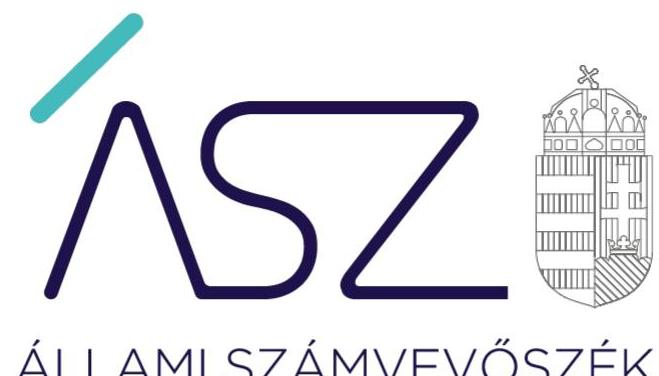

ÁLLAMI SZÁMVEVŐSZÉK

# JELENTÉS 

## Nem állami humánszolgáltatók ellenőrzése

A szociális humánszolgáltatást nyújtó intézmények, szolgáltatók államháztartáson kívüli fenntartói központi költségvetésből kapott támogatásai felhasználásának ellenőrzése kilenc gazdasági társaságnál
2021.

21002
www.asz.hu

---

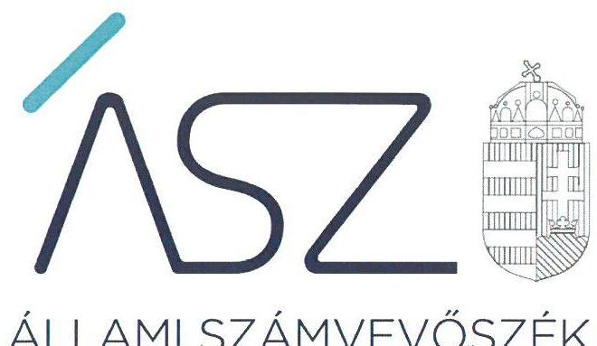

ÁLLAMI SZÁMVEVŐSZÉK

# JELENTÉS 

## Nem állami humánszolgáltatók ellenőrzése

A szociális humánszolgáltatást nyújtó intézmények, szolgáltatók államháztartáson kívüli fenntartói központi költségvetésből kapott támogatásai felhasználásának ellenőrzése kilenc gazdasági társaságnál
2021. 01. hó 13. nap

21002
www.asz.hu

---

Jelentéseink az Országgyúlés számítógépes hálózatán és az interneten a www.asz.hu címen is olvashatóak.

## AZ ELLENŐRZÉST FELÜGYELTE:

KLINGA LÁSZLÓ felügyeleti vezető
TÓTH MARIANNA felügyeleti vezető

## AZ ELLENŐRZÉST VEZETTE ÉS A VÉGREHAJTÁSÁÉRT FELELŐS:

SIPOSNÉ DÓCZI KLÁRA IBOLYA ellenőrzésvezető
DÉZSINÉ KIS HAJNALKA ellenőrzésvezető
D R. DOMOKOS MAGDOLNA ellenőrzésvezető
DR. GÁL NÓRA ellenőrzésvezető
SALAMIN VIKTOR ellenőrzésvezető
DR. SIMON JÓZSEF ellenőrzésvezető
VERTKOVCZI MÁRIA ellenőrzésvezető

## A PROGRAM ÖSSZEÁLLÍTÁSÁÉRT FELELŐS:

FEKETE-NAGY ANDRÁS GÁBOR ellenőrzési program elkészítéséért felelős vezető

IKTATÓSZÁM: EL-3051-001/2020
TÉMASZÁM: 2523
ELLENŐRZÉS-AZONOSÍTÓ SZÁM: V0867042, V0867034, V0867047, V0867036, V0867054, V0867044, V0867060, V0860732, V0867057

---

# TARTALOMJEGYZÉK 

- ÖSSZEGZÉS ..... 5
- AZ ELLENŐRZÉS CÉLJA ..... 6
- AZ ELLENŐRZÉS TERÜLETE ..... 7
- AZ ELLENŐRZÉS HÁTTERE, INDOKOLTSÁGA ..... 9
- AZ ELLENŐRZÉS LÉNYEGES KÉRDÉSKÖREI. ..... 10
- AZ ELLENŐRZÉS HATÓKÖRE ÉS MÓDSZEREI. ..... 11
- MEGÁLLAPÍTÁSOK ..... 13
- MELLÉKLETEK. ..... 15
I. sz. melléklet: Értelmező szótár ..... 15
- FÜGGELÉK: ÉSZREVÉTELEK ..... 17
- RÖVIDÍTÉSEK JEGYZÉKE ..... 29

---

.

---

# ÖSSZEGZÉS 

Az ellenőrzött kilenc szociális humánszolgáltatást nyújtó államháztartáson kívüli intézményfenntartó közül négy intézményfenntartó biztositotta a szociális humánszolgáltatási közfeladatok ellátására kapott költségvetési támogatások felhasználásának átláthatóságát, öt intézményfenntartó nem biztositotta a költségvetési támogatások elszámoltathatóságát.

## Az ellenőrzés társadalmi indokoltsága

A szociális gondoskodást igénylők védelme, a kapcsolódó feladatok ellátása az Alaptörvényben meghatározott, a társadalom szempontjából fontos tevékenységek. Jogszabályok teszik lehetővé, hogy államháztartáson kívüli szervezetek így a gazdasági társaságok által fenntartott intézmények is végezzenek szociális feladatokat. Mindehhez a központi költségvetés évente jelentős összegű támogatással járul hozzá. Az államháztartáson kívüli, humánszolgáltatást végző intézmények az igényelt közpénzekből társadalmilag ha sznos, közösségteremtő, közérdekű tevékenységet végeznek, illetve közfeladatokat látnak el.

Az intézményfenntartók ellenőrzésével az Állami Számvevőszék hozzájárul ahhoz, hogy ezen közpénzeket az államháztartáson kívüli szervezetek is ellenőrizhető, átlátható és elszámoltatható módon használják fel a közfeladatok ellátása során. Az ellenőrzések célja továbbá, hogy a nyilvánosság és az igénybevevők megfelelőtájékoztatást kapjanak az államháztartáson kívüli közfeladatot ellátók müködéséről.

Az ÁSZ ${ }^{1}$ ellenőrzései arra adnak választ, hogy az intézményfenntartók közpénz felhasználása az ÁSZáltal a szabályszerű gazdálkodáshoz meghatározott kritériumokat figyelembe véve hordoz-e kockázatot. A közfeladat ellátás szakmai céljainak megvalósításához, valamint a társadalmi közbizalom fenntartásához elengedhetetlen, hogy a fenntartók a támogatásokat szabályszerűen használják fel.

## Főbb megállapítások, következtetések

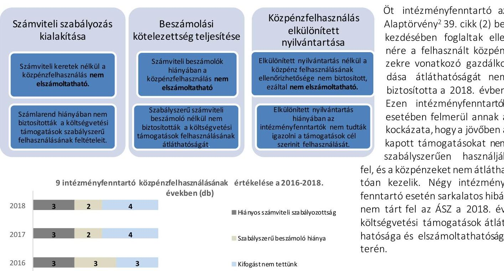

---

# AZ ELLENŐRZÉS CÉLJA

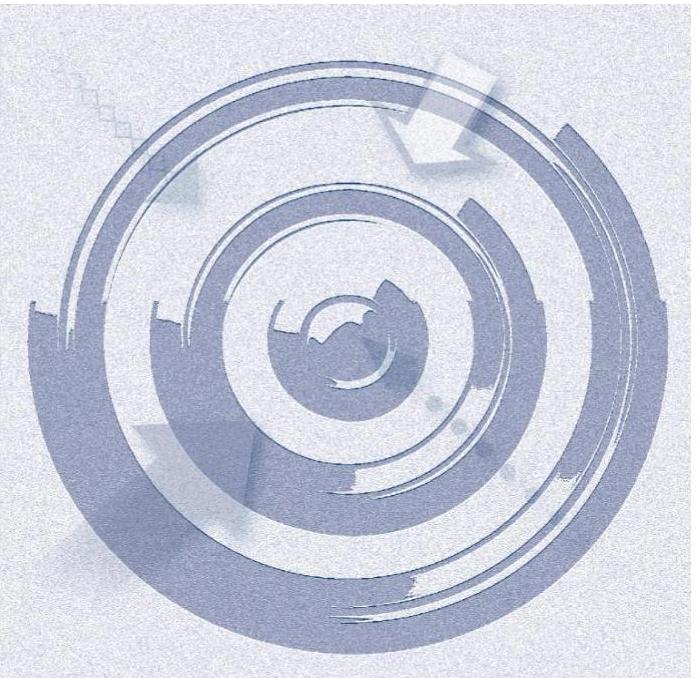

**AZ ELLENŐRZÉS CÉLJA** annak értékelése, hogy a nem állami, nem önkormányzati szociális intézmények fenntartói központi költségvetésből kapott támogatásainak felhasználása szabályszerű volt-e.

---

# Az ELLENŐRZÉS TERÜLETE 

## Szociális feladatokat ellátó intézmények nem állami nem önkormányzati fenntartói

Nem állami, nem önkormányzati szociális intézményfenntartó lehet többek között az a magyarországi székhelyű jogi személy, amely a Szoctv. ${ }^{3}$-ben és más jogszabályokban meghatározott feltételek szerint szociális szolgáltatót, illetve szociális intézményt létesít és múködtet. A szociális feladatellátáshoz kapcsolódó költségvetési támogatás iránti igényt a fenntartó nyújthatja be, egy fenntartó több intézményt is fenntarthat. Az Áht. ${ }^{4}$, az Ávr. ${ }^{5}$, és az Atr. előírásai szerint a Magyar Államkincstár a megítélt támogatásokat a fenntartó részére folyósítja.

Az államháztartáson kívüli szociális feladatokat ellátó intézmények központi költségvetésből kapott támogatásai felhasználását kilenc fenntartónál ellenőriztük. A kilenc gazdálkodó szervezet társasági formája korlátolt felelősségű társaság volt.
$\longrightarrow$ A dányi székhelyű „AKÁCFA" Időseket Gondozó és Segítő Nonprofit Közhasznú Korlátolt Felelősségű Társaság a 2016-2018 években egy nem önállóan gazdálkodó Intézményt ${ }_{1}{ }^{6}$ tartott fenn. Az Intézményben egy szociális humánszolgáltatási alapfeladatot látott el, időskorúak gondozóháza átmeneti elhelyezést nyújtó intézményi ellátását. Ezen alapfeladatra tekintettel a Fenntartó ${ }_{1}{ }^{7}$ a MÁK adatai alapján 2016. évben 54,0 M Ft, 2017. évben 59,7 M Ft, 2018. évben pedig 62,1 M Ft költségvetési támogatásban részesült.
$\longrightarrow$ A miskolci székhelyű Esélyteremtő Szociális és Egészségügyi Nonprofit Korlátolt Felelősségű Társaság a 2016-2018 években egy szociális humánszolgáltatási közfeladatát - közösségi alapellátás - melynek keretében szenvedélybetegek közösségi ellátását, pszichiátriai betegek közösségi ellátását és szenvedélybetegek alacsonyküszöbű ellátását végezte, hét nem önállóan gazdálkodó szociális Szolgáltatót ${ }_{1}{ }^{8}$ múködtetve látta el. Ezen alapfeladatra tekintettel a Fenntartó ${ }_{2}{ }^{9}$ a MÁK adatai alapján 2016. évben 81,2 M Ft, 2017. évben 88,6 M Ft, 2018. évben pedig 94,9 M Ft költségvetési támogatásban részesült.
$\longrightarrow$ A vasegerszegi székhelyű Gergye Nonprofit Közhasznú Korlátolt Felelősségű Társaság a 2016-2018 években egy nem önállóan gazdálkodó Intézményt ${ }_{2}{ }^{10}$ tartott fenn. Az Intézmény egy szociális humánszolgáltatási alapfeladatot látott el, idősek otthona á polást, gondozást nyújtó intézményi ellátását. Ezen alapfeladatra tekintettel a Fenntartó ${ }_{3}{ }^{11}$ 2016. évben 45,0 M Ft, 2017. évben 55,8 M Ft, 2018. évben pedig 60,4 M Ft költségvetési támogatásban részesült.
$\longrightarrow$ A pápai székhelyű Move Béta Rehabilitációs Ipari és Szolgáltató Nonprofit Közhasznú Korlátolt Felelősségű Társaság a 2016-2018 években egy szociális humánszolgáltatási alapfeladatát-támogató szolgálat - négy nem önállóan gazdálkodó Szociális szolgáltatón ${ }_{2}{ }^{12}$ ke-

---

resztül látta el. A Fenntartó ${ }_{4}{ }^{13}$ a feladat ellátásra a MÁK adatok alapján 2016. évben 72,0 M Ft, 2017. évben 77,4 M Ft, 2018. évben pedig 81,7 M Ft költségvetési támogatásban részesült.
A kulcsi székhelyű NAPFÉNY 2001 Szociális Szolgáltató Közhasznú Nonprofit Korlátolt Felelősségű Társaság a 2016-2018 években egy nem önállóan gazdálkodó Intézményt ${ }_{3}{ }^{14}$ tartott fenn. Az Intézmény egy szociális humánszolgáltatási alapfeladatot látott el, idősek otthona ápolást, gondozást nyújtó intézményi ellátását. Ezen alapfeladatra tekintettel a Fenntartó ${ }_{5}{ }^{15}$ a MÁK adatok alapján 2016. évben 43,4 M Ft, 2017. évben 55,7 M Ft, 2018. évben pedig 52,9 M Ft költségvetési támogatásban részesült.
A budapesti székhelyű NORMAFA 2 Idősek Otthona Közhasznú Nonprofit Korlátolt Felelősségű Társaság a 2016-2018 években egy nem önállóan gazdálkodó Intézményt ${ }_{4}{ }^{16}$ tartott fenn. Az Intézmény kettő szociális humánszolgáltatási alapfeladatot, idősek otthona ápolást, gondozást nyújtó intézményi ellátást és időskorúak gondozóháza átmeneti elhelyezést nyújtó intézményi ellátást látott el. A Fenntartó ${ }_{6}{ }^{17}$ ezen szociális közfeladatok ellátásra a MÁK adatok alapján 2016. évben 55,5 M Ft, 2017. évben 57,6 M Ft, 2018. évben pedig 59,0 M Ft költségvetési támogatásban részesült.
A penészleki székhelyű "Nyugalomsziget" Szolgáltató Nonprofit Korlátolt Felelősségű Társaság a 2016-2018 években egy nem önállóan gazdálkodó Intézményt ${ }_{5}{ }^{18}$ tartott fenn. Az Intézményben három szociális humánszolgáltatási közfeladatot, idősek otthona ápolást, gondozást nyújtó intézményi ellátást és időskorúak gondozóháza átmeneti elhelyezést nyújtó intézményi ellátást valamint házi segítségnyújtást látott el. A Fenntartó ${ }_{7}{ }^{19}$ ezen szociális közfeladatok ellátására a MÁK adatszolgáltatás alapján 2016. évben 40,2 M Ft, 2017. évben 45,6 M Ft, 2018. évben pedig 52,9 M Ft költségvetési támogatásban részesült.
Az ürömi székhelyű Platán Idősek Otthona Szolgáltató Közhasznú Nonprofit Korlátolt Felelősségű Társaság a 2016-2018 években egy nem önállóan gazdálkodó Intézményt ${ }_{6}{ }^{20}$ tartott fenn. Az Intézményben egy szociális humánszolgáltatási alapfeladatot -idősek otthona ápolást, gondozást nyújtó intézményi ellátást - látott el. Ezen alapfeladatra tekintettel a Fenntartó ${ }_{8}{ }^{21}$ a MÁK adatok alapján 2016. évben 92,7 M Ft, 2017. évben 91,1 M Ft, 2018. évben pedig 117,3 M Ft költségvetési támogatásban részesült.
A gyöngyösi székhelyű VILLA ROSA Idősek Otthona Nonprofit Közhasznú Korlátolt Felelősségű Társaság a 2016-2018 években egy nem önállóan gazdálkodó Intézményt ${ }_{7}{ }^{22}$ tartott fenn. Az Intézményben egy szociális humánszolgáltatási alapfeladatot látott el - idősek otthona ápolást, gondozást nyújtó intézményi ellátását. Ezen alapfeladatra tekintettel a Fenntartó ${ }_{9}{ }^{23}$ a MÁK adatok alapján 2016. évben 45,2 M Ft, 2017. évben 51,3 M Ft, 2018. évben pedig 49,7 M Ft költségvetési támogatásban részesült.

---

# AZ ELLENŐRZÉS HÁTTERE, INDOKOLTSÁGA 

A szociális feladatokat ellátó nem állami intézményfenntartók részére közfeladataik ellátására évente jelentős összegű pénzügyi támogatást biztosítottak a mindenkori költségvetési törvények a bennük megfogalmazott feltételek mellett. A felhasználható állami támogatások Kvtv.-ek. ${ }^{24}$ szerinti előirányzata 2016 - 2018 években a szociális ágazatra 272 Mrd Ft volt.

Az ÁSZ stratégiájában foglaltak alapján is indokolt az ellenőrzés, amely a társadalom számára jelzi, hogy a közpénz államháztartáson kívüli felhasználása sem maradhat ellenőrizetlenül. Az államháztartáson kívülre nyújtott költségvetési támogatások ellenőrzésével az ÁSZ hozzájárul ahhoz, hogy a közpénzeket a nem állami humán fenntartók átlátható módon használják fel a közfeladatok ellátására kötött szerződésekben vállalt kötelezettségek teljesítése érdekében. Az ellenőrzés javaslataival hozzájárulhat az említett rendszerek szabályszerű támogatás felhasználásához, javíthatja a társa-dalmi-gazdasági döntések megalapozottságát, amely a „jól irányított állam müködésének" feltétele.

---

# AZ ELLENŐRZÉS LÉNYEGES KÉRDÉSKÖREI 

1. A szociális humánszolgáltató közfeladatot ellátó államháztartáson kívüli fenntartó szabályszerű müködési - és gazdálkodási környezet kialakításával megteremtette-e a költségvetési támogatások átlátható, elszámoltatható igénybevételének, felhasználásának feltételeit?
2. Az államháztartáson kívüli fenntartó az átvállalt szociális humánszolgáltatási közfeladathoz biztosított költségvetési támogatásokat szabályszerűen fordította-e a humánszolgáltató intézménye/i müködtetésére?
3. Az államháztartáson kívüli fenntartó a szociális humánszolgáltató intézménye/i müködtetéséhez felhasznált közpénzekre vonatkozó gazdálkodásával a nyilvánosság előtt elszámolt-e, ennek érdekében ellenőrzési, értékelési és a külső ellenőrzésekkel kapcsolatos intézkedési feladatait szabályszerűen látta-e el?

---

# AZ ELLENŐRZÉS HATÓKÖRE ÉS MÓDSZEREI 

## Az ellenőrzés típusa

| Megfelelőségi ellenőrzés.

## Az ellenőrzött időszak

A 2016. január 1-je és 2018. december 31-e közötti időszak.

## Az ellenőrzés tárgya

Az ellenőrzés a szociális humánszolgáltatási közfeladatokat ellátó államháztartáson kívüli fenntartók humánszolgáltatási közfeladatai ellátásához a központi költségvetésből kapott támogatásaik humánszolgáltatási közfeladatokra való fenntartó általi felhasználása szabályszerűségének értékelésére terjedt ki.

## Az ellenőrzött szervezet

"AKÁCFA" Időseket Gondozó és Segítő Nonprofit Közhasznú Korlátolt Felelősségű Társaság, mint intézményfenntartó;
$\longrightarrow$ Esélyteremtő Szociális és Egészségügyi Nonprofit Korlátolt Felelősségű Társaság, mint intézményfenntartó;
$\longrightarrow$ Gergye Nonprofit Közhasznú Korlátolt Felelősségű Társaság, mint intézményfenntartó;
$\longrightarrow$ Move Béta Rehabilitációs Ipari és Szolgáltató Nonprofit Közhasznú Korlátolt Felelősségű Társaság, mint intézményfenntartó;
$\longrightarrow$ NAPFÉNY 2001 Szociális Szolgáltató Közhasznú Nonprofit Korlátolt Felelősségű Társaság, mint intézményfenntartó;
$\longrightarrow$ NORMAFA 2 Idősek Otthona Közhasznú Nonprofit Korlátolt Felelősségű Társaság, mint intézményfenntartó;
$\longrightarrow$ "Nyugalomsziget" Szolgáltató Nonprofit Korlátolt Felelősségű Társaság, mint intézményfenntartó;
$\longrightarrow$ Platán Idősek Otthona Szolgáltató Közhasznú Nonprofit Korlátolt Felelősségű Társaság, mint intézményfenntartó;
$\longrightarrow$ VILLA ROSA Idősek Otthona Nonprofit Közhasznú Korlátolt Felelősségű Társaság, mint intézményfenntartó

---

# Az ellenőrzés jogalapja 

Az ellenőrzés jogszabályi alapját az ÁSZ tv. ${ }^{25}$ 1. § (3) bekezdés, valamint az 5. § (3) bekezdésében foglalt előírások adták.

## Az ellenőrzés módszerei

Az ellenőrzést az ellenőrzési program, annak szempontjai, kérdései, az ellenőrzött időszakban hatályos jogszabályok, a nemzetközi standardokat irányadónak tekintve, az ellenőrzés szakmai szabályok és módszertanok figyelembe vételével rendelte elvégezni. A közpénzekkel való felelős gazdálkodás segítésére irányuló javaslatok kidolgozásakor a hatályos jogszabályok az irányadóak.

Az ellenőrzés ideje alatt az ellenőrzött szervezettel történő kapcsolattartást az ÁSZ SZMSZ²6-ének vonatkozó előírásai alapján biztosította az ÁSZ.

Az ellenőrzési kérdések megválaszolásához szükséges bizonyítékok megszerzése az ellenőrzött által rendelkezésre bocsátott dokumentumokra, adatokra alapozva történt.

Az ellenőrzési bizonyítékként felhasználható adatforrások közé tartoztak egyrészt a szakmai program részletes szempontjainál felsorolt adatforrások, másrészt minden - az ellenőrzés folyamán feltárt, az ellenőrzés szempontjából információt tartalmazó - dokumentum.

Az ellenőrzés lefolytatásához az ellenőrzött szervezet a kitöltött tanúsítványok, valamint az ÁSZáltal kért dokumentumok elektronikus úton való megküldésével szolgáltatott adatokat, információkat. Az így rendelkezésre bocsátott adatok, információk és a tanúsítványok adatai valódiságának kontrollja az ellenőrzés keretében történt.

A szociális humánszolgáltatások központi költségvetési támogatásaiual kapcsolatos, államháztartáson kívüli fenntartó jogszabályokban előírt feladatai betartását, továbbá a központi költségvetési támogatások szabályszerű nyilvántartását ellenőrizte az ÁSZ a fenntartónál rendelkezésre álló nyilvántartások, beszámolók és egyéb dokumentumok alapján. Az ellenőrzés nem terjedt ki a szociális humánszolgáltatások központi költségvetési támogatásai igénylése, módosítása, elszámolása valódiságának, megalapozottságának, helyességének-sem a fenntartónál, sem a székhely intézményeinél való- értékelésére. Továbbá nem terjedt ki az ellenőrzés e források szabályszerű felhasználásának értékelésére.

A kockázatelemzés alapján kiválasztott kilenc gazdasági társaság nem reprezentálja a nem állami humánszolgáltató intézményfenntartók teljes körét, a megállapítások csak az esetükben tapasztalt hibákat, hiányosságokat és szabálytalanságokat összegzik.

---

# MEGÁLLAPÍTÁSOK 

## "AKÁCFA" Időseket Gondozó és Segítő Nonprofit Közhasznú Korlátolt Felelősségű Társaság

A Fenntartó a teljeskörűségére vonatkozó nyilatkozat alapján a 20162018. években a Számv. tv. 161. § (1) bekezdésében foglaltak ellenére nem rendelkezett a képviseletére jogosult által aláírt, hatályos számlarenddel. Ezáltal nem teremtette meg a költségvetési támogatások elszámoltatható, átlátható felhasználásának szabályozási feltételeit. Számlarend hiányában a Fenntartó a számviteli beszámolóit szabályszerű könyvvezetéssel nem támasztotta alá.

## Esélyteremtő Szociális és Egészségügyi Nonprofit Korlátolt Felelősségű Társaság

A Fenntartó a 2016-2018. években a Számv. tv. 4. § (1) bekezdésében előírt beszámoló készítési kötelezettségének nem tett eleget.

## Gergye Nonprofit Közhasznú Korlátolt Felelősségű Társaság

A Fenntartó gazdálkodásának lényeges területeit - számviteli szabályozottságot, beszámolási kötelezettség teljesítését, a kapott támogatások felhasználásának szabályszerű elkülönítését - megvizsgáltuk és annak eredményeképpen kifogást nem teszünk.

## Move Béta Rehabilitációs Ipari és Szolgáltató Nonprofit Közhasznú Korlátolt Felelősségű Társaság

A Fenntartó ${ }_{4}$ gazdálkodásának lényeges területeit - számviteli szabályozottságot, beszámolási kötelezettség teljesítését, a kapott támogatások felhasználásának szabályszerű elkülönítését - megvizsgáltuk és annak eredményeképpen kifogást nem teszünk.

## NAPFÉNY2001 Szociális Szolgáltató Közhasznú Nonprofit Korlátolt Felelősségű Társaság

A Fenntartó a 2016-2018. években a Számv. tv. 161. § (1) bekezdésében foglaltak ellenére nem rendelkezett a képviseletére jogosult által aláírt, hatályos számlarenddel. Ezáltal nem teremtette meg a költségvetési támogatások elszámoltatható, átlátható felhasználásának szabályozási feltételeit.

---

Számlarend hiányában a Fenntartó a számviteli beszámolóit szabályszerű könyvvezetéssel nem támasztotta alá.

# NORMAFA 2 Idősek Otthona Közhasznú Nonprofit Korlátolt Felelősségű Társaság 

A Fenntartó a 2016-2018. években a Számv. tv. 161. § (1) bekezdésében foglaltak ellenére nem rendelkezett a képviseletére jogosult által aláirt, hatályos számlarenddel. Ezáltal nem teremtette meg a költségvetési támogatások elszámoltatható, átlátható felhasználásának szabályozási feltételeit. Számlarend hiányában a Fenntartó a számviteli beszámolóit szabályszerű könyvvezetéssel nem támasztotta alá.

## "Nyugalomsziget" Szolgáltató Nonprofit Korlátolt Felelősségű Társaság

Fenntartó a 2016-2018. években a Számv.tv. 4. § (1) bekezdésében előírt beszámoló készítési kötelezettségének nem tett eleget.

## Platán Idősek Otthona Szolgáltató Közhasznú Nonprofit Korlátolt Felelősségű Társaság

Fenntartó ${ }_{8}$ gazdálkodásának lényeges területeit - számviteli szabályozottságot, beszámolási kötelezettség teljesítését, a kapott támogatások felhasználásának szabályszerű elkülönítését - megvizsgáltuk és annak eredményeképpen a 2017-2018 évekre vonatkozóan kifogást nem teszünk.

Fenntartó a 2016. évre vonatkozóan nem tett eleget egyszerűsített éves beszámoló készítési kötelezettségének a Számv. tv. 4. § (1) bekezdésében foglaltak ellenére, mert a számviteli beszámoló nem tartalmazta a Számv. tv. 96. § (1) bekezdésében előírt kiegészítő mellékletet.

## VILLA ROSA Idősek Otthona Nonprofit Közhasznú Korlátolt Felelősségű Társaság

Fenntartó ${ }_{9}$ gazdálkodásának lényeges területeit - számviteli szabályozottságot, beszámolási kötelezettség teljesítését, a kapott támogatások felhasználásának szabályszerű elkülönítését - megvizsgáltuk és annak eredményeképpen kifogást nem teszünk.

---

# MELLÉKLETEK 

## I. SZ. MELLÉKLET: ÉRTELMEZŐ SZÓTÁR

civil szervezet
humánszolgáltatás
költségvetési támogatás
nem állami, nem önkormányzati (államháztartáson kívüli) intézményfenntartó
székhely intézmény
szociális szolgáltató
szociális intézmény
telephely

A Civil tv. 2. § 6. pontja szerint civil szervezet a civil társaság, a Magyarországon nyilvántartásba vett egyesület (a párt, a szakszervezet és a kölcsönös biztosító egyesület kivételével), a közalapítvány és a pártalapítvány kivételével az alapítvány.
Külön törvényben meghatározott szociális, gyermekjóléti, gyermekvédelmi, közoktatási, felsőoktatási, kulturális közfeladatok (2014. évi Kvtv. 34. § (1), (4) bekezdés, 1. számú melléklet XX/20/2. alcím, 19. alcím, 2015. évi Kvtv. 43. § (1), (4) bekezdés, 1. számú melléklet XX/20/2/3. jogcím csoport, 19. alcím, 2016. évi Kvtv. 41. § (1), (4) bekezdés, 1. számú melléklet XX/20/2/3. jogcím csoport, 19. alcím).
a társadalombiztosítás pénzügyi alapjai kivételével az államháztartás központi alrendszeréből ellenérték nélkül, pénzben nyújtott támogatások (Áht. ${ }^{27}$ 1. § 14. pont)
A költségvetési törvényekben (2013. évi CCXXX. törvény 33-34. §, 2014. évi C. törvény 4243. §, 2015. évi C. törvény 40-41. §) megállapított támogatás. Például a 2015. évi C. törvény 40-41. § szerint többek között: Az Országgyűlés a szociális, gyermekjóléti, gyermekvédelmi közfeladatot ellátó intézményt, szolgáltatást fenntartó egyházi jogi személy, civil szervezet, közalapítvány, országos nemzetiségi önkormányzat, települési vagy területi nemzetiségi önkormányzat, gazdasági társaság, és a humánszolgáltatást alaptevékenységként végző, az Szja tv. ${ }^{28}$ hatálya alá tartozó egyéni vállalkozó (a továbbiakban együtt: nem állami szociális fenntartó) részére támogatást állapít meg a következők szerint: a támogatás a nem állami szociális fenntartót a települési önkormányzatok 2. melléklet III. pont 3. alpont c)-k) pontjában és III. pont 5. alpont a) pontjában meghatározott támogatásával azonos jogcímeken, összegben és feltételek mellett illeti meg.
A szociális, gyermekjóléti és gyermekvédelmi közfeladatokat/humánszolgáltatásokat ellátó intézményt fenntartó egyházi jogi személy, társadalmi szervezet, alapítvány, közalapítvány, civil szervezet, országos nemzetiségi önkormányzat, nonprofit gazdasági társaság, gazdasági társaság és a humánszolgáltatást alaptevékenységként végző, Szja tv. hatálya alá tartozó egyéni vállalkozó. (2013. évi Kvtv. 35. § (1), (3) bekezdés, 2014. évi Kvtv. 33. §, 34. § (1), (4) bekezdés, 2015. évi Kvtv. 42. §, 43. § (1), (4) bekezdés, 2016. évi Kvtv. 40. §, 41. § (1), (4) bekezdés, 2017. évi Kvtv. 41. § (1), (4))
a szolgáltató székhelye, azaz a szolgáltató központi ügyintézésének helye, függetlenül attól, hogy használják-e szolgáltatás nyújtására (Sznyvhr. ${ }^{29} 1 . \S$ k) pont) (hatályos: 2013. december 1-től)
az a személy vagy szervezet, amely kizárólag a Szoc. tv. 60-65/E. §-ban meghatározott szociális alapszolgáltatásokat nyújtja. (Szoc.tv. 4. § (1) g) pont) (hatályos: 2005. január 1től)
a Szoc. tv-ben meghatározott nappali, illetve bentlakásos ellátást vagy támogatott lakhatást nyújtó szervezet; (Szoc.tv. 4. § (1) h) pont) (hatályos: 2013. január 2-től)
a szolgáltató székhelyétől különböző, szolgáltató/intézmény használatában álló hely, a szociális humánszolgáltatáshoz használt, bejegyzett hely. (Sznyvhr. 1.§ I) pont) (hatályos: 2015. január 1-től)

---

.

---

# FÜGGELÉK: ÉSZREVÉTELEK 

A jelentéstervezetet a Számvevőszék 15 napos észrevételezésre megküldte az ellenőrzött szervezet vezetőjének az ÁSZ tv. 29. §* (1) bekezdése előírásának megfelelően.

Az Esélyteremtő Szociális és Egészségügyi Nonprofit Korlátolt Felelősségű Társaság ügyvezetője, a "Nyugalomsziget" Szolgáltató Nonprofit Korlátolt Felelősségű Társaság ügyvezetője és a Platán Idősek Otthona Szolgáltató Közhasznú Nonprofit Korlátolt Felelősségű Társaság ügyvezetője a jelentéstervezet megállapításaira észrevételt tett.
A többi ellenőrzött szervezettől a jelentéstervezetre nem érkezett észrevétel.

[^0]
[^0]:    * 29. § (1) Az Állami Számvevőszék az ellenőrzési megállapításait megküldi az ellenőrzött szervezet vezetőjének vagy az általa megbízott személynek, és annak, akinek személyes felelősségét állapította meg.
    (2) Az ellenőrzött szervezet vezetője és a felelősként megjelölt személy az ellenőrzés megállapításaira tizenöt napon belül írásban észrevételt tehet.
    (3) Az Állami Számvevőszék az észrevételre a beérkezésétől számított harminc napon belül írásban válaszol. A figyelembe nem vett észrevételeket köteles a jelentésben feltüntetni, és megindokolni, hogy azokat miért nem fogadta el.

---

*Esélyteremtő Szociális és Egészségügyi Nonprofit Korlátolt Felelősségű Társaság
3525 Miskolc, Patak u. 8. 1/1.
Adószám: 23049525-1-05
Elérhetőség: 30/863-5528, eselyteremto@gmail.com*

**Állami Számvevőszék**

**Elnök**

Budapest
Apáczai Csere János utca 10.
1052

**Domokos László részére**

elnök

Hivatkozási szám: EL-2201-032/2020.
Ügyintéző: Borosné Belányi Éva Aliz
ALLAMI SZÁMVEVŐSZÉK
B6-ALG183PD2/1
Enszett: 2020 NOV 26.

Tárgy: Észrevétel az Állami Számvevőszék (a továbbiakban: ÁSZ) által lefolytatott ellenőrzés megállapításaira, illetve számvevőszéki jelentéstervezet kivonatra

Tisztelt Elnök Úr!

Alulírott Hudákné Orosz Judit ügyvezető, az Esélyteremtő Szociális és Egészségügyi Nonprofit Kft. (székhely: 3525 Miskolc, Patak u. 8. 1/1., adószám: 23049525-1-05, cégjegyzékszám: 05-09-020794, a továbbiakban: Esélyteremtő Nonprofit Kft.) képviseletében ezúton nyújtom be észrevételünket az ÁSZ által lefolytatott ellenőrzés megállapításaira, illetve számvevőszéki jelentéstervezet-kivonatra.

2020. november 16-án vettük kézhez az Elnök Úr kiadott, EL-2201-032/2020. iktatószámú, 2020. november 12-én kelt levelét, amelyben tájékoztatott bennünket, hogy a levél mellékleteként megküldött jelentéstervezet-kivonatra a kézhezvételtől számított 15 napon belül áll módunkban észrevételt tenni.

Először is szeretném megköszönni, hogy az ÁSZ ellenőrzést végző szakmai munkatársai a kialakult válsághelyzet ellenére mindig segítőkészen álltak rendelkezésünkre a felmerült kérdéseink tisztázásában, egyúttal biztosítom, hogy az Esélyteremtő Nonprofit Kft. eddig is és a jövőben is törekszik a jogszabályi előírásoknak megfelelően, az ellátottak érdekeit szem előtt tartva, szabályszerűen tevékenykedni.

A megküldött számvevőszéki jelentéstervezet-kivonat Megállapítások pontja azt tartalmazza, hogy az Esélyteremtő Nonprofit Kft. a 2016-2018. években a Számv. tv. 4. § (1) bekezdésében előírt beszámoló készítési kötelezettségének nem tett eleget.

A 2016. évtől módosultak az Igazságügyi Minisztériumnál (a továbbiakban: Minisztérium) az elektronikus közzététel szabályai. A 2015. évben még papíralapú nyomtatványon kitöltött és szkennelt, pdf formátumú dokumentumokat kellett megküldeni a közzétételhez, amelyek megjelentek az aktuális üzleti évet záró beszámoló mellékleteiként (mérleg, eredménykimutatás, közhasznúsági jelentés, kiegészítő melléklet, jegyzőkönyv taggyűlésről), azonban a 2016. évtől már a Minisztérium honlapján, elektronikus felületen kellett feltölteni a mérleget és az eredménykimutatást. Az Esélyteremtő Nonprofit Kft. részéről határidőben benyújtott és közzétett beszámolók a Minisztérium honlapján (https://e-beszamolo.im.gov.hu/oldal/beszamolo_kereses) a 2010. évig visszamenőlegesen megtekinthetők.

---

Az ellenőrzött időszakról (a 2016. január 1-je és 2018. december 31-e közötti időszak) szóló, a Minisztérium honlapjáról letöltött, hivatalosan közzétett beszámolókat mellékelten megküldöm. A beszámolók a Minisztérium Céginformációs és az Elektronikus Cégeljárásban Közremüködő Szolgálata online beszámoló-készítő programjával, az Esélyteremtő Nonprofit Kft. által megadott adatok alapján kerültek előállításra és megegyeznek az elektronikus irattárban tárolt adatokkal.
Az Esélyteremtő Nonprofit Kft. közhasznú státusza 2015-ben megszűnt, ezért az ellenőrzött időszakban a beszámoló mellékleteként közhasznúsági jelentés feltöltése már nem volt releváns.

Miskolc, 2020. november 18.

Bizva észrevételünk kedvező elbírálásában, tisztelettel:

Hudákné Orosz Judit
ügyvezető
Esélyteremtü Nonprofit Kft.
3525 Miskolc, Patak u. 8. 1/1.
Adószám: 23049525-1-05
Mellékletek: 2016. évi, általános üzleti évet záró egyszerűsített éves beszámoló 2017. évi, általános üzleti évet záró egyszerűsített éves beszámoló 2018. évi, általános üzleti évet záró egyszerűsített éves beszámoló

Készült: 2 példányban
Kapják: 1. példány: ÁSZ Elnök (1052 Budapest, Apáczai Csere János utca 10.)
2. példány: Irattár

---

# 150 éve   a közpénzek öre 

ÁLLAMI SZÁMVEVÓSZÉK

Ikt. szám: EL-2201-052/2020.

Hudákné Orosz Judit úrhölgy
ügyvezető
Esélyteremtő Szociális és Egészségügyi Nonprofit Kft.

## Miskolc

Tisztelt Ügyvezető Úrhölgy!

A „Nem állami humánszolgáltatók ellenőrzése - A szociális humánszolgáltatást nyújtó intézmények, szolgáltatók államháztartáson kívüli fenntartói központi költségvetésből kapott támogatásai felhasználásának ellenőrzése kilenc gazdasági társaságnál" címmel készített számvevőszéki jelentéstervezetre a 2020. november 18-án kelt levélben megküldött észrevételt megkaptam.

Az Állami Számvevőszék észrevételre vonatkozó álláspontjáról a felügyeleti vezető által készített részletes tájékoztatást csatoltan megküldöm.

Tájékoztatom Ügyvezető úrhölgyet, hogy a számvevőszéki jelentésben - az Állami Számvevőszékről szóló 2011. évi LXVI. törvény 29. § (3) bekezdése alapján - a figyelembe nem vett észrevételeket szerepeltetjük az elutasítás indokának feltüntetésével.

Budapest, 2020. 12. hónap 07. nap

Tisztelettel:

## 1052 Budapest, Apáczai Csere János u. 10. 1364 Budapest 4. Pf. 54.   szamvevoszek@asz.hu | www.asz.hu | www.aszhirportal.hu

---

# Tájékoztatás az észrevétel kezeléséről 

A „Nem állami humánszolgáltatók ellenőrzése - A szociális humánszolgáltatást nyújtó intézmények, szolgáltatók államháztartáson kívüli fenntartói központi költségvetésből kapott támogatásai felhasználásának ellenőrzése kilenc gazdasági társaságnál" című jelentéstervezetre (továbbiakban: jelentéstervezet) a 2020. november 18-án kelt levelében megküldött észrevételt áttekintettem. Az észrevétel kezeléséről az alábbi tájékoztatást adom.

A jelentéstervezet Megállapítások részében az Esélyteremtő Szociális és Egészségügyi Nonprofit Korlátolt Felelősségű Társaság vonatkozásában a beszámoló készítési kötelezettséggel kapcsolatban tett megállapításra tett észrevételt az Állami Számvevőszék nem veszi figyelembe.
Az Állami Számvevőszék az EL-2203-001/2019. iktatószámú, 2019. november 13-án kelt levele 2. számú mellékletének 1.5. alpontjában kérte az államháztartáson kívüli fenntartó képviseletre jogosult személy által aláírt 2016-2018. évi számviteli beszámolókat. Ügyvezető úrhölgy a 2019. november 25i keltezésű teljességi és hitelességi nyilatkozattal - amelyben az átadott dokumentumok, adatok megbízhatóságáról és teljes körűségéről nyilatkozott - az „Éves beszámoló 2016.pdf", az „Éves beszámoló 2017.pdf" és az „Éves beszámoló 2018.pdf" megnevezésű dokumentumokat bocsátotta az ellenőrzés rendelkezésére. Az Állami Számvevőszék ellenőrzési megállapításait az ellenőrzési adatbekérés során határidőben átadott, a teljességi és hitelességi nyilatkozatban feltüntetett, hiteles dokumentumok alapján tette meg.
A jelentéstervezet megállapításával érintett dokumentumok ismételt felülvizsgálata alapján megállapítottuk, hogy a 2016-2018. évi számviteli beszámolók - amelyek a 2019. november 25-i keltezésű teljességi és hitelességi nyilatkozattal az ellenőrzés rendelkezésére lettek bocsátva - nem tartalmazták a képviseletre jogosult személy aláírását.
A számvitelről szóló 2000. évi C. törvény (továbbiakban: Számv. tv.) 4. § (1) bekezdése kimondja, hogy „a gazdálkodó működéséről, vagyoni, pénzügyi és jövedelmi helyzetéről az üzleti év könyveinek zárását követően, e törvényben meghatározott könyvvezetéssel alátámasztott beszámolót köteles - magyar nyelven - készíteni", valamint a Számv. tv. 20. § (6) bekezdése szerint „Az éves beszámoló részét képező mérleget, eredménykimutatást és kiegészítő mellékletet a hely és a kelet feltüntetésével a vállalkozó képviseletére jogosult személy köteles aláíni."
Mindezek alapján az ellenőrzött szervezet vezetője nem igazolta, hogy az Esélyteremtő Szociális és Egészségügyi Nonprofit Korlátolt Felelősségű Társaság a 2016-2018. években a Számv. tv. 4. § (1) bekezdésében előírt beszámoló készítési kötelezettségének eleget tett, így a jelentéstervezet kapcsolódó megállapításának módosítása nem indokolt.

Budapest, 2020. 12. hónap 37. nap

Klinga László s.k.
felügyeleti vezető

A kiadmány hiteles

---

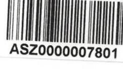

# NYUGALOMSZIGET NONPROFIT KFT 

4267 Penészlek, Táncsics u. 28.
ADÓSZÁM: 11448328-2-15

## Állami Számvevőszék

## Budapest 4

Pf: 54.
1364
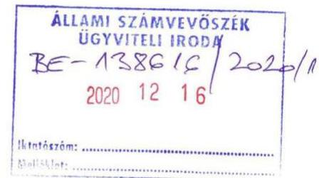

Tisztelt Cím!

Az EL-2201-040/2020 iktatószámú levelük mellékleteként megküldött jelentéstervezet-kivonatban tett megállapításukra az alábbi
észrevételt
kívánom tenni:
Társaságunk a 2016-2018. években a Számv.tv. 4 § (1) bekezdésében előírt beszámoló készítési kötelezettségének eleget tett.

A beszámoló közzététele megtörtént, ami elérhető a Céginformációs Szolgálat e-beszamolo.im.gov.hu honlapon a „keresés a közzétett beszámolók és mérlegek között „menü pont alatt cégjegyzékszám: 15-09-073160.

Csatoltan megküldöm Önök a közzétett beszámolókat 2016-2018. évekre vonatkozóan.
Kérem Önöket, hogy az ellenőrzésük lefolytatása során észrevételemet szíveskedjenek figyelembe venni.

Penészlek, 2020.12. 07.

Tisztelettel:
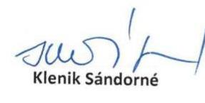

---

# 150 éve a közpénzek öre 

ÁLLAMI SZÁHVEVŐSZÉK

Ikt. szám: EL-2201-065/2020.

Klenik Sándorné úrhölgy
ügyvezető
"Nyugalomsziget" Szolgáltató Nonprofit Korlátolt Felelősségű Társaság

## Penészlek

Tisztelt Ügyvezető Úrhölgy!

A „Nem állami humánszolgáltatók ellenőrzése - A szociális humánszolgáltatást nyújtó intézmények, szolgáltatók államháztartáson kivüli fenntartói központi költségvetésből kapott támogatásai felhasználásának ellenőrzése kilenc gazdasági társaságnál" címmel készített számvevőszéki jelentéstervezetre a 2020. december 7-én kelt levélben megküldött észrevételt megkaptam.

Az Állami Számvevőszék észrevételre vonatkozó álláspontjáról a felügyeleti vezető által készített részletes tájékoztatást csatoltan megküldöm.

Tájékoztatom ügyvezető Úrhölgyet, hogy a számvevőszéki jelentésben - az Állami Számvevőszékről szóló 2011. évi LXVI. törvény 29. § (3) bekezdése alapján - a figyelembe nem vett észrevételeket szerepeltetjük az elutasítás indokának feltüntetésével.

Budapest, 2020. 12. hónap 22. nap
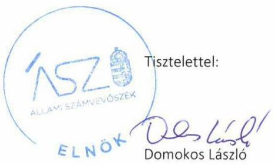

Melléklet: Tájékoztatás az észrevétel kezeléséről

---

# Tájékoztatás az észrevétel kezeléséről 

A „Nem állami humánszolgáltatók ellenőrzése - A szociális humánszolgáltatást nyújtó intézmények, szolgáltatók államháztartáson kívüli fenntartói központi költségvetésből kapott támogatásai felhasználásának ellenőrzése kilenc gazdasági társaságnál" című jelentéstervezetre (továbbiakban: jelentéstervezet) a 2020. december 7-én kelt levelében megküldött észrevételt áttekintettem. Az észrevétel kezeléséről az alábbi tájékoztatást adom.

A jelentéstervezet Megállapítások részében a "Nyugalomsziget" Szolgáltató Nonprofit Korlátolt Felelősségű Társaság vonatkozásában a beszámoló készítési kötelezettséggel kapcsolatban tett megállapításra tett észrevételt az Állami Számvevőszék nem veszi figyelembe.
Az Állami Számvevőszék az EL-2230-001/2019. iktatószámú, 2019. november 13-án kelt levele 2. számú mellékletének 1.5. alpontjában kérte az államháztartáson kívüli fenntartó képviseletre jogosult személy által aláírt 2016-2018. évi számviteli beszámolókat. Ügyvezető úrhölgy a 2020. január 10-i keltezésű teljességi és hitelességi nyilatkozattal - amelyben az átadott dokumentumok, adatok megbízhatóságáról és teljes körűségéről nyilatkozott - az „Egyszerűsített éves beszámoló_fenntartó_2016.pdf", az „Egyszerűsített éves beszámoló_fenntartó_2017.pdf" és az „Egyszerűsített éves beszámoló_fenntartó_2018.pdf" megnevezésű dokumentumokat bocsátotta az ellenőrzés rendelkezésére. Az Állami Számvevőszék ellenőrzési megállapításait az ellenőrzési adatbekérés során határidőben átadott, a teljességi és hitelességi nyilatkozatban feltüntetett, hiteles dokumentumok alapján tette meg.
A jelentéstervezet megállapításával érintett dokumentumok ismételt felülvizsgálata alapján megállapítottuk, hogy a 2016-2018. évi számviteli beszámolók - amelyek a 2020. január 10-i keltezésű teljességi és hitelességi nyilatkozattal az ellenőrzés rendelkezésére lettek bocsátva - nem tartalmazták a hely és a kelet feltüntetésével a vállalkozó képviseletére jogosult személy aláírását és a kiegészítő mellékletet.
A számvitelről szóló 2000. évi C. törvény (továbbiakban: Számv. tv.) 4. § (1) bekezdése kimondja, hogy „a gazdálkodó müködéséről, vagyoni, pénzügyi és jövedelmi helyzetéről az üzleti év könyveinek zárását követően, e törvényben meghatározott könyvvezetéssel alátámasztott beszámolót köteles - magyar nyelven - készíteni", valamint a Számv. tv. 20. § (6) bekezdése szerint „Az éves beszámoló részét képező mérleget, eredménykimutatást és kiegészítő mellékletet a hely és a kelet feltüntetésével a vállalkozó képviseletére jogosult személy köteles aláíni."
Mindezek alapján az ellenőrzött szervezet vezetője nem igazolta, hogy a "Nyugalomsziget" Szolgáltató Nonprofit Korlátolt Felelősségű Társaság a 2016-2018. években a Számv. tv. 4. § (1) bekezdésében előírt beszámoló készítési kötelezettségének eleget tett, így a jelentéstervezet kapcsolódó megállapításának módosítása nem indokolt.

Budapest, 2020. 12. hónap 22. nap

Klinga László s.k. felügyeleti vezető

A kiadmány hiteles

---

# Állami Számvevőszék 

1364 Budapest 4. Pf. 54.

Iktató szám: EL-2201/2020

Tisztelt Állami Számvevőszék!

## ASZ0000007337

Alulírott, dr. Sárváry Istvánné a Platán Idősek Otthona Szolgáltató Közhasznú Nonprofit Korlátolt Felelősségủ Társaság (2096 Üröm, Dózsa György út 30.) képviseletében a „Nem állami humánszolgáltatók ellenőrzése - A szociális humánszolgáltatást nyújtó intézmények, szolgáltatók államháztartáson kívüli fenntartói központi költségvetésből kapott támogatásai felhasználásának ellenőrzése kilenc gazdasági társaságnál" című, 2020. november 12 -én kelt, fenti iktatószám alatti számvevőszéki jelentéstervezet kivonatát köszönettel megkaptuk észrevételezés céljára.

A kivonattal kapcsolatban csupán annyi észrevételt kívánunk tenni, hogy társaságunk, mint fenntartó eleget tett 2016. év vonatkozásában a Számv. tv. 4. § (1) bekezdésében foglaltak alapján az egyszerűsített éves beszámoló készítési kötelezettségének, tekintettel arra, hogy a számviteli beszámoló tartalmazza a Számv. tv. 96. § (1) bekezdésében előírt kiegészítő mellékletet, mely az $e$ beszamolo.im.gov.hu kormányzati portálon megtekinthető, 2017. 06. 27-én 19:35:37-kor került feltöltésre. Szíves tájékoztatásul közlőm, hogy a Számvevőszék adatbekérési igényének megfelelően $1 / 5$-ös sorszám alatt az említett dokumentum elektronikusan is elküldésre került.

Üröm, 2020. november 18.

Tisztelettel:
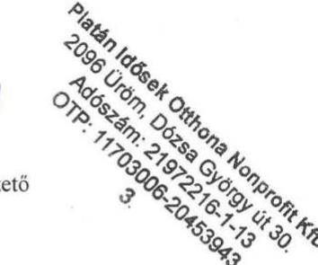

---

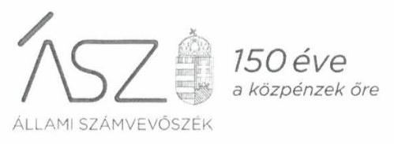

Ikt. szám: EL-2201-055/2020
dr. Sárváry Istvánné úrhölgy
ügyvezető
Platán Idősek Otthona Szolgáltató Közhasznú Nonprofit
Korlátolt Felelősségű Társaság

# Üröm 

Tisztelt Ügyvezető Úrhölgy!

A „Nem állami humánszolgáltatók ellenőrzése - A szociális humánszolgáltatást nyújtó intézmények, szolgáltatók államháztartáson kívüli fenntartói központi költségvetésből kapott támogatásai felhasználásának ellenőrzése kilenc gazdasági társaságnál" címmel készített számvevőszéki jelentéstervezetre a 2020. november 18-án kelt levélben megküldött észrevételt megkaptam.

Az Állami Számvevőszék észrevételre vonatkozó álláspontjáról a felügyeleti vezető által készített részletes tájékoztatást csatoltan megküldöm.

Tájékoztatom Ügyvezető úrhölgyet, hogy a számvevőszéki jelentésben - az Állami Számvevőszékről szóló 2011. évi LXVI. törvény 29. § (3) bekezdése alapján - a figyelembe nem vett észrevételeket szerepeltetjük az elutasítás indokának feltüntetésével.

Budapest, 2020. 12 hónap 4h. nap

Melléklet: Tájékoztatás az észrevétel kezeléséről

Tisztelettel:
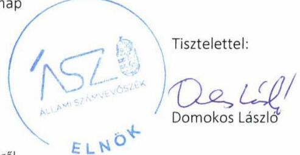

1052 Budapest, Apáczai Csere János u. 10. 1364 Budapest 4. Pf. 54.
szamvevoszek@asz.hu | www.asz.hu | www.aszhirportal.hu

---

# Tájékoztatás az észrevétel kezeléséről 

A „Nem állami humánszolgáltatók ellenőrzése - A szociális humánszolgáltatást nyújtó intézmények, szolgáltatók államháztartáson kívüli fenntartói központi költségvetésből kapott támogatásai felhasználásának ellenőrzése kilenc gazdasági társaságnál" címú jelentéstervezetre (továbbiakban: jelentéstervezet) a 2020. november 18-án kelt levelében megküldött észrevételt áttekintettem. Az észrevétel kezeléséről az alábbi tájékoztatást adom.

A jelentéstervezet Megállapítások részében a Platán Idősek Otthona Szolgáltató Közhasznú Nonprofit Korlátolt Felelősségű Társaság vonatkozásában a beszámoló készítési kötelezettséggel kapcsolatban tett megállapításra tett észrevételt az Állami Számvevőszék nem veszi figyelembe.
Az Állami Számvevőszék az EL-2203-001/2019. iktatószámú, 2019. november 13-án kelt levele 2. számú mellékletének 1.5. alpontjában kérte az államháztartáson kívüli fenntartó képviseletre jogosult személy által aláírt 2016-2018. évi számviteli beszámolókat. Ügyvezető úrhölgy a 2019. november 25-i keltezésű teljességi és hitelességi nyilatkozattal - amelyben az átadott dokumentumok, adatok megbízhatóságáról és teljes körűségéről nyilatkozott - a „01_5_2016.pdf" megnevezésű dokumentumot bocsátotta az ellenőrzés rendelkezésére. Az Állami Számvevőszék ellenőrzési megállapításait az ellenőrzési adatbekérés során határidőben átadott, a teljességi és hitelességi nyilatkozatban feltüntetett, hiteles dokumentumok alapján tette meg.
A jelentéstervezet megállapításával érintett, a hivatkozott teljességi és hitelességi nyilatkozattal az ellenőrzés rendelkezésére bocsátott dokumentum ismételt felülvizsgálata alapján megállapítottam a jelentéstervezetben tett megállapítással egyezően -, hogy a 2016. évi számviteli beszámoló nem tartalmazta a beszámoló részét képező kiegészítő mellékletet, csak a mérleget, eredmény-kimutatást, továbbá a közhasznúsági mellékletet és könyvvizsgálói jelentést.
A számvitelről szóló 2000. évi C. törvény (továbbiakban: Számv. tv.) 96. § (1) bekezdése kimondja, hogy „Az egyszerúsített éves beszámoló a (2)-(4) bekezdés szerinti mérlegből, eredménykimutatásból és kiegészítő mellékletből áll.".
Mindezek alapján Ügyvezető úrhölgy nem igazolta, hogy a Platán Idősek Otthona Szolgáltató Közhasznú Nonprofit Korlátolt Felelősségű Társaság a 2016. évben a Számv. tv. 4. § (1) bekezdésében előírt beszámoló készítési kötelezettségének eleget tett, így a jelentéstervezet kapcsolódó megállapításának módosítása nem indokolt.

Budapest, 2020. 13. hónap 14. nap
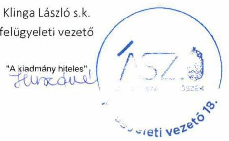

---

.

---

# RÖVIDÍTÉSEK JEGYZÉKE 

${ }^{1}$ ÁSZ
${ }^{2}$ Alaptörvény
${ }^{3}$ Szoctv.
${ }^{4}$ Áht.
${ }^{5}$ Ávr.
${ }^{6}$ Intézmény ${ }_{1}$
${ }^{7}$ Fenntartó ${ }_{1}$
${ }^{8}$ Szociális Szolgáltató ${ }_{1}$

Állami Számvevőszék
Magyarország Alaptörvénye
1993. évi III. törvény a szociális igazgatásról és szociális ellátásokról (hatályos: 1993. február 26-tól)
2011. évi CXCV. törvény az államháztartásról (hatályos: 2012. január 1-től)

368/2011. (XII. 31.) Korm. rendelet az államháztartásról szóló törvény végrehajtásáról (hatályos: 2012. január 1-től)
„Akácfa" Idősek Gondozóháza
„AKÁCFA" Időseket Gondozó és Segítő Nonprofit Közhasznú Korlátolt Felelősségű Társaság
Esélyteremtő Szociális és Egészségügyi Nonprofit Korlátolt Felelősségű Társaság szolgáltatói
szolgáltató ${ }_{1}$ HÁLÓ Szenvedélybetegek Közösségi ellátása, és 2018-tólSzenvedélybetegek alacsonyküszöbű ellátása is, Szerencs
szolgáltató ${ }_{2}$ HÁLÓ Pszichiátriai betegek Közösségi ellátása, Szerencs
szolgáltató ${ }_{3}$ KAPOCS Pszichiátriai és Szenvedélybetegek Integrált Közösségi ellátása, Bélapátfalva
szolgáltató ${ }_{4}$ VILÁGÍTÓTORONYSzenvedélybetegek Közösségi ellátása, Gönc
szolgáltató ${ }_{5}$ VILÁGÍTÓTORONY Pszichiátriai betegek Közösségi ellátása, Gönc
szolgáltató ${ }_{6}$ SAROKPONT Pszichiátriai betegek Közösségi ellátása, Tarpa
szolgáltató ${ }_{7}$ KAPOCS Szenvedélybetegek Alacsonyküszöbű ellátása, Gyöngyös
Esélyteremtő Szociális és Egészségügyi Nonprofit Korlátolt Felelősségű Társaság
Szent Miklós Idősek Otthona
Gergye Nonprofit Közhasznú Korlátolt Felelősségű Társaság
Move Béta Rehabilitációs Ipari és Szolgáltató Nonprofit Közhasznú Korlátolt Felelősségű Társaság szolgáltatói
szolgáltató ${ }_{1}$ Reménység Integrált Támogató Szolgálat Karcag
szolgáltató ${ }_{2}$ Szivárvány Támogató Szolgálat Sárbogárd
szolgáltató ${ }_{3}$ Egyenlőség Támogató Szolgálat Győr
szolgáltató ${ }_{4}$ Emberiesség Integrált Támogató Szolgálat Veszprém
Move Béta Rehabilitációs Ipari és Szolgáltató Nonprofit Közhasznú Korlátolt Felelősségű Társaság
Idősek Otthona
NAPFÉNY 2001 SzociálisSzolgáltató Közhasznú Nonprofit Korlátolt Felelősségű Társaság
NORMAFA 2 Idősek Otthona
NORMAFA 2 Idősek OtthonaKözhasznú Nonprofit Korlátolt Felelősségű Társaság
Nyugalomsziget Idősek Otthona
"Nyugalomsziget" Szolgáltató Nonprofit Korlátolt Felelősségű Társaság
Platán Idősek Otthon
Platán Idősek OtthonaSzolgáltató Közhasznú Nonprofit Korlátolt Felelősségű Társaság
VILLA ROSA Idősek Otthona
VILLA ROSA Idősek Otthona Nonprofit Közhasznú Korlátolt Felelősségű Társaság

---

${ }^{24}$ Kvtv.-ek
${ }^{25}$ ÁSZ tv.
${ }^{26}$ ÁSZ SZMSZ
${ }^{27}$ Áht.
${ }^{28}$ Szja.tv.
${ }^{29}$ Sznyvhr.
2015. évi C. törvény - Magyarország 2016. évi központi költségvetéséről, 2016. évi CX. törvény - Magyarország 2017. évi központi költségvetéséről, 2017. évi C. törvény - Magyarország 2018. évi központi költségvetéséről 2011. évi LXVI. törvény az Állami Számvevőszékről (hatályos: 2011 július 1-től)
Állami Számvevőszék Szervezeti és Múködési Szabályzata
2011. évi CXCV. törvény az államháztartásról (hatályos: 2011. december 31-től)
1995. évi CXVII. törvény a személyi jövedelemadóról (hatályos: 1996. január 1-től)
369/2013. (X. 24.) Korm. rendelet a szociális, gyermekjóléti és gyermekvédelmi szolgáltatók, intézmények és hálózatok hatósági nyilvántartásáról és ellenőrzéséről (hatályos 2013. december 1-jétől)

---

# ASZ 

ALLAMI SZAMVEVOSZEK
1052 Budapest, Apáczai Cs. J. u. 10. | 1364 Budapest 4. Pf. 54
TEL: +36 14849100
email: szamvevoszek@asz.hu
web: www.asz.hu | www.aszhirportal.hu