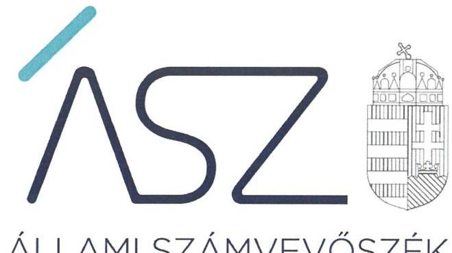
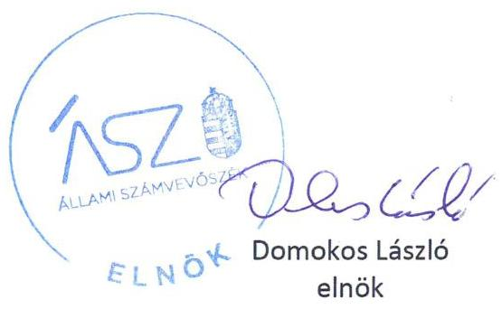

ÁLLAMI SZÁMVEVŐSZÉK

# JELENTÉS 

A Fővárosi Önkormányzatot és a kerületi önkormányzatokat osztottan megillető bevételek 2020. évi megosztásáról szóló önkormányzati rendelet felülvizsgálata

2021. 

21003
www.asz.hu

---

ÁLLAMI SZÁMVEVŐSZÉK

# JELENTÉS

A Fővárosi Önkormányzatot és a kerületi önkormányzatokat osztottan megillető bevételek 2020. évi megosztásáról szóló önkormányzati rendelet felülvizsgálata

2021. 01. hó 08. nap

21003
www.asz.hu

---

|  | AZ ELLENŐRZÉST FELÜGYELTE: |
| :--: | :--: |
|  | VARGA EDIT felügyeleti vezető |
|  | AZ ELLENŐRZÉST VEZETTE ÉS A VÉGREHAJTÁSÁÉRT FELELŐS: |
|  | RÁCZKEVI KATALIN ellenőrzésvezető |
|  | A PROGRAM ÖSSZEÁLLÍTÁSÁÉRT FELELŐS: |
|  | TERLECZKYNÉ DR. EISELE EDIT projektvezető |
|  | A TÉMÁHOZ KAPCSOLÓDÓ KORÁBBISZÁMVEVŐSZÉKI JELENTÉSEK: |
| - | - címe: A forrásmegosztás ellenőrzése - A Fővárosi Önkormányzatot és a kerületi önkormányzatokat osztottan megillető bevételek 2019. évi megosztásáról szóló önkormányzati rendelet felülvizsgálata |
|  | - sorszáma: 20011. |
| Jelentéseink az Országgyűlés számítógépes hálózatán és az interneten a www.asz.hu címen is olvashatóak. | IKTATÓSZÁM: EL-3053-001/2021. |
|  | TÉMASZÁM: 2566 |
|  | ELLENŐRZÉS-AZONOSÍTÓ SZÁM: V0910 |

---

# TARTALOMJEGYZÉK 

- ÖSSZEGZÉS ..... 5
- AZ ELLENŐRZÉS CÉLJA ..... 6
- AZ ELLENŐRZÉS TERÜLETE ..... 7
- AZ ELLENŐRZÉS HÁTTERE, INDOKOLTSÁGA ..... 8
- A JELENTÉS LÉNYEGES KÉRDÉSKÖREI. ..... 9
- AZ ELLENŐRZÉS HATÓKÖRE ÉS MÓDSZEREI. ..... 10
- MEGÁLLAPÍTÁSOK ..... 11
- MELLÉKLETEK. ..... 15
I. sz. melléklet: Értelmező szótár ..... 15
- FÜGGELÉK: ÉSZREVÉTELEK ..... 17
- RÖVIDÍTÉSEK JEGYZÉKE ..... 19

---

.

---

# ÖSSZEGZÉS 

Budapest Főváros Önkormányzata 2020. évi forrásmegosztási rendeletalkotása megalapozott, szabályozott és szabályszerű volt. A 2021. évi forrásmegosztás során korrekció érvényesítése nem indokolt.

## Az ellenőrzés társadalmi indokoltsága

Az ellenőrzés végrehajtásával a törvényalkotás számára tapasztalatok állnak rendelkezésre a forrásmegosztás szabályozásáról, a forrásmegosztási rendelet szabályszerűségéről, következtetés vonható le arra vonatkozóan, hogy indokolt-e jogszabályi módosítás kezdeményezése. Az ellenőrzés az ellenőrzött számára visszajelzést ad a forrásmegosztás végrehajtásának szabályosságáról. A társadalom számára jelzi, hogy a közpénz tervezett megosztása sem maradhat ellenőrizetlenül, az ÁSZ értékteremtő rend kialakításához és megőrzéséhez hozzájáruló tevékenysége pozitív hatással lesz a szervezetről kialakított összkép formálására.

A forrásmegosztási törvény előírása szerint, amennyiben az ÁSZ által elvégzett felülvizsgálat megállapítja, hogy a forrásmegosztás során a Fővárosi Önkormányzat vagy valamely kerületi önkormányzat jogosulatlanul forráshoz jutott vagy az őt jogszerűen megillető forrásnál alacsonyabb összegben részesült, a 2021. évi forrásmegosztás során a Fővárosi Önkormányzat korrekciót érvényesít.

A Fővárosi Önkormányzat forrásmegosztási rendelete szerint eredetileg tervezett 2020. évi adóbevételi előirányzatok nagyságára, azok időbeli teljesülésére hatást gyakoroltak a forrásmegosztási rendelet megalkotását követően kialakult veszélyhelyzet miatti gazdasági változások, valamint a kormány intézkedései.

## Főbb megállapítások, következtetések

Budapest Főváros Főpolgármesteri Hivatalában a forrásmegosztási rendelet szabályozott és szabályszerű megalkotásához és végrehajtásához szükséges belső szabályrendszert az előírások szerint kialakították. A 2020. évi forrásmegosztási rendelet megalkotása során Budapest Főváros Önkormányzata szabályszerűen, a jogszabályban és a belső szabályzatokban előírtak és a rögzített határidők figyelembevételével járt el.

A Budapest Főváros Önkormányzatát és a kerületi önkormányzatokat osztottan megillető - iparűzési adó és idegenforgalmi adó, késedelmi pótlék és bírság - bevételeket valamint a fővárosi önkormányzati helyi adóztatással kapcsolatos kiadásokat megalapozottan, a törvényben előírt részesedési arányok figyelembevételével határozták meg. A 2020. évben a megosztandó bevételek és kiadások pénzügyi elszámolása szabályszerű volt.

A 2020. évi forrásmegosztás szabályozott és szabályszerű volt, ebből adódóan a forrásmegosztási törvényben előírtak szerinti korrekció érvényesítése a 2021. évi forrásmegosztási eljárás során nem indokolt.

---

# AZ ELLENŐRZÉS CÉLJA

**AZ ELLENŐRZÉS CÉLJA** a Fővárosi Önkormányzatot és a kerületi önkormányzatokat osztottan megillető bevételek 2020. évi forrásmegosztási rendeletben előírt megosztásának, valamint a helyi adóztatással kapcsolatos kiadások megállapítása, elszámolása szabályszerűségének ellenőrzése volt.

---

# **AZ ELLENŐRZÉS TERÜLETE**

## **A Fővárosi Önkormányzat 2020. évi forrásmegosztási rendeletalkotása és annak végrehajtása**

A Fővárosi Önkormányzatot és a kerületi önkormányzatokat osztottan megillető bevételek körét és a részesedési arányokat a forrásmegosztási törvény⁴ határozza meg.

A forrásmegosztási törvény értelmében a 2020. évben a Közgyűlés⁵ által kivetett helyi adóból származó bevétel, valamint a kivetett helyi adóhoz kapcsolódóan kiszabott pótlékból és bírságból származó bevételekből a Fővárosi Önkormányzat részesedése 54 %, míg a kerületi önkormányzatok együttes részesedése 46 %. Ugyanakkor a kerületi önkormányzatok a bevételből való részesedés arányában kötelesek hozzájárulni a fővárosi önkormányzatnál a beszedéssel – a fővárosi önkormányzati adóhatóság működtetésével – összefüggően felmerült kiadásokhoz.

A helyi adókról szóló 1990. évi C. törvény 1. § (2) bekezdésének előírása szerint a helyi iparűzési adót a Fővárosi Önkormányzat, míg a főváros esetében az idegenforgalmi adót a kerületi önkormányzatok jogosultak bevezetni. A kerületi önkormányzat képviselőtestülete azonban előzetes beleegyezése alapján az idegenforgalmi adó bevezetését átengedheti a Fővárosi Önkormányzatnak. 2020. évben hat kerületi önkormányzat⁶ élt ezzel a lehetőséggel.

A forrásmegosztási rendeletben meghatározott bevételi és kiadási tervszámokat az 1. táblázat mutatja be.

|  Megosztandó bevétel/kiadás | Megosztandó forrás összege (100%) | Fővárosi részesedése (54%) | Kerületek részesedése (46%)  |
| --- | --- | --- | --- |
|  Iparűzési adó | 323 000 000 | 174 420 000 | 148 580 000  |
|  Kerületi önkormányzatok által átengedett idegenforgalmi adó | 18 000 | 9 720 | 8 280  |
|  Kivetett adókhoz kapcsolódó pótlék, bírság | 650 000 | 351 000 | 299 000  |
|  Megosztandó bevételek összesen | 323 668 000 | 174 780 720 | 148 887 280  |
|  Helyi adókhoz kapcsolódó kiadás | 314 084 | 169 605 | 144 479  |

1. táblázat: A 2020. ÉVI MEGOSZTANDÓ BEVÉTELEK ÉS KIADÁSOK TERVEZETT ÖSSZEGE (E FT)

---

# AZ ELLENŐRZÉS HÁTTERE, INDOKOLTSÁGA

A Fővárosi Önkormányzatot és a kerületi önkormányzatokat osztottan megillető bevételek körét, valamint a forrásmegosztás szabályait a fővárosi önkormányzat és a kerületi önkormányzatok közötti forrásmegosztásról szóló 2006. évi CXXXIII. törvény határozza meg. A törvény 6. § (1) bekezdésének előírása alapján a Fővárosi Önkormányzat tárgyévre vonatkozó hatályos forrásmegosztási rendeletét az ÁSZ felülvizsgálja. Ha az ÁSZ megállapítja, hogy a Fővárosi Önkormányzat vagy valamely kerületi önkormányzat jogosulatlan forráshoz jutott vagy az őt jogszerűen megillető forrásnál alacsonyabb összegben részesült, ennek mértékével a forrásmegosztási törvény alapján meghatározott, a felülvizsgálat lezárását követő évi forrásmegosztást a fővárosi önkormányzat rendeletében módosítja.

---

# A JELENTÉS LÉNYEGES KÉRDÉSKÖREI 

1.     - A Fővárosi Önkormányzat 2020. évi forrásmegosztási rendeletalkotási folyamata szabályozott és szabályszerű volt-e?
2.     - A forrásmegosztás bevételi tervszámai megalapozottak voltak-e, a forrásmegosztás szabályszerű volt-e?
3.     - A forrásmegosztásnál figyelembe vett, a Fővárosi Önkormányzati Adóhatóság működtetésével összefüggő, helyi adózással kapcsolatos kiadások megállapítása és elszámolása szabályszerű volt-e?
4. Szükséges-e korrekciót érvényesíteni a 2021. évi forrásmegosztás során?

---

# AZ ELLENŐRZÉS HATÓKÖRE ÉS MÓDSZEREI 

## Az ellenőrzés típusa

Szabályszerűségi ellenőrzés.

## Az ellenőrzött időszak

2019. szeptember 1-jétől 2020. szeptember 30-ig terjedő időszak.

## Az ellenőrzés tárgya

A Fővárosi Önkormányzatot és a kerületi önkormányzatokat osztottan megillető bevételek megosztásáról szóló 2020. évi forrásmegosztási rendelet, a helyi adóztatással kapcsolatos kiadások megállapítása, elszámolása.

## Az ellenőrzött szervezet

Budapest Főváros Önkormányzata és Budapest Főváros Főpolgármesteri Hivatal

## Az ellenőrzés jogalapja

Az ellenőrzés jogszabályi alapját az ÁSZ tv. 1. § (3) bekezdése és 3. § (1) bekezdése, valamint a forrásmegosztási törvény 6. § (1) bekezdése képezi.

## Az ellenőrzés módszerei

Az ellenőrzés szakmai módszertana az ÁSZ hivatalos honlapján (www.asz.hu) közzétett szakmai szabályokon alapul.

Az ellenőrzési kérdések megválaszolásához szükséges bizonyítékok megszerzése az ellenőrzött által rendelkezésre bocsátott dokumentumok, adatok elemzésével valósul meg, kiegészítve a megfigyelés, szemrevételezés, kérdésfeltevés (információkérés) módszerével.

Az ellenőrzés ideje alatt az ÁSZ az ellenőrzött szervezettel történő kapcsolattartást az ÁSZ SZMSZ ${ }^{7}$ vonatkozó előírásai alapján biztosítja.

---

# 1. A Fővárosi Önkormányzat 2020. évi forrásmegosztási rendeletalkotási folyamata szabályozott és szabályszerű volt-e? 

Összegző megállapítás

A Fővárosi Önkormányzat a 2020. évi forrásmegosztási rendeletalkotási folyamatát a jogszabályi előírások szerint szabályozta, a rendeletalkotás folyamata szabályszerű volt.

A Főjegyző ${ }^{8}$ a jogszabályi előírásokkal összhangban szabályozta a forrásmegosztási rendeletalkotás folyamatát, a Hivatal érintett szervezeti egységeinek rendeletalkotással kapcsolatos feladatait és hatáskörét meghatározó belső szabályzatok, munkaköri leírások elkészítésével.

A Fővárosi Önkormányzat a Htv. ${ }^{9}$ 1. § (3) bekezdésének megfelelően rendelkezett azon hat kerületi önkormányzat képviselőtestületének beleegyező nyilatkozatával, amelyek az idegenforgalmi adó bevezetését 2020. évben a Fővárosi Önkormányzatnak átengedték.

A forrásmegosztási rendeletalkotási folyamatot szabályszerűen, a forrásmegosztási törvényben, a Hivatal belső szabályzataiban, a feladattal érintett dolgozók munkaköri leírásaiban rögzített módon hajtották végre:
$\longrightarrow$ a 2020. évi forrásmegosztási rendelet a forrásmegosztási törvényben rögzített tartalmi elemekkel, a tárgyévre vonatkozóan előírta a Fővárosi Önkormányzatot és a kerületi önkormányzatokat osztottan megillető bevételek összegét és azok beszedésével összefüggően felmerült kiadások elszámolásának rendjét;
$\longrightarrow$ a Fővárosi Önkormányzat a rendelettervezetet forrásmegosztási törvényben foglaltakat betartva, 2020. január 10-ig megküldte a kerületi önkormányzatok részére véleményezésre, ezzel biztosította számukra a legalább tizenöt napot véleményezésre;
$\longrightarrow$ a Fővárosi Önkormányzat a 2020. évi forrásmegosztási rendeletet a Forrásmegosztási törvény szerinti határidőig, 2020. január 31-én hatályba léptette és szabályszerűen közzétette.
A rendeletalkotás során feladattal érintett szervezeti egységek az előírt folyamatokat, feladatokat, ellenőrzéseket a belső egyeztetéseket dokumentáltan végrehajtották.

---

# 2. A forrásmegosztás bevételi tervszámai megalapozottak voltak-e, a forrásmegosztás szabályszerű volt-e? 

Összegző megállapítás

A 2020. évi forrásmegosztás iparűzési adó, idegenforgalmi adó, valamint a helyi adóhoz kapcsolódóan kiszabott pótlék és bírság bevételi tervszámai megalapozottak voltak, a forrásmegosztás szabályszerű volt.

A 2020. évi forrásmegosztási rendeletben a Fővárosi Önkormányzat és a kerületi önkormányzatok között megosztandó helyi adó kivetéséből, és a kapcsolódó pótlék és bírság kiszabásából származó bevételi tervszámok megalapozottak voltak. A forrásmegosztási rendeletben:
$\longrightarrow$ az iparűzési adóbevételt 323 000 000 ezer Ft összegben határozták meg. A számítás során a 2019. évi túlfizetéssel korrigált, pénzügyileg teljesített adóbevételt növelték meg a 2020-ra prognosztizált 3,3\%-os GDP bővülés és 3,0\%-os infláció együttes figyelembevételével;
$\longrightarrow$ az idegenforgalmi adóbevételt 18 000 ezer Ft összegben tervezték a 2019. évi teljesített bevételek, illetve annak figyelembe vételével, hogy 2020-ban az előző évihez képest eggyel kevesebb kerület járult hozzá az idegenforgalmi adó Fővárosi Önkormányzat általi bevezetéséhez;
$\longrightarrow$ a helyi adóhoz kapcsolódóan kiszabott késedelmi pótlékból és bírságból származó bevétel 650 000 ezer Ft összegben szerepel. A tervezés során a 2019. évi teljesítési adatokkal, és a késedelmi pótlékok prognosztizálható emelkedésével alapozták meg a tervezést.
A forrásmegosztási rendeletben a Fővárosi Önkormányzat szabályszerűen, a forrásmegosztási törvény előírásaival összhangban állapította meg a Fővárosi Önkormányzatot, valamint a kerületi önkormányzatokat osztottan megillető bevételt, mely alapján a Fővárosi Önkormányzat 54\%-ban, a huszonhárom kerületi önkormányzat 46\%-ban részesült.

A kerületi önkormányzatokat egyenként megillető részesedés tervezett összegét a forrásmegosztási törvény mellékletében előírt részesedési arányok figyelembevételével határozták meg:
$\longrightarrow$ a Fővárosi Önkormányzat által kivetett iparűzési adó, valamint a helyi adókhoz kapcsolódóan kiszabott késedelmi pótlék és bírság kerületi önkormányzatokat egyenként megillető összegének kiszámítása szabályszerű volt;
$\longrightarrow$ az idegenforgalmi adó beszedését a Fővárosi Önkormányzatnak átengedő hat kerületi önkormányzatot egyenként megillető idegenforgalmi adóból származó bevételi részesedés tervezett összegének megállapítása megfelelt a forrásmegosztási törvényben
 előírtaknak.
A 2020. január 1-től 2020. szeptember 30-ig befolyt megosztandó helyi adóbevételek pénzügyi elszámolása szabályszerű volt. A Fővárosi Önkormányzat a tárgyhónapban befolyt bevételek kerületeket megillető hányadát a forrásmegosztási törvényben meghatározott arányszámok alkalmazásával állapította meg, a kerületi önkormányzatokat megillető összeget a kerületi önkormányzatok számára a jogszabályi előírás szerinti határidőn belül, a megosztás szerinti arányban, teljes összegben átutalták.

---

A forrásmegosztási tv. előírása szerint a helyi iparűzési adóbevételt és a kivetett adókhoz kapcsolódó pótlék- és bírságbevételt mind a 23 kerületi önkormányzattal, az idegenforgalmi adót a hat kerületi önkormányzattal osztották meg.

# 3. A forrásmegosztásnál figyelembe vett, a Fővárosi Önkormányzati Adóhatóság működtetésével összefüggő, helyi adózással kapcsolatos kiadások megállapítása és elszámolása szabályszerű volt-e? 

Összegző megállapítás

A forrásmegosztásnál figyelembe vett, a Főváros Önkormányzati Adóhatóság működtetésével összefüggő, a helyi adóztatással kapcsolatos kiadások megállapítása és elszámolása megalapozott volt.

A 2020. évi forrásmegosztási rendeletben meghatározott, a fővárosi és a kerületi önkormányzatokat osztottan terhelő helyi adóztatással kapcsolatos működtetési kiadások összege megalapozott volt. A Fővárosi Önkormányzati Adóhatóság működésével összefüggésben felmerülő kiadásokat számítások, elemzések, a rendelkezésre álló 2019. évi időarányos teljesülési adatok támasztották alá.

A Fővárosi Önkormányzati Adóhatóság működtetésével kapcsolatos kiadások megosztásánál:

- a forrásmegosztási törvényben előírt, a kivetett helyi adókhoz kapcsolódóan kiszabott pótlékból és bírságból származó bevétel legfeljebb 50%-ban meghatározott felső korlátot betartották;
- a helyi adókhoz kapcsolódó kiadásokból 144479 ezer Ft összeget terveztek levonni a kerületi önkormányzatoktól, amely megoszlása a forrásmegosztási törvényben szereplő arányszámok szerint történt.
A 2020. évi kiadási előleg a 2019. évi zárszámadási rendeletben $^{10}$ a helyi adók beszedéséhez kapcsolódó kiadások alapján, a forrásmegosztási törvényben meghatározott érvényesíthető mértékig, szabályszerűen került meghatározásra. Ebből a kerületi önkormányzatok felé érvényesíthető összeg 144479 ezer Ft. A 2019. évi kiadási előleg (a zárszámadási rendeletben jóváhagyott, késedelmi pótlék és bírság címén 2019. évben befolyt tényleges bevétel figyelembevételével) 146149 ezer Ft volt.

A Fővárosi Önkormányzat a 2019. év során elszámolt kiadási előleg 146149 ezer Ft és a ténylegesen elszámolható adóbeszedési kiadás 144479 ezer Ft összevetése alapján szabályszerűen állapított meg -1670 ezer Ft kiadási különbözetet.

A kiadási különbözet felosztása a kerületi önkormányzatok között szabályszerűen, a forrásmegosztási törvény mellékletében rögzített arányszámoknak megfelelően történt. A Fővárosi Önkormányzat a kiadási előleg és a 2019. évi kiadási különbözetet - a forrásmegosztási rendelet előírásainak megfelelően - a 2019. évi zárszámadási rendelet hatályba lépését követően, havi utalásban 2020. június 10-én számolta el a kerületi önkormányzatok felé.

---

# 4. Szükséges-e korrekciót érvényesíteni a 2021. évi forrásmegosztás során? 

Összegző megállapítás

Az ÁSZ ellenőrzés nem tárt fel a 2020. évi forrásmegosztást érintő eltérést, így a 2021. évi forrásmegosztás során korrekció érvényesítése nem indokolt.

A 2020. évi forrásmegosztási rendelet felülvizsgálata során az ÁSZ nem tárt fel a forrásmegosztási törvény 6. § (2) bekezdésében foglaltak szerinti jogosulatlanul igénybevett, vagy a jogszerűen megillető forrásnál alacsonyabb összegű részesedést, ebből következően a 2021. évi forrásmegosztási eljárás során korrekció nem indokolt.

---

# MELLÉKLETEK 

## I. SZ. MELLÉKLET: ÉRTELMEZŐ SZÓTÁR

Fővárosi Önkormányzat által kivetett helyi adóhoz kapcsolódóan kiszabott pótlék és bírság
helyi adóztatással kapcsolatos kiadás
idegenforgalmi adó
iparűzési adó
kiadási előleg
részesedés

A fővárost és a kerületeket osztottan illetik meg a fővárosi önkormányzat közgyűlésének rendelete alapján kivetett helyi adóhoz kapcsolódóan kiszabott pótlékból és bírságból származó bevételek. (Forrás: A forrásmegosztási törvény 2. § (2) bekezdése alapján meghatározott fogalom.)
A fővárosi önkormányzati helyi adóztatással kapcsolatos - a tárgyévre vonatkozóan a fővárosi önkormányzatot és a kerületi önkormányzatokat osztottan megillető bevételek (iparűzési adó, hat kerületnél befolyt idegenforgalmi adó, a kivetett helyi adóhoz kapcsolódóan kiszabott pótlék és bírság) beszedésével összefüggően felmerült - kiadásokat a forrásmegosztási törvény 2. § (1) bekezdés a) pontja szerinti bevételből részesülők viselik részesedésük arányában. Kiadásként a fővárosi önkormányzatnál a beszedéssel - a fővárosi önkormányzati adóhatóság működtetésével - összefüggően felmerült működtetési kiadásokat kell figyelembe venni. A forrásmegosztási törvény 2. § (1) bekezdés a) pontja és a (4) bekezdés szerint figyelembe vehető kiadásokat a (2) bekezdésben felsorolt bevételek legfeljebb 50%-áig terjedő mértékben lehet érvényesíteni. (Forrás: A forrásmegosztási törvény 2. § (2), (4), (6) bekezdése alapján meghatározott fogalom.)
A kommunális jellegű adók közül a kerület döntése alapján átengedett helyi idegenforgalmi adóból beszedett bevétel. A helyi idegenforgalmi adót a kerületi önkormányzat helyett a Fővárosi Önkormányzat rendeletével akkor jogosult bevezetni, ha ahhoz minden adóév tekintetében az érintett kerület önkormányzatának képviselő-testülete előzetes beleegyezését adja. A fővárosi önkormányzat által közvetlenül igazgatott terület tekintetében a kerületi önkormányzat által bevezethető adó bevezetésére a fővárosi önkormányzat jogosult. (Forrás: A Htv. 1. §-a és a III. fejezet Kommunális jellegű adók 2. pontja alapján meghatározott fogalom).
A Htv. felhatalmazása alapján a Fővárosi Közgyűlés rendeletével kivetett helyi adónem. A Fővárosi Önkormányzat illetékességi területén vállalkozói tevékenységet (iparűzési tevékenységet) állandó vagy ideiglenes jelleggel végző vállalkozó helyi iparűzési adót köteles fizetni. Adóköteles iparűzési tevékenységnek tekintendő e törvény alapján a vállalkozó e minőségben végzett nyereség-, illetőleg jövedelemszerzésre irányuló tevékenysége. (Forrás: A Htv. 1. § (2) bekezdése, valamint a 35. § és 36. § alapján meghatározott fogalom.)
A tárgyévet megelőző év költségvetési rendeletének végrehajtásáról szóló Fővárosi Önkormányzati rendeletben elfogadott adóbeszedéssel kapcsolatos kiadásokat kell előlegként figyelembe venni és a levonását a rendelet hatályba lépését követő havi utalásban kell a kerületi önkormányzatok felé érvényesíteni. Az előleg és a tárgyévi tényleges kiadások különbözetét a tárgyévi költségvetési rendelet végrehajtásáról szóló rendelet hatályba lépését követő havi utalásban kell elszámolni. (Forrás: A forrásmegosztási törvény 2. § (5) bekezdése alapján meghatározott fogalom.)

A forrásmegosztásba bevont bevételekből a Fővárosi Önkormányzatot és a kerületi önkormányzatokat együttesen megillető részesedés arányszáma. A Fővárosi Önkormányzatot és a kerületi önkormányzatokat a forrásmegosztási törvény 3. § alapján osztottan megillető bevételekből a Fővárosi Önkormányzatot 54 %, a kerületi önkormányzatokat együttesen 46 % részesedés illeti meg. (Forrás: A forrásmegosztási törvény 2-3. §-ai alapján meghatározott fogalom.)

---

| részesedési arányok | A kerületi önkormányzatokat megillető források egyes kerületek közötti megosztásának aránya, amelyet a forrásmegosztási törvény 1. melléklete tartalmaz. (Forrás: A forrásmegosztási törvény 4. § (1) bekezdése alapján meghatározott fogalom.) |
| :--: | :--: |
| tárgyév | Azongazdasági év, amelyhez tartozó megosztandó bevételeknek a Fővárosi Önkormányzat és a kerületi önkormányzatok közötti megosztását a forrásmegosztási rendelet határozza meg. (Forrás: A forrásmegosztási törvény 1. §-a alapján meghatározott fogalom.) |

---

# FÜGGELÉK: ÉSZREVÉTELEK 

A jelentéstervezetet a Számvevőszék 15 napos észrevételezésre megküldte az ellenőrzött szervezetek vezetőinek az ÁSZ tv. 29. § (1) bekezdése előírásának megfelelően.

Budapest Fővárosi Önkormányzat főpolgármestere és Budapest Főváros Főpolgármesteri Hivatal főjegyzője arról tájékoztatták az Állami Számvevőszék elnökét, hogy a jelentéstervezet megállapításaira nem tesznek észrevételt.

[^0]
[^0]:    * 29. § (1) Az Állami Számvevőszék az ellenőrzési megállapításait megküldi az ellenőrzött szervezet vezetőjének vagy az általa megbízott személynek, és annak, akinek személyes felelősségét állapította meg.
    (2) Az ellenőrzött szervezet vezetője és a felelősként megjelölt személy az ellenőrzés megállapításaira tizenöt napon belül írásban észrevételt tehet.
    (3) Az Állami Számvevőszék az észrevételre a beérkezésétől számított harminc napon belül írásban válaszol. A figyelembe nem vett észrevételeket köteles a jelentésben feltüntetni, és megindokolni, hogy azokat miért nem fogadta el.

---

.

---

# RÖVIDÍTÉSEK JEGYZÉKE 

$^{1}$ forrásmegosztási rendelet
$^{2}$ Fővárosi Önkormányzat
$^{3}$ kerületi önkormányzatok
$^{4}$ forrásmegosztási törvény
$^{5}$ Közgyűlés
$^{6}$ hat kerületi önkormányzat
$^{7}$ ÁSZ SZMSZ
$^{8}$ Főjegyző
$^{9}$ Htv.
$^{10}$ 2019. évi zárszámadási rendelet

Budapest Főváros Önkormányzata Közgyűlésének 3/2020. (I. 30.) önkormányzati rendelete a Fővárosi Önkormányzatot és a kerületi önkormányzatokat osztottan megillető bevételek 2020. évi megosztásáról
Budapest Főváros Önkormányzata
Budapest I-XXIII. kerületeinek önkormányzatai
2006. évi CXXXIII. törvény a fővárosi önkormányzat és a kerületi önkormányzatok közötti forrásmegosztásról (hatályos 2006. december 27-től)
Budapest Főváros Önkormányzatának Közgyűlése
Budapest XVII., Budapest XVIII, Budapest XX., Budapest XXI., Budapest XXII., Budapest XXIII. kerületeinek önkormányzatai
Állami Számvevőszék Szervezeti és Működési Szabályzata
Budapest Főváros Főpolgármesteri Hivatal Főjegyzője
1990. évi C. törvény a helyi adókról (hatályos: 1991. január 1-től)

Budapest Főváros Önkormányzata Közgyűlésének 26/2020. (VI. 5.) önkormányzati rendelete Budapest Főváros Önkormányzata 2019. évi összevont költségvetéséről szóló 8/2019. (III. 7.) önkormányzati rendelet végrehajtásáról

---

# ASZ 

ÁLLAMI SZÁMVEVŐSZÉK
1052 Budapest, Apáczai Cs. J. u. 10. | 1364 Budapest 4. Pf. 54
TEL: +36 14849100
email: szamvevoszek@asz.hu
web: www.asz.hu | www.aszhirportal.hu

