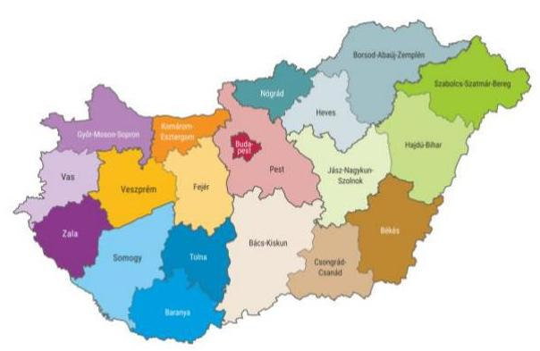
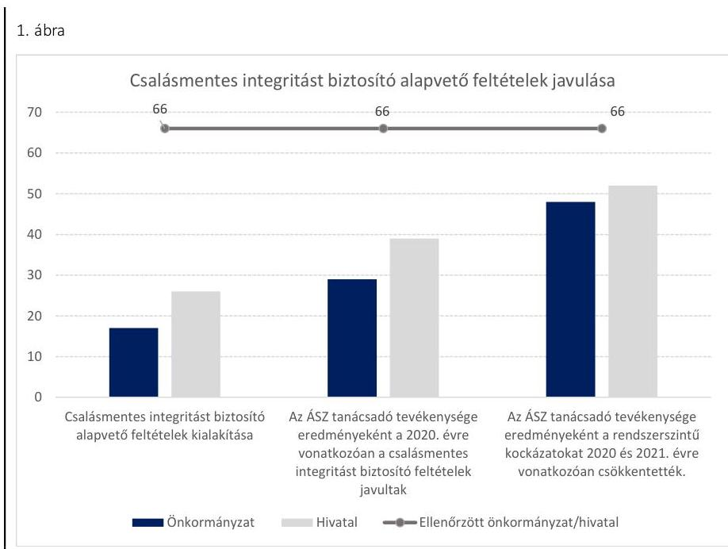
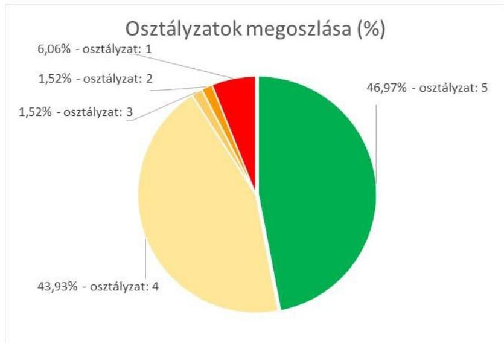

ÁLLAMI SZÁMVEVŐSZÉK

# JELENTÉS 

## Önkormányzatok ellenőrzése - Az önkormányzatok integritásának ellenőrzése

Főváros és kerületek, megyei jogú városok és megyei önkormányzatok
2021.

21004
www.asz.hu

---

ÁLLAMI SZÁMVEVŐSZÉK

# JELENTÉS 

## Önkormányzatok ellenőrzése - Az önkormányzatok integritásának ellenőrzése

Főváros és kerületek, megyei jogú városok és megyei önkormányzatok
2021. 01 hó 23 nap

21004
www.asz.hu

Domokos László
elnök

---

# AZ ELLENŐRZÉST FELÜGYELTE: 

SALAMON ILDIKÓ felügyeleti vezető

## AZ ELLENŐRZÉST VEZETTE ÉS A VÉGREHAJTÁSÁÉRT FELELŐS:

SZAPPANOS JÚLIA ellenőrzésvezető
JANIK JÓZSEF ellenőrzésvezető
KAKAS SÁNDOR ellenőrzésvezető
KISTÓTH KRISZTINA ellenőrzésvezető
RÁCZKEVI KATALIN ellenőrzésvezető

A PROGRAM ÖSSZEÁLLÍTÁSÁÉRT FELELŐS:
GÖRGÉNYI GÁBOR osztályvezető

IKTATÓSZÁM: EL-3081-021/2021
TÉMASZÁM: 2548
ELLENŐRZÉS-AZONOSÍTÓ SZÁM: V-0892

---

# TARTALOMJEGYZÉK 

■ ÖSSZEGZÉS ..... 5
■ AZ ELLENŐRZÉS CÉLJA ..... 7
■ AZ ELLENŐRZÉS TERÜLETE ..... 8
■ AZ ELLENŐRZÉS HÁTTERE, INDOKOLTSÁGA ..... 10
■ A JELENTÉS LÉNYEGES KÉRDÉSKÖREI. ..... 11
■ AZ ELLENŐRZÉS HATÓKÖRE ÉS MÓDSZEREI. ..... 12
■ ÉRTÉKELÉSEK. ..... 14
■ MELLÉKLETEK. ..... 21
I. sz. melléklet: Fogalomtár. ..... 21
II. sz. melléklet: Az ellenőrzött szervezetek felsorolása és értékelése ..... 23
III. sz. melléklet: Az önkormányzatok integritásának ellenőrzése során értékelt 26 dokumentum megnevezése ..... 24
IV. sz. melléklet: Az önkormányzatok kockázati csoportba sorolásának értékelési keretrendszere ..... 25
■ RÖVIDÍTÉSEK JEGYZÉKE ..... 27

---

.

---

# ÖSSZEGZÉS 

A fövárosi és a kerületi, megyei jogú városi, megyei önkormányzatoknál 12 elnök/polgármester, valamint 13 jegyző felelős vezetői magatartást tanúsított, az ÁSZ tanácsadása alapján már 2020-ban javította a beszámoló készités integritást biztosító lényeges feltételeinek a kiépitését.
Az ÁSZ rámutatott olyan alapvető területekre, amely alapján 7 elnök/polgármester, valamint 30 jegyző saját felelős vezetői magatartása körében előre intézkedve a csalásmentes integritási környezet kiépitése érdekében javított. 35 önkormányzat elnöke/polgármestere, valamint jegyzője részére további előrelépési lehetőséget biztosít a 2021. évre az alapvető integritási feltételek területén.
4 önkormányzatnál, illetve a gazdálkodási feladataikat ellátó hivataloknál rendszerszintü kockázatok maradtak fenn, amelyek új, részletes ellenőrzést indokolnak.

## Az ellenőrzés társadalmi indokoltsága

Az Alaptörvényben megfogalmazott alapértékek, elvek szerint minden szervezet köteles a nyilvánosság előtt elszámolni a közpénzekre vonatkozó gazdálkodásával. A közpénzeket és a nemzeti vagyont az átláthatóság és a közélet tisztaságának elve szerint kell kezelni. Az Állami Számvevőszék 2016-2018. évben végzett integritás felméréseinek eredményei rávilágítottak arra, hogy a helyi önkormányzatok a közszféra szereplői körében a kockázatosabb csoportba tartoznak.

Napjainkban kiemelt aktualitást és jelentőséget kapott a közpénzügyi helyzet javítása, az integritási szemlélet érvényesítésének erősítése. Az önkormányzatoknak fel kell készülniük arra, hogy a koronavírus okozta társadalmi és gazdasági válság növelni fogja a korrupciós nyomást.

Az Állami Számvevőszék ellenőrzése hozzájárul, hogy a helyi önkormányzatok integritási kontrolljainak kiépítettsége javuljon, ezáltal az önkormányzatok korrupciós veszélyeztetettsége csökkenjen. A járvány következtében kialakult helyzet megnövekedett feladatok elé állítja az önkormányzatokat, melyek megoldása kellő szakmai körültekintést is igényel. Szükséges minél hamarabb kialakítani az új feladatok ellátásának elszámoltatható rendjét, az erőforrások átlátható felhasználását biztosító, a visszaéléseket, a csalás lehetőségét minimálisra csökkentő belső szabályozást. Fontos, hogy az önkormányzatok tisztában legyenek az integritási kockázatokkal, azokat rendszeresen mérjék fel, és alakítsanak ki átlátható, jól szabályozott rendszereket, döntési mechanizmusokat.

Az ellenőrzés rámutathat a helyi önkormányzatok gazdálkodási tevékenységével kapcsolatos, integritást erősítő jó gyakorlatokra is, továbbá felhívhatja a figyelmet a jogszabályi követelmények teljesítéséhez szükséges lépésekre.

## Értékelés

Alapvető társadalmi elvárás, hogy az önkormányzatok múködésében érvényesüljenek az integritás alapú hivatali elvek az állampolgárok részére nyújtott szolgáltatások során. Minden állampolgárnak azonos elvek alapján, azonos elbírálás szerint kell megkapnia az önkormányzatok által nyújtott közszolgáltatásokat, és ennek érvényesülése az érintettek elégedettségi szintjében is jelentkezzen. Az integritás alapú múködés megléte vagy hiánya alapvetően befolyásolhatja az állampolgárok közigazgatásba vetett bizalmát: fennállása láthatóan erősíti, hiánya pedig nemcsak gyengíti, hanem a bizalom elvesztéshez is vezethet. Ezen elvek érvényesülése különösen fontos a társadalmi, gazdasági súlyuk következtében is kiemelt szerepet játszó megyei, megyei jogú városi, fővárosi és kerületi önkormányzatoknál.

---

17 önkormányzat és 26 hivatal tett eleget az integritási kontrollok alapvető feltételeit jelentő, a jogszabályban előírt szabályozási kötelezettségének. A szervezeti integritásnak alapvető feltétele a szabályozottság, a jogszabályokban előírt belső szabályzatok és nyilvántartások megléte, azok folyamatos, megfelelő tartalma és gyakorlati alkalmazhatósága. Az integritási kockázatok szervezeti szinten csökkenthetők azáltal, hogy kialakították a szervezeti és múködési kereteket, a gazdálkodásra vonatkozó alapvető szabályozási környezetet, valamint a kontrolltevékenységek szabályszerű gyakorlásának előfeltételeit, az integrált kockázatkezelés feltételeit.

A képviselő-testület/közgyűlés szervezeti és működési szabályzatában olyan alapvető fontosságú, az adott önkormányzat sajátosságait figyelembe vevő rendelkezéseket szükséges rögzíteni, amelyek alapfeltételei az önkormányzat integritás szerinti működésének, így többek között az önkormányzat szerveinek és felelősségi viszonyainak meghatározása, valamint a képviselők vagyonnyilatkozat-tételi rendjét felügyelő bizottság létrehozása. A szabályokat rögzítő rendelet megalkotásának 45 önkormányzatnál tettek eleget.

A pénzügyi- és a vagyongazdálkodás alapvető szabályozottsága és nyilvántartásai - a számviteli politika és a keretében kialakítandó szabályzatok, a számlarend, a gazdálkodási szabályzat, a gazdálkodási jogkörgyakorlásra jogosult személyekről és aláírás mintájukról vezetett naprakész nyilvántartás, a beszerzések lebonyolításával kapcsolatos eljárásrend - elengedhetetlen feltételei a csalásmentes szervezeti múködésnek, a közpénzek és a közvagyon integritás elvű kezelésének, valamint a számviteli beszámoló szabályszerű elkészítésének. A hivatal a számviteli politika és az annak a keretén belül elkészítendő számviteli szabályzatok elkészítésével biztosítja pénzügyi- és vagyongazdálkodása átláthatóságának és elszámoltathatóságának feltételeit, kereteit.

A szabályozások és nyilvántartások kialakításának célja nem önmagában a jogszabályi rendelkezések betartása, hanem az önkormányzat szabályozottságán keresztül a szabályszerű és csalásmentes gazdálkodás feltételeinek megteremtése, ezáltal az Alaptörvényben előírt átláthatóság és elszámoltathatóság elvének érvényesítése. Ezeknek az alapelveknek érvényesülése hozzájárulhat ahhoz, hogy az önkormányzatok felé irányuló közbizalom is erősödjön.

Az önkormányzatok és hivatalok által az ellenőrzés rendelkezésére bocsátott adatok értékelése alapján az Állami Számvevőszék két ütemben is lehetőséget biztosított a vezetők számára, hogy a feltárt hibák, hiányosságok felszámolására intézkedjenek, hozzájárulva a felelős gazdálkodás feltételeinek kialakításához, amelynek révén már 2020ban javulhat Magyarországon a közpénzügyi helyzet. Első ütemben a 40 figyelemfelhívásra 25 szervezet soron kívül intézkedett, már az ellenőrzés ideje alatt a 2020. évre vonatkozóan javította a beszámoló készítés integritást biztosító lényeges feltételeinek a kiépítését. A második ütemben a 61 figyelemfelhívásra 37 vezető tájékoztatta az ÁSZ elnökét a feltárt hiányosságok kapcsán meghozott intézkedéseiről. Az így megtett intézkedések nyomon követésében az államháztartás első védelmi vonalában lévő belső ellenőrzésnek van kiemelt szerepe.

Az integritás szempontjából lényeges dokumentumok ellenőrzésének eredménye, valamint az adatszolgáltatás és a figyelemfelhívásokra történt intézkedések kockázati értékelésének figyelembevételével az ellenőrzött önkormányzatok és a hivatalok integritási kontrolljainak színvonala átlagosan 4,2 értékű osztályzatot ért el.

# Következtetések 

Az integritás elvű működés erősítése érdekében további kockázatcsökkentő lépések szükségesek az integritás elvű vezetés-irányítás, valamint a pénzügyi- és a vagyongazdálkodás szabályszerű feltételeinek kialakítása terén, amelyeket az érintetteknek az ÁSZ további jelzése alapján lehetőségük van megtenni önmaguktól.

Azoknál a legnagyobb kockázatú önkormányzatoknál, valamint a gazdálkodási feladataikat ellátó hivataloknál, amelyeknél rendszerszintű - önmaga által nem kezelt - kockázatot azonosított az ÁSZ, új, részletekbe menő ellenőrzés válik indokolttá.

---

# AZ ELLENŐRZÉS CÉLJA 

Az ellenőrzés célja annak értékelése, hogy a helyi önkormányzatoknál és annak gazdálkodási feladatait ellátó önkormányzati hivataloknál megteremtették-e az integritás biztosításához szükséges feltételeket, kialakították-e az integritási kontrollokhoz kapcsolódó, valamint a korrupció elleni védelmet szolgáló szabályozásokat.

A monitoring típusú ellenőrzéssel, az ellenőrzöttek jelenben lévő fejlődését figyelembe véve az Állami Számvevőszék az önkormányzatok integritásának állapotát jelző szintjét értékeli. Rámutat azokra a területekre, amelyeken a felelős vezetők saját maguk képesek előrelépni oly módon, hogy az integritás érvényesüljön a napi múködésük során. Ez a cél szorosan összefügg az Állami Számvevőszékről szóló törvényben foglaltakkal, melynek legfőbb célja a közpénzügyi helyzet javulása.

Az elmúlt évek intézményi irányításában tapasztalt előrehaladás alapján, az együttmúködés bizalmára építve az Állami Számvevőszék nem intézkedési terv készítésére kötelezi az ellenőrzötteket, hanem az elköteleződésükre alapozva, tanácsadás keretében mozdítja elő a pozitív irányú közpénzügyi változásuk megvalósítását, ezzel is támogatva a jól irányított állam múködését.

---

# AZ ELLENŐRZÉS TERÜLETE 

## A fövárosi és a kerületi, megyei jogú városi, megyei önkormányzatok és a gazdálkodási feladataikat ellátó hivatalok, összesen 132 szervezet

Magyarország Alaptörvénye ${ }^{1}$ alapján az ország területe fővárosra, megyékre, városokra és községekre tagozódik. A Magyarország helyi önkormányzatairól szóló 2011. évi CLXXXIX. törvény (a továbbiakban: Mötv. ${ }^{2}$ ) rendelkezései szerint a helyi önkormányzás választópolgárok közösségét megillető joga a települések (települési önkormányzatok) és a megyék (területi önkormányzatok) szintjén valósul meg. A helyi önkormányzat jogi személy. Feladatainak ellátását a képviselő-testület és szervei (a polgármester, a képviselő-testület bizottságai, a polgármesteri hivatal, a jegyző) biztosítják.

Budapest főváros önkormányzati rendszere a fővárosi és a kerületi önkormányzatokból áll. Mind a 23 fővárosi kerületben települési önkormányzat múködik. A fővárosi önkormányzat a törvény előírásai szerint a települési és a területi önkormányzat feladat- és hatásköreit is elláthatja. Képviselő-testülete a közgyűlés, amelyet a főpolgármester képvisel. A fővárosi közgyűlés tagjai a főpolgármester, a fővárosi kerületek polgármesterei, valamint a fővárosi kompenzációs listáról mandátumot szerző kilenc képviselő. A fővárosban főpolgármesteri hivatal, a fővárosi kerületben polgármesteri hivatal múködik. A főpolgármesteri hivatalt a főjegyző, a kerületi polgármesteri hivatalt a jegyző vezeti. A fővárosi kerületi önkormányzatok gyakorolják a települési önkormányzatokat megillető valamennyi feladat- és hatáskört, amelyet törvény nem utal a fővárosi önkormányzat kizárólagos feladat- és hatáskörébe.

Mind a 19 megyei önkormányzat területi önkormányzat, amely törvényben meghatározottak szerint területfejlesztési, vidékfejlesztési, területrendezési, valamint koordinációs feladatokat lát el. A megyei önkormányzat képviselő-testülete a közgyűlés. A megyei közgyűlés megyei önkormányzati hivatalt hoz létre. A megyei közgyűlés elnökét a közgyűlés választja a megbízatásának időtartamára. A megyei közgyűlés elnöke - pályázat alapján határozatlan időre - nevezi ki a jegyzőt.

A megyei jogú városok a megyeszékhelyek és azok az ötvenezernél nagyobb lakosságszámú városok, amelyeket az Országgyűlés a képviselő-testület kérelmére ilyennek nyilvánított. A helyi önkormányzatokról szóló 1990. évi LXV. törvény alapján a megyei jogú várossá nyilvánítást kérhette minden olyan város, amelynek lakossága meghaladta az 50000 főt. 2006. július 11. óta Magyarországon 23 megyei jogú város van, a 18 megyeszékhely mellett további öt város: Dunaújváros, Érd, Hódmezővásárhely, Nagykanizsa és Sopron. Budapest Pest megye székhelye, egyben az ország fővárosa, nem tartozik a megyei jogú városok közé.

Jelen ellenőrzés 66 önkormányzatot, továbbá 66, az önkormányzatok gazdálkodási feladatait ellátó hivatalt érintett. Az ellenőrzés az elnök/polgármester és a jegyző felelősségi körébe tartozó szabályozási környezetre,

---

a főbb integritási kontrollok kiépítettségére terjed ki. Nem terjed ki az önkormányzat által alapított intézményekre, gazdasági társaságokra, alapítványokra, valamint az önkormányzati társulásokra.

---

# AZ ELLENŐRZÉS HÁTTERE, INDOKOLTSÁGA 

Az Alaptörvény alapértékeket, elveket fogalmaz meg, amely szerint a közpénzekkel gazdálkodó minden szervezet köteles a nyilvánosság előtt elszámolni a közpénzekre vonatkozó gazdálkodásával. A közpénzeket és a nemzeti vagyont az átláthatóság és a közélet tisztaságának elve szerint kell kezelni.

Az ÁSZ² 2016-2018. évben végzett integritás felméréseinek eredményei azt mutatták, hogy a helyi önkormányzatok a közszféra szereplői körében a kockázatosabb csoportba tartoznak. A kisebb népességszámú települések önkormányzatai különösen veszélyeztetettek, mert kontrollkörnyezetük, integritási infrastruktúrájuk - a felmérés eredményei alapján - kevésbé kiépített.

Az ÁSZ célja, hogy új ellenőrzési megközelítést alkalmazva támogassa a közpénzügyi helyzet javítását; a monitoring típusú ellenőrzéssel helyzetképet adjon az önkormányzati alrendszer egészében az integritási szemlélet érvényesítéséről, rávilágítson az integritási kontrollok kiépítettségére, illetve további fejlesztésére. Napjainkban mindez kiemelt fontosságúvá vált. Az önkormányzatoknak fel kell készülnie arra, hogy a koronavírus okozta társadalmi és gazdasági válság növelni fogja a korrupciós nyomást, amelyre felmérésünk és ellenőrzéseink alapján az önkormányzatok nincsenek megfelelően felkészülve. Az ÁSZebben a helyzetben is alapvető kötelességének tartja, hogy a közpénzek őre legyen, és ellenőrzéseit az önkormányzatok körében is folytassa.

Az ÁSZ ellenőrzése hozzájárul, hogy a helyi önkormányzatok integritási kontrolljainak kiépítettsége javuljon, ezáltal az önkormányzatok integritási veszélyeztetettsége csökkenjen. A járvány következtében kialakult helyzet megnövekedett feladatok elé állítja az önkormányzatokat, melyek megoldása kellő szakmai körültekintést is igényel. Szükséges minél hamarább kialakítani az új feladatok ellátásának elszámoltatható rendjét, az erőforrások átlátható, a visszaéléseket, a csalás lehetőségét minimálisra szorító belső szabályozását. Fontos, hogy az önkormányzatok tisztában legyenek az integritás kockázatokkal, azokat ismételten mérjék fel, és alakítsanak ki átlátható, jól szabályozott rendszereket, döntési mechanizmusokat.

Az ellenőrzés rámutat a helyi önkormányzatok gazdálkodási tevékenységével kapcsolatos integritási jó gyakorlatokra is, továbbá felhívja a figyelmet a jogszabályi követelmények teljesítéséhez szükséges lépésekre is.

---

# A JELENTÉS LÉNYEGES KÉRDÉSKÖREI 

1. Megteremtette-e az önkormányzat elnöke/polgármestere és
jegyzöje a csalásmentes integritást biztositó alapvetőfeltételeket?
2. Kialakította-e a hivatal jegyzője a beszámoló szabályszerű el-
készitését, valamint a csalásmentes integritást biztositó alap-
vető feltételeket?
3. Éltek-e a lehetőséggel, hogy csökkentsék a rendszerszintü koc-
kázatokat?
4. Milyen kockázatot hordoz az ellenőrzött szervezet fennálló
integritása?

---

# AZ ELLENŐRZÉS HATÓKÖRE ÉS MÓDSZEREI 

## Az ellenőrzés típusa

| Megfelelőségi ellenőrzés.

## Az ellenőrzött időszak

Az ellenőrzött időszak a 2020. év.

## Az ellenőrzés tárgya

A szervezeti keretekkel, a múködéssel és gazdálkodással kapcsolatos szabályzatok, szabályozások, valamint a szervezeti elvekkel, értékekkel összefüggő integritás kontrollok kiépítettsége.

## Az ellenőrzött szervezet

A fővárosi és a kerületi, megyei jogú városi, megyei önkormányzatok és a gazdálkodási feladataikat ellátó hivatalok, a II. sz. melléklet szerint

## Az ellenőrzés jogalapja

Az ellenőrzés jogalapját az ÁSZ tv4. 1. § (3) bekezdése képezte.

## Az ellenőrzés módszerei

Az ellenőrzést az ellenőrzési program szempontjai, az ellenőrzött időszakban hatályos jogszabályok, a jelen ellenőrzésre irányadó ÁSZ módszertan figyelembevételével végezte az ÁSZ.

Az ellenőrzés ideje alatt az ellenőrzött szervezettel történő kapcsolattartást az ÁSZ az ÁSZ SZMSZ5-ének vonatkozó előírásai alapján biztosította.

Az ellenőrzési kérdések megválaszolásához szükséges bizonyítékok megszerzése a következő ellenőrzési eljárások alkalmazásával történt: megfigyelés, összehasonlítás, elemző eljárás. Az ellenőrzési bizonyítékként felhasználható adatforrások közé tartoztak az ellenőrzési programban felsorolt adatforrások, továbbá minden - az ellenőrzés folyamán - feltárt, az ellenőrzés szempontjából információkat tartalmazó dokumentum.

---

Az ellenőrzést a kérdésekre adott válaszok kiértékelésével, valamint a megjelölt adatforrások, továbbá az adott időszakban hatályos jogszabályok, valamint az ÁSZ honlapján közzétett helyénvalósági kritériumok figyelembe vételével folytatta le az ÁSZ.

A jogszabályok által kötelezően elő nem írt, helyénvalósági kritériumokra vonatkozó követelményeket az ÁSZ nemzetközi sztenderdekben, hazai iránymutatásokban, módszertani útmutatókban szereplő „jó gyakorlatok" beazonosításával, integritási felmérésével, öntesztekkel alapozta meg. Az erre vonatkozó értékelések a jelentésben dőlt betűvel szerepelnek.

A szabályszerűségi és a helyénvalósági kritériumok viszonyát a jogszabályi előírások elsődlegessége határozza meg. A helyénvalósági kritériumok a jogszabályi előírások betartása esetén a szabályszerűségi kritériumok hatását erősítik, ellenkező esetben nem érvényesülnek.

A monitoring típusú ellenőrzés a helyi önkormányzatok integritás alapú működésének lényeges területeire fókuszált, és a lényeges dokumentumok kritikus területeinek ellenőrzésével lehetőséget biztosított a helyi önkormányzatok integritásának értékelésére. A monitoring típusú ellenőrzés emellett már az ellenőrzés folyamatában az ÁSZ figyelemfelhívásán keresztül önmaga általi előrelépési lehetőséget biztosított az integritási kockázatok csökkentésére.

A közpénzügyek átláthatóságának, rendezettségének megteremtése, a közpénzügyi helyzet mielőbbi javulása érdekében az ÁSZ három szintű tanácsadással segítette az ellenőrzött szervezeteket a csalásmentes integritást biztosító alapvető feltételek megteremtésében.

Az ellenőrzés indítását megelőzően felhívta valamennyi önkormányzat és hivatal vezetőjének figyelmét az integritás szempontjából lényeges dokumentumokra, azok ellenőrzésére.

Az ellenőrzés során a beszámoló szabályszerű elkészítését biztosító kontrollkörnyezet kialakítása, valamint a csalásmentes integritási környezet megteremtése szempontjából lényeges dokumentumok rendelkezésre állásának, továbbá azok tartalmának integritás szempontjából fontos területei értékelésére került sor. A monitoring típusú ellenőrzés már az ellenőrzés időszakában visszajelzést adott azon dokumentumokról, amelyeknek javítása még hozzájárul a 2020. évi beszámoló megalapozottságának javításához. A további dokumentumok értékelésének alapján a 2021. évre tehetők meg a szervezet jogszabályoknak megfelelő, integritás alapú működését segítő intézkedések.

Az integritás szempontjából lényeges vezetési, pénzügyi és gazdálkodási területek értékelésének eredménye, valamint az adatszolgáltatás és a figyelemfelhívásokra történt intézkedések kockázati értékelésének figyelembevételével került sor az önkormányzatok és a hivatalok integritási színvonalának együttes osztályozására. Ennek módját a III. és IV. sz. mellékletben foglalt értékelési keretrendszer tartalmazza.

---

# 1. Megteremtette-e azönkormányzat elnöke/polgármestere és jegyzője a csalásmentes integritást biztosító alapvető feltételeket? 

Összegző értékelés

1.1. számú értékelés
1.2. számú értékelés

17 önkormányzat elnöke/polgármestere és jegyzője kialakította a csalásmentes integritást biztosító alapvető feltételeket.

45 önkormányzat elnöke/polgármestere biztosította a szervezeti integritás, müködés és vezetés alapvető szabályozási feltételeit.

45 képviselő-testület/közgyűlés Szervezeti és Müködési Szabályzatról szóló rendelete nem hordozott integritási kockázatot.

A szervezeti és müködési szabályzat határozza meg az adott szervezet müködésének részletes szabályait, és felelősségi viszonyait, ezáltal valósul meg a szervezet belső kontrollrendszerének szabályszerű kialakítása és müködtetése. A szabályzat biztosítja továbbá az átlátható és elszámoltatható müködés alapfeltételeit, a felelősségi és feladat-ellátási viszonyokat. A szervezeti és müködési szabályzattal rendelkező szervezet a korrupciós kockázatokat rendszerszinten képes kezelni.

A képviselő-testületi/közgyülési szervezeti és müködési szabályzattal rendelkező 8 önkormányzat vezetője a jogszabályi előírásokon túl további erőfeszítéseket is tett az integritás erősítése érdekében, mivel kialakította az integritás lágy kontrolljait, vagyis felismerte a jogszabályokban előírt, kötelező kontrollokon túl, további integritási kontrollok megerősítésének indokoltságát, amely hozzájárul a szervezet korrupcióval szembeni védettségének javításához.

A képviselő-testületi/közgyülési szervezeti és müködési szabályzattal nem rendelkező 6 önkormányzat vezetője szintén épített ki a korrupció ellen ható lágy kontrollokat, amelyek érdemi szerepüket a jogszabályi előírásoknak megfelelő szabályozási keretek kialakítását követően tudják betölteni.

32 önkormányzat elnöke/polgármestere és jegyzője biztosította a pénzgazdálkodáshoz kapcsolódó alapvető szabályozási feltételeket.

39 önkormányzat elnöke/polgármestere és jegyzője rendelkezett a számviteli szabályozás pénzgazdálkodás területét érintő alapvető dokumentumairól.

A számviteli alapdokumentumok megléte a szabályszerű könyvvezetés és elszámolás alapvető feltétele. A számviteli politika, valamint a számlarend kialakítása biztosítja a számviteli beszámoló szabályszerű elkészítését, amely hozzájárul a korrupcióval szembeni védettség erősítéséhez.

---

48 önkormányzat jegyzője rendelkezett a gazdálkodási kontrolltevékenységek lényeges dokumentumairól.

A gazdálkodási szabályzat, illetve a gazdálkodási jogkörgyakorlásra jogosult személyekről és aláírás mintájukról vezetett naprakész nyilvántartás elkészítése és vezetése által biztosítható a központi költségvetésből kapott támogatások átlátható és elszámoltatható igénybevétele és felhasználása. A szabályzatok megléte alkalmas a szervezet korrupcióval szembeni védettségének növelésére.

# 1.3. számú értékelés 

35 önkormányzat jegyzője biztosította a vagyongazdálkodáshoz kapcsolódó alapvető szabályozási feltételeket.

55 önkormányzat jegyzője rendelkezett az eszközök és a források leltárkészítési és leltározási szabályzatáról, 55 önkormányzat jegyzője az eszközök és a források értékelési szabályzatáról, valamint 44 önkormányzat jegyzője a beszerzések lebonyolításával kapcsolatos eljárásrendről.

A szabályzatok alapozzák meg a vagyon védelmét szolgáló, egységes elvek mentén történő értékelést és számbavételt, biztosítva az éves beszámolók valódiságát. Az elszámolások szabályozatlansága a korrupciós kockázatot jelent. Az eszközök és a források leltárkészítési és leltározási szabályzatban foglaltak alkalmazásával biztosítható a tulajdon védelme, továbbá, hogy a könyvviteli mérleg a tényleges helyzetnek megfelelő valós képet mutassa a vagyoni, pénzügyi helyzetről.

Az eszközök és a források értékelési szabályzatának célja az eszközök és források értékelésére vonatkozó számviteli döntések, értékelési módok, eljárások összefoglalása. Meghatározza a számviteli politika keretében hozott döntések gyakorlati végrehajtását, amely kihatással van a vagyon szabályszerű megőrzésére, gyarapítására.

A beszerzések lebonyolításával kapcsolatos eljárásrend által biztosítható az önkormányzat tevékenységének átláthatósága, a közbeszerzési értékhatár alatti beszerzések transzparenciája.

## 2. Kialakította-e a hivatal jegyzője a beszámoló szabályszerű elkészítését, valamint a csalásmentes integritást biztosító alapvető feltételeket?

Összegző értékelés
26 hivatal jegyzője kialakította a beszámoló szabályszerű elkészítését, valamint a csalásmentes integritást biztosító alapvető feltételeket.
2.1. számú értékelés

33 hivatal jegyzője biztosította a szervezeti integritás, múködés és vezetés alapvető szabályozási feltételeit.

54 hivatal rendelkezett Szervezeti és Múködési Szabályzattal.
A szervezeti és múködési szabályzat határozza meg a hivatal múködésének alapvető kereteit, és felelősségi viszonyait, ezáltal valósul meg a hivatal belső kontrollrendszerének szabályszerű kialakítása és múködtetése. A szabályzat biztosítja továbbá az átlátható és elszámoltatható múködés alapfeltételeit, a felelősségi és feladat-ellátási viszonyokat. A szervezeti és

---

működési szabályzattal rendelkező szervezet a korrupciós kockázatokat rendszerszinten képes kezelni.

56 hivatal jegyzője rendelkezett a vagyonnyilatkozat átadására, nyilvántartására, a vagyonnyilatkozatban foglalt személyes adatok védelmére vonatkozó további szabályokról. A vagyonnyilatkozatban foglalt személyes adatok védelmére vonatkozó további szabályok megállapítása hozzájárul a közélet tisztaságának biztosításához és a korrupció megelőzéséhez.

57 hivatal jegyzője elkészítette vezetői nyilatkozatát a belső kontrollrendszer minőségéről a 2019. évre vonatkozóan. A nyilatkozatban történik meg a belső kontrollrendszer minőségének éves értékelése, amely alapján megismerhető az integritás alapú múködéshez szükséges szabályozottság aktuális állapota és a lehetséges integritási kockázatok. A dokumentum tartalmának ismeretében lehetőség nyílik a kockázatok csökkentésére teendő intézkedések kidolgozására, a korrupcióelleni védelem erősítésére.

61 hivatal jegyzője elkészítette a szervezeti integritást sértő események kezelésének eljárásrendjét.

58 hivatal jegyzője rendelkezett az integrált kockázatkezelés eljárásrendjéről.

A kialakított szabályzatok csökkentik a korrupciós kockázatokat, ezáltal növelve a hivatal szervezetén belüli és kifelé irányuló tevékenységének átláthatóságát, a korrupció elleni védettségre irányuló szabályozás biztosítását.

A szervezeti integritás, múködés és vezetés alapvető dokumentumaival rendelkező hivatalok közül 29 hivatal jegyzője a jogszabályi előírásokon túl további erőfeszítéseket is tett az integritás erősítése érdekében, mivel kialakította az integritás lágy kontrolljait, vagyis felismerte a jogszabályokban előírt, kötelező kontrollokon túl, további szabályozók indokoltságát, amely hozzájárul a szervezet korrupcióval szembeni védettségének javításához.

A szervezeti integritás, múködés és vezetés alapvető dokumentumainak teljes körével nem rendelkező hivatalok közül 5 hivatal jegyzője szintén épített ki a korrupció ellen ható lágy kontrollokat, amelyek érdemi szerepüket a jogszabályi előírásoknak megfelelő szabályozási keretek kialakítását követően tudják betölteni.

# 2.2. számú értékelés 

57 hivatal jegyzője biztosította a pénzgazdálkodáshoz kapcsolódó alapvető szabályozási feltételeket.

57 hivatal jegyzője rendelkezett a számviteli szabályozás pénzgazdálkodás területét érintő alapvető dokumentumairól.

A számviteli alapdokumentumok megléte a szabályszerű könyvvezetés és elszámolás alapvető feltétele. A számviteli politika, a pénzkezelési szabályzat, valamint a számlarend kialakítása biztosítja a számviteli beszámoló szabályszerű elkészítését, amely hozzájárul a korrupcióval szembeni védettség erősítéséhez.

58 hivatal jegyzője rendelkezett a gazdálkodási kontrolltevékenységek lényeges dokumentumairól.

A gazdálkodási szabályzat, illetve a gazdálkodási jogkörgyakorlásra jogosult személyekről és aláírás mintájukról vezetett naprakész nyilvántartás

---

# 2.3. számú értékelés 

elkészítése és vezetése által biztosítható a központi költségvetésből kapott támogatások átlátható és elszámoltatható igénybevétele és felhasználása. A szabályzatok megléte alkalmas a szervezet korrupcióval szembeni védettségének növelésére.

52 hivatal jegyzője biztosította a vagyongazdálkodáshoz kapcsolódó alapvető szabályozási feltételeket.

64 hivatal jegyzője rendelkezett az eszközök és a források leltárkészítési és leltározási szabályzatáról, 63 hivatal jegyzője az eszközök és a források értékelési szabályzatáról, illetve 63 hivatal jegyzője a beszerzések lebonyolításával kapcsolatos eljárásrendről.

A szabályzatok alapozzák meg a vagyon védelmét szolgáló, egységes elvek mentén történő értékelést és számbavételt, biztosítva az éves beszámolók valódiságát. Az elszámolások szabályozatlansága a korrupciós kockázatot jelent. Az eszközök és a források leltárkészítési és leltározási szabályzatban foglaltak alkalmazásával biztosítható a tulajdon védelme, továbbá, hogy a könyvviteli mérleg a tényleges helyzetnek megfelelő valós képet mutassa a vagyoni, pénzügyi helyzetről.

Az eszközök és a források értékelési szabályzatának célja az eszközök és források értékelésére vonatkozó számviteli döntések, értékelési módok, eljárások összefoglalása. Meghatározza a számviteli politika keretében hozott döntések gyakorlati végrehajtását, amely kihatással van a vagyon szabályszerű megőrzésére, gyarapítására.

A beszerzések lebonyolításával kapcsolatos eljárásrend által biztosítható az önkormányzat tevékenységének átláthatósága, a köz beszerzési értékhatár alatti beszerzések transzparenciája.

## 3. Éltek-e a lehetőséggel, hogy csökkentsék a rendszerszintú kockázatokat?

## Összegző értékelés

Az ÁSZ által tett figyelemfelhívásokra 17 elnök/polgármester és 35 jegyző intézkedett és járult hozzá az ellenőrzés által feltárt hibák, hiányosságok felszámolásához.

Az ellenőrzöttek gazdasági súlyára, fontosságára tekintettel az ÁSZ ellenőrzés két alkalommal biztosított lehetőséget a feltárt hiányosságokra történő intézkedésre.

Az ellenőrzött szervezetek vezetőinek megküldött figyelemfelhívásokban az önkormányzat/hivatal szabályozottságával kapcsolatban megállapításokat fogalmazott meg az ÁSZ. Az ellenőrzöttek javítási lehetőséget kaptak, amelynek keretében már az ellenőrzés időszakában javított dokumentumokat küldött meg az elnök/polgármester, valamint a jegyző.

Figyelemmel az ÁSZ ellenőrzés hasznosítására mindezek vonatkozásában a következő dokumentumok esetében történt intézkedés, ezáltal a 2020. év tekintetében elkészített dokumentumok rendelkezésre állásával az integritás területe további garanciális elemmel bővült, hozzájárulva továbbá a 2020. évi beszámoló megalapozottságának javulásához.

---

A fennálló hiányosságok kijavítására tett intézkedéseket 12 elnök/polgármester és 13 jegyző dokumentummal támasztotta alá.

1. táblázat A figyelemfelhívásokra érkezett válaszok értékelése

| Érintett szervezet / hiányzó szabályozás | Figyelemfelhívás   (db) | Dokumentumokkal javí-   tett |
| :-- | :--: | :--: |
| Önkormányzat / SZMSZ | 21 | 12 |
| Hivatal / számviteli politika (vagy tar-   talmi kérdése) | 4 | 2 |
| Hivatal / leltározási szabályzat tartalmi   kérdése | 1 | 1 |
| Hivatal / értékelési szabályzat | 1 | 1 |
| Hivatal / számlarend (vagy tartalmi kér-   dése) | 2 | 1 |
| Hivatal/szervezeti integritást sértő ese-   mények kezelésének eljárásrendje | 6 | 3 |
| Hivatal / vagyonnyilatkozat átadására,   nyilvántartására vonatkozó szabályozás | 3 | 3 |
| Hivatal / beszerzési szabályzat | 7 | 5 |

Formás: ÁSZ rendelkezésére bocsátott dokumentumok
Az ellenőrzés második ütemében a csalásmentes integritási környezet megteremtése szempontjából további lényeges területeket értékeltünk. 61 figyelemfelhívás kiküldésére került sor, amelyből 18 az elnököknek/polgármestereknek, 43 pedig a jegyzőknek tartalmazott - az önkormányzatokat és a hivatalokat érintően fennálló szabálytalanságokról figyelemfelhívást, amelyben foglaltakra további intézkedésekkel vállalhatták szervezetük integritásának javítását. A jelzett hiányosságokra - az alábbiak szerint - a vezetők intézkedési terveket fogalmaztak meg, így a 2021. év tekintetében az önkormányzatok integritási veszélyeztetettsége tovább csökkenhet.
2. táblázat A 2. ütemben megküldött figyelemfelhívásokra érkezett válaszok értékelése

| Érintett vezető | Figyelemfelhívás   (db) | Intézkedésekkel javított |
| :-- | :--: | :--: |
| Elnök/polgármester | 18 | 7 |
| Jegyző | 43 | 30 |

Formás: ÁSZ rendelkezésére bocsátott dokumentumok
7 elnök/polgármester intézkedett az önkormányzatok vonatkozásában fennálló szabálytalanság megszüntetéséről. 30 jegyző intézkedett az önkormányzat, illetve a hivatalok vonatokozásában. Ezekkel a felelős intézkedésekkel már a 2021. évre hozzájárulnak a csalásmentes integritást biztosító feltételek további garanciális elemeinek kialakításához (1. ábra).

---

Mind a 2020. évben megtett, mind a 2021. évben előkészített intézkedések csökkentik az integritási kockázatokat, azonban továbbra is folytatniuk kell a csalásmentes integritás erősítése érdekében meghozott intézkedéseket, amelyek fenntartása a felelős vezetői magatartás része.

# 4. Milyen kockázatot hordozaz ellenőrzött szervezet fennálló integritása? 

## Összegző értékelés

Az ÁSZ tanácsadó tevékenységének eredményeként intézkedő szervezetek csökkentették a korrupciós kockázataikat. 4 ellenőrzöttnél további ellenőrzés indokolt az integritási kockázatok csökkentésének érvényesülése érdekében.

Az ellenőrzés során feltárt dokumentumhiány, vagy nem megfelelő dokumentum a jogszabályokban előírtak szerinti szabályozó szerepét nem tudja betölteni, ezért az ellenőrzés során az önkormányzatok elnökei/polgármesterei és a hivatalok jegyzői, mint az ellenőrzött szervezet felelős vezetői lehetőséget kaptak a feltárt hiányosságok kijavítása iránti intézkedésre. A 2020. évben ennek eredményeként 25 ellenőrzöttnél javultak az integritás alapvető feltételei. Az ellenőrzés második ütemében feltárt hiányosságok megszüntetésére eddig 7 elnök/polgármester, és 30 jegyző intézkedett. A hiányosságok megszüntetése iránt eddig nem intézkedő ellenőrzötteknek is lehetősége van 2021-ben a felelős vezetői magatartás körében a szükséges intézkedéseket megtenni és ezzel a korrupciós kockázatokat csökkenteni.

---

A fővárosi és a kerületi, megyei jogú városi, megyei önkormányzatok és hivatalaik integritásának értékelése

|  Osztályzat | Db | Megoszlás  |
| --- | --- | --- |
|  5 | 31 | $46,97 \%$  |
|  4 | 29 | $43,93 \%$  |
|  3 | 1 | $1,52 \%$  |
|  2 | 1 | $1,52 \%$  |
|  1 | 4 | $6,06 \%$  |
|  Átlag: 4,2 | - | -  |

A II sz. melléklet tartalmazza az egyes önkormányzat és hivatala együttes osztályozását.

A fővárosi és a kerületi, megyei jogú városi, megyei önkormányzatok közel fele kialakította az integritás alapú múködés alapvető feltételeit, másik fele pedig további intézkedésekkel csökkentheti a korrupciós veszélyeztetettséget.

4 önkormányzatnál az ellenőrzés értékelése alapján olyan súlyú integritási hiányosságok állnak fenn, amely jelentősen fokozza a korrupciós kitettség kockázatát. Ennek csökkentése érdekében az ÁSZ további ellenőrzéseket tervez mind a 4 önkormányzat tekintetében.

---

# MELLÉKLETEK 

I. SZ. MELLÉKLET: FOGALOMTÁR

ÁSZ Integritás Projekt
helyi önkormányzat
integrált kockázatkezelési rendszer
kontrollkörnyezet
kontrolltevékenységek
költségvetési szerv vezetője
közérdekü bejelentés

Az ÁSZ 2009-ben indította el a „Korrupciós kockázatok feltérképezése - Integritás alapú közigazgatási kultúra terjesztése" című, európai uniós forrásból megvalósított kiemelt projektjét (Integritás Projekt). Az Integritás Projekt célja, hogy felmérje a közszféra intézményei korrupciós kockázatoknak való kitettségét, illetőleg az azok mérséklésére hivatott kontrollok szintjét. Az ÁSZ a projekt révén az integritás szemlélet minél szélesebb körrel történő megismertetését, gyakorlatba ültetését kívánja elérni. Az integritás követelményeinek megfelelő szervezeti müködést előnyben részesítő közigazgatási kultúra elterjesztését és a korrupció elleni fellépést az ÁSZ önmagára nézve is stratégiai jelentőségű célként fogalmazta meg. A projekt a felmérésben résztvevő intézmények számára helyzetükről egyfajta „tükörképet" mutat be, ami alapot teremt a jövőbeni pozitív irányú elmozduláshoz.
(Forrás: a http://integritas.asz.hu honlapon közzétett, a 2013. évi Integritás felmérés eredményeiről készült összefoglaló tanulmány)
Magyarországon a helyi közügyek intézése és a helyi közhatalom gyakorlása érdekében helyi önkormányzatok müködnek. A helyi önkormányzatokra vonatkozó szabályokat sarkalatos törvény határozza meg (Forrás: Magyarország Alaptörvénye 31. cikk (1) és (3) bekezdés).
A helyi önkormányzás joga a települések (települési önkormányzatok) és a megyék (területi önkormányzatok) választópolgárainak közösségét illeti meg. (Forrás: Mötv. 3. § (1) bekezdés).

Olyan folyamatalapú kockázatkezelési rendszer, amely a szervezet minden tevékenységére kiterjed, egységes módszertan és eljárások alkalmazásával, a szervezet célkitűzéseinek és értékeinek figyelembevételével biztosítja a szervezet kockázatainak teljes körű azonosítását, azok meghatározott kritériumok szerinti értékelését, valamint a kockázatok kezelésére vonatkozó intézkedési terv elkészítését és az abban foglaltak nyomon követését (Forrás: Bkr. ${ }^{6}$ 2. § m) pontja)
A költségvetési szerv vezetője köteles olyan kontrollkörnyezetet kialakítani, amelyben
a) világos a szervezeti struktúra, a folyamatok átláthatóak,
b) egyértelműek a felelősségi, hatásköri viszonyok és feladatok,
c) meghatározottak, ismertek és elfogadottak az etikai elvárások a szervezet minden szintjén,
d) átlátható a humánerőforrás-kezelés,
e) biztosított a szervezeti célok és értékek irányában való elkötelezettség fejlesztése és elősegítése. (Forrás: Bkr. 6. § (1) bekezdés)
A költségvetési szerv vezetője által a szervezeten belül kialakított kontrolltevékenységek, melyek biztosítják a kockázatok kezelését, hozzájárulnak a szervezet céljainak eléréséhez, és erősítik a szervezet integritását.
(Forrás: Bkr. 8. § (1) bekezdés)
A helyi önkormányzat esetében a jegyző, főjegyző. (Bkr. 2. § nb) pontja); a helyi önkormányzati költségvetési szerv esetén annak vezetője (Bkr. 2. §nd) pontja).
A közérdekú bejelentés olyan körülményre hívja fel a figyelmet, amelynek orvoslása vagy megszüntetése a közösség vagy az egész társadalom érdekét szolgálja. A közérdekű bejelentés javaslatot is tartalmazhat. (Forrás: a panaszokról és a közérdekú bejelentésekről szóló 2013. évi CLXV. törvény 1. § (3) bekezdés)

---

hivatal

A helyi önkormányzat képviselő-testülete az önkormányzat müködésével, valamint a polgármester vagy a jegyző feladat- és hatáskörébe tartozó ügyek döntésre való előkészítésével és végrehajtásával kapcsolatos feladatok ellátására polgármesteri hivatalt vagy közös önkormányzati hivatalt hoz létre (Forrás: Mötv. 84. § (1) bekezdés). Az önkormányzati hivatal: a polgármesteri hivatal, a főpolgármesteri hivatal, a megyei önkormányzati hivatal és a közös önkormányzati hivatal (Forrás: Áht. ${ }^{7}$ 1. § 18. pont).
panasz

A panasz olyan kérelem, amely egyéni jog- vagy érdeksérelem megszüntetésére irányul, és elintézése nem tartozik más - így különösen bírósági, közigazgatási - eljárás hatálya alá. A panasz javaslatot is tartalmazhat. (Forrás: a panaszokról és a közérdekú bejelentésekről szóló 2013. évi CLXV. törvény 1. § (2) bekezdés)
szervezeti integritást sértő esemény

Minden olyan esemény, amely a szervezetre vonatkozó szabályoktól, valamint a jogszabályi keretek között a költségvetési szerv vezetője és az irányító szerv által meghatározott szervezeti célkitúzéseknek, értékeknek és elveknek megfelelő müködéstől eltér. (Forrás: Bkr. 2. §. u) pont)

---

## II. SZ. MELLÉKLET: AZ ELLENŐRZÖTT SZERVEZETEK FELSOROLÁSA ÉS ÉRTÉKELÉSE

|  Sor-
szám | Önkormányzat | Önkormányzati Hivatal | Önkormányzat
és hivatala
osztágyal  |
| --- | --- | --- | --- |
|  1 | BÁCS-KISKUN MEGYEI ÖNKORMÁNYZAT | BÁCS-KISKUN MEGYEI ÖNKORMÁNYZATI HIVATAL | 4  |
|  2 | BARANYA MEGYEI ÖNKORMÁNYZAT | BARANYA MEGYEI ÖNKORMÁNYZATI HIVATAL | 5  |
|  3 | BÉRÉS MEGYEI ÖNKORMÁNYZAT | BÉRÉS MEGYEI ÖNKORMÁNYZATI HIVATAL | 5  |
|  4 | BÉKÉSCSABA MEGYEI JOGÚ VÁROS ÖNKORMÁNYZATA | BÉKÉSCSABA MEGYEI JOGÚ VÁROS POLGÁRIMESTERI HIVATALA | 4  |
|  5 | BELVÁROS-LIPÖTVÁROS BUDAPEST FŐVÁROS V. KER. ÖNKORMÁNYZATA | BUDAPEST FŐVÁROS V. KERÜLET BELVÁROS-LIPÖTVÁROSI POLGÁRIMESTERI HIVATAL | 4  |
|  6 | BORGOS-ABÁGI-ZENPLEN MEGYEI ÖNKORMÁNYZAT | BORGOS-ABÁGI-ZENPLEN MEGYEI ÖNKORMÁNYZATI HIVATAL | 4  |
|  7 | BUDAPEST-TÉTÉNY BUDAPEST KWI. KERÜLET ÖNKORMÁNYZATA | BUDAPEST-TÉTÉNY BUDAPEST KWI. KERÜLETI POLGÁRIMESTERI HIVATAL | 5  |
|  8 | BUDAPEST FŐVÁROS II. KERÜLETI ÖNKORMÁNYZAT | BUDAPEST II. KERÜLETI POLGÁRIMESTERI HIVATAL | 4  |
|  9 | BUDAPEST FŐVÁROS III. KERÜLET, OBLIDA-BÉKÁSMEGYER ÖNKORMÁNYZAT | BUDAPEST FŐVÁROS III. KERÜLET OBLIDA-BÉKÁSMEGYERI POLGÁRIMESTERI HIVATAL | 5  |
|  10 | BUDAPEST FŐVÁROS IV. KERÜLET GIPEST ÖNKORMÁNYZATA | BUDAPEST FŐVÁROS IV. KERÜLET GIPEST ÖNKORMÁNYZAT POLGÁRIMESTERI HIVATALA | 4  |
|  11 | BUDAPEST FŐVÁROS IX. KERÜLET FERENCVÁROS ÖNKORMÁNYZATA | BUDAPEST FŐVÁROS IX. KERÜLET FERENCVÁROSI POLGÁRIMESTERI HIVATAL | 4  |
|  12 | BUDAPEST FŐVÁROS ÖNKORMÁNYZATA | BUDAPEST FŐVÁROS FŐPOLGÁRIMESTERI HIVATAL | 5  |
|  13 | BUDAPEST FŐVÁROS VI. KERÜLET TERŐVÁROS ÖNKORMÁNYZATA | BUDAPEST FŐVÁROS VI. KERÜLET TERŐVÁROSI POLGÁRIMESTERI HIVATAL | 5  |
|  14 | BUDAPEST FŐVÁROS VII. KER. ERZSÉRETVÁROS ÖNKORMÁNYZATA | BUDAPEST FŐVÁROS VII. KERÜLET ERZSÉRETVÁROSI POLGÁRIMESTERI HIVATAL | 4  |
|  15 | BUDAPEST FŐVÁROS VIII. KERÜLET JÓZSEFVÁROSI ÖNKORMÁNYZAT | BUDAPEST FŐVÁROS VIII. KERÜLET JÓZSEFVÁROSI POLGÁRIMESTERI HIVATAL | 4  |
|  16 | BUDAPEST FŐVÁROS X. KERÜLET KÖBANYAI ÖNKORMÁNYZAT | BUDAPEST FŐVÁROS X. KERÜLET KÖBANYAI POLGÁRIMESTERI HIVATAL | 4  |
|  17 | BUDAPEST FŐVÁROS XI. KERÜLET GIBLIDA ÖNKORMÁNYZATA | BUDAPEST FŐVÁROS XI. KERÜLET GIBLIDAI POLGÁRIMESTERI HIVATAL | 5  |
|  18 | BUDAPEST FŐVÁROS XII. KERÜLET HEGYVIDÉKI ÖNKORMÁNYZAT | BUDAPEST FŐVÁROS XII. KERÜLET HEGYVIDÉKI POLGÁRIMESTERI HIVATAL | 4  |
|  19 | BUDAPEST FŐVÁROS XIII. KERÜLETI ÖNKORMÁNYZAT | BUDAPEST FŐVÁROS XIII. KERÜLETI POLGÁRIMESTERI HIVATAL | 5  |
|  20 | BUDAPEST FŐVÁROS XIV. KERÜLET ZUGLÓ ÖNKORMÁNYZATA | BUDAPEST FŐVÁROS XIV. KERÜLET ZUGLÓI POLGÁRIMESTERI HIVATAL | 5  |
|  21 | BUDAPEST FŐVÁROS XIX. KERÜLET KISPEST ÖNKORMÁNYZATA | BUDAPEST FŐVÁROS XIX. KERÜLET KISPESTI POLGÁRIMESTERI HIVATAL | 4  |
|  22 | BUDAPEST FŐVÁROS XX. KERÜLET RÁKOSPALOTA, PESTÜJHELY, ÚIPALOTA | BUDAPEST FŐVÁROS XX. KERÜLET RÁKOSPALOTA, PESTÜJHELY, ÚIPALOTA | 4  |
|  23 | BUDAPEST FŐVÁROS XVI. KERÜLETI ÖNKORMÁNYZAT | BUDAPEST FŐVÁROS XVI. KERÜLETI POLGÁRIMESTERI HIVATAL | 4  |
|  24 | BUDAPEST FŐVÁROS XVII. KERÜLET RÁKOSMENTE ÖNKORMÁNYZATA | BUDAPEST FŐVÁROS XVII. KERÜLET RÁKOSMENTI POLGÁRIMESTERI HIVATAL | 5  |
|  25 | BUDAPEST FŐVÁROS XVIII. KERÜLET PESTSZENTLŐRINC-PESTSZENTIMRE | BUDAPEST FŐVÁROS XVIII. KERÜLET PESTSZENTLŐRINC-PESTSZENTIMREI POLGÁRIMESTERI | 5  |
|  26 | BUDAPEST FŐVÁROS XX. KERÜLET PESTERZSÉRET ÖNKORMÁNYZATA | BUDAPEST FŐVÁROS XX. KERÜLET PESTERZSÉRETI POLGÁRIMESTERI HIVATAL | 5  |
|  27 | BUDAPEST FŐVÁROS XXIII. KERÜLET SOROKSÁR ÖNKORMÁNYZATA | BUDAPEST FŐVÁROS XXIII. KERÜLET SOROKSÁRI POLGÁRIMESTERI HIVATAL | 1  |
|  28 | BUDAPEST I. KERÜLET BUDAVÁRI ÖNKORMÁNYZAT | BUDAPEST FŐVÁROS I. KERÜLET BUDAVÁRI POLGÁRIMESTERI HIVATAL | 5  |
|  29 | BUDAPEST XXI. KERÜLET CSÉPEL ÖNKORMÁNYZATA | BUDAPEST FŐVÁROS XXI. KERÜLET CSÉPELI POLGÁRIMESTERI HIVATAL | 4  |
|  30 | CSONGRÁD KSAHÁD MEGYEI ÖNKORMÁNYZAT | CSONGRÁD-CSAHÁD MEGYEI ÖNKORMÁNYZATI HIVATAL | 4  |
|  31 | DEBRECEN MEGYEI JOGÚ VÁROS ÖNKORMÁNYZATA | DEBRECEN MEGYEI JOGÚ VÁROS POLGÁRIMESTERI HIVATALA | 4  |
|  32 | DUNAGIVÁROS MEGYEI JOGÚ VÁROS ÖNKORMÁNYZATA | DUNAGIVÁROS MEGYEI JOGÚ VÁROS POLGÁRIMESTERI HIVATALA | 5  |
|  33 | EGER MEGYEI JOGÚ VÁROS ÖNKORMÁNYZATA | EGER MEGYEI JOGÚ VÁROS POLGÁRIMESTERI HIVATAL | 4  |
|  34 | ÉRD MEGYEI JOGÚ VÁROS ÖNKORMÁNYZATA | ÉRD MEGYEI JOGÚ VÁROS POLGÁRIMESTERI HIVATALA | 5  |
|  35 | FEJÉR MEGYEI ÖNKORMÁNYZAT | FEJÉR MEGYEI ÖNKORMÁNYZATI HIVATAL | 5  |
|  36 | GYŐR MEGYEI JOGÚ VÁROS ÖNKORMÁNYZATA | GYŐR MEGYEI JOGÚ VÁROS POLGÁRIMESTERI HIVATALA | 4  |
|  37 | GYŐR-MEGON-SOPRON MEGYEI ÖNKORMÁNYZAT | GYŐR-MEGON-SOPRON MEGYEI ÖNKORMÁNYZATI HIVATAL | 5  |
|  38 | HAJDÚ-BRIAR MEGYEI ÖNKORMÁNYZAT | HAJDÚ-BRIAR MEGYEI ÖNKORMÁNYZATI HIVATAL | 5  |
|  39 | HEVES MEGYEI ÖNKORMÁNYZAT | HEVES MEGYEI ÖNKORMÁNYZATI HIVATAL | 4  |
|  40 | HÓDMEZŐVÁSÁRHELY MEGYEI JOGÚ VÁROS ÖNKORMÁNYZATA | HÓDMEZŐVÁSÁRHELY MEGYEI JOGÚ VÁROS POLGÁRIMESTERI HIVATALA | 4  |
|  41 | JÁSZ-NAGYKUN- SÉOLNOK MEGYEI ÖNKORMÁNYZAT | JÁSZ-NAGYKUN- SÉOLNOK MEGYEI ÖNKORMÁNYZATI HIVATAL | 1  |
|  42 | KAPOSVÁR MEGYEI JOGÚ VÁROS ÖNKORMÁNYZATA | KAPOSVÁR MEGYEI JOGÚ VÁROS POLGÁRIMESTERI HIVATALA | 4  |
|  43 | KECSKEMÉT MEGYEI JOGÚ VÁROS ÖNKORMÁNYZATA | KECSKEMÉT MEGYEI JOGÚ VÁROS POLGÁRIMESTERI HIVATALA | 4  |
|  44 | KONÁRÓN-ESZTERSZIM MEGYEI ÖNKORMÁNYZAT | KONÁRÓN-ESZTERSZIM MEGYEI ÖNKORMÁNYZATI HIVATAL | 5  |
|  45 | MOKOLC MEGYEI JOGÚ VÁROS ÖNKORMÁNYZATA | MOKOLC MEGYEI JOGÚ VÁROS POLGÁRIMESTERI HIVATALA | 1  |
|  46 | NAGYKANIZSA MEGYEI JOGÚ VÁROS ÖNKORMÁNYZATA | NAGYKANIZSA MEGYEI JOGÚ VÁROS POLGÁRIMESTERI HIVATALA | 4  |
|  47 | NÓGRAÚ MEGYEI ÖNKORMÁNYZATA | NÓGRAÚ MEGYEI ÖNKORMÁNYZATI HIVATAL | 5  |
|  48 | NYÍROSYNÉZA MEGYEI JOGÚ VÁROS ÖNKORMÁNYZATA | NYÍROSYNÉZA MEGYEI JOGÚ VÁROS POLGÁRIMESTERI HIVATALA | 4  |
|  49 | PÉCS MEGYEI JOGÚ VÁROS ÖNKORMÁNYZATA | PÉCS MEGYEI JOGÚ VÁROS POLGÁRIMESTERI HIVATALA | 5  |
|  50 | PEST MEGYEI ÖNKORMÁNYZATA | PEST MEGYEI ÖNKORMÁNYZATI HIVATAL | 2  |
|  51 | SALGÓTAKLÁN MEGYEI JOGÚ VÁROS ÖNKORMÁNYZATA | SALGÓTAKLÁN MEGYEI JOGÚ VÁROS POLGÁRIMESTERI HIVATALA | 5  |
|  52 | SOMOGY MEGYEI ÖNKORMÁNYZAT | SOMOGY MEGYEI ÖNKORMÁNYZATI HIVATAL | 5  |
|  53 | SOPRON MEGYEI JOGÚ VÁROS ÖNKORMÁNYZATA | SOPRON MEGYEI JOGÚ VÁROS POLGÁRIMESTERI HIVATALA | 5  |
|  54 | SZABOLÍS-SZATMÁR-BÉREG MEGYEI ÖNKORMÁNYZAT | SZABOLÍS-SZATMÁR-BÉREG MEGYEI ÖNKORMÁNYZATI HIVATAL | 4  |
|  55 | SZEGED MEGYEI JOGÚ VÁROS ÖNKORMÁNYZATA | SZEGED MEGYEI JOGÚ VÁROS POLGÁRIMESTERI HIVATALA | 4  |
|  56 | SZÉKESFEHÉRVÁR MEGYEI JOGÚ VÁROS ÖNKORMÁNYZATA | SZÉKESFEHÉRVÁR MEGYEI JOGÚ VÁROS POLGÁRIMESTERI HIVATALA | 5  |
|  57 | SZÉKSZÁRD MEGYEI JOGÚ VÁROS ÖNKORMÁNYZATA | SZÉKSZÁRD MEGYEI JOGÚ VÁROS POLGÁRIMESTERI HIVATALA | 5  |
|  58 | SZOLNOK MEGYEI JOGÚ VÁROS ÖNKORMÁNYZATA | SZOLNOK MEGYEI JOGÚ VÁROS POLGÁRIMESTERI HIVATALA | 5  |
|  59 | SZOMBATHELY MEGYEI JOGÚ VÁROS ÖNKORMÁNYZATA | SZOMBATHELY MEGYEI JOGÚ VÁROS POLGÁRIMESTERI HIVATALA | 5  |
|  60 | TATABÁNYA MEGYEI JOGÚ VÁROS ÖNKORMÁNYZATA | TATABÁNYA MEGYEI JOGÚ VÁROS POLGÁRIMESTERI HIVATALA | 3  |
|  61 | TOLNA MEGYEI ÖNKORMÁNYZAT | TOLNA MEGYEI ÖNKORMÁNYZATI HIVATAL | 4  |
|  62 | VAS MEGYEI ÖNKORMÁNYZAT | VAS MEGYEI ÖNKORMÁNYZATI HIVATAL | 5  |
|  63 | VESZPRÉM MEGYEI JOGÚ VÁROS ÖNKORMÁNYZATA | VESZPRÉM MEGYEI JOGÚ VÁROS POLGÁRIMESTERI HIVATALA | 4  |
|  64 | VESZPRÉM MEGYEI ÖNKORMÁNYZAT | VESZPRÉM MEGYEI ÖNKORMÁNYZATI HIVATAL | 5  |
|  65 | ZALA MEGYEI ÖNKORMÁNYZAT | ZALA MEGYEI ÖNKORMÁNYZATI HIVATAL | 1  |
|  66 | ZALAEGERSZEG MEGYEI JOGÚ VÁROS ÖNKORMÁNYZATA | ZALAEGERSZEG MEGYEI JOGÚ VÁROS POLGÁRIMESTERI HIVATALA | 5  |

---

III. SZ. MELLÉKLET: AZ ÖNKORMÁNYZATOK INTEGRITÁSÁNAK ELLENŐRZÉSE SORÁN ÉRTÉKELT 26 DOKUMENTUM MEGNEVEZÉSE

|  | Hivatal |  | Önkormányzat |
| :--: | :--: | :--: | :--: |
| 1 | Szervezeti és müködési szabályzat | 1 | Képviselő-testület szervezeti és müködési szabályzatáról szóló rendelet |
| 1a | Szervezeti felépítés és a müködés rendje, szervezeti egységek megnevezése | 1a | Átruházott hatáskörök, önkormányzat szervei, jogállása, vagyonnyilatkozat bizottság |
| 2 | A vagyonnyilatkozat átadására, nyilvántartására, a vagyonnyilatkozatban foglalt személyes adatok védelmére vonatkozó szabályzat |  |  |
| 3 | Vezetői nyilatkozat a belső kontrollrendszer minőségéről |  |  |
| 4 | Szervezeti integritástsértő események kezelésének eljárásrendje |  |  |
| $4 a$ | bejelentő védelme, tájékoztatása |  |  |
| 5 | Integrált kockázatkezel és eljárásrendje |  |  |
| $5 a$ | kockázatok felmérésének kötelezettsége kiértékelés |  |  |
| 6 | Számviteli politika | 2 | Számviteli politika |
| $6 a$ | lényeges, nem lényeges, jelentős, nem jelentős szabályozása | $2 a$ | lényeges, nem lényeges, jelentős, nem jelentős szabályozása |
| 7 | Az eszközök és a forrásokleltárkészítési és leltározási szabályzata | 3 | Az eszközök és a forrásokleltárkészítési és leltározási szabályzata |
| 7a | mennyiségifelvétellel történő leltározás gyakorisága | $3 a$ | mennyiségifelvétellel történő leltározás gyakorisága |
| 8 | Az eszközök és a forrásokértékelési szabályzata | 4 | Az eszközök és a forrásokértékelési szabályzata |
| $8 a$ | követetések értékelésének szabályai | $4 a$ | követetések értékelésének szabályai |
| 9 | Pénzkezelési szabályzat | 5 | Pénzkezelési szabályzat |
| $9 a$ | napi készpénz záró állomány | $5 a$ | napi készpénz záró állomány |
| 10 | Számlarend | 6 | Számlarend |
| $10 a$ | fökönyvi és az analitikus nyilvántartás kapcsolata | $6 a$ | fökönyvi és az analitikus nyilvántartás kapcsolata |
| 11 | Beszerzések lebonyolításával kapcsolatos eljárásrend | 7 | Beszerzések lebonyolításával kapcsolatos eljárásrend |
| 12 | A tervezéssel, gazdálkodással kapcsolatos belső szabályzat | 8 | A tervezéssel, gazdálkodással kapcsolatos belső szabályzat |
| $12 a$ | kötelezettségvállalás, teljesítés igazolás szabályozása | $8 a$ | kötelezettségvállalás, teljesítés igazolás szabályozása |
| 13 | A kötelezettségvállalásra, teljesítés igazolására jogosult személyekről és aláírás-mintájukról vezetett nyilvántartás | 9 | A kötelezettségvállalásra, teljesítés igazolására jogosult személyekről és aláírás-mintájukról vezetett nyilvántartás |
| 14 | Az ajándékok, egyéb előnyök elfogadásának szabályozása | 10 | Az ajándékok, egyéb előnyök elfogadásának szabályozása |
| $14 a$ | elfogadható ajándék mértéke | $10 a$ | elfogadható ajándék mértéke |
| 15 | A közérdekú bejelentések, panaszok kezelésének eljárásrendje | 11 | A közérdekú bejelentések, panaszok kezelésének eljárásrendje |

---

# Az önkormányzatok kockázati csoportba sorolásának (osztályozásának) értékelési keretrendszere 

## I. Dokumentumokkal rendelkezés

I.1. Azok a lényeges dokumentumok, amelyek
hiánya felveti a csalás és korrupció kockázatát

- képviselő-testületi SZMSZ-ről szóló rendelet
- hivatali SZMSZ
- a vagyonnyilatkozat átadására, nyilvántartására, a vagyonnyilatkozatban foglalt személyes adatok védelmére vonatkozó további szabályok
- számviteli politika
- eszközök és források leltárkészítési és leltározási szabályzata, kiemelten amennyiségi felvétellel történő leltározás gyakorisága
- eszközök és források értékelési szabályzata, kiemelten a követelések értékelésének szabályai
- pénzkezelési szabályzat, kiemelten a napi készpénz záró állomány (hivatal)
- fökönyvi és az analitikus nyilvántartás kapcsolata
- beszerzések lebonyolításával kapcsolatos eljárásrend
- a kötelezettségvállalásra, teljesítés igazolására jogosult személyekről és aláírás-mintájukról vezetett nyilvántartás
I.2. Jogszabály által elő nem írt
(helyénvalósági) dokumentumok
- az ajándékok, egyéb előnyök elfogadásának rendje
- a közérdekú bejelentések, panaszok kezelésének eljárásrendje
II. Az adatoknak az ellenőrzés rendelkezésére bocsátása kockázati értékelése
II.1. Nem kockázatos: a megnevezett adatokkal rendelkezett és a törvényi határidőn belül hiánytalanul rendelkezésre bocsátotta
II.2. Kiemelten magas kockázatú: a megnevezett adatokat külön figyelemfelhívásra sem bocsátotta rendelkezésre
III. Figyelemfelhívó levelekre adott válaszok kockázati értékelése
III.1. Alacsony kockázatú: együttmüködése a figyelemfelhívó levéllel összhangban volt.
III.2. Közepes kockázatú: a figyelemfelhívó levélben foglaltaktól eltérő együttmüködést tanúsított.
III.3. Magas kockázatú: nem reagált, így nem volt együttmüködő.

Az egyes kockázati területek és kockázatforrások minősítése „pontozásos módszerrel", az integritás „jelző" dokumentumai és a vezetői magatartás tényhelyzeteinek értékelése alapján történt. Az értékelt dokumentumokhoz, nyilvántartásokhoz, kockázati besorolásokhoz minden esetben pontszám került hozzárendelésre, amelyek értéke alapján kockázati csoportba kerültek besorolásra 1-től (legmagasabb kockázat) 5-ig (legalacsonyabb kockázat) tartó skálán.

Az első lépésben azonosításra kerültek azok az önkormányzati szabályozások és nyilvántartások, amelyek hiánya felveti a csalás és korrupció kockázatát.

---

Második lépésben az adatoknak az ellenőrzés rendelkezésére bocsátása kockázati kritériumainak meghatározása, majd értékelése történt meg.

Harmadik lépésben a figyelemfelhívó levelekre adott válaszok kockázati kritériumainak meghatározása, majd értékelése történt meg.

Az összesített értékelést rontotta, amennyiben

- az integritás szempontjából meghatározó dokumentumok - képviselő-testületi SZMSZ, valamint a vagyonnyilatkozat átadására, nyilvántartására, a vagyonnyilatkozatban foglalt személyes adatok védelmére vonatkozó további szabályok meghatározása - hiányoztak, és azok javítása érdekében a figyelemfelhívó levél hatására sem történt intézkedés;
- az ellenőrzött adatokat nem bocsátott az ellenőrzés rendelkezésére, majd a javításra vonatkozó figyelemfelhívó levél következtében sem.

---

# RÖVIDÍTÉSEK JEGYZÉKE 

${ }^{1}$ Alaptörvény
${ }^{2}$ Mötv.
${ }^{3}$ ÁSZ
${ }^{4}$ ÁSZtv.
${ }^{5}$ ÁSZ SZMSZ
${ }^{6}$ Bkr.
${ }^{7}$ Áht.

Magyarország Alaptörvénye (2011. április 25.)
2011. évi CLXXXIX. törvény Magyarország önkormányzatairól

Állami Számvevőszék
2011. évi LXVI. törvény az Állami Számvevőszékről
Az Állami Számvevőszék elnökének 3/2019. (XII. 23.), 4/2020. (VII.31.), 7/2020.
(XII.28.) ÁSZ utasítások az Állami Számvevőszék Szervezeti és Müködési Szabályzatáról
370/2011. (XII.31.) Korm. rendelet a költségvetési szervek belső kontrollrendszeréről és belső ellenőrzéséről
2011. évi CXCV. törvény az államháztartásról

---

# ASZ 

ALLAMI SZAMVEVOSZEK
1052 Budapest, Apáczai Cs. J. u. 10. | 1364 Budapest 4. Pf. 54
TEL: +36 14849100
email: szamvevoszek@asz.hu
web: www.asz.hu | www.aszhirportal.hu