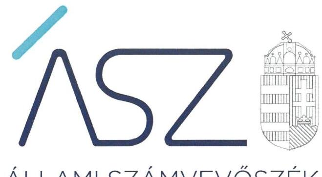
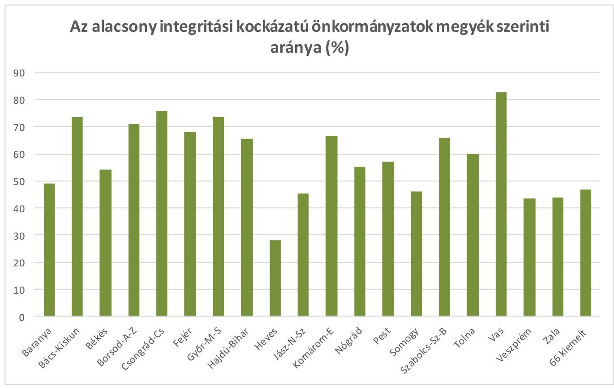
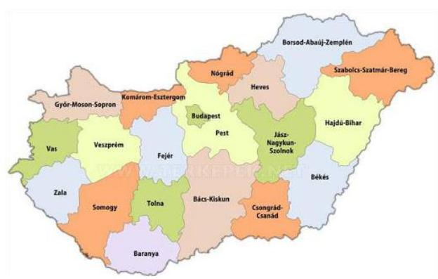
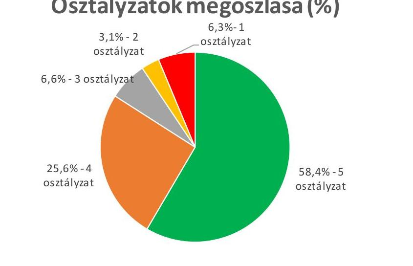

ÁLLAMI SZÁMVEVŐSZÉK

# JELENTÉS 

Önkormányzatok ellenőrzése - Az önkormányzatok integritásának ellenőrzése

Összegzés önkormányzatok összesen
2021.

21005
www.asz.hu

---

ÁLLAMI SZÁMVEVŐSZÉK

# JELENTÉS 

Önkormányzatok ellenőrzése - Az önkormányzatok integritásának ellenőrzése

Összegzés önkormányzatok összesen
2021. 01 hó 23 nap

21005
www.asz.hu

Domokos László
elnök

---

# AZ ELLENŐRZÉST FELÜGYELTE: 

SALAMON ILDIKÓ felügyeleti vezető

## AZ ELLENŐRZÉST VEZETTE ÉS A VÉGREHAJTÁSÁÉRT FELELŐS:

ÁRPÁSI TIBOR ellenőrzésvezető
DÉZSINÉ KIS HAJNALKA ellenőrzésvezető
DORMÁN ISTVÁN ZOLTÁN ellenőrzésvezető
DR. DOMOKOS MAGDOLNA ellenőrzésvezető
DR. GÁL NÓRA ellenőrzésvezető
DR. SIMON JÓZSEF ellenőrzésvezető
HOFMEISTER LÁSZLÓ ellenőrzésvezető
JANIK JÓZSEF LÁSZLÓ ellenőrzésvezető
KAKAS SÁNDOR ellenőrzésvezető
KISS ISTVÁN GYÖRGY ellenőrzésvezető
KISTÓTH KRISZTINA ellenőrzésvezető
KORMÁNY GERGELY ZSOLT ellenőrzésvezető
KUSZINGER ANDREA ellenőrzésvezető
MOLNÁR ZSUZSANNA ellenőrzésvezető
NEMESVÁRI-HORTHY ESZTER ellenőrzésvezető
RÁCZKEVI KATALIN ellenőrzésvezető
SALAMIN VIKTOR ellenőrzésvezető
SIPOSNÉ DÓCZI KLÁRA
ÓDOR ZOLTÁN TAMÁS ellenőrzésvezető
SZAPPANOS JÚLIA ellenőrzésvezető
VALASTYÁNNÉ DR. VÍZHÁNYÓ JÚLIA ellenőrzésvezető
VERTKOVCZI MÁRIA ellenőrzésvezető

A PROGRAM ÖSSZEÁLLÍTÁSÁÉRT FELELŐS:
GÖRGÉNYI GÁBOR osztályvezető

IKTATÓSZÁM: EL-3081-001/2021.
TÉMASZÁM: 2548
ELLENŐRZÉS-AZONOSÍTÓ SZÁM: V0892

---

# TARTALOMJEGYZÉK 

- ÖSSZEGZÉS ..... 5
- AZ ELLENŐRZÉS CÉLJA ..... 8
- AZ ELLENŐRZÉS TERÜLETE ..... 9
- AZ ELLENŐRZÉS HÁTTERE, INDOKOLTSÁGA ..... 10
- A JELENTÉS LÉNYEGES KÉRDÉSKÖREI. ..... 11
- AZ ELLENŐRZÉS HATÓKÖRE ÉS MÓDSZEREI. ..... 12
- ÉRTÉKELÉSEK. ..... 14
MELLÉKLETEK. ..... 19
I. sz. melléklet: Fogalomtár. ..... 19
II. sz. melléklet: Az önkormányzatok integritásának ellenőrzése során értékelt 26 dokumentum megnevezése ..... 21
III. sz. melléklet: Értékelési keretrendszer. ..... 22
- RÖVIDÍTÉSEK JEGYZÉKE ..... 25

---

.

---

# ÖSSZEGZÉS 

Az Állami Számvevőszék első alkalommal értékelte egyidejűleg az összes magyarországi önkormányzat és hivatalaik integritását - korrupció elleni védettségét -, illetve a müködést meghatározó alapvető szabályozási környezetük kialakítását. A 3197 önkormányzatot és 1284 önkormányzati hivatalt érintő rendszerszintü értékeléssel, illetve többszintü tanácsadó tevékenységével az ÁSZ a COVID-19 világjárvány időszakában nyújtott támogatást a szabályok betartásához, ami megalapozza, illetve elősegíti az önkormányzatok hatékony feladatellátását.
Az ÁSZ értékelésének és tanácsadásának eredményeként összesen 1055 önkormányzatnál a vezetők (polgármesterek, elnökök, jegyzők) már 2020-ban intézkedéseket tettek a beszámoló készités integritást biztositó lényeges feltételeinek a megerősitése, illetve kiépitése érdekében. Ezeknek az önkormányzatoknak javult az integritása, erősödtek a csalásmentes müködés feltételei. Az ÁSZ értékelése és iránymutatása - a csalásmentes környezet szilárdabb biztositása érdekében, az alapvető integritási feltételek területén - további 1329 önkormányzatnál biztosit fejlesztési lehetőséget a vezetőknek, saját felelős vezetői magatartásuk függvényében, 2021-re vonatkozóan.
Az ÁSZ a rendszerszintü értékelésével beazonosította azokat az önkormányzatokat is, amelyek integritásának kiépitését új, részletes ellenőrzéssel támogatja.

## Az ellenőrzés társadalmi indokoltsága

Az Alaptörvényben megfogalmazott alapértékek, elvek szerint minden szervezet köteles a nyilvánosság előtt elszámolni a közpénzekre vonatkozó gazdálkodásával. A közpénzeket és a nemzeti vagyont az átláthatóság és a közélet tisztaságának elve szerint kell kezelni.

2011-től az Állami Számvevőszék az Országgyűlés döntése alapján évente elvégzett felméréssel és annak kiértékelésével fejlesztette a közszféra integritását. Az önkéntes felmérésekben legnagyobb számban önkormányzatok vettek részt, aminek hatására széleskörű előrelépések történtek az integritásközpontú szervezeti működés területén az önkormányzati alrendszerben is. 2015-től az ÁSZ fokozatosan az integritás ellenőrzésére helyezte a hangsúlyt. Mindez megteremtette a korrupció ellen védettséget biztosító szabályozási környezet és integritáskontrollok rendszerszintű értékelésének feltételeit.

Napjainkban kiemelt aktualitást és jelentőséget kapott a közpénzügyi helyzet javítása, az integritási szemlélet érvényesítésének erősítése. Az önkormányzatoknak fel kell készülniük arra, hogy a COVID-19 világjárvány okozta társadalmi és gazdasági válság növeli a korrupciós veszélyt.

Az Állami Számvevőszék ellenőrzése hozzájárul, hogy a helyi önkormányzatok integritási kontrolljainak kiépítettsége javuljon, ezáltal az önkormányzatok korrupciós veszélyeztetettsége csökkenjen. A járvány következtében kialakult helyzet megnövekedett feladatok elé állítja az önkormányzatokat, melyek megoldása kellő szakmai körültekintést is igényel. Szükséges minél hamarabb kialakítani az új feladatok ellátásának elszámoltatható rendjét, az erőforrások átlátható felhasználását biztosító, a visszaéléseket, a csalás lehetőségét minimálisra csökkentő belső szabályozást. Fontos, hogy az önkormányzatok tisztában legyenek az integritási kockázatokkal, azokat rendszeresen mérjék fel, és alakítsanak ki átlátható, jól szabályozott rendszereket, döntési mechanizmusokat.

Az ellenőrzés rámutathat a helyi önkormányzatok gazdálkodási tevékenységével kapcsolatos, integritást erőstő jó gyakorlatokra is, továbbá felhívhatja a figyelmet a jogszabályi követelmények teljesítéséhez szükséges lépésekre.

---

# Értékelés 

Alapvető társadalmi elvárás, hogy az önkormányzatok múködésében érvényesüljenek az integritás alapú hivatali elvek az állampolgárok részére nyújtott szolgáltatások során. Minden állampolgárnak azonos elvek alapján, azonos elbírálás szerint kell megkapnia az önkormányzatok által nyújtott közszolgáltatásokat úgy, hogy ennek érvényesülése az érintettek elégedettségében is jelentkezzen. Az integritás alapú elvek hiánya gyengíti a jogállamot, ezért ezen elvek mentén történő múködési környezet megerősitése, illetve kiépítése és fejlesztése, valamint kockázatainak kezelése felelős vezetői magatartást igényel.

Az összesen 3197 helyi önkormányzatnál 1284 hivatal látja el a gazdálkodási feladatokat. Az Állami Számvevőszék 2020 tavaszán kezdte meg az összes magyarországi önkormányzat, illetve hivatalaik integritásának, vagyis korrupció elleni védettségének jelen idejű monitoring értékelését.

A 2020-ra vonatkozó, így a jelen idejű működést támogató rendszerszintű értékelés azért is rendkívül aktuális, mert a szabálykövetésnek és rendezettségnek a COVID-19 világjárvány időszakában különösen nagy jelentősége van. Nemzetközi szervezetek (ENSZ, OECD), illetve az ÁSZ értékelése szerint a világjárvány kiemelt korrupciós, illetve szabálysértési kockázatot jelent. Mindez azt jelenti, hogy az ÁSZ értékelése akkor nyújt támogatást a szabályok betartásához, amikor arra a legnagyobb szükség van.

A rendszerszintű értékelésről az ÁSZ összesen 21 jelentést készített. Egy országos jelentést, egyet a 66 legnagyobb önkormányzatról (Főváros, 23 fővárosi kerületi önkormányzat, 23 megyei jogú város, 19 megyei önkormányzat), illetve 19 jelentést az egyes megyéket érintő értékelések tapasztalatairól és következtetéseiről. A megnevezett rendelkezésre bocsátott adatok értékelése, illetve a figyelemfelhívásokra tett intézkedések alapján az ÁSZ 1-5 skálán osztályozta az egyes önkormányzatokat, ahol 1-es osztályzat jelenti a legmagasabb, az 5-ös pedig a legkisebb korrupciós kockázatot. Az önkormányzatok és hivatalaik együttes osztályzatát az egyes megyékről készített számvevőszéki jelentések melléklete, illetve a 66 legnagyobb önkormányzatról készített jelentés melléklete tartalmazzák.

A rendszerszintű értékelés keretében végzett, többszintű tanácsadó tevékenységével az ÁSZ már 2020 elején felhívta az önkormányzatok és a hivatalok vezetőinek figyelmét azokra az alapvető szabályozásokra, nyilvántartásokra, amelyek az integritási kontrollok kiépítésén keresztül a szabályszerű és csalásmentes gazdálkodás feltételeinek megteremtéséhez nélkülözhetetlenek. Az önkormányzatonként értékelt 26 - jelen időben hatályos - dokumentumnak folyamatosan rendelkezésre kell állniuk, ugyanis ezek alapvető feltételei az adott önkormányzat szabályozottságának, szabályos és átlátható gazdálkodásának, illetve csalásmentes múködésének.

A tanácsadási tevékenység második szintjén az ÁSZ elősegítette az önkormányzatok adatszolgáltatását, amelynek eredményeként az adatszolgáltató - és ezzel a felelős vezetői magatartást tanúsító - önkormányzatok aránya 4,3 százalékponttal nőtt, amely egyúttal az érintett 139 önkormányzat integritási kockázatának a csökkenését is jelezte.

Az ellenőrzés keretében elsőként az éves beszámoló szabályszerű elkészítését biztosító kontroll környezet részét képező lényeges területeket értékelte az ÁSZ, és már év közben, az ellenőrzés lefolytatásával párhuzamosan javítási lehetőségre hívta fel 710 önkormányzat és 544 hivatal vezetőjének a figyelmét. Ennek eredményeként a felelős vezetők a figyelemfelhívással érintett területek több mint 80\%-ában tettek intézkedéseket, és erről tájékoztatták az Állami Számvevőszéket. Lényeges, hogy ezen szabályozások, nyilvántartások kontrollált javítása már a 2020. évi beszámoló elkészítése során érvényesülhet. Az ÁSZ tanácsadó tevékenységének eredményességét jelzi, hogy a figyelemfelhívással érintett szervezetek 84,1\%-a valamennyi, részére jelzett területen tett javító intézkedést.

A dokumentumok kiértékelése alapján az ÁSZ a 2021. évre vonatkozó előrelépési lehetőségeket - a lényeges kockázatos területeken az integritás további fejlesztése érdekében - 1329 önkormányzat polgármesterének tanácsadó levélben foglalta össze. Ezen önkormányzatok vezetői saját felelős vezetői magatartásuk függvényében tehetnek előrelépést szolgáló intézkedéseket.

A nem együttműködő 70, valamint a kockázatok összesített értékelése alapján további 132 önkormányzatnál rendszerszintű kockázatok maradtak fenn. Ezen önkormányzatok integritásának kiépítését új, részletes ellenőrzéssel támogatja az ÁSZ.

A szabályozások és nyilvántartások kialakításának célja nem önmagában a jogszabályi rendelkezések betartása, hanem az önkormányzat szabályozottságán keresztül a szabályszerű és csalásmentes gazdálkodás feltételeinek megteremtése, ezáltal az Alaptörvényben előírt átláthatóság és elszámoltathatóság elvének érvényesítése. Ezeknek az

---

alapelveknek érvényesülése hozzájárulhat ahhoz, hogy az önkormányzatok felé irányuló közbizalom is erősödjön.
Az ÁSZ az ellenőrzés során integritástudatos és jó gyakorlatokat is azonosított. 789 önkormányzatnál, valamint 346 hivatalnál a jogszabályok által elöírt ellenőrzött szabályozások, nyilvántartások lényeges területei nem minősültek kockázatosnak. Ezen túlmenően 400 önkormányzatnál, valamint 238 hivatalnál a felelős vezetők a jogszabályi előírásokon túl további erőfeszítéseket is tettek az integritás erősítése érdekében, mivel kialakították az integritás lágy kontrolljait, vagyis felismerték a jogszabályokban előírt, kötelező kontrollokon túl, további integritási kontrollok megerősítésének indokoltságát, amely szervezeti szinten hozzájárul a korrupcióval szembeni védettség megszilárdításához.

Az integritás szempontjából lényeges dokumentumok, valamint az adatszolgáltatás és a figyelemfelhívásokra történt intézkedések kockázati értékelésének figyelembevételével az önkormányzatok és hivatalok integritásának fennálló állapota országosan 4,3 átlagos osztályzatot ért el.

# Következtetések 

A tanácsadó levelek alapján az érintett felelős vezetők önmaguk által történő javításával növekedhet az integritás kontrollok kiépítettsége az önkormányzatoknál. Ez a hivatalok feladatellátásán keresztül hatással lehet az önkormányzati alrendszer további szereplőinek - így többek között az önkormányzati intézmények, illetve a nemzetiségi önkormányzatok - az integritási színvonalára is.

Az integritás elvű működés erősítése érdekében további kockázatcsökkentő lépések szükségesek a vezetés-irányítás, valamint a pénzügyi- és a vagyongazdálkodás szabályszerű feltételeinek kialakítása terén, amelyeket az érintetteknek az ÁSZ által írásban megküldött tanácsadó levelek alapján lehetőségük van megtenni.

Azoknál a legnagyobb kockázatú önkormányzatoknál, valamint a gazdálkodási feladataikat ellátó hivataloknál, amelyeknél rendszerszintű - önmaga által nem kezelt - kockázatot azonosított az ÁSZ, új, részletekbe menő ellenőrzés válik indokolttá.

1 ábra

Forrás: Értékelés alapján ÁSZ szerkesztés

---

# AZ ELLENŐRZÉS CÉLJA

Az ellenőrzés célja annak értékelése, hogy a helyi önkormányzatoknál és annak gazdálkodási feladatait ellátó önkormányzati hivataloknál megteremtették-e az integritás biztosításához szükséges feltételeket, kialakították-e az integritási kontrollokhoz kapcsolódó, valamint a korrupció elleni védelmet szolgáló szabályozásokat.

A monitoring típusú ellenőrzéssel, az ellenőrzöttek jelenben lévő fejlődését figyelembe véve az Állami Számvevőszék az önkormányzatok integritásának állapotát jelző szintjét értékeli. Rámutat azokra a területekre, amelyen a felelős vezetők saját maguk képesek javítani, illetve előrelépni oly módon, hogy az integritás érvényesüljön a napi működésük során. Ez a cél szorosan összefügg az Állami Számvevőszékről szóló törvényben foglaltakkal, melynek legfőbb célja a közpénzügyi helyzet javulása.

Az elmúlt évek intézményi irányításában tapasztalt előrehaladás alapján, az együttműködés bizalmára építve az Állami Számvevőszék nem intézkedési terv készítésére kötelezi az ellenőrzötteket, hanem az elköteleződésükre alapozva, tanácsadás keretében mozdítja elő a pozitív irányú közpénzügyi változásuk megvalósítását, ezzel is támogatva a jól irányított állam működését.

---

# **AZ ELLENŐRZÉS TERÜLETE**

## **Magyarország helyi önkormányzatai és önkormányzati hivatalai**

Magyarország Alaptörvénye¹ alapján az ország területe fővárosra, megyékre, városokra és községekre tagozódik.

A Magyarország helyi önkormányzatairól szóló 2011. évi CLXXXIX. törvény (a továbbiakban: Mötv.²) rendelkezései szerint a helyi önkormányzás választópolgárok közösségét megillető joga a települések (települési önkormányzatok) és a megyék (területi önkormányzatok) szintjén valósul meg.

Az önkormányzatok kötelező és önként vállalt önkormányzati feladatainak ellátását a képviselő-testület és szervei (többek között a polgármester és a jegyző) biztosítják. A polgármester képviseli a képviselő-testületet, a jegyző pedig vezetie a polgármesteri hivatalt, vagy a közös önkormányzati hivatalt.

Az önkormányzatok alapvető szabályozási feladatai tehát a polgármester és a jegyző felelősségi körébe tartoznak. Az integritás szabályozottságának magas minőségét ezért a polgármester és a jegyző felelős vezetői magatartása határozza meg elsődlegesen.

Az ellenőrzés a polgármester és a jegyző felelősségi körébe tartozó szabályozási környezetre, a főbb integritási kontrollok kiépítettségére terjed ki. Nem terjed ki az önkormányzat által alapított intézményekre, gazdasági társaságokra, alapítványokra, valamint az önkormányzati társulásokra.

Az önkormányzatok integritásának ellenőrzése Magyarország valamennyi, 3197 önkormányzatára és 1284 hivatalára kiterjedt.

Az ellenőrzés 3127 helyi önkormányzat és 1266 hivatal esetében lefolytatásra került. A további 70 önkormányzat és 18 hivatal ellenőrzése adatszolgáltatás hiányában nem volt lefolytatható, ez esetekben az ÁSZ az ellenőrzöttek integritási kockázatát értékelte.

---

# AZ ELLENŐRZÉS HÁTTERE, INDOKOLTSÁGA 

Az Alaptörvény alapértékeket, elveket fogalmaz meg, amely szerint a közpénzekkel gazdálkodó minden szervezet köteles a nyilvánosság előtt elszámolni a közpénzekre vonatkozó gazdálkodásával. A közpénzeket és a nemzeti vagyont az átláthatóság és a közélet tisztaságának elve szerint kell kezelni.

Az ÁSZ² 2016-2018. évben végzett integritás felméréseinek eredményei azt mutatták, hogy a helyi önkormányzatok a közszféra szereplői körében a kockázatosabb csoportba tartoznak. A kisebb népességszámú települések önkormányzatai különösen veszélyeztetettek, mert kontrollkörnyezetük, integritási infrastruktúrájuk - a felmérés eredményei alapján - kevésbé kiépített.

Az ÁSZ célja, hogy új ellenőrzési megközelítést alkalmazva támogassa a közpénzügyi helyzet javítását; a monitoring típusú ellenőrzéssel helyzetképet adjon az önkormányzati alrendszer egészében az integritási szemlélet érvényesítéséről, rávilágítson az integritási kontrollok kiépítettségére, illetve további fejlesztésére. Napjainkban mindez kiemelt fontosságúvá vált. Az önkormányzatoknak fel kell készülnie arra, hogy a koronavírus okozta társadalmi és gazdasági válság növelni fogja a korrupciós nyomást, amelyre felmérésünk és ellenőrzéseink alapján az önkormányzatok nincsenek megfelelően felkészülve. Az ÁSZebben a helyzetben is alapvető kötelességének tartja, hogy a közpénzek őre legyen, és ellenőrzéseit az önkormányzatok körében is folytassa.

Az ÁSZ ellenőrzése hozzájárul, hogy a helyi önkormányzatok integritási kontrolljainak kiépítettsége javuljon, ezáltal az önkormányzatok integritási veszélyeztetettsége csökkenjen. A járvány következtében kialakult helyzet megnövekedett feladatok elé állítja az önkormányzatokat, melyek megoldása kellő szakmai körültekintést is igényel. Szükséges minél hamarább kialakítani az új feladatok ellátásának elszámoltatható rendjét, az erőforrások átlátható, a visszaéléseket, a csalás lehetőségét minimálisra szorító belső szabályozását. Fontos, hogy az önkormányzatok tisztában legyenek az integritás kockázatokkal, azokat ismételten mérjék fel, és alakítsanak ki átlátható, jól szabályozott rendszereket, döntési mechanizmusokat.
Az ellenőrzés rámutat a helyi önkormányzatok gazdálkodási tevékenységével kapcsolatos integritási jó gyakorlatokra is, továbbá felhívja a figyelmet a jogszabályi követelmények teljesítéséhez szükséges lépésekre is.

---

# A JELENTÉS LÉNYEGES KÉRDÉSKÖREI 

1. Milyen mértékben javult az önkormányzatok integritása az ÁSZ tanácsadása alapján?
2. Milyen kockázatot hordoz az ellenőrzött önkormányzatok fennálló integritása?

---

# AZ ELLENŐRZÉS HATÓKÖRE ÉS MÓDSZEREI 

## Az ellenőrzés típusa

| Megfelelőségi ellenőrzés.

## Az ellenőrzött időszak

Az ellenőrzött időszak a 2020. év.

## Az ellenőrzés tárgya

A szervezeti keretekkel, a múködéssel és gazdálkodással kapcsolatos szabályzatok, szabályozások, valamint a szervezeti elvekkel, értékekkel összefüggő integritás kontrollok kiépítettsége.

## Az ellenőrzött szervezet

Magyarország helyi önkormányzatai és a gazdálkodási feladataikat ellátó önkormányzati hivatalok.

## Az ellenőrzés jogalapja

Az ellenőrzés jogalapját az ÁSZ tv4. 1. § (3) bekezdése képezte.

## Az ellenőrzés módszerei

Az ellenőrzést az ellenőrzési program szempontjai, az ellenőrzött időszakban hatályos jogszabályok, a jelen ellenőrzésre irányadó ÁSZ módszertan figyelembevételével végezte az ÁSZ.

Az ellenőrzés ideje alatt az ellenőrzött szervezettel történő kapcsolattartást az ÁSZ az ÁSZSZMSZ5-ének vonatkozó előírásai alapján biztosította.

Az ellenőrzési kérdések megválaszolásához szükséges bizonyítékok megszerzése a következő ellenőrzési eljárások alkalmazásával történt: megfigyelés, összehasonlítás, elemző eljárás. Az ellenőrzési bizonyítékként felhasználható adatforrások közé tartoztak az ellenőrzési programban felsorolt adatforrások, továbbá minden - az ellenőrzés folyamán - feltárt, az ellenőrzés szempontjából információkat tartalmazó dokumentum.

---

Az ellenőrzést a kérdésekre adott válaszok kiértékelésével, valamint a megjelölt adatforrások, továbbá az adott időszakban hatályos jogszabályok, valamint az ÁSZ honlapján közzétett helyénvalósági kritériumok figyelembe vételével folytatta le az ÁSZ.

A jogszabályok által kötelezően elő nem írt, helyénvalósági kritériumokra vonatkozó követelményeket az ÁSZ nemzetközi sztenderdekben, hazai iránymutatásokban, módszertani útmutatókban szereplő „jó gyakorlatok" beazonosításával, integritási felmérésével, öntesztekkel alapozta meg. Az erre vonatkozó értékelések a jelentésben dőlt betűvel szerepelnek.

A szabályszerűségi és a helyénvalósági kritériumok viszonyát a jogszabályi előírások elsődlegessége határozza meg. A helyénvalósági kritériumok a jogszabályi előírások betartása esetén a szabályszerűségi kritériumok hatását erősítik, ellenkező esetben nem érvényesülnek.

A monitoring típusú ellenőrzés a helyi önkormányzatok integritás alapú működésének lényeges területeire fókuszált, és a lényeges dokumentumok kritikus területeinek ellenőrzésével lehetőséget biztosított a helyi önkormányzatok integritásának értékelésére. A monitoring típusú ellenőrzés emellett már az ellenőrzés folyamatában az ÁSZ figyelemfelhívásán keresztül önmaga általi javítási lehetőséget biztosított az integritási kockázatok csökkentésére.

A közpénzügyek átláthatóságának, rendezettségének megteremtése, a közpénzügyi helyzet mielőbbi javulása érdekében az ÁSZ három szintű tanácsadással segítette az ellenőrzött szervezeteket a csalásmentes integritást biztosító alapvető feltételek megteremtésében.

Az ellenőrzés indítását megelőzően felhívta valamennyi önkormányzat és hivatal vezetőjének figyelmét az integritás szempontjából lényeges dokumentumokra, azok ellenőrzésére.

Az ellenőrzés során a beszámoló szabályszerű elkészítését biztosító kontrollkörnyezet kialakítása, valamint a csalásmentes integritási környezet megteremtése szempontjából lényeges dokumentumok rendelkezésre állásának, továbbá azok tartalmának integritás szempontjából fontos területei értékelésére került sor. A monitoring típusú ellenőrzés már az ellenőrzés időszakában visszajelzést adott azon a dokumentumokról, amelyek javítása még hozzájárul a 2020. évi beszámoló megalapozottságának javításához. A további dokumentumok értékelésének alapján a 2021. évre tehetők meg a szervezet jogszabályoknak megfelelő, integritás alapú működését segítő intézkedések.
Az integritás szempontjából lényeges vezetési, pénzügyi és gazdálkodási területek értékelésének eredménye, valamint az adatszolgáltatás és a figyelemfelhívásokra történt intézkedések kockázati értékelésének figyelembevételével került sor az önkormányzatok és a hivatalok integritási színvonalának együttes osztályozására. Ennek módját a II. és III. sz. mellékletben foglalt értékelési keretrendszer tartalmazza.

---

# 1. Milyen mértékben javult az önkormányzatok integritása az ÁSZ tanácsadása alapján? 

Összegző értékelés

A többszintű számvevőszéki tanácsadás eredményeként az önkormányzatok integritási kontrolljai a járvány okozta megnövekedett korrupciós kockázatok mellett is javultak. A 2021. évben a tanácsadás további előrelépési lehetőséget biztosít a lényeges integritási feltételek területén.

Az ÁSZ korábbi ellenőrzési tapasztalatai, a „jó gyakorlatok" beazonosítása, valamint az integritási felmérések alapján 26 dokumentumot azonosított az önkormányzatok integritását jelző dokumentumként. A 26 dokumentumot a II. sz. melléklet mutatja. Ezek 85\%-ban olyan alapvető, a jogszabályok által előírt szabályozások, nyilvántartások, amelyek támogatják az integritás alapú működést, és a vezetői irányítási kontrollrendszer részeként a jogállamiság érvényesülésének alapfeltételeit jelentik az önkormányzatoknál. A további 15\% olyan szabályozásokat jelent, amelyeket jogszabályok ugyan kötelezően nem írnak elő, azonban az integritás alapú működéshez, ezáltal a korrupciós kockázatok mérsékléséhez elengedhetetlenek.

Az ÁSZ a tanácsadó tevékenység első szintjeként a 2020. év elején előre jelezte valamennyi önkormányzatnak és a gazdálkodási feladataikat ellátó hivataloknak a várhatóan ellenőrizendő dokumentumokat. Ennek célja nem önmagában a dokumentumok rendelkezésre állásának, a jogszabályi rendelkezések betartásának az ösztönzése, hanem ezen túlmenően az önkormányzat szabályozottságán keresztül a szabályszerű és csalásmentes gazdálkodás feltételeinek a megteremtése volt 2020 elején, hogy hatása a teljes évre érvényesüljön. Ennek eredményeként az ellenőrzés felkészülten érhette az önkormányzatokat.

Annak érdekében, hogy a COVID-19 világjárvány okozta társadalmi és gazdasági válság következtében növekvő korrupciós kockázatok ne rontsanak az önkormányzatok integritási kontrolljainak kiépítettségén, hanem a kontrollok ebben az időszakban is kiemelt odafigyelést kapjanak, és ezáltal csökkenjen a korrupciós veszélyeztetettség, az ÁSZ valamennyi önkormányzatra és hivatalra kiterjedő ellenőrzést indított.

Az ellenőrzés lefolytatásához adatszolgáltatásra felhívott 3197 helyi önkormányzat és az 1284 hivatal 93,5\%-a együttmúködött. Az adatokat az ellenőrzés rendelkezésére bocsátotta, és adatai megbízhatóságát, hitelességét teljességi és hitelességi nyilatkozattal igazolta. A fennmaradó 6,5 \% nem biztosította az ellenőrzés feltételeit, mivel 3\%-a nem teljesítette adatszolgáltatási kötelezettségét, 3,5\%-a pedig adatainak megbízhatóságát, hitelességét teljességi és hitelességi nyilatkozattal nem igazolta.

Az érintett 209 önkormányzat közül 139 önkormányzat az ÁSZ-tanácsadó tevékenység második szintjeként figyelemfelhívó levélben történt megkeresésére az adatokat az ellenőrzés rendelkezésére bocsátotta, és

---

adatai megbízhatóságát, hitelességét teljességi és hitelességi nyilatkozattal igazolta. Ezzel az együttműködő önkormányzatok aránya 97,8\%-ra nőtt. Ez az érintettek integritási kockázatainak csökkenését jelzi.

Elsőként a csalásmentes integritási környezet megteremtése szempontjából azokat a területeket értékelte az ÁSZ, amelyek részét képezik a beszámoló készítés integritást biztosító lényeges feltételeinek, továbbá év közben, az ellenőrzés lefolytatásával párhuzamosan szabályszerűen javíthatók. A dokumentumok értékelése alapján az ÁSZ az önkormányzatok polgármesterei részére a képviselő-testület szervezeti és múködési szabályzatáról szóló rendelet, a hivatalok jegyzői részére a számviteli politika és a keretébe tartozó szabályzatok, a számlarend, a szervezeti integritást sértő események kezelésének eljárásrendje, a vagyonnyilatkozat átadására, nyilvántartására, a vagyonnyilatkozatban foglalt személyes adatok védelmére vonatkozó további szabályok, és a beszerzések lebonyolításával kapcsolatos eljárásrend kapcsán tett figyelemfelhívást. Ezzel az érintett 710 önkormányzat és 544 hivatal felelős vezetői lehetőséget kaptak arra, hogy integritási kontrollkörnyezetüket felülvizsgálva a jelzett lényeges területeken megtegyék a szükséges intézkedéseket.

Az 1254 figyelemfelhívó levélben az ÁSZ által tett 1514 figyelemfelhívásra 1270 intézkedésről érkezett visszajelzés az érintett polgármesterek, jegyzők részéről. Ez több mint 80\%-os intézkedési arányt jelez. A figyelemfelhívó levelekben foglalt jelzések és a felelős vezetők visszajelzései alapján az arra tett intézkedéseket a következő táblázat mutatja.

1. táblázat

Kimutatás az önkormányzatok és hivatalok 2020. évi figyelemfelhívással érintett integritási kontroll dokumentumairól

| Értékelt terület | Felelős | Figyelemfelhívások   száma (db) | Figyelemfelhívásokra   tett intézkedések   száma (db) |
| :-- | :-- | --: | --: |
| Képviselő-testület   szervezeti és múködési   szabályzatáról szóló   rendelet, és annak   lényeges területei | polgármester | 708 | 583 |
| Hivatal számviteli   politikája és a keretében   elkészítendő   szabályzatok | jegyző | 368 | 317 |
| Hivatal számlarendje | jegyző | 95 | 77 |
| Szervezeti integritást   sértő események   kezelésének eljárásrendje | jegyző | 163 | 144 |
| A vagyonnyilatkozat   szabályozása a   hivatalban | jegyző | 99 | 80 |
| Beszerzések eljárásrendje | jegyző | 81 | 69 |
| Összesen |  | 1514 | 1270 |

---

A felelős vezetők a figyelemfelhívással érintett szervezetek 84,1\%-ánál az ÁSZ által jelzett valamennyi területen tettek intézkedést.

Az értékelése alapján az ÁSZ kiemelten fontosnak tartja a csalásmentes működési környezet kiépítését az alapvető integritási feltételek területén, a pozitív változások elindítását a 2021. évre is.

Ennek érdekében az ÁSZ valamennyi önkormányzat polgármesterének szóló tanácsadó levélben foglalta össze az ellenőrzés értékelési tapasztalatait. Beazonosította azokat a lényeges területeket, amelyeken további intézkedéseket tart indokoltnak az értékelt dokumentumok, nyilvántartások esetében. Az ÁSZ 2021. évre vonatkozó tanácsadó tevékenysége részeként - a legkevésbé kockázatos önkormányzatok kivételével - az értékelések eredményét önkormányzatonként, hivatalonként is összefoglalta, további segítséget nyújtva az érintett felelős vezetők számára kontrolljaik erősítéséhez. Ezzel 1329 önkormányzat vezetőjét egyedi tanácsadással is segíti.

Az önkormányzatok és hivatalaik a járvány okozta megnövekedett korrupciós kockázatok mellett is többségében fenntartotta, sőt megerősítette kontrolljait. Ezt támasztja alá - az ÁSZ 2020-ra vonatkozó tanácsadására történt intézkedéseken túl -, hogy az alapvető integritási kontrollokat jelző dokumentumok értékelése 85,9\%-ban nem jelzett az értékelt lényeges területeken kockázatot. Ez azt jelenti, hogy 789 önkormányzatnál, illetve 346 hivatalnál a megnevezett dokumentumok értékelése a lényeges területeken szabályszerű volt.

Ezen túlmenően, 400 önkormányzatnál, valamint 238 hivatalnál a felelős vezetők a jogszabályok által elő nem írt, további kontrollokat is kiépítettek az integritási kontrollok erősítése érdekében.

# 2. Milyen kockázatot hordoz az ellenőrzött önkormányzatok fennálló integritása? 

Összegző értékelés

A számvevőszéki tanácsadás eredményeként intézkedő vezetők hozzájárultak a korrupciós kockázatok csökkentéséhez. A magas integritási kockázatú 202 önkormányzatnál új részletes ellenőrzés indokolt az integritási kockázatok csökkentésének érvényesülése érdekében.

Az értékelés során az ellenőrzött szervezetek integritását jelző, a felépítését, működését, felelősségi viszonyait, gazdálkodását meghatározó szabályzatok és nyilvántartások rendelkezésre állása, valamint lényeges szabályozási területei kerültek értékelésre. A dokumentumok hiánya, vagy a lényeges szabályozási területeken hibás dokumentum a jogszabályokban előírtak szerinti szabályozó szerepét nem tudja betölteni.

A további pozitív változások, és ennek eredményeként az önkormányzati alrendszerben az integritás alapú működésen keresztül a közpénzügyi helyzet javulása érdekében, az önkormányzatok és a hivatalok felelős vezetői lehetőséget kaptak kockázatcsökkentő intézkedések megtételére az értékelések alapján.

Az ellenőrzés folyamatában, az ÁSZfigyelemfelhívásán keresztül önmaguk által történt javítás az értékelés alapján beazonosított lényeges kockázatos területeken elősegítette a jogszabályoknak megfelelő, integritás

---

alapú működést. A 2020. évben ennek eredményeként 1055 intézkedő ellenőrzöttnél javultak a beszámoló készítés integritást biztosító lényeges feltételei.

A korrupciós kockázatok növekedésének megakadályozása, illetve az elért eredmények fenntartása érdekében az eddig nem, vagy nem minden lényeges kockázatos területen intézkedő ellenőrzötteknek is lehetősége van 2021-ben a felelős vezetői magatartás körében a szükséges intézkedéseket megtenni és ezzel a korrupciós kockázatokat csökkenteni.

A megnevezett jelző dokumentumok, valamint a kockázatok értékelése alapján az ÁSZ elvégezte az önkormányzatok és hivatalaik integritásának együttes értékelését. Ennek összesített adatait a 2. számú táblázat mutatja.

1. táblázat

Az önkormányzatok integritásának értékelése

|  Osztályzat | Db | Megoszlás  |
| --- | --- | --- |
|  5 | 1868 | 58,4%  |
|  4 | 818 | 25,6%  |
|  3 | 210 | 6,6%  |
|  2 | 99 | 3,1%  |
|  1 | 202 | 6,3%  |
|  Átlag: 4,3 | 3197 | -  |

*Forrás: Dokumentumok és kockázatok értékelése alapján, ÁSZ szerkesztés*

Az önkormányzatok 58,4%-a kialakította az integritás alapú működés alapvető feltételeit, 41,6%-a pedig további intézkedésekkel csökkentheti a korrupciós veszélyeztetettséget.

Az önkormányzatok 6,3%-ánál magas integritási kockázatokat azonosított az ellenőrzés.

---

70 önkormányzatnál az ellenőrzés nem volt lefolytatható, mivel nem múködtek együtt, nem bocsátották rendelkezésre az ÁSZ által megnevezett dokumentumokat, illetve nem igazolták azok megbízhatóságát. Az együttműködési kötelezettségüket nem teljesítőket az ÁSZ a kockázatok azonosítása alapján értékelte. Az értékelés szerint ezek az önkormányzatok és hivatalok olyan magas kockázatúak, amely további részletekbe menő ellenőrzést indokol az integritás alapú múködés alapvető feltételeinek a jövőbeni biztosítása érdekében.

További 109 önkormányzatnál az ellenőrzés értékelése alapján a képi-selő-testület a vagyonnyilatkozat-tételi kötelezettség szabályozásával kapcsolatosan, míg 23 önkormányzatnál a további értékelt dokumentumoknál azonosított olyan súlyú integritási hiányosságokat, amely jelentősen fokozza a korrupciós kitettség kockázatát. Ennek csökkentése érdekében az ÁSZ új, részletes ellenőrzéseket tervez mind a 202 önkormányzatnál.
3. táblázat

Az önkormányzatok integritásának értékelése megyék szerint

| Megye/osztályzat | 5 | 4 | 3 | 2 | 1 | Átlag |
| :-- | :--: | :--: | :--: | :--: | :--: | :--: |
| Baranya | 147 | 90 | 34 | 16 | 13 | 4,1 |
| Bács-Kiskun | 87 | 23 | 6 | 1 | 1 | 4,6 |
| Békés | 40 | 19 | 7 | 5 | 3 | 4,2 |
| Borsod-Abaúj-   Zemplén | 253 | 65 | 12 | 1 | 26 | 4,5 |
| Csongrád-Csanád | 43 | 11 | 2 | 0 | 2 | 4,6 |
| Fejér | 72 | 18 | 6 | 4 | 6 | 4,4 |
| Győr-Moson-Sop-   ron | 133 | 23 | 12 | 4 | 9 | 4,5 |
| Hajdú-Bihar | 53 | 18 | 2 | 1 | 7 | 4,3 |
| Heves | 34 | 59 | 12 | 6 | 9 | 3,9 |
| Jász-Nagykun-   Szolnok | 35 | 26 | 10 | 1 | 5 | 4,1 |
| Komárom-Eszter-   gom | 50 | 15 | 2 | 0 | 8 | 4,3 |
| Nógrád | 72 | 37 | 5 | 5 | 11 | 4,2 |
| Pest | 106 | 50 | 14 | 4 | 12 | 4,3 |
| Somogy | 113 | 78 | 31 | 8 | 15 | 4,1 |
| Szabolcs-Szatmár-   Bereg | 150 | 52 | 10 | 6 | 10 | 4,4 |
| Tolna | 65 | 22 | 9 | 2 | 10 | 4,2 |
| Vas | 178 | 26 | 6 | 0 | 5 | 4,7 |
| Veszprém | 94 | 68 | 14 | 13 | 27 | 3,9 |
| Zala | 112 | 89 | 15 | 21 | 19 | 4,0 |
| 66 kiemelt | 31 | 29 | 1 | 1 | 4 | 4,3 |
| Összesen: | $\mathbf{1 8 6 8}$ | $\mathbf{8 1 8}$ | $\mathbf{2 1 0}$ | $\mathbf{9 9}$ | $\mathbf{2 0 2}$ | $\mathbf{4 , 3}$ |

Az önkormányzatok integritásának megyék szerinti átlagos értéke 3,94,7 osztályzat között változik. Az ország összesen 4,3 átlagos osztályzattól 9 megye alacsonyabb, 6 megye magasabb osztályzatú. Előremutató, hogy két megye kivételével valamennyi elérte a négyes osztályzatot.

---

# MELLÉKLETEK 

I. SZ. MELLÉKLET: FOGALOMTÁR

ÁSZ Integritás Projekt
helyi önkormányzat
integrált kockázatkezelési rendszer
kontrollkörnyezet
a) világos a szervezeti struktúra, a folyamatok átláthatóak,
b) egyértelműek a felelősségi, hatásköri viszonyok és feladatok,
c) meghatározottak, ismertek és elfogadottak az etikai elvárások a szervezet minden szintjén,
d) átlátható a humánerőforrás-kezelés,
e) biztosított a szervezeti célok és értékek irányában való elkötelezettség fejlesztése és elősegítése. (Forrás: Bkr. 6. § (1) bekezdés)
kontrolltevékenységek
költségvetési szerv vezetője
közérdekű bejelentés

Az ÁSZ 2009-ben indította el a „Korrupciós kockázatok feltérképezése - Integritás alapú közigazgatási kultúra terjesztése" című, európai uniós forrásból megvalósított kiemelt projektjét (Integritás Projekt). Az Integritás Projekt célja, hogy felmérje a közszféra intézményei korrupciós kockázatoknakvaló kitettségét, illetőleg az azok mérséklésére hivatott kontrollok szintjét. Az ÁSZ a projekt révén az integritás szemlélet minél szélesebb körrel történő megismertetését, gyakorlatba ültetését kívánja elérni. Az integritás követelményeinek megfelelő szervezeti müködést előnybenrészesítő közigazgatási kultúra elterjesztését és a korrupció elleni fellépést az ÁSZ önmagára nézve is stratégiai jelentőségű célként fogalmazta meg. A projekt a felmérésben résztvevő intézmények számára helyzetükről egyfajta „tükörképet" mutat be, ami alapot teremt a jövőbeni pozitív irányú elmozduláshoz.
(Forrás: a http://integritas.asz.hu honlapon közzétett, a 2013. évi Integritás felmérés eredményeiről készült összefoglaló tanulmány)
Magyarországon a helyi közügyek intézése és a helyi közhatalom gyakorlása érdekében helyi önkormányzatok müködnek. A helyi önkormányzatokra vonatkozó szabályokat sarkalatos törvény határozza meg (Forrás: Magyarország Alaptörvénye 31. cikk (1) és (3) bekezdés).
A helyi önkormányzás joga a települések (települési önkormányzatok) és a megyék (területi önkormányzatok) választópolgárainak közösségét illeti meg. (Forrás: Mötv. 3. § (1) bekezdés).

Olyan folyamatalapú kockázatkezelési rendszer, amely a szervezet minden tevékenységére kiterjed, egységes módszertan és eljárások alkalmazásával, a szervezet célkitűzéseinek és értékeinek figyelembevételével biztosítja a szervezet kockázatainak teljes körű azonosítását, azok meghatározott kritériumok szerinti értékelését, valamint a kockázatok kezelésére vonatkozó intézkedési terv elkészítését és az abban foglaltak nyomon követését (Forrás: Bkr. ${ }^{6} 2 . \S$ m) pontja)
A költségvetési szerv vezetője köteles olyan kontrollkörnyezetet kialakítani, amelyben
a) világos a szervezeti struktúra, a folyamatok átláthatóak,
b) egyértelműek a felelősségi, hatásköri viszonyok és feladatok,
c) meghatározottak, ismertek és elfogadottak az etikai elvárások a szervezet minden szintjén,
d) átlátható a humánerőforrás-kezelés,
e) biztosított a szervezeti célok és értékek irányában való elkötelezettség fejlesztése és elősegítése. (Forrás: Bkr. 6. § (1) bekezdés)
A költségvetési szerv vezetője által a szervezeten belül kialakított kontrolltevékenységek, melyek biztosítják a kockázatok kezelését, hozzájárulnak a szervezet céljainak eléréséhez, és erősítik a szervezet integritását.
(Forrás: Bkr. 8. § (1) bekezdés)
A helyi önkormányzat esetében a jegyző, főjegyző. (Bkr. 2. §nb) pontja); a helyi önkormányzati költségvetési szerv esetén annak vezetője (Bkr. 2. §nd) pontja).
A közérdekű bejelentés olyan körülményre hívja fel a figyelmet, amelynek orvoslása vagy megszüntetése a közösség vagy az egész társadalom érdekét szolgálja. A közérdekű bejelentés javaslatot is tartalmazhat. (Forrás: a panaszokról és a közérdekű bejelentésekről szóló 2013. évi CLXV. törvény 1. § (3) bekezdés)

---

lágy kontrollok
hivatal
panasz
szervezetj integritást sértő esemény

A szervezet jogszabály által elő nem írt (belső) szabályainak betartását segítő kontrollok.
A helyi önkormányzat képviselő-testülete az önkormányzat müködésével, valamint a polgármester vagy a jegyző feladat- és hatáskörébe tartozó ügyek döntésre való előkészítésével és végrehajtásával kapcsolatos feladatok ellátására polgármesteri hivatalt vagy közös önkormányzati hivatalt hoz létre (Forrás: Mötv. 84. § (1) bekezdés).
Az önkormányzati hivatal: a polgármesteri hivatal, a főpolgármesteri hivatal, a megyei önkormányzati hivatal és a közös önkormányzati hivatal (Forrás: Áht. ${ }^{7}$ 1. § 18. pont).
A panasz olyan kérelem, amely egyéni jog- vagy érdeksérelem megszüntetésére irányul, és elintézése nem tartozik más - így különösen bírósági, közigazgatási - eljárás hatálya alá. A panasz javaslatot is tartalmazhat. (Forrás: a panaszokról és a közérdekú bejelentésekről szóló 2013. évi CLXV. törvény 1. § (2) bekezdés)
Minden olyan esemény, amely a szervezetre vonatkozó szabályoktól, valamint a jogszabályi keretek között a költségvetési szerv vezetője és az irányító szerv által meghatározott szervezeti célkitúzéseknek, értékeknek és elveknek megfelelő müködéstől eltér. (Forrás: Bkr. 2. § u) pont)

---

II. SZ. MELLÉKLET: AZ ÖNKORMÁNYZATOK INTEGRITÁSÁNAK ELLENŐRZÉSE SORÁN ÉRTÉKELT 26 DOKUMENTUM MEGNEVEZÉSE

|  | Hivatal |  | Önkormányzat |
| :--: | :--: | :--: | :--: |
| 1 | Szervezeti és múködési szabályzat | 1 | Képviselő-testület szervezeti és müködési szabályzatáról szóló rendelet |
| 1a | Szervezeti felépítés és a múködés rendje, szervezeti egységek megnevezése | 1a | Átruházott hatáskörök, önkormányzat szervei, jogállása, vagyonnyilatkozat bizottság |
| 2 | A vagyonnyilatkozat átadására, nyilvántartására, a vagyonnyilatkozatban foglalt személyes adatok védelmére vonatkozó szabályzat |  |  |
| 3 | Vezetői nyilatkozat a belső kontrollrendszer minőségéről |  |  |
| 4 | Szervezeti integritást sértő események kezelésének eljárásrendje |  |  |
| $4 a$ | bejelentő védelme, tájékoztatása |  |  |
| 5 | Integrált kockázatkezelés eljárásrendje |  |  |
| $5 a$ | kockázatok felmérésének kötelezettsége kiértékelés |  |  |
| 6 | Számviteli politika | 2 | Számviteli politika |
| $6 a$ | lényeges, nem lényeges, jelentős, nem jelentős szabályozása | $2 a$ | lényeges, nem lényeges, jelentős, nem jelentős szabályozása |
| 7 | Az eszközök és a források leltárkészítési és leltározási szabályzata | 3 | Az eszközök és a források leltárkészítési és leltározási szabályzata |
| $7 a$ | mennyiségi felvétellel történő leltározás gyakorisága | $3 a$ | mennyiségi felvétellel történő leltározás gyakorisága |
| 8 | Az eszközök és a források értékelési szabály. zata | 4 | Az eszközök és a források értékelési szabály. zata |
| $8 a$ | követetések értékelésének szabályai | $4 a$ | követetések értékelésének szabályai |
| 9 | Pénzkezelési szabályzat | 5 | Pénzkezelési szabályzat |
| $9 a$ | napi készpénz záró állomány | $5 a$ | napi készpénz záró állomány |
| 10 | Számlarend | 6 | Számlarend |
| $10 a$ | főkönyvi és az analitikus nyilvántartás kapcsolata | $6 a$ | főkönyvi és az analitikus nyilvántartás kapcsolata |
| 11 | Beszerzések lebonyolításával kapcsolatos eljárásrend | 7 | Beszerzések lebonyolításával kapcsolatos eljárásrend |
| 12 | A tervezéssel, gazdálkodással kapcsolatos belső szabályzat | 8 | A tervezéssel, gazdálkodással kapcsolatos belső szabályzat |
| $12 a$ | kötelezettségvállalás, teljesítés igazolás szabályozása | $8 a$ | kötelezettségvállalás, teljesítés igazolás szabályozása |
| 13 | A kötelezettségvállalásra, teljesítés igazolására jogosult személyekről és aláírás-mintájukról vezetett nyilvántartás | 9 | A kötelezettségvállalásra, teljesítés igazolására jogosult személyekről és aláírás-mintájukról vezetett nyilvántartás |
| 14 | Az ajándékok, egyéb előnyök elfogadásának szabályozása | 10 | Az ajándékok, egyéb előnyök elfogadásának szabályozása |
| $14 a$ | elfogadható ajándék mértéke | $10 a$ | elfogadható ajándék mértéke |
| 15 | A közérdekú bejelentések, panaszok kezelésének eljárásrendje | 11 | A közérdekú bejelentések, panaszok kezelésének eljárásrendje |

---

# Az önkormányzatok kockázati csoportba sorolásának (osztályozásának) értékelési keretrendszere 

## I. Dokumentumokkal rendelkezés

I.1. Azok a lényeges dokumentumok, amelyek hiánya felveti a csalás és korrupció kockázatát

- képviselő-testületi SZMSZ-ről szóló rendelet
- hivatali SZMSZ
- a vagyonnyilatkozat átadására, nyilvántartására, a vagyonnyilatkozatban foglalt személyes adatok védelmére vonatkozó további szabályok
- számviteli politika
- eszközök és források leltárkészítési és leltározási szabályzata, kiemelten amennyiségi felvétellel történő leltározás gyakorisága
- eszközök és források értékelési szabályzata, kiemelten a követelések értékelésének szabályai
- pénzkezelési szabályzat, kiemelten a napi készpénz záró állomány (hivatal)
- fókönyvi és az analitikus nyilvántartás kapcsolata
- beszerzések lebonyolításával kapcsolatos eljárásrend
- a kötelezettségvállalásra, teljesítés igazolására jogosult személyekről és aláírás-mintájukról vezetett nyilvántartás
I.2. Jogszabály által elő nem írt (helyénvalósági) dokumentumok
- az ajándékok, egyéb előnyök elfogadásának rendje
- a közérdekli bejelentések, panaszok kezelésének eljárásrendje
II. Az adatoknak az ellenőrzés rendelkezésére bocsátása kockázati értékelése
II.1. Nem kockázatos: a megnevezett adatokkal rendelkezett és a törvényi határidőn belül hiánytalanul rendelkezésre bocsátotta
II.2. Kiemelten magas kockázatú: a megnevezett adatokat külön figyelemfelhívásra sem bocsátotta rendelkezésre
III. Figyelemfelhívó levelekre adott válaszok kockázati értékelése
III.1. Alacsony kockázatú: együttmüködése a figyelemfelhívó levéllel összhangban volt.
III.2. Közepes kockázatú: a figyelemfelhívó levélben foglaltaktól eltérő együttműködést tanúsított.
III.3. Magas kockázatú: nem reagált, így nem volt együttmüködő.

Az egyes kockázati területek és kockázatforrások minősítése „pontozásos módszerrel", az integritás „jelző" dokumentumai és a vezetői magatartás tényhelyzeteinek értékelése alapján történt. Az értékelt dokumentumokhoz, nyilvántartásokhoz, kockázati besorolásokhoz minden esetben pontszám került hozzárendelésre, amelyek értéke alapján kockázati csoportba kerültek besorolásra 1-től (legmagasabb kockázat) 5-ig (legalacsonyabb kockázat) tartó skálán.

---

Az első lépésben azonosításra kerültek azok az önkormányzati szabályozások és nyilvántartások, amelyek hiánya felveti a csalás és korrupció kockázatát.

Második lépésben az adatoknak az ellenőrzés rendelkezésére bocsátása kockázati kritériumainak meghatározása, majd értékelése történt meg.

Harmadik lépésben a figyelemfelhívó levelekre adott válaszok kockázati kritériumainak meghatározása, majd értékelése történt meg.

Az összesített értékelést rontotta, amennyiben

- az integritás szempontjából meghatározó dokumentumok - képviselő-testületi SZMSZ, valamint a vagyonnyilatkozat átadására, nyilvántartására, a vagyonnyilatkozatban foglalt személyes adatok védelmére vonatkozó további szabályok meghatározása - hiányoztak, és azok javítása érdekében a figyelemfelhívó levél hatására sem történt intézkedés;
- az ellenőrzött adatokat nem bocsátott az ellenőrzés rendelkezésére, majd a javításra vonatkozó figyelemfelhívó levél következtében sem.

---

.

---

# RÖVIDÍTÉSEK JEGYZÉKE 

${ }^{1}$ Alaptörvény
${ }^{2}$ Mötv.
${ }^{3}$ ÁSZ
${ }^{4}$ ÁSZtv.
${ }^{5}$ ÁSZ SZMSZ
${ }^{6}$ Bkr.
${ }^{7}$ Áht.

Magyarország Alaptörvénye (2011. április 25.)
2011. évi CLXXXIX. törvény Magyarország önkormányzatairól

Állami Számvevőszék
2011. évi LXVI. törvény az Állami Számvevőszékről
Az Állami Számvevőszék elnökének 3/2019. (XII. 23.), 4/2020. (VII. 31.), 7/2020.
(XII. 28.) ÁSZ utasítások az Állami Számvevőszék Szervezeti és Működési Szabályzatáról
370/2011. (XII. 31.) Korm. rendelet a költségvetési szervek belső kontrollrendszeréről és belső ellenőrzéséről
2011. évi CXCV. törvény az államháztartásról

---

# ASZ 

ALLAMI SZAMVEVOSZEK
1052 Budapest, Apáczai Cs. J. u. 10. | 1364 Budapest 4. Pf. 54
TEL: +36 14849100
email: szamvevoszek@asz.hu
web: www.asz.hu | www.aszhirportal.hu