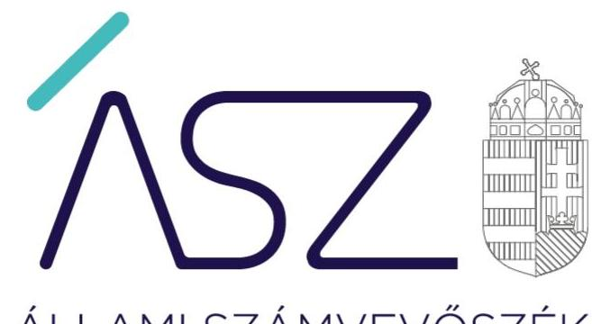
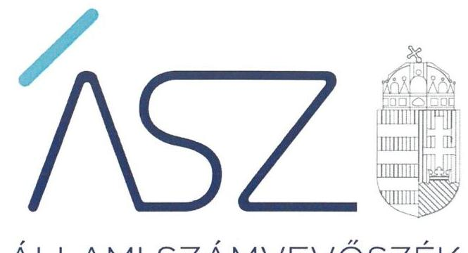
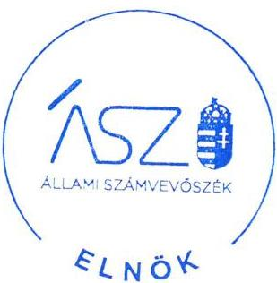
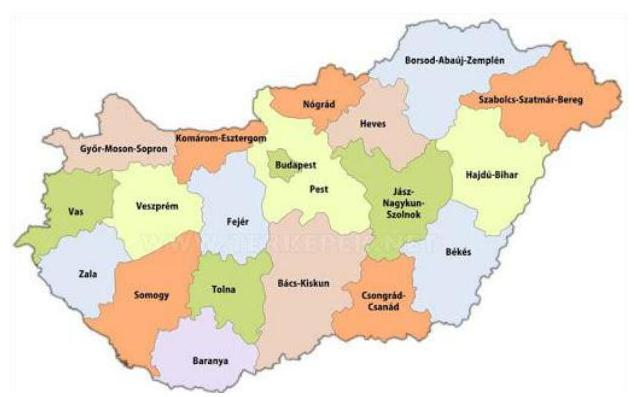
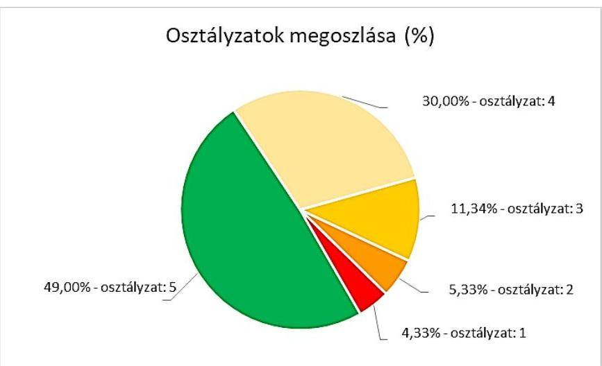

ÁLLAMI SZÁMVEVŐSZÉK

# JELENTÉS 

## Önkormányzatok ellenőrzése - Az önkormányzatok integritásának ellenőrzése

Baranya megye települési önkormányzatai
2021.

21006
www.asz.hu

---

ÁLLAMI SZÁMVEVŐSZÉK

# JELENTÉS 

Önkormányzatok ellenőrzése - Az önkormányzatok integritásának ellenőrzése

Baranya megye települési önkormányzatai
2021. 01. hó 29. nap

21006
www.asz.hu

Domokos László
elnök

---

# AZ ELLENŐRZÉST FELÜGYELTE: 

SALAMON ILDIKÓ felügyeleti vezető

## AZ ELLENŐRZÉST VEZETTE ÉS A VÉGREHAJTÁSÁÉRT FELELŐS:

DR. GÁL NÓRA ellenőrzésvezető
JANIK JÓZSEF LÁSZLÓ ellenőrzésvezető

## A PROGRAM ÖSSZEÁLLÍTÁSÁÉRT FELELŐS:

GÖRGÉNYI GÁBOR osztályvezető

IKTATÓSZÁM: EL-3081-002/2021
TÉMASZÁM: 2548
ELLENŐRZÉS-AZONOSÍTÓ SZÁM: V0892

Jelentéseink az Országgyűlés számítógépes hálózatán és az interneten a www.asz.hu címen is olvashatóak.

---

# TARTALOMJEGYZÉK 

■ ÖSSZEGZÉS ..... 5
■ AZ ELLENŐRZÉS CÉLJA ..... 7
■ AZ ELLENŐRZÉS TERÜLETE ..... 8
■ AZ ELLENŐRZÉS HÁTTERE, INDOKOLTSÁGA ..... 9
■ A JELENTÉS LÉNYEGES KÉRDÉSKÖREI. ..... 10
■ AZ ELLENŐRZÉS HATÓKÖRE ÉS MÓDSZEREI. ..... 11
■ ÉRTÉKELÉSEK. ..... 13
■ MELLÉKLETEK. ..... 19
I. sz. melléklet: Fogalomtár. ..... 19
II. sz. melléklet: Az ellenőrzött szervezetek felsorolása és értékelése ..... 21
III. sz. melléklet: Az önkormányzatok integritásának ellenőrzése során értékelt 26 dokumentum megnevezése ..... 28
IV. sz. melléklet: Értékelési keretrendszer ..... 29
■ RÖVIDÍTÉSEK JEGYZÉKE ..... 31

---

.

---

# ÖSSZEGZÉS 

Baranya megye települési önkormányzatainál 40 polgármester és 17 jegyző felelős vezetői magatartást tanúsított, az ÁSZ tanácsadása alapján már 2020-ban javította a beszámoló készítés integritást biztosító lényeges feltételeinek a kiépítését.
Az ÁSZ rámutatott olyan alapvető területekre, amely alapján 153 önkormányzat polgármestere, valamint jegyzője részére saját felelős vezetői magatartása körében további előrelépési lehetőséget biztosít 2021-re a csalásmentes környezet kiépítése érdekében, az alapvető integritási feltételek területén.
13 önkormányzatnál, illetve a gazdálkodási feladataikat ellátó hivataloknál rendszerszintű kockázatok maradtak fenn, amelyek új, részletes ellenőrzést indokolnak.

## Az ellenőrzés társadalmi indokoltsága

Az Alaptörvényben megfogalmazott alapértékek, elvek szerint minden szervezet köteles a nyilvánosság előtt elszámolni a közpénzekre vonatkozó gazdálkodásával. A közpénzeket és a nemzeti vagyont az átláthatóság és a közélet tisztaságának elve szerint kell kezelni. Az Állami Számvevőszék 2016-2018. évben végzett integritás felméréseinek eredményei rávilágítottak arra, hogy a helyi önkormányzatok a közszféra szereplői körében a kockázatosabb csoportba tartoznak.

Napjainkban kiemelt aktualitást és jelentőséget kapott a közpénzügyi helyzet javítása, az integritási szemlélet érvényesítésének erősítése. Az önkormányzatoknak fel kell készülniük arra, hogy a koronavírus okozta társadalmi és gazdasági válság növelni fogja a korrupciós nyomást.

Az Állami Számvevőszék ellenőrzése hozzájárul, hogy a helyi önkormányzatok integritási kontrolljainak kiépítettsége javuljon, ezáltal az önkormányzatok korrupciós veszélyeztetettsége csökkenjen. A járvány következtében kialakult helyzet megnövekedett feladatok elé állítja az önkormányzatokat, melyek megoldása kellő szakmai körültekintést is igényel. Szükséges minél hamarabb kialakítani az új feladatok ellátásának elszámoltatható rendjét, az erőforrások átlátható felhasználását biztosító, a visszaéléseket, a csalás lehetőségét minimálisra csökkentő belső szabályozást. Fontos, hogy az önkormányzatok tisztában legyenek az integritási kockázatokkal, azokat rendszeresen mérjék fel, és alakítsanak ki átlátható, jól szabályozott rendszereket, döntési mechanizmusokat.

Az ellenőrzés rámutathat a helyi önkormányzatok gazdálkodási tevékenységével kapcsolatos, integritást erősítő jó gyakorlatokra is, továbbá felhívhatja a figyelmet a jogszabályi követelmények teljesítéséhez szükséges lépésekre.

## Értékelés

Alapvető társadalmi elvárás, hogy az önkormányzatok működésében érvényesüljenek az integritás alapú hivatali elvek az állampolgárok részére nyújtott szolgáltatások során. Minden állampolgárnak azonos elvek alapján, azonos elbírálás szerint kell megkapnia az önkormányzatok által nyújtott közszolgáltatásokat úgy, hogy ennek érvényesülése az érintettek elégedettségi szintjében is jelentkezzen. Az integritás alapú elvek hiánya gyengíti a jogállamot, ezért ezen elvek mentén történő működési környezet kiépítése és fejlesztése, valamint kockázatainak kezelése felelős vezetői magatartást igényel.

A közpénzügyi helyzet mielőbbi javítását elsődleges szempontként érvényesítve, az Állami Számvevőszék a rendelkezésére bocsátott adatok értékelése alapján az ellenőrzési program tanácsadó céljával összhangban már az ellenőrzés lefolytatásával párhuzamosan lehetőséget biztosított a jövőre vonatkozóan a vezetők számára, hogy a feltárt hibák, hiányosságok felszámolására intézkedjenek, hozzájárulva ezzel a 2020. évi beszámoló szabályszerű elkészítését biztosító csalásmentes integritási környezet kialakításához.

---

76 önkormányzatnál és 19 hivatalnál a polgármester, illetve a jegyző eleget tett az integritási kontrollok alapvető feltételeit jelentő, a jogszabályban előírt szabályozási kötelezettségének.

40 polgármester és 17 jegyző - az ÁSZ jelzése figyelembevételével - már az ellenőrzés ideje alatt, a 2020. évre vonatkozóan javította a beszámoló készítés integritást biztosító lényeges feltételeinek a kiépítését.

A szervezeti integritásnak alapvető feltétele a szabályozottság, a jogszabályokban előírt belső szabályzatok és nyilvántartások megléte, azok folyamatos, megfelelő tartalma és gyakorlati alkalmazhatósága. Az integritási kockázatok szervezeti szinten csökkenthetők azáltal, hogy kialakították a szervezeti és működési kereteket, a gazdálkodásra vonatkozó alapvető szabályozási környezetet, valamint a kontrolltevékenységek szabályszerű gyakorlásának előfeltételeit, az integrált kockázatkezelés feltételeit.

A képviselő-testület szervezeti és működési szabályzatában olyan alapvető fontosságú, az adott önkormányzat sajátosságait figyelembe vevő rendelkezéseket szükséges rögzíteni, amelyek alapfeltételei az önkormányzat integritás szerinti működésének, így többek között az önkormányzat szerveinek és felelősségi viszonyainak meghatározása, valamint a képviselők vagyonnyilatkozat-tételi rendjét felügyelő bizottság létrehozása. A szabályokat rögzítő rendelet megalkotásának 269 önkormányzatnál tettek eleget.

A pénzügyi- és a vagyongazdálkodás alapvető szabályozottsága és nyilvántartásai - a számviteli politika és a keretében kialakítandó szabályzatok, a számlarend, a gazdálkodási szabályzat, a gazdálkodási jogkörgyakorlásra jogosult személyekről és aláírás mintájukról vezetett naprakész nyilvántartás, a beszerzések lebonyolításával kapcsolatos eljárásrend - elengedhetetlen feltételei a csalásmentes szervezeti működésnek, a közpénzek és a közvagyon integritás elvű kezelésének, valamint a számviteli beszámoló szabályszerű elkészítésének. A hivatal a számviteli politika és az annak a keretén belül elkészítendő számviteli szabályzatok elkészítésével biztosítja pénzügyi- és vagyongazdálkodása átláthatóságának és elszámoltathatóságának feltételeit, kereteit.

A szabályozások és nyilvántartások kialakításának célja nem önmagában a jogszabályi rendelkezések betartása, hanem az önkormányzat szabályozottságán keresztül a szabályszerű és csalásmentes gazdálkodás feltételeinek megteremtése, ezáltal az Alaptörvényben előírt átláthatóság és elszámoltathatóság elvének érvényesítése. Ezeknek az alapelveknek érvényesülése hozzájárulhat ahhoz, hogy az önkormányzatok felé irányuló közbizalom is erősödjön.

Az integritás szempontjából lényeges dokumentumok ellenőrzésének eredménye, valamint az adatszolgáltatás és a figyelemfelhívásokra történt intézkedések kockázati értékelésének figyelembevételével a Baranya megyei települési önkormányzatok és hivatalok integritásának fennálló állapota együttesen 4,1 értékű osztályzatot ért el.

# Következtetések 

Az integritás elvű működés erősítése érdekében további kockázatcsökkentő lépések szükségesek az integritás elvű vezetés-irányítás, valamint a pénzügyi- és a vagyongazdálkodás szabályszerű feltételeinek kialakítása terén, amelyeket az érintetteknek az ÁSZ által írásban megküldött további jelzés alapján lehetőségük van megtenni önmaguktól.

Azoknál a legnagyobb kockázatú önkormányzatoknál, valamint a gazdálkodási feladataikat ellátó hivataloknál, amelyeknél rendszerszintű - önmaga által nem kezelt - kockázatot azonosított az ÁSZ, új, részletekbe menő ellenőrzés válik indokolttá.

---

# AZ ELLENŐRZÉS CÉLJA 

Az ellenőrzés célja annak értékelése, hogy a helyi önkormányzatoknál és annak gazdálkodási feladatait ellátó önkormányzati hivataloknál megteremtették-e az integritás biztosításához szükséges feltételeket, kialakították-e az integritási kontrollokhoz kapcsolódó, valamint a korrupció elleni védelmet szolgáló szabályozásokat.

A monitoring típusú ellenőrzéssel, az ellenőrzöttek jelenben lévő fejlődését figyelembe véve az Állami Számvevőszék az önkormányzatok integritásának állapotát jelző szintjét értékeli. Rámutat azokra a területekre, amelyeken a felelős vezetők saját maguk képesek előrelépni oly módon, hogy az integritás érvényesüljön a napi működésük során. Ez a cél szorosan összefügg az Állami Számvevőszékről szóló törvényben foglaltakkal, melynek legfőbb célja a közpénzügyi helyzet javulása.

Az elmúlt évek intézményi irányításában tapasztalt előrehaladás alapján, az együttműködés bizalmára építve az Állami Számvevőszék nem intézkedési terv készítésére kötelezi az ellenőrzötteket, hanem az elköteleződésükre alapozva, tanácsadás keretében mozdítja elő a pozitív irányú közpénzügyi változás megvalósítását, ezzel is támogatva a jól irányított állam működését.

---

# **AZ ELLENŐRZÉS TERÜLETE**

## **Baranya megye helyi önkormányzatai és önkormányzati hivatalai**

Magyarország Alaptörvénye¹ alapján az ország területe fővárosra, megyékre, városokra és községekre tagozódik.

A Magyarország helyi önkormányzatairól szóló 2011. évi CLXXXIX. törvény (a továbbiakban: Mötv.²) rendelkezései szerint a helyi önkormányzás választópolgárok közösségét megillető joga a települések (települési önkormányzatok) és a megyék (területi önkormányzatok) szintjén valósul meg.

Az önkormányzatok kötelező és önként vállalt önkormányzati feladatainak ellátását a képviselő-testület és szervei (többek között a polgármester és a jegyző) biztosítják. A polgármester képviseli a képviselő-testületet, a jegyző pedig vezeti a polgármesteri hivatalt, vagy a közös önkormányzati hivatalt.

Az önkormányzatok alapvető szabályozási feladatai tehát a polgármester és a jegyző felelősségi körébe tartoznak. Az integritás szabályozottságának magas minőségét ezért a polgármester és a jegyző felelős vezetői magatartása határozza meg elsődlegesen.

Az ellenőrzés a polgármester és a jegyző felelősségi körébe tartozó szabályozási környezetre, a főbb integritási kontrollok kiépítettségére terjed ki. Nem terjed ki az önkormányzat által alapított intézményekre, gazdasági társaságokra, alapítványokra, valamint az önkormányzati társulásokra.

Az ellenőrzésre Baranya megye mind a 302 önkormányzata és 57 hivatala kijelölésre került. Jelen ellenőrzés az ellenőrzöttek közül nem tartalmazza a megyei jogú város, valamint a megyei önkormányzat és a gazdálkodási feladataikat ellátó két hivatal ellenőrzésének eredményét. Az ellenőrzés 289 helyi önkormányzat esetében lefolytatásra került. 11 önkormányzat esetében az ellenőrzés adatszolgáltatás hiányában nem volt lefolytatható, az ÁSZ az ellenőrzött integritási kockázatát értékelte.

---

# AZ ELLENŐRZÉS HÁTTERE, INDOKOLTSÁGA 

Az Alaptörvény alapértékeket, elveket fogalmaz meg, amely szerint a közpénzekkel gazdálkodó minden szervezet köteles a nyilvánosság előtt elszámolni a közpénzekre vonatkozó gazdálkodásával. A közpénzeket és a nemzeti vagyont az átláthatóság és a közélet tisztaságának elve szerint kell kezelni.

Az ÁSZ² 2016-2018. évben végzett integritás felméréseinek eredményei azt mutatták, hogy a helyi önkormányzatok a közszféra szereplői körében a kockázatosabb csoportba tartoznak. A kisebb népességszámú települések önkormányzatai különösen veszélyeztetettek, mert kontrollkörnyezetük, integritási infrastruktúrájuk - a felmérés eredményei alapján - kevésbé kiépített.

Az ÁSZ célja, hogy új ellenőrzési megközelítést alkalmazva támogassa a közpénzügyi helyzet javítását; a monitoring típusú ellenőrzéssel helyzetképet adjon az önkormányzati alrendszer egészében az integritási szemlélet érvényesítéséről, rávilágítson az integritási kontrollok kiépítettségére, illetve további fejlesztésére. Napjainkban mindez kiemelt fontosságúvá vált. Az önkormányzatoknak fel kell készülnie arra, hogy a koronavírus okozta társadalmi és gazdasági válság növelni fogja a korrupciós nyomást, amelyre felmérésünk és ellenőrzéseink alapján az önkormányzatok nincsenek megfelelően felkészülve. Az ÁSZ ebben a helyzetben is alapvető kötelességének tartja, hogy a közpénzek őre legyen, és ellenőrzéseit az önkormányzatok körében is folytassa.

Az ÁSZ ellenőrzése hozzájárul, hogy a helyi önkormányzatok integritási kontrolljainak kiépítettsége javuljon, ezáltal az önkormányzatok integritási veszélyeztetettsége csökkenjen. A járvány következtében kialakult helyzet megnövekedett feladatok elé állítja az önkormányzatokat, melyek megoldása kellő szakmai körültekintést is igényel. Szükséges minél hamarabb kialakítani az új feladatok ellátásának elszámoltatható rendjét, az erőforrások átlátható, a visszaéléseket, a csalás lehetőségét minimálisra szorító belső szabályozását. Fontos, hogy az önkormányzatok tisztában legyenek az integritás kockázatokkal, azokat ismételten mérjék fel, és alakítsanak ki átlátható, jól szabályozott rendszereket, döntési mechanizmusokat.
Az ellenőrzés rámutat a helyi önkormányzatok gazdálkodási tevékenységével kapcsolatos integritási jó gyakorlatokra is, továbbá felhívja a figyelmet a jogszabályi követelmények teljesítéséhez szükséges lépésekre is.

---

# A JELENTÉS LÉNYEGES KÉRDÉSKÖREI 

1.     - Megteremtette-e az önkormányzat polgármestere és jegyzője a csalásmentes integritást biztosító alapvető feltételeket?
2.     - Kialakította-e a hivatal jegyzője a beszámoló szabályszerű elkészítését, valamint a csalásmentes integritást biztosító alapvető

 feltételeket?
3.     - Milyen kockázatot hordoz az ellenőrzött szervezet fennálló integritása?

---

# AZ ELLENŐRZÉS HATÓKÖRE ÉS MÓDSZEREI 

## Az ellenőrzés típusa

| Megfelelőségi ellenőrzés.

## Az ellenőrzött időszak

Az ellenőrzött időszak a 2020. év.

## Az ellenőrzés tárgya

A szervezeti keretekkel, a működéssel és gazdálkodással kapcsolatos szabályzatok, szabályozások, valamint a szervezeti elvekkel, értékekkel összefüggő integritás kontrollok kiépítettsége.

## Az ellenőrzött szervezet

Baranya megye helyi önkormányzatai és a gazdálkodási feladataikat ellátó önkormányzati hivatalok, a II. sz. melléklet szerint.

## Az ellenőrzés jogalapja

Az ellenőrzés jogalapját az ÁSZ tv. 4. § (3) bekezdése képezte.

## Az ellenőrzés módszerei

Az ellenőrzést az ellenőrzési program szempontjai, az ellenőrzött időszakban hatályos jogszabályok, a jelen ellenőrzésre irányadó ÁSZ módszertan figyelembevételével végezte az ÁSZ.

Az ellenőrzés ideje alatt az ellenőrzött szervezettel történő kapcsolattartást az ÁSZ az ÁSZ SZMSZ 5-ének vonatkozó előírásai alapján biztosította.

Az ellenőrzési kérdések megválaszolásához szükséges bizonyítékok megszerzése a következő ellenőrzési eljárások alkalmazásával történt: megfigyelés, összehasonlítás, elemző eljárás. Az ellenőrzési bizonyítékként felhasználható adatforrások közé tartoztak az ellenőrzési programban felsorolt adatforrások, továbbá minden - az ellenőrzés folyamán - feltárt, az ellenőrzés szempontjából információkat tartalmazó dokumentum.

---

Az ellenőrzést a kérdésekre adott válaszok kiértékelésével, valamint a megjelölt adatforrások, továbbá az adott időszakban hatályos jogszabályok, valamint az ÁSZ honlapján közzétett helyénvalósági kritériumok figyelembe vételével folytatta le az ÁSZ.

A jogszabályok által kötelezően elő nem írt, helyénvalósági kritériumokra vonatkozó követelményeket az ÁSZ nemzetközi sztenderdekben, hazai iránymutatásokban, módszertani útmutatókban szereplő „jó gyakorlatok" beazonosításával, integritási felmérésével, öntesztekkel alapozta meg. Az erre vonatkozó értékelések a jelentésben dőlt betűvel szerepelnek.

A szabályszerűségi és a helyénvalósági kritériumok viszonyát a jogszabályi előírások elsődlegessége határozza meg. A helyénvalósági kritériumok a jogszabályi előírások betartása esetén a szabályszerűségi kritériumok hatását erősítik, ellenkező esetben nem érvényesülnek.

A monitoring típusú ellenőrzés a helyi önkormányzatok integritás alapú működésének lényeges területeire fókuszált, és a lényeges dokumentumok kritikus területeinek ellenőrzésével lehetőséget biztosított a helyi önkormányzatok integritásának értékelésére. A monitoring típusú ellenőrzés emellett már az ellenőrzés folyamatában az ÁSZ figyelemfelhívásán keresztül önmaga általi előrelépési lehetőséget biztosított az integritási kockázatok csökkentésére.

A közpénzügyek átláthatóságának, rendezettségének megteremtése, a közpénzügyi helyzet mielőbbi javulása érdekében az ÁSZ három szintű tanácsadással segítette az ellenőrzött szervezeteket a csalásmentes integritást biztosító alapvető feltételek megteremtésében.

Az ellenőrzés indítását megelőzően felhívta valamennyi önkormányzat és hivatal vezetőjének figyelmét az integritás szempontjából lényeges dokumentumokra, azok ellenőrzésére.

Az ellenőrzés során a beszámoló szabályszerű elkészítését biztosító kontrollkörnyezet kialakítása, valamint a csalásmentes integritási környezet megteremtése szempontjából lényeges dokumentumok rendelkezésre állásának, továbbá azok tartalmának integritás szempontjából fontos területei értékelésére került sor. A monitoring típusú ellenőrzés már az ellenőrzés időszakában visszajelzést adott azon a dokumentumokról, amelyek javítása még hozzájárul a 2020. évi beszámoló megalapozottságának javításához. A további dokumentumok értékelésének alapján a 2021. évre tehetők meg a szervezet jogszabályoknak megfelelő, integritás alapú működését segítő intézkedések.

Az integritás szempontjából lényeges vezetési, pénzügyi és gazdálkodási területek értékelésének eredménye, valamint az adatszolgáltatás és a figyelemfelhívásokra történt intézkedések kockázati értékelésének figyelembevételével került sor az önkormányzatok és a hivatalok integritási színvonalának együttes osztályozására. Ennek módját a III. és IV. sz. mellékletben foglalt értékelési keretrendszer tartalmazza.

---

# 1. Megteremtette-e az önkormányzat polgármestere és jegyzője a csalásmentes integritást biztosító alapvető feltételeket? 

Összegző értékelés 76 önkormányzat polgármestere és jegyzője kialakította a csalásmentes integritást biztosító alapvető feltételeket. 40 önkormányzat polgármestere és jegyzője az ÁSZ tanácsadó tevékenysége eredményeként hozzájárult az integritás minőségének javulásához.
1.1. számú értékelés 269 önkormányzat polgármestere biztosította a szervezeti integritás, működés és vezetés alapvető szabályozási feltételeit.

229 képviselő-testület Szervezeti és Működési Szabályzatról szóló rendelete nem hordozott integritási kockázatot.

A szervezeti és működési szabályzat határozza meg az adott szervezet működésének részletes szabályait, és felelősségi viszonyait, ezáltal valósul meg a szervezet belső kontrollrendszerének szabályszerű kialakítása és működtetése. A szabályzat biztosítja továbbá az átlátható és elszámoltatható működés alapfeltételeit, a felelősségi és feladat-ellátási viszonyokat. A szervezeti és működési szabályzattal rendelkező szervezet a korrupciós kockázatokat rendszerszinten képes kezelni.

40 önkormányzat polgármestere felelős vezetőként az ellenőrzés által feltárt hiányosságok megszüntetése iránt 2020-ban intézkedett az ÁSZ tanácsadó tevékenységének eredményeként.

További 20 önkormányzat polgármesterének fennáll a lehetősége a feltárt hiányosságok 2021-ben történő kijavítására és ezzel az integritási kockázatok csökkentésére.

A képviselő-testületi szervezeti és működési szabályzattal rendelkező ellenőrzöttek közül 74 önkormányzat polgármestere a jogszabályi előírásokon túl további erőfeszítéseket is tett az integritás erősítése érdekében, mivel kialakította az integritás lágy kontrolljait, vagyis felismerte a jogszabályokban előírt, kötelező kontrollokon túl, további integritási kontrollok megerősítésének indokoltságát, amely hozzájárul a szervezet korrupcióval szembeni védettségének javításához.
A képviselő-testületi szervezeti és működési szabályzattal nem rendelkező ellenőrzöttek közül 1 önkormányzat polgármestere szintén épített ki a korrupció ellen ható lágy kontrollokat, amelyek érdemi szerepüket a jogszabályi előírásoknak megfelelő szabályozási keretek kialakítását követően tudják betölteni.

---

# 1.2. számú értékelés 

87 önkormányzat polgármestere és jegyzője biztosította a pénzgazdálkodáshoz kapcsolódó alapvető szabályozási feltételeket.

107 önkormányzat polgármestere és jegyzője rendelkezett a számviteli szabályozás pénzgazdálkodás területét érintő alapvető dokumentumairól.

182 önkormányzatnál fennáll a lehetőség arra, hogy a jegyző a számviteli politika, illetve a polgármester a számlarend vonatkozásában felelős vezetőként a feltárt hiányosságokat 2021-ben kijavítsa és ezzel az integritási kockázatokat csökkentse.

A számviteli alapdokumentumok megléte a szabályszerű könyvvezetés és elszámolás alapvető feltétele. A számviteli politika, valamint a számlarend kialakítása biztosítja a számviteli beszámoló szabályszerű elkészítését, amely hozzájárul a korrupcióval szembeni védettség erősítéséhez.

177 önkormányzat jegyzője rendelkezett a gazdálkodási kontrolltevékenységek lényeges dokumentumairól.

24 jegyzőnek fennáll a lehetősége, hogy felelős vezetőként a feltárt hiányosságokat 2021-ben kijavítsa és ezzel az integritási kockázatokat csökkentse.
A gazdálkodási szabályzat, illetve a gazdálkodási jogkörgyakorlásra jogosult személyekről és aláírás mintájukról vezetett naprakész nyilvántartás elkészítése és vezetése által biztosítható a központi költségvetésből kapott támogatások átlátható és elszámoltatható igénybevétele és felhasználása. A szabályzatok megléte alkalmas a szervezet korrupcióval szembeni védettségének növelésére.

### 1.3. számú értékelés

196 önkormányzat jegyzője biztosította a vagyongazdálkodáshoz kapcsolódó alapvető szabályozási feltételeket.

247 önkormányzat jegyzője rendelkezett az eszközök és a források leltárkészítési és leltározási szabályzatáról, 248 önkormányzat jegyzője az eszközök és a források értékelési szabályzatáról, valamint 223 önkormányzat jegyzője a beszerzések lebonyolításával kapcsolatos eljárásrendről.

22 jegyzőnek fennáll a lehetősége, hogy felelős vezetőként a feltárt hiányosságokat 2021-ben kijavítsa és ezzel az integritási kockázatokat csökkentse.

A szabályzatok alapozzák meg a vagyon védelmét szolgáló, egységes elvek mentén történő értékelést és számbavételt, biztosítva az éves beszámolók valódiságát. Az elszámolások szabályozatlansága a korrupciós kockázatot jelent. Az eszközök és a források leltárkészítési és leltározási szabályzatban foglaltak alkalmazásával biztosítható a tulajdon védelme, továbbá, hogy a könyvviteli mérleg a tényleges helyzetnek megfelelő valós képet mutassa a vagyoni, pénzügyi helyzetről.

Az eszközök és a források értékelési szabályzatának célja az eszközök és források értékelésére vonatkozó számviteli döntések, értékelési módok, eljárások összefoglalása. Meghatározza a számviteli politika keretében hozott döntések gyakorlati végrehajtását, amely kihatással van a vagyon szabályszerű megőrzésére, gyarapítására.
A beszerzések lebonyolításával kapcsolatos eljárásrend által biztosítható az önkormányzat tevékenységének átláthatósága, a közbeszerzési értékhatár alatti beszerzések transzparenciája.

---

# 2. Kialakította-e a hivatal jegyzője a beszámoló szabályszerű elkészítését, valamint a csalásmentes integritást biztosító alapvető feltételeket? 

Összegző értékelés

19 hivatal jegyzője kialakította a beszámoló szabályszerű elkészítését, valamint a csalásmentes integritást biztosító alapvető feltételeket. 17 hivatal jegyzője az ÁSZ tanácsadó tevékenysége eredményeként hozzájárult az integritás minőségének javulásához.
2.1. számú értékelés

25 hivatal jegyzője biztosította a szervezeti integritás, működés és vezetés alapvető szabályozási feltételeit.

43 hivatal rendelkezett Szervezeti és Működési Szabályzattal.
A szervezeti és működési szabályzat határozza meg a hivatal működésének alapvető kereteit, és felelősségi viszonyait, ezáltal valósul meg a hivatal belső kontrollrendszerének szabályszerű kialakítása és működtetése. A szabályzat biztosítja továbbá az átlátható és elszámoltatható működés alapfeltételeit, a felelősségi és feladat-ellátási viszonyokat. A szervezeti és működési szabályzattal rendelkező szervezet a korrupciós kockázatokat rendszerszinten képes kezelni.

11 jegyzőnek fennáll a lehetősége, hogy felelős vezetőként a feltárt hiányosságokat 2021-ben kijavítsa és ezzel az integritási kockázatokat csökkentse.

40 hivatal jegyzője rendelkezett a vagyonnyilatkozat átadására, nyilvántartására, a vagyonnyilatkozatban foglalt személyes adatok védelmére vonatkozó további szabályokról. További 6 hivatal jegyzője az ellenőrzés által feltárt hiányosságok megszüntetése iránt 2020-ban intézkedett, az ÁSZ tanácsadó tevékenységének eredményeként.

8 jegyzőnek fennáll a lehetősége, hogy felelős vezetőként a feltárt hiányosságokat 2021-ben kijavítsa és ezzel az integritási kockázatokat csökkentse.

33 hivatal jegyzője elkészítette vezetői nyilatkozatát a belső kontrollrendszer minőségéről a 2019. évre vonatkozóan. A nyilatkozatban történik meg a belső kontrollrendszer minőségének éves értékelése, amely alapján megismerhető az integritás alapú működéshez szükséges szabályozottság aktuális állapota és a lehetséges integritási kockázatok. A dokumentum tartalmának ismeretében lehetőség nyílik a kockázatok csökkentésére teendő intézkedések kidolgozására, a korrupcióelleni védelem erősítésére.

44 hivatal jegyzője elkészítette a szervezeti integritást sértő események kezelésének eljárásrendjét, további 5 hivatal jegyzője az ellenőrzés által feltárt hiányosságok megszüntetése iránt 2020-ban intézkedett, az ÁSZ tanácsadó tevékenységének eredményeként.

5 jegyzőnek fennáll a lehetősége, hogy felelős vezetőként a feltárt hiányosságokat 2021-ben kijavítsa és ezzel az integritási kockázatokat csökkentse.

43 hivatal jegyzője rendelkezett az integrált kockázatkezelés eljárásrendjéről.

---

11 jegyzőnek fennáll a lehetősége, hogy felelős vezetőként a feltárt hiányosságokat 2021-ben kijavítsa és ezzel az integritási kockázatokat csökkentse.

A kialakított szabályzatok csökkentik a korrupciós kockázatokat, ezáltal növelve a hivatal szervezetén belüli és kifelé irányuló tevékenységének átláthatóságát, a korrupció elleni védettségre irányuló szabályozás biztosítását.

A szervezeti integritás, működés és vezetés alapvető dokumentumaival rendelkező hivatalok közül 19 hivataljegyzője a jogszabályi előírásokon túl további erőfeszítéseket is tett az integritás erősítése érdekében, mivel kialakította az integritás lágy kontrolljait, vagyis felismerte a jogszabályokban előírt, kötelező kontrollokon túl, további szabályozók indokoltságát, amely hozzájárul a szervezet korrupcióval szembeni védettségének javításához.
A szervezeti integritás, működés és vezetés alapvető dokumentumainak teljes körével nem rendelkező hivatalok közül 10 hivatal jegyzője szintén épített ki a korrupció ellen ható lágy kontrollokat, amelyek érdemi szerepüket a jogszabályi előírásoknak megfelelő szabályozási keretek kialakítását követően tudják betölteni.

# 2.2. számú értékelés 

## 32 hivatal jegyzője biztosította a pénzgazdálkodáshoz kapcsolódó alapvető szabályozási feltételeket.

37 hivatal jegyzője rendelkezett a számviteli szabályozás pénzgazdálkodás területét érintő alapvető dokumentumairól.

A számviteli alapdokumentumok megléte a szabályszerű könyvvezetés és elszámolás alapvető feltétele. A számviteli politika, a pénzkezelési szabályzat, valamint a számlarend kialakítása biztosítja a számviteli beszámoló szabályszerű elkészítését, amely hozzájárul a korrupcióval szembeni védettség erősítéséhez.

5 hivatal jegyzője az ellenőrzés által feltárt hiányosságok megszüntetése iránt - az ÁSZ tanácsadó tevékenységének eredményeként - a számviteli politika és a számlarend vonatkozásában 2020-ban intézkedett. Ennek eredményeként az integritás szempontjából lényeges, pénzügyi területen fennálló szabályozottság a hivataloknál javult.

12 jegyzőnek fennáll a lehetősége, hogy felelős vezetőként a feltárt hiányosságokat 2021-ben kijavítsa és ezzel az integritási kockázatokat csökkentse.

38 hivatal jegyzője rendelkezett a gazdálkodási kontrolltevékenységek lényeges dokumentumairól.

A gazdálkodási szabályzat, illetve a gazdálkodási jogkörgyakorlásra jogosult személyekről és aláírás mintájukról vezetett naprakész nyilvántartás elkészítése és vezetése által biztosítható
 a központi költségvetésből kapott támogatások átlátható és elszámoltatható igénybevétele és felhasználása. A szabályzatok megléte alkalmas a szervezet korrupcióval szembeni védettségének növelésére.

16 jegyzőnek fennáll a lehetősége, hogy felelős vezetőként a feltárt hiányosságokat 2021-ben kijavítsa és ezzel az integritási kockázatokat csökkentse.

---

# 2.3. számú értékelés 

48 hivatal jegyzője biztosította a vagyongazdálkodáshoz kapcsolódó alapvető szabályozási feltételeket.

51 hivatal jegyzője rendelkezett az eszközök és a források leltárkészítési és leltározási szabályzatáról, 50 hivatal jegyzője az eszközök és a források értékelési szabályzatáról, illetve 46 hivatal jegyzője a beszerzések lebonyolításával kapcsolatos eljárásrendről.

3 hivatal jegyzője az ellenőrzés által feltárt hiányosságok megszüntetése iránt 2020-ban intézkedett, így - az ÁSZ tanácsadó tevékenységének eredményeként - a vagyongazdálkodás területén a szabályozottság javult.

6 jegyzőnek fennáll a lehetősége, hogy felelős vezetőként a feltárt hiányosságokat 2021-ben kijavítsa és ezzel az integritási kockázatokat csökkentse.

A szabályzatok alapozzák meg a vagyon védelmét szolgáló, egységes elvek mentén történő értékelést és számbavételt, biztosítva az éves beszámolók valódiságát. Az elszámolások szabályozatlansága a korrupciós kockázatot jelenti. Az eszközök és a források leltárkészítési és leltározási szabályzatban foglaltak alkalmazásával biztosítható a tulajdon védelme, továbbá, hogy a könyvviteli mérleg a tényleges helyzetnek megfelelő valós képet mutassa a vagyoni, pénzügyi helyzetről.

Az eszközök és a források értékelési szabályzatának célja az eszközök és források értékelésére vonatkozó számviteli döntések, értékelési módok, eljárások összefoglalása. Meghatározza a számviteli politika keretében hozott döntések gyakorlati végrehajtását, amely kihatással van a vagyon szabályszerű megőrzésére, gyarapítására.
A beszerzések lebonyolításával kapcsolatos eljárásrend által biztosítható az önkormányzat tevékenységének átláthatósága, a közbeszerzési értékhatár alatti beszerzések transzparenciája.

## 3. Milyen kockázatot hordoz az ellenőrzött szervezet fennálló integritása?

Összegző értékelés Az ÁSZ tanácsadó tevékenységének eredményeként intézkedő szervezetek hozzájárultak az ellenőrzés által feltárt hibák, hiányosságok felszámolásához, a korrupciós kockázatok csökkentéséhez. 13 ellenőrzöttnél további ellenőrzés indokolt az integritási kockázatok csökkentésének érvényesülése érdekében.

Az ellenőrzés során feltárt dokumentumhiány, vagy nem megfelelő dokumentum a jogszabályokban előírtak szerinti szabályozó szerepét nem tudja betölteni, ezért az ellenőrzés során az önkormányzatok polgármesterei és a hivatalok jegyzői, mint az ellenőrzött szervezet felelős vezetői lehetőséget kaptak a feltárt hiányosságok kijavítása iránti intézkedésre. A 2020. évben ennek eredményeként 57 ellenőrzöttnél javultak az integritás alapvető feltételei. A hiányosságok megszüntetése iránt eddig nem intézkedő 243 ellenőrzöttnek is lehetősége van 2021-ben a felelős vezetői magatartás körében a szükséges intézkedéseket megtenni és ezzel a korrupciós kockázatokat csökkenteni.

---

Baranya megye települési önkormányzatai integritásának értékelése

| Osztályzat | Db | Megoszlás |
| :--: | :--: | :--: |
| 5 | 147 | $49,00 \%$ |
| 4 | 90 | $30,00 \%$ |
| 3 | 34 | $11,34 \%$ |
| 2 | 16 | $5,33 \%$ |
| 1 | 13 | $4,33 \%$ |
| Átlag: 4,1 | - | - |

Baranya megyében az önkormányzatok 49 %-a kialakította az integritás alapú működés alapvető feltételeit, közel 47 % pedig további intézkedésekkel csökkentheti a korrupciós veszélyeztetettséget.

Az önkormányzatok több mint 4 %-a az alapvető integritási feltételeknek sem felel meg.

A II. sz. melléklet tartalmazza az egyes önkormányzat és hivatal együttes osztályozását.

11 ellenőrzött esetében az ellenőrzés nem volt lefolytatható, mivel nem bocsátották rendelkezésre az ÁSZ által megnevezett dokumentumokat, azonban a szervezetek értékelését az ÁSZ elvégezte. Az értékelés eredményeként az ellenőrzött szervezetek olyan magas kockázatúnak minősülnek, amely alapján további ellenőrzésük indokolt az integritás alapú működés alapvető feltételeinek biztosítása érdekében. További 2 önkormányzatnál az ellenőrzés értékelése alapján olyan súlyú integritási hiányosságok állnak fenn, amely jelentősen fokozza a korrupciós kitettség kockázatát. Ennek csökkentése érdekében az ÁSZ további ellenőrzéseket tervez mind a 13 önkormányzat tekintetében.

---

# MELLÉKLETEK 

I. SZ. MELLÉKLET: FOGALOMTÁR

ÁSZ Integritás Projekt
helyi önkormányzat
integrált kockázatkezelési rendszer
kontrollkörnyezet
költségvetési szerv vezetője
közérdekű bejelentés

Az ÁSZ 2009-ben indította el a „Korrupciós kockázatok feltérképezése - Integritás alapú közigazgatási kultúra terjesztése" című, európai uniós forrásból megvalósított kiemelt projektjét (Integritás Projekt). Az Integritás Projekt célja, hogy felmérje a közszféra intézményei korrupciós kockázatoknak való kitettségét, illetőleg az azok mérséklésére hivatott kontrollok szintjét. Az ÁSZ a projekt révén az integritás szemlélet minél szélesebb körrel történő megismertetését, gyakorlatba ültetését kívánja elérni. Az integritás követelményeinek megfelelő szervezeti működést előnyben részesítő közigazgatási kultúra elterjesztését és a korrupció elleni fellépést az ÁSZ önmagára nézve is stratégiai jelentőségű célként fogalmazta meg. A projekt a felmérésben résztvevő intézmények számára helyzetükről egyfajta „tükörképet" mutat be, ami alapot teremt a jövőbeni pozitív irányú elmozduláshoz.
(Forrás: a http://integritas.asz.hu honlapon közzétett, a 2013. évi Integritás felmérés eredményeiről készült összefoglaló tanulmány)
Magyarországon a helyi közügyek intézése és a helyi közhatalom gyakorlása érdekében helyi önkormányzatok működnek. A helyi önkormányzatokra vonatkozó szabályokat sarkalatos törvény határozza meg (Forrás: Magyarország Alaptörvénye 31. cikk (1) és (3) bekezdés).
A helyi önkormányzás joga a települések (települési önkormányzatok) és a megyék (területi önkormányzatok) választópolgárainak közösségét illeti meg. (Forrás: Mötv. 3. § (1) bekezdés).

Olyan folyamatalapú kockázatkezelési rendszer, amely a szervezet minden tevékenységére kiterjed, egységes módszertan és eljárások alkalmazásával, a szervezet célkitűzéseinek és értékeinek figyelembevételével biztosítja a szervezet kockázatainak teljes körű azonosítását, azok meghatározott kritériumok szerinti értékelését, valamint a kockázatok kezelésére vonatkozó intézkedési terv elkészítését és az abban foglaltak nyomon követését (Forrás: Bkr. ${ }^{6} 2 . \S$ m) pontja)
A költségvetési szerv vezetője köteles olyan kontrollkörnyezetet kialakítani, amelyben
a) világos a szervezeti struktúra, a folyamatok átláthatóak,
b) egyértelműek a felelősségi, hatásköri viszonyok és feladatok,
c) meghatározottak, ismertek és elfogadottak az etikai elvárások a szervezet minden szintjén,
d) átlátható a humánerőforrás-kezelés,
e) biztosított a szervezeti célok és értékek irányában való elkötelezettség fejlesztése és elősegítése. (Forrás: Bkr. 6. § (1) bekezdés)
A költségvetési szerv vezetője által a szervezeten belül kialakított kontrolltevékenységek, melyek biztosítják a kockázatok kezelését, hozzájárulnak a szervezet céljainak eléréséhez, és erősítik a szervezet integritását.
(Forrás: Bkr. 8. § (1) bekezdés)
A helyi önkormányzat esetében a jegyző, főjegyző (Bkr. 2. §nb) pontja); a helyi önkormányzati költségvetési szerv esetén annak vezetője (Bkr. 2. §nd) pontja).
A közérdekű bejelentés olyan körülményre hívja fel a figyelmet, amelynek orvoslása vagy megszüntetése a közösség vagy az egész társadalom érdekét szolgálja. A közérdekű bejelentés javaslatot is tartalmazhat. (Forrás: a panaszokról és a közérdekű bejelentésekről szóló 2013. évi CLXV. törvény 1. § (3) bekezdés)

---

| lágy kontrollok | A szervezet jogszabály által elő nem írt (belső) szabályainak betartását segítő kontrollok. |
| :--: | :--: |
| hivatal | A helyi önkormányzat képviselő-testülete az önkormányzat működésével, valamint a polgármester vagy a jegyző feladat- és hatáskörébe tartozó ügyek döntésre való előkészítésével és végrehajtásával kapcsolatos feladatok ellátására polgármesteri hivatalt vagy közös önkormányzati hivatalt hoz létre (Forrás: Mötv. 84. § (1) bekezdés). |
|  | Az önkormányzati hivatal: a polgármesteri hivatal, a főpolgármesteri hivatal, a megyei önkormányzati hivatal és a közös önkormányzati hivatal (Forrás: Áht. ${ }^{7}$ 1. § 18. pont). |
| panasz | A panasz olyan kérelem, amely egyéni jog- vagy érdeksérelem megszüntetésére irányul, és elintézése nem tartozik más - így különösen bírósági, közigazgatási- eljárás hatálya alá. A panasz javaslatot is tartalmazhat. (Forrás: a panaszokról és a közérdekű bejelentésekről szóló 2013. évi CLXV. törvény 1. § (2) bekezdés) |
| szervezeti integritást sértő esemény | Minden olyan esemény, amely a szervezetre vonatkozó szabályoktól, valamint a jogszabályi keretek között a költségvetési szerv vezetője és az irányító szerv által meghatározott szervezeti célkitűzéseknek, értékeknek és elveknek megfelelő működéstől eltér. (Forrás: Bkr. 2. § u) pont) |

---

|  Sorszám | Önkormányzat | Hivatal | Önkormányzat és hivatal osztályzat  |
| --- | --- | --- | --- |
|  1. | Abaliget Község Önkormányzata | Orfüi Közös Önkormányzati Hivatal | 1  |
|  2. | Adorjás Község Önkormányzata | Baksai Közös Önkormányzati Hivatal | 5  |
|  3. | Ág Község Önkormányzat | Vásárosdombói Közös Önkormányzati Hivatal | 4  |
|  4. | Almamellék Községi Önkormányzat | Szentlászlói Közös Önkormányzati Hivatal | 5  |
|  5. | Almáskeresztúr Községi Önkormányzat | Mozsgói Közös Önkormányzati Hivatal | 2  |
|  6. | Alsómocsolád Község Önkormányzata | Mágocsi Közös Önkormányzati Hivatal | 4  |
|  7. | Alsószentmárton Község Önkormányzat | Siklósnagyfalui Közös Önkormányzati Hivatal | 1  |
|  8. | Apátvarasd Községi Önkormányzat | Pécsváradi Közös Önkormányzati Hivatal | 5  |
|  9. | Aranyogadány Község Önkormányzata | Pellérdi Közös Önkormányzati Hivatal | 5  |
|  10. | Áta Község Önkormányzata | Pécsudvardi Közös Önkormányzati Hivatal | 3  |
|  11. | Babarc Község Önkormányzata | Babarci Közös Önkormányzati Hivatal | 3  |
|  12. | Babarcszőlős Községi Önkormányzat | Diósvisztói Közös Önkormányzati Hivatal | 5  |
|  13. | Bakóca Községi Önkormányzat | Mindszentgodisai Közös Önkormányzati Hivatal | 5  |
|  14. | Bakonya Község Önkormányzata | Orfüi Közös Önkormányzati Hivatal | 3  |
|  15. | Baksa Község Önkormányzata | Baksai Közös Önkormányzati Hivatal | 4  |
|  16. | Bánfa Község Önkormányzata | Dencsházai Közös Önkormányzati Hivatal | 2  |
|  17. | Bár Községi Önkormányzat | Dunaszekcsői Közös Önkormányzati Hivatal | 5  |
|  18. | Baranyahidvég Községi Önkormányzat | Baksai Közös Önkormányzati Hivatal | 5  |
|  19. | Baranyajenő Község Önkormányzat | Mindszentgodisai Közös Önkormányzati Hivatal | 1  |
|  20. | Baranyaszentgyörgy Község Önkormányzata | Mindszentgodisai Közös Önkormányzati Hivatal | 5  |
|  21. | Basal Községi Önkormányzat | Nagypeterdi Közös Önkormányzati Hivatal | 4  |
|  22. | Belvárdgyula Község Önkormányzata | Szederkényi Közös Önkormányzati Hivatal | 4  |
|  23. | Beremend Nagyközség Önkormányzat | Beremendi Közös Önkormányzati Hivatal | 5  |
|  24. | Berkesd Községi Önkormányzat | Bogádi Közös Önkormányzati Hivatal | 5  |
|  25. | Besence Község Önkormányzata | Csányoszrói Közös Önkormányzati Hivatal | 5  |
|  26. | Bezedek Községi Önkormányzat | Nagynyárádi Közös Önkormányzati Hivatal | 3  |
|  27. | Bicsérd Község Önkormányzata | Bicsérdi Közös Önkormányzati Hivatal | 5  |
|  28. | Bikal Községi Önkormányzat | Egyházaskozári Közös Önkormányzati Hivatal | 5  |
|  29. | Birjáni Önkormányzat | Pécsudvardi Közös Önkormányzati Hivatal | 3  |
|  30. | Bisse Községi Önkormányzat | Diósvisztói Közös Önkormányzati Hivatal | 4  |
|  31. | Boda Község Önkormányzat | Bicsérdi Közös Önkormányzati Hivatal | 4  |
|  32. | Bodolyabér Község Önkormányzat |

 Magyarhertelendi Közös Önkormányzati Hivatal | 2  |
|  33. | Bogád Község Önkormányzata | Bogádi Közös Önkormányzati Hivatal | 5  |
|  34. | Bogádmindszent Község Önkormányzata | Baksai Közös Önkormányzati Hivatal | 4  |
|  35. | Bogdása Község Önkormányzata | Sellyei Közös Önkormányzati Hivatal | 5  |
|  36. | Boldogasszonyfa Községi Önkormányzat | Szentlászlói Közös Önkormányzati Hivatal | 5  |
|  37. | Bóly Város Önkormányzata | Bólyi Közös Önkormányzati Hivatal | 5  |
|  38. | Borjád Község Önkormányzata | Bólyi Közös Önkormányzati Hivatal | 5  |
|  39. | Bosta Községi Önkormányzat | Szalántai Közös Önkormányzati Hivatal | 3  |
|  40. | Botykapeterd Község Önkormányzata | Nagypeterdi Közös Önkormányzati Hivatal | 1  |
|  41. | Bükkösd Községi Önkormányzat | Bicsérdi Közös Önkormányzati Hivatal | 4  |
|  42. | Búrús Község Önkormányzat | Kétújfalui Közös Önkormányzati Hivatal | 4  |
|  43. | Cún Községi Önkormányzat | Kovácshidai Közös Önkormányzati Hivatal | 5  |

---

|  44. | Csányoszró Község Önkormányzata | Csányoszrói Közös Önkormányzati Hivatal | 4  |
| --- | --- | --- | --- |
|  45. | Csamóta Község Önkormányzata | Nagyharsányi Közös Önkormányzati Hivatal | 5  |
|  46. | Csebény Községi Önkormányzat | Szentlászlói Közös Önkormányzati Hivatal | 5  |
|  47. | Cserdi Község Önkormányzata | Bicsérdi Közös Önkormányzati Hivatal | 5  |
|  48. | Cserkút Község Önkormányzat | Orfüi Közös Önkormányzati Hivatal | 2  |
|  49. | Csertő Községi Önkormányzat | Mozsgói Közös Önkormányzati Hivatal | 2  |
|  50. | Csonkamindszent Község Önkormányzata | Szentlőrinci Közös Önkormányzati Hivatal | 4  |
|  51. | Dencsháza Községi Önkormányzat | Dencsházai Közös Önkormányzati Hivatal | 1  |
|  52. | Dinnyeberki Község Önkormányzata | Bicsérdi Közös Önkormányzati Hivatal | 3  |
|  53. | Diósvíszló Község Önkormányzata | Diósvíszlói Közös Önkormányzati Hivatal | 5  |
|  54. | Drávacsehi Község Önkormányzata | Kovácshidai Közös Önkormányzati Hivatal | 5  |
|  55. | Drávacsepely Község Önkormányzat | Kovácshidai Közös Önkormányzati Hivatal | 5  |
|  56. | Drávafok Község Önkormányzata | Sellyei Közös Önkormányzati Hivatal | 5  |
|  57. | Drávaiványi Község Önkormányzata | Sellyei Közös Önkormányzati Hivatal | 5  |
|  58. | Drávakeresztúr Községi Önkormányzat | Sellyei Közös Önkormányzati Hivatal | 5  |
|  59. | Drávapalkonya Község Önkormányzata | Kovácshidai Közös Önkormányzati Hivatal | 5  |
|  60. | Drávaspiski Községi Önkormányzat | Kovácshidai Közös Önkormányzati Hivatal | 5  |
|  61. | Drávaszabolcs Község Önkormányzata | Kovácshidai Közös Önkormányzati Hivatal | 5  |
|  62. | Drávaszerdahely Községi Önkormányzat | Kovácshidai Közös Önkormányzati Hivatal | 5  |
|  63. | Drávasztára Község Önkormányzata | Sellyei Közös Önkormányzati Hivatal | 5  |
|  64. | Dunaszekcső Községi Önkormányzat | Dunaszekcsői Közös Önkormányzati Hivatal | 5  |
|  65. | Egerág Község Önkormányzata | Kozármislenyi Közös Önkormányzati Hivatal | 5  |
|  66. | Egyházasharaszti Önkormányzat | Nagyharsányi Közös Önkormányzati Hivatal | 5  |
|  67. | Egyházaskozár Község Önkormányzat | Egyházaskozári Közös Önkormányzati Hivatal | 5  |
|  68. | Ellend Községi Önkormányzat | Bogádi Közös Önkormányzati Hivatal | 5  |
|  69. | Endrőc Községi Önkormányzat | Kétújfalui Közös Önkormányzati Hivatal | 4  |
|  70. | Erdősmárok Község Önkormányzata | Himesházi Közös Önkormányzati Hivatal | 5  |
|  71. | Erdősmecske Község Önkormányzata | Erzsébeti Közös Önkormányzati Hivatal | 4  |
|  72. | Erzsébet Község Önkormányzat | Erzsébeti Közös Önkormányzati Hivatal | 3  |
|  73. | Fazekasboda Község Önkormányzata | Erzsébeti Közös Önkormányzati Hivatal | 4  |
|  74. | Feked Község Önkormányzat | Palotabozsoki Közös Önkormányzati Hivatal | 4  |
|  75. | Felsőegerszeg Község Önkormányzata | Sásdi Közös Önkormányzati Hivatal | 5  |
|  76. | Felsőszentmárton Községi Önkormányzata | Sellyei Közös Önkormányzati Hivatal | 5  |
|  77. | Garé Község Önkormányzata | Diósvíszlói Közös Önkormányzati Hivatal | 4  |
|  78. | Gerde Község Önkormányzata | Királyegyházai Közös Önkormányzati Hivatal | 4  |
|  79. | Gerényes Község Önkormányzat | Vásárosdombói Közös Önkormányzati Hivatal | 4  |
|  80. | Geresdlak Község Önkormányzata | Erzsébeti Közös Önkormányzati Hivatal | 4  |
|  81. | Gilvánfa Község Önkormányzata | Csányoszrói Közös Önkormányzati Hivatal | 5  |
|  82. | Gordisa Község Önkormányzata | Kovácshidai Közös Önkormányzati Hivatal | 5  |
|  83. | Gödre Község Önkormányzata | Sásdi Közös Önkormányzati Hivatal | 5  |
|  84. | Görcsöny Községi Önkormányzat | Regenyei Közös Önkormányzati Hivatal | 4  |
|  85. | Görcsönydoboka Község Önkormányzata | Sombereki Közös Önkormányzati Hivatal | 4  |
|  86. | Gyöd Község Önkormányzata | Keszúi Közös Önkormányzati Hivatal | 5  |
|  87. | Gyöngyfa Községi Önkormányzat | Királyegyházai Közös Önkormányzati Hivatal | 4  |
|  88. | Gyöngyösmellék Község Önkormányzat | Kétújfalui Közös Önkormányzati Hivatal | 4  |
|  89. | Harkány Város Önkormányzata | Harkányi Polgármesteri Hivatal | 5  |

---

|  90. | Hásságy Község Önkormányzata | Szederkényi Közös Önkormányzati Hivatal | 4  |
| --- | --- | --- | --- |
|  91. | Hegyhátmaróc Község Önkormányzata | Egyházaskozári Közös Önkormányzati Hivatal | 5  |
|  92. | Hegyszentmárton Község Önkormányzata | Baksai Közös Önkormányzati Hivatal | 4  |
|  93. | Helesfa Községi Önkormányzat | Szentlőrinci Közös Önkormányzati Hivatal | 4  |
|  94. | Hetvehely Község Önkormányzata | Szentlőrinci Közös Önkormányzati Hivatal | 4  |
|  95. | Hidas Község Önkormányzat | Hidasi Polgármesteri Hivatal | 5  |
|  96. | Himesháza Község Önkormányzata | Himesházi Közös Önkormányzati Hivatal | 4  |
|  97. | Hirics Községi Önkormányzat | Vajszlói Közös Önkormányzati Hivatal | 3  |
|  98. | Hobol Község Önkormányzata | Dencsházai Közös Önkormányzati Hivatal | 2  |
|  99. | Homorúd Községi Önkormányzat | Lánycsóki Közös Önkormányzati Hivatal | 5  |
|  100. | Honváthertelend Községi Önkormányzat | Szentlászlói Közös Önkormányzati Hivatal | 5  |
|  101. | Hosszúhetény Községi Önkormányzat | Hosszúhetényi Polgármesteri Hivatal | 4  |
|  102. | Husztót Község Önkormányzata | Orfúi Közös Önkormányzati Hivatal | 1  |
|  103. | Ibafa Községi Önkormányzat | Szentlászlói Közös Önkormányzati Hivatal | 5  |
|  104. | Iflocska Községi Önkormányzat | Nagyharsányi Közös Önkormányzati Hivatal | 5  |
|  105. | Ipacsfa Községi Önkormányzat | Kovácshidai Közös Önkormányzati Hivatal | 4  |
|  106. | Ivánbattyán Község Önkormányzata | Újpetrei Közös Önkormányzati Hivatal | 5  |
|  107. | Ivándárda Községi Önkormányzat | Nagynyárádi Közös Önkormányzati Hivatal | 3  |
|  108. | Kacsóta Községi Önkormányzat | Szentlőrinci Közös Önkormányzati Hivatal | 4  |
|  109. | Kákics Község Önkormányzata | Sellyei Közös Önkormányzati Hivatal | 5  |
|  110. | Kárász Községi Önkormányzat | Egyházaskozári Közös Önkormányzati Hivatal | 5  |
|  111. | Kásád Községi Önkormányzat | Nagyharsányi Közös Önkormányzati Hivatal | 5  |
|  112. | Katádfa Község Önkormányzata | Dencsházai Közös Önkormányzati Hivatal | 2  |
|  113. | Kátoly Község Önkormányzat | Erzsébeti Közös Önkormányzati Hivatal | 4  |
|  114. | Kékesd Község Önkormányzat | Erzsébeti Közös Önkormányzati Hivatal | 4  |
|  115. | Kémes Községi Önkormányzat | Kovácshidai Közös Önkormányzati Hivatal | 5  |
|  116. | Kemse Községi Önkormányzat | Csányoszrói Közös Önkormányzati Hivatal | 5  |
|  117. | Keszü Község Önkormányzata | Keszűi Közös Önkormányzati Hivatal | 5  |
|  118. | Kétújfalu Község Önkormányzat | Kétújfalui Közös Önkormányzati Hivatal | 4  |
|  119. | Királyegyháza Községi Önkormányzat | Királyegyházai Közös Önkormányzati Hivatal | 4  |
|  120. | Kisasszonyfa Község Önkormányzata | Csányoszrói Közös Önkormányzati Hivatal | 5  |
|  121. | Kisbeszterce Községi Önkormányzat | Mindszentgodisai Közös Önkormányzati Hivatal | 5  |
|  122. | Kisbudmér Községi Önkormányzat | Bólyi Közös Önkormányzati Hivatal | 5  |
|  123. | Kisdér Községi Önkormányzata | Diósvíszlói Közös Önkormányzati Hivatal | 4  |
|  124. | Kisdobsza Község Önkormányzata | Kétújfalui Közös Önkormányzati Hivatal | 4  |
|  125. | Kishajmás Községi Önkormányzat | Mindszentgodisai Közös Önkormányzati Hivatal | 5  |
|  126. | Kisharsány Községi Önkormányzat | Nagyharsányi Közös Önkormányzati Hivatal | 5  |
|  127. | Kisherend Község Önkormányzata | Kozármislenyi Közös Önkormányzati Hivatal | 1  |
|  128. | Kisjakabfalva Község Önkormányzata | Villányi Közös Önkormányzati Hivatal | 5  |
|  129. | Kiskassa Község Önkormányzata | Újpetrei Közös Önkormányzati Hivatal | 5  |
|  130. | Kislippó Községi Önkormányzat | Nagyharsányi Közös Önkormányzati Hivatal | 5  |
|  131. | Kisnyárád Község Önkormányzat | Lánycsóki Közös Önkormányzati Hivatal | 5  |
|  132. | Kistamási Község Önkormányzata | Nagydobszai Közös Önkormányzati Hivatal | 5  |
|  133. | Kistapolca Község Önkormányzata | Beremendi Közös Önkormányzati Hivatal | 5  |
|  134. | Kistótfalu Község Önkormányzata | Újpetrei Közös Önkormányzati Hivatal | 5  |
|  135. | Kisvaszar Község Önkormányzat | Vásárosdombói Közös Önkormányzati Hivatal | 5  |

---

|  136. | Kisszentmárton Községi Önkormányzat | Baksai Közös Önkormányzati Hivatal | 5  |
| --- | --- | --- | --- |
|  137. | Komló Város Önkormányzat | Komlói Közös Önkormányzati Hivatal |

 4  |
|  138. | Közös Község Önkormányzata | Vajszlói Közös Önkormányzati Hivatal | 3  |
|  139. | Kovácshida Község Önkormányzata | Kovácshidai Közös Önkormányzati Hivatal | 3  |
|  140. | Kovácsszénája Község Önkormányzata | Orfúi Közös Önkormányzati Hivatal | 1  |
|  141. | Kozármisleny Város Önkormányzata | Kozármislenyi Közös Önkormányzati Hivatal | 3  |
|  142. | Köblény Községi Önkormányzata | Egyházaskozári Közös Önkormányzati Hivatal | 5  |
|  143. | Kökény Községi Önkormányzata | Keszűi Közös Önkormányzati Hivatal | 5  |
|  144. | Kölked Község Önkormányzata | Nagynyárádi Közös Önkormányzati Hivatal | 3  |
|  145. | Kővágószólós Község Önkormányzata | Pellérdi Közös Önkormányzati Hivatal | 5  |
|  146. | Kővágótöttös Község Önkormányzata | Orfúi Közös Önkormányzati Hivatal | 1  |
|  147. | Lánycsók Községi Önkormányzata | Lánycsóki Közös Önkormányzati Hivatal | 4  |
|  148. | Lapáncsa Községi Önkormányzata | Nagyharsányi Közös Önkormányzati Hivatal | 5  |
|  149. | Liget Községi Önkormányzata | Magyarhetelendi Közös Önkormányzati Hivatal | 3  |
|  150. | Lippó Községi Önkormányzata | Nagynyárádi Közös Önkormányzati Hivatal | 3  |
|  151. | Liptód Község Önkormányzata | Babarci Közös Önkormányzati Hivatal | 4  |
|  152. | Lothárdi Önkormányzata | Pécsudvardi Közös Önkormányzati Hivatal | 3  |
|  153. | Lovászhetény Községi Önkormányzata | Pécsváradi Közös Önkormányzati Hivatal | 5  |
|  154. | Lúzsok Községi Önkormányzata | Vajszlói Közös Önkormányzati Hivatal | 3  |
|  155. | Mágocs Város Önkormányzata | Mágocsi Közös Önkormányzati Hivatal | 4  |
|  156. | Magyarbóly Községi Önkormányzata | Nagyharsányi Közös Önkormányzati Hivatal | 4  |
|  157. | Magyaregregy Község Önkormányzata | Egyházaskozári Közös Önkormányzati Hivatal | 5  |
|  158. | Magyarhetelend Község Önkormányzata | Magyarhetelendi Közös Önkormányzati Hivatal | 2  |
|  159. | Magyarlukafa Község Önkormányzata | Mozsgói Közös Önkormányzati Hivatal | 2  |
|  160. | Magyarmecske Község Önkormányzata | Csányoszrói Közös Önkormányzati Hivatal | 5  |
|  161. | Magyarsarlós Községi Önkormányzata | Nagykozári Közös Önkormányzati Hivatal | 4  |
|  162. | Magyarszék Községi Önkormányzata | Magyarhetelendi Közös Önkormányzati Hivatal | 3  |
|  163. | Magyartelek Község Önkormányzata | Csányoszrói Közös Önkormányzati Hivatal | 5  |
|  164. | Majo Községi Önkormányzata | Lánycsóki Közös Önkormányzati Hivatal | 5  |
|  165. | Mánfa Község Önkormányzata | Komlói Közös Önkormányzati Hivatal | 4  |
|  166. | Maráza Község Önkormányzata | Himesházi Közös Önkormányzati Hivatal | 5  |
|  167. | Márfa Községi Önkormányzata | Nagyharsányi Közös Önkormányzati Hivatal | 5  |
|  168. | Máriakéménd Község Önkormányzata | Szederkényi Közös Önkormányzati Hivatal | 4  |
|  169. | Markóc Község Önkormányzata | Sellyei Közös Önkormányzati Hivatal | 5  |
|  170. | Marócsa Község Önkormányzata | Sellyei Közös Önkormányzati Hivatal | 5  |
|  171. | Mároki Önkormányzata | Nagyharsányi Közös Önkormányzati Hivatal | 5  |
|  172. | Martonfa Község Önkormányzata | Pécsváradi Közös Önkormányzati Hivatal | 5  |
|  173. | Matty Község Önkormányzata | Siklósi Közös Önkormányzati Hivatal | 4  |
|  174. | Máza Község Önkormányzata | Egyházaskozári Közös Önkormányzati Hivatal | 5  |
|  175. | Mecseknádasd Önkormányzata | Mecseknádasdi Közös Önkormányzati Hivatal | 5  |
|  176. | Mecsekpólóske Községi Önkormányzata | Magyarhetelendi Közös Önkormányzati Hivatal | 3  |
|  177. | Mekényes Község Önkormányzata | Mágocsi Közös Önkormányzati Hivatal | 4  |
|  178. | Merenye Község Önkormányzata | Nagydobszai Közös Önkormányzati Hivatal | 5  |
|  179. | Mezód Község Önkormányzata | Sásdi Közös Önkormányzati Hivatal | 5  |
|  180. | Mindszentgodisa Községi Önkormányzata | Mindszentgodisai Közös Önkormányzati Hivatal | 5  |
|  181. | Mohács Város Önkormányzata | Mohácsi Polgármesteri Hivatal | 5  |

---

|  182. | Molvány Község Önkormányzata | Nagydobszai Közös Önkormányzati Hivatal | 5  |
| --- | --- | --- | --- |
|  183. | Monyoród Község Önkormányzata | Szederkényi Közös Önkormányzati Hivatal | 4  |
|  184. | Mozsgó Községi Önkormányzata | Mozsgói Közös Önkormányzati Hivatal | 2  |
|  185. | Nagybudmér Községi Önkormányzata | Bólyi Közös Önkormányzati Hivatal | 5  |
|  186. | Nagycsány Község Önkormányzata | Csányoszrói Közös Önkormányzati Hivatal | 5  |
|  187. | Nagydobsza Község Önkormányzata | Nagydobszai Közös Önkormányzati Hivatal | 4  |
|  188. | Nagyhajmás Községi Önkormányzata | Mágocsi Közös Önkormányzati Hivatal | 4  |
|  189. | Nagyharsány Községi Önkormányzata | Nagyharsányi Közös Önkormányzati Hivatal | 4  |
|  190. | Nagykozár Községi Önkormányzata | Nagykozári Közös Önkormányzati Hivatal | 4  |
|  191. | Nagynyárád Község Önkormányzata | Nagynyárádi Közös Önkormányzati Hivatal | 3  |
|  192. | Nagypall Község Önkormányzata | Erzsébeti Közös Önkormányzati Hivatal | 4  |
|  193. | Nagypeterd Község Önkormányzata | Nagypeterdi Közös Önkormányzati Hivatal | 4  |
|  194. | Nagytólfalu Községi Önkormányzata | Nagyharsányi Közös Önkormányzati Hivatal | 5  |
|  195. | Nagyváty Község Önkormányzata | Nagypeterdi Közös Önkormányzati Hivatal | 4  |
|  196. | Nemeske Község Önkormányzata | Nagydobszai Közös Önkormányzati Hivatal | 5  |
|  197. | Nyugotszenterzsébet Község Önkormányzata | Nagypeterdi Közös Önkormányzati Hivatal | 4  |
|  198. | Óbánya Község Önkormányzata | Mecseknádasdi Közös Önkormányzati Hivatal | 5  |
|  199. | Öcsárd Község Önkormányzata | Regenyei Közös Önkormányzati Hivatal | 4  |
|  200. | Ófalu Község Önkormányzata | Mecseknádasdi Közös Önkormányzati Hivatal | 5  |
|  201. | Okorág Község Önkormányzata | Sellyei Közös Önkormányzati Hivatal | 5  |
|  202. | Okorvölgy Község Önkormányzata | Szentlőrinci Közös Önkormányzati Hivatal | 4  |
|  203. | Olasz Község Önkormányzata | Szederkényi Közös Önkormányzati Hivatal | 4  |
|  204. | Old Község Önkormányzata | Nagyharsányi Közös Önkormányzati Hivatal | 5  |
|  205. | Orfü Községi Önkormányzata | Orfúi Közös Önkormányzati Hivatal | 3  |
|  206. | Oroszló Község Önkormányzata | Magyarhetelendi Közös Önkormányzati Hivatal | 3  |
|  207. | Özdfalu Község Önkormányzata | Baksai Közös Önkormányzati Hivatal | 4  |
|  208. | Palé Község Önkormányzata | Sásdi Közös Önkormányzati Hivatal | 5  |
|  209. | Palkonya Község Önkormányzata | Ügpetrei Közös Önkormányzati Hivatal | 5  |
|  210. | Palotabozsok Község Önkormányzata | Palotabozsoki Közös Önkormányzati Hivatal | 4  |
|  211. | Páprád Községi Önkormányzata | Vajszlói Közös Önkormányzati Hivatal | 3  |
|  212. | Patapoklosi Községi Önkormányzata | Nagypeterdi Közös Önkormányzati Hivatal | 1  |
|  213. | Pécsbagota Község Önkormányzata | Királyegyházai Közös Önkormányzati Hivatal | 1  |
|  214. | Pécsdevecser Község Önkormányzata | Ügpetrei Közös Önkormányzati Hivatal | 5  |
|  215. | Pécsudvardi Önkormányzata | Pécsudvardi Közös Önkormányzati Hivatal | 3  |
|  216. | Pécsvárad Város Önkormányzata | Pécsváradi Közös Önkormányzati Hivatal | 5  |
|  217. | Pellérd Község Önkormányzata | Pellérdi Közös Önkormányzati Hivatal | 5  |
|  218. | Pereked Község Önkormányzata | Bogádi Közös Önkormányzati Hivatal | 5  |
|  219. | Peterd Község Önkormányzata | Ügpetrei Közös Önkormányzati Hivatal | 5  |
|  220. | Pettend Község Önkormányzata | Nagydobszai Közös Önkormányzati Hivatal | 5  |
|  221. | Piskó Községi Önkormányzata | Vajszlói Közös Önkormányzati Hivatal | 1  |
|  222. | Pócsá Község Önkormányzata | Bólyi Közös Önkormányzati Hivatal | 5  |
|  223. | Pogány Községi Önkormányzata | Szalántai Közös Önkormányzati Hivatal | 3  |
|  224. | Rádfalva Község Önkormányzata | Diósviszlói Közös Önkormányzati Hivatal | 4  |
|  225. | Regenye Község Önkormányzata | Regenyei Közös Önkormányzati Hivatal | 4  |
|  226. | Romonya Község Önkormányzata | Bogádi Közös Önkormányzati Hivatal | 5  |
|  227. | Rózsafa Község Önkormányzata | Nagypeterdi Közös Önkormányzati Hivatal | 1  |

---

|  228. | Sámod Község Önkormányzata | Baksai Közös Önkormányzati Hivatal | 5  |
| --- | --- | --- | --- |
|  229. | Sárok Községi Önkormányzata | Nagynyárádi Közös Önkormányzati Hivatal | 3  |
|  230. | Sásd Város Önkormányzata | Sásdi Közös Önkormányzati Hivatal | 5  |
|  231. | Sátorhely Község Önkormányzata | Nagynyárádi Közös Önkormányzati Hivatal | 3  |
|  232. | Sellye Város Önkormányzata | Sellyei Közös Önkormányzati Hivatal | 5  |
|  233. | Siklós Város Önkormányzata | Siklósi Közös Önkormányzati Hivatal | 4  |
|  234. | Siklósbodony Községi Önkormányzata | Diósviszlói Közös Önkormányzati Hivatal | 5  |
|  235. | Siklósnagyfalu Önkormányzata | Siklósnagyfalui Közös Önkormányzati Hivatal | 4  |
|  236. | Somberek Község Önkormányzata | Sombereki Közös Önkormányzati Hivatal | 4  |
|  237. | Somogyapáti Község Önkormányzata | Nagypeterdi Közös Önkormányzati Hivatal | 4  |
|  238. | Somogyhárvágy Község Önkormányzata | Mozsgói Közös Önkormányzati Hivatal | 2  |
|  239. | Somogyhatvan Községi Önkormányzata | Nagypeterdi Közös Önkormányzati Hivatal | 4  |
|  240. | Somogyviszló Községi Önkormányzata | Nagypeterdi Közös Önkormányzati Hivatal | 4  |
|  241. | Sósvertike Község Önkormányzata | Sellyei Közös Önkormányzati Hivatal | 5  |
|  242. | Sumony Községi Önkormányzata | Királyegyházai Közös Önkormányzati Hivatal | 4  |
|  243. | Szabadszentkirály Község Önkormányzata | Királyegyházai Közös Önkormányzati Hivatal |

 4  |
|  244. | Szágy Községi Önkormányzat | Mindszentgodisai Közös Önkormányzati Hivatal | 5  |
|  245. | Szajk Község Önkormányzat | Bólyi Közös Önkormányzati Hivatal | 5  |
|  246. | Szalánta Községi Önkormányzat | Szalántai Közös Önkormányzati Hivatal | 3  |
|  247. | Szalatnak Községi Önkormányzat | Egyházaskozári Közös Önkormányzati Hivatal | 5  |
|  248. | Szaporca Községi Önkormányzat | Kovácshidai Közös Önkormányzati Hivatal | 5  |
|  249. | Szárász Község Önkormányzat | Egyházaskozári Közös Önkormányzati Hivatal | 5  |
|  250. | Szászvár Nagyközség Önkormányzat | Szászvári Közös Önkormányzati Hivatal | 2  |
|  251. | Szava Községi Önkormányzat | Nagyharsányi Közös Önkormányzati Hivatal | 5  |
|  252. | Szebény Község Önkormányzata | Palotabozsoki Közös Önkormányzati Hivatal | 4  |
|  253. | Szederkény Község Önkormányzata | Szederkényi Közös Önkormányzati Hivatal | 4  |
|  254. | Székelyszabar Község Önkormányzata | Himesházi Közös Önkormányzati Hivatal | 4  |
|  255. | Szellő Község Önkormányzat | Erzsébeti Közös Önkormányzati Hivatal | 4  |
|  256. | Szemelyi Önkormányzat | Pécsudvardi Közös Önkormányzati Hivatal | 3  |
|  257. | Szentdénes Község Önkormányzat | Királyegyházai Közös Önkormányzati Hivatal | 4  |
|  258. | Szentegát Község Önkormányzata | Dencsházai Közös Önkormányzati Hivatal | 2  |
|  259. | Szentkatalin Község Önkormányzat | Szentlőninci Közös Önkormányzati Hivatal | 4  |
|  260. | Szentlászló Községi Önkormányzat | Szentlászlói Közös Önkormányzati Hivatal | 5  |
|  261. | Szentlőrinc Város Önkormányzat | Szentlőrinci Közös Önkormányzati Hivatal | 5  |
|  262. | Szigetvár Város Önkormányzat | Szigetvári Polgármesteri Hivatal | 4  |
|  263. | Szilágy Községi Önkormányzat | Bogádi Közös Önkormányzati Hivatal | 5  |
|  264. | Szilvás Községi Önkormányzat | Szalántai Közös Önkormányzati Hivatal | 3  |
|  265. | Szőke Község Önkormányzata | Regenyei Közös Önkormányzati Hivatal | 4  |
|  266. | Szőkéd Község Önkormányzata | Pécsudvardi Közös Önkormányzati Hivatal | 3  |
|  267. | Szörény Község Önkormányzat | Kétújfalui Közös Önkormányzati Hivatal | 4  |
|  268. | Szulimán Község Önkormányzata | Mozsgói Közös Önkormányzati Hivatal | 2  |
|  269. | Szűr Község Önkormányzata | Himesházi Közös Önkormányzati Hivatal | 5  |
|  270. | Tarrós Község Önkormányzat | Vásárosdombói Közös Önkormányzati Hivatal | 5  |
|  271. | Tékes Község Önkormányzat | Vásárosdombói Közös Önkormányzati Hivatal | 5  |
|  272. | Teklafalu Községi Önkormányzat | Kétújfalui Közös Önkormányzati Hivatal | 4  |
|  273. | Tengeri Község Önkormányzata | Baksai Közös Önkormányzati Hivatal | 4  |

---

# Mellékletek

|  274. | Tésenfa Községi Önkormányzat | Kovácshidai Közös Önkormányzati Hivatal | 5  |
| --- | --- | --- | --- |
|  275. | Téseny Község Önkormányzata | Baksai Közös Önkormányzati Hivatal | 5  |
|  276. | Tófü Község Önkormányzat | Egyházaskozári Közös Önkormányzati Hivatal | 5  |
|  277. | Tormás Községi Önkormányzat | Mindszentgodisai Közös Önkormányzati Hivatal | 5  |
|  278. | Tötszentgyörgy Község Önkormányzata | Nagydobszai Közös Önkormányzati Hivatal | 5  |
|  279. | Töttös Község Önkormányzata | Bólyi Közös Önkormányzati Hivatal | 5  |
|  280. | Türony Község Önkormányzata | Nagyharsányi Közös Önkormányzati Hivatal | 5  |
|  281. | Udvar Község Önkormányzata | Lánycsóki Közös Önkormányzati Hivatal | 5  |
|  282. | Újpetre Község Önkormányzata | Újpetrei Közös Önkormányzati Hivatal | 5  |
|  283. | Vajszló Nagyközség Önkormányzat | Vajszlói Közös Önkormányzati Hivatal | 4  |
|  284. | Várad Község Önkormányzat | Kétújfalui Közös Önkormányzati Hivatal | 4  |
|  285. | Varga Község Önkormányzata | Sásdi Közös Önkormányzati Hivatal | 5  |
|  286. | Vásárosbéc Község Önkormányzata | Mozsgói Közös Önkormányzati Hivatal | 2  |
|  287. | Vásárosdombó Község Önkormányzat | Vásárosdombói Közös Önkormányzati Hivatal | 4  |
|  288. | Vázsnok Község Önkormányzata | Sásdi Közös Önkormányzati Hivatal | 5  |
|  289. | Vejti Községi Önkormányzat | Vajszlói Közös Önkormányzati Hivatal | 3  |
|  290. | Vékény Községi Önkormányzat | Szászvári Közös Önkormányzati Hivatal | 2  |
|  291. | Velény Község Önkormányzata | Királyegyházai Közös Önkormányzati Hivatal | 4  |
|  292. | Véménd Község Önkormányzata | Palotabozsoki Közös Önkormányzati Hivatal | 4  |
|  293. | Versend Község Önkormányzata | Babarci Közös Önkormányzati Hivatal | 4  |
|  294. | Villány Város Önkormányzata | Villányi Közös Önkormányzati Hivatal | 5  |
|  295. | Villánykövesd Község Önkormányzata | Villányi Közös Önkormányzati Hivatal | 5  |
|  296. | Vokány Község Önkormányzata | Újpetrei Közös Önkormányzati Hivatal | 5  |
|  297. | Zádor Község Önkormányzat | Kétújfalui Közös Önkormányzati Hivatal | 4  |
|  298. | Zaláta Község Önkormányzata | Csányoszrói Közös Önkormányzati Hivatal | 3  |
|  299. | Zengővárkony Községi Önkormányzat | Pécsváradi Közös Önkormányzati Hivatal | 5  |
|  300. | Zők Községi Önkormányzat | Bicsérdi Közös Önkormányzati Hivatal | 5  |

---

|  | Hivatal |  | Önkormányzat |
| :--: | :--: | :--: | :--: |
| 1 | Szervezeti és működési szabályzat | 1 | Képviselő-testület szervezeti és működési szabályzatáról szóló rendelet |
| 1a | Szervezeti felépítés és a működés rendje, szervezeti egységek megnevezése | $1 a$ | Átruházott hatáskörök, önkormányzat szervei, jogállása, vagyonnyilatkozat bizottság |
| 2 | A vagyonnyilatkozat átadására, nyilvántartására, a vagyonnyilatkozatban foglalt személyes adatok védelmére vonatkozó szabályzat |  |  |
| 3 | Vezetői nyilatkozat a belső kontrollrendszer minőségéről |  |  |
| 4 | Szervezeti integritást sértő események kezelésének eljárásrendje |  |  |
| $4 a$ | bejelentő védelme, tájékoztatása |  |  |
| 5 | Integrált kockázatkezelés eljárásrendje |  |  |
| $5 a$ | kockázatok felmérésének kötelezettsége kiértékelés |  |  |
| 6 | Számviteli politika | 2 | Számviteli politika |
| $6 a$ | lényeges, nem lényeges, jelentős, nem jelentős szabályozása | $2 a$ | lényeges, nem lényeges, jelentős, nem jelentős szabályozása |
| 7 | Az eszközök és a források leltárkészítési és leltározási szabályzata | 3 | Az eszközök és a források leltárkészítési és leltározási szabályzata |
| $7 a$ | mennyiségi felvétellel történő leltározás gyakorisága | $3 a$ | mennyiségi felvétellel történő leltározás gyakorisága |
| 8 | Az eszközök és a források értékelési szabályzata | 4 | Az eszközök és a források értékelési szabályzata |
| $8 a$ | követelések értékelésének szabályai | $4 a$ | követelések értékelésének szabályai |
| 9 | Pénzkezelési szabályzat | 5 | Pénzkezelési szabályzat |
| $9 a$ | napi készpénz záróállomány | $5 a$ | napi készpénz záróállomány |
| 10 | Számlarend | 6 | Számlarend |
| $10 a$ | főkönyvi és az analitikus nyilvántartás kapcsolata | $6 a$ | főkönyvi és az analitikus nyilvántartás kapcsolata |
| 11 | Beszerzések lebonyolításával kapcsolatos eljárásrend | 7 | Beszerzések lebonyolításával kapcsolatos eljárásrend |
| 12 | A tervezéssel, gazdálkodással kapcsolatos belső szabályzat | 8 | A tervezéssel, gazdálkodással kapcsolatos belső szabályzat |
| $12 a$ | kötelezettségvállalás, teljesítés igazolás szabályozása | $8 a$ | kötelezettségvállalás, teljesítés igazolás szabályozása |
| 13 | A kötelezettségvállalásra, teljesítés igazolására jogosult személyekről és aláírás-mintájukról vezetett nyilvántartás | 9 | A kötelezettségvállalásra, teljesítés igazolására jogosult személyekről és aláírás-mintájukról vezetett nyilvántartás |
| 14 | Az ajándékok, egyéb előnyök elfogadásának szabályozása | 10 | Az ajándékok, egyéb előnyök elfogadásának szabályozása |
| $14 a$ | elfogadható ajándék mértéke | $10 a$ | elfogadható ajándék mértéke |
| 15 | A közérdekű bejelentések, panaszok kezelésének eljárásrendje | 11 | A közérdekű bejelentések, panaszok kezelésének eljárásrendje |

---

# Az önkormányzatok kockázati csoportba sorolásának (osztályozásának) értékelési keretrendszere 

## I. Dokumentumokkal rendelkezés

I.1. Azok a lényeges dokumentumok, amelyek
hiánya felveti a csalás és korrupció kockázatát

- képviselő-testületi SZMSZ-ről szóló rendelet
- hivatali SZMSZ
- a vagyonnyilatkozat átadására, nyilvántartására, a vagyonnyilatkozatban foglalt személyes adatok védelmére vonatkozó további szabályok
- számviteli politika
- eszközök és források leltárkészítési és leltározási szabályzata, kiemelten amennyiségi felvétellel történő leltározás gyakorisága
- eszközök és források értékelési szabályzata, kiemelten a követelések értékelésének szabályai
- pénzkezelési szabályzat, kiemelten a napi készpénz záró állomány (hivatal)
- főkönyvi és az analitikus nyilvántartás kapcsolata
- beszerzések lebonyolításával kapcsolatos eljárásrend
- a kötelezettségvállalásra, teljesítés igazolására jogosult személyekről és aláírás-mintájukról vezetett nyilvántartás
I.2. Jogszabály által elő nem írt
(helyénvalósági) dokumentumok
- az ajándékok, egyéb előnyök elfogadásának rendje
- a közérdekű bejelentések, panaszok kezelésének eljárásrendje
II. Az adatoknak az ellenőrzés rendelkezésére bocsátása kockázati értékelése
II.1. Nem kockázatos: a megnevezett adatokkal rendelkezett és a törvényi határidőn belül hiánytalanul rendelkezésre bocsátotta
II.2. Kiemelten magas kockázatú: a megnevezett adatokat külön figyelemfelhívásra sem bocsátotta rendelkezésre
III. Figyelemfelhívó levelekre adott válaszok kockázati értékelése
III.1. Alacsony kockázatú: együttműködése a figyelemfelhívó levéllel összhangban volt.
III.2. Közepes kockázatú: a figyelemfelhívó levélben foglaltaktól eltérő együttműködést tanúsított.
III.3. Magas kockázatú: nem reagált, így nem volt együttműködő.

Az egyes kockázati területek és kockázatforrások minősítése „pontozásos módszerrel" az integritás „jelző" dokumentumai és a vezetői magatartás tényhelyzeteinek értékelése alapján történt. Az értékelt dokumentumokhoz, nyilvántartásokhoz, kockázati besorolásokhoz minden esetben pontszám került hozzárendelésre, amelyek értéke alapján kockázati csoportba kerültek besorolásra 1-től (legmagasabb kockázat) 5-ig (legalacsonyabb kockázat) tartó skálán.

---

Az első lépésben azonosításra kerültek azok az önkormányzati szabályozások és nyilvántartások, amelyek hiánya felveti a csalás és korrupció kockázatát.

Második lépésben az adatoknak az ellenőrzés rendelkezésére bocsátása kockázati kritériumainak meghatározása, majd értékelése történt meg.

Harmadik lépésben a figyelemfelhívó levelekre adott válaszok kockázati kritériumainak meghatározása, majd értékelése történt meg.

Az összesített értékelést rontotta, amennyiben

- az integritás szempontjából meghatározó dokumentumok - képviselő-testületi SZMSZ, valamint a vagyonnyilatkozat átadására, nyilvántartására, a vagyonnyilatkozatban foglalt személyes adatok védelmére vonatkozó további szabályok meghatározása - hiányoztak, és azok javítása érdekében a figyelemfelhívó levél hatására sem történt intézkedés;
- az ellenőrzött adatokat nem bocsátotta az ellenőrzés rendelkezésére,

 majd a javításra vonatkozó figyelmeztető levél következtében sem.

---

# RÖVIDÍTÉSEK JEGYZÉKE 

${ }^{1}$ Alaptörvény
${ }^{2}$ Mötv.
${ }^{3}$ ÁSZ
${ }^{4}$ ÁSZtv.
${ }^{5}$ ÁSZ SZMSZ
${ }^{6}$ Bkr.
${ }^{7}$ Áht.

Magyarország Alaptörvénye (2011. április 25.)
2011. évi CLXXXIX. törvény Magyarország önkormányzatairól

Állami Számvevőszék
2011. évi LXVI. törvény az Állami Számvevőszékről
Az Állami Számvevőszék elnökének 3/2019. (XII. 23.), 4/2020. (VII.31.), 7/2020.
(XII.28.) ÁSZ utasítások az Állami Számvevőszék Szervezeti és Működési Szabályzatáról
370/2011. (XII.31.) Korm. rendelet a költségvetési szervek belső kontrollrendszeréről és belső ellenőrzéséről
2011. évi CXCV. törvény az államháztartásról

---

# ÁSZ 

ÁLLAMI SZÁMVEVŐSZÉK
1052 Budapest, Apáczai Cs. J. u. 10. | 1364 Budapest 4. Pf. 54
TEL: +36 14849100
email: szamvevoszek@asz.hu
web: www.asz.hu | www.aszhirportal.hu

