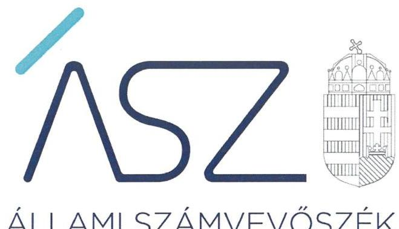
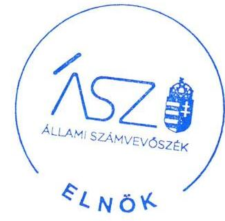
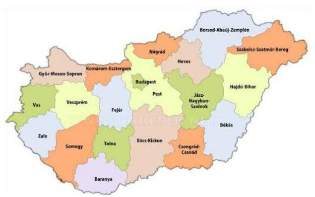
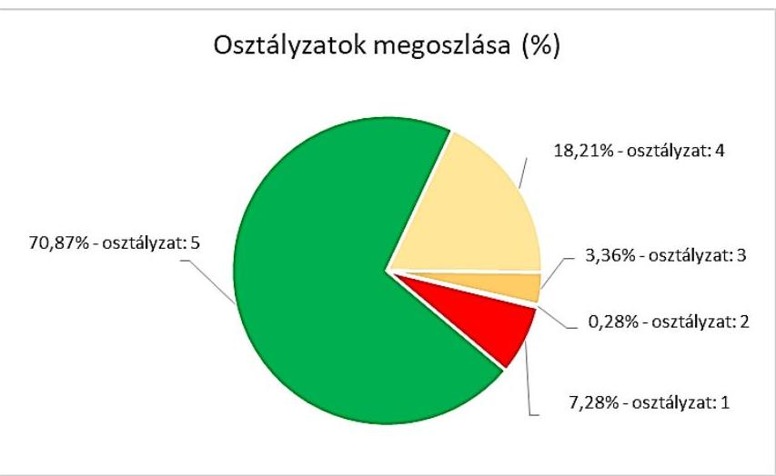

ÁLLAMI SZÁMVEVŐSZÉK

# JELENTÉS 

## Önkormányzatok ellenőrzése - Az önkormányzatok integritásának ellenőrzése

Borsod-Abaúj-Zemplén megye települési önkormányzatai
2021.

21009
www.asz.hu

---

ÁLLAMI SZÁMVEVŐSZÉK

# JELENTÉS

## Önkormányzatok ellenőrzése - Az önkormányzatok integritásának ellenőrzése

Borsod-Abaúj-Zemplén megye települési önkormányzatai

2021. 01. hó 23. nap

21009
www.asz.hu

Domokos László
elnök

---

# AZ ELLENŐRZÉST FELÜGYELTE: 

SALAMON ILDIKÓ felügyeleti vezető

AZ ELLENŐRZÉST VEZETTE ÉS A VÉGREHAJTÁSÁÉRT FELELŐS:
DR. GÁL NÓRA ellenőrzésvezető

SZAPPANOS JÚLIA ellenőrzésvezető
HOFMEISTER LÁSZLÓ ellenőrzésvezető
SALAMIN VIKTOR ellenőrzésvezető
DR. SIMON JÓZSEF ellenőrzésvezető

A PROGRAM ÖSSZEÁLLÍTÁSÁÉRT FELELŐS:
GÖRGÉNYI GÁBOR osztályvezető

Jelentéseink az Országgyúlés számítógépes hálózatán és az interneten a www.asz.hu címen is olvashatóak.

IKTATÓSZÁM: EL-3081-005/2021
TÉMASZÁM: 2548
ELLENŐRZÉS-AZONOSÍTÓ SZÁM: V0892

---

# TARTALOMJEGYZÉK 

■ ÖSSZEGZÉS ..... 5
■ AZ ELLENŐRZÉS CÉLJA ..... 7
■ AZ ELLENŐRZÉS TERÜLETE ..... 8
■ AZ ELLENŐRZÉS HÁTTERE, INDOKOLTSÁGA ..... 9
■ A JELENTÉS LÉNYEGES KÉRDÉSKÖREI. ..... 10
■ AZ ELLENŐRZÉS HATÓKÖRE ÉS MÓDSZEREI. ..... 11
■ ÉRTÉKELÉSEK. ..... 13
■ MELLÉKLETEK. ..... 19
I. sz. melléklet: Fogalomtár. ..... 19
II. sz. melléklet: Az ellenőrzött szervezetek felsorolása és értékelése ..... 21
III. sz. melléklet: Az önkormányzatok integritásának ellenőrzése során értékelt 26 dokumentum megnevezése ..... 29
IV. sz. melléklet: Értékelési keretrendszer ..... 30
■ RÖVIDÍTÉSEK JEGYZÉKE ..... 33

---

.

---

# ÖSSZEGZÉS 

Borsod-Abaúj-Zemplén megye települési önkormányzatainál 42 polgármester és 23 jegyző felelős vezetői magatartást tanúsított, az ÁSZ tanácsadása alapján már 2020-ban javitotta a beszámoló készités integritást biztositó lényeges feltételeinek a kiépitését.
Az ÁSZ rámutatott olyan alapvető területekre, amely alapján 104 önkormányzat polgármestere, valamint jegyzője részére saját felelős vezetői magatartása körében további elörelépési lehetőséget biztosit 2021-re a csalásmentes környezet kiépitése érdekében, az alapvető integritási feltételek területén.
26 önkormányzatnál, illetve a gazdálkodási feladataikat ellátó hivataloknál rendszerszintü kockázatok maradtak fenn, amelyek új, részletes ellenörzést indokolnak.

## Az ellenőrzés társadalmi indokoltsága

Az Alaptörvényben megfogalmazott alapértékek, elvek szerint minden szervezet köteles a nyilvánosság előtt elszámolni a közpénzekre vonatkozó gazdálkodásával. A közpénzeket és a nemzeti vagyont az átláthatóság és a közélet tisztaságának elve szerint kell kezelni. Az Állami Számvevőszék 2016-2018. évben végzett integritás felméréseinek eredményei rávilágítottak arra, hogy a helyi önkormányzatok a közszféra szereplői körében a kockázatosabb csoportba tartoznak.

Napjainkban kiemelt aktualitást és jelentőséget kapott a közpénzügyi helyzet javítása, az integritási szemlélet érvényesítésének erősítése. Az önkormányzatoknak fel kell készülniük arra, hogy a koronavírus okozta társadalmi és gazdasági válság növelni fogja a korrupciós nyomást.

Az Állami Számvevőszék ellenőrzése hozzájárul, hogy a helyi önkormányzatok integritási kontrolljainak kiépítettsége javuljon, ezáltal az önkormányzatok korrupciós veszélyeztetettsége csökkenjen. A járvány következtében kialakult helyzet megnövekedett feladatok elé állítja az önkormányzatokat, melyek megoldása kellő szakmai körültekintést is igényel. Szükséges minél hamarabb kialakítani az új feladatok ellátásának elszámoltatható rendjét, az erőforrások átlátható felhasználását biztosító, a visszaéléseket, a csalás lehetőségét minimálisra csökkentő belső szabályozást. Fontos, hogy az önkormányzatok tisztában legyenek az integritási kockázatokkal, azokat rendszeresen mérjék fel, és alakítsanak ki átlátható, jól szabályozott rendszereket, döntési mechanizmusokat.

Az ellenőrzés rámutathat a helyi önkormányzatok gazdálkodási tevékenységével kapcsolatos, integritást erőśtő jó gyakorlatokra is, továbbá felhívhatja a figyelmet a jogszabályi követelmények teljesítéséhez szükséges lépésekre.

## Értékelés

Alapvető társadalmi elvárás, hogy az önkormányzatok múködésében érvényesüljenek az integritás alapú hivatali elvek az állampolgárok részére nyújtott szolgáltatások során. Minden állampolgárnak azonos elvek alapján, azonos elbírálás szerint kell megkapnia az önkormányzatok által nyújtott közszolgáltatásokat úgy, hogy ennek érvényesülése az érintettek elégedettségi szintjében is jelentkezzen. Az integritás alapú elvek hiánya gyengíti a jogállamot, ezért ezen elvek mentén történő múködési környezet kiépítése és fejlesztése, valamint kockázatainak kezelése felelős vezetői magatartást igényel.

A közpénzügyi helyzet mielőbbi javítását elsődleges szempontként érvényesítve, az Állami Számvevőszék a rendelkezésére bocsátott adatok értékelése alapján az ellenőrzési program tanácsadó céljával összhangban már az ellenőrzés lefolytatásával párhuzamosan lehetőséget biztosított a jövőre vonatkozóan a vezetők számára, hogy a feltárt hibák, hiányosságok felszámolására intézkedjenek, hozzájárulva ezzel a 2020. évi beszámoló szabályszerű elkészítését biztosító csalásmentes integritási környezet kialakításához.

---

167 önkormányzatnál és 56 hivatalnál a polgármester, illetve a jegyző eleget tett az integritási kontrollok alapvető feltételeit jelentő, a jogszabályban előírt szabályozási kötelezettségének.

42 polgármester és 23 jegyző - az ÁSZ jelzése figyelembevételével - már az ellenőrzés ideje alatt, a 2020. évre vonatkozóan javította a beszámoló készítés integritást biztosító lényeges feltételeinek a kiépítését.

A szervezeti integritásnak alapvető feltétele a szabályozottság, a jogszabályokban előírt belső szabályzatok és nyilvántartások megléte, azok folyamatos, megfelelő tartalma és gyakorlati alkalmazhatósága. Az integritási kockázatok szervezeti szinten csökkenthetők azáltal, hogy kialakították a szervezeti és múködési kereteket, a gazdálkodásra vonatkozó alapvető szabályozási környezetet, valamint a kontrolltevékenységek szabályszerűgyakorlásának előfeltételeit, az integrált kockázatkezelés feltételeit.

A képviselő-testület szervezeti és múködési szabályzatában olyan alapvető fontosságú, az adott önkormányzat sajátosságait figyelembe vevő rendelkezéseket szükséges rögzíteni, amelyek alapfeltételei az önkormányzat integritás szerinti múködésének, így többek között az önkormányzat szerveinek és felelősségi viszonyainak megha tározása, valamint a képviselők vagyonnyilatkozat-tételi rendjét felügyelő bizottságlét rehozása. A szabályokat rögzítő rendelet megalkotásának 312 önkormányzatnál tettek eleget.

A pénzügyi- és a vagyongazdálkodás alapvető szabályozottsága és nyilvántartásai-a számviteli politika és a keretében kialakítandó szabályzatok, a számlarend, a gazdálkodási szabályzat, a gazdálkodási jogkörgyakorlásra jogosult személyekről és aláírás mintájukról vezetett naprakész nyilvántartás, a beszerzések lebonyolításával kapcsolatos eljárásrend - elengedhetetlen feltételei a csalásmentes szervezeti múködésnek, a közpénzek és a közvagyon integritás elvű kezelésének, valamint a számviteli beszámoló szabályszerű elkészítésének. A hivatal a számviteli politika és az annak a keretén belül elkészítendő számviteli szabályzatok elkészítésével biztosítja pénzügyi- és vagyongazdálkodása átláthatóságának és elszámoltathatóságának feltételeit, kereteit.

A szabályozások és nyilvántartások kialakításának célja nem önmagában a jogszabályi rendelkezések betartása, hanem az önkormányzat szabályozottságán keresztül a szabályszerű és csalásmentes gazdálkodás feltételeinek megteremtése, ezáltal az Alaptörvényben előírt átláthatóság és elszámoltathatóság elvének érvényesítése. Ezeknek az alapelveknek érvényesülése hozzájárulhat ahhoz, hogy az önkormányzatok felé irányuló közbizalom is erősödjön.

Az integritás szempontjából lényeges dokumentumok ellenőrzésének eredménye, valamint az adatszolgáltatás és a figyelemfelhívásokra történt intézkedések kockázati értékelésének figyelembevételével a Borsod-Abaúj-Zemplén megyei települési önkormányzatok és hivatalok integritásának fennálló állapota együttesen 4,5 értékú osztályzatot ért el.

# Következtetések 

Az integritás elvű működés erősítése érdekében további kockázatcsökkentő lépések szükségesek az integritás elvű vezetés-irányítás, valamint a pénzügyi- és a vagyongazdálkodás szabályszerű feltételeinek kialakítása terén, amelyeket az érintetteknek az ÁSZ által írásban megküldött további jelzés alapján lehetőségük van megtenni önmaguktól.

Azoknál a legnagyobb kockázatú önkormányzatoknál, valamint a gazdálkodási feladataikat ellátó hivataloknál, amelyeknél rendszerszintű - önmaga által nem kezelt - kockázatot azonosított az ÁSZ, új, részletekbe menő ellenőrzés válik indokolttá.

---

# AZ ELLENŐRZÉS CÉLJA 

Az ellenőrzés célja annak értékelése, hogy a helyi önkormányzatoknál és annak gazdálkodási feladatait ellátó önkormányzati hivataloknál megteremtették-e az integritás biztosításához szükséges feltételeket, kialakították-e az integritási kontrollokhoz kapcsolódó, valamint a korrupció elleni védelmet szolgáló szabályozásokat.

A monitoring típusú ellenőrzéssel, az ellenőrzöttek jelenben lévő fejlődését figyelembe véve az Állami Számvevőszék az önkormányzatok integritásának állapotát jelző szintjét értékeli. Rámutat azokra a területekre, amelyen a felelős vezetők saját maguk képesek előrelépni oly módon, hogy az integritás érvényesüljön a napi múködésük során. Ez a cél szorosan összefügg az Állami Számvevőszékrơ szóló törvényben foglaltakkal, melynek legfőbb célja a közpénzügyi helyzet javulása.

Az elmúlt évek intézményi irányításában tapasztalt előrehaladás alapján, az együttmúködés bizalmára építve az Állami Számvevőszék nem intézkedési terv készítésére kötelezi az ellenőrzötteket, hanem az elköteleződésükre alapozva, tanácsadás keretében mozdítja elő a pozitív irányú közpénzügyi változásuk megvalósítását, ezzel is támogatva a jól irányított állam múködését.

---

# **AZ ELLENŐRZÉS TERÜLETE**

## **Borsod-Abaúj-Zemplén megye helyi önkormányzatai és önkormányzati hivatalai**

Magyarország Alaptörvénye¹ alapján az ország területe fővárosra, megyékre, városokra és községekre tagozódik.

A Magyarország helyi önkormányzatairól szóló 2011. évi CLXXXIX. törvény (a továbbiakban: Mötv.²) rendelkezései szerint a helyi önkormányzás választópolgárok közösségét megillető joga a települések (települési önkormányzatok) és a megyék (területi önkormányzatok) szintjén valósul meg.

Az önkormányzatok kötelező és önként vállalt önkormányzati feladatainak ellátását a képviselő-testület és szervei (többek között a polgármester és a jegyző) biztosítják. A polgármester képviseli a képviselő-testületet, a jegyző pedig vezetie a polgármesteri hivatalt, vagy a közös önkormányzati hivatalt.

Az önkormányzatok alapvető szabályozási feladatai tehát a polgármester és a jegyző felelősségi körébe tartoznak. Az integritás szabályozottságának magas minőségét ezért a polgármester és a jegyző felelős vezetői magatartása határozza meg elsődlegesen.

Az ellenőrzés a polgármester és a jegyző felelősségi körébe tartozó szabályozási környezetre, a főbb integritási kontrollok kiépítettségére terjed ki. Nem terjed ki az önkormányzat által alapított intézményekre, gazdasági társaságokra, alapítványokra, valamint az önkormányzati társulásokra.

Az ellenőrzésre Borsod-Abaúj-Zemplén megye mind a 359 önkormányzata és 118 hivatala kijelölésre került. Jelen ellenőrzés az ellenőrzöttek közül nem tartalmazza a megyei jogú város, valamint a megyei önkormányzat és a gazdálkodási feladataikat ellátó két hivatal ellenőrzésének eredményét. Az ellenőrzés 347 helyi önkormányzat esetében lefolytatásra került. 10 önkormányzat esetében az ellenőrzés adatszolgáltatás hiányában nem volt lefolytatható, az ÁSZ az ellenőrzött integritási kockázatát értékelte.

---

# AZ ELLENŐRZÉS HÁTTERE, INDOKOLTSÁGA 

Az Alaptörvény alapértékeket, elveket fogalmaz meg, amely szerint a közpénzekkel gazdálkodó minden szervezet köteles a nyilvánosság előtt elszámolni a közpénzekre vonatkozó gazdálkodásával. A közpénzeket és a nemzeti vagyont az átláthatóság és a közélet tisztaságának elve szerint kell kezelni.

Az ÁSZ² 2016-2018. évben végzett integritás felméréseinek eredményei azt mutatták, hogy a helyi önkormányzatok a közszféra szereplői körében a kockázatosabb csoportba tartoznak. A kisebb népességszámú települések önkormányzatai különösen veszélyeztetettek, mert kontrollkörnyezetük, integritási infrastruktúrájuk - a felmérés eredményei alapján - kevésbé kiépített.

Az ÁSZ célja, hogy új ellenőrzési megközelítést alkalmazva támogassa a közpénzügyi helyzet javítását; a monitoring típusú ellenőrzéssel helyzetképet adjon az önkormányzati alrendszer egészében az integritási szemlélet érvényesítéséről, rávilágítson az integritási kontrollok kiépítettségére, illetve további fejlesztésére. Napjainkban mindez kiemelt fontosságúvá vált. Az önkormányzatoknak fel kell készülnie arra, hogy a koronavírus okozta társadalmi és gazdasági válság növelni fogja a korrupciós nyomást, amelyre felmérésünk és ellenőrzéseink alapján az önkormányzatok nincsenek megfelelően felkészülve. Az ÁSZ ebben a helyzetben is alapvető kötelességének tartja, hogy a közpénzek őre legyen, és ellenőrzéseit az önkormányzatok körében is folytassa.

Az ÁSZ ellenőrzése hozzájárul, hogy a helyi önkormányzatok integritási kontrolljainak kiépítettsége javuljon, ezáltal az önkormányzatok integritási veszélyeztetettsége csökkenjen. A járvány következtében kialakult helyzet megnövekedett feladatok elé állítja az önkormányzatokat, melyek megoldása kellő szakmai körültekintést is igényel. Szükséges minél hamarább kialakítani az új feladatok ellátásának elszámoltatható rendjét, az erőforrások átlátható, a visszaéléseket, a csalás lehetőségét minimálisra szorító belső szabályozását. Fontos, hogy az önkormányzatok tisztában legyenek az integritás kockázatokkal, azokat ismételten mérjék fel, és alakítsanak ki átlátható, jól szabályozott rendszereket, döntési mechanizmusokat.
Az ellenőrzés rámutat a helyi önkormányzatok gazdálkodási tevékenységével kapcsolatos integritási jó gyakorlatokra is, továbbá felhívja a figyelmet a jogszabályi követelmények teljesítéséhez szükséges lépésekre is.

---

# A JELENTÉS LÉNYEGES KÉRDÉSKÖREI 

1.     - Megteremtette-e az önkormányzat polgármestere és jegyzője a csalásmentes integritást biztosító alapvető feltételeket?
2.     - Kialakította-e a hivatal jegyzője a beszámoló szabályszerű elkészitését, valamint a csalásmentes integritást biztosító alapvető feltételeket?
3.     - Milyen kockázatot hordoz az ellenőrzött szervezet fennálló integritása?

---

# AZ ELLENŐRZÉS HATÓKÖRE ÉS MÓDSZEREI 

## Az ellenőrzés típusa

| Megfelelőségi ellenőrzés.

## Az ellenőrzött időszak

Az ellenőrzött időszak a 2020. év.

## Az ellenőrzés tárgya

A szervezeti keretekkel, a múködéssel és gazdálkodással kapcsolatos szabályzatok, szabályozások, valamint a szervezeti elvekkel, értékekkel összefüggő integritás kontrollok kiépítettsége.

## Az ellenőrzött szervezet

Borsod-Abaúj-Zemplén megye helyi önkormányzatai és a gazdálkodási feladataikat ellátó önkormányzati hivatalok, a II. sz. melléklet szerint.

## Az ellenőrzés jogalapja

Az ellenőrzés jogalapját az ÁSZ tv4. 1. § (3) bekezdése képezte.

## Az ellenőrzés módszerei

Az ellenőrzést az ellenőrzési program szempontjai, az ellenőrzött időszakban hatályos jogszabályok, a jelen ellenőrzésre irányadó ÁSZ módszertan figyelembevételével végezte az ÁSZ.

Az ellenőrzés ideje alatt az ellenőrzött szervezettel történő kapcsolattartást az ÁSZ az ÁSZ SZMSZ5-ének vonatkozó előírásai alapján biztosította.

Az ellenőrzési kérdések megválaszolásához szükséges bizonyítékok megszerzése a következő ellenőrzési eljárások alkalmazásával történt: megfigyelés, összehasonlítás, elemző eljárás. Az ellenőrzési bizonyítékként felhasználható adatforrások közé tartoztak az ellenőrzési programban felsorolt adatforrások, továbbá minden - az ellenőrzés folyamán - feltárt, az ellenőrzés szempontjából információkat tartalmazó dokumentum.

---

Az ellenőrzést a kérdésekre adott válaszok kiértékelésével, valamint a megjelölt adatforrások, továbbá az adott időszakban hatályos jogszabályok, valamint az ÁSZ honlapján közzétett helyénvalósági kritériumok figyelembe vételével folytatta le az ÁSZ.

A jogszabályok által kötelezően elő nem írt, helyénvalósági kritériumokra vonatkozó követelményeket az ÁSZ nemzetközi sztenderdekben, hazai iránymutatásokban, módszertani útmutatókban szereplő „jó gyakorlatok" beazonosításával, integritási felmérésével, öntesztekkel alapozta meg. Az erre vonatkozó értékelések a jelentésben dőlt betűvel szerepelnek.

A szabályszerűségi és a helyénvalósági kritériumok viszonyát a jogszabályi előírások elsődlegessége határozza meg. A helyénvalósági kritériumok a jogszabályi előírások betartása esetén a szabályszerűségi kritériumok hatását erősítik, ellenkező esetben nem érvényesülnek.

A monitoring típusú ellenőrzés a helyi önkormányzatok integritás alapú működésének lényeges területeire fókuszált, és a lényeges dokumentumok kritikus területeinek ellenőrzésével lehetőséget biztosított a helyi önkormányzatok integritásának értékelésére. A monitoring típusú ellenőrzés emellett már az ellenőrzés folyamatában az ÁSZ figyelemfelhívásán keresztül önmaga általi előrelépési lehetőséget biztosított az integritási kockázatok csökkentésére.

A közpénzügyek átláthatóságának, rendezettségének megteremtése, a közpénzügyi helyzet mielőbbi javulása érdekében az ÁSZ három szintű tanácsadással segítette az ellenőrzött szervezeteket a csalásmentes integritást biztosító alapvető feltételek megteremtésében.

Az ellenőrzés indítását megelőzően felhívta valamennyi önkormányzat és hivatal vezetőjének figyelmét az integritás szempontjából lényeges dokumentumokra, azok ellenőrzésére.

Az ellenőrzés során a beszámoló szabályszerű elkészítését biztosító kontrollkörnyezet kialakítása, valamint a csalásmentes integritási környezet megteremtése szempontjából lényeges dokumentumok rendelkezésre állásának, továbbá azok tartalmának integritás szempontjából fontos területei értékelésére került sor. A monitoring típusú ellenőrzés már az ellenőrzés időszakában visszajelzést adott azon a dokumentumokról, amelyek javítása még hozzájárul a 2020. évi beszámoló megalapozottságának javításához. A további dokumentumok értékelésének alapján a 2021. évre tehetők meg a szervezet jogszabályoknak megfelelő, integritás alapú múködését segítő intézkedések.
Az integritás szempontjából lényeges vezetési, pénzügyi és gazdálkodási területek értékelésének eredménye, valamint az adatszolgáltatás és a figyelemfelhívásokra történt intézkedések kockázati értékelésének figyelembevételével került sor az önkormányzatok és a hivatalok integritási színvonalának együttes osztályozására. Ennek módját a III. és IV. sz. mellékletben foglalt értékelési keretrendszer tartalmazza.

---

# 1. Megteremtette-e az önkormányzat polgármestere és jegyzője a csalásmentes integritást biztosító alapvető feltételeket? 

Összegző értékelés

1.1. számú értékelés

167 önkormányzat polgármestere és jegyzője kialakította a csalásmentes integritást biztosító alapvető feltételeket. 42 önkormányzat polgármestere és jegyzője az ÁSZ tanácsadó tevékenysége eredményeként hozzájárult az integritás minőségének javulásához.

312 önkormányzat polgármestere biztosította a szervezeti integritás, múködés és vezetés alapvető szabályozási feltételeit.

270 képviselő-testület Szervezeti és Múködési Szabályzatról szóló rendelete nem hordozott integritási kockázatot.

A szervezeti és múködési szabályzat határozza meg az adott szervezet múködésének részletes szabályait, és felelősségi viszonyait, ezáltal valósul meg a szervezet belső kontrollrendszerének szabályszerű kialakítása és múködtetése. A szabályzat biztosítja továbbá az átlátható és elszámoltatható múködés alapfeltételeit, a felelősségi és feladat-ellátási viszonyokat. A szervezeti és múködési szabályzattal rendelkező szervezet a korrupciós kockázatokat rendszerszinten képes kezelni.

42 önkormányzat polgármestere felelős vezetőként az ellenőrzés által feltárt hiányosságok megszüntetése iránt 2020-ban intézkedett az ÁSZ tanácsadó tevékenységének eredményeként.

További 35 önkormányzat polgármesterének fennáll a lehetősége a feltárt hiányosságok 2021-ben történő kijavítására és ezzel az integritási kockázatok csökkentésére.

A képviselő-testületi szervezeti és múködési szabályzattal rendelkező ellenőrzöttek közül 213 önkormányzat polgármestere a jogszabályi előírásokon túl további erőfeszítéseket is tett az integritás erősítése érdekében, mivel kialakította az integritás lágy kontrolljait, vagyis felismerte a jogszabályokban elöirt, kötelező kontrollokon túl, további integritási kontrollok megerősitésének indokoltságát, amely hozzájárul a szervezet korrupcióval szembeni védettségének javításához.
A képviselő-testületi szervezeti és múködési szabályzattal nem rendelkező ellenőrzöttek közül 18 önkormányzat polgármestere szintén épített ki a korrupció ellen ható lágy kontrollokat, amelyek érdemi szerepüket a jogszabályi előírásoknak megfelelő szabályozási keretek kialakítását követően tudják betölteni.

---

# 1.2. számú értékelés 

199 önkormányzat polgármestere és jegyzője biztosította a pénzgazdálkodáshoz kapcsolódó alapvető szabályozási feltételeket.

211 önkormányzat polgármestere és jegyzője rendelkezett a számviteli szabályozás pénzgazdálkodás területét érintő alapvető dokumentumairól.

136 önkormányzatnál fennáll a lehetőség arra, hogy a jegyző a számviteli politika, illetve a polgármester a számlarend vonatkozásában felelős vezetőként a feltárt hiányosságokat 2021-ben kijavítsa és ezzel az integritási kockázatokat csökkentse.

A számviteli alapdokumentumok megléte a szabályszerű könyvvezetés és elszámolás alapvető feltétele. A számviteli politika, valamint a számlarend kialakítása biztosítja a számviteli beszámoló szabályszerű elkészítését, amely hozzájárul a korrupcióval szembeni védettség erősítéséhez.

285 önkormányzat jegyzője rendelkezett a gazdálkodási kontrolltevékenységek lényeges dokumentumairól.

23 jegyzőnek fennáll a lehetősége, hogy felelős vezetőként a feltárt hiányosságokat 2021-ben kijavítsa és ezzel az integritási kockázatokat csökkentse.
A gazdálkodási szabályzat, illetve a gazdálkodási jogkörgyakorlásra jogosult személyekről és aláírás mintájukról vezetett naprakész nyilvántartás elkészítése és vezetése által biztosítható a központi költségvetésből kapott támogatások átlátható és elszámoltatható igénybevétele és felhasználása. A szabályzatok megléte alkalmas a szervezet korrupcióval szembeni védettségének növelésére.

### 1.3. számú értékelés

294 önkormányzat jegyzője biztosította a vagyongazdálkodáshoz kapcsolódó alapvető szabályozási feltételeket.

322 önkormányzat jegyzője rendelkezett az eszközök és a források leltárkészítési és leltározási szabályzatáról, 326 önkormányzat jegyzője az eszközök és a források értékelési szabályzatáról, valamint 308 önkormányzat jegyzője a beszerzések lebonyolításával kapcsolatos eljárásrendről.

24 jegyzőnek fennáll a lehetősége, hogy felelős vezetőként a feltárt hiányosságokat 2021-ben kijavítsa és ezzel az integritási kockázatokat csökkentse.

A szabályzatok alapozzák meg a vagyon védelmét szolgáló, egységes elvek mentén történő értékelést és számbavételt, biztosítva az éves beszámolók valódiságát. Az elszámolások szabályozatlansága a korrupciós kockázatot jelent. Az eszközök és a források leltárkészítési és leltározási szabályzatban foglaltak alkalmazásával biztosítható a tulajdon védelme, továbbá, hogy a könyvviteli mérleg a tényleges helyzetnek megfelelő valós képet mutassa a vagyoni, pénzügyi helyzetről.

Az eszközök és a források értékelési szabályzatának célja az eszközök és források értékelésére vonatkozó számviteli döntések, értékelési módok, eljárások összefoglalása. Meghatározza a számviteli politika keretében hozott döntések gyakorlati végrehajtását, amely kihatással van a vagyon szabályszerű megőrzésére, gyarapítására.
A beszerzések lebonyolításával kapcsolatos eljárásrend által biztosítható az önkormányzat tevékenységének átláthatósága, a közbeszerzési értékhatár alatti beszerzések transzparenciája.

---

# 2. Kialakította-e a hivatal jegyzője a beszámoló szabályszerű elkészítését, valamint a csalásmentes integritást biztosító alapvető feltételeket? 

Összegző értékelés

2.1. számú értékelés

56 hivatal jegyzője kialakította a beszámoló szabályszerű elkészítését, valamint a csalásmentes integritást biztosító alapvető feltételeket. 23 hivatal jegyzője az ÁSZ tanácsadó tevékenysége eredményeként hozzájárult az integritás minőségének javulásához.

64 hivatal jegyzője biztosította a szervezeti integritás, müködés és vezetés alapvető szabályozási feltételeit.

90 hivatal rendelkezett Szervezeti és Müködési Szabályzattal.
A szervezeti és müködési szabályzat határozza meg a hivatal müködésének alapvető kereteit, és felelősségi viszonyait, ezáltal valósul meg a hivatal belső kontrollrendszerének szabályszerű kialakítása és múködtetése. A szabályzat biztosítja továbbá az átlátható és elszámoltatható müködés alapfeltételeit, a felelősségi és feladat-ellátási viszonyokat. A szervezeti és müködési szabályzattal rendelkező szervezet a korrupciós kockázatokat rendszerszinten képes kezelni.

23 jegyzőnek fennáll a lehetősége, hogy felelős vezetőként a feltárt hiányosságokat 2021-ben kijavítsa és ezzel az integritási kockázatokat csökkentse.

97 hivatal jegyzője rendelkezett a vagyonnyilatkozat átadására, nyilvántartására, a vagyonnyilatkozatban foglalt személyes adatok védelmére vonatkozó további szabályokról. További 6 hivatal jegyzője az ellenőrzés által feltárt hiányosságok megszüntetése iránt 2020-ban intézkedett, az ÁSZ tanácsadó tevékenységének eredményeként.

10 jegyzőnek fennáll a lehetősége, hogy felelős vezetőként a feltárt hiányosságokat 2021-ben kijavítsa és ezzel az integritási kockázatokat csökkentse.

87 hivatal jegyzője elkészítette vezetői nyilatkozatát a belső kontrollrendszer minőségéről a 2019. évre vonatkozóan. A nyilatkozatban történik meg a belső kontrollrendszer minőségének éves értékelése, amely alapján megismerhető az integritás alapú múködéshez szükséges szabályozottság aktuális állapota és a lehetséges integritási kockázatok. A dokumentum tartalmának ismeretében lehetőség nyílik a kockázatok csökkentésére teendő intézkedések kidolgozására, a korrupcióelleni védelem erősítésére.

101 hivatal jegyzője elkészítette a szervezeti integritást sértő események kezelésének eljárásrendjét, további 5 hivatal jegyzője az ellenőrzés által feltárt hiányosságok megszüntetése iránt 2020-ban intézkedett, az ÁSZ tanácsadó tevékenységének eredményeként.

7 jegyzőnek fennáll a lehetősége, hogy felelős vezetőként a feltárt hiányosságokat 2021-ben kijavítsa és ezzel az integritási kockázatokat csökkentse.

104 hivatal jegyzője rendelkezett az integrált kockázatkezelés eljárásrendjéről.

---

9 jegyzőnek fennáll a lehetősége, hogy felelős vezetőként a feltárt hiányosságokat 2021-ben kijavítsa és ezzel az integritási kockázatokat csökkentse.

A kialakított szabályzatok csökkentik a korrupciós kockázatokat, ezáltal növelve a hivatal szervezetén belüli és kifelé irányuló tevékenységének átláthatóságát, a korrupció elleni védettségre irányuló szabályozás biztosítását.

A szervezeti integritás, múködés és vezetés alapvető dokumentumaival rendelkező hivatalok közül 49 hivataljegyzője a jogszabályi előirásokon túl további erőfeszítéseket is tett az integritás erősítése érdekében, mivel kialakította az integritás lágy kontrolljait, vagyis felismerte a jogszabályokban elöirt, kötelező kontrollokon túl, további szabályozók indokoltságát, amely hozzájárul a szervezet korrupcióval szembeni védettségének javításához.
A szervezeti integritás, múködés és vezetés alapvető dokumentumainak teljes körével nem rendelkező hivatalok közül 35 hivatal jegyzője szintén épített ki a korrupció ellen ható lágy kontrollokat, amelyek érdemi szerepüket a jogszabályi előirásoknak megfelelő szabályozási keretek kialakítását követően tudják betölteni.

# 2.2. számú értékelés 

92 hivatal jegyzője biztosította a pénzgazdálkodáshoz kapcsolódó alapvető szabályozási feltételeket.

93 hivatal jegyzője rendelkezett a számviteli szabályozás pénzgazdálkodás területét érintő alapvető dokumentumairól.

A számviteli alapdokumentumok megléte a szabályszerű könyvvezetés és elszámolás alapvető feltétele. A számviteli politika, a pénzkezelési szabályzat, valamint a számlarend kialakítása biztosítja a számviteli beszámoló szabályszerű elkészítését, amely hozzájárul a korrupcióval szembeni védettség erősítéséhez.

5 hivatal jegyzője az ellenőrzés által feltárt hiányosságok megszüntetése iránt - az ÁSZ tanácsadó tevékenységének eredményeként - a számviteli politika és a számlarend vonatkozásában 2020-ban intézkedett. Ennek eredményeként az integritás szempontjából lényeges, pénzügyi területen fennálló szabályozottság a hivataloknál javult.

15 jegyzőnek fennáll a lehetősége, hogy felelős vezetőként a feltárt hiányosságokat 2021-ben kijavítsa és ezzel az integritási kockázatokat csökkentse.

102 hivatal jegyzője rendelkezett a gazdálkodási kontrolltevékenységek lényeges dokumentumairól.

A gazdálkodási szabályzat, illetve a gazdálkodási jogkörgyakorlásra jogosult személyekről és aláírás mintájukról vezetett naprakész nyilvántartás elkészítése és vezetése által biztosítható a központi költségvetésből kapott támogatások átlátható és elszámoltatható igénybevétele és felhasználása. A szabályzatok megléte alkalmas a szervezet korrupcióval szembeni védettségének növelésére.

11 jegyzőnek fennáll a lehetősége, hogy felelős vezetőként a feltárt hiányosságokat 2021-ben kijavítsa és ezzel az integritási kockázatokat csökkentse.

---

# 2.3. számú értékelés 

108 hivatal jegyzője biztosította a vagyongazdálkodáshoz kapcsolódó alapvető szabályozási feltételeket.

108 hivatal jegyzője rendelkezett az eszközök és a források leltárkészítési és leltározási szabályzatáról, 109 hivatal jegyzője az eszközök és a források értékelési szabályzatáról, illetve 107 hivatal jegyzője a beszerzések lebonyolításával kapcsolatos eljárásrendről.

6 hivatal jegyzője az ellenőrzés által feltárt hiányosságok megszüntetése iránt 2020-ban intézkedett, így - az ÁSZ tanácsadó tevékenységének eredményeként - a vagyongazdálkodás területén a szabályozottság javult.

5 jegyzőnek fennáll a lehetősége, hogy felelős vezetőként a feltárt hiányosságokat 2021-ben kijavítsa és ezzel az integritási kockázatokat csökkentse.

A szabályzatok alapozzák meg a vagyon védelmét szolgáló, egységes elvek mentén történő értékelést és számbavételt, biztosítva az éves beszámolók valódiságát. Az elszámolások szabályozatlansága a korrupciós kockázatot jelent. Az eszközök és a források leltárkészítési és leltározási szabályzatban foglaltak alkalmazásával biztosítható a tulajdon védelme, továbbá, hogy a könyvviteli mérleg a tényleges helyzetnek megfelelő valós képet mutassa a vagyoni, pénzügyi helyzetről.

Az eszközök és a források értékelési szabályzatának célja az eszközök és források értékelésére vonatkozó számviteli döntések, értékelési módok, eljárások összefoglalása. Meghatározza a számviteli politika keretében hozott döntések gyakorlati végrehajtását, amely kihatással van a vagyon szabályszerű megőrzésére, gyarapítására.
A beszerzések lebonyolításával kapcsolatos eljárásrend által biztosítható az önkormányzat tevékenységének átláthatósága, a közbeszerzési értékhatár alatti beszerzések transzparenciája.

## 3. Milyen kockázatot hordoz az ellenőrzött szervezet fennálló integritása?

Összegző értékelés Az ÁSZ tanácsadó tevékenységének eredményeként intézkedő szervezetek hozzájárultak az ellenőrzés által feltárt hibák, hiányosságok felszámolásához, a korrupciós kockázatok csökkentéséhez. 26 ellenőrzöttnél további ellenőrzés indokolt az integritási kockázatok csökkentésének érvényesülése érdekében.

Az ellenőrzés során feltárt dokumentumhiány, vagy nem megfelelő dokumentum a jogszabályokban előírtak szerinti szabályozó szerepét nem tudja betölteni, ezért az ellenőrzés során az önkormányzatok polgármesterei és a hivatalok jegyzői, mint az ellenőrzött szervezet felelős vezetői lehetőséget kaptak a feltárt hiányosságok kijavítása iránti intézkedésre. A 2020. évben ennek eredményeként 65 ellenőrzöttnél javultak az integritás alapvető feltételei. A hiányosságok megszüntetése iránt eddig nem intézkedő 229 ellenőrzöttnek is lehetősége van 2021-ben a felelős vezetői magatartás körében a szükséges intézkedéseket megtenni és ezzel a korrupciós kockázatokat csökkenteni.

---

Borsod-Abaúj-Zemplén megye települési önkormányzatai integritásának értékelése

| Osztályzat | Db | Megoszlás |
| :--: | :--: | :--: |
| 5 | 253 | $70,87 \%$ |
| 4 | 65 | $18,21 \%$ |
| 3 | 12 | $3,36 \%$ |
| 2 | 1 | $0,28 \%$ |
| 1 | 26 | $7,28 \%$ |
| Átlag: 4,5 | - | - |

Borsod-Abaúj-Zemplén megyében az önkormányzatok közel 71 \%-a kialakította az integritás alapú múködés alapvető feltételeit, közel $22 \%$ pedig további intézkedésekkel csökkentheti a korrupciós veszélyeztetettséget.

Az önkormányzatok 7 \%-a az alapvető integritási feltételeknek sem felel meg.

A II. sz. melléklet tartalmazza az egyes önkormányzat és hivatala együttes osztályozását.

10 ellenőrzött esetében az ellenőrzés nem volt lefolytatható, mivel nem bocsátották rendelkezésre az ÁSZ által megnevezett dokumentumokat, azonban a szervezetek értékelését az ÁSZ elvégezte. Az értékelés eredményeként az ellenőrzött szervezetek olyan magas kockázatúnak minősülnek, amely alapján további ellenőrzésük indokolt az integritás alapú múködés alapvető feltételeinek biztosítása érdekében. További 16 önkormányzatnál az ellenőrzés értékelése alapján olyan súlyú integritási hiányosságok állnak fenn, amely jelentősen fokozza a korrupciós kitettség kockázatát. Ennek csökkentése érdekében az ÁSZ további ellenőrzéseket tervez mind a 26 önkormányzat tekintetében.

---

# MELLÉKLETEK 

I. SZ. MELLÉKLET: FOGALOMTÁR

ÁSZ Integritás Projekt
helyi önkormányzat
integrált kockázatkezelési rendszer
kontrollkörnyezet
a) világos a szervezeti struktúra, a folyamatok átláthatóak,
b) egyértelműek a felelősségi, hatásköri viszonyok és feladatok,
c) meghatározottak, ismertek és elfogadottak az etikai elvárások a szervezet minden szintjén,
d) átlátható a humánerőforrás-kezelés,
e) biztosított a szervezeti célok és értékek irányában való elkötelezettség fejlesztése és elősegítése. (Forrás: Bkr. 6. § (1) bekezdés)
kontrolltevékenységek
költségvetési szerv vezetője
közérdekű bejelentés

Az ÁSZ 2009-ben indította el a „Korrupciós kockázatok feltérképezése - Integritás alapú közigazgatási kultúra terjesztése" című, európai uniós forrásból megvalósított kiemelt projektjét (Integritás Projekt). Az Integritás Projekt célja, hogy felmérje a közszféra intézményei korrupciós kockázatoknakvaló kitettségét, illetőleg az azok mérséklésére hivatott kontrollok szintjét. Az ÁSZ a projekt révén az integritás szemlélet minél szélesebb körrel történő megismertetését, gyakorlatba ültetését kívánja elérni. Az integritás követelményeinek megfelelő szervezeti müködést előnybenrészesítő közigazgatási kultúra elterjesztését és a korrupció elleni fellépést az ÁSZ önmagára nézve is stratégiai jelentőségű célként fogalmazta meg. A projekt a felmérésben résztvevő intézmények számára helyzetükről egyfajta „tükörképet" mutat be, ami alapot teremt a jövőbeni pozitív irányú elmozduláshoz.
(Forrás: a http://integritas.asz.hu honlapon közzétett, a 2013. évi Integritás felmérés eredményeiről készült összefoglaló tanulmány)
Magyarországon a helyi közügyek intézése és a helyi közhatalom gyakorlása érdekében helyi önkormányzatok müködnek. A helyi önkormányzatokra vonatkozó szabályokat sarkalatos törvény határozza meg (Forrás: Magyarország Alaptörvénye 31. cikk (1) és (3) bekezdés).
A helyi önkormányzás joga a települések (települési önkormányzatok) és a megyék (területi önkormányzatok) választópolgárainak közösségét illeti meg. (Forrás: Mötv. 3. § (1) bekezdés).

Olyan folyamatalapú kockázatkezelési rendszer, amely a szervezet minden tevékenységére kiterjed, egységes módszertan és eljárások alkalmazásával, a szervezet célkitűzéseinek és értékeinek figyelembevételével biztosítja a szervezet kockázatainak teljes körű azonosítását, azok meghatározott kritériumok szerinti értékelését, valamint a kockázatok kezelésére vonatkozó intézkedési terv elkészítését és az abban foglaltak nyomon követését (Forrás: Bkr. ${ }^{6} 2 . \S$ m) pontja)
A költségvetési szerv vezetője köteles olyan kontrollkörnyezetet kialakítani, amelyben
a) világos a szervezeti struktúra, a folyamatok átláthatóak,
b) egyértelműek a felelősségi, hatásköri viszonyok és feladatok,
c) meghatározottak, ismertek és elfogadottak az etikai elvárások a szervezet minden szintjén,
d) átlátható a humánerőforrás-kezelés,
e) biztosított a szervezeti célok és értékek irányában való elkötelezettség fejlesztése és elősegítése. (Forrás: Bkr. 6. § (1) bekezdés)
A költségvetési szerv vezetője által a szervezeten belül kialakított kontrolltevékenységek, melyek biztosítják a kockázatok kezelését, hozzájárulnak a szervezet céljainak eléréséhez, és erősítik a szervezet integritását.
(Forrás: Bkr. 8. § (1) bekezdés)
A helyi önkormányzat esetében a jegyző, főjegyző (Bkr. 2. §nb) pontja); a helyi önkormányzati költségvetési szerv esetén annak vezetője (Bkr. 2. §nd) pontja).
A közérdekű bejelentés olyan körülményre hívja fel a figyelmet, amelynek orvoslása vagy megszüntetése a közösség vagy az egész társadalom érdekét szolgálja. A közérdekű bejelentés javaslatot is tartalmazhat. (Forrás: a panaszokról és a közérdekű bejelentésekről szóló 2013. évi CLXV. törvény 1. § (3) bekezdés)

---

lágy kontrollok
hivatal
panasz
szervezetj integritást sértő esemény

A szervezet jogszabály által elő nem írt (belső) szabályainak betartását segítő kontrollok.
A helyi önkormányzat képviselő-testülete az önkormányzat müködésével, valamint a polgármester vagy a jegyző feladat- és hatáskörébe tartozó ügyek döntésre való előkészítésével és végrehajtásával kapcsolatos feladatok ellátására polgármesteri hivatalt vagy közös önkormányzati hivatalt hoz létre (Forrás: Mötv. 84. § (1) bekezdés).
Az önkormányzati hivatal: a polgármesteri hivatal, a főpolgármesteri hivatal, a megyei önkormányzati hivatal és a közös önkormányzati hivatal (Forrás: Áht. ${ }^{7}$ 1. § 18. pont).
A panasz olyan kérelem, amely egyéni jog- vagy érdeksérelem megszüntetésére irányul, és elintézése nem tartozik más - így különösen bírósági, közigazgatási - eljárás hatálya alá. A panasz javaslatot is tartalmazhat. (Forrás: a panaszokról és a közérdekú bejelentésekről szóló 2013. évi CLXV. törvény 1. § (2) bekezdés)
Minden olyan esemény, amely a szervezetre vonatkozó szabályoktól, valamint a jogszabályi keretek között a költségvetési szerv vezetője és az irányító szerv által meghatározott szervezeti célkitúzéseknek, értékeknek és elveknek megfelelő müködéstől eltér. (Forrás: Bkr. 2. § u) pont)

---

# II. SZ. MELLÉKLET: AZ ELLENŐRZÖTT SZERVEZETEK FELSOROLÁSA ÉS ÉRTÉKELÉSE

|  Sorszám | Önkormányzat | Hivatal | Önkormányzat és hivatala osztályzat  |
| --- | --- | --- | --- |
|  1. | Abaújjajár Község Önkormányzat | Abaújkéri Közös Önkormányzati Hivatal | 5  |
|  2. | Abaújkér Község Önkormányzata | Abaújkéri Közös Önkormányzati Hivatal | 5  |
|  3. | Abaújlak Község Önkormányzata | Selyebi Közös Önkormányzati Hivatal | 1  |
|  4. | Abaújszántó Város Önkormányzata | Abaújszántói Közös Önkormányzati Hivatal | 5  |
|  5. | Abaújszolnok Község Önkormányzata | Selyebi Közös Önkormányzati Hivatal | 1  |
|  6. | Abaújvár Község Önkormányzata | Gönci Közös Önkormányzati Hivatal | 5  |
|  7. | Abod Község Önkormányzata | Edelényi Közös Önkormányzati Hivatal | 5  |
|  8. | Aggtelek Község Önkormányzata | Ragályi Közös Önkormányzati Hivatal | 5  |
|  9. | Alacska Község Önkormányzat | Berentei Közös Önkormányzati Hivatal | 4  |
|  10. | Alsóberecki Község Önkormányzata | Mikóházai Közös Önkormányzati Hivatal | 5  |
|  11. | Alsódobsza Község Önkormányzata | Megyaszói Közös Önkormányzati Hivatal | 5  |
|  12. | Alsógagy Község Önkormányzata | Szalaszendi Közös Önkormányzati Hivatal | 5  |
|  13. | Alsóregmec Község Önkormányzata | Mikóházai Közös Önkormányzati Hivatal | 5  |
|  14. | Alsószuha Község Önkormányzata | Ragályi Közös Önkormányzati Hivatal | 5  |
|  15. | Alsótelekes Községi Önkormányzata | Rudabányai Közös Önkormányzati Hivatal | 5  |
|  16. | Alsóvadász Község Önkormányzata | Aszalói Közös Önkormányzati Hivatal | 4  |
|  17. | Alsózsolca Város Önkormányzata | Alsózsolcai Polgármesteri Hivatal | 5  |
|  18. | Arka Község Önkormányzata | Abaújkéri Közös Önkormányzati Hivatal | 5  |
|  19. | Arló Nagyközség Önkormányzata | Arlói Polgármesteri Hivatal | 5  |
|  20. | Amót Község Önkormányzata | Amóti Polgármesteri Hivatal | 5  |
|  21. | Ároktő Község Önkormányzata | Mezőcsáti Közös Önkormányzati Hivatal | 5  |
|  22. | Aszaló Község Önkormányzata | Aszalói Közös Önkormányzati Hivatal | 2  |
|  23. | Baktakék Községi Önkormányzat | Szalaszendi Közös Önkormányzati Hivatal | 5  |
|  24. | Balajt Község Önkormányzata | Szendrőládi Közös Önkormányzati Hivatal | 5  |
|  25. | Bánhorváti Községi Önkormányzat | Mályinkai Közös Önkormányzati Hivatal | 4  |
|  26. | Bánréve Község Önkormányzata | Serényfalvai Közös Önkormányzati Hivatal | 4  |
|  27. | Baskó Község Önkormányzata | Abaújkéri Közös Önkormányzati Hivatal | 5  |
|  28. | Becskeháza Község Önkormányzata | Bódvaszilasi Közös Önkormányzati Hivatal | 5  |
|  29. | Bekecs Község Önkormányzata | Bekecsi Közös Önkormányzati Hivatal | 5  |
|  30. | Berente Község Önkormányzata | Berentei Közös Önkormányzati Hivatal | 4  |
|  31. | Beret Község Önkormányzata | Szalaszendi Közös Önkormányzati Hivatal | 5  |
|  32. | Berzék Község Önkormányzata | Sajóhídvégi Közös Önkormányzati Hivatal | 5  |
|  33. | Bodroghalom Község Önkormányzata | Pácini Közös Önkormányzati Hivatal | 1  |
|  34. | Bodrogkeresztúr Község Önkormányzata | Bodrogkeresztúri Közös Önkormányzati Hivatal | 5  |
|  35. | Bodrogkisfalud Község Önkormányzata | Bodrogkeresztúri Közös Önkormányzati Hivatal | 5  |
|  36. | Bodrogolaszi Község Önkormányzata | Bodrogolaszi Közös Önkormányzati Hivatal | 4  |
|  37. | Bódvalenke Község Önkormányzata | Bódvaszilasi Közös Önkormányzati Hivatal | 5  |
|  38. | Bódvarákó Község Önkormányzata | Perkupai Közös Önkormányzati Hivatal | 5  |
|  39. | Bódvaszilas Község Önkormányzata | Bódvaszilasi Közös Önkormányzati Hivatal | 4  |
|  40. | Bogács Község Önkormányzata | Bogácsi Polgármesteri Hivatal | 5  |
|  41. | Boldogkibújfalu Község Önkormányzata | Abaújkéri Közös Önkormányzati Hivatal | 5  |
|  42. | Boldogkőváralja Községi Önkormányzat | Abaújszántói Közös Önkormányzati Hivatal | 5  |

---

|  43. | Boldva Község Önkormányzata | Boldvai Közös Önkormányzati Hivatal | 3  |
| --- | --- | --- | --- |
|  44. | Borsodbóta Község Önkormányzata | Borsodbótai Közös Önkormányzati Hivatal | 5  |
|  45. | Borsodgeszt Község Önkormányzata | Bükkábrányi Közös Önkormányzati Hivatal | 5  |
|  46. | Borsodivánka Község Önkormányzata | Mezőkövesdi Közös Önkormányzati Hivatal | 1  |
|  47. | Borsodnádasd Város Önkormányzata | Borsodnádasdi Polgármesteri Hivatal | 5  |
|  48. | Borsodszentgyörgy Község Önkormányzata | Hangonyi Közös Önkormányzati Hivatal | 5  |
|  49. | Borsodszirák Község Önkormányzata | Borsodsziráki Közös Önkormányzati Hivatal | 5  |
|  50. | Bózsva Község Önkormányzata | Pálházaí Közös Önkormányzati Hivatal | 5  |
|  51. | Bőcs Község Önkormányzata | Bőcsi Polgármesteri Hivatal | 4  |
|  52. | Bükkábrány Község Önkormányzata | Bükkábrányi Közös Önkormányzati Hivatal | 5  |
|  53. | Bükkaranyos Község Önkormányzata | Kisgyőri Közös Önkormányzati Hivatal | 5  |
|  54. | Bükkmogyorósd Község Önkormányzata | Nekézsenyi Közös Önkormányzati Hivatal | 5  |
|  55. | Bükkszentkereszt Község Önkormányzata | Bükkszentkereszti Közös Önkormányzati Hivatal | 1  |
|  56. | Bükkzsérc Község Önkormányzata | Cserépfalui Közös Önkormányzati Hivatal | 3  |
|  57. | Bizitós Község Önkormányzata | Krasznokvajdai Közös Önkormányzati Hivatal | 4  |
|  58. | Cigánd Város Önkormányzata | Cigándi Közös Önkormányzati Hivatal | 5  |
|  59. | Csenyéte Község Önkormányzata | Krasznokvajdai Közös Önkormányzati Hivatal | 5  |
|  60. | Cserépfalu Község Önkormányzata | Cserépfalui Közös Önkormányzati Hivatal | 3  |
|  61. | Cserépváralja Község Önkormányzata | Cserépfalui Közös Önkormányzati Hivatal | 4  |
|  62. | Csernely Községi Önkormányzat | Nekézsenyi Közös Önkormányzati Hivatal | 5  |
|  63. | Csincse Község Önkormányzata | Mezőnyárádi Közös Önkormányzati Hivatal | 1  |
|  64. | Csobád Község Önkormányzata | Ináncsi Közös Önkormányzati Hivatal | 5  |
|  65. | Csobaj Község Önkormányzata | Tokaji Közös Önkormányzati Hivatal | 5  |
|  66. | Csokvaomány Községi Önkormányzat | Nekézsenyi Közös Önkormányzati Hivatal | 5  |
|  67. | Damak Község Önkormányzata | Edelényi Közös Önkormányzati Hivatal | 5  |
|  68. | Dámóc Község Önkormányzata | Ricsei Közös Önkormányzati Hivatal | 5  |
|  69. | Debréte Község Önkormányzata | Szalonnai Közös Önkormányzati Hivatal | 5  |
|  70. | Dédestapolcsány Község Önkormányzata | Szuhakállói Közös Önkormányzati Hivatal | 5  |
|  71. | Detek Község Önkormányzata | Szalaszendi Közös Önkormányzati Hivatal | 1  |
|  72. | Domaháza Község Önkormányzata | Hangonyi Közös Önkormányzati Hivatal | 5  |
|  73. | Dövény Község Önkormányzata | Felsőnyárádi Közös Önkormányzati Hivatal | 5  |
|  74. | Dubicsány Község Önkormányzata | Putnoki Közös Önkormányzati Hivatal | 4  |
|  75. | Edelény Város Önkormányzata | Edelényi Közös Önkormányzati Hivatal | 5  |
|  76. | Egerlövő Község Önkormányzata | Mezőkövesdi Közös Önkormányzati Hivatal | 3  |
|  77. | Égerszög Község Önkormányzata | Perkupai Közös Önkormányzati Hivatal | 1  |
|  78. | Emőd Város Önkormányzata | Emődi Polgármesteri Hivatal | 5  |
|  79. | Encs Város Önkormányzata | Encsi Polgármesteri Hivatal | 4  |
|  80. | Erdőbénye Község Önkormányzata | Bodrogkeresztúri Közös Önkormányzati Hivatal | 4  |
|  81. | Erdőhorváti Községi Önkormányzat | Tolcsvai Közös Önkormányzati Hivatal | 4  |
|  82. | Fáj Községi Önkormányzat | Szalaszendi Közös Önkormányzati Hivatal | 5  |
|  83. | Fancsal Községi Önkormányzat | Forrói Közös Önkormányzati Hivatal | 4  |
|  84. | Farkaslyuk Község Önkormányzata | Nekézsenyi Közös Önkormányzati Hivatal | 5  |
|  85. | Felsőberecki Község Önkormányzata | Mikóházai Közös Önkormányzati Hivatal | 5  |
|  86. | Felsődobszá Község Önkormányzat | Abaújszántói Közös Önkormányzati Hivatal | 4  |
|  87. | Felsőgagy Község Önkormányzata | Krasznokvajdai Közös Önkormányzati Hivatal | 5  |

---

|  88. | Felsőkelecsény Község Önkormányzata | Felsőnyárádi Közös Önkormányzati Hivatal | 5  |
| --- | --- | --- | --- |
|  89. | Felsőnyárád Községi Önkormányzat | Felsőnyárádi Közös Önkormányzati Hivatal | 5  |
|  90. | Felsőregmec Község Önkormányzata | Mikóházai Közös Önkormányzati Hivatal | 5  |
|  91. | Felsőtelekes Községi Önkormányzat | Ormosbányai Közös Önkormányzati Hivatal | 5  |
|  92. | Felsővadász Községi Önkormányzat | Homrogdi Közös Önkormányzati Hivatal | 5  |
|  93. | Felsőzsolca Város Önkormányzata | Felsőzsolcai Polgármesteri Hivatal | 5  |
|  94. | Filkeháza Községi Önkormányzat | Pálházai Közös Önkormányzati Hivatal | 5  |
|  95. | Fony Község Önkormányzata | Telkibányai Közös Önkormányzati Hivatal | 5  |
|  96. | Forró Községi Önkormányzat | Forrói Közös Önkormányzati Hivatal | 4  |
|  97. | Fulőkércs Község Önkormányzata | Mérai Közös Önkormányzati Hivatal | 5  |
|  98. | Füzér Község Önkormányzata | Mikóházai Közös Önkormányzati Hivatal | 5  |
|  99. | Füzérkajata Községi Önkormányzat | Pálházai Közös Önkormányzati Hivatal | 5  |
|  100. | Füzérkomlós Községi Önkormányzat | Pálházai Közös Önkormányzati Hivatal | 5  |
|  101. | Füzérradvány Községi Önkormányzat | Mikóházai Közös Önkormányzati Hivatal | 5  |
|  102. | Gadna Községi Önkormányzat | Homrogdi Közös Önkormányzati Hivatal | 5  |
|  103. | Gagyapáti Község Önkormányzata | Krasznokvajdai Közös Önkormányzati Hivatal | 5  |
|  104. | Gagybátor Községi Önkormányzat | Selyebi Közös Önkormányzati Hivatal | 3  |
|  105. | Gagyvendégi Községi Önkormányzat | Selyebi Közös Önkormányzati Hivatal | 1  |
|  106. | Galvács Község Önkormányzata | Szendrői Közös Önkormányzati Hivatal | 5  |
|  107. | Garadna Község Önkormányzata | Novajidrányi Közös Önkormányzati Hivatal | 5  |
|  108. | Gelej Község Önkormányzata | Tiszatarjáni Közös Önkormányzati Hivatal | 5  |
|  109. | Gesztely Község Önkormányzat | Gesztelyi Polgármesteri Hivatal | 5  |
|  110. | Gibárt Község Önkormányzata | Abaújkéri Közös Önkormányzati Hivatal | 5  |
|  111. | Girincs Község Önkormányzata | Kesznyéteni Közös Önkormányzati Hivatal | 4  |
|  112. | Golop Község Önkormányzata | Tállyai Közös Önkormányzati Hivatal | 5  |
|  113. | Gömörszőlős Község Önkormányzata | Királdi Közös Önkormányzati Hivatal | 5  |
|  114. | Gönc Város Önkormányzata | Gönci Közös Önkormányzati Hivatal | 3  |
|  115. | Göncruszka Község Önkormányzata | Vilmányi Közös Önkormányzati Hivatal | 1  |
|  116. | Györgytarló Község Önkormányzata | Kenézlői Közös Önkormányzati Hivatal | 5  |
|  117. | Halmaj Községi Önkormányzat | Halmaji Közös Önkormányzati Hivatal | 4  |
|  118. | Hangács Község Önkormányzata | Borsodsziráki Közös Önkormányzati Hivatal | 5  |
|  119. | Hangony Községi Önkormányzat | Hangonyi Közös Önkormányzati Hivatal | 5  |
|  120. | Háromhuta Község Önkormányzata | Tolcsvai Közös Önkormányzati Hivatal | 5  |
|  121. | Harsány Község Önkormányzata | Harsányi Polgármesteri Hivatal | 5  |
|  122. | Hegymeg Község Önkormányzata | Borsodsziráki Közös Önkormányzati Hivatal | 5  |
|  123. | Hejze Község Önkormányzata | Telkibányai Közös Önkormányzati Hivatal | 5  |
|  124. | Hejőbába Községi Önkormányzat | Hejőbábai Közös Önkormányzati Hivatal | 5  |
|  125. | Hejőkeresztúr Község Önkormányzata | Hejőbábai Közös Önkormányzati Hivatal | 5  |
|  126. | Hejőkúrt Község Önkormányzata | Tiszapalkonyai Közös Önkormányzati Hivatal | 5  |
|  127. | Hejőpapi Község Önkormányzata | Mezőcsáti Közös Önkormányzati Hivatal | 5  |
|  128. | Hejőszalonta Község Önkormányzata | Nemesbikki Közös Önkormányzati Hivatal | 4  |
|  129. | Herceglcút Község Önkormányzata | Bodrogolaszi Közös Önkormányzati Hivatal | 5  |
|  130. | Hemádbúd Község Önkormányzata | Abaújkéri Közös Önkormányzati Hivatal | 5  |
|  131. | Hemádcéce Község Önkormányzata | Abaújkéri Közös Önkormányzati Hivatal | 5  |
|  132. | Hemádkak Község Önkormányzata | Hemádkaki Közös Önkormányzati Hivatal | 4  |

---

|  133. | Hemádkércs Község Önkormányzata | Szikszói Közös Önkormányzati Hivatal | 5  |
| --- | --- | --- | --- |
|  134. | Hemádnémeti Nagyközség Önkormányzata | Hemádnémeti Polgármesteri Hivatal | 5  |
|  135. | Hemádpetri Község Önkormányzata | Novajidrányi Közös Önkormányzati Hivatal | 5  |
|  136. | Hemádszentandrás Község Önkormányzata | Ináncsi Közös Önkormányzati Hivatal | 1  |
|  137. | Hemádszurdok Község Önkormányzata | Hidasnémeti Közös Önkormányzati Hivatal | 4  |
|  138. | Hemádvécse Község Önkormányzata | Novajidrányi Közös Önkormányzati Hivatal | 5  |
|  139. | Hét Község Önkormányzata | Serényfalvai Közös Önkormányzati Hivatal | 4  |
|  140. | Hidasnémeti Község Önkormányzata | Hidasnémeti Közös Önkormányzati Hivatal | 4  |
|  141. | Hidvégardó Község Önkormányzata | Perkupai Közös Önkormányzati Hivatal | 5  |
|  142. | Hollóháza Község Önkormányzata | Pálháza Közös Önkormányzati Hivatal | 5  |
|  143. | Homrogd Község Önkormányzata | Homrogdi Közös Önkormányzati Hivatal | 4  |
|  144. | Ignici Község Önkormányzata | Tiszatarjáni Közös Önkormányzati Hivatal | 5  |
|  145. | Imola Község Önkormányzata | Ragályi Közös Önkormányzati Hivatal | 5  |
|  146. | Ináncs Község Önkormányzata | Ináncsi Közös Önkormányzati Hivatal | 4  |
|  147. | Insta Község Önkormányzata | Borsodsziráki Közös Önkormányzati Hivatal | 5  |
|  148. | Izsófalva Nagyközség Önkormányzata | Rudabányai Közös Önkormányzati Hivatal | 5  |
|  149. | Jákfalva Község Önkormányzata | Felsőnyárádi Közös Önkormányzati Hivatal | 5  |
|  150. | Járdánháza Község Önkormányzata | Nekézsenyi Közös Önkormányzati Hivatal | 5  |
|  151. | Jósvafő Község Önkormányzata | Ragályi Közös Önkormányzati Hivatal | 5  |
|  152. | Kács Község Önkormányzata | Bükkábrányi Közös Önkormányzati Hivatal | 5  |
|  153. | Kánó Községi Önkormányzat | Ragályi Közös Önkormányzati Hivatal | 5  |
|  154. | Kány Község Önkormányzata | Krasznokvajdai Közös Önkormányzati Hivatal | 4  |
|  155. | Karcsa Község Önkormányzata | Karcsai Közös Önkormányzati Hivatal | 1  |
|  156. | Karos Község Önkormányzata | Pácini Közös Önkormányzati Hivatal | 5  |
|  157. | Kazincbarcika Város Önkormányzata | Kazincbarcikai Polgármesteri Hivatal | 5  |
|  158. | Kázsmárk Község Önkormányzata | Kázsmárki Közös Önkormányzati Hivatal | 4  |
|  159. | Kéked Község Önkormányzata | Telkibányai Közös Önkormányzati Hivatal | 5  |
|  160. | Kelemér Község Önkormányzata | Királdi Közös Önkormányzati Hivatal | 5  |
|  161. | Kenézői Község Önkormányzata | Kenézői Közös Önkormányzati Hivatal | 5  |
|  162. | Keresztéte Község Önkormányzata | Krasznokvajdai Közös Önkormányzati Hivatal | 4  |
|  163. | Kesznyéten Község Önkormányzata | Kesznyéteni Közös Önkormányzati Hivatal | 4  |
|  164. | Királd Község Önkormányzata | Királdi Közös Önkormányzati Hivatal | 5  |
|  165. | Kiscsécs Község Önkormányzata | Kesznyéteni Közös Önkormányzati Hivatal | 4  |
|  166. | Kisgyőr Község Önkormányzata | Kisgyőri Közös Önkormányzati Hivatal | 5  |
|  167. | Kishuta Községi Önkormányzat | Pálháza Közös Önkormányzati Hivatal | 5  |
|  168. | Kiskinizs Községi Önkormányzat | Halmaji Közös Önkormányzati Hivatal | 5  |
|  169. | Kisrozvágy Község Önkormányzata | Ricsei Közös Önkormányzati Hivatal | 5  |
|  170. | Kissikátor Község Önkormányzata | Hangonyi Közös Önkormányzati Hivatal | 5  |
|  171. | Kistokaj Község Önkormányzata | Kistokaji Közös Önkormányzati Hivatal | 4  |
|  172. | Komjáti Község Önkormányzata | Bódvaszilasi Közös Önkormányzati Hivatal | 5  |
|  173. | Komlóska Község Önkormányzata | Bodrogolaszi Közös Önkormányzati Hivatal | 5  |
|  174. | Kondó Község Önkormányzata | Varbói Közös Önkormányzati Hivatal | 4  |
|  175. | Korlát Község Önkormányzata | Abaújkéri Közös Önkormányzati Hivatal | 5  |
|  176. | Kovácsvágás Községi Önkormányzat | Mikóháza Közös Önkormányzati Hivatal | 5  |
|  177. | Köröm Község Önkormányzata | Sajóhídvégi Közös Önkormányzati Hivatal | 5  |

---

|  178. | Krasznokvajda Község Önkormányzata | Krasznokvajdai Közös Önkormányzati Hivatal | 4  |
| --- | --- | --- | --- |
|  179. | Kupa Községi Önkormányzat | Homrogdi Közös Önkormányzati Hivatal | 5  |
|  180. | Kurityán Község Önkormányzata | Múcsonyi Közös Önkormányzati Hivatal | 5  |
|  181. | Lácacséke Község Önkormányzata | Cigándi Közös Önkormányzati Hivatal | 5  |
|  182. | Ládbesenyő Község Önkormányzata | Szendrőládi Közös Önkormányzati Hivatal | 5  |
|  183. | Lak Községi Önkormányzat | Borsodsziráki Közös Önkormányzati Hivatal | 5  |
|  184. | Legyesbénye Község Önkormányzata | Bekecsi Közös Önkormányzati Hivatal | 4  |
|  185. | Léh Községi Önkormányzat | Kázsmárki Közös Önkormányzati Hivatal | 4  |
|  186. | Lénárddaróc Község Önkormányzata | Nekézsenyi Közös Önkormányzati Hivatal | 5  |
|  187. | Litka Község Önkormányzata | Szalaszendi Közös Önkormányzati Hivatal | 5  |
|  188. | Mád Község Önkormányzata | Mádi Polgármesteri Hivatal | 5  |
|  189. | Makkoshotyka Község Önkormányzata | Vajdácskai Közös Önkormányzati Hivatal | 4  |
|  190. | Mályi Község Önkormányzata | Mályi Polgármesteri Hivatal | 5  |
|  191. | Mályinka Község Önkormányzata | Mályinkai Közös Önkormányzati Hivatal | 4  |
|  192. | Martonyi Község Önkormányzata | Szalonnai Közös Önkormányzati Hivatal | 5  |
|  193. | Megyaszó Község Önkormányzata | Megyaszói Közös Önkormányzati Hivatal | 4  |
|  194. | Méra Község Önkormányzata | Mérai Közös Önkormányzati Hivatal | 5  |
|  195. | Meszes Község Önkormányzata | Szalonnai Közös Önkormányzati Hivatal | 5  |
|  196. | Mezőcsát Város Önkormányzata | Mezőcsáti Közös Önkormányzati Hivatal | 5  |
|  197. | Mezőkeresztes Város Önkormányzata | Mezőkeresztesi Polgármesteri Hivatal | 5  |
|  198. | Mezőkövesd Város Önkormányzata | Mezőkövesdi Közös Önkormányzati Hivatal | 1  |
|  199. | Mezőnagymihály Község Önkormányzata | Szentistváni Közös Önkormányzati Hivatal | 5  |
|  200. | Mezőnyárád Község Önkormányzata | Mezőnyárádi Közös Önkormányzati Hivatal | 4  |
|  201. | Mezőzombor Község Önkormányzata | Mezőzombori Polgármesteri Hivatal | 4  |
|  202. | Mikóháza Községi Önkormányzat | Mikóháza Közös Önkormányzati Hivatal | 4  |
|  203. | Mogyoróska Község Önkormányzata | Telkibányai Közös Önkormányzati Hivatal | 5  |
|  204. | Monaj Község Önkormányzata | Homrogdi Közös Önkormányzati Hivatal | 5  |
|  205. | Monok Község Önkormányzata | Rátkai Közös Önkormányzati Hivatal | 1  |
|  206. | Múcsony Nagyközség Önkormányzat | Múcsonyi Közös Önkormányzati Hivatal | 5  |
|  207. | Muhi Község Önkormányzata | Kesznyéteni Közös Önkormányzati Hivatal | 4  |
|  208. | Nagybarca Községi Önkormányzat | Mályinkai Közös Önkormányzati Hivatal | 1  |
|  209. | Nagycsécs Község Önkormányzata | Sajóórósi Közös Önkormányzati Hivatal | 5  |
|  210. | Nagyhuta Községi Önkormányzat | Pálháza Közös Önkormányzati Hivatal | 5  |
|  211. | Nagykinizs Község Önkormányzata | Szikszói Közös Önkormányzati Hivatal | 5  |
|  212. | Nagyrozvágy Község Önkormányzata | Ricsei Közös Önkormányzati Hivatal | 5  |
|  213. | Négyes Község Önkormányzata | Mezőkövesdi Közös Önkormányzati Hivatal | 5  |
|  214. | Nekézseny Község Önkormányzata | Nekézsenyi Közös Önkormányzati Hivatal | 5  |
|  215. | Nemesbikk Község Önkormányzata | Nemesbikki Közös Önkormányzati Hivatal | 4  |
|  216. | Novajidrány Község Önkormányzata | Novajidrányi Közös Önkormányzati Hivatal | 5  |
|  217. | Nyékládháza Város Önkormányzata | Nyékládházi Polgármesteri Hivatal | 5  |
|  218. | Nyésta Község Önkormányzata | Homrogdi Közös Önkormányzati Hivatal | 5  |
|  219. | Nyíri Község Önkormányzata | Pálháza Közös Önkormányzati Hivatal | 5  |
|  220. | Nyomár Község Önkormányzata | Borsodsziráki Közös Önkormányzati Hivatal | 5  |
|  221. | Olaszliszka Község Önkormányzata | Bodrogolaszi Közös Önkormányzati Hivatal | 5  |
|  222. | Onga Város Önkormányzata | Ongai Polgármesteri Hivatal | 5  |

---

|  223. | Önod Község Önkormányzata | Önodi Polgármesteri Hivatal | 5  |
| --- | --- | --- | --- |
|  224. | Ormosbánya Községi Önkormányzat | Ormosbányai Közös Önkormányzati Hivatal | 5  |
|  225. | Oszlár Község Önkormányzata | Tiszapalkonyai Közös Önkormányzati Hivatal | 5  |
|  226. | Özd Város Önkormányzata | Özdí Polgármesteri Hivatal | 5  |
|  227. | Pácin Község Önkormányzata | Pácini Közös Önkormányzati Hivatal | 4  |
|  228. | Pálháza Város Önkormányzata | Pálháza Közös Önkormányzati Hivatal | 4  |
|  229. | Pamiény Község Önkormányzata | Selyebi Közös Önkormányzati Hivatal | 1  |
|  230. | Pányok Község Önkormányzata | Telkibányai Közös Önkormányzati Hivatal | 5  |
|  231. | Parasznya Község Önkormányzata | Parasznyai Közös Önkormányzati Hivatal | 5  |
|  232. | Pere Község Önkormányzata | Abaújkéri Közös Önkormányzati Hivatal | 5  |
|  233. | Perecse Község Önkormányzata | Krasznokvajdai Közös Önkormányzati Hivatal | 4  |
|  234. | Perkupa Község Önkormányzata | Perkupai Közös Önkormányzati Hivatal | 5  |
|  235. | Prügy Község Önkormányzat | Prügyi Közös Önkormányzati Hivatal | 5  |
|  236. | Pusztafalu Község Önkormányzata | Pálháza Közös Önkormányzati Hivatal | 5  |
|  237. | Pusztaradvány Község Önkormányzata | Novajidrányi Közös Önkormányzati Hivatal | 5  |
|  238. | Putnok Város Önkormányzata | Putnoki Közös Önkormányzati Hivatal | 3  |
|  239. | Radostyán Község Önkormányzata | Parasznyai Közös Önkormányzati Hivatal | 5  |
|  240. | Ragály Község Önkormányzata | Ragályi Közös Önkormányzati Hivatal | 3  |
|  241. | Rakaca Község Önkormányzata | Szalonnai Közös Önkormányzati Hivatal | 5  |
|  242. | Rakacaszend Község Önkormányzata | Szalonnai Közös Önkormányzati Hivatal | 5  |
|  243. | Rásonysápberencs Községi Önkormányzat | Kázsmárki Közös Önkormányzati Hivatal | 4  |
|  244. | Rátkai Német Nemzetiségi Települési Önkormányzat | Rátkai Közös Önkormányzati Hivatal | 4  |
|  245. | Regéc Község Önkormányzata | Telkibányai Közös Önkormányzati Hivatal | 5  |
|  246. | Répáshuta Község Önkormányzata | Bükkszentkereszti Közös Önkormányzati Hivatal | 5  |
|  247. | Révleányvár Község Önkormányzata | Cigándi Közös Önkormányzati Hivatal | 5  |
|  248. | Ricse Nagyközség Önkormányzata | Ricsei Közös Önkormányzati Hivatal | 5  |
|  249. | Rudabánya Város Önkormányzata | Rudabányai Közös Önkormányzati Hivatal | 5  |
|  250. | Rudolftelep Községi Önkormányzat | Berentei Közös Önkormányzati Hivatal | 3  |
|  251. | Sajóbábony Város Önkormányzat | Sajóbábonyi Polgármesteri Hivatal | 5  |
|  252. | Sajóecseg Község Önkormányzata | Sajókeresztúri Közös Önkormányzati Hivatal | 5  |
|  253. | Sajógalgóc Község Önkormányzata | Szuhakállói Közös Önkormányzati Hivatal | 5  |
|  254. | Sajóhídvég Község Önkormányzata | Sajóhídvégi Közös Önkormányzati Hivatal | 5  |
|  255. | Sajóvánka Község Önkormányzata | Szuhakállói Közös Önkormányzati Hivatal | 5  |
|  256. | Sajókápolna Község Önkormányzata | Parasznyai Közös Önkormányzati Hivatal | 5  |
|  257. | Sajókaza Községi Önkormányzat | Sajókazai Polgármesteri Hivatal | 5  |
|  258. | Sajókeresztúr Község Önkormányzata | Sajókeresztúri Közös Önkormányzati Hivatal | 5  |
|  259. | Sajólád Község Önkormányzata | Sajóládi Polgármesteri Hivatal | 4  |
|  260. | Sajólászlófalva Község Önkormányzata | Varbói Közös Önkormányzati Hivatal | 4  |
|  261. | Sajómercse Község Önkormányzata | Királdi Közös Önkormányzati Hivatal | 5  |
|  262. | Sajónémeti Község Önkormányzata | Királdi Közös Önkormányzati Hivatal | 5  |
|  263. | Sajóörös Község Önkormányzata | Sajóörösi Közös Önkormányzati Hivatal | 4  |
|  264. | Sajópálfala Község Önkormányzata | Sajóvárnosi Közös Önkormányzati Hivatal | 4  |
|  265. | Sajópetri Község Önkormányzata | Kistokaji Közös Önkormányzati Hivatal | 5  |
|  266. | Sajópúspóki Község Önkormányzata | Királdi Közös Önkormányzati Hivatal | 5  |
|  267. | Sajósenye Község Önkormányzata | Sajókeresztúri Közös Önkormányzati Hivatal | 5  |

---

|  268. | Sajószentpéter Városi Önkormányzat | Sajószentpéteri Polgármesteri Hivatal | 5  |
| --- | --- | --- | --- |
|  269. | Sajószöged Községi Önkormányzat | Sajószögedi Polgármesteri Hivatal | 5  |
|  270. | Sajóvámos Község Önkormányzata | Sajóvámosi Közös Önkormányzati Hivatal | 5  |
|  271. | Sajóvelezd Község Önkormányzata | Serényfalvai Közös Önkormányzati Hivatal | 4  |
|  272. | Sály Község Önkormányzata | Tibolddaráci Közös Önkormányzati Hivatal | 5  |
|  273. | Sárazsadány Község Önkormányzata | Bodrogolaszi Közös Önkormányzati Hivatal | 5  |
|  274. | Sárospatak Város Önkormányzata | Sárospataki Polgármesteri Hivatal | 4  |
|  275. | Sátá Község Önkormányzata | Borsodbótai Közös Önkormányzati Hivatal | 5  |
|  276. | Sátoraljaújhely Város Önkormányzata | Sátoraljaújhelyi Polgármesteri Hivatal | 5  |
|  277. | Selyeb Község Önkormányzata | Selyebi Közös Önkormányzati Hivatal | 1  |
|  278. | Semjén Község Önkormányzata | Ricsei Közös Önkormányzati Hivatal | 5  |
|  279. | Serényfalva Község Önkormányzata | Serényfalvai Közös Önkormányzati Hivatal | 3  |
|  280. | Sima Község Önkormányzata | Abaújszántói Közös Önkormányzati Hivatal | 5  |
|  281. | Sóstófalva Község Önkormányzat | Hemádkaki Közös Önkormányzati Hivatal | 4  |
|  282. | Szakácsi Község Önkormányzata | Szendrőládi Közös Önkormányzati Hivatal | 5  |
|  283. | Szakáld Község Önkormányzata | Nemesbikki Közös Önkormányzati Hivatal | 4  |
|  284. | Szalaszend Község Önkormányzata | Szalaszendi Közös Önkormányzati Hivatal | 4  |
|  285. | Szalonna Község Önkormányzata | Szalonnai Közös Önkormányzati Hivatal | 5  |
|  286. | Szászfa Község Önkormányzata | Selyebi Közös Önkormányzati Hivatal | 3  |
|  287. | Szegi Község Önkormányzata | Bodrogkeresztúri Közös Önkormányzati Hivatal | 5  |
|  288. | Szegilong Község Önkormányzata | Bodrogkeresztúri Közös Önkormányzati Hivatal | 5  |
|  289. | Szemere Község Önkormányzata | Szalaszendi Közös Önkormányzati Hivatal | 5  |
|  290. | Szendrő Város Önkormányzata | Szendrői Közös Önkormányzati Hivatal | 5  |
|  291. | Szendrőlád Község Önkormányzata | Szendrőládi Közös Önkormányzati Hivatal | 5  |
|  292. | Szentistván Nagyközség Önkormányzata | Szentistváni Közös Önkormányzati Hivatal | 4  |
|  293. | Szentistvánbaksa Község Önkormányzata | Szikszói Közös Önkormányzati Hivatal | 5  |
|  294. | Szerencs Város Önkormányzata | Szerencsi Polgármesteri Hivatal | 5  |
|  295. | Szikszó Város Önkormányzata | Szikszói Közös Önkormányzati Hivatal | 5  |
|  296. | Szín Községi Önkormányzat | Bódvaszilasi Közös Önkormányzati Hivatal | 5  |
|  297. | Színpetri Község Önkormányzata | Bódvaszilasi Közös Önkormányzati Hivatal | 5  |
|  298. | Szirmabesenyő Nagyközség Önkormányzata | Szirmabesenyői Polgármesteri Hivatal | 5  |
|  299. | Szomolya Község Önkormányzata | Szomolyai Közös Önkormányzati Hivatal | 5  |
|  300. | Szögliget Község Önkormányzata | Perkupai Közös Önkormányzati Hivatal | 1  |
|  301. | Szőlősardó Község Önkormányzata | Perkupai Közös Önkormányzati Hivatal | 1  |
|  302. | Szuhafő Község Önkormányzata | Ragályi Közös Önkormányzati Hivatal | 5  |
|  303. | Szuhakálló Község Önkormányzata | Szuhakállói Közös Önkormányzati Hivatal | 5  |
|  304. | Szuhogy Község Önkormányzata | Szendrői Közös Önkormányzati Hivatal | 5  |
|  305. | Taktabáj Község Önkormányzata | Bodrogkeresztúri Közös Önkormányzati Hivatal | 5  |
|  306. | Taktaharkány Nagyközség Önkormányzata | Taktaharkányi Polgármesteri Hivatal | 5  |
|  307. | Taktakenéz Község Önkormányzata | Prügyi Közös Önkormányzati Hivatal | 5  |
|  308. | Taktaszada Község Önkormányzata | Taktaszadai Polgármesteri Hivatal | 5  |
|  309. | Tállya Községi Önkormányzat | Tállyai Közös Önkormányzati Hivatal | 5  |
|  310. | Tarcal Község Önkormányzata | Tarcalí Közös Önkormányzati Hivatal | 5  |
|  311. | Tard Község Önkormányzata | Szomolyai Közös Önkormányzati Hivatal | 5  |
|  312. | Tardona Község Önkormányzata | Mályinkai Közös Önkormányzati Hivatal | 4  |

---

|  313. | Telkibánya Község Önkormányzata | Telkibányai Közös Önkormányzati Hivatal | 5  |
| --- | --- | --- | --- |
|  314. | Teresztenye Község Önkormányzata | Perkupai Közös Önkormányzati Hivatal | 1  |
|  315. | Tibolddaróc Község Önkormányzata | Tibolddaróci Közös Önkormányzati Hivatal | 5  |
|  316. | Tiszabábolna Község Önkormányzata | Mezőkövesdi Közös Önkormányzati Hivatal | 5  |
|  317. | Tiszacsermely Község Önkormányzata | Karcsai Közös Önkormányzati Hivatal | 1  |
|  318. | Tiszadorogma Község Önkormányzata | Tiszatarjáni Közös Önkormányzati Hivatal | 5  |
|  319. | Tiszakarád Község Önkormányzata | Tiszakarádi Polgármesteri Hivatal | 1  |
|  320. | Tiszakeszi Község Önkormányzata | Tiszakeszi Község Önkormányzatának Polgármesteri Hivatala | 5  |
|  321. | Tiszaladány Községi Önkormányzat | Tokaji Közös Önkormányzati Hivatal | 5  |
|  322. | Tiszalúc Nagyközség Önkormányzata | Tiszalúci Polgármesteri Hivatal | 5  |
|  323. | Tiszapalkonya Község Önkormányzata | Tiszapalkonyai Közös Önkormányzati Hivatal | 5  |
|  324. | Tiszatardos Község Önkormányzata | Tarcali Közös Önkormányzati Hivatal | 5  |
|  325. | Tiszatarján Község Önkormányzata | Tiszatarjáni Közös Önkormányzati Hivatal | 5  |
|  326. | Tiszaújváros Város Önkormányzata | Tiszaújvárosi Polgármesteri Hivatal | 5  |
|  327. | Tiszavalk Község Önkormányzata | Mezőkövesdi Közös Önkormányzati Hivatal | 1  |
|  328. | Tokaj Város Önkormányzata | Tokaji Közös Önkormányzati Hivatal | 5  |
|  329. | Tolcsva Község Önkormányzata | Tolcsvai Közös Önkormányzati Hivatal | 5  |
|  330. | Tomor Község Önkormányzata | Borsodsziráki Közös Önkormányzati Hivatal | 5  |
|  331. | Tomabarakony Község Önkormányzata | Perkupai Közös Önkormányzati Hivatal | 1  |
|  332. | Tomakápolna Község Önkormányzata | Bódvaszilasi Közös Önkormányzati Hivatal | 5  |
|  333. | Tomanádaska Község Önkormányzata | Bódvaszilasi Közös Önkormányzati Hivatal | 5  |
|  334. | Tomaszentandrás Község Önkormányzata | Bódvaszilasi Közös Önkormányzati Hivatal | 5  |
|  335. | Tomaszentjakab Község Önkormányzata | Bódvaszilasi Közös Önkormányzati Hivatal | 5  |
|  336. | Tomyosnémeti Község Önkormányzata | Hidasnémeti Közös Önkormányzati Hivatal | 4  |
|  337. | Trizs Község Önkormányzata | Ragályi Közös Önkormányzati Hivatal | 5  |
|  338. | Üzcanálos Község Önkormányzata | Hemádkaki Közös Önkormányzati Hivatal | 4  |
|  339. | Uppony Község Önkormányzata | Borsodbótai Közös Önkormányzati Hivatal | 5  |
|  340. | Vadna Község Önkormányzata | Szuhakállói Közös Önkormányzati Hivatal | 5  |
|  341. | Vágáshuta Községi Önkormányzat | Mikóházai Közös Önkormányzati Hivatal | 1  |
|  342. | Vajdácska Község Önkormányzata | Vajdácskai Közös Önkormányzati Hivatal | 4  |
|  343. | Vámosújfalu Község Önkormányzata | Tolcsvai Közös Önkormányzati Hivatal | 5  |
|  344. | Varbó Község Önkormányzata | Varbói Közös Önkormányzati Hivatal | 4  |
|  345. | Varbóc Község Önkormányzata | Perkupai Közös Önkormányzati Hivatal | 5  |
|  346. | Vatta Község Önkormányzata | Bükkábrányi Közös Önkormányzati Hivatal | 5  |
|  347. | Vilmány Község Önkormányzata | Vilmányi Közös Önkormányzati Hivatal | 1  |
|  348. | Vilyitány Község Önkormányzata | Mikóházai Közös Önkormányzati Hivatal | 5  |
|  349. | Viss Község Önkormányzata | Kenézldi Közös Önkormányzati Hivatal | 5  |
|  350. | Viszló Község Önkormányzata | Szalonnai Közös Önkormányzati Hivatal | 5  |
|  351. | Vizsoly Község Önkormányzata | Abaújkéri Közös Önkormányzati Hivatal | 5  |
|  352. | Zádorfalva Község Önkormányzata | Királdi Közös Önkormányzati Hivatal | 5  |
|  353. | Zalkod Község Önkormányzata | Kenézldi Közös Önkormányzati Hivatal | 5  |
|  354. | Zemplénagárd Községi Önkormányzat | Ricsei Közös Önkormányzati Hivatal | 5  |
|  355. | Ziliz Község Önkormányzata | Boldvai Közös Önkormányzati Hivatal | 4  |
|  356. | Zubogy Község Önkormányzata | Ragályi Közös Önkormányzati Hivatal | 5  |
|  357. | Zsujta Község Önkormányzata | Hidasnémeti Közös Önkormányzati Hivatal | 3  |

---

|  | Hivatal |  | Önkormányzat |
| :--: | :--: | :--: | :--: |
| 1 | Szervezeti és múködési szabályzat | 1 | Képviselő-testület szervezeti és müködési szabályzatáról szóló rendelet |
| 1a | Szervezeti felépítés és a müködés rendje, szervezeti egységek megnevezése | $1 a$ | Átruházott hatáskörök, önkormányzat szervei, jogállása, vagyonnyilatkozat bizottság |
| 2 | A vagyonnyilatkozat átadására, nyilvántartására, a vagyonnyilatkozatban foglalt személyes adatok védelmére vonatkozó szabályzat |  |  |
| 3 | Vezetői nyilatkozat a belső kontrollrendszer minőségéről |  |  |
| 4 | Szervezeti integritást sértő események kezelésének eljárásrendje |  |  |
| $4 a$ | bejelentő védelme, tájékoztatása |  |  |
| 5 | Integrált kockázatkezelés eljárásrendje |  |  |
| $5 a$ | kockázatok felmérésének kötelezettsége kiértékelés |  |  |
| 6 | Számviteli politika | 2 | Számviteli politika |
| $6 a$ | lényeges, nem lényeges, jelentős, nem jelentős szabályozása | $2 a$ | lényeges, nem lényeges, jelentős, nem jelentős szabályozása |
| 7 | Az eszközök és a források leltárkészítési és leltározási szabályzata | 3 | Az eszközök és a források leltárkészítési és leltározási szabályzata |
| $7 a$ | mennyiségi felvétellel történő leltározás gyakorisága | $3 a$ | mennyiségi felvétellel történő leltározás gyakorisága |
| 8 | Az eszközök és a források értékelési szabály. zata | 4 | Az eszközök és a források értékelési szabály. zata |
| $8 a$ | követetések értékelésének szabályai | $4 a$ | követetések értékelésének szabályai |
| 9 | Pénzkezelési szabályzat | 5 | Pénzkezelési szabályzat |
| $9 a$ | napi készpénz záróállomány | $5 a$ | napi készpénz záróállomány |
| 10 | Számlarend | 6 | Számlarend |
| $10 a$ | fökönyvi és az analitikus nyilvántartás kapcsolata | $6 a$ | fökönyvi és az analitikus nyilvántartás kapcsolata |
| 11 | Beszerzések lebonyolításával kapcsolatos eljárásrend | 7 | Beszerzések lebonyolításával kapcsolatos eljárásrend |
| 12 | A tervezéssel, gazdálkodással kapcsolatos belső szabályzat | 8 | A tervezéssel, gazdálkodással kapcsolatos belső szabályzat |
| $12 a$ | kötelezettségvállalás, teljesítés igazolás szabályozása | $8 a$ | kötelezettségvállalás, teljesítés igazolás szabályozása |
| 13 | A kötelezettségvállalásra, teljesítés igazolására jogosult személyekről és aláírás-mintájukról vezetett nyilvántartás | 9 | A kötelezettségvállalásra, teljesítés igazolására jogosult személyekről és aláírás-mintájukról vezetett nyilvántartás |
| 14 | Az ajándékok, egyéb előnyök elfogadásának szabályozása | 10 | Az ajándékok, egyéb előnyök elfogadásának szabályozása |
| $14 a$ | elfogadható ajándék mértéke | $10 a$ | elfogadható ajándék mértéke |
| 15 | A közérdekú bejelentések, panaszok kezelésének eljárásrendje | 11 | A közérdekú bejelentések, panaszok kezelésének eljárásrendje |

---

# Az önkormányzatok kockázati csoportba sorolásának (osztályozásának) értékelési keretrendszere 

## I. Dokumentumokkal rendelkezés

I.1. Azok a lényeges dokumentumok, amelyek hiánya felveti a csalás és korrupció kockázatát

- képviselő-testületi SZMSZ-ről szóló rendelet
- hivatali SZMSZ
- a vagyonnyilatkozat átadására, nyilvántartására, a vagyonnyilatkozatban foglalt személyes adatok védelmére vonatkozó további szabályok
- számviteli politika
- eszközök és források leltárkészítési és leltározási szabályzata, kiemelten amennyiségi felvétellel történő leltározás gyakorisága
- eszközök és források értékelési szabályzata, kiemelten a követelések értékelésének szabályai
- pénzkezelési szabályzat, kiemelten a napi készpénz záró állomány (hivatal)
- fökönyvi és az analitikus nyilvántartás kapcsolata
- beszerzések lebonyolításával kapcsolatos eljárásrend
- a kötelezettségvállalásra, teljesítés igazolására jogosult személyekről és aláírás-mintájukról vezetett nyilvántartás
I.2. Jogszabály által elő nem írt (helyénvalósági) dokumentumok
- az ajándékok, egyéb előnyök elfogadásának rendje
- a közérdekli bejelentések, panaszok kezelésének eljárásrendje
II. Az adatoknak az ellenőrzés rendelkezésére bocsátása kockázati értékelése
II.1. Nem kockázatos: a megnevezett adatokkal rendelkezett és a törvényi határidőn belül hiánytalanul rendelkezésre bocsátotta
II.2. Kiemelten magas kockázatú: a megnevezett adatokat külön figyelemfelhívásra sem bocsátotta rendelkezésre
III. Figyelemfelhívó levelekre adott válaszok kockázati értékelése
III.1. Alacsony kockázatú: együttmüködése a figyelemfelhívó levéllel összhangban volt.
III.2. Közepes kockázatú: a figyelemfelhívó levélben foglaltaktól eltérő együttműködést tanúsított.
III.3. Magas kockázatú: nem reagált, így nem volt együttmüködő.

Az egyes kockázati területek és kockázatforrások minősítése „pontozásos módszerrel" az integritás „jelző" dokumentumai és a vezetői magatartás tényhelyzeteinek értékelése alapján történt. Az értékelt dokumentumokhoz, nyilvántartásokhoz, kockázati besorolásokhoz minden esetben pontszám került hozzárendelésre, amelyek értéke alapján kockázati csoportba kerültek besorolásra 1-től (legmagasabb kockázat) 5-ig (legalacsonyabb kockázat) tartó skálán.

---

Az első lépésben azonosításra kerültek azok az önkormányzati szabályozások és nyilvántartások, amelyek hiánya felveti a csalás és korrupció kockázatát.

Második lépésben az adatoknak az ellenőrzés rendelkezésére bocsátása kockázati kritériumainak meghatározása, majd értékelése történt meg.

Harmadik lépésben a figyelemfelhívó levelekre adott válaszok kockázati kritériumainak meghatározása, majd értékelése történt meg.

Az összesített értékelést rontotta, amennyiben

- az integritás szempontjából meghatározó dokumentumok - képviselő-testületi SZMSZ, valamint a vagyonnyilatkozat átadására, nyilvántartására, a vagyonnyilatkozatban foglalt személyes adatok védelmére vonatkozó további szabályok meghatározása - hiányoztak, és azok javítása érdekében a figyelemfelhívó levél hatására sem történt intézkedés;
- az ellenőrzött adatokat nem bocsátott az ellenőrzés rendelkezésére, majd a javításra vonatkozó figyelemfelhívó levél következtében sem.

---

.

---

# RÖVIDÍTÉSEK JEGYZÉKE 

${ }^{1}$ Alaptörvény
${ }^{2}$ Mötv.
${ }^{3}$ ÁSZ
${ }^{4}$ ÁSZtv.
${ }^{5}$ ÁSZ SZMSZ
${ }^{6}$ Bkr.
${ }^{7}$ Áht.

Magyarország Alaptörvénye (2011. április 25.)
2011. évi CLXXXIX. törvény Magyarország önkormányzatairól

Állami Számvevőszék
2011. évi LXVI. törvény az Állami Számvevőszékről
Az Állami Számvevőszék elnökének 3/2019. (XII. 23.), 4/2020. (VII.31.), 7/2020.
(XII.28.) ÁSZ utasítások az Állami Számvevőszék Szervezeti és Müködési Szabályzatáról
370/2011. (XII.31.) Korm. rendelet a költségvetési szervek belső kontrollrendszeréről és belső ellenőrzéséről
2011. évi CXCV. törvény az államháztartásról

---

# ASZ 

ALLAMI SZAMVEVOSZEK
1052 Budapest, Apáczai Cs. J. u. 10. | 1364 Budapest 4. Pf. 54
TEL: +36 14849100
email: szamvevoszek@asz.hu
web: www.asz.hu | www.aszhirportal.hu