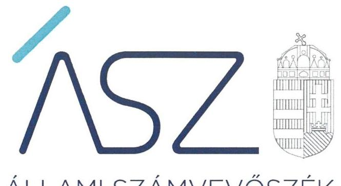
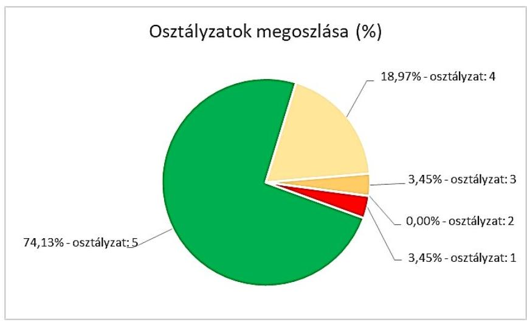

ÁLLAMI SZÁMVEVŐSZÉK

# JELENTÉS 

## Önkormányzatok ellenőrzése - Az önkormányzatok integritásának ellenőrzése

Csongrád-Csanád megye települési önkormányzatai
2021.

21010
www.asz.hu

---

ÁLLAMI SZÁMVEVŐSZÉK

# JELENTÉS 

## Önkormányzatok ellenőrzése - Az önkormányzatok integritásának ellenőrzése

Csongrád-Csanád megye települési önkormányzatai
2021. ol hó 23 nap

21010
www.asz.hu

Domokos László
elnök

---

# AZ ELLENŐRZÉST FELÜGYELTE: 

SALAMON ILDIKÓ felügyeleti vezető

## AZ ELLENŐRZÉST VEZETTE ÉS A VÉGREHAJTÁSÁÉRT FELELŐS:

DR. GÁL NÓRA ellenőrzésvezető
SZAPPANOS JÚLIA ellenőrzésvezető
RÁCZKEVI KATALIN ellenőrzésvezető
KAKAS SÁNDOR ellenőrzésvezető

A PROGRAM ÖSSZEÁLLÍTÁSÁÉRT FELELŐS:
GÖRGÉNYI GÁBOR osztályvezető

IKTATÓSZÁM: EL-3081-006/2021
TÉMASZÁM: 2548
ELLENŐRZÉS-AZONOSÍTÓ SZÁM: V0892

---

# TARTALOMJEGYZÉK 

■ ÖSSZEGZÉS ..... 5
■ AZ ELLENŐRZÉS CÉLJA ..... 7
■ AZ ELLENŐRZÉS TERÜLETE ..... 8
■ AZ ELLENŐRZÉS HÁTTERE, INDOKOLTSÁGA ..... 9
■ A JELENTÉS LÉNYEGES KÉRDÉSKÖREI. ..... 10
■ AZ ELLENŐRZÉS HATÓKÖRE ÉS MÓDSZEREI. ..... 11
■ ÉRTÉKELÉSEK. ..... 13
■ MELLÉKLETEK. ..... 19
I. sz. melléklet: Fogalomtár. ..... 19
II. sz. melléklet: Az ellenőrzött szervezetek felsorolása és értékelése ..... 21
III. sz. melléklet: Az önkormányzatok integritásának ellenőrzése során értékelt 26 dokumentum megnevezése ..... 23
IV. sz. melléklet: Értékelési keretrendszer ..... 24
■ RÖVIDÍTÉSEK JEGYZÉKE ..... 27

---

.

---

# ÖSSZEGZÉS 

Csongrád-Csanád megye települési önkormányzatainál 3 polgármester és 16 jegyző felelős vezetői magatartást tanúsított, az ÁSZ tanácsadása alapján már 2020-ban javította a beszámoló készités integritást biztositó lényeges feltételeinek a kiépitését.
Az ÁSZ rámutatott olyan alapvető területekre, amely alapján 15 önkormányzat polgármestere, valamint jegyzője részére saját felelős vezetői magatartása körében további elörelépési lehetőséget biztosit 2021-re a csalásmentes környezet kiépitése érdekében, az alapvető integritási feltételek területén.
2 önkormányzatnál, illetve a gazdálkodási feladataikat ellátó hivataloknál rendszerszintü kockázatok maradtak fenn, amelyek új, részletes ellenörzést indokolnak.

## Az ellenőrzés társadalmi indokoltsága

Az Alaptörvényben megfogalmazott alapértékek, elvek szerint minden szervezet köteles a nyilvánosság előtt elszámolni a közpénzekre vonatkozó gazdálkodásával. A közpénzeket és a nemzeti vagyont az átláthatóság és a közélet tisztaságának elve szerint kell kezelni. Az Állami Számvevőszék 2016-2018. évben végzett integritás felméréseinek eredményei rávilágítottak arra, hogy a helyi önkormányzatok a közszféra szereplői körében a kockázatosabb csoportba tartoznak.

Napjainkban kiemelt aktualitást és jelentőséget kapott a közpénzügyi helyzet javítása, az integritási szemlélet érvényesítésének erősítése. Az önkormányzatoknak fel kell készülniük arra, hogy a koronavírus okozta társadalmi és gazdasági válság növelni fogja a korrupciós nyomást.

Az Állami Számvevőszék ellenőrzése hozzájárul, hogy a helyi önkormányzatok integritási kontrolljainak kiépítettsége javuljon, ezáltal az önkormányzatok korrupciós veszélyeztetettsége csökkenjen. A járvány következtében kialakult helyzet megnövekedett feladatok elé állítja az önkormányzatokat, melyek megoldása kellő szakmai körültekintést is igényel. Szükséges minél hamarabb kialakítani az új feladatok ellátásának elszámoltatható rendjét, az erőforrások átlátható felhasználását biztosító, a visszaéléseket, a csalás lehetőségét minimálisra csökkentő belső szabályozást. Fontos, hogy az önkormányzatok tisztában legyenek az integritási kockázatokkal, azokat rendszeresen mérjék fel, és alakítsanak ki átlátható, jól szabályozott rendszereket, döntési mechanizmusokat.

Az ellenőrzés rámutathat a helyi önkormányzatok gazdálkodási tevékenységével kapcsolatos, integritást erősítő jó gyakorlatokra is, továbbá felhívhatja a figyelmet a jogszabályi követelmények teljesítéséhez szükséges lépésekre.

## Értékelés

Alapvető társadalmi elvárás, hogy az önkormányzatok múködésében érvényesüljenek az integritás alapú hivatali elvek az állampolgárok részére nyújtott szolgáltatások során. Minden állampolgárnak azonos elvek alapján, azonos elbírálás szerint kell megkapnia az önkormányzatok által nyújtott közszolgáltatásokat úgy, hogy ennek érvényesülése az érintettek elégedettségi szintjében is jelentkezzen. Az integritás alapú elvek hiánya gyengíti a jogállamot, ezért ezen elvek mentén történő múködési környezet kiépítése és fejlesztése, valamint kockázatainak kezelése felelős vezetői magatartást igényel.

A közpénzügyi helyzet mielőbbi javítását elsődleges szempontként érvényesítve, az Állami Számvevőszék a rendelkezésére bocsátott adatok értékelése alapján az ellenőrzési program tanácsadó céljával összhangban már az el-

---

lenőrzés lefolytatásával párhuzamosan lehetőséget biztosított a jövőre vonatkozóan a vezetők számára, hogy a feltárt hibák, hiányosságok felszámolására intézkedjenek, hozzájárulva ezzel a 2020. évi beszámoló szabályszerű elkészítését biztosító csalásmentes integritási környezet kialakításához.

24 önkormányzatnál és 22 hivatalnál a polgármester, illetve a jegyző eleget tett az integritási kontrollok alapvető feltételeit jelentő, a jogszabályban előírt szabályozási kötelezettségének.

3 polgármester és 16 jegyző - az ÁSZ jelzése figyelembevételével - már az ellenőrzés ideje alatt, a 2020. évre vonatkozóan javította a beszámoló készítés integritást biztosító lényeges feltételeinek a kiépítését.

A szervezeti integritásnak alapvető feltétele a szabályozottság, a jogszabályokban előírt belső szabályzatok és nyilvántartások megléte, azok folyamatos, megfelelő tartalma és gyakorlati alkalmazhatósága. Az integritási kockázatok szervezeti szinten csökkenthetők azáltal, hogy kialakították a szervezeti és működési kereteket, a gazdálkodásra vonatkozó alapvető szabályozási környezetet, valamint a kontrolltevékenységek szabályszerű gyakorlásának előfeltételeit, az integrált kockázatkezelés feltételeit.

A képviselő-testület szervezeti és működési szabályzatában olyan alapvető fontosságú, az adott önkormányzat sajátosságait figyelembe vevő rendelkezéseket szükséges rögzíteni, amelyek alapfeltételei az önkormányzat integritás szerinti működésének, így többek között az önkormányzat szerveinek és felelősségi viszonyainak meghatározása, valamint a képviselők vagyonnyilatkozat-tételi rendjét felügyelő bizottságlétrehozása. A szabályokat rögzítő rendelet megalkotásának 51 önkormányzatnál tettek eleget.

A pénzügyi- és a vagyongazdálkodás alapvető szabályozottsága és nyilvántartásai - a számviteli politika és a keretében kialakítandó szabályzatok, a számlarend, a gazdálkodási szabályzat, a gazdálkodási jogkörgyakorlásra jogosult személyekről és aláírás mintájukról vezetett naprakész nyilvántartás, a beszerzések lebonyolításával kapcsolatos eljárásrend - elengedhetetlen feltételei a csalásmentes szervezeti múködésnek, a közpénzek és a közvagyon integritás elvű kezelésének, valamint a számviteli beszámoló szabályszerű elkészítésének. A hivatal a számviteli politika és az annak a keretén belül elkészítendő számviteli szabályzatok elkészítésével biztosítja pénzügyi- és vagyongazdálkodása átláthatóságának és elszámoltathatóságának feltételeit, kereteit.

A szabályozások és nyilvántartások kialakításának célja nem önmagában a jogszabályi rendelkezések betartása, hanem az önkormányzat szabályozottságán keresztül a szabályszerű és csalásmentes gazdálkodás feltételeinek megteremtése, ezáltal az Alaptörvényben előírt átláthatóság és elszámoltathatóság elvének érvényesítése. Ezeknek az alapelveknek érvényesülése hozzájárulhat ahhoz, hogy az önkormányzatok felé irányuló közbizalom is erősödjön.

Az integritás szempontjából lényeges dokumentumok ellenőrzésének eredménye, valamint az adatszolgáltatás és a figyelemfelhívásokra történt intézkedések kockázati értékelésének figyelembevételével a Csongrád-Csanád megyei települési önkormányzatok és hivatalok integritásának fennálló állapota együttesen 4,6 értékú osztályzatot ért el.

# Következtetések 

Az integritás elvű múködés erősítése érdekében további kockázatcsökkentő lépések szükségesek az integritás elvú vezetés-irányítás, valamint a pénzügyi- és a vagyongazdálkodás szabályszerű feltételeinek kialakítása terén, amelyeket az érintetteknek az ÁSZ által írásban megküldött további jelzés alapján lehetőségük van megtenni önmaguktól.

Azoknál a legnagyobb kockázatú önkormányzatoknál, valamint a gazdálkodási feladataikat ellátó hivataloknál, amelyeknél rendszerszintű - önmaga által nem kezelt - kockázatot azonosított az ÁSZ, új, részletekbe menő ellenőrzés válik indokolttá.

---

# AZ ELLENŐRZÉS CÉLJA 

Az ellenőrzés célja annak értékelése, hogy a helyi önkormányzatoknál és annak gazdálkodási feladatait ellátó önkormányzati hivataloknál megteremtették-e az integritás biztosításához szükséges feltételeket, kialakították-e az integritási kontrollokhoz kapcsolódó, valamint a korrupció elleni védelmet szolgáló szabályozásokat.

A monitoring típusú ellenőrzéssel, az ellenőrzöttek jelenben lévő fejlődését figyelembe véve az Állami Számvevőszék az önkormányzatok integritásának állapotát jelző szintjét értékeli. Rámutat azokra a területekre, amelyen a felelős vezetők saját maguk képesek előrelépni oly módon, hogy az integritás érvényesüljön a napi múködésük során. Ez a cél szorosan összefügg az Állami Számvevőszékről szóló törvényben foglaltakkal, melynek legfőbb célja a közpénzügyi helyzet javulása.

Az elmúlt évek intézményi irányításában tapasztalt előrehaladás alapján, az együttmúködés bizalmára építve az Állami Számvevőszék nem intézkedési terv készítésére kötelezi az ellenőrzötteket, hanem az elköteleződésükre alapozva, tanácsadás keretében mozdítja elő a pozitív irányú közpénzügyi változásuk megvalósítását, ezzel is támogatva a jól irányított állam múködését.

---

# **AZ ELLENŐRZÉS TERÜLETE**

## **Csongrád-Csanád megye helyi önkormányzatai és önkormányzati hivatalai**

Magyarország Alaptörvénye¹ alapján az ország területe fővárosra, megyékre, városokra és községekre tagozódik.

A Magyarország helyi önkormányzatairól szóló 2011. évi CLXXXIX. törvény (a továbbiakban: Mötv.²) rendelkezései szerint a helyi önkormányzás választópolgárok közösségét megillető joga a települések (települési önkormányzatok) és a megyék (területi önkormányzatok) szintjén valósul meg.

Az önkormányzatok kötelező és önként vállalt önkormányzati feladatainak ellátását a képviselő-testület és szervei (többek között a polgármester és a jegyző) biztosítják. A polgármester képviseli a képviselő-testületet, a jegyző pedig vezetie a polgármesteri hivatalt, vagy a közös önkormányzati hivatalt.

Az önkormányzatok alapvető szabályozási feladatai tehát a polgármester és a jegyző felelősségi körébe tartoznak. Az integritás szabályozottságának magas minőségét ezért a polgármester és a jegyző felelős vezetői magatartása határozza meg elsődlegesen.

Az ellenőrzés a polgármester és a jegyző felelősségi körébe tartozó szabályozási környezetre, a főbb integritási kontrollok kiépítettségére terjed ki. Nem terjed ki az önkormányzat által alapított intézményekre, gazdasági társaságokra, alapítványokra, valamint az önkormányzati társulásokra.

Az ellenőrzésre Csongrád-Csanád megye mind a 61 önkormányzata és 41 hivatala kijelölésre került. Jelen ellenőrzés az ellenőrzöttek közül nem tartalmazza a két megyei jogú város, valamint a megyei önkormányzat és a gazdálkodási feladataikat ellátó három hivatal ellenőrzésének eredményét. Az ellenőrzés mind az 58 települési önkormányzat esetében lefolytatásra került.

---

# AZ ELLENŐRZÉS HÁTTERE, INDOKOLTSÁGA 

Az Alaptörvény alapértékeket, elveket fogalmaz meg, amely szerint a közpénzekkel gazdálkodó minden szervezet köteles a nyilvánosság előtt elszámolni a közpénzekre vonatkozó gazdálkodásával. A közpénzeket és a nemzeti vagyont az átláthatóság és a közélet tisztaságának elve szerint kell kezelni.

Az ÁSZ² 2016-2018. évben végzett integritás felméréseinek eredményei azt mutatták, hogy a helyi önkormányzatok a közszféra szereplői körében a kockázatosabb csoportba tartoznak. A kisebb népességszámú települések önkormányzatai különösen veszélyeztetettek, mert kontrollkörnyezetük, integritási infrastruktúrájuk - a felmérés eredményei alapján - kevésbé kiépített.

Az ÁSZ célja, hogy új ellenőrzési megközelítést alkalmazva támogassa a közpénzügyi helyzet javítását; a monitoring típusú ellenőrzéssel helyzetképet adjon az önkormányzati alrendszer egészében az integritási szemlélet érvényesítéséről, rávilágítson az integritási kontrollok kiépítettségére, illetve további fejlesztésére. Napjainkban mindez kiemelt fontosságúvá vált. Az önkormányzatoknak fel kell készülnie arra, hogy a koronavírus okozta társadalmi és gazdasági válság növelni fogja a korrupciós nyomást, amelyre felmérésünk és ellenőrzéseink alapján az önkormányzatok nincsenek megfelelően felkészülve. Az ÁSZ ebben a helyzetben is alapvető kötelességének tartja, hogy a közpénzek őre legyen, és ellenőrzéseit az önkormányzatok körében is folytassa.

Az ÁSZ ellenőrzése hozzájárul, hogy a helyi önkormányzatok integritási kontrolljainak kiépítettsége javuljon, ezáltal az önkormányzatok integritási veszélyeztetettsége csökkenjen. A járvány következtében kialakult helyzet megnövekedett feladatok elé állítja az önkormányzatokat, melyek megoldása kellő szakmai körültekintést is igényel. Szükséges minél hamarább kialakítani az új feladatok ellátásának elszámoltatható rendjét, az erőforrások átlátható, a visszaéléseket, a csalás lehetőségét minimálisra szorító belső szabályozását. Fontos, hogy az önkormányzatok tisztában legyenek az integritás kockázatokkal, azokat ismételten mérjék fel, és alakítsanak ki átlátható, jól szabályozott rendszereket, döntési mechanizmusokat.
Az ellenőrzés rámutat a helyi önkormányzatok gazdálkodási tevékenységével kapcsolatos integritási jó gyakorlatokra is, továbbá felhívja a figyelmet a jogszabályi követelmények teljesítéséhez szükséges lépésekre is.

---

# A JELENTÉS LÉNYEGES KÉRDÉSKÖREI 

1.     - Megteremtette-e az önkormányzat polgármestere és jegyzője a csalásmentes integritást biztosító alapvető feltételeket?
2.     - Kialakította-e a hivatal jegyzője a beszámoló szabályszerű elkészitését, valamint a csalásmentes integritást biztosító alapvető feltételeket?
3.     - Milyen kockázatot hordoz az ellenőrzött szervezet fennálló integritása?

---

# AZ ELLENŐRZÉS HATÓKÖRE ÉS MÓDSZEREI 

## Az ellenőrzés típusa

| Megfelelőségi ellenőrzés.

## Az ellenőrzött időszak

Az ellenőrzött időszak a 2020. év.

## Az ellenőrzés tárgya

A szervezeti keretekkel, a múködéssel és gazdálkodással kapcsolatos szabályzatok, szabályozások, valamint a szervezeti elvekkel, értékekkel összefüggő integritás kontrollok kiépítettsége.

## Az ellenőrzött szervezet

Csongrád-Csanád megye helyi önkormányzatai és a gazdálkodási feladataikat ellátó önkormányzati hivatalok, a II. sz. melléklet szerint.

## Az ellenőrzés jogalapja

Az ellenőrzés jogalapját az ÁSZ tv4. 1. § (3) bekezdése képezte.

## Az ellenőrzés módszerei

Az ellenőrzést az ellenőrzési program szempontjai, az ellenőrzött időszakban hatályos jogszabályok, a jelen ellenőrzésre irányadó ÁSZ módszertan figyelembevételével végezte az ÁSZ.

Az ellenőrzés ideje alatt az ellenőrzött szervezettel történő kapcsolattartást az ÁSZ az ÁSZ SZMSZ5-ének vonatkozó előírásai alapján biztosította.

Az ellenőrzési kérdések megválaszolásához szükséges bizonyítékok megszerzése a következő ellenőrzési eljárások alkalmazásával történt: megfigyelés, összehasonlítás, elemző eljárás. Az ellenőrzési bizonyítékként felhasználható adatforrások közé tartoztak az ellenőrzési programban felsorolt adatforrások, továbbá minden - az ellenőrzés folyamán - feltárt, az ellenőrzés szempontjából információkat tartalmazó dokumentum.

---

Az ellenőrzést a kérdésekre adott válaszok kiértékelésével, valamint a megjelölt adatforrások, továbbá az adott időszakban hatályos jogszabályok, valamint az ÁSZ honlapján közzétett helyénvalósági kritériumok figyelembe vételével folytatta le az ÁSZ.

A jogszabályok által kötelezően elő nem írt, helyénvalósági kritériumokra vonatkozó követelményeket az ÁSZ nemzetközi sztenderdekben, hazai iránymutatásokban, módszertani útmutatókban szereplő „jó gyakorlatok" beazonosításával, integritási felmérésével, öntesztekkel alapozta meg. Az erre vonatkozó értékelések a jelentésben dőlt betűvel szerepelnek.

A szabályszerűségi és a helyénvalósági kritériumok viszonyát a jogszabályi előírások elsődlegessége határozza meg. A helyénvalósági kritériumok a jogszabályi előírások betartása esetén a szabályszerűségi kritériumok hatását erősítik, ellenkező esetben nem érvényesülnek.

A monitoring típusú ellenőrzés a helyi önkormányzatok integritás alapú működésének lényeges területeire fókuszált, és a lényeges dokumentumok kritikus területeinek ellenőrzésével lehetőséget biztosított a helyi önkormányzatok integritásának értékelésére. A monitoring típusú ellenőrzés emellett már az ellenőrzés folyamatában az ÁSZ figyelemfelhívásán keresztül önmaga általi előrelépési lehetőséget biztosított az integritási kockázatok csökkentésére.

A közpénzügyek átláthatóságának, rendezettségének megteremtése, a közpénzügyi helyzet mielőbbi javulása érdekében az ÁSZ három szintű tanácsadással segítette az ellenőrzött szervezeteket a csalásmentes integritást biztosító alapvető feltételek megteremtésében.

Az ellenőrzés indítását megelőzően felhívta valamennyi önkormányzat és hivatal vezetőjének figyelmét az integritás szempontjából lényeges dokumentumokra, azok ellenőrzésére.

Az ellenőrzés során a beszámoló szabályszerű elkészítését biztosító kontrollkörnyezet kialakítása, valamint a csalásmentes integritási környezet megteremtése szempontjából lényeges dokumentumok rendelkezésre állásának, továbbá azok tartalmának integritás szempontjából fontos területei értékelésére került sor. A monitoring típusú ellenőrzés már az ellenőrzés időszakában visszajelzést adott azon a dokumentumokról, amelyek javítása még hozzájárul a 2020. évi beszámoló megalapozottságának javításához. A további dokumentumok értékelésének alapján a 2021. évre tehetők meg a szervezet jogszabályoknak megfelelő, integritás alapú működését segítő intézkedések.
Az integritás szempontjából lényeges vezetési, pénzügyi és gazdálkodási területek értékelésének eredménye, valamint az adatszolgáltatás és a figyelemfelhívásokra történt intézkedések kockázati értékelésének figyelembevételével került sor az önkormányzatok és a hivatalok integritási színvonalának együttes osztályozására. Ennek módját a III. és IV. sz. mellékletben foglalt értékelési keretrendszer tartalmazza.

---

# 1. Megteremtette-e az önkormányzat polgármestere és jegyzője a csalásmentes integritást biztosító alapvető feltételeket? 

Összegző értékelés

1.1. számú értékelés

24 önkormányzat polgármestere és jegyzője kialakította a csalásmentes integritást biztosító alapvető feltételeket. 3 önkormányzat polgármestere és jegyzője az ÁSZ tanácsadó tevékenysége eredményeként hozzájárult az integritás minőségének javulásához.

51 önkormányzat polgármestere biztosította a szervezeti integritás, múködés és vezetés alapvető szabályozási feltételeit.

48 képviselő-testület Szervezeti és Múködési Szabályzatról szóló rendelete nem hordozott integritási kockázatot.

A szervezeti és múködési szabályzat határozza meg az adott szervezet múködésének részletes szabályait, és felelősségi viszonyait, ezáltal valósul meg a szervezet belső kontrollrendszerének szabályszerű kialakítása és múködtetése. A szabályzat biztosítja továbbá az átlátható és elszámoltatható múködés alapfeltételeit, a felelősségi és feladat-ellátási viszonyokat. A szervezeti és múködési szabályzattal rendelkező szervezet a korrupciós kockázatokat rendszerszinten képes kezelni.

3 önkormányzat polgármestere felelős vezetőként az ellenőrzés által feltárt hiányosságok megszüntetése iránt 2020-ban intézkedett az ÁSZ tanácsadó tevékenységének eredményeként.

További 7 önkormányzat polgármesterének fennáll a lehetősége a feltárt hiányosságok 2021-ben történő kijavítására és ezzel az integritási kockázatok csökkentésére.

A képviselő-testületi szervezeti és múködési szabályzattal rendelkező ellenőrzöttek közül 30 önkormányzat polgármestere a jogszabályi előírásokon túl további erőfeszítéseket is tett az integritás erősítése érdekében, mivel kialakította az integritás lágy kontrolljait, vagyis felismerte a jogszabályokban elöírt, kötelező kontrollokon túl, további integritási kontrollok megerősitésének indokoltságát, amely hozzájárul a szervezet korrupcióval szembeni védettségének javításához.
A képviselő-testületi szervezeti és múködési szabályzattal nem rendelkező ellenőrzöttek közül 3 önkormányzat polgármestere szintén épített ki a korrupció ellen ható lágy kontrollokat, amelyek érdemi szerepüket a jogszabályi előírásoknak megfelelő szabályozási keretek kialakítását követően tudják betölteni.

---

# 1.2. számú értékelés 

27 önkormányzat polgármestere és jegyzője biztosította a pénzgazdálkodáshoz kapcsolódó alapvető szabályozási feltételeket.

28 önkormányzat polgármestere és jegyzője rendelkezett a számviteli szabályozás pénzgazdálkodás területét érintő alapvető dokumentumairól.

30 önkormányzatnál fennáll a lehetőség arra, hogy a jegyző a számviteli politika, illetve a polgármester a számlarend vonatkozásában felelős vezetőként a feltárt hiányosságokat 2021-ben kijavítsa és ezzel az integritási kockázatokat csökkentse.

A számviteli alapdokumentumok megléte a szabályszerű könyvvezetés és elszámolás alapvető feltétele. A számviteli politika, valamint a számlarend kialakítása biztosítja a számviteli beszámoló szabályszerű elkészítését, amely hozzájárul a korrupcióval szembeni védettség erősítéséhez.

52 önkormányzat jegyzője rendelkezett a gazdálkodási kontrolltevékenységek lényeges dokumentumairól.

5 jegyzőnek fennáll a lehetősége, hogy felelős vezetőként a feltárt hiányosságokat 2021-ben kijavítsa és ezzel az integritási kockázatokat csökkentse.
A gazdálkodási szabályzat, illetve a gazdálkodási jogkörgyakorlásra jogosult személyekről és aláírás mintájukról vezetett naprakész nyilvántartás elkészítése és vezetése által biztosítható a központi költségvetésből kapott támogatások átlátható és elszámoltatható igénybevétele és felhasználása. A szabályzatok megléte alkalmas a szervezet korrupcióval szembeni védettségének növelésére.

## 1.3. számú értékelés

50 önkormányzat jegyzője biztosította a vagyongazdálkodáshoz kapcsolódó alapvető szabályozási feltételeket.

53 önkormányzat jegyzője rendelkezett az eszközök és a források leltárkészítési és leltározási szabályzatáról, 53 önkormányzat jegyzője az eszközök és a források értékelési szabályzatáról, valamint 56 önkormányzat jegyzője a beszerzések lebonyolításával kapcsolatos eljárásrendről.

6 jegyzőnek fennáll a lehetősége, hogy felelős vezetőként a feltárt hiányosságokat 2021-ben kijavítsa és ezzel az integritási kockázatokat csökkentse.

A szabályzatok alapozzák meg a vagyon védelmét szolgáló, egységes elvek mentén történő értékelést és számbavételt, biztosítva az éves beszámolók valódiságát. Az elszámolások szabályozatlansága a korrupciós kockázatot jelent. Az eszközök és a források leltárkészítési és leltározási szabályzatban foglaltak alkalmazásával biztosítható a tulajdon védelme, továbbá, hogy a könyvviteli mérleg a tényleges helyzetnek megfelelő valós képet mutassa a vagyoni, pénzügyi helyzetről.

Az eszközök és a források értékelési szabályzatának célja az eszközök és források értékelésére vonatkozó számviteli döntések, értékelési módok, eljárások összefoglalása. Meghatározza a számviteli politika keretében hozott döntések gyakorlati végrehajtását, amely kihatással van a vagyon szabályszerű megőrzésére, gyarapítására.
A beszerzések lebonyolításával kapcsolatos eljárásrend által biztosítható az önkormányzat tevékenységének átláthatósága, a közbeszerzési értékhatár alatti beszerzések transzparenciája.

---

# 2. Kialakította-e a hivatal jegyzője a beszámoló szabályszerű elkészítését, valamint a csalásmentes integritást biztosító alapvető feltételeket? 

Összegző értékelés

22 hivatal jegyzője kialakította a beszámoló szabályszerű elkészítését, valamint a csalásmentes integritást biztosító alapvető feltételeket. 16 hivatal jegyzője az ÁSZ tanácsadó tevékenysége eredményeként hozzájárult az integritás minőségének javulásához.
2.1. számú értékelés

23 hivatal jegyzője biztosította a szervezeti integritás, múködés és vezetés alapvető szabályozási feltételeit.

34 hivatal rendelkezett Szervezeti és Múködési Szabályzattal.
A szervezeti és múködési szabályzat határozza meg a hivatal múködésének alapvető kereteit, és felelősségi viszonyait, ezáltal valósul meg a hivatal belső kontrollrendszerének szabályszerű kialakítása és múködtetése. A szabályzat biztosítja továbbá az átlátható és elszámoltatható múködés alapfeltételeit, a felelősségi és feladat-ellátási viszonyokat. A szervezeti és múködési szabályzattal rendelkező szervezet a korrupciós kockázatokat rendszerszinten képes kezelni.

4 jegyzőnek fennáll a lehetősége, hogy felelős vezetőként a feltárt hiányosságokat 2021-ben kijavítsa és ezzel az integritási kockázatokat csökkentse.

35 hivatal jegyzője rendelkezett a vagyonnyilatkozat átadására, nyilvántartására, a vagyonnyilatkozatban foglalt személyes adatok védelmére vonatkozó további szabályokról. További 2 hivatal jegyzője az ellenőrzés által feltárt hiányosságok megszüntetése iránt 2020-ban intézkedett, az ÁSZ tanácsadó tevékenységének eredményeként.

1 jegyzőnek fennáll a lehetősége, hogy felelős vezetőként a feltárt hiányosságokat 2021-ben kijavítsa és ezzel az integritási kockázatokat csökkentse.

27 hivatal jegyzője elkészítette vezetői nyilatkozatát a belső kontrollrendszer minőségéről a 2019. évre vonatkozóan. A nyilatkozatban történik meg a belső kontrollrendszer minőségének éves értékelése, amely alapján megismerhető az integritás alapú múködéshez szükséges szabályozottság aktuális állapota és a lehetséges integritási kockázatok. A dokumentum tartalmának ismeretében lehetőség nyílik a kockázatok csökkentésére teendő intézkedések kidolgozására, a korrupcióelleni védelem erősítésére.

33 hivatal jegyzője elkészítette a szervezeti integritást sértő események kezelésének eljárásrendjét, további 1 hivatal jegyzője az ellenőrzés által feltárt hiányosságok megszüntetése iránt 2020-ban intézkedett, az ÁSZ tanácsadó tevékenységének eredményeként.

4 jegyzőnek fennáll a lehetősége, hogy felelős vezetőként a feltárt hiányosságokat 2021-ben kijavítsa és ezzel az integritási kockázatokat csökkentse.

33 hivatal jegyzője rendelkezett az integrált kockázatkezelés eljárásrendjéről.

---

5 jegyzőnek fennáll a lehetősége, hogy felelős vezetőként a feltárt hiányosságokat 2021-ben kijavítsa és ezzel az integritási kockázatokat csökkentse.

A kialakított szabályzatok csökkentik a korrupciós kockázatokat, ezáltal növelve a hivatal szervezetén belüli és kifelé irányuló tevékenységének átláthatóságát, a korrupció elleni védettségre irányuló szabályozás biztosítását.

A szervezeti integritás, múködés és vezetés alapvető dokumentumaival rendelkező hivatalok közül 21 hivataljegyzője a jogszabályi előirásokon túl további erőfeszítéseket is tett az integritás erősítése érdekében, mivel kialakította az integritás lágy kontrolljait, vagyis felismerte a jogszabályokban elöirt, kötelező kontrollokon túl, további szabályozók indokoltságát, amely hozzájárul a szervezet korrupcióval szembeni védettségének javításához.
A szervezeti integritás, múködés és vezetés alapvető dokumentumainak teljes körével nem rendelkező hivatalok közül 10 hivatal jegyzője szintén épített ki a korrupció ellen ható lágy kontrollokat, amelyek érdemi szerepüket a jogszabályi előirásoknak megfelelő szabályozási keretek kialakítását követően tudják betölteni.

# 2.2. számú értékelés 

36 hivatal jegyzője biztosította a pénzgazdálkodáshoz kapcsolódó alapvető szabályozási feltételeket.

35 hivatal jegyzője rendelkezett a számviteli szabályozás pénzgazdálkodás területét érintő alapvető dokumentumairól.

A számviteli alapdokumentumok megléte a szabályszerű könyvvezetés és elszámolás alapvető feltétele. A számviteli politika, a pénzkezelési szabályzat, valamint a számlarend kialakítása biztosítja a számviteli beszámoló szabályszerű elkészítését, amely hozzájárul a korrupcióval szembeni védettség erősítéséhez.

2 hivatal jegyzője az ellenőrzés által feltárt hiányosságok megszüntetése iránt - az ÁSZ tanácsadó tevékenységének eredményeként - a számviteli politika és a számlarend vonatkozásában 2020-ban intézkedett. Ennek eredményeként az integritás szempontjából lényeges, pénzügyi területen fennálló szabályozottság a hivataloknál javult.

1 jegyzőnek fennáll a lehetősége, hogy felelős vezetőként a feltárt hiányosságokat 2021-ben kijavítsa és ezzel az integritási kockázatokat csökkentse.

37 hivatal jegyzője rendelkezett a gazdálkodási kontrolltevékenységek lényeges dokumentumairól.

A gazdálkodási szabályzat, illetve a gazdálkodási jogkörgyakorlásra jogosult személyekről és aláírás mintájukról vezetett naprakész nyilvántartás elkészítése és vezetése által biztosítható a központi költségvetésből kapott támogatások átlátható és elszámoltatható igénybevétele és felha sználása. A szabályzatok megléte alkalmas a szervezet korrupcióval szembeni védettségének növelésére.

1 jegyzőnek fennáll a lehetősége, hogy felelős vezetőként a feltárt hiányosságokat 2021-ben kijavítsa és ezzel az integritási kockázatokat csökkentse.

---

# 2.3. számú értékelés 

37 hivatal jegyzője biztosította a vagyongazdálkodáshoz kapcsolódó alapvető szabályozási feltételeket.

38 hivatal jegyzője rendelkezett az eszközök és a források leltárkészítési és leltározási szabályzatáról, 37 hivatal jegyzője az eszközök és a források értékelési szabályzatáról, illetve 38 hivatal jegyzője a beszerzések lebonyolításával kapcsolatos eljárásrendről.

1 jegyzőnek fennáll a lehetősége, hogy felelős vezetőként a feltárt hiányosságokat 2021-ben kijavítsa és ezzel az integritási kockázatokat csökkentse.

A szabályzatok alapozzák meg a vagyon védelmét szolgáló, egységes elvek mentén történő értékelést és számbavételt, biztosítva az éves beszámolók valódiságát. Az elszámolások szabályozatlansága a korrupciós kockázatot jelent. Az eszközök és a források leltárkészítési és leltározási szabályzatban foglaltak alkalmazásával biztosítható a tulajdon védelme, továbbá, hogy a könyvviteli mérleg a tényleges helyzetnek megfelelő valós képet mutassa a vagyoni, pénzügyi helyzetről.

Az eszközök és a források értékelési szabályzatának célja az eszközök és források értékelésére vonatkozó számviteli döntések, értékelési módok, eljárások összefoglalása. Meghatározza a számviteli politika keretében hozott döntések gyakorlati végrehajtását, amely kihatással van a vagyon szabályszerű megőrzésére, gyarapítására.
A beszerzések lebonyolításával kapcsolatos eljárásrend által biztosítható az önkormányzat tevékenységének átláthatósága, a közbeszerzési értékhatár alatti beszerzések transzparenciája.

## 3. Milyen kockázatot hordoz az ellenőrzött szervezet fennálló integritása?

Összegző értékelés Az ÁSZ tanácsadó tevékenységének eredményeként intézkedő szervezetek hozzájárultak az ellenőrzés által feltárt hibák, hiányosságok felszámolásához, a korrupciós kockázatok csökkentéséhez. 2 ellenőrzöttnél további ellenőrzés indokolt az integritási kockázatok csökkentésének érvényesülése érdekében.

Az ellenőrzés során feltárt dokumentumhiány, vagy nem megfelelő dokumentum a jogszabályokban előírtak szerinti szabályozó szerepét nem tudja betölteni, ezért az ellenőrzés során az önkormányzatok polgármesterei és a hivatalok jegyzői, mint az ellenőrzött szervezet felelős vezetői lehetőséget kaptak a feltárt hiányosságok kijavítása iránti intézkedésre. A 2020. évben ennek eredményeként 19 ellenőrzöttnél javultak az integritás alapvető feltételei. A hiányosságok megszüntetése iránt eddig nem intézkedő 45 ellenőrzöttnek is lehetősége van 2021-ben a felelős vezetői magatartás körében a szükséges intézkedéseket megtenni és ezzel a korrupciós kockázatokat csökkenteni.

---

Csongrád-Csanád megye települési önkormányzatai integritásának értékelése

| Osztályzat | Db | Megoszlás |
| :--: | :--: | :--: |
| 5 | 43 | $74,13 \%$ |
| 4 | 11 | $18,97 \%$ |
| 3 | 2 | $3,45 \%$ |
| 2 | 0 | $0,00 \%$ |
| 1 | 2 | $3,45 \%$ |
| Átlag: 4,6 | - | - |

Csongrád-Csanád megyében az önkormányzatok több mint $74 \%$-a kialakította az integritás alapú múködés alapvető feltételeit, közel $23 \%$ pedig további intézkedésekkel csökkentheti a korrupciós veszélyeztetettséget.

Az önkormányzatok több mint $3 \%$-a az alapvető integritási feltételeknek sem felel meg.

A II. sz. melléklet tartalmazza az egyes önkormányzat és hivatala együttes osztályozását

2 önkormányzatnál az ellenőrzés értékelése alapján olyan súlyú integritási hiányosságok állnak fenn, amely jelentősen fokozza a korrupciós kitettség kockázatát. Ennek csökkentése érdekében az ÁSZ további ellenőrzéseket tervez mind a két önkormányzat tekintetében.

---

# MELLÉKLETEK 

I. SZ. MELLÉKLET: FOGALOMTÁR

ÁSZ Integritás Projekt
helyi önkormányzat
integrált kockázatkezelési rendszer
kontrollkörnyezet
kötségvetési szerv vezetője
közérdekü bejelentés

Az ÁSZ 2009-ben indította el a „Korrupciós kockázatok feltérképezése - Integritás alapú közigazgatási kultúra terjesztése" című, európai uniós forrásból megvalósított kiemelt projektjét (Integritás Projekt). Az Integritás Projekt célja, hogy felmérje a közszféra intézményei korrupciós kockázatoknakvaló kitettségét, illetőleg az azok mérséklésére hivatott kontrollok szintjét. Az ÁSZ a projekt révén az integritás szemlélet minél szélesebb körrel történő megismertetését, gyakorlatba ültetését kívánja elérni. Az integritás követelményeinek megfelelő szervezeti müködést előnybenrészesítő közigazgatási kultúra elterjesztését és a korrupció elleni fellépést az ÁSZ önmagára nézve is stratégiai jelentőségű célként fogalmazta meg. A projekt a felmérésben résztvevő intézmények számára helyzetükről egyfajta „tükörképet" mutat be, ami alapot teremt a jövőbeni pozitív irányú elmozduláshoz.
(Forrás: a http://integritas.asz.hu honlapon közzétett, a 2013. évi Integritás felmérés eredményeiről készült összefoglaló tanulmány)
Magyarországon a helyi közügyek intézése és a helyi közhatalom gyakorlása érdekében helyi önkormányzatok müködnek. A helyi önkormányzatokra vonatkozó szabályokat sarkalatos törvény határozza meg (Forrás: Magyarország Alaptörvénye 31. cikk (1) és (3) bekezdés).
A helyi önkormányzás joga a települések (települési önkormányzatok) és a megyék (területi önkormányzatok) választópolgárainak közösségét illeti meg. (Forrás: Mötv. 3. § (1) bekezdés).

Olyan folyamatalapú kockázatkezelési rendszer, amely a szervezet minden tevékenységére kiterjed, egységes módszertan és eljárások alkalmazásával, a szervezet célkitűzéseinek és értékeinek figyelembevételével biztosítja a szervezet kockázatainak teljes körű azonosítását, azok meghatározott kritériumok szerinti értékelését, valamint a kockázatok kezelésére vonatkozó intézkedési terv elkészítését és az abban foglaltak nyomon követését (Forrás: Bkr. ${ }^{6} 2 . \S$ m) pontja)
A költségvetési szerv vezetője köteles olyan kontrollkörnyezetet kialakítani, amelyben
a) világos a szervezeti struktúra, a folyamatok átláthatóak,
b) egyértelműek a felelősségi, hatásköri viszonyok és feladatok,
c) meghatározottak, ismertek és elfogadottak az etikai elvárások a szervezet minden szintjén,
d) átlátható a humánerőforrás-kezelés,
e) biztosított a szervezeti célok és értékek irányában való elkötelezettség fejlesztése és elősegítése. (Forrás: Bkr. 6. § (1) bekezdés)
A költségvetési szerv vezetője által a szervezeten belül kialakított kontrolltevékenységek, melyek biztosítják a kockázatok kezelését, hozzájárulnak a szervezet céljainak eléréséhez, és erősítik a szervezet integritását.
(Forrás: Bkr. 8. § (1) bekezdés)
A helyi önkormányzat esetében a jegyző, főjegyző (Bkr. 2. §nb) pontja); a helyi önkormányzati költségvetési szerv esetén annak vezetője (Bkr. 2. §nd) pontja).
A közérdekú bejelentés olyan körülményre hívja fel a figyelmet, amelynek orvoslása vagy megszüntetése a közösség vagy az egész társadalom érdekét szolgálja. A közérdekű bejelentés javaslatot is tartalmazhat. (Forrás: a panaszokról és a közérdekü bejelentésekről szóló 2013. évi CLXV. törvény 1. § (3) bekezdés)

---

| lácgy kontrollok | A szervezet jogszabály által elő nem írt (belső) szabályainak betartását segítő kontrollok. |
| :--: | :--: |
| hivatal | A helyi önkormányzat képviselő-testülete az önkormányzat müködésével, valamint a polgármester vagy a jegyző feladat- és hatáskörébe tartozó ügyek döntésre való előkészítésével és végrehajtásával kapcsolatos feladatok ellátására polgármesteri hivatalt vagy közös önkormányzati hivatalt hoz létre (Forrás: Mötv. 84. § (1) bekezdés). |
|  | Az önkormányzati hivatal: a polgármesteri hivatal, a főpolgármesteri hivatal, a megyei önkormányzati hivatal és a közös önkormányzati hivatal (Forrás: Áht. ${ }^{7}$ 1. § 18. pont). |
| panasz | A panasz olyan kérelem, amely egyéni jog- vagy érdeksérelem megszüntetésére irányul, és elintézése nem tartozik más - így különösen bírósági, közigazgatási - eljárás hatálya alá. A panasz javaslatot is tartalmazhat. (Forrás: a panaszokról és a közérdekú bejelentésekről szóló 2013. évi CLXV. törvény 1. § (2) bekezdés) |
| szervezeti integritást sértő esemény | Minden olyan esemény, amely a szervezetre vonatkozó szabályoktól, valamint a jogszabályi keretek között a költségvetési szerv vezetője és az irányító szerv által meghatározott szervezeti célkitú́zéseknek, értékeknek és elveknek megfelelő müködéstől eltér. (Forrás: Bkr. 2. § u) pont) |

---

# II. SZ. MELLÉKLET: AZ ELLENŐRZÖTT SZERVEZETEK FELSOROLÁSA ÉS ÉRTÉKELÉSE

|  Sorszám | Önkormányzat | Hivatal | Önkormányzat és hivatala osztályzat  |
| --- | --- | --- | --- |
|  1. | Algyő Nagyközség Önkormányzata | Algyői Polgármesteri Hivatal | 5  |
|  2. | Ambrózfalva Község Önkormányzata | Csanádalberti Közös Önkormányzati Hivatal | 5  |
|  3. | Apátfalva Község Önkormányzata | Apátfalvi Közös Önkormányzati Hivatal | 4  |
|  4. | Árpádhalom Község Önkormányzata | Fábiánsebestyéni Közös Önkormányzati Hivatal | 5  |
|  5. | Ásotthalom Nagyközségi Önkormányzat | Ásotthalmi Polgármesteri Hivatal | 5  |
|  6. | Baks Községi Önkormányzat | Baksi Polgármesteri Hivatal | 4  |
|  7. | Balástya Községi Önkormányzat | Balástyai Polgármesteri Hivatal | 5  |
|  8. | Bordány Nagyközség Önkormányzata | Bordányi Polgármesteri Hivatal | 5  |
|  9. | Csanádalberti Község Önkormányzata | Csanádalberti Közös Önkormányzati Hivatal | 5  |
|  10. | Csanádpalota Városi Önkormányzat | Csanádpalotai Közös Önkormányzati Hivatal | 4  |
|  11. | Csanytelek Község Önkormányzata | Csanyteleki Polgármesteri Hivatal | 4  |
|  12. | Csengele Községi Önkormányzat | Csengelei Közös Önkormányzati Hivatal | 3  |
|  13. | Csongrád Városi Önkormányzat | Csongrádi Polgármesteri Hivatal | 5  |
|  14. | Derekegyház Község Önkormányzata | Derekegyházi Közös Önkormányzati Hivatal | 4  |
|  15. | Deszk Község Önkormányzata | Deszki Polgármesteri Hivatal | 4  |
|  16. | Dóc Községi Önkormányzat | Sándorfalvi Közös Önkormányzati Hivatal | 5  |
|  17. | Domaszék Nagyközségi Önkormányzat | Domaszéki Polgármesteri Hivatal | 1  |
|  18. | Eperjes Község Önkormányzata | Derekegyházi Közös Önkormányzati Hivatal | 5  |
|  19. | Fábiánsebestyén Községi Önkormányzat | Fábiánsebestyéni Közös Önkormányzati Hivatal | 5  |
|  20. | Felgyő Községi Önkormányzat | Tömörkényi Közös Önkormányzati Hivatal | 5  |
|  21. | Ferencszállás Községi Önkormányzat | Kübekházi Közös Önkormányzati Hivatal | 5  |
|  22. | Forráskút Község Önkormányzata | Forráskúti Polgármesteri Hivatal | 5  |
|  23. | Földeák Községi Önkormányzat | Földeáki Közös Önkormányzati Hivatal | 5  |
|  24. | Királyhegyes Község Önkormányzata | Csanádpalotai Közös Önkormányzati Hivatal | 4  |
|  25. | Kistelek Városi Önkormányzat | Kisteleki Polgármesteri Hivatal | 5  |
|  26. | Kiszombor Nagyközség Önkormányzata | Kiszombori Polgármesteri Hivatal | 3  |
|  27. | Klárafalva Községi Önkormányzat | Kübekházi Közös Önkormányzati Hivatal | 5  |
|  28. | Kövegy Község Önkormányzata | Csanádpalotai Közös Önkormányzati Hivatal | 4  |
|  29. | Kübekháza Községi Önkormányzat | Kübekházi Közös Önkormányzati Hivatal | 5  |
|  30. | Magyarcsanád Községi Önkormányzat | Apátfalvi Közös Önkormányzati Hivatal | 5  |
|  31. | Makó Város Önkormányzata | Makói Polgármesteri Hivatal | 5  |
|  32. | Maroslele Községi Önkormányzat | Maroslelei Polgármesteri Hivatal | 5  |
|  33. | Mártély Községi Önkormányzat | Hódmezővásárhely Megyei Jogú Város Polgármesteri Hivatala | 1  |
|  34. | Mindszent Város Önkormányzata | Mindszenti Polgármesteri Hivatal | 5  |
|  35. | Mórahalom Városi Önkormányzat | Mórahalmi Polgármesteri Hivatal | 4  |
|  36. | Nagyér Községi Önkormányzat | Csanádalberti Közös Önkormányzati Hivatal | 5  |
|  37. | Nagylak Község Önkormányzata | Apátfalvi Közös Önkormányzati Hivatal | 5  |
|  38. | Nagymágocs Nagyközségi Önkormányzat | Nagymágocsi Polgármesteri Hivatal | 5  |
|  39. | Nagytőke Község Önkormányzata | Szentesi Közös Önkormányzati Hivatal | 5  |
|  40. | Öföldeák Községi Önkormányzat | Földeáki Közös Önkormányzati Hivatal | 5  |
|  41. | Öpusztaszer Községi Önkormányzat | Öpusztaszeri Polgármesteri Hivatal | 5  |
|  42. | Öttömös Községi Önkormányzat | Ruzsai Közös Önkormányzati Hivatal | 5  |

---

|  43. | Pitvaros Községi Önkormányzat | Csanádalberti Közös Önkormányzati Hivatal | 5  |
| --- | --- | --- | --- |
|  44. | Pusztamérges Községi Önkormányzat | Ruzsai Közös Önkormányzati Hivatal | 5  |
|  45. | Pusztaszer Községi Önkormányzat | Csengelei Közös Önkormányzati Hivatal | 4  |
|  46. | Röszke Község Önkormányzata | Röszkei Polgármesteri Hivatal | 5  |
|  47. | Ruzsa Község Önkormányzata | Ruzsai Közös Önkormányzati Hivatal | 5  |
|  48. | Sándorfalva Városi Önkormányzat | Sándorfalvi Közös Önkormányzati Hivatal | 5  |
|  49. | Szatymaz Községi Önkormányzat | Szatymazi Polgármesteri Hivatal | 5  |
|  50. | Szegvár Nagyközségi Önkormányzat | Szegvári Polgármesteri Hivatal | 5  |
|  51. | Székkutas Községi Önkormányzat | Székkutasi Polgármesteri Hivatal | 5  |
|  52. | Szentes Város Önkormányzata | Szentesi Közös Önkormányzati Hivatal | 5  |
|  53. | Tiszasziget Község Önkormányzata | Kübekházi Közös Önkormányzati Hivatal | 5  |
|  54. | Tömörkény Községi Önkormányzat | Tömörkényi Közös Önkormányzati Hivatal | 5  |
|  55. | Újszentiván Községi Önkormányzat | Újszentiváni Polgármesteri Hivatal | 5  |
|  56. | Üllés Nagyközségi Önkormányzat | Üllési Polgármesteri Hivatal | 4  |
|  57. | Zákányszék Község Önkormányzata | Zákányszéki Polgármesteri Hivatal | 5  |
|  58. | Zsombó Nagyközség Önkormányzata | Zsombói Polgármesteri Hivatal | 5  |

---

|  | Hivatal |  | Önkormányzat |
| :--: | :--: | :--: | :--: |
| 1 | Szervezeti és müködési szabályzat | 1 | Képviselő-testület szervezeti és müködési szabályzatáról szóló rendelet |
| 1a | Szervezeti felépítés és a müködés rendje, szervezeti egységek megnevezése | 1a | Átruházott hatáskörök, önkormányzat szervei, jogállása, vagyonnyilatkozat bizottság |
| 2 | A vagyonnyilatkozat átadására, nyilvántartására, a vagyonnyilatkozatban foglalt személyes adatok védelmére vonatkozó szabályzat |  |  |
| 3 | Vezetői nyilatkozat a belső kontrollrendszer minőségéről |  |  |
| 4 | Szervezeti integritást sértő események kezelésének eljárásrendje |  |  |
| $4 a$ | bejelentő védelme, tájékoztatása |  |  |
| 5 | Integrált kockázatkezelés eljárásrendje |  |  |
| $5 a$ | kockázatok felmérésének kötelezettsége kiértékelés |  |  |
| 6 | Számviteli politika | 2 | Számviteli politika |
| $6 a$ | lényeges, nem lényeges, jelentős, nem jelentős szabályozása | $2 a$ | lényeges, nem lényeges, jelentős, nem jelentős szabályozása |
| 7 | Az eszközök és a források leltárkészítési és leltározási szabályzata | 3 | Az eszközök és a források leltárkészítési és leltározási szabályzata |
| $7 a$ | mennyiségi felvétellel történő leltározásgyakorisága | $3 a$ | mennyiségi felvétellel történő leltározásgyakorisága |
| 8 | Az eszközök és a források értékelési szabály. zata | 4 | Az eszközök és a források értékelési szabály. zata |
| $8 a$ | követetések értékelésének szabályai | $4 a$ | követetések értékelésének szabályai |
| 9 | Pénzkezelési szabályzat | 5 | Pénzkezelési szabályzat |
| $9 a$ | napi készpénz záróállomány | $5 a$ | napi készpénz záró állomány |
| 10 | Számlarend | 6 | Számlarend |
| $10 a$ | fókönyvi és az analitikus nyilvántartás kapcsolata | $6 a$ | fókönyvi és az analitikus nyilvántartás kapcsolata |
| 11 | Beszerzések lebonyolításával kapcsolatos eljárásrend | 7 | Beszerzések lebonyolításával kapcsolatos eljárásrend |
| 12 | A tervezéssel, gazdálkodással kapcsolatos belső szabályzat | 8 | A tervezéssel, gazdálkodással kapcsolatos belső szabályzat |
| $12 a$ | kötelezettségvállalás, teljesítés igazolás szabályozása | $8 a$ | kötelezettségvállalás, teljesítés igazolás szabályozása |
| 13 | A kötelezettségvállalásra, teljesítés igazolására jogosult személyekről és aláírás-mintájukról vezetett nyilvántartás | 9 | A kötelezettségvállalásra, teljesítés igazolására jogosult személyekről és aláírás-mintájukról vezetett nyilvántartás |
| 14 | Az ajándékok, egyéb előnyök elfogadásának szabályozása | 10 | Az ajándékok, egyéb előnyök elfogadásának szabályozása |
| $14 a$ | elfogadható ajándék mértéke | $10 a$ | elfogadható ajándék mértéke |
| 15 | A közérdekú bejelentések, panaszok kezelésének eljárásrendje | 11 | A közérdekú bejelentések, panaszok kezelésének eljárásrendje |

---

# Az önkormányzatok kockázati csoportba sorolásának (osztályozásának) értékelési keretrendszere 

## I. Dokumentumokkal rendelkezés

I.1. Azok a lényeges dokumentumok, amelyek hiánya felveti a csalás és korrupció kockázatát

- képviselő-testületi SZMSZ-ről szóló rendelet
- hivatali SZMSZ
- a vagyonnyilatkozat átadására, nyilvántartására, a vagyonnyilatkozatban foglalt személyes adatok védelmére vonatkozó további szabályok
- számviteli politika
- eszközök és források leltárkészítési és leltározási szabályzata, kiemelten amennyiségi felvétellel történő leltározás gyakorisága
- eszközök és források értékelési szabályzata, kiemelten a követelések értékelésének szabályai
- pénzkezelési szabályzat, kiemelten a napi készpénz záró állomány (hivatal)
- fókönyvi és az analitikus nyilvántartás kapcsolata
- beszerzések lebonyolításával kapcsolatos eljárásrend
- a kötelezettségvállalásra, teljesítés igazolására jogosult személyekről és aláírás-mintájukról vezetett nyilvántartás
I.2. Jogszabály által elő nem írt (helyénvalósági) dokumentumok
- az ajándékok, egyéb előnyök elfogadásának rendje
- a közérdekli bejelentések, panaszok kezelésének eljárásrendje
II. Az adatoknak az ellenőrzés rendelkezésére bocsátása kockázati értékelése
II.1. Nem kockázatos: a megnevezett adatokkal rendelkezett és a törvényi határidőn belül hiánytalanul rendelkezésre bocsátotta
II.2. Kiemelten magas kockázatú: a megnevezett adatokat külön figyelemfelhívásra sem bocsátotta rendelkezésre
III. Figyelemfelhívó levelekre adott válaszok kockázati értékelése
III.1. Alacsony kockázatú: együttmüködése a figyelemfelhívó levéllel összhangban volt.
III.2. Közepes kockázatú: a figyelemfelhívó levélben foglaltaktól eltérő együttműködést tanúsított.
III.3. Magas kockázatú: nem reagált, így nem volt együttmüködő.

Az egyes kockázati területek és kockázatforrások minősítése „pontozásos módszerrel" az integritás „jelző" dokumentumai és a vezetői magatartás tényhelyzeteinek értékelése alapján történt. Az értékelt dokumentumokhoz, nyilvántartásokhoz, kockázati besorolásokhoz minden esetben pontszám került hozzárendelésre, amelyek értéke alapján kockázati csoportba kerültek besorolásra 1-től (legmagasabb kockázat) 5-ig (legalacsonyabb kockázat) tartó skálán.

---

Az első lépésben azonosításra kerültek azok az önkormányzati szabályozások és nyilvántartások, amelyek hiánya felveti a csalás és korrupció kockázatát.

Második lépésben az adatoknak az ellenőrzés rendelkezésére bocsátása kockázati kritériumainak meghatározása, majd értékelése történt meg.

Harmadik lépésben a figyelemfelhívó levelekre adott válaszok kockázati kritériumainak meghatározása, majd értékelése történt meg.

Az összesített értékelést rontotta, amennyiben

- az integritás szempontjából meghatározó dokumentumok - képviselő-testületi SZMSZ, valamint a vagyonnyilatkozat átadására, nyilvántartására, a vagyonnyilatkozatban foglalt személyes adatok védelmére vonatkozó további szabályok meghatározása - hiányoztak, és azok javítása érdekében a figyelemfelhívó levél hatására sem történt intézkedés;
- az ellenőrzött adatokat nem bocsátott az ellenőrzés rendelkezésére, majd a javításra vonatkozó figyelemfelhívó levél következtében sem.

---

.

---

# RÖVIDÍTÉSEK JEGYZÉKE 

${ }^{1}$ Alaptörvény
${ }^{2}$ Mötv.
${ }^{3}$ ÁSZ
${ }^{4}$ ÁSZ tv.
${ }^{5}$ ÁSZ SZMSZ
${ }^{6}$ Bkr.
${ }^{7}$ Áht.

Magyarország Alaptörvénye (2011. április 25.)
2011. évi CLXXXIX. törvény Magyarország önkormányzatairól

Állami Számvevőszék
2011. évi LXVI. törvény az Állami Számvevőszékről
Az Állami Számvevőszék elnökének 3/2019. (XII. 23.), 4/2020. (VII.31.), 7/2020.
(XII.28.) ÁSZ utasítások az Állami Számvevőszék Szervezeti és Müködési Szabályzatáról
370/2011. (XII.31.) Korm. rendelet a költségvetési szervek belső kontrollrendszeréről és belső ellenőrzéséről
2011. évi CXCV. törvény az államháztartásról

---

# ASZ 

ALLAMI SZAMVEVOSZEK
1052 Budapest, Apáczai Cs. J. u. 10. | 1364 Budapest 4. Pf. 54
TEL: +36 14849100
email: szamvevoszek@asz.hu
web: www.asz.hu | www.aszhirportal.hu