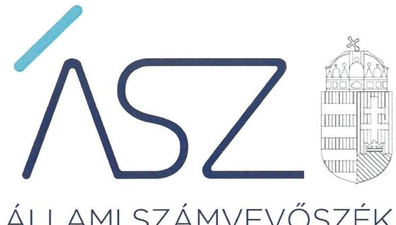
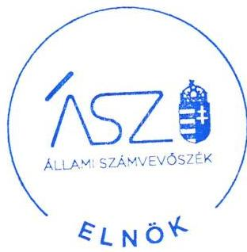
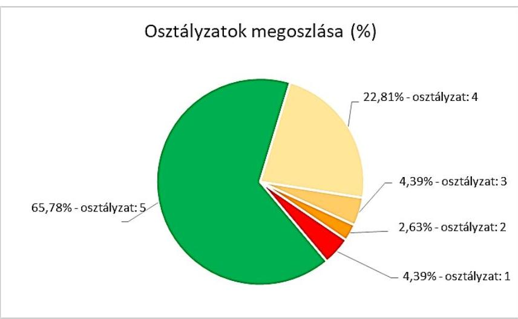

ÁLLAMI SZÁMVEVŐSZÉK

# JELENTÉS 

## Önkormányzatok ellenőrzése - Az önkormányzatok integritásának ellenőrzése

Szabolcs-Szatmár-Bereg megye települési önkormányzatai
2021.

21020
www.asz.hu

---

ÁLLAMI SZÁMVEVŐSZÉK

# JELENTÉS

## Önkormányzatok ellenőrzése - Az önkormányzatok integritásának ellenőrzése

Szabolcs-Szatmár-Bereg megye települési önkormányzatai

2021. 01. hó 29. nap

21020
www.asz.hu

Domokos László
elnök

---

# AZ ELLENŐRZÉST FELÜGYELTE: 

SALAMON ILDIKÓ felügyeleti vezető

## AZ ELLENŐRZÉST VEZETTE ÉS A VÉGREHAJTÁSÁÉRT FELELŐS:

DR. GÁL NÓRA ellenőrzésvezető
SZAPPANOS JÚLIA ellenőrzésvezető
RÁCZKEVI KATALIN ellenőrzésvezető
KAKAS SÁNDOR ellenőrzésvezető

A PROGRAM ÖSSZEÁLLÍTÁSÁÉRT FELELŐS:
GÖRGÉNYI GÁBOR osztályvezető

IKTATÓSZÁM: EL-3081-016/2021
TÉMASZÁM: 2548
ELLENŐRZÉS-AZONOSÍTÓ SZÁM: V0892

---

# TARTALOMJEGYZÉK 

■ ÖSSZEGZÉS ..... 5
■ AZ ELLENŐRZÉS CÉLJA ..... 7
■ AZ ELLENŐRZÉS TERÜLETE ..... 8
■ AZ ELLENŐRZÉS HÁTTERE, INDOKOLTSÁGA ..... 9
■ A JELENTÉS LÉNYEGES KÉRDÉSKÖREI ..... 10
■ AZ ELLENŐRZÉS HATÓKÖRE ÉS MÓDSZEREI ..... 11
■ ÉRTÉKELÉSEK ..... 13
■ MELLÉKLETEK ..... 19
I. sz. melléklet: Fogalomtár ..... 19
II. sz. melléklet: Az ellenőrzött szervezetek felsorolása és értékelése ..... 21
III. sz. melléklet: Az önkormányzatok integritásának ellenőrzése során értékelt 26 dokumentum megnevezése ..... 27
IV. sz. melléklet: Értékelési keretrendszer ..... 28
■ RÖVIDÍTÉSEK JEGYZÉKE ..... 31

---

.

---

# ÖSSZEGZÉS 

Szabolcs-Szatmár-Bereg megye települési önkormányzatainál 21 polgármester és 37 jegyző felelős vezetői magatartást tanúsított, az ÁSZ tanácsadása alapján már 2020-ban javította a beszámoló készítés integritást biztosító lényeges feltételeinek a kiépítését.
Az ÁSZ rámutatott olyan alapvető területekre, amely alapján 78 önkormányzat polgármestere, valamint jegyzője részére saját felelős vezetői magatartása körében további előrelépési lehetőséget biztosít 2021-re a csalásmentes környezet kiépítése érdekében, az alapvető integritási feltételek területén.
10 önkormányzatnál, illetve a gazdálkodási feladataikat ellátó hivataloknál rendszerszintű kockázatok maradtak fenn, amelyek új, részletes ellenőrzést indokolnak.

## Az ellenőrzés társadalmi indokoltsága

Az Alaptörvényben megfogalmazott alapértékek, elvek szerint minden szervezet köteles a nyilvánosság előtt elszámolni a közpénzekre vonatkozó gazdálkodásával. A közpénzeket és a nemzeti vagyont az átláthatóság és a közélet tisztaságának elve szerint kell kezelni. Az Állami Számvevőszék 2016-2018. évben végzett integritás felméréseinek eredményei rávilágítottak arra, hogy a helyi önkormányzatok a közszféra szereplői körében a kockázatosabb csoportba tartoznak.

Napjainkban kiemelt aktualitást és jelentőséget kapott a közpénzügyi helyzet javítása, az integritási szemlélet érvényesítésének erősítése. Az önkormányzatoknak fel kell készülniük arra, hogy a koronavírus okozta társadalmi és gazdasági válság növelni fogja a korrupciós nyomást.

Az Állami Számvevőszék ellenőrzése hozzájárul, hogy a helyi önkormányzatok integritási kontrolljainak kiépítettsége javuljon, ezáltal az önkormányzatok korrupciós veszélyeztetettsége csökkenjen. A járvány következtében kialakult helyzet megnövekedett feladatok elé állítja az önkormányzatokat, melyek megoldása kellő szakmai körültekintést is igényel. Szükséges minél hamarabb kialakítani az új feladatok ellátásának elszámoltatható rendjét, az erőforrások átlátható felhasználását biztosító, a visszaéléseket, a csalás lehetőségét minimálisra csökkentő belső szabályozást. Fontos, hogy az önkormányzatok tisztában legyenek az integritási kockázatokkal, azokat rendszeresen mérjék fel, és alakítsanak ki átlátható, jól szabályozott rendszereket, döntési mechanizmusokat.

Az ellenőrzés rámutathat a helyi önkormányzatok gazdálkodási tevékenységével kapcsolatos, integritást erősítő jó gyakorlatokra is, továbbá felhívhatja a figyelmet a jogszabályi követelmények teljesítéséhez szükséges lépésekre.

## Értékelés

Alapvető társadalmi elvárás, hogy az önkormányzatok működésében érvényesüljenek az integritás alapú hivatali elvek az állampolgárok részére nyújtott szolgáltatások során. Minden állampolgárnak azonos elvek alapján, azonos elbírálás szerint kell megkapnia az önkormányzatok által nyújtott közszolgáltatásokat úgy, hogy ennek érvényesülése az érintettek elégedettségi szintjében is jelentkezzen. Az integritás alapú elvek hiánya gyengíti a jogállamot, ezért ezen elvek mentén történő működési környezet kiépítése és fejlesztése, valamint kockázatainak kezelése felelős vezetői magatartást igényel.

A közpénzügyi helyzet mielőbbi javítását elsődleges szempontként érvényesítve, az Állami Számvevőszék a rendelkezésére bocsátott adatok értékelése alapján az ellenőrzési program tanácsadó céljával összhangban már az ellenőrzés lefolytatásával párhuzamosan lehetőséget biztosított a jövőre vonatkozóan a vezetők számára, hogy a feltárt hibák, hiányosságok felszámolására intézkedjenek, hozzájárulva ezzel a 2020. évi beszámoló szabályszerű elkészítését biztosító csalásmentes integritási környezet kialakításához.

---

71 önkormányzatnál és 49 hivatalnál a polgármester, illetve a jegyző eleget tett az integritási kontrollok alapvető feltételeit jelentő, a jogszabályban előírt szabályozási kötelezettségének.

21 polgármester és 37 jegyző - az ÁSZ jelzése figyelembevételével - már az ellenőrzés ideje alatt, a 2020. évre vonatkozóan javította a beszámoló készítés integritást biztosító lényeges feltételeinek a kiépítését.

A szervezeti integritásnak alapvető feltétele a szabályozottság, a jogszabályokban előírt belső szabályzatok és nyilvántartások megléte, azok folyamatos, megfelelő tartalma és gyakorlati alkalmazhatósága. Az integritási kockázatok szervezeti szinten csökkenthetők azáltal, hogy kialakították a szervezeti és működési kereteket, a gazdálkodásra vonatkozó alapvető szabályozási környezetet, valamint a kontrolltevékenységek szabályszerű gyakorlásának előfeltételeit, az integrált kockázatkezelés feltételeit.

A képviselő-testület szervezeti és működési szabályzatában olyan alapvető fontosságú, az adott önkormányzat sajátosságait figyelembe vevő rendelkezéseket szükséges rögzíteni, amelyek alapfeltételei az önkormányzat integritás szerinti működésének, így többek között az önkormányzat szerveinek és felelősségi viszonyainak meghatározása, valamint a képviselők vagyonnyilatkozat-tételi rendjét felügyelő bizottságlétrehozása. A szabályokat rögzítő rendelet megalkotásának 204 önkormányzatnál tettek eleget.

A pénzügyi- és a vagyongazdálkodás alapvető szabályozottsága és nyilvántartásai - a számviteli politika és a keretében kialakítandó szabályzatok, a számlarend, a gazdálkodási szabályzat, a gazdálkodási jogkörgyakorlásra jogosult személyekről és aláírás mintájukról vezetett naprakész nyilvántartás, a beszerzések lebonyolításával kapcsolatos eljárásrend - elengedhetetlen feltételei a csalásmentes szervezeti működésnek, a közpénzek és a közvagyon integritás elvű kezelésének, valamint a számviteli beszámoló szabályszerű elkészítésének. A hivatal a számviteli politika és az annak a keretén belül elkészítendő számviteli szabályzatok elkészítésével biztosítja pénzügyi- és vagyongazdálkodása átláthatóságának és elszámoltathatóságának feltételeit, kereteit.

A szabályozások és nyilvántartások kialakításának célja nem önmagában a jogszabályi rendelkezések betartása, hanem az önkormányzat szabályozottságán keresztül a szabályszerű és csalásmentes gazdálkodás feltételeinek megteremtése, ezáltal az Alaptörvényben előírt átláthatóság és elszámoltathatóság elvének érvényesítése. Ezeknek az alapelveknek érvényesülése hozzájárulhat ahhoz, hogy az önkormányzatok felé irányuló közbizalom is erősödjön.

Az integritás szempontjából lényeges dokumentumok ellenőrzésének eredménye, valamint az adatszolgáltatás és a figyelemfelhívásokra történt intézkedések kockázati értékelésének figyelembevételével a Szabolcs-Szatmár-Bereg megyei települési önkormányzatok és hivatalok integritásának fennálló állapota együttesen 4,4 értékű osztályzatot ért el.

# Következtetések 

Az integritás elvű működés erősítése érdekében további kockázatcsökkentő lépések szükségesek az integritás elvű vezetés-irányítás, valamint a pénzügyi- és a vagyongazdálkodás szabályszerű feltételeinek kialakítása terén, amelyeket az érintetteknek az ÁSZ által írásban megküldött további jelzés alapján lehetőségük van megtenni önmaguktól.

Azoknál a legnagyobb kockázatú önkormányzatoknál, valamint a gazdálkodási feladataikat ellátó hivataloknál, amelyeknél rendszerszintű - önmaga által nem kezelt - kockázatot azonosított az ÁSZ, új, részletekbe menő ellenőrzés válik indokolttá.

---

# AZ ELLENŐRZÉS CÉLJA 

Az ellenőrzés célja annak értékelése, hogy a helyi önkormányzatoknál és annak gazdálkodási feladatait ellátó önkormányzati hivataloknál megteremtették-e az integritás biztosításához szükséges feltételeket, kialakították-e az integritási kontrollokhoz kapcsolódó, valamint a korrupció elleni védelmet szolgáló szabályozásokat.

A monitoring típusú ellenőrzéssel, az ellenőrzöttek jelenben lévő fejlődését figyelembe véve az Állami Számvevőszék az önkormányzatok integritásának állapotát jelző szintjét értékeli. Rámutat azokra a területekre, amelyen a felelős vezetők saját maguk képesek előrelépni oly módon, hogy az integritás érvényesüljön a napi működésük során. Ez a cél szorosan összefügg az Állami Számvevőszékről szóló törvényben foglaltakkal, melynek legfőbb célja a közpénzügyi helyzet javulása.

Az elmúlt évek intézményi irányításában tapasztalt előrehaladás alapján, az együttműködés bizalmára építve az Állami Számvevőszék nem intézkedési terv készítésére kötelezi az ellenőrzötteket, hanem az elköteleződésükre alapozva, tanácsadás keretében mozdítja elő a pozitív irányú közpénzügyi változás megvalósítását, ezzel is támogatva a jól irányított állam működését.

---

# AZ ELLENŐRZÉS TERÜLETE 

## Szabolcs-Szatmár-Bereg megye helyi önkormányzatai és önkormányzati hivatalai

Magyarország Alaptörvénye ${ }^{1}$ alapján az ország területe fővárosra, megyékre, városokra és községekre tagozódik.

A Magyarország helyi önkormányzatairól szóló 2011. évi CLXXXIX. törvény (a továbbiakban: Mötv. ${ }^{2}$ ) rendelkezései szerint a helyi önkormányzás választópolgárok közösségét megillető joga a települések (települési önkormányzatok) és a megyék (területi önkormányzatok) szintjén valósul meg.

Az önkormányzatok kötelező és önként vállalt önkormányzati feladatainak ellátását a képviselő-testület és szervei (többek között a polgármester és a jegyző) biztosítják. A polgármester képviseli a képviselő-testületet, a jegyző pedig vezeti a polgármesteri hivatalt, vagy a közös önkormányzati hivatalt.

Az önkormányzatok alapvető szabályozási feladatai tehát a polgármester és a jegyző felelősségi körébe tartoznak. Az integritás szabályozottságának magas minőségét ezért a polgármester és a jegyző felelős vezetői magatartása határozza meg elsődlegesen.

Az ellenőrzés a polgármester és a jegyző felelősségi körébe tartozó szabályozási környezetre, a főbb integritási kontrollok kiépítettségére terjed ki. Nem terjed ki az önkormányzat által alapított intézményekre, gazdasági társaságokra, alapítványokra, valamint az önkormányzati társulásokra.

Az ellenőrzésre Szabolcs-Szatmár-Bereg megye mind a 230 önkormányzata és 110 hivatala kijelölésre került. Jelen ellenőrzés az ellenőrzöttek közül nem tartalmazza a megyei jogú város, valamint a megyei önkormányzat és a gazdálkodási feladataikat ellátó két hivatal ellenőrzésének eredményét. Az ellenőrzés 225 helyi önkormányzat esetében lefolytatásra került. 3 önkormányzat esetében az ellenőrzés adatszolgáltatás hiányában nem volt lefolytatható, az ÁSZ az ellenőrzött integritási kockázatát értékelte.

---

# AZ ELLENŐRZÉS HÁTTERE, INDOKOLTSÁGA 

Az Alaptörvény alapértékeket, elveket fogalmaz meg, amely szerint a közpénzekkel gazdálkodó minden szervezet köteles a nyilvánosság előtt elszámolni a közpénzekre vonatkozó gazdálkodásával. A közpénzeket és a nemzeti vagyont az átláthatóság és a közélet tisztaságának elve szerint kell kezelni.

Az ÁSZ 2016-2018. évben végzett integritás felméréseinek eredményei azt mutatták, hogy a helyi önkormányzatok a közszféra szereplői körében a kockázatosabb csoportba tartoznak. A kisebb népességszámú települések önkormányzatai különösen veszélyeztetettek, mert kontrollkörnyezetük, integritási infrastruktúrájuk - a felmérés eredményei alapján - kevésbé kiépített.

Az ÁSZ célja, hogy új ellenőrzési megközelítést alkalmazva támogassa a közpénzügyi helyzet javítását; a monitoring típusú ellenőrzéssel helyzetképet adjon az önkormányzati alrendszer egészében az integritási szemlélet érvényesítéséről, rávilágítson az integritási kontrollok kiépítettségére, illetve további fejlesztésére. Napjainkban mindez kiemelt fontosságúvá vált. Az önkormányzatoknak fel kell készülnie arra, hogy a koronavírus okozta társadalmi és gazdasági válság növelni fogja a korrupciós nyomást, amelyre felmérésünk és ellenőrzéseink alapján az önkormányzatok nincsenek megfelelően felkészülve. Az ÁSZ ebben a helyzetben is alapvető kötelességének tartja, hogy a közpénzek őre legyen, és ellenőrzéseit az önkormányzatok körében is folytassa.

Az ÁSZ ellenőrzése hozzájárul, hogy a helyi önkormányzatok integritási kontrolljainak kiépítettsége javuljon, ezáltal az önkormányzatok integritási veszélyeztetettsége csökkenjen. A járvány következtében kialakult helyzet megnövekedett feladatok elé állítja az önkormányzatokat, melyek megoldása kellő szakmai körültekintést is igényel. Szükséges minél hamarabb kialakítani az új feladatok ellátásának elszámoltatható rendjét, az erőforrások átlátható, a visszaéléseket, a csalás lehetőségét minimálisra szorító belső szabályozását. Fontos, hogy az önkormányzatok tisztában legyenek az integritás kockázatokkal, azokat ismételten mérjék fel, és alakítsanak ki átlátható, jól szabályozott rendszereket, döntési mechanizmusokat.
Az ellenőrzés rámutat a helyi önkormányzatok gazdálkodási tevékenységével kapcsolatos integritási jó gyakorlatokra is, továbbá felhívja a figyelmet a jogszabályi követelmények teljesítéséhez szükséges lépésekre is.

---

# A JELENTÉS LÉNYEGES KÉRDÉSKÖREI 

1.     - Megteremtette-e az önkormányzat polgármestere és jegyzője a csalásmentes integritást biztosító alapvető feltételeket?
2.     - Kialakította-e a hivatal jegyzője a beszámoló szabályszerű elkészítését, valamint a csalásmentes integritást biztosító alapvető feltételeket?
3.   
  - Milyen kockázatot hordoz az ellenőrzött szervezet fennálló integritása?

---

# AZ ELLENŐRZÉS HATÓKÖRE ÉS MÓDSZEREI 

## Az ellenőrzés típusa

| Megfelelőségi ellenőrzés.

## Az ellenőrzött időszak

Az ellenőrzött időszak a 2020. év.

## Az ellenőrzés tárgya

A szervezeti keretekkel, a működéssel és gazdálkodással kapcsolatos szabályzatok, szabályozások, valamint a szervezeti elvekkel, értékekkel összefüggő integritás kontrollok kiépítettsége.

## Az ellenőrzött szervezet

Szabolcs-Szatmár-Bereg megye helyi önkormányzatai és a gazdálkodási feladataikat ellátó önkormányzati hivatalok, a II. sz. melléklet szerint.

## Az ellenőrzés jogalapja

Az ellenőrzés jogalapját az ÁSZ tv. 4. § (3) bekezdése képezte.

## Az ellenőrzés módszerei

Az ellenőrzést az ellenőrzési program szempontjai, az ellenőrzött időszakban hatályos jogszabályok, a jelen ellenőrzésre irányadó ÁSZ módszertan figyelembevételével végezte az ÁSZ.

Az ellenőrzés ideje alatt az ellenőrzött szervezettel történő kapcsolattartást az ÁSZ az ÁSZ SZMSZ 5-ének vonatkozó előírásai alapján biztosította.

Az ellenőrzési kérdések megválaszolásához szükséges bizonyítékok megszerzése a következő ellenőrzési eljárások alkalmazásával történt: megfigyelés, összehasonlítás, elemző eljárás. Az ellenőrzési bizonyítékként felhasználható adatforrások közé tartoztak az ellenőrzési programban felsorolt adatforrások, továbbá minden - az ellenőrzés folyamán - feltárt, az ellenőrzés szempontjából információkat tartalmazó dokumentum.

---

Az ellenőrzést a kérdésekre adott válaszok kiértékelésével, valamint a megjelölt adatforrások, továbbá az adott időszakban hatályos jogszabályok, valamint az ÁSZ honlapján közzétett helyénvalósági kritériumok figyelembe vételével folytatta le az ÁSZ.

A jogszabályok által kötelezően elő nem írt, helyénvalósági kritériumokra vonatkozó követelményeket az ÁSZ nemzetközi sztenderdekben, hazai iránymutatásokban, módszertani útmutatókban szereplő „jó gyakorlatok" beazonosításával, integritási felmérésével, öntesztekkel alapozta meg. Az erre vonatkozó értékelések a jelentésben dőlt betűvel szerepelnek.

A szabályszerűségi és a helyénvalósági kritériumok viszonyát a jogszabályi előírások elsődlegessége határozza meg. A helyénvalósági kritériumok a jogszabályi előírások betartása esetén a szabályszerűségi kritériumok hatását erősítik, ellenkező esetben nem érvényesülnek.

A monitoring típusú ellenőrzés a helyi önkormányzatok integritás alapú működésének lényeges területeire fókuszált, és a lényeges dokumentumok kritikus területeinek ellenőrzésével lehetőséget biztosított a helyi önkormányzatok integritásának értékelésére. A monitoring típusú ellenőrzés emellett már az ellenőrzés folyamatában az ÁSZ figyelemfelhívásán keresztül önmaga általi előrelépési lehetőséget biztosított az integritási kockázatok csökkentésére.

A közpénzügyek átláthatóságának, rendezettségének megteremtése, a közpénzügyi helyzet mielőbbi javulása érdekében az ÁSZ három szintű tanácsadással segítette az ellenőrzött szervezeteket a csalásmentes integritást biztosító alapvető feltételek megteremtésében.

Az ellenőrzés indítását megelőzően felhívta valamennyi önkormányzat és hivatal vezetőjének figyelmét az integritás szempontjából lényeges dokumentumokra, azok ellenőrzésére.

Az ellenőrzés során a beszámoló szabályszerű elkészítését biztosító kontrollkörnyezet kialakítása, valamint a csalásmentes integritási környezet megteremtése szempontjából lényeges dokumentumok rendelkezésre állásának, továbbá azok tartalmának integritás szempontjából fontos területei értékelésére került sor. A monitoring típusú ellenőrzés már az ellenőrzés időszakában visszajelzést adott azon a dokumentumokról, amelyek javítása még hozzájárul a 2020. évi beszámoló megalapozottságának javításához. A további dokumentumok értékelésének alapján a 2021. évre tehetők meg a szervezet jogszabályoknak megfelelő, integritás alapú működését segítő intézkedések.
Az integritás szempontjából lényeges vezetési, pénzügyi és gazdálkodási területek értékelésének eredménye, valamint az adatszolgáltatás és a figyelemfelhívásokra történt intézkedések kockázati értékelésének figyelembevételével került sor az önkormányzatok és a hivatalok integritási színvonalának együttes osztályozására. Ennek módját a III. és IV. sz. mellékletben foglalt értékelési keretrendszer tartalmazza.

---

# 1. Megteremtette-e az önkormányzat polgármestere és jegyzője a csalásmentes integritást biztosító alapvető feltételeket? 

Összegző értékelés 71 önkormányzat polgármestere és jegyzője kialakította a csalásmentes integritást biztosító alapvető feltételeket. 21 önkormányzat polgármestere és jegyzője az ÁSZ tanácsadó tevékenysége eredményeként hozzájárult az integritás minőségének javulásához.
1.1. számú értékelés 204 önkormányzat polgármestere biztosította a szervezeti integritás, működés és vezetés alapvető szabályozási feltételeit.

183 képviselő-testület Szervezeti és Működési Szabályzatról szóló rendelete nem hordozott integritási kockázatot.

A szervezeti és működési szabályzat határozza meg az adott szervezet működésének részletes szabályait, és felelősségi viszonyait, ezáltal valósul meg a szervezet belső kontrollrendszerének szabályszerű kialakítása és működtetése. A szabályzat biztosítja továbbá az átlátható és elszámoltatható működés alapfeltételeit, a felelősségi és feladat-ellátási viszonyokat. A szervezeti és működési szabályzattal rendelkező szervezet a korrupciós kockázatokat rendszerszinten képes kezelni.

21 önkormányzat polgármestere felelős vezetőként az ellenőrzés által feltárt hiányosságok megszüntetése iránt 2020-ban intézkedett az ÁSZ tanácsadó tevékenységének eredményeként.

További 21 önkormányzat polgármesterének fennáll a lehetősége a feltárt hiányosságok 2021-ben történő kijavítására és ezzel az integritási kockázatok csökkentésére.

A képviselő-testületi szervezeti és működési szabályzattal rendelkező ellenőrzöttek közül 126 önkormányzat polgármestere a jogszabályi előírásokon túl további erőfeszítéseket is tett az integritás erősítése érdekében, mivel kialakította az integritás lágy kontrolljait, vagyis felismerte a jogszabályokban előírt, kötelező kontrollokon túl, további integritási kontrollok megerősítésének indokoltságát, amely hozzájárul a szervezet korrupcióval szembeni védettségének javításához.
A képviselő-testületi szervezeti és működési szabályzattal nem rendelkező ellenőrzöttek közül 8 önkormányzat polgármestere szintén épített ki a korrupció ellen ható lágy kontrollokat, amelyek érdemi szerepüket a jogszabályi előírásoknak megfelelő szabályozási keretek kialakítását követően tudják betölteni.

---

# 1.2. számú értékelés 

83 önkormányzat polgármestere és jegyzője biztosította a pénzgazdálkodáshoz kapcsolódó alapvető szabályozási feltételeket.

92 önkormányzat polgármestere és jegyzője rendelkezett a számviteli szabályozás pénzgazdálkodás területét érintő alapvető dokumentumairól.

133 önkormányzatnál fennáll a lehetőség arra, hogy a jegyző a számviteli politika, illetve a polgármester a számlarend vonatkozásában felelős vezetőként a feltárt hiányosságokat 2021-ben kijavítsa és ezzel az integritási kockázatokat csökkentse.

A számviteli alapdokumentumok megléte a szabályszerű könyvvezetés és elszámolás alapvető feltétele. A számviteli politika, valamint a számlarend kialakítása biztosítja a számviteli beszámoló szabályszerű elkészítését, amely hozzájárul a korrupcióval szembeni védettség erősítéséhez.

170 önkormányzat jegyzője rendelkezett a gazdálkodási kontrolltevékenységek lényeges dokumentumairól.

32 jegyzőnek fennáll a lehetősége, hogy felelős vezetőként a feltárt hiányosságokat 2021-ben kijavítsa és ezzel az integritási kockázatokat csökkentse.
A gazdálkodási szabályzat, illetve a gazdálkodási jogkörgyakorlásra jogosult személyekről és aláírás mintájukról vezetett naprakész nyilvántartás elkészítése és vezetése által biztosítható a központi költségvetésből kapott támogatások átlátható és elszámoltatható igénybevétele és felhasználása. A szabályzatok megléte alkalmas a szervezet korrupcióval szembeni védettségének növelésére.

### 1.3. számú értékelés

158 önkormányzat jegyzője biztosította a vagyongazdálkodáshoz kapcsolódó alapvető szabályozási feltételeket.

185 önkormányzat jegyzője rendelkezett az eszközök és a források leltárkészítési és leltározási szabályzatáról, 190 önkormányzat jegyzője az eszközök és a források értékelési szabályzatáról, valamint 176 önkormányzat jegyzője a beszerzések lebonyolításával kapcsolatos eljárásrendről.

39 jegyzőnek fennáll a lehetősége, hogy felelős vezetőként a feltárt hiányosságokat 2021-ben kijavítsa és ezzel az integritási kockázatokat csökkentse.

A szabályzatok alapozzák meg a vagyon védelmét szolgáló, egységes elvek mentén történő értékelést és számbavételt, biztosítva az éves beszámolók valódiságát. Az elszámolások szabályozatlansága a korrupciós kockázatot jelent. Az eszközök és a források leltárkészítési és leltározási szabályzatban foglaltak alkalmazásával biztosítható a tulajdon védelme, továbbá, hogy a könyvviteli mérleg a tényleges helyzetnek megfelelő valós képet mutassa a vagyoni, pénzügyi helyzetről.

Az eszközök és a források értékelési szabályzatának célja az eszközök és források értékelésére vonatkozó számviteli döntések, értékelési módok, eljárások összefoglalása. Meghatározza a számviteli politika keretében hozott döntések gyakorlati végrehajtását, amely kihatással van a vagyon szabályszerű megőrzésére, gyarapítására.
A beszerzések lebonyolításával kapcsolatos eljárásrend által biztosítható az önkormányzat tevékenységének átláthatósága, a közbeszerzési értékhatár alatti beszerzések transzparenciája.

---

# 2. Kialakította-e a hivatal jegyzője a beszámoló szabályszerű elkészítését, valamint a csalásmentes integritást biztosító alapvető feltételeket? 

Összegző értékelés

2.1. számú értékelés

49 hivatal jegyzője kialakította a beszámoló szabályszerű elkészítését, valamint a csalásmentes integritást biztosító alapvető feltételeket. 37 hivatal jegyzője az ÁSZ tanácsadó tevékenysége eredményeként hozzájárult az integritás minőségének javulásához.

60 hivatal jegyzője biztosította a szervezeti integritás, működés és vezetés alapvető szabályozási feltételeit.

85 hivatal rendelkezett Szervezeti és Működési Szabályzattal.
A szervezeti és működési szabályzat határozza meg a hivatal működésének alapvető kereteit, és felelősségi viszonyait, ezáltal valósul meg a hivatal belső kontrollrendszerének szabályszerű kialakítása és működtetése. A szabályzat biztosítja továbbá az átlátható és elszámoltatható működés alapfeltételeit, a felelősségi és feladat-ellátási viszonyokat. A szervezeti és működési szabályzattal rendelkező szervezet a korrupciós kockázatokat rendszerszinten képes kezelni.

22 jegyzőnek fennáll a lehetősége, hogy felelős vezetőként a feltárt hiányosságokat 2021-ben kijavítsa és ezzel az integritási kockázatokat csökkentse.

96 hivatal jegyzője rendelkezett a vagyonnyilatkozat átadására, nyilvántartására, a vagyonnyilatkozatban foglalt személyes adatok védelmére vonatkozó további szabályokról. További 5 hivatal jegyzője az ellenőrzés által feltárt hiányosságok megszüntetése iránt 2020-ban intézkedett, az ÁSZ tanácsadó tevékenységének eredményeként.

6 jegyzőnek fennáll a lehetősége, hogy felelős vezetőként a feltárt hiányosságokat 2021-ben kijavítsa és ezzel az integritási kockázatokat csökkentse.

78 hivatal jegyzője elkészítette vezetői nyilatkozatát a belső kontrollrendszer minőségéről a 2019. évre vonatkozóan. A nyilatkozatban történik meg a belső kontrollrendszer minőségének éves értékelése, amely alapján megismerhető az integritás alapú működéshez szükséges szabályozottság aktuális állapota és a lehetséges integritási kockázatok. A dokumentum tartalmának ismeretében lehetőség nyílik a kockázatok csökkentésére teendő intézkedések kidolgozására, a korrupcióelleni védelem erősítésére.

100 hivatal jegyzője elkészítette a szervezeti integritást sértő események kezelésének eljárásrendjét, további 3 hivatal jegyzője az ellenőrzés által feltárt hiányosságok megszüntetése iránt 2020-ban intézkedett, az ÁSZ tanácsadó tevékenységének eredményeként.

4 jegyzőnek fennáll a lehetősége, hogy felelős vezetőként a feltárt hiányosságokat 2021-ben kijavítsa és ezzel az integritási kockázatokat csökkentse.

93 hivatal jegyzője rendelkezett az integrált kockázatkezelés eljárásrendjéről.

---

14 jegyzőnek fennáll a lehetősége, hogy felelős vezetőként a feltárt hiányosságokat 2021-ben kijavítsa és ezzel az integritási kockázatokat csökkentse.

A kialakított szabályzatok csökkentik a korrupciós kockázatokat, ezáltal növelve a hivatal szervezetén belüli és kifelé irányuló tevékenységének átláthatóságát, a korrupció elleni védettségre irányuló szabályozás biztosítását.

A szervezeti integritás, működés és vezetés alapvető dokumentumaival rendelkező hivatalok közül 50 hivataljegyzője a jogszabályi előírásokon túl további erőfeszítéseket is tett az integritás erősítése érdekében, mivel kialakította az integritás lágy kontrolljait, vagyis felismerte a jogszabályokban előírt, kötelező kontrollokon túl, további szabályozók indokoltságát, amely hozzájárul a szervezet korrupcióval szembeni védettségének javításához.
A szervezeti integritás, működés és vezetés alapvető dokumentumainak teljes körével nem rendelkező hivatalok közül 28 hivatal jegyzője szintén épített ki a korrupció ellen ható lágy kontrollokat, amelyek érdemi szerepüket a jogszabályi előírásoknak megfelelő szabályozási keretek kialakítását követően tudják betölteni.

# 2.2. számú értékelés 

82 hivatal jegyzője biztosította a pénzgazdálkodáshoz kapcsolódó alapvető szabályozási feltételeket.

78 hivatal jegyzője rendelkezett a számviteli szabályozás pénzgazdálkodás területét érintő alapvető dokumentumairól.

A számviteli alapdokumentumok megléte a szabályszerű könyvvezetés és elszámolás alapvető feltétele. A számviteli politika, a pénzkezelési szabályzat, valamint a számlarend kialakítása biztosítja a számviteli beszámoló szabályszerű elkészítését, amely hozzájárul a korrupcióval szembeni védettség erősítéséhez.

9 hivatal jegyzője az ellenőrzés által feltárt hiányosságok megszüntetése iránt - az ÁSZ tanácsadó tevékenységének eredményeként - a számviteli politika és a számlarend vonatkozásában 2020-ban intézkedett. Ennek eredményeként az integritás szempontjából lényeges, pénzügyi területen fennálló szabályozottság a hivataloknál javult.

20 jegyzőnek fennáll a lehetősége, hogy felelős vezetőként a feltárt hiányosságokat 2021-ben kijavítsa és ezzel az integritási kockázatokat csökkentse.

95 hivatal jegyzője rendelkezett a gazdálkodási kontrolltevékenységek lényeges dokumentumairól.

A gazdálkodási szabályzat, illetve a gazdálkodási jogkörgyakorlásra jogosult személyekről és aláírás mintájukról vezetett naprakész nyilvántartás elkészítése és vezetése által biztosítható a központi költségvetésből kapott
 támogatások átlátható és elszámoltatható igénybevétele és felhasználása. A szabályzatok megléte alkalmas a szervezet korrupcióval szembeni védettségének növelésére.

12 jegyzőnek fennáll a lehetősége, hogy felelős vezetőként a feltárt hiányosságokat 2021-ben kijavítsa és ezzel az integritási kockázatokat csökkentse.

---

# 2.3. számú értékelés 

100 hivatal jegyzője biztosította a vagyongazdálkodáshoz kapcsolódó alapvető szabályozási feltételeket.

104 hivatal jegyzője rendelkezett az eszközök és a források leltárkészítési és leltározási szabályzatáról, 104 hivatal jegyzője az eszközök és a források értékelési szabályzatáról, illetve 95 hivatal jegyzője a beszerzések lebonyolításával kapcsolatos eljárásrendről.

6 hivatal jegyzője az ellenőrzés által feltárt hiányosságok megszüntetése iránt 2020-ban intézkedett, így - az ÁSZ tanácsadó tevékenységének eredményeként - a vagyongazdálkodás területén a szabályozottság javult.

7 jegyzőnek fennáll a lehetősége, hogy felelős vezetőként a feltárt hiányosságokat 2021-ben kijavítsa és ezzel az integritási kockázatokat csökkentse.

A szabályzatok alapozzák meg a vagyon védelmét szolgáló, egységes elvek mentén történő értékelést és számbavételt, biztosítva az éves beszámolók valódiságát. Az elszámolások szabályozatlansága a korrupciós kockázatot jelent. Az eszközök és a források leltárkészítési és leltározási szabályzatban foglaltak alkalmazásával biztosítható a tulajdon védelme, továbbá, hogy a könyvviteli mérleg a tényleges helyzetnek megfelelő valós képet mutassa a vagyoni, pénzügyi helyzetről.

Az eszközök és a források értékelési szabályzatának célja az eszközök és források értékelésére vonatkozó számviteli döntések, értékelési módok, eljárások összefoglalása. Meghatározza a számviteli politika keretében hozott döntések gyakorlati végrehajtását, amely kihatással van a vagyon szabályszerű megőrzésére, gyarapítására.
A beszerzések lebonyolításával kapcsolatos eljárásrend által biztosítható az önkormányzat tevékenységének átláthatósága, a közbeszerzési értékhatár alatti beszerzések transzparenciája.

## 3. Milyen kockázatot hordoz az ellenőrzött szervezet fennálló integritása?

Összegző értékelés Az ÁSZ tanácsadó tevékenységének eredményeként intézkedő szervezetek hozzájárultak az ellenőrzés által feltárt hibák, hiányosságok felszámolásához, a korrupciós kockázatok csökkentéséhez. 10 ellenőrzöttnél további ellenőrzés indokolt az integritási kockázatok csökkentésének érvényesülése érdekében.

Az ellenőrzés során feltárt dokumentumhiány, vagy nem megfelelő dokumentum a jogszabályokban előírtak szerinti szabályozó szerepét nem tudja betölteni, ezért az ellenőrzés során az önkormányzatok polgármesterei és a hivatalok jegyzői, mint az ellenőrzött szervezet felelős vezetői lehetőséget kaptak a feltárt hiányosságok kijavítása iránti intézkedésre. A 2020. évben ennek eredményeként 58 ellenőrzöttnél javultak az integritás alapvető feltételei. A hiányosságok megszüntetése iránt eddig nem intézkedő 201 ellenőrzöttnek is lehetősége van 2021-ben a felelős vezetői magatartás körében a szükséges intézkedéseket megtenni és ezzel a korrupciós kockázatokat csökkenteni.

---

Szabolcs-Szatmár-Bereg megye települési önkormányzatai integritásának értékelése

| Osztályzat | Db | Megoszlás |
| :--: | :--: | :--: |
| 5 | 150 | $65,78 \%$ |
| 4 | 52 | $22,81 \%$ |
| 3 | 10 | $4,39 \%$ |
| 2 | 6 | $2,63 \%$ |
| 1 | 10 | $4,39 \%$ |
| Átlag: 4,4 | - | - |

Szabolcs-Szatmár-Bereg megyében az önkormányzatok közel 66 %-a kialakította az integritás alapú működés alapvető feltételeit, közel $30 \%$ pedig további intézkedésekkel csökkentheti a korrupciós veszélyeztetettséget.

Az önkormányzatok több mint $4 \%$-a az alapvető integritási feltételeknek sem felel meg.

A II. sz. melléklet tartalmazza az egyes önkormányzat és hivatal együttes osztályozását

3 ellenőrzött esetében az ellenőrzés nem volt lefolytatható, mivel nem bocsátották rendelkezésre az ÁSZ által megnevezett dokumentumokat, azonban a szervezetek értékelését az ÁSZ elvégezte. Az értékelés eredményeként az ellenőrzött szervezetek olyan magas kockázatúnak minősülnek, amely alapján további ellenőrzésük indokolt az integritás alapú működés alapvető feltételeinek biztosítása érdekében. További 7 önkormányzatnál az ellenőrzés értékelése alapján olyan súlyú integritási hiányosságok állnak fenn, amely jelentősen fokozza a korrupciós kitettség kockázatát. Ennek csökkentése érdekében az ÁSZ további ellenőrzéseket tervez mind a 10 önkormányzat tekintetében.

---

# MELLÉKLETEK 

I. SZ. MELLÉKLET: FOGALOMTÁR

ÁSZ Integritás Projekt
helyi önkormányzat
integrált kockázatkezelési rendszer
kontrollkörnyezet
a) világos a szervezeti struktúra, a folyamatok átláthatóak,
b) egyértelműek a felelősségi, hatásköri viszonyok és feladatok,
c) meghatározottak, ismertek és elfogadottak az etikai elvárások a szervezet minden szintjén,
d) átlátható a humánerőforrás-kezelés,
e) biztosított a szervezeti célok és értékek irányában való elkötelezettség fejlesztése és elősegítése. (Forrás: Bkr. 6. § (1) bekezdés)
kontrolltevékenységek
költségvetési szerv vezetője
közérdekű bejelentés

Az ÁSZ 2009-ben indította el a „Korrupciós kockázatok feltérképezése - Integritás alapú közigazgatási kultúra terjesztése" című, európai uniós forrásból megvalósított kiemelt projektjét (Integritás Projekt). Az Integritás Projekt célja, hogy felmérje a közszféra intézményei korrupciós kockázatoknak való kitettségét, illetőleg az azok mérséklésére hivatott kontrollok szintjét. Az ÁSZ a projekt révén az integritás szemlélet minél szélesebb körrel történő megismertetését, gyakorlatba ültetését kívánja elérni. Az integritás követelményeinek megfelelő szervezeti működést előnyben részesítő közigazgatási kultúra elterjesztését és a korrupció elleni fellépést az ÁSZ önmagára nézve is stratégiai jelentőségű célként fogalmazta meg. A projekt a felmérésben résztvevő intézmények számára helyzetükről egyfajta „tükörképet" mutat be, ami alapot teremt a jövőbeni pozitív irányú elmozduláshoz.
(Forrás: a http://integritas.asz.hu honlapon közzétett, a 2013. évi Integritás felmérés eredményeiről készült összefoglaló tanulmány)
Magyarországon a helyi közügyek intézése és a helyi közhatalom gyakorlása érdekében helyi önkormányzatok működnek. A helyi önkormányzatokra vonatkozó szabályokat sarkalatos törvény határozza meg (Forrás: Magyarország Alaptörvénye 31. cikk (1) és (3) bekezdés).
A helyi önkormányzás joga a települések (települési önkormányzatok) és a megyék (területi önkormányzatok) választópolgárainak közösségét illeti meg. (Forrás: Mötv. 3. § (1) bekezdés).

Olyan folyamatalapú kockázatkezelési rendszer, amely a szervezet minden tevékenységére kiterjed, egységes módszertan és eljárások alkalmazásával, a szervezet célkitűzéseinek és értékeinek figyelembevételével biztosítja a szervezet kockázatainak teljes körű azonosítását, azok meghatározott kritériumok szerinti értékelését, valamint a kockázatok kezelésére vonatkozó intézkedési terv elkészítését és az abban foglaltak nyomon követését (Forrás: Bkr. ${ }^{6} 2 . \S$ m) pontja)
A költségvetési szerv vezetője köteles olyan kontrollkörnyezetet kialakítani, amelyben
a) világos a szervezeti struktúra, a folyamatok átláthatóak,
b) egyértelműek a felelősségi, hatásköri viszonyok és feladatok,
c) meghatározottak, ismertek és elfogadottak az etikai elvárások a szervezet minden szintjén,
d) átlátható a humánerőforrás-kezelés,
e) biztosított a szervezeti célok és értékek irányában való elkötelezettség fejlesztése és elősegítése. (Forrás: Bkr. 6. § (1) bekezdés)
A költségvetési szerv vezetője által a szervezeten belül kialakított kontrolltevékenységek, melyek biztosítják a kockázatok kezelését, hozzájárulnak a szervezet céljainak eléréséhez, és erősítik a szervezet integritását.
(Forrás: Bkr. 8. § (1) bekezdés)
A helyi önkormányzat esetében a jegyző, főjegyző (Bkr. 2. §nb) pontja); a helyi önkormányzati költségvetési szerv esetén annak vezetője (Bkr. 2. §nd) pontja).
A közérdekű bejelentés olyan körülményre hívja fel a figyelmet, amelynek orvoslása vagy megszüntetése a közösség vagy az egész társadalom érdekét szolgálja. A közérdekű bejelentés javaslatot is tartalmazhat. (Forrás: a panaszokról és a közérdekű bejelentésekről szóló 2013. évi CLXV. törvény 1. § (3) bekezdés)

---

lágy kontrollok
hivatal
panasz
szervezet integritását sértő esemény

A szervezet jogszabály által elő nem írt (belső) szabályainak betartását segítő kontrollok.
A helyi önkormányzat képviselő-testülete az önkormányzat működésével, valamint a polgármester vagy a jegyző feladat- és hatáskörébe tartozó ügyek döntésre való előkészítésével és végrehajtásával kapcsolatos feladatok ellátására polgármesteri hivatalt vagy közös önkormányzati hivatalt hoz létre (Forrás: Mötv. 84. § (1) bekezdés).
Az önkormányzati hivatal: a polgármesteri hivatal, a főpolgármesteri hivatal, a megyei önkormányzati hivatal és a közös önkormányzati hivatal (Forrás: Áht. ${ }^{7}$ 1. § 18. pont).
A panasz olyan kérelem, amely egyéni jog- vagy érdeksérelem megszüntetésére irányul, és elintézése nem tartozik más - így különösen bírósági, közigazgatási - eljárás hatálya alá. A panasz javaslatot is tartalmazhat. (Forrás: a panaszokról és a közérdekű bejelentésekről szóló 2013. évi CLXV. törvény 1. § (2) bekezdés)
Minden olyan esemény, amely a szervezetre vonatkozó szabályoktól, valamint a jogszabályi keretek között a költségvetési szerv vezetője és az irányító szerv által meghatározott szervezeti célkitűzéseknek, értékeknek és elveknek megfelelő működéstől eltér. (Forrás: Bkr. 2. § u) pont)

---

# II. 52. MELLÉKLET: AZ ELLENŐRZÖTT SZERVEZETEK FELSOROLÁSA ÉS ÉRTÉKELÉSE

|  Sorszám | Önkormányzat | Hivatal | Önkormányzat és hivatal osztályzat  |
| --- | --- | --- | --- |
|  1. | Ajak Város Önkormányzata | Ajak Polgármesteri Hivatal | 5  |
|  2. | Anarcs Község Önkormányzata | Gyulaházai Közös Önkormányzati Hivatal | 4  |
|  3. | Apagy Község Önkormányzat | Apagyi Polgármesteri Hivatal | 5  |
|  4. | Aranyosapáti Község Önkormányzata | Aranyosapáti Közös Önkormányzati Hivatal | 5  |
|  5. | Baktalórántháza Város Önkormányzata | Baktalórántházai Közös Önkormányzati Hivatal | 4  |
|  6. | Balkány Város Önkormányzata | Balkányi Polgármesteri Hivatal | 4  |
|  7. | Balsa Község Önkormányzata | Tiszaberceli Közös Önkormányzati Hivatal | 5  |
|  8. | Barabás Község Önkormányzata | Tiszakerecsenyi Közös Önkormányzati Hivatal | 5  |
|  9. | Bátorliget Község Önkormányzata | Nyírcsászári Közös Önkormányzati Hivatal | 5  |
|  10. | Benk Község Önkormányzata | Eperjeskei Közös Önkormányzati Hivatal | 5  |
|  11. | Beregdaróc Község Önkormányzata | Beregsurányi Közös Önkormányzati Hivatal | 5  |
|  12. | Beregsurány Község Önkormányzata | Beregsurányi Közös Önkormányzati Hivatal | 4  |
|  13. | Berkesz Község Önkormányzata | Nyírtéti Közös Önkormányzati Hivatal | 1  |
|  14. | Besenyőd Község Önkormányzata | Leveleki Közös Önkormányzati Hivatal | 4  |
|  15. | Beszterec Község Önkormányzata | Kéki Közös Önkormányzati Hivatal | 3  |
|  16. | Biri Község Önkormányzata | Geszterédi Közös Önkormányzati Hivatal | 1  |
|  17. | Botpalád Község Önkormányzata | Tiszabecsi Közös Önkormányzati Hivatal | 2  |
|  18. | Bököny Község Önkormányzata | Bökönyi Közös Önkormányzati Hivatal | 5  |
|  19. | Buj Község Önkormányzata | Buji Közös Önkormányzati Hivatal | 2  |
|  20. | Cégénydányád Község Önkormányzata | Tunyogmatolcsi Közös Önkormányzati Hivatal | 4  |
|  21. | Csaholc Község Önkormányzata | Csaholci Közös Önkormányzati Hivatal | 5  |
|  22. | Csaroda Község Önkormányzata | Csarodai Közös Önkormányzati Hivatal | 5  |
|  23. | Császló Község Önkormányzata | Rozsályi Közös Önkormányzati Hivatal | 5  |
|  24. | Csegöld Község Önkormányzata | Jánkmajtisi Közös Önkormányzati Hivatal | 2  |
|  25. | Csenger Város Önkormányzat | Csengeri Közös Önkormányzati Hivatal | 5  |
|  26. | Csengersima Község Önkormányzata | Csengeri Közös Önkormányzati Hivatal | 5  |
|  27. | Csengerújfalu Község Önkormányzata | Csengeri Közös Önkormányzati Hivatal | 5  |
|  28. | Damó Község Önkormányzata | Jánkmajtisi Közös Önkormányzati Hivatal | 4  |
|  29. | Demecser Város Önkormányzata | Demecseri Közös Önkormányzati Hivatal | 5  |
|  30. | Dombrád Város Önkormányzata | Dombrádi Közös Önkormányzati

 Hivatal | 5  |
|  31. | Döge Község Önkormányzata | Dögei Polgármesteri Hivatal | 5  |
|  32. | Encsencs Község Önkormányzata | Encsencsi Közös Önkormányzati Hivatal | 5  |
|  33. | Eperjeske Község Önkormányzata | Eperjeskei Közös Önkormányzati Hivatal | 5  |
|  34. | Érpatak Község Önkormányzata | Bökönyi Közös Önkormányzati Hivatal | 5  |
|  35. | Fábiánháza Község Önkormányzata | Fábiánházi Közös Önkormányzati Hivatal | 3  |
|  36. | Fehérgyarmat Város Önkormányzata | Fehérgyarmati Polgármesteri Hivatal | 5  |
|  37. | Fényeslitke Község Önkormányzata | Fényeslitkei Polgármesteri Hivatal | 5  |
|  38. | Fülesd Községi Önkormányzat | Kölcsei Közös Önkormányzati Hivatal | 5  |
|  39. | Fülpösdaróc Község Önkormányzata | Győrteleki Közös Önkormányzati Hivatal | 5  |
|  40. | Gacsály Község Önkormányzata | Rozsályi Közös Önkormányzati Hivatal | 4  |
|  41. | Garbolc Község Önkormányzata | Méhteleki Közös Önkormányzati Hivatal | 5  |

---

|  42. | Gávavencsellő Nagyközség Önkormányzata | Gávavencsellői Közös Önkormányzati Hivatal | 5  |
| --- | --- | --- | --- |
|  43. | Géberjén Község Önkormányzata | Nagyessedi Közös Önkormányzati Hivatal | 5  |
|  44. | Gégény Község Önkormányzata | Demecseri Közös Önkormányzati Hivatal | 5  |
|  45. | Gelénes Község Önkormányzata | Csarodai Közös Önkormányzati Hivatal | 5  |
|  46. | Gemzse Község Önkormányzata | Ilki Közös Önkormányzati Hivatal | 5  |
|  47. | Geszteréd Község Önkormányzata | Geszterédi Közös Önkormányzati Hivatal | 5  |
|  48. | Gulács Község Önkormányzata | Tarpai Közös Önkormányzati Hivatal | 5  |
|  49. | Győröcske Község Önkormányzata | Záhonyi Közös Önkormányzati Hivatal | 5  |
|  50. | Győrtelek Község Önkormányzata | Győrteleki Közös Önkormányzati Hivatal | 5  |
|  51. | Gyulaháza Község Önkormányzata | Gyulaházai Közös Önkormányzati Hivatal | 5  |
|  52. | Gyügye Község Önkormányzata | Tunyogmatolcsi Közös Önkormányzati Hivatal | 4  |
|  53. | Gyüre Község Önkormányzata | Aranyosapáti Közös Önkormányzati Hivatal | 5  |
|  54. | Hermánszeg Község Önkormányzata | Tunyogmatolcsi Közös Önkormányzati Hivatal | 4  |
|  55. | Hetefejércse Község Önkormányzata | Csarodai Közös Önkormányzati Hivatal | 5  |
|  56. | Hodász Nagyközségi Önkormányzat | Hodászi Polgármesteri Hivatal | 4  |
|  57. | Ibrány Város Önkormányzata | Ibrányi Polgármesteri Hivatal | 5  |
|  58. | Ilk Község Önkormányzata | Ilki Közös Önkormányzati Hivatal | 5  |
|  59. | Jánd Község Önkormányzata | Vásárosnaményi Közös Önkormányzati Hivatal | 5  |
|  60. | Jánkmajtsi Község Önkormányzata | Jánkmajtsi Közös Önkormányzati Hivatal | 3  |
|  61. | Jármi Község Önkormányzata | Jármi Közös Önkormányzati Hivatal | 4  |
|  62. | Jéke Község Önkormányzata | Tomyospálcai Közös Önkormányzati Hivatal | 5  |
|  63. | Kállósemjén Nagyközség Önkormányzata | Kállósemjéni Polgármesteri Hivatal | 5  |
|  64. | Kálmánháza Község Önkormányzata | Kálmánházai Közös Önkormányzati Hivatal | 4  |
|  65. | Kántorjánosi Község Önkormányzata | Kántorjánosi Polgármesteri Hivatal | 5  |
|  66. | Kék Község Önkormányzata | Kéki Közös Önkormányzati Hivatal | 5  |
|  67. | Kékcse Község Önkormányzata | Szabolcsveresmarti Közös Önkormányzati Hivatal | 5  |
|  68. | Kemecse Város Önkormányzat | Kemecsei Közös Önkormányzati Hivatal | 5  |
|  69. | Kérsemjén Községi Önkormányzat | Nábrádi Közös Önkormányzati Hivatal | 5  |
|  70. | Kisar Község Önkormányzata | Kisari Közös Önkormányzati Hivatal | 4  |
|  71. | Kishódos Község Önkormányzata | Méhteleki Közös Önkormányzati Hivatal | 5  |
|  72. | Kisléta Község Önkormányzata | Nyírbogáti Közös Önkormányzati Hivatal | 5  |
|  73. | Kisnamény Község Önkormányzata | Túristvándi Közös Önkormányzati Hivatal | 4  |
|  74. | Kispalád Község Önkormányzata | Méhteleki Közös Önkormányzati Hivatal | 5  |
|  75. | Kisvárda Város Önkormányzata | Kisvárdai Polgármesteri Hivatal | 5  |
|  76. | Kisvarsány Község Önkormányzata | Ilki Közös Önkormányzati Hivatal | 5  |
|  77. | Kisszekeres Község Önkormányzata | Nagyszekeresi Közös Önkormányzati Hivatal | 5  |
|  78. | Kocsord Község Önkormányzata | Kocsordi Polgármesteri Hivatal | 1  |
|  79. | Komlódtólfalu Község Önkormányzat | Csengeri Közös Önkormányzati Hivatal | 5  |
|  80. | Komoró Község Önkormányzata | Tuzséri Közös Önkormányzati Hivatal | 5  |
|  81. | Kótaj Község Önkormányzata | Kótaj Polgármesteri Hivatal | 4  |
|  82. | Kölcse Nagyközség Önkormányzata | Kölcsei Közös Önkormányzati Hivatal | 5  |
|  83. | Kömörő Községi Önkormányzat | Túristvándi Közös Önkormányzati Hivatal | 4  |
|  84. | Laskod Község Önkormányzata | Baktalórántházai Közös Önkormányzati Hivatal | 4  |
|  85. | Levelek Nagyközség Önkormányzata | Leveleki Közös Önkormányzati Hivatal | 3  |
|  86. | Lónya Község Önkormányzata | Tiszakerecsenyi Közös Önkormányzati Hivatal | 5  |

---

|  87. | Lövőpetri Község Önkormányzata | Papi Közös Önkormányzati Hivatal | 5  |
| --- | --- | --- | --- |
|  88. | Magosliget Község Önkormányzata | Méhteleki Közös Önkormányzati Hivatal | 5  |
|  89. | Magy Község Önkormányzata | Ramocsaházai Közös Önkormányzati Hivatal | 4  |
|  90. | Mánd Község Önkormányzata | Túristvándi Közös Önkormányzati Hivatal | 1  |
|  91. | Mándok Város Önkormányzata | Mándoki Polgármesteri Hivatal | 4  |
|  92. | Máriapócs Város Önkormányzata | Máriapócsi Közös Önkormányzati Hivatal | 5  |
|  93. | Márokpapi Község Önkormányzata | Tarpai Közös Önkormányzati Hivatal | 5  |
|  94. | Mátészalka Város Önkormányzata | Mátészalkai Polgármesteri Hivatal | 5  |
|  95. | Mátyus Község Önkormányzata | Tiszakerecsenyi Közös Önkormányzati Hivatal | 5  |
|  96. | Méhtelek Község Önkormányzata | Méhteleki Közös Önkormányzati Hivatal | 5  |
|  97. | Mérk Nagyközség Önkormányzat | Mérki Közös Önkormányzati Hivatal | 4  |
|  98. | Mezőladány Község Önkormányzata | Mezőladányi Közös Önkormányzati Hivatal | 4  |
|  99. | Milota Község Önkormányzata | Tiszakörödi Közös Önkormányzati Hivatal | 2  |
|  100. | Nábrád Községi Önkormányzat | Nábrádi Közös Önkormányzati Hivatal | 5  |
|  101. | Nagyar Községi Önkormányzat | Szatmárcsekei Közös Önkormányzati Hivatal | 5  |
|  102. | Nagycserkesz Község Önkormányzata | Kálmánházai Közös Önkormányzati Hivatal | 5  |
|  103. | Nagydobos Község Önkormányzata | Nagydobosi Polgármesteri Hivatal | 5  |
|  104. | Nagyecsed Város Önkormányzata | Nagyecsedi Közös Önkormányzati Hivatal | 4  |
|  105. | Nagyhalász Város Önkormányzata | Nagyhalászi Polgármesteri Hivatal | 5  |
|  106. | Nagyhódos Község Önkormányzata | Méhteleki Közös Önkormányzati Hivatal | 5  |
|  107. | Nagykálló Város Önkormányzata | Nagykállói Polgármesteri Hivatal | 4  |
|  108. | Nagyszekeres Község Önkormányzata | Nagyszekeresi Közös Önkormányzati Hivatal | 5  |
|  109. | Nagyvarsány Község Önkormányzata | Aranyosapáti Közös Önkormányzati Hivatal | 5  |
|  110. | Napkor Nagyközség Önkormányzata | Napkori Polgármesteri Hivatal | 5  |
|  111. | Nemesborzova Község Önkormányzata | Nagyszekeresi Közös Önkormányzati Hivatal | 5  |
|  112. | Nyírbátor Város Önkormányzata | Nyírbátori Polgármesteri Hivatal | 4  |
|  113. | Nyírbéltek Nagyközség Önkormányzata | Nyírbélteki Polgármesteri Hivatal | 5  |
|  114. | Nyírbogát Nagyközség Önkormányzata | Nyírbogáti Közös Önkormányzati Hivatal | 5  |
|  115. | Nyírbogdány Község Önkormányzata | Nyírbogdányi Polgármesteri Hivatal | 1  |
|  116. | Nyircsaholy Község Önkormányzata | Nyircsaholyi Polgármesteri Hivatal | 5  |
|  117. | Nyircsászári Község Önkormányzata | Nyircsászári Közös Önkormányzati Hivatal | 3  |
|  118. | Nyírderzs Község Önkormányzata | Nyírbogáti Közös Önkormányzati Hivatal | 5  |
|  119. | Nyírgelénes Község Önkormányzata | Encsencsi Közös Önkormányzati Hivatal | 4  |
|  120. | Nyírgyulaj Község Önkormányzata | Nyírgyulaji Polgármesteri Hivatal | 4  |
|  121. | Nyíribrony Község Önkormányzata | Ramocsaházai Közös Önkormányzati Hivatal | 4  |
|  122. | Nyírjákó Község Önkormányzata | Baktalórántházai Közös Önkormányzati Hivatal | 4  |
|  123. | Nyírkarász Községi Önkormányzat | Nyírkarászi Polgármesteri Hivatal | 5  |
|  124. | Nyírkáta Község Önkormányzata | Nyírkátai Polgármesteri Hivatal | 5  |
|  125. | Nyírkéres Község Önkormányzata | Ramocsaházai Közös Önkormányzati Hivatal | 4  |
|  126. | Nyíróvő Község Önkormányzata | Papi Közös Önkormányzati Hivatal | 5  |
|  127. | Nyírlugos Város Önkormányzata | Nyírlúgósi Polgármesteri Hivatal | 5  |
|  128. | Nyírmáda Város Önkormányzata | Nyírmádai Polgármesteri Hivatal | 5  |
|  129. | Nyírmeggyes Község Önkormányzat | Nyírmeggyesi Polgármesteri Hivatal | 5  |
|  130. | Nyírmiálydi Község Önkormányzat | Nyírmiálydi Polgármesteri Hivatal | 4  |
|  131. | Nyírparasznya Község Önkormányzata | Öri Közös Önkormányzati Hivatal | 5  |

---

|  132. | Nyírpazony Nagyközség Önkormányzat | Nyírpazonyi Polgármesteri Hivatal | 5  |
| --- | --- | --- | --- |
|  133. | Nyírpilis Község Önkormányzata | Nyircsászári Közös Önkormányzati Hivatal | 5  |
|  134. | Nyírtass Község Önkormányzata | Nyírtassi Polgármesteri Hivatal | 1  |
|  135. | Nyírtelek Város Önkormányzata | Nyírteleki Polgármesteri Hivatal | 4  |
|  136. | Nyírtéti Község Önkormányzata | Nyírtéti Közös Önkormányzati Hivatal | 4  |
|  137. | Nyírtúra Község Önkormányzata | Nyírtúrai Közös Önkormányzati Hivatal | 5

 | 5  |
|  138. | Nyírvasvári Község Önkormányzata | Nyírvasvári Polgármesteri Hivatal | 5  |
|  139. | Öfehértó Község Önkormányzata | Öfehértói Polgármesteri Hivatal | 4  |
|  140. | Olcsva Község Önkormányzata | Vásárosnaményi Közös Önkormányzati Hivatal | 4  |
|  141. | Olcsvaapáti Község Önkormányzata | Nábrádi Közös Önkormányzati Hivatal | 5  |
|  142. | Öpályi Község Önkormányzata | Öpályi Polgármesteri Hivatal | 5  |
|  143. | Ököritófülpós Nagyközség Önkormányzata | Ököritófülpósi Közös Önkormányzati Hivatal | 4  |
|  144. | Ömböly Község Önkormányzata | Piricsei Közös Önkormányzati Hivatal | 5  |
|  145. | Ör Község Önkormányzata | Öri Közös Önkormányzati Hivatal | 5  |
|  146. | Panyola Község Önkormányzata | Nábrádi Közös Önkormányzati Hivatal | 5  |
|  147. | Pap Község Önkormányzata | Papi Közös Önkormányzati Hivatal | 5  |
|  148. | Papos Község Önkormányzata | Jármi Közös Önkormányzati Hivatal | 1  |
|  149. | Paszab Község Önkormányzata | Gávavencsellői Közös Önkormányzati Hivatal | 3  |
|  150. | Pátroha Községi Önkormányzat | Pátroha Községi Önkormányzat Polgármesteri Hivatala | 5  |
|  151. | Pátyod Község Önkormányzata | Porcsalmai Közös Önkormányzati Hivatal | 5  |
|  152. | Penészlek Község Önkormányzata | Encsencsi Közös Önkormányzati Hivatal | 4  |
|  153. | Penyige Község Önkormányzata | Kisari Közös Önkormányzati Hivatal | 4  |
|  154. | Petneháza Község Önkormányzata | Petneházai Közös Önkormányzati Hivatal | 5  |
|  155. | Piricse Község Önkormányzata | Piricsei Közös Önkormányzati Hivatal | 5  |
|  156. | Pócspetri Község Önkormányzata | Máriapócsi Közös Önkormányzati Hivatal | 5  |
|  157. | Porcsalma Nagyközség Önkormányzata | Porcsalmai Közös Önkormányzati Hivatal | 5  |
|  158. | Pusztadobos Község Önkormányzata | Iki Közös Önkormányzati Hivatal | 5  |
|  159. | Rakamaz Város Önkormányzata | Rakamazi Közös Önkormányzati Hivatal | 5  |
|  160. | Ramocsaháza Község Önkormányzata | Ramocsaházai Közös Önkormányzati Hivatal | 4  |
|  161. | Rápolt Község Önkormányzata | Ököritófülpósi Közös Önkormányzati Hivatal | 4  |
|  162. | Rétközberencs Község Önkormányzata | Szabolcsveresmarti Közös Önkormányzati Hivatal | 5  |
|  163. | Rohod Község Önkormányzata | Petneházai Közös Önkormányzati Hivatal | 5  |
|  164. | Rozsály Község Önkormányzata | Rozsályi Közös Önkormányzati Hivatal | 4  |
|  165. | Sényő Község Önkormányzata | Nyírtúrai Közös Önkormányzati Hivatal | 5  |
|  166. | Sonkád Községi Önkormányzat | Kölcsei Közös Önkormányzati Hivatal | 5  |
|  167. | Szabolcs Község Önkormányzata | Rakamazi Közös Önkormányzati Hivatal | 5  |
|  168. | Szabolcsbáka Község Önkormányzata | Gyulaházai Közös Önkormányzati Hivatal | 4  |
|  169. | Szabolcsveresmart Község Önkormányzata | Szabolcsveresmarti Közös Önkormányzati Hivatal | 4  |
|  170. | Szakoly Község Önkormányzata | Szakolyi Polgármesteri Hivatal | 5  |
|  171. | Szamosangyalos Község Önkormányzata | Csengeri Közös Önkormányzati Hivatal | 5  |
|  172. | Szamosbecs Község Önkormányzata | Csengeri Közös Önkormányzati Hivatal | 5  |
|  173. | Szamoskér Község Önkormányzata | Szamosszegi Közös Önkormányzati Hivatal | 5  |
|  174. | Szamossályi Község Önkormányzata | Nagyszekeresi Közös Önkormányzati Hivatal | 5  |
|  175. | Szamostatárfalva Község Önkormányzata | Csengeri Közös Önkormányzati Hivatal | 5  |
|  176. | Szamosújak Község Önkormányzata | Tunyogmatolcsi Közös Önkormányzati Hivatal | 4  |

---

|  177. | Szamosszeg Község Önkormányzata | Szamosszegi Közös Önkormányzati Hivatal | 4  |
| --- | --- | --- | --- |
|  178. | Szatmárcseke Község Önkormányzata | Szatmárcsekei Közös Önkormányzati Hivatal | 5  |
|  179. | Székely Község Önkormányzata | Nyírtéti Közös Önkormányzati Hivatal | 5  |
|  180. | Szorgalmatos Község Önkormányzata | Tiszalóki Közös Önkormányzati Hivatal | 1  |
|  181. | Tákos Község Önkormányzata | Csarodai Közös Önkormányzati Hivatal | 5  |
|  182. | Tarpa Nagyközség Önkormányzata | Tarpai Közös Önkormányzati Hivatal | 5  |
|  183. | Terem Község Önkormányzata | Nyírcsászári Közös Önkormányzati Hivatal | 5  |
|  184. | Tiborszállás Község Önkormányzata | Mérki Közös Önkormányzati Hivatal | 5  |
|  185. | Timár Község Önkormányzata | Tiszanagyfalui Közös Önkormányzati Hivatal | 5  |
|  186. | Tiszaadony Község Önkormányzata | Tiszakerecsenyi Közös Önkormányzati Hivatal | 5  |
|  187. | Tiszabecs Nagyközség Önkormányzata | Tiszabecsi Közös Önkormányzati Hivatal | 2  |
|  188. | Tiszabercel Község Önkormányzata | Tiszaberceli Közös Önkormányzati Hivatal | 5  |
|  189. | Tiszabezded Község Önkormányzata | Tiszabezdedi Közös Önkormányzati Hivatal | 5  |
|  190. | Tiszacsécse Község Önkormányzata | Tiszakóródi Közös Önkormányzati Hivatal | 4  |
|  191. | Tiszadada Község Önkormányzata | Tiszadadai Polgármesteri Hivatal | 5  |
|  192. | Tiszadob Nagyközség Önkormányzata | Tiszadobi Polgármesteri Hivatal | 4  |
|  193. | Tiszaeszlár Község Önkormányzata | Tiszaeszlári Polgármesteri Hivatal | 3  |
|  194. | Tiszakanyár Község Önkormányzata | Dombrádi Közös Önkormányzati Hivatal | 5  |
|  195. | Tiszakerecseny Község Önkormányzata | Tiszakerecsenyi Közös Önkormányzati Hivatal | 5  |
|  196. | Tiszakóród Község Önkormányzata | Tiszakóródi Közös Önkormányzati Hivatal | 4  |
|  197. | Tiszalók Város Önkormányzata | Tiszalóki Közös Önkormányzati Hivatal | 1  |
|  198. | Tiszamogyorós Község Önkormányzata | Eperjeskei Közös Önkormányzati Hivatal | 5  |
|  199. | Tiszanagyfalu Község Önkormányzata | Tiszanagyfalui Közös Önkormányzati Hivatal | 5  |
|  200. | Tiszarád Község Önkormányzata | Kéki Közös Önkormányzati Hivatal | 3  |
|  201. | Tiszaszalka Község Önkormányzata | Csarodai Közös Önkormányzati Hivatal | 5  |
|  202. | Tiszaszentmárton Község Önkormányzata | Tiszabezdedi Közös Önkormányzati Hivatal | 4  |
|  203. | Tiszatelek Község Önkormányzata | Bűi Közös Önkormányzati Hivatal | 3  |
|  204. | Tiszavasvári Város Önkormányzata | Tiszavasvári Polgármesteri Hivatal | 5  |
|  205. | Tiszavid Község Önkormányzata | Csarodai Közös Önkormányzati Hivatal | 5  |
|  206. | Tisztaberek Község Önkormányzata | Rozsályi Közös Önkormányzati Hivatal | 5  |
|  207. | Tivadar Község Önkormányzata | Kisari Közös Önkormányzati Hivatal | 4  |
|  208. | Tomyospálca Község Önkormányzata | Tomyospálcai Közös Önkormányzati Hivatal | 3  |
|  209. | Tunyogmatolcs Község Önkormányzata | Tunyogmatolcsi Közös Önkormányzati Hivatal | 1  |
|  210. | Túristvándi Község Önkormányzata | Túristvándi Közös Önkormányzati Hivatal | 4  |
|  211. | Túricse Községi Önkormányzat | Csaholci Közös Önkormányzati Hivatal | 5  |
|  212. | Tuzsér Nagyközségi Önkormányzat | Tuzséri Közös Önkormányzati Hivatal | 5  |
|  213. | Tyukod Nagyközség Önkormányzata | Tyukodi Közös Önkormányzati Hivatal | 5  |
|  214. | Újdombrád Község Önkormányzata | Dombrádi Közös Önkormányzati Hivatal | 5  |
|  215. | Újfehértó Város Önkormányzata | Újfehértói Polgármesteri Hivatal | 5  |
|  216. | Újkenéz Község Önkormányzata | Mezőladányi Közös Önkormányzati Hivatal | 5  |
|  217. | Ura Község Önkormányzata | Tyukodi Közös Önkormányzati Hivatal | 5  |
|  218. | Uszka Község Önkormányzata | Tiszabecsi Közös Önkormányzati Hivatal | 2  |
|  219. | Vaja Város Önkormányzat | Vajai Polgármesteri Hivatal | 5  |
|  220. | Vállaj Község Önkormányzata | Fábiánházi Közös Önkormányzati Hivatal | 4  |
|  221. | Vámosatya Község Önkormányzata | Csarodai Közös Önkormányzati Hivatal | 5  |

---

|  222. | Vámosoroszi Község Önkormányzata | Csaholci Közös Önkormányzati Hivatal | 5  |
| --- | --- | --- | --- |
|  223. | Vásárosnamény Város Önkormányzata | Vásárosnaményi Közös Önkormányzati Hivatal | 5  |
|  224. | Vasmegyer Község Önkormányzat | Kemecsei Közös Önkormányzati Hivatal | 5  |
|  225. | Záhony Város Önkormányzata | Záhonyi Közös Önkormányzati Hivatal | 5  |
|  226. | Zajta Község Önkormányzata | Rozsályi Közös Önkormányzati Hivatal | 5  |
|  227. | Zsarolyán Község Önkormányzata | Nagyszekeresi Közös Önkormányzati Hivatal | 5  |
|  228. | Zsurk Község Önkormányzata | Záhonyi Közös Önkormányzati Hivatal | 5  |

---

|  | Hivatal |  | Önkormányzat |
| :--: | :--: | :--: | :--: |
| 1 | Szervezeti és működési szabályzat | 1 | Képviselő-testület szervezeti és működési szabályzatáról szóló rendelet |
| 1a | Szervezeti felépítés és a működés rendje, szervezeti egységek megnevezése | 1a | Átruházott hatáskörök, önkormányzat szervei, jogállása, vagyonnyilatkozat bizottság |
| 2 | A vagyonnyilatkozat átadására, nyilvántartására, a vagyonnyilatkozatban foglalt személyes adatok védelmére vonatkozó szabályzat |  |  |
| 3 | Vezetői nyilatkozat a belső kontrollrendszer minőségéről |  |  |
| 4 | Szervezeti integritást sértő események kezelésének eljárásrendje |  |  |
| $4 a$ | bejelentő védelme, tájékoztatása |  |  |
| 5 | Integrált kockázatkezelés eljárásrendje |  |  |
| $5 a$ | kockázatok felmérésének kötelezettsége kiértékelés |  |  |
| 6 | Számviteli politika | 2 | Számviteli politika |
| $6 a$ | lényeges, nem lényeges, jelentős, nem jelentős szabályozása | $2 a$ | lényeges, nem lényeges, jelentős, nem jelentős szabályozása |
| 7 | Az eszközök és a források leltárkészítési és leltározási szabályzata | 3 | Az eszközök és a források leltárkészítési és leltározási szabályzata |
| $7 a$ | mennyiségi felvétellel történő leltározás gyakorisága | $3 a$ | mennyiségi felvétellel történő leltározás gyakorisága |
| 8 | Az eszközök és a források értékelési szabályzata | 4 | Az eszközök és a források

 értékelési szabályzata |
| $8 a$ | követelések értékelésének szabályai | $4 a$ | követelések értékelésének szabályai |
| 9 | Pénzkezelési szabályzat | 5 | Pénzkezelési szabályzat |
| $9 a$ | napi készpénz záróállomány | $5 a$ | napi készpénz záróállomány |
| 10 | Számlarend | 6 | Számlarend |
| 10a | főkönyvi és az analitikus nyilvántartás kapcsolata | $6 a$ | főkönyvi és az analitikus nyilvántartás kapcsolata |
| 11 | Beszerzések lebonyolításával kapcsolatos eljárásrend | 7 | Beszerzések lebonyolításával kapcsolatos eljárásrend |
| 12 | A tervezéssel, gazdálkodással kapcsolatos belső szabályzat | 8 | A tervezéssel, gazdálkodással kapcsolatos belső szabályzat |
| $12 a$ | kötelezettségvállalás, teljesítés igazolás szabályozása | $8 a$ | kötelezettségvállalás, teljesítés igazolás szabályozása |
| 13 | A kötelezettségvállalásra, teljesítés igazolására jogosult személyekről és aláírás-mintájukról vezetett nyilvántartás | 9 | A kötelezettségvállalásra, teljesítés igazolására jogosult személyekről és aláírás-mintájukról vezetett nyilvántartás |
| 14 | Az ajándékok, egyéb előnyök elfogadásának szabályozása | 10 | Az ajándékok, egyéb előnyök elfogadásának szabályozása |
| $14 a$ | elfogadható ajándék mértéke | 10a | elfogadható ajándék mértéke |
| 15 | A közérdekű bejelentések, panaszok kezelésének eljárásrendje | 11 | A közérdekű bejelentések, panaszok kezelésének eljárásrendje |

---

# Az önkormányzatok kockázati csoportba sorolásának (osztályozásának) értékelési keretrendszere 

## I. Dokumentumokkal rendelkezés

I.1. Azok a lényeges dokumentumok, amelyek hiánya felveti a csalás és korrupció kockázatát

- képviselő-testületi SZMSZ-ről szóló rendelet
- hivatali SZMSZ
- a vagyonnyilatkozat átadására, nyilvántartására, a vagyonnyilatkozatban foglalt személyes adatok védelmére vonatkozó további szabályok
- számviteli politika
- eszközök és források leltárkészítési és leltározási szabályzata, kiemelten amennyiségi felvétellel történő leltározás gyakorisága
- eszközök és források értékelési szabályzata, kiemelten a követelések értékelésének szabályai
- pénzkezelési szabályzat, kiemelten a napi készpénz záró állomány (hivatal)
- főkönyvi és az analitikus nyilvántartás kapcsolata
- beszerzések lebonyolításával kapcsolatos eljárásrend
- a kötelezettségvállalásra, teljesítés igazolására jogosult személyekről és aláírás-mintájukról vezetett nyilvántartás
I.2. Jogszabály által elő nem írt (helyénvalósági) dokumentumok
- az ajándékok, egyéb előnyök elfogadásának rendje
- a közérdekű bejelentések, panaszok kezelésének eljárásrendje
II. Az adatoknak az ellenőrzés rendelkezésére bocsátása kockázati értékelése
II.1. Nem kockázatos: a megnevezett adatokkal rendelkezett és a törvényi határidőn belül hiánytalanul rendelkezésre bocsátotta
II.2. Kiemelten magas kockázatú: a megnevezett adatokat külön figyelemfelhívásra sem bocsátotta rendelkezésre
III. Figyelemfelhívó levelekre adott válaszok kockázati értékelése
III.1. Alacsony kockázatú: együttműködése a figyelemfelhívó levéllel összhangban volt.
III.2. Közepes kockázatú: a figyelemfelhívó levélben foglaltaktól eltérő együttműködést tanúsított.
III.3. Magas kockázatú: nem reagált, így nem volt együttműködő.

Az egyes kockázati területek és kockázatforrások minősítése „pontozásos módszerrel" az integritás „jelző" dokumentumai és a vezetői magatartás tényhelyzeteinek értékelése alapján történt. Az értékelt dokumentumokhoz, nyilvántartásokhoz, kockázati besorolásokhoz minden esetben pontszám került hozzárendelésre, amelyek értéke alapján kockázati csoportba kerültek besorolásra 1-től (legmagasabb kockázat) 5-ig (legalacsonyabb kockázat) tartó skálán.

---

Az első lépésben azonosításra kerültek azok az önkormányzati szabályozások és nyilvántartások, amelyek hiánya felveti a csalás és korrupció kockázatát.

Második lépésben az adatoknak az ellenőrzés rendelkezésére bocsátása kockázati kritériumainak meghatározása, majd értékelése történt meg.

Harmadik lépésben a figyelemfelhívó levelekre adott válaszok kockázati kritériumainak meghatározása, majd értékelése történt meg.

Az összesített értékelést rontotta, amennyiben

- az integritás szempontjából meghatározó dokumentumok - képviselő-testületi SZMSZ, valamint a vagyonnyilatkozat átadására, nyilvántartására, a vagyonnyilatkozatban foglalt személyes adatok védelmére vonatkozó további szabályok meghatározása - hiányoztak, és azok javítása érdekében a figyelemfelhívó levél hatására sem történt intézkedés;
- az ellenőrzött adatokat nem bocsátotta az ellenőrzés rendelkezésére, majd a javításra vonatkozó figyelemfelhívó levél következtében sem.

---

.

---

# RÖVIDÍTÉSEK JEGYZÉKE 

${ }^{1}$ Alaptörvény
${ }^{2}$ Mötv.
${ }^{3}$ ÁSZ
${ }^{4}$ ÁSZtv.
${ }^{5}$ ÁSZ SZMSZ
${ }^{6}$ Bkr.
${ }^{7}$ Áht.

Magyarország Alaptörvénye (2011. április 25.)
2011. évi CLXXXIX. törvény Magyarország önkormányzatairól

Állami Számvevőszék
2011. évi LXVI. törvény az Állami Számvevőszékről
Az Állami Számvevőszék elnökének 3/2019. (XII. 23.), 4/2020. (VII.31.), 7/2020.
(XII.28.) ÁSZ utasítások az Állami Számvevőszék Szervezeti és Működési Szabályzatáról
370/2011. (XII.31.) Korm. rendelet a költségvetési szervek belső kontrollrendszeréről és belső ellenőrzéséről
2011. évi CXCV. törvény az államháztartásról

---

# ÁSZ 

ÁLLAMI SZÁMVEVŐSZÉK
1052 Budapest, Apáczai Cs. J. u. 10. | 1364 Budapest 4. Pf. 54
TEL: +36 14849100
email: szamvevoszek@asz.hu
web: www.asz.hu | www.aszhirportal.hu

