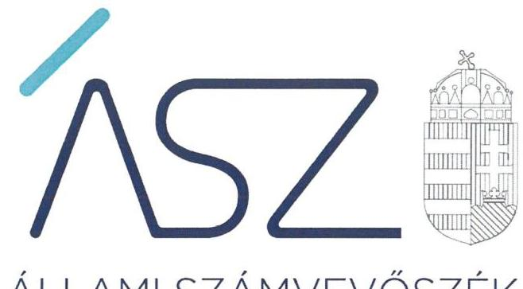
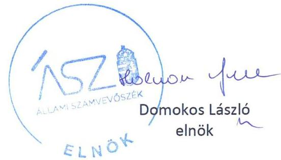
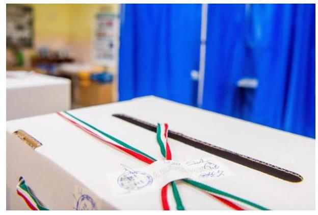

ÁLLAMI SZÁMVEVŐSZÉK

# JELENTÉS 

A helyi önkormányzati képviselők és polgármesterek, valamint a nemzetiségi önkormányzati képviselők 2019. évi választására fordított pénzeszközök felhasználásának ellenőrzése

2021. 

21025
www.asz.hu

---

ÁLLAMI SZÁMVEVŐSZÉK

# JELENTÉS

A helyi önkormányzati képviselők és polgármesterek, valamint a nemzetiségi önkormányzati képviselők 2019. évi választására fordított pénzeszközök felhasználásának ellenőrzése

2021. 02. hó 11. nap

21025
www.asz.hu

---

# AZ ELLENŐRZÉST FELÜGYELTE: 

KLINGA LÁSZLÓ felügyeleti vezető

## AZ ELLENŐRZÉST VEZETTE ÉS A VÉGREHAJTÁSÁÉRT FELELŐS:

RÁCZKEVI KATALIN ellenőrzésvezető

## A PROGRAM ÖSSZEÁLLÍTÁSÁÉRT FELELŐS:

B E RTALAN RUDOLF ellenőrzési program készítéséért felelős vezető

IKTATÓSZÁM: EL-3084-001/2021.
TÉMASZÁM: 2525
ELLENŐRZÉS-AZONOSÍTÓ SZÁM: V0869
Jelentéseink az Országgyúlés számitógépes hálózatán és az interneten a www.asz.hu címen is olvashatóak.

---

# TARTALOMJEGYZÉK 

- ÖSSZEGZÉS ..... 5
- AZ ELLENŐRZÉS CÉLJA ..... 7
- AZ ELLENŐRZÉS TERÜLETE ..... 8
- AZ ELLENŐRZÉS HÁTTERE, INDOKOLTSÁGA ..... 10
- A JELENTÉS LÉNYEGES KÉRDÉSKÖRE ..... 11
- AZ ELLENŐRZÉS HATÓKÖRE ÉS MÓDSZEREL ..... 12
- MEGÁLLAPÍTÁSOK ..... 14
- MELLÉKLETEK. ..... 17
I. sz. melléklet: Értelmező szótár ..... 17
II. sz. melléklet: Ellenőrzött szervezetek. ..... 18
- FÜGGELÉK: ÉSZREVÉTELEK ..... 21
- RÖVIDÍTÉSEK JEGYZÉKE ..... 23

---

.

---

# ÖSSZEGZÉS 

A 2019. október 13-án megtartott helyi önkormányzati képviselök és polgármesterek, valamint nemzetiségi önkormányzati képviselök választására fordított pénzeszközök tervezése, felhasználása, elszámolása és annak ellenörzése szabályszerű volt.

## Az ellenőrzés társadalmi indokoltsága

Az Alaptörvény ${ }^{1}$ 35. cikk (2) bekezdése értelmében Magyarországon a helyi önkormányzati képviselők és polgármesterek általános választását a helyi önkormányzati képviselők és polgármesterek előző általános választását követő ötödik év október hónapjában kell megtartani.

Az önkormányzati választáson a megyei (fővárosi) és helyi (kerületi) önkormányzati képviselőket, a polgármestereket és a főpolgármestert, valamint a nemzetiségi önkormányzati képviselőket választják meg. Az önkormányzati választás a helyi népképviseleti demokrácia legfontosabb fóruma, ezért az ellenőrizhető, átlátható és elszámoltatható lebonyolítása kiemelt közérdek.

A választási eljárásról szóló 2013. évi XXXVI. törvény rögzíti, hogy a helyi önkormányzati választás előkészítésével és lebonyolításával kapcsolatos állami feladatok végrehajtásának költségeit, valamint a választási szervek tevékenységével összefüggő egyéb költségeket - az Országgyűlés által megállapított mértékben - a központi költségvetésből kell biztosítani. A választási eljárásról szóló törvény rendelkezése alapján a pénzeszközök felhasználásáról az Állami Számvevőszék tájékoztatja az Országgyűlést.

Az ÁSZ ellenőrzés fókuszában áll, hogy a választók megfelelő tájékoztatást kapjanak arról, hogy a 2019. évi helyi önkormányzati választás előkészítésére és lebonyolítására biztosított forrásokat a választási szervek arra használtáke fel, amire az Országgyűlés biztosította.

A helyi önkormányzatok hivatalai, mint a választások lebonyolításának kulcsszereplői alapvetően meghatározzák a választás szabályszerű és sikeres lebonyolítását. Szerepük fontosságát mi sem bizonyítja jobban, mint az, hogy helyi szinteken kell gondoskodni a pénzeszközök tervezéséről, a felhasználás szabályairól, továbbá az elszámolás és az ellenőrzés szabályszerű végrehajtásáról. A feladataikat a társadalom érdekében, a választások zavartalan lebonyolítását szem előtt tartva látják el, ezért kiemelten fontos szereplői a választásoknak. Minden településen önálló helyi választási iroda, és minden megyében és a fővárosban önálló területi választási iroda múködik.

A választási irodák ellenőrzésével az Állami Számvevőszék támogatást nyújt ahhoz, hogy a választási feladatra rendelkezésre bocsájtott pénzeszközöket a választási szervek is ellenőrizhető, átlátható és elszámoltatható módon használják fel a feladatuk ellátása során, így biztosítva az önkormányzati választás szabályszerűségét.

## Főbb megállapítások, következtetések

A Nemzeti Választási Iroda a helyi önkormányzati képviselők és polgármesterek, valamint nemzetiségi önkormányzati képviselők 2019. évi választása pénzügyi lebonyolításának szabályait a választási irodák részére meghatározta, a költségvetési forrásokat a jogszabályi előírások szerint a választási irodák részére biztosította.

A választási irodák a helyi önkormányzati választás kiadásairól és bevételeiről az előírt normatívák figyelembevételével pénzügyi tervet készítettek. A választási irodák a helyi önkormányzati választás előkészítéséhez és lebonyolításához kapott pénzeszközök szabályszerű felhasználásának feltételeit belső szabályzataikban kialakították, a gazdálkodási jogkörök szabályszerű gyakorlásának feltételeit meghatározták. A választási irodák a helyi önkormányzati választás kiadásaival kapcsolatos előirányzat módosítást az előírások szerint végrehajtották, a felhasznált forrásokról elkülönített nyilvántartást vezettek. A választási irodák a helyi önkormányzati választással kapcsolatos pénzeszközök felhasználása során a gazdálkodási jogkörök gyakorlásával összefüggő kötelezettségvállalást és a teljesítés igazolást a jogszabályi és belső előírások alapján gyakorolták.

---

A Nemzeti Választási Iroda, a területi választási irodák és a helyi választási irodák a választási eljárásra fordított pénzeszközöket célhoz kötötten, a helyi önkormányzati választás előkészítése és lebonyolítása érdekében használták fel. A választási irodák a felhasznált pénzeszközökkel kapcsolatos pénzügyi elszámolási kötelezettségüknek az előírások szerint eleget tettek.

A Nemzeti Választási Iroda, a területi választási irodák és a helyi választási irodák a pénzeszközök felhasználásával összefüggő ellenőrzési kötelezettségüknek a jogszabályi előírás szerint eleget tettek.

---

# AZ ELLENŐRZÉS CÉLJA 

AZ ELLENŐRZÉS CÉLJA annak megítélése volt, hogy a helyi önkormányzati képviselők és polgármesterek, valamint nemzetiségi önkormányzati képviselők 2019. évi választására fordított pénzeszközeinek tervezése, felhasználása, elszámolása és annak ellenőrzése szabályszerű volt-e.

---

# AZ ELLENŐRZÉS TERÜLETE 

## A helyi önkormányzati képviselők és polgármesterek, valamint nemzetiségi önkormányzati képviselők 2019. évi választására fordított pénzeszközök felhasználása

Az Országgyűlés a választások lebonyolításának pénzügyi forrását Magyarország 2019. évi központi költségvetéséről szóló 2018. évi L. törvény I. mellékletében - az I. Országgyűlés Fejezet, 24. Nemzeti Választási Iroda Cím, 2. Fejezeti kezelésű előirányzatok Alcím és 4. 2019. évi Európai Parlamenti képviselőválasztás és a Helyi Önkormányzati képviselők és polgármesterek, valamint nemzetiségi önkormányzati képviselők választása Jogcímcsoport keretében - biztosította és a két választásra összesen 14 917,0 M Ft müködési kiadási és 568,0 M Ft felhalmozási kiadási előirányzatot határozott meg.

A 2019. évi helyi önkormányzati választás² kiadásaira tervezett eredeti előirányzat összességében - a fejezeti kezelésű és az $\mathrm{NVI}^{3}$ intézményi költségvetésében tervezett eredeti előirányzat - 9 329,2 M Ft volt. Az eredeti előirányzat összegét a megismételt választásra történő átcsoportosítás miatt 75,9 M Ft-tal, 9 253,3 M Ft-ra módosították.

Az NVI - mint az Országgyűlés költségvetési fejezetén belül önálló címet képező autonóm államigazgatási szerv - kiemelt feladataként biztosítja a választás központi pénzügyi feladatainak ellátását, gondoskodik a választás lebonyolításához kapcsolódó közbeszerzések lefolytatásáról és az egyéb úton történő eszközbeszerzésekről, a központi névjegyzék vezetéséről, valamint a választási feladatok lebonyolítása céljából megállapodást köt a választásban közreműködő egyéb szerv vezetőjével. Az NVI a Ve. ${ }^{4}$ előírásai alapján egyéb feladatai mellett irányítja a választási irodák szakmai tevékenységét, gondoskodik a választás lebonyolításához szükséges informatikai rendszer működtetéséről, valamint a választás központi logisztikai feladatainak ellátásáról.

A választási irodák ${ }^{5}$ feladata egyebek között a választás előkészítésével, lebonyolításával kapcsolatos szervezési feladatok ellátása, a választási bizottságok müködési feltételeinek biztosítása, a szavazás előkészítése, szervezése, lebonyolítása, a szavazási adatkezelés, a szavazással kapcsolatos tájékoztatás, valamint a szavazás lebonyolítása tárgyi és technikai feltételeinek biztosítása volt.

A jogszabályi előírás szerint a választási irodák szintjei, vezetői, és a választási irodák pénzeszközeinek elkülönített nyilvántartását, elszámolását vezető költségvetési szervek:
$\longrightarrow$ NVI - Nemzeti Választási Iroda - önálló költségvetési szerv, vezetője az elnök;
$\longrightarrow$ TVI - területi választási iroda - illetékes megyei, illetve fővárosi önkormányzat hivatala, vezetője a hivatal jegyzője, főjegyzője;

---

- HVI- helyi választási iroda a települési önkormányzat polgármesteri hivatala (közös önkormányzati hivatal esetén a közös önkormányzati hivatal), vezetője a hivatal jegyzője.
Az NVI adatai alapján a 2019. október 13. napján lebonyolított választási eljárásra fordított kiadás 8026 M Ft , a megismételt választási eljárásra fordított kiadás 70,1 M Ft volt.

---

# AZ ELLENŐRZÉS HÁTTERE, INDOKOLTSÁGA 

Az ellenőrzés az önkormányzati képviselők és polgármesterek, valamint a nemzetiségi önkormányzati képviselők választása előkészítése és lebonyolítása során igénybe vett pénzeszközök szabályszerű felhasználására fókuszált. Az ellenőrzés eredményeként az Állami Számvevőszék értékelte, hogy a választások előkészítésénél és lebonyolításánál a - központi költségvetésből biztosított - pénzeszközök felhasználása az ellenőrzött területeken az érintett szervezeteknél összhangban volt-e a választási eljárásra vonatkozó jogszabályi környezet rendelkezéseivel, amellyel az Állami Számvevőszék eleget tesz a törvényben előírt, Országgyűlés felé teendő tájékoztatási kötelezettségének.

Az ellenőrzéssel az Állami Számvevőszék véleményt formál a választások előkészítése és lebonyolítása során az ellenőrzéssel érintett szervezeteknél felhasznált pénzeszközök jogszabályokban leírtaknak megfelelő tervezéséről, felhasználásáról, elszámolásáról és ellenőrzéséről. Az Állami Számvevőszék az ellenőrzéssel rámutathat a választás előkészítése és lebonyolítása során felhasznált pénzeszközökkel kapcsolatos esetleges szabályozási problémákra, így az ellenőrzés hozzájárulhat a választások előkészítése és lebonyolítása során felhasznált pénzeszközök feletti kontrollok erősítéséhez. Megállapításaival az Állami Számvevőszék elősegítheti, támogathatja a jogalkotói és a szabályozói munkát. Az ellenőrzés megalapozhatja a joggyakorlásban résztvevő szervezetek tevékenységét szabályozó törvényi előírások, belső szabályzatok, eljárási rendek felülvizsgálatát.

Az esetlegesen feltárt szabályozási és kontroll hiányosságok bemutatásával az ellenőrzés hozzájárulhat azok kijavításához, támogatva a „jól irányított állam" múködését, valamint közvetetten a választások előkészítése és lebonyolítása során a közpénzek felhasználásával kapcsolatos közbizalom erősítését.

---

# A JELENTÉS LÉNYEGES KÉRDÉSKÖRE 

1.     - A helyi önkormányzati képviselők és polgármesterek, valamint nemzetiségi önkormányzati képviselők 2019. évi választására fordított pénzeszközöket szabályszerűen használták-e fel?

---

# AZ ELLENŐRZÉS HATÓKÖRE ÉS MÓDSZEREI 

## Az ellenőrzés típusa

Szabályszerúségi ellenőrzés.

## Az ellenőrzött időszak

A helyi önkormányzati képviselők és polgármesterek, valamint nemzetiségi önkormányzati képviselők 2019. évi választása előkészítésére jóváhagyott költségvetési előirányzat rendelkezésre állásától - 2019. január 1-jétől - a helyi önkormányzati választásokat követő elszámolási időszak végéig.

## Az ellenőrzés tárgya

A helyi önkormányzati választások lebonyolítására fordított pénzeszközök tervezése, a finanszírozási források elosztása, felhasználása, elszámolása és annak ellenőrzése.

## Az ellenőrzött szervezet

Nemzeti Választási Iroda, Belügyminisztérium, a területi választási irodák és helyi választási irodák. (II. számú melléklet)

## Az ellenőrzés jogalapja

Az ÁSZtv. ${ }^{6}$ 5. § (2)- (3) bekezdése, valamint a Ve. 12. §-a képezi.

## Az ellenőrzés módszerei

Az ellenőrzést az ellenőrzési program szempontjai, az ellenőrzött időszakban hatályos jogszabályok, az ellenőrzés szakmai szabályai, a jelen ellenőrzésre irányadó ÁSZ módszertanok alapján végezte az ÁSZ7.

Az ellenőrzési kérdések megválaszolásához szükséges bizonyítékok megszerzése az ellenőrzött által rendelkezésre bocsátott dokumentumokra, adatokra alapozva megfigyelés, szemle (szemrevételezés), kérdésfeltevés (információkérés), valamint elemző eljárás útján történt. Az ellenőrzési bizonyítékként felhasználható adatforrások közé tartoztak egyrészt az ellenőrzési program részletes szempontjainál felsorolt adatforrások, másrészt minden egyéb - az ellenőrzés folyamán feltárt, az ellenőrzés szempontjából információt tartalmazó - dokumentum. Az ellenőrzés le-

---

folytatásához az ellenőrzött szervezetek a tanúsítványok kitöltésével, valamint az ÁSZ által kért dokumentumok megküldésével szolgáltattak adatokat.

A helyi önkormányzati választásra rendelkezésre bocsátott pénzeszközök felhasználásának szabályszerűségét véletlen mintavétel alkalmazásával ellenőrizte az ÁSZ. A mintavételi eredmények értékelését az ÁSZ 95\%-os megbízhatóság mellett hajtotta végre.

---

# 1. A helyi önkormányzati képviselők és polgármesterek, valamint nemzetiségi önkormányzati képviselők 2019. évi választására fordított pénzeszközöket szabályszerűen használták-e fel? 

Összegző megállapítás

1.1. számú megállapítás

A választási irodák a helyi önkormányzati képviselők és polgármesterek, valamint nemzetiségi önkormányzati képviselők 2019. évi választására fordított pénzeszközeinek felhasználása szabályszerű volt.

A helyi önkormányzati választás előkészítéséhez és lebonyolításához szükséges pénzeszközök tervezése szabályszerű volt.

AZ NVI A VÁLASZTÁS PÉNZÜGYI FELADAT ÉS KÖLTSÉGTERVÉT az Pvr. ${ }^{8}$-ben előírtak szerint elkészítette.

Az NVI elnöke az Áht. ${ }^{9}$ előírásai szerint, az Ávr. ${ }^{10}$ előírásaival összhangban, az államháztartásért felelős miniszter egyetértésével meghatározta a fejezeti kezelésű előirányzat felhasználásának szabályzatát ${ }^{11}$. Az NVI a helyi önkormányzati választás céljára szolgáló pénzeszközök elkülönített számviteli kezelését a Pvr. előírásai szerint kialakította.

Az NVI elnöke Utasítás ${ }^{12}$ kiadásával a választási irodák részére szabályszerűen meghatározta a Pvr.-ben foglalt feladatok végrehajtásával kapcsolatos teendőket.

Az NVISzámviteli politikájában ${ }^{13}$ rögzítették az előirányzat-módosítások szabályait az Áht.-ban előírtak szerint.

AZ NVI A VÁLASZTÁS KOMMUNIKÁCIÓS ÉS INFORMÁCIÓS RENDSZERÉT, valamint a választási pénzügyi-logisztikai rendszerét a KIM rendelet ${ }^{14}$ előírásai szerint múködtette. A VÁKIR/VPIR ${ }^{15}$ rendszer múködtetését a választási irodák részére felhasználói kézikönyv támogatta.

Az NVI a helyi önkormányzati választás előkészítése során lefolytatott beszerzések, szolgáltatás vásárlások, beruházások esetében a jogszabályi előírásokat betartotta. A minősített adatot tartalmazó beszerzésekhez a jogszabályok szerint az NBF ${ }^{16}$ előzetes engedélyével rendelkeztek.

A TVI-K ÉS HVI-K A PÉNZÜGYI TERVEZÉSSEL KAPCSOLATOS FELADATAIKAT a jogszabályi előírásoknak megfelelően végrehajtották.

A TVI-k és HVI-k a Pvr. előírásainak megfelelően az önkormányzati választás pénzügyi tervét elkészítették. A TVI-k a költségtervek összeállításánál a dologi kiadásokat, továbbá a TVI és a HVI vezetők személyi juttatásait

---

### 1.2. számú megállapítás

és járulékait az előírások szerint figyelembe vették. A HVI-k a költségterveket az előírások szerint állították össze.

A helyi önkormányzati választásra a költségvetésből biztosított finanszírozási források elosztása és az előirányzatok kezelése szabályszerűen történt.

# AZ NVI A HELYI ÖNKORMÁNYZATI VÁLASZTÁS PÉNZÜGYI LEBONYOLÍTÁSA 

központi feladatainak ellátásáról a Ve. előírásai szerint gondoskodott. A helyi önkormányzati választás előkészítéséhez, lebonyolításához szükséges források biztosításához az előirányzat átcsoportosításokat az NVI az Áht., az Ávr., az Áhsz. ${ }^{17}$ és a fejezeti kezelésű előirányzat felhasználásának szabályzata szerint hajtotta végre.

Az NVI a Pvr.-ben előírt normatívák és határidők szerint a helyi önkormányzati választás pénzügyi fedezetének TVI-ket megillető részét az illetékes fővárosi, megyei önkormányzati hivatal fizetési számlájára, a HVI-ket megillető részt a települési önkormányzat polgármesteri hivatala - közös önkormányzati hivatal esetén a közös önkormányzati hivatal - fizetési számlájára folyósította.

A TVI-k és HVI-k az előirányzatok módosításával összefüggő feladatokat az Áht., az Ávr. és az Áhsz. előírásaival összhangban hajtották végre. A TVI- k részéről többlettámogatási igény nem merült fel.

A választási irodák a helyi önkormányzati választás előkészítéséhez, lebonyolításához rendelkezésre álló pénzeszközöket szabályszerűen használták fel.

## A VÁLASZTÁS ELŐKÉSZÍTÉSÉHEZ ÉS LEBONYOLITÁSÁHOZ KAPOTT PÉNZESZKÖZÖK FELHASZ-

NÁLÁSÁNAK BELSŐ SZABÁLYZATAIT és az ellenőrzési jogkörök gyakorlásának szabályait a választási irodák az Áht., az Ávr. és a Pvr. előírásai szerint kialakították. A választási irodák rendelkeztek a gazdálkodási és ellenőrzési jogkörök gyakorlására vonatkozó szabályzatokkal, továbbá a gazdálkodási jogkör gyakorlásra jogosultakról az Ávr.-ben előírt nyilvántartást vezették.

A TVI-k és a HVI-k vezetői gondoskodtak a választás céljára biztosított pénzeszközök Pvr.-ben előírtak szerinti elkülönített számviteli kezeléséről, továbbá a pénzeszközök felhasználásáról a választási feladatokkal kapcsolatos részletező nyilvántartás vezetéséről.

A választási irodák a helyi önkormányzati választással kapcsolatos pénzeszközök felhasználása során az Áht., az Ávr. és a belső szabályzatokban előírtakat betartották. A kiadások felhasználásánál az arra jogosultak gyakorolták a gazdálkodási jogköröket, a kötelezettségvállalást és a teljesítés igazolást.

A NVI, a TVI-k és a HVI-k a helyi önkormányzati választás előkészítésével és lebonyolításával kapcsolatban teljesített dologi jellegű, személyi jellegű kiadásoknál és a munkaadót terhelő járulék kiadások teljesítésénél a pénzeszközöket az Áht., az Ávr. és a belső előírások betartásával használták fel.

---

# Megállapítások 

A választási irodák a személyi és a dologi kiadások teljesítésénél a Pvr.- ben előírt jogcímek és normatívák szerinti összegeket érvényesítették. A pénzeszközök felhasználása a helyi önkormányzati választással öszszefüggésben történt.

## A választási irodáknál a helyi önkormányzati választás előkészítéséhez, lebonyolításához felhasznált pénzeszközök elszámolása szabályszerűen történt.

## A TVI-K ÉS HVI-K A FELADATTÍPUSÚ ELSZÁMOLÁSI KÖTELEZETTSÉGÜKNEK a Pvr. előírásai és az NVI által előírtak szerint, határidőben tettek eleget.

A TVI-k és HVI-k feladattípusú elszámolásának elfogadásáról az NVI - a választási eljárás informatikai rendszerében szereplő adatok alapján - a Pvr.-ben előírt határidőn belül döntött. Az NVI a választási irodák részére az elszámolások elfogadó okiratait a Pvr. előírásai szerint elkészítette.

Az érintett választási irodák az elszámolás NVI által történt elfogadását követően a felmerülő támogatás visszafizetési kötelezettségüknek szabályosan eleget tettek.

Az NVI vezetője a TVI-k és HVI-k vezetőinek személyi juttatásairól a Pvr. előírásainak betartásával, a választási irodák elszámolásának elfogadását követően döntött. Az NVI a területi és a helyi választási irodák elszámolásai alapján az önkormányzati választásra vonatkozó összesítő elszámolását a jogszabályban előírtak szerint elkészítette.

## A választási irodák a pénzeszközök felhasználásának ellenőrzését szabályszerűen elvégezték.

Az NVI a TVI-k vonatkozásában a támogatások felhasználásának megalapozottságát a Pvr.-ben előírtak szerint ellenőrizte.

A TVI-k a helyi választási irodák tekintetében a Pvr.-ben előírt ellenőrzési feladatokat ellátták. A TVI-kés HVI-k a pénzeszközök felhasználásának ellenőrzésére a választási iroda tagja részére a Pvr. előírásainak megfelelően megbízást adtak.

---

# MELLÉKLETEK 

- I. SZ. MELLÉKLET: ÉRTELMEZŐ SZÓTÁR

COFOG kód
választási informatikai rendszer
választásiszerv
2014. január 1-jével a költségvetési szervek alaptevékenységének besorolása a korábban alkalmazott államháztartási szakfeladatok helyett kormányzati funkció kóddal történik. A magyar államháztartásban alkalmazott kormányzati funkciók rendszere a kormányzati kiadások funkciók szerinti osztályozásán (classification of the functions of government, COFOG) alapul. A kormányzati kiadások funkciók szerinti osztályozása 10 fócsoportba besorolva tartalmazza a kormányzat szektor (államháztartás és a kormányzatba sorolt vállalatok és nonprofit intézmények) kiadásait. (Forrás: 68/2013. (XII. 29. ) NGM rendelet)
A Ve.-ben meghatározott választási feladatok végrehajtásában részt vevő és azokat kiszolgáló szervezetek által működtetett választási informatikai infrastruktúra és választási alkalmazói rendszerelemek összessége.
A Ve. 3. §. (1) bekezdés 15. pontjában meghatározottak szerint a választási bizottság és a választási iroda.

---

# II. SZ. MELLÉKLET: ELLENŐRZÖTT SZERVEZETEK 

## Központi választási szerv

1. Nemzeti Választási Iroda

## Egyéb választási szerv

1. Belügyminisztérium

## Tergleti választási szervek (TVI)

1. Budapest Főváros Főpolgármesteri Hivatal
2. Baranya Megyei Önkormányzati Hivatal
3. Bács-Kiskun Megyei Önkormányzati Hivatal
4. Békés Megyei Önkormányzati Hivatal
5. Borsod-Abaúj-Zemplén Megyei Önkormányzati Hivatal
6. Csongrád-Csanád Megyei Önkormányzati Hivatal
7. Fejér Megyei Önkormányzati Hivatal
8. Győr-Moson-Sopron Megyei Önkormányzati Hivatal
9. Hajdú-Bihar Megyei Önkormányzati Hivatal
10. Heves Megyei Önkormányzati Hivatal
11. Jász-Nagykun-Szolnok Megyei Önkormányzati Hivatal
12. Komárom-Esztergom Megyei Önkormányzati Hivatal
13. Nógrád Megyei Önkormányzati Hivatal
14. Pest Megyei Önkormányzati Hivatal
15. Somogy Megyei Önkormányzati Hivatal
16. Szabolcs-Szatmár-Bereg Megyei Önkormányzati Hivatal
17. Tolna Megyei Önkormányzati Hivatal
18. Vas Megyei Önkormányzati Hivatal
19. Veszprém Megyei Önkormányzati Hivatal
20. Zala Megyei Önkormányzati Hivatal

## Helyi választási szervek (HVI)

1. Egyházaskozári Közös Önkormányzati Hivatal (Tóführonatkozásában)
2. Hahóti Közös Önkormányzati Hivatal (Hosszúvölgy vonatkozásában)
3. Bánokszentgyörgyi Közös Önkormányzati Hivatal (Bucsuta vonatkozásában)
4. Nemesbődi Közös Önkormányzati Hivatal (Meszlen vonatkozásában)
5. Felsőrajki Közös Önkormányzati Hivatal (Pötréte vonatkozásában)
6. Nyögéri Közös Önkormányzati Hivatal (Bögöte vonatkozásában)
7. Batéi Közös Önkormányzati Hivatal (Kaposhomok vonatkozásában)
8. Nyögéri Közös Önkormányzati Hivatal (Meggyeskovácsi vonatkozásában)
9. Zirci Közös Önkormányzati Hivatal (Borzavár vonatkozásában)
10. Nagykónyi Közös Önkormányzati Hivatal (Nagyszokoly vonatkozásában)
11. Mezöladányi Közös Önkormányzati Hivatal (Újkenéz vonatkozásában)
12. Bódvaszilasi Közös Önkormányzati Hivatal
13. Magyarkeszi Közös Önkormányzati Hivatal (Felsőnyék vonatkozásában)
14. Baki Közös Önkormányzati Hivatal (Bocfölde vonatkozásában)
15. Tiszanagyfalui Közös Önkormányzati Hivatal (Timár vonatkozásában)
16. Tuzséri Közös Önkormányzati Hivatal
17. Füzesgyarmati Polgármesteri Hivatal
18. Szentlő́rinci Közös Önkormányzati Hivatal
19. Jászárokszállási Polgármesteri Hivatal
20. Dunaföldvári Polgármesteri Hivatal
21. Edelényi Közös Önkormányzati Hivatal

---

| 22. | Diósdi Polgármesteri Hivatal |
| :--: | :--: |
| 23. | Bonyhádi Közös Önkormányzati Hivatal |
| 24. | Hajdúsámsoni Polgármesteri Hivatal |
| 25. | Kiskőrösi Polgármesteri Hivatal |
| 26. | Püspökladányi Közös Önkormányzati Hivatal |
| 27. | Budakeszi Polgármesteri Hivatal |
| 28. | Sárvári Közös Önkormányzati Hivatal |
| 29. | Tiszaújvárosi Polgármesteri Hivatal |
| 30. | Mátészalkai Polgármesteri Hivatal |
| 31. | Kisvárdai Polgármesteri Hivatal |
| 32. | Dabasi Polgármesteri Hivatal |
| 33. | Dombóvári Közös Önkormányzati Hivatal |
| 34. | Gödi Polgármesteri Hivatal |
| 35. | Nagykőrösi Polgármesteri Hivatal |
| 36. | Siófoki Közös Önkormányzati Hivatal |
| 37. | Budapest Főváros VI. Kerület Terézvárosi Polgármesteri Hivatal |
| 38. | Budaörsi Polgármesteri Hivatal |
| 39. | Kiskunfélegyházi Polgármesteri Hivatal |
| 40. | Gyulai Polgármesteri Hivatal |
| 41. | Gödöllői Polgármesteri Hivatal |
| 42. | Mosonmagyaróvári Polgármesteri Hivatal |
| 43. | Salgótarján Megyei Jogú Város Polgármesteri Hivatala |
| 44. | Bajai Polgármesteri Hivatal |
| 45. | Budafok-Tétény Budapest XXII. Kerületi Polgármesteri Hivatal |
| 46. | Budapest Főváros XV. Kerületi Polgármesteri Hivatal |
| 47. | Szolnok Megyei Jogú Város Polgármesteri Hivatal |
| 48. | Szombathely Megyei Jogú Város Polgármesteri Hivatala |
| 49. | Kecskemét Megyei Jogú Város Polgármesteri Hivatala |
| 50. | Debrecen Megyei Jogú Város Polgármesteri Hivatala |

---

.

---

# FÜGGELÉK: ÉSZREVÉTELEK 

A jelentéstervezetet a Számvevőszék 15 napos észrevételezésre megküldte az ellenőrzött szervezetek vezetőinek az ÁSZ tv. 29. §* (1) bekezdése előírásának megfelelően.

Az ellenőrzött szervezetek vezetői a jelentéstervezet megállapításaira nem tettek észrevételt.

[^0]
[^0]:    * 29. § (1) Az Állami Számvevőszék az ellenőrzési megállapításait megküldi az ellenőrzött szervezet vezetőjének vagy az általa megbízott személynek, és annak, akinek személyes felelősségét állapította meg.
    (2) Az ellenőrzött szervezet vezetője és a felelősként megjelölt személy az ellenőrzés megállapításaira tizenöt napon belül írásban észrevételt tehet.
    (3) Az Állami Számvevőszék az észrevételre a beérkezésétől számított harminc napon belül írásban válaszol. A figyelembe nem vett észrevételeket köteles a jelentésben feltüntetni, és megindokolni, hogy azokat miért nem fogadta el.

---

.

---

# RÖVIDÍTÉSEK JEGYZÉKE 

${ }^{1}$ Alaptörvény
${ }^{2}$ helyi önkormányzati választás
${ }^{3}$ NVI
${ }^{4} \mathrm{Ve}$.
${ }^{5}$ választási iroda
${ }^{6}$ ÁSZtv.
${ }^{7}$ ÁSZ
${ }^{8}$ Pvr.
${ }^{9}$ Áht.
${ }^{10}$ Ávr.
${ }^{11}$ fejezeti kezelésű előirányzatok szabályzata a Nemzeti Választási Iroda, területi választási irodák, helyi választási irodák az Állami Számvevőszékről szóló 2011. évi LXVI. törvény
${ }^{12}$ Utasítás
${ }^{13}$ NVI Számviteli politika
${ }^{14}$ KIM rendelet
${ }^{15}$ VÁKIR/VPIR
${ }^{16}$ NBF
${ }^{17}$ Áhsz.

Magyarország Alaptörvénye
a helyi önkormányzati képviselőkés polgármesterek, valamint nemzetiségi önkormányzati képviselők 2019. október 13-ai választása
Nemzeti Választási Iroda
2013. évi XXXVI. törvény a választási eljárásról

Nemzeti Választási Iroda, területi választási irodák, helyi választási irodák az Állami Számvevőszékről szóló 2011. évi LXVI. törvény
Állami Számvevőszék
a helyi önkormányzati képviselőkés a polgármesterek általános választása, valamint a nemzetiségi önkormányzati képviselők általános választása költségeinek normatíváiról, tételeiről, elszámolási és belső ellenőrzési rendjéről szóló 22/2019. (VII. 31.) IM rendelet (hatályos: 2019. augusztus 01-től)
az államháztartásról szóló 2011. évi CXCV. törvény
(hatályos: 2012. január 01-jétől)
az államháztartásról szóló törvény végrehajtásáról szóló 368/2011. (XII.31.) Korm. rendelet (hatályos: 2012. január 01-jétől).
a Nemzeti Választási Iroda fejezeti kezelésű előirányzatai felhasználásának szabályzatáról szóló 5/2019. (XI.25.) utasítással módosított 8/2015. (XII. 9.) NVI utasítás
NVI 8/2019.(IX.16.) számú elnöki utasítása a helyi önkormányzati képviselőkés polgármesterek, általános választása, valamint a nemzetiségi önkormányzati képviselők általános költségeinek normatíváiról, tételeiről, elszámolási és belső ellenőrzési rendjéről szóló 22/2019.(VII.31.) IM rendeletben foglalt feladatok végrehajtásával kapcsolatos teendőkről
Nemzeti Választási Iroda Számviteli politikája
17/2013. (VII.17.) KIM rendelet a központi névjegyzék, valamint egyéb választási nyilvántartások vezetéséről
Választási Kommunikációs és Információs Rendszer Választási Pénzügyi Információs Rendszer modul
Nemzeti Biztonsági Felügyelet
4/2013. (I. 11.) Korm. rendelet az államháztartás számviteléről

---

# ASZ 

ALLAMI SZAMVEVOSZEK
1052 Budapest, Apáczai Cs. J. u. 10. | 1364 Budapest 4. Pf. 54
TEL: +36 14849100
email: szamvevoszek@asz.hu
web: www.asz.hu | www.aszhirportal.hu