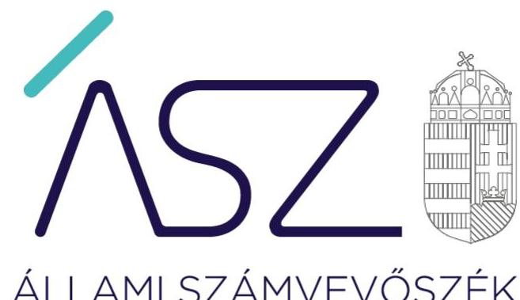

ÁLLAMI SZÁMVEVŐSZÉK

# JELENTÉS 

## Nem állami humánszolgáltatók ellenőrzése

A köznevelési humánszolgáltatást nyújtó intézmények, szolgáltatók államháztartáson kívüli fenntartói központi költségvetésből kapott támogatásai felhasználásának ellenőrzése 22 gazdasági társaságnál
2021.

21026
www.asz.hu

---

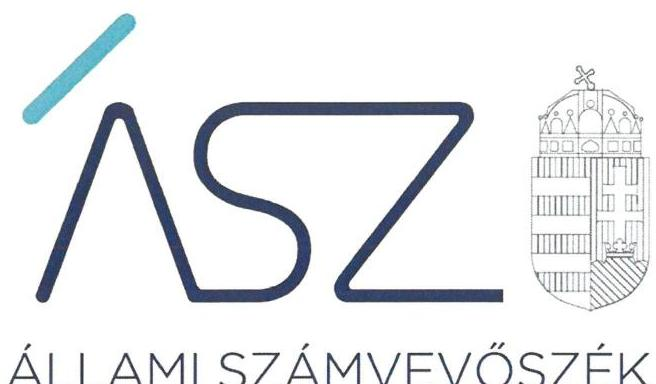

# JELENTÉS

## Nem állami humánszolgáltatók ellenőrzése

A köznevelési humánszolgáltatást nyújtó intézmények, szolgáltatók államháztartáson kívüli fenntartói központi költségvetésből kapott támogatásai felhasználásának ellenőrzése 22 gazdasági társaságnál

2021. 02. hó 09. nap

21026
www.asz.hu

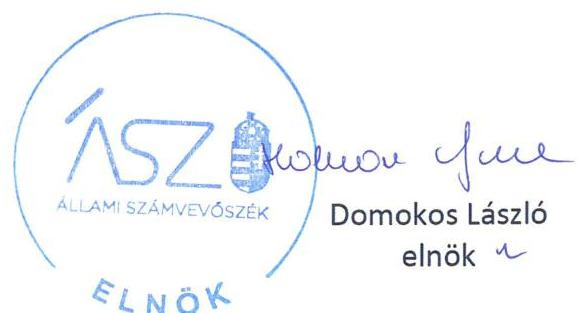

---

|  J | AZ ELLENŐRZÉST FELÜGYELTE:  |
| --- | --- |
|   | MAKKAI MÁRIA felügyeleti vezető  |
|   | KLINGA LÁSZLÓ felügyeleti vezető  |
|   | TÓTH MARIANNA felügyeleti vezető  |
|   | AZ ELLENŐRZÉST VEZETTE ÉS A VÉGREHAJTÁSÁÉRT FELELŐS:  |
|   | HOFMEISTER LÁSZLÓ ellenőrzésvezető  |
|   | A PROGRAM ÖSSZEÁLLÍTÁSÁÉRT FELELŐS:  |
|   | FEKETE-NAGY ANDRÁS GÁBOR felelős vezető  |
|  |   |
|  J | IKTATÓSZÁM: EL-3096-001/2021  |
|   | TÉMASZÁM: 2508  |
|   | ELLENŐRZÉS-AZONOSÍTÓ SZÁM: V0867296  |

---

# TARTALOMJEGYZÉK 

■ ÖSSZEGZÉS ..... 5
■ AZ ELLENŐRZÉS CÉLJA ..... 6
■ AZ ELLENŐRZÉS TERÜLETE ..... 7
■ AZ ELLENŐRZÉS HÁTTERE, INDOKOLTSÁGA ..... 11
■ AZ ELLENŐRZÉS LÉNYEGES KÉRDÉSKÖREI ..... 12
■ ELLENŐRZÉS HATÓKÖRE ÉS MÓDSZEREI ..... 13
■ MEGÁLLAPÍTÁSOK ..... 15
■ MELLÉKLETEK ..... 21
I. sz. melléklet: Az ellenőrzött szervezetek ..... 21
II. sz. melléklet: Értelmező szótár ..... 22
■ FÜGGELÉK: ÉSZREVÉTELEK ..... 23
■ RÖVIDÍTÉSEK JEGYZÉKE ..... 59

---

.

---

# ÖSSZEGZÉS 

Az ellenőrzött 22 köznevelési humánszolgáltatást nyújtó államháztartáson kívüli intézményfenntartó közül két intézményfenntartó biztosította a köznevelési humánszolgáltatási közfeladatok ellátására kapott költségvetési támogatások felhasználásának átláthatóságát, 12 intézményfenntartó nem biztosította az ellenőrizhetőség feltételeit, nyolc intézményfenntartó nem biztosította a költségvetési támogatások elszámoltathatóságát.

## Az ellenőrzés társadalmi indokoltsága

A köznevelési feladatok ellátása az Alaptörvényben meghatározott, a társadalom szempontjából fontos tevékenység. Jogszabályok teszik lehetővé, hogy államháztartáson kívüli szervezetek - így például az egyházi fenntartók, alapítványok, gazdasági társaságok, egyesületek - által fenntartott intézmények is végezzenek köznevelési feladatokat. Mindehhez a központi költségvetés évente jelentős összegű támogatással járul hozzá. Az államháztartáson kívüli, humánszolgáltatást végző intézmények az igényelt közpénzekből társadalmilag hasznos, közösségteremtő, közérdekű, illetve közhasznú tevékenységet végeznek, illetve közfeladatokat látnak el.

Az intézményfenntartók ellenőrzésével az Állami Számvevőszék hozzájárul ahhoz, hogy ezen közpénzeket az államháztartáson kívüli szervezetek is ellenőrizhető, átlátható és elszámoltatható módon használják fel a közfeladatok ellátása során. Az ellenőrzések célja továbbá, hogy a nyilvánosság és az igénybevevők megfelelő tájékoztatást kapjanak az államháztartáson kívüli közfeladatot ellátók működéséről.

Az Állami Számvevőszék ellenőrzései arra adnak választ, hogy az intézményfenntartók arra használták-e fel a közpénzeket, amire igényelték. A szabályszerű gazdálkodás elengedhetetlen a közfeladat ellátás szakmai céljainak megvalósításához, valamint a társadalmi közbizalom fenntartásához.

## Főbb megállapítások, következtetések, javaslatok

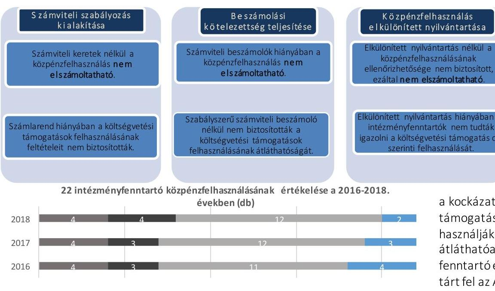

22 intézményfenntartó közpénzfelhasználásának értékelése a 2016-2018. években (db)
20 intézményfenntartó az Alaptörvény ${ }^{1}$ 39. cikk (2) bekezdésében foglaltak ellenére a felhasznált közpénzekre vonatkozó gazdálkodása átláthatóságát nem biztosította a 2018. évben. Ezen intézményfenntartók esetében felmerül annak a kockázata, hogy a jövőben a kapott támogatásokat nem szabályszerűen használják fel, és a közpénzeket nem átláthatóan kezelik. Két intézményfenntartó esetén lényeges hibát nem tárt fel az ÁSZ² a 2018. évi költségvetési támogatások átláthatósága és elszámoltathatósága terén.

---

# AZ ELLENŐRZÉS CÉLJA

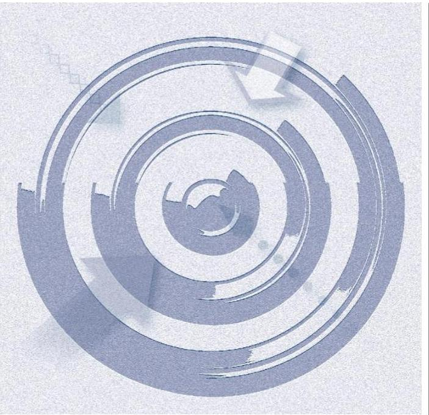

**AZ ELLENŐRZÉS CÉLJA** annak értékelése volt, hogy a nem állami, nem önkormányzati köznevelési intézményi fenntartó központi költségvetésből kapott támogatásainak felhasználása szabályszerű volt-e.

---

# AZ ELLENŐRZÉS TERÜLETE 

## Köznevelési humánszolgáltatási közfeladatokat ellátó államháztartáson kívüli fenntartók

Közoktatási/köznevelési intézményt az Nkt. ${ }^{3} 2$. § (3) bekezdés bb-bd) pontjai szerint nem állami, nem önkormányzati fenntartó - egyházi jogi személy, vallási tevékenységet végző szervezet, más személy vagy szervezet (például civil szervezet, alapítvány, gazdasági társaság) - is alapíthat és tarthat fenn, az itt hivatkozott törvények keretei között.

Az államháztartáson kívüli köznevelési feladatokat ellátó intézmények központi költségvetésből kapott támogatásai felhasználását 22 fenntartónál ellenőriztük. A 22 gazdálkodó szervezet társasági formája korlátolt felelősségű társaság volt.

- A várpalotai székhelyű "ALLEGRETTO 8500" Művészeti Közhasznú Nonprofit Korlátolt Felelősségű Társaság a 2016-2018. években egy önálló jogi személyiséggel rendelkező köznevelési Intézményt ${ }_{1}{ }^{4}$ tartott fenn. Az Intézmény ${ }_{1}$ egy köznevelési alapfeladatot, alapfokú művészetoktatást látott el. Ezen alapfeladatra tekintettel a Fenntartó ${ }_{1}{ }^{5}$ a MÁK ${ }^{6}$ adatai alapján a 2016. évben 63,7 M Ft, a 2017. évben 69,3 M Ft, a 2018. évben 63,6 M Ft költségvetési támogatásban részesült.
- A nyíregyházi székhelyű BOTOLÓ Nonprofit Közhasznú Korlátolt Felelősségű Társaság a 2016-2018. években egy önálló jogi személyiséggel rendelkező köznevelési Intézményt ${ }_{2}{ }^{7}$ tartott fenn. Az Intézmény ${ }_{2}$ egy köznevelési alapfeladatot, alapfokú művészetoktatást látott el. Ezen alapfeladatra tekintettel a Fenntartó ${ }_{2}{ }^{8}$ a MÁK adatai alapján a 2016. évben 109,0 M Ft, a 2017. évben 114,4 M Ft, a 2018. évben 117,1 M Ft költségvetési támogatásban részesült.
- A forráskúti székhelyű CLASSIC Oktatási és Szolgáltató Nonprofit Korlátolt Felelősségű Társaság a 2016-2018. években egy önálló jogi személyiséggel rendelkező köznevelési Intézményt ${ }_{3}{ }^{9}$ tartott fenn. Az Intézmény ${ }_{3}$ egy köznevelési alapfeladatot, alapfokú művészetoktatást látott el. Ezen alapfeladatra tekintettel a Fenntartó ${ }_{3}{ }^{10}$ a MÁK adatai alapján a 2016. évben 78,7 M Ft, a 2017. évben 86,0 M Ft, a 2018. évben 89,5 M Ft költségvetési támogatásban részesült.
- A miskolci székhelyű DATI Diósgyőri Alapfokú Táncművészeti Iskola Non-profit Korlátolt Felelősségű Társaság a 2016-2018. években egy önálló jogi személyiséggel rendelkező köznevelési Intézményt ${ }_{4}{ }^{11}$ tartott fenn. Az Intézmény ${ }_{4}$ egy köznevelési alapfeladatot, alapfokú művészetoktatást látott el. Ezen alapfeladatra tekintettel a Fenntartó ${ }_{4}{ }^{12}$ a MÁK adatai alapján a 2016. évben 67,2 M Ft, a 2017. évben 75,7 M Ft, a 2018. évben 70,3 M Ft költségvetési támogatásban részesült.

---

A budapesti székhelyű E-médiainformatika Nonprofit Korlátolt Felelősségű Társaság mint Fenntartó ${ }_{5}{ }^{13}$ köznevelési közfeladatait egy általa fenntartott önálló jogi személyiséggel rendelkező Intézményén ${ }_{5}{ }^{14}$ keresztül látta el. A 2016-2018. években évente két nevelési-oktatási (2016. évben szakközépiskolai nevelés-oktatás és szakiskolai nevelés-oktatás; 2017-2018. években gimnáziumi nevelés-oktatás, szakgimnáziumi nevelés-oktatás) alapfeladat ellátására a MÁK adatai alapján a 2016. évben 82,4 M Ft, a 2017. évben 81,8 M Ft, a 2018. évben 73,5 M Ft költségvetési támogatásban részesült.
A székesfehérvári székhelyű "ÉRTED" Oktatási és Szolgáltató Közhasznú Nonprofit Korlátolt Felelősségű Társaság mint Fenntartó ${ }_{6}{ }^{15}$ köznevelési közfeladatait egy általa fenntartott önálló jogi személyiséggel rendelkező Intézményén ${ }_{6}{ }^{16}$ keresztül látta el. A 2016-2018. években két nevelési-oktatási (pedagógiai szakszolgálati feladatok és sajátos nevelési igényű tanulók iskolai nevelése-oktatása) alapfeladat ellátására a MÁK adatai alapján a 2016. évben 67,4 M Ft, a 2017. évben 80,5 M Ft, a 2018. évben 98,6 M Ft költségvetési támogatásban részesült.
A miskolci székhelyű EURO-MAGISTER Nonprofit Korlátolt Felelősségű Társaság a 2016-2018. években egy önálló jogi személyiséggel rendelkező köznevelési Intézményt ${ }_{7}{ }^{17}$ tartott fenn. Az Intézmény egy köznevelési alapfeladatot, gimnáziumi nevelés-oktatást látott el. Ezen alapfeladatra tekintettel a Fenntartó ${ }_{7}{ }^{18}$ a MÁK adatai alapján a 2016. évben 66,1 M Ft, a 2017. évben 72,6 M Ft, a 2018. évben 79,2 M Ft költségvetési támogatásban részesült.
A miskolci székhelyű GARABONCIÁS ISKOLA Oktatási Nonprofit Korlátolt Felelősségű Társaság a 2016-2018. években egy önálló jogi személyiséggel rendelkező köznevelési Intézményt ${ }_{8}{ }^{19}$ tartott fenn. Az Intézmény egy köznevelési alapfeladatot, alapfokú művészetoktatást látott el. Ezen alapfeladatra tekintettel a Fenntartó ${ }_{8}{ }^{20}$ a MÁK adatai alapján a 2016. évben 96,5 M Ft, a 2017. évben 101,8 M Ft, a 2018. évben 105,3 M Ft költségvetési támogatásban részesült.
A vámosszabadi székhelyű Harmónia Művészeti Központ Nonprofit Közhasznú Korlátolt Felelősségű Társaság a 2016-2018. években egy önálló jogi személyiséggel rendelkező köznevelési Intézményt ${ }_{9}{ }^{21}$ tartott fenn. Az Intézmény egy köznevelési alapfeladatot, alapfokú művészetoktatást látott el. Ezen alapfeladatra tekintettel a Fenntartó ${ }_{9}{ }^{22}$ a MÁK adatai alapján a 2016. évben 174,9 M Ft, a 2017. évben 185,7 M Ft, a 2018. évben 188,8 M Ft költségvetési támogatásban részesült.
A bogácsi székhelyű Hórvölgye Zeneiskola Nonprofit Korlátolt Felelősségű Társaság a 2016-2018. években egy önálló jogi személyiséggel rendelkező köznevelési Intézményt ${ }_{10}{ }^{23}$ tartott fenn. Az Intézmény ${ }_{10}$ egy köznevelési alapfeladatot, alapfokú művészetoktatást látott el. Ezen alapfeladatra tekintettel a Fenntartó ${ }_{10}{ }^{24}$ a MÁK adatai alapján a 2016. évben 90,6 M Ft, a 2017. évben 98,1 M Ft, a 2018. évben 98,2 M Ft költségvetési támogatásban részesült.
A budapesti székhelyű ISZTI Innovációs Szakképző és Továbbképző Iskola Központ Közhasznú Nonprofit Korlátolt Felelősségű Társaság mint Fenntartó ${ }_{11}{ }^{25}$ köznevelési közfeladatait két általa fenntartott önálló jogi személyiséggel rendelkező Intézményén ${ }_{11}{ }^{26}$ keresztül

---

látta el. A 2016-2018. években két nevelési-oktatási (gimnáziumi nevelés-oktatás, szakgimnáziumi nevelés-oktatás) alapfeladat ellátására a MÁK adatai alapján a 2016. évben 129,0 M Ft, a 2017. évben 143,9 M Ft, a 2018. évben 140,1 M Ft költségvetési támogatásban részesült.

- A gödrei székhelyű KONTRASZTOK Művészeti, Oktató és Szolgáltató Nonprofit Közhasznú Kft. a 2016-2018. években egy önálló jogi személyiséggel rendelkező köznevelési Intézményt ${ }_{12}{ }^{27}$ tartott fenn. Az Intézmény ${ }_{12}$ egy köznevelési alapfeladatot, alapfokú művészetoktatást látott el. Ezen alapfeladatra tekintettel a Fenntartó ${ }_{12}{ }^{28}$ a MÁK adatai alapján a 2016. évben 68,9 M Ft, a 2017. évben 70,6 M Ft, a 2018. évben 71,1 M Ft költségvetési támogatásban részesült.
- A kunszigeti székhelyű Kunszigeti Közszolgáltató Nonprofit Korlátolt Felelősségű Társaság mint Fenntartó ${ }_{13}{ }^{29}$ köznevelési közfeladatait egy általa fenntartott önálló jogi személyiséggel rendelkező Intézményén ${ }_{13}{ }^{30}$ keresztül látta el. A 2016-2018. években két nevelési-oktatási (általános iskolai nevelés-oktatás, alapfokú művészetoktatás) alapfeladat ellátására a MÁK adatai alapján a 2016. évben 66,0 M Ft, a 2017. évben 66,1 M Ft, a 2018. évben 63,9 M Ft költségvetési támogatásban részesült.
- A szombathelyi székhelyű LORIGO Oktatási és Kulturális Szolgáltató Közhasznú Nonprofit Korlátolt Felelősségű Társaság a 2016-2018. években egy önálló jogi személyiséggel rendelkező köznevelési Intézményt ${ }_{14}{ }^{31}$ tartott fenn. Az Intézmény ${ }_{14}$ egy köznevelési alapfeladatot, alapfokú művészetoktatást látott el. Ezen alapfeladatra tekintettel a Fenntartó ${ }_{14}{ }^{32}$ a MÁK adatai alapján a 2016. évben 79,4 M Ft, a 2017. évben 86,3 M Ft, a 2018. évben 83,3 M Ft költségvetési támogatásban részesült.
- A budapesti székhelyű Művész Gyerekekért Közhasznú Nonprofit Kft. a 2016-2018. években egy önálló jogi személyiséggel rendelkező köznevelési Intézményt ${ }_{15}{ }^{33}$ tartott fenn. Az Intézmény ${ }_{15}$ két köznevelési alapfeladatot, szakgimnáziumi nevelés-oktatást és alapfokú művészetoktatási feladatokat látott el. Ezen alapfeladatra tekintettel a Fenntartó ${ }_{15}{ }^{34}$ a MÁK adatai

 alapján a 2016. évben 69,1 M Ft, a 2017. évben 72,7 M Ft, a 2018. évben 74,3 M Ft költségvetési támogatásban részesült.
- A kisteleki székhelyű PRO-ART KISTELEK Közhasznú Nonprofit Korlátolt Felelősségű Társaság a 2016-2018. években egy önálló jogi személyiséggel rendelkező köznevelési intézményt ${ }_{16}{ }^{35}$ tartott fenn. Az intézmény ${ }_{16}$ egy köznevelési alapfeladatot, alapfokú művészetoktatást látott el. Ezen alapfeladatra tekintettel a Fenntartó ${ }_{16}{ }^{36}$ a MÁK adatai alapján a 2016. évben 52,0 M Ft, a 2017. évben 71,3 M Ft, a 2018. évben 75,9 M Ft költségvetési támogatásban részesült.
- A szentesi székhelyű Szilver Táncművészeti Nonprofit Korlátolt Felelősségű Társaság a 2016-2018. években egy önálló jogi személyiséggel rendelkező köznevelési intézményt ${ }_{17}{ }^{37}$ tartott fenn. Az intézmény ${ }_{17}$ egy köznevelési alapfeladatot, alapfokú művészetoktatást látott el. Ezen alapfeladatra tekintettel a Fenntartó ${ }_{17}{ }^{38}$ a MÁK adatai alapján a 2016. évben 184,3 M Ft, a 2017. évben 198,3 M Ft, a 2018. évben 201,3 M Ft költségvetési támogatásban részesült.

---

A budakalászi székhelyű TALENTUM VIA Oktatási és Szolgáltató Nonprofit Korlátolt Felelősségű Társaság mint Fenntartó ${ }_{18}{ }^{39}$ köznevelési közfeladatait egy általa fenntartott önálló jogi személyiséggel rendelkező intézményén ${ }_{18}{ }^{40}$ keresztül látta el. A 2016-2018. években két nevelési-oktatási (általános iskolai nevelés-oktatás, gimnáziumi nevelés-oktatás) alapfeladat ellátására a MÁK adatai alapján a 2016. évben 88,6 M Ft, a 2017. évben 105,3 M Ft, a 2018. évben 128,2 M Ft költségvetési támogatásban részesült.
A nyíregyházi TÁNCÉRT ÉS OKTATÁSÉRT Művészeti Nonprofit Korlátolt Felelősségű Társaság a 2016-2018. években egy önálló jogi személyiséggel rendelkező köznevelési intézményt ${ }_{19}{ }^{41}$ tartott fenn. Az intézmény ${ }_{19}$ egy köznevelési alapfeladatot, alapfokú művészetoktatást látott el. Ezen alapfeladatra tekintettel a Fenntartó ${ }_{19}{ }^{42}$ a MÁK adatai alapján a 2016. évben 256,3 M Ft, a 2017. évben 287,2 M Ft, a 2018. évben 286,6 M Ft költségvetési támogatásban részesült.
A budapesti székhelyű Tudásfa Oktatási Nonprofit Kft. a 2016-2018. években egy önálló jogi személyiséggel rendelkező köznevelési intézményt ${ }_{20}{ }^{43}$ tartott fenn. Az intézmény ${ }_{20}$ egy köznevelési alapfeladatot, gimnáziumi nevelés-oktatást látott el. Ezen alapfeladatra tekintettel a Fenntartó ${ }_{20}{ }^{44}$ a MÁK adatai alapján a 2016. évben 78,5 M Ft, a 2017. évben 82,7 M Ft, a 2018. évben 99,3 M Ft költségvetési támogatásban részesült.
A budapesti székhelyű Várda-Kids Nonprofit Korlátolt Felelősségű Társaság a MÁK adatai alapján a 2016. évben 85,3 M Ft, a 2017. évben 86,1 M Ft, a 2018. évben 80,6 M Ft költségvetési támogatásban részesült.
A rácalmási székhelyű "Violin" Alapfokú Művészeti Iskola Nonprofit Korlátolt Felelősségű Társaság a 2016-2018. években egy önálló jogi személyiséggel rendelkező köznevelési intézményt ${ }_{22}{ }^{45}$ tartott fenn. Az intézmény ${ }_{22}$ egy köznevelési alapfeladatot, alapfokú művészetoktatást látott el. Ezen alapfeladatra tekintettel a Fenntartó ${ }_{22}{ }^{46}$ a MÁK adatai alapján a 2016. évben 78,3 M Ft, a 2017. évben 83,2 M Ft, a 2018. évben 77,1 M Ft költségvetési támogatásban részesült.

---

# AZ ELLENŐRZÉS HÁTTERE, INDOKOLTSÁGA

A köznevelési feladatokat ellátó nem állami intézményfenntartók részére közfeladataik ellátására évente jelentős összegű pénzügyi támogatást biztosítottak a mindenkori költségvetési törvények (Kvtv.-ek47) a bennük megfogalmazott feltételek mellett. A felhasználható állami támogatások Kvtv.-ek szerinti előirányzata 2016–2018. években együttesen 574,0 Mrd Ft volt.

Az ÁSZ stratégiájában foglaltak alapján is indokolt az ellenőrzés lefolytatása, amely a társadalom számára jelzi, hogy a közpénz államháztartáson kívüli felhasználása sem maradhat ellenőrizetlenül. Az államháztartáson kívülre nyújtott költségvetési támogatások ellenőrzésével az ÁSZ hozzájárul ahhoz, hogy a közpénzeket a nem állami humán fenntartók átlátható módon használják fel a közfeladatok ellátására kötött szerződésekben vállalt kötelezettségek teljesítése érdekében. Az ellenőrzés javaslataival hozzájárulhat az említett rendszerek szabályszerű támogatás felhasználásához, javíthatja a társadalmi-gazdasági döntések megalapozottságát, amely a "jól irányított állam működésének" feltétele.

A holisztikus megközelítés jegyében az ÁSZ az ellenőrzés keretében egyedi kockázatelemzés alapján kiválasztott fenntartóknál értékeli az államháztartáson kívüli köznevelési tevékenységhez kapcsolódó támogatások felhasználásának megfelelőségét.

---

# AZ ELLENŐRZÉS LÉNYEGES KÉRDÉSKÖREI 

1. Az államháztartáson kívüli fenntartók a köznevelési intézményei működtetéséhez felhasznált közpénzekre vonatkozó gazdálkodásával a nyilvánosság előtt elszámoltak-e?
2. A köznevelési közfeladatot ellátó államháztartáson kívüli fenntartók szabályszerű működési - és gazdálkodási környezet kialakításával megteremtették-e a költségvetési támogatások átlátható, elszámoltatható igénybevételének, felhasználásának feltételeit?
3. Az államháztartáson kívüli fenntartók az átvállalt köznevelési közfeladathoz biztosított költségvetési támogatásokat szabályszerűen fordították-e a humánszolgáltató intézménye működtetésére?

---

# ELLENŐRZÉS HATÓKÖRE ÉS MÓDSZEREI 

## Az ellenőrzés típusa

| Megfelelőségi ellenőrzés

## Az ellenőrzött időszak

A 2016. január 1-je és 2018. december 31-e közötti időszak.

## Az ellenőrzés tárgya

Az ellenőrzés a köznevelési humánszolgáltatási közfeladatokat ellátó államháztartáson kívüli fenntartók humánszolgáltatási közfeladatai ellátásához a központi költségvetésből kapott támogatásaik humánszolgáltatási közfeladatokra való fenntartó általi felhasználása szabályszerűségének értékelésére terjedt ki.

## Az ellenőrzött szervezetek

A kockázati alapon kiválasztott 22 köznevelési intézményfenntartó az I. melléklet szerint.

## Az ellenőrzés jogalapja

Az ÁSZ tv. ${ }^{48} 1. § (3) és 5. § (3) bekezdései

## Az ellenőrzés módszerei

Az ellenőrzést az ellenőrzési program, annak szempontjai, kérdései, az ellenőrzött időszakban hatályos jogszabályok, a nemzetközi standardokat irányadónak tekintve, az ellenőrzés szakmai szabályok és módszertanok figyelembevételével rendelte elvégezni.

Az ellenőrzés ideje alatt az ellenőrzött szervezettel történő kapcsolattartást az ÁSZSZMSZ ${ }^{49}$-ének vonatkozó előírásai alapján biztosította.

Az ellenőrzési kérdések megválaszolásához szükséges bizonyítékok megszerzése az ellenőrzött által rendelkezésre bocsátott dokumentumokra, adatokra alapozva történt.

---

Az ellenőrzési bizonyítékként felhasználható adatforrások közé tartoztak egyrészt a szakmai program részletes szempontjainál felsorolt adatforrások, másrészt minden - az ellenőrzés folyamán feltárt, az ellenőrzés szempontjából információt tartalmazó - dokumentum.

Az ellenőrzés lefolytatásához az ellenőrzött szervezet a kitöltött tanúsítványok, valamint az ÁSZ által kért dokumentumok elektronikus úton való megküldésével szolgáltatott adatokat, információkat. Az így rendelkezésre bocsátott adatok, információk és a tanúsítványok adatai valódiságának kontrollja az ellenőrzés keretében történt.

Az ellenőrzést alapvetően a központi költségvetési támogatások igénylésével, módosításával, felhasználásával, elszámolásával kapcsolatos feladatokat ellátó Fenntartónál végeztük.

A köznevelési humánszolgáltatások központi költségvetési támogatásaival kapcsolatos, államháztartáson kívüli fenntartó jogszabályokban előírt feladatai betartását, továbbá a központi költségvetési támogatások szabályszerű nyilvántartását ellenőriztük a Fenntartónál rendelkezésre álló nyilvántartások, beszámolók és egyéb dokumentumok alapján. Az ellenőrzés nem terjedt ki a köznevelési humánszolgáltatások központi költségvetési támogatásai igénylése, módosítása, elszámolása valódiságának, megalapozottságának, helyességének - sem a fenntartónál, sem a székhely intézményénél való - értékelésére. Továbbá nem terjedt ki az ellenőrzés e források szabályszerű felhasználásának értékelésére.

A kockázatelemzés alapján kiválasztott 22 gazdasági társaság nem reprezentálja a nem állami humánszolgáltató intézményfenntartók teljes körét, a megállapítások csak az esetükben tapasztalt hibákat, hiányosságokat és szabálytalanságokat összegzik.

---

# MEGÁLLAPÍTÁSOK 

## "ALLEGRETTO 8500" Művészeti Közhasznú Nonprofit Korlátolt Felelősségű Társaság

A Fenntartó ${ }_{1}$ a Számv. tv. ${ }^{50} 161. § (4) bekezdésében foglaltak ellenére nem rendelkezett a képviseletére jogosult által aláírt, hatályos számlarenddel, valamint a Fenntartó ${ }_{1}$ által az ÁSZ részére megküldött dokumentumok és az azok teljeskörűségére vonatkozó nyilatkozat alapján a 2016-2018. években nem alakította ki a Számv.tv. 14. § (3) bekezdésében előírtak ellenére számviteli politikáját. Ezáltal nem teremtette meg a költségvetési támogatások elszámoltatható, átlátható felhasználásának szabályozási feltételeit. Számviteli szabályozás hiányában a Fenntartó ${ }_{1}$ a számviteli beszámolóit szabályszerű könyvvezetéssel nem támasztotta alá.

## BOTOLÓ Nonprofit Közhasznú Korlátolt Felelősségű Társaság

A Fenntartó ${ }_{2}$ gazdálkodásának lényeges területeit - számviteli szabályozottságot, beszámolási kötelezettség teljesítését, a kapott támogatások felhasználásának szabályszerű elkülönítését - megvizsgáltuk és annak eredményeképpen kifogást nem teszünk.

## CLASSIC Oktatási és Szolgáltató Nonprofit Korlátolt Felelősségű Társaság

A Fenntartó ${ }_{3}$ 2016-2018. évi beszámolói nem csak a saját gazdálkodási adatait tartalmazták, hanem - más jogi személyét - az intézményét ${ }_{3}$ is, ezért a beszámolók nem feleltek meg a Számv. tv. 4. § (1) és (2) bekezdéseiben előírtaknak, mert azok nem adtak megbízható és valós képet a gazdálkodó vagyonáról, annak összetételéről, pénzügyi helyzetéről és tevékenysége eredményéről.

## DATI Diósgyőri Alapfokú Táncművészeti Iskola Non-profit Korlátolt Felelősségű Társaság

A Fenntartó ${ }_{4}$ a 2016-2018. években nem alakította ki a Számv. tv. 14. § (3) bekezdésében előírtak ellenére számviteli politikáját és nem rendelkezett a Számv.tv. 14. § (5) bekezdés d) pontjában előírt pénzkezelési szabályzattal. Ezáltal nem teremtette meg a költségvetési támogatások elszámoltat-

---

ható, átlátható felhasználásának szabályozási feltételeit. Számviteli szabályozás hiányában a Fenntartó a számviteli beszámolóit szabályszerű könyvvezetéssel nem támasztotta alá.

# E-médiainformatika Nonprofit Korlátolt Felelősségű Társaság 

A Fenntartó a 2016-2018. években a köznevelési humánszolgáltatási közfeladat ellátására kapott költségvetési támogatás felhasználásának a Számv. tv. 161/A. § (2) bekezdésében előírt ellenőrizhetőségét nem biztosította. Mivel az Nkt. vhr. ${ }^{51} 37/G. § (1) bekezdésében foglalt szabályozás ellenére nem gondoskodott arról, hogy a költségvetési támogatások felhasználásának alapfeladatonkénti elkülönített elszámolására az adatok rendelkezésre álljanak.

## "ÉRTED" Oktatási és Szolgáltató Közhasznú Nonprofit Korlátolt Felelősségű Társaság

A Fenntartó a 2016-2018. években a köznevelési humánszolgáltatási közfeladat ellátására kapott költségvetési támogatás felhasználásának a Számv. tv. 161/A. § (2) bekezdésében előírt ellenőrizhetőségét nem biztosította. Mivel az Nkt. vhr. 37/G. § (1) bekezdésében foglalt szabályozás ellenére nem gondoskodott arról, hogy a költségvetési támogatások felhasználásának alapfeladatonkénti elkülönített elszámolására az adatok rendelkezésre álljanak.

## EURO-MAGISTER Nonprofit Korlátolt Felelősségű Társaság

A Fenntartó a 2016-2018. évekre vonatkozóan nem tett eleget egyszerűsített éves beszámoló készítési kötelezettségének a Számv. tv. 4. § (1) bekezdésében foglaltak ellenére, mert a számviteli beszámolók nem tartalmaztak a Számv. tv. 96. § (1) bekezdésében előírt kiegészítő mellékletet.

## GARABONCIÁS ISKOLA Oktatási Nonprofit Korlátolt Felelősségű Társaság

A Fenntartó a 2016-2018. években a Számv. tv. 161. § (4) bekezdésében foglaltak ellenére nem rendelkezett a képviseletére jogosult által aláírt, hatályos számlarenddel. Ezáltal nem teremtette meg a költségvetési támogatások elszámoltatható, átlátható felhasználásának szabályozási feltételeit. Számlarend hiányában a Fenntartó a számviteli beszámolóit szabályszerű könyvvezetéssel nem támasztotta alá.

---

# Harmónia Művészeti Központ Nonprofit Közhasznú Korlátolt Felelősségű Társaság 

A Fenntartó ${ }_{9}$ a 2016-2018. években a köznevelési közfeladat ellátására kapott költségvetési támogatás felhasználásának a Számv.tv. 161/A. § (2) bekezdésében előírt ellenőrizhetőségét nem biztosította. Mivel az Nkt. vhr. 37/G. § (1) bekezdésében foglalt szabályozás ellenére nem gondoskodott olyan nyilvántartás kialakításáról, hogy abból megállapítható legyen, hogy a költségvetési támogatásokat milyen célra használta fel.

## Hórvölgye Zeneiskola Nonprofit Korlátolt Felelősségű Társaság

A Fenntartó ${ }_{10}$ a 2016-2018. években a Számv. tv. 4. § (1) bekezdésében előírt éves beszámoló készítési kötelezettségének nem tett eleget.

## ISZTI Innovációs Szakképző és Továbbképző Iskola Központ Közhasznú Nonprofit Korlátolt Felelősségű Társaság

A Fenntartó ${ }_{11}$ a 2016-2018. években a köznevelési humánszolgáltatási közfeladat ellátására kapott költségvetési támogatás felhasználásának a Számv. tv. 161/A. § (2) bekezdésében előírt ellenőrizhetőségét nem biztosította. Mivel az Nkt. vhr. 37/G. § (1) bekezdésében foglalt szabályozás ellenére nem gondoskodott arról, hogy a költségvetési támogatások felhasználásának alapfeladatonkénti elkülönített elszámolására az adatok rendelkezésre
 álljanak.

## KONTRASZTOK Művészeti, Oktató és Szolgáltató Nonprofit Közhasznú Korlátolt Felelősségű Társaság

A Fenntartó ${ }_{12}$ a 2016-2018. években a köznevelési közfeladat ellátására kapott költségvetési támogatás felhasználásának a Számv. tv. 161/A. § (2) bekezdésében előírt ellenőrizhetőségét nem biztosította. Mivel az Nkt. vhr. 37/G. § (1) bekezdésében foglalt szabályozás ellenére nem gondoskodott olyan nyilvántartás kialakításáról, hogy abból megállapítható legyen, hogy a költségvetési támogatásokat milyen célra használta fel.

## Kunszigeti Közszolgáltató Nonprofit Korlátolt Felelősségű Társaság

A Fenntartó ${ }_{13}$ a 2016-2018. években a köznevelési humánszolgáltatási közfeladat ellátására kapott költségvetési támogatás felhasználásának a

---

Számv. tv. 161/A. § (2) bekezdésében előírt ellenőrizhetőségét nem biztosította. Mivel az Nkt. vhr. 37/G. § (1) bekezdésében foglalt szabályozás ellenére nem gondoskodott arról, hogy a költségvetési támogatások felhasználásának alapfeladatonkénti elkülönített elszámolására az adatok rendelkezésre álljanak.

# LORIGO Oktatási és Kulturális Szolgáltató Közhasznú Nonprofit Korlátolt Felelősségű Társaság 

A Fenntartó ${ }_{14}$ gazdálkodásának lényeges területeit - számviteli szabályozottságot, beszámolási kötelezettség teljesítését, a kapott támogatások felhasználásának szabályszerű elkülönítését - megvizsgáltuk és annak eredményeképpen kifogást nem teszünk.

## Múvész Gyerekekért Közhasznú Nonprofit Kft.

A Fenntartó ${ }_{15}$ a 2016-2018. években a köznevelési humánszolgáltatási közfeladat ellátására kapott költségvetési támogatás felhasználásának a Számv. tv. 161/A. § (2) bekezdésében előírt ellenőrizhetőségét nem biztosította. Mivel az Nkt. vhr. 37/G. § (1) bekezdésében foglalt szabályozás ellenére nem gondoskodott arról, hogy a költségvetési támogatások felhasználásának alapfeladatonkénti elkülönített elszámolására az adatok rendelkezésre álljanak.

## Pro-Art Kistelek Közhasznú Nonprofit Korlátolt Felelősségű Társaság

A Fenntartó ${ }_{16}$ gazdálkodásának lényeges területeit - számviteli szabályozottságot, beszámolási kötelezettség teljesítését, a kapott támogatások felhasználásának szabályszerű elkülönítését - megvizsgáltuk és annak eredményeképpen kifogást nem teszünk a 2016-2017. évekre vonatkozóan.

A Fenntartó ${ }_{16}$ a 2018. évben a Számv. tv. 4. § (1) bekezdésében előírt éves beszámoló készítési kötelezettségének nem tett eleget.

## Szilver Táncművészeti Nonprofit Korlátolt Felelősségű Társaság

A Fenntartó ${ }_{17}$ a 2016-2018. években a köznevelési közfeladat ellátására kapott költségvetési támogatás felhasználásának a Számv. tv. 161/A. § (2) bekezdésében előírt ellenőrizhetőségét nem biztosította. Mivel az Nkt. vhr. 37/G. § (1) bekezdésében foglalt szabályozás ellenére nem gondoskodott olyan nyilvántartás kialakításáról, hogy abból megállapítható legyen, hogy a költségvetési támogatásokat milyen célra használta fel.

---

# TALENTUM VIA Oktatási és Szolgáltató Nonprofit Korlátolt Felelősségű Társaság 

A Fenntartó ${ }_{18}$ a 2016-2018. években a köznevelési humánszolgáltatási közfeladat ellátására kapott költségvetési támogatás felhasználásának a Számv. tv. 161/A. § (2) bekezdésében előírt ellenőrizhetőségét nem biztosította. Mivel az Nkt. vhr. 37/G. § (1) bekezdésében foglalt szabályozás ellenére nem gondoskodott arról, hogy a költségvetési támogatások felhasználásának alapfeladatonkénti elkülönített elszámolására az adatok rendelkezésre álljanak.

## TÁNCÉRT ÉS OKTATÁSÉRT Művészeti Nonprofit Közhasznú Korlátolt Felelősségű Társaság

A Fenntartó ${ }_{19}$ a 2016-2018. években a Számv. tv. 161. § (4) bekezdésében foglaltak ellenére nem rendelkezett a képviseletére jogosult által aláírt, hatályos számlarenddel. Ezáltal nem teremtette meg a költségvetési támogatások elszámoltatható, átlátható felhasználásának szabályozási feltételeit. Számlarend hiányában a Fenntartó ${ }_{19}$ a számviteli beszámolóit szabályszerű könyvvezetéssel nem támasztotta alá.

## Tudásfa Oktatási Nonprofit Kft.

A Fenntartó ${ }_{20}$ gazdálkodásának lényeges területeit - számviteli szabályozottságot, beszámolási kötelezettség teljesítését, a kapott támogatások felhasználásának szabályszerű elkülönítését - megvizsgáltuk és annak eredményeképpen kifogást nem teszünk a 2016. évre vonatkozóan.

A Fenntartó ${ }_{20}$ a 2017-2018. években a köznevelési közfeladat ellátására kapott költségvetési támogatás felhasználásának a Számv. tv. 161/A. § (2) bekezdésében előírt ellenőrizhetőségét nem biztosította. Mivel az Nkt. vhr. 37/G. § (1) bekezdésében foglalt szabályozás ellenére nem gondoskodott olyan nyilvántartás kialakításáról, hogy abból megállapítható legyen, hogy a költségvetési támogatásokat milyen célra használta fel.

## Várda-Kids Nonprofit Korlátolt Felelősségű Társaság

A Várda-Kids Nonprofit Korlátolt Felelősségű Társaság esetében nem álltak fenn az ellenőrzés lefolytathatóságának feltételei, mert a Fenntartó ${ }_{21}{ }^{52}$ a kért adatokat, dokumentumokat nem bocsátotta az ellenőrzés rendelkezésére. Ezáltal a közfeladat ellátásra kapott támogatás felhasználása nem ellenőrizhető.

---

# "Violin" Alapfokú Művészeti Iskola Nonprofit Korlátolt Felelősségű Társaság 

A Fenntartó ${ }_{22}$ a 2016-2018. években a köznevelési közfeladat ellátására kapott költségvetési támogatás felhasználásának a Számv. tv. 161/A. § (2) bekezdésében előírt ellenőrizhetőségét nem biztosította. Mivel az Nkt. vhr. 37/G. § (1) bekezdésében foglalt szabályozás ellenére nem gondoskodott olyan nyilvántartás kialakításáról, hogy abból megállapítható legyen, hogy a költségvetési támogatásokat milyen célra használta fel.

---

# MELLÉKLETEK

I. SZ. MELLÉKLET: AZ ELLENŐRZÖTT SZERVEZETEK

|  Sorszám | Fentartó megnevezése  |
| --- | --- |
|  1. | "ALLEGRETTO 8500" Művészeti Közhasznú Nonprofit Korlátolt Felelősségű Társaság  |
|  2. | BOTOLÓ Nonprofit Közhasznú Korlátolt Felelősségű Társaság  |
|  3. | CLASSIC Oktatási és Szolgáltató Nonprofit Korlátolt Felelősségű Társaság  |
|  4. | DATI Diósgyőri Alapfokú Táncművészeti Iskola Nonprofit Korlátolt Felelősségű Társaság  |
|  5. | E-médiainformatika Nonprofit Korlátolt Felelősségű Társaság  |
|  6. | "ÉRTED" Oktatási és Szolgáltató Közhasznú Nonprofit Korlátolt Felelősségű Társaság  |
|  7. | EURO-MAGISTER Nonprofit Korlátolt Felelősségű Társaság  |
|  8. | GARABONCIÁS ISKOLA Oktatási Nonprofit Korlátolt Felelősségű Társaság  |
|  9. | Harmónia Művészeti Központ Nonprofit Közhasznú Korlátolt Felelősségű Társaság  |
|  10. | Hórvölgye Zeneiskola Nonprofit Korlátolt Felelősségű Társaság  |
|  11. | ISZTI Innovációs Szakképző és Továbbképző Iskola Központ Közhasznú Nonprofit Korlátolt Felelősségű Társaság  |
|  12. | KONTRASZTOK Művészeti, Oktató és Szolgáltató Nonprofit Közhasznú Korlátolt Felelősségű Társaság  |
|  13. | Kunszigeti Közszolgáltató Nonprofit Korlátolt Felelősségű Társaság  |
|  14. | LORIGO Oktatási és Kulturális Szolgáltató Közhasznú Nonprofit Korlátolt Felelősségű Társaság  |
|  15. | Múvész Gyerekekért Közhasznú Nonprofit Kft.  |
|  16. | Pro-Art Kistelek Közhasznú Nonprofit Korlátolt Felelősségű Társaság  |
|  17. | Szilver Táncművészeti Nonprofit Korlátolt Felelősségű Társaság  |
|  18. | TALENTUM VIA Oktatási és Szolgáltató Nonprofit Korlátolt Felelősségű Társaság  |
|  19. | TÁNCÉRT ÉS OKTATÁSÉRT Művészeti Nonprofit Közhasznú Korlátolt Felelősségű Társaság  |
|  20. | Tudásfa Oktatási Nonprofit Kft.  |
|  21. | Várda-Kids Nonprofit Korlátolt Felelősségű Társaság  |
|  22. | "Violin" Alapfokú Művészeti Iskola Nonprofit Korlátolt Felelősségű Társaság  |

---

# II. SZ. MELLÉKLET: ÉRTELMEZŐ SZÓTÁR 

humánszolgáltatás
külön törvényben meghatározott szociális, gyermekjóléti, gyermekvédelmi, közoktatási, felsőoktatási, kulturális közfeladatok (2014. évi Kvtv. 34. § (1), (4) bekezdés, 1. számú melléklet XX/20/2. alcím, 19. alcím, 2015. évi Kvtv. 43. § (1), (4) bekezdés, 1. számú melléklet XX/20/2/3. jogcím csoport, 19. alcím, 2016. évi Kvtv. 41. § (1), (4) bekezdés, 1. számú melléklet XX/20/2/3. jogcím csoport, 19. alcím).
költségvetési támogatás
a társadalombiztosítás pénzügyi alapjai kivételével az államháztartás központi alrendszeréből ellenérték nélkül, pénzben nyújtott támogatások. Ezek közé tartozik többek között:
Átlagbéralapú támogatást állapít meg a központi költségvetés a nevelési-oktatási, valamint pedagógiai szakszolgálati intézményt fenntartó nemzetiségi önkormányzat, az egyházi és magán köznevelési intézmény fenntartója részére az általuk fenntartott nevelési-oktatási intézményben, továbbá pedagógiai szakszolgálati intézményben pedagógus és - a (3) bekezdés kivételével - a nevelő-oktató munkát közvetlenül segítő munkakörben foglalkoztatottak után a 7. melléklet I. fejezet 1. pontjában meghatározott jogosultak után, az őket megillető mértékek szerint.
Átlagbéralapú kiegészítő támogatást állapít meg az iskolában, a kollégiumban, a gyógypedagógiai, a konduktív pedagógiai nevelési-oktatási, valamint a pedagógiai szakszolgálati intézményben az Nkt. által meghatározott előmeneteli rendszer keretén belül lebonyolított minősítési eljárás során az adott évben január 1-jei hatállyal pedagógus II., mesterpedagógus vagy kutatótanár fokozatú besorolással rendelkező pedagógusok, valamint a pedagógus II. fokozatba átsorolt pedagógus, és pedagógus szakképzettséggel rendelkező nevelő és oktató munkát közvetlenül segítők esetén a 7. melléklet I. fejezet 4. pontjában meghatározott, az őket megillető mértékek szerint.
Tankönyvtámogatást állapít meg a köznevelési intézményt fenntartó nemzetiségi önkormányzat, továbbá az egyházi és magán köznevelési intézmény fenntartója részére a 7. melléklet III. fejezet 1. pontja szerint.
köznevelési közfeladat

A köznevelési intézmény alapító okiratában foglalt feladat: óvodai nevelés, nemzetiséghez tartozók óvodai nevelése, általános iskolai nevelés-oktatás, nemzetiséghez tartozók általános iskolai nevelése-oktatása, kollégiumi ellátás, nemzetiségi kollégiumi ellátás, gimnáziumi nevelés-oktatás, szakközép-iskolai nevelés-oktatás, szakiskolai nevelés-oktatás, nemzetiség gimnáziumi nevelés-oktatása, nemzetiség szakközépiskolai nevelés-oktatása, nemzetiség szakiskolai nevelés-oktatása, Köznevelési HÍD programok keretében folyó nevelés-oktatás, felnőttoktatás, alapfokú művészetoktatás, fejlesztő nevelés, fejlesztő nevelés-oktatás, pedagógiai szakszolgálati feladat, a többi gyermekkel, tanulóval együtt nevelhető, oktatható sajátos nevelési igényű gyermekek, tanulók óvodai nevelése és iskolai nevelése-oktatása, azoknak a sajátos nevelési igényű gyermekeknek, tanulóknak az óvodai, iskolai, kollégiumi ellátása, akik a többi gyermekkel, tanulóval nem foglalkoztathatók együtt, a gyermekgyógyüdülőkben, egészségügyi intézményekben, rehabilitációs intézményekben tartós gyógykezelés alatt álló gyermekek tankötelezettségének teljesítéséhez szükséges oktatás, pedagógiai-szakmai szolgáltatás. (Nkt. 4. § 1. pontja szerint)

---

# FÜGGELÉK: ÉSZREVÉTELEK 

A jelentéstervezetet a Számvevőszék 15 napos észrevételezésre megküldte az ellenőrzött szervezetek vezetőinek az ÁSZ tv. 29. § (1) bekezdése előírásának megfelelően.

Az "ALLEGRETTO 8500" Művészeti Közhasznú Nonprofit Korlátolt Felelősségű Társaság, a BOTOLÓ Nonprofit Közhasznú Korlátolt Felelősségű Társaság, az E-médiainformatika Nonprofit Korlátolt Felelősségű Társaság, az "ÉRTED" Oktatási és Szolgáltató Közhasznú Nonprofit Korlátolt Felelősségű Társaság, a GARABONCIÁS ISKOLA Oktatási Nonprofit Korlátolt Felelősségű Társaság, az ISZTI Innovációs Szakképző és Továbbképző Iskola Központ Közhasznú Nonprofit Korlátolt Felelősségű Társaság, a LORIGO Oktatási és Kulturális Szolgáltató Közhasznú Nonprofit Korlátolt Felelősségű Társaság, a Múvész Gyerekekért Közhasznú Nonprofit Kft., a Szilver Táncművészeti Nonprofit Korlátolt Felelősségű Társaság, a TALENTUM VIA Oktatási és Szolgáltató Nonprofit Korlátolt Felelősségű Társaság, a "Violin" Alapfokú Művészeti Iskola Nonprofit Korlátolt Felelősségű Társaság nem tett észrevételt.
A CLASSIC Oktatási és Szolgáltató Nonprofit Korlátolt Felelősségű Társaság nemleges észrevételt tett, a TÁNCÉRT ÉS OKTATÁSÉRT Művészeti Nonprofit Korlátolt Felelősségű Társaság elfogadta az Állami Számvevőszék megállapítását.
A DATI Diósgyőri Alapfokú Táncművészeti Iskola Nonprofit Korlátolt Felelősségű Társaság, az EURO-MAGISTER Nonprofit Korlátolt Felelősségű Társaság, a Harmónia Művészeti Központ Nonprofit Közhasznú Korlátolt Felelősségű Társaság, a Hórvölgye Zeneiskola Nonprofit Korlátolt Felelősségű Társaság, a KONTRASZTOK Művészeti, Oktató és Szolgáltató Nonprofit Közhasznú Korlátolt Felelősségű Társaság, a Kunszigeti Közszolgáltató Nonprofit Korlátolt Felelősségű Társaság, a Pro-Art Kistelek Közhasznú Nonprofit Korlátolt Felelősségű Társaság, a Tudásfa Oktatási Nonprofit Kft., a Várda-Kids Nonprofit Korlátolt Felelősségű Társaság észrevételét és az arra adott választ a függelék tartalmazza.

[^0]
[^0]:    * 29. § (1) Az Állami Számvevőszék az ellenőrzési megállapításait megküldi az ellenőrzött szervezet vezetőjének vagy az általa megbízott személynek, és annak, akinek személyes felelősségét állapította meg.
    (2) Az ellenőrzött szervezet vezetője és a felelősként megjelölt személy az ellenőrzés megállapításaira tizenöt napon belül írásban észrevételt tehet.
    (3) Az Állami Számvevőszék az észrevételre a beérkezésétől számított harminc napon belül írásban válaszol. A figyelembe nem vett észrevételeket köteles a jelentésben feltüntetni, és megindokolni, hogy

 azokat miért nem fogadta el.

---

DATI DIÓSGYŐRI ALAPFOKÚ TÁNCMŰVÉSZETI ISKOLA
NON-PROFIT KFT.
MISKOLC
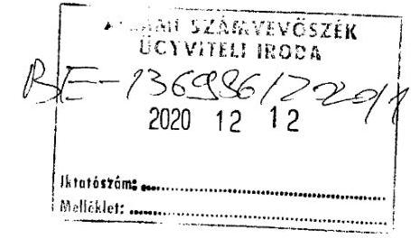

ÁLLAMI SZÁMVEVŐSZÉK
1052 BUDAPEST APÁCZAI CS. J. U. 10.

Tisztelt Számvevőszék!

Alulírott Jóna Balázs a DATI KFT. ügyvezetője ezúton szeretném köszönetemet kifejezni az Önök által az EL-2745-006/2020. iktatószám alatt végzett ellenőrzést illetően.

Tájékoztatom a Tisztelt Címet, hogy a számviteli politikát és a házipénztár kezelés szabályait cégünk a megalakulást követő 90 napon belül elkészítette.

Minden év elején a törvényváltozást megfelelően frissítette, aktualizálta.
Kérem a fentiek szíves tudomásulvételét.

Miskolc, 2020-12-08

Tisztelettel: Jóna Balázs

Jóna Balázs ügyvezető

---

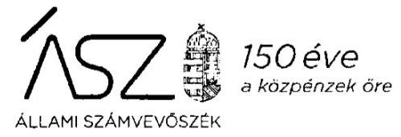

Ikt. szám: EL-2388-037/2020.

Jóna Balázs úr
ügyvezető
DATI Diósgyőri Alapfokú Táncművészeti Iskola Non-profit Korlátolt Felelősségű Társaság

# Miskolc 

Tisztelt Ügyvezető Úr!

A „Nem állami humánszolgáltatók ellenőrzése - A köznevelési humánszolgáltatást nyújtó intézmények, szolgáltatók államháztartáson kívüli fenntartói központi költségvetésből kapott támogatásai felhasználásának ellenőrzése 22 gazdasági társaságnál" címmel készített számvevőszéki jelentéstervezetre tett, 2020. december 8-án kelt észrevételét köszönettel megkaptam.

Az Állami Számvevőszék észrevételre vonatkozó álláspontjáról a felügyeleti vezető által készített részletes tájékoztatást mellékelten megküldöm.

Tájékoztatom Ügyvezető urat, hogy a számvevőszéki jelentésben - az Állami Számvevőszékről szóló 2011. évi LXVI. törvény 29. § (3) bekezdése alapján - a figyelembe nem vett észrevételt szerepeltetjük, annak indoklásával, hogy azt az Állami Számvevőszék miért nem fogadta el.

Budapest, 2020. december 22. nap

Melléklet: Tájékoztatás az észrevétel kezeléséről
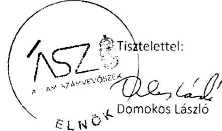

---

Melléklet
Ikt.szám: EL-2388-037/2020.

# Tájékoztatás   az észrevétel kezeléséről 

A „Nem állami humánszolgáltatók ellenőrzése - A köznevelési humánszolgáltatást nyújtó intézmények, szolgáltatók államháztartáson kívüli fenntartói központi költségvetésből kapott támogatásai felhasználásának ellenőrzése 22 gazdasági társaságnál" címû jelentéstervezetre 2020. december 12-én érkezett észrevételt áttekintettük, annak kezelésével kapcsolatban a következő tájékoztatást adom.

Ügyvezető úr észrevétele szerint a számviteli politikát és a házipénztár kezelés szabályait a megalakulást követő 90 napon belül elkészítette.

Tájékoztatom Ügyvezető urat, hogy az Állami Számvevőszék ellenőrzési megállapításai minden esetben az Állami Számvevőszékről szóló 2011. évi LXVI. törvénynek megfelelően az ellenőrzés során bekért és az arra nyitva álló határidőn belül rendelkezésre bocsátott dokumentumokon alapulnak.

Az ellenőrzés során az arra nyitva álló határidőben az Állami Számvevőszék rendelkezésére bocsátott dokumentumokat ismételten áttekintettük. A DATI Diósgyőri Alapfokú Táncművészeti Iskola Nonprofit Korlátolt Felelősségű Társaság adatszolgáltatása keretében az Állami Számvevőszék rendelkezésére bocsátott „Számviteli politika Számlarend" elnevezésű dokumentum nem felel meg a számvitelről szóló 2000. évi C. törvény 14. § (4) bekezdésében foglalt követelményeknek, mivel az valójában a társaság számlarendjét tartalmazza, ezáltal nem került sor a Számv. tv. szerint a gazdálkodó adottságainak, körülményeinek megfelelő számviteli politika kialakítására. A „Házipénztár kezelési szabályzat" elnevezésű dokumentum nem tartalmazza a Számv. tv. a 14. § (8) bekezdése által előírt minimális tartalmi követelményeket, mert az kizárólag a házipénztárban történő pénzkezelésről rendelkezik, a pénzforgalom bankszámlán történő lebonyolításának és a házipénztár és a bankszámla közötti pénzkezelés szabályairól nem.

Mindezek alapján az észrevételt nem fogadjuk el, a jelentéstervezet módosítása nem indokolt.

Budapest, 2020. december 22. nap
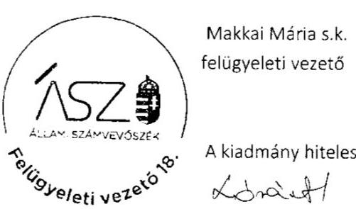

---

EURO-MAGISTER NONPROFIT KFT
3519 Miskolc, Trencsényi u. 22.

ÁLLAMI SZÁMVEVŐSZÉK

Budapest
Apáczai Csere János u. 10.
1364

Tisztelt Cím!

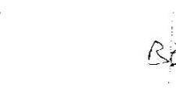

Ikt.sz.: 2020/2/015.

ASZ0000009788

Hivatkozással az EL-2386-030/2020. számú levelükre tisztelettel az alábbi észrevételt
tesszük:

A 2016-18. évi kiegészítő mellékletek nyilvántartásunk szerint az elküldés során az egyéb
dokumentumok mappába kerültek, amelyeket a Céginformációs Szolgálat felületén is
megjelentettünk, eleget téve az éves beszámolási kötelezettségünknek.
Mellékeljük az erről szóló „Befogadó" nyugtákat.

A megadott határidőn belül mellékeljük továbbá az Önök által kért 2019. évre vonatkozó
dokumentumokat.

Miskolc, 2020. november 30.

Tisztelettel: EURO-MAGISTER NONPROFIT KFT.
3519 Miskolc, Trencsényi u. 22.
Adózótám: 14202030/1-08

Zemlényi Attiláné
fenntartó

27

---

# 150 éve   a közpénzek őre 

ÁLLAMI SZÁMVEVŐSZÉK

Ikt. szám: EL-2386-032/2020.

Zemlényi Attiláné úrhölgy
ügyvezető
EURO-MAGISTER Nonprofit Korlátolt Felelősségű Társaság

## Miskolc

Tisztelt Ügyvezető Úrhölgy!

A „Nem állami humánszolgáltatók ellenőrzése - A köznevelési humánszolgáltatást nyújtó intézmények, szolgáltatók államháztartáson kívüli fenntartói központi költségvetésből kapott támogatásai felhasználásának ellenőrzése 22 gazdasági társaságnál" címmel készített számvevőszéki jelentéstervezetre tett, 2020. november 30-án kelt észrevételét köszönettel megkaptam.

Az Állami Számvevőszék észrevételre vonatkozó álláspontjáról a felügyeleti vezető által készített részletes tájékoztatást mellékelten megküldöm.

Tájékoztatom Ügyvezető úrhölgyet, hogy a számvevőszéki jelentésben - az Állami Számvevőszékről szóló 2011. évi LXVI. törvény 29. § (3) bekezdése alapján - a figyelembe nem vett észrevételt szerepeltetjük, annak indoklásával, hogy azt az Állami Számvevőszék miért nem fogadta el.
Budapest, 2020. december 4. nap

Melléklet: Tájékoztatás az észrevétel kezeléséről
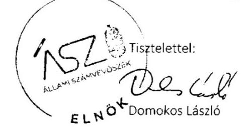

1052 Budapest, Apáczai Csere János u. 10. 1964 Budapest 4. Pf. 54
szamveveszek@ast.hu | www.ast.hu | www.aszhrportal.hu

---

Melléklet
Ikt.szám: EL-2386-032/2020.

# Tájékoztatás   az észrevétel kezeléséről 

A „Nem állami humánszolgáltatók ellenőrzése - A köznevelési humánszolgáltatást nyújtó intézmények, szolgáltatók államháztartáson kívüli fenntartói központi költségvetésből kapott támogatásai felhasználásának ellenőrzése 22 gazdasági társaságnál" címû jelentéstervezetre 2020. december 1-én érkezett észrevételt áttekintettük, annak kezelésével kapcsolatban a következő tájékoztatást adom.

Ügyvezető úrhölgy észrevétele szerint EURO-MAGISTER Nonprofit Korlátolt Felelősségű Társaság 2016-2018. évi számviteli beszámolóinak kiegészítő mellékletei közzétételre kerültek a „Céginformációs Szolgálat" felületén.

Tájékoztatom Ügyvezető úrhölgyet, hogy az Állami Számvevőszék ellenőrzési megállapításai minden esetben az Állami Számvevőszékről szóló 2011. évi LXVI. törvénynek megfelelően az ellenőrzés során bekért és az arra nyitva álló határidőn belül rendelkezésre bocsátott dokumentumokon alapulnak. Az észrevétel mellékleteként beküldött, ellenőrzött időszakra vonatkozó dokumentumokat nem értékeltük.

Az ellenőrzés során az arra nyitva álló határidőben az Állami Számvevőszék rendelkezésére bocsátott dokumentumokat ismételten áttekintettük. Az EURO-MAGISTER Nonprofit Korlátolt Felelősségű Társaság adatszolgáltatása keretében az Állami Számvevőszék rendelkezésére bocsátott 2016-2018. évi számviteli beszámolók kiegészítő mellékletet nem tartalmaztak. Az adatszolgáltatás teljességét Ügyvezető úrhölgy a 2020. január 16-án kelt teljességi és hitelességi nyilatkozatában igazolta. Mindezek alapján az észrevételt nem fogadjuk el, a jelentéstervezet módosítása nem indokolt.

Tájékoztatom továbbá, hogy az észrevétel mellékleteként, az EL-2386-030/2020. iktatószámú vagyonmegóvó intézkedés kilátásba helyezéséről szóló tájékoztatásra megküldött, 2019. évre vonatkozó dokumentumok értékeléséről külön levélben tájékoztatjuk Ügyvezető úrhölgyet.

Budapest, 2020. december 18. nap
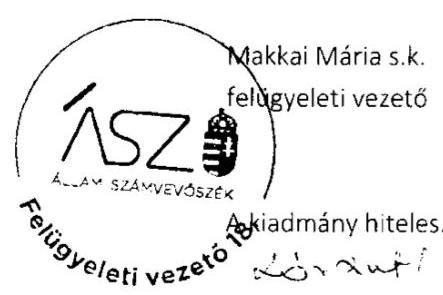

---

# Harmónia 

Állami Számvevőszék
1052 Budapest
Apáczai Csere János u. 10.

## Domokos László

## Elnök úr részére

Tisztelt Elnök Úr!
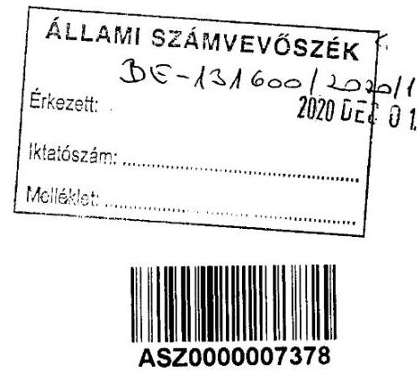

Hivatkozva az EL-2135-032/2020. illetve az EL-2135-033/2020. iktatószámú 2020. november 20-án kézhez vett leveleire az abban foglaltakkal kapcsolatban az alábbi észrevételt kívánom tenni.

A Harmónia Művészeti Központ Nonprofit Közhasznú Korlátolt Felelősségű Társaság számlarendje úgy került kialakításra, hogy az megfelel a Számv. tv. 161/A. § (2) bekezdésében előírtaknak.

A köznevelési alapfeladatok fogalmát a nemzeti köznevelésről szóló 2011. évi CXC. törvény 4. § 14a. pontja határozza meg.

Az ebben felsorolt alapfeladatok közül a Harmónia Művészeti Központ Nonprofit Közhasznú Korlátolt Felelősségű Társaság kimondottan csak alapfokú művészetoktatásra kap költségvetési támogatást, amelyet tovább utal a fenntartott intézmény részére.

A fenntartott intézmény az alapfokú művészetoktatási feladatokon kívül más köznevelési feladatot nem lát el.

A megküldött főkönyvi kartonok és főkönyvi kivonatok biztosítják a kapott és tovább utalt költségvetési támogatások ellenőrizhetőségét, azokban rendelkezésre állnak a külön jogszabályban meghatározott adatok.

Az államháztartás alrendszerétől kapott támogatások külön főkönyvi kartonon kerülnek nyilvántartásra, a fenntartott intézmény részére tovább utalt támogatások nyilvántartása szintén külön főkönyvi kartonon történik.

Az államháztartás alrendszeréből kapott támogatások a 9112 Közhasznú célú működésre kapott támogatás központi költségvetésből megnevezésű főkönyvi számon kerültek elkülönítetten nyilvántartásra. Ezen főkönyvi karton tartalmazza a támogatások folyósításának időpontjára, bizonylatára és összegére vonatkozó adatokat.

A fenntartott intézmény részére átadott költségvetési támogatások nyilvántartását a 8634 Átutalási kötelezettséggel kapcsolatos támogatás átutalása Harmónia AMI. megnevezésű

[^0]
[^0]:    Székhely: 9061 Vámosszabadi, Béke u. 4. Levelezési cím: 9023 Győr, Szigethy A. u. 12.
    Tel.: +36-96-519-104 Fax: +36-96-433-625
    email: harmoniai@hmk.hu Web: www.hmk.hu

---

főkönyvi karton biztosítja. Ezen főkönyvi karton tartalmazza a fenntartott intézmény részére átadott támogatások folyósításának időpontjára, bizonylatára és összegére vonatkozó adatokat.

A főkönyvi nyilvántartások a kapott, illetve tovább utalt költségvetési támogatásokat a Magyar Államkincstár havi átutalásainak jóváírását tartalmazó bankkivonatokon szereplő részletezettséggel tartalmazza.

A kapott költségvetési támogatások megalapozottságát biztosító elszámolások a jogszabályban előírt módon kerültek benyújtásra a Magyar Államkincstár felé és amelyek határozathozatallal zárultak.

Az elszámolások alapjául szolgáló nyilvántartásokat a fenntartó naprakészen vezeti.
A megküldött főkönyvi kivonatok, kartonok és számviteli beszámolók alátámasztják annak tényét, hogy a fenntartó nyilvántartásait úgy alakította ki, hogy azok biztosítsák az államháztartás alrendszeréből alapfokú művészetoktatásra, mint alapfeladatra kapott támogatások elkülönített nyilvántartását megfelelve a Számv. tv. 161/A. § (2) bekezdésében előírtaknak, valamint a Nkt. vhr. 37/G. § (1) bekezdésében foglalt szabályozásnak.

A megküldött dokumentumokból megállapítható, hogy a kapott költségvetési támogatások átadásra kerültek a fenntartott intézmény részére, és azokat az alapfokú művészeti oktatás céljára használták fel.

Jelen levelemhez csatoltan megküldöm az Ön által kért dokumentumok hiteles, aláírt másolati példányát az alábbiak szerint:

1. nyilvántartás a költségvetési támogatások felhasználásáról; Főkönyvi kimutatás 9112, 8634 főkönyvi számmal 2019. évre vonatkozóan;
2. a 2019. évi költségvetési támogatás Magyar Államkincstár felé történő elszámolásának dokumentumai az alábbiak szerint:

- Magyar Államkincstár határozat GYŐR-ÁHI/157-23/2020.;
- 1 db adatlap az egyházi, nemzetiségi önkormányzati és magán köznevelési intézményfenntartók által 2019. évben igényelt költségvetési támogatás elszámolásához;
- 1 db Fenntartói összesítő adatlap a pedagógusok után járó átlagbér alapú támogatás;
- 1 db Fenntartói összesítő adatlap a nevelő-, oktató munkát közvetlenül segítők;
- 1 db Fenntartói összesítő adatlap bérnövekmény a pedagógusok minősítéséből;
- 1 db Intézményi adatlap nevelő-, oktató munkát közvetlenül segítők;
- 1 db Intézményi adatlap bérnövekmény a pedagógusok minősítéséből;
- 20 db Intézményi/feladatellátási helyenkénti 2019. évi elszámoló adatlap;
- 1 db EMMI/minősített ped.segédtábla az 1.számú segédtábla a minősített pedagógus után járó átlagbér alapú támogatáshoz

Székhely: 9061 Vámosszabadi, Béke u. 4. Levelezési cím: 9023 Győr, Szigethy A. u. 12.
Tel.: +36-96-519-104 Fax: +36-96-433-625
email: harmonia@hmk.hu Web: www.hmk.hu

---

- 1 db Fenntartói nyilatkozat a 2011. évi CXCV. törvényi megfelelésről
- 1 db Fenntartói nyilatkozat 229/2012. (VIII.28.) Kormányrendelet 37/C. § (7) cb) feltételeinek megfeleléséről
- 1 db intézményi nyilatkozat 326/2013. (VIII.30.) Kormányrendelet feltételeinek megfeleléséről
- 1 db Fenntartói nyilatkozat 229/2012. (VIII.28.) Kormányrendelet 37/L. (2) pontjában meghatározott feltételeknek való megfeleléséről
- 1 db 2019. évben minősített pedagógusok létszámát alátámasztó kimutatás

3. a Fenntartó 2019. év végi zárás utáni főkönyvi kivonata;
4. a Fenntartó 2019. évi számviteli beszámolója

Tisztelettel kérjük Elnök urat, hogy döntése során vegye figyelembe jelen levelemben foglaltakat és a beküldött dokumentumokat.

Győr, 2020. november 26.
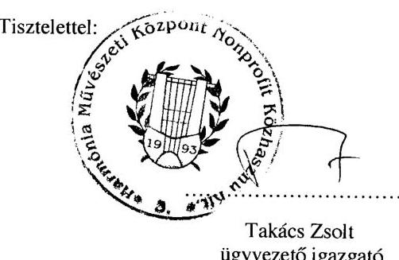

Székhely: 9061 Vámosszabadi, Béke u. 4. Levelezési cím: 9023 Győr, Szigethy A. u. 12.
Tel.: +36-96-519-104 Fax: +36-96-433-625
email: harmonia@hmk.hu Web: www.hmk.hu

---

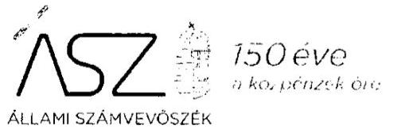

Ikt. szám: EL-2135-035/2020.

Takács Zsolt úr
ügyvezető
Harmónia Művészeti Központ Nonprofit Közhasznú Korlátolt Felelősségű Társaság

# Vámosszabadi 

Tisztelt Ügyvezető Úr!

A „Nem állami humánszolgáltatók ellenőrzése - A köznevelési humánszolgáltatást nyújtó intézmények, szolgáltatók államháztartáson kívüli fenntartói központi költségvetésből kapott támogatásai felhasználásának ellenőrzése 22 gazdasági társaságnál" címmel készített számvevőszéki jelentéstervezetre tett, 2020. november 26-án kelt észrevételét köszönettel megkaptam.

Az Állami Számvevőszék észrevételre vonatkozó álláspontjáról a felügyeleti vezető által készített részletes tájékoztatást mellékelten megküldöm.

Tájékoztatom Ügyvezető urat, hogy a számvevőszéki jelentésben - az Állami Számvevőszékről szóló 2011. évi LXVI. törvény 29. § (3) bekezdése alapján - a figyelembe nem vett észrevételt szerepeltetjük, annak indoklásával, hogy azt az Állami Számvevőszék miért nem fogadta el.
Budapest, 2020. december 18. nap

Melléklet: Tájékoztatás az észrevétel kezeléséről
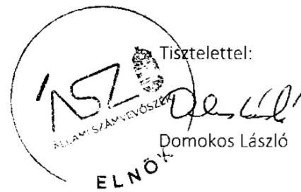

---

# Tájékoztatás   az észrevétel kezeléséről 

A „Nem állami humánszolgáltatók ellenőrzése - A köznevelési humánszolgáltatást nyújtó intézmények, szolgáltatók államháztartáson kívüli fenntartói
 központi költségvetésből kapott támogatásai felhasználásának ellenőrzése 22 gazdasági társaságnál" című jelentéstervezetre 2020. december 1-én érkezett észrevételt áttekintettük, annak kezelésével kapcsolatban a következő tájékoztatást adom.

Úgyvezető úr észrevételében a jogszabályi rendelkezéseket ismerteti és értelmezi, sorra veszi az ellenőrzés során rendelkezésre bocsátott dokumentumokat (főkönyvi kivonat, 9112. és 8634. főkönyvi kartonok, számviteli beszámoló). Ez alapján arra a következtetésre jut, hogy „a megküldött főkönyvi kivonatok, kartonok és számviteli beszámolók alátámasztják annak tényét, hogy a fenntartó nyilvántartásait úgy alakította ki, hogy azok biztosítsák az államháztartás alrendszeréből alapfokú művészetoktatásra, mint alapfeladatra kapott támogatások elkülönített nyilvántartását".

Tájékoztatom, hogy az ellenőrzés során az arra nyitva álló határidőben az Állami Számvevőszék rendelkezésére bocsátott dokumentumokat ismételten áttekintettük. A rendelkezésre bocsátott és az észrevételben is hivatkozott főkönyvi kartonok, amelyek a támogatás beérkezését bevételként és annak továbbutalását ráfordításként tartalmazzák, nem tekinthetők a támogatás felhasználásának elkülönített nyilvántartásának. A támogatás felhasználása nem egyenlő a beérkezett összeg továbbutalásával. A felhasználás elkülönített nyilvántartásából a nemzeti köznevelésről szóló törvény végrehajtásáról szóló 229/2012. (VIII. 28.) Korm. rendelet 37/G. § (1) bekezdésében foglalt előírásnak megfelelően megállapíthatónak kell lennie, hogy a támogatás milyen célra került felhasználásra. Megfelelő fenntartói nyilvántartás hiányában nem igazolt, hogy a fenntartott intézmény gazdálkodásában felmerülő, költségvetési támogatás által fedezett költségek mindegyike az alapfeladat érdekében merült fel. Mindezek alapján az észrevételt nem fogadjuk el, a jelentéstervezet módosítása nem indokolt.

Tájékoztatom továbbá, hogy az észrevétel mellékleteként, az EL-2135-033/2020. iktatószámú vagyonmegóvó intézkedés kilátásba helyezéséről szóló tájékoztatásra megküldött, 2019. évre vonatkozó dokumentumok értékeléséről külön levélben tájékoztatjuk Úgyvezető urat. Budapest, 2020. december 18. nap
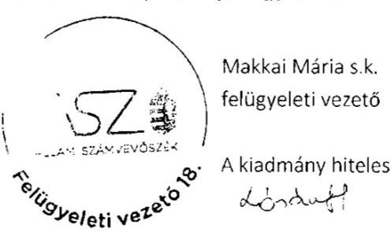

---

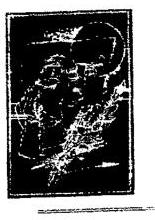

Hórvölgye Zeneiskola Nonprofit Korlátolt Felelősségű Társaság 3412 Bogács, Dózsa György u. 3.
Telefon/Fax: (49) 334-026 E-mail: zeneiskola.horvölgy@egmail.com Adószám: 21784103-1-05
Cg. 05-09-015968
(Nyilvántartás a B.-A.-Z. Megyei Cégbíróságon.)
20201203
ASZ0000009685
ÁLLAMI SZÁMVEVŐSZÉK
Ikt.: 45/2020.
1052 Budapest, Apáczai Csere János u. 10.

# Tisztelt Állami Számvevőszék 

Hivatkozással az EL-2270-036/2020. számú levelére a Hórvölgye Zeneiskola Nonprofit Kft. (3412 Bogács, Dózsa György u. 3.) hivatalos képviselőjeként észrevételemet az alábbiakban foglalom össze:

- Először is szeretnék köszönetet mondani az ÁSZ vizsgálatáért.
- 24 év óta vagyok intézményfenntartó hivatalos képviselője. Számtalan hatósági és szakmai ellenőrzést kaptam, de jogsértést egyetlen alkalommal sem állapítottak meg.
- Jelen vizsgálat során az ÁSZ által feltárt Számv. tv. 4§ (1) előírt dokumentumok hiánya, tehát az IM Csz-nek címzett Egyszerűsített éves beszámolókat és Befogadásról szóló értesítéseket Vis Major helyzet miatt nem tudtam feltölteni, mert a cégünk könyvelője a dokumentumaink feltöltése idején súlyos beteg állapotban hónapokig kórházban volt, ezért a számítógépéhez, amelyen a hiányzó dokumentumok voltak nem tudtunk hozzáférni.
- A 2016-2017-2018. évi Egyszerűsített éves beszámolókat az IM Csz-nek határidőn belül elküldtük, így jogsértés nem történt. Mellékelve elküldöm ezeket a beszámolókat, amelyek bizonyítják a tényszerűséget.

## Tisztelt Állami Számvevőszék!

Ez az esztendő számunkra megpróbáltatásokkal teli és 3 családtagom elvesztésével is sújtott év volt.
Tisztelettel kérem megértésüket.

Melléklet 3 x 6 lap.

Bogács, 2020. 11. 25.

HORVÖLGYE ZENEISKOLA
NONPROFIT KFT.
3412 Bogács, Dózsa György út 3.
Adószám: 21784103-1-05
Cg.: 05-09-015968
Tel./Fax: 49/334-026

Tisztelettel:
Daragó Károly
ügyvezető

---

# 150 éve   a közpénzek őre 

ÁLLAMI SZÁMVEVŐSZÉK

Ikt. szám: EL-2270-040/2020.

Daragó Károly úr
ügyvezető
Hórvölgye Zeneiskola Nonprofit Korlátolt Felelősségű Társaság

## Bogács

Tisztelt Ügyvezető Úr!

A „Nem állami humánszolgáltatók ellenőrzése - A köznevelési humánszolgáltatást nyújtó intézmények, szolgáltatók államháztartáson kívüli fenntartói központi költségvetésből kapott támogatásai felhasználásának ellenőrzése 22 gazdasági társaságnál" címmel készített számvevőszéki jelentéstervezetre tett, 2020. november 25-én kelt észrevételét köszönettel megkaptam.

Az Állami Számvevőszék észrevételre vonatkozó álláspontjáról a felügyeleti vezető által készített részletes tájékoztatást mellékelten megküldöm.

Tájékoztatom Ügyvezető urat, hogy a számvevőszéki jelentésben - az Állami Számvevőszékről szóló 2011. évi LXVI. törvény 29. § (3) bekezdése alapján - a figyelembe nem vett észrevételt szerepeltetjük, annak indoklásával, hogy azt az Állami Számvevőszék miért nem fogadta el.
Budapest, 2020. december 22. nap
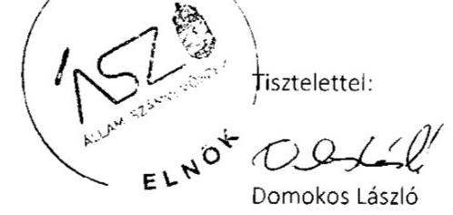

Melléklet: Tájékoztatás az észrevétel kezeléséről

---

Melléklet
ikt.szám: EL-2270-040/2020.

# Tájékoztatás   az észrevétel kezeléséről 

A „Nem állami humánszolgáltatók ellenőrzése - A köznevelési humánszolgáltatást nyújtó intézmények, szolgáltatók államháztartáson kívüli fenntartói központi költségvetésből kapott támogatásai felhasználásának ellenőrzése 22 gazdasági társaságnál" című jelentéstervezetre 2020. december 3-án érkezett észrevételt áttekintettük, annak kezelésével kapcsolatban a következő tájékoztatást adom.

Úgyvezető úr észrevétele megerősíti, hogy a Hórvölgye Zeneiskola Nonprofit Korlátolt Felelősségű Társaság Állami Számvevőszék részére teljesített adatszolgáltatása nem tartalmazta az ellenőrzött időszakra vonatkozó számviteli beszámolókat.

Tájékoztatom Ügyvezető urat, hogy az Állami Számvevőszék ellenőrzési megállapításai minden esetben az Állami Számvevőszékről szóló 2011. évi LXVI. törvénynek megfelelően az ellenőrzés során bekért és az arra nyitva álló határidőn belül rendelkezésre bocsátott dokumentumokon alapulnak. Az észrevétel mellékleteként beküldött, ellenőrzött időszakra vonatkozó dokumentumokat nem értékeltük. Az adatszolgáltatás teljességét Ügyvezető úr a 2019. december 12-én kelt teljességi és hitelességi nyilatkozatában igazolta. Mindezek alapján az észrevételt nem fogadjuk el, a jelentéstervezet módosítása nem indokolt.

Budapest, 2020. december 22. nap
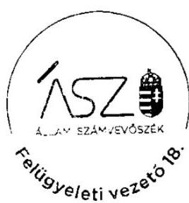

Makkai Mária s.k. felügyeleti vezető

A kiadmány hiteles.

---

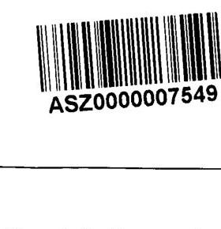

# Állami Számvevőszék 

1052 Budapest, Apáczai Csere János utca 10. 1364 Budapest 4; Pf. 54.

Makkai Mária Úrhölgy
Felügyeleti Vezető részére

Tárgy: EL-2391-037/2020 ikt.
számú jelentés tervezetre
észrevételek

## Tisztelt Felügyelet Vezető Asszony!

Alulírott Villányi Tiborné, a Kontrasztok Nonprofit Közhasznú Kft. ügyvezetője, az Állami Számvevőszék által a 2020. november 18. napján kelt EL-2391-037/2020 ikt. számú jelentés tervezet megállapítására vonatkozóan, az alábbi észrevételeket szeretném tenni.

A Kontrasztok Nonprofit Közhasznú Kft. -ben 2020. január-február hónapban lefolytatott ÁSZ ellenőrzés EL-2391-037/2020 ikt. számú jelentés tervezete az alábbi megállapítást teszi a szervezetünk működésével kapcsolatban:
„A Fenntartó a 2016-2018. években a köznevelési közfeladat ellátására kapott költségvetési támogatás felhasználásának a Számv. tv. 161/A. § (2) bekezdésében előírt ellenőrizhetőségét nem biztosította. Mivel az Nkt. vhr. 37/G. § (1) bekezdésében foglalt szabályozás ellenére nem gondoskodott olyan nyilvántartás kialakításáról, hogy abból megállapítható legyen, hogy a költségvetési támogatásokat milyen célra használta fel."

1. Megítélésünk szerint az intézményt fenntartó szervezetünkben és az általa fenntartott művészeti iskolában működésünkhöz kapcsolódóan a fentiekben az ÁSZ jelentéstervezetében leírt megállapításával szemben kialakításra kerültek, rendelkezésre állnak a jelen ellenőrzésben az ÁSZ rendelkezésére bocsátott belső szabályozóink, amik tartalmazzák a vonatkozó nyilvántartásokat, melyből megállapítható a költségvetési támogatások cél szerinti felhasználása.
(Állami támogatás nyilvántartásának és elszámolásának, továbbá a köznevelési támogatások felhasználásának, beszámolásának szabályzata; Számviteli Politika; Számlarend.)

---

Megítélésünk szerint számviteli, nyilvántartási, elszámolási és beszámolási rendszerünk alapján biztosított a köznevelési közfeladat ellátására kapott költségvetési támogatás intézménynek történő átadásának, a kapott állami támogatás felhasználásának az ellenőrizhetősége az alábbiakban részletezettek, továbbá az ÁSZ ellenőrzési protokollja szerint az általunk az ellenőrzéshez megküldött dokumentumok alapján:

A fenntartók rendelkezik a Számviteli Törvény által meghatározott beszámolókkal, gazdálkodási mérleggel, eredménykimutatással, közhasznúsági jelentéssel, számviteli analitikákkal, amit független könyvvizsgáló auditál. A fenntartott művészeti iskolánk rendelkezik a Számviteli Törvény rendelkezései szerint összeállított gazdálkodási mérleggel, eredménykimutatással, költségvetési beszámolóval, számviteli analitikákkal, amivel elszámol fenntartójának a részére átadott köznevelési célú állami támogatás felhasználásáról, továbbá az egyéb nem állami költségvetési forrásból a fenntartójától kapott működési célú támogatás felhasználásáról.
2. Az Állami Számvevőszék jelentés tervezetének megállapításában hivatkozik a Számv. tv. 161/A. § (2) bekezdésében foglaltakra, mely szerint: "A Fenntartó a 2016-2018. években a köznevelési közfeladat ellátására kapott költségvetési támogatás felhasználásának a Számv. tv. 161/A. § (2) bekezdésében előírt ellenőrizhetőségét nem biztosította"
(Számv. tv. 161/A. § (2): „A közpénzek felhasználásának és a köztulajdon használatának nyilvánossága és ellenőrizhetősége érdekében a gazdálkodó nyilvántartási (könyvvezetési) rendszerét köteles oly módon továbbrészletezni, hogy abból a vonatkozó külön jogszabályban meghatározott adatok rendelkezésre álljanak.")

# 2.1 Beérkező köznevelési célú állami támogatás elkülönített nyilvántartása a Kontrasztok Nonprofit Közhasznú Kft.-ben: 

Fenntartónk a Kontrasztok Nk. Kft. a számlarendje alapján a beérkező állami köznevelési célú támogatást a 9691 főkönyvi számlán tartja nyilván elkülönítetten. Mivel fenntartónk egyetlen köznevelési alapfeladatot lát el a fenntartott intézményével, ezért nem tartottuk indokoltnak a Számv. tv. 161/A. § (2) pontja szerint tovább részletezni a 9691 főkönyvi számlát, hiszen az alábontott főkönyvi számlán is ugyanaz a támogatási összeg szerepelne, és más nem. Abban az esetben, ha több köznevelési alapfeladatot is ellátna fenntartónk, akkor a nyomon követhetőség, az ellenőrizhetőség és az elszámoltathatóság érdekében tovább kéne bontanunk a nevezett 9691 főkönyvi számlát 96911; 96912; 96913;...főkönyvi számlákra.

### 2.2 Beérkezett köznevelési célú Állami támogatás átadása fenntartott intézménynek:

Fenntartónk a számlarendje alapján az átadott állami támogatást a 8691-es főkönyvi számlán tartja nyilván elkülönítetten. A fenntartóhoz beérkező és a fenntartó 9691 főkönyvi számláján valamint a fenntartott intézménynek a fenntartó 8691 főkönyvi számláról átadott támogatás összege megegyezik, ami alátámasztja, hogy a fenntartó a köznevelési célú állami támogatást a fenntartott intézményének teljes összegben átadta, annak fenntartására használta fel.

A fenntartott intézmény a számlarendje alapján a fenntartójától átutalt beérkező köznevelési célú állami támogatást a 9691 főkönyvi számláján elkülönítetten tartja nyilván.

---

Mindez az ellenőrzéshez megküldött dokumentumok: a fenntartó és a fenntartott intézmény számlarendje, főkönyvi kivonatai, a lekért elkülönített főkönyvi számlák kivonatai, továbbá a fenntartó és a fenntartott iskola bankkivonatai alapján ellenőrizhető, elszámoltatható.
3. Az ÁSZ. jelentéstervezet megállapításának 2. része alapján a „Fenntartó a Nkt. vhr. 37/G. § (1) bekezdésében foglalt szabályozás ellenére nem gondoskodott olyan nyilvántartás kialakításáról, hogy abból megállapítható legyen, hogy a költségvetési támogatásokat milyen célra használta fel."

A fenntartónk a Költségvetési támogatásokat (beérkező köznevelési célú állami támogatást) 2.2 pontban leírt nyilvántartások szerint teljes összegben átadja a fenntartott intézményének.

A fenntartott intézmény számlarendjében szereplő főkönyvi számlák biztosítják azt a nyilvántartást, amiből megállapítható, hogy az intézmény a fenntartója részéről átadott köznevelési célú állami támogatást milyen célra használta fel.

Eddigi működésünk során a Kormányhivatal Fenntartói törvényességi ellenőrzései keretében, továbbá a Magyar Államkincstár által végzett, támogatás igénylésre - támogatás felhasználásra és elszámolásra irányuló ellenőrzések keretében nem kaptunk arra vonatkozóan jelzést és észrevételt sem, hogy a közfeladataink ellátására nyújtott költségvetési támogatás összegének cél szerinti felhasználása nem nyomon követhető, a fenntartónknak nyújtott költségvetési támogatás felhasználása nem számon kérhető és ellenőrizhető.

Az Intézményünkben a számlarendünk alapján az 5-ös számlaosztályában tartjuk nyilván az intézmény működéséhez lekönyvelt költségeket. Ennek forrása a 9691 elkülönített főkönyvi számlán beérkező fenntartó részéről átutalt állami köznevelési célú támogatás, továbbá a 9-es számlaosztályban (912; 9692...) szerepeltetett egyéb nem állami forrásból származó bevételek.

Megítélésünk szerint számviteli nyilvántartásainkból a fentiekben leírtak szerint látható, hogy a fenntartónk a kapott állami köznevelési célú támogatási összegeket teljes összegben az általa fenntartott köznevelési intézményére fordította, továbbá úgy gondoljuk, hogy a fentiekben leírtak szerint ellenőrizhető a kapott állami köznevelési célú támogatás felhasználása.

Jelentésük elkészítésénél tisztelettel kérjük a fentiekben leírtak figyelembe vételét!
Egyéb iránt örömmel vesszük konkrét javaslataikat az esetleges nem megfelelő gyakorlatunk illetve hiányosságunk korrigálására. Mindezt be kívánjuk építeni a kézhez kapott ÁSZ Jelentést követően intézkedési tervünkbe, amiben ütemezhetjük a hiányosságaink pótlását.

Jelen észrevételeinkkel párhuzamosan az ÁSZ EL-2391-038/2020 ikt. számú levelükben bekért 2019-es gazdálkodási évhez kapcsolódó könyvelési munkaszámokkal kibővített számviteli nyilvántartásokat is megküldjük további szíves felhasználásra.

Tisztelettel: Villányi
 Tibor
Villányi Tibor
Ügyvezető

Kelt: Pécs, 2020. november 27.

---

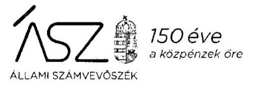

Ikt. szám: EL-2391-041/2020.

Villányi Tibor Zoltánné úrhölgy
ügyvezető
KONTRASZTOK Művészeti, Oktató és Szolgáltató Nonprofit Közhasznú Korlátolt Felelősségű Társaság

# Gödre 

Tisztelt Ügyvezető Úrhölgy!

A „Nem állami humánszolgáltatók ellenőrzése - A köznevelési humánszolgáltatást nyújtó intézmények, szolgáltatók államháztartáson kívüli fenntartói központi költségvetésből kapott támogatásai felhasználásának ellenőrzése 22 gazdasági társaságnál" címmel készített számvevőszéki jelentéstervezetre tett, 2020. november 27-én kelt észrevételét köszönettel megkaptam.

Az Állami Számvevőszék észrevételre vonatkozó álláspontjáról a felügyeleti vezető által készített részletes tájékoztatást mellékelten megküldöm.

Tájékoztatom Ügyvezető úrhölgyet, hogy a számvevőszéki jelentésben - az Állami Számvevőszékről szóló 2011. évi LXVI. törvény 29. § (3) bekezdése alapján - a figyelembe nem vett észrevételt szerepeltetjük, annak indoklásával, hogy azt az Állami Számvevőszék miért nem fogadta el.
Budapest, 2020. december 22. nap

Melléklet: Tájékoztatás az észrevétel kezeléséről
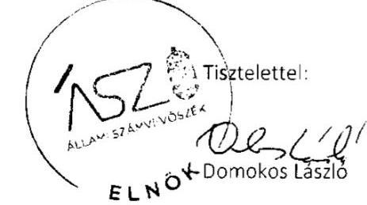

---

# Tájékoztatás   az észrevétel kezeléséről 

A „Nem állami humánszolgáltatók ellenőrzése - A köznevelési humánszolgáltatást nyújtó intézmények, szolgáltatók államháztartáson kívüli fenntartói központi költségvetésből kapott támogatásai felhasználásának ellenőrzése 22 gazdasági társaságnál" címú jelentéstervezetre 2020. december 8-án érkezett észrevételt áttekintettük, annak kezelésével kapcsolatban a következő tájékoztatást adom.

Az Állami Számvevőszék megállapította, hogy „A Fenntartó a 2016-2018. években a köznevelési közfeladat ellátására kapott költségvetési támogatás felhasználásának a Számv. tv. 161/A. § (2) bekezdésében előírt ellenőrizhetőségét nem biztosította. Mivel az Nkt. vhr. 37/G. § (1) bekezdésében foglalt szabályozás ellenére nem gondoskodott olyan nyilvántartás kialakításáról, hogy abból megállapítható legyen, hogy a költségvetési támogatásokat milyen célra használta fel."

Ügyvezető úrhölgy észrevételének 1. pontja rögzíti, hogy a fenntartó és a fenntartott intézmény számviteli, nyilvántartási, elszámolási és beszámolási rendszere alapján biztosított a köznevelési közfeladat ellátására kapott költségvetési támogatás intézménynek történő átadásának, a kapott állami támogatás felhasználásának ellenőrizhetősége.

Az észrevétel 2-3. pontja sorra veszi az ellenőrzés során rendelkezésre bocsátott dokumentumokat (a fenntartó és a fenntartott intézmény számlarendje, főkönyvi kivonatai, a lekért elkülönített főkönyvi számlák kivonatai, továbbá a fenntartó és a fenntartott iskola bankkivonatai) és azt, hogy azok miként támasztják alá az ellenőrizhetőséget és a cél szerinti felhasználást.

Tájékoztatom Ügyvezető úrhölgyet, hogy az Állami Számvevőszék ellenőrzési megállapításai minden esetben az Állami Számvevőszékről szóló 2011. évi LXVI. törvénynek megfelelően az ellenőrzés során bekért és az arra nyitva álló határidőn belül rendelkezésre bocsátott dokumentumokon alapulnak.

Az észrevételek alapján az ellenőrzés során az arra nyitva álló határidőben az Állami Számvevőszék rendelkezésére bocsátott dokumentumokat ismételten áttekintettük. A rendelkezésre bocsátott és az észrevételben is hivatkozott főkönyvi kartonok, amelyek a támogatás beérkezését bevételként és annak továbbutalását ráfordításként tartalmazzák, nem tekinthetők a támogatás felhasználása elkülönített nyilvántartásának. A beérkezett összegek továbbutalása nem azonos a támogatás felhasználásával.

A hivatkozott intézményi számviteli nyilvántartások nem tekinthetők a támogatások felhasználását tartalmazó fenntartói nyilvántartásnak. Ezt az észrevétel 3. pontjának negyedik bekezdése is

---

megerősíti, amely szerint az intézményi költségek fedezetét az állami támogatás mellett egyéb bevétel is képezte.

A nemzeti köznevelésről szóló törvény végrehajtásáról szóló 229/2012. (VIII. 28.) Korm. rendelet 37/G. § (1) bekezdésében foglalt előírásnak megfelelően a fenntartó nyilvántartásából megállapíthatónak kell lennie, hogy a támogatás milyen célra került felhasználásra.

Az előzőekben leírtak alapján az észrevételt nem fogadjuk el, a jelentéstervezet módosítása nem indokolt.

Budapest, 2020. december 22. nap
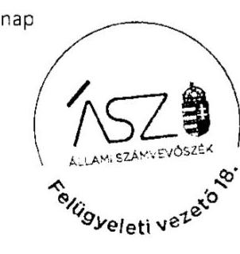

Makkai Mária s.k.
felügyeleti vezető

A kiadmány hiteles.

---

# Kunszigeti Közszolgáltató Nonprofit Kft. 

9184 Kunsziget, József Attila utca 2.

## ÁLLAMI SZÁMVEVŐSZÉK

Budapest.
Apáczai Cs. J. u. 10.
1052
Postacím: 1364 Budapest Pf. 54.
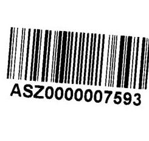

## Domonkos László Elnök Úr részére

Tárgy: Észrevétel EL-2398-041/2020. iktatószámú ellenőrzés megállapításaira Kunszigeti Közszolgáltató Nonprofit Kft

## Tisztelt Elnök Úr!

2020. november 23-án vettem kézhez a tárgyban jelölt ellenőrzés jelentéstervezetét, amelyet észrevételezés céljából küldtek meg részünkre. A vonatkozó jogszabályban biztosított észrevételezési jogommal élve a jelentéstervezetre az alábbi

## észrevételeket teszem.

A Tisztelt Állami Számvevőszék megállapította, hogy az Nkt. vhr. 37/G. § (1) bekezdésében foglaltaknak társaságunk nem tett eleget, ugyanis valóban nem nyújtottunk be olyan nyilvántartást, amely alapfeladatonkénti bontásban tartalmazná a támogatások felhasználását.

A fentiek rögzítését követően ugyanakkor azt a megállapítást is szükséges megtenni, hogy a kapott állami támogatások elköltése, felhasználása számos más a vizsgálat során is átadott okiratból egyértelműen visszakereshető és ellenőrizhető. Mindebből következően a társaság által kapott állami normatív hozzájárulások felhasználását, elköltését egyetlen hiányzó nyilvántartás miatt álláspontom szerint aránytalan ellenőrizhetetlennek minősíteni. Álláspontom szerint az Nkt. vhr. 37/G. § (1) bekezdése szerinti nyilvántartás hiányából túlzó olyan következtetést levonni, hogy a felhasznált közpénzekre vonatkozó gazdálkodás átláthatatlan, vagy jelentősen sérül.

A fentiek rögzítésén túl nyilatkozom továbbá arról, hogy a társaságunk a 2019. év vonatkozásában az Ön EL-2398-042/2020. iktatószámú levelében meghatározott 15 napos határidőben az ott rögzített dokumentáció rendelkezésre bocsátása útján a jogellenes állapotot meg fogja szüntetni.

Kunsziget, 2020. december 4.
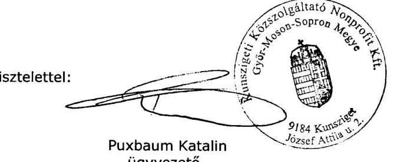

Kunszigeti Közszolgáltató Nonprofit Kft.

---

# 150 éve   a közpénzek őre 

ÁLLAMI SZÁMVEVŐSZÉK

Ikt. szám: EL-2398-044/2020.

Puxbaum Katalin úrhölgy
ügyvezető
Kunszigeti Közszolgáltató Nonprofit Korlátolt Felelősségű Társaság

## Kunsziget

Tisztelt Ügyvezető Úrhölgy!

A „Nem állami humánszolgáltatók ellenőrzése - A köznevelési humánszolgáltatást nyújtó intézmények, szolgáltatók államháztartáson kívüli fenntartói központi költségvetésből kapott támogatásai felhasználásának ellenőrzése 22 gazdasági társaságnál" címmel készített számvevőszéki jelentéstervezetre tett, 2020. december 4-én kelt észrevételét köszönettel megkaptam.

Az Állami Számvevőszék észrevételre vonatkozó álláspontjáról a felügyeleti vezető által készített részletes tájékoztatást mellékelten megküldöm.

Tájékoztatom Ügyvezető úrhölgyet, hogy a számvevőszéki jelentésben - az Állami Számvevőszékről szóló 2011. évi LXVI. törvény 29. § (3) bekezdése alapján - a figyelembe nem vett észrevételt szerepeltetjük, annak indoklásával, hogy azt az Állami Számvevőszék miért nem fogadta el.
Budapest, 2020. december 22. nap

Melléklet: Tájékoztatás az észrevétel kezeléséről
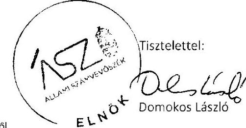

---

Melléklet
Ikt.szám: EL-2398-044/2020.

# Tájékoztatás 

## az észrevétel kezeléséről

A „Nem állami humánszolgáltatók ellenőrzése - A köznevelési humánszolgáltatást nyújtó intézmények, szolgáltatók államháztartáson kívüli fenntartói központi költségvetésből kapott támogatásai felhasználásának ellenőrzése 22 gazdasági társaságnál" címú jelentéstervezetre 2020. december 9-én érkezett észrevételt áttekintettük, annak kezelésével kapcsolatban a következő tájékoztatást adom.

Ügyvezető úrhölgy észrevétele rögzíti, hogy „valóban nem nyújtottunk be olyan nyilvántartást, amely alapfeladatonkénti bontásban tartalmazná a támogatások felhasználását". Aránytalannak ítéli azonban az ellenőrizhetőségre, átláthatóságra vonatkozóan levont következtetést.

Az észrevétel megerősíti az Állami Számvevőszék megállapítását, miszerint „A Fenntartó a 2016-2018. években a köznevelési humánszolgáltatási közfeladat ellátására kapott költségvetési támogatás felhasználásának a Számv. tv. 161/A. § (2) bekezdésében előírt ellenőrizhetőségét nem biztosította. Mivel az Nkt. vhr. 37/G. § (1) bekezdésében foglalt szabályozás ellenére nem gondoskodott arról, hogy a költségvetési támogatások felhasználásának alapfeladatonkénti elkülönített elszámolására az adatok rendelkezésre álljanak."

A számvitelről szóló 2000. évi C. törvény 161/A. § (2) bekezdése szerint „A közpénzek felhasználásának és a köztulajdon használatának nyilvánossága és ellenőrizhetősége érdekében a gazdálkodó nyilvántartási (könyvvezetési) rendszerét köteles oly módon továbbrészletezni, hogy abból a vonatkozó külön jogszabályban meghatározott adatok rendelkezésre álljanak." A külön jogszabályt jelentő nemzeti köznevelésről szóló törvény végrehajtásáról szóló 229/2012. (VIII. 28.) Korm. rendelet 37/G. § (1) bekezdésében foglalt előírásnak megfelelően a felhasználás fenntartó általi nyilvántartásából megállapíthatónak kell lennie, hogy a támogatás milyen célra került felhasználásra. Nyilvántartás hiányában a közpénzek felhasználásának ellenőrizhetősége nem biztosított, valamint nem állapítható meg, hogy a támogatások milyen célra kerültek felhasználásra. A hivatkozott jogszabályi előírások alapján az Állami Számvevőszék megállapítása nem túlzó, az a tényeknek megfelelően helytálló. Minderre tekintettel az észrevételt nem fogadjuk el, a jelentéstervezet módosítása nem indokolt.

Budapest, 2020. december 22. nap
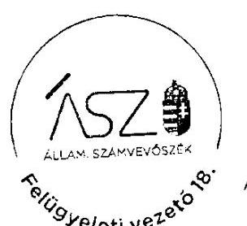

Makkai Mária s.k. felügyeleti vezető

A kiadmány hiteles.

---

PRO-ART Kistelek Közhasznú Nonprofit Kft.
6760 Kistelek, Kossuth utca 5.
A.sz. 21922596-1-06

Domokos László Elnök Úr
Állami Számvevőszék
1052 Budapest, Apáczai Csere János utca 10.
(1364 Budapest 4. Pf.54.)

Tárgy: Észrevétel a „Nem állami humánszolgáltatók ellenőrzése" jelentéstervezethez
Iktatószám: 1/2020.12.06.

Tisztelt Elnök Úr!

Az EL-2394-048/2020 iktatószámú levelüket a „Nem állami humánszolgáltatók ellenőrzése - A köznevelési humánszolgáltatást nyújtó intézmények, szolgáltatók államháztartáson kívüli fenntartói központi költségvetésből kapott támogatásai felhasználásának ellenőrzése 22 gazdasági társaságnál" címmel megkaptuk.

Köszönjük a számvevőszéki jelentéstervezet kivonatát és az abban foglalt megállapítást, PRO-ART Kistelek Kft-re vonatkozóan. Véleményünk szerint a 2018. éves beszámolói kötelezettségünknek eleget tettünk. Dokumentációnk szerint a beszámoló feltöltésre került. Amennyiben mégsem helytálló a kijelentésünk, természetesen korrigálunk.

Egyidejűleg megköszönöm az Állami Számvevőszék munkatársainak az ellenőrzésünk eredményes lefolytatásában végzett munkájukat.

Kistelek, 2020. december 6.

Tisztelettel:

Skaica-Törökgyörgy Melinda ügyvezető

Róztobant Nonprofit Kft.
6760 Kistelek, Kossuth 5.
Adószám: 21922596-1-06

---

# 150 éve   a közpénzek őre 

ÁLLAMI SZÁMVEVŐSZÉK

Ikt. szám: EL-2394-051/2020.

Skucza-Törökgyörgy Melinda úrhölgy
ügyvezető
PRO-ART KISTELEK Közhasznú Nonprofit Korlátolt Felelősségű Társaság

## Kistelek

Tisztelt Ügyvezető Úrhölgy!

A „Nem állami humánszolgáltatók ellenőrzése - A köznevelési humánszolgáltatást nyújtó intézmények, szolgáltatók államháztartáson kívüli fenntartói központi költségvetésből kapott támogatásai felhasználásának ellenőrzése 22 gazdasági társaságnál" címmel készített számvevőszéki jelentéstervezetre tett, 2020. december 6-án kelt észrevételét köszönettel megkaptam.

Az Állami Számvevőszék észrevételre vonatkozó álláspontjáról a felügyeleti vezető által készített részletes tájékoztatást mellékelten megküldöm.

Tájékoztatom Ügyvezető úrhölgyet, hogy a számvevőszéki jelentésben - az Állami Számvevőszékről szóló 2011. évi LXVI. törvény 29. § (3) bekezdése alapján - a figyelembe nem vett észrevételt szerepeltetjük, annak indoklásával, hogy azt az Állami Számvevőszék miért nem fogadta el.

Budapest, 2020. december 22. nap

Melléklet: Tájékoztatás az észrevétel kezeléséről
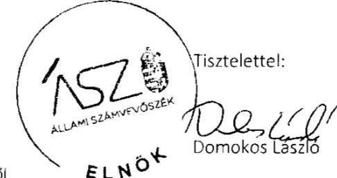

---

# Tájékoztatás   az észrevétel kezeléséről 

A „Nem állami humánszolgáltatók ellenőrzése - A köznevelési humánszolgáltatást nyújtó intézmények, szolgáltatók államháztartáson kívüli fenntartói központi költségvetésből kapott támogatásai felhasználásának ellenőrzése 22 gazdasági társaságnál" címú jelentéstervezetre 2020. december 9-én érkezett észrevételt áttekintettük, annak kezelésével kapcsolatban a következő tájékoztatást adom.

Ügyvezető úrhölgy észrevétele tartalmazza, hogy a dokumentációjuk szerint a 2018. évi beszámoló feltöltésre került és a beszámolási kötelezettségüknek eleget tettek.

Tájékoztatom Ügyvezető úrhölgyet, hogy az Állami Számvevőszék ellenőrzési megállapításai minden esetben az Állami Számvevőszékről szóló 2011. évi LXVI. törvénynek megfelelően az ellenőrzés során bekért és az arra nyitva álló határidőn belül rendelkezésre bocsátott dokumentumokon alapulnak. Az ellenőrzés során az arra nyitva álló határidőben az Állami Számvevőszék rendelkezésére bocsátott dokumentumokat ismételten áttekintettük. Az adatszolgáltatás keretében beküldött 2018. évi számviteli beszámoló nem felel meg a számvitelről szóló 2000. évi C. törvény 20. § (6) bekezdésében foglaltaknak, mert azt nem a 2018. október 24-i keltezésű alapító okirat szerinti képviseletre jogosult személy (ügyvezető) írta alá.

Mindezek alapján az észrevételt nem fogadjuk el, a jelentéstervezet módosítása nem indokolt.

Budapest, 2020. december 21. nap
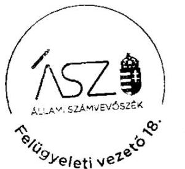

Makkai Mária s.k. felügyeleti vezető

A kiadmány hiteles

---

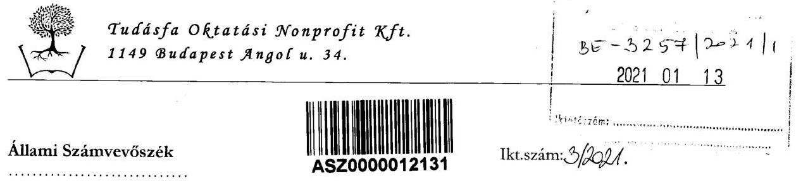

Budapest 4.
Pf. 54.
1364
Tárgy: EL-2277-044/2020 iktatószámú jelentéstervezetre észrevétel

# Tisztelt Állami Számvevőszék! 

Hivatkozással a tisztelt Számvevőszék EL-2277-044/2020. iktatószámon megküldött jelentéstervezetére, azzal kapcsolatban az alábbi észrevételeket tesszük:

Elöljáróban szükségesnek tartjuk rögzíteni, hogy a Tudásfa Oktatási Nonprofit Kft. (a továbbiakban: a Fenntartó) és az általa fenntartott köznevelési intézmény (Tudásfa Felnőttképzési Gimnázium) működése a Számvevőszék által vizsgált időszakban is megfelelt a jogi- és számviteli előírásoknak.

A tisztelt Számvevőszéknek nyilván hivatalból is tudomása van arról, hogy a köznevelési intézmények normatív finanszírozásának ellenőrzése kapcsán a Magyar Államkincstár, míg törvényes működésük kapcsán - kétévente - az illetékes Kormányhivatal folytat rendszeres ellenőrzéseket.

Bár a Fenntartó által működtetett köznevelési intézmény több telephelyen, nagy tanulói és alkalmazotti létszámmal működik, a fentebb említett hatóságok vizsgálatai a működés kapcsán szabálytalanságokat nem tártak fel, állami normatíva
 visszafizetésére kötelező végrehajtható határozat - annak a Fővárosi Törvényszék 108. K. 701.328/2020/14/II. számú ítélete általi megsemmisítése okán - nem született.

A Fenntartó az állami támogatást felnőttek esti tagozatos gimnáziumi oktatására - mint egyetlen alapfeladatra - kapja, és erre a feladatra is használja fel. Elkülönített nyilvántartásunk nincs - arra álláspontunk szerint nincsen sem jogi, sem egyéb praktikus indok -, hiszen minden költség az esti tagozatos gimnáziumi képzés (tehát egyetlen alapfeladat ellátása) kapcsán merül fel.

Jelen észrevételünk mellékleteként csatoljuk azon nyilvántartásunkat, ahol a támogatás beérkezésének és felhasználásának a területei áttekinthető formában látszanak.

A Fenntartó az általa fenntartott intézmény zavartalan, jogszerű működését biztosította és jelenleg is folyamatosan biztosítja, a lehetőségekhez mérten átgondoltan, költséghatékonyan működik, ezzel is segítve a színvonalasabb oktatást.

A jelentés tervezet az ellenőrzés céljaként azt határozza meg, hogy: „a nem állami, nem önkormányzati köznevelési intézményi fenntartó központi költségvetésből kapott támogatásainak felhasználása szabályszerű volt-e”

---

# Tudásfa Oktatási Nonprofit Kft.   1149 Budapest Angol u. 34. 

A fentebb említettek és a csatolt mellékletek tükrében egyértelműen kijelenthető, hogy a Fenntartó magas társadalmi presztizsű, közfeladatát a központi költségvetésből kapott támogatások szabályszerű felhasználásával látja el.

A jelentés tervezet az „Ellenőrzés háttere, indokoltsága” kapcsán - egyebek mellett - akként fogalmaz, hogy „az ÁSZ bazajárul ahhoz, hogy a közpénzeket a nem állami humán fenntartók átlátható módon használják fel a közfeladatok ellátására kötött szerződésekben vállalt kötelezettségeik teljesítése érdekében”.

Az átláthatóság a Fenntartó működése során egyértelműen biztosított.
Az Állami Számvevőszékről szóló 2011. évi LXVI. törvény 24. § (1) bekezdése az ellenőrzésekkel szemben támasztott követelmények között említi azt, hogy:
„d) az ellenőrzések eredményeinek, a megállapításoknak alátámasztottnak, a következtetéseknek okszerűnek és megalapozottnak kell lenniük, továbbá
e) az ellenőrzéseket hatékonyan és eredményesen kell elvégezni.”

Mindezek alapján nem értünk egyet a tisztelt Számvevőszék „Megállapítások” címszó alatt írt összegző megállapításával, mely szerint a Fenntartó a Számvtv. 161/A. § (2) bekezdésében előírt ellenőrizhetőséget nem biztosította.

A hivatkozott jogszabályhely szerint: „(2) A közpénzek felhasználásának és a köztulajdon használatának nyilvánussága és ellenőrizhetősége érdekében a gazdálkodó nyilvántartási (könyvelési) rendszerét köteles oly módon továbbrészletezni, hogy abból a vonatkozó külön jogszabályban meghatározott adatok rendelkezésre álljanak.”

Amint azt fentebb említettük, a továbbrészletezés kötelezettsége azért sem értelmezhető esetünkben, mert a Fenntartó által működtetett intézmény kizárólag egy tevékenység kapcsán használt fel közpénzt, ez bárminemű részletezés nélkül is jól nyomon követhető.

A 85/2003. Számviteli kérdés szerint:
„Ha a könyvvezetés során a gazdasági események nem jelennek meg a számviteli törvény szerint vezetendő könyvviteli (nyilvántartási) számlákon - amelyek a mérleg-, illetve az eredménykimutatás összeállításához szükségesek -, akkor az alkalmazott könyvviteli rendszer nem felel meg a magyar számviteli előírásoknak.”

A Fenntartó könyvelésében, nyilvántartásában - s ekként mérlegében és eredménykimutatásában is - egyértelműen megjelennek azok a gazdasági események, melyek alapján kijelenthető, hogy az alkalmazott könyvviteli-, nyilvántartási rendszer megfelel a számviteli előírásoknak.

A jelentéstervezet (ld. „Megállapítások”) hivatkozik a nemzeti köznevelési törvény végrehajtásáról szóló 229/2019. (VIII. 28.) Korm. rendelet 37/G. § (1) bekezdése kapcsán arra is, hogy a Fenntartó nem gondoskodott olyan nyilvántartás kialakításáról, hogy abból megállapítható legyen, hogy a költségvetési támogatásokat milyen célra használta fel.

A hivatkozott jogszabályi rendelkezés szerint (Nkt. vhr.: „A fenntartó a támogatások felhasználását, az ingyenesség, tandíj, térítési díj megállapításával, beszedésével kapcsolatot rendelkezéseket, okiratokat alapfeladatonként bontásban elkülönítetten és naprakészen tartja nyilván. Az adatok valódiságát az egyes fenntartónál, köznevelési intézménynél megfelelő nyilvántartással, szakmai és pénzügyi dokumentációval kell alátámasztani. A fenntartó a nyilvántartás kialakításáról akként

---

# Tudásfa Oktatási Nonprofit Kft. 1149 Budapest Angol u. 34. 

gondoskodik, hogy abból megállapítható legyen, hogy a támogatások: milyen határnappal kerültek átadásra és milyen célokra kerültek felhasználásra.” ${ }^{11}$

Miután a Fenntartó a kapott állami támogatást felnőttek esti tagozatos gimnáziumi oktatására kapja, így alapfeladat elkülönítésről az esetében nincsen szó, nyilvántartása rendelkezésre áll és naprakész.

Fentiek - és a jelen észrevételhez csatolt dokumentumok alapján - kérjük a tisztelt Állami Számvevőszéket, hogy vizsgálati jelentésében a Fenntartó gazdálkodásának megfelelőségét (szabályszerűségét) igazolja és a jelentés tervezetben általunk fentebb cáfolt megállapításait korrigálja.

Budapest, 2021. január 11.

TUDÁSFA OKTATÁSI
NONPROFIT KFT.
1149 BUDAPEST, ANGOL U. 34.
ADÓSZÁM: 23355394-1-42
Tisztelettel:
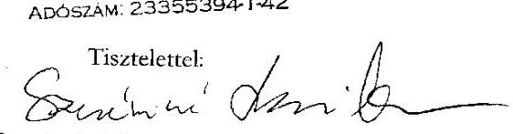

Szeréminé Losonczi Vivien
ügyvezető, fenntartói képviselő

---

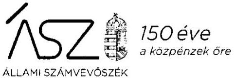

Ikt. szám: EL-2277-051/2021.

Szeréminé Losonczi Vivien úrhölgy
ügyvezető
Tudásfa Oktatási Nonprofit Kft.

# Budapest 

Tisztelt Ügyvezető Úrhölgy!

A „Nem állami humánszolgáltatók ellenőrzése - A köznevelési humánszolgáltatást nyújtó intézmények, szolgáltatók államháztartáson kívüli fenntartói központi költségvetésből kapott támogatásai felhasználásának ellenőrzése 22 gazdasági társaságnál” címmel készített számvevőszéki jelentéstervezetre tett, 2021. január 11-én kelt észrevételét köszönettel megkaptam.

Az Állami Számvevőszék észrevételre vonatkozó álláspontjáról a felügyeleti vezető által készített részletes tájékoztatást mellékelten megküldöm.

Tájékoztatom Ügyvezető úrhölgyet, hogy a számvevőszéki jelentésben - az Állami Számvevőszékről szóló 2011. évi LXVI. törvény 29. § (3) bekezdése alapján - a figyelembe nem vett észrevételt szerepeltetjük, annak indoklásával, hogy azt az Állami Számvevőszék miért nem fogadta el.
Budapest, 2021. 04. hó 27. nap
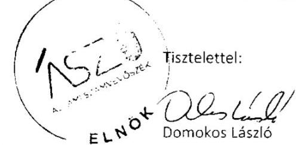

Melléklet: Tájékoztatás az észrevétel kezeléséről

---

Melléklet
Ikt.szám: EL-2277-051/2021.

# Tájékoztatás   az észrevétel kezeléséről 

A „Nem állami humánszolgáltatók ellenőrzése - A köznevelési humánszolgáltatást nyújtó intézmények, szolgáltatók államháztartáson kívüli fenntartói központi költségvetésből kapott támogatásai felhasználásának ellenőrzése 22 gazdasági társaságnál” című jelentéstervezetre 2021. január 13-án érkezett észrevételt áttekintettük, annak kezelésével kapcsolatban a következő tájékoztatást adom.

Ügyvezető úrhölgy észrevételében rögzíti, hogy a társaság az ellenőrzött időszakban megfelelt a jogi és számviteli előírásoknak. Ezt azzal igyekszik alátámasztani, hogy a Magyar Államkincstár és az illetékes kormányhivatal rendszeresen ellenőrzi a társaságot és szabálytalanságot nem tártak fel. Kifejti továbbá, hogy elkülönített nyilvántartásuk nincs, mivel egyetlen alapfeladatot lát el a fenntartott intézmény és ebből adódóan az ellenőrizhetőség biztosított, „bárminemű részletezés nélkül is jól nyomon követhető” a közpénzfelhasználás.

Tájékoztatom Ügyvezető úrhölgyet, hogy az Állami Számvevőszék ellenőrzési megállapításai minden esetben az Állami Számvevőszékről szóló 2011. évi LXVI. törvénynek megfelelően az ellenőrzés során bekért és az arra nyitva álló határidőn belül rendelkezésre bocsátott dokumentumokon alapulnak. Az észrevétel mellékleteként beküldött, ellenőrzött időszakra vonatkozó dokumentumokat nem értékeltük.

Az ellenőrzés során az arra nyitva álló határidőben az Állami Számvevőszék rendelkezésére bocsátott dokumentumokat ismételten áttekintettük. A rendelkezésre bocsátott dokumentumok és az észrevételben rögzítettekkel megerősítetten a fenntartó elkülönített nyilvántartással nem rendelkezett. A jogszabályi előírás egyértelműen megfogalmazza a fenntartó kötelezettségét, amely szerint a felhasználás elkülönített nyilvántartásából a nemzeti köznevelésről szóló törvény végrehajtásáról szóló 229/2012. (VIII. 28.) Korm. rendelet 37/G. § (1) bekezdésében foglalt előírásnak megfelelően megállapíthatónak kell lennie, hogy a támogatás milyen célra került felhasználásra. Megfelelő fenntartói nyilvántartás hiányában nem igazolt és nem egyértelmű, hogy a fenntartó és fenntartott intézmény gazdálkodásában felmerülő, költségvetési támogatás által fedezett költségek mindegyike az alapfeladat érdekében merült fel.

Az észrevételben hivatkozott egyéb szervezetek által végzett ellenőrzések eredményei semmilyen formában nem befolyásolják az Állami Számvevőszék ellenőrzési megállapításait, amelyek az Ön által teljességi és hitelességi nyilatkozattal alátámasztott és ezáltal teljes körű adatszolgáltatásán alapulnak. Mindezek alapján az észrevételt nem fogadjuk el, a jelentéstervezet módosítása nem indokolt.

---

Tájékoztatom továbbá, hogy az észrevétel mellékleteként, az EL-2277-045/2020. iktatószámú vagyonmegóvó intézkedés kilátásba helyezéséről szóló tájékoztatásra megküldött, 2019. évre vonatkozó dokumentumok értékeléséről külön levélben tájékoztatjuk Ügyvezető úrhölgyet. Budapest, 2021. 01. hó 27. nap
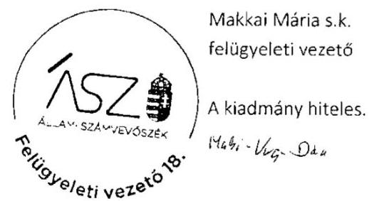

---

Feladó:
Várda-Kids Nonprofit Korlátolt
Felelősségű Társaság
1162 Budapest, Budapesti út 116.
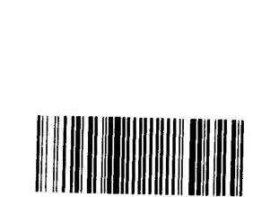

1052 Budapest, Apáczai Csere János u. 10.

Iktatószám: EL-2282-010/2020
Adóazonosító szám: 23152964-2-42
Tárgy: Észrevétel

# Tisztelt Domokos László Elnök Úr! 

## Az EL-2282-010/2020 iktatószámú Jelentéstervezetre a következő észrevételt teszem:

A Várda-Kids Nonprofit Korlátolt Felelősségű Társaság működése során minden hatóság számára biztosította az ellenőrzés feltételeit és az adatszolgáltatásra határidőre eleget tett.

Az Állami Számvevőszéktől 2020. március hónapban kaptunk egy tájékoztatót, hogy ellenőrzést tartanak cégünknél, de konkrétan mikor és hova kellene adatokat feltölteni nem jelölték meg, majd november hónapban kaptunk egy konkrét feladatot, amit időben teljesítettünk is.

Természetesen a jövőben is készséggel állunk az Állami Számvevőszék rendelkezésére, de kérem, hogy leveleket a 1161 Budapest Dobo u. 7-be küldjék, mivel mozgásképtelen lettem és otthonról dolgozom, vagy tárhelyre.

Budapest, 2020. december 7.
Tisztelettel:
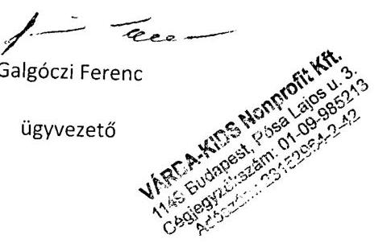

---

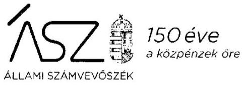

Ikt. szám: EL-2282-014/2020.

Galgóczi Ferenc úr
ügyvezető

Várda-Kids Nonprofit Korlátolt Felelősségű Társaság

# Budapest 

Tisztelt Ügyvezető Úr!

A „Nem állami humánszolgáltatók ellenőrzése - A köznevelési humánszolgáltatást nyújtó intézmények, szolgáltatók államháztartáson kívüli fenntartói központi költségvetésből kapott támogatásai felhasználásának ellenőrzése 22 gazdasági társaságnál” címmel készített számvevőszéki jelentéstervezetre tett, 2020. december 7-én kelt észrevételét köszönettel megkaptam.

Az Állami Számvevőszék észrevételre vonatkozó álláspontjáról a felügyeleti vezető által készített részletes tájékoztatást mellékelten megküldöm.

Tájékoztatom Ügyvezető urat, hogy a számvevőszéki jelentésben - az Állami Számvevőszékről szóló 2011. évi LXVI. törvény 29. § (3) bekezdése alapján - a figyelembe nem vett észrevételt szerepeltetjük, annak indoklásával, hogy azt az Állami Számvevőszék miért nem fogadta el.

Budapest, 2020. év 12. hó 28. nap

Melléklet: Tájékoztatás az észrevétel kezeléséről
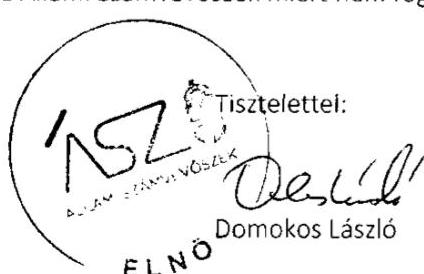

---

# Tájékoztatás   az észrevétel kezeléséről 

A „Nem állami humánszolgáltatók ellenőrzése - A köznevelési humánszolgáltatást nyújtó intézmények, szolgáltatók államháztartáson kívüli fenntartói központi költségvetésből kapott támogatásai felhasználásának ellenőrzése 22 gazdasági társaságnál” címü jelentéstervezetre 2020. december 11-én érkezett észrevételt áttekintettük, annak kezelésével kapcsolatban a következő tájékoztatást adom.

Ügyvezető úr észrevételében arról adott tájékoztatást, hogy a Várda-Kids Nonprofit Korlátolt Felelősségű Társaság működése során minden hatóság számára biztosította az ellenőrzés feltételeit és az adatszolgáltatásra határidőre eleget tett. Az észrevételében rögzítette, hogy a Társaság 2020. március hónapban egy tájékoztatót, majd november hónapban egy konkrét feladatot kapott az Állami Számvevőszéktől és kérte, hogy továbbiakban leveleket az észrevételben megadott címre küldjünk.

Felhívom Ügyvezető úr figyelmét, hogy az Állami Számvevőszék (továbbiakban ÁSZ) megkereséseit minden esetben a Cégközlönyben hivatalosan közzétett céges adatok alapján küldte meg a Társaság részére. Így az ÁSZ EL-2282-001/2019. iktatószámú adatbekérő levele 2019. december 9-én a cég székhelyére (1149 Budapest, Pósa Lajos utca 3. szám) került megküldésre, mely a Magyar Posta által „nem kereste” jelzéssel visszaérkezett a feladónak. Az adatbekérő levél átadását az ÁSZ 2020. január 28-án helyszíni adatbetekintés keretében megkísérelte, melynek során az ÁSZ képviselői nem találták meg a Társaságot, a Társaság nevét tartalmazó tábla, jelzés a székhely címen nem volt található.

Ezt követően az ÁSZ EL-2282-005/2020. iktatószámú, az ellenőrzés megkezdéséről szóló értesítő levelét és annak mellékleteként az ellenőrzés programját küldte meg a fenti címre 2020. március 24-én, melyet a tértivevény alapján Ügyvezető úr 2020. március 26-án átvett.

Fentiekre tekintettel állapította meg az ÁSZ, hogy a Társaság esetében nem álltak fenn az ellenőrzés lefolytathatóságának a feltételei, mert a kért adatokat, dokumentumokat nem bocsátotta az ellenőrzés rendelkezésére. Ezáltal a közfeladat ellátására kapott támogatás felhasználása nem volt ellenőrizhető. Mindezek alapján az észrevételt nem fogadjuk el, a jelentéstervezet módosítása nem indokolt.

Budapest, 2020. év 12. hó 28. nap
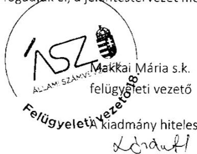

---

# RÖVIDÍTÉSEK JEGYZÉKE 

${ }^{1}$ Alaptörvény
${ }^{2}$ ÁSZ
${ }^{3}$ Nkt.
${ }^{4}$ Intézmény${ }_{5}$
${ }^{5}$ Fenntartó${ }_{1}$
${ }^{6}$ MÁK
${ }^{7}$ Intézmény${ }_{2}$
${ }^{8}$ Fenntartó${ }_{2}$
${ }^{9}$ Intézmény${ }_{3}$
${ }^{10}$ Fenntartó${ }_{3}$
${ }^{11}$ Intézmény${ }_{4}$
${ }$

 }^{12}$ Fenntartó $_{4}$
${ }^{13}$ Fenntartó $_{5}$
${ }^{14}$ Intézmény $_{5}$
${ }^{15}$ Fenntartó $_{6}$
${ }^{16}$ Intézmény $_{6}$

## ${ }^{17}$ Intézmény $_{7}$

${ }^{18}$ Fenntartó $_{7}$
${ }^{19}$ Intézmény $_{8}$
${ }^{20}$ Fenntartó $_{8}$
${ }^{21}$ Intézmény $_{9}$
${ }^{22}$ Fenntartó $_{9}$
${ }^{23}$ Intézmény $_{10}$
${ }^{24}$ Fenntartó $_{10}$
${ }^{25}$ Fenntartó $_{11}$
${ }^{26}$ Intézmények $_{11}$
${ }^{27}$ Intézmény $_{22}$
${ }^{28}$ Fenntartó $_{12}$
${ }^{29}$ Fenntartó $_{13}$
${ }^{30}$ Intézmény $_{33}$

Magyarország Alaptörvénye
Állami Számvevőszék
2011. évi CXC. törvény a nemzeti köznevelésről
(hatályos: 2012. szeptember 1-jétől)
Allegro Alapfokú Művészeti Iskola
"ALLEGRETTO 8500" Művészeti Közhasznú Nonprofit Korlátolt Felelősségű Társaság
Magyar Államkincstár
Vásárhelyi László Alapfokú Művészeti Iskola
BOTOLÓ Nonprofit Közhasznú Korlátolt Felelősségű Társaság
CLASSIC Alapfokú Művészeti Iskola
CLASSIC Oktatási és Szolgáltató Nonprofit Korlátolt Felelősségű Társaság
Szinvavölgyi Alapfokú Művészeti Iskola
DATI Diósgyőri Alapfokú Táncművészeti Iskola Nonprofit Korlátolt Felelősségű Társaság
E-médiainformatika Nonprofit Kft.
Garabonciás Médiaművészeti és táncművészeti Szakgimnázium, Szociális és Számítástechnikai Szakközépiskola, Gimnázium
"ÉRTED" Oktatási és Szolgáltató Közhasznú Nonprofit Korlátolt Felelősségű Társaság
„Érted Vagyunk" Speciális Szakiskola és Egységes Gyógypedagógiai Módszertani Intézmény, 2017. április 24-étől: „Érted Vagyunk" Szakiskola és Egységes Gyógypedagógiai Módszertani Intézmény
Miskolci Magister Gimnázium
EURO-Magister Nonprofit Kft.
Garabonciás Művészeti Iskola
GARABONCIÁS ISKOLA Oktatási Nonprofit Korlátolt Felelősségű Társaság
Harmónia Alapfokú Művészeti Iskola
Harmónia Művészeti Központ Nonprofit Közhasznú Korlátolt Felelősségű Társaság
Hórvölgye Alapfokú Művészeti Iskola
Hórvölgye Zeneiskola Nonprofit Korlátolt Felelősségű Társaság
ISZTI Innovációs Szakképző és Továbbképző Iskola Központ Közhasznú Nonprofit Korlátolt Felelősségű Társaság
„SZÉPMÍVES" Szakközépiskola (2016. augusztus 31-ig), „SZÉPMÍVES" Szakgimnázium (2016. szeptember 1-jétől)
Innovációs Szakképző, Továbbképző Iskola Központ és Gimnázium (2016. augusztus 31-ig), Innovációs Szakmai Továbbképző Iskola Központ és Középiskola (2016. szeptember 1-jétől)

KONTRASZTOK Alapfokú Művészeti Iskola
KONTRASZTOK Művészeti, Oktató és Szolgáltató Nonprofit Közhasznú Kft.
Kunszigeti Közszolgáltató Nonprofit Korlátolt Felelősségű Társaság
Kunszigeti Két Tanítási Nyelvű Általános Iskola és Alapfokú Művészeti Iskola

---

${ }^{31}$ Intézmény $_{14}$
${ }^{32}$ Fenntartó $_{14}$
${ }^{33}$ Intézmény $_{15}$
${ }^{34}$ Fenntartó $_{15}$
${ }^{35}$ Intézmény $_{16}$
${ }^{36}$ Fenntartó $_{16}$
${ }^{37}$ Intézmény $_{17}$
${ }^{38}$ Fenntartó $_{17}$
${ }^{39}$ Fenntartó $_{18}$
${ }^{40}$ Intézmény $_{18}$
${ }^{41}$ Intézmény $_{19}$
${ }^{42}$ Fenntartó $_{19}$
${ }^{43}$ Intézmény $_{20}$
${ }^{44}$ Fenntartó $_{20}$
${ }^{45}$ Intézmény $_{22}$
${ }^{46}$ Fenntartó $_{22}$
${ }^{47}$ 2016. évi Kvtv.
2017. évi Kvtv.
2018. évi Kvtv.
${ }^{48}$ ÁSZ tv.
${ }^{49}$ ÁSZ SZMSZ
${ }^{50}$ Számv. tv.
${ }^{51}$ Nkt. vhr.
${ }^{52}$ Fenntartó $_{21}$

LORIGO Alapfokú Művészetoktatási Intézmény
LORIGO Oktatási és Kulturális Szolgáltató Közhasznú Nonprofit Kft.
Madách Tánc- és Színművészeti Szakgimnázium és Alapfokú Művészeti Iskola
Művész Gyerekekért Közhasznú Nonprofit Kft.
PRO-ART Alapfokú Művészeti Iskola
Pro-Art Kistelek Közhasznú Nonprofit Korlátolt Felelősségű Társaság
Szilver Alapfokú Művészeti Iskola
Szilver Táncművészeti Nonprofit Korlátolt Felelősségű Társaság
TALENTUM VIA Oktatási és Szolgáltató Nonprofit Korlátolt Felelősségű Társaság
Pannon Gimnázium és Általános Iskola
T-DANCE Alapfokú Művészeti Iskola
TÁNCÉRT ÉS OKTATÁSÉRT Művészeti Nonprofit Közhasznú Korlátolt Felelősségű Társaság
Tudásfa Felnőttoktatási Gimnázium
Tudásfa Oktatási Nonprofit Kft.
Violin Alapfokú Művészeti Iskola
"Violin" Alapfokú Művészeti Iskola Nonprofit Korlátolt Felelősségű Társaság
2015. évi C. törvény - Magyarország 2016. évi központi költségvetéséről (hatályos: 2015. július 4-étől)
2016. évi CX. törvény - Magyarország 2017. évi központi költségvetéséről (hatályos: 2016. november 1-jétől)
2017. évi C. törvény - Magyarország 2018. évi központi költségvetéséről (hatályos: 2017. november 1-jétől)
2011. évi LXVI. törvény az Állami Számvevőszékről (hatályos: 2011. július 1-jétől)

Állami Számvevőszék Szervezeti és Működési Szabályzata
2000. évi C. törvény a számvitelről (hatályos: 2001. január 1-jétől)

229/2012. (VIII. 28.) Korm. rendelet a nemzeti köznevelésről szóló törvény végrehajtásáról
Várda-Kids Nonprofit Korlátolt Felelősségű Társaság

---

# ASZ 

ÁLLAMI SZÁMVEVŐSZÉK
1052 Budapest, Apáczai Cs. J. u. 10. | 1364 Budapest 4. Pf. 54
TEL: +36 14849100
email: szamvevoszek@asz.hu
web: www.asz.hu | www.aszhirportal.hu

