ÁLLAMI SZÁMVEVŐSZÉK

# JELENTÉS 

## Önkormányzatok pénzügyi ellenőrzése

Önkormányzatok pénzügyi monitoring alapján végzett ellenőrzése - Megyei önkormányzatok, a megyei jogú városok önkormányzatai, a fővárosi és a fővárosi kerületek önkormányzatai
2021.

21027
www.asz.hu

---

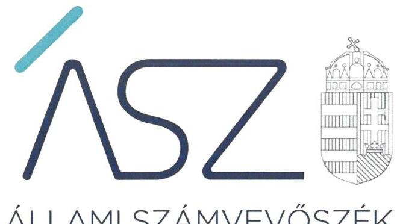

ÁLLAMI SZÁMVEVŐSZÉK

# JELENTÉS

## Önkormányzatok pénzügyi ellenőrzése

Önkormányzatok pénzügyi monitoring alapján végzett ellenőrzése - Megyei önkormányzatok, a megyei jogú városok önkormányzatai, a fővárosi és a fővárosi kerületek önkormányzatai

2021. 04. hó 29. nap

21027
www.asz.hu

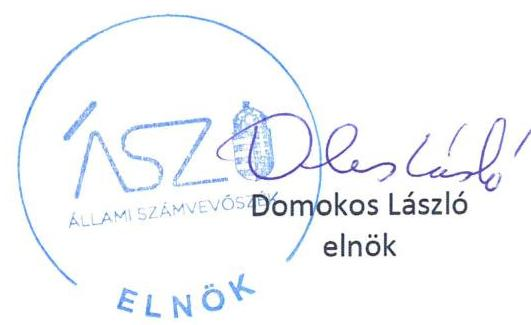

---

# AZ ELLENŐRZÉST FELÜGYELTE: 

KLINGA LÁSZLÓ felügyeleti vezető

## AZ ELLENŐRZÉST VEZETTE ÉS A VÉGREHAJTÁSÁÉRT FELELŐS:

SZAPPANOS JÚLIA ellenőrzésvezető

## A PROGRAM ÖSSZEÁLLÍTÁSÁÉRT FELELŐS:

HORVÁTH TÍMEA ellenőrzési program készítéséért felelős vezető

IKTATÓSZÁM: EL-3101-001/2021
TÉMASZÁM: 24
ELLENŐRZÉS-AZONOSÍTÓ SZÁM: V0903
Jelentéseink az Országgyúlés számítógépes hálózatán és az interneten a www.asz.hu címen is olvashatóak.

---

# TARTALOMJEGYZÉK 

■ ÖSSZEGZÉS ..... 5
■ KÖVETKEZTETÉS ..... 7
■ AZ ELLENŐRZÉS CÉLJA ..... 8
■ AZ ELLENŐRZÉS TERÜLETE ..... 9
■ AZ ELLENŐRZÉS HÁTTERE, INDOKOLTSÁGA ..... 10
■ A JELENTÉS LÉNYEGES KÉRDÉSKÖREI. ..... 11
■ AZ ELLENŐRZÉS HATÓKÖRE ÉS MÓDSZEREI. ..... 12
■ MEGÁLLAPÍTÁSOK ..... 14
■ MELLÉKLETEK. ..... 25
I. sz. melléklet: Fogalomtár. ..... 25
II. sz. melléklet: Az ellenőrzési kritériumok módszertana és értékelése ..... 29
III. sz. melléklet: Az eszközök és források alakulása kiemelt mérlegsoronként a 2018-2019. években (E Ft) ..... 31
IV. sz. melléklet: Pénzügyi egyensúlyi helyzet CLF módszer szerinti értékelése a 2018-2019. években (E Ft) ..... 32
V. sz. melléklet: Az Önkormányzatok 2018-2019. évi főbb mutatóinak és kockázati területeinek összefoglaló értékelése ..... 33
VI. sz. melléklet: Az Önkormányzatok 2018-2019. évi főbb mutatóinak és kockázati területeinek részletes értékelése (E Ft) ..... 34
VII. sz. melléklet: A kockázatelemzés alá vont Önkormányzatok ..... 35
■ FÜGGELÉK: ÉSZREVÉTELEK ..... 37
■ RÖVIDÍTÉSEK JEGYZÉKE ..... 39

---

.

---

# ÖSSZEGZÉS 

Az Állami Számvevőszéka megyei önkormányzatok, a megyei jogú városok önkormányzatai, a fövárosi és a fövárosi kerületek önkormányzatai gazdálkodásának a kockázatait értékelte. Az önkormányzati éves beszámolók adatai szerint az önkormányzatok pénzügyi gazdálkodásának fenntarthatósága, az önkormányzatok pénzügyi egyensúlya biztositott volt a 20182019. években, ugyanakkor a 2019. évben a felhalmozási kiadások finanszirozása kockázatot jelentett a pénzügyi egyensúly biztositására. Az önkormányzatok tárgyévi pénzügyi pozíciójának egyenlege a 2018-2019. években pozitív volt, de a csökkenő mérték kockázatot jelez. Az önkormányzatok a könyvviteli mérlegben kimutatott vagyon értékét növelték, a szükséges eszközpótlásról gondoskodtak.

## Az ellenőrzés társadalmi indokoltsága

A magyar települési és területi önkormányzatok jelentős része a 2000-es években tartalékait felélve egy olyan adósságspirálba került, amit önerőből már nem, csak külső források igénybevételével tudott finanszírozni. Ennek hatására a felhalmozott adósságállomány állami konszolidációjára a 2011. és 2014. évek között került sor. Az adósságkonszolidációk eredményeként, továbbá az önkormányzatok feladatellátása átstruktúrálásával, rendszerszinten pénzügyi helyzetük helyreállt, így az addig adósságot „termelő" alrendszer a fenntartható működés irányába mozdult el. Ugyanakkor az önkormányzatok gazdálkodásából eredő veszélyek miatt az ÁSZ továbbra is kiemelt figyelmet fordít az önkormányzatok pénzügyi egyensúlyi helyzetére ható kockázatok monitorizálására, a pénzügyi sérülékenységet okozó folyamatokra, az önkormányzati alrendszert veszélyeztető rendszeregyensúlyi kockázatokra annak érdekében, hogy a konszolidáció eredményei fenntarthatóak legyenek.

A Magyar Államkincstár központi információs rendszerében rendelkezésre álló önkormányzati éves költségvetési beszámolók adatait felhasználva, az önkormányzatok pénzügyi- és vagyongazdálkodási, valamint eladósodottság területen végzett monitoring riportok kiértékelésével az ÁSZ hozzájárul azon kockázatos területek feltárásához, amelyek rendszerszintű, vagy egyedi önkormányzati szintű beavatkozást igényelnek az önkormányzatok pénzügyi egyensúlyának fenntarthatósága érdekében.

A pénzügyi monitoringon alapuló ellenőrzés lehetőséget ad az önkormányzati alrendszer egyes településtípus szerinti csoportosítására és ezeknek a csoportoknak a pénzügyi-gazdasági helyzetének rendszerszintű értékelésére, és a kockázatforrást jelentő területek beazonosítására. Emellett a monitoring típusú ellenőrzés az ASZ erőforrásainak hatékony felhasználásával, az adatbekérések minimalizálásával, a kockázatokra fókuszáltan, széles lefedettséget képes biztosítani az önkormányzati alrendszer területén. Az ÁSZ ellenőrzés fókuszában áll a beazonosított kockázatok kezelésének előmozdítása önkormányzati és döntéshozói szinten is, támogatva ezzel a jól irányított állam elvének megvalósulását.

---

# Föbb megállapítások 

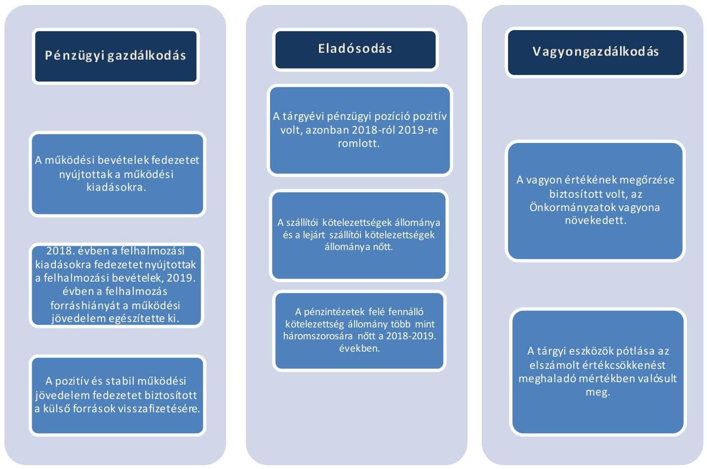

---

# KÖVETKEZTETÉS 

A megyei önkormányzatok, a megyei jogú városok önkormányzatai, a fővárosi és a fővárosi kerületek önkormányzatai - 66 önkormányzat - önkormányzati szintű kockázatait értékeltük a pénzügyi gazdálkodás, az eladósodás és a vagyongazdálkodás területén.

Az önkormányzati alrendszert érintő adósságkonszolidáció eredményeinek a fenntarthatósága a kialakított jogszabályi környezetben a 2018-2019. években biztosított volt. A 2018-2019. évi beszámoló adatok alapján a megyei önkormányzatok, a megyei jogú városok önkormányzatai, a fővárosi és a fővárosi kerületek önkormányzatai pénzügyi egyensúlya a feladatok és gazdálkodási feltételek lényeges változása nélkül fenntartható, rövidtávon rendszerszintű beavatkozást nem igényel.

A működési jövedelem fedezetet biztosított a felhalmozási költségvetés 2019. évi negatív egyenlegére, valamint a hitelek törlesztésére is, azonban a külső források visszafizetési kötelezettségének növekedése, az elindult fejlesztések finanszírozása és a kapcsolódó fenntartási kiadások kockázatforrást jelentenek az önkormányzatok eladósodására, ezért e kockázatok kezelése odafigyelést igényel.

Az eladósodás rendszerszintű kockázata nem állt fenn. Az önkormányzatok pénzügyi pozíciója az időszakban ugyan romlott, de a vagyon növekedése a felmerülő pénzügyi kockázatokat mérsékelte, az eszközpótlásról az ellenőrzött időszakban gondoskodtak.

A pénzügyi egyensúly megteremtése, fenntartása érdekében, figyelemmel a koronavírus járvány miatt megváltozott körülményekre, az arra adott válaszok tekintetében a kockázatokata 2020. évre értékelni és kezelni kell.

---

# AZ ELLENŐRZÉS CÉLJA

**AZ ELLENŐRZÉS CÉLJA** az önkormányzatok központi információs rendszerében szereplő adatok értékelése alapján beazonosított kockázatok kezelésének előmozdítása.

---

### **AZ ELLENŐRZÉS TERÜLETE**

### **A megyei önkormányzatok, a megyei jogú városok önkormányzatai, a fővárosi és a fővárosi kerületek önkormányzatai**

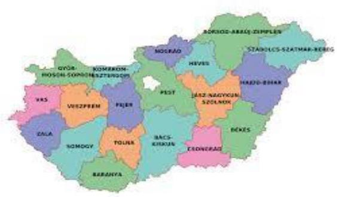

Az ellenőrzés a megyei önkormányzatok, a megyei jogú városok önkormányzatai, a fővárosi és a fővárosi kerületek önkormányzatai alkotta, összesen 66 önkormányzatból álló csoportra terjedt ki.

A Központi Statisztikai Hivatal Magyarország Közigazgatási Helynévkönyvében közzétett adatok szerint az ellenőrzött csoportot érintően a megyék állandó lakosságának száma 2018. január 1-jén 8 028 637 fő volt, amely 2019. január 1-jére 0,1%-kal 8 020 470 főre csökkent. A megyei jogú városok esetében a lakosságszám a 2018. január 1-jei 1 956 344 főről 0,2%-kal 1 952 485 főre csökkent 2019. január 1-jére. A főváros állandó lakosságának száma 2018. január 1-jén 1 749 734 fő, 2019. január 1-jén 1 752 286 fő volt, 0,1%-kal növekedett.

Az egy főre jutó helyi adóbevétel – a helyi adóbevétellel bíró önkormányzatoknál – a 2018. évben 151,5 ezer Ft volt, a 2019. évben 8,8%-os növekedéssel 164,9 ezer Ft összegben teljesült.

Az Önkormányzatoknál¹ az egy állandó lakosra jutó működési kiadások összege a 2018. évi 93,2 ezer Ft-ról a 2019. évben 12,0%-os növekedéssel 104,4 ezer Ft-ra változott, az egy főre jutó felhalmozási kiadások összege a 2018. évi 30,7 ezer Ft-ról 30,7%-os növekedéssel 40,2 ezer Ft-ra emelkedett a 2019. évben.

Az Önkormányzatok összevont költségvetési beszámolói szerint teljesített éves költségvetési bevételek és költségvetési kiadások összegét, a könyvviteli mérleg szerinti eszközök, a követelések és kötelezettségek állományi értékét az 1. táblázat mutatja be.

|  1. táblázat |  |  |  |  | Adatok Mrd Ft-ban  |
| --- | --- | --- | --- | --- | --- |
|  Év | Költségvetési bevételek | Költségvetési kiadások | Eszközök | Követelések | Kötelezettségek  |
|  2018. | 1 356,5 | 1 211,5 | 7 287,2 | 302,6 | 254,1  |
|  2019. | 1 432,2 | 1 412,6 | 7 648,7 | 367,5 | 334,1  |

*Forrás: Önkormányzatok beszámolói*

---

# AZ ELLENŐRZÉS HÁTTERE, INDOKOLTSÁGA 

Az ÁSZ Stratégiájában célul tűzte ki, hogy az önkormányzatok ellenőrzése során azok pénzügyi-gazdasági helyzetét értékeli, kockázatait feltárja. Az új megközelítésű, elemzéssel alátámasztott mintavétellel, illetve ellenőrzési eljárásokkal csökkentse a helyszíni ellenőrzések számát. A monitoring rendszer az önkormányzatok éves költségvetési beszámolójának, időközi költségvetési jelentéseinek és mérlegjelentéseinek a központi információs rendszerben szereplő adatai értékelése alapján jelzi, hogy melyek azok az önkormányzatok, és melyek azok a területek, ahol olyan kedvezőtlen gazdasági folyamatok, vagy gazdasági események következtek be, amelyek ellenőrzés lefolytatását teszik indokolttá. Ennek az egyszerűsített ellenőrzési módszernek az eredményeként megtörténik az önkormányzatok pénzügyi, vagyoni helyzetének megítélése, a pénzügyi egyensúly minősítése, továbbá a változások hatásának értékelése.

Az önkormányzati alrendszerben megjelenő gazdálkodási nehézségek, likviditási problémák és az eladósodottság növekedése az ÁSZ figyelmét a 2011. évtől az önkormányzatok pénzügyi helyzetére irányította. Az önkormányzati feladatellátást érintő átalakítások meghatározó része a 2013. évben következett be azzal, hogy az igazgatási, az oktatási, az egészségügyi és a szociális ellátásban a feladatok jelentős hányadát átvette az állam. Az önkormányzati alrendszerben a 2013. évtől bevezetett feladatfinanszírozási rendszer keretein belül továbbra is megoldandó kérdés a pénzügyi egyensúly megteremtése, hosszú távú fenntartása. Ahhoz, hogy az önkormányzatok meg tudjanak felelni a számukra meghatározott - szigorúbb gazdálkodási szabályoknak, és az új feltételek mellett is biztosítható legyen a közszolgáltatások megfelelő színvonalú ellátása, szükséges volt a pénz-ügyi-gazdasági rendszerük alapjainak megszilárdítása, amely célt az adósságkonszolidáció szolgálta. Az adósságkonszolidáció az önkormányzatok pénzügyi egyensúlyi helyzetére kedvező hatást gyakorolt, azonban a problémák kiváltó okait nem szüntette meg, ennek kezelése nélkül viszont az adósságállomány újratermelődhet. Erre tekintettel kiemelt fontosságú az önkormányzatok pénzügyi egyensúlyi helyzetére ható kockázatok feltárása.

---

# A JELENTÉS LÉNYEGES KÉRDÉSKÖREI 

1. Az önkormányzatok pénzügyi gazdálkodásának fenntarthatósága biztositott volt-e?
2.     - Fennállt-e az önkormányzatok eladósodásának kockázata?
3.     - Az önkormányzatok vagyongazdálkodása során biztositott volt-e a vagyon értékének a megőrzése?

---

# AZ ELLENŐRZÉS HATÓKÖRE ÉS MÓDSZEREI 

## Az ellenőrzés típusa

Helyénvalósági ellenőrzés.

## Az ellenőrzött időszak

A 2018-2019. évek.

## Az ellenőrzés tárgya

Az önkormányzati gazdálkodás fenntarthatósága, a törvényben előírt feladatok ellátása, az önkormányzatnál észlelt negatív tendenciák okainak feltárása. Az ellenőrzés kiterjed minden olyan körülményre és adatra, amely az ÁSZ jogszabályban meghatározott feladatainak teljesítéséhez, valamint a program végrehajtása folyamán felmerült újabb összefüggések feltárásához szükséges.

## Az ellenőrzött szervezet

A Belügyminisztérium, mint a Kormány helyi önkormányzatokért felelős tagja által vezetett minisztérium, 66 önkormányzat (megyei önkormányzatok, a megyei jogú városok önkormányzatai, a fővárosi és a fővárosi kerületek önkormányzatai a VII. számú melléklet alapján).

## Az ellenőrzés jogalapja

Az ellenőrzés jogszabályi alapját az Állami Számvevőszékről szóló 2011. évi LXVI. törvény 1. § (3) bekezdésének, az 5. § (2)-(6) bekezdéseinek, valamint az államháztartásról szóló 2011. évi CXCV. törvény 61. § (2) bekezdésének előírásai képezik.

## Az ellenőrzés módszerei

Az ellenőrzést az ellenőrzési program ellenőrzési kérdései, az ellenőrzött időszakban hatályos jogszabályok, az ellenőrzés szakmai szabályok és módszertanok figyelembe vételével végezzük.

Az ellenőrzés ideje alatt az ellenőrzött szervezettel történő kapcsolattartást az ÁSZ SZMSZ²-ének vonatkozó előírásai alapján biztosítjuk.

---

Az ellenőrzési kérdések megválaszolásához szükséges bizonyítékok megszerzése a Magyar Államkincstár által rendelkezésre bocsátott adatokra alapozva elemző eljárással történik, amelyeket a mintavétel alapján kontrollálni kell a hiteles forrásból származó nyilvántartásokban szereplő adatokkal.

Az ÁSZ az ellenőrzés előkészítése során meghatározta az ellenőrzési (helyénvalósági) kritériumokat, amelyek az ellenőrzési bizonyíték értékelésének, valamint a számvevőszéki jelentésben szereplő megállapítások és következtetések alapját képezik. A megállapításokban használt fogalmak értelmezését, forrását a fogalomtár, a mutatók helyénvalósági kritériumait, és a kockázatok értékelését az ellenőrzési kritériumok módszertana és értékelése tartalmazza.

Az ellenőrzési kérdésekre adott válaszok alapján értékelni kell, hogy az önkormányzat képes volt-e a törvényben meghatározott feladatait ellátni, gazdálkodása változatlan formában fenntartható-e.

---

# 1. Az önkormányzatok pénzügyi gazdálkodásának fenntarthatósága biztosított volt-e? 

Összegző megállapítás

2. táblázat

| MUTATÓK ALAKULÁSA |  |  |
| :-- | --: | --: |
| Mutatók (\%) | 2018.   os | 2019.   os |
| Múködési kiadások fe-   dezettsége | 114,0 | 109,0 |
| -föváros | 108,8 | 109,4 |
| -fövárosi kerületek | 118,5 | 120,0 |
| -megyék | 108,5 | 98,8 |
| -megyei jogú városok | 112,3 | 104,8 |

A 2018. évben az Önkormányzatok pénzügyi gazdálkodása fenntarthatósága biztosított volt, azonban a 2019. évben a felhalmozási kiadások és azok finanszírozása kockázatot jelentett a pénzügyi gazdálkodás fenntarthatóságára. Az adósságszolgálat teljesítéséhez kapcsolódó fedezet biztosított volt.

## A MÚKÖDÉSI BEVÉTELEK FEDEZETET NYÚJTOT-

TAK a 2018-2019. években az Önkormányzatok által ellátott feladatok működési kiadásaira, működési finanszírozási kockázat egyik évben sem merült fel. A mutatók önkormányzat típus szerinti alakulását a 2. táblázat tartalmazza.

A működési bevételek a 2018. évben 1 038,3 Mrd Ft-ot tettek ki. A 2019. évben a működési bevételek 1 111,3 Mrd Ft-ra nőttek, így 7,0\%-kal nagyobb mértékben realizálódtak. A működési kiadások a 2018. évben 911,0 Mrd Ft-ot tettek ki, míg a 2019. évben 1 020,0 Mrd Ft összegben teljesültek. A működési kiadások ebben az időszakban 109,0 Mrd Ft-tal (12,0\%-kal) emelkedtek. Az Önkormányzatok müködésének finanszírozása a müködési kiadások fedezettségének 5,0 százalékpontos csökkenése mellett is összességében biztosított volt a 2019. évben.

A működési kiadásokon belül a személyi juttatások és járulékaik 33,0\%os, a dologi kiadások 37,6\%-os, az egyéb müködési célú kiadások 28,6\%-os arányt képviseltek a 2018. évben. A 2019. évben a müködési kiadásokon belül a személyi juttatások és járulékaik 31,6\%-os, a dologi kiadások 39,4\%os, az egyéb müködési célú kiadások 28,1\%-os arányt képviseltek. A megyei önkormányzatok és a megyei jogú városok esetében 5,0 százalékpontot meghaladó mértékű volt a müködési kiadások fedezettségének csökkenése. A megyei önkormányzatok esetében ez azt jelentette, hogy a 2019. évben a müködési kiadások fedezettsége nem volt biztosított.

A müködési bevételek 2018. évi 7,0\%-os emelkedését az államháztartáson belülről származó müködési célú támogatások, az önkormányzatok müködési támogatásai, az államháztartáson belülről átvett egyéb müködési célú támogatások bevételei, valamint a közhatalmi bevételek növekedése ( $8,8 \%$-os) befolyásolta.

A müködési bevételek a 2018. évben tíz önkormányzat (nyolc megyei és kettő megyei jogú város önkormányzat), a 2019. évben 13 önkormányzat (egy fővárosi kerület, kilenc megyei és három megyei jogú város önkormányzat), esetében az ellátott feladatokra nem nyújtottak fedezetet, mivel müködési kiadások fedezettsége 100\% alatti volt. A fedezettség a 2018. évben 56, a 2019. évben 53 önkormányzat esetében 100,0\% feletti volt.

---

3. táblázat

|  |   |   |
| --- | --- | --- |
|  MUTATÓK ALAKULÁSA (\%) |  |   |
|  Mutatók | $\begin{gathered} 2018 . \ \text { év } \end{gathered}$ | $\begin{gathered} 2019 . \ \text { év } \end{gathered}$  |
|  Kiegészítő (rend- |  |   |
|  kívül) önkor- |  |   |
|  minyzatitámo- |  |   |
|  gatás aránya | 0,0816 | 0,085  |
|  -föváros | 0,005 | 0,0  |
|  -föváros kerüle- | 0,0005 | 0,0  |
|  tek | 3,117 | 3,254  |
|  -megyei jogú vá- | 0,118 | 0,133  |
|  rosok |  |   |
|  Adóbevételek |  |   |
|  működési bevé- |  |   |
|  teleken belüli | 54,1 | 55,0  |
|  aránya |  |   |
|  -föváros | 67,1 | 69,4  |
|  -föváros kerüle- | 55,8 | 56,6  |
|  tek |  |   |
|  -megyei jogú vá- | 47,5 | 47,7  |
|  rosok |  |   |

4. táblázat

|  MUTATÓK ALAKULÁSA |  |   |
| --- | --- | --- |
|  Mutatók | $\begin{gathered} 2018 . \ \text { év } \end{gathered}$ | $\begin{gathered} 2019 . \ \text { év } \end{gathered}$  |
|  Adóbevételek állomá- |  |   |
|  nya (Mrd Ft) | 561,5 | 610,9  |
|  -föváros | 149,0 | 164,2  |
|  -fövárosi kerületek | 198,3 | 214,9  |
|  -megyei jogú városok | 214,2 | 231,8  |
|  Helyi iparűzési adóbe- |  |   |
|  vételek állománya | 439,9 | 485,6  |
|  (Mrd Ft) |  |   |
|  -föváros | 148,8 | 164,0  |
|  -fövárosi kerületek | 126,2 | 140,2  |
|  -megyei jogú városok | 164,9 | 181,4  |
|  Forrás: Önkormányzatok beszámolói |  |   |

1. táblázat

|  MUTATÓK ALAKULÁSA |  |   |
| --- | --- | --- |
|  Mutatók | $\begin{gathered} 2018 . \ \text { év } \end{gathered}$ | $\begin{gathered} 2019 . \ \text { év } \end{gathered}$  |
|  Felhalmozásí kiadások |  |   |
|  fedezettsége | 105,9 | 81,7  |
|  -föváros | 31,5 | 77,0  |
|  -fövárosi kerületek | 69,3 | 60,0  |
|  -megyék | 128,5 | 149,4  |
|  -megyei jogú városok | 150,0 | 92,5  |
|  Forrás: Önkormányzatok beszámolói |  |   |

## RENDKÍVÜLI ÖNKORMÁNYZATI TÁMOGATÁST (3.

táblázat) a működőképesség megőrzése céljából a 2018. évben 0,8 Mrd Ft, a 2019. évben 0,9 Mrd Ft összegben kaptak az önkormányzatok (elsősorban megyei önkormányzatok).

AZ ADÓBEVÉTELEK működési bevételeken belüli aránya a 2018. évben $54,1 \%$-ot, a 2019. évben $55,0 \%$-ot tett ki, 0,9 százalékponttal emelkedett, döntően a helyi iparűzési adóbevétel növekedése miatt. Az emelkedés kedvező hatást gyakorolt az önkormányzatok pénzügyi egyensúlyi helyzetére, annak fenntarthatóságára.

Az adóbevételek - kiemelten a helyi iparűzési adóbevételek - alakulását az 1. ábra mutatja be.

1. ábra

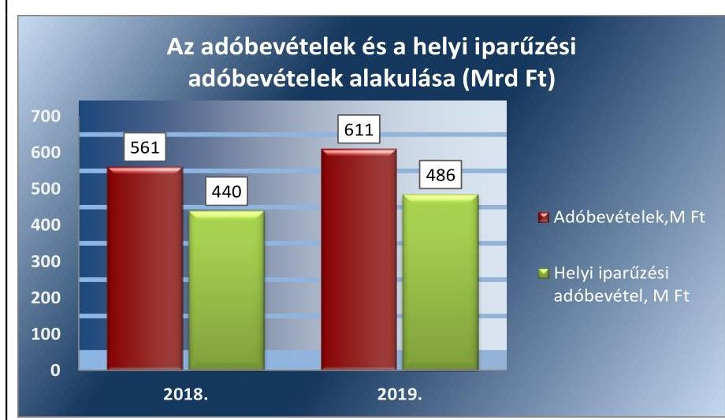

Forrás: Önkormányzatok beszámolói Az Önkormányzatok közül a 2018-2019. évben helyi adóbevétellel, ezen belül helyi iparűzési adóbevétellel 47 Önkormányzat rendelkezett, a megyei önkormányzatoknak feladatellátásuk jellege miatt nincsen helyi adóbevételük.

Az adóbevételek és azokon belül a helyi iparűzési adóbevételek meghatározó jelentőségűek. Kedvezően hatott a helyi iparűzési adóbevételek emelkedése az önkormányzatok gazdálkodására, jövedelemtermelő képességére, a költségvetés stabilitására. (4. táblázat)

A TÁRGYÉVI FELHALMOZÁSI BEVÉTELEK a 2018. évben 105,9\%-ban, a 2019. évben 81,7\%-ban nyújtottak fedezetet a tárgyévi felhalmozási kiadásokra (5. táblázat). A felhalmozási kiadások és azok finanszírozása a 2019. évben kockázatot jelentett a pénzügyi gazdálkodásra, a pénzügyi egyensúly fenntarthatóságára.

A 2018. évben a felhalmozási bevételek 318,2 Mrd Ft, a felhalmozási kiadások 300,4 Mrd Ft összegben teljesültek, ami a bevételeknél 0,8\%-os emelkedést jelentett. A felhalmozási kiadások növekedése meghaladta a felhalmozási bevételek növekedését, összege a 2018. évről a 2019. évre 92,1 Mrd Ft-tal, 30,7\%-kal emelkedett (392,5 Mrd Ft-ra), míg a bevételek növekedése nem érte el az 1\%-ot, 320,8 Mrd Ft összegben teljesült. A kiadások döntő részt a 2019. évben felmerült beruházásokkal és felújításokkal összefüggésben merültek fel.

---

6. táblázat

| MUTATÓK ALAKULÁSA |  |  |
| :--: | :--: | :--: |
| Mutatók | 2018. | 2019. |
| Törlesztés fedezettsé- |  |  |
| gének aránya | $9,3 \%$ | $85,2 \%$ |
| Nettó múködésijöve- |  |  |
| delem (Mrd Ft) | 115,3 | 13,5 |

A 2018. évben a felhalmozási költségvetés egyenlege kedvezően alakult, így az kockázatot nem jelentett. A 2019. évben a felhalmozási kiadások 18,7\%-át a működési bevételek terhére finanszírozták.

A 2019. évben a felhalmozási költségvetés hiánya ugyan a működési jövedelemből finanszírozható volt, így ez a felhalmozási kockázatot mérsékelte, azonban a működési jövedelemből történő finanszírozás a fenntarthatóságot érintően kockázatot hordoz a tekintetben, hogy elegendő forrás biztosított-e az alapfeladatok ellátására. A 2019. évben az Önkormányzatok felhalmozási kiadásainak finanszírozása kockázatot hordozott, a pénzügyi gazdálkodásra, a pénzügyi egyensúly fenntarthatóságára.

A 2018-2019. évek felhalmozási bevételeinek forrásösszetételét a 2. ábra mutatja be.
2. ábra
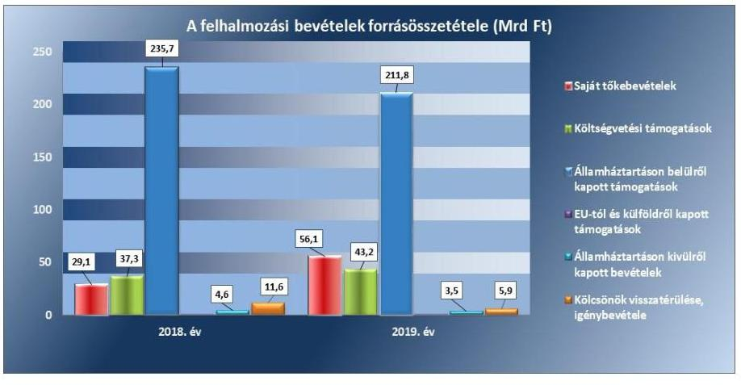

Forrás: 2018-2019. évi önkormányzati beszámoló
A 2019. évben a saját tőkebevétel közel duplájára, 92,7\%-kal, míg a felhalmozási célú költségvetési támogatások összege 16,0\%-kal emelkedett a 2018. évhez képest. Az államháztartáson belülről kapott támogatások öszszege a 2019. évre 10,2\%-kal, 24,0 Mrd Ft-tal csökkent.

A felhalmozási bevételek összetételén belül az államháztartáson belülről kapott támogatások aránya volt a legmagasabb, amely a 2018. évben $74,1 \%$, a 2019. évben 66,0\% volt, 8,1 százalékponttal csökkent.

Az ellenőrzött időszak (2018-2019. évek) beletartozik a 2014-2020. évek időszakába, amikor is Magyarország az Európai Unió és a hazai költségvetés támogatásával a 2014-2020. években 12000 milliárd Ft fejlesztési forrást használhat fel.

ADÓSSÁGSZOLGÁLATHOZ kapcsolódó kötelezettséggel az Önkormányzatok a 2018-2019. években rendelkeztek a külső források - hiteltörlesztése - miatt. A kapcsolódó mutatók alakulását a 6. táblázat tartalmazza.

A működési jövedelem - folyó bevételek és folyó kiadások különbözete - 28,2\%-kal csökkent. A hiteltörlesztésre fordított kiadások összege közel hétszeresére emelkedett, a hitelfelvételek összege 89,0\%-kal nőtt a 2019. évben az előző évhez képest. Az Önkormányzatoknál a törlesztés fedezettsége megmutatta, hogy a müködési jövedelemből a 2018. évben 9,3\%, a 2019. évben $85,2 \%$-ot kellett törlesztésre fordítani.

---

A nettó múködési jövedelem (működési jövedelem-hiteltörlesztés) a 2018. évi 115,3 Mrd Ft-ról a 2019. évre 13,5 Mrd Ft-ra változott, 88,3\%-kal csökkent. A külső források visszafizetése nem jelentett magas kockázatforrást az Önkormányzatok pénzügyi gazdálkodására, pénzügyi egyensúlyára, mivel a nettó múködési jövedelem összege az ellenőrzött években pozitív volt, azonban a 2018. évről a 2019. évre csökkenést mutatott, ami közepes kockázatot jelez. A mutató emelkedése és a romló pénzügyi kapacitás (nettó múködési jövedelem) az Önkormányzatok jövedelemtermelő képességének a csökkenésére hívja fel a figyelmet.

# 2. Fennállt-e az önkormányzatok eladósodásának kockázata? 

## Összegző megállapítás

7. táblázat

| Mutatók | 2018.   év | 2019.   év |
| :--: | :--: | :--: |
| Pénzügyi pozíció csök-   kent/növekedett   (db/db) | 27/39 | 40/26 |
| -főváros | 1/0 | 0/1 |
| -fővárosi kerületek | 5/18 | 15/8 |
| -megyék | 9/10 | 11/8 |
| -megyei jogú vá-   rosok | 12/11 | 14/9 |

Forrás: Önkormányzatok beszámolói
8. táblázat

| Mutatók | 2018.   év | 2019.   év |
| :--: | :--: | :--: |
| Tárgyévi pénzügyi pozíció (Mrd Ft) | 157,6 | 68,6 |
| -főváros | $-9,2$ | 6,5 |
| -fővárosi kerületek | 49,6 | 3,1 |
| -megyék | 1,0 | 0,3 |
| -megyei jogú városok | 116,3 | 58,6 |
| Forrás: Önkormányzati beszámolók |  |  |

Az Önkormányzatok pénzügyi egyensúlya biztosított volt, azonban a pénzügyi pozíció romlott. A szállítói kötelezettségállomány növekedése mellett a likvid eszközök a kötelezettségek teljesítésére fedezetet biztosítottak.

A PÉNZÜGYI EGYENSÚLY az Önkormányzatoknál a 2018. és a 2019. évben biztosított volt, a költségvetési bevételek fedezetet nyújtottak a költségvetési kiadásokra. Az Önkormányzatok folyó és a felhalmozási költségvetésének összesített egyenlege az ellenőrzött időszak mindkettő évében pozitív volt, azonban csökkent a 2019. évben. A maradvány igénybevétele - a 2018. évben 478,1 Mrd Ft, a 2019. évben 635,8 Mrd Ft - javította az Önkormányzatok tárgyévi pénzügyi helyzetét. Az igénybe vett maradvány összege a 2019. évben 157,7 Mrd Ft-tal, 33\%-kal emelkedett, amely ellensúlyozta a költségvetési egyenleg 2019. évi csökkenését.

Az Önkormányzatok pénzügyi egyensúlyi helyzetének alakulását a 3. ábra mutatja be, a mutatók alakulását a 7. táblázat tartalmazza.
3. ábra
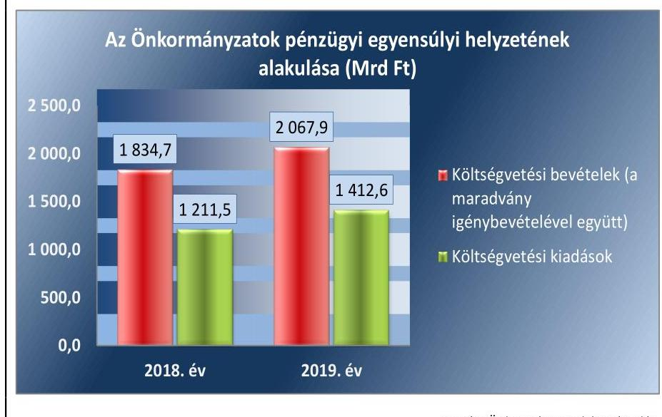

A tárgyévi pénzügyi pozíció a 2018. év végén 157,6 Mrd Ft volt, amely 73,6 Mrd Ft-os növekedést jelentett a 2017. év végéhez képest. A tárgyévi pénzügyi pozíció a 2019. évben kedvezőtlenül alakult. (8. táblázat)

---

9. táblázat

| MUTATÓK ALAKULÁSA |  |  |
| :--: | :--: | :--: |
| Mutatók | 2018.   év | $\begin{gathered} 2019 . \\ \text { év } \end{gathered}$ |
| Eladósodási mutató | 3,5\% | 4,4\% |
| -főváros | 4,3\% | 5,8\% |
| -fővárosi kerületek | 2,1\% | 2,4\% |
| -megyék | 5,3\% | 7,2\% |
| -megyei jogú városok | 3,7\% | 4,5\% |
| Eladósodási mutató   változása százalékpontban | $+0,7$ | $+0,9$ |
| -főváros | $+1,7$ | $+1,5$ |
| -fővárosi kerületek | $+0,1$ | $+0,3$ |
| -megyék | $+0,6$ | $+1,9$ |
| -megyei jogú városok | $+0,4$ | $+0,8$ |

A tárgyévi pénzügyi pozíció és tényezőinek (működési jövedelem, a felhalmozási költségvetés egyenlege, a finanszírozási múveletek egyenlege) alakulását az ellenőrzött időszakban a következő adatok szemléltetik.

| 4. ábra |  | Mrd Ft |
| :--: | :--: | :--: |
|  | 2018. év | 2019. év |
| Tárgyévi pénzügyi pozíció | 157,6 | 68,6 |
| Múködési jövedelem | 127,2 | 91,3 |
| Felhalmozási költségvetés egyenlege | 17,8 | $-71,7$ |
| Finanszírozási múveletek egyenlege | 12,6 | 49,0 |

Forrás: Önkormányzatok beszámolói
A tárgyévi pénzügyi pozíció 2019. évi változására kedvezőtlen hatással volt a múködési jövedelem 28,2\%-os (35,9 Mrd Ft) és a felhalmozási költségvetés egyenlegének 502,7\%-os (89,5 Mrd Ft) csökkenése, amelyet kompenzált a finanszírozási múveletek egyenlegének 289,0\%-os (36,4 Mrd Ft) növekedése. A tárgyévi pénzügyi pozíció 2019. évi változása az Önkormányzatok esetében csökkent, de továbbra is pozitív maradt.

A tárgyévi pénzügyi pozíció a 2018. év végén 52 önkormányzatnál (Önkormányzatok 78,8\%-a), a 2019. év végén 39 önkormányzatnál (Önkormányzatok 59,1\%-a) volt pozitív. A pozitív tárgyévi pénzügyi pozícióval rendelkező önkormányzatok közül a pénzügyi pozíció csökkenése a 2018. évben egy önkormányzatnál, a 2019. évben kettő önkormányzatnál nem haladta meg a 25\%-ot, míg a 2018. évben 15 önkormányzatnál, a 2019. évben 13 önkormányzatnál $25 \%$ felett volt.

A 2018. év végén 14 önkormányzatnál (Önkormányzatok 21,2\%-a), a 2019. év végén 27 önkormányzatnál (Önkormányzatok 40,9\%-a) negatív volt a pénzügyi pozíció, amelynek összege a 2018. végi -16,9 Mrd Ft-ról a 2019. év végére -52,6 Mrd Ft-ra változott. A negatív tárgyévi pénzügyi pozíció, illetve a tárgyévi pénzügyi pozíció csökkenése az érintett önkormányzatoknál az eladósodás kockázatát hordozta.

Az idegen források aránya nem hordozott kockázatot az Önkormányzatok múködésére, az eladósodási mutató a 2018. évben 3,5\%, a 2019. évben 4,4\% volt. Ugyanakkor az eladósodási mutató az Önkormányzatoknál jelentős eltéréseket mutatott, a 2018. évben 0,1\%-25,9\% közötti, a 2019. évben $0,2 \%-49,6 \%$ közötti sávban alakult. A mutató a 2018. évben kettő önkormányzat, a 2019. évben egy önkormányzat esetében 20\% felett volt, amely az érintett önkormányzatok esetében az eladósodás kockázatát hordozta.

Az eladósodási mutató (9. táblázat) a 2018. évben 0,7 százalékponttal, a 2019. évben 0,9 százalékponttal nőtt. A mutató értékének változására hatással volt, hogy a kötelezettségek állománya a 2018. évben 35,0\%-kal, a 2019. évben 31,5\%-kal emelkedett. A kötelezettségállomány növekedését a 2018-2019. években elsősorban a költségvetési évet követően esedékes kötelezettségek állományának növekedése okozta, amely a 2018. évben 61,1 Mrd Ft-tal (+96,0\%), a 2019. évben 62,6 Mrd Ft-tal (+50,2\%) emelkedett. A 2019. évben jelentős volt a kötelezettség jellegú sajátos elszámolások állományának növekedése, amely 8,1 M Ft-tal, 20,3\%-kal haladta meg a 2018. év végi állományt. A mutató fokozatos növekedése az ellenőrzött időszakban kockázatot hordozott az Önkormányzatok eladósodására. Az eladósodottság a főváros és fővárosi kerületek önkormányzatai esetében a 2018. évi 3,34\%-ról a 2019. évre 4,28\%-ra (+0,94 százalékponttal), a megyei önkormányzatoknál a 2018. évi 5,31\%-ról a 2019. évre

---

10. táblázat

| MUTATÓK ALAKULÁSA |  |  |
| :--: | :--: | :--: |
| Mutatók | 2018.   év | 2018.   év |
| Kötelezettségek dologi, felújítási beruházási kiadásokra állomány változása | $-4,7 \%$ | $+10,4 \%$ |
| Lejárt dologi, felújítási beruházási kiadásokra nyilvántartott kötelezettségek állomány aránya | $9,2 \%$ | $12,1 \%$ |
| Lejárt dologi, felújítási, beruházási kiadásokra nyilvántartott kötelezettségek állomány változása | $-16,1 \%$ | $+44,3 \%$ |
| Lejárt dologi kiadásokra nyilvántartott kötelezettségek állomány aránya a dologi kiadások egy havi átlagához viszonyltva | $9,3 \%$ | $6,3 \%$ |
| 90 napon túli lejárt kötelezettségek állományának aránya | $0,9 \%$ | $0,3 \%$ |

Forrás: Önkormányzatok beszámolói
$7,21 \%$-ra ( $+1,90$ százalékponttal), míg a megyei jogú városok esetében a 2018. évi 3,65\%-ról a 2019. évre 4,46\%-ra ( $+0,81$ százalékponttal) emelkedett.

A SZÁLLÍTÓI KÖTELEZETTSÉG állománya (az Önkormányzatok dologi, beruházási és felújítási kiadásokkal kapcsolatos kötelezettsége) a 2018. év eleji 53,0 Mrd Ft-ról a 2018. év végére 50,5 Mrd Ft-ra csökkent. A 2019. évben a szállítói kötelezettségek 5,3 Mrd Ft-tal növekedtek, a 2019. év végi állomány 55,8 Mrd Ft volt. A 2019. évi növekedés oka a beruházási és felújítási kiadásokra nyilvántartott kötelezettségeinek 4,7 Mrd Ft ( $+17,7 \%$ ) és a dologi kiadásokra nyilvántartott kötelezettségek 0,6 Mrd Ft ( $+2,5 \%$ ) összegű emelkedése volt. A mutatók alakulását a 10. táblázat tartalmazza.

A szállítói kötelezettségek mérlegfőösszeghez mért aránya a 2018. évben 0,69\%, a 2019. évben 0,73\% volt, kismértékben, 0,04 százalékponttal emelkedett. A szállítói állomány összes kötelezettségen belüli aránya 19,9\%-ról 16,7\%-ra csökkent, 3,2 százalékponttal alacsonyabb volt a 2019. évben.

Az Önkormányzatok lejárt szállítói kötelezettségeinek állománya a 2018. év végén 4,7 Mrd Ft, a 2019. év végén 6,7 Mrd Ft volt. A lejárt szállítói kötelezettségek állománya a 2018. évben 897,8 millió Ft-tal, 16,1\%-kal csökkent, azonban a 2019. évben kedvezőtlenül alakult, mivel 44,3\%-kal növekedett az előző évhez képest. A 2018. évben 44 önkormányzat (Önkormányzatok 66,7\%-a) (a főváros és 18 fővárosi kerület, öt megye és 20 megyei jogú városi önkormányzat), a 2019. évben 43 önkormányzat (Önkormányzatok 65,2\%-a) (a főváros és 18 fővárosi kerület, négy megye és 20 megyei jogú városi önkormányzat) rendelkezett lejárt szállítói kötelezettséggel.

A lejárt dologi, felújítási és beruházási kiadásokra nyilvántartott kötelezettségek állományának aránya a 2018. évben 9,2\%, a 2019. évben 12,1\% volt, 2,9 százalékponttal növekedett. Az arány 2019. évi növekedésének oka, hogy a lejárt szállítói kötelezettségek állománynövekedésének mértéke meghaladta szállítói kötelezettségek állománynövekedésének mértékét.

Az önkormányzatok szállítói kötelezettség állományának alakulását az 5. ábra szemlélteti.
5. ábra
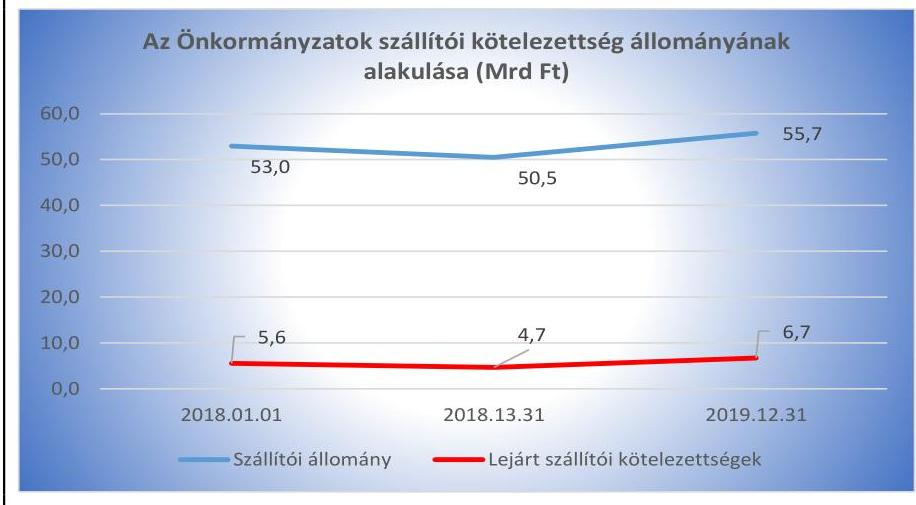

Forrás: Önkormányzatok beszámolói

---

11. táblázat

| MÉRLEGADATOK (MRD FT.) |  |  |
| :--: | :--: | :--: |
| Mutatók | 2018. | 2019. |
|  | év | év |
| NEMZETI VAGYONBA TARTOZÓ FORGÓESZKÖZÖK | 132,2 | 148,5 |
| Ebből forgatási célú hitelviszonyt megtestesítő értékpapírok | 129,6 | 145,6 |
| PÉNZESZKÖZÖK | 640,6 | 713,3 |
| Ebből éven túlllejáratú forint lekötött bankbetétek | 13,2 | 14,4 |

A szállítói kötelezettségek állományának, a lejárt szállítói kötelezettségek állományának és a lejárt szállítói kötelezettségek arányának növekedése kockázatot jelentett a 2019. évben, az Önkormányzatok fizetőképességének csökkenését, a pénzügyi kockázat növekedését jelzi.

A lejárt dologi kiadásokra nyilvántartott kötelezettségek állományának aránya a dologi kiadások egy havi átlagához viszonyítva kedvezően alakult, a 2018. évi 9,3\%-ról 6,3\%-ra csökkent a 2019. évben.

A 2018. évben 24 önkormányzat (az Önkormányzatok 36,4\%-a), a 2019. évben 28 önkormányzat (az Önkormányzatok 42,4\%-a) rendelkezett 90 napon túl lejárt szállítói kötelezettséggel. Az Önkormányzatok a 2018. év végén 2,3 Mrd Ft, a 2019. év végén 0,9 Mrd Ft 90 napon túli szállítói tartozással rendelkeztek, az állománycsökkenés 61,9\% volt.

A 90 napon túl lejárt kötelezettségek állományának aránya a 2018. év végén 0,9\% volt, amely a 2019. év végére 0,6 százalékponttal 0,3\%-ra csökkent, legmagasabb összege a 2019. évben 471,3 millió Ft volt, az összes kötelezettséghez viszonyított legmagasabb arány 5,2\% volt.

A mérlegadatok közül (11. táblázat) az Önkormányzatok összevont adatai alapján látható, hogy a forgóeszközök összetételében jelentős hányadot az értékpapírok képviseltek, továbbá a pénzeszközökön belül alacsony volt az éven túli lejáratú forint lekötött bankbetétek aránya, amely kedvezően hat a likviditásra, a kötelezettségek teljesítésére. A rövid lejáratú kötelezettségek értéke az összes kötelezettség arányában a 2019. évben nem érte el a 10\%-ot.

Az Önkormányzatok összevont, 2018-2019. év végi adatai alapján a likvid eszközök (pénzeszközök, értékpapírok, követelések) a kötelezettségek teljesítésére fedezetet biztosítottak. Az év végén kimutatott 90 napon túl lejárt kötelezettség a likvid eszközök biztosítása mellett is fennállt, így annak indokoltsága nem igazolt.

Az év végén kimutatott 90 napon túl lejárt kötelezettség fennállásának az indokoltsága nem volt igazolt, mivel annak finanszírozására a likvid eszközök rendelkezésre álltak, így az átgondolt és felelősgazdálkodás nem érvényesült.

## A PÉNZINTÉZETEK FELÉ FENNÁLLÓ KÖTELE-

ZETTSÉG állomány több mint háromszorosára nőtt a 2018-2019. években, amely az Önkormányzatok eladósodásának kockázatát hordozta. A banki kötelezettségek állománya a 2018. év eleji 59,0 Mrd Ft-ról 119,8 Mrd Ft-ra emelkedett a 2018. év végére, a 2018. évi állománynövekedés 60,8 Mrd Ft volt. A 2019. évben 61,2 Mrd Ft-tal tovább emelkedett a banki kötelezettségek állománya, a 2019. év végén az állomány 181,0 Mrd Ft volt. A 2018. év végén 18 önkormányzat (Önkormányzatok 27,3\%-a, a főváros, 5 fővárosi kerület és 12 megyei jogú város), a 2019. év végén 20 önkormányzat (Önkormányzatok 30,3\%-a, a főváros, 5 fővárosi kerület és 14 megyei jogú város) rendelkezett banki kötelezettségállománnyal. A mutatók alakulását a 12. táblázat tartalmazza.

Az Önkormányzatok a 2018-2019. években 137,0 Mrd Ft összegben vettek fel hosszú lejáratú hitelt, kölcsönt. Az ellenőrzött időszakban a hiteltörlesztés összege 15,7 Mrd Ft volt, a hosszú lejáratú hitelek, kölcsönök állománya 121,2 Mrd Ft-tal, 211,5\%-kal növekedett. A belföldi kötvények beváltása miatti kötelezettségállomány az ellenőrzött időszakban 0,4 Mrd

---

Ft-tal, 32,1\%-kal csökkent, míg a pénzügyi lízing kiadásokkal kapcsolatos kötelezettségek állománya 1,3 Mrd Ft-tal, 306,0\%-kal emelkedett.

A banki kötelezettségállomány mérlegfőösszeghez viszonyított aránya a 2019. évben 0,8 százalékponttal növekedett.

Kormányzati jóváhagyással naptári éven túli futamidejű adósságot keletkeztető ügyletet a 2018. évben 47,4 Mrd Ft összegben három (megyei jogú város) önkormányzat, a 2019. évben 10,1 Mrd Ft összegben hat (egy fővárosi kerület és öt megyei jogú város) önkormányzat kötött. Kormányzati hozzájáruláshoz nem kötött naptári éven túli futamidejű adósságot keletkeztető ügyletet a 2018. évben három (megyei jogú város) önkormányzat összesen 0,4 Mrd Ft értékben, a 2019. évben egy önkormányzat (megyei jogú város) összesen 0,4 Mrd Ft értékben kötött. A kormányzati jóváhagyással megkötött és a kormányzati hozzájáruláshoz nem kötött naptári éven túli futamidejű adósságot keletkeztető ügyletek nagysága nem hordozott kockázatot az Önkormányzatok eladósodására.

GARANCIA- ÉS KEZESSÉGVÁLLALÁSBÓL származó függő kötelezettség állománnyal az ellenőrzött időszak mindkettő évében 10 önkormányzat (az Önkormányzatok 15,2\%-a) rendelkezett, 2018. december 31-én 12,0 Mrd Ft, 2019. december 31-én 12,7 Mrd Ft összegben. Garancia- és kezességvállalásból származó függő kötelezettséggel a főváros és kilenc megyei jogú város rendelkezett. A fővárosnak 2018. december 31-én 0,2 Mrd Ft, a megyei jogú városoknak 11,8 Mrd Ft garancia- és kezességvállalásból származó függő kötelezettsége volt. A garancia-és kezességvállalásból származó függő kötelezettség állománya a 2019. évben 0,7 Mrd Ft-tal, 6,5\%-kal növekedett, mely kizárólag a kilenc megyei jogú város növekményéből származott. A garancia- és kezességvállalásból származó függő kötelezettség állománya - az önkormányzatok helytállási kötelezettsége miatt- kockázatot hordoz az érintett önkormányzatok eladósodására, ezen keresztül a közfeladatok ellátására.

# 3. Az önkormányzatok vagyongazdálkodása során biztosított volt-e a vagyon értékének a megőrzése? 

Összegző megállapítás

## 3.1. számú megállapítás

13. táblázat

| MUTATÓK ALAKULÁSA |  |  |
| :--: | :--: | :--: |
| Mutatók | $\begin{gathered} 2018 . \\ \text { év } \end{gathered}$ | $\begin{gathered} 2019 . \\ \text { év } \end{gathered}$ |
| Befektetett eszközök fedezettsége | $97,5 \%$ | $96,1 \%$ |
| Ingatlanokés kapcsolódó vagyoni értékú jogok állományának változása (Mrd Ft) | $+44,3$ | $+111,8$ |
| Koncesszióba, vagyonkezelésbe adott eszközök állományának változása (Mrd Ft) | $-2,9$ | $+2,4$ |

Az Önkormányzatok az eszközök pótlásával biztosították a vagyon értékének megőrzését.
Az Önkormányzatok vagyona a 2019. évre növekedett, azonban a 2018-2019. években a saját tőke nem nyújtott fedezetet a befektetett eszközökre.

A VAGYONVÁLTOZÁS nem hordozott kockázatot, az Önkormányzatok vagyongazdálkodására. A könyvviteli mérlegekben kimutatott vagyon a 2018. év január 1-jei 6 869,7 Mrd Ft-ról a 2019. év végére 11,3\%-kal, 7 648,7 Mrd Ft-ra nőtt. Az eszközök és források alakulását kiemelt mérlegsoronként a 2018-2019. években a III. számú melléklet tartalmazza. A mutatók alakulását a 13. táblázat tartalmazza.

A vagyon szerkezetében - 2018. év január 1-jéről a 2019. év december 31-ére - bekövetkezett változásokat egyrészt az Önkormányzatok tulajdonában lévő ingatlanok és kapcsolódó vagyoni értékű jogok 3,1\%-os emel-

---

kedése, a koncesszióba adott eszközök 0,2\%-os csökkenése, a nemzeti vagyonba tartozó forgóeszközök 40,4\%-os, a pénzeszközök 45,9\%-os, valamint a követelések 110,3\%-os növekedése okozta.

Az ellenőrzött időszakban az önkormányzatok eszközeinek összetételét a 6. ábra mutatja be.
6. ábra
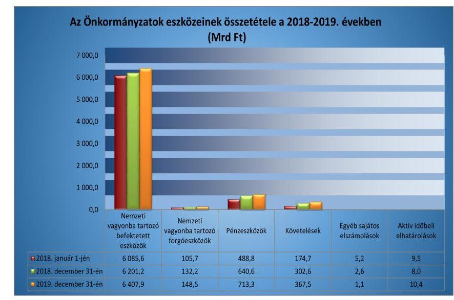

Fornás: Önkormányzatok beszámolói
Az Önkormányzatok vagyon értékesítéséből származó bevételei a 2018. évi 27,6 Mrd Ft-ról 97,3\%-kal növekedtek, a 2019. évre 54,5 Mrd Ft-ra változtak. A vagyon értékesítéséből származó bevételeket felhalmozási kiadásokra, a vagyon pótlására fordították, ezzel szolgálták a nemzeti vagyon megőrzését, növekedését. A beruházások jövőbeni működtetése azonban egyedi kockázatot hordozhat.

A koncesszióba és/vagy vagyonkezelésbe adott eszközök állománya 2018. január 1-jéről a 2018. év végére 2,9 Mrd Ft-tal csökkent, a 2018. év végéről a 2019. év végére 2,4 Mrd Ft növekedett. A koncesszióba, vagyonkezelésbe adott eszközök állománya a 2018. év végén a kötelezettségek állományával közel azonos értéket képviselt (264,5 Mrd Ft), a 2019. év végén 80\%-ot tette ki (266,9 Mrd Ft).

A befektetett eszközök fedezettsége mutató értéke a 2018. évben 97,5 \%, a 2019. évben 96,1\% volt, kismértékben romlott, 1,4 százalékponttal csökkent. A mutató értéke a 2018-2019. években is kedvezőtlenül alakult, 100,0\% alatti értéke jelzi, hogy a saját tőke nem nyújtott fedezetet a nemzeti vagyonba tartozó befektetett eszközökre. A mutató értékének változása kockázatot jelez.
3.2. számú megállapítás

A belső eladósodás nem jelentett kockázatforrást az Önkormányzatok vagyongazdálkodására. A vagyon értékét megőrizték, az elszámolt értékcsökkenést meghaladó vagyonpótlás megtörtént.

A VAGYON értékét megőrizték, a 2018-2019. években növelték, az értékcsökkenések kompenzálásaként szükséges vagyonpótlás megtörtént.

---

14. táblázat

| MUTATÓK ALAKULÁSA |  |  |
| :--: | :--: | :--: |
| Mutatók | 2018 | 2019 |
|  | ev | ev |
| Eszközpótlási mutató (tárgyi eszközök összesen) | $107,3 \%$ | $151,5 \%$ |
| Eszközpótlási mutató (ingatlanok és kapcsolódó vagyoni értékújogokra) | $120,3 \%$ | $194,1 \%$ |

Forrás: Önkormányzatok beszámolói

Az eszközpótlás az ellenőrzött időszak mindkettő évében az elszámolt értékcsökkenést meghaladó mértékben valósult meg. A mutatók alakulását a 14. táblázat tartalmazza. Az Önkormányzatok a vagyonértékesítésből származó bevételek összegét a vagyon pótlására fordították.

Az Önkormányzatok a 2018-2019. években a tárgyi eszközöknél 256,4 Mrd Ft értékcsökkenést számoltak el, míg a beruházások, felújítások aktivált értéke - ettől magasabb összegben realizálódott - 332,4 Mrd Ft volt, a vagyon 76,0 Mrd Ft-tal gyarapodott.

Az ingatlanok és kapcsolódó vagyoni értékű jogok esetében az Önkormányzatok az ellenőrzött időszakban 186,0 Mrd Ft értékcsökkenést számoltak el, a 2018-2019. években a beruházások, felújítások aktivált értéke 290,6 Mrd Ft volt, az ingatlanvagyon értéke 104,5 Mrd Ft-tal növekedett.

Az ingatlanok és kapcsolódó vagyoni értékű jogok eszközpótlási mutatója 17 önkormányzatnál (kettő fővárosi kerület, 11 megyei önkormányzat, négy megyei jogú város önkormányzata) 2018. és a 2019. évben is $85 \%$ alatt volt. Esetükben az eszközpótlások elmaradása kockázatot hordozott a vagyongazdálkodásukra. A 17 önkormányzat a 2018-2019. években az ingatlanok és kapcsolódó vagyoni értékű jogok esetében összesen 26,8 Mrd Ft értékcsökkenést számolt el, az ellenőrzött időszakban a beruházások, felújítások aktivált értéke 14,4 Mrd Ft volt, az ingatlanvagyon 12,4 Mrd Ft-tal csökkent.

Az Önkormányzatok megőrizték a vagyon értékét, a belső eladósodás az Önkormányzatok vagyongazdálkodására nem hordozott kockázatot, a felhalmozási kiadások a beruházásokhoz, felújításokhoz kapcsolódtak, amelyeknek elsődleges célja maradandó eszközök beszerzése, a tevékenység bővítése, modernizálása. Ugyanakkor a tárgyi eszközök állománya után elszámolt értékcsökkenés, a karbantartási kiadás magas fix költséget okozhat.

A beruházási és felújítási kiadások aránya a befektetett eszközökhöz viszonyítva a 2018. évi 3,8\%-ról 1,6 százalékpontos növekedéssel 5,4\%-ra változott a 2019. évben. Az Önkormányzatok a hosszabb átfutási idejű beruházások, felújítások miatt a 2019. év végén 315,2 Mrd Ft befejezetlen beruházás állománnyal rendelkeztek.

A tárgyi eszközök tárgyévben elszámolt értékcsökkenését, az aktivált beruházások, felújítások összegét és a beruházási, felújítási kiadások öszszegét a 7. ábra mutatja.

---

7. ábra
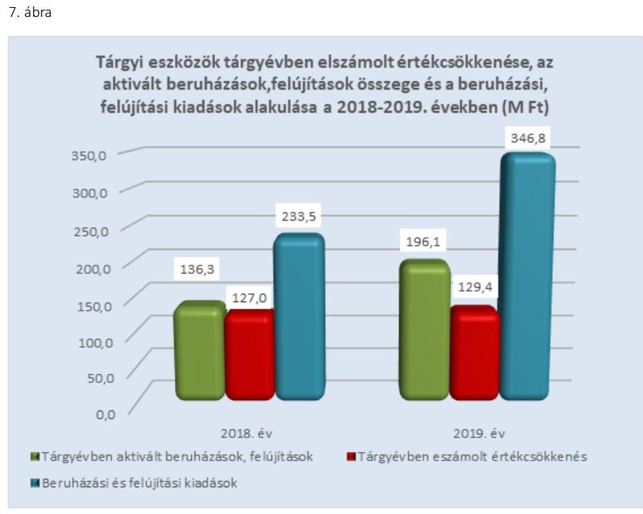

Forrás: Önkormányzatok beszámolói
16 önkormányzatnál a tárgyi eszközök eszközpótlási mutatója (Önkormányzatok 24,2\%-a) 85\% alatt volt az ellenőrzött időszak mindkét évében, a 2018-2019. években elszámolt értékcsökkenés összege 17,5 Mrd Ft-tal haladta meg az ellenőrzött időszakban aktivált beruházások, felújítások értékét. A csökkenés ellentétes az Alaptörvényben foglalt rendelkezéssel, amely rögzíti a nemzeti vagyon megőrzését. A 16 önkormányzatból hét önkormányzat (három fővárosi kerület, kettő megyei önkormányzat, kettő megyei jogú város) esetében a befejezetlen beruházások 2019. év végi állománya kompenzálta az ellenőrzött időszakban elmaradt eszközpótlás összegét, a befejezetlen beruházások 38,8 Mrd Ft-os állománya jelentősen meghaladta az aktivált beruházások, felújítások összegét meghaladóan elszámolt értékcsökkenés 11,5 Mrd Ft-os összegét. A 16 önkormányzatból kilenc önkormányzat (hét megyei önkormányzat, kettő megyei jogú város önkormányzata) esetében a befejezetlen beruházások állománya a 2019. év végén alacsonyabb volt, mint az elmaradt eszközpótlás összege. A kilenc önkormányzatnál az elszámolt értékcsökkenés összesen 6,1 Mrd Ft-tal haladta meg az aktivált beruházások, felújítások összegét, a befejezetlen beruházások 2019. évi záró állománya összesen 5,0 Mrd Ft volt. Az eszközpótlások elmaradása a kilenc önkormányzat (megyei önkormányzat) vagyongazdálkodására kockázatot jelentett és az érintett önkormányzatok számára jövőbeni pénzügyi kötelezettséget keletkeztetett.

---

# MELLÉKLETEK 

## I. SZ. MELLÉKLET: FOGALOMTÁR

adósságszolgálat
belső eladósodás kockázatforrás
beruházás
bevételi kitettség

CLF módszer
egy lakosra jutó felhalmozási kiadás
egy lakosra jutó múködési kiadás
eladósodás kockázatforrás
eladósodási mutató eszközpótlási mutató
felhalmozási bevétel
felhalmozási kiadás
felhalmozási kiadások és finanszírozása kockázatforrás

Az adósság tőkerészének és az esedékes kamat együttes összegének törlesztése. Kockázatforrást jelent, ha az értékcsökkenések kompenzálásaként a szükséges vagyonpótlás nem történt meg, ha romlott az eszközök állaga, mert az rejtett eladósodást jelent.
A tárgyi eszköz beszerzése, létesítése, saját vállalkozásban történő előállítása, a beszerzett tárgyi eszköz üzembe helyezése. A beruházás a meglévő tárgyi eszköz bővítését, rendeltetésének megváltoztatását, átalakítását, élettartamának, teljesítőképességének közvetlen növelését eredményező tevékenység. (Forrás: Számv. tv. ${ }^{3} 3 . \S$ (4) bekezdés 7. pontja)

Olyan függőségi viszony, ahol egy szervezet pénzügyi helyzetét meghatározó bevételek nagysága külső körülmények hatására azonnal és kedvezőtlen irányba változhat.
Az önkormányzatok költségvetése elemzésének módszere, amely a pénzügyi kapacitás (nettó múködési jövedelem) fogalmát helyezi a középpontba. A módszer következetesen elkülöníti a folyó és a felhalmozási költségvetés bevételeit és kiadásait, azok költségvetési egyenlegeit. Bizonyos mértékig a vállalati gazdálkodás logikai elemeit érvényesíti az önkormányzatok pénzügyi, jövedelmi helyzetének vizsgálata során.
Az egy fơre jutó felhalmozási kiadások összege a megyék és a főváros állandó lakosságának számával került meghatározásra.
Az egy állandó lakosra jutó múködési kiadások összege a megyék és a főváros állandó lakosságának számával került meghatározásra
Az államháztartás önkormányzati alrendszerében felhalmozott adósság állam részéről történő kiegyenlítését, illetve átvállalását követően az önkormányzatok kiemelt feladata, egyben felelőssége az adósságállomány újratermelődésének megakadályozása. Kockázatforrást jelent, ha az önkormányzat kötelezettségei emelkednek, a mérlegben az idegen források aránya nő, az adósságkonszolidációt - helyi önkormányzatok adósságának állam által történő átvállalása - követően a gazdálkodás újra eladósodási pályára áll. Az eladósodás a pénzügyi gazdálkodás egyenes következménye, ugyanakkor hatással is van rá a folyó adósságszolgálat teljesítésén keresztül
Az Önkormányzatok forrásainak összetételében az idegen források aránya
A tárgyi eszközállomány elemzéséhez használt mutató, amely megmutatja, hogy az üzembe helyezett beruházások milyen hányadát képezi az elszámolt értékcsökkenésnek. Számításakor tárgyévben üzembe helyezett beruházások, felújítások értékét a tárgyi eszközök tárgyévben elszámolt értékcsökkenéséhez kell viszonyítani. Két egymást követő évben 85\% alatti értékek magas, 100\% feletti értékek alacsony kockázatot jeleznek.
Az önkormányzatok tárgyévi felhalmozási célú költségvetési bevételei.
Az önkormányzatok tárgyévi felhalmozási célú költségvetési kiadásai.
Kockázatforrást jelent az erőn felüli beruházási aktivitás, illetve ha a folyamatban lévő felhalmozási feladatok finanszírozásához szükséges pénzügyi forrás nem áll az önkormányzat rendelkezésére.

---

felújítás

| finanszírozás kockázatforrás | Kockázatforrást jelent, ha az önkormányzat nem rendelkezik megfelelő fedezettel a külső források adósságszolgálatának teljesítéséhez, ami hosszútávon vagyonfeléléshez vagy adósságspirálhoz vezethet. |
| :--: | :--: |
| folyó bevétel | Az önkormányzatok tárgyévi működési célú költségvetési bevételei |
| folyó kiadás | Az önkormányzatok tárgyévi működési célú költségvetési kiadásai |
| folyó költségvetés egyenlege | A folyó költségvetés egyenlege, azaz a működési jövedelem megmutatja, hogy az Önkormányzat éves folyó bevétele fedezetet biztosít-e a kötelező és önként vállalt feladatellátáshoz kapcsolódó éves folyó kiadására. A működési jövedelem negatív értéke pénzügyileg fenntarthatatlan helyzetet jelez. A mutató pozitív értéke megtakarítást mutat, amely forrásul szolgálhat az Önkormányzat fennálló kötelezettségei megfizetéséhez, valamint fejlesztéseihez. |
| garancia-és kezességvállalás kockázatforrás | Kockázatforrást jelent, ha a szerződés kötelezettje a szerződésben vállalt kötelezettségeit nem teljesíti a jogosultnak, mert azokért a kezes köteles helytállni. A garanciaés kezességvállalások függő kötelezettségként kockázatot jelentenek az önkormányzat költségvetésére, ezen keresztül a közfeladatok ellátására. |
| garanciavállalás | Olyan kötelezettségvállalás, ahol a garanciát vállaló valamely jövőbeni esemény bekövetkezésekor, a szerződésben meghatározott feltételek beálltakor a garancia kedvezményezettje számára meghatározott összegig, meghatározott időpontig, felszólításra azonnal fizet. |
| hasznosítás | A nemzeti vagyon birtoklásának, használatának, hasznok szedése jogának bármely a tulajdonjog átruházását nem eredményező - jogcímen történő átengedése, ide nem értve a vagyonkezelésbe adást, valamint a haszonélvezeti jog alapítását. (Forrás: $\mathrm{Nvtv}^{4} .3 . \S$ (1) bekezdés 4. pontja) |
| helyénvalósági ellenőrzés | A helyénvalósági ellenőrzés a megfelelőségi ellenőrzés azon altípusa, amelyet azokban az esetekben kell alkalmazni, amelyekre jogszabályi előírások nem alkalmazhatóak, illetve amennyiben egyes kérdések megítélésénél nyilvánvaló jogszabályi hiányosságok vannak. Helyénvalósági ellenőrzés során a Számvevőszéknek a közszféra szilárd gazdálkodására és a köztisztviselők magatartására vonatkozó általános alapelvek mentén kell az ellenőrzést lefolytatni. |
| kezességvállalás | Szerződésben vállalt olyan kötelezettség, amelyben a kezes arra vállal kötelezettséget, hogy ha a szerződés kötelezettje nem teljesít a kezes maga fog helyette teljesíteni a jogosultnak. (Forrás: Ptk. ${ }^{5}$ 6:416.§). |
| kockázatforrás | A kockázatok kiváltó okait kockázatforrásnak nevezzük. Első lépésben azonosítjuk a nyomon követendő kockázatokat, majd a kockázatos területeket és a kiváltó okokat (kockázatforrásokat). Kockázatként azonosítjuk, ha az önkormányzat hosszú távon nem képes a törvényben meghatározott feladatait ellátni, költségvetése változatlan formában nem fenntartható. A kockázat értékelésének célja annak megállapítása, hogy a pénzügyi gazdálkodás, eladósodás, vagyongazdálkodás kockázati területek milyen mértékben befolyásolják, veszélyeztetik az önkormányzat müködését, a közfeladatok ellátását. A három kockázati terület minősítéséhez összesen 10 kockázatforrást rendelünk. |
| koncesszió | Az állam, illetőleg az önkormányzat (önkormányzati társulás) kizárólagos tulajdonában lévő vagyontárgyak birtoklásának, használatának és hasznosításának, valamint a koncesszió-köteles tevékenységek gyakorlásának jogát, visszterhes szerződéssel, időlegesen úgy engedi át, hogy a jogosultnak részleges piaci monopóliumot biztosít. |

---

koncessziós szerződés
kötelezettség jellegű sajátos elszámolások
kötelezettség jellegű sajátos elszámolások
kötelező közszolgáltatás (az önkormányzati feladatokat érintően)
kötvény
közfeladat
közfeladatok finanszírozási struktúrája kockázatforrás
lényegesség
megfelelőségi ellenőrzés
nettó múködési jövedelem
önkormányzat
önkormányzat rendkívüli támogatása

A koncessziós szerződés olyan visszterhes szerződés, amelyben az állam vagy az önkormányzat a törvényben meghatározott tevékenységek gyakorlásának a jogát időlegesen úgy engedi át, hogy a jogosultnak részleges piaci monopóliumot biztosít.
Kötelezettség jellegű sajátos elszámolások között kell elszámolni a kapott előlegeket, továbbadási célból folyósított támogatásokat, ellátásokat, más szervezetet megillető bevételeket, vagyonkezelésbe vett eszközökkel kapcsolatos visszapótlási kötelezettségeket, nem társadalombiztosítási pénzügyi alapjait terhelő kifizetett ellátások megtérítését, a munkáltató által korengedményes nyugdíjhoz megfizetett hozzájárulást. Az önkormányzat kötelezően vállalt feladatkörébe tartozó egyes - közszolgáltatás útján megvalósuló - közfeladatok ellátása, amelyeket külön jogszabály (törvény, helyi önkormányzati rendelet) határoz meg.
Hosszabb lejáratra szóló, hitelviszonyt megtestesítő kamatozó értékpapír. A kötvényben a kibocsátó arra kötelezi magát, hogy a kötvényben megjelölt pénzösszegnek az előre meghatározott kamatát vagy egyéb jutalékait, továbbá az adott pénzösszeget a kötvény mindenkori tulajdonosának, illetve jogosultjának a megjelölt időben és módon megfizeti.
A közfeladat a jogszabályban meghatározott állami vagy önkormányzati feladat. A közfeladatok ellátása költségvetési szervek alapításával és múködtetésével vagy az azok ellátásához szükséges pénzügyi fedezet e törvényben (Áht.) meghatározott eszközökkel, részben vagy egészben történő biztosításával valósul meg. A közfeladatok ellátásában államháztartáson kívüli szervezet jogszabályban meghatározott rendben közremúködhet. (Forrás: Áht. ${ }^{6}$ 3/A. § (1)-(2) bekezdés, 2015. január 1-jétől)
Kockázatforrást jelent, ha az önkormányzat pénzügyi helyzete jelentős függőséget mutat a külső körülményektől (adóbevételektől, kiegészítő állami támogatásoktól). A közfeladatok finanszírozási struktúrája nem kielégítő, ha a működési bevételek nem fedezik teljes mértékben az ellátott közfeladatokat.
Az a szintű információ vagy adat, ami az ellenőrzés eredményei célzott felhasználóinak döntéseit - az arról történő tudomásszerzést követően - valószínűsíthetően befolyásolja.
A számvevőszéki ellenőrzés azon típusa, amely annak megállapítására irányul, hogy az ellenőrzés tárgyát képező tevékenységek, pénzügyi műveletek, információk és adatok minden lényeges szempontból megfelelnek-e az ellenőrzött szervezetre vonatkozó szabályozásoknak és követelményeknek.
A nettó múködési jövedelem a jövedelemtermelő képességet méri. Megmutatja a múködési bevételekből a múködési kiadások és a hitelek tőketörlesztésének kifizetése után fennmaradó jövedelmet.
A helyi önkormányzat jogi személy. Az önkormányzati feladatok ellátását a képviselőtestület és szervei biztosítják. A képviselőtestület szervei: a polgármester, a főpolgármester, a megyei közgyűlés elnöke, a képviselő-testület bizottságai, a részönkormányzat testülete, a polgármesteri hivatal, a megyei önkormányzati hivatal, a közös önkormányzati hivatal, a jegyző, továbbá a társulás. A képviselő-testület a feladatkörébe tartozó közszolgáltatások ellátására - jogszabályban meghatározottak szerint - költségvetési szervet, a Polgári perrendtartásról szóló 1952. évi III. törvény szerinti gazdálkodó szervezetet (a továbbiakban: gazdálkodó szervezet), nonprofit szervezetet és egyéb szervezetet (a továbbiakban együtt: intézmény) alapíthat, továbbá szerződést köthet természetes és jogi személlyel vagy jogi személyiséggel nem rendelkező szervezettel. (Forrás: Mötv. ${ }^{7}$ 41. § (1), (2), (6) bekezdései)
A 2015-2016. években a megyei önkormányzatok rendkívüli támogatása, a települési önkormányzatok rendkívüli támogatása és a tartósan fizetésképtelen helyzetbe került helyi önkormányzatok adósságrendezésére irányuló hitelfelvétel visszterhes kamattámogatása, a pénzügyi gondnok díja.

---

pénzintézetek felé történő eladósodás kockázatforrás
pénzügyi kapacitás
szállítók felé történő eladósodás kockázatforrás
tárgyévi pénzügyi pozíció
többségi önkormányzati tulajdonban lévő gazdasági társaságok kockázatforrás vagyongazdálkodás
vagyonváltozás kockázatforrás

Kockázatforrásnak tekintettük, ha az önkormányzat (újból) adósságot keletkeztet, ami a kivételektől eltekintve a 2012. évtől kormányengedély-köteles. A pénzintézetekkel szemben fennálló kötelezettségek esetén olyan függőségi viszony jöhet létre, ahol az önkormányzat pénzügyi helyzete olyan külső körülmények hatására változhat, amely kizárólag a bank egyoldalú döntésén múlik.
A pénzügyi kapacitás az adósok hitelfelvételi képességének azon mértéke, ahol még növelni tudják az adósságot anélkül, hogy a fizetőképtelenség elkerülése érdekében csökkenteniük kellene akár az aktuális, akár a jövőben esedékes kiadásaikat.
Kockázatforrást jelent, ha az önkormányzat növeli a dologi, felújítási, beruházási kötelezettségeit (szállítókkal szemben fennálló tartozásait), ami burkolt hitelezésnek minősülhet, és az elismert kötelezettségeit átmenetileg vagy véglegesen nem tudja határidőre teljesíteni.
A folyó költségvetés egyenlege, müködési jövedelem, valamint a felhalmozási költségvetés egyenlege, továbbá a finanszírozási múveletek egyenlege. Kedvezőtlen, ha negatív, illetve a pozíció az előző évhez képest 25\%-ot meghaladóan csökken.
Kockázatforrást jelent, hogy az önkormányzati tulajdonban lévő gazdasági társaságok adósságállományáért a tulajdonos önkormányzatot helytállási kötelezettség terheli.

A nemzeti vagyongazdálkodás feladata a nemzeti vagyon rendeltetésének megfelelő, az állam, az önkormányzat mindenkori teherbíró képességéhez igazodó, elsődlegesen a közfeladatok ellátásához és a mindenkori társadalmi szükségletek kielégítéséhez szükséges, egységes elveken alapuló, átlátható, hatékony és költségtakarékos müködtetése, értékének megőrzése, állagának védelme, értéknövelő használata, hasznosítása, gyarapítása, továbbá az állam vagy a helyi önkormányzat feladatának ellátása szempontjából feleslegessé váló vagyontárgyak elidegenítése. (Forrás: Nvtv. 7. § (2) bekezdése)

Kockázatforrásként értékeltük, ha csökken a nemzeti vagyon, ha az önkormá nyzatok a vagyonértékesítésből származó bevételeket nem beruházásokra, a vagyon pótlására fordítják.

---

Az ellenőrzés tárgya: Az önkormányzati gazdálkodás fenntarthatósága, a törvényben előírt feladatok ellátása, az önkormányzatnál észlelt negatív tendenciák okainak feltárása, amely az ellenőrzési kritériumok alapján kerül értékelésre.
Az ellenőrzési kritériumok meghatározása során első lépésben azonosításra kerültek az önkormányzati gazdálkodás fenntarthatóságának, a törvényben előírt feladatok ellátásának kockázatos területei és a kiváltó okai (kockázatforrások), amelyekhez minden esetben mutatószám került hozzárendelésre. A mutatószámok között a viszonyszámok (relatív mutatószámok) és az abszolút adatok (abszolút mutatószámok) egyaránt megtalálhatóak, amelyekhez a Magyar Államkincstár által szolgáltatott adatállományok (költségvetési beszámolók, időközi költségvetési jelentések, mérlegjelentések adatait) kerültek felhasználásra.
Az egyes kockázati területek és kockázatforrások minősítése „pontozásos módszerrel" a mutatószámok értékelése alapján történt.

- Első lépésben a mutatószámok értékelésére és egy háromelemű skálán történő elhelyezésére kerül sor. Az értékelés (a kategória határok meghatározása) elsődlegesen a mutatószámok közgazdasági értelmezése alapján, az Állami Számvevőszék ellenőrzési tapasztalatait felhasználva történt. Az értékelések alapján egy-egy mutató alacsony besorolás esetén 0 pontot, közepes esetén 1 pontot, magas kockázatjelzés esetén 2 pontot kapott. (PI.: ha a működési kiadások fedezettsége mutató 90\% alatti volt, akkor magas kockázati besorolást, 2 pontot, ha 100\% feletti volt akkor alacsony besorolást, 0 pontot kapott.) A \%-ban kifejezett mutatók kockázati besorolására a pontos (több tizedes jegy) értékek alapján került sor, ugyanakkor az önkormányzati riport a mutatókat egy, illetve esetenként két tizedes számjegyig mutatja be.
- Annak érdekében, hogy a kockázatforrások minősítésénél a lényeges mutatók értéke legyen a meghatározó a jellegzetes mutatókéval szemben, a mutatószámok súlyozására került sor*. A súlyok mértékének megválasztásakor az elsődleges mutatókat középértéknek tekintve 1-es súly mellérendelése** történt. A főmutató súlya az elsődleges mutatók súlyának kétszeresében, míg a másodlagos mutatók súlya az elsődleges mutatók súlyának felében került meghatározásra. (PI.: a kockázatforrás minősítéséhez a működési kiadások fedezettségét főmutatóként vették figyelembe, ezért 2-es súlyt rendeltek hozzá. Így ha a mutató kockázati besorolása magas volt, a magas kockázati besoroláshoz rendelt 2 pontot szorozták a főmutatóhoz rendelt 2-es súlyszámmal és az elért pontszám 4, míg alacsony besorolás esetén a besoroláshoz rendelt 0 pontot szorozva a főmutatóhoz rendelt 2-es súlyszámmal elért pontszám 0 volt.)
- Ezt követően került sor az önkormányzati gazdálkodás fenntarthatóságának, a törvényben előírt feladatok ellátásának kockázatához rendelt kockázati területek és kockázatforrások értékelési ponthatárainak meghatározására oly módon, hogy kockázatforrásonként a mutatószámok súlyozott értékelésével elérhető összes pontszám három egyenlő részre (alacsony, közepes, magas) osztása történt meg. (PI.: A közfeladatok finanszírozási struktúrája kockázatforrás 1 db főmutató, 2 db elsődleges mutató és további 2 db másodlagos mutató alakulása alapján került értékelésre. A mutatók magas kockázati besorolása esetén - a súlyozást követően - elérhető legmagasabb pontszám 10 volt. Ezt három egyenlő részre osztva kerültek meghatározásra a közfeladatok finanszírozási struktúrájának értékelési ponthatárai, amely 0-3,32 pontig alacsony, 3,33-6,66 pontig közepes, 6,67-10 pont között magas kockázati minősítést kapott.)
- Az egyes kockázatforrások értékelésekor a kockázatforráshoz rendelt mutatószámok - súlyozással kapott - értékeinek összesítése és a kialakított értékelési ponthatárok szerinti minősítése történt meg. (PI.: egy önkormányzat minősítésekor a közfeladatok finanszírozási struktúrája kockázatforráshoz

[^0]
[^0]:    * A súlyozás kifejezi, hogy az alkalmazott mutatószámok egymáshoz képest milyen mértékben járulnak hozzá az adott kockázatforrás értékeléséhez.
    ** Égy esetben a banki kötelessettségállomány mérlegfölösszeghez mért nagysága mutatónál a kockázatforrás kiegyensúlyozottabb megítélése érdekében az 1-es súlyozás helyett 1,5 -ás súlyozás került alkalmazásra.

---

rendelt 5 db mutató - fentiekben bemutatott - értékelésével elért összes pontszám 7 volt, akkor a kockázatforrás a hármas skálán a 6,67-10 pont közé került, így magas minősítést kapott.)

- Az egyes kockázati területek minősítése hasonlóan történt. Az egyes kockázati területeket meghatározó kockázatforrások pontjainak aggregálását követően, a kockázati területen elérhető összes pont három egyenlő részre osztásával kialakított skálán történő értékelésére került sor. Ha azonban a kockázatforrások közül legalább egy magas kockázati besorolást ért el, akkor a pontozás szerinti értékeléstől eltérően, a kockázatiterület besorolása közepes kockázati minősítésűre módosult.

Az ellenőrzés tárgyának, az önkormányzati gazdálkodás fenntarthatóságának, a törvényben előírt feladatok ellátásának értékelése:
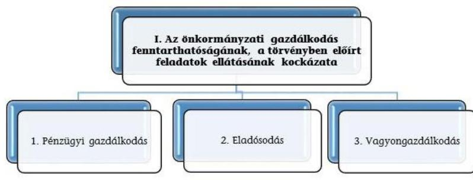

A három kockázatiterület együttes értékelése alapján az alábbi mátrix segítségével kerül meghatározásra az önkormányzati gazdálkodás fenntarthatóságának, a törvényben előírt feladatok ellátásának értékelése a következők szerint:

| Az önkormányzati gazdálkodás fenntarthatóságának, a törvényben elöírt feladatok ellátásának kockázata | Alacsony 0 | Közepes 1 |  |  |  |  |  | Magas 2 |  |  |  |
| :--: | :--: | :--: | :--: | :--: | :--: | :--: | :--: | :--: | :--: | :--: | :--: |
| 1. Pénzingri gazdálkodás |  | 2 alacsony 1   közepes | 1 alacsony 2   közepes | 2 alacsony   1 magas | 1 alacsony   1 közepes 1   magas | 2 közepes | 1 alacsony   2 magas | 1 közepes   1 magas | 1 közepes   2 magas | 4 magas |

---

II. SZ. MELLÉKLET: AZ ESZKÖZÖK ÉS FORRÁSOK ALAKULÁSA KIEMELT MÉRLEGSORONKÉNT A 2018-2019. ÉVEKBEN (E FT)

Az Önkormányzatok 2018-2019. évi mérlegeinek adatai

| Megnevezés | 2018 január 1. | 2018 december 31. | 2019 december 31. |
| :--: | :--: | :--: | :--: |
| NEMZETI VAGYONBA TARTOZÓ BEFEKTETETT ESZKÖZÖK | 6085604398 | 6201195500 | 6407916880 |
| NEMZETI VAGYONBA TARTOZÓ FORGÓESZKÖZÖK | 105736523 | 132151231 | 148476109 |
| PÉNZESZKÖZÖK | 488820546 | 640601617 | 713293115 |
| KÖVETELÉSEK | 174726244 | 302601260 | 367470169 |
| EGYÉB SAJÁTOS ESZKÖZOLDALI ELSZÁMOLÁSOK | 5228269 | 2617817 | 1144866 |
| AKTíV IDŐBELI ELHATÁROLÁSOK | 9543270 | 8038993 | 10417801 |
| ESZKÖZÖK ÖSSZESEN | 6869659250 | 7287206418 | 7648718940 |
| SAJÁT TÖKE | 6022287371 | 6044896841 | 6157033333 |
| KÖTELEZETTSÉGEK | 188230305 | 254054599 | 334049977 |
| EGYÉB SAJÁTOS FORRÁSOLDALI ELSZÁMOLÁSOK | 0 | 0 | 0 |
| PASSZíV IDŐBELI ELHATÁROLÁSOK | 659141574 | 988254978 | 1157635630 |
| FORRÁSOK ÖSSZESEN | 6869659250 | 7287206418 | 7648718940 |

---

|   | 2018 | 2019 | Változás [\%]
(2019-2018)/2018  |
| --- | --- | --- | --- |
|  1. FOLYŐ KÖLTSÉGVETÉS |  |  |   |
|  1.1.1./A Saját müködési bevételek tulajdonosi bevételek nélkül | 752049117 | 809616014 | 7,65\%  |
|  1.1.2. Költségvetési támogatások a müködőképesség megőrzését szolgáló kiegészítő támogatások nélkül | 194935388 | 205967213 | 5,66\%  |
|  1.1.3. Átengedett bevételek | 12463756 | 13207420 | 5,97\%  |
|  1.1.4. Államháztartáson belülről kapott támogatások | 62099559 | 67004550 | 7,90\%  |
|  1.1.5. EU-tól és külföldről kapott bevételek | 1132908 | 1747352 | 54,24\%  |
|  1.1.6. Államháztartáson kívülről kapott bevételek | 3561450 | 2294280 | $-35,58 \%$  |
|  1.1.7. Hozam- és kamatbevételek | 9316113 | 8267250 | $-11,26 \%$  |
|  1.1.8. Kölcsönök visszatérülése, igénybevétele | 1880069 | 2283613 | 21,46\%  |
|  1.1.9. A müködőképesség megőrzését szolgáló kiegészítő támogatások | 846991 | 944890 | 11,56\%  |
|  1.1. Folyó bevételek (1.1.1.+1.1.2.+1.1.3.+1.1.4.+1.1.5.+1.1.6.+1.1.7.+1.1.8.+1.1.9.) | 1038285353 | 1111332582 | 7,04\%  |
|  1.2.1. Müködési kiadások kamatkiadások nélkül | 665438494 | 757530824 | 13,84\%  |
|  1.2.2. Államháztartáson belülre átadott pénzeszközök | 16086367 | 17602591 | 9,43\%  |
|  1.2.3. Transzferkiadások | 224715894 | 238353788 | 6,07\%  |
|  1.2.3.1. vállalkozásoknak | 192503549 | 199200944 | 3,48\%  |
|  1.2.3.2. EU-nak, illetve külföldre | 55527 | 335423 | 504,07\%  |
|  1.2.3.3. magánszemélyeknek | 8621523 | 9944669 | 15,35\%  |
|  1.2.3.4. non-profit szervezeteknek | 23535296 | 28872752 | 22,68\%  |
|  1.2.4. Kamatkiadások | 2603852 | 3547233 | 36,23\%  |
|  1.2.5. Kölcsönök nyújtása, törlesztése | 2202313 | 2976351 | 35,15\%  |
|  1.2. Folyó kiadások (1.2.1.+1.2.2.+1.2.3.+1.2.4.+1.2.5.) | 911046920 | 1020010787 | 11,96\%  |
|  1.3. Folyó költségvetés egyenlege, müködési jövedelem (1.1. - 1.2.) | 127238433 | 91321796 | $-28,23 \%$  |
|  2. FELHALMOZÁSI KÖLTSÉGVETÉS |  |  |   |
|  2.1.1. Saját tőkebevételek | 29089790 | 56063796 | 92,73\%  |
|  2.1.2. Költségvetési támogatások | 37264697 | 43211751 | 15,96\%  |
|  2.1.3. Államháztartáson belülről kapott támogatások | 235717612 | 211760727 | $-10,16 \%$  |
|  2.1.4. EU-tól és külföldről kapott támogatások | 8671 | 393138 | 4434,00\%  |
|  2.1.5. Államháztartáson kívülről kapott bevételek | 4592488 | 3535400 | $-23,02 \%$  |
|  2.1.7. Kölcsönök visszatérülése, igénybevétele | 11575867 | 5861011 | $-49,37 \%$  |
|  2.1. Felhalmozási bevételek (2.1.1.+2.1.2+2.1.3+2.1.4.+2.1.5.+2.1.6.+2.1.7.) | 318249125 | 320825824 | 0,81\%  |
|  2.2.1. Saját beruházási kiadás áfával | 149759954 | 237937841 | 58,88\%  |
|  2.2.2. Saját felújítási kiadás áfával | 77129180 | 101361701 | 31,42\%  |
|  2.2.3. Államháztartáson belülre átadott pénzeszközök | 12673300 | 20213593 | 59,50\%  |
|  2.2.4. EU-nak és külföldnek adott pénzeszközök | 323749 | 118635 | $-63,36 \%$  |
|  2.2.5. Államháztartáson kívülre adott pénzeszközök | 50466189 | 21600183 | $-57,20 \%$  |
|  2.2.6. Befektetéssel kapcsolatos kiadások | 6602310 | 7493922 | 13,50\%  |
|  2.2.8. Kölcsönök nyújtása, törlesztése | 3484346 | 3814135 | 9,46\%  |
|  2.2. Felhalmozási kiadások (2.2.1.+2.2.2.+2.2.3.+2.2.4.+2.2.5.+2.2.6.+2.2.7.+2.2.8.) | 300439027 | 392540010 | 30,66\%  |
|  2.3. Felhalmozási költségvetés egyenlege (2.1. - 2.2.) | 17810098 | 71714186 | $-502,66 \%$  |
|  3. FINANSZÍROZÁSI MÜVELETEK NÉLKÜLI (GFS) POZÍCIÓ (1.3.+2.3.) | 145048531 | 19607610 | $-86,48 \%$  |
|  4. FINANSZÍROZÁSI MÜVELETEK |  |  |   |
|  4.1. Hitelfelvétel | 72767566 | 137542654 | 89,02\%  |
|  4.2. Hiteltörlesztés | 11706318 | 77570254 | 562,64\%  |
|  4.3. Forgatási és befektetési célú értékpapírok kibocsátása |  |  |   |
|  4.4. Forgatási és befektetési célú értékpapírok beváltása | 188880 | 236100 | 25,00\%  |
|  4.5. Forgatási és befektetési célú értékpapírok értékesítése | 295043827 | 159903674 | $-45,80 \%$  |
|  4.6. Forgatási és befektetési célú értékpapírok vásárlása | 334349845 | 170752162 | $-48,93 \%$  |
|  4.7. Egyéb finanszírozási bevételek | 127701658 | 159592195 | 24,97\%  |
|  4.8. Egyéb finanszírozási kiadások | 136676004 | 159495514 | 16,70\%  |
|  4.9 Finanszírozási műveletek egyenlege(4.1.-4.2.+4.3.-4.4.+4.5.-4.6.+4.7.-4.8.) | 12592004 | 48984492 | 289,01\%  |
|  5. TÁRGYÉVI PÉNZÜGYI POZÍCIÓ (1.3.+ 2.3.+4.9.) | 157640535 | 68592101 | $-56,49 \%$  |
|  6. NETTÓ MÜKÖDÉSI JÖVEDELEM (működési jövedelem (1.3.) - tőketörlesztés $(4.2+4.4))$ | 115343235 | 13515442 | $-88,28 \%$  |

---

- V. SZ. MELLÉKLET: AZ ÖNKORMÁNYZATOK 2018-2019. ÉVI FŐBB MUTATÓINAK ÉS KOCKÁZATI TERÜLETEINEK Ö SSZEFOGLALÓ ÉRTÉKELÉSE

|  Összegző Jelentés |  |  |  |   |
| --- | --- | --- | --- | --- |
|  PIR szám: |  | 66 ÖNKORMÁNYZAT |  |   |
|  Azonosított kockázatok
(értékelése: Magas=M / Közepes=K / Alacsony=A) | 2018 | 2018 | 2019 | 2019  |
|  I. Az önkormányzati gazdálkodás fenntarthatóságának, a törvényben elöírt feladatok ellátásának kockázata |  |  |  |   |
|  1. Pénzügyi gazdálkodás | A | 3,0 | K | 7,0  |
|  1.1 Közfeladatok finanszírozási struktúrája | A | 1,0 | A | 1,0  |
|  1.2 Felhalmozási kiadások és finanszírozása | A | 0,0 | M | 4,0  |
|  1.3 Finanszírozás | A | 2,0 | A | 2,0  |
|  2. Eladósodás | K | 15,5 | K | 22,5  |
|  2.1 Adósságkonszolidációt követő időszakban bekövetkező eladósodás | K | 4,0 | M | 8,0  |
|  2.2 Szállítók felé történő eladósodás | K | 3,5 | K | 6,5  |
|  2.3 Pénzintézet felé történő eladósodás | K | 6,0 | K | 6,0  |
|  2.4 Garancia- és kezességvállalás | K | 2,0 | K | 2,0  |
|  3. Vagyongazdálkodás | A | 1,0 | A | 2,0  |
|  3.1 Vagyonváltozás | A | 1,0 | K | 2,0  |
|  3.2 Belső eladósodás | A | 0,0 | A | 0,0  |

---

# VI. SZ. MELÍÉKLET: AZ ÖNKORMÁNYZATOK 2018-2019. ÉVI FŐBB MUTATÓINAK ÉS KOCKÁZATI TERÜLETEINEK RÉSZLETES ÉRTÉKELÉSÉ (E FT)

|  PIR SZÁM: | 66 ÖNKORMÁNYZAT |  |  |   |
| --- | --- | --- | --- | --- |
|  Kockázatok és alapinttermációk*** | Minutal értéke 2018-12-31 | Kockázati besorolás 2018-12-31 | Minutal értéke 2019-12-31 | Kockázati besorolás 2019-12-31  |
|  1. Az önkormányzati gazdálkodás fenntarthatóságának, a törvényben elölít feladatok ellátásának kockázata | - |  | - |   |
|  1. Pénzügyi gazdálkodás | - | A | - | K  |
|  1.1 Közfeladatok finanszírozási struktúrája | - | A | - | A  |
|  Működési kiadások fedezettsége | 113,67% | A | 106,95% | A  |
|  Önkormányzati repítésről támogatás aránya | 0,08% | K | 0,09% | K  |
|  Adóbevétellek működési bevételeken betűi aránya | 54,08% | - | 54,07% | -  |
|  Adóbevétellek működési bevételeken betűi arányának változás'a (százalékpontban) | 0,59 | A | 0,89 | A  |
|  Adóbevétellek állománya (e Ft) | 561 486 085,66 | - | 610 911 279,99 | -  |
|  Adóbevétellek állományának változás'a | 6,98% | A | 6,80% | A  |
|  Helvi sportlátó adóbevétellek állománya (e Ft) | 439 907 144,15 | - | 465 574 904,09 | -  |
|  Helvi sportlátó adóbevétellek állományának változás'a | 10,63% | A | 10,38% | A  |
|  1.2 Felhalmozás kiadások és finanszírozása | - | A | - | M  |
|  Felhalmozás kiadások fedezettsége | 105,93% | A | 81,73% | M  |
|  Felhalmozás kiadások aránya | 24,80% | - | 27,79% | -  |
|  1.3 Finanszírozás | - | A | - | A  |
|  Töröszitás fedezettségének aránya | 9,35% | A | 85,00% | A  |
|  Hettő működés elvédelem változása | 7,26% | A | 98,29% | K  |
|  2. Eledösodás | - | K | - | K  |
|  2.1 Adószaplanszoldációt követő időszakban bekövetkező eladósodás | - | K | - | M  |
|  Eladósodási mutató | 4,29% | A | 4,31% | M  |
|  Eladósodási mutató változása (százalékpontban) | 0,75 | A | 0,88 | M  |
|  Tárgyási pénzügyi pozíció (e Ft) | 157 540 534,50 | - | 88 592 101,39 | -  |
|  Tárgyási pénzügyi pozíció változása | 67,54% | A | 59,49% | M  |
|  2.2 Szállítók felé történő eladósodás | - | K | - | K  |
|  Kötelesettségek dologi, felújítási beruházási kiadásokra állománya (E Ft) | 50 488 041,74 | - | 55 747 067,48 | -  |
|  Kötelesettségek dologi, felújítási beruházási kiadásokra állománya változása | -4,66% | A | 10,42% | K  |
|  90 napon túli lejárt kötelezettségek állománya (E Ft) | 227 7245,80 | - | 866833,97 | -  |
|  90 napon túli lejárt kötelezettségek állományá-nak aránya (az összes köt. állományból) | 0,90% | M | 0,26% | M  |
|  Lejárt kötelezettségek dologi, felújítási beruházási kiadásokra (E Ft) | 4 662 171,9 | - | 6 725 313,1 | -  |
|  Lejárt dologi, felújítási beruházási kiadásokkal kapcsolatos kötelezettségek állomány aránya | 9,23% | K | 12,06% | K  |
|  Lejárt dologi, felújítási beruházási kiadásokkal kapcsolatos kötelezettségek állomány változása | -16,15% | A | 44,25% | M  |
|  Lejárt dologi kiadásokkal kapcsolatos kötelezettségek állomány aránya a dologi kiadások egy havi átlagához viszonyítva | 9,32% | K | 6,32% | K  |
|  2.3 Pénzintézet felé történő eladósodás | - | K | - | K  |
|  Banki kötelezettségek (rövid és hosszúsjáratú fellelek és kötvénykibocsátásból származó tartozások) állománya (E Ft) | 119 805 692,4 | - | 180 990 984,7 | -  |
|  Banki kötelezettségállomány mérlegfőösszeghez mért nagysága | 1,64% | A | 2,37% | A  |
|  Banki kötelezettségek (rövid és hosszúsjáratú fellelek és kötvénykibocsátásból származó tartozások) állományának változása | 103,05% | M | 51,07% | M  |
|  Tárgyévben kormányzati jóváhagyással megkötött naptári éven túli futamidejű adósságot keletkeztető ... | 4 | M | 6 | M  |
|  ...ügyletek darabszáma |  |  |  |   |
|  ... ügyletek értéke (E Ft) | 47 365 293,50 | K | 10 093 836,40 | A  |
|  ... ügyletek értékének változása | - | - | 78,70% | -  |
|  Tárgyévben megkötött, kormányzati hozzájáruláshoz nem kötött, naptári éven túli futamidejű adósságot keletkeztető ... | 8 | M | 5 | M  |
|  ... ügyletek darabszáma |  |  |  |   |
|  ... ügyletek értéke (E Ft) | 420 133,15 | A | 390 000,00 | A  |
|  ... ügyletek értékének változása | - | - | 7,20% | -  |
|  2.4 Garancia- és kezességvállalás | - | K | - | K  |
|  Garancia és kezességvállalások állománya (E Ft) | 11 972 527,00 | K | 12 745 596,40 | K  |
|  3. Vagyongasdálkodás | - | A | - | A  |
|  3.1 Vagyonváltozás | - | A | - | K  |
|  Befektetett eszközök fedezettsége | 57,48% | K | 99,08% | K  |
|  Ingatlanok és kapcsolódó vagyoni értékű jogok állományának változása (E Ft) | 44 322 367,35 | A | 111 847 187,96 | A  |
|  Korvasszolba, vagyonkezelésbe adott eszközök állományának változása (E Ft) | -2 910 355,54 | A | 2 358 564,67 | M  |
|  Vagyonértékesítési bevétel (E Ft) | 27 839 201,04 | - | 54 519 060,56 | -  |
|  Vagyonértékesítési bevétel változása | 19,00% | - | 97,25% | -  |
|  Beruházási és felújítási kiadás áfá-val (E Ft) | 233 491 443,40 | - | 345 793 463,75 | -  |
|  Beruházási és felújítási kiadás áfá-val változása | 16,60% | - | 48,53% | -  |
|  3.2 Belső eladósodás | - | A | - | A  |
|  Eszközpolitási mutató (tárgyi eszközök összesen) | 107,24% | A | 151,30% | A  |
|  Eszközpolitási mutató (ingatlanok és kapcsolódó vagyoni értékű jogokra) | 120,31% | A | 194,07% | A  |
|  Beruházási és felújítási kiadások befektetett eszközökhöz viszonyított aránya | 3,77% | - | 5,41% | -  |

---

|  Sorszám | Megnevezés | Sorszám | Megnevezés  |
| --- | --- | --- | --- |
|  1. | BÁCS-KISKUN MEGYEI ÖNKORMÁNYZAT | 34. | SOPRON MEGYEI JOGÚ VÁROSÖNKORMÁNYZATA  |
|  2. | BARANYA MEGYEI ÖNKORMÁNYZAT | 35. | SZEGED MEGYEI JOGÚ VÁROS ÖNKORMÁNYZATA  |
|  3. | BÉKÉS MEGYEI ÖNKORMÁNYZAT | 36. | SZÉKESFEHÉRVÁR MEGYEI JOGÚ VÁROS ÖNKOR-
MÁNYZATA  |
|  4. | BORSOD-ABAÚJ-ZEMPLÉN MEGYEI ÖNKOR-
MÁNYZAT | 37. | SZEKSZÁRD MEGYEI JOGÚ VÁROS ÖNKORMÁNY-
ZATA  |
|  5. | CSONGRÁD MEGYEI ÖNKORMÁNYZAT | 38. | SZOLNOK MEGYEI JOGÚ VÁROS ÖNKORMÁNY-
ZATA  |
|  6. | FEJÉR MEGYEI ÖNKORMÁNYZAT | 39. | SZOMBATHELY MEGYEI JOGÚ VÁROS ÖNKOR-
MÁNYZATA  |
|  7. | GYŐR-MOSON-SOPRON MEGYEI ÖNKORMÁNY-
ZAT | 40. | TATABÁNYA MEGYEI JOGÚ VÁROS ÖNKORMÁNY-
ZATA  |
|  8. | HAJDÚ-BIHAR MEGYEI ÖNKORMÁNYZAT | 41. | VESZPRÉM MEGYEI JOGÚ VÁROS ÖNKORMÁNY-
ZATA  |
|  9. | HEVES MEGYEI ÖNKORMÁNYZAT | 42. | ZALAEGERSZEG MEGYEI JOGÚ VÁROS ÖNKOR-
MÁNYZATA  |
|  10. | JÁSZ-NAGYKUN-SZOLNOK MEGYEI ÖNKOR-
MÁNYZAT | 43. | BUDAPEST FŐVÁROS ÖNKORMÁNYZATA  |
|  11. | KOMÁROM-ESZTERGOM MEGYEI ÖNKOR-
MÁNYZAT | 44. | BUDAPEST I. KERÜLET BUDAVÁRI ÖNKORMÁNY-
ZAT  |
|  12. | NÓGRÁD MEGYE ÖNKORMÁNYZATA | 45. | BUDAPEST FŐVÁROS II. KERÜLETI ÖNKORMÁNY-
ZAT  |
|  13. | PEST MEGYEI ÖNKORMÁNYZAT | 46. | BUDAPEST FŐVÁROS III. KERÜLET, ÓBUDA-BÉKÁS-
MEGYER ÖNKORMÁNYZAT  |
|  14. | SOMOGY MEGYEI ÖNKORMÁNYZAT | 47. | BUDAPEST FŐVÁROS IV.KERÜLET ÚJPEST ÖNKOR-
MÁNYZATA  |
|  15. | SZABOLCS-SZATMÁR-BEREG MEGYEI ÖNKOR-
MÁNYZAT | 48. | BELVÁROS -LIPÓTVÁROS BUDAPEST FŐVÁROS V.
KER. ÖNKORMÁNYZATA  |
|  16. | TOLNA MEGYEI ÖNKORMÁNYZAT | 49. | BUDAPEST FŐVÁROS VI. KERÜLET TERÉZVÁROS
ÖNKORMÁNYZATA  |
|  17. | VAS MEGYEI ÖNKORMÁNYZAT | 50. | BUDAPEST FŐVÁROS VII. KER. ERZSÉBETVÁROS
ÖNKORMÁNYZATA  |
|  18. | VESZPRÉM MEGYEI ÖNKORMÁNYZAT | 51. | BUDAPEST FŐVÁROS VIII. KERÜLET JÓZSEFVÁROSI
ÖNKORMÁNYZAT  |
|  19. | ZALA MEGYEI ÖNKORMÁNYZAT | 52. | BUDAPEST FŐVÁROS IX. KERÜLET FERENCVÁROS
ÖNKORMÁNYZATA  |
|  20. | BÉKÉSCSABA MEGYEI JOGÚ VÁROS ÖNKOR-
MÁNYZATA | 53. | BUDAPEST FŐVÁROS X. KERÜLET KÖBÁNYAI ÖN-
KORMÁNYZAT  |
|  21. | DEBRECEN MEGYEI JOGÚ VÁROS ÖNKORMÁNY-
ZATA | 54. | BUDAPEST FŐVÁROS XI. KERÜLET ÚJBUDA ÖN-
KORMÁNYZATA  |
|  22. | DUNAÚJVÁROS MEGYEI JOGÚ VÁROS ÖNKOR-
MÁNYZATA | 55. | BUDAPEST FŐVÁROS XII. KERÜLET HEGYVIDÉKI
ÖNKORMÁNYZAT  |
|  23. | EGER MEGYEI JOGÚ VÁROS ÖNKORMÁNYZATA | 56. | BUDAPEST FŐVÁROS XIII. KERÜLETI ÖNKORMÁNY-
ZAT  |
|  24. | ÉRD MEGYEI JOGÚ VÁROS ÖNKORMÁNYZATA | 57. | BUDAPEST FŐVÁROS XIV. KERÜLET ZUGLÓ ÖN-
KORMÁNYZATA  |

---

|  Sorszám | Megnevezés | Sorszám | Megnevezés  |
| --- | --- | --- | --- |
|  25. | GYŐR MEGYEI JOGÚ VÁROS ÖNKORMÁNYZATA | 58. | BUDAPEST FŐVÁROS XV. KERÜLET RÁKOSPALOTA, PESTÚJHELY, ÚJPALOTA ÖNKORMÁNYZATA  |
|  26. | HÓDMEZŐVÁSÁRHELY MEGYEI JOGÚ VÁROS ÖNKORMÁNYZATA | 59. | BUDAPEST FŐVÁROS XVI. KERÜLETI ÖNKORMÁNYZAT  |
|  27. | KAPOSVÁR MEGYEI JOGÚ VÁROS ÖNKORMÁNYZATA | 60. | BUDAPEST FŐVÁROS XVII. KERÜLET RÁKOSMENTE ÖNKORMÁNYZATA  |
|  28. | KECSKEMÉT MEGYEI JOGÚ VÁROS ÖNKORMÁNYZATA | 61. | BUDAPEST FŐVÁROS XVIII. KERÜLET PESTSZENTLŐRINC-PESTSZENTIMRE ÖNKORMÁNYZATA  |
|  29. | MISKOLC MEGYEI JOGÚ VÁROS ÖNKORMÁNYZATA | 62. | BUDAPEST FŐVÁROS XIX. KERÜLET KISPEST ÖNKORMÁNYZATA  |
|  30. | NAGYKANIZSA MEGYEI JOGÚ VÁROS ÖNKORMÁNYZATA | 63. | BUDAPEST FŐVÁROS XX. KERÜLET PESTERZSÉBET ÖNKORMÁNYZATA  |
|  31. | NYÍREGYHÁZA MEGYEI JOGÚ VÁROS ÖNKORMÁNYZATA | 64. | BUDAPEST XXI. KERÜLET CSEPEL ÖNKORMÁNYZATA  |
|  32. | PÉCS MEGYEI JOGÚ VÁROS ÖNKORMÁNYZATA | 65. | BUDAFOK-TÉTÉNY BUDAPEST XXII. KERÜLET ÖNKORMÁNYZATA  |
|  33. | SALGÓTARJÁN MEGYEI JOGÚ VÁROS ÖNKORMÁNYZATA | 66. | BUDAPEST FŐVÁROS XXIII. KERÜLET SOROKSÁR ÖNKORMÁNYZATA  |

---

# FÜGGELÉK: ÉSZREVÉTELEK 

A jelentéstervezetet a Számvevőszék 15 napos észrevételezésre megküldte az ellenőrzött szervezetek vezetőinek az ÁSZ tv. 29. §̊ (1) bekezdése előírásának megfelelően.

Baranya Megyei Önkormányzat elnöke, Budafok-Tétény Budapest XXII. Kerület Önkormányzata polgármestere, Budapest Főváros IV. Kerület Újpest Önkormányzata polgármestere, Budapest Főváros XIII. Kerületi Önkormányzat polgármestere, Budapest Főváros XXIII. Kerület Soroksár Önkormányzata polgármestere és Hajdú-Bihar Megyei Önkormányzat elnöke írásban jelezték, hogy a jelentéstervezet megállapításaira észrevételt nem tesznek.

[^0]
[^0]:    ${ }^{7}$ 29. § (1) Az Állami Számvevőszék az ellenőrzési megállapításait megküldi az ellenőrzött szervezet vezetőjének vagy az általa megbízott személynek, és annak, akinek személyes felelősségét állapította meg.
    (2) Az ellenőrzött szervezet vezetője és a felelősként megjelölt személy az ellenőrzés megállapításaira tizenöt napon belül írásban észrevételt tehet.
    (3) Az Állami Számvevőszék az észrevételre a beérkezésétől számított harminc napon belül írásban válaszol. A figyelembe nem vett észrevételeket köteles a jelentésben feltüntetni, és megindokolni, hogy azokat miért nem fogadta el.

---

.

---

# RÖVIDÍTÉSEK JEGYZÉKE 

${ }^{1}$ Önkormányzatok
${ }^{2}$ ÁSZ SZMSZ
${ }^{3}$ Számv.tv.
${ }^{4}$ Nvtv.
${ }^{5}$ Ptk.
${ }^{6}$ Áht.
${ }^{7}$ Mötv.
a megyei önkormányzatok, a megyei jogú városok önkormányzatai, a fővárosi és a fővárosi kerületek önkormányzatai, összesen 66 darab önkormányzat az Állami Számvevőszék elnökének 3/2019. (XII.23.) ÁSZ utasítása az Állami Számvevőszék Szervezeti és Müködési Szabályzatáról
2000. évi C. törvény a számvitelről (hatályos: 2001. január 1-jétől)
2011. évi CXCVI. törvénye nemzeti vagyonról
2013. évi V. törvény a Polgári Törvénykönyvről
2011. évi CXCV. törvény az államháztartásról
2011. évi CLXXXIX. törvény Magyarország helyi önkormányzatairól (hatályos:
2012. január 1-jétől)

---

# ASZ 

1052 Budapest, Apáczai Cs. J. u. 10. | 1364 Budapest 4. Pf. 54 TEL: +36 14849100
email: szamvevoszek@asz.hu
web: www.asz.hu | www.aszhirportal.hu