ÁLLAMI SZÁMVEVŐSZÉK

# JELENTÉS 

## Nem állami humánszolgáltatók ellenőrzése

A köznevelési és szociális humánszolgáltatást nyújtó intézmények, szolgáltatók államháztartáson kívüli fenntartói központi költségvetésből kapott támogatásai felhasználásának ellenőrzése - 10 Alapítvány, 8 Egyesület szociális és köznevelési intézményfenntartó
2021.

21028
www.asz.hu

---

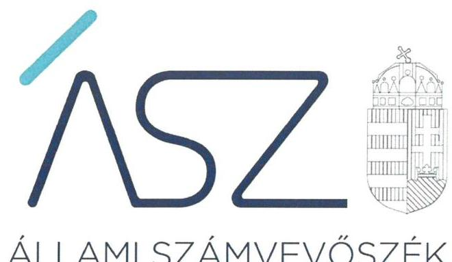

ÁLLAMI SZÁMVEVŐSZÉK

# JELENTÉS 

## Nem állami humánszolgáltatók ellenőrzése

A köznevelési és szociális humánszolgáltatást nyújtó intézmények, szolgáltatók államháztartáson kívüli fenntartói központi költségvetésből kapott támogatásai felhasználásának ellenőrzése - 10 Alapítvány, 8 Egyesület szociális és köznevelési intézményfenntartó
2021. 02. hó 16. nap

21028
www.asz.hu

---

Jelentéseink az Országgyúlés számítógépes hálózatán és az interneten a www.asz.hu címen is olvashatóak.

## AZ ELLENŐRZÉST FELÜGYELTE:

MAKKAI MÁRIA felügyeleti vezető
TÓTH MARIANNA felügyeleti vezető

## AZ ELLENŐRZÉST VEZETTE ÉS A VÉGREHAJTÁSÁÉRT FELELŐS:

DR. DOMOKOS MAGDOLNA ellenőrzésvezető
DORMÁN ISTVÁN ellenőrzésvezető
DR. GÁL NÓRA ellenőrzésvezető
DR. GYŐRI GABRIELLA MÁRTA ellenőrzésvezető
KISS ISTVÁN GYŐRGY ellenőrzésvezető
KISTÓTH KRISZTINA ellenőrzésvezető
LACZI HEDVIG ellenőrzésvezető
MOLNÁR ZSUZSANNA ellenőrzésvezető
SALAMIN VIKTOR ellenőrzésvezető
DR. TÓTH VIKTÓRIA ellenőrzésvezető
VALASTYÁNNÉ DR. VÍZHÁNYÓ JÚLIA ellenőrzésvezető
VERTKOVCZI MÁRIA ellenőrzésvezető

A PROGRAM ÖSSZEÁLLÍTÁSÁÉRT FELELŐS:
FEKETE-NAGY ANDRÁS GÁBOR felelősvezető

IKTATÓSZÁM: EL-3100-001/2021.
TÉMASZÁM: 2523
ELLENŐRZÉS-AZONOSÍTÓ SZÁM: V0867031, V0867033, V0867037, V0867038, V0867039, V0867040, V0867041, V0867043, V0867048, V0867052, V0867053, V0867055, V0867058, V0867059, V0867158, V0867045, V0867046, V0867035

---

# TARTALOMJEGYZÉK 

- ÖSSZEGZÉS ..... 5
- AZ ELLENŐRZÉS CÉLJA ..... 6
- AZ ELLENŐRZÉS TERÜLETE ..... 7
- AZ ELLENŐRZÉS HÁTTERE, INDOKOLTSÁGA ..... 8
- A JELENTÉS LÉNYEGES KÉRDÉSKÖREI. ..... 9
- AZ ELLENŐRZÉS HATÓKÖRE ÉS MÓDSZEREI. ..... 10
- MEGÁLLAPÍTÁSOK ..... 12
MELLÉKLETEK. ..... 13
I. sz. melléklet: Az ellenőrzött fenntartókkal kapcsolatos részletes megállapítások ..... 13
II. sz. melléklet: Az ellenőrzött fenntartók szociális és köznevelési közfeladat ellátására a kincstár által biztosított költségvetési támogatások összege 2016-2018. években (millió Ft).. 18 III. sz. melléklet: Értelmező szótár. ..... 19
- FÜGGELÉK: ÉSZREVÉTELEK ..... 21
- RÖVIDÍTÉSEK JEGYZÉKE ..... 55

---

.

---

# ÖSSZEGZÉS 

Az ellenőrzött 18 humánszolgáltatást nyújtó államháztartáson kívüli fenntartó közül 3 fenntartó biztosította a költségvetési támogatások felhasználásának átláthatóságát. 15 fenntartó nem biztosította a szociális és köznevelési humánszolgáltatási közfeladatok ellátására kapott költségvetési támogatások elszámoltathatóságát.

## Az ellenőrzés társadalmi indokoltsága

A szociális gondoskodást igénylők védelme az Alaptörvényben meghatározott, a társadalom szempontjából fontos tevékenység. Jogszabályok teszik lehetővé, hogy államháztartáson kívüli szervezetek - így például az alapítványok, egyesületek - által fenntartott intézmények is végezzenek szociális és gyermekvédelmi, valamint köznevelési feladatokat. Mindehhez a központi költségvetés évente jelentős összegű támogatással járul hozzá. Az államháztartáson kívüli, humánszolgáltatást végző intézmények az igényelt közpénzekből társadalmilag hasznos, közösségteremtő, közérdekű, illetve közhasznú tevékenységet végeznek, illetve közfeladatokat látnak el.

Az intézményfenntartók ellenőrzésével az Állami Számvevőszék hozzájárul ahhoz, hogy ezen közpénzeket az államháztartáson kívüli szervezetek is ellenőrizhető, átlátható és elszámoltatható módon használják fel a közfeladatok ellátása során. Az ellenőrzések célja továbbá, hogy a nyilvánosság és az igénybevevők megfelelő tájékoztatást kapjanak az államháztartáson kívüli közfeladatot ellátók működéséről.

Az ÁSZ ellenőrzései arra adnak választ, hogy az intézményfenntartók szabályszerűen használták-e fel arra a közpénzeket, amire igényelték. A szabályszerű gazdálkodás elengedhetetlen a közfeladat ellátás szakmai céljainak megvalósításához, valamint a társadalmi közbizalom fenntartásához.

## Főbb megállapítások, következtetések

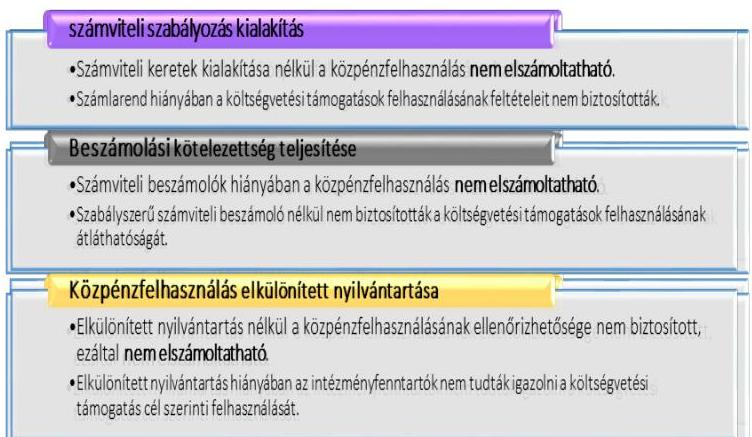

Tizenöt ellenőrzött fenntartó a 2017-2018. években, tizenhat fenntartó a 2016. évben az Alaptörvény ${ }^{1} 39$. cikk (2) bekezdésében foglaltak ellenére a felhasznált közpénzekre vonatkozó gazdálkodása átláthatóságát nem biztosította. Ezen fenntartók esetében felmerül annak a kockázata, hogy a jövőben a kapott támogatásokat nem szabályszerűen használják fel, és a közpénzeket nem átláthatóan kezelik.

A 2017-2018. években három, 2016. évben két fenntartó ellenőrzése során alapvető hibát nem tárt fel az ÁSZ² a költségvetési támogatások átláthatósága és elszámoltathatósága terén.

18 ellenőrzött fenntartó közpénzfelhasználásának értékelése a 2016-2018. években (db)
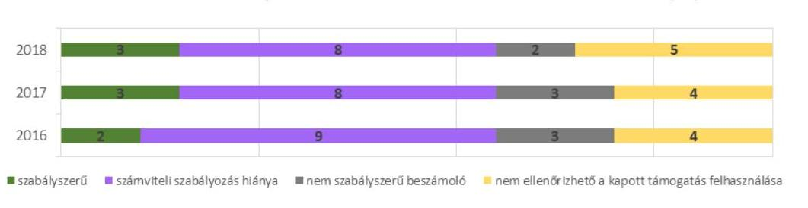

---

# AZ ELLENŐRZÉS CÉLJA

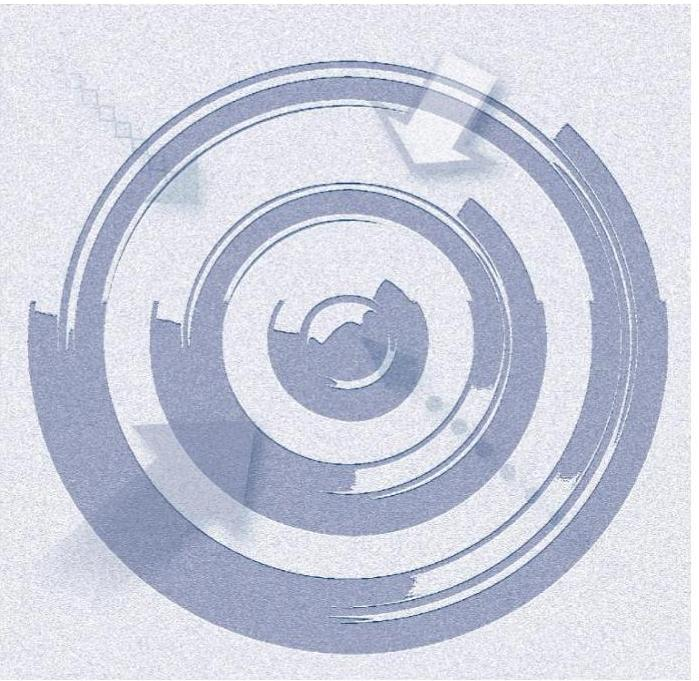

**AZ ELLENŐRZÉS CÉLJA** annak értékelése volt, hogy az Alapítványok, Egyesületek, mint nem állami, nem önkormányzati szociális és köznevelési intézmény fenntartók központi költségvetésből kapott támogatásainak felhasználása szabályszerű volt-e.

---

# AZ ELLENŐRZÉS TERÜLETE 

## Költségvetési támogatásban részesült humánszolgáltatási feladatokat végző Fenntartók - Alapítványok, Egyesületek

Szociális szolgáltatót, illetve szociális és gyermekvédelmi, illetve köznevelési intézményt létesíthet és működtethet nem állami, nem önkormányzati intézményfenntartó a jogszabályokban meghatározott feltételek szerint. Nem állami, nem önkormányzati szociális, illetve gyermekvédelmi intézményfenntartó lehet a Szoctv ${ }^{3}$. és Gyvt ${ }^{4}$. szerint többek között a magyarországi székhelyű jogi személy Alapítvány és Egyesület.

A központi költségvetés az államháztartáson kívüli szerv által fenntartott intézmény feladatainak ellátásához költségvetési hozzájárulást biztosít, a jogszabályban előírt feltételek teljesülése esetén. A Kincstár ${ }^{5}$ a megítélt támogatásokat a fenntartó részére folyósítja.

Az ellenőrzött 18 Fenntartó közül tíz alapítványi és nyolc egyesületi formában működött, melyek az ellenőrzött időszakban közhasznú jogállással rendelkeztek. Az ellenőrzött fenntartók szociális humánszolgáltatási közfeladatokat, egy fenntartó esetében szociális és köznevelési humánszolgáltatási közfeladatokat végeztek az ellenőrzött időszakban.

Az Alapítványok legfőbb, általános ügydöntő, ügyintéző, képviselő és kezelő szerve a kuratórium volt. Az Egyesületek legfőbb döntéshozó szerve a közgyűlés volt, az ügyvezetést, képviseletet az elnökség, illetve az elnök látta el.

Az ellenőrzött Fenntartók részére a szociális, illetve köznevelési humánszolgáltatási feladat ellátásához a központi költségvetésből biztosított támogatások összege, a Kincstár adatai alapján a II. számú mellékletben van részletezve.

---

# AZ ELLENŐRZÉS HÁTTERE, INDOKOLTSÁGA 

A köznevelési és szociális feladatokat ellátó nem állami intézményfenntartók részére közfeladataik ellátására évente jelentős összegű pénzügyi támogatást biztosítottak a mindenkori költségvetési törvények a bennük megfogalmazott feltételek mellett. A köznevelési és szociális feladatokra felhasználható állami támogatások előirányzata a 2016 - 2018. években 846 Mrd Ft volt.

Az ÁSZ stratégiájában foglaltak alapján is indokolt az ellenőrzés, amely a társadalom számára jelzi, hogy a közpénz államháztartáson kívüli felhasználása sem maradhat ellenőrizetlenül. Az államháztartáson kívülre nyújtott költségvetési támogatások ellenőrzésével az ÁSZ hozzájárul ahhoz, hogy a közpénzeket a nem állami fenntartók átlátható módon használják fel a közfeladatok ellátására kötött szerződésekben vállalt kötelezettségek teljesítése érdekében. Az ÁSZ az ellenőrzés javaslataival hozzájárulhat az említett rendszerek szabályszerű támogatás-felhasználásához, javíthatja a társadalmi-gazdasági döntések megalapozottságát, amely a „jól irányított állam" feltétele.

---

# A JELENTÉS LÉNYEGES KÉRDÉSKÖREI 

1.- A közfeladatot ellátó államháztartáson kívüli fenntartók szabályszerű működési - és gazdálkodási környezet kialakításával megteremtették-e a költségvetési támogatások átlátható, elszámoltatható igénybevételének, felhasználásának feltételeit, a közpénzekre vonatkozó gazdálkodásukkal a nyilvánosság előtt elszámoltak-e?
2.- Az államháztartáson kívüli fenntartók az átvállalt szociális és köznevelési közfeladathoz biztosított költségvetési támogatásokat szabályszerűen fordították-e a humánszolgáltató intézményeik működtetésére?

---

# AZ ELLENŐRZÉS HATÓKÖRE ÉS MÓDSZEREI 

## Az ellenőrzés típusa

| Megfelelőségi ellenőrzés.

## Az ellenőrzött időszak

A 2016. január 1-je és 2018. december 31-e közötti időszak.

## Az ellenőrzés tárgya

Az ellenőrzés a szociális és köznevelési humánszolgáltatási közfeladatokat ellátó államháztartáson kívüli Fenntartók humánszolgáltatási közfeladatai ellátásához a központi költségvetésből kapott támogatásaik humánszolgáltatási közfeladatokra való, fenntartó általi felhasználása szabályszerűségének értékelésére terjedt ki.

## Az ellenőrzött szervezet

Az államháztartásból nyújtott költségvetési támogatásban részesült szociális, illetve köznevelési feladatokat ellátó szolgáltatók/intézmények fenntartói a II. számú melléklet szerint.

## Az ellenőrzés jogalapja

Az ellenőrzés jogszabályi alapját az ÁSZtv. ${ }^{6} 1. § (3) bekezdése, 5. § (3) bekezdésében foglalt előírások adták.

## Az ellenőrzés módszerei

Az ellenőrzést az ellenőrzési program annak szempontjai, kérdései, az ellenőrzött időszakban hatályos jogszabályok, a nemzetközi standardokat irányadónak tekintve, az ellenőrzés szakmai szabályok és módszertanok figyelembevételével rendelte elvégezni. A közpénzekkel való felelős gazdálkodás segítésére irányuló javaslatok kidolgozásakor a hatályos jogszabályok voltak az irányadóak.

Az ellenőrzés ideje alatt az ellenőrzött szervezettel történő kapcsolattartást az ÁSZSZMSZ² -ének vonatkozó előírásai alapján biztosította az ÁSZ.

---

Az ellenőrzési kérdések megválaszolásához szükséges bizonyítékok megszerzése az ellenőrzött által rendelkezésre bocsátott dokumentumokra, adatokra alapozva megfigyelés, szemle (szemrevételezés), kérdésfeltevés (információkérés), valamint elemző eljárással történt.

Az ellenőrzési bizonyítékként felhasználható adatforrások közé tartoztak egyrészt az ellenőrzési program részletes szempontjainál felsorolt adatforrások, másrészt minden - az ellenőrzés folyamán feltárt, az ellenőrzés szempontjából információt tartalmazó - dokumentum.

Az ellenőrzés lefolytatásához az ellenőrzött szervezet a kitöltött tanúsítványok, valamint az ÁSZ által kért dokumentumok elektronikus úton való megküldésével szolgáltatott adatokat, információkat. Az így rendelkezésre bocsátott adatok, információk és a tanúsítványok adatai valódiságának kontrollja az ellenőrzés keretében történt.

Az ellenőrzést az ÁSZ alapvetően a szociális és köznevelési szolgáltatások esetében a központi költségvetési támogatások igénylésével, módosításával, felhasználásával, elszámolásával kapcsolatos feladatokat ellátó államháztartáson kívüli fenntartóknál végezte az ÁSZ.

A szociális és köznevelési humánszolgáltatások központi költségvetési támogatásaival kapcsolatos, államháztartáson kívüli fenntartó jogszabályokban előírt feladatai betartását, továbbá a központi költségvetési támogatások szabályszerű nyilvántartását ellenőrizte az ÁSZ a Fenntartónál rendelkezésre álló nyilvántartások, beszámolók és egyéb dokumentumok alapján.

Az ellenőrzés nem terjedt ki a szociális és köznevelési humánszolgáltatások központi költségvetési támogatásai igénylése, módosítása, elszámolása valódiságának, megalapozottságának, helyességének - sem a Fenntartónál, sem a székhely intézménynél való - értékelésére (mivel ennek felülvizsgálata, ellenőrzése a finanszírozó jogszabályban előírt feladata, határozatai kiadása előtt). Továbbá nem terjedt ki az ellenőrzése források intézmények általi szabályszerű felhasználásának értékelésére.

A szabályosság megítélésének alapját képezte, hogy a központi költségvetési támogatások Fenntartó általi elszámolása a Kincstár felé megtörtént.

---

# MEGÁLLAPÍTÁSOK

A JOGSZABÁLYI ELŐÍRÁSOK ALAPJÁN három ellenőrzött Fenntartó elkészítette belső szabályzatait, számviteli éves beszámolóit, elkülönített nyilvántartásait, ezzel biztosították a költségvetési támogatások felhasználásával való ellenőrizhetőséget, elszámoltathatóságot.

|   | elszámoltatható  |
|---|---|
|   | költségvetési támogatás  |
|  2016 | 7 fenntartók száma  |
|  2017 | 2  |
|  2018 | 3  |

A SZÁMVITELI SZABÁLYZATOK elkészítésére vonatkozó kötelezettségét kilenc ellenőrzött Fenntartó nem teljesítette, mivel nem rendelkeztek a Számv. tv. 161. § (1) bekezdésében előírt számlarenddel.

Egy ellenőrzött Fenntartó a számlarend hiányán felül a Számv. tv. 14. § (3) bekezdés és (5) bekezdés a),b),d) pontjaiban foglaltak ellenére nem rendelkezett számviteli politikával és annak keretében elkészítendő eszközök, források értékelési, leltárkészítési és leltározási, illetve pénzkezelési szabályzattal. Egy Fenntartó a 2016. évben a számlarend hiányán felül nem rendelkezett a Számv. tv. 14. § (3) bekezdés és (5) bekezdés b) pontjában előírt eszközök, források értékelési szabályzatával.

Számlarend, illetve számviteli politika hiányában a könyvvezetésre, bizonylatolásra vonatkozó részletes belső szabályok nem kerültek kialakításra, ezáltal az éves számviteli beszámolók szabályszerű könyvvezetéssel való alátámasztása, a költségvetési támogatások felhasználásának elszámoltathatósága nem volt biztosított.

SZÁMVITELI BESZÁMOLÓVAL három ellenőrzött Fenntartó nem rendelkezett. A Számv. tv. 20. § (6) bekezdésében foglaltak ellenére a számviteli beszámoló képviseletre jogosult általi aláírási kötelezettségét két Fenntartó nem teljesítette, így a Civil tv.8 28. § (1) bekezdésében és a Számv. tv.9 4. § (1) bekezdésében előírt beszámolási kötelezettségüknek nem tettek eleget. További egy Fenntartó a Civil tv. 28. § (1) bekezdésében és a Számv. tv. 4. § (1) bekezdésében előírtak ellenére nem készítette el számviteli beszámolóját az ellenőrzött időszakban. Számviteli beszámoló hiányában a költségvetési támogatások felhasználása nem volt elszámoltatható.

A KÖLTSÉGVETÉSI TÁMOGATÁSOK elkülönített nyilvántartását öt Fenntartó nem vezette szabályszerűen, mivel a Számv. tv. 161/A. § (2) bekezdésének előírásai ellenére nem gondoskodott a könyvvezetési rendszere oly módon való továbbrészletezéséről, hogy abból az Atr.10 16. § (1) bekezdésében előírt, a támogatások felhasználásának elkülönített adatai rendelkezésre
 álljanak. Ez alapján a Számv. tv. 161/A. § (2) bekezdésében előírtakkal ellentétesen a támogatások felhasználása nem volt ellenőrizhető.

Az egyes ellenőrzött intézményfenntartóra vonatkozó megállapításokat az I. számú melléklet tartalmazza.

|   | támogatás elkiülönítésének hiánya |
|---|---|
|  2016 | 4 fenntartók száma  |
|  2017 | 4  |
|  2018 | 5  |

12

---

# MELLÉKLETEK 

## I. SZ. MELLÉKLET: AZ ELLENŐRZÖTT FENNTARTÓKKAL KAPCSOLATOS RÉSZLETES MEGÁLLAPÍTÁSOK

## ■ Alkohol Drogsegély Ambulancia

A veszprémi székhelyű Alkohol Drogsegély Ambulancia, mint közhasznú egyesület, a 2016-2018. években négy nem önálló jogi személy szociális intézményt ${ }^{11}$ tartott fenn. Az ellenőrzött fenntartó az intézményein keresztül szenvedélybetegek részére nyújtott közösségi alapellátás, szenvedélybetegek rehabilitációs intézménye, szenvedélybetegek közösségi ellátása, szenvedélybetegek nappali ellátása feladatokat látott el.

Az ellenőrzött fenntartó a 2016-2018. években a Számv. tv. 161. § (1) bekezdésében foglaltak ellenére nem rendelkezett a képviseletére jogosult által aláírt hatályos számlarenddel, ezáltal nem teremtette meg a költségvetési támogatások elszámoltatható, átlátható felhasználásának szabályozási feltételeit. Számlarend hiányában a számviteli beszámolói a Számv. tv. 4. § (1) bekezdés előírásaival ellentétesen a Számv. tv. 161/A. § (1) bekezdésében előírt szabályszerű könyvvezetéssel nem voltak alátámasztottak.

## ■ Anyaoltalmazó Alapítvány

A budapesti székhelyű Anyaoltalmazó Alapítvány a 2016-2018. években egy nem önálló jogi személy szociális intézményt ${ }^{12}$ és annak telephelyét tartotta fenn. Az ellenőrzött fenntartó közhasznú tevékenységként az intézményén keresztül családok átmeneti otthona közfeladatot látott el.

Az ellenőrzött fenntartó a 2016-2018. években a Számv. tv. 161. § (1) bekezdésében foglaltak ellenére nem rendelkezett a képviseletére jogosult által aláírt hatályos számlarenddel, ezáltal nem teremtette meg a költségvetési támogatások elszámoltatható, átlátható felhasználásának szabályozási feltételeit. Számlarend hiányában a számviteli beszámolói a Számv. tv. 4. § (1) bekezdés előírásaival ellentétesen a Számv. tv. 161/A. § (1) bekezdésében előírt szabályszerű könyvvezetéssel nem voltak alátámasztottak.

## ■ Aranykereszt Humán Szolgáltató Egyesület

A budapesti székhelyű Aranykereszt Humán Szolgáltató Egyesület a 2016-2018. években két nem önálló jogi személy szociális intézményt ${ }^{13}$ tartott fenn. Az ellenőrzött fenntartó két intézményén keresztül pszichiátriai betegek és időskorúak gondozása közhasznú feladatokat látott el.

Az ellenőrzött fenntartó a 2016-2018. években a fenntartó és a nem önállóan gazdálkodó intézménye gazdálkodásának elkülönítéséről nem gondoskodott, a kapott támogatások felhasználását az Atr. 16. § (1) és a Civil. tv. 20. § (4) bekezdésében foglaltak ellenére támogatásonként, feladatonkénti bontásban nem vezette elkülönítetten. Ezáltal a költségvetési támogatás felhasználásának a Számv. tv. 161/A. § (2) bekezdésében előírt ellenőrizhetőségét nem biztosította.

## ■ Értelmi Fogyatékossággal Élők és Segítőik Közép-Magyarországi Regionális Közhasznú Egyesület

A budapesti székhelyű Értelmi Fogyatékossággal Élők és Segítőik Közép-Magyarországi Regionális Közhasznú Egyesület, a 2016-2018. években nem önálló jogi személy két szociális szolgáltatót, illetve két intézményt ${ }^{14}$ működtetett. Az ellenőrzött fenntartó a szociális intézményein és szolgáltatóin keresztül fogyatékos személyek nappali ellátása, fejlesztő foglalkoztatás, támogató szociális feladatokat látott el.

Az ellenőrzött fenntartó a 2016-2018. években a Számv. tv. 161. (1) bekezdésében foglaltak ellenére nem rendelkezett a képviseletére jogosult által aláírt hatályos számlarenddel, továbbá a Számv. tv. 14. § (3) bekezdés, (5) bekezdés a), b), d) pontjaiban foglaltak ellenére nem rendelkezett számviteli politikával és annak keretében elkészítendő eszközök, források értékelési, leltárkészítési és leltározási, illetve pénzkezelési szabályzattal. Ez alapján a számviteli beszámolói a Számv. tv. 4. § (1) bekezdés előírásaival ellentétesen a Számv. tv. 161. (1) és a Számv. tv. 161/A. § (1) bekezdésében előírt szabályszerű könyvvezetéssel nem voltak alátámasztottak.

---

# Forrás Lelki Segítők Egyesülete 

A debreceni székhelyű Forrás Lelki Segítők Egyesülete, a 2016-2018. években négy nem önálló jogi személy szociális intézményt ${ }^{15}$ működtetett. Az ellenőrzött fenntartó az intézményein keresztül támogatott lakhatás, szociális foglalkoztatás, rehabilitációs intézményi ellátás, családsegítés és gyermekjóléti szolgáltatás, pszichiátriai betegek részére nyújtott közösségi alapellátás, szenvedélybetegek részére nyújtott közösségi alapellátás, szenvedélybetegek részére nyújtott alacsonyküszöbű ellátás, nappali ellátás közhasznú feladatokat látott el.

Az ellenőrzött fenntartó a 2016-2018. években a Számv. tv. 161. § (1) bekezdésében foglaltak ellenére nem rendelkezett számlarenddel, ezáltal nem teremtette meg a költségvetési támogatások elszámoltatható, átlátható felhasználásának szabályozási feltételeit. Számlarend hiányában a számviteli beszámolói a Számv. tv. 4. § (1) bekezdés előírásaival ellentétesen a Számv. tv. 161/A. § (1) bekezdésében előírt szabályszerű könyvvezetéssel nem voltak alátámasztottak.

## ■ Gondviselés Alapítvány

A tapolcai székhelyű Gondviselés Alapítvány a 2016-2018. években egy nem önálló jogi személy szociális intézményt ${ }^{16}$ működtetett. Az ellenőrzött fenntartó az intézményén keresztül ápolást, gondozást nyújtó intézményi ellátás, átmeneti elhelyezést nyújtó intézményi ellátás, mint idősek otthona demens, idősek otthona átlagos, illetve időskorúak gondozóháza közhasznú feladatokat látott el.

Az ellenőrzött fenntartó 2016-2017. évekre vonatkozó számviteli beszámolóját a Számv. tv. 20. § (6) bekezdésében foglaltak ellenére a képviseletre jogosult nem írta alá, így a Civil tv. 28. § (1) bekezdésében és a Számv. tv. 4. § (1) bekezdésében előírt beszámolási kötelezettségének nem tett eleget.

Az ellenőrzött fenntartó a 2018. évben a fenntartó és a nem önállóan gazdálkodó intézménye gazdálkodásának elkülönítéséről nem gondoskodott, a kapott támogatások felhasználását az Atr. 16. § (1) és a Civil. tv. 20. § (4) bekezdésében foglaltak ellenére támogatásonként, feladatonkénti bontásban nem vezette elkülönítetten. Ezáltal a költségvetési támogatás felhasználásának a Számv. tv. 161/A. § (2) bekezdésében előírt ellenőrizhetőségét nem biztosította.

## ■ KEREK VILÁG ALAPÍTVÁNY

A pécsi székhelyű KEREK VILÁG ALAPÍTVÁNY a 2016-2018. években egy nem önálló jogi személy szociális és egy önálló jogi személy köznevelési intézményt ${ }^{17}$ működtetett. Az ellenőrzött fenntartó az intézményein keresztül szociális közfeladatok körében nappali ellátást biztosított fogyatékkal élő személyek részére, továbbá támogató szolgáltatást működtetett, köznevelési tevékenység keretében általános iskolai nevelés-oktatás, illetve fejlesztő nevelés közhasznú feladatokat látott el.

Az ellenőrzött fenntartó rendelkezett a Számv. tv. által előírt számviteli politikával és annak részeként elkészítendő szabályzatokkal, valamint számlarenddel. Az ellenőrzött fenntartó 2016-2018. években biztosította az intézményei működéséhez szükséges pénzeszközöket, az Atr. és az Nktv. előírása szerint gondoskodott a saját nyilvántartásai olyan kialakításáról, hogy abból megállapítható legyen, hogy a költségvetési támogatásokat milyen célra használta fel. A központi költségvetési támogatásokat 15 napon belül átadta az intézménynek. Az ellenőrzött fenntartó a 2016-2018. évek egyszerűsített éves beszámolóját elkészítette, a vonatkozó letétbe helyezési és közzétételi kötelezettségének eleget tett.

## ■ KÖZÖSSÉGÉRT ALAPÍTVÁNY - A PSZICHIÁTRIAI BETEGSÉGGEL ÉLŐK FELÉPÜLÉSÉÉRT

Az orfűi székhelyű KÖZÖSSÉGÉRT ALAPÍTVÁNY - A PSZICHIÁTRIAI BETEGSÉGGEL ÉLŐK FELÉPÜLÉSÉÉRT, a 2016-2018. években három nem önálló jogi személy szociális intézményt ${ }^{18}$ működtetett. Az ellenőrzött fenntartó az intézményein keresztül közösségi pszichiátriai alapellátás és szenvedélybetegek közösségi alapellátás közhasznú feladatokat látott el.

Az ellenőrzött fenntartó a 2016-2018. években a Számv. tv. 161. § (1) bekezdésében foglaltak ellenére nem rendelkezett számlarenddel, ezáltal nem teremtette meg a költségvetési támogatások elszámoltatható, átlátható felhasználásának szabályozási feltételeit. Számlarend hiányában a számviteli beszámolói a Számv. tv. 4. § (1)

---

bekezdés előírásaival ellentétesen a Számv. tv. 161/A. § (1) bekezdésében előírt szabályszerű könyvvezetéssel nem voltak alátámasztottak.

# ■ Magyar Vöröskereszt Budapest Fővárosi Szervezete 

A budapesti székhelyű Magyar Vöröskereszt Budapest Fővárosi Szervezete a 2016-2018. években négy nem önálló jogi személy szociális intézményt ${ }^{19}$ működtetett. Az ellenőrzött fenntartó az intézményein keresztül közösségi pszichiátriai alapellátás és szenvedélybetegek közösségi alapellátás közhasznú feladatokat látott el. A fenntartó a Magyar Vöröskereszt jogi személyiséggel rendelkező szervezeti egysége, számviteli beszámolója az országos szervezet összevont (konszolidált) beszámolójának alkotóeleme.

A Számv. tv. 20. § (6) bekezdésben előírtak ellenére az ellenőrzött fenntartó számviteli beszámolóit a képviseletre jogosult nem írta alá. Aláírás hiányában a vezető személyes felelősségvállalása nem volt igazolt.

## ■ NYUGODT ÉLET ALAPÍTVÁNY

A sajóbábonyi székhelyű NYUGODT ÉLET ALAPÍTVÁNY a 2016-2018. években egy nem önálló jogi személy szociális intézményt ${ }^{20}$ működtetett. Az ellenőrzött fenntartó az intézményén keresztül az időskorúak ápolása, gondozása, bentlakásos ellátása közhasznú feladatokat látott el.

Az ellenőrzött fenntartó a Civil tv. 28. § (1) bekezdésében és a Számv.tv. 4. § (1) bekezdésében foglaltak ellenére a 2016-2018. évekre vonatkozóan nem tett eleget beszámoló készítési kötelezettségének.

## ■ Péliföldi Örökzöld Egyesület

A bajóti székhelyű Péliföldi Örökzöld Egyesület a 2016-2018. években két nem önálló jogi személy szociális intézményt ${ }^{21}$ tartott fenn. Az ellenőrzött fenntartó az intézményein keresztül bölcsődei ellátás, tartós bentlakásos ápolás és gondozást nyújtó idősek otthona feladatokat látott el.

Az ellenőrzött fenntartó a 2016-2018. években a Számv. tv. 161. § (1) bekezdésében foglaltak ellenére nem rendelkezett a képviseletére jogosult által aláírt hatályos számlarenddel, ezáltal nem teremtette meg a költségvetési támogatások elszámoltatható, átlátható felhasználásának szabályozási feltételeit. Számlarend hiányában a számviteli beszámolói a Számv. tv. 4. § (1) bekezdés előírásaival ellentétesen a Számv. tv. 161/A. § (1) bekezdésében előírt szabályszerű könyvvezetéssel nem voltak alátámasztottak.

## ■ "SEGÍTŐ KEZEK" Idősek Otthona Gyulai Alapítványa

A gyulai székhelyű "SEGÍTŐ KEZEK" Idősek Otthona Gyulai Alapítványa a 2016-2018. években egy nem önálló jogi személy szociális intézményt ${ }^{22}$ tartott fenn. Az ellenőrzött fenntartó intézményén keresztül időskorúak otthoni ápoló-gondozó ellátása feladatokat látott el.

Az ellenőrzött fenntartó a 2016-2018. években a fenntartó és a nem önállóan gazdálkodó intézménye gazdálkodásának elkülönítéséről nem gondoskodott, a kapott támogatások felhasználását az Atr. 16. § (1) és a Civil. tv. 20. § (4) bekezdésében foglaltak ellenére támogatásonként, feladatonkénti bontásban nem vezette elkülönítetten. Ezáltal a költségvetési támogatás felhasználásának a Számv. tv. 161/A. § (2) bekezdésében előírt ellenőrizhetőségét nem biztosította.

## ■ "Segítő Kezek" Szociális és Házi Segítségnyújtó Alapítvány

A siófoki székhelyű "Segítő Kezek" Szociális és Házi Segítségnyújtó Alapítvány a 2016-2018. években egy nem önálló jogi személy szociális szolgáltatót ${ }^{23}$ tartott fenn. Az ellenőrzött fenntartó a szolgáltatóján keresztül házi segítségnyújtás szociális segítés és házi segítségnyújtás személyi gondozás közhasznú feladatokat látott el.

Az ellenőrzött fenntartó a 2016-2018. években, a fenntartó és a nem önállóan gazdálkodó szolgáltató gazdálkodásának elkülönítéséről nem gondoskodott, a kapott támogatások felhasználását az Atr. 16. § (1) és a Civil. tv. 20. § (4) bekezdésében foglaltak ellenére támogatásonként, feladatonkénti bontásban nem vezette elkülönítetten. Ezáltal a költségvetési támogatás felhasználásának a Számv. tv. 161/A. § (2) bekezdésében előírt ellenőrizhetőségét nem biztosította.

---

# Segítséggel Könnyebb Alapítvány 

Az ajkai székhelyű Segítséggel Könnyebb Alapítvány a 2016-2018. években három nem önálló jogi személy szociális intézményt ${ }^{24}$ működtetett. Az ellenőrzött fenntartó az intézményein keresztül családok átmeneti otthona közhasznú feladatokat látott el.

Az ellenőrzött fenntartó a 2016-2018. években a Számv. tv. 161. § (1) bekezdésében foglaltak ellenére nem rendelkezett számlarenddel, ezáltal nem teremtette meg a költségvetési támogatások elszámoltatható, átlátható felhasználásának szabályozási feltételeit. Számlarend hiányában a számviteli beszámolói a Számv. tv. 4. § (1) bekezdés előírásaival ellentétesen a Számv. tv. 161/A. § (1) bekezdésében előírt szabályszerű könyvvezetéssel nem voltak alátámasztottak.

##
 S.O.S. Krízis Alapítvány

A budapesti székhelyű S.O.S. Krízis Alapítvány a 2016-2018. években egy nem önálló jogi személy szociális intézményt ${ }^{25}$ tartott fenn. Az ellenőrzött Fenntartó az intézményén és azok telephelyein keresztül családok átmeneti otthona közhasznú feladatot látott el.

Az ellenőrzött Fenntartó 2016. január 1. és 2017. március 31. között nem készítette el a Számv. tv. 161. § (1) bekezdésében előírt számlarendjét, továbbá a Számv. tv. 14. § (5) bekezdés b) pontjában előírt eszközök és források értékelési szabályzatát, ezáltal nem teremtette meg a költségvetési támogatások elszámoltatható, átlátható felhasználásának szabályozási feltételeit. Ez alapján a 2016. évben az ellenőrzött Fenntartó számviteli beszámolói a Számv. tv. 4. § (1) bekezdés előírásaival ellentétesen a Számv. tv. 161/A. § (1) bekezdésében előírt szabályszerű könyvvezetéssel nem voltak alátámasztottak.

Az ellenőrzött Fenntartó a 2017-2018. években biztosította a támogatások elszámolásának feltételeit. Az ellenőrzött Fenntartó a 2017-2018. években rendelkezett a jogszabályokban előírt szabályzatokkal, a támogatásokat és azok felhasználását a jogszabályoknak megfelelően támogatásonként és telephelyenként elkülönítetten tartotta nyilván. A 2017-2018. években az ellenőrzött Fenntartó a jogszabályokban előírtak alapján a számviteli beszámolóit és az egyidejűleg készített közhasznúsági mellékletet letétbe helyezte és közzétette.

## SOTERIA Alapítvány

A budapesti székhelyű SOTERIA Alapítvány a 2016-2018. években két nem önálló jogi személy intézményt ${ }^{26}$ tartott fenn. Az ellenőrzött Fenntartó az intézményén keresztül pszichiátriai betegek nappali ellátása, pszichiátriai betegek részére nyújtott közösségi alapellátás közhasznú feladatokat látott el.

Az ellenőrzött Fenntartó a 2016-2018. években a Fenntartó és a nem önállóan gazdálkodó intézménye gazdálkodásának elkülönítéséről nem gondoskodott, a kapott támogatások felhasználását az Atr. 16. § (1) és a Civil. tv. 20. § (4) bekezdésében foglaltak ellenére támogatásonként, feladatonként nem vezette elkülönítetten. Ezáltal a költségvetési támogatás felhasználásának a Számv. tv. 161/A. § (2) bekezdésében előírt ellenőrizhetőségét nem biztosította.

## Szegedi Mozgássérültek Alternatív Egyesülete

A szegedi székhelyű Szegedi Mozgássérültek Alternatív Egyesülete a 2016-2018. években két nem önálló jogi személy szociális intézményt ${ }^{27}$ működtetett. Az ellenőrzött Fenntartó az intézményein keresztül támogató szolgáltatás, nappali ellátás-fogyatékos személyek nappali ellátása közhasznú feladatokat látott el.

Az ellenőrzött Fenntartó a 2016-2018. években a Számv. tv. 161. § (1) bekezdésében foglaltak ellenére nem rendelkezett számlarenddel, ezáltal nem teremtette meg a költségvetési támogatások elszámoltatható, átlátható felhasználásának szabályozási feltételeit. Számlarend hiányában a számviteli beszámolói a Számv. tv. 4. § (1) bekezdés előírásaival ellentétesen a Számv. tv. 161/A. § (1) bekezdésében előírt szabályszerű könyvvezetéssel nem voltak alátámasztottak.

---

# VELED-ÉRTED Egyesület 

A budapesti székhelyű VELED-ÉRTED Egyesület a 2016-2018. években három nem önálló jogi személy szociális intézményt ${ }^{28}$ működtetett. Az ellenőrzött Fenntartó az intézményein keresztül támogató szolgáltatás közhasznú feladatokat látott el.

Az ellenőrzött Fenntartó rendelkezett a jogszabályokban előírt szabályzatokkal, ezáltal biztosította a támogatások szabályszerű felhasználásának feltételeit. Az ellenőrzött Fenntartó a 2016-2018. években biztosította az intézményei működéséhez szükséges pénzeszközöket, az Atr. és a Civil. tv. előírása szerint gondoskodott a nyilvántartásai olyan kialakításáról, hogy abból megállapítható legyen, hogy a költségvetési támogatásokat milyen célra használta fel. Az ellenőrzött Fenntartó a 2016-2018. évek egyszerűsített éves beszámolóját elkészítette, a vonatkozó letétbe helyezési és közzétételi kötelezettségének eleget tett.

---

II. SZ. MELLÉKLET: AZ ELLENŐRZÖTT FENNTARTÓK SZOCIÁLIS ÉS KÖZNEVELÉSI KÖZFELADAT ELLÁTÁSÁRA A KINCSTÁR ÁLTAL BIZTOSÍTOTT KÖLTSÉGVETÉSI TÁMOGATÁSOK ÖSSZEGE 2016-2018. ÉVEKBEN (MILLIÓ FT)

|  Sorszám | Fenntartó | 2016. | 2017. | 2018.  |
| --- | --- | --- | --- | --- |
|  1. | Alkohol Drogsegély Ambulancia (Szociális) | 52,4 | 58,7 | 61,8  |
|  2. | Anyaoltalmazó Alapítvány (Szociális) | 55,7 | 66,7 | 68,9  |
|  3. | Aranykereszt Humán Szolgáltató Egyesület (Szociális) | 46,7 | 56,4 | 65,5  |
|  4. | Értelmi Fogyatékossággal Élők és Segítők Közép-Magyarországi Regionális Közhasznú Egyesület (Szociális) | 48,1 | 70,2 | 80,5  |
|  5. | Forrás Lelki Segítők Egyesülete (Szociális) | 50,3 | 60,7 | 79,3  |
|  6. | Gondviselés Alapítvány (Szociális) | 44,3 | 50,2 | 48,9  |
|  7. | KEREK VILÁG ALAPÍTVÁNY (Szociális) | 44,4 | 53,8 | 58,0  |
|   | (Köznevelési) | 83,1 | 105,7 | 107,8  |
|  8. | KÖZÖSSÉGÉRT ALAPÍTVÁNY - A PSZICHIÁTRIAI BETEGSÉGGEL ÉLŐK FELÉPÜLÉSÉÉRT (Szociális) | 49,4 | 61,9 | 64,5  |
|  9. | Magyar Vöröskereszt Budapest Fővárosi Szervezete (Szociális) | 433,4 | 460,4 | 460,5  |
|  10. | NYUGODT ÉLET ALAPÍTVÁNY (Szociális) | 44,9 | 53,6 | 61,1  |
|  11. | Péliföldi Örökzöld Egyesület (Szociális) | 35,6 | 49,7 | 65,8  |
|  12. | „SEGÍTŐ KEZEK" Idősek Otthona Gyulai Alapítványa (Szociális) | 47,1 | 56,5 | 63,4  |
|  13. | "Segítő Kezek" Szociális és Házi Segítségnyújtó Alapítvány (Szociális) | 50,1 | 74,3 | 79,8  |
|  14. | Segítséggel Könnyebb Alapítvány (Szociális) | 82,8 | 85,0 | 85,7  |
|  15. | S.O.S. Krízis Alapítvány (Szociális) | 85,0 | 95,8 | 98,9  |
|  16. | SOTERIA Alapítvány (Szociális) | 47,0 | 50,1 | 55,2  |
|  17. | Szegedi Mozgássérültek Alternatív Egyesülete (Szociális) | 42,1 | 54,2 | 56,8  |
|  18. | VELED-ÉRTED Egyesület (Szociális) | 44,0 | 49,2 | 52,6  |

---

# III. SZ. MELLÉKLET: ÉRTELMEZŐ SZÓTÁR 

humánszolgáltatás
kültségvetési támogatás
köznevelési közfeladat
köznevelési intézmény
nem állami, nem önkormányzati (államháztartáson kívüli) intézmény fenntartó

Külön törvényben meghatározott szociális, gyermekjóléti, gyermekvédelmi, közoktatási, felsőoktatási, kulturális közfeladatok (2015. évi Kvtv. 43. § (1), (4) bekezdés, 1. számú melléklet XX/20/2/3. jogcím csoport, 19. alcím, 2016. évi Kvtv. 41. §(1), (4) bekezdés, 1. számú melléklet XX/20/2/3. jogcím csoport, 19. alcím, 2017. évi Kvtv. 41. §(1), (4) bekezdés, 1. számú melléklet XX/20/2/3. jogcím csoport, 19. alcím)
a társadalombiztosítás pénzügyi alapjai kivételével az államháztartás központi alrendszeréből ellenérték nélkül, pénzben nyújtott támogatások (Áht. 1. § 14. pont)
A költségvetési törvényben megállapított támogatás többek között: Átlagbéralapú támogatást állapít meg a nevelési-oktatási, valamint pedagógiai szakszolgálati intézményt fenntartó nemzetiségi önkormányzat, az egyházi és magán köznevelési intézmény fenntartója részére az általuk fenntartott nevelési-oktatási intézményben, továbbá pedagógiai szakszolgálati intézményben pedagógus és - a (3) bekezdés kivételével - a nevelő-oktató munkát közvetlenül segítő munkakörben foglalkoztatottak után a 7. melléklet I. pontjában meghatározott jogosultak után, az őket ott megillető mértékek szerint. Működési támogatást állapít meg a nemzetiségi önkormányzat vagy az egyházi jogi személy által fenntartott nevelési-oktatási intézményekben ellátott, továbbá a pedagógiai szakszolgálati intézményekben gyógypedagógiai tanácsadásban, korai fejlesztésben, oktatásban és gondozásban, valamint a fejlesztő nevelésben részt vevő gyermekekre, tanulókra tekintettel a nemzetiségi önkormányzat és a bevett egyház részére a 7. melléklet II. pontja szerint (2015. évi Kvtv., 2016. évi Kvtv., 2017. évi Kvtv.)
A köznevelési intézmény alapító okiratában foglalt feladat: óvodai nevelés, nemzetiséghez tartozók óvodai nevelése, általános iskolai nevelés-oktatás, nemzetiséghez tartozók általános iskolai nevelése-oktatása, kollégiumi ellátás, nemzetiségi kollégiumi ellátás, gimnáziumi nevelés-oktatás, szakközépiskolai nevelés-oktatás, szakiskolai nevelés-oktatás, nemzetiségi gimnáziumi nevelés-oktatása, nemzetiségi szakközépiskolai nevelés-oktatása, nemzetiségi szakiskolai nevelés-oktatása, Köznevelési Hídprogramok keretében folyó nevelés-oktatás, felnőttoktatás, alapfokú művészetoktatás, fejlesztő nevelés, fejlesztő nevelés-oktatás, pedagógiai szakszolgálati feladat, a többi gyermekkel, tanulóval együtt nevelhető, oktatható sajátos nevelési igényű gyermekek, tanulók óvodai nevelése és iskolai nevelése-oktatása, azoknak a sajátos nevelési igényű gyermekeknek, tanulóknak az óvodai, iskolai, kollégiumi ellátása, akik a többi gyermekkel, tanulóval nem foglalkoztathatók együtt, a gyermekgyógyüdülőkben, egészségügyi intézményekben, rehabilitációs intézményekben tartós gyógykezelés alatt álló gyermekek tankötelezettségének teljesítéséhez szükséges oktatás, pedagógiai-szakmai szolgáltatás.
A nevelési-oktatási intézmény, pedagógiai szakszolgálati intézmény, pedagógiai-szakmai szolgáltatást nyújtó intézmény.
A szociális közfeladatokat/humánszolgáltatásokat ellátó intézményt fenntartó egyházi jogi személy, társadalmi szervezet, alapítvány, közalapítvány, civil szervezet, országos nemzetiségi önkormányzat, nonprofit gazdasági társaság, gazdasági társaság és a humánszolgáltatást alaptevékenységként végző, Szja tv. hatálya alá tartozó egyéni vállalkozó. (2015. évi Kvtv. 43. §(1) bekezdés, 2016. évi Kvtv. 41. §(1) bekezdés, 2017. évi Kvtv. 41. §(1) bekezdés

---

szociális szolgáltató, szociális intézmény
szociális szolgáltatások

A 1993. évi III. törvény a szociális igazgatásról és szociális ellátásokról 4. § g) pontja alapján szociális szolgáltató: az a személy vagy szervezet, amely kizárólag a törvény 6065/E. §-ban meghatározott szociális alapszolgáltatásokat nyújtja. Ha jogszabály másként nem rendelkezik, a szociális szolgáltatókra a szociális intézményekre vonatkozó szabályokat kell megfelelően alkalmazni.
A 1993. évi III. törvény a szociális igazgatásról és szociális ellátásokról 4. § h) pontja alapján szociális intézmény: az e törvényben meghatározott nappali, illetve bentlakásos ellátást vagy támogatott lakhatást nyújtó szervezet.
Az 1993. évi III. törvény a szociális igazgatásról és szociális ellátásokról 57. § (1) bekezdése alapján szociális alapszolgáltatások: a falugondnoki és tanyagondnoki szolgáltatás, az étkeztetés, a házi segítségnyújtás, a családsegítés, a jelzőrendszeres házi segítségnyújtás, a közösségi ellátások, a támogató szolgáltatás, az utcai szociális munka, a nappali ellátás.

---

# FÜGGELÉK: ÉSZREVÉTELEK 

A jelentéstervezetet a Számvevőszék 15 napos észrevételezésre megküldte az ellenőrzött szervezetek vezetőinek az ÁSZ tv. 29. § (1) bekezdés előírásának megfelelően.

Az Anyaoltalmazó Alapítvány, az Aranykereszt Humán Szolgáltató Egyesület, az Értelmi Fogyatékossággal Élők és Segítőik Közép-Magyarországi Regionális Közhasznú Egyesület, a Forrás Lelki Segítők Egyesülete, a KEREK VILÁG ALAPÍTVÁNY, a Magyar Vöröskereszt Budapest Fővárosi Szervezete, az S.O.S. Krízis Alapítvány, a SOTERIA Alapítvány, a Szegedi Mozgássérültek Alternatív Egyesülete és a VELED-ÉRTED Egyesület nem tett észrevételt.
Az Alkohol Drogsegély Ambulancia, a Gondviselés Alapítvány, a KÖZÖSSÉGÉRT ALAPÍTVÁNY - A PSZICHIÁTRIAI BETEGSÉGGEL ÉLŐK FELÉPÜLÉSÉÉRT, a NYUGODT ÉLET ALAPÍTVÁNY, a Péliföldi Örökzöld Egyesület, a "SEGÍTŐ KEZEK" Idősek Otthona Gyulai Alapítványa, a "Segítő Kezek" Szociális és Házi Segítségnyújtó Alapítvány, valamint a Segítséggel Könnyebb Alapítvány észrevételét és az arra adott választ a függelék tartalmazza.

[^0]
[^0]:    * 29. § (1) Az Állami Számvevőszék az ellenőrzési megállapításait megküldi az ellenőrzött szervezet vezetőjének vagy az általa megbízott személynek, és annak, akinek személyes felelősségét állapította meg.
    (2) Az ellenőrzött szervezet vezetője és a felelősként megjelölt személy az ellenőrzés megállapításaira tizenöt napon belül írásban észrevételt tehet.
    (3) Az Állami Számvevőszék az észrevételre a beérkezésétől számított harminc napon belül írásban válaszol. A figyelembe nem vett észrevételeket köteles a jelentésben feltüntetni, és megindokolni, hogy azokat miért nem fogadta el.

---

# Alkohol-Drogsegély Ambulancia 

## 1052 Budapest

Apáczai Csere János u. 10.
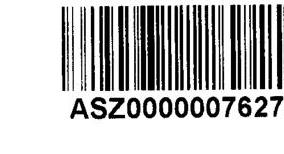

Ikt. sz.: K-32/G/2020

Tisztelt Cím!
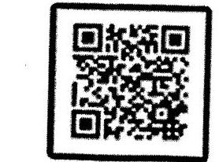

Hivatkozva az EL-2287-048/2020. iktatószám alatt megküldött, a nem állami humánszolgáltatók ellenőrzésével kapcsolatos jelentéstervezetre az alábbi észrevételt tesszük:

Az Alkohol - Drogsegély Ambulancia egyesület működése során mindenkor a vonatkozó jogszabályok maximális betartása mellett látja el közhasznú tevékenységét. A számviteli kötelezettségek teljesítése esetében sincs ez másként.

Egyesületünk rendelkezik a Számv.tv. 161. § (1) bekezdésében foglaltak szerinti -
 a képviseletre jogosult aláírásával ellátott - hatályos számlarenddel, megteremtve ezzel a költségvetési támogatások elszámoltatható, átlátható felhasználásának szabályozási feltételeit. A Magyar Államkincstár ellenőrzései során eddig mindent rendben talált. Ennek megfelelően számviteli beszámolóink a Számv. tv. 4 § (1) bekezdés előírásaival összhangban a Számv. tv. 161/A. § (1) bekezdésében előírt szabályszerű könyvvezetéssel alátámasztottak.

Aláírt számlarend alapján dolgozik az egyesület könyvelését végző könyvelőiroda és a könyvvizsgálatot ellátó könyvvizsgáló is. (A könyvelőiroda erre vonatkozó nyilatkozatát mellékelni tudjuk.)

Sajnálatos módon az ellenőrzéshez szükséges dokumentumok feltöltése során adminisztrációs hiba történt, így az aláírt számlarenddel tartalmában ugyan maradéktalanul megegyező, ugyanakkor nem aláírt számlarendet csatoltunk be a vizsgálat részére. Ezen észrevételünkhöz most csatoljuk a 2016-2018. évekre hatályos aláírt számlarendet.

Kérjük tisztelt Állami Számvevőszéket, hogy a fenti észrevételünket szíveskedjen figyelembe venni és ennek alapján a vonatkozó megállapításukat szíveskedjenek módosítani.

Veszprém, 2020. december 8.

Tisztelettel:
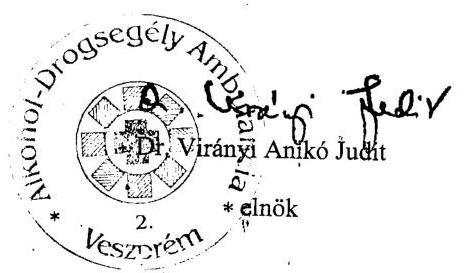

---

# 150 éve   a köpének öre 

ÁLLAMI SZÁMVEVŐSZÉK

Ikt. szám: EL-2287-071/2020.

Dr. Virányi Anikó Judit
elnök

Alkohol Drogsegély Ambulancia

## Veszprém

Tisztelt Elnök Úrhölgy!

A „Nem állami humánszolgáltatók ellenőrzése - A köznevelési és szociális humánszolgáltatást nyújtó intézmények, szolgáltatók államháztartáson kívüli fenntartói központi költségvetésből kapott támogatásai felhasználásának ellenőrzése - 10 Alapítvány, 8 Egyesület szociális és köznevelési intézményfenntartó" címmel készített számvevőszéki jelentéstervezetre tett K-32/G/2020 iktatószámú észrevételét köszönettel megkaptam.

Az Állami Számvevőszék észrevételre vonatkozó álláspontjáról a felügyeleti vezető által készített részletes tájékoztatást mellékelten megküldöm.

Tájékoztatom Elnök úrhölgyet, hogy a számvevőszéki jelentésben - az Állami Számvevőszékről szóló 2011. évi LXVI. törvény 29. § (3) bekezdése alapján - a figyelembe nem vett észrevételt szerepeltetjük, annak indoklásával, hogy azt az Állami Számvevőszék miért nem fogadta el.

Budapest, 2020. 12. hó 22. nap

Melléklet: Tájékoztatás az észrevétel kezeléséről
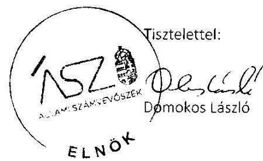

---

Melléklet
Ikt.szám: EL-2287-071/2020.

# Tájékoztatás   az észrevétel kezeléséről 

A „Nem állami humánszolgáltatók ellenőrzése - A köznevelési és szociális humánszolgáltatást nyújtó intézmények, szolgáltatók államháztartáson kívüli fenntartói központi költségvetésből kapott támogatásai felhasználásának ellenőrzése - 10 Alapítvány, 8 Egyesület szociális és köznevelési intézményfenntartó" címú jelentéstervezetre 2020. december 10-én érkezett észrevételt áttekintettük, a kezelésével kapcsolatban a következő tájékoztatást adom.

Elnök úrhölgy észrevételében megerősítette, az Alkohol Drogsegély Ambulancia (továbbiakban Egyesület) az adatszolgáltatás során nem bocsátott az Állami Számvevőszék (továbbiakban ÁSZ) rendelkezésére a képviseletre jogosult által aláírt hiteles számlarendet.

Tájékoztatom Elnök úrhölgyet, hogy az ÁSZ ellenőrzési megállapításai minden esetben az Állami Számvevőszékről szóló 2011. évi LXVI. törvénynek megfelelően az ellenőrzés során bekért és az arra nyitva álló határidőn belül rendelkezésre bocsátott dokumentumokon alapulnak. Az észrevétel mellékleteként beküldött, ellenőrzött időszakra vonatkozó dokumentumokat nem értékeltük.

Tájékoztatom, hogy az ÁSZ az EL-2212-001/2019. Iktatószámú adatbekérő levél 2. számú melléklete szerint kérte az aláírt, hiteles dokumentumokat, továbbá az Egyesület által szolgáltatott adatok teljes körűségét Elnök úrhölgy a 2019. november 25-én kelt teljességi és hitelességi nyilatkozatában igazolta. Mindezek alapján az észrevételt nem fogadjuk el, a jelentéstervezet módosítása nem indokolt.

Budapest, 2020. 11. hó 22. nap
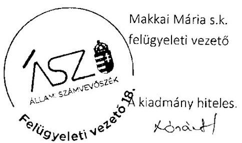

---

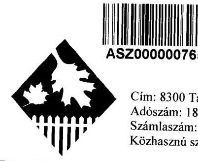

# GONDVISELÉS ALAPÍTVÁNY 

Cím: 8300 Tapolca Kossuth L. u. 15. Tel/fax: 87 / 411-033
Adószám: 18926583 - 2 - 19
intézményvezető 20/9464-182
Számlaszám: 11748100 - 20182209
gazdasági vezető 20/5281-741
Közhasznú szerv. nyílv. száma: Veszprémi Törvényszék 8. PK.60.086/1998/46.

## ÁLLAMI SZÁMVEVŐSZÉK

## Domonkos László Elnök

## Budapest

Apáczai Csere János u. 10.
1052

ÁLLAMI SZÁMVEVŐSZÉK
DE-1364151202011
Ereszet: 2020 DEC 11
Iktalószám:
MeFálist:

Tisztelt Elnök Úr !
Megkaptuk a EL-2287-048/2020. számon kelt jelentéstervezetüket, valamint a EL-2287-058/2020. számon kelt levelüket is.
Alapítványunk 22 éve működik. 22 éves fennállásunk alatt az ellenőrző szervek mindig mindent rendben találtak.
Az Ügyészség vizsgálata során sem talált törvénysértő gyakorlatot. Az állami támogatások felfüggesztése számunkra a megszűnést jelenti és 60 idős ember ellátásának további kilátástalanságát.

A jelentéstervezet 15. oldal 1.sz.mellékletben az Alapítványunkkal kapcsolatban leírt megállapításokkal nem értünk egyet, azokat elfogadni nem tudjuk.
1./ Fenntartó 2016-2017. évekre vonatkozó számviteli beszámolóját a felsorolt jogszabályokban előírt beszámolási kötelezettségének nem tett eleget. Mellékelem levelem 1.sz. mellékletében az Országos Bírósági Hivatal Elektronikus Eljárások Főosztályától kapott nyugtákat (2016-2019. évekre vonatkozóan, amelyek egyértelműen bizonyítják, hogy Alapítványunk minden évben határidőre és tartalommal eleget tett a beszámolási kötelezettségének.
A megállapításaik között szerepel, hogy a nem lettek a beszámolók aláírva, az lehet, hogy a nem egy aláírt példányt küldtünk, de a májusi Kuratóriumi ülések jegyzőkönyve mellett mindig irattárazva van aláírt példány is a beszámolóból. A most megküldött 2019. évre vonatkozó beszámolóból már az aláírt példányt küldtük meg az Önök részére.
A beszámolókat mindig az ügyfélkapun keresztül küldtük meg a Bírósági Hivatal részére, így a hitelesítés és aláírás ezen a módon is megtörtént.

---

2./ A fenntartó 2018. évben a fenntartó és a nem önállóan gazdálkodó intézménye gazdálkodásának elkülönítéséről nem gondoskodott, a kapott támogatások felhasználását a felsorolt jogszabályokban előírtak ellenére támogatásonként, feladatonkénti bontásban nem vezette elkülönítetten. Ez által a költségvetési támogatás felhasználásának ellenőrizhetőségét nem biztosította.

- A 2018. évben az alapítvány a 2016, 2017. évekhez képest a könyvelésében, kimutatásaiban változás nem történt. 2016, 2017 évekre vonatkozóan kifogásolás nem történt, ezért nem érthető a 2018. évre vonatkozó megállapítás. A főkönyvi bontás ugyanolyan minden évben, a támogatások címenként külön főkönyvi számlán vannak kimutatva, melyek meglétét a MÁK ellenőrzései mindig rendben találtak.
Alapítványunk éves gazdálkodását minden évben Független könyvvizsgáló vizsgálja, ezen jelentéseket is megküldtük az Állami Számvevőszék részére.
- Ismételten kinyilatkozzuk, hogy itt nincs még nem önállóan gazdálkodó intézmény sem, itt kizárólag csak az Alapítvány létezik, így nem értelmezhető, hogy „a fenntartó és a nem önállóan gazdálkodó intézménye gazdálkodásának elkülönítéséről nem gondoskodott”. Az alapító személye iránti tiszteletből neveztük el az otthont Dr. Somogyi József Idősek Otthonának.
- A megállapításuk utolsó mondatában foglaltakkal kapcsolatban kérjük szíveskedjenek a Magyar Államkincstár Veszprém megyei Igazgatóságát megkeresni, akik 22 éve rendszeres ellenőrzéseikkel éppen ezt vizsgálják. Az elmúlt évekre vonatkozó ellenőrzések jegyzőkönyveit is megküldtük.

# Tisztelt Elnök Úr ! 

Jelen levelem végén kinyilatkozom, hogy a most megküldött mellékletek minden másolati példánya mindenben megegyezik az eredeti dokumentummal és ezt jelen levelem aláírásával hitelt érdemlően igazolom is.

Tapolca, 2020-12-09.

Tisztelettel: Horváthné Somogyi Ildikó
Kuratórium Elnöke
GONDVISELÉS ALAPÍTVÁNY
8300 Tapolca, Kossuth L. u. 15.
Tel./fax: 87/411-033
Adószám: 18926583-2-19
OTP: 11748100-20182209

---

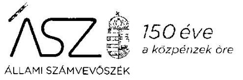

Ikt. szám: EL-2287-081/2020.

Horváthné Somogyi Ildikó Valéria úrhölgy
kuratóriumi elnök

Gondviselés Alapítvány
Tapolca

Tisztelt Elnök Úrhölgy!
A „Nem állami humánszolgáltatók ellenőrzése - A köznevelési és szociális humánszolgáltatást nyújtó intézmények, szolgáltatók államháztartáson kívüli fenntartói központi költségvetésből kapott támogatásai felhasználásának ellenőrzése - 10 Alapítvány, 8 Egyesület szociális és köznevelési intézményfenntartó" címmel készített számvevőszéki jelentéstervezetre tett 2020. december 9-én kelt észrevételét köszönettel megkaptam.

Az Állami Számvevőszék észrevételre vonatkozó álláspontjáról a felügyeleti vezető által készített részletes tájékoztatást mellékelten megküldöm.

Tájékoztatom Elnök úrhölgyet, hogy a számvevőszéki jelentésben - az Állami Számvevőszékről szóló 2011. évi LXVI. törvény 29. § (3) bekezdése alapján - a figyelembe nem vett észrevételt szerepeltetjük, annak indoklásával, hogy azt az Állami Számvevőszék miért nem fogadta el.

Budapest, 2020. 12. hó 23. nap

Melléklet: Tájékoztatás az észrevétel kezeléséről
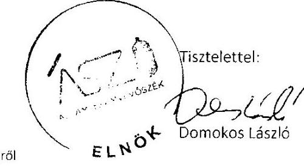

---

# Tájékoztatás   az észrevétel kezeléséről 

A „Nem állami humánszolgáltatók ellenőrzése - A köznevelési és szociális humánszolgáltatást nyújtó intézmények, szolgáltatók államháztartáson kívüli fenntartói központi költségvetésből kapott támogatásai felhasználásának ellenőrzése - 10 Alapítvány, 8 Egyesület szociális és köznevelési intézményfenntartó" címú jelentéstervezetre 2020. december 11-én érkezett észrevételt áttekintettük, annak kezelésével kapcsolatban a következő tájékoztatást adom.

Elnök úrhölgy észrevételének 1. pontja szerint az Alapítvány minden évben eleget tett beszámolási kötelezettségének, ezt igazolják az Országos Bírósági hivataltól kapott nyugták. Rögzíti továbbá, hogy adatszolgáltatásuk lehet, hogy nem aláírt beszámolót tartalmazott, de az aláírt példány irattárazva van.

Tájékoztatom Elnök úrhölgyet, hogy az Állami Számvevőszék (továbbiakban ÁSZ) ellenőrzési megállapításai minden esetben az Állami Számvevőszékről szóló 2011. évi LXVI. törvénynek megfelelően az ellenőrzés során bekért és az arra nyitva álló határidőn belül rendelkezésre bocsátott dokumentumokon alapulnak. Az észrevétel mellékleteként beküldött, ellenőrzött időszakra vonatkozó dokumentumokat nem értékeltük.

Az ellenőrzés során az arra nyitva álló határidőben az ÁSZ rendelkezésére bocsátott dokumentumokat ismételten áttekintettük. Tájékoztatom, hogy az EL-2229-001/2019. iktatószámú adatbekérő levél 2. számú mellékletének 1.5. pontja tartalmazta az aláírt 2016-2018. évi számviteli beszámolók bekérését. Az adatszolgáltatás keretében megküldött 2016-2017. évi beszámolók a számvitelről szóló 2000. évi C. törvény 20. § (6) bekezdésében foglalt előírás ellenére nem tartalmazták a képviseletre jogosult személy aláírását. Az adatszolgáltatás teljes körűségét Elnök úrhölgy a 2019. november 25-én kelt teljességi és hitelességi nyilatkozatában igazolta. Mindezek alapján az észrevételt nem fogadjuk el, a jelentéstervezet módosítása nem indokolt.

Az észrevétel 2. pontjában Elnök úrhölgy kinyilatkozza, hogy csak az Alapítvány létezik „nincs még nem önállóan gazdálkodó intézmény sem", az otthon csak az alapító iránti tiszteletből került elnevezésre, ezért nem értelmezhető „a fenntartó és a nem önállóan gazdálkodó intézménye gazdálkodásának elkülönítése".

Az Alapítvány az Elnök úrhölgy által az ÁSZ részére az adatbekéréssel összefüggésben küldött, 2020. február 4-én kelt levele szerint is, egy idősek otthonát működtet, mely nem önálló intézményi formában, hanem az Alapítvány szervezeti keretein belül működik. Az ÁSZ a rendelkezésre álló dokumentumok alapján állapította meg, hogy a „Fenntartó a 2018. évben a Fenntartó és a nem önállóan gazdálkodó intézménye gazdálkodásának elkülönítéséről nem gondoskodott, a kapott támogatások felhasználását az Atr. 16. § (1) és a Civil. tv. 20. § (4) bekezdésében foglaltak ellenére

---

támogatásonként, feladatonkénti bontásban nem vezette elkülönítetten."
Fenti megállapítás során az ÁSZ figyelembe vette, hogy a Fenntartó 2016-2017. évben nem tett eleget a számvitelről szóló 2000. évi C. törvény 20. § (6) bekezdésében előírt kötelezettségének, beszámoló hiányában a költségvetési támogatások felhasználásának elszámoltathatósága nem volt biztosított.

Tájékoztatom továbbá, hogy az EL-2287-058/2020. iktatószámú vagyonmegóvó intézkedés kilátásba helyezéséről szóló tájékoztatásra megküldött, 2019. évre vonatkozó dokumentumok értékeléséről külön levélben tájékoztatjuk Elnök úrhölgyet.

Budapest, 2020. 12. hó 23. nap
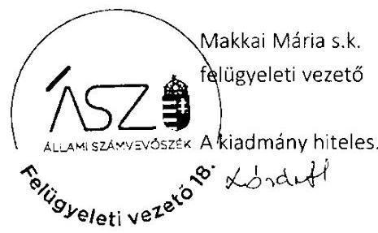

---

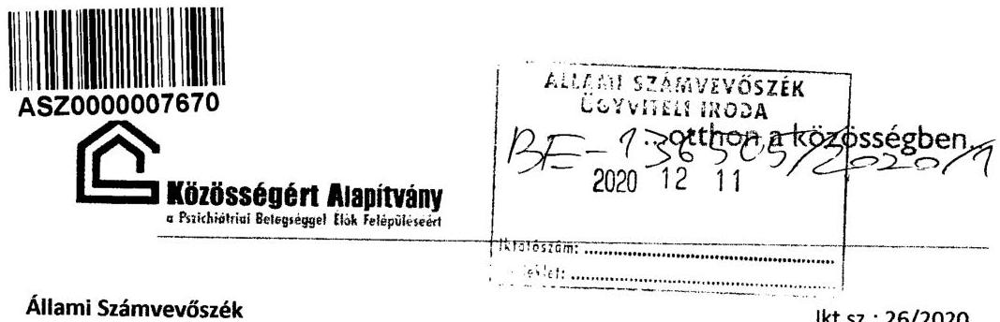

Állami Számvevőszék
Ikt.sz.: 26/2020
1052 Budapest
Apáczai Csere János u. 10.

Tisztelt Állami Számvevőszék!

Alulírott Dr. Grósz Attila Pál a Közösségért Alapítvány - A Pszichiátriai Betegséggel Élők Felépüléséért kuratóriumi elnöke, hivatkozva a T. Állami Számvevőszék 2020. november 30. napján kézbesített, EL-2287-048/2020. számú, 2020. november 25. napján kelt levelére az alábbiakkal keresem meg:

Élve a 2011. évi LXVI. törvény 29. § (2) bekezdésében foglalt jogommal, a Jelentéstervezet 15. oldalán megfogalmazott I. SZ. Melléklet: Az ellenőrzött fenntartókkal kapcsolatos részletes megállapítás, miszerint „Az ellenőrzött Fenntartó a 2016-2018. években a Számv. tv. 161. § (1) bekezdésében foglaltak ellenére nem rendelkezett számlarenddel, ezáltal nem teremtette meg a költségvetési támogatások elszámoltatható, átlátható felhasználásának szabályozási feltételeit..." tekintetében kívánok észrevételt tenni.

Az ellenőrzési eljárás során sajnálatos módon elkerülte a figyelmünket, hogy a „Számviteli politika" mellékletét képező „Számlarend" helyett tévesen a „Számlatükör" került feltöltésre. Jelezni kívánom, hogy a 2020. január 27. napján kelt hiánypótlási felszólítás (ikt.sz.: EL-2210-011/2020) sem tartalmazott erre irányuló utalást, a Számlarenddel kapcsolatos hiányosság nem merült fel, így a mulasztásunkról már csak a Jelentéstervezetből értesültünk.

Az ellenőrzési időszakban és jelenleg is hatályos Számlarendet jelen észrevétellel egyidejűleg, csatolva küldöm, bízva abban, hogy az észrevételben foglaltakra,
 valamint a hiány pótlására tekintettel a Jelentéstervezet fenti megállapítása módosításra kerül, és ezáltal elkerülhetővé válik a vagyonmegóvási intézkedés elrendelése.

Siófok, 2020. december 8.
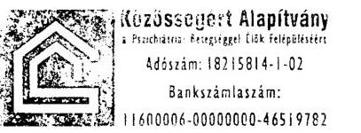

Tisztelettel:

---

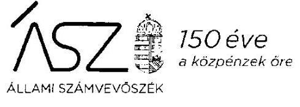

Ikt. szám: EL-2287-082/2020.

Dr. Grósz Attila Pál úr
kuratóriumi elnök
KÖZÖSSÉGÉRT ALAPÍTVÁNY - A PSZICHIÁTRIAI BETEGSÉGGEL ÉLŐK FELÉPÜLÉSÉÉRT

Ortü

Tisztelt Elnök Úr!

A „Nem állami humánszolgáltatók ellenőrzése - A köznevelési és szociális humánszolgáltatást nyújtó intézmények, szolgáltatók államháztartáson kívüli fenntartói központi költségvetésből kapott támogatásai felhasználásának ellenőrzése - 10 Alapítvány, 8 Egyesület szociális és köznevelési intézményfenntartó" címmel készített számvevőszéki jelentéstervezetre tett, 2020. december 8-án kelt észrevételét köszönettel megkaptam.

Az Állami Számvevőszék észrevételre vonatkozó álláspontjáról a felügyeleti vezető által készített részletes tájékoztatást mellékelten megküldöm.

Tájékoztatom Elnök urat, hogy a számvevőszéki jelentésben - az Állami Számvevőszékről szóló 2011. évi LXVI. törvény 29. § (3) bekezdése alapján - a figyelembe nem vett észrevételt szerepeltetjük, annak indoklásával, hogy azt az Állami Számvevőszék miért nem fogadta el.

Budapest, 2020. év 12. hó 29. nap

Melléklet: Tájékoztatás az észrevétel kezeléséről

Tisztelettel:
2052 Budapest, Apáczai Csere János u. 10, 1364 Budapest 4. Pf. 54.
számvevosek@aaz.hu | www.aaz.hu | www.az.finportal.hu

---

Melléklet
Ikt.szám: EL-2287-082/2020.

# Tájékoztatás   az észrevétel kezeléséről 

A „Nem állami humánszolgáltatók ellenőrzése - A köznevelési és szociális humánszolgáltatást nyújtó intézmények, szolgáltatók államháztartáson kívüli fenntartói központi költségvetésből kapott támogatásai felhasználásának ellenőrzése - 10 Alapítvány, 8 Egyesület szociális és köznevelési intézményfenntartó" címú jelentéstervezetre 2020. december 11-én érkezett észrevételt áttekintettük, annak kezelésével kapcsolatban a következő tájékoztatást adom.

Elnök úr észrevételében elismerte, hogy a „Számviteli politika" mellékletét képező „Számlarend" helyett tévesen „Számlatükör" került feltöltésre az adatszolgáltatás során.

Tájékoztatom Elnök urat, hogy az Állami Számvevőszék ellenőrzési megállapításai minden esetben az Állami Számvevőszékről szóló 2011. évi LXVI. törvénynek megfelelően az ellenőrzés során bekért és az arra nyitva álló határidőn belül rendelkezésre bocsátott dokumentumokon alapulnak. Az észrevétel mellékleteként beküldött, ellenőrzött időszakra vonatkozó dokumentumokat nem értékeltük.

Jelzem továbbá, hogy az Állami Számvevőszék az ellenőrzés lefolytatásakor több lépcsőben kér adatokat. Az észrevételben hivatkozott EL-2210-011/2020. iktatószámú levél adatbekérésre vonatkozott és nem hiánypótlási felszólítás volt.

Fentiek alapján, valamint Elnök úr által az adatszolgáltatás teljességét igazoló 2019. november 26-án kelt teljességi és hitelességi nyilatkozat alapján az észrevételt nem fogadjuk el, a jelentéstervezet módosítása nem indokolt.

Budapest, 2020. év 11. hó 29. nap
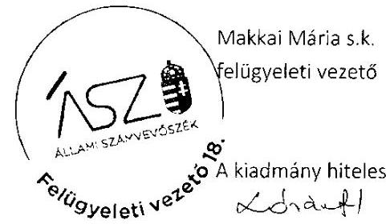

---

# NYUGODT ÉLET ALAPÍTVÁNY 

Tárgy : Észrevétel nem állami humánszolgáltatók ellenőrzésére NYUGODT ÉLET ALAPÍTVÁNY jelentés tervezetére

## ÁLLAMI SZÁMVEVŐSZÉK

## Domokos László Úr részére

## Budapest

Apáczai Csere János út 10.

## Tisztelt Cimzett!

Alulírott Kónyáné Dr. Bodnár Eszter Ágnes, mint a Nyugodt Élet Alapítvány (továbbiakban: Alapítvány) (székhely: 3792 Sajóbábony, Bocskai út 3., adószám: 18420379-1-05) Kuratóriumának az elnöke az EL-2287-064/2020. iktatószámú jelentéstervezet vonatkozásában az alábbi észrevételt teszem:

Az Állami Számvevőszék (továbbiakban: ÁSZ) 2019. november 19. napján kelt, EL-22180001/2019. adatbekérő projekt 2. számú mellékletében meghatározott dokumentumok kerültek feltöltésre. A 2. mellékletben kért olyan dokumentumok, amelyek az Alapítvány támogatásának felhasználásában nem releváns, azokról nyilatkozatot tettem.

A számvitelről szóló 2000. évi C. törvény (továbbiakban: Szám. tv.) 4. § (1) bekezdése alapján a gazdálkodó működéséről, vagyoni, pénzügyi és jövedelmi helyzetéről az üzleti év könyveinek zárását követően, e törvényben meghatározott könyvvezetéssel alátámasztott beszámolót köteles - magyar nyelven - készíteni.

Az egyesülési jogról, a közhasznú jogállásról, valamint a civil szervezetek működéséről és támogatásáról szóló 2011. évi CLXXV. törvény (továbbiakban: Civil tv.) 28. § (1) A civil szervezet a működéséről, vagyoni, pénzügyi és jövedelmi helyzetéről az üzleti év könyveinek lezárását követően az üzleti év utolsó napjával, illetve a megszünés napjával, mint mérlegfordulónappal a jogszabályban meghatározottak szerint köteles beszámolót készíteni.

Az ÁSZ által megküldött jelentéstervezet szerint:
„Az ellenőrzött Fenntartó Civil tv. 28. § (1) és a Szám. tv 4. § (1) bekezdéseiben foglaltak ellenére a 2016-2018 évre vonatkozóan nem tett eleget a beszámoló kötelezettségének"

A fenti jogszabálynak megfelelően az Alapítvány, mindig a törvényekben meghatározott módon, valamint határidőben tett eleget a beszámoló kötelezettségének.
A beszámolók a törvényben előírt módon közzé lett téve a http://birosag/civil_szervezetek_nevjegyzeke webhelyen.

---

A részünkre megküldött program 6. fókuszkérdés 6.2 alpontjának értelmében az elektronikus közzétételi kötelezettség teljesítését visszaigazoló dokumentummal bizonyítható, melyet a beszámolókkal együtt az észrevételemhez csatolok.
Az adatbekérő projekt 1. tárgyú levelük alapján a 2016-2018. évi aláírt beszámoló az 1.5. alpont alá került feltöltésre, továbbá az alátámasztó dokumentumok az 1.2 és 1.3 alpont alá, amelyet tartalmazott a teljességi és hitelességi nyilatkozat is.

Továbbá tájékoztatom, hogy az adatbekérő utolsó határnapján került feltöltésre, technikai probléma adódott, amelyet az Alapítványunk jelzett az ÁSZ felé. Mivel telefonos technikai segítséget nem tudtunk kérni, ezért e-mailben kértünk. Ennek ellenére a teljességi nyilatkozatot kézzel felvezettük és beküldtük. A rákövetkező napon az ügyfélszolgálat kétségesen segített és újra megnyitotta a felületet, amellyel a rendszer által generált teljességi és hitelességi nyilatkozatot le tudtuk tölteni és meg tudtuk küldeni az ÁSZ felé.

Az ÁSZ 2020. január 30. napján kelt EL-2218-016/2020. iktatószámú hiánypótló levelükben megtettük a szükséges nyilatkozatokat.

A jelentéstervezet 1. számú melléklete alapján:
„az ellenőrzött Fenntartó intézményén keresztül látja el az időskorúak ápolását."
Az Alapítványnak nincs intézménye, a HOLLANDKERT IDŐSEK OTTHONA csak egy fantázia név, nem különálló szervezet. Erre vonatkozó, valamint a beszámolóra nyilatkozatainkat is megtettem (hiánypótló levél alapján 1.1.1 - 1.3.1.1. pontokban). Az időskorúak ellátását a Nyugodt Élet Alapítvány végzi.

Kérem a fentiek szíves elfogadását.

Sajóbábony, 2020. 12. 07.
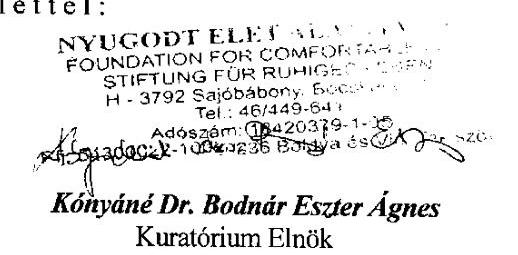

---

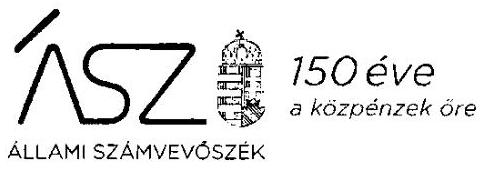

Ikt. szám: EL-2287-083/2020.

Kónyáné Dr. Bodnár Eszter úrhölgy
elnök
NYUGODT ÉLET ALAPÍTVÁNY

# Sajóbábony 

Tisztelt Elnök Úrhölgy!

A „Nem állami humánszolgáltatók ellenőrzése - A köznevelési és szociális humánszolgáltatást nyújtó intézmények, szolgáltatók államháztartáson kívüli fenntartói központi költségvetésből kapott támogatásai felhasználásának ellenőrzése - 10 Alapítvány, 8 Egyesület szociális és köznevelési intézményfenntartó" címmel készített számvevőszéki jelentéstervezetre tett, 2020. december 7-én kelt észrevételét köszönettel megkaptam.

Az Állami Számvevőszék észrevételre vonatkozó álláspontjáról a felügyeleti vezető által készített részletes tájékoztatást mellékelten megküldöm.

Tájékoztatom Elnök úrhölgyet, hogy a számvevőszéki jelentésben - az Állami Számvevőszékről szóló 2011. évi LXVI. törvény 29. § (3) bekezdése alapján - a figyelembe nem vett észrevételt szerepeltetjük, annak indoklásával, hogy azt az Állami Számvevőszék miért nem fogadta el.

Budapest, 2020. év 12. hó 21. nap

Melléklet: Tájékoztatás az észrevétel kezeléséről
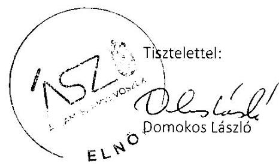

---

# Tájékoztatás   az észrevétel kezeléséről 

A „Nem állami humánszolgáltatók ellenőrzése - A köznevelési és szociális humánszolgáltatást nyújtó intézmények, szolgáltatók államháztartáson kívüli fenntartói központi költségvetésből kapott támogatásai felhasználásának ellenőrzése - 10 Alapítvány, 8 Egyesület szociális és köznevelési intézményfenntartó" címú jelentéstervezetre 2020. december 14-én érkezett észrevételt áttekintettük, annak kezelésével kapcsolatban a következő tájékoztatást adom.

Elnök úrhölgy észrevételében tájékoztatott, hogy a NYUGODT ÉLET ALAPÍTVÁNY mindig a törvényekben meghatározott módon, valamint határidőben tett eleget a beszámolási kötelezettségének.

Tájékoztatom Elnök úrhölgyet, hogy az Állami Számvevőszék ellenőrzési megállapításai minden esetben az Állami Számvevőszékről szóló 2011. évi LXVI. törvénynek megfelelően az ellenőrzés során bekért és az arra nyitva álló határidőn belül rendelkezésre bocsátott dokumentumokon alapulnak. Az észrevétel mellékleteként beküldött, ellenőrzött időszakra vonatkozó dokumentumokat nem értékeltük.

Az ellenőrzés során az arra nyitva álló határidőben az ÁSZ rendelkezésére bocsátott dokumentumokat ismételten áttekintettük. Tájékoztatom, hogy az EL-2218-001/2019. iktatószámú adatbekérő levél 2. számú mellékletének 1.5. pontja tartalmazta az aláírt 2016-2018. évi számviteli beszámolók bekérését. Az Alapítvány által e címen rendelkezésre bocsátott „2016-2018_főkönyvi kivonatok" nem feleltethetők meg az Alapítvány képviseletére jogosult által aláírt 2016-2018 évi számviteli beszámolónak. Továbbá az adatszolgáltatás teljes körűségét Elnök úrhölgy a 2019. november 27-én kelt teljességi és hitelességi nyilatkozatában igazolta, amelyben a rendelkezésre bocsátott dokumentumok között a főkönyvi kivonatok szerepeltek.

Elnök úrhölgy észrevétele szerint „a HOLLANDKERT IDŐSEK OTTHONA csak egy fantázia név, nem különálló szervezet". Ezzel összhangban áll a jelentéstervezetben szerepeltetett információ, miszerint „A sajóbábonyi székhelyű NYUGODT ÉLET ALAPÍTVÁNY a 2016-2018. években egy nem önálló jogi személy szociális intézményt működtetett." Ezt támasztja alá Elnök úrhölgy 2020. február 4-én kelt, az EL-2218-015/2020. iktatószámú ellenőrzési programhoz tett és az Állami Számvevőszék részére megküldött nyilatkozata is, amelyben jelzi, hogy „a Hollandkert Idősek Otthona nem önálló gazdálkodású szervezet".

---

Továbbá az ellenőrzés rendelkezésére bocsátott, a Borsod-Abaúj-Zemplén Megyei Kormányhivatal szolgáltató bejegyzésére vonatkozó határozata, amelyben az engedélyes a Hollandkert.

Mindezek alapján az észrevételt nem fogadjuk el, a jelentéstervezet módosítása nem indokolt.

Budapest, 2020. év 12. hó 31. nap

Makkai Mária s.k.
felügyeleti vezető

A kiadmány hiteles.

---

# Állami Számvevőszék 

Budapest
Apáczai Csere János utca 10.
1364.
Domokos László
Elnök Úr
részére
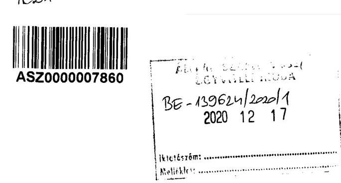

Iktatószám: EL-2287-048/2020.

Tisztelt Elnök Úr!

Hivatkozással a fenti iktatószámú, „Nem állami humánszolgáltatók ellenőrzése - A köznevelési és szociális humánszolgáltatást nyújtó intézmények, szolgáltatók államháztartáson kívüli fenntartói központi költségvetésből kapott támogatásai felhasználásának ellenőrzése - 10 Alapítvány, 8 Egyesület szociális és köznevelési intézményfenntartó" tárgyában készült számvevőszéki jelentéstervezetre előzetesen szeretném megköszönni az Állami Számvevőszék munkatársai által elvégzett munkát.

A jelentéstervezettel kapcsolatban az alábbi észrevételt kívánjuk tenni.
A mellékletekben intézményünk vonatkozásában megjelölt hiányosság, mely szerint az ellenőrzött Fenntartó a 2016-2018. években a Számv. tv. 161. § (1) bekezdésében foglaltak ellenére nem rendelkezett a képviseletre jogosult által aláírt hatályos számlarenddel, ezáltal nem teremtette meg a költségvetési támogatások elszámolható, átlátható felhasználásának szabályozási feltételeit - nem felel meg a valóságnak.

Teljességi nyilatkozatunkban is látható, hogy a számlarendeket az ellenőrzés rendelkezésére bocsátottuk, azonban azokból a feltöltést végző kolléga nem az általam aláírt változatot szkennelte be, hanem tévedésből az Egyesület könyvelője által előkészített változatot töltötte fel Önöknek, ugyanis a számlarendet minden esetben a könyvelő készíti elő a számlatükör megbontását követően, melyet aztán magam hagyok jóvá és helyezek hatályba.

Kérem a T. Elnök urat, az észrevételünket vizsgálják meg és mérlegeljék, továbbá amennyiben azokat elfogadják, úgy a jelentéstervezetet ennek megfelelően módosítani szíveskedjenek.

Bajót, 2020. december 11.
Tisztelettel
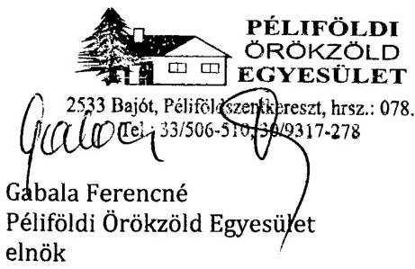

---

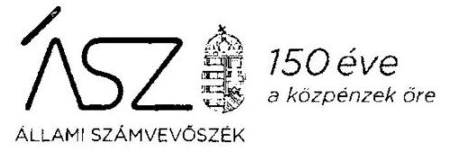

Ikt. szám: EL-2287-088/2020.

Gabala Ferencné úrhölgy
elnök
Péliföldi Örökzöld Egyesület

# Bajót 

Tisztelt Elnök Úrhölgy!

A „Nem állami humánszolgáltatók ellenőrzése - A köznevelési és szociális humánszolgáltatást nyújtó intézmények, szolgáltatók államháztartáson kívüli fenntartói központi költségvetésből kapott támogatásai felhasználásának ellenőrzése - 10 Alapítvány, 8 Egyesület szociális és köznevelési intézményfenntartó" címmel készített számvevőszéki jelentéstervezetre tett, 2020. december 11-én kelt észrevételét köszönettel megkaptam.

Az Állami Számvevőszék észrevételre vonatkozó álláspontjáról a felügyeleti vezető által készített részletes tájékoztatást mellékelten megküldöm.

Tájékoztatom Elnök úrhölgyet, hogy a számvevőszéki jelentésben - az Állami Számvevőszékről szóló 2011. évi LXVI. törvény 29. § (3) bekezdése alapján - a figyelembe nem vett észrevételt szerepeltetjük, annak indoklásával, hogy azt az Állami Számvevőszék miért nem fogadta el.

Budapest, 2021. év 01. hó 05. nap

Melléklet: Tájékoztatás az észrevétel kezeléséről
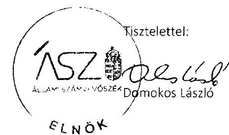

---

Melléklet
Ikt.szám: EL-2287-088/2020.

# Tájékoztatás   az észrevétel kezeléséről 

A „Nem állami humánszolgáltatók ellenőrzése - A köznevelési és szociális humánszolgáltatást nyújtó intézmények, szolgáltatók államháztartáson kívüli fenntartói központi költségvetésből kapott támogatásai felhasználásának ellenőrzése - 10 Alapítvány, 8 Egyesület szociális és köznevelési intézményfenntartó" címú jelentéstervezetre 2020. december 17-én érkezett észrevételt áttekintettük, annak kezelésével kapcsolatban a következő tájékoztatást adom.

Elnök úrhölgy észrevételében megerősítette, hogy az adatszolgáltatás során nem hiteles, aláírt 2016-2017-2018 évi számlarendet bocsátottak az Állami Számvevőszék rendelkezésére.

Tájékoztatom Elnök úrhölgyet, hogy az Állami Számvevőszék ellenőrzési
 megállapításai minden esetben az Állami Számvevőszékről szóló 2011. évi LXVI. törvénynek megfelelően az ellenőrzés során bekért és az arra nyitva álló határidőn belül rendelkezésre bocsátott dokumentumokon alapulnak. Továbbá az Egyesület által szolgáltatott adatok teljes körűségét Elnök úr a 2019. november 25-én kelt teljességi és hitelességi nyilatkozatában igazolta.

Fentiekre tekintettel az észrevételt nem fogadjuk el, a jelentéstervezet módosítása nem indokolt.

Budapest, 2021. év 01. hó 05. nap
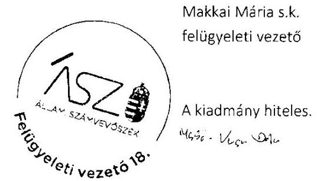

---

# 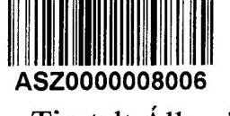 

Tisztelt Állami Számvevőszék!
Alulírott Mikó Anita gazdasági vezető az alábbi megjegyzéseket tenném az észrevételhez.

Néhány dokumentumon azért nincs a fenntartó aláírása és pecsétje a kért helyen, mert cégkapun lett beadva és aláírás nélkül kérte az Államkincstár, illetve az Országos Bírósági Hivatal (e-papír). Mivel az eredeti úgy ment be, ezért utólag nem tettünk.

Számomra nem világos, hogy milyen módon történik a pénzeszközök rendeltetésellenes felhasználása és hogy min tudnánk változtatni. Ezért kérnénk, hogy minden ehhez szükséges információt adjanak meg.

A 2019-es év anyagával kapcsolatban a meglévő dokumentumokat tudom megküldeni, azon én változtatni nem tudok és nem is akarok, mert egy lezárt évről van szó. Elkészült főkönyvről, beadott beszámolóról, beadott és elfogadott éves elszámolásról van szó.

Így a hiányosság megszüntetését alátámasztó dokumentumokkal majd csak a jövőben tudok szolgálni, ha konkrétan megírták, hogy min változtassak.

A támogatások folyósításának felfüggesztése nem megoldás a problémára, mert nem tudjuk a részletes problémát és nem fogunk tudni cselekedni. Azzal annyit fognak elérni, hogy egy hónapig még fogunk tudni működni, utána pedig el kell kezdenünk intézni az intézmény szinte azonnali bezárását.
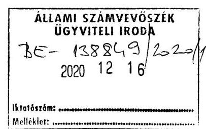

---

Minket több hivatal is ellenőriz folyamatosan. A nagyobb szervek mellett az ÁNTSZ, a NÉBIH, a Katasztrófavédelem, az Építésügy, a Munkaügy. Alapnak veszik, hogy egy átlagember ennyi féle folyamatosan meg tudjon felelni. Pedig nem az. Óriási munka. Most a világjárvány miatt pedig jóval nehezebbek a mindennapok és március óta mindenki erején felül teljesít. De az erőnk és a kitartásunk véges. Ezért kérnénk, hogy ne szankcióról döntsenek, hanem vegyék fel velünk a kapcsolatot és beszéljük át az állapotot. Nekünk is jobb úgy dolgozni, hogy tudjuk, hogy az biztosan megfelelő. Sajnálnánk a sok dolgozót elküldeni, illetve a járvány alatt nem lenne egyszerű ennyi idősnek egyből helyet találni szerteszét a megyében.

Köszönöm, hogy elolvasták levelem.

Gyula, 2020. december 10.

Tisztelettel: Mikó Anita
a „Segítő Kezek" Idősek Otthona gazdasági vezetője

---

# NYILATKOZAT 

Alulírott Hack Ferenc, a „SEGÍTŐ KEZEK" Idősek Otthona Gyulai Alapítványa kuratóriumi elnöke, mint a fenntartó képviselője az alábbiakról nyilatkozom: A gyulai „Segítő Kezek" Idősek Otthona BEC/01/639-6/2014. számú határozatlan engedéllyel rendelkező bentlakásos idősek otthona.

Az Államkincstár által utalt összegeket teljes egészében az alapító okiratban foglalt szociális célra fordítja az alapítvány. Az éves beszámolót az intézmény vezetősége a kuratórium elé terjeszti, majd döntenek annak elfogadásáról. Független felügyelő bizottság is ellenőrzi az intézmény munkáját. Az állami támogatáson felül a bevételek többi részét döntően az ellátottak által fizetett térítési díj és a belépési hozzájárulás teszi ki, melyeket az intézménynek fizetnek meg.

Az esetleges munkaügyi pályázati támogatást és az 1%-os felajánlásokból származó bevételt is az alapítvány kapja, melyet szintén maradéktalanul az intézmény rendelkezésére bocsájt. Mivel az intézmény feladata összesen csak egy bentlakásos idősek otthona működtetése, amely a székhelyen működik, ezért nincs szükség a támogatás feladatonkénti bontására. A támogatásból egy forint sem kerül más feladatra, célra. Ezért nincs mitől és nem is tudjuk mitől elkülöníteni. A fenntartó csak ellenőrző szervként működik. Semmilyen díjazást, osztalékot, jutalékot, prémiumot nem kap. Vállalkozási tevékenységet nem folytat.
A K&H bankszámlára az állami támogatások és egyéb intézményi bevételek is érkeznek, amelyről viszont csak a szociális intézmény működtetésére történik pénzfelvétel.
Felvenni a számláról a fenntartó képviselője és az intézményvezető tud együttesen. Az ebankot a fenntartó által megbízott gazdasági vezető intézi.
A támogatásonkénti elkülönítés véleményünk szerint rendben van, a könyvelésben megbontásra kerül, egyébként el sem tudnánk vele számolni évente az Államkincstár felé. Abban az esetben számunkra is átláthatatlan lenne.
A 27 év alatt a MÁK mellett a Kormányhivatal, az SZGYF, a Módszertan rendszeresen ellenőrzött és ezen a téren hiányosság nem merült fel. Félreértés nem adódott.
Az Önök által megküldött jelentéstervezetben láttuk a megfogalmazást, miszerint „pszichiátriai betegek otthona, időskorúak gondozóháza közhasznú feladatokat" látunk el. Itt jeleznénk Önöknek, hogy ez nem helytálló. Pszichiátriai részleggel nem rendelkezünk. Gondozóházunk pedig nincs.

---

Egy 58 fős férőhellyel rendelkező bentlakásos idősek otthona vagyunk. 48 fő átlagos ellátott, míg 10 fő demens ellátott, azonban számukra külön részleggel nem kell rendelkeznünk. Ez az ellátási forma azon formák egyike, ami a legkevesebbe kerül az államnak. Emellett semmilyen pályázati lehetőséget nem kapunk fejlesztésre, korszerűsítésre, ellentétben az önkormányzati vagy egyházi fenntartású intézményekkel. Belépési hozzájárulást is csak a férőhelyek felére kérhetünk, ellentétben másokkal, pedig ugyanaz az elvárás. Soha egy magyarázatot nem kaptunk rá sehonnan, hogy miért ér bennünket többszörös diszkrimináció folyamatosan. Úgy gondoljuk, hogy az elmúlt 27 évünk minden szempontból a becsületes hozzáállásról szólt. Annak ellenére, hogy alapnormativából gazdálkodunk, pénzügyi hátralékaink nincsenek, szállítói tartozásunk nincs, hitelünk nincs. A tárgyi és a személyi feltételeknek ezidáig megfeleltünk. Semmilyen feljelentés még nem volt sem a hozzátartozók, sem az ellátottak részéről. A fenntartó képviselője a pénzügyi tevékenységben, napi szinten részt vesz. Ellenőrzi, ellenjegyzi a törvényszerű működést, a pénzeszközök felhasználását, kezelését. Amennyiben külön számlaszámot nyitna az intézmény, melyre utána a fenntartó átutalná a támogatást, az megfelelne Önöknek? Az megoldás lenne a problémára?
Ennek viszont több százezer forintos banki költségei lennének, amit non-profit szervezetként nem mindig egyszerű kigazdálkodni. De amennyiben erre van szükség természetesen megtesszük. Illetve kérnénk, hogy konkrétan, érthetően írják le, hogy min kellene változtatni a mindennapokban, a gyakorlatban. Más, ilyen típusú intézménnyel nem vagyunk kapcsolatban, nincs összehasonlítási alap, minta a számunkra. Kérnénk a segítségüket mindenben, amit problémaként érzékelnek, hogy a jövőben megfeleljünk Önök felé is. Megértjük, ha ez a működési forma szokatlan Önöknek, mert tudjuk, hogy többségében más fenntartó típussal találkoznak, de semmilyen visszaélés ezidáig nem történt. Mi minden forintról tudunk, átlátjuk az éves működést teljes egészében és az elszámolás mindig rendben megtörtént. Éppen azért, mert egyszerűek vagyunk.
A tavalyi évről szóló bekért anyagokat mellékeltük, azonban ugyanolyan könyvelési és számadási formát fognak tapasztalni, mint az előző években, mert nem gondoltuk, hogy bárminemű probléma lenne ezzel a módszerrel és nyilvántartással.
Elnézést a szakmaiatlan megfogalmazásért, de nálunk éppen mostanában tetőzik a járvány, így konkrétan a dolgozók és az ellátottak életéért küzdünk minden percben Gyula, 2020. 12. 08.
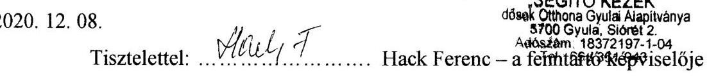

---

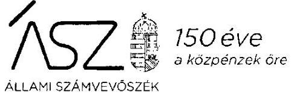

Ikt. szám: EL-2287-091/2020.

Hack Ferenc úr
kuratóriumi elnök
"SEGÍTŐ KEZEK" Idősek Otthona Gyulai Alapítványa
Gyula

Tisztelt Elnök Úr!
A „Nem állami humánszolgáltatók ellenőrzése - A köznevelési és szociális humánszolgáltatást nyújtó intézmények, szolgáltatók államháztartáson kívüli fenntartói központi költségvetésből kapott támogatásai felhasználásának ellenőrzése - 10 Alapítvány, 8 Egyesület szociális és köznevelési intézményfenntartó" címmel készített számvevőszéki jelentéstervezetre tett, 2020. december 8-án kelt észrevételét köszönettel megkaptam.

Az Állami Számvevőszék észrevételre vonatkozó álláspontjáról a felügyeleti vezető által készített részletes tájékoztatást mellékelten megküldöm.

Tájékoztatom Elnök urat, hogy a számvevőszéki jelentésben - az Állami Számvevőszékről szóló 2011. évi LXVI. törvény 29. § (3) bekezdése alapján - a figyelembe nem vett észrevételt szerepeltetjük, annak indoklásával, hogy azt az Állami Számvevőszék miért nem fogadta el.

Budapest, 2021. év 01. hó 01. nap

Melléklet: Tájékoztatás az észrevétel kezeléséről
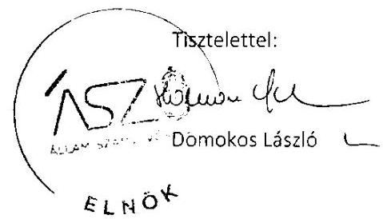

---

Melléklet
Ikt.szám: EL-2287-091/2020.

# Tájékoztatás   az észrevétel kezeléséről 

A „Nem állami humánszolgáltatók ellenőrzése - A köznevelési és szociális humánszolgáltatást nyújtó intézmények, szolgáltatók államháztartáson kívüli fenntartói központi költségvetésből kapott támogatásai felhasználásának ellenőrzése - 10 Alapítvány, 8 Egyesület szociális és köznevelési intézményfenntartó" címú jelentéstervezetre 2020. december 16-án érkezett észrevételt áttekintettük, annak kezelésével kapcsolatban a következő tájékoztatást adom.

Elnök úr nyilatkozatában tájékoztat arról, hogy a "SEGÍTŐ KEZEK" Idősek Otthona Gyulai Alapítványa az Államkincstár által utalt összegeket teljes egészében az alapító okiratban foglalt szociális célra fordítja. Továbbá az Alapítvány intézményének feladata összesen csak egy bentlakásos idősek otthona működtetése, mely az Alapítvány székhelyén működik, ezért nincs szükség a támogatás feladatonkénti bontására.

Tájékoztatom Elnök urat, hogy az Állami Számvevőszék ellenőrzési megállapításai minden esetben az Állami Számvevőszékről szóló 2011. évi LXVI. törvénynek megfelelően az ellenőrzés során bekért és az arra nyitva álló határidőn belül rendelkezésre bocsátott dokumentumokon alapulnak.

Az ellenőrzés során az arra nyitva álló határidőben az ÁSZ rendelkezésére bocsátott dokumentumokat ismételten áttekintettük, melyekből megállapítható, hogy az Alapítvány a 489/2013. (XII. 18.) Korm. rendelet az egyházi és nem állami fenntartású szociális, gyermekjóléti és gyermekvédelmi szolgáltatók, intézmények és hálózatok állami támogatásokról 16. § (1) és a 2011. évi CLXXV. törvény az egyesülési jogról, a közhasznú jogállásról, valamint a civil szervezetek működéséről és támogatásáról 20. § (4) bekezdésében foglaltak ellenére a támogatás felhasználását támogatásonként, feladatonkénti bontásban, elkülönítetten nem kezeli. Ezt Elnök úr nyilatkozatában is megerősíti azzal, hogy a költségvetési támogatás mellett a fenntartó más bevételi forrással (térítési díj, belépési hozzájárulás, 1%-os felajánlás) is rendelkezik. Minderre tekintettel a jelentéstervezet vonatkozó megállapításának módosítása nem indokolt.

Az Alapítvány dokumentumai, az ellenőrzés rendelkezésére bocsátott működési engedély, valamint Elnök úr észrevétele alapján, az Alapítvány intézménye által ellátott feladatokat pontosítjuk az alábbiak szerint: „Az ellenőrzött Fenntartó intézményén keresztül időskorúak otthoni ápoló-gondozó ellátása feladatokat látott el."

---

Tájékoztatom továbbá, hogy az EL-2287-059/2020. iktatószámú vagyonmegóvó intézkedés kilátásba helyezéséről szóló tájékoztatásra megküldött, 2019. évre vonatkozó dokumentumok értékeléséről külön levélben tájékoztatjuk Elnök urat.

Budapest, 2021. év 01. hó 01. nap
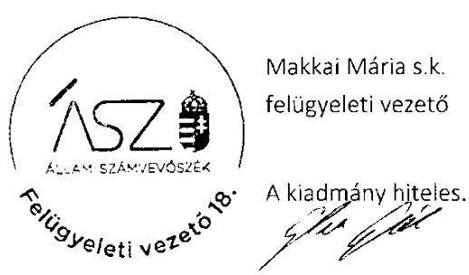

---

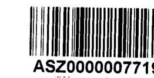

# Észrevétel a Számvevőszék alábbi megállapításaira: 

„A siófoki székhelyű "Segítő Kezek" Szociális és Házi Segítségnyújtó Alapítvány a 2016-2018. években egy nem önálló jogi személy szociális szolgáltatót tartott fenn. Az ellenőrzött Fenntartó a szolgáltatóján keresztül házi segítségnyújtás, szociális segítés és házi segítségnyújtás személyi gondozás közhasznú feladatokat látott el.
Az ellenőrzött Fenntartó a 2016-2018. években, a Fenntartó és a nem önállóan gazdálkodó intézménye gazdálkodásának elkülönítéséről nem gondoskodott, a kapott támogatások felhasználását az Atr. 16. § (1) és a Civil.tv. 20. § (4) bekezdésében foglaltak ellenére támogatásonként, feladatonkénti bontásban nem vezette elkülönítetten. Ezáltal a költségvetési támogatás felhasználásának a Számv. tv. 161/A. § (2) bekezdésében előírt ellenőrizhetőségét nem biztosította."

A Segítő Kezek Alapítvány maga a szolgáltató, nem tart fenn külön intézményt. Az Alapítvány fő tevékenysége a szociális segítés és házi segítségnyújtás, melyet főtevékenységként végez. Az Alapítvány magánalapítvány és az alábbi törvények és jogszabályok alapján működik:

- 2000. évi C. Törvény 14.§. a Számvitelről
- 479/2016. (XII. 28.) Korm. rendelet
- 2011. évi CLXXV. Törvény (Civil Tv.)
- 350/2011 (XII.30.) Kormányrendelet
- 2011. évi CLXXXI. Törvény

Ezekben a törvényekben és rendeletekben konkrétan leírásra kerül, a gazdálkodás és a könyvvezetés szabályozása. A Segítő Kezek Alapítvány ezeket a szabályokat betartotta, gazdálkodását és könyvelését ezek szerint vezeti. Mivel nem különül el
 semmilyen külön intézménye, így a jogszabály szerinti költségcsoportosítás az alábbi: (és így is vezeti a könyveit)

- Összköltség eljárású eredménykimutatás esetén:
- Anyagjellegű ráfordítás
- Személyi jellegű ráfordítás
- Értékcsökkenési leírás
- Egyéb, pénzügyi műveletek ráfordításai

A könyvvitelében csak az alap és a vállalkozási tevékenységet kell elkülönítenie. Mivel nincs vállalkozói tevékenysége, így nem kell elkülönített számlákat vezetnie. A bevételeit elkülönítetten vezeti a beérkezett támogatások szerinti bontásban. A ráfordításokat pedig a fenti összköltséges eredménykimutatás által előírt bontásban.

Balatonboglár, 2020. december 9.
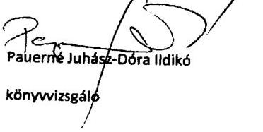

Eredetivel mindenben megegyező hiteles másolat!

---

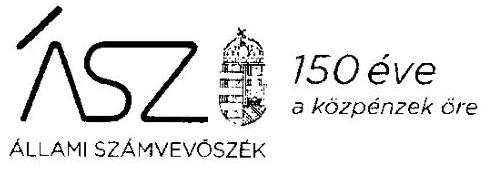

Ikt. szám: EL-2287-084/2020.

Hosszú Zsuzsanna úrhölgy
elnök
"Segítő Kezek" Szociális és Házi Segítségnyújtó Alapítvány

# Siófok 

Tisztelt Elnök Úrhölgy!

A „Nem állami humánszolgáltatók ellenőrzése - A köznevelési és szociális humánszolgáltatást nyújtó intézmények, szolgáltatók államháztartáson kívüli fenntartói központi költségvetésből kapott támogatásai felhasználásának ellenőrzése - 10 Alapítvány, 8 Egyesület szociális és köznevelési intézményfenntartó" címmel készített számvevőszéki jelentéstervezetre tett, 2020. december 9-én kelt észrevételeit köszönettel megkaptam.

Az Állami Számvevőszék észrevételre vonatkozó álláspontjáról a felügyeleti vezető által készített részletes tájékoztatást mellékelten megküldöm.

Tájékoztatom Elnök úrhölgyet, hogy a számvevőszéki jelentésben - az Állami Számvevőszékről szóló 2011. évi LXVI. törvény 29. § (3) bekezdése alapján - a figyelembe nem vett észrevételt szerepeltetjük, annak indoklásával, hogy azt az Állami Számvevőszék miért nem fogadta el.

Budapest, 2021. 04. hó 05. nap

Melléklet: Tájékoztatás az észrevétel kezeléséről
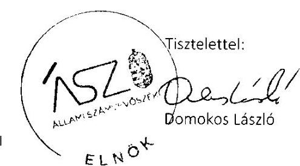

---

Melléklet
Ikt.szám: EL-2287-084/2020.

# Tájékoztatás   az észrevétel kezeléséről 

A „Nem állami humánszolgáltatók ellenőrzése - A köznevelési és szociális humánszolgáltatást nyújtó intézmények, szolgáltatók államháztartáson kívüli fenntartói központi költségvetésből kapott támogatásai felhasználásának ellenőrzése - 10 Alapítvány, 8 Egyesület szociális és köznevelési intézményfenntartó" címú jelentéstervezetre 2020. december 14-én érkezett észrevételt áttekintettük, annak kezelésével kapcsolatban a következő tájékoztatást adom.

Elnök úrhölgy észrevételében tájékoztat arról, hogy a "Segítő Kezek" Szociális és Házi Segítségnyújtó Alapítvány maga a szolgáltató, nem tart fenn külön intézményt. Mivel nem különül el semmilyen külön intézménye, nincs vállalkozói tevékenysége, a bevételeit elkülönítetten vezeti a beérkezett támogatások szerinti bontásban, a ráfordításait pedig összköltséges eredménykimutatás által előírt bontásban vezeti.

Tájékoztatom Elnök úrhölgyet, hogy az Állami Számvevőszék ellenőrzési megállapításai minden esetben az Állami Számvevőszékről szóló 2011. évi LXVI. törvénynek megfelelően az ellenőrzés során bekért és az arra nyitva álló határidőn belül rendelkezésre bocsátott dokumentumokon alapulnak.

Az ellenőrzés során az arra nyitva álló határidőben az ÁSZ rendelkezésére bocsátott dokumentumokat ismételten áttekintettük, melyekből megállapítható, hogy helyes az ÁSZ azon megfogalmazása, hogy „A siófoki székhelyű "Segítő Kezek" Szociális és Házi Segítségnyújtó Alapítvány a 2016-2018. években egy nem önálló jogi személy szociális szolgáltatót tartott fenn. Az ellenőrzött Fenntartó a szolgáltatóján keresztül házi segítségnyújtás szociális segítség és házi segítségnyújtás személyi gondozás közhasznú feladatokat látott el." Ezt igazolja az ellenőrzés rendelkezésére bocsátott, a Somogy Megyei Kormányhivatal által kiadott „Tanúsítvány" is, amely szerint a szolgáltatói nyilvántartásba bejegyzett engedélyes címe nem azonos az Alapítvány székhelyével. Továbbá a Somogy Megyei Kormányhivatal által 2018-ban lefolytatott ellenőrzés is a szolgáltató címén történt.

Minderre tekintettel a következő megállapítás a tényeknek megfelel, mi szerint „Az ellenőrzött Fenntartó a 2016-2018. években, a Fenntartó és a nem önállóan gazdálkodó intézménye gazdálkodásának elkülönítéséről nem gondoskodott, a kapott támogatások felhasználását az Atr. 16. § (1) és a Civil. tv. 20. § (4) bekezdésében foglaltak ellenére támogatásonként, feladatonkénti bontásban nem vezette elkülönítetten. Ezáltal a költségvetési támogatás felhasználásának a Számv. tv. 161/A. § (2) bekezdésében előírt ellenőrizhetőségét nem biztosította."

Az egyértelműség érdekében, figyelemmel az előző bekezdésben leírtakra a megállapítás

---

tartalmának változatlansága mellett, a jelentéstervezetben az „intézmény" helyett a „szolgáltató" kifejezést szerepeltetjük.

Az előzőekben leírtak alapján az észrevételt nem fogadjuk el, a jelentéstervezet vonatkozó megállapításának módosítása nem indokolt.

Budapest, 2021. 04. hó 08. nap
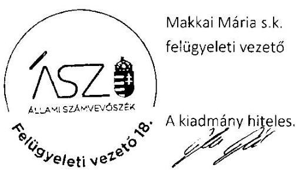

---

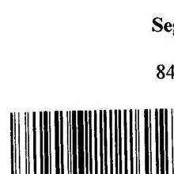

# Észrevétel 

Tisztelt Domonkos László!
Az EL-2287-048/2020 sz. levelükre reagálva tenném az észrevételeimet.
A 2016-2018. évekre szóló ellenőrzésre felhívó levelet 2019. 11. 19-én vettem át.
A levélben foglaltakkal sajnos nem tudtam rögtön foglalkozni, mivel azokban a napokban rendkívül összesűrűsödtek az események az alapítványnál.
(Az E.ON akkor jött bekötni az otthonba az egy éve kért hálózatfejlesztésre a $3 \times 160$ Ampert a $3 \times 16$ A helyett. Ott kellett lennem a helyszínen. A belső átkötéseket meg kellett csinálnom mert vagy fűtés volt, vagy meleg víz, vagy világítás. Együtt a három dolog nem működött. Az esti zárás utáni élelmiszermentést (TESCO adomány: napi szinten megmaradt zöldség, gyümölcs és pékáru) is nekem kellett elhoznom, mivel az alkalmazottunknak leszakadt a bicepsz izom a bal karján és műtötték.) Nem tehetem meg, hogy ne az otthon működése, a lakók szakszerű, kényelmes elhelyezése, ellátása legyen az első.
A fentiek miatt csak esténként tudtam foglalkozni a dokumentumok feltöltésével, ami nem ment zökkenőmentesen, így sok értékes időt veszítettem. Kifogott rajtam az informatika. Ezért fordult elő az, hogy a legnagyobb anyagokat, a 2016-2017-2018. évi Számlarendeket és a hozzájuk tartozó Számlatükröket már nem sikerült feltöltenem. Az időkeret lejárta végén kénytelen voltam lezárni a programot. Bíztam abban, hogy lehetőség lesz a későbbiekben a fel nem töltött anyagok beküldését pótolnom.

A 2020. 01. 31-es pótlásnál érdeklődtem telefonon, hogy miért nem tudom feltölteni azokat az anyagokat, amiket nem töltöttem fel határidőre, azt a választ kaptam, hogy most csak azokat a sorokat tölthetem ki, amiket a levelükben kérnek.

A 2020. 02. 03-án tartott helyszíni szemlére is kikészítettem az összes dokumentumot. Kollégáinak jeleztem a problémámat. Nem vettek át más anyagokat csak azokat, amiért jöttek.
Hiánypótlásra itt sem volt lehetőségem.
Mivel most van lehetőségem arra, hogy az anyagot eljuttassam az Önök részére, így az észrevétellel együtt küldöm.

Kérem szíveskedjenek a fentiek figyelembevételével a hiánypótlást elfogadni, és a jelentéstervezet módosítani.

Megértő támogatásukat előre is köszönöm!
2020-12-07
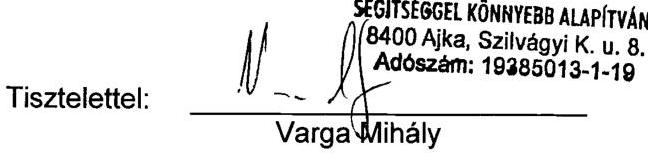

---

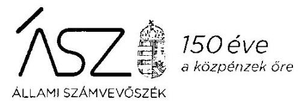

Ikt. szám: EL-2287-085/2020.

Varga Mihály úr
kuratóriumi elnök
Segítséggel Könnyebb Alapítvány

# Ajka 

Tisztelt Elnök Úr!

A „Nem állami humánszolgáltatók ellenőrzése - A köznevelési és szociális humánszolgáltatást nyújtó intézmények, szolgáltatók államháztartáson kívüli fenntartói központi költségvetésből kapott támogatásai felhasználásának ellenőrzése - 10 Alapítvány, 8 Egyesület szociális és köznevelési intézményfenntartó" címmel készített számvevőszéki jelentéstervezetre tett, 2020. december 7-én kelt észrevételét köszönettel megkaptam.

Az Állami Számvevőszék észrevételre vonatkozó álláspontjáról a felügyeleti vezető által készített részletes tájékoztatást mellékelten megküldöm.

Tájékoztatom Elnök urat, hogy a számvevőszéki jelentésben - az Állami Számvevőszékről szóló 2011. évi LXVI. törvény 29. § (3) bekezdése alapján - a figyelembe nem vett észrevételt szerepeltetjük, annak indoklásával, hogy azt az Állami Számvevőszék miért nem fogadta el.

Budapest, 2020. év 12. hó 30. nap

Tisztelettel:
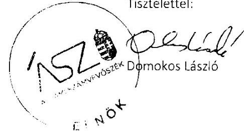

Melléklet: Tájékoztatás az észrevétel kezeléséről

---

Melléklet
Ikt.szám: EL-2287-085/2020.

# Tájékoztatás   az észrevétel kezeléséről 

A „Nem állami humánszolgáltatók ellenőrzése - A köznevelési és szociális humánszolgáltatást nyújtó intézmények, szolgáltatók államháztartáson kívüli fenntartói központi költségvetésből kapott támogatásai felhasználásának ellenőrzése - 10 Alapítvány, 8 Egyesület szociális és köznevelési intézményfenntartó" címú jelentéstervezetre 2020. december 11-én érkezett észrevételeit áttekintettük, annak kezelésével kapcsolatban a következő tájékoztatást adom.

Elnök úr észrevételében megerősítette, hogy az adatszolgáltatás során 2016-2017-2018. évi Számlarendeket és a hozzájuk tartozó Számlatükröket nem bocsátotta az Állami Számvevőszék rendelkezésére.

Tájékoztatom Elnök urat, hogy az Állami Számvevőszék ellenőrzési megállapításai minden esetben az Állami Számvevőszékről szóló 2011. évi LXVI. törvénynek megfelelően az ellenőrzés során bekért és az arra nyitva álló határidőn belül rendelkezésre bocsátott dokumentumokon alapulnak. Az észrevétel mellékleteként beküldött, ellenőrzött időszakra vonatkozó dokumentumokat nem értékeltük.

Fentiekre tekintettel az észrevételt nem fogadjuk el, a jelentéstervezet módosítása nem indokolt.

Budapest, 2020. év 12. hó 30. nap
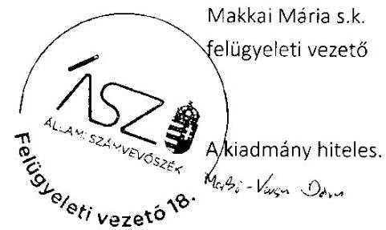

---

# RÖVIDÍTÉSEK JEGYZÉKE 

${ }^{1}$ Alaptörvény
${ }^{2}$ ÁSZ
${ }^{3}$ Szoctv.
${ }^{4}$ Gyvt.
${ }^{5}$ Kincstár
${ }^{6}$ ÁSZtv.
${ }^{7}$ ÁSZ SZMSZ
${ }^{8}$ Civil tv.
${ }^{9}$ Számv. tv.
${ }^{10} \mathrm{Atr}$.
${ }^{11}$ Intézmény
${ }^{12}$ Intézmény
${ }^{13}$ Intézmény
${ }^{14}$ Intézmény
${ }^{15}$ Intézmény
${ }^{16}$ Intézmény
${ }^{17}$ Intézmény
${ }^{18}$ Intézmény

Magyarország Alaptörvénye
Állami Számvevőszék
1993. évi III. törvény a szociális igazgatásról és szociális ellátásokról
1997. évi XXXI. törvény a gyermekek védelméről és a gyámügyi igazgatásról
Magyar Államkincstár
2011. évi LXVI. törvény az Állami Számvevőszékről
az Állami Számvevőszék Szervezeti és Működési Szabályzata
2011. évi CLXXV. törvény - az egyesülési jogról, a közhasznú jogállásról, valamint a civil szervezetek működéséről és támogatásáról (hatályos: 2011.12.22-étől)
2000. évi C. törvény a számvitelről (hatályos 2001. január 1-jétől)
489/2013. (XII. 18.) Korm. rendelet az egyházi és nem állami fenntartású szociális, gyermekjóléti és gyermekvédelmi szolgáltatók, intézmények és hálózatok állami támogatásokról (hatályos: 2014. január 1-jétől)
Az Alkohol Drogsegély Ambulancia egyesület által fenntartott intézmények:
Szenvedélybetegek Nappali Ellátó Intézménye (Veszprém)
Szenvedélybetegek Rehabilitációs Intézménye (Noszlop)
Szenvedélybetegek Közösségi Ellátása (Sümeg)
Szenvedélybetegek Közösségi Ellátása (Pápa)
Az Anyaoltalmazó Alapítvány által fenntartott intézmények: Családok Átmeneti Otthona (Budapest), Családok átmeneti Otthona Újház telephely (Budapest)
Az Aranykereszt Humánszolgáltató Egyesület által fenntartott intézmények: Ezüstfenyő Idősek és Pszichiátriai Betegek Otthona és Platánház Támogatott Lakhatás integrált intézmény (Kiskunlacháza)
Az Értelmi Fogyatékossággal Élők és Segítőik Közép-Magyarországi Regionális Közhasznú Egyesület által fenntartott szolgáltatók és intézmények: Közép-Magyarországi Támogató Szolgálat (Budapest), Közép-Magyarországi Támogató szolgálat (Veresegyháza), Szivárványország Napközi Otthon (Budapest), ÉFOÉSZ Liliom Napközi Otthon (Budapest)
A Forrás Lelki Segítők Egyesülete által fenntartott intézmények:
Forrás Mentálhigiénés Központ (Debrecen)
Fordulópont Szenvedélybetegek Rehabilitációs Intézménye (Nagyhegyes)
Indulópont Támogatott Lakhatás Intézménye (Debrecen)
Forrás Közösségi Klub (Debrecen)
A Gondviselés Alapítvány által fenntartott intézmény:
Gondviselés Alapítvány, „Dr. Somogyi József" Idősek Otthona (Tapolca)
A KEREK VILÁG ALAPÍTVÁNY által fenntartott intézmény:
Kerek Világ Általános Iskola (Pécs / köznevelési)
Kerek Világ Alapítvány Integrált Intézmény (Pécs / szociális) az intézmény három részlegre tagozódott: Kerek Világ Integrált Intézmény Fogyatékosok Nappali Intézménye, Kerek Világ Integrált Intézmény Fogyatékosok Nappali Intézménye, Kerek Világ Integrált Intézmény Támogató Szolgálat
KÖZÖSSÉGÉRT ALAPÍTVÁNY - A PSZICHIÁTRIAI BETEGSÉGGEL ÉLŐK FELÉPÜLÉSÉÉRT által fenntartott intézmények:

---

| 19 Intézmény | KÖZÖSSÉGÉRT ALAPÍTVÁNY Közösségi Pszichiátriai Ellátás Bonyhádi Kistérség (Bonyhád) |
| :--: | :--: |
|  | KÖZÖSSÉGÉRT ALAPÍTVÁNY Közösségi Szolgáltatások Dél-Balaton (Balatonboglár) |
| ${ }^{20}$ Intézmény | Magyar Vöröskereszt Budapest Fővárosi Szervezete által fenntartott intézmények: Magyar Vöröskereszt Hajléktalan Szálló (Budapest) |
|  | Családok Átmeneti Otthona (Budapest, 2 telephely) |
|  | Magyar Vöröskereszt Csepeli Hajléktalanszálló (Budapest) |
|  | Magyar Vöröskereszt Nappali Szociális Központ (Budapest, 3 telephely) |
| ${ }^{21}$ Intézmény | A NYUGODT ÉLET ALAPÍTVÁNY által fenntartott intézmény:   Nyugodt Élet Alapítvány Hollandkert Idősotthon (Sajóbábony) |
| ${ }^{21}$ Intézmény | A Péliföld Örökzöld Egyesület által fenntartott intézmények: |
|  | A Péliföld Idősek Otthona |
|  | Mosoly Világ Bölcsőde |
| ${ }^{22}$ Intézmény | A „SEGÍTŐ KEZEK" Idősek Otthona Alapítvány által fenntartott intézmény: |
|  | Segítő Kezek Idősek Otthona (Gyula) |
| ${ }^{23}$ Szolgáltató | A "Segítő Kezek" Szociális és Házi Segítségnyújtó Alapítvány által fenntartott szolgáltató: |
|  | Segítő Kezek Szociális és Házi Segítségnyújtó Alapítvány (Zamárdi) |
| ${ }^{24}$ Intézmény | A Segítséggel Könnyebb Alapítvány által fenntartott intézmények: |
|  | Segítséggel Könnyebb Alapítvány Családok Átmeneti Otthona (Ajka) |
|  | Segítséggel Könnyebb Alapítvány Családok Átmeneti Otthona Padrag I. (Ajka) |
|  | Segítséggel Könnyebb Alapítvány Családok Átmeneti Otthona Padrag II.(Ajka) |
| ${ }^{25}$ Intézmény | Az S.O.S. Krízis
 Alapítvány által fenntartott intézmény: |
|  | S. O. S. Krízis Alapítvány Családok Átmeneti Otthona (Budapest, 7 telephely) |
| ${ }^{26}$ Intézmény | A SOTÉRIA Alapítvány által fenntartott intézmény: |
|  | Kilátó Klubház (Budapest) |
|  | Matéria Klubház (Budapest) |
| ${ }^{27}$ Intézmény | A Szegedi Mozgássérültek Alternatív Egyesülete által fenntartott intézmények: Alternatív Támogató Szolgálat (Szeged) |
|  | Makray Fogyatékkal élő Gyermekek Nappali Intézménye (Szeged) |
| ${ }^{28}$ Intézmény | VELED-ÉRTED Egyesület által fenntartott szociális szolgáltatók: |
|  | Észak-Budai Támogató Szolgálat (Budapest) |
|  | Esztergom Térségi Támogató Szolgálat (Esztergom) |
|  | Dorog Térségi Támogató Szolgálat (Dorog) |

---

# ASZ 

ÁLLAMI SZÁMVEVŐSZÉK
1052 Budapest, Apáczai Cs. u. 10. | 1364 Budapest 4. Pf. 54
TEL: +36 1 4849100
email: szamvevoszek@asz.hu
web: www.asz.hu | www.aszhirportal.hu
