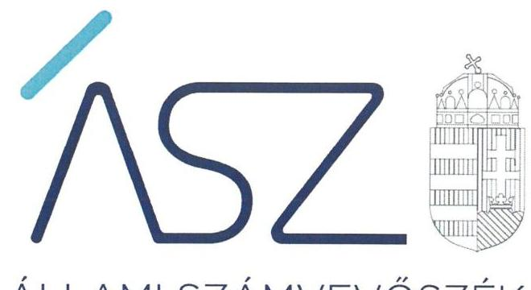
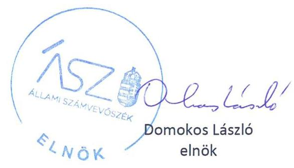
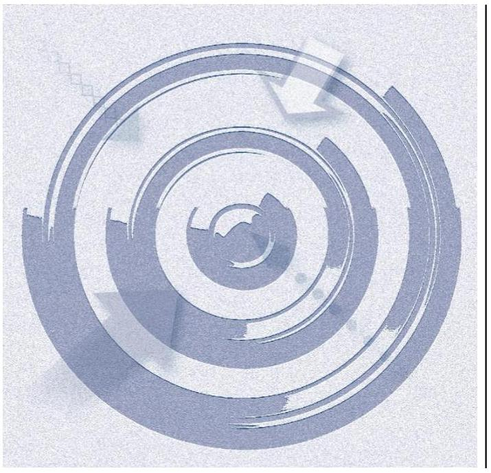
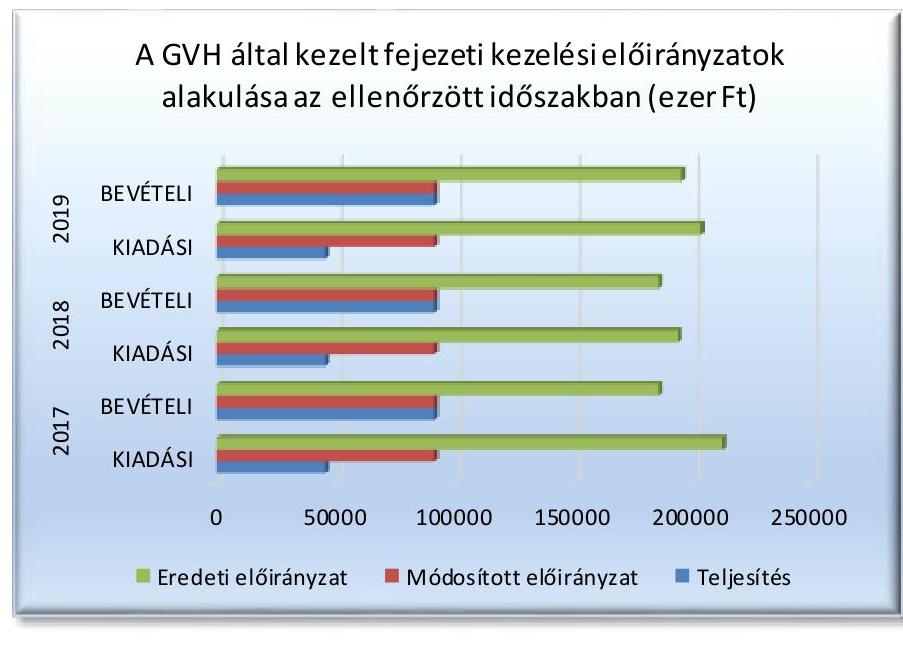

ÁLLAMI SZÁMVEVŐSZÉK

# JELENTÉS 

## Az államháztartás központi alrendszere fejezeteinek ellenőrzése

Gazdasági Versenyhivatal
2021.

21029
www.asz.hu

---

ÁLLAMI SZÁMVEVŐSZÉK

# JELENTÉS 

## Az államháztartás központi alrendszere fejezeteinek ellenőrzése

Gazdasági Versenyhivatal
2021. 03 hó 02. nap

21029
www.asz.hu

---

# AZ ELLENŐRZÉST FELÜGYELTE: 

PETŐ KRISZTINA felügyeleti vezető

## AZ ELLENŐRZÉST VEZETTE ÉS A VÉGREHAJTÁSÁÉRT FELELŐS:

KAKAS SÁNDOR ellenőrzésvezető

A PROGRAM ÖSSZEÁLLÍTÁSÁÉRT FELELŐS:
GÖRGÉNYI GÁBOR osztályvezető

IKTATÓSZÁM: EL-3108-001/2021.
TÉMASZÁM: 2553
ELLENŐRZÉS-AZONOSÍTÓ SZÁM: V089701
Jelentéseink az Országgyúlés számítógépes hálózatán és az interneten a www.asz.hu címen is olvashatóak.

---

# TARTALOMJEGYZÉK 

- ÖSSZEGZÉS ..... 5
- AZ ELLENŐRZÉS CÉLJA ..... 6
- AZ ELLENŐRZÉS TERÜLETE ..... 7
- AZ ELLENŐRZÉS HÁTTERE, INDOKOLTSÁGA ..... 8
- A JELENTÉS LÉNYEGES KÉRDÉSKÖREI. ..... 9
- AZ ELLENŐRZÉS HATÓKÖRE ÉS MÓDSZEREI. ..... 10
- MEGÁLLAPÍTÁSOK ..... 12
- JAVASLATOK ..... 14
- MELLÉKLETEK. ..... 15
I. sz. melléklet: Értelmező szótár ..... 15
- FÜGGELÉK: ÉSZREVÉTELEK ..... 17
- RÖVIDÍTÉSEK JEGYZÉKE ..... 21

---

.

---

# ÖSSZEGZÉS 

A Gazdasági Versenyhivatal a 2017-2019. években az irányító szervi feladatait szabályszerűen látta el. A fejezeti kezelésű előirányzatok felhasználása során a jogszabályi előírásokat betartotta. A vagyongazdálkodása a 2017-2019. években nem volt átlátható és elszámoltatható.

## Az ellenőrzés társadalmi indokoltsága

Az államháztartási törvénynek megfelelően a központi költségvetés fejezetekre tagolódik. A fejezeteket az éves költségvetési törvény határozza meg. A központi költségvetésben fejezetet alkotnak a minisztériumok, egyes országos hatáskörű szervek, a költségvetés elszámolásai.

Az ÁSZ ellenőrzi az éves költségvetési törvény végrehajtását, az ellenőrzés során feltárt kockázatok és a terület folyamatos értékelésével beazonosított kockázatok kezelése érdekében ellenőrzi többek között a költségvetési szervek gazdálkodását, müködését, hogy az ellenőrzések megállapításaival támogassa az ellenőrzött szervezetek szabályszerű gazdálkodását, javaslataival elősegítse az Alaptörvényben megfogalmazott alapvetések érvényesülését a mindennapi életben a szervezetek szintjén. Az ÁSZ megállapításaival elősegíti az ellenőrzöttek közpénzekkel való felelős gazdálkodását, illetve az újszerű megközelítésű ellenőrzéssel hozzájárul az értékteremtő rend kialakításához és megőrzéséhez.

A Gazdasági Versenyhivatal ellenőrzése következtében várhatóan reális kép alakítható ki az irányítás, a fejezeti irányítás (vezetés) és a fejezethez tartozó központi költségvetési szerv vagyongazdálkodása szabályszerűségéről. Az ellenőrzés megállapításai, javaslatai alapján javulhat a költségvetési fejezetek, a fejezeti kezelésű előirányzatok müködésének szabályszerűsége, valamint a fejezethez tartozó központi költségvetési szervnél a közpénzek felhasználásának átláthatósága, elszámoltathatósága.

## Főbb megállapítások, következtetések, javaslatok

A Gazdasági Versenyhivatal elnöke a 2017-2019. években az irányítószervi jogköreit szabályszerűen gyakorolta.
A Gazdasági Versenyhivatal, mint fejezetet irányító szerv a fejezeti kezelésű előirányzatok felhasználásának kereteit szabályszerűen kialakította, a fejezeti kezelésű előirányzatok felhasználása során a jogszabályi előírásokat betartotta.

A Gazdasági Versenyhivatal a vagyongazdálkodás kereteit a 2017-2019. években szabályszerűen kialakította.
A Gazdasági Versenyhivatal a 2017., 2018. és 2019. évi éves költségvetési beszámolók elkészítéséhez, a mérleg tételeinek alátámasztásához nem állított össze leltárt, amely tételesen, ellenőrizhető módon tartalmazza a mérlegben szereplő eszközöket és forrásokat, ezért a vagyon megőrzése és az elszámoltathatóság nem volt biztosított. A 2017., 2018. és 2019. évi éves költségvetési beszámolókat a jogszabályi előírás szerint vezetett részletező nyilvántartásokkal nem támasztotta alá, ezért a beszámolói nem voltak megalapozottak.

Az Állami Számvevőszék az ellenőrzés megállapításai alapján a Gazdasági Versenyhivatal elnöke részére 3 javaslatot fogalmazott meg.

---

# AZ ELLENŐRZÉS CÉLJA 

AZ ELLENŐRZÉS CÉLJA annak megállapítása volt, hogy a költségvetésifejezeteknél az irányító szervi, a fejezetet irányító szervi és a fejezeti kezelésú előirányzatok kezelési feladatainak ellátása, valamint a hatáskörök gyakorlása szabályszerű volt-e, a fejezethez tartozó központi költségvetési szerv vagyongazdálkodása során érvényesült-e az átláthatóság és elszámoltathatóság.

---

# **AZ ELLENŐRZÉS TERÜLETE**

## **Gazdasági Versenyhivatal**

A GVH¹ autonóm államigazgatási szerv, amely ellátja a Tptv.²-ben és a külön törvényben meghatározott versenyfelügyeleti és egyéb feladatokat, továbbá mindazokat a feladatokat, amelyeket az Európai Unió joga a tagállami versenyhatóság hatáskörébe utal.

A GVH számára feladatot csak törvény írhat elő, feladatkörében nem utasítható, feladatát más szervektől elkülönülten, befolyásolástól mentesen látja el.

A GVH élén az elnök áll, aki irányítja az intézmény tevékenységét, felel a jogszabályoknak megfelelő működésért és képviseli a Hivatalt. A GVH önálló, gazdasági szervezettel rendelkező központi költségvetési szerv, amely a központi költségvetés szerkezeti rendjében önálló fejezetet (központi költségvetés XXX. fejezet) alkot; a fejezetet irányító szerv vezetőjének jogosítványait a GVH elnöke gyakorolja. Az ellenőrzött időszakban a GVH SZMSZ³-e szerint a költségvetési-gazdálkodási feladatok ellátásáért a főtitkár volt felelős. Az ellenőrzött időszakban az elnök személyében nem történt változás, a jelenlegi elnök 2020. április 15-től látja el a feladatát. Az elnök munkáját segítő két elnökhelyettes és a főtitkár személyében nem történt változás.

1. ábra

*Forrás: GVH fejezeti kezelési előirányzatairól késztett beszámolók*

A GVH elnöke évente beszámol az Országgyűlésnek, illetve külön felkérésre az Országgyűlés hatáskörrel rendelkező bizottságának a GVH tevékenységéről és a Tptv. alkalmazása során szerzett tapasztalatai alapján arról, hogy a gazdasági verseny tisztasága és szabadsága miként érvényesül.

---

# AZ ELLENŐRZÉS HÁTTERE, INDOKOLTSÁGA 

Az Áht.-nek megfelelően a központi költségvetés fejezetekre tagolódik. A fejezeteket az éves költségvetési törvény határozza meg. A központi költségvetésben fejezetet alkotnak a minisztériumok, egyes országos hatáskörű szervek, a költségvetés elszámolásai.

Az ÁSZ ${ }^{4}$ ellenőrzi az éves költségvetési törvény végrehajtását, az ellenőrzés során feltárt kockázatok és a terület folyamatos értékelésével beazonosított kockázatok kezelése érdekében ellenőrzi többek között a költségvetési szervek gazdálkodását, működését, hogy az ellenőrzések megállapításaival támogassa az ellenőrzött szervezetek szabályszerű gazdálkodását, javaslataival elősegítse az Alaptörvényben ${ }^{5}$ megfogalmazott alapvetések érvényesülését a mindennapi életben a szervezetek szintjén. Az ÁSZ megállapításaival elősegíti az ellenőrzöttek közpénzekkel való felelős gazdálkodását, illetve az újszerű megközelítésű ellenőrzéssel hozzájárul az értékteremtő rend kialakításához és megőrzéséhez.

Az ellenőrzés következtében várhatóan reális kép alakítható ki az irányítás, a fejezeti irányítás (vezetés) és a fejezethez tartozó központi költségvetési szerv vagyongazdálkodása szabályszerűségéről. Az ellenőrzés megállapításai, javaslatai alapján javulhat a költségvetési fejezetek, a fejezeti kezelésű előirányzatok múködésének szabályszerűsége, valamint a fejezethez tartozó központi költségvetési szervnél a közpénzek felhasználásának átláthatósága, elszámoltathatósága.

---

# A JELENTÉS LÉNYEGES KÉRDÉSKÖREI 

1. Az irányító szerv, valamint a fejezetet irányító szerv feladat- és hatáskört ellátó vezetője, e hatáskör gyakorlása során betar-totta-e a jogszabályi és belső előírásokat?
2. A GVH a vagyongazdálkodása során betartotta-e a jogszabályi előírásokat?

---

# AZ ELLENŐRZÉS HATÓKÖRE ÉS MÓDSZEREI 

## Az ellenőrzés típusa

| Megfelelőségi ellenőrzés.

## Az ellenőrzött időszak

2017., 2018., 2019. évek, továbbá az ellenőrzött időszak kiterjedt a 2019. december 31-én a fejezethez tartozó központi költségvetési szerv mérlegében szereplő immateriális javak és tárgyi eszközök esetében a 2017. január 1. előtti időszakra a vagyonváltozással kapcsolatos döntés időpontjáig.

## Az ellenőrzés tárgya

A költségvetési fejezetek irányítási, fejezeti irányítási feladat- és hatáskör gyakorlásának, valamint a hozzá tartozó központi költségvetési szervek vagyongazdálkodásának és a fejezeti kezelésű előirányzatok ellenőrzése.

Az ellenőrzés kiterjedt minden olyan körülményre és adatra, amely az ÁSZ jogszabályban meghatározott feladatainak teljesítéséhez, valamint a program végrehajtása folyamán felmerült újabb összefüggések feltárásához szükséges volt.

## Az ellenőrzött szervezet

Gazdasági Versenyhivatal

## Az ellenőrzés jogalapja

Az ellenőrzés jogszabályi alapját az ÁSZ tv. ${ }^{6}$ 1. § (3) bekezdése, 5. § (2)-(4) és (6) bekezdései, valamint az Áht. ${ }^{7}$ 61. § (2) bekezdésének előírásai képezték.

## Az ellenőrzés módszerei

Az ellenőrzést az Ellenőrzési program szempontjai, az ellenőrzött időszakban hatályos jogszabályok, az ellenőrzés szakmai szabályai, a jelen ellenőrzésre irányadó ÁSZ módszertanok figyelembevételével végeztük.

Az ellenőrzés ideje alatt az ellenőrzött szervezettel történő kapcsolattartást az ÁSZ SZMSZ8-ének vonatkozó előírásai alapján biztosítottuk.

---

Az ellenőrzési kérdések megválaszolásához szükséges bizonyítékok megszerzése az ellenőrzött által rendelkezésre bocsátott dokumentumokra, adatokra alapozva megfigyelés, szemle (szemrevételezés), kérdésfeltevés (információkérés), valamint elemző eljárás útján történt. Az ellenőrzési bizonyítékként felhasználható adatforrások közé tartoztak egyrészt az ellenőrzési program részletes szempontjainál felsorolt adatforrások, másrészt minden egyéb - az ellenőrzés folyamán feltárt, az ellenőrzés szempontjából információt tartalmazó - dokumentum. Az ellenőrzés lefolytatásához az ellenőrzött szervezet az ÁSZ által kért dokumentumok megküldésével szolgáltatott adatokat, amelyek valódiságát és teljes körűségét az adatszolgáltató szervezet vezetője által tett teljességi és hitelességi nyilatkozat igazolta. Az így rendelkezésre bocsátott adatok, információk kontrollja az ellenőrzés keretében történt.

A vagyonnövekedések és vagyoncsökkenések esetében egyedi kockázat alapú kiválasztás az elsődleges. Kockázati alapú kiválasztás esetében az eredmények nem kivetíthetőek a teljes sokaságra. Az értékelés ebben az esetben vonatkozó munkalapokon számolt átlagos hibaarány az alapja. Ha nem volt a sokaságban kockázatosnak minősített tétel, akkor a mintavétel azokra a legnagyobb értékű tételekre - a lényeges sokaságra - terjedt ki, melyek összértéke eléri a teljes sokaság összértékének 50\%-át. Lényeges sokaságon alapuló mintavétel esetében a vizsgált terület „szabályszerü" minősítést kapott, ha a minta ellenőrzésének eredménye alapján 95\%-os bizonyossággal a teljes sokaságban az átlagos hibaarány nem haladta meg a 10\%-ot, „nem szabályszerű" minősítést kapott, ha nagyobb volt, mint 10\%. Abban az esetben, ha a lényeges sokaság tekintetében a 10\%-os hibaarányhoz való viszony megítélésének megbízhatósága nem érte el a 95\%-ot, annak elérése érdekében az értékelés további szempontokkal egészült ki, a feltárt hibák értéke is figyelembe vételre került. Amennyiben a sokaság elemszáma nem haladta meg az előírt minta elemszámot, akkor a sokaság valamennyi elemének tételes ellenőrzésére került sor.

---

# MEGÁLLAPÍTÁSOK 

## 1. Az irányító szerv, valamint a fejezetet irányító szerv feladat- és hatáskört ellátó vezetője, e hatáskör gyakorlása során betartotta-e a jogszabályi és belső előírásokat?

Összegző megállapítás

A GVH elnöke az ellenőrzött időszakban az irányítószervi jogköreit szabályszerűen gyakorolta. A GVH, mint fejezetet irányító szerv a fejezeti kezelésű előirányzatok kezelése során a jogszabályi előírásokat betartotta.

A GVH elnöke az irányítási hatáskörén belül az alapító jogait szabályszerűen gyakorolta, a GVH alapító okiratát kiadta, a módosítást a jogszabály előírása szerint elvégezte. Meghatározta a GVH szervezeti és múködési kereteit, a jogszabályi előírás szerint jóváhagyta a GVH SZMSZ-ét és annak módosításait, a GVH tevékenységéről az Országgyűlésnek évente beszámolt.

A GVH, mint fejezetet irányító szerv kontrollkörnyezetének kialakítása a 2017-2019. években szabályszerű volt. A GVH rendelkezett az Áht. előírása szerinti jóváhagyott SZMSZ-szel. A GVH gazdálkodásának részletes rendjét, a gazdálkodási jogkörök gyakorlásának módját, eljárási és dokumentációs részletszabályait, a jogkörgyakorlók kijelölésével kapcsolatos belső előírásokat a jogszabályi előírás alapján kötelezettségvállalási szabályzat ${ }^{9}$-ban rögzítették. A fejezeti kezelésű előirányzatok kiadási előirányzatainak felhasználásáról szóló szabályokat a GVH elnöke az Áht. előírása alapján az államháztartásért felelős miniszter egyetértésével kiadta. Az elnök a fejezetet irányító szerv vezetőjeként évente nyilatkozatban értékelte a GVH belső kontrollrendszerének minőségét a jogszabályi előírás szerint.

A GVH, mint fejezetet irányító szerv feladatellátása szabályszerű volt. A GVH az ellenőrzött időszakban a jogszabályban előírtak szerint megtervezte és egyeztette az államháztartásért felelős miniszterrel a fejezeti kezelésű előirányzatok tervezett bevételeit és kiadásait, az Áht. szerinti elemi költségvetéseket elkészítette. A GVH a 2017., 2018. és 2019. évekre vonatkozóan az Áhsz. ${ }^{10}$ előírása szerint elkészítette az általa kezelt fejezeti kezelésű előirányzatok vonatkozásában az éves költségvetési beszámolókat.

## 2. A GVH a vagyongazdálkodása során betartotta-e a jogszabályi előírásokat?

## Összegző megállapítás

A GVH az ellenőrzött időszakban a vagyongazdálkodás során nem tartotta be a jogszabályi előírásokat.

A GVH a Számv. tv. ${ }^{11}$ 69. § (1) bekezdésének, valamint az Áhsz. 22. § (1) bekezdésének előírása ellenére a 2017., 2018. és 2019. évi éves költségvetési beszámoló elkészítéséhez, a mérleg tételeinek alátámasztásához nem

---

állított össze leltárt, amely tételesen, ellenőrizhető módon tartalmazza a mérlegben szereplő eszközöket és forrásokat. A GVH a Számv. tv. 69. § (3) bekezdésének előírása ellenére az ellenőrzött időszakban a tárgyi eszközök mennyiségi felvétellel történő leltározását nem végezte el.

A GVH az Áhsz. 5. § (1) bekezdésének előírása ellenére a 2017., 2018. és 2019. évi éves költségvetési beszámolóját az Áhsz. szabályai szerint vezetett részletező nyilvántartásokkal nem támasztotta alá. A GVH az ellenőrzött időszakban az Áhsz. 39. § (3) bekezdésének előírása ellenére nem vezetett - az Áhsz. szabályai szerint, annak 14. mellékletében rögzített minimum tartalommal-részletező nyilvántartásokat az immateriális javak, a tárgyi eszközök, a követelések, valamint a pénzeszközök és a sajátos elszámolások vonatkozásában.

A GVH az ellenőrzött időszakban rendelkezett a Számv. tv. előírása szerint Számviteli politika ${ }_{1-3}$-mal ${ }^{12}$, Leltárkészítési szabályzattal ${ }^{13}$, Értékelési szabályzat ${ }_{1,2}$-vel ${ }^{14}$, valamint Pénzkezelési szabályzat ${ }_{1,2}$-vel ${ }^{15}$.

---

# JAVASLATOK 

Az ÁSZ tv. 33. § (1) bekezdésében foglaltak értelmében az ellenőrzött szervezet vezetője köteles a jelentésben foglalt megállapításokhoz kapcsolódó intézkedési tervet összeállítani és azt a jelentés kézhezvételétől számított 30 napon belül az ÁSZ részére megküldeni. Amennyiben az intézkedési tervet az ellenőrzött szervezet vezetője nem küldi meg határidőben, vagy továbbra sem elfogadható intézkedési tervet küld, az ÁSZ elnöke az ÁSZ törvény 33. § (3) bekezdés a)-b) pontjaiban foglaltakat érvényesítheti.

## Gazdasági Versenyhivatal elnökének

1. Intézkedjen a jövőben a jogszabályban elöirtak szerint az éves költségvetési beszámolók elkészitéséhez, a mérleg tételeinek alátámasztásához leltár összeállításáról, amely tételesen, ellenőrizhető módon tartalmazza a mérlegben szereplő eszközöket és forrásokat.
(2. összegző megállapítás 1. bekezdésének 1. mondata alapján)
2. Intézkedjen a jövőben a jogszabályban elöirtak szerint a tárgyi eszközök mennyiségi felvétellel történő leltározásának elvégzéséről. (2. összegző megállapítás 1. bekezdésének 2. mondata alapján)
3. Intézkedjen a jövőben a jogszabály szerinti részletező nyilvántartások vezetéséről az immateriális javak, a tárgyi eszközök, a követelések, valamint a pénzeszközök és a sajátos elszámolások vonatkozásában, továbbá az éves költségvetési beszámoló részletező nyilvántartásokkal történő alátámasztásáról.
(2. összegző megállapítás 2. bekezdése alapján)

---

# MELLÉKLETEK 

## I. SZ. MELLÉKLET: ÉRTELMEZŐ SZÓTÁR

állami vagyon
a) az állam tulajdonában lévő dolog, valamint a dolog módjára hasznosítható természeti erő,
b) az a) pont hatálya alá nem tartozó mindazon vagyon, amely vonatkozásában törvény az állam kizárólagos tulajdonjogát nevesíti,
c) az állam tulajdonában lévő tagsági jogviszonyt megtestesítő értékpapír, illetve az államot megillető egyéb társasági részesedés,
d) az államot megillető olyan immateriális, vagyoni értékkel rendelkező jogosultság, amelyet jogszabály vagyoni értékű jogként nevesít.
e) az állam tulajdonában lévő pénzügyi eszközök (Forrás: Vtv. 1. § (2) bekezdés)
állami vagyon használója
az a természetes vagy jogi személy, jogi személyiséggel nem rendelkező szervezet, aki, vagy amely törvény vagy szerződés alapján, bármely jogcímen (bérlet, haszonbérlet, használat stb.) állami vagyont birtokol, használ, szedi annak hasznait, hasznosít, ide nem értve a haszonélvezőt, a vagyonkezelőt és a tulajdonosi jogok gyakorlóját (Forrás: Vtvr. 1. § (7) bekezdés a) pont, hatályos 2012. január 1-jétől)
állami vagyon kezelője /vagyonkezelő
Az állami vagyont az MNV Zrt. maga kezeli, vagy szerződés - így különösen bérlet, haszonbérlet, megbízás - alapján központi költségvetési szervnek, természetes vagy jogi személynek, vagy jogi személyiséggel nem rendelkező gazdálkodó szervez etmek hasznosításra átengedi." Az állami vagyonra vonatkozóan a tulajdonosi joggyakorló kizárólag az Nvtv-ben meghatározott személyekkel köthet vagyonkezelési szerződést. (Forrás: Vtv. 27. § (1) bekezdése, hatályos 2012. január 1-jétől)
fejezetet irányító szerv
A fejezetet irányító szerv látja el a fejezeti kezelésű előirányzatokhoz kapcsolódó tervezési, gazdálkodási, ellenőrzési, adatszolgáltatási és beszámolási feladatokat. A fejezetet irányító szerveket az Ávr. 1. sz. melléklete határozza meg. (Forrás: Áht. 6/B. § (1) bekezdés, Ávr. 6. §)
fejezeti kezelésű előirányzatok
A fejezeti kezelésű előirányzatok a fejezetet irányító szerv sajátos szakmai, ágazati feladatai ellátása vagy az államnak a fejezethez tartozó költségvetési szervek tevékenységével kapcsolatban felmerülő, illetve szakmailag ahhoz kapcsolódó sajátos kötelezettségei teljesítése során felmerülő költségvetési bevételek és költségvetési kiadások elszámolására szolgálnak. (Forrás: Áht. 6/A. § (3) bekezdés)
A fejezeti kezelésű előirányzatok fejezetenként egy címet alkotnak. (Forrás: Áht. 15. § (3) bekezdés)
A fejezeti kezelésű előirányzatok jogi személyiséggel nem bírnak, munkáltatóként munkaerőt nem foglalkoztathatnak, saját tulajdonnal nem rendelkezhetnek. (Forrás: Ávr. 1/A. §)
hasznosítás
az állami vagyon bármely - a tulajdonjog átruházását nem eredményező - módon, jogcímen történő átadása, átengedése, ide nem értve a haszonélvezeti jog létesítését, valamint a vagyonkezelésbe adást (Forrás: Vtvr. 1. § (7) bekezdés e) pont, hatályos 2012. január 1-jétől);
irányítási hatáskörök
ha törvény eltérően nem rendelkezik, a költségvetési szerv irányítása a következő hatáskörök gyakorlását jelenti:
a) a költségvetési szerv alapítása, átalakítása és megszüntetése, ideértve az alapító okirat és annak módosítása, valamint a megszüntető okirat kiadására vonatkozó hatáskör (a továbbiakban együtt: alapítói jogok) gyakorlását,
b) a költségvetési szerv szervezeti és működési szabályzatának jóváhagyása,

---

c) a költségvetési szerv vezetésére kinevezés vagy megbízás adása, a költségvetési szerv vezetőjének felmentése vagy a vezetői megbízás visszavonása, és - ha törvény vagy kormányrendelet másként nem rendelkezik - a költségvetési szerv vezetőjével kapcsolatos egyéb munkáltatói jogok gyakorlása,
d) a költségvetési szerv gazdasági vezetőjének kinevezése vagy megbízása, felmentése vagy megbízásának visszavonása,
e) a költségvetési szerv tevékenységének törvényességi, szakszerűségi és hatékonysági ellenőrzése,
f) a költségvetési szerv döntésének megsemmisítése, szükség szerint új eljárás lefolytatására való utasítás,
g) jogszabályban meghatározott esetekben a költségvetési szerv döntéseinek előzetes vagy utólagos jóváhagyása,
h) egyedi utasítás kiadása feladat elvégzésére vagy mulasztás pótlására,
i) jelentéstételre vagy beszámolóra való kötelezés, és
j) a költségvetési szerv kezelésében lévő közérdekű adatok és közérdekből nyilvános adatok, valamint a c)-i) pont szerinti irányítási hatáskörök gyakorlásához szükséges, törvényben meghatározott személyes adatok kezelése. (Forrás: Áht. 9. §)
a költségvetési szerv tekintetében az e törvényben meghatározott irányítási hatáskört gyakorló szerv (Forrás: Áht. 1. § 9. pontja)
kezelőszerv
A fejezeti kezelésű előirányzat esetében jogszabály a fejezetet irányító szerv (1) bekezdésben meghatározott feladatai ellátására - a tervezéssel, az előirányzatok módosításával, átcsoportosításával és az éves költségvetési beszámoló jóváhagyásával kapcsolatos feladatok kivételével - kezelő szervet jelölhet ki. (Forrás: Áht. 6/B. § (3) bek.)
A fejezeti kezelésű előirányzatokhoz kapcsolódó tervezési, gazdálkodási, ellenőrzési, adatszolgáltatási és beszámolási feladatokat a fejezetet irányító szerv látja el. (Forrás: Áht. 6/B. § (1) bek.)
kültségvetési szerv felügye-
ha jogszabály költségvetési szerv felügyeletét említi, azon
lete
a) - ha törvény eltérően nem rendelkezik - az Áht. 9. § b)-d) pontjában,
b) a 9. § e) pontjában, és
c) - kizárólag az a) és b) ponttal összefüggésben - a 9. § i) és j) pontjában meghatározott hatáskörök együttesét kell érteni. (Forrás: Áht. 9/B. §
vagyongazdálkodás
A nemzeti vagyongazdálkodás feladata a nemzeti vagyon rendeltetésének megfelelő, az állam, az önkormányzat mindenkori teherbíró képességéhez igazodó, elsődlegesen a közfeladatok ellátásához és a mindenkori társadalmi szükségletek kielégítéséhez szükséges, egységes elveken alapuló, átlátható, hatékony és költségtakarékos múködtetése, értékének megőrzése, állagának védelme, értéknövelő használata, hasznosítása, gyarapítása, továbbá az állam vagy a helyi önkormányzat feladatának ellátása szempontjából feleslegessé váló vagyontárgyak elidegenítése. (Forrás: Nvtv. 7. § (2) bekezdése)

---

# FÜGGELÉK: ÉSZREVÉTELEK 

A jelentéstervezetet a Számvevőszék 15 napos észrevételezésre megküldte az ellenőrzött szervezet vezetőjének az ÁSZ tv. 29. §* (1) bekezdése elöírásának megfelelően.

A Gazdasági Versenyhivatal elnöke a jelentéstervezet megállapításaira írásban észrevételt tett.

Az ÁSZtv. 29. § (3) bekezdésévelösszhangban az ÁSZ a Függelékbenfeltünteti az ellenőrzés megállapításaival kapcsolatban tett, figyelembe nem vett észrevételeket, és megindokolja, hogy azokat miért nem fogadta el.

[^0]
[^0]:    * 29. § (1) Az Állami Számvevőszék az ellenőrzési megállapításait megküldi az ellenőrzött szervezet vezetőjének vagy az általa megbízott személynek, és annak, akinek személyes felelősségét állapította meg.
    (2) Az ellenőrzött szervezet vezetője és a felelősként megjelölt személy az ellenőrzés megállapításaira tizenöt napon belül írásban észrevételt tehet.
    (3) Az Állami Számvevőszék az észrevételre a beérkezésétől számított harminc napon belül írásban válaszol. A figyelembe nem vett észrevételeket köteles a jelentésben feltüntetni, és megindokolni, hogy azokat miért nem fogadta el.

---

A számvevőszéki jelentéstervezet megállapításaival kapcsolatban az elnök által 2021. január 20-án tett, el nem fogadott észrevételek és azok kezelésének indokolása.

1. A jelentéstervezet 2. számú összegző megállapítás 1. bekezdés, az éves költségvetési beszámolók elkészítéséhez, a mérleg tételeinek alátámasztásához összeállított leltárral és a tárgyi eszközök mennyiségi felvétellel történő leltározásával kapcsolatos megállapításokra tett észrevételeket - Elnök úr által megküldött észrevétel 1. és 2. pontja - az Állami Számvevőszék nem veszi figyelembe.

Az ÁSZ az adatbekérő levélben kérte a 2017., 2018. és 2019. évi beszámoló mérlegtételeinek alátámasztására összeállított leltárt, amely tételesen, ellenőrizhető módon tartalmazza a mérleg fordulónapján meglévő eszközöket és forrásokat az Áhsz. 22. § (1) bekezdésének megfelelően. Az ÁSZ bekérte továbbá a 2017., 2018. és 2019. évre vonatkozóan a menynyiségi felvétellel történő leltározást igazoló dokumentumokat (beleértve a használt, de a mérlegben értékkel nem szereplő immateriális javak, tárgyi eszközök, készletek leltározását igazoló dokumentumokat), továbbá az egyeztetéssel történő leltározást igazoló dokumentumokat.

A 2020. június 4-i és 2020. június 22-i keltezésű teljességi és hitelességi nyilatkozatokkal - amelyben az elnök az átadott dokumentumok, adatok megbízhatóságáról és teljes körűségéről nyilatkozott - a Gazdasági Versenyhivatal az 1.3.1.7.11.3.1.7.3.11 és az 1.5.1.1-1.5.3.1.6 sorszámú dokumentumokat adta át. Az ÁSZ ellenőrzési megállapításait az ellenőrzési adatbekérés során határidőben átadott, a teljességi és hitelességi nyilatkozatban feltüntetett, hiteles dokumentumok alapján tette meg.

A Számv. tv. 69. § (2) bekezdésének megfelelően a főkönyvi könyvelés és az analitikus nyilvántartások adatai közötti egyeztetések elvégzése - amelyet az észrevételben leírtak szerint a Gazdasági Versenyhivatal a törvényi előírásoknak megfelelően minden évben elkészít - nem egyenlő az éves költségvetési beszámoló elkészítéséhez, a mérleg tételeinek alátámasztásához összeállított leltárral, amely tételesen, ellenőrizhető módon kell, hogy tartalmazza a mérlegben szereplő eszközöket és forrásokat. A Számv. tv. 69. § (1) bekezdésének és az Áhsz. 22. § (1) bekezdésének megfelelő leltárnak a főkönyvi könyvelés és az analitikus nyilvántartások adatai közötti (dokumentált) egyeztetések is részét képezik, azonban a leltárak keretében szükséges továbbá a Számv. tv. 69. § (3) bekezdésében foglalt mennyiségi felvétellel történő leltározás elvégzése, és az Áhsz. 22. § (2) bekezdésének b) pontjában foglalt előírás szerinti használt, de a mérlegben értékkel nem szereplő immateriális javak, tárgyi eszközök, készletek leltározási és lelt árkészítési szabályzatban meghatározott módon történő leltározásának elvégzése is.

A jelentéstervezet megállapításával érintett dokumentumok ismételt felülvizsgálata során megállapítottuk, hogy az ellenőrzés rendelkezésére bocsátott dokumentumok nem igazolták a Számv. tv. 69. § (3) bekezdésének előírása ellenére a Gazdasági Versenyhivatal 2017., 2018. és 2019. évi mérleg fordulónapján meglévő nemzeti vagyonba tartozó befektetett eszközeinek mennyiségi felvétellel történő leltározásának megtörténtét. A nemzeti vagyonba tartozó befektetett eszközökön belül a 2017. évi és a 2018. évi leltározási utasításában a tárgyi eszközök mennyiségi felvétellel történő leltározása nem lett elrendelve. 2019-ben a mennyiségi felvétellel történő leltározás elrendelése megtörtént, azonban a megküldött dokumentumok a mennyiségi felvétel megtörténtét nem támasztották alá. Nem igazolták továbbá az ellenőrzés rendelkezésére bocsátott dokumentumok az Áhsz. 22. § (2) bekezdésének b) pontjában foglalt előírás ellenére a használt, de a mérlegben értékkel nem szereplő immateriális javak, tárgyi eszközök, készletek leltározási és leltárkészítési szabályzatban meghatározott módon történő leltározásának elvégzését.

A fent leírtak alapján nem igazolt, hogy a Gazdasági Versenyhivatal a Számv. tv. 69. § (1) bekezdése, valamint az Áhsz. 22. § (1) bekezdése előírásainak megfelelően a 2017., 2018. és 2019. évi éves költségvetési beszámolóelkészítéséhez, a mérleg tételeinek alátámasztásához összeállított leltára tételesen, ellenőrizhető módon tartalmazza a mérlegben szereplő eszközöket és forrásokat. Nem igazolta továbbá, hogy a Számv. tv. 69. § (3) bekezdésének előírásának megfelelően az ellenőrzött időszakban a tárgyi eszközök mennyiségi felvétellel történő leltározását elvégezte, így a jelentéstervezet kapcsolódó megállapításainak módosítása nem indokolt.

---

2. A jelentéstervezet 2. számú összegző megállapítás 2. bekezdés, a jogszabály szerinti részletező nyilvántartások vezetésével kapcsolatos megállapításokra tett észrevételeket - Elnök úr által megküldött észrevétel 3. pontja - az Állami Számvevőszék nem veszi figyelembe.

Az ÁSZ az adatbekérő levélben kérte a 2017., 2018. és 2019. évre vonatkozóan az immateriális javak, tárgyi eszközök, a készletek, követelések, pénzeszközök és a sajátos elszámolások, értékpapírok, részesedések, koncesszióba, vagyonkezelésbe adott eszközök Áhsz. 14. mellékletében előírt, kötelező minimum tartalmú részletező nyilvántartását, az Áhsz. 39. § (3) bekezdésében és az Áhsz. 45. § (3) bekezdésében előírtaknak megfelelően.

A 2020. június 22-i keltezésű teljességi és hitelességi nyilatkozattal - a melyben az elnök az átadott dokumentumok, adatok megbízhatóságáról és teljes körűségéről nyilatkozott - a Gazdasági Versenyhivatal az 1.4.1-1.4.1.16sorszámú dokumentumokat adta át. Az ÁSZ az ellenőrzési megállapításait az ellenőrzési adatbekérés során határidőben átadott, a teljességi és hitelességi nyilatkozatban feltüntetett, hiteles dokumentumok alapján tette meg.

A jelentéstervezet megállapításával érintett dokumentumok ismételt felülvizsgálata során megállapítottuk, hogy az ellenőrzés rendelkezésére bocsátott dokumentumok nem igazolták, hogy a Gazdasági Versenyhivatal vezette az Áhsz. 39. § (3) bekezdése előírásaivalösszhangban az államháztartási számvitelről szóló kormányrendelet szabálya iszerint, a 14. mellékletben bemutatott minimum tartalommal a részletező nyilvántartásokat.

A részletező nyilvántartások az Áhsz. 14. melléklet szerinti minimum elvárásnak nem feleltek meg, mert:
a. Az immateriális javak nyilvántartása nem tartalmazta

- a készítő, szállító megnevezését;
- a vagyoni értékű jogok esetén azon eszköz pontos megnevezését, amelyhez a jog kapcsolódik;
- a beszerzést, létesítést és a használatbavételt igazoló bizonylatok azonosításához szükséges adatokat, a használatbavétel dátumát;
- a várható használati időt, a megállapított maradványértéket, a leírási kulcsot;
- az elszámolt terven felüli értékcsökkenés és a visszaírt terven felüli értékcsökkenés összegét, okait és időpontját, az ezeket alátámasztó bizonylatok azonosításához szükséges adatokat;
- az egyéb értékváltozások időpontjait, a változás okait, jellegét, az ezeket alátámasztó bizonylatok azonosításához szükséges adatokat;
- az eszköz alap- vagy vállalkozási tevékenység szerinti besorolását;
- a nemzeti vagyonról szóló 2011. évi CXCVI. törvény (továbbiakban: Nvt.) szerinti besorolását;
- és a leltározással kapcsolatos feljegyzéseket.
b. A tárgyi eszközök nyilvántartása nem tartalmazta
- a tárgyi eszköz sajátos adatait;
- a készítő, szállító megnevezését, az azonosításhoz szükséges egyéb adatokat, kivéve, ha az eszközt nyilvántartása csoportosan történik;
- a tulajdonosnál a tulajdonba kerülés módját, a tulajdoni hányadot, az esetleges védettségre, korlátozásra, terhelésre vonatkozó adatokat;
- a vagyonkezelőnél, koncesszió jogosultjánál a tulajdonos megnevezését, a vagyonkezelés, koncesszió időtartamát, a vagyonkezeléssel, koncesszióval kapcsolatos követelések, kötelezettségek azonosításához szükséges adatokat;
- a beszerzést, létesítést és a használatbavételt igazoló bizonylatok azonosításához szükséges adatokat, a használatbavétel dátumát;
- a várható használati időt, a megállapított maradványértéket, a leírási kulcsot;
- az elszámolt értékcsökkenés tárgyévi összegét;
- az elszámolt terven felüli értékcsökkenés és a visszaírt terven felüli értékcsökkenés összegét, okait és időpontját, az ezeket alátámasztó bizonylatok azonosításához szükséges adatokat;
- az egyéb értékváltozások időpontjait, a változás okait, jellegét, az ezeket alátámasztó bizonylatok azonosításához szükséges adatokat;
- az eszköz tartozékainak megnevezését, értékét, az azonosításhoz szükséges adatokat;

---

- az eszköz alap- vagy vállalkozási tevékenység szerinti besorolását;
- az Nvt. szerinti besorolását;
- és a leltározással kapcsolatos feljegyzéseket.
c. A követelések nyilvántartása nem tartalmazta
- a követelést tanúsító dokumentum megnevezését, keltét;
- a követelés tárgyát, összegét az egységes rovatrend rovatai szerint;
- és a követelés és annak módosulásai, a teljesítési adatok könyvviteli számlákon történő elszámolásának időpontjait és a könyvviteli számlák megnevezését.
d. A pénzeszközök és a sajátos elszámolások részletező nyilvántartását a Gazdasági Versenyhivatal nem bocsátotta az ellenőrzés rendelkezésére.

A jelentéstervezet megállapítása, miszerint a Gazdasági Versenyhivatal az Áhsz. 5. § (1) bekezdésének előírása ellenére a 2017., 2018. és 2019. évi éves költségvetési beszámolóját az Áhsz. szabályai szerint vezetett részletező nyilvántartásokkal nem támasztotta alá, helytálló. A Gazdasági Versenyhivatal az ellenőrzött időszakban az Áhsz. 39. § (3) bekezdésének előírása ellenére nem vezetett - az Áhsz. szabályai szerint, annak 14. mellékletében rögzített minimum tartalommal - részletező nyilvántartásokat az immateriális javak, a tárgyi eszközök, a követelések, valamint a pénzeszközök és a sajátos elszámolások vonatkozásában. Erre tekintettel az ÁSZ az észrevételt nem fogadja el, a jelentéstervezet kapcsolódó megállapításának módosítása nem indokolt.

---

# RÖVIDÍTÉSEK JEGYZÉKE 

${ }^{1}$ GVH
${ }^{2}$ Tptv.
${ }^{3}$ SZMSZ
${ }^{4}$ ÁSZ
${ }^{5}$ Alaptörvény
${ }^{6}$ ÁSZ tv.
${ }^{7}$ Áht.
${ }^{8}$ ÁSZ SZMSZ
${ }^{9}$ kötelezettség-vállalási szabályzat
${ }^{10}$ Áhsz.
${ }^{11}$ Számv. tv.
${ }^{12}$ Számviteli politika $_{1-3}$
${ }^{13}$ Leltározási szabályzat
${ }^{14}$ Értékelési szabályzat ${ }_{1,2}$
${ }^{15}$ Pénzkezelési szabályzat ${ }_{1,2}$

Gazdasági Versenyhivatal
1996. évi LVII. törvény a tisztességtelen piaci magatartás és a versenykorlátozás tilalmáról (hatályos: 1997. január 1-jétől)
A GVH elnökének 14/2014. (X. 15.) GVH utasítása a GazdaságiVersenyhivatal szervezeti és múködési szabályzatáról és annak módosításai
Állami Számvevőszék
Magyarország Alaptörvénye (2011. április 25.)
2011. évi LXVI. törvény az Állami Számvevőszékről (hatályos: 2011. július 1-jétől)
2011. évi CXCV. törvény az államháztartásról (hatályos: 2012. január 1-jétől)
az Állami Számvevőszék elnökének 2/2018. (XII.28.) ÁSZ utasítása az Állami
Számvevőszék Szervezeti és Müködési Szabályzatáról
(hatályos: 2019. január 1-jétől)
17/2015. (VII. 27.) GVH utasítás a GVH kötelezettségvállalási, ellenjegyzési, érvényesítési és utalványozási rendjéről (hatályos: 2015. szeptember 1-jétől)
4/2013. (I. 11.) Korm. rendelet az államháztartás számviteléről
(hatályos: 2014. január 1-jétől)
2000. évi C. törvény a számvitelről (hatályos: 2000. január 1-jétől)

GVH Számviteli politika ${ }_{1}$ (hatályos: 2017. január 1-jétől 2017. december 31-ig)
GVH Számviteli politika (hatályos: 2018. január 1-jétől 2018. december 31-ig)
GVH Számviteli politika ${ }_{3}$ (hatályos: 2019. január 1-jétől)
Eszközök és források leltárkészítési és leltározási szabályzata
(hatályos: 2015. október 1-jétől)
Eszközök és források leltárkészítési és leltározási szabályzata ${ }_{1}$
(hatályos: 2015. október 1-jétől 2018. december 31-ig)
Eszközök és források leltárkészítési és leltározási szabályzata ${ }_{2}$
(hatályos: 2019. január 1-jétől)
Pénz- és értékkezelési szabályzat ${ }_{1}$
(hatályos: 2015. október 1-jétől 2017. december 31-ig)
Pénz- és értékkezelési szabályzat ${ }_{2}$
(hatályos: 2018. január 1-jétől)

---

# ASZ 

ALLAMI SZAMVEVOSZEK
1052 Budapest, Apáczai Cs. J. u. 10. | 1364 Budapest 4. Pf. 54
TEL: +36 14849100
email: szamvevoszek@asz.hu
web: www.asz.hu | www.aszhirportal.hu