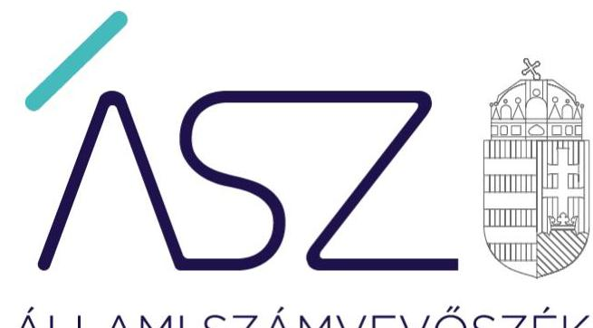
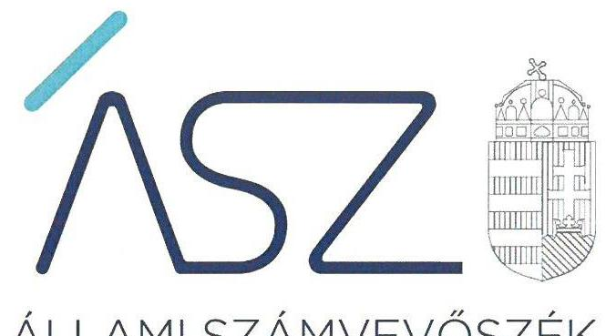
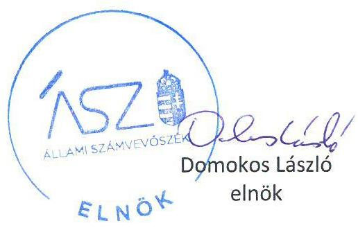
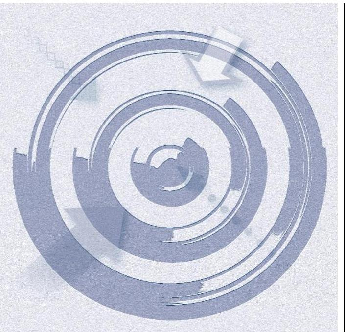
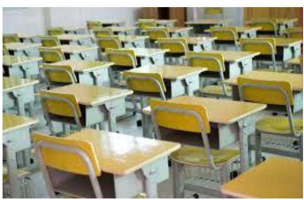

ÁLLAMI SZÁMVEVŐSZÉK

# JELENTÉS 

## Nem állami humánszolgáltatók ellenőrzése

A köznevelési humánszolgáltatást nyújtó intézmények, szolgáltatók államháztartáson kívüli fenntartói központi költségvetésből kapott támogatásai felhasználásának ellenőrzése - 56 intézményfenntartó
2021.

21030
www.asz.hu

---

ÁLLAMI SZÁMVEVŐSZÉK

# JELENTÉS 

## Nem állami humánszolgáltatók ellenőrzése

A köznevelési humánszolgáltatást nyújtó intézmények, szolgáltatók államháztartáson kívüli fenntartói központi költségvetésből kapott támogatásai felhasználásának ellenőrzése - 56 intézményfenntartó
2021. 04. hó 15. nap

21030
www.asz.hu

---

# AZ ELLENŐRZÉST FELÜGYELTE: 

MAKKAI MÁRIA felügyeleti vezető

## AZ ELLENŐRZÉST VEZETTE ÉS A VÉGREHAJTÁSÁÉRT FELELŐS:

DORMÁN ISTVÁNZOLTÁN ellenőrzésvezető

## A PROGRAM ÖSSZEÁLLÍTÁSÁÉRT FELELŐS:

FEKETE-NAGY ANDRÁS GÁBOR ellenőrzési program készítéséért felelős vezető

IKTATÓSZÁM: EL-3112-001/2021
TÉMASZÁM: 2523
ELLENŐRZÉS-AZONOSÍTÓ SZÁM: V0867
Jelentéseink az Országgyúlés számítógépes hálózatán és az interneten a www.asz.hu címen is olvashatóak.

---

# TARTALOMJEGYZÉK 

- ÖSSZEGZÉS ..... 5
- AZ ELLENŐRZÉS CÉLJA ..... 7
- AZ ELLENŐRZÉS TERÜLETE ..... 8
- AZ ELLENŐRZÉS HÁTTERE, INDOKOLTSÁGA ..... 9
- A JELENTÉS LÉNYEGES KÉRDÉSKÖREI. ..... 10
- AZ ELLENŐRZÉS HATÓKÖRE ÉS MÓDSZEREI. ..... 11
- MEGÁLLAPÍTÁSOK ..... 13
MELLÉKLETEK. ..... 15
I. sz. melléklet: Értelmező szótár ..... 15
II. sz. melléklet: Az ellenőrzött fenntartók részére köznevelési közfeladat ellátására a kincstár által biztosított költségvetési támogatások összege 2016-2018. években (Ft) ..... 16
III. sz. melléklet: A jelentésben szereplő megállapításokkal érintett fenntartók. ..... 18
IV. sz. melléklet: Az ellenőrzött fenntartókkal kapcsolatos részletes megállapítások ..... 19
FÜGGELÉKEK ..... 31
I. sz. függelék a jelentéshez ..... 31
II. sz. függelék: Észrevételek ..... 32
RÖVIDÍTÉSEK JEGYZÉKE ..... 45

---

.

---

# ÖSSZEGZÉS 

Az 56 ellenőrzött köznevelési humánszolgáltatást nyújtó államháztartáson kívüli intézményfenntartó közül két intézményfenntartó nem biztosította az ellenőrizhetőség feltételeit, 53 intézményfenntartó nem biztosította a köznevelési humánszolgáltatási közfeladatok ellátására kapott költségvetési támogatások elszámoltathatóságát. Egy fenntartó biztosította a kapott támogatások átláthatóságát. Az ellenőrzött időszakot követő 2019. évre vonatkozó, az ÁSZ kezdeményezésére bemutatott dokumentumok alapján 9 fenntartónál továbbra is fenn maradt a közpénzek nem átlátható kezelésének a kockázata.

## Az ellenőrzés társadalmi indokoltsága

A köznevelési feladatok ellátása az Alaptörvényben meghatározott, a társadalom szempontjából fontos tevékenységek. Jogszabályok teszik lehetővé, hogy államháztartáson kívüli szervezetek - így például az egyházi fenntartók, alapítványok, gazdasági társaságok, egyesületek - által fenntartott intézmények is végezzenek köznevelési feladatokat. Mindehhez a központi költségvetés évente jelentős összegű támogatással járul hozzá. Az államháztartáson kívüli, humánszolgáltatást végző intézmények az igényelt közpénzekből társadalmilag hasznos, közösségteremtő, közérdekű, illetve közhasznú tevékenységet végeznek, illetve közfeladatokat látnak el.

Az intézményfenntartók ellenőrzésével az Állami Számvevőszék hozzájárul ahhoz, hogy ezen közpénzeket az államháztartáson kívüli szervezetek is ellenőrizhető, átlátható és elszámoltatható módon használják fel a közfeladatok ellátása során. Az ellenőrzések célja továbbá, hogy a nyilvánosság és az igénybevevők megfelelő tájékoztatást kapjanak az államháztartáson kívüli közfeladatot ellátók múködéséről.

Az Állami Számvevőszék ellenőrzései arra adnak választ, hogy az intézményfenntartók arra használták-e fel a közpénzeket, amire igényelték. A szabályszerű gazdálkodás elengedhetetlen a közfeladat ellátás szakmai céljainak megvalósításához, valamint a társadalmi közbizalom fenntartásához.

## Főbb megállapítások, következtetések

Számviteli szabályozás kialakítása

Számviteli keretek kialakítása nélkül a közpénzfelhasználás nem elszámoltatható.

Számviteli politika, számlarend hiányában a költségvetési támogatások felhasználásának feltételeit nem biztosították. Az érintett intézményfenntartók száma összesen 15.

## Beszámolási kötelezettség teljesítése

Számviteli beszámolók hiányában a közpénzfelhasználás nem elszámoltatható.

Szabályszerű számviteli beszámoló nélkül nem biztosították a költségvetési támogatások felhasználásának átláthatóságát. Az érintett intézményfenntartók száma összesen 27.

Közpénzfelhasználás elkülönített nyilvántartása

Elkülönített nyilvántartás nélkül a közpénzfelhasználásának ellenőrizhetősége nem biztosított, ezáltal nem elszámoltatható.

Elkülönített nyilvántartás hiányában az intézményfenntartók nem tudták igazolni a költségvetési támogatás cél szerinti felhasználását. Az érintett intézményfenntartók száma összesen 11.

---

Az 56 ellenőrzött intézményfenntartó közül két intézményfenntartó az ÁSZtv. ${ }^{1}$ 28. § (1)-(2) bekezdésében rögzített előírás ellenére az Állami Számvevőszék kérésére nem bocsátotta rendelkezésre az ellenőrzés lefolytatása érdekében szükséges adatokat és dokumentumokat, illetve a kapcsolódó tájékoztatást nem adta meg. Ennek hiányában az ellenőrizhetőséget nem biztosította.

15 intézményfenntartó a Számv. tv. ${ }^{2}$ 14.§ (3) bekezdése előírása ellenére számvitel politikával, illetve a Számv. tv. 161.§ (1) bekezdése előírása ellenére számlarenddel nem rendelkezett. 27 intézményfenntartó a 2016-2018. években a Civil. tv. ${ }^{3}$ 28. § (1) bekezdésében, illetve a Számv.tv. 4. § (1) bekezdésében előírt beszámolási kötelezettségének nem tett eleget.

11 intézményfenntartó, az ellenőrzött időszakban a könyvvezetésében a kapott támogatások felhasználását nem az Nkt. vhr. ${ }^{4}$ 37/G. § (1) bekezdésében előírt módon kezelte, azokat az intézménye által ellátott alapfeladatok szerinti bontásban nem különítette el.

Az intézményfenntartók mindezek alapján az Alaptörvény ${ }^{5}$ 39. cikk (2) bekezdésében foglaltak ellenére a felhasznált közpénzekre vonatkozó gazdálkodásuk átláthatóságát nem biztosították. Ezáltal felmerül annak a kockázata, hogy a fenntartók a kapott támogatásokat nem szabályszerűen használják fel, és a közpénzeket nem átláthatóan kezelik.

Egy fenntartónál a kapott költségvetési támogatások tekintetében érvényesült az átláthatóság követelménye.
Az ÁSZ kezdeményezte 47 fenntartónál, hogy az ellenőrzött időszakot követő 2019. évre vonatkozóan bemutassák a közpénzekkel való elszámolás feltételeinek meglétét, hozzájárulva ezzel a költségvetési támogatások felhasználásának elszámoltathatóságához.

38 fenntartó dokumentumokkal igazolta, hogy 2019-ben eleget tett a számviteli szabályozottságra, a számviteli beszámoló készítésére, illetve a költségvetési támogatások alapfeladatonkénti elkülönítésére vonatkozó jogszabályi kötelezettségének.

8 fenntartónál 2019-ben nem álltak fenn az állami támogatással való jogszabály szerinti elszámolás feltételei, mert a számviteli szabályozottságra, a beszámoló készítési kötelezettségre és a költségvetési támogatások alapfeladatonkénti elkülönítésére vonatkozóan még hiányosságok maradtak fenn. Egy fenntartó a 2019. évre nem igazolta a számviteli szabályozottság, a számviteli beszámoló készítés és a költségvetési támogatások alapfeladatonkénti elkülönítésének szabályszerűségét. Ezért az ÁSZ 9 intézményfenntartó esetében az államháztartás alrendszeréből nyújtott, a fenntartót megillető támogatások folyósításának felfüggesztését kezdeményezte.

---

# AZ ELLENŐRZÉS CÉLJA

**AZ ELLENŐRZÉS CÉLJA** annak értékelése volt, hogy a nem állami, nem önkormányzati köznevelési intézményfenntartó központi költségvetésből kapott támogatásainak felhasználása szabályszerű volt-e.

---

# AZ ELLENŐRZÉS TERÜLETE

## **Köznevelési humánszolgáltatási közfeladatokat ellátó államháztartáson kívüli fenntartók (56 intézményfenntartó, Alapítványok, Egyesületek)**

Köznevelési intézményt az Nktv.8 szerint nem állami, nem önkormányzati fenntartó is alapíthat és tarthat fenn, a törvények keretei között. A központi költségvetés a fenntartott intézmény köznevelési feladatainak ellátásához költségvetési hozzájárulást biztosít, a jogszabályban előírt feltételek teljesülése esetén. Az Áht.7, Ávr.6, Nkt. vhr. előírásai szerint a Kincstár9 a megítélt támogatásokat a fenntartó részére folyósítja.

Az államháztartáson kívüli köznevelési intézmények központi költségvetésből kapott támogatásai felhasználását 56 Fenntartónál10 ellenőriztük, amelyek közül 44 alapítványi és 12 egyesületi formában működött (II. számú melléklet).

A Fenntartók köznevelési alapfeladatai közé az óvodai nevelés, az alapfokú nevelés, általános iskolai oktatás, az alapfokú művészeti oktatás; a középfokú nevelés oktatás, gimnáziumi, szakgimnáziumi-, (művészeti) szakközépiskolai, szakiskolai nevelés-oktatás, pszichés zavarai miatt a nevelési tanulási folyamatban súlyosan akadályoztatott tanulók integrált oktatása, a többi gyermekkel, tanulóval együtt nevelhető, oktatható sajátos nevelési igényű tanulók iskolai nevelése-oktatása, felnőttoktatás és a kollégiumi ellátás tartozott. A Fenntartók összesen 60 – önálló jogi személyiséggel rendelkező – köznevelési intézményt működtettek. Négy Fenntartó egynél több intézmény fenntartásában vett részt.

A Fenntartók részére a köznevelési humánszolgáltatási feladat ellátásához a Kincstár részéről a központi költségvetésből biztosított támogatások összegét a II. számú melléklet tartalmazza.

---

# AZ ELLENŐRZÉS HÁTTERE, INDOKOLTSÁGA 

A köznevelési feladatokat ellátó nem állami intézményfenntartók részére közfeladataik ellátására évente jelentős összegű pénzügyi támogatást biztosítottak a mindenkori költségvetési törvények a bennük megfogalmazott feltételek mellett. A köznevelési feladatokra felhasználható állami támogatások előirányzata a 2016-2018. években 574 Mrd Ft volt.

Az ÁSZ ${ }^{11}$ a stratégiájában célul tűzte ki, hogy az államháztartáson kívülre nyújtott költségvetési támogatások ellenőrzésével hozzájárul ahhoz, hogy a közpénzeket az államháztartáson kívüli szervezetek is átlátható módon használják fel a közfeladatok szerződésben vállalt ellátása érdekében. Az ÁSZ stratégiájában foglaltak alapján is indokolt az ellenőrzés, amely a társadalom számára jelzi, hogy a közpénz államháztartáson kívüli fel-használása sem maradhat ellenőrizetlenül. Az államháztartáson kívülre nyújtott költségvetési támogatások ellenőrzésével az ÁSZ hozzájárul ahhoz, hogy a közpénzeket a nem állami fenntartók átlátható módon használják fel a közfeladatok ellátására kötött szerződésekben vállalt kötelezettségek teljesítése érdekében. Az ÁSZ az ellenőrzés javaslataival hozzájárulhat az említett rendszerek szabályszerű támogatás-felhasználásához, javíthatja a társa-dalmi-gazdasági döntések megalapozottságát, amely a „jól irányított állam müködésének" feltétele.

A holisztikus megközelítés jegyében az ÁSZ az ellenőrzés keretében egyedi kockázatelemzés alapján kiválasztott fenntartóknál értékeli az államháztartáson kívüli köznevelési tevékenységhez kapcsolódó támogatások felhasználásának megfelelőségét.

---

# A JELENTÉS LÉNYEGES KÉRDÉSKÖREI 

1.- Az államháztartáson kivüli fenntartók a köznevelési intézmény müködtetéséhez felhasznált közpénzekre vonatkozó gazdálkodással a nyilvánosság előtt elszámoltak-e? Szabályszerü mükö-dési- és gazdálkodási környezet kialakításával megteremtették-e a költségvetési támogatások átlátható, elszámoltatható igénybevételének, felhasználásának feltételeit?
2.- Az államháztartáson kivüli fenntartók az átvállalt köznevelési közfeladathoz biztositott költségvetési támogatásokat szabályszerűen fordították-e a humánszolgáltató intézmény müködtetésére?

---

# AZ ELLENŐRZÉS HATÓKÖRE ÉS MÓDSZEREI 

## Az ellenőrzés típusa

| Megfelelőségi ellenőrzés.

## Az ellenőrzött időszak

A 2016. január 1-je és 2018. december 31-e közötti időszak.

## Az ellenőrzés tárgya

Az ellenőrzés a köznevelési humánszolgáltatási közfeladatokat ellátó államháztartáson kívüli Fenntartók humánszolgáltatási közfeladatai ellátásához a központi költségvetésből kapott támogatásaik humánszolgáltatási közfeladatokra való, fenntartóáltali felhasználásaszabályszerűségének értékelésére terjedt ki.

## Az ellenőrzött szervezet

Az államháztartásból nyújtott költségvetési támogatásban részesült köznevelési feladatokat ellátó intézmények Fenntartói (II. számú melléklet).

## Az ellenőrzés jogalapja

Az ellenőrzés jogszabályi alapját az ÁSZ tv. 1. § (3) bekezdése, 5. § (3) bekezdésében foglalt előírások adták.

## Az ellenőrzés módszerei

Az ellenőrzést az ellenőrzési program szempontjai, kérdései, az ellenőrzött időszakban hatályos jogszabályok, a nemzetközi standardokat irányadónak tekintve, az ellenőrzés szakmai szabályok és módszertanok figyelembevételével végezte az ÁSZ. A közpénzekkel való felelős gazdálkodás segítésére irányuló javaslatok kidolgozásakor a hatályos jogszabályok voltak az irányadóak.

Az ellenőrzés ideje alatt az ellenőrzött szervezettel történő kapcsolattartást az ÁSZ SZMSZ ${ }^{12}$-ének vonatkozó előírásai alapján biztosította az ÁSZ.

---

Az ellenőrzési kérdések megválaszolásához szükséges bizonyítékok megszerzése az ellenőrzött által rendelkezésre bocsátott dokumentumokra, adatokra alapozva megfigyelés, szemle (szemrevételezés), kérdésfeltevés (információkérés), valamint elemző eljárással történt.

Az ellenőrzési bizonyítékként felhasználható adatforrások közé tartoztak egyrészt az ellenőrzési program részletes szempontjainál felsorolt adatforrások, másrészt minden - az ellenőrzés folyamán feltárt, az ellenőrzés szempontjából információt tartalmazó - dokumentum.

Az ellenőrzés lefolytatásához az ellenőrzött szervezet a kitöltött tanúsítványok, valamint az ÁSZáltal kért dokumentumok elektronikus úton való megküldésével szolgáltatott adatokat, információkat. Az így rendelkezésre bocsátott adatok, információk és a tanúsítványok adatai valódiságának kontrollja az ellenőrzés keretében történt.

Az ellenőrzést az ÁSZ alapvetően a köznevelési szolgáltatások esetében a központi költségvetési támogatások igénylésével, módosításával, felhasználásával, elszámolásával kapcsolatos feladatokat ellátó államháztartáson kívüli Fenntartóknál végezte.

A köznevelési humánszolgáltatások központi költségvetési támogatásaival kapcsolatos, államháztartáson kívüli fenntartó jogszabályokban előírt feladatai betartását, továbbá a központi költségvetési támogatások szabályszerű nyilvántartását ellenőrizte az ÁSZ a Fenntartónál rendelkezésre álló nyilvántartások, beszámolók és egyéb dokumentumok alapján. Az ellenőrzés nem terjedt ki a köznevelési humánszolgáltatások központi költségvetési támogatásai igénylése, módosítása, elszámolása valódiságának, megalapozottságának, helyességének - sem a Fenntartónál, sem a székhely intézménynél való - értékelésére (mivel ennek felülvizsgálata, ellenőrzése a finanszírozó jogszabályban előírt feladata, határozatai kiadása előtt). Továbbá nem terjedt ki az ellenőrzés e források köznevelési intézmények általi szabályszerű felhasználásának értékelésére.

A kockázatelemzés alapján kiválasztott 56 alapítvány és egyesület nem reprezentálja a nem állami humánszolgáltató intézményfenntartók teljes körét, a megállapítások csak az esetükben tapasztalt hibákat, hiányosságokat és szabálytalanságokat összegzik.

---

# MEGÁLLAPÍTÁSOK 

1. ábra

## KRITÉRIUM

A Számv. tv. alapján a gazdálkodó működéséről, vagyoni, pénzügyi és jövedelmi helyzetéről a törvényben meghatározott könyvvezetéssel alátámasztott beszámolót köteles készíteni, amelynek megbízható és valós összképet kell adnia vagyonáról, annak összetételéről, pénzügyi helyzetéről és tevékenysége eredményéről.

Forrás: ÁSZ saját szerkesztés
2. ábra

## KRITÉRIUM

A Számv. tv. alapján a fenntartónak rendelkeznie kell számviteli politikával és a hozzá kapcsolódó, gazdálkodását meghatározó belső szabályzatokkal, a pénzgazdálkodással kapcsolatos folyamatok, feladat- és hatáskörök szabályozásával.

Forrás: ÁSZ saját szerkesztés
3. ábra

## KRITÉRIUM

A 2016-2018. évi Kvtv. előírásai értelmében a fenntartó a köznevelési feladataira kapott támogatásokat a fenntartott intézménynek átadja úgy, hogy az intézmény kiegyensúlyozott müködését biztosítsa. Az Nkt. vhr. előírja, hogy a fenntartó a támogatások felhasználását alapfeladatonkénti bontásban elkülönítetten és naprakészen tartja nyilván.

Forrás: ÁSZ saját szerkesztés

A SZÁMVITELI BESZÁMOLÓ elkészítésére vonatkozó, a Civil tv. 28. § (1) bekezdésében és a Számv. tv. 4. § (1) bekezdésében előírt kötelezettségének hat Fenntartó a teljes ellenőrzött időszakban, három Fenntartó 2018. évben nem tett eleget.

14 Fenntartó 2016-2018. évi, négy Fenntartó 2018. évi éves beszámolója a Civil tv. 29. § (2) bekezdés c) pontjában foglaltak ellenére kiegészítő mellékletet nem tartalmazott, amely alapján a Civil tv. 28. § (1) bekezdésében és a Számv. tv. 4. § (1) bekezdésben foglaltak ellenére beszámoló-készítési kötelezettségüknek nem tettek eleget.

A számviteli beszámolók hiányában a Fenntartók a nyilvánosság előtt a közfeladatot ellátó intézményük működtetéséhez felhasznált közpénzekre vonatkozó gazdálkodással nem számoltak el.

Két Fenntartó az ÁSZ tv. 28. § (1)-(2) bekezdés előírása ellenére nem bocsátotta rendelkezésre az ellenőrzés lefolytatása érdekében szükséges dokumentumokat, az ellenőrizhetőséget nem biztosította.

A SZÁMVITELI SZABÁLYZATOK elkészítésére vonatkozó kötelezettségét 2016-2018. években 15 Fenntartó nem teljesítette. A 15 Fenntartó közül öt Fenntartó az ellenőrzött időszakban a Számv. tv. 14.§ (3) bekezdése előírása ellenére nem rendelkezett számviteli politikával és a Számv. tv. 14. § (5) bekezdés a-b) és d) pont előírásai ellenére a számviteli politika keretében elkészítendő, az eszközök és a források leltárkészítési és leltározási szabályzatával; az eszközök és források értékelési szabályzatával; valamint pénzkezelési szabályzattal. 10 Fenntartó a Számv. tv. 161.§ (1) bekezdése előírása ellenére nem rendelkezett számlarenddel.

A számviteli szabályzatok hiányában a Fenntartók a Számv. tv előírásai ellenére a könyvvezetésre, a bizonylatolásra vonatkozó részletes belső szabályaikat nem úgy alakították ki, hogy az a mérleg és az eredménykimutatás, valamint a kiegészítő melléklet adatainak közvetlen alátámasztására is alkalmas legyen, ezzel nem biztosították a beszámolók megbízhatóságát, szabályszerű könyvvezetéssel történő alátámasztását, valamint a kapott támogatásokkal való elszámoltathatóság feltételeit.

A KÖLTSÉGVETÉSI TÁMOGATÁSOK elkülönített nyilvántartását, amelyből a támogatások felhasználása alapfeladatonként elkülönítetten jelenik meg, 11 Fenntartó nem vezette a jogszabályi előírásnak megfelelően. A Fenntartók a Számv. tv. 161/A. § (2) bekezdésének előírása ellenére nem gondoskodtak a könyvvezetési rendszerük oly módon való továbbrészletezéséről, hogy abból a külön jogszabályban az Nkt. vhr. 37/G. § (1) bekezdésében meghatározott, a támogatásfelhasználásra vonatkozó adatok a felhasználás ellenőrizhetősége érdekében rendelkezésre álljanak.

Nyilvántartás hiányában a Fenntartók nem biztosították a köznevelési közfeladat ellátására kapott költségvetési támogatások felhasználásának a Számv. tv.-ben előírt ellenőrizhetőségét, és nem igazolták, hogy a kapott

---

támogatásokat az ellátott köznevelési humánszolgáltatási közfeladatra fordították, továbbá a számviteli beszámolókat a törvény előírásai ellenére szabályszerű könyvvezetéssel nem támasztották alá.

Az ellenőrzött 56 Fenntartó közül három Fenntartó a Kvtv. ${ }_{1-3}{ }^{137}$. melléklet VI.2. pontjában előírtak ellenére nem igazolta a költségvetési támogatások átadását az önálló jogi személyiséggel rendelkező intézménye részére.

Egy fenntartó a költségvetési támogatásokat maradéktalanul a fenntartott intézménye részére átadta.

Az egyes ellenőrzött intézményfenntartókra vonatkozó megállapításokat a III. és a IV. számú mellékletek tartalmazzák.

---

# MELLÉKLETEK 

## I. SZ. MELLÉKLET: ÉRTELMEZŐ SZÓTÁR

humánszolgáltatás
költségvetési támogatás
köznevelési közfeladat
köznevelési intézmény
nem állami, nem önkormányzati (államháztartáson kívüli) intézmény fenntartó

Külön törvényben meghatározott szociális, gyermekjóléti, gyermekvédelmi, közoktatási, felsőoktatási, kulturális közfeladatok. (2015. évi Kvtv. 43. § (1), (4) bekezdés, 1. számú melléklet $X X / 20 / 2 / 3$. jogcím csoport, 19. alcím, 2016. évi Kvtv. 41. § (1), (4) bekezdés, 1. számú melléklet XX/20/2/3. jogcím csoport, 19. alcím, 2017. évi Kvtv. 41. § (1), (4) bekezdés, 1. számú melléklet XX/20/2/3. jogcím csoport, 19. alcím)
a társadalombiztosítás pénzügyi alapjai kivételével az államháztartás központi alrendszeréből ellenérték nélkül, pénzben nyújtott támogatások (Áht. 1. § 14. pont). A költségvetési törvényben megállapított támogatás többek között: Átlagbéralapú támogatást állapít meg a nevelési-oktatási, valamint pedagógiai szakszolgálati intézményt fenntartó nemzetiségi önkormányzat, az egyházi és magán köznevelési intézmény fenntartója részére az általuk fenntartott nevelési-oktatási intézményben, továbbá pedagógiai szakszolgálati intézményben pedagógus és - a (3) bekezdés kivételével - a nevelő-oktató munkát közvetlenül segítő munkakörben foglalkoztatottak után a 7. melléklet I. pontjában meghatározott jogosultak után, az őket ott megillető mértékek szerint. Müködési támogatást állapít meg a nemzetiségi önkormányzat vagy az egyházi jogi személy által fenntartott nevelési-oktatási intézményekben ellátott, továbbá a pedagógiai szakszolgálati intézményekben gyógypedagógiai tanácsadásban, korai fejlesztésben, oktatásban és gondozásban, valamint a fejlesztő nevelésben részt vevő gyermekekre, tanulókra tekintettel a nemzetiségi önkormányzat és a bevett egyház részére a 7. melléklet II. pontja szerint (2015. évi Kvtv., 2016. évi Kvtv., 2017. évi Kvtv.)

A köznevelési intézmény alapító okiratában foglalt feladat: óvodai nevelés, nemzetiséghez tartozók óvodai nevelése, általános iskolai nevelés-oktatás, nemzetiséghez tartozók általános iskolai nevelése-oktatása, kollégiumi ellátás, nemzetiségi kollégiumi ellátás, gimnáziumi nevelés-oktatás, szakközépiskolai nevelés-oktatás, szakiskolai nevelés-oktatás, nemzetiség gimnáziumi nevelés-oktatása, nemzetiség szakközépiskolai nevelés-oktatása, nemzetiség szakiskolai nevelés-oktatása, Köznevelési Hídprogramok keretében folyó nevelés-oktatás, felnőttoktatás, alapfokúművészetoktatás, fejlesztő nevelés, fejlesztő nevelés-oktatás, pedagógiai szakszolgálati feladat, a többi gyermekkel, tanulóval együtt nevelhető, oktatható sajátos nevelési igényű gyermekek, tanulók óvodai nevelése és iskolai nevelése-oktatása, azoknak a sajátos nevelési igényű gyermekeknek, tanulóknak az óvodai, iskolai, kollégiumi ellátása, akik a többi gyermekkel, tanulóval nem foglalkoztathatók együtt, a gyermekgyógyüdülőkben, egészségügyi intézményekben, rehabilitációs intézmény ekben tartós gyógykezelés alatt álló gyermekek tankötelezettségének teljesítéséhez szükséges oktatás, pedagógiai-szakmai szolgáltatás.
A nevelési- oktatási intézmény, pedagógiai szakszolgálati intézmény, pedagógiaiszakmai szolgáltatást nyújtó intézmény.
A szociális közfeladatokat/humánszolgáltatásokat ellátó intézményt fenntartó egyházi jogi személy, társadalmi szervezet, alapítvány, közalapítvány, civil szervezet, országos nemzetiségi önkormányzat, nonprofit gazdasági társaság, gazdasági társaság és a humánszolgáltatást alaptevékenységként végző, Szja tv. hatálya alá tartozó egyéni vállalkozó. (2015. évi Kvtv. 43. § (1) bekezdés, 2016. évi Kvtv. 41. § (1) bekezdés, 2017. évi Kvtv. 41. § (1) bekezdés)

---

II. SZ. MELLÉKLET: AZ ELLENŐRZÖTT FENNTARTÓK RÉSZÉRE KÖZNEVELÉSI KÖZFELADAT ELLÁTÁSÁRA A KINCSTÁR ÁLTAL BIZTOSÍTOTT KÖLTSÉGVETÉSI TÁMOGATÁSOK ÖSSZEGE 2016-2018. ÉVEKBEN (FT)

|  Fenntratók (56 db) | 2016. | 2017. | 2018.  |
| --- | --- | --- | --- |
|  "Ab esse ad posse"- a létezőből a lehetségesbe - a jövő iskolájáért Alapítvány | 65720725 | 70658285 | 76456691  |
|  Alapítvány a Művészeti Nevelésért | 157098902 | 159913214 | 160856966  |
|  Alapítvány a Vadaskert Iskoláért | 72973781 | 81890373 | 85351399  |
|  Amerikai Nemzetközi Iskola-Budapest Alapítvány | 81997635 | 92807321 | 86362100  |
|  Apolló Kulturális Egyesület | 58745035 | 67008368 | 63646633  |
|  Aranyló Napraforgó Alapítvány | 80471820 | 83073213 | 102365700  |
|  ARSIS Alapítvány | 78382646 | 88783862 | 94411567  |
|  Babérliget Alapítvány | 55236528 | 71047952 | 80157000  |
|  Balaton-felvidéki Nemzeti Oktatási Nevelési Közhasznú Alapítvány | 66125495 | 66083244 | 56981466  |
|  Carl Rogers Személyközpontú Iskola Alapítvány | 88609009 | 99554550 | 103138093  |
|  Dallam Alapítvány | 98815532 | 107732832 | 104073633  |
|  Diabelli Művészeti és Oktatási Alapítvány | 108058283 | 120974850 | 173130834  |
|  Flamenco Szeged Táncsportjáért Magánalapítvány | 149323014 | 159054269 | 160107334  |
|  Fóti Szabad Waldorf Egyesület | 191734127 | 201478148 | 200461766  |
|  Gobbi Hilda Szinjátszó Alapítvány | 113062151 | 144772590 | 165156501  |
|  Gourmand Kereskedelmi, Vendéglátóipari, Idegenforgalmi Szakképzési Alapítvány | 139243615 | 147805441 | 149743750  |
|  Gyermekkert Kecskeméti Waldorf Egyesület | 61733918 | 70289454 | 77025066  |
|  Gyermekliget Alapítvány | 75023181 | 83494521 | 86185000  |
|  Hangkultúra Alapítvány | 58469698 | 88379387 | 83976501  |
|  "Jó Ritmus" Müvészeti Nevelésért Alapítvány | 74689757 | 85591009 | 91588668  |
|  Katedra Iskolai Alapítvány | 154157201 | 163484113 | 165604668  |
|  Kiss-Kempelen Alapítvány | 85976132 | 76637925 | 77396466  |
|  Kollázs Müvészetoktatási Alapítvány | 61886810 | 66444147 | 66632667  |
|  Logopédiai és Természetvédő Óvoda Alapítvány | 58737660 | 64751928 | 66206867  |
|  Mandulafa Egyesület | 83414643 | 101416573 | 102694080  |
|  Ménes-völgyi Tudásvető Alapítvány | 80572818 | 87646318 | 84763333  |
|  Miskolci Waldorf Pedagógiai Alapítvány | 74088030 | 86392434 | 94481000  |
|  Montessori Stúdium Alapítvány | 72180284 | 80491461 | 80107834  |
|  NAPSUGÁR Müvészeti Iskola Alapítvány | 79047712 | 85061512 | 84402700  |
|  Nemzetközi Alapítvány a Keresztyén Kultúráért, Oktatásért Magyarországon | 93477542 | 91188350 | 83240667  |
|  Nyíregyházi Waldorf Pedagógiai Egyesület | 67911553 | 85433086 | 93079858  |
|  "Összhang" Müvészeti, Tehetséggondozó, Közhasznú Alapítvány | 82847394 | 83614099 | 86679266  |
|  Pesti Waldorf-Pedagógiai Egyesület | 141229451 | 145312337 | 145134251  |
|  Pilscsabai Iskolaalapító Egyesület | 69233297 | 76472841 | 80449000  |
|  Pils-Dunakanyar Waldorf Nevelésért Óvoda és Iskola Egyesület | 88971073 | 99758545 | 101358333  |
|  PrimArt Alapítvány a Müvészet és a Müvészetoktatás Támogatásáért | 70026109 | 75892582 | 74539566  |
|  Qualitas Gimnáziumi Alapítvány | 90914330 | 103601250 | 101518167  |
|  Repetitio Oktatási Alapítvány | 69365807 | 77617856 | 78602333  |
|  "Sipos György Alapfokú Müvészetoktatási és Nevelési Közhasznú Alapítvány" | 112387718 | 116901892 | 118159833  |
|  SIRIUS Oktatási Egyesület | 109542262 | 99772395 | 62637000  |
|  Symphonia Alapítvány | 124886289 | 247251021 | 322648650  |

---

| Fennstartek (56 db) | 2016. | 2017. | 2018. |
| :--: | :--: | :--: | :--: |
| Széki Teleki László Közalapítvány | 99842155 | 103050242 | 113336417 |
| Szellőrózsa Alapítvány | 102839871 | 109712262 | 104978666 |
| Szent Gellért Óvoda Egyesület | 70640036 | 77070052 | 82150163 |
| Színes Iskola Alapítvány | 104374099 | 114769510 | 121822949 |
| Színkép Alapítvány | 51541454 | 65581699 | 69646416 |
| Szolnoki Waldorf Iskoláért Egyesület | 84124710 | 88547784 | 94570866 |
| Szombathelyi Waldorf Társas Kör Egyesület | 134285129 | 151675289 | 155390618 |
| Táncművészetért Alapítvány | 95524720 | 105439728 | 103474766 |
| Tanulni Egy Életen Át Alapítvány | 120082700 | 100321271 | 70149901 |
| Tinódi Művészeti Alapítvány | 68478092 | 73464044 | 69484500 |
| "TISZAMENTI MÜVÉSZETI ALAPÍTVÁNY" | 79760170 | 80664564 | 79369000 |
| Váci Waldorf Alapítvány | 91713834 | 108424556 | 107595077 |
| Vizuális Kultúráért Alapítvány | 58088142 | 65507873 | 68948959 |
| Wekerlei Gyermekekért Alapítvány | 94623000 | 115248391 | 122110300 |
| "ZENEDE" - Müvészeti Alapítvány | 98498279 | 111307605 | 111643901 |
| MINOÓSSZÉSEN (Fennstartek (56 db)) | 5100785358 | 5676320418 | 5846185706 |

---

# III. SZ. MELLÉKLET: AJELENTÉSBEN SZEREPLŐ MEGÁLLAPÍTÁSOKKAL ÉRINTETT FENNTARTÓK

|  Számaiteli beszámoló elkészítésére vonatkozó kötelezettség nem teljesítése | Számaiteli szabályozás - hiánya | Központdolgozmány, elkülönített nyilvántartásának hiánya  |
| --- | --- | --- |
|  Alapítvány a Vadaskert Iskoláért | Apolló Kulturális Egyesület | "Ab esse ad posse"- a létezőből a lehetségesbe - a jövő iskolájáért Alapítvány  |
|  Flamenco Szeged Táncsportjáért Magánalapítvány | ARSIS Alapítvány | Alapítvány a Művészeti Nevelésért  |
|  Fóti Szabad Waldorf Egyesület | Babérliget Alapítvány | Aranyló Napraforgó Alapítvány  |
|  Gobbi Hilda Szinjátszó Alapítvány | Dallam Alapítvány | Carl Rogers Személyközpontú Iskola Alapítvány  |
|  Gourmand Kereskedelmi, Vendéglátóipari, Idegenforgalmi Szakképzési Alapítvány | Kollázs Művészetoktatási Alapítvány | Diabelli Múvészeti és Oktatási Alapítvány  |
|  Gyermekkert Kecskeméti Waldorf Egyesület | NAPSUGÁR Művészeti Iskola Alapítvány | Mandulafa Egyesület  |
|  Gyermekliget Alapítvány | Nemzetközi Alapítvány a Keresztyén Kultúráért, Oktatásért Magyarországon | "Sipos György Alapfokú Múvészetoktatási és Nevelési Közhasznú Alapítvány"  |
|  Hangkultúra Alapítvány | Nyíregyházi Waldorf Pedagógiai Egyesület | Symphonia Alapítvány  |
|  "Jó Ritmus" Művészeti Nevelésért Alapítvány | Pesti Waldorf-Pedagógiai Egyesület | Színes Iskola Alapítvány  |
|  Katedra Iskolai Alapítvány | Pilis-Dunakanyar Waldorf Nevelésért Óvoda és Iskola Egyesület | "TISZAMENTI MÚVÉSZETI ALAPÍTVÁNY"  |
|  Kiss-Kempelen Alapítvány | Piliscsabai Iskolaalapító Egyesület | "ZENEDE" - Múvészeti Alapítvány  |
|  Logopédiai és Természetvédő Óvoda Alapítvány | Tanulni Egy Életen Át Alapítvány |   |
|  Ménes-völgyi Tudásvető Alapítvány | Táncmúvészetért Alapítvány |   |
|  Miskolci Waldorf Pedagógiai Alapítvány | Váci Waldorf Alapítvány |   |
|  Montessori Stúdium Alapítvány | Vizuális Kultúráért Alapítvány |   |
|  "Összhang" Múvészeti, Tehetséggondozó, Közhasznú Alapítvány |  |   |
|  PrimArt Alapítvány a Múvészet és a Múvészetoktatás Támogatásáért |  |   |
|  Repetitio Oktatási Alapítvány |  |   |
|  SIRIUS Oktatási Egyesület |  |   |
|  Széki Teleki László Közalapítvány |  |   |
|  Szellőrózsa Alapítvány |  |   |
|  Szent Gellért Óvoda Egyesület |  |   |
|  Színkép Alapítvány |  |   |
|  Szolnoki Waldorf Iskoláért Egyesület |  |   |
|  Szombathelyi Waldorf Társas Kör Egyesület |  |   |
|  Tinódi Múvészeti Alapítvány |  |   |
|  Wekerlei Gyermekekért Alapítvány |  |   |
|  Az érintett Fenntartók száma összesen 27 | Az érintett Fenntartók száma összesen 15 | Az érintett Fenntartók száma összesen 11  |

---

# 1. „Ab esse ad posse"- a létezőből a lehetségesbe - a jövő iskolájáért Alapítvány 

A budapesti székhelyű „Ab esse ad posse"- a létezőből a lehetségesbe - a jövő iskolájáért Alapítvány 2016-2018. években egy önálló jogi személy köznevelési intézményt tartott fenn. A Keleti István Alapfokú Művészeti Iskola és Művészeti Szakközépiskola 2016. augusztus 31-ig alapfokú művészetoktatás, szakközépiskolai nevelés oktatás, és felnőttoktatás, a Keleti István Alapfokú Művészeti Iskola és Művészeti Szakgimnázium 2016. szeptember 1-től alapfokú művészetoktatás, és szakgimnáziumi nevelés oktatás köznevelési alapfeladatokat látott el.

2016-2018. években nem vezetett olyan nyilvántartást, amelyből a támogatások felhasználása elkülönítetten jelenik meg, a Számv.tv. 161/A. § (2) bekezdésének előírása ellenére nem gondoskodott a könyvvezetési rendszerének oly módon való továbbrészletezéséről, hogy abból a külön jogszabályban - az Nkt. vhr. 37/G. § (1) bekezdésében-meghatározott, a támogatás-felhasználásra vonatkozó adatok - a felhasználás ellenőrizhetősége érdekében - rendelkezésre álljanak.

## 2. Alapítvány a Vadaskert Iskoláért

A budapesti székhelyű Alapítvány a Vadaskert Iskoláért 2016-2018. években egy önálló jogi személy köznevelési intézményt tartott fenn. A Vadaskert Általános Iskola speciális, sajátos nevelési igényű gyermekeket fejlesztő és felzárkóztató általános iskola köznevelési alapfeladatot látott el.

A Civil tv. 29. § (2) bekezdés c) pontjában foglaltak ellenére a Fenntartó 2018. évi egyszerűsített éves beszámolója kiegészítő mellékletet nem tartalmazott, amely alapján a Civil tv. 28. § (1) bekezdésében és a Számv. tv. 4. § (1) bekezdésben foglaltak ellenére beszámoló-készítési kötelezettségének nem tett eleget.

## 3. Alapítvány a Művészeti Nevelésért

A makói székhelyű Alapítvány a Művészeti Nevelésért a 2016-2018. években egy önálló jogi személyiséggel rendelkező köznevelési intézményt tartott fenn. A Magán Alapfokú Művészeti Iskola és Zeneművészeti Szakképző Iskola Makó alapfokú művészetoktatási, szakgimnáziumi nevelés-oktatás, felnőttoktatás, a többi gyermekkel, tanulóval együtt nevelhető, oktatható sajátos nevelési igényű gyermekek, tanulók óvodai nevelése és iskolai nevelése-oktatása köznevelési alapfeladatokat látott el.

A Fenntartó 2016-2018. években nem vezetett olyan nyilvántartást, amelyből a támogatások felhasználása elkülönítetten jelenik meg, a Számv. tv. 161/A. § (2) bekezdésének előírása ellenére nem gondoskodott a könyvvezetési rendszerének oly módon való továbbrészletezéséről, hogy abból a külön jogszabályban - az Nkt. vhr. 37/G. § (1) bekezdésében - meghatározott, a támogatás-felhasználásra vonatkozó adatok - a felhasználás ellenőrizhetősége érdekében - rendelkezésre álljanak.

## 4. Amerikai Nemzetközi Iskola-Budapest Alapítvány

A nagykovácsi székhelyű Amerikai Nemzetközi Iskola-Budapest Alapítvány 2016-2018. években egy önálló jogi személy köznevelési intézményt tartott fenn. Az Amerikai Nemzetközi Iskola Budapest Óvodai nevelés, általános iskolai nevelés-oktatás, gimnáziumi nevelés-oktatás köznevelési alapfeladatokat látott el.

A Fenntartó 2016-2018 években biztosította az Intézménye működéséhez szükséges pénzeszközöket, a központi költségvetési támogatást szabályszerűen átadta a fenntartott intézmény részére. A központi költségvetési támogatás felhasználása területére vonatkozóan kifogást nem teszünk.

## 5. Apolló Kulturális Egyesület

A pécsi székhelyű Apolló Kulturális Egyesület 2016-2018. években egy önálló jogi személy köznevelési intézményt tartott fenn. Az Eck Imre Alapfokú Művészeti Iskola alapfokú művészetoktatás köznevelési alapfeladatot látott el. A Fenntartó a Számv. tv 161. § (1) bekezdés előírásai ellenére az ellenőrzött időszakban nem rendelkezett számlarenddel, így a számviteli beszámolókat a Számv. tv. előírásai ellenére szabályszerű könyvvezetéssel nem támasztotta alá.

---

# 6. Aranyló Napraforgó Alapítvány 

A budapesti székhelyű Aranyló Napraforgó Alapítvány 2016-2018. években egy önálló jogi személy köznevelési intézményt tartott fenn. Az Aranyló Napraforgó Alapítványi Óvoda Óvodai nevelés köznevelési alapfeladatot látott el.

A Fenntartó 2016-2018. években nem vezetett olyan nyilvántartást, amelyből a támogatások felhasználása elkülönítetten jelenik meg, a Számv. tv. 161/A. § (2) bekezdésének előírása ellenére nem gondoskodott a könyvvezetési rendszerének oly módon való továbbrészletezéséről, hogy abból a külön jogszabályban - az Nkt. vhr. 37/G. § (1) bekezdésében - meghatározott, a támogatás-felhasználásra vonatkozó adatok - a felhasználás ellenőrizhetősége érdekében - rendelkezésre álljanak.

## 7. ARSIS Alapítvány

A nyíregyházi székhelyű ARSIS Alapítvány 2016-2018. években egy önálló jogi személy köznevelési intézményt tartott fenn. A Tomsits Rudolf Alapfokú Művészeti Iskola általános iskolai nevelés-oktatás, felnőttoktatás, alapfokú művészetoktatás köznevelési alapfeladatokat látott el.

A Fenntartó a Számv. tv 161. § (1) bekezdés előírásai ellenére az ellenőrzött időszakban nem rendelkezett számlarenddel, így a számviteli beszámolókat a Számv.tv. előírásai ellenére szabályszerű könyvvezetéssel nem támasztotta alá.

## 8. Babérliget Alapítvány

A budapesti székhelyű Babérliget Alapítvány 2016-2018. években egy önálló jogi személy köznevelési intézményt tartott fenn. A Babérliget Általános Iskola és Alapfokú Művészeti Iskola általános iskolai nevelés-oktatás; alapfokú művészet oktatás tevékenység; a többi gyermekkel, tanulóval együtt nevelhető, ok-tatható sajátos nevelési igényű gyermekek, tanulók iskolai nevelése-oktatása köznevelési alapfeladatokat látott el.

A Fenntartó az ellenőrzött időszakban a Számv. tv. 14.§ (3) bekezdése előírása ellenére nem rendelkezett számviteli politikával és a Számv. tv. 14. § (5) bekezdés a-b) és d) pont előírásai ellenére a számviteli politika keretében elkészítendő az eszközök és a források leltárkészítési és leltározási szabályzatával;az eszközök és források értékelési szabályzatával; valamint pénzkezelési szabályzattal. Ez alapján a számviteli beszámolókat a Számv. tv. előírásai ellenére szabályszerű könyvvezetéssel nem támasztotta alá.

## 9. Balaton-felvidéki Nemzeti Oktatási Nevelési Közhasznú Alapítvány

A balatonfűzfői székhelyű Balaton-felvidéki Nemzeti Oktatási Nevelési Közhasznú Alapítvány 2016-2018. években egy önálló jogi személy köznevelési intézményt (Báró Wesselényi Miklós Alapítványi Általános Iskola, Gimnázium, Szakgimnázium és Alapfokú Művészeti Iskola) tartott fenn.

A Fenntartó az ÁSZ tv. 28. § (1)-(2) bekezdésében rögzített előírás ellenére az Állami Számvevőszék kérésére nem bocsátotta rendelkezésre az ellenőrzés lefolytatása érdekében szükséges adatokat és dokumentumokat, illetve a kapcsolódó tájékoztatást nem adta meg. Ennek hiányában az ellenőrizhetőség feltétele nem volt biztosított.

## 10. Carl Rogers Személyközpontú Iskola Alapítvány

A budapesti székhelyű Carl Rogers Személyközpontú Iskola Alapítvány a 2016-2018. években egy önálló jogi személyiséggel rendelkező köznevelési intézményt tartott fenn. A „Carl Rogers" Személyközpontú Óvoda és Általános Iskola általános iskolai nevelés-oktatás, gimnáziumi nevelés-oktatás, szakközépiskolai nevelés-oktatás, szakiskolai nevelésoktatás, alapfokú művészetoktatás köznevelési alapfeladatokat látott el.

A Fenntartó 2016-2018. években nem vezetett olyan nyilvántartást, amelyből a támogatások felhasználása elkülönítetten jelenik meg, a Számv. tv. 161/A. § (2) bekezdésének előírása ellenére nem gondoskodott a könyvvezetési rendszerének oly módon való továbbrészletezéséről, hogy abból a külön jogszabályban - az Nkt. vhr. 37/G. § (1) bekezdésében - meghatározott, a támogatás-felhasználásra vonatkozó adatok - a felhasználás ellenőrizhetősége érdekében - rendelkezésre álljanak.

---

# 11. Dallam Alapítvány 

A tatabányai székhelyű Dallam Alapítvány a 2016-2018. években két önálló jogi személyiséggel rendelkező köznevelési intézményt tartott fenn. A Dallam Alapfokú Művészeti Iskola, valamint a Vértessomlói Alapfokú Művésze ti Iskola és Várgesztesi tagozata alapfokú művészetoktatás köznevelési alapfeladatot láttak el.

A Fenntartó a Számv. tv 161. § (1) bekezdés előírásai ellenére az ellenőrzött időszakban nem rendelkezett számlarenddel, így a számviteli beszámolókat a Számv. tv. előírásai ellenére szabályszerű könyvvezetéssel nem támasztotta alá.

## 12. Diabelli Múvészeti és Oktatási Alapítvány

A kozármislenyi székhelyű Diabelli Művészeti és Oktatási Alapítvány a 2016. évben egy, 2017-2018. években kettő önálló jogi személyiséggel rendelkező köznevelési intézményt tartott fenn. A Kozármislenyi Alapfokú Művészeti Iskola, 2017. szeptember 1-jétől Berze Nagy János Alapfokú Művészeti Iskola alapfokú művészeti oktatás köznevelési alapfeladatot látott el.

A Fenntartó 2016-2018. években nem vezetett olyan nyilvántartást, amelyből a támogatások felhasználása elkülönítetten jelenik meg, a Számv. tv. 161/A. § (2) bekezdésének előírása ellenére nem gondoskodott a könyvvezetési rendszerének oly módon való továbbrészletezéséről, hogy abból a külön jogszabályban - az Nkt. vhr. 37/G. § (1) bekezdésében - meghatározott, a támogatás-felhasználásra vonatkozó adatok - a felhasználás ellenőrizhetősége érdekében - rendelkezésre álljanak.

## 13. Gyermekkert Kecskeméti Waldorf Egyesület

A kecskeméti székhelyű Gyermekkert Kecskeméti Waldorf Egyesület 2016-2018. években egy önálló jogi személy köznevelési intézményt tartott fenn. A Mihály Kertje Kecskeméti Waldorf Óvoda, Általános Iskola és Alapfokú Múvészeti Iskola óvodai nevelés, általános iskolai nevelés-oktatás, alapfokú művészeti oktatás, a többi gyermekkel, tanulóval együtt nevelhető, oktatható sajátos nevelési igényű tanulók iskolai nevelése-oktatása köznevelési alapfeladatokat látott el.

A Fenntartó a számviteli beszámoló elkészítésére vonatkozó, a Civil tv. 28. § (1) bekezdésében és a Számv.tv. 4. § (1) bekezdésében előírt kötelezettségének 2018. évben nem tett eleget, a nyilvánosság előtt a közfeladatot ellátó intézményei múködtetéséhez felhasznált közpénzekre vonatkozó gazdálkodásával nem számolt el.

## 14. Gyermekliget Alapítvány

A gyermelyi székhelyű Gyermekliget Alapítvány 2016-2018. években két önálló jogi személy köznevelési intézményt tartott fenn. A Gyermekliget Waldorf Óvoda óvodai nevelést, a Kisgöncöl Waldorf Általános Iskola és Alapfokú Múvészeti Iskola általános iskolai nevelés-oktatást, alapfokú művészetoktatást, valamint a többi gyermekkel, tanulóval együtt nevelhető, oktatható sajátos nevelési igényű gyermekek, tanulók óvodai nevelése és iskolai nevelése-oktatása köznevelési alapfeladatokat látott el.

A Fenntartó a számviteli beszámoló elkészítésére vonatkozó, a Civil tv. 28. § (1) bekezdésében és a Számv. tv. 4. § (1) bekezdésében előírt kötelezettségének 2016-2018. években nem tett eleget, aláírt beszámolóval nem rendelkezett, így a nyilvánosság előtt a közfeladatot ellátó intézményei működtetéséhez felhasznált közpénzekre vonatkozó gazdálkodásával nem számolt el.

## 15. Flamenco Szeged Táncsportjáért Magánalapítvány

A szegedi székhelyű Flamenco Szeged Táncsportjáért Magánalapítvány a 2016-2018. években egy önálló jogi személyiséggel rendelkező köznevelési intézményt tartott fenn. A TánCentrum Szegedi Alapfokú Múvészeti Iskola és Múvészeti Szakgimnázium Alapfokú művészeti oktatás köznevelési alapfeladatot látott el.

A Civil tv. 29. § (2) bekezdés c) pontjában foglaltak ellenére a Fenntartó 2016-2018. évi egyszerűsített éves beszámolója kiegészítő mellékletet nem tartalmazott, amely alapján a Civil tv. 28. § (1) bekezdésében és a Számv. tv. 4. § (1) bekezdésben foglaltak ellenére beszámoló-készítési kötelezettségének nem tett eleget.

---

# 16. Fóti Szabad Waldorf Egyesület 

A fóti székhelyű Fóti Szabad Waldorf Egyesület a 2016-2018. években egy önálló jogi személyiséggel rendelkező köznevelési intézményt tartott fenn. A Fóti Szabad Waldorf Óvoda, Általános Iskola, Alapfokú Művészeti Iskola és Gimnázium óvodai nevelés, általános iskolai nevelés-oktatás, gimnáziumi nevelés-oktatás, alapfokú művészetoktatás köznevelési alapfeladatokat látott el.

A Civil tv. 29. § (2) bekezdés c) pontjában foglaltak ellenére a Fenntartó 2016-2018. évi egyszerűsített éves beszámolója kiegészítő mellékletet nem tartalmazott, amely alapján a Civil tv. 28. § (1) bekezdésében és a Számv. tv. 4. § (1) bekezdésben foglaltak ellenére beszámoló-készítési kötelezettségének nem tett eleget.

## 17. Gobbi Hilda Színjátszó Alapítvány

A ceglédberceli székhelyű Gobbi Hilda Színjátszó Alapítvány a 2016-2018. években egy önálló jogi személyiséggel rendelkező köznevelési intézményt tartott fenn. A Patkós Irma Alapítványi Művészeti Szakközépiskola és Alapfokú Művészeti Iskola, 2016. szeptember 1-jétől Patkós Irma Művészeti Iskola, Gimnázium, Szakgimnázium és Alapfokú Művészeti Iskola alapfokú művészetoktatás, szakgimnáziumi nevelés-oktatás, szakközépiskolai nevelés-oktatás, gimnáziumi nevelés-oktatás köznevelési alapfeladatokat látott el.

A Civil tv. 29. § (2) bekezdés c) pontjában foglaltak ellenére a Fenntartó 2016-2018. évi egyszerűsített éves beszámolója kiegészítő mellékletet nem tartalmazott, amely alapján a Civil tv. 28. § (1) bekezdésében és a Számv.tv. 4. § (1) bekezdésben foglaltak ellenére beszámoló-készítési kötelezettségének nem tett eleget.

## 18. Gourmand Kereskedelmi, Vendéglátóipari, Idegenforgalmi Szakképzési Alapítvány

A budapesti székhelyű Gourmand Kereskedelmi, Vendéglátóipari, Idegenforgalmi Szakképzési Alapítvány a 20162018. években egy önálló jogi személyiséggel rendelkező köznevelési intézményt tartott fenn. A GOURMAND Vendéglátóipari, Kereskedelmi és Idegenforgalmi Szakközépiskola szakközépiskolai nevelés-oktatás, szakiskolai neve-lés-oktatás, gimnáziumi nevelés-oktatás, 2016. szeptember 1-jétől GOURMAND Vendéglátóipari, Idegenforgalmi, Kereskedelmi Szakgimnázium, Szakközépiskola és Gimnázium néven gimnáziumi nevelés-oktatás, szakgimnáziumi ne-velés-oktatás, szakközépiskolai nevelés-oktatás köznevelési alapfeladatokat látott el.

A Civil tv. 29. § (2) bekezdés c) pontjában foglaltak ellenére a Fenntartó 2016-2018. évi egyszerűsített éves beszámolója kiegészítő mellékletet nem tartalmazott, amely alapján a Civil tv. 28. § (1) bekezdésében és a Számv.tv. 4. § (1) bekezdésben foglaltak ellenére beszámoló-készítési kötelezettségének nem tett eleget.

## 19. Hangkultúra Alapítvány

A budapesti székhelyű Hangkultúra Alapítvány 2016-2018. években egy önálló jogi személy köznevelési intézményt tartott fenn. Az oktOpus Multimédia Intézet Alternatív Médiaművészeti Szakgimnázium művészeti szakközépiskolai nevelés-oktatás, a többi gyermekkel, tanulóval együtt nevelhető, oktatható sajátos nevelési igényű gyermekek, tanulók iskolai nevelés-oktatása, valamint felnőttoktatás köznevelési alapfeladatokat látott el.

A Civil tv. 29. § (2) bekezdés c) pontjában foglaltak ellenére a Fenntartó 2016-2018. évi egyszerűsített éves beszámolója kiegészítő mellékletet nem tartalmazott, amely alapján a Civil tv. 28. § (1) bekezdésében és a Számv. tv. 4. § (1) bekezdésben foglaltak ellenére beszámoló-készítési kötelezettségének nem tett eleget.

## 20. "Jó Ritmus" Művészeti Nevelésért Alapítvány

A debreceni székhelyű "Jó Ritmus" Művészeti Nevelésért Alapítvány a 2016-2018. években egy önálló jogi személyiséggel rendelkező köznevelési intézményt tartott fenn. A Napraforgó Waldorf Általános Iskola, Gimnázium és Alapfokú Művészeti Iskola Általános iskolai nevelés-oktatás, gimnáziumi nevelés, alapfokú művészetoktatás a "Magyar Waldorf iskolák kerettantervének" megfelelően köznevelési alapfeladatokat látott el.
A Civil tv. 29. § (2) bekezdés c) pontjában foglaltak ellenére a Fenntartó 2018. évi egyszerűsített éves beszámolója kiegészítő mellékletet nem tartalmazott, amely alapján a Civil tv. 28. § (1) bekezdésében és a Számv. tv. 4. § (1) bekezdésben foglaltak ellenére beszámoló-készítési kötelezettségének nem tett eleget.

---

# 21. Katedra Iskolai Alapítvány 

A kecskeméti székhelyű Katedra Iskolai Alapítvány a 2016-2018. években egy önálló jogi személyiséggel rendelkező köznevelési intézményt tartott fenn. A Katedra Általános Iskola, Gimnázium, Informatikai és Művészeti Szakgimnázium és Kollégium Intézmény négy évfolyamos gimnáziumi nevelés-oktatás, szakgimnáziumi nevelés, szakközépiskolai nevelés-oktatás köznevelési alapfeladatokat látott el.

A Fenntartó a számviteli beszámoló elkészítésére vonatkozó, a Civil tv. 28. § (1) bekezdésében és a Számv.tv. 4. § (1) bekezdésében előírt kötelezettségének az ellenőrzött időszakban nem tett eleget, a nyilvánosság előtt a közfeladatot ellátó intézménye múködtetéséhez felhasznált közpénzekre vonatkozó gazdálkodásával nem számolt el.

## 22. Kiss-Kempelen Alapítvány

A komáromi székhelyű Kiss-Kempelen Alapítvány 2016-2018. években egy önálló jogi személy köznevelési intézményt tartott fenn. A Kempelen Farkas Képesség- és Tehetségfejlesztő Alapítványi Gimnázium, Szakgimnázium, Szakközépiskola és Kollégium gimnáziumi-, szakgimnáziumi-, szakközépiskolai nevelés-oktatás, szakiskolai nevelés-oktatás (2016-ban), kollégiumi ellátás, felnőttoktatás, a többi tanulóval együtt nevelhető, oktatható sajátos nevelési igényű tanulók iskolai nevelése, oktatása köznevelési alapfeladatokat látott el.

A Civil tv. 29. § (2) bekezdés c) pontjában foglaltak ellenére a Fenntartó 2016-2018. évi egyszerűsített éves beszámolója kiegészítő mellékletet nem tartalmazott, amely alapján a Civil tv. 28. § (1) bekezdésében és a Számv. tv. 4. § (1) bekezdésben foglaltak ellenére beszámoló-készítési kötelezettségének nem tett eleget.

## 23. Kollázs Múvészetoktatási Alapítvány

A kisteleki székhelyű Kollázs Művészetoktatási Alapítvány 2016-2018. években egy önálló jogi személy köznevelési intézményt tartott fenn. A Kisteleki Alapfokú Művészeti Iskola alapfokú művészetoktatás köznevelési alapfeladatot látott el.

A Fenntartó a Számv. tv 161. § (1) bekezdés előírásai ellenére az ellenőrzött időszakban nem rendelkezett számlarenddel, így a számviteli beszámolókat a Számv. tv. előírásai ellenére szabályszerű könyvvezetéssel nem támasztotta alá.

## 24. Logopédiai és Természetvédő Óvoda Alapítvány

A budapesti székhelyű Logopédiai és Természetvédő Óvoda Alapítvány 2016-2018. években egy önálló jogi személy köznevelési intézményt (Zölderő Óvoda) tartott fenn.

A Fenntartó a számviteli beszámoló elkészítésére vonatkozó, a Civil tv. 28. § (1) bekezdésében és a Számv. tv. 4. § (1) bekezdésében előírt kötelezettségének az ellenőrzött időszakban nem tett eleget, a nyilvánosság előtt a közfeladatot ellátó intézményei múködtetéséhez felhasznált közpénzekre vonatkozó gazdálkodásával nem számolt el. A Fenntartó nem igazolta, hogy a költségvetési támogatásokat az ellenőrzött időszakban a Kvtv. 1-3 7. melléklet VI.2. pontjában előírtaknak megfelelően adta át önálló jogi személyiséggel rendelkező intézménye részére.

## 25. Mandulafa Egyesület

A pécsi székhelyű Mandulafa Egyesület 2016-2018. években egy önálló jogi személyiséggel rendelkező köznevelési intézményt tartott fenn. A Mandula Waldorf Óvoda, Általános Iskola és Alapfokú Múvészeti Iskola óvodai nevelés, általános iskolai nevelés-oktatás és alapfokú múvészetoktatás köznevelési alapfeladatokat látott el.

2016-2018. években nem vezetett olyan nyilvántartást, amelyből a támogatások felhasználása elkülönítetten jelenik meg, a Számv. tv. 161/A. § (2) bekezdésének előírása ellenére nem gondoskodott a könyvvezet ési rendszerének oly módon való továbbrészletezéséről, hogy abból a külön jogszabályban - az Nkt. vhr. 37/G. § (1) bekezdésében - meghatározott, a támogatás-felhasználásra vonatkozó adatok - a felhasználás ellenőrizhetősége érdekében - rendelkezésre álljanak.

---

# 26. Ménes-völgyi Tudásvető Alapítvány 

A szendrői székhelyű Ménes-völgyi Tudásvető Alapítvány 2016-2018. években egy önálló jogi személy köznevelési intézményt tartott fenn. A Ménes-völgyi Tudásvető Alapítványi Általános Iskola általános iskolai nevelés-oktatás köznevelési alapfeladatot látott el.

A Civil tv. 29. § (2) bekezdés c) pontjában foglaltak ellenére a Fenntartó 2016-2018. évi egyszerűsített éves beszámolója kiegészítő mellékletet nem tartalmazott, amely alapján a Civil tv. 28. § (1) bekezdésében és a Számv. tv. 4. § (1) bekezdésben foglaltak ellenére beszámoló-készítési kötelezettségének nem tett eleget.

## 27. Miskolci Waldorf Pedagógiai Alapítvány

A miskolci székhelyű Miskolci Waldorf Pedagógiai Alapítvány 2016-2018. években egy önálló jogi személy köznevelési intézményt (tartott fenn. A Hámori Waldorf Általános Iskola, Gimnázium és Alapfokú Művészeti Iskola Általános iskolai nevelés-oktatás, gimnáziumi oktatást és alapfokú művészeti oktatás köznevelési alapfeladatokat látott el.

A Civil tv. 29. § (2) bekezdés c) pontjában foglaltak ellenére a Fenntartó 2016-2018. évi egyszerűsített éves beszámolója kiegészítő mellékletet nem tartalmazott, amely alapján a Civil tv. 28. § (1) bekezdésében és a Számv. tv. 4. § (1) bekezdésben foglaltak ellenére beszámoló-készítési kötelezettségének nem tett eleget.

## 28. Montessori Stúdium Alapítvány

A budapesti székhelyű Montessori Stúdium Alapítvány 2016-2018. években egy önálló jogi személy köznevelési intézményt tartott fenn. A Budapesti Montessori Általános Iskola és Gimnázium alapfokú oktatás, általános iskola, gimnázium, pszichés zavarai miatt a nevelési tanulási folyamatban súlyosan akadályoztatott tanulók integrált oktatása köznevelési alapfeladatokat látott el.

A Civil tv. 29. § (2) bekezdés c) pontjában foglaltak ellenére a Fenntartó 2016-2018. évi egyszerűsített éves beszámolója kiegészítő mellékletet nem tartalmazott, amely alapján a Civil tv. 28. § (1) bekezdésében és a Számv. tv. 4. § (1) bekezdésben foglaltak ellenére beszámoló-készítési kötelezettségének nem tett eleget. A Fenntartó nem igazolta, hogy a költségvetési támogatásokataz ellenőrzött időszakban a Kvtv. 1 -3 7. melléklet VI.2. pontjában előírtaknak megfelelően adta át önálló jogi személyiséggel rendelkező intézménye részére.

## 29. NAPSUGÁR Művészeti Iskola Alapítvány

A győri székhelyű NAPSUGÁR Művészeti Iskola Alapítvány 2016-2018. években egy önálló jogi személy köznevelési intézményt tartott fenn. A Napsugár Művészeti Iskola, Alapfokú Művészeti Iskola Alapfokú művészetoktatás zene-és táncművészeti ágon köznevelési alapfeladatot látott el.

A Fenntartó a Számv. tv 161. § (1) bekezdés előírásai ellenére az ellenőrzött időszakban nem rendelkezett számlarenddel, így a számviteli beszámolókat a Számv. tv. előírásai ellenére szabályszerű könyvvezetéssel nem támasztotta alá.

## 30. Nemzetközi Alapítvány a Keresztyén Kultúráért, Oktatásért Magyarországon

A diósdi székhelyű Nemzetközi Alapítvány a Keresztyén Kultúráért, Oktatásért Magyarországon 2016-2018. években egy önálló jogi személy köznevelési intézményt tartott fenn. A Budapesti Nemzetközi Keresztyén Óvoda, Általános Iskola és Gimnázium óvodai nevelés, általános iskolai nevelés-oktatás, gimnáziumi nevelés-oktatás köznevelési alapfeladatokat látott el.

A Fenntartó a Számv. tv 161. § (1) bekezdés előírásai ellenére az ellenőrzött időszakban nem rendelkezett számlarenddel, így a számviteli beszámolókat a Számv. tv. előírásai ellenére szabályszerű könyvvezetéssel nem támasztotta alá.

## 31. Nyíregyházi Waldorf Pedagógiai Egyesület

A nyíregyházi székhelyű Nyíregyházi Waldorf Pedagógiai Egyesület 2016-2018. években egy önálló jogi személy köznevelési intézményt tartott fenn. A Waldorf Óvoda, Általános Iskola, Gimnázium és Alapfokú művészeti Iskola Óvodai

---

nevelés, oktatás, általános iskolai nevelés, oktatás, gimnáziumi nevelés, oktatás, alapfokú művészetoktatás, sajátos nevelési igényű gyermekeke nevelése, oktatása köznevelési alapfeladatokat látott el.

A Fenntartó az ellenőrzött időszakban a Számv.tv. 14.§ (3) bekezdése előírása ellenére nem rendelkezett számviteli politikával és a Számv.tv. 14. § (5) bekezdés a-b) és d) pont előírásai ellenére a számviteli politika keretében elkészítendő az eszközök és a források leltárkészítési és leltározási szabályzatával; az eszközök és források értékelési szabályzatával; valamint pénzkezelési szabályzattal. Ez alapján a számviteli beszámolókat a Számv. tv. előírásai ellenére szabályszerű könyvvezetéssel nem támasztotta alá.

# 32. "Összhang" Művészeti,Tehetséggondozó, Közhasznú Alapítvány 

A szolnoki székhelyű "Összhang" Művészeti, Tehetséggondozó, Közhasznú Alapítvány 2016-2018. években egy önálló jogi személy köznevelési intézményt tartott fenn. Az Ádám Jenő Zeneiskola - Alapfokú Művészeti Iskola Alapfokú művészetoktatás zeneművészeti ágon köznevelési alapfeladatot látott el.

A Fenntartó a számviteli beszámoló elkészítésére vonatkozó, a Civil tv. 28. § (1) bekezdésében és a Számv. tv. 4. § (1) bekezdésében előírt kötelezettségének nem tett eleget, 2016. és 2018. évben aláírt beszámolóval, 2017. évben beszámolóval nem rendelkezett, így a nyilvánosság előtt a közfeladatot ellátó intézményei működtetéséhez felhasznált közpénzekre vonatkozó gazdálkodásával nem számolt el.

## 33. Pesti Waldorf-Pedagógiai Egyesület

A budapesti székhelyű Pesti Waldorf-Pedagógiai Egyesület a 2016-2018. években egy önálló jogi személyiséggel rendelkező köznevelési intézményt tartott fenn. A Kispesti Waldorf Óvoda, Általános Iskola, Alapfokú Művészeti Iskola és Gimnázium óvodai nevelés, általános iskolai nevelés-oktatás, gimnáziumi nevelés-oktatás, alapfokú művészetoktatás köznevelési alapfeladatokat látott el.

A Fenntartó az ellenőrzött időszakban a Számv.tv. 14. § (3) bekezdése előírása ellenére nem rendelkezett számviteli politikával és a Számv.tv. 14. § (5) bekezdés a-b) és d) pont előírásai ellenére a számviteli politika keretében elkészítendő az eszközök és a források leltárkészítési és leltározási szabályzatával; az eszközök és források értékelési szabályzatával; valamint pénzkezelési szabályzattal. Ez alapján a számviteli beszámolókat a Számv. tv. előírásai ellenére szabályszerű könyvvezetéssel nem támasztotta alá. A Fenntartó nem igazolta, hogy a költségvetési támogatásokat az ellenőrzött időszakban a Kvtv. 1-3 7. melléklet VI.2. pontjában előírtaknak megfelelően adta át önálló jogi személyiséggel rendelkező intézménye részére.

## 34. Piliscsabai Iskolaalapító Egyesület

A pilisvörösvári székhelyű Piliscsabai Iskolaalapító Egyesület 2016-2018. években egy önálló jogi személy köznevelési intézményt tartott fenn. A Piliscsabai Palánta Általános Iskola általános iskolai nevelés-oktatás és a többi gyermekkel, tanulóval együtt nevelhető, oktatható sajátos nevelési igényű gyermekek, tanulók iskolai nevelése-oktatása köznevelési alapfeladatokat látott el.

A Fenntartó az ellenőrzött időszakban a Számv.tv. 14. § (3) bekezdése előírása ellenére nem rendelkezett számviteli politikával és a Számv.tv. 14. § (5) bekezdés a-b) és d) pont előírásai ellenére a számviteli politika keretében elkészítendő az eszközök és a források leltárkészítési és leltározási szabályzatával; az eszközök és források értékelési szabályzatával; valamint pénzkezelési szabályzattal. Ez alapján a számviteli beszámolókat a Számv. előírásai ellenére szabályszerű könyvvezetéssel nem támasztotta alá.

## 35. Pilis-Dunakanyar Waldorf Nevelésért Óvoda és Iskola Egyesület

A pilisszentlászlói székhelyű Pilis-Dunakanyar Waldorf Nevelésért Óvoda és Iskola Egyesület 2016-2018. években egy önálló jogi személy köznevelési intézményt tartott fenn. Kékvölgy Pilisszentlászlói Waldorf Általános Iskola és Alapfokú Művészeti Iskola Intézményáltalános iskolai nevelés-oktatás, alapfokú művészetoktatás köznevelési alapfeladatokat látott el.

---

A Fenntartó a Számv. tv 161. § (1) bekezdés előírásai ellenére az ellenőrzött időszakban nem rendelkezett számlarenddel. Ez alapján a számviteli beszámolókat a Számv. tv. előírásai ellenére szabályszerű könyvvezetéssel nem támasztotta alá.

# 36. PrimArt Alapítvány a Művészet és a Művészetoktatás Támogatásáért 

A szegedi székhelyű PrimArt Alapítvány a Művészet és a Művészetoktatás Támogatásáért 2016-2018. években egy önálló jogi személy köznevelési intézményt tartott fenn. A Hammido Alapfokú Művészeti Iskola alapfokú művészetoktatás köznevelési alapfeladatot látott el.

A Fenntartó a számviteli beszámoló elkészítésére vonatkozó, a Civil tv. 28. § (1) bekezdésében és a Számv. tv. 4. § (1) bekezdésében előírt kötelezettségének 2018. évben nem tett eleget, aláírt beszámolóval nem rendelkezett, így a nyilvánosság előtt a közfeladatot ellátó intézményei működtetéséhez felhasznált közpénzekre vonatkozó gazdálkodásával nem számolt el.

## 37. Qualitas Gimnáziumi Alapítvány

A budapesti székhelyű Qualitas Gimnáziumi Alapítvány 2016-2018. években egy önálló jogi személy köznevelési intézményt (Qualitas Gimnázium) tartott fenn.

A Fenntartó az ÁSZ tv. 28. § (1)-(2) bekezdésében rögzített előírás ellenére az Állami Számvevőszék kérésére nem bocsátotta rendelkezésre az ellenőrzés lefolytatása érdekében szükséges adatokat és dokumentumokat, illetve a kapcsolódó tájékoztatást nem adta meg. Ennek hiányában az ellenőrizhetőség feltétele nem volt biztosított.

## 38. Repetitio Oktatási Alapítvány

A budapesti székhelyű Repetitio Oktatási Alapítvány 2016-2018. években egy önálló jogi személy köznevelési intézményt tartott fenn. A Karriersuli Esti Gimnázium gimnáziumi nevelés-oktatás és felnőttoktatás, illetve 2016. augusztus 31-ig szakközépiskolai nevelés-oktatás köznevelési alapfeladatokat látott el.

A Civil tv. 29. § (2) bekezdés c) pontjában foglaltak ellenére 2018. évi egyszerűsített éves beszámolója kiegészítő mellékletet nem tartalmazott, amely alapján a Civil tv. 28. § (1) bekezdésében és a Számv. tv. 4. § (1) bekezdésben foglaltak ellenére beszámoló-készítési kötelezettségének nem tett eleget.

## 39. "Sipos György Alapfokú Múvészetoktatási és Nevelési Közhasznú Alapítvány"

A sárospataki székhelyű "Sipos György Alapfokú Művészetoktatási és Nevelési Közhasznú Alapítvány" a 2016-2018. években egy önálló jogi személyiséggel rendelkező köznevelési intézményt tartott fenn. A Sárospataki Alapfokú Múvészeti Iskola Alapfokú művészeti nevelés és oktatás köznevelési alapfeladatot látott el.

2016-2018. években nem vezetett olyan nyilvántartást, amelyből a támogatások felhasználása elkülönítetten jelenik meg, a Számv. tv. 161/A. § (2) bekezdésének előírása ellenére nem gondoskodott a könyvvezetési rendszerének oly módon való továbbrészletezéséről, hogy abból a külön jogszabályban - az Nkt. vhr. 37/G. § (1) bekezdésében-meghatározott, a támogatás-felhasználásra vonatkozó adatok - a felhasználás ellenőrizhetősége érdekében - rendelkezésre álljanak.

## 40. SIRIUS Oktatási Egyesület

A budapesti székhelyű SIRIUS Oktatási Egyesület 2016-2018. években egy önálló jogi személy köznevelési intézményt tartott fenn. A Sirius Gimnázium és Szakközépiskola 2016. augusztus 31-ig szak-gimnáziumi nevelés-oktatás; a Sirius Szakgimnázium és Szakközépiskola 2016. szeptember 1. és 2018. december 31. közötti időszakban szak-gimnáziumi nevelés-oktatás és a szakközépiskolai nevelés-oktatás köznevelési alapfeladatokat látott el.

A Civil tv. 29. § (2) bekezdés c) pontjában foglaltak ellenére a Fenntartó 2016-2018. évi egyszerűsített éves beszámolója kiegészítő mellékletet nem tartalmazott, amely alapján a Civil tv. 28. § (1) bekezdésében és a Számv. tv. 4. § (1) bekezdésben foglaltak ellenére beszámoló-készítési kötelezettségének nem tett eleget.

---

# 41. Symphonia Alapítvány 

A budapesti székhelyű Symphonia Alapítvány a 2016-2018. években egy önálló jogi személyiséggel rendelkező köznevelési intézményt tartott fenn. A Symphonia Alapfokú Művészeti Iskola alapfokú művészeti oktatás zeneművészeti ágon köznevelési alapfeladatot látott el.

A Fenntartó 2016-2018. években nem vezetett olyan nyilvántartást, amelyből a támogatások felhasználása elkülönítetten jelenik meg, a Számv. tv. 161/A. § (2) bekezdésének előírása ellenére nem gondoskodott a könyvvezetési rendszerének oly módon való továbbrészletezéséről, hogy abból a külön jogszabályban - az Nkt. vhr. 37/G. § (1) bekezdésében - meghatározott, a támogatás-felhasználásra vonatkozó adatok - a felhasználás ellenőrizhetősége érdekében - rendelkezésre álljanak.

## 42. Szellőrózsa Alapítvány

A bátorligeti székhelyű Szellőrózsa Alapítvány 2016-2018. években egy önálló jogi személyiséggel rendelkező köznevelési intézményt tartott fenn. A Fedics Mihály Alapfokú Művészeti Iskola alapfokú művészet oktatás köznevelési alapfeladatot látott el.

A Fenntartó a számviteli beszámoló elkészítésére vonatkozó, a Civil tv. 28. § (1) bekezdésében és a Számv. tv. 4. § (1) bekezdésében előírt kötelezettségének az ellenőrzött időszakban nem tett eleget, aláírt beszámolóval nem rendelkezett, így a nyilvánosság előtt a közfeladatot ellátó intézménye működtetéséhez felhasznált közpénzekre vonatkozó gazdálkodásával nem számolt el.

## 43. Széki Teleki László Közalapítvány

A gyömrői székhelyű Széki Teleki László Közalapítvány a 2016-2018. években egy önálló jogi személyiséggel rendelkező köznevelési intézményt tartott fenn. A Teleki László Gimnázium és Informatikai Szakgimnázium Gimnáziumi oktatás és a szakgimnáziumi oktatás köznevelési alapfeladatot látott el.

A Fenntartó a számviteli beszámoló elkészítésére vonatkozó, a Civil tv. 28. § (1) bekezdésében és a Számv.tv. 4. § (1) bekezdésében előírt kötelezettségének az ellenőrzött időszakban nem tett eleget, aláírt beszámolóval nem rendelkezett, így a nyilvánosság előtt a közfeladatot ellátó intézménye működtetéséhez felhasznált közpénzekre vonatkozó gazdálkodásával nem számolt el.

## 44. Szent Gellért Óvoda Egyesület

A budapesti székhelyű Szent Gellért Óvoda Egyesület 2016-2018. években egy önálló jogi személy köznevelési intézményt tartott fenn. A Szent Gellért Óvoda óvodai nevelés köznevelési alapfeladatot látott el.

A Civil tv. 29. § (2) bekezdés c) pontjában foglaltak ellenére a Fenntartó 2016-2018. évi egyszerűsített éves beszámolója kiegészítő mellékletet nem tartalmazott, amely alapján a Civil tv. 28. § (1) bekezdésében és a Számv. tv. 4. § (1) bekezdésben foglaltak ellenére beszámoló-készítési kötelezettségének nem tett eleget.

## 45. Színes Iskola Alapítvány

A tatai székhelyű Színes Iskola Alapítvány a 2016-2018. években egy önálló jogi személyiséggel rendelkező köznevelési intézményt tartott fenn. A Színes Iskola - Személyközpontú Óvoda, Általános Iskola és Gimnázium óvodai ellátás, általános iskolai és gimnáziumi oktatás, többi gyermekkel, tanulóval együtt nevelhető, oktatható sajátos nevelési igényű gyermekek, tanulók óvodai nevelése és iskolai nevelése-oktatása köznevelési alapfeladatokat látott el.

2016-2018. években nem vezetett olyan nyilvántartást, amelyből a támogatások felhasználása elkülönítetten jelenik meg, a Számv. tv. 161/A. § (2) bekezdésének előírása ellenére nem gondoskodott a könyvvezetési rendszerének oly módon való továbbrészletezéséről, hogy abból a külön jogszabályban - az Nkt. vhr. 37/G. § (1) bekezdésében - meghatározott, a támogatás-felhasználásra vonatkozó adatok - a felhasználás ellenőrizhetősége érdekében - rendelkezésre álljanak.

---

# 46. Színkép Alapítvány 

A szegedi székhelyű Színkép Alapítvány 2016-2018. években egy önálló jogi személy köznevelési intézményt tartott fenn. A Harmónia Alapfokú Művészeti Iskola alapfokú művészeti oktatás köznevelési alapfeladatot látott el.

A Civil tv. 29. § (2) bekezdés c) pontjában foglaltak ellenére a Fenntartó 2016-2018. évi egyszerűsített éves beszámolója kiegészítő mellékletet nem tartalmazott, amely alapján a Civil tv. 28. § (1) bekezdésében és a Számv. tv. 4. § (1) bekezdésben foglaltak ellenére beszámoló-készítési kötelezettségének nem tett eleget.

## 47. Szolnoki Waldorf Iskoláért Egyesület

A szolnoki székhelyű Szolnoki Waldorf Iskoláért Egyesület 2016-2018. években egy önálló jogi személy köznevelési intézményt tartott fenn. Az Aranyos Szeglet Waldorf Óvoda, Általános Iskola, Gimnázium és Alapfokú Művészeti Iskola általános iskolai nevelés-oktatás, alapfokú művészetoktatás köznevelési alapfeladatokat látott el.

A Civil tv. 29. § (2) bekezdés c) pontjában foglaltak ellenére a Fenntartó 2016-2018. évi egyszerűsített éves beszámolója kiegészítő mellékletet nem tartalmazott, amely alapján a Civil tv. 28. § (1) bekezdésében és a Számv. tv. 4. § (1) bekezdésben foglaltak ellenére beszámoló-készítési kötelezettségének nem tett eleget.

## 48. Szombathelyi Waldorf Társas Kör Egyesület

A szombathelyi székhelyű Szombathelyi Waldorf Társas Kör Egyesület 2016-2018. években egy önálló jogi személyiséggel rendelkező köznevelési intézményt tartott fenn. A Perintparti Szó-Fogadó Szombathelyi Waldorf Óvoda, Általános Iskola, Gimnázium és Alapfokú Művészeti Iskola óvodai nevelés-oktatás, általános iskolai alapfokú nevelő-oktató tevékenység nyolc évfolyamon, gimnáziumi általános középfokú oktatás, felkészítés érettségi vizsgára 4+1 évfolyamon, alapfokú művészeti oktatás köznevelési alapfeladatokat látott el.

A Civil tv. 29. § (2) bekezdés c) pontjában foglaltak ellenére 2018. évi egyszerűsített éves beszámolója kiegészítő mellékletet nem tartalmazott, amely alapján a Civil tv. 28. § (1) bekezdésében és a Számv. tv. 4. § (1) bekezdésben foglaltak ellenére beszámoló-készítési kötelezettségének nem tett eleget.

## 49. Tanulni Egy Életen Át Alapítvány

A ceglédi székhelyű Tanulni Egy Életen Át Alapítvány 2016-2018. években egy önálló jogi személy köznevelési intézményt () tartott fenn. Gubody Ferenc Szakképző Iskola szakiskolai, 2016. szeptember 1-től szakközépiskolai és szakgimnáziumi nevelés-oktatás köznevelési alapfeladatokat látott el.

A Fenntartó a Számv. tv 161. § (1) bekezdés előírásai ellenére az ellenőrzött időszakban nem rendelkezett számlarenddel. Ez alapján a számviteli beszámolókat a Számv. tv. előírásai ellenére szabályszerű könyvvezetéssel nem támasztotta alá.

## 50. Táncmúvészetért Alapítvány

A szigetvári székhelyű Táncművészetért Alapítvány 2016-2018. években egy önálló jogi személyiséggel rendelkező köznevelési intézményt tartott fenn. A Kapronczai Alapfokú Múvészeti Iskola Alapfokú művészet oktatás köznevelési alapfeladatot látott el.

A Fenntartó az ellenőrzött időszakban a Számv. tv. 14.§ (3) bekezdése előírása ellenére nem rendelkezett számviteli politikával és a Számv. tv. 14. § (5) bekezdés a-b) és d) pont előírásai ellenére a számviteli politika keretében elkészítendő az eszközök és a források leltárkészítési és leltározási szabályzatával; az eszközök és források értékelési szabályzatával; valamint pénzkezelési szabályzattal. Ez alapján a számviteli beszámolókat a Számv. tv. előírásai ellenére szabályszerű könyvvezetéssel nem támasztotta alá.

## 51. Tinódi Múvészeti Alapítvány

Az apagyi székhelyű Tinódi Művészeti Alapítvány 2016-2018. években egy önálló jogi személy köznevelési intézményt tartott fenn. A Vivaldi Alapfokú Múvészeti Iskola alapfokú művészetoktatás köznevelési alapfeladatot látott el.

---

A Fenntartó a számviteli beszámoló elkészítésére vonatkozó, a Civil tv. 28. § (1) bekezdésében és a Számv.tv. 4. § (1) bekezdésében előírt kötelezettségének 2018. évben nem tett eleget, aláírt beszámolóval nem rendelkezett, így a nyilvánosság előtt a közfeladatot ellátó intézményei működtetéséhez felhasznált közpénzekre vonatkozó gazdálkodásával nem számolt el.

# 52. "TISZAMENTI MŰVÉSZETI ALAPÍTVÁNY" 

A szolnoki székhelyű "TISZAMENTI MŰVÉSZETI ALAPÍTVÁNY" 2016-2018. években egy önálló jogi személy köznevelési intézményt tartott fenn. A Laurus Alapfokú Művészeti Iskola alapfokú művészetoktatás és a többi gyermekkel, tanulóval együtt nevelhető, oktatható sajátos nevelési igényű gyermekek, tanulók óvodai nevelése és iskolai neveléseoktatása köznevelési alapfeladatokat látott el.

A Fenntartó 2016-2018. években nem vezetett olyan nyilvántartást, amelyből a támogatások felhasználása elkülönítetten jelenik meg, a Számv. tv. 161/A. § (2) bekezdésének előírása ellenére nem gondoskodott a könyvvezetési rendszerének oly módon való továbbrészletezéséről, hogy abból a külön jogszabályban - az Nkt. vhr. 37/G. § (1) bekezdésében - meghatározott, a támogatás-felhasználásra vonatkozó adatok - a felhasználás ellenőrizhetősége érdekében - rendelkezésre álljanak.

## 53. Váci Waldorf Alapítvány

A váci székhelyű Váci Waldorf Alapítvány 2016-2018. években egy önálló jogi személy köznevelési intézményt tartott fenn. A Váci Waldorf Óvoda óvodai nevelés, a Váci Waldorf Általános Iskola és Alapfokú Művészeti Iskola általános iskolai nevelés-oktatás és alapfokú művészet oktatási tevékenység köznevelési alapfeladatokat látott el.

A Fenntartó a Számv. tv 161. § (1) bekezdés előírásai ellenére az ellenőrzött időszakban nem rendelkezett számlarenddel, így a számviteli beszámolókat a Számv. tv. előírásai ellenére szabályszerű könyvvezetéssel nem támasztotta alá.

## 54. Vizuális Kultúráért Alapítvány

A budapesti székhelyű Vizuális Kultúráért Alapítvány 2016-2018. években egy önálló jogi személy köznevelési intézményt tartott fenn. Budai Rajziskola Alapfokú Művészeti Iskola és Szakképző Iskola2016. augusztus 31-éig szakközépiskolai nevelés-oktatás és alapfokú művészetoktatás, a Budai Rajziskola-Alapfokú Művészeti Iskola és Szakgimnázium, 2016 szeptember 1-től szakgimnáziumi nevelés-oktatás és alapfokú művészetoktatás köznevelési alapfeladatokatlátott el.

A Fenntartó a Számv. tv 161. § (1) bekezdés előírásai ellenére az ellenőrzött időszakban nem rendelkezett számlarenddel, így a számviteli beszámolókat a Számv. tv. előírásai ellenére szabályszerű könyvvezetéssel nem támasztotta alá.

## 55. Wekerlei Gyermekekért Alapítvány

A budapesti székhelyű Wekerlei Gyermekekért Alapítvány 2016-2018. években két köznevelési intézményt tartott fenn. A Micimackó Magánóvoda és a Zsebibaba Magánóvoda óvodai nevelés köznevelési alapfeladatot láttak el.

A Civil tv. 29. § (2) bekezdés c) pontjában foglaltak ellenére a Fenntartó 2016-2018. évi egyszerűsített éves beszámolója kiegészítő mellékletet nem tartalmazott, amely alapján a Civil tv. 28. § (1) bekezdésében és a Számv. tv. 4. § (1) bekezdésben foglaltak ellenére beszámoló-készítési kötelezettségének nem tett eleget.

## 56. "ZENEDE" - Művészeti Alapítvány

A budapesti székhelyű "ZENEDE" - Művészeti Alapítvány a 2016-2018. években egy önálló jogi személyiséggel rendelkező köznevelési intézményt tartott fenn. A Kiss Zenede Alapfokú Művészeti Iskola és Szakgimnázium alapfokú művészetoktatás köznevelési alapfeladatot látott el.

A Fenntartó 2016-2018. években nem vezetett olyan nyilvántartást, amelyből a támogatások felhasználása elkülönítetten jelenik meg, a Számv.tv. 161/A. § (2) bekezdésének előírása ellenére nem gondoskodott a könyvvezetési

---

rendszerének oly módon való továbbrészletezéséről, hogy abból a külön jogszabályban - az Nkt. vhr. 37/G. § (1) bekezdésében-meghatározott, a támogatás-felhasználásra vonatkozó adatok-a felhasználás ellenőrizhetősége érdekében - rendelkezésre álljanak.

---

# FÜGGELÉKEK 

- I. SZ. FÜGGELÉK AJELENTÉSHEZ

Az Állami Számvevőszék az ellenőrzések során feltárt tényekhez kapcsolódó további körülmények tisztázására eszközrendszerrel nem rendelkezik. Amennyiben az ellenőrzésen túlmutatóan indokoltnak látszik az ellenőrzés során feltárt körülmények további vizsgálata, az Állami Számvevőszék törvényi felhatalmazás alapján az ellenőrzés által feltárt körülményeket továbbítja a hatáskörrel rendelkező szervnek a szükséges intézkedése k megtétele, eljárások lefolytatása érdekében.
I.
1.

A Babérliget Alapítvány (továbbiakban: Fenntartó) 2016. január 1-jén hatályba léptetett számviteli politikát bocsátott az ellenőrzés rendelkezésére amelyik azonban olyan jogszabályi rendelkezést tartalmazott, aminek a kihirdetése és hatálybalépése a számviteli politika kelte közötti időbeli eltérést mutat. A fentiek alapján a Fenntartó számviteli politikájában olyan jogszabálymódosítások kerültek rögzítésre, melyek a számviteli politika készítésekor még nem léptek hatályba, illetve nem kerültek kihirdetésre.
A Fenntartó a Számv.tv. 14. § (4) bekezdésében foglalt kötelezettsége teljesítésének igazolására 2016. január 1-től hatályos számviteli politikát használt fel, ugyanakkor a számviteli politika tartalmazta a 2017. január 1-jétől hatályos Civilszr.z előírásait.
Mindezek alapján nem zárható ki, hogy a Fenntartó olyan valótlan tartalmú magánokiratot használt fel és bocsátott az Állami Számvevőszék részére az adatszolgáltatás során amely korábban nem létezhetett.
2.

A Táncművészetért Alapítvány (továbbiakban: Fenntartó) 2009. augusztus 31-én hatályba léptetett számviteli politikát bocsátott az ellenőrzés rendelkezésére amelyik azonban olyan jogszabályi rendelkezést tartalmazott, aminek a kihirdetése és hatálybalépése a számviteli politika kelte közötti időbeli eltérést mutat. A fentiek alapján a Fenntartó számviteli politikájában olyan jogszabálymódosítások kerültek rögzítésre, melyek a számviteli politika készítésekor még nem léptek hatályba, illetve nem kerültek kihirdetésre.

A Fenntartó a Számv.tv. 14. § (4) bekezdésében foglalt kötelezettsége teljesítésének igazolására 2009. augusztus 31-től hatályos számviteli politikát használt fel, ugyanakkor a számviteli politika tartalmazta a 2015. július 4-étől hatályos Számv.tv. előírásait.
Mindezek alapján nem zárható ki, hogy a Fenntartó olyan valótlan tartalmú magánokiratot használt fel és bocsátott az Állami Számvevőszék részére az adatszolgáltatás során amely korábban nem létezhetett.
Az I. 1., 2. pontokban rögzített esetek konkrét körülményeinek feltárására a nyomozóhatóság rendelkezik hatáskörrel.

---

A jelentéstervezetet a Számvevőszék 15 napos észrevételezésre megküldte az ellenőrzött szervezetek vezetőinek az ÁSZ tv. 29. §" (1) bekezdése elöírásának megfelelően.

Az ÁSZ tv. 29. § (3) bekezdésével összhangban a függelék az alábbiakban tartalmazza az ellenőrzés megállapításaival kapcsolatban tett, figyelembe nem vett észrevételeket, és annak indoklását, hogy azokat az Állami Számvevőszék miért nem fogadta el.

[^0]
[^0]:    * 29. § (1) Az Állami Számvevőszék az ellenőrzési megállapításait megküldi az ellenőrzött szervezet vezetőjének vagy az általa megbízott személynek, és annak, akinek személyes felelősségét állapította meg.
    (2) Az ellenőrzött szervezet vezetője és a felelősként megjelölt személy az ellenőrzés megállapításaira tizenöt napon belül írásban észrevételt tehet.
    (3) Az Állami Számvevőszék az észrevételre a beérkezésétől számított harminc napon belül írásban válaszol. A figyelembe nem vett észrevételeket köteles a jelentésben feltüntetni, és megindokolni, hogy azokat miért nem fogadta el.

---

# Alapitvány a Vadaskert Iskoláért 

Az észrevétel szerint az Alapítvány a Vadaskert Iskoláért a 2018. évi számviteli beszámoló kiegészitő mellékletével rendelkezik, amelynek az Állami Számvevőszék részére történő feltöltése az adatszolgáltatás keretében elmaradt.
Az Állami Számvevőszék ellenőrzési megállapításai minden esetben az ÁSZ tv.-nek megfelelően az ellenőrzés során bekért és az arra nyitva álló határidőn belül rendelkezésre bocsátott dokumentumokon alapulnak. Az adatszolgáltatás teljességét a 2020. február 3-án kelt teljességi és hitelességi nyilatkozatban igazolták.

## "Ab esse ad posse" - a létezőböl a lehetségesbe - a jövő iskolájáért Alapítvány

Az észrevétel megerősíti az Állami Számvevőszék megállapítását és tájékoztatást ad a hiányosság megszüntetésére vonatkozóan végrehajtott intézkedésről.
Az észrevételben rögzített cél szerinti felhasználásra vonatkozó információk nem cáfolják a jelentéstervezetben szereplő megállapítást, amely szerint a 2016-2018. években nem vezetettek olyan nyilvántartást, amelyből a támogatásokfelhasználása elkülönítetten jelenik meg.

## Apolló Kulturális Egyesület

Az észrevétel szerint az Apolló Kulturális Egyesület rendelkezett számlarenddel, amelyet az Állami Számvevőszék részére teljesített adatszolgáltatásuk tartalmazott.
Az Állami Számvevőszék ellenőrzési megállapításai minden esetben az ÁSZ tv.-nek megfelelően az ellenőrzés során bekért és az arra nyitva álló határidőn belül rendelkezésre bocsátott dokumentumokon alapulnak.
Az ellenőrzés során az arra nyitva álló határidőben az Állami Számvevőszék rendelkezésére bocsátott számlarend nem felel meg a Számv. tv. 161. § (1) bekezdésében foglaltaknak. A számlarend szerinti könyvvezetés a beszámoló készitését akkor biztosítja, ha a számlarend tartalmazza a Számv. tv. 161. § (2) bekezdésében foglalt tartalmi elemeket. A beküldött „Számlarend" elnevezésű dokumentum ennek a követelménynek nem felel meg, mivel nem tartalmazza minden alkalmazásra kijelölt (beküldött számlakeretben és az ellenőrzött évek fökönyvi kivonataiban foglalt) számla esetében a b)-c) bekezdésében foglalt tartalmi elemeket pl. 13., 35., 36. számlaosztályok), illetve több esetben nem fökönyvi számlát, hanem számlaosztályt rögzít. Nem tartalmazza a számlarendben foglaltakat alátámasztó bizonylati rendet.

## Aranyló Napraforgó Alapítvány

Az észrevétel tájékoztatást ad arról, hogy az Alapítvány mérlegelte, átvizsgálta eddigi szabályozásait és arra a következtetésre jutott, hogy az ,,Állami támogatások felhasználása szabályzat 2017-től (ÁSZ-nak határidőben beküldött) belső szabályozását át kell

---

dolgoznia". A fenntartó 2020. december 14-én kelt határozatában akként fogadta el az új, alkalmazandó „Állami támogatások felhasználása szabályzatát", hogy az a 2019. évi könyvelésre is visszahatóan vonatkozik, továbbá felszólította a Könyvelő Irodát, hogy módosítsa, javítsa az új szabályoknak megfelelően a 2016-2017-2018-as gazdálkodási éveket".
Az észrevételben a hiányosság megszüntetésére ható intézkedésről szóló tájékoztatás megerősíti az Állami Számvevőszék 2016-2018 közötti évekre vonatkozó megállapítását.
Az Állami Számvevőszék ellenőrzési megállapításai minden esetben az ÁSZ tv.-nek megfelelően az ellenőrzés során bekért és az arra nyitva álló határidőn belül rendelkezésre bocsátott dokumentumokon alapulnak. A beküldött, észrevételben hivatkozott dokumentumok (elkülönített nyilvántartás a beérkezett támogatásokról, bankkivonatok, bankszámla és házipénztári elkülönített nyilvántartás) nem felelnek meg az Nkt. vhr. 37/G. § (1) bekezdésében foglaltaknak, mely szerint „A fenntartó a nyilvántartás kialakításáról akként gondoskodik, hogy abból megállapítható legyen, hogy a támogatások milyen határnappal kerültek átadásra és milyen célra kerültek felhasználásra."

# ARSIS Alapítvány 

Az észrevétel szerint az ARSIS Alapítvány az ellenőrzött időszakra vonatkozó számlarendjét az Állami Számvevőszék által megadott elektronikus felületre feltöltötte, a hozzá kapcsolódó számlatükörrel együtt.
A megállapítás az adatszolgáltatás keretében beküldött, észrevételben is hivatkozott dokumentumon alapul. A beküldött, számviteli politika részeként elkészített számlarend a Számv. tv. 161. § (2) b)-c) pontjában foglalt minimális tartalmi elöírásoknak nem felelt meg, mert nem tartalmazta minden alkalmazásra kijelölt számla értéke növekedésének, csökkenésének jogcímeit, azokat érintő gazdasági eseményeket, más számlákkal való kapcsolatukat, továbbá a fökönyvi számla és az analitikus nyilvántartás kapcsolatát.

## Babérliget Alapítvány

Az észrevétel szerint a 2016. évi számviteli politika ,,előlapját és hatálybalépési dátumát adminisztratív hiba folytán nem írták át", továbbá „a Babérliget Alapítványnak természetesen minden évben volt számviteli politikája".
Az ellenőrzés során az arra nyitva álló határidőben az Állami Számvevőszék rendelkezésére bocsátott dokumentumokról teljességi és hitelességi nyilatkozatot állítottak ki 2020. január 17-i keltezéssel. A nyilatkozat szerint az Állami Számvevőszék részére átadott dokumentumok megbizhatóak és a bekért adatokra, dokumentumokra vonatkozóan teljes körü információt tartalmaznak. Az adatszolgáltatásban szereplő számviteli politika olyan jogszabály módosításokat rögzít, amelyek a számviteli politika készítésekor még nem léptek hatályba, illetve nem kerültek kihirdetésre, ezáltal ellenőrzési dokumentumként nem volt felhasználható.

---

# Balaton-felvidéki Nemzeti Oktatási Nevelési Közhasznú Alapítvány 

Az észrevétel részletezi az Állami Számvevőszék által az ellenőrzés során kért adatokra vonatkozó adatszolgáltatásukhiányosságának okát. Az észrevételben rögzített körülmények nem érintik az Állami Számvevőszék megállapítását. Az észrevételben is hivatkozott módon rendőrség általi lefoglalás 2019. május 5-én megszünt, a tájékoztatás nem igazolja, hogy a lefoglalást megelőzően az iratok rendelkezésre álltak. Továbbá az Állami Számvevőszék első adatbekérése 2020. januárjában volt.

## Diabelli Müvészeti és Oktatási Alapítvány

Az észrevétel rögzíti, hogy a szakmai és pénzügyi dokumentációk naprakészen rendelkezésre állnak, a fenntartó és intézményei könyvelésében a különböző bevételi tételek elkülönítetten kerültek kimutatásra. Tájékoztatást ad továbbá arról, hogy 2019. január 1-től a számviteli politika tartalmazza a könyvvezetési rendszer külső ellenőrzésre alkalmas továbbrészletezésének módját, amely biztosítja a támogatás-felhasználás törvényben elöírt elkülönített nyilvántartását.
Az észrevételben a hiányosság megszüntetésének irányába ható, 2019. január 1-től foganatosított intézkedésről szóló tájékoztatás megerősíti az Állami Számvevőszék 20162018 közötti évekre vonatkozó megállapítását. Az Állami Számvevőszék ellenőrzési megállapításai minden esetben az ÁSZtv.-nek megfelelően az ellenőrzés során bekért és az arra nyitva álló határidőn belül rendelkezésre bocsátott dokumentumokon és a vonatkozó jogszabályi rendelkezéseken alapulnak. A beküldött analitikus nyilvántartásban foglalt elkülönítés önmagában nem teremti meg a felhasználás ellenőrizhetőségét. A felmerülő költségek felosztására vonatkozó belső szabályozás nélkül, amely az elkülönítés módszertanát, tartalmát, terjedelmét rögzíti, nem teremti meg az ellenőrizhetőség feltételeit.

## Gyermekkert Kecskeméti Waldorf Egyesület

Az észrevétel szerint a Gyermekkert Kecskeméti Waldorf Egyesület a 2018. évi számviteli beszámolóját az Országos Bírósági Hivatal befogadta és az egyesület honlapján megtekinthető. Kitér továbbá arra, hogy a költségvetési támogatást átadták a fenntartott intézménynek.
Az ellenőrzés során az arra nyitva álló határidőben az Állami Számvevőszék rendelkezésére bocsátott dokumentumok a 2018. évi beszámolót nem tartalmazták (2018_beszámoló.pdf a 2016. évi beszámolót tartalmazta). Az adatszolgáltatás teljességét a 2020. január 14-én kelt teljességi és hitelességi nyilatkozatban igazolták.

## Gyermekliget Alapítvány

Az észrevétel szerint „,szervezetük rendelkezik aláirt beszámolóval a 2016-2018. évekre vonatkozóan, ám nem a hiteles aláirással ellátott beszámolókat" töltötték fel. Kifejti

---

továbbá, hogy eleget tettek ,,a Civil tv. 28. § (1) bekezdésében és a Számv. tv. 4. § (1) bekezdésében elöirt kötelezettségnek".
Az Állami Számvevőszék EL-2374-001/2020. iktatószámú adatbekérő levele 2. számú mellékletének 1.5. pontja tartalmazta az aláirt 2016-2018. évi számviteli beszámolók bekérését. Az adatszolgáltatás keretében megküldött beszámolók a Számv. tv. 20. § (6) bekezdésében foglalt elöirás ellenére nem tartalmazták a képviseletre jogosult személy aláirását, amelyet észrevételük is megerősít. Az adatszolgáltatás teljes körüségét a 2020. január 15-én kelt teljességi és hitelességi nyilatkozatban igazolták.

# "Jó Ritmus" Müvészeti Nevelésért Alapítvány 

Az észrevétel kifejti, hogy a 2018. évi beszámolót benyújtották az Országos Bírósági Hivatal részére és a benyújtás során a csatolmányok között nem volt lehetőségük ,,egyéb kiegészitő melléklet" közzétételére. Rögzíti továbbá, hogy a 2018. év tekintetében is készült kiegészitő melléklet, de azt az előzőek miatt nem töltötték fel. Véleményük szerint a nyomtatvány kitöltésével a szervezet eleget tett a beszámoló készitési kötelezettségének.
Az Állami Számvevőszék ellenőrzési megállapításai minden esetben az ÁSZ tv.-nek megfelelően az ellenőrzés során bekért és az arra nyitva álló határidőn belül rendelkezésre bocsátott dokumentumokon alapulnak.
Az adatszolgáltatás teljességét a 2020. január 14-én kelt teljességi és hitelességi nyilatkozatban igazolták. Az adatszolgáltatás keretében beküldött dokumentumok között szereplő 2018. évi beszámoló - az észrevétellel megerősített módon - kiegészitő mellékletet nem tartalmazott.
A civil szervezet a számviteli törvény szerinti egyes egyéb szervezetek beszámoló készitési és könyvvezetési kötelezettségének sajátosságairól 479/2016. (XII. 28.) Korm. rendelet 3. § (1) bekezdése alapján a Számv. tv. elöirásait a rendeletben foglaltak figyelembevételével köteles alkalmazni. Ebből adódóan a civil szervezetnek a Számv. tv-nek megfelelő kiegészitő mellékletet el kellett készítenie. Továbbá az észrevétellel ellentétben a beszámoló készitési kötelezettség és a beszámoló közzétételére vonatkozó kötelezettség külön fogalmak.

## Katedra Iskolai Alapítvány

Az észrevétel szerint az éves beszámolók elkészültek, azok közzétételéről a jogszabályi elöírásoknak megfelelően gondoskodtak. Rögzíti továbbá, hogy az Állami Számvevőszék részére teljesített adatszolgáltatás során az ellenőrzött időszakra vonatkozó, elfogadott és közzétett beszámolók nem kerültek feltöltésre, mert azok bárki számára nyilvános felületről elérhetőek.
Az Állami Számvevőszék EL-2137-001/2019. iktatószámú adatbekérő levele 3. számú mellékletének 1.5. pontja tartalmazta az aláirt 2016-2018. évi számviteli beszámolók bekérését.

---

Az adatszolgáltatás teljességét a 2019. november 4-én kelt teljességi és hitelességi nyilatkozatban igazolták.

# Mandulafa Egyesület 

Az észrevétel tartalmazza, hogy a Mandulafa Egyesület a jogszabályi előirásoknak megfelelően vezeti könyveit az alapfeladatnál is részletesebb, támogatási jogcímenkénti bontásban. Ennek alátámasztására kifejti, hogy az Egyesület könyvviteli nyilvántartásában miként tartja nyilván a támogatásokat bevételi és ráfordítás (támogatás átadása) oldalon. Ezt követően tájékoztatást ad, hogy a támogatást bevételként a fenntartott intézmény könyvviteli nyilvántartásaiban jogcímenkénti bontásban, a felhasználást költséghelyekre bontva tartja nyilván.
Az Állami Számvevőszék megállapítása nem a központi költségvetési támogatás bevételként való elszámolására irányul, hanem a támogatás felhasználásának elkülönített nyilvántartására. A költségvetési támogatás észrevételben rögzítettek szerinti átadásának támogatási jogcím szerinti bontásban, egyéb ráfordításként való könyvelése nem tekinthető a támogatás felhasználás elkülönített nyilvántartásának. Az ellenőrzés során rendelkezésre álló határidőn belül a költségvetési támogatás felhasználásának elkülönített nyilvántartását alátámasztó dokumentumok nem kerültek beküldésre.
A költséghelyenként történő nyilvántartás, annak szabályozási környezetének, rendszerének kialakítása nélkül, amely rögzíti az elkülönítés módszerét, tartalmát, terjedelmét, nem alkalmas a cél szerinti felhasználás igazolására.

## Ménes-völgyi Tudásvető Alapítvány

Az észrevétel szerint a Ménes-völgyi Tudásvető Alapítvány a jogszabályi előírásoknak megfelelően elkészítette beszámolóit a 2016-2018. évre vonatkozóan, amelyek közzététele megvalósult.
Az ellenőrzés során az arra nyitva álló határidőben az Állami Számvevőszék rendelkezésére bocsátott beszámolók, az észrevétellel megerősített módon, a Civil tv. 29. § (2) bekezdés c) pontjában foglaltak ellenére kiegészítő mellékletet nem tartalmaztak. Az adatszolgáltatás teljes körüségét a 2019. december 17-én kelt teljességi és hitelességi nyilatkozatban igazolták.

## Miskolci Waldorf Pedagógiai Alapítvány

Az észrevétel rögzíti, hogy az ellenőrzött időszakra vonatkozó beszámolók kiegészítő mellékletei elkészültek, azokat az Állami Számvevőszék részére teljesített adatszolgáltatás ,,valamilyen adminisztrációs hiba" miatt nem tartalmazta.
Az ellenőrzés során az arra nyitva álló határidőben az Állami Számvevőszék rendelkezésére bocsátott beszámolók, az észrevétellel megerősített módon, a Civil tv. 29. § (2) bekezdés c) pontjában foglaltak ellenére kiegészítő mellékletet nem tartalmaztak. Az adatszolgáltatás

---

teljes körüségét az Alapitvány a 2019. december 18-án kelt teljességi és hitelességi nyilatkozatban igazolta.

# Montessori Stúdium Alapitvány 

Az észrevétel kifejti, hogy a beérkező állami támogatást teljes egészében átadja a fenntartott intézmény részére, amely minden esetben a törvénynek megfelelő határidőn belül megtörtént.
Az Állami Számvevőszék EL-2380-001/2020. iktatószámú adatbekérő levele 2. számú mellékletének 1.2. pontja tartalmazta a költségvetési támogatás intézménynek való átadását igazoló dokumentumokat, felsorolva a vonatkozó jogszabályhelyeket. Az adatszolgáltatás keretében rendelkezésre bocsátott intézményi fökönyvi kartonok a támogatás átadásának bevételi oldalát tartalmazták. A fökönyvi kartonok önmagukban nem elegendőek annak megállapításához, hogy fenntartói oldalról milyen időpontban és milyen összegben került átadásra a támogatás az Intézménye részére.

## Nyíregyházi Waldorf Pedagógiai Egyesület

Az észrevétel megerősíti az Állami Számvevőszék megállapítását és tájékoztatást ad a hiányosság megszüntetésére vonatkozóan végrehajtott intézkedésről.
A tájékoztatásban foglaltak nem cáfolják az Állami Számvevőszék megállapításait.

## "Összhang" Müvészeti, Tehetséggondozó, Közhasznú Alapitvány

Az észrevétel szerint „minden vizsgált évben eleget tett az Összhang Alapitvány a Civil törvény 28. § (1) bekezdésében és a Számviteli törvény 4. § (1) bekezdésében előirt követelményeknek". A 2017. évi beszámolóval összefüggésben az észrevétel megerősíti a hiányosságot (nem megfelelő beszámolórész).
Az Állami Számvevőszék EL-2280-001/2019. iktatószámú adatbekérő levele 2. számú mellékletének 1.5. pontja tartalmazta az aláirt 2016-2018. évi számviteli beszámolók bekérését. Az adatszolgáltatás keretében megküldött beszámolók a Számv. tv. 20. § (6) bekezdésében foglalt előirás ellenére nem tartalmazták a képviseletre jogosult személy aláirását. Az adatszolgáltatás teljes körüségét a 2019. december 13-én kelt teljességi és hitelességi nyilatkozatban igazolták. A 2017. évi számviteli beszámoló, annak észrevételben megerősített - ellentmondást tartalmazó adattartalma miatt sem tekinthető hiteles dokumentumnak.

## Pesti Waldorf-Pedagógiai Egyesület

Az észrevétel szerint „feltöltésre került a leltározási, az értékelési és a pénzkezelési szabályzat", továbbá a számviteli politika ,,nemtöltődöttfel". Ezen túlmenően rögzíti, hogy a teljességi és hitelességi nyilatkozat aláirásával csak arról kívántak nyilatkozni, hogy a

---

feltöltött iratok a valóságnak megfelelnek. Az észrevétel a támogatások átadásával kapcsolatban rögzíti, hogy a pedagógusok nem az intézmény alkalmazásában álltak, így a bérek és járulékai csak is kizárólag az Egyesület számlájáról, illetve pénztárából voltak kifizethetőek. Kifejti, hogy a cél szerinti felhasználás a fökönyvből kiolvasható, mert az Egyesület más tevékenységet nem végzett, a központi költségvetési támogatás és a szülöi támogatások együttesen elegendőek az intézmény fenntartásához.
Az EL-2142-001/2020. iktatószámú adatbekéréssel (amelyben szerepel a számviteli politika bekérése) összefüggésben az arra nyitva álló határidőn belül érkezett írásbeli megkeresésben haladékot kértek, amelynek az ÁSZ tv. alapján történő elutasításáról a tájékoztatást megkapták. Az adatszolgáltatás a 2019. november 5-én kelt teljességi és hitelességi nyilatkozat aláírásával lezártnak tekintendő, amelynek szövegéből egyértelmü a nyilatkozat célja. Ebben az észrevétellel ellentétben az adatszolgáltatás teljességéről is nyilatkoztak. Az adatszolgáltatás számviteli politikát nem tartalmazott.
A számviteli politika keretében elkészitendő szabályzatok, amelyekre az észrevétel hivatkozik, kiadmányozásának, illetve hatályba lépésének dátuma nem volt megállapítható (a hivatkozottjegyzökönyvek alapján sem), igy nem tekinthetőek hiteles dokumentumnak.
A támogatások átadására vonatkozóan megállapított hiányossággal összefüggésben az észrevételben rögzített körülmények a jogszabályi rendelkezéseket nem írják felül, az ellenőrzött időszakban a vonatkozó központi költségvetési törvények egyértelmü előirást rögzítettek, amely alapján a fenntartó a támogatásokat - azok folyósitását követő 15 napon belül - az általa fenntartott intézménynek átadja úgy, hogy az intézmény kiegyensúlyozott müködését biztositsa. E kötelezettség teljesitését az ellenőrzés során rendelkezésre bocsátott dokumentumok nem igazolták. A központi költségvetési támogatás cél szerinti felhasználása abban az esetben állapítható meg, ha a központi költségvetési támogatások felhasználása nyomon követhető, maradéktalanul teljesülnek a vonatkozó jogszabályi előírások, felhasználásuk minden egyéb forrásból finanszírozott kiadástól elkülönül és ezt megfelelő nyilvántartás alátámasztja.

# Pilis-Dunakanyar Waldorf Nevelésért Óvoda és Iskola Egyesület 

Az észrevétel kifejti, hogy a Pilis-Dunakanyar Waldorf Nevelésért Óvoda és Iskola Egyesület az ellenőrzött időszakban rendelkezett számlarenddel, amelyet az adatszolgáltatás keretében az Állami Számvevőszék rendelkezésére bocsátottak.
Az Állami Számvevőszék EL-2268-008/2020. iktatószámú adatbekérő levele 2. számú mellékletének 7. pontja tartalmazta a számlarend bekérését, a melléklet tartalmazta továbbá, hogy a dokumentumoknak aláirtnak és hitelesnek kell lennie. Az adatszolgáltatás keretében megküldött számlarend aláirást nem tartalmazott, ezáltal nem tekinthető hiteles dokumentumnak. Az adatszolgáltatás teljes körüségét a 2020. január 20-án kelt teljességi és hitelességi nyilatkozatban igazolták.

---

# PrimArt Alapitvány a Müvészet és Müvészetoktatás Támogatásáért 

Az észrevétel szerint a PrimArt Alapítvány a Müvészet és Müvészetoktatás Támogatásáért rendelkezett aláirt 2018. évi beszámolóval, emellett elismeri, hogy nem az aláirt példány került beküldésre az Állami Számvevőszék részére.
Az Állami Számvevőszék EL-2385-001/2019. iktatószámú adatbekérő levele 2. számú mellékletének 1.5. pontja tartalmazta az aláirt 2018. évi számviteli beszámoló bekérését. Az adatszolgáltatás keretében megküldött 2018. évi beszámoló a Számv. tv. 20. § (6) bekezdésében foglalt előirás ellenére nem tartalmazta a képviseletre jogosult személy aláirását. Az adatszolgáltatás teljes körüségét a 2020. január 14-én kelt teljességi és hitelességi nyilatkozatban igazolták.

## Qualitas Gimnáziumi Alapítvány

Az észrevétel szerintnincs tudomásuk arról, hogy az Állami Számvevőszék az ellenőrzésben való közremüködésre a Qualitas Gimnáziumi Alapítványt, illetve annak munkavállalóját felhívta volna, bármilyen adatszolgáltatást vagy dokumentumot kért volna, esetleg helyszini ellenőrzést kivánt volna tartani. Emiatt nem érthető az Állami Számvevőszék alábbi megállapítása.
„A Fenntartó az ÁSZ tv. 28. § (1)-(2) bekezdésében rögzített előirás ellenére az Állami Számvevőszék kérésére nem bocsátotta rendelkezésre az ellenőrzés lefolytatása érdekében szükséges adatokat és dokumentumokat, illetve a kapcsolódó tájékoztatást nem adta meg. Ennek hiányában az ellenőrizhetőség feltétele nem volt biztositott."
Az Állami Számvevőszék megkereséseit minden esetben a civil szervezetek névjegyzékében hivatalosan közzétett adatok alapján küldi meg az ellenőrzött szervezetek részére. Ennek megfelelően az EL-2265-001/2019. iktatószámú adatbekérő levél a civil szervezetek névjegyzékében szereplőszékhely címre és a névjegyzékben szereplő képviselő részére (1237 Budapest Vágóhíd u. 86., képviselöje: Kovács György Gergely) került kiküldésre, amelyet azonban nem vettek át. Az adatbekérő levél a Magyar Posta Zrt. általi „nem kereste" rájegyzéssel érkezett vissza az ÁSZ címére 2020. január 10-én.
Az adatbekérő levél átadását az ÁSZ 2020. január 28-án helyszini adatbetekintés keretében megkisérelte, melynek során az ÁSZ képviselői nem találták meg a Qualitas Gimnáziumi Alapítványt, az alapítvány nevét tartalmazó tábla, jelzés a székhely címen nemvolt található.
Ezt követően az ÁSZ EL-2265-005/2020. iktatószámú, az ellenőrzés megkezdéséről szóló értesitő levelét és annak mellékleteként az ellenőrzés programját küldte meg a Qualitas Gimnáziumi Alapítvány fenti címére 2020. március 23-án, amely szintén „nem kereste" rájegyzéssel érkezett vissza az ÁSZ címére.
Az előzőekre tekintettel állapította meg az ÁSZ, hogy a Qualitas Gimnáziumi Alapítvány esetében nem álltak fenn az ellenőrzés lefolytathatóságának a feltételei, mert a kért adatokat, dokumentumokat nem bocsátotta az ellenőrzés rendelkezésére. Ezáltal a közfeladat ellátására kapott támogatás felhasználása nem volt ellenőrizhető.

---

# Repetitio Oktatási Alapitvány 

Észrevételként „pótlólag" megküldték a 2018. évi beszámoló kiegészitő mellékletét.
Az Állami Számvevőszék ellenőrzési megállapításai minden esetben az ÁSZ tv.-nek megfelelően az ellenőrzés során bekért és az arra nyitva álló határidőn belül rendelkezésre bocsátott dokumentumokon alapulnak.
Az ellenőrzés során az arra nyitva álló határidőben az Állami Számvevőszék rendelkezésére bocsátott 2018. évi számviteli beszámoló kiegészitő mellékletet nem tartalmazott. Az adatszolgáltatás teljességét a 2020. január 15-én kelt teljességi és hitelességi nyilatkozatban igazolták.

## Symphonia Alapitvány

Az észrevétel 1. pontja szerint az „EL-2130-017/2019" iktatószámú adatbekérő levél nem került kézbesítésre a Magyar Posta hibájából, ezért az abban kért adatokat nem volt lehetősége a Symphonia Alapítványnak az Állami Számvevőszék rendelkezésére bocsátania. Az Állami Számvevőszék kifogásolt megállapítását az észrevételben hivatkozott adatbekérés nem érintette. A megállapítás az EL-2130-001/2019. iktatószámú adatbekérés 2. számú melléklet 1.3. pontja keretében szolgáltatott adatokon alapul.
Az észrevétel 2. pontja kifejti, hogy az Állami Számvevőszék megállapításában hivatkozott jogszabályhelyek mit tartalmaznak. Az Állami Számvevőszék megállapítása nem az alapfeladatonkénti nyilvántartás hiányát, hanem a következőket tartalmazza: „nem gondoskodott a könyvvezetési rendszerének oly módon való továbbrészletezéséről, hogy abból a külön jogszabályban - az Nkt. vhr. 37/G. § (1) bekezdésében - meghatározott, $\underline{a}$ támogatás-felhasználásra vonatkozó adatok - a felhasználás ellenőrizhetősége érdekében rendelkezésre álljanak."
Az észrevétel 3. pontja a kapott költségvetési támogatásból és az egyéb forrásból, bevételekből megvalósuló feladatok elkülönitésévelösszefüggésben felsorolja az ellenőrzés rendelkezésére bocsátott dokumentumokat, amelyek alapján arra a következtetésre jut, hogy az elkülönített nyilvántartás megvalósult.
A költségvetési támogatás felhasználása nem azonos a támogatás fenntartott intézmény részére történő átadásával. A támogatás felhasználásának elkülönített nyilvántartásából a cél szerinti felhasználásnak megállapíthatónak kell lennie. Ennek érdekében a fenntartónak olyan elkülönített nyilvántartással kell rendelkeznie, amely ennek megállapítására alkalmas, az egyéb ráfordítások között történő munkaszám szerinti nyilvántartás ennek nem felel meg.

## Széki Teleki László Közalapítvány

Az észrevétel szerint a Széki Teleki László Közalapítvány a közzétételi kötelezettségének eleget tett, amelyről az Országos Bírósági Hivatal igazolást állított ki.

---

Az Állami Számvevőszék EL-2260-001/2019. iktatószámú adatbekérő levele 2. számú mellékletének 1.5. pontja tartalmazta az aláirt 2016-2018. évi számviteli beszámolók bekérését. Az adatszolgáltatás keretében megküldött beszámolók a Számv. tv. 20. § (6) bekezdésében foglalt előírás ellenére nem tartalmazták a képviseletre jogosult személy aláírását. Az adatszolgáltatás teljes körüségét a 2019. december 17-én kelt teljességi és hitelességi nyilatkozatban igazolták.

# Szellőrózsa Alapítvány 

Az észrevétel szerint a Szellőrózsa Alapítvány kizárólag elektronikus úton nyújthatja be beszámolóját az Országos Bírósági Hivatal részére. Az Állami Számvevőszék részére az elektronikusan benyújott ürlapokat küldte meg.
Az Állami Számvevőszék EL-2156-001/2019. iktatószámú adatbekérő levele 3. számú mellékletének 1.5. pontja tartalmazta a képviseletre jogosult személy által aláirt 2016-2018. évi számviteli beszámolók bekérését. Az adatszolgáltatás keretében megküldött beszámolók a Számv. tv. 20. § (6) bekezdésében foglalt előírás ellenére nem tartalmazták a képviseletre jogosult személy aláírását. Az adatszolgáltatás teljes körüségét a 2019. november 5-én kelt teljességi és hitelességi nyilatkozatban igazolták.
A beszámoló készítési kötelezettség és a beszámoló közzétételére vonatkozó kötelezettség külön fogalmak. A könyvelő részére adott, a beszámoló Cégkapun történő benyújtásra vonatkozó meghatalmazás semmilyen körülmények között nem helyettesíti a képviseletre jogosult személy Számv. tv szerinti aláírását.

## Színkép Alapítvány

Az észrevétel szerint a Színkép Alapítvány a jogszabályi előírásoknak eleget tett azzal, hogy a beszámolót elkészítette és letétbe helyezte. Kifejti továbbá, hogy technikai hiba folytán a kiegészítő mellékletek nem kerültek feltöltésre.
Az ellenőrzés során az arra nyitva álló határidőben az Állami Számvevőszék rendelkezésére bocsátott beszámolók, az észrevétellel megerősített módon, a Civil tv. 29. § (2) bekezdés c) pontjában foglaltak ellenére kiegészítő mellékletet nem tartalmaztak. Az adatszolgáltatás teljes körüségét a 2020. január 14-én kelt teljességi és hitelességi nyilatkozatban igazolták.

## Táncmúvészetért Alapítvány

Az észrevétel szerint a Táncmúvészetért Alapítvány rendelkezik számviteli politikával, azonban ,, a dokumentumok scannelésénél rossz borítólap került a dokumentum elé". Kifejti továbbá, hogy a számviteli nyilvántartásokból látható, hogy az Alapítvány a támogatási összegeket a fenntartott köznevelési intézményre fordította és ellenőrizhető a támogatás felhasználása.
Az ellenőrzés során az arra nyitva álló határidőben az Állami Számvevőszék rendelkezésére bocsátott dokumentumokról teljességi és hitelességi nyilatkozatot állítottak ki 2019.

---

december 16-i keltezéssel. A nyilatkozat szerint az Állami Számvevőszék részére átadott dokumentumok megbizhatóak és a bekért adatokra, dokumentumokra vonatkozóan teljes körü információt tartalmaznak. Az adatszolgáltatásban szereplő számviteli politika olyan jogszabály módosításokat rögzít, amelyek a számviteli politika készítésekor még nem léptek hatályba, illetve nem kerültek kihirdetésre, ezáltal ellenőrzési dokumentumként nem volt felhasználható.
Mindezek alapján helytálló a jelentéstervezetben szereplő megállapítás, amely szerint a „Fenntartó az ellenőrzött időszakban a Számv. tv. 14.§ (3) bekezdése előirása ellenére nem rendelkezett számviteli politikával és a Számv. tv. 14. § (5) bekezdés a-b) és d) pont előirásai ellenére a számviteli politika keretében elkészítendő az eszközök és a források leltárkészittési és leltározási szabályzatával; az eszközök és források értékelési szabályzatával; valamint pénzkezelési szabályzattal".

# Tanulni Egy Életen Át Alapítvány 

Az észrevétel szerint a Tanulni Egy Életen Át Alapítvány adatszolgáltatása a „könyvelési program számlarendjét" tartalmazta.
Az Állami Számvevőszék ellenőrzési megállapításai minden esetben az ÁSZ tv.-nek megfelelően az ellenőrzés során bekért és az arra nyitva álló határidőn belül rendelkezésre bocsátott dokumentumokon alapulnak. Az adatszolgáltatás teljességét a 2020. január 20-án kelt teljességi és hitelességi nyilatkozatban igazolták.

## Tinódi Müvészeti Alapítvány

Az észrevétel szerint „tévesen" a fenntartói beszámoló helyett a fenntartott intézmény beszámolója került feltöltésre.
Az Állami Számvevőszék EL-2390-001/2019. iktatószámú adatbekérő levele 2. számú mellékletének 1.5. pontja tartalmazta az aláirt 2018. évi számviteli beszámoló bekérését. Az adatszolgáltatás keretében megküldött beszámoló az észrevétellel ellentétben a fenntartóra vonatkozott, azonban a Számv. tv. 20. § (6) bekezdésében foglalt előirás ellenére nem tartalmazta a képviseletre jogosult személy aláirását. Az adatszolgáltatás teljességét a 2020. január 15-én kelt teljességi és hitelességi nyilatkozatban igazolták.

## Váci Waldorf Alapítvány

Az észrevétel szerint a Váci Waldorf Alapítvány rendelkezett számlarenddel az ellenőrzött időszakban, amelyet az Állami Számvevőszék részére az adatszolgáltatás keretében megküldtek.
Az ellenőrzés során az arra nyitva álló határidőben az Állami Számvevőszék rendelkezésére bocsátott, az észrevételben is hivatkozott „Számviteli politika - számlakeret" megnevezésü dokumentum nem számlarend, nem felel meg a Számv. tv. 161. § (1) bekezdésében foglaltaknak, mivel nem rendelkezik a 161. § (2) bekezdés b)-d) bekezdésében foglalt - a

---

számla értéke növekedésének, csökkenésének jogcímeit, a számlát érintő gazdasági eseményeket, azok más számlákkal való kapcsolatát, a fökönyvi számla és az analitikus nyilvántartás kapcsolatát, a számlarendben foglaltakat alátámasztó bizonylati rendet tartalmi elemekkel.

# "ZENEDE" - Müvészeti Alapítvány 

Az észrevétel 2. pontja ismerteti a jogszabályi rendelkezéseket, amelyen az Állami Számvevőszék megállapítása alapul, majd ezt követően részletezi az adatszolgáltatás keretében megküldött dokumentumokat, amelyek alapján arra a következtetésre jut, hogy a jogszabályi előirás szerinti elkülönítés megvalósult az ellenőrzött időszakban.
Az Állami Számvevőszék megállapítása az észrevételben is hivatkozott dokumentumok figyelembe vételével került megfogalmazásra. A beküldött fenntartóra és fenntartott intézményre vonatkozó fökönyvi nyilvántartásokban szereplő munkaszám (,,Normatíva") szerinti elkülönítés önmagában nem teremti meg a felhasználás ellenőrizhetőségét. A munkaszám szerinti költségfelosztás vonatkozó belső szabályozás nélkül, amely az elkülönítés módszertanát, tartalmát, terjedelmét rögzíti, nem teremti meg az ellenőrizhetőség feltételeit. Az ellenőrzés során a vonatkozó adatbekérés (EL-2155010/2019. iktatószámú levél 2. számú melléklet 1.10-1.11. pont) ellenére, ilyen dokumentumot nem bocsátottak az ellenőrzés rendelkezésére.

---

# RÖVIDÍTÉSEK JEGYZÉKE 

${ }^{1}$ ÁSZtv.
${ }^{2}$ Számv. tv.
${ }^{3}$ Civil tv.
${ }^{4}$ Nkt. vhr.
${ }^{5}$ Alaptörvény
${ }^{6}$ Nktv.
${ }^{7}$ Áht.
${ }^{8}$ Ávr.
${ }^{9}$ Kincstár
${ }^{10}$ Fenntartó, intézményfenntartó
${ }^{11}$ ÁSZ
${ }^{12}$ ÁSZ SZMSZ
${ }^{13} \mathrm{Kvtv} .{ }_{1-3}$
2011. évi LXVI. törvény az Állami Számvevőszékről (hatályos: 2019. május 1-jétől) 2000. évi C. törvény a számvitelről (hatályos 2001. január 1-jétől)
2011. évi CLXXV. törvény - az egyesülési jogról, a közhasznú jogállásról, valamint a civil szervezetek múködéséről és támogatásáról (hatályos: 2011. december 22étől)
229/2012. (VIII. 28.) Korm. rendelet a nemzeti köznevelésről szóló törvény végrehajtásáról (hatályos 2012. szeptember 1-től)
Magyarország Alaptörvénye (hatályos: 2012. január 1-jétől)
2011. évi CXC. törvény a nemzeti köznevelésről (hatályos 2012. szeptember 1-től) az államháztartásról szóló 2011. évi CXCV. törvény (hatályos: 2012. január 1-jétől) 368/2011. (XII. 31.) Korm. rendelet az államháztartásról szóló törvény végrehajtásáról (hatályos 2012. január 1-től)
Magyar Államkincstár
A II. számú melléklet szerinti Alapítványok és Egyesületek
Állami Számvevőszék
az Állami Számvevőszék Szervezeti és Múködési Szabályzata
2015. évi C. törvény Magyarország 2016. évi központi költségvetéséről, 2016 évi XC. törvény Magyarország 2017. évi központi költségvetéséről, 2017. évi C. törvény Magyarország 2018. évi központi költségvetéséről

---

# ASZ 

1052 Budapest, Apáczai Cs. J. u. 10. | 1364 Budapest 4. Pf. 54 TEL: +36 14849100
email: szamvevoszek@asz.hu
web: www.asz.hu | www.aszhirportal.hu