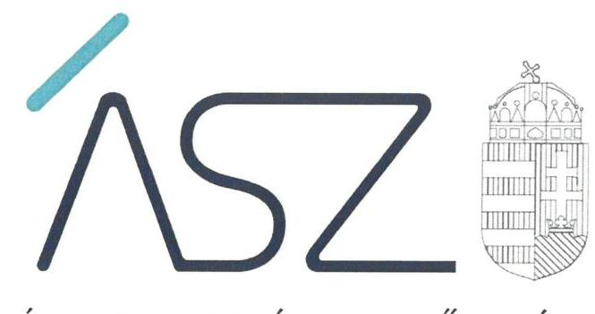
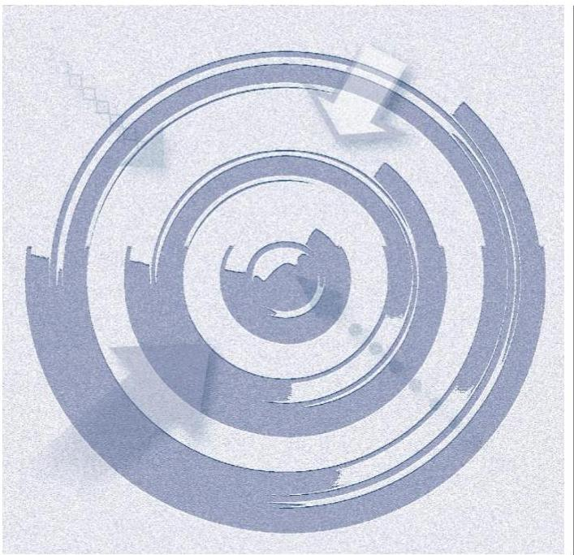
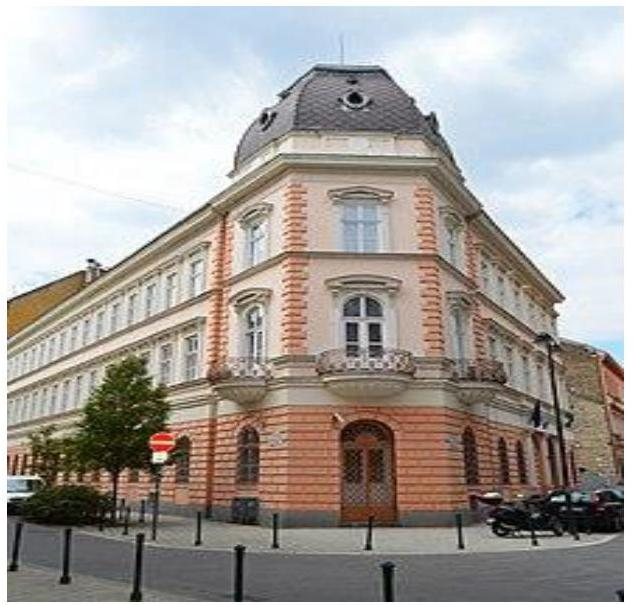
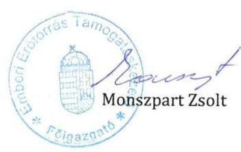
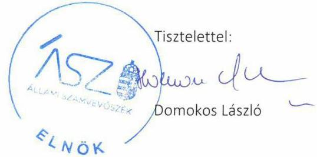
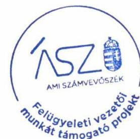

ÁLLAMI SZÁMVEVŐSZÉK

# JELENTÉS 

## Központi költségvetési szervek ellenőrzése

Emberi Erőforrás Támogatáskezelő
2021.

21031
www.asz.hu

---

ÁLLAMI SZÁMVEVŐSZÉK

# JELENTÉS 

## Központi költségvetési szervek ellenőrzése

Emberi Erőforrás Támogatáskezelő
2021. 96. hó 30. nap

21031
www.asz.hu

---

# AZ ELLENŐRZÉST FELÜGYELTE: 

MAKKAI MÁRIA felügyeleti vezető

## AZ ELLENŐRZÉST VEZETTE ÉS A VÉGREHAJTÁSÁÉRT FELELŐS:

JANIK JÓZSEF ellenőrzésvezető

## A PROGRAM ÖSSZEÁLLÍTÁSÁÉRT FELELŐS:

SZALAY NAGY JÁNOS projektvezető

## A TÉMÁHOZKAPCSOLÓDÓ KORÁBBISZÁMVEVŐSZÉKI JELENTÉSEK:

- címe: Magyarország 2018. évi központi költségvetése végrehajtásának ellenőrzése
- sorszáma: $\quad 19197$

Jelentéseink az Országgyűlés számítógépes hálózatán és az interneten a www.asz.hu címen is olvashatóak.

IKTATÓSZÁM: EL-3115-001/2021
TÉMASZÁM: 2450
ELLENŐRZÉS-AZONOSÍTÓ SZÁM: V0791105

---

# TARTALOMJEGYZÉK 

- ÖSSZEGZÉS ..... 5
- AZ ELLENŐRZÉS CÉLJA ..... 6
- AZ ELLENŐRZÉS TERÜLETE ..... 7
- AZ ELLENŐRZÉS HÁTTERE, INDOKOLTSÁGA ..... 8
- A JELENTÉS LÉNYEGES KÉRDÉSKÖREI ..... 9
- AZ ELLENŐRZÉS HATÓKÖRE ÉS MÓDSZEREI ..... 10
- MEGÁLLAPÍTÁSOK ..... 13
- JAVASLATOK ..... 16
- MELLÉKLETEK ..... 17
I. sz. melléklet: Értelmező szótár ..... 17
- FÜGGELÉK: ÉSZREVÉTELEK ..... 21
- RÖVIDÍTÉSEK JEGYZÉKE ..... 27

---

.

---

# ÖSSZEGZÉS 

Az Emberi Erőforrás Támogatáskezelő belső kontrollrendszere 2015-2018 között nem biztosította a közpénzekkel és a közvagyonnal való szabályszerű, átlátható és elszámoltatható gazdálkodás feltételeit. A szervezet használatában, vagyonkezelésében lévő nemzeti vagyon védelmét, elszámoltathatóságát nem biztosították.

## Az ellenőrzés társadalmi indokoltsága

Az államháztartás központi alrendszerébe tartozó szervek alapvető rendeltetése a társadalom javát szolgáló közfeladatok ellátásának hatékony, számon kérhető, pazarlásmentes biztosítása. A közpénzek felhasználásában meghatározó arányt képviselő központi költségvetési szervek gazdálkodásuk révén jelentős hatást gyakorolhatnak a költségvetés egyensúlyának fenntartására, a közpénzek felelős, takarékos felhasználására, a nemzeti vagyon értékének megóvására, gyarapítására, társadalmi érdeknek megfelelő hasznosítására.

A szabályszerű, korrupciómentes, átlátható működés és az elszámoltatható közpénzfelhasználás alapfeltétele az integritás kontrollokat is magában foglaló belső kontrollrendszer szabályszerű kiépítettsége, a kontrollok érvényesítése, a közfeladat ellátását szolgáló vagyonelemek valósághű számbavétele, értékelése, naprakész nyilvántartása.

Indokolt ezért, hogy az Állami Számvevőszék a központi költségvetési szervek belső kontrollrendszerét és vagyongazdálkodását rendszeresen ellenőrizze, értékelve a működésük irányítottságát, korrupció elleni védettségét, továbbá, hogy vagyongazdálkodásuk elszámoltatható volt-e és hozzájárult-e a kiegyensúlyozott, átlátható és fenntartható költségvetési gazdálkodás Alaptörvényben meghatározott elvének érvényesítéséhez.

## Főbb megállapítások, következtetések, javaslatok

Az Emberi Erőforrás Támogatáskezelőnél a szervezeti és működési kereteket szabályszerűen kialakították. A jogszabályi követelményekkel összhangban készítették el a szervezeti és működési szabályzatot, a számviteli politikát és az ahhoz kapcsolódó, valamint a gazdálkodásra, és a kockázatkezelésre vonatkozó szabályozásokat. A kontrolltevékenységek gyakorlása nem volt szabályszerű, nem támogatta az átlátható és elszámoltatható közpénzfelhasználást. Az integrált kockázatkezelési rendszer működtetése keretében 2018-ban nem mérték fel a szervezet tevékenységében rejlő és a szervezeti célokkal összefüggő kockázatokat, nem határozták meg az egyes kockázatokkal kapcsolatban szükséges intézkedéseket sem. Az integritás kontrollrendszer keretében kiépített kontrollokat működtették.

Az Emberi Erőforrás Támogatáskezelő 2018. évi költségvetési beszámolóját leltárral nem támasztották alá. A 2018. évre vonatkozóan nem végezték el a mérleg fordulónapján meglévő, a nemzeti vagyonba tartozó eszközök és források leltározását, nem történt meg a szervezet használatában, vagyonkezelésében álló vagyonelemek felelős számba vétele. Továbbá a 2015-2017. években a vagyonelemek kimutatása a beszámolóban a nem megfelelő értékelések miatt nem volt alátámasztott. Mindezek következtében a szervezet nem biztosította a nemzeti vagyon védelmét, átlátható kimutatását.

Az Állami Számvevőszék a jelentésben foglalt megállapítások alapján az Emberi Erőforrás Támogatáskezelő főigazgatója részére négy javaslatot fogalmazott meg.

---

# AZ ELLENŐRZÉS CÉLJA 

AZ ELLENŐRZÉS CÉLJA annak megítélése volt, hogy az Emberi Erőforrás Támogatáskezelőre vonatkozó irányító szervi feladatellátás a jogszabályi előírások betartásával történt-e; az intézmény átalakítását vagy átszervezését szabályszerűen hajtották-e végre; a belső kontrollrendszer kialakítása és működtetése biztosította-e az átlátható, szabályszerű, gazdaságos, hatékony és eredményes gazdálkodás feltételeit. Kiépítették-e a korrupciós kockázatok kezelését szolgáló integritás kontrollokat, érvényesült-e az integritás szemlélet. A vagyongazdálkodás során biztosított volt-e a nemzeti vagyon értékének megőrzése, védelme és szabályszerű kezelése.

---

# **AZ ELLENŐRZÉS TERÜLETE**

## **Emberi Erőforrás Támogatáskezelő**

Az Emberi Erőforrás Támogatáskezelő 2012. augusztus 16-ával jött létre a Nemzeti Közigazgatási Intézet átalakításával, annak jogutódjaként. Jogi személyként működő, saját gazdasági szervezettel rendelkező központi költségvetési szerv, irányító szerve az EMMI1.

Az EMET2 alaptevékenysége a jogszabály által meghatározott elkülönített állami pénzalap kezelése, továbbá a miniszter által megjelölt vagy jogszabály alapján kijelölt fejezeti kezelésű előirányzatok, normatív hozzájárulások, ösztöndíjak, pénzbeli ellátások és egyéb támogatások előkészítése, lebonyolítása és ellenőrzése. Közreműködik az európai uniós forrásból támogatott fejlesztések tervezésében, előkészítésében, megvalósításában, elszámolásában és lezárásában.

Az EMET a 2015-2016. években több ütemben vett át támogatás kezeléssel kapcsolatos feladatokat jogutódként más szervezetektől, az alábbiak szerint:

A Nemzeti Tehetség Program finanszírozásáról szóló 104/2015. (IV. 23.) Korm. rendelet3 7. §-a alapján 2015. május 1-jétől az OFI4-tól egyes feladatok az EMET-hez kerültek.

A 251/2016. (VIII. 24.) Korm. rendelet5 2. számú melléklete értelmében az európai uniós forrásokból finanszírozott Nemzeti Kiválóság Program és Esélyegyenlőség Program keretében nyújtott támogatásokra vonatkozó támogatásközvetítői és kezelői feladatok tekintetében az EMET 2016. szeptember 1-jétől a Közigazgatási és Igazságügyi Hivatal jogutódja lett.

A központi hivatalok és a költségvetési szervi formában működő minisztériumi háttérintézmények felülvizsgálatával kapcsolatos intézkedésekről szóló 1312/2016. (VI. 13.) Korm. határozat alapján az EMET számos feladatot vett át megszűnő intézményektől, így a Gyermek és Ifjúsági Alapprogram kezelésével, a hátrányos helyzetű tanulóknak szóló európai uniós EFOP 3.1.4. Útravaló ösztöndíjprogram keretében nyújtott támogatások felhasználásával kapcsolatos feladatokat, valamint a Nemzeti Kulturális Alap működtetését.

---

# AZ ELLENŐRZÉS HÁTTERE, INDOKOLTSÁGA 

A belső kontrollrendszer kialakítása és működtetése nélkül nem valósítható meg a közpénzek, a közvagyon átlátható, szabályos, gazdaságos, hatékony és eredményes felhasználása. A belső kontrollrendszer azt a célt szolgálja, hogy a költségvetési szervek működésük és gazdálkodásuk során a tevékenységeket szabályszerűen hajtsák végre, teljesítsék elszámolási kötelezettségeiket és megvédjék az erőforrásokat a veszteségektől, a károktól és a nem rendeltetésszerű használattól. A belső kontrollrendszer magában foglalja mindazon elveket, eljárásokat és belső szabályzatokat, melyek biztosítják, hogy a költségvetési szerv működése szabályszerű és szabályozott legyen, valamennyi tevékenysége és célja összhangban álljon a gazdaságosság, hatékonyság és eredményesség követelményeivel, az eszközökkel és forrásokkal való gazdálkodásban ne kerüljön sor pazarlásra, visszaélésre, rendeltetésellenes felhasználásra. Megfelelő, pontos és naprakész információk álljanak rendelkezésre a költségvetési szerv működésével kapcsolatosan, és a belső kontrollrendszer harmonizációjára, összehangolására vonatkozó jogszabályok végrehajtásra kerüljenek. Az integritás kontrollok kiépítése, erősítése a szervezet korrupciós kockázatainak kezelését szolgálja. A teljesítmény követelmények meghatározása és működtetése megalapozhatja a központi költségvetési szervnél a teljesítmény-ellenőrzés lefolytatását.

Az államháztartás központi alrendszerébe tartozó szervezet vagyona a nemzeti vagyon része, és az Alaptörvény is rögzíti, hogy a vagyonnal való gazdálkodás célja a közérdek szolgálata. Az ÁSZ ${ }^{\circledR}$ szisztematikusan ellenőrzi a költségvetési szervek gazdálkodását, működését, hogy az ellenőrzések megállapításaival támogassa az ellenőrzött szervezetek szabályszerű gazdálkodását, javaslataival elősegítse az Alaptörvényben megfogalmazott alapvetések érvényesülését a mindennapi életben a szervezetek szintjén.

Az ellenőrzések során az ÁSZ „jó gyakorlatokat" is azonosíthat, melyeket tanácsadó funkciója keretében szélesebb körben is megismertethet az érintettekkel, ezáltal is hozzájárulva a költségvetési rendszer szabályozott, átlátható, elszámoltatható és fenntartható működéséhez.

---

# A JELENTÉS LÉNYEGES KÉRDÉSKÖREI 

1. Szabályszerű volt-e a központi költségvetési szerv belső kontrollrendszerének kialakítása és működtetése?
2. A központi költségvetési szervnél kiépítették-e és erősítették-e az integritás kontrollrendszerét?
3. A központi költségvetési szerv biztosította-e a nemzeti vagyon védelmét és szabályszerű kimutatását?
4. A központi költségvetési szervnél kialakították-e a teljesítmény mérésére alkalmas követelményeket?

---

# AZ ELLENŐRZÉS HATÓKÖRE ÉS MÓDSZEREI 

## Az ellenőrzés típusa

| Megfelelőségi ellenőrzés.

## Az ellenőrzött időszak

| 2015. január 1. - 2018. december 31.

## Az ellenőrzés tárgya

Az irányító szervi feladatok ellátása, valamint a költségvetési szerv pénzügyi gazdálkodása a 2015-2016. évekre vonatkozóan. A költségvetési szerv belső kontroll rendszerének kialakítása és működtetése, továbbá vagyongazdálkodása a 2015-2018. években. Az integritáskontrollok kiépítettsége, az integritás érvényesülése, valamint a teljesítmény mérésére alkalmas követelmények kialakítása a 2017-2018. évek tekintetében.

A vagyongazdálkodás ellenőrzésének keretében a vagyongazdálkodás feltételeinek kialakítása, annak szabályszerűsége, az elszámoltathatóság biztosítása a szabályozás szintjén. A vagyonváltozást eredményező döntések, a vagyonban bekövetkezett változások végrehajtásának, nyilvántartásba vételének, elszámolásának szabályszerűsége. A költségvetési szerv könyveiben, mérlegében kimutatott nemzeti vagyon nyilvántartásának szabályszerűsége, ennek keretében a nemzeti vagyonnal történő rendelkezés, a vagyonmozgások, a vagyon nyilvántartásba vétele, értékelése és a mérleg leltárral való alátámasztása.

## Az ellenőrzött szervezet

- Emberi Erőforrás Támogatáskezelő
- Emberi Erőforrások Minisztériuma, mint irányító szerv

## Az ellenőrzés jogalapja

Az ellenőrzés jogszabályi alapját az ÁSZtv. ${ }^{7}$ 1. § (3) bekezdés, 5. § (2)-(4) és (6) bekezdései, valamint az Áht. ${ }^{8}$ 61. § (2) bekezdésének előírásai képezték.

---

# Az ellenőrzés módszerei 

Az ellenőrzést az ellenőrzési program szempontjai, az ellenőrzött időszakban hatályos jogszabályok alapján, az ellenőrzés szakmai szabályai, és a jelen ellenőrzésre irányadó módszertanok figyelembevételével végezte az ÁSZ.

Az ellenőrzés ideje alatt az ellenőrzött szervezettel történő kapcsolattartás biztosítása az ÁSZ SZMSZ ${ }^{9}$ vonatkozó előírásai alapján történt.

Az ellenőrzési kérdések megválaszolásához szükséges bizonyítékok megszerzésére az ellenőrzött által rendelkezésre bocsátott dokumentumokra, adatokra alapozva megfigyelés, szemle (szemrevételezés), kérdésfeltevés (információkérés), mintavételezés, valamint elemző eljárás útján került sor.

Az ellenőrzési bizonyítékként felhasználható adatforrások közé tartoztak egyrészt a szakmai program részletes szempontjainál felsorolt adatforrások, másrészt minden egyéb - az ellenőrzés folyamán feltárt, az ellenőrzés szempontjából információt tartalmazó - dokumentum.

Az ellenőrzés lefolytatásához az ellenőrzött szervezet a tanúsítványok kitöltésével, valamint az ÁSZ által kért dokumentumok megküldésével szolgáltatott adatokat, amelyek valódiságát és teljes körűségét az ellenőrzött szervezet vezetője által tett teljességi és hitelességi nyilatkozat igazolta. Az így rendelkezésre bocsátott adatok, információk kontrollja az ellenőrzés keretében történt.

A belső kontrollrendszer egyes pilléreinek kialakítására és működtetésére vonatkozó értékelés:
$\longrightarrow$ „szabályszerű", amennyiben az értékelt területen az elért „igen" válaszok százalékban kifejezett, egész számra kerekített aránya legalább 85% volt,
$\longrightarrow$ „nem szabályszerű", ha nem érte el a 85%-ot.
A belső kontrollrendszer összesített értékelése (a kontrollrendszer egésze) esetében a „szabályszerű" értékelés feltétele, hogy egyik kontrollterület sem kaphat „nem szabályszerű" értékelést.

A kiadások ellenőrzésére a 2015-2017. évek vonatkozásában került sor. A kiadások (felhalmozási kiadások, dologi kiadások) esetében az ellenőrzés azokra a legnagyobb értékű tételekre - a lényeges sokaságra - terjedt ki, melyek összértéke elérte a teljes sokaság összértékének 50%-át.

A 2015-2017. évi kiadások elszámolása szabályszerűségének ellenőrzése a lényeges sokaságból véletlen mintavételi eljárással kiválasztott tételek alapján történt.

A 2017. évi beruházások, felújítások végrehajtásának, valamint a feladatellátást szolgáló állami vagyontárgyak használatának és év végi értékelésének szabályszerűségét a teljes sokaságból véletlen mintavétellel kiválasztott tételek alapján ellenőrizte az ÁSZ.

A 2017. évi pénzmozgáshoz nem kapcsolódó vagyonváltozások szabályszerűségének esetében tételes ellenőrzésre került sor.

A mintavétellel ellenőrzött területek esetében minden egyes tétel vonatkozásában a használat, elszámolás és értékelés szabályszerűségére vonatkozó kérdéseket tett fel az ÁSZ. „Szabályszerű" értékelést kapott egy

---

ellenőrzött terület, amennyiben 95%-os bizonyossággal az ellenőrzött sokaságban az átlagos hibaarány legfeljebb 10% volt, „nem szabályszerű" értékelést, amennyiben 10%-nál magasabb arányt képviselt.

Abban az esetben, ha az ellenőrzött sokaság tekintetében a 10%-os hibaarányhoz való viszony megítélésének megbízhatósága nem érte el a 95%-ot, annak elérése érdekében az értékelést további szempontokkal került kiegészítésre, figyelembe
 véve a feltárt hibák értékét is.

A 2018. év tekintetében az integritás kontrollok megfelelőségét és az integritás érvényesülését az ellenőrzött szervezet által szolgáltatott ellenőrzési bizonyítékok alapján értékelte az ÁSZ.

---

# 1. Szabályszerű volt-e a központi költségvetési szerv belső kontrollrendszerének kialakítása és működtetése? 

Összegző megállapítás

### 1.1. számú megállapítás

Az EMET belső kontrollrendszerének kialakítása és működtetése nem volt szabályszerű.

A szabályszerű kontrollkörnyezet biztosított volt.
Az EMET működési és szervezeti keretei szabályszerűek voltak, az Áht. előírásainak megfelelően rendelkezett hatályos, egységes szerkezetbe foglalt alapító okirattal, SZMSZ-szel ${ }^{10}$. Az irányító szervi feladatok ellátása a 2015-2016. években szabályszerűen történt.

A jogszabályi előírások szerinti tartalommal készítették el a számviteli politikát, az eszközök és a források leltárkészítési és leltározási szabályzatát, az eszközök és források értékelési szabályzatát, és a pénzkezelési szabályzatot. Az EMET a gazdasági szervezetére vonatkozó szabályokat SZMSZ-ében, valamint ügyrendben határozta meg, amely összhangban állt a jogszabályi rendelkezésekkel.

A kockázatkezelési rendszert és az integrált kockázatkezelési rendszert szabályszerűen alakították ki, azonban az integrált kockázatkezelési rendszer működtetése 2018-ban nem volt szabályszerű.

Az EMET főigazgatója a kockázatkezelési rendszert, majd a Bkr. ${ }^{11}$ 2016. október 1-i hatályú módosítását követően az integrált kockázatkezelési rendszert szabályszerűen alakította ki. A Bkr. előírásaival összhangban rendelkeztek kockázatkezelési szabályzattal, integritási tanácsadót foglalkoztattak.

A kockázatkezelési rendszer működtetése a 2015-2017. években szabályszerű volt. Az integrált kockázatkezelési rendszer működtetése 2018-ban nem volt szabályszerű. Az EMET a 2018. évben nem végezte el a tevékenységében rejlő és szervezeti célokkal összefüggő kockázatok Bkr. 7. § (2) bekezdése szerinti felmérését, valamint nem határozta meg az egyes kockázatokkal kapcsolatban szükséges intézkedéseket.

Az információs és kommunikációs folyamatok kialakítása szabályszerű volt.

A főigazgató a belső kontrollrendszer keretében a Bkr. előírásai szerint alakította ki az információs és kommunikációs rendszert.

---

# 1.4. számú megállapítás 

A szervezet tevékenységének, a célok megvalósításának nyomon követését biztosító rendszert, és belső ellenőrzést szabályszerűen kiépítették és működtették.

A szervezet tevékenységének, a célok megvalósításának nyomon követését szolgáló rendszert meghatározták, kiépítették. A főigazgató gondoskodott a belső ellenőrzés szabályszerű kialakításáról. A Bkr. előírásával összhangban rendelkeztek a főigazgató által jóváhagyott belső ellenőrzési tervvel, az elvégzett ellenőrzésekről jelentéseket készítettek. A belső és külső ellenőrzésekről szabályszerűen vezették a nyilvántartásokat.

A főigazgató a Bkr. 1. számú melléklet szerinti nyilatkozatban minden évben értékelte az EMET belső kontrollrendszerének minőségét, azonban a nyilatkozatokat az irányítószerv részére a Bkr. 11. § (2) bekezdésben foglalt előírástól eltérően nem küldte meg. A nyilatkozatban foglaltak szerint a vezető gondoskodott a belső kontrollrendszer szabályszerű működéséről, amit az ÁSZ ellenőrzés tapasztalatai nem támasztottak alá.

### 1.5. számú megállapítás

A kontrolltevékenységek gyakorlása nem volt szabályszerű.
Az EMET-nél a kontrolltevékenységek nem biztosították a szabályszerű gazdálkodást és működést.

A pénzügyi gazdálkodás 2015-2016-ban a kontrolltevékenységek hiányosságai miatt nem volt szabályszerű.

A 2018. évben a kontrolltevékenységek gyakorlását nem támogatta szabályszerű részletező nyilvántartás, mivel a kötelezettségvállalások, más fizetési kötelezettségek nyilvántartása az Áhsz. ${ }^{12}$ 39. § (3) bekezdésében foglaltakkal ellentétben nem tartalmazta a 14. melléklet II. 4. a) és g) pontjaiban előírtak közül
$\longrightarrow$ a kötelezettségvállalás keltét, iktatószámát;
$\longrightarrow$ a pénzügyi teljesítési adatokat.

## 2. A központi költségvetési szervnél kiépítették-e és erősítették-e az integritás kontrollrendszerét?

Összegző megállapítás Az EMET-nél a kiépített integritás kontrollokat működtették.
Az EMET-nél a Bkr. rendelkezéseiben meghatározott kontrollok mellett a szervezet integritásának erősítése érdekében a jogszabályok által kötelezően elő nem írt kontrollokat is kialakítottak. A kiépített kontrollokat működtették.

Az integritás erősítése érdekében további fejlődésnek van tere az integritás kontrollokat támogató kockázatelemzések elvégzésével, a kockázatelemzések korrupciós és integritási kockázatokra való kiterjesztésével.

---

# 3. A központi költségvetési szerv biztosította-e a nemzeti vagyon védelmét és szabályszerű kimutatását? 

Összegző megállapítás Az EMET a nemzeti vagyon védelmét és szabályszerű kimutatását nem biztosította.

Az EMET nyilatkozata szerint a 2018. évre vonatkozóan nem rendelkezett a mérlegtételeket alátámasztó leltárral. Ez ellentétes a Számv. tv. ${ }^{13}$ 69. § (1) bekezdésében és az Áhsz. 22. § (1) bekezdésében foglalt előírásokkal.

Az EMET leltár hiányában a nemzeti vagyon szabályszerű, a valóságnak megfelelő kimutatását a 2018. évben nem biztosította, az Áhsz. 5. § (1) bekezdésében előírtakkal ellentétben leltárral alátámasztott költségvetési beszámolóval a 2018. évben nem rendelkezett.

A 2015-2017. években a beszámoló leltárral való alátámasztása megtörtént, azonban a mérlegben kimutatott eszközök és források nyilvántartása, értékelése nem volt szabályszerű, mivel:
$\longrightarrow$ a követelések értékelését a 2015-2016. években a Számv. tv. 46. § (3) bekezdése és az Áhsz. 21. § (8) bekezdés előírásaitól eltérően nem végezték el;
az eszközök állományba vétele és üzembehelyezése dokumentálásának hiányában a 2015-2017. években nem voltak biztosítottak az értékcsökkenés Számv. tv. 52. § (2) bekezdésében előírtak szerinti, szabályszerű elszámolásának, így az immateriális javak, tárgyi eszközök Áhsz. 21. § (1) bekezdése rendelkezéseivel összhangban álló kimutatásának feltételei.

## 4. A központi költségvetési szervnél kialakították-e a teljesítmény mérésére alkalmas követelményeket?

## Összegző megállapítás

Az EMET főigazgatója nem alakított ki a teljesítmény mérésére alkalmas követelményeket.

Az EMET-nél nem alakítottak ki a szervezeti célok elérését szolgáló feladatok, folyamatok, tevékenységek mérését szolgáló indikátorokat, mérőszámokat, feladat- és teljesítménymutatókat, amelyek alkalmasak a szervezeti tevékenység teljesítményének mérésére a Bkr. 2. § g), i), j) pontjaiban meghatározott eredményesség, gazdaságosság és hatékonyság követelményeinek érvényesítése érdekében. Ezzel a teljesítmény mérésének lehetőségét nem biztosították és nem teremtették meg annak előfeltételeit, hogy a Bkr. 4. § a) pontjának előírásaival összhangban biztosítsák a költségvetési szerv valamennyi tevékenységének és céljának összhangját a gazdaságosság, hatékonyság és eredményesség követelményeivel.

---

# JAVASLATOK 

Az ÁSZ tv. 33. § (1) bekezdésében foglaltak értelmében az ellenőrzött szervezet vezetője köteles a jelentésben foglalt megállapításokhoz kapcsolódó intézkedési tervet összeállítani és azt a jelentés kézhezvételétől számított 30 napon belül az ÁSZ részére megküldeni. Amennyiben az ellenőrzött szervezet vezetője nem küldi meg határidőben az intézkedési tervet, vagy továbbra sem elfogadható intézkedési tervet küld, az Állami Számvevőszék elnöke az ÁSZ tv. 33. § (3) bekezdés a) és b) pontjaiban foglaltakat érvényesítheti.

## az Emberi Erőforrás Támogatáskezelő főigazgatójának

1. Intézkedjen a jogszabályi előírásoknak megfelelően az integrált kockázatkezelési rendszer működtetéséről.
(1. 2. sz. megállapítás 2. bekezdés második és harmadik mondata alapján)
2. Intézkedjen, hogy a kötelezettségvállalások, más fizetési kötelezettségek nyilvántartása feleljen meg a jogszabályi előírásoknak.
(1. 5. sz. megállapítás 4. bekezdése alapján)
3. Intézkedjen a jogszabályi előírásoknak megfelelően a mérleg tételeit alátámasztó leltár elkészítéséről, amely tételesen, ellenőrizhető módon tartalmazza a mérleg fordulónapján meglévő eszközöket és forrásokat mennyiségben és értékben.
(3. sz. megállapítás 1. és 2. bekezdése alapján)
4. Intézkedjen a teljesítmény mérésére alkalmas követelmények kialakításáról.
(4 sz. megállapítás 1. bekezdés első mondata alapján)

---

# MELLÉKLETEK 

## I. SZ. MELLÉKLET: ÉRTELMEZŐ SZÓTÁR

állami vagyon
állami vagyonnak minősül:
a) az állam tulajdonában lévő dolog, valamint a dolog módjára hasznosítható természeti erő,
b) az a) pont hatálya alá nem tartozó mindazon vagyon, amely vonatkozásában törvény az állam kizárólagos tulajdonjogát nevesíti,
c) az állam tulajdonában lévő tagsági jogviszonyt megtestesítő értékpapír, illetve az államot megillető egyéb társasági részesedés,
d) az államot megillető olyan immateriális, vagyoni értékkel rendelkező jogosultság, amelyet jogszabály vagyoni értékű jogként nevesít,
e) az állam tulajdonában lévő pénzügyi eszközök.
(Forrás: Vtv. 1. § (2) bekezdése)
állami vagyon használója
Az a természetes vagy jogi személy, jogi személyiséggel nem rendelkező szervezet, aki, vagy amely törvény vagy szerződés alapján, bármely jogcímen (bérlet, haszonbérlet, használat stb.) állami vagyont birtokol, használ, szedi annak használt, hasznosít, ide nem értve a haszonélvezőt, a vagyonkezelőt és a tulajdonosi jogok gyakorlóját". (Forrás: Vtvr. 1. § (7) bekezdés a) pontja)
állami vagyon kezelője (vagyonkezelő)
Az állami tulajdonában álló vagyon tekintetében-a nemzeti vagyonról szóló törvényben vagyonkezelőként meghatározott azon személy, amellyel az állami vagyon vagyonkezelésére a Magyar Nemzeti Vagyonkezelő Zrt. valamint annak jogelődje, vagy az állami tulajdonosi joggyakorlója vagyonkezelési szerződést kötött, továbbá akit törvény vagyonkezelőnek kijelölt.
(Forrás: Vtvr. 1. § (7) bekezdés b) pontja és az Nvtv. 3. § 19. a) pontja)
ÁSZ Integritás Projekt
Az Állami Számvevőszék 2009-ben indította el a „Korrupciós kockázatok feltérképezése - Integritás alapú közigazgatási kultúra terjesztése" című, európai uniós forrásból megvalósított kiemelt projektjét (Integritás Projekt). Az Integritás Projekt célja, hogy felmérje a közszféra intézményei korrupciós kockázatoknak való kitettségét, illetőleg az azok mérséklésére hivatott kontrollok szintjét. Az Állami Számvevőszék a projekt révén az integritás szemlélet minél szélesebb körrel történő megismertetését, gyakorlatba ültetését kívánja elérni. Az integritás követelményeinek megfelelő szervezeti működést előnyben részesítő közigazgatási kultúra elterjesztését és a korrupció elleni fellépést az ÁSZ önmagára nézve is stratégiai jelentőségű célként fogalmazta meg. A projekt a felmérésben résztvevő intézmények számára helyzetükről egyfajta „tükörképet" mutat be, ami alapot teremt a jövőbeni pozitív irányú elmozduláshoz. (Forrás: a http://integritas.asz.hu honlapon közzétett, a 2013. évi Integritás felmérés eredményeiről készült összefoglaló tanulmány)
belső ellenőrzés
Független, tárgyilagos bizonyosságot adó és tanácsadó tevékenység, amelynek célja, hogy az ellenőrzött szervezet működését fejlessze és eredményességét növelje, az ellenőrzött szervezet céljai elérése érdekében rendszerszemléletű megközelítéssel és módszeresen értékeli, illetve fejleszti az ellenőrzött szervezet irányítási és belső kontrollrendszerének hatékonyságát. (Forrás: Bkr. 2. § b) pontja)

---

belső kontrollrendszer

A belső kontrollrendszer a kockázatok kezelése és tárgyilagos bizonyosság megszerzése érdekében kialakított folyamatrendszer, amely azt a célt szolgálja, hogy a működés és gazdálkodás során a tevékenységeket szabályszerűen, gazdaságosan, hatékonyan, eredményesen hajtsák végre, az elszámolási kötelezettségeket teljesítsék, megvédjék az erőforrásokat a veszteségektől, károktól és nem rendeltetésszerű használattól. (Forrás: Áht. 69. § (1) bekezdése)
hasznosítás

A nemzeti vagyon birtoklásának, használatának, hasznok szedése jogának bármely a tulajdonjog átruházását nem eredményező - jogcímen történő átengedése, ide nem értve a vagyonkezelésbe adást, valamint a haszonélvezeti jog alapítását. (Forrás: Nvtv. 3. § (1) bekezdés 4. pontja)
információs és kommunikációs rendszer

A költségvetési szerv vezetője által kialakított és működtetett olyan rendszer, mely biztosítja, hogy a megfelelő információk a megfelelő időben eljutnak az illetékes szervezethez, szervezeti egységhez, illetve személyhez. (Forrás: Bkr. 9. § (1) bekezdés)
integritás

Az integritás az elvek, értékek, cselekvések, módszerek, intézkedések konzisztenciáját jelenti, vagyis olyan magatartásmódot, amely meghatározott értékeknek megfelel. (Forrás: Nemzetgazdasági Minisztérium: Magyarországi államháztartási belső kontroll standardok Útmutató 1.6.1. pontja, 2012. december)
irányító szerv
A költségvetési szerv tekintetében az Áht-ban meghatározott irányítási hatáskört gyakorló szerv. (Forrás: Áht. 1. § 9. pontja)
integrált kockázatkezelési rendszer

Olyan folyamatalapú kockázatkezelési rendszer, amely a szervezet minden tevékenységére kiterjed, egységes módszertan és eljárások alkalmazásával, a szervezet célkitűzéseinek és értékeinek figyelembevételével biztosítja a szervezet kockázatainak teljes körű azonosítását, azok meghatározott kritériumok szerinti értékelését, valamint a kockázatok kezelésére vonatkozó intézkedési terv elkészítését és az abban foglaltak nyomon követését. (Forrás: Bkr. 2. § m) pontja)
kontrollkörnyezet

A költségvetési szerv vezetője által kialakított olyan elvek, eljárások, belső szabályzatok összessége, amelyben világos a szervezeti struktúra, a folyamatok átláthatók, egyértelműek a felelősségi, hatásköri viszonyok és feladatok, meghatározottak, ismertek és elfogadottak az etikai elvárások a szervezet minden szintjén, átlátható a humánerőforrás-kezelés. (Forrás: Bkr. 6. § (1) bekezdés)
kontrolltevékenységek

A költségvetési szerv vezetője által a szervezeten
 belül kialakított (kontroll) tevékenységek, melyek biztosítják a kockázatok kezelését, hozzájárulnak a szervezet céljainak eléréséhez és erősítik a szervezet integritását. (Forrás: Bkr. 8. § (1) bekezdés)
kommunikáció

A tevékenység, melynek során információtovábbítás valósul meg. A kommunikációs folyamat résztvevői között tájékoztatás történik, mely során tényeket, ezek magyarázatát közlik.
közfeladat

Jogszabályban meghatározott állami vagy önkormányzati feladat, amit az arra kötelezett közérdekből, a jogszabályban meghatározott követelményeknek és feltételeknek megfelelve végez, ideértve a lakosság közszolgáltatásokkal való ellátását, továbbá az állam nemzetközi szerződésekben vállalt kötelezettségeiből adódó közérdekű feladatokat, valamint e feladatok ellátásakor szükséges infrastruktúra biztosítását is. (Forrás: Nvtv. 3. § (1) bekezdés 7. pontja)
monitoring-rendszer

A szervezet tevékenységének, a célok megvalósításának nyomon követését biztosító rendszer, amely az operatív tevékenységek keretében megvalósuló folyamatos és eseti nyomon követésből, valamint az operatív tevékenységektől függetlenül működő belső ellenőrzésből áll. (Forrás: Bkr. 10. §)

---

tulajdonosi joggyakorló
vagyongazdálkodás

A nemzeti vagyon felett az államot vagy a helyi önkormányzatot megillető tulajdonosi jogok és kötelezettségek összességének gyakorlására jogosult személy. (Forrás: Nvtv. 3. § (1) bekezdés 17. pontja)

A nemzeti vagyon rendeltetésének megfelelő, az állam, az önkormányzat mindenkori teherbíró képességéhez igazodó, elsődlegesen a közfeladatok ellátásához és a mindenkori társadalmi szükségletek kielégítéséhez szükséges, egységes elveken alapuló, átlátható, hatékony és költségtakarékos működtetése, értékének megőrzése, állagának védelme, értéknövelő használata, hasznosítása, gyarapítása, továbbá az állam vagy a helyi önkormányzat feladatának ellátása szempontjából feleslegessé váló vagyontárgyak elidegenítése. (Forrás: Nvtv. 7. § (2) bekezdése)

---

.

---

# FÜGGELÉK: ÉSZREVÉTELEK 

A jelentéstervezetet a Számvevőszék 15 napos észrevételezésre megküldte az ellenőrzött szervezetek vezetőinek az ÁSZ tv. 29. § (1) bekezdése előírásának megfelelően.

Az Emberi Erőforrások Minisztériuma nem tett észrevételt. Az Emberi Erőforrás Támogatáskezelő főigazgatója által tett észrevételt és az arra adott választ a függelék tartalmazza.

[^0]
[^0]:    * 29. § (1) Az Állami Számvevőszék az ellenőrzési megállapításait megküldi az ellenőrzött szervezet vezetőjének vagy az általa megbízott személynek, és annak, akinek személyes felelősségét állapította meg.
    (2) Az ellenőrzött szervezet vezetője és a felelősként megjelölt személy az ellenőrzés megállapításaira tizenöt napon belül írásban észrevételt tehet.
    (3) Az Állami Számvevőszék az észrevételre a beérkezésétől számított harminc napon belül írásban válaszol. A figyelembe nem vett észrevételeket köteles a jelentésben feltüntetni, és megindokolni, hogy azokat miért nem fogadta el.

---

# EMBERI ERŐFORRÁS TÁMOGATÁSKEZELŐ FŐIGAZGATÓ 

## Domokos László részére

elnök

## Állami Számvevőszék

Budapest
Apáczai Csere János u. 10.
1052

Iktatószám: PSZO/14/2020
Tárgy: EL-1557-082/2020. Központi
költségvetési szervek ellenőrzése -
EMET

## Állami Számvevőszék

Budapest
Apáczai Csere János u. 10.
1052

## Tisztelt Elnök Úr!

Hivatkozva az Állami Számvevőszék EL-1557-082/2020. számú a „Központi költségvetési szervek ellenőrzése - Emberi Erőforrás Támogatáskezelő" címmel megküldött számvevőszéki jelentéstervezet kapcsán az alábbi észrevételt tesszük.
A jelentéstervezetben foglalt megállapításokat elfogadjuk, és egyidejűleg tájékoztatást kívánunk nyújtani az alábbi megállapításokra tett, illetve folyamatban lévő intézkedéseinkről.

1. Intézkedjen a jogszabályi előírásoknak megfelelően az integrált kockázatkezelési rendszer működtetéséről.
2. évben felmérés készült a szervezet kockázatainak azonosítása céljából, amelynek értékelésére, illetve a kockázatok kezelésére vonatkozó intézkedési terv összeállítására integritás tanácsadó jogviszonyának megszűntetését követően a felelős szervezeti egység, a Gazdasági Igazgatóság részéről nem került sor. Az EMET 2020. június 24-én hatályba lépett új Szervezeti és Működési Szabályzata (a továbbiakban: SzMSz) alapján az integrált kockázatkezelési rendszer működtetése egy újonnan kialakított szervezeti egység, a Szervezetfejlesztési és Humánpolitikai Igazgatóság feladatkörébe került. A főigazgató által kijelölt integrált kockázatkezelési felelős elvégzi az egyes kockázatok felmérését, évente intézkedési tervet készít a kockázatok kezelésére, valamint közvetlenül a főigazgatónak felelős az intézkedések végrehajtásának folyamatos nyomon követéséért.
3. Intézkedjen, hogy a kötelezettségvállalások, más fizetési kötelezettségek nyilvántartása feleljen meg a jogszabályi előírásoknak.
A hatályos szabályozás felülvizsgálatát megkezdtük az új SzMSz hatályba lépését követően. A kötelezettségvállalás, teljesítményigazolás, érvényesítés, utalványozás rendjére, a kötelezettségvállalások nyilvántartására vonatkozó belső szabályzat módosítását 2020. július 24-ig elvégezzük.

---

# EMBERI ERŐFORRÁS TÁMOGATÁSKEZELŐ FŐIGAZGATÓ 

3. Intézkedjen a jogszabályi előírásoknak megfelelően a mérleg tételeit alátámasztó leltár elkészítéséről, amely tételesen, ellenőrizhető módon tartalmazza a mérleg fordulónapján meglévő eszközöket és forrásokat mennyiségben és értékben.

A 2019. évi beszámolóhoz kapcsolódó mérlegtételeket alátámasztó leltár aláírt példánya 2020. július 8-án megküldésre került. Az EMET megkezdte a 2020. december 31-ig esedékes, tárgyi eszközökre vonatkozó tételes leltározási tevékenység előkészítését.
4. Intézkedjen a teljesítmény mérésére alkalmas követelmények kialakításáról.

Az EMET 2020. évi támogatáskezelési folyamatainak ütemezése alapján a havi bontásban meghatározott kapacitás igény felmérését követően a pályázatkezeléssel foglalkozó szervezeti egységeinknél a teljesítmény mérésére alkalmas rendszer bevezetése megkezdődött. 2020. július 7-e óta a rendszer tesztelése, és a tevékenységeinkhez igazodó testre szabása folyamatos, a közeljövőben a teljesítmény mérési rendszer teljes szervezetre történő alkalmazását kívánjuk megvalósítani.

Budapest, 2020. július 14.

Tisztelettel:

---

# 150 éve   a közpénzek őre 

Ikt. szám: EL-1557-090/2020.

Monszpart Zsolt úr
főigazgató
Emberi Erőforrás Támogatáskezelő

## Budapest

Tisztelt Főigazgató Úr!

A „Központi költségvetési szervek ellenőrzése - Emberi Erőforrás Támogatáskezelő" címmel készített számvevőszéki jelentéstervezetre tett PSZO/14/2020 iktatószámú észrevételét köszönettel megkaptam.

Az Állami Számvevőszék észrevételre vonatkozó álláspontjáról a felügyeleti vezető által készített részletes tájékoztatást mellékelten megküldöm.

Tájékoztatom Főigazgató urat, hogy a számvevőszéki jelentésben - az Állami Számvevőszékről szóló 2011. évi LXVI. törvény 29. § (3) bekezdése alapján - a figyelembe nem vett észrevételt szerepeltetjük, annak indoklásával, hogy azt az Állami Számvevőszék miért nem fogadta el.

Budapest, 2020. 08. hó 11. nap

Melléklet: Tájékoztatás az észrevétel kezeléséről

---

Melléklet
Ikt.szám: EL-1557-090/2020.

# Tájékoztatás 

az észrevétel kezeléséről

A „Központi költségvetési szervek ellenőrzése - Emberi Erőforrás Támogatáskezelő" című jelentéstervezetre 2020. július 14-én érkezett észrevételt áttekintettük, annak kezelésével kapcsolatban a következő tájékoztatást adom.

Az észrevétel érinti a jelentéstervezetben az Emberi Erőforrás Támogatáskezelő főigazgatójának megfogalmazott javaslatokat és az azokat megalapozó megállapításokat.

Főigazgató úr észrevételében rögzítette, hogy a jelentéstervezetben foglalt megállapításokat elfogadja és egyidejűleg tájékoztatást fogalmazott meg a megállapításokkal összefüggésben tett, illetve folyamatban lévő intézkedésekről.

Az Állami Számvevőszék ellenőrzési megállapításait megerősítő észrevételt és az intézkedések foganatosításáról szóló tájékoztatást köszönjük. A már megtett, illetve tervezett intézkedések alapján a jelentéstervezet módosítása nem indokolt.

Tájékoztatom Főigazgató urat, hogy az észrevételben megfogalmazott intézkedéseket nem értékeltük. Az ellenőrzött szervezet vezetőjének a végleges számvevőszéki jelentés kézhezvételét követően, az Állami Számvevőszékről szóló 2011. évi LXVI. törvény 33. § (1) bekezdésében foglalt határidőn belül intézkedési terv készítési kötelezettsége van.

Budapest, 2020. 08. hó 11. nap

Makkai Mária s.k. felügyeleti vezető

A kiadmány hiteles.

---

.

---

# RÖVIDÍTÉSEK JEGYZÉKE 

${ }^{1}$ EMMI
${ }^{2}$ EMET
${ }^{3}$ 104/2015. (IV. 23.) Korm. rendelet
${ }^{4}$ OFI
${ }^{5}$ 251/2016. (VIII. 24.) Korm. rendelet
${ }^{6}$ ÁSZ
${ }^{7}$ ÁSZ.tv.
${ }^{8}$ Áht.
${ }^{9}$ ÁSZ-SZMSZ
${ }^{10}$ SZMSZ
${ }^{11}$ Bkr.
${ }^{12}$ Áhsz.
${ }^{13}$ Számv. tv

Emberi Erőforrások Minisztériuma
Emberi Erőforrás Támogatáskezelő
a Nemzeti Tehetség Program finanszírozásáról szóló 104/2015. (IV. 23.) Korm. rendelet
Oktatáskutató és Fejlesztő Intézet
a Közigazgatási és Igazságügyi Hivatal megszüntetéséről, valamint egyes kapcsolódó kormányrendeletek módosításáról szóló 251/2016. (VIII. 24.) Korm. rendelet
Állami Számvevőszék
az Állami Számvevőszékről szóló 2011. évi LXVI. törvény
az államháztartásról szóló 2011. évi CXCV. törvény
Állami Számvevőszék Szervezeti és Működési Szabályzata
Emberi Erőforrás Támogatáskezelő Szervezeti és működési szabályzata
a költségvetési szervek belső kontrollrendszeréről és belső ellenőrzésről szóló 370/2011. (XII. 31.) Korm. rendelet
az államháztartás számviteléről szóló 4/2013. (I. 11.) Korm. rendelet
a számvitelről szóló 2000. évi C. törvény

---

# ÁSZ 

ÁLLAMI SZÁMVEVŐSZÉK
1052 Budapest, Apáczai Cs. J. u. 10. | 1364 Budapest 4. Pf. 54
TEL: +36 14849100
email: szamvevoszek@asz.hu
web: www.asz.hu | www.aszhirportal.hu

