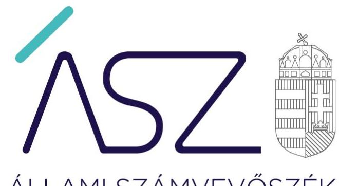
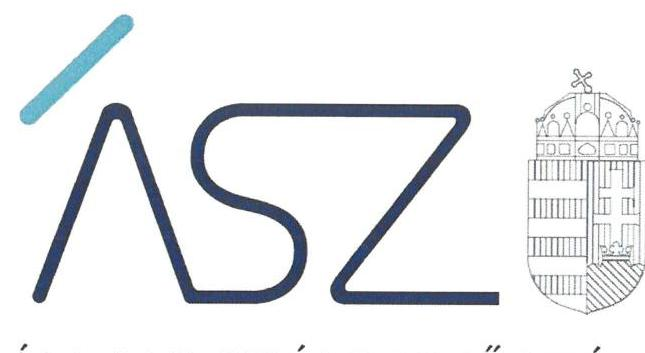
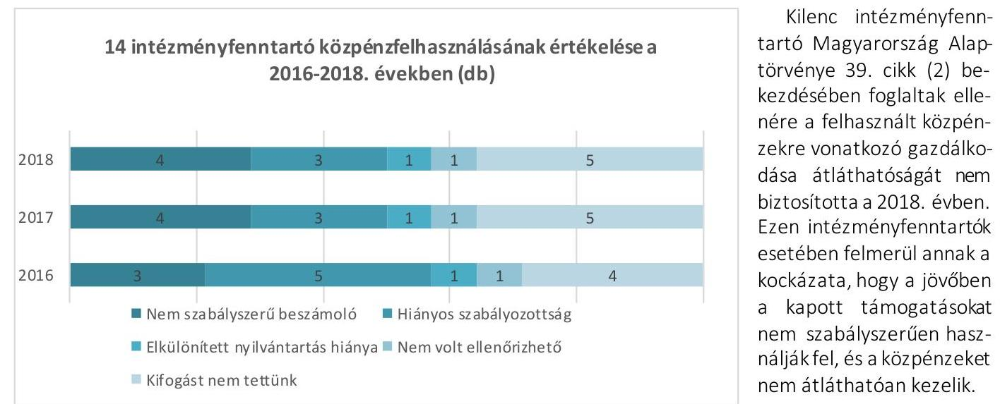
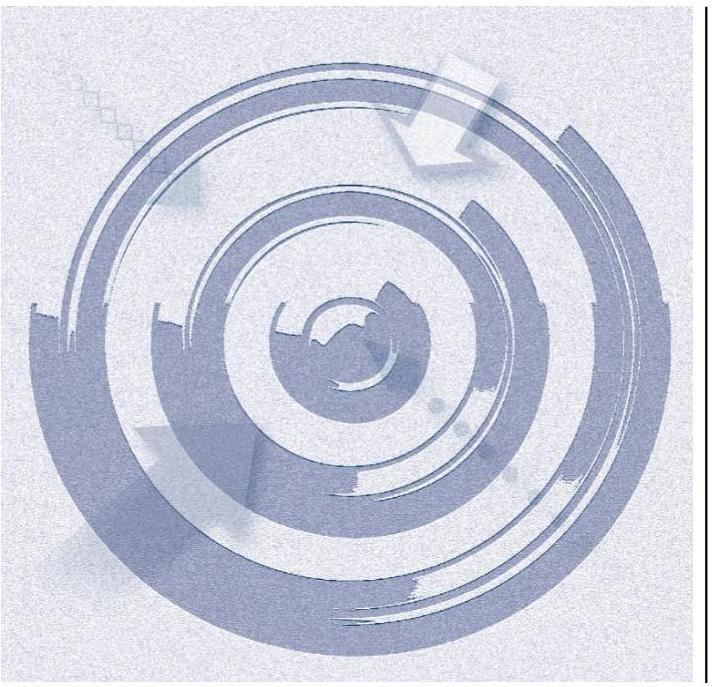

ÁLLAMI SZÁMVEVŐSZÉK

# JELENTÉS 

Nem állami humánszolgáltatók ellenőrzése

A köznevelési és szociális humánszolgáltatást nyújtó intézmények, szolgáltatók államháztartáson kívüli fenntartói központi költségvetésből kapott támogatásai felhasználásának ellenőrzése - tizennégy gazdasági társaságnál
2021.

21032
www.asz.hu

---

ÁLLAMI SZÁMVEVŐSZÉK

# JELENTÉS 

Nem állami humánszolgáltatók ellenőrzése

A köznevelési és szociális humánszolgáltatást nyújtó intézmények, szolgáltatók államháztartáson kívüli fenntartói központi költségvetésből kapott támogatásai felhasználásának ellenőrzése - tizennégy gazdasági társaságnál
2021. 04. hó 27. nap

21032
www.asz.hu

---

# AZ ELLENŐRZÉST FELÜGYELTE: 

KLINGA LÁSZLÓ felügyeleti vezető

## AZ ELLENŐRZÉST VEZETTE ÉS A VÉGREHAJTÁSÁÉRT FELELŐS:

KISTÓTH KRISZTINA ellenőrzésvezető

A PROGRAM ÖSSZEÁLLÍTÁSÁÉRT FELELŐS:
FE KETE-NAGY ANDRÁS GÁBOR projekt vezető

IKTATÓSZÁM: EL-3171-001/2021.
TÉMASZÁM: 2523
ELLENŐRZÉS-AZONOSÍTÓ SZÁM: V0867192

---

# TARTALOMJEGYZÉK 

- ÖSSZEGZÉS ..... 5
- AZ ELLENŐRZÉS CÉLJA ..... 7
- AZ ELLENŐRZÉS TERÜLETE ..... 8
- AZ ELLENŐRZÉS HÁTTERE, INDOKOLTSÁGA ..... 11
- AZ ELLENŐRZÉS LÉNYEGES KÉRDÉSKÖREI. ..... 12
- AZ ELLENŐRZÉS HATÓKÖRE ÉS MÓDSZEREI. ..... 13
- MEGÁLLAPÍTÁSOK ..... 15
- JAVASLATOK ..... 20
- MELLÉKLETEK. ..... 21
I. sz. melléklet: Az ellenőrzött szervezetek felsorolása ..... 21
II. sz. melléklet: Értelmező szótár ..... 22
- FÜGGELÉK: ÉSZREVÉTELEK ..... 25
- RÖVIDÍTÉSEK JEGYZÉKE ..... 27

---

.

---

# ÖSSZEGZÉS 

Az ellenőrzött 12 szociális, valamint kettő szociális és köznevelési humánszolgáltatást nyújtó államháztartáson kívüli intézményfenntartó közül öt intézményfenntartó biztosította a humánszolgáltatási közfeladatok ellátására kapott költségvetési támogatások felhasználásának átláthatóságát. Kettő intézményfenntartó nem biztosította az ellenőrizhetőség feltételeit és hét intézményfenntartó nem biztosította a költségvetési támogatások elszámoltathatóságát. Az ÁSZ kezdeményezésére az ellenőrzött időszakot követően, a 2019. évre hét intézményfenntartónál a közpénzzel való elszámoltathatóság javult.

## Az ellenőrzés társadalmi indokoltsága

A szociális gondoskodást igénylők védelme, a kapcsolódó feladatok, valamint a köznevelési feladatok ellátása az Alaptörvényben meghatározott, a társadalom szempontjából fontos tevékenységek. Jogszabályok teszik lehetővé, hogy államháztartáson kívüli szervezetek így a gazdasági társaságok által fenntartott intézmények is végezzenek szociális, köznevelési feladatokat. Mindehhez a központi költségvetés évente jelentős összegű támogatással járul hozzá. Az államháztartáson kívüli, humánszolgáltatást végző intézmények az igényelt közpénzekből társadalmilag hasznos, közösségteremtő, közérdekű tevékenységet végeznek, illetve közfeladatokat látnak el.

Az intézményfenntartók ellenőrzésével az Állami Számvevőszék hozzájárul ahhoz, hogy ezen közpénzeket az államháztartáson kívüli szervezetek is ellenőrizhető, átlátható és elszámoltatható módon használják fel a közfeladatok ellátása során. Az ellenőrzések célja továbbá, hogy a nyilvánosság és az igénybevevők megfelelő tájékoztatást kapjanak az államháztartáson kívüli közfeladatot ellátók múködéséről.

Az Állami Számvevőszék ellenőrzései arra adnak választ, hogy az intézményfenntartók arra használták-e fel a közpénzeket, amire igényelték. A szabályszerű gazdálkodás elengedhetetlen a közfeladat ellátás szakmai céljainak megvalósításához, valamint a társadalmi közbizalom fenntartásához.

## Főbb megállapítások, következtetések

Számviteli szabályozás kialakítása

Számviteli keretek nélkül a közpénzfelhasználás nem elszámoltatható.

A számviteli politika és annak keretében készítendő szabályzatok, valamint a számlarend hiányában a költségvetési támogatások elszámolási kereteit nem alakították ki.

## Beszámolási kötelezettség teljesítése

Számviteli beszámolók hiányában a közpénzfelhasználás nem elszámoltatható.

Számviteli beszámoló hiányában a költségvetési támogatás felhasználása nem volt átlátható.

## Közpénzfelhasználás elkülönített nyilvántartása

Elkülönített nyilvántartás nélkül a közpénzfelhasználásának ellenőrizhetősége nem biztosított, ezáltal nem elszámoltatható.

Elkülönített nyilvántartás hiányában az intézményfenntartó nem tudta igazolni a költségvetési támogatás cél szerinti felhasználását.

---

Öt intézményfenntartó esetén lényeges hibát nem tárt fel az ÁSZ¹ a 2018. évi költségvetési támogatások átláthatósága és elszámoltathatósága terén.

Az ÁSZ kezdeményezte kilenc intézményfenntartónál, hogy az ellenőrzött időszakot követő 2019. évre vonatkozóan bemutassák a közpénzekkel való elszámolás feltételeinek meglétét, hozzájárulva ezzel a költségvetési támogatások felhasználásának elszámoltathatóságához.

Az ellenőrzött időszakot követő 2019. évre vonatkozó, az ÁSZ kezdeményezésére bemutatott dokumentumok alapján hat intézményfenntartónál a költségvetési támogatások felhasználásának és az elszámoltathatóságnak a feltételei több területen, így a számviteli szabályozottság, a számviteli beszámoló készítése, illetve a költségvetési támogatások feladatonkénti elkülönítése terén lényegesen jobb helyzetet mutatnak, mint az ellenőrzött időszakban. Egy intézményfenntartónál a költségvetési támogatások felhasználásának és az elszámoltathatóságnak a feltételei a számviteli szabályozottság terén jobb helyzetet mutatott 2019-ben.

Két intézményfenntartónál az ÁSZ kezdeményezése ellenére az ellenőrzött időszakot követően a költségvetési támogatások felhasználásának és az elszámoltathatóságnak a feltételei nem javultak 2019-ben. Emiatt változatlanul fennáll annak kockázata, hogy a közpénzeket nem átláthatóan és elszámoltathatóan kezelik. Ezért az ÁSZ az "Áldott Szivek" Szociális Szolgáltató Közhasznú Nonprofit Korlátolt Felelősségű Társaság és az "URBS PRO PATIENTE" Egészségügyi Fejlesztő és Üzemeltető Közhasznú Nonprofit Korlátolt Felelősségű Társaság tekintetében az államháztartás alrendszeréből nyújtott, az intézményfenntartót megillető támogatások folyósításának felfüggesztését kezdeményezte.

Az ÁSZ az ellenőrzés megállapításai alapján az Empátia Gondozóház Nonprofit Közhasznú Korlátolt Felelősségű Társaság ügyvezetője részére egy javaslatot fogalmazott meg.

---

# AZ ELLENŐRZÉS CÉLJA 

AZ ELLENŐRZÉS CÉLJA annak értékelése volt, hogy a nem állami, nem önkormányzati szociális és köznevelési intézményi fenntartó központi költségvetésből kapott támogatásainak felhasználása szabályszerű volt-e.

---

# AZ ELLENŐRZÉS TERÜLETE 

## Szociális, valamint szociális és köznevelési (főfeladatként szociális) humánszolgáltatási közfeladatokat ellátó államháztartáson kívüli fenntartók

Nem állami szociális és gyermekjóléti, gyermekvédelmi intézményfenntartó lehet a Szoc. tv. ${ }^{2}$ és a Gyvt. ${ }^{3}$ szerint a helyi önkormányzat mellett az egyházi jogi személy, az egyéni vállalkozó és a magyarországi székhelyú jogi személy.

A köznevelési feladatok ellátása jellemzően intézményi formában történik. Köznevelési intézményt, ha a tevékenység folytatásának jogát - jogszabályban foglaltak szerint - megszerezte, az Nkt. ${ }^{4}$ szerint más személy vagy szervezet (például civil szervezet, alapítvány, gazdasági társaság) alapíthat és tarthat fenn.

A szociális és köznevelési szolgáltatást biztosító nem állami fenntartó pedig a mindenkori költségvetési törvényben ${ }^{5}$ biztosított támogatásra jogosult. Az Áht. ${ }^{6}$, Ávr. ${ }^{7}$, Nkt. vhr ${ }^{8}$. előírásai szerint a Kincstár ${ }^{9}$ a megítélt támogatásokat a fenntartó ré-
szére folyósítja.
Az államháztartáson kívüli 12 szociális, valamint kettő szociális és köznevelési támogatásban részesült fenntartó központi költségvetésből kapott támogatásai felhasználását ellenőriztük. Az összesen 14 gazdálkodó szervezet társasági formája korlátolt felelősségű társaság volt.
$\longrightarrow$ A debreceni székhelyű "Áldott Szivek" Szociális Szolgáltató Közhasznú Nonprofit Korlátolt Felelősségű Társaság a 2016-2018. években egy nem önállóan gazdálkodó Intézményt ${ }_{1}{ }^{10}$ tartott fenn. Az Intézmény ${ }_{1}$ egy szociális humánszolgáltatási feladatot, házi segítségnyújtást végzett.
$\longrightarrow$ A berettyóújfalui székhelyű BERÉPŐ Berettyóújfalui Értelmi Fogyatékosok és Pszichiátriai Betegek Otthona Nonprofit Korlátolt Felelősségű Társaság a 2016-2018. években egy nem önállóan gazdálkodó Intézményt ${ }_{2}{ }^{11}$ tartott fenn. Az Intézmény ${ }_{2}$ három szociális humánszolgáltatási feladatot végzett, idősek otthona és pszichiátriai betegek otthona ápolást gondozást nyújtó, valamint időskorúak gondozóháza átmeneti elhelyezést nyújtó intézményi ellátást.
$\longrightarrow$ A ballószögi székhelyű Empátia Gondozóház Nonprofit Közhasznú Korlátolt Felelősségű Társaság a 2016-2018. években egy nem önállóan gazdálkodó Intézményt ${ }_{3}{ }^{12}$ tartott fenn. Az Intézmény ${ }_{3}$ egy szociális humánszolgáltatási feladatot, idősek otthona ápolást gondozást nyújtó intézményi ellátást végzett.
$\longrightarrow$ A pátyi székhelyű EURO-DIASTER Szociális Ellátó és Egészségügyi Nonprofit Korlátolt Felelősségű Társaság a 2016-2018. években kettő nem önállóan gazdálkodó Intézményt ${ }_{4}{ }^{13}$ tartott fenn. Az Intézmények ${ }_{4}$ kettő szociális feladatot, idősek otthona ápolás, gondozást

---

nyújtó és időskorúak gondozóháza átmeneti elhelyezést nyújtó intézményi ellátást, valamint egy gyermekjóléti humánszolgáltatási feladatot, gyermekek napközbeni bölcsődei ellátását végezték.

- A szombathelyi székhelyű Fogyatékkal Élőket és Hajléktalanokat Ellátó Közhasznú Nonprofit Korlátolt Felelősségű Társaság a 20162018. években kettő nem önállóan gazdálkodó Intézményt ${ }^{14}$ tartott fenn. Az Intézmények hat szociális humánszolgáltatási alapfeladatot, fogyatékos személyek nappali intézményi ellátását, hajléktalanok nappali intézményi és hajléktalan személyek átmeneti ellátását, éjjeli menedékhely, hajléktalanok otthona, valamint támogató szolgálatot láttak el.
- A szegedi székhelyű GEMMA ISKOLA Egészségügyi Rehabilitációs Szolgáltató Nonprofit Közhasznú Korlátolt Felelősségű Társaság a 2016-2018. években egy nem önállóan gazdálkodó szociális humánszolgáltató és egy önálló jogi személyiséggel rendelkező köznevelési Intézményt ${ }^{15}$ tartott fenn. A Fenntartó ${ }^{16}$ a fogyatékos személyek nappali ellátását végző szociális Intézmény, fenntartását 2017. január 1-től vette át, amely tevékenységi köre további egy feladattal, a támogató szolgálat működtetésével a 2017. évben kibővült. A köznevelési Intézményt ${ }_{6}$ 2016. szeptember 1-től múködtette, amely öt alapfeladatot, általános iskolai nevelés-oktatást, készségfejlesztési iskolai nevelés-oktatást, fejlesztő nevelő-oktatást, sajátos nevelési igényű gyermekek nevelés-oktatást valamint utazó gyógypedagógusi, utazó konduktori hálózat működtetést végzett.
- A Gondtalan Élet Egészségügyi és Szociális Szolgáltató Nonprofit Közhasznú Korlátolt Felelősségű Társaság dunakeszi székhelyű.
- A budapesti székhelyű HUMÁN SZTRÁDA Szociális, Egészségügyi, Oktatási és Foglalkoztatási Nonprofit Korlátolt Felelősségű Társaság a 2016-2018. években intézményt nem alapított. Kettő szociális humánszolgáltatási feladatát maga végezte, amelyek a szenvedély és a pszichiátriai betegek közösségi ellátása voltak.
- A budapesti székhelyű Kőbányai Szivárvány Szociális Gondoskodást Nyújtó Közhasznú Nonprofit Korlátolt Felelősségű Társaság a 20162018. években intézményt nem alapított. A hét szociális humánszolgáltatási feladatot, idősek otthona átlagos szintű ellátás, az idősek otthona emelt szintű ellátás, idősek otthona demens beteg ellátása, időskorúak gondozóháza, időskorúak nappali intézményi ellátása, demens személyek nappali ellátása valamint szociális étkeztetés szolgáltatás, maga látta el.
- A mórahalmi székhelyű MÓRA-Partner Foglalkoztatási és Szociális Nonprofit Közhasznú Korlátolt Felelősségű Társaság a 2016-2018. években egy szociális és kettő gyermekjóléti, nem önállóan gazdálkodó Intézményt ${ }^{17}$ tartott fenn. A szociális intézmény fogyatékos személyek nappali intézményi ellátását, a gyermekjóléti intézmények bölcsődei és mini bölcsődei gyermekek napközbeni ellátását végezték.
- A budapesti székhelyű OMSZI Intézményfenntartó Közhasznú Nonprofit Korlátolt Felelősségű Társaság a 2016-2018. években három önálló jogi személyiséggel rendelkező köznevelési és gyermekjóléti, továbbá három nem önállóan gazdálkodó szociális humánszolgálta-

---

tást nyújtó Intézményt ${ }_{11}{ }^{18}$ tartott fenn. Az köznevelési és gyermekjóléti intézmények három alapfeladatot, gyermekek napközbeni bölcsődei ellátását, óvodai nevelést biztosított, valamint 2016. augusztus 31-éig általános iskolai oktatást végeztek. A szociális humánszolgáltatást nyújtó intézmények kettő feladatot végeztek, idősek otthona ápolást, gondozást, valamint időskorúak gondozóháza átmeneti elhelyezést nyújtottak.
A jánoshalmi székhelyű Pelikán Szociális és Egészségügyi Szolgáltató Közhasznú Non-profit Korlátolt Felelősségű Társaság a 2016-2018. években egy nem önállóan gazdálkodó Intézményt ${ }_{12}{ }^{19}$ tartott fenn. Az Intézmény ${ }_{12}$ hét szociális humánszolgáltatási feladatot, szociális étkeztetést, házi segítségnyújtást, időskorúak nappali intézményi ellátást, hajléktalanok nappali intézményi ellátást, éjjeli menedékhely biztosítását, idősek otthona átlagos szintű ellátást, valamint idősek otthona demens betegek ellátást végzett.
A budapesti székhelyű SZUMÁNBER 24 Nonprofit Korlátolt Felelősségű Társaság a 2016-2018. években egy nem önállóan gazdálkodó Intézményt ${ }_{13}{ }^{20}$ tartott fenn. Az Intézmény ${ }_{13}$ egy szociális humánszolgáltatási feladatot, 2016-2017 években időskorúak gondozóháza átmeneti elhelyezést nyújtó intézményi ellátást, 2018. évben idősek otthona ápolást, gondozást nyújtó intézményi ellátást végzett.
A budakalászi székhelyű "URBS PRO PATIENTE" Egészségügyi Fejlesztő és Üzemeltető Közhasznú Nonprofit Korlátolt Felelősségű Társaság (2019. március 1-éig Gálfi Béla Gyógyító és Rehabilitációs Közhasznú Nonprofit Kft.) a 2016-2018. években egy nem önállóan gazdálkodó Intézményt ${ }_{14}{ }^{21}$ tartott fenn. Az Intézmény ${ }_{14}$ kettő szociális feladatot, pszichiátriai betegek otthona és pszichiátriai betegek rehabilitációs intézménye ellátást végzett.
A humánszolgáltatást nyújtó államháztartáson kívüli fenntartók az 1. táblázatban bemutatott mértékű költségvetési támogatásban részesültek az ellenőrzött időszakban a Kincstár adatai alapján.

1. táblázat

# A FELADAT ELLÁTÁSÁRA KAPOTT KÖLTSÉGVETÉSI TÁMOGATÁS (millió forintban) 

|  | Ellenőrzött szervezet | 2016. | 2017. | 2018. |
| :--: | :--: | :--: | :--: | :--: |
| 1. | "Áldott Szvek" Szociális Szolgáltató Közhasznú Nonprofit Kft. | 66,7 | 67,2 | 74,7 |
| 2. | BERÉPŐ Berettyóújfalai Értelmi Fogyatékosok és Pszichiátriai Betegek Otthona Nonprofit Kft. | 82,7 | 96,7 | 105,9 |
| 3. | Empátia Gondozóház Nonprofit Közhasznú Kft | 105,4 | 118,1 | 110,5 |
| 4. | EURO-DIASTER Szociális Ellátó és Egészségügyi Nonprofit Kft | 51,6 | 60,0 | 65,6 |
| 5. | Fogyatékkal Élőket és Hajléktalanokat Ellátó Közhasznú Nonprofit Kft. | 134,8 | 159,4 | 166,9 |
| 6. | GEMMA ISKOLA Egészségügyi Rehabilitációs Szolgáltató Nonprofit Közhasznú Kft. | 28,2 | 111,6 | 135,2 |
| 7. | Gondtalan Élet Egészségügyi és Szociális Szolgáltató Nonprofit Közhasznú Kft | 115,2 | 127,7 | 131,6 |
| 8. | HUMÁN SZTRÁDA Szociális, Egészségügyi, Oktatási és Foglalkoztatási Nonprofit Kft. | 31,2 | 45,9 | 61,9 |
| 9. | Kőbányai Szivárvány Szociális Gondoskodást Nyújtó Közhasznú Nonprofit Kft. | 112,9 | 131,0 | 124,6 |
| 10. | MÓRA-Partner Foglalkoztatási és Szociális Nonprofit Közhasznú Kft | 38,9 | 49,1 | 72,8 |
| 11. | OMSZI Intézményfenntartó Közhasznú Nonprofit Kft. | 381,8 | 352,5 | 365,3 |
| 12. | Pelikán Szociális és Egészségügyi Szolgáltató Közhasznú Non-profit Kft. | 79,9 | 100,4 | 102,8 |
| 13. | SZUMÁNBER 24 Nonprofit Kft. | 29,0 | 41,4 | 44,4 |
| 14. | "URBS PRO PATIENTE" Egészségügyi Fejlesztő és Üzemeltető Közhasznú Nonprofit Kft. | 136,7 | 143,6 | 149,6 |

---

# AZ ELLENŐRZÉS HÁTTERE, INDOKOLTSÁGA 

A köznevelési és szociális feladatokat ellátó nem állami intézményfenntartók részére közfeladataik ellátására évente jelentős összegű pénzügyi támogatást biztosítottak a mindenkori költségvetési törvények (Kvtv.-ek) a bennük megfogalmazott feltételek mellett. A felhasználható költségvetési támogatások Kvtv.-ek szerinti előirányzata 2016-2018. években együtt 846 Mrd Ft volt.

Az ÁSZ a stratégiájában célul tűzte ki, hogy az államháztartáson kívülre nyújtott költségvetési támogatások ellenőrzésével hozzájárul ahhoz, hogy a közpénzeket az államháztartáson kívüli szervezetek is átlátható módon használják fel a közfeladatok szerződésben vállalt ellátása érdekében. Az ÁSZ stratégiájában foglaltak alapján is indokolt az ellenőrzés, amely a társadalom számára jelzi, hogy a közpénz államháztartáson kívüli felhasználása sem maradhat ellenőrizetlenül. Az államháztartáson kívülre nyújtott költségvetési támogatások ellenőrzésével az ÁSZ hozzájárul ahhoz, hogy a közpénzeket a nem állami fenntartók átlátható módon használják fel a közfeladatok ellátására kötött szerződésekben vállalt kötelezettségek teljesítése érdekében. Az ÁSZ az ellenőrzés javaslataival hozzájárulhat az említett rendszerek szabályszerű támogatás-felhasználásához, javíthatja a társa-dalmi-gazdasági döntések megalapozottságát, amely a „jól irányított állam müködésének" feltétele.

A holisztikus megközelítés jegyében az ÁSZ az ellenőrzés keretében egyedi kockázatelemzés alapján kiválasztott fenntartóknál értékeli az államháztartáson kívüli szociális és köznevelési tevékenységhez kapcsolódó támogatások felhasználásának megfelelőségét.

---

# AZ ELLENŐRZÉS LÉNYEGES KÉRDÉSKÖREI 

1.     - A szociális / köznevelési ellátó államháztartáson kivüli fenntartók szabályszerű müködési - és gazdálkodási környezet kialakításával megteremtették-e a költségvetési támogatások átlátható, elszámoltatható igénybevételének, felhasználásának feltételeit?
2.     - Az államháztartáson kivüli fenntartók a szociális / köznevelési intézményei müködtetéséhez felhasznált közpénzekre vonatkozó gazdálkodásával a nyilvánosság előtt elszámoltak-e?
3.     - Az államháztartáson kivüli fenntartók az átvállalt szociális / köznevelési közfeladathoz biztositott költségvetési támogatásokat szabályszerűen fordították-e a humánszolgáltató intézmény müködtetésére?

---

# AZ ELLENŐRZÉS HATÓKÖRE ÉS MÓDSZEREI 

## Az ellenőrzés típusa

| Megfelelőségi ellenőrzés.

## Az ellenőrzött időszak

A 2016. január 1-je és 2018. december 31-e közötti időszak.

## Az ellenőrzés tárgya

Az ellenőrzés a szociális és köznevelési humánszolgáltatási közfeladatokat ellátó államháztartáson kívüli fenntartók humánszolgáltatási közfeladatai ellátásához a központi költségvetésből kapott támogatásaik humánszolgáltatási közfeladatokra való fenntartó általi felhasználása szabályszerűségének értékelésére terjedt ki.

## Az ellenőrzött szervezet

A kockázati alapon kiválasztott 12 szociális és kettő szociális és köznevelési humánszolgáltató intézményfenntartó az I. melléklet szerint.

## Az ellenőrzés jogalapja

Az ellenőrzés jogszabályi alapját az ÁSZ tv. 1. § (3) bekezdés, valamint az 5. § (3) bekezdésében foglalt előírások adták.

## Az ellenőrzés módszerei

Az ellenőrzést az ellenőrzési program szempontjai, kérdései, az ellenőrzött időszakban hatályos jogszabályok, a nemzetközi standardokat irányadónak tekintve, az ellenőrzés szakmai szabályok és módszertanok figyelembe vételével végzi az ÁSZ. A közpénzekkel való felelős gazdálkodás segítésére irányuló javaslatok kidolgozásakor a hatályos jogszabályok az irányadóak.

Az ellenőrzés ideje alatt az ellenőrzött szervezettel történő kapcsolattartást az ÁSZ SZMSZ²²-ének vonatkozó előírásai alapján biztosítja az ÁSZ.

Az ellenőrzési kérdések megválaszolásához szükséges bizonyítékok megszerzése az ellenőrzött által rendelkezésre bocsátott dokumentumokra, adatokra alapozva megfigyelés, szemle (szemrevételezés), kérdésfeltevés (információkérés), mintavétel, valamint elemző eljárással történik.

---

Az ellenőrzési bizonyítékként felhasználható adatforrások közé tartoznak egyrészt a szakmai program részletes szempontjainál felsorolt adatforrások, másrészt minden - az ellenőrzés folyamán feltárt, az ellenőrzés szempontjából információt tartalmazó - dokumentum.

Az ellenőrzés lefolytatásához az ellenőrzött szervezet a kitöltött tanúsítványok, valamint az ÁSZ által kért dokumentumok elektronikus úton való megküldésével szolgáltat adatokat, információkat. Az így rendelkezésre bocsátott adatok, információk és a tanúsítványok adatai valódiságának kontrollja az ellenőrzés keretében történik.

Az egységes értelmezést támogatja a program mellékletét képező fogalomtár és rövidítésjegyzék.

Az ellenőrzést alapvetően a köznevelési és szociális humánszolgáltatások esetében a központi költségvetési támogatások igénylésével, módosításával, felhasználásával, elszámolásával kapcsolatos feladatokat ellátó államháztartáson kívüli fenntartóknál/szervezeteinél végzi az ÁSZ.

A köznevelési, szociális humánszolgáltatások központi költségvetési támogatásaival kapcsolatos, államháztartáson kívüli fenntartó jogszabályokban előírt feladatai betartását, továbbá a központi költségvetési támogatások szabályszerű nyilvántartását ellenőrizzük a fenntartónál rendelkezésre álló nyilvántartások, beszámolók és egyéb dokumentumok alapján. Az ellenőrzés nem terjed ki a köznevelési és szociális humánszolgáltatások központi költségvetési támogatásai igénylése, módosítása, elszámolása valódiságának, megalapozottságának, helyességének - sem a fenntartónál, sem a székhely intézményeinél való - értékelésére (mivel ennek felülvizsgálata, ellenőrzése a finanszírozó jogszabályban előírt feladata, határozatai kiadása előtt). Továbbá nem terjed ki az ellenőrzés e források szabályszerű felhasználásának értékelésére.

---

# 1. "Áldott Szivek" Szociális Szolgáltató Közhasznú Nonprofit Korlátolt Felelősségű Társaság 

A Fenntartó ${ }_{1}{ }^{23}$ a 2016-2018. években nem rendelkezett számviteli politikával a Számv.tv. 14. § (3) bekezdésében foglaltak ellenére, valamint a számviteli politika keretében elkészítendő szabályzatokkal a Számv. tv. 14. § (5) bekezdés a), b) és d) pontjai ellenére. Ezzel a Fenntartó ${ }_{1}$ a könyvvezetésre, bizonylatolásra vonatkozó részletes belső szabályait nem alakította ki úgy, hogy az a beszámoló adatainak közvetlen alátámasztására alkalmas legyen. Ezáltal nem teremtette meg a költségvetési támogatások elszámoltatható, átlátható felhasználásának szabályozási kereteit.

A Fenntartó ${ }_{1}$ a 2016-2018. években a Számv.tv. 4. § (1) bekezdéseiben előírtak ellenére beszámoló készítési kötelezettségének nem tett eleget, mert a Számv. tv. 20. § (6) bekezdésében előírtak ellenére azt a képviseletre jogosult személy nem írta alá. A szociális humánszolgáltatási közfeladatot ellátó intézménye működtetéséhez felhasznált közpénzekre vonatkozó gazdálkodásával a nyilvánosság előtt nem számolt el. Beszámoló hiányában a költségvetési támogatások felhasználása, a közpénzekkel való gazdálkodás nem volt átlátható és elszámoltatható.

A 2016-2018. években a Fenntartó ${ }_{1}$ a kapott költségvetési támogatás felhasználásának a Számv. tv. 161/A. § (2) bekezdésében előírt ellenőrizhetőségét nem biztosította. Mivel az Atr. ${ }^{24}$ 16. § (1) bekezdésében foglalt szabályozás ellenére nem rendelkezett a költségvetési támogatások felhasználásának elkülönített nyilvántartásával. Ezzel Fenntartó nem igazolta, hogy a kapott támogatásokat szabályszerűen az ellátott közfeladatra fordította.

## 2. BERÉPÓ Berettyóújfalui Értelmi Fogyatékosok és Pszichiátriai Betegek Otthona Nonprofit Korlátolt Felelősségű Társaság

A Fenntartó ${ }_{2}{ }^{25}$ a 2016-2018. években rendelkezett a Számv. tv. szerinti számviteli politikával és az annak keretében készítendő szabályzatokkal, valamint számlarenddel.

A 2016-2018. években a Fenntartó ${ }_{2}$ a Számv.tv. 4. § (1) bekezdésekben előírt beszámoló készítési kötelezettségének nem tett eleget, mivel egyszerűsített éves beszámolója a Számv. tv. 96. § (1) bekezdése ellenére nem tartalmazta a mérleget. A szociális humánszolgáltatási közfeladatot ellátó intézménye müködtetéséhez felhasznált közpénzekre vonatkozó gazdálkodásával a nyilvánosság előtt nem számolt el. Beszámoló hiányában a költségvetési támogatások felhasználása, a közpénzekkel való gazdálkodás nem volt átlátható és elszámoltatható.

---

# 3. Empátia Gondozóház Nonprofit Közhasznú Korlátolt Felelősségú Társaság 

A Fenntartó ${ }^{26}$ a 2016-2017. években nem rendelkezett a Számv. tv. 14. § (3) bekezdésében és az (5) bekezdés a), b) és d) pontjaiban foglaltak ellenére számviteli politikával és annak keretében készítendő szabályzatokkal. A 2018. évben a Számv. tv. 14. § (5) bekezdés a), b) és d) pontjai ellenére Fenntartó ${ }_{3}$ nem készítette el leltárkészítési és leltározási, értékelési valamint pénzkezelési szabályzatát. Ezzel Fenntartó a a könyvvezetésre, bizonylatolásra vonatkozó részletes belső szabályait nem alakította ki úgy, hogy az a beszámoló adatainak közvetlen alátámasztására alkalmas legyen. Ezáltal nem teremtette meg a költségvetési támogatások elszámoltatható, átlátható felhasználásának szabályozási kereteit.

A 2016-2017. években a Fenntartó a a nem rendelkezett a Számv.tv. 4. § (1) bekezdésében előírt beszámolóval. A 2018. évre vonatkozóan a Számv. tv. 4. § (1) bekezdés ellenére beszámoló készítési kötelezettségének nem tett eleget, mivel egyszerűsített éves beszámolója nem tartalmazta a Számv. tv. 96. § (1) bekezdésében előírt kiegészítő mellékletet. A szociális humánszolgáltatási közfeladatot ellátó intézménye múködtetéséhez felhasznált közpénzekre vonatkozó gazdálkodásával a nyilvánosság előtt nem számolt el. Beszámoló hiányában a költségvetési támogatások felhasználása, a közpénzekkel való gazdálkodás nem volt átlátható és elszámoltatható.

A Fenntartó a a 2016-2017. években a kapott költségvetési támogatás felhasználásának a Számv. tv. 161/A. § (2) bekezdésében előírt ellenőrizhetőségét nem biztosította. Mivel az Atr. 16. § (1) bekezdésében foglalt szabályozás ellenére nem rendelkezett a költségvetési támogatások felhasználásának elkülönített nyilvántartásával. Ezzel Fenntartó nem igazolta, hogy a kapott támogatásokat szabályszerűen az ellátott közfeladatra fordította.

## 4. EURO-DIASTER Szociális Ellátó és Egészségügyi Nonprofit Korlátolt Felelősségú Társaság

A Fenntartó ${ }^{27}$ a 2016-2018. években nem rendelkezett a Számv. tv. 14. § (3) bekezdésében foglaltak ellenére számviteli politikával. Továbbá a Fenntartó a a számviteli politika keretében elkészítendő, a Számv. tv. 14. § (5) bekezdés a), b) és d) pontjaiban meghatározott szabályzatokkal nem rendelkezett. Ezzel Fenntartó a könyvvezetésre, bizonylatolásra vonatkozó részletes belső szabályait nem alakította ki úgy, hogy az a beszámoló adatainak közvetlen alátámasztására alkalmas legyen. Ezáltal nem teremtette meg a költségvetési támogatások elszámoltatható, átlátható felhasználásának szabályozási kereteit.

---

# 5. Fogyatékkal Élőket és Hajléktalanokat Ellátó Közhasznú Nonprofit Korlátolt Felelősségű Társaság 

A 2016-2018. évek vonatkozásában a Fenntartó ${ }_{6}{ }^{28}$ gazdálkodásának lényeges területeit - számviteli szabályozottságot, beszámolási kötelezettség teljesítését, a kapott támogatások felhasználásának szabályszerű elkülönítését - értékeltük és annak eredményeképpen kifogást nem teszünk.

## 6. GEMMA ISKOLA Egészségügyi Rehabilitációs Szolgáltató Nonprofit Közhasznú Korlátolt Felelősségű Társaság

A Fenntartó ${ }_{6}$ a 2016-2018. években nem rendelkezett a Számv. tv. 14. § (4) bekezdésében foglalt előírásoknak megfelelő számviteli politikával és a Számv. tv. 14. § (8) bekezdés előírásai szerinti pénzkezelési szabályzattal. A számviteli politikában nem határozták meg, hogy mit tekintenek kivételes nagyságú vagy előfordulású bevételnek, költségnek, ráfordításnak, valamint a pénzkezelési szabályzatban nem rendelkeztek a pénzforgalom bankszámlán történő lebonyolításának rendjéről, a bankszámlán tartott pénzeszközök közötti forgalomról. Ezzel a fenntartó a könyvvezetésre, a bizonylatolásra vonatkozó részletes belső szabályait nem alakította ki úgy, hogy az a beszámoló adatainak közvetlen alátámasztására alkalmas legyen. Ezáltal nem teremtette meg a költségvetési támogatások elszámoltatható, átlátható felhasználásának szabályozási kereteit.

## 7. Gondtalan Élet Egészségügyi és Szociális Szolgáltató Nonprofit Közhasznú Korlátolt Felelősségű Társaság

A Fenntartó ${ }_{7}{ }^{29}$ az ÁSZ tv. 28. § (1)-(2) bekezdés előírása ellenére nem bocsátotta rendelkezésre az ellenőrzés lefolytatása érdekében szükséges dokumentumokat. Ezáltal a közfeladat ellátásra kapott támogatás felhasználása nem volt ellenőrizhető.

## 8. HUMÁNSZTRÁDA Szociális, Egészségügyi, Oktatási és Foglalkoztatási Nonprofit Korlátolt Felelősségű Társaság

A 2016-2018. években a Fenntartó ${ }_{8}{ }^{30}$ gazdálkodásának lényeges területeit - számviteli szabályozottságot, beszámolási kötelezettség teljesítését, a kapott támogatások felhasználásának szabályszerű elkülönítését - értékeltük és annak eredményeképpen kifogást nem teszünk.

---

# 9. Kőbányai Szivárvány Szociális Gondoskodást Nyújtó Közhasznú Nonprofit Korlátolt Felelősségű Társaság 

A 2016. évben a Fenntartó ${ }_{9}{ }^{31}$ a kapott költségvetési támogatás felhasználásának a Számv. tv. 161/A. § (2) bekezdésében előírt ellenőrizhetőségét nem biztosította. Mivel az Atr. 16. § (1) bekezdésében foglalt szabályozás ellenére a költségvetési támogatások felhasználásának feladatonkénti bontásban elkülönített kezelését nem biztosította. Ezzel Fenntartó nem igazolta, hogy a kapott támogatásokat szabályszerűen az ellátott közfeladatra fordította.

A 2017-2018. években a Fenntartó9 gazdálkodásának lényeges területeit - számviteli szabályozottságot, beszámolási kötelezettség teljesítését, a kapott támogatások felhasználásának szabályszerű elkülönítését - értékeltük és annak eredményeképpen kifogást nem teszünk.

## 10. MÓRA-Partner Foglalkoztatási és Szociális Nonprofit Közhasznú Korlátolt Felelősségű Társaság

A 2016-2018. években a Fenntartó ${ }_{10}{ }^{32}$ gazdálkodásának lényeges területeit - számviteli szabályozottságot, beszámolási kötelezettség teljesítését, a kapott támogatások felhasználásának szabályszerű elkülönítését - értékeltük és annak eredményeképpen kifogást nem teszünk.

## 11. OMSZI Intézményfenntartó Közhasznú Nonprofit Korlátolt Felelősségű Társaság

A Fenntartó ${ }_{11}{ }^{33}$ nem rendelkezett a Számv. tv. 14. § (5) bekezdés b) pontja ellenére az eszközök és források értékelési szabályzatával 2016. december 31-ig, valamint a Számv.tv. 14. § (5) bekezdés a) pontja ellenére az eszközök és források leltározási és leltárkészítési szabályzatával 2017. július 30ig. A Számv. tv. 161. § (1) bekezdésében foglaltak ellenére Fenntartó nem rendelkezett számlarenddel 2017. augusztus 31-ig.

A Fenntartó ${ }_{11}$ a 2016-2018. években nem rendelkezett a Számv. tv. 14. § (4) bekezdésében foglalt előírásoknak megfelelő számviteli politikával. A számviteli politikában nem határozták meg, hogy mit tekintenek a számviteli elszámolás, az értékelés szempontjából kivételes nagyságú vagy előfordulású bevételnek, költségnek, ráfordításnak. Ezzel Fenntartó ${ }_{11}$ a könyvvezetésre, bizonylatolásra vonatkozó részletes belső szabályait nem alakította ki úgy, hogy az a beszámoló adatainak közvetlen alátámasztására alkalmas legyen. Ezáltal nem teremtette meg a költségvetési támogatások elszámoltatható, átlátható felhasználásának szabályozási kereteit.

---

# 12. Pelikán Szociális és Egészségügyi Szolgáltató Közhasznú Nonprofit Korlátolt Felelősségú Társaság 

A 2016-2018. évek vonatkozásában a Fenntartó ${ }_{12}{ }^{34}$ gazdálkodásának lényeges területeit - számviteli szabályozottságot, beszámolási kötelezettség teljesítését, a kapott támogatások felhasználásának szabályszerű elkülönítését - értékeltük és annak eredményeképpen kifogást nem teszünk.

## 13. SZUMÁNBER 24 Nonprofit Korlátolt Felelősségú Társaság

A Fenntartó ${ }_{13}{ }^{35}$ a 2016-2018. években a Számv. tv. 161. § (1) bekezdés ellenére számlarendet nem készített. A Fenntartó a könyvvezetésre, a bizonylatolásra vonatkozó részletes belső szabályait nem alakította ki úgy, hogy az a beszámoló adatainak közvetlen alátámasztására alkalmas legyen. Ezáltal nem teremtette meg a költségvetési támogatások elszámoltatható, átlátható felhasználásának szabályozási kereteit.

A Fenntartó ${ }_{13}$ a 2017-2018. években a Számv. tv. 4. § (1) bekezdéseiben előírtak ellenére beszámoló készítési kötelezettségének nem tett eleget, mert a Számv. tv. 20. § (6) bekezdésében előírtak ellenére azt a képviseletre jogosult személy nem írta alá. A szociális humánszolgáltatási közfeladatot ellátó intézménye működtetéséhez felhasznált közpénzekre vonatkozó gazdálkodásával a nyilvánosság előtt nem számolt el.

## 14. "URBS PRO PATIENTE" Egészségügyi Fejlesztő és Üzemeltető Közhasznú Nonprofit Korlátolt Felelősségú Társaság

A Fenntartó ${ }_{14}{ }^{36}$ a 2016. évben a Számv.tv. 161. § (1) bekezdésében foglaltak ellenére nem rendelkezett számlarenddel. Ezzel a Fenntartó ${ }_{14}$ a könyvvezetésre, a bizonylatolásra vonatkozó részletes belső szabályait nem alakította ki, így nem biztosította a beszámoló adatainak alátámasztottságát. Ezáltal nem teremtette meg a költségvetési támogatások elszámoltatható, átlátható felhasználásának szabályozási kereteit.

A 2017-2018. években a Fenntartó ${ }_{14}$ a kapott költségvetési támogatás felhasználásának a Számv. tv. 161/A. § (2) bekezdésében előírt ellenőrizhetőségét nem biztosította. Mivel az Atr. 16. § (1) bekezdésében foglalt szabályozás ellenére a költségvetési támogatások felhasználásának, a Fenntartó és a nem önállóan gazdálkodó intézményei gazdálkodásának feladatonkénti bontásban elkülönített kezelését nem biztosította. Ezzel Fenntartó nem igazolta, hogy a kapott támogatásokat szabályszerűen az ellátott közfeladatra fordította.

---

# JAVASLATOK 

Az ÁSZ tv. 33. § (1) bekezdésében foglaltak értelmében az ellenőrzött szervezet vezetője köteles a jelentésben foglalt megállapításokhoz kapcsolódó intézkedési tervet összeállítani és azt a jelentés kézhezvételétől számított 30 napon belül az ÁSZ részére megküldeni. Amennyiben az ellenőrzött szervezet vezetője nem küldi meg határidőben az intézkedési tervet, vagy továbbra sem elfogadható intézkedési tervet küld, az Állami Számvevőszék elnöke az ÁSZ tv. 33. § (3) bekezdése a) és b) pontjaiban foglaltakat érvényesítheti.

## Empátia Gondozóház Nonprofit Közhasznú Korlátolt Felelősségú Társaság ügyvezetőjének

1. Intézkedjen a Számv. tv.-ben elöirt követelményeknek megfelelő eszközök és a források értékelési szabályzata elkészitéséről.
(3. sz. megállapítás 1. bekezdése 2. mondata alapján)

---

# MELLÉKLETEK

I. SZ. MELLÉKLET: AZ ELLENŐRZÖTT SZERVEZETEK FELSOROLÁSA

|  Sorszám | Ellenőrzött szervezet megnevezése  |
| --- | --- |
|  1. | "Áldott Szívek" Szociális Szolgáltató Közhasznú Nonprofit Korlátolt Felelősségű Társaság  |
|  2. | BERÉPŐ Berettyóújfalui Értelmi Fogyatékosok és Pszichiátriai Betegek Otthona Nonprofit Korlátolt  |
|   | Felelősségű Társaság  |
|  3. | Empátia Gondozóház Nonprofit Közhasznú Korlátolt Felelősségű Társaság  |
|  4. | EURO-DIASTER Szociális Ellátó és Egészségügyi Nonprofit Korlátolt Felelősségű Társaság  |
|  5. | Fogyatékkal Élőket és Hajléktalanokat Ellátó Közhasznú Nonprofit Korlátolt Felelősségű Társaság  |
|  6. | GEMMA ISKOLA Egészségügyi Rehabilitációs Szolgáltató Nonprofit Közhasznú Korlátolt Felelősségű  |
|   | Társaság  |
|  7. | Gondtalan Élet Egészségügyi és Szociális Szolgáltató Nonprofit Közhasznú Korlátolt Felelősségű Tár-  |
|   | saság  |
|  8. | HUMÁN SZTRÁDA Szociális, Egészségügyi, Oktatási és Foglalkoztatási Nonprofit Korlátolt Felelősségű  |
|   | Társaság  |
|  9. | Kőbányai Szivárvány Szociális Gondoskodást Nyújtó Közhasznú Nonprofit Korlátolt Felelősségű Tár-  |
|   | saság  |
|  10. | MÓRA-Partner Foglalkoztatási és Szociális Nonprofit Közhasznú Korlátolt Felelősségű Társaság  |
|  11. | OMSZI Intézményfenntartó Közhasznú Nonprofit Korlátolt Felelősségű Társaság  |
|  12. | Pelikán Szociális és Egészségügyi Szolgáltató Közhasznú Non-profit Korlátolt Felelősségű Társaság  |
|  13. | SZUMÁNBER 24 Nonprofit Korlátolt Felelősségű Társaság  |
|  14. | "URBS PRO PATIENTE" Egészségügyi Fejlesztő és Üzemeltető Közhasznú Nonprofit Korlátolt Felelősségű Társaság, 2019.03.01-ig Gálfi Béla Gyógyító és Rehabilitációs Közhasznú Nonprofit Korlátolt Felelősségű Társaság  |

---

# II. SZ. MELLÉKLET: ÉRTELMEZŐ SZÓTÁR 

humánszolgáltatás
nem állami, nem önkormányzati (államháztartáson kívüli) intézményfenntartó
székhely intézmény
szociális szolgáltató
szociális intézmény
köznevelési közfeladat
köznevelési intézmény

Külön törvényben meghatározott szociális, gyermekjóléti, gyermekvédelmi, közoktatási, felsőoktatási, kulturális közfeladatok (2015. évi Kvtv. 43. § (1), (4) bekezdés, 1. számú melléklet XX/20/2. alcím, 19. alcím, 2015. évi Kvtv. 43. § (1), (4) bekezdés, 1. számú melléklet XX/20/2/3. jogcím csoport, 19. alcím, 2016. évi Kvtv. 41. § (1), (4) bekezdés, 1. számú melléklet XX/20/2/3. jogcím csoport, 19. alcím, 2017. évi Kvtv. 41.§ (1), (4) bekezdés, 1. számú melléklet XX/20/2/3. jogcím csoport, 19. alcím).

A szociális, gyermekjóléti és gyermekvédelmi közfeladatokat/humánszolgáltatásokat ellátó intézményt fenntartó egyházi jogi személy, társadalmi szervezet, alapítvány, közalapítvány, civil szervezet, országos nemzetiségi önkormányzat, nonprofit gazdasági társaság, gazdasági társaság és a humánszolgáltatást alaptevékenységként végző, Szja tv. hatálya alá tartozó egyéni vállalkozó. (2013. évi Kvtv. 35. § (1), (3) bekezdés, 2014. évi Kvtv. 33. §, 34. § (1), (4) bekezdés, 2015. évi Kvtv. 42. §, 43. § (1), (4) bekezdés, 2016. évi Kvtv. 40. §, 41. § (1), (4) bekezdés, 2017. évi Kvtv. 41. § (1), (4))
a szolgáltató székhelye, azaz a szolgáltató központi ügyintézésének helye, függetlenül attól, hogy használják-e szolgáltatás nyújtására (Sznyvhr. ${ }^{37} 1 . \S$ k) pont) (hatályos: 2013. december 1-től)
az a személy vagy szervezet, amely kizárólag a Szoc. tv. 60-65/E. §-ban meghatározott szociális alapszolgáltatásokat nyújtja. (Szoc. tv. 4. § (1) g) pont) (hatályos: 2005. január 1-től)
a Szoc. tv-ben meghatározott nappali, illetve bentlakásos ellátást vagy támogatott lakhatást nyújtó szervezet; (Szoc. tv. 4. § (1) h) pont) (hatályos: 2013. január 2-től)
A köznevelési intézmény alapító okiratában foglalt feladat: óvodai nevelés, nemzetiséghez tartozók óvodai nevelése, általános iskolai nevelés-oktatás, nemzetiséghez tartozók általános iskolai nevelése-oktatása, kollégiumi ellátás, nemzetiségi kollégiumi ellátás, gimnáziumi nevelés-oktatás, szakközépiskolai nevelés-oktatás, szakiskolai nevelés-oktatás, nemzetiség gimnáziumi nevelés-oktatása, nemzetiség szakközépiskolai nevelés-oktatása, nemzetiség szakiskolai nevelés-oktatása, Köznevelési Hídprogramok keretében folyó nevelés-oktatás, felnőttoktatás, alapfokú művészetoktatás, fejlesztő nevelés, fejlesztő nevelés-oktatás, pedagógiai szakszolgálati feladat, a többi gyermekkel, tanulóval együtt nevelhető, oktatható sajátos nevelési igényű gyermekek, tanulók óvodai nevelése és iskolai nevelése-oktatása, azoknak a sajátos nevelési igényű gyermekeknek, tanulóknak az óvodai, iskolai, kollégiumi ellátása, akik a többi gyermekkel, tanulóval nem foglalkoztathatók együtt, a gyermekgyógyüdülőkben, egészségügyi intézményekben, rehabilitációs intézményekben tartós gyógykezelés alatt álló gyermekek tankötelezettségének teljesítéséhez szükséges oktatás, pedagógiai-szakmai szolgáltatás.
A nevelési- oktatási intézmény, pedagógiai szakszolgálati intézmény, pedagógiai-szakmai szolgáltatást nyújtó intézmény.

---

költségvetési támogatás a társadalombiztosítás pénzügyi alapjai kivételével az államháztartás központi alrendszeréből ellenérték nélkül, pénzben nyújtott támogatások, ide nem értve
f) a szociális igazgatásról és szociális ellátásokról szóló törvény, valamint a gyermekek védelméről és a gyámügyi igazgatásról szóló törvény szerinti pénzbeli és természetbeni szociális és gyermekvédelmi ellátásokat (Áht. 1. § 14. pont)
A költségvetési törvényben (2016. évi XC. törvény 40.§) megállapított támogatás többek között: Átlagbéralapú támogatást állapít meg a nevelési-oktatási, valamint pedagógiai szakszolgálati intézményt fenntartó nemzetiségi önkormányzat, az egyházi és magán köznevelési intézmény fenntartója részére az általuk fenntartott nevelési-oktatási intézményben, továbbá pedagógiai szakszolgálati intézményben pedagógus és - a (3) bekezdés kivételével - a nevelő-oktató munkát közvetlenül segítő munkakörben foglalkoztatottak után a 7. melléklet I. pontjában meghatározott jogosultak után, az őket ott megillető mértékek szerint. Múködési támogatást állapít meg a nemzetiségi önkormányzat vagy az egyházi jogi személy által fenntartott nevelési-oktatási intézményekben ellátott, továbbá a pedagógiai szakszolgálati intézményekben gyógypedagógiai tanácsadásban, korai fejlesztésben, oktatásban és gondozásban, valamint a fejlesztő nevelésben részt vevő gyermekekre, tanulókra tekintettel a nemzetiségi önkormányzat és a bevett egyház részére a 7. melléklet II. pontja szerint.

---

.

---

# FÜGGELÉK: ÉSZREVÉTELEK 

A jelentéstervezetet a Számvevőszék 15 napos észrevételezésre megküldte az ellenőrzött szervezet vezetőjének az ÁSZ tv. 29. §* (1) bekezdése elöírásának megfelelően.

Az EURO-DIASTER Szociális Ellátó és Egészségügyi Nonprofit Korlátolt Felelősségü Társaság ügyvezetője és a SZUMÁNBER 24 Nonprofit Korlátolt Felelősségű Társaság ügyvezetője az ellenőrzés megállapításaira észrevételt tettek. A társaságok ügyvezetőinek figyelembe nem vett észrevételeit és az arra adott válaszokat a függelék tartalmazza.
A többi ellenőrzött szervezettől a jelentéstervezetre nem érkezett észrevétel.

[^0]
[^0]:    * 29. § (1) Az Állami Számvevőszék az ellenőrzési megállapításait megküldi az ellenőrzött szervezet vezetőjének vagy az általa megbízott személynek, és annak, akinek személyes felelősségét állapította meg.
    (2) Az ellenőrzött szervezet vezetője és a felelősként megjelölt személy az ellenőrzés megállapításaira tizenöt napon belül írásban észrevételt tehet.
    (3) Az Állami Számvevőszék az észrevételre a beérkezésétől számított harminc napon belül írásban válaszol. A figyelembe nem vett észrevételeket köteles a jelentésben feltüntetni, és megindokolni, hogy azokat miért nem fogadta el.

---

# EURO-DIASTER Szociális Ellátó és Egészségügyi Nonprofit Korlátolt Felelősségű Társaság 

Az EURO-DIASTER Szociális Ellátó és Egészségügyi Nonprofit Korlátolt Felelősségű Társaság (továbbiakban: Társaság) ügyvezetője észrevételt tett az ellenőrzés számviteli szabályzatokkal kapcsolatos megállapítására.
A Társaság ügyvezetőjének észrevétele szerint a Társaság 2016 óta hatályos számviteli politikája valamilyen hiba folytán maradt ki az adatszolgáltatás teljesítésekor a feltöltésből. Jelezte, hogy a teljességi és hitelességi nyilatkozat szerint feltöltötték a pénzkezelési, az eszközök és források értékelési, valamint az eszközök és források leltárkészítési és leltározási szabályzatokat.

Az ÁSZ az EL-2622-001/2020. iktatószámú, 2020. április 28-án kelt levelében bekérte a 2016-2018. években hatályos számviteli politikát és az annak keretében kialakítandó eszközök és források értékelési szabályzatát, eszközök és források leltározási és leltárkészítési szabályzatát, valamint a pénzkezelési szabályzatot.

A Társaság ügyvezetője nyilatkozott az adatszolgáltatás során arról, hogy az ÁSZ részére átadott dokumentumok, adatok megbízhatóak, és a bekért adatokra, dokumentumokra vonatkozóan teljes körű információt tartalmaznak. A 2020. május 20-án kelt teljességi és hitelességi nyilatkozattal igazoltan a Társaság nem rendelkezett számviteli politikával. Továbbá az adatszolgáltatási felületen - az adatbekérő levélben foglaltak ellenére - a Társaság képviseletére jogosult személy aláírása nélküli eszközök és források értékelési szabályzatát, eszközök és források leltározási és leltárkészítési szabályzatát, valamint a pénzkezelési szabályzatot bocsátották az ellenőrzés rendelkezésére.

Az ellenőrzéshez a Társaság által az adatbekérés során rendelkezésre bocsájtott dokumentumok felülvizsgálata alapján megállapítható, hogy a Társaság nem rendelkezett számviteli politikával, eszközök és források értékelési szabályzatával, eszközök és források leltározási és leltárkészítési szabályzatával, valamint a pénzkezelési szabályzattal, amelyek a beszámolók megbízhatóságát, szabályszerű könyvvezetéssel történő alátámasztását, valamint a támogatásokkal való elszámoltathatóság feltételeit biztosította volna.

Fentiekre tekintettel az ellenőrzés megállapítása helytálló, így a jelentéstervezet módosítása nem indokolt.

## SZUMÁNBER 24 Nonprofit Korlátolt Felelősségű Társaság

A SZUMÁNBER 24 Nonprofit Korlátolt Felelősségű Társaság (továbbiakban: Társaság) ügyvezetője észrevételt tett az ellenőrzés számlarenddel és a beszámoló készítési kötelezettséggel kapcsolatos megállapításaira.
A Társaság ügyvezetőjének észrevétele szerint a Társaság rendelkezik számlarenddel, valamint a beszámolási kötelezettségének elektronikus úton tetteleget. A beszámolók beküldésről és befogadásról elektronikus visszaigazolást kaptak, az Adóhivataltól kapott információk szerint nem kell aláírni ezen dokumentumokat.

Az ÁSZ az EL-2625-003/2020. iktatószámú, 2020. május 14-én kelt levelében bekérte a 2016-2018. években hatályos számlarendet. A Társaság ügyvezetője az adatszolgáltatás során nyilatkozott arról, hogy az ÁSZ rész ére átadott dokumentumok, adatok megbízhatóak, és a bekért adatokra, dokumentumokra vonatkozóan teljes körű információt tartalmaznak. A 2020. május 28-án kelt teljességi és hitelességi nyilatkozattal igazoltan a Társaság nem rendelkezett számlarenddel.

Az ellenőrzéshez a Társaság által az adatbekérés során rendelkezésre bocsátott dokumentumok felülvizsgálata alapján megállapítható, hogy a Társaság nem rendelkezett számlarenddel, amely a beszámolók megbízhatóságát, szabályszerű könyvvezetéssel történő alátámasztását, valamint a támogatásokkal való elszámoltathatóság feltételeit biztosította volna. A 2016-2018. években hatályos számlarend hiánya miatt nem igazolt, hogy a Társaság a vonatkozó beszámolóit megfelelő számviteli nyilvántartásokkal, könyvvezetéssel támasztotta alá.

Az ÁSZ az EL-2625-001/2020. iktatószámú, 2020. április 28-án kelt levelében bekérte a Társaság képviseletére jogosult személy által aláírt 2016-2018. évi számviteli beszámolóit.

Az ellenőrzéshez a Társaság által az adatbekérés során rendelkezésre bocsátott dokumentumok felülvizsgálata alapján megállapítható, hogy a 2020. május 8-án kelt teljességi és hitelességi nyilatkozattal igazoltan a Társaság nem rendelkezett a 2017. és 2018. évi hiteles, aláírt beszámolóval. Az adatszolgáltatási felületen rendelkezésre bocsátott 2017. és 2018. évi beszámolók - az adatbekérő levélben foglaltak ellenére - nem tartalmaztak aláírást.

Fentiekre tekintettel az ellenőrzés megállapításai helytállóak, így a jelentéstervezet módosítása nem indokolt.

---

# RÖVIDÍTÉSEK JEGYZÉKE 

${ }^{1}$ ÁSZ
${ }^{2}$ Szoc. tv.
${ }^{3}$ Gyvt.
${ }^{4}$ Nkt.
${ }^{5}$ költségvetési törvény 2016. évi Kvtv.
2017. évi Kvtv.
2018. évi Kvtv.
${ }^{6}$ Áht.
${ }^{7}$ Ávr.
${ }^{8}$ Nkt. vhr.
${ }^{9}$ Kincstár
${ }^{10}$ Intézmény ${ }_{1}$
${ }^{11}$ Intézmény ${ }_{2}$
${ }^{12}$ Intézmény ${ }_{3}$
${ }^{13}$ Intézmény ${ }_{4}$
${ }^{14}$ Intézmény ${ }_{5}$
${ }^{15}$ Intézmény ${ }_{6}$
${ }^{16}$ Fenntartó ${ }_{8}$
${ }^{17}$ Intézmény ${ }_{10}$
${ }^{18}$ Intézmény ${ }_{11}$
${ }^{19}$ Intézmény ${ }_{12}$
${ }^{20}$ Intézmény ${ }_{13}$
${ }^{21}$ Intézmény ${ }_{14}$
${ }^{22}$ ÁSZ SZMSZ
${ }^{23}$ Fenntartó ${ }_{1}$

Állami Számvevőszék
1993. évi III. törvény a szociális igazgatásról és szociális ellátásokról (hatályos: 1993. február 26-tól)
1997. évi XXXI. törvény a gyermekek védelméről és a gyámügyi igazgatásról 2011. évi CXC. törvény a nemzeti köznevelésről (hatályos: 2012. szeptember 1-jétől)
2015. évi C. törvény - Magyarország 2016. évi központi költségvetéséről (hatályos: 2015. július 4-étől)
2016. évi CX. törvény - Magyarország 2017. évi központi költségvetéséről (hatályos: 2016. november 1-jétől)
2017. évi C. törvény - Magyarország 2018. évi központi költségvetéséről (hatályos: 2017. november 1-jétől)
az államháztartásról szóló 2011. évi CXCV. törvény (hatályos: 2012. január 1-jétől) 368/2011. (XII. 31.) Korm. rendelet az államháztartásról szóló törvény végrehajtásáról (hatályos 2012. január 1-től)
229/2012. (VIII. 28.) Korm. rendelet - a nemzeti köznevelésről szóló törvény végrehajtásáról (hatályos 2012. szeptember 1-től)
Magyar Államkincstár
"Áldott Szivek" Házi Segítségnyújtás
Berettyóújfalui Értelmi Fogyatékosokés Pszichiátriai Betegek Otthona
Empátia Időskorúak Otthona
Naplemente Idősotthon, Kikelet Bölcsőde
Fogyatékos Embereket Segítő Szolgáltatások, Hajléktalan Embereket Ellátó Szociális Intézmények
GEMMA Fejlesztő Nevelés - Oktatást Végző Iskola, Általános Iskola és Készségfejlesztő Iskola, Gemma Szociális Szolgáltató Központ
GEMMA ISKOLA Egészségügyi Rehabilitációs Szolgáltató Nonprofit Közhasznú Korlátolt Felelősségű Társaság
Napsugár Fejlesztő Ház Fogyatékkal Élők Nappali Intézménye, Biztos Kezdet Napsugár Gyerekház, HuncuthalomGyermekvilág
köznevelési és gyermekjóléti intézmények: Bíró utcai Óvoda és Bölcsőde, Művész utcai Óvoda és Bölcsőde, 2016.08.31-ig Magyar-Kínai Két tanítási nyelvű Általános Iskola és Gimnázium, szociális intézmények: Ödry Árpád Színészotthon, Soproni Pedagógusok Nyugdíjas Otthona, Budapesti Pedagógusok Nyugdíjas Otthona
Szociális, Gyermekvédelmiés Egészségügyi Integrált Intézmény
Piroska-Liget Átmeneti Gondozóház, amely 2017. évtől Piroska-Liget Idősek Otthona
Schizofren-Alzheimer Addiktológiai Rehabilitációs és Ápolási Otthon (SARA Otthon)
Állami Számvevőszék Szervezeti és Müködési Szabályzata
"Áldott Szivek" Szociális Szolgáltató Közhasznú Nonprofit Korlátolt Felelősségű Társaság

---

${ }^{24}$ Atr.
${ }^{25}$ Fenntartó $_{2}$
${ }^{26}$ Fenntartó $_{3}$
${ }^{27}$ Fenntartó $_{4}$
${ }^{28}$ Fenntartó $_{5}$
${ }^{29}$ Fenntartó $_{7}$
${ }^{30}$ Fenntartó $_{8}$
${ }^{31}$ Fenntartó $_{9}$
${ }^{32}$ Fenntartó $_{10}$
${ }^{33}$ Fenntartó $_{11}$
${ }^{34}$ Fenntartó $_{12}$
${ }^{35}$ Fenntartó $_{13}$
${ }^{36}$ Fenntartó $_{14}$
${ }^{37}$ Sznyvhr.

489/2013. (XII. 18.) Korm. rendelet - az egyházi és nem állami fenntartású szociális, gyermekjóléti és gyermekvédelmi szolgáltatók, intézmények és hálózatok állami támogatásáról (hatályos 2014. január 1-től)
BERÉPÓ Berettyóújfalui Értelmi Fogyatékosok és Pszichiátriai Betegek Otthona Nonprofit Korlátolt Felelősségű Társaság
Empátia Gondozóház Nonprofit Közhasznú Korlátolt Felelősségű Társaság
EURO-DIASTER Szociális Ellátó és Egészségügyi Nonprofit Korlátolt Felelősségű Társaság
Fogyatékkal Élőket és Hajléktalanokat Ellátó Közhasznú Nonprofit Korlátolt Felelősségű Társaság
Gondtalan Élet Egészségügyi és Szociális Szolgáltató Nonprofit Közhasznú Korlátolt Felelősségű Társaság
HUMÁN SZTRÁDA Szociális, Egészségügyi, Oktatási és Foglalkoztatási Nonprofit Korlátolt Felelősségű Társaság
Kőbányai Szivárvány Szociális Gondoskodást Nyújtó Közhasznú Nonprofit Korlátolt Felelősségű Társaság
MÓRA-Partner Foglalkoztatási és Szociális Nonprofit Közhasznú Korlátolt Felelősségű Társaság
OMSZI Intézményfenntartó Közhasznú Nonprofit Korlátolt Felelősségű Társaság
Pelikán Szociális és Egészségügyi Szolgáltató Közhasznú Non-profit Korlátolt Felelősségű Társaság
SZUMÁNBER 24 Nonprofit Korlátolt Felelősségű Társaság
"URBS PRO PATIENTE" Egészségügyi Fejlesztő és Üzemeltető Közhasznú Nonprofit Korlátolt Felelősségű Társaság
369/2013. (X. 24.) Korm. rendelet a szociális, gyermekjóléti és gyermekvédelmi szolgáltatók, intézmények és hálózatok hatósági nyilvántartásáról és ellenőrzéséről (hatályos 2013. december 1-jétől)

---

# ASZ 

1052 Budapest, Apáczai Cs. J. u. 10. | 1364 Budapest 4. Pf. 54 TEL: +36 14849100
email: szamvevoszek@asz.hu
web: www.asz.hu | www.aszhirportal.hu