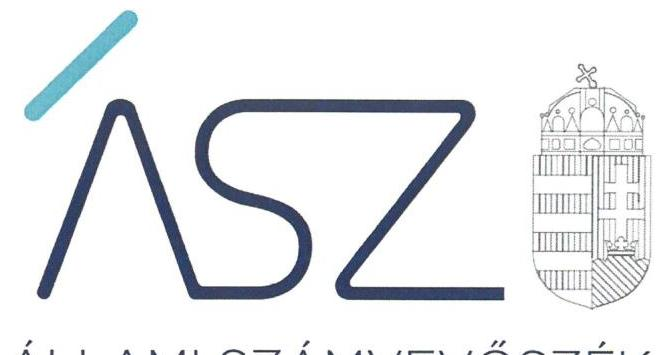

ÁLLAMI SZÁMVEVŐSZÉK

# JELENTÉS 

A központi költségvetési szervek ellenőrzése Vagyongazdálkodás

Budapesti Operettszínház
2021.

21033
www.asz.hu

---

ÁLLAMI SZÁMVEVŐSZÉK

# JELENTÉS 

## A központi költségvetési szervek ellenőrzése Vagyongazdálkodás

Budapesti Operettszínház
2021. 04. hó 21. nap

21033
www.asz.hu

---

# AZ ELLENŐRZÉST FELÜGYELTE: 

DR. NAGY IMRE felügyeleti vezető

## AZ ELLENŐRZÉST VEZETTE ÉS A VÉGREHAJTÁSÁÉRT FELELŐS:

## SIPOSNÉ DÓCZI KLÁRA ellenőrzésvezető

JANIK JÓZSEF ellenőrzésvezető

## A PROGRAM ÖSSZEÁLLÍTÁSÁÉRT FELELŐS:

GÖRGÉNYI GÁBOR osztályvezető

IKTATÓSZÁM: EL-3154-001/2021
TÉMASZÁM: 2549
ELLENŐRZÉS-AZONOSÍTÓ SZÁM: V089310

---

# TARTALOMJEGYZÉK 

- ÖSSZEGZÉS ..... 5
- AZ ELLENŐRZÉS CÉLJA ..... 6
- AZ ELLENŐRZÉS TERÜLETE ..... 7
- AZ ELLENŐRZÉS HÁTTERE, INDOKOLTSÁGA ..... 8
- A JELENTÉS LÉNYEGES KÉRDÉSKÖREI. ..... 9
- AZ ELLENŐRZÉS HATÓKÖRE ÉS MÓDSZEREI. ..... 10
- MEGÁLLAPÍTÁSOK ..... 12
- JAVASLATOK ..... 15
- MELLÉKLETEK. ..... 17
I. sz. melléklet: Értelmező szótár ..... 17
- FÜGGELÉK: ÉSZREVÉTELEK ..... 19
- RÖVIDÍTÉSEK JEGYZÉKE ..... 21

---

.

---

# ÖSSZEGZÉS 

A Budapesti Operettszínház a nemzeti vagyon értékének megőrzését, a vagyon védelmét és a vagyonnal való elszámoltathatóságot nem biztositotta.

## Az ellenőrzés társadalmi indokoltsága

Az államháztartás központi alrendszerébe tartozó szervezet ek alapvető rendeltetése a társadalom javát szolgáló közfeladatok ellátásának hatékony, számon kérhető, pazarlásmentes biztosítása. A közpénzek felhasználásában meghatározó arányt képviselő központi költségvetési szervek gazdálkodásuk révén jelentős hatást gyakorolhatnak a költségvetés egyensúlyának fenntartására, a közpénzek felelős, takarékos felhasználására, a nemzeti vagyon értékének megóvására, gyarapítására, társadalmi érdeknek megfelelő hasznosítására.

A szabályszerű, korrupciómentes, átlátható müködés és az elszámoltatható közpénzfelhasználás nélkülözhetetlen feltétele a közfeladat ellátását szolgáló vagyonelemek valósághű számbavétele, értékelése, nyilvántartásának valódisága, ami megalapozza a vagyon éves költségvetési beszámolókban történő megbízható bemutatását is.

Indokolt ezért, hogy az Állami Számvevőszék a központi költségvetési szervek vagyongazdálkodását rendszeresen ellenőrizze, értékelve, hogy vagyongazdálkodásuk elszámoltatható volt-e és hozzájárult-e a kiegyensúlyozott, átlátható és fenntartható költségvetési gazdálkodás Alaptörvényben meghatározott elvének érvényesítéséhez. Az ellenőrzések megállapításai rávilágíthatnak az egyes szervezetek vagyongazdálkodásában beazonosított konkrét hiányosságokra csakúgy, mint a központi alrendszerben vagy annak egyes ágazataiban esetlegesen felmerülő pénzügyi, szabályozási feszültségekre.

## Főbb megállapítások, következtetések, javaslatok

A Budapesti Operettszínház vagyonának valósághű számbavétele, a valós helyzetet tükröző beszámolás szabályszerű, a mérleg adatait teljes körűen alátámasztó leltárak hiányában, ezen túlmenően 2019-ben a beszámoló adatainak részletező nyilvántartással való alátámasztottsága hiányában nem valósult meg. Emiatt az intézmény a kezelésében álló vagyonnal nem számolt el, nem biztosította a nemzeti vagyon védelmét, átlátható kimutatását.

Nem vezették azokat a jogszabályban előírt nyilvántartásokat, amelyek alapján a gazdálkodási jogkörrel rendelkezők személye, aláírása egyértelműen, napra készen beazonosítható lett volna. Így nem volt biztosított a Budapesti Operettszínház vagyonának kezelésével, megóvásával kapcsolatos gazdasági folyamatokban az átláthatóság, számon kérhetőség, elszámoltathatóság követelményének érvényesülése, a vagyonváltozást eredményező döntések, a vagyonban bekövetkezett változások szabályszerű végrehajtása, elszámolása.

A Budapesti Operettszínház belső szabályozási környezete nem biztosította a vagyon védelméhez, szabályszerű számbavételéhez szükséges feltételeket. A jogszabályban előírt számviteli szabályozásokat kialakították, azonban a számlarend nem tartalmazta a részletező nyilvántartások vezetésére irányadó szabályozásokat, valamint nem állt összhangban a hatályos jogszabályi rendelkezésekkel, ezért hiányzott az átlátható és elszámoltatható vagyongazdálkodás előfeltételét jelentő szabályszerű nyilvántartás kereteinek kialakítása.

Az Állami Számvevőszék az ellenőrzés során feltárt szabálytalanságok kijavítása céljából, a szabályszerű müködés helyreállítása érdekében a Budapesti Operettszínház főigazgatója részére három javaslatot fogalmazott meg.

---

# AZ ELLENŐRZÉS CÉLJA

**AZ ELLENŐRZÉS CÉLJA** annak megállapítása volt, hogy a központi költségvetési szerv a jó gazda gondosságával biztosította-e a nemzeti vagyon értékének megőrzését, védelmét és szabályszerű kezelését. Az államháztartás központi alrendszerébe tartozó szervezet vagyongazdálkodása elszámoltatható volt-e és megfelelte annak az Alaptörvényben meghatározott alapvetésnek, hogy Magyarország a kiegyensúlyozott, átlátható és fenntartható költségvetési gazdálkodás elvét érvényesíti.

---

# **AZ ELLENŐRZÉS TERÜLETE**

## **Budapesti Operettszínház**

A Budapesti Operettszínház az Emberi Erőforrások Minisztériuma irányítása és fenntartása alá tartozó központi költségvetési szerv. Közfeladata előadó-művészeti tevékenység folytatása (szakágazat: előadó-művészet; kormányzati funkció szerint: színházi tevékenység), amelyet alaptevékenységként végez.

Tevékenységének súlypontját az egyetemes operett- és musical alkotások korszerű művészeti színvonalon való bemutatása képezte, fokozott figyelemmel a magyar operett nemzetközi hírnevének ápolására és a magyar szerzők műveire. Ezt elsősorban saját társulatával, teljes munkaidőben foglalkoztatott zenekarával, énekkarral, balettkarral, musical együttessel, valamit a társulathoz szerződött színművészekkel, karmesterekkel és művészi tervezőkkel látta el. Alaptevékenysége mellett vállalkozói tevékenységet is végzett, ami nem műsorrend szerinti, nem rendszeres játszóhelyeken szervezett előadások megtartását jelentette.

A Budapesti Operettszínház élén a főigazgató áll, akivel az emberi erőforrások minisztere létesít munkavállalói jogviszonyt és gyakorolja felette a munkáltatói jogokat. A főigazgató személyében 2019. február 1-i hatálylyal történt változás az ellenőrzött időszakban.

A Budapesti Operettszínház a gazdálkodásával összefüggő feladatokat saját gazdasági szervezettel látta el.

Az intézmény bevételei állami támogatásból és saját bevételi forrásokból álltak. Saját forrás alapvetően a jegybevételből, szolgáltatási díj bevételéből, valamint a vállalkozói tevékenységből származó bevételből tevődtek össze. 2019-es beszámolója szerint a teljesített kiadások éves összege 5,87 Mrd Ft volt, és összesen 4,26 Mrd Ft központi, irányító szervi támogatásban részesült, saját vagyona az év végén 1,16 Mrd Ft-ot tett ki.

---

# AZ ELLENŐRZÉS HÁTTERE, INDOKOLTSÁGA 

Az államháztartás központi alrendszerébe tartozó szervezet vagyona a nemzeti vagyon része, az azzal való gazdálkodás a közérdek szolgálata érdekében történik. Az ÁSZ ${ }^{1}$ ellenőrzi az éves költségvetési törvény végrehajtását, majd az ellenőrzés során feltárt és a terület folyamatos kockázatelemzésével beazonosított kockázatok kezelése érdekében ráépülő ellenőrzésekkel ellenőrzi a költségvetési szervek gazdálkodását, múködését. Az ellenőrzések megállapításaival támogatja az ellenőrzött szervezetek szabályszerű gazdálkodását, javaslataival elősegíti az Alaptörvényben megfogalmazott alapvetések érvényesülését a mindennapi életben a szervezetek szintjén.

A központi költségvetés rendszerében zajló folyamatok holisztikus elemzéseivel, a kockázatok folyamatos figyelemmel kísérésének módszerével, az így kiválasztott szervezetek célzott, hatékony ellenőrzéseivel az ÁSZ betölti a legfőbb gazdasági ellenőrző szerv küldetését. Az egyes ellenőrzések megállapításaival és egyes időszakok ellenőrzési eredményeinek elemzésével az ÁSZ ráirányíthatja a jogalkotók figyelmét a központi alrendszerben vagy annak adott ágazatában esetlegesen felmerülő vagyongazdálkodási, szabályozási feszültségekre.

---

# A JELENTÉS LÉNYEGES KÉRDÉSKÖREI 

1.     - Biztosított volt-e a vagyongazdálkodás szabályozottsága?
2.     - A központi költségvetési szerv vagyonnal való gazdálkodása során biztosította-e a nemzeti vagyon védelmét, szabályszerűen végezték-e a nemzeti vagyon nyilvántartását és kimutatását?
3. A központi költségvetési szervnél kialakították-e a teljesítmény mérésére alkalmas követelményeket?

---

# AZ ELLENŐRZÉS HATÓKÖRE ÉS MÓDSZEREI 

## Az ellenőrzés típusa

| Megfelelőségi ellenőrzés.

## Az ellenőrzött időszak

A 2017-2019. évek.

## Az ellenőrzés tárgya

A központi költségvetési szerv vagyongazdálkodási feltételeinek kialakítása, annak szabályszerűsége, az elszámoltathatóság biztosítása a szabályozás szintjén. Az intézménynél hozott, vagyonváltozást eredményező döntések, a vagyonban bekövetkezett változások végrehajtásának, elszámolásának szabályszerűsége. Az intézmény könyveiben, mérlegében kimutatott nemzeti vagyon nyilvántartásának szabályszerűsége, a vagyon kimutatása, értékelése és a mérleg leltárral való alátámasztásának szabályszerűsége.

## Az ellenőrzött szervezet

Budapesti Operettszínház

## Az ellenőrzés jogalapja

Az ellenőrzés jogszabályi alapját az ÁSZ tv. ${ }^{2} 1$. § (3) bekezdés, 5. § (2), (3) és (6) bekezdései, valamint az Áht. ${ }^{3} 61 . \S$ (2) bekezdésének előírásai képezték.

## Az ellenőrzés módszerei

Az ÁSZ az ellenőrzést az ellenőrzési program szempontjai, az ellenőrzött időszakban hatályos jogszabályok, az ellenőrzés szakmai szabályai, a jelen ellenőrzésre irányadó ÁSZ módszertanok figyelembevételével hajtotta végre. Az ellenőrzési kérdések megválaszolásához szükséges bizonyítékok megszerzése az ellenőrzött szervezet által rendelkezésre bocsátott dokumentumokra és adatokra alapozva, továbbá megfigyelés, szemle (szemrevételezés), kérdésfeltevés (információkérés), érték alapján szűkített, lényeges sokaságon végrehajtott mintavétel, valamint elemző eljárás útján történt. Az ellenőrzési bizonyítékként felhasználható adatforrások közé

---

tartoztak az ellenőrzési program részletes szempontjainál felsorolt adatforrások, valamint minden egyéb - az ellenőrzés folyamán feltárt, az ellenőrzés szempontjából információt tartalmazó-dokumentum. Az ellenőrzés lefolytatásához az ellenőrzött szervezet tanúsítványok kitöltésével, valamint az ÁSZ által kért dokumentumok megküldésével szolgáltatott adatokat, amelyekről az ellenőrzött szervezet vezetője teljességi és hitelességi nyilatkozatot állított ki. A rendelkezésre bocsátott dokumentumok, adatok és információk kontrollja az ellenőrzés keretében történt.

A 2019. évi vagyonnövekedések és vagyoncsökkenések elszámolásának szabályszerűségét, a nemzeti vagyon nyilvántartásának és év végi értékelésének szabályszerűségét lényeges sokaságból véletlen mintavételi eljárással kiválasztott tételek alapján ellenőrzi az ÁSZ. A mintavételi sokaságok esetében a mintavétel azokra a legnagyobb értékű tételekre - a lényeges sokaságra - terjednek ki, melyek összértéke eléri a teljes sokaság összértékének 50\%-át. Amennyiben valamely lényeges sokaság elemszáma kisebb, mint az előírt mintaelemszám, a lényeges sokaság tételesen kerül ellenőrzésre. A mintavétellel ellenőrzött területek esetében minden egyes tétel vonatkozásában a szabályszerűségre vonatkozó kérdéseket tesz fel az ÁSZ, amelyek eredménye összesítésre kerül. „Szabályszerűnek" értékel egy ellenőrzött területet, amennyiben 95\%-os bizonyossággal a lényeges sokaságban az átlagos hibaarány legfeljebb 10\%, „nem szabályszerűnek", amennyiben 10\%-nál magasabb arányt képvisel. Abban az esetben, ha a lényeges sokaság tekintetében a 10\%-os hibaarányhoz való viszony megítélésének megbízhatósága nem éri el a 95\%-ot, annak elérése érdekében az értékelés további szempontokkal egészül ki, figyelembe véve a feltárt hibák értékét.

Az ellenőrzés ideje alatt az ellenőrzött szervezettel a kapcsolattartás biztosítása az ÁSZ SZMSZ ${ }^{6}$ vonatkozó előírásai alapján történt.

---

# 1. Biztosított volt-e a vagyongazdálkodás szabályozottsága? 

## Összegző megállapítás

### 1.1. számú megállapítás

A Budapesti Operettszínház vagyongazdálkodásának szabályozottsága nem volt biztosított.

A Budapesti Operettszínháznál a vagyongazdálkodásra vonatkozó szabályozás kialakítása nem volt szabályszerű.

A Budapesti Operettszínház a Számv. tv. ${ }^{5}$ és az Áhsz. ${ }^{6}$ előírásaival összhangban rendelkezett számviteli politikával és az ahhoz kapcsolódó belső szabályzatokkal, így leltározási és leltárkészítési szabályzattal, valamint az eszközök és források értékelési szabályzatával.

A számlarend nem tartalmazta a Számv. tv. 161. § (2) bekezdés d) pontjában előírt bizonylati rendet, továbbá a Számv. tv. 161. § (2) bekezdés a) pontjában és az Áhsz. 51. § (2) bekezdésében foglaltak ellenére minden alkalmazásra kijelölt számla számjelét és megnevezését. A Számv. tv. 161. § (4) bekezdésében foglaltak ellenére a számlarend folyamatos karbantartásáról nem gondoskodtak, a jogszabályi előírások változásait 2016-tól kezdődően nem vezették át. Emiatt az Áhsz. 51. § (1) bekezdésében foglaltak ellenére a számlarendben alkalmazott számlaszámok és a számlák tartalmi meghatározásai eltértek az Áhsz. 16. számú mellékletében rögzített, kötelezően alkalmazandó egységes számlakerettől. Továbbá a számlarend nem tartalmazta a részletező nyilvántartások vezetésének módját, a részletező nyilvántartások kapcsolódó könyvviteli és nyilvántartási számlákkal való egyeztetésének dokumentálásával kapcsolatos szabályokat, valamint az összesítő bizonylatok tartalmi és formai követelményeit, mindezzel megsértve az Áhsz. 51. § (3) bekezdésének előírásait.

## 1.2. számú megállapítás

A vagyongazdálkodáshoz kapcsolódó jogkörgyakorlás szabályozása szabályszerű volt.

A Budapesti Operettszínház az Áht. ${ }^{7}$ előírásaival összhangban rendelkezett a gazdálkodás részletes rendjét meghatározó szabályzatokkal.

A gazdasági szervezet feladatait, a gazdálkodással összefüggő feladat és hatásköröket, a gazdasági folyamatok lebonyolításának módját, a költségvetés tervezésével és végrehajtásával, valamint a beszámolással kapcsolatos előírásokat meghatározták. Rögzítették a kötelezettségvállalás, teljesítés igazolásgyakorlásának módjával, eljárási és dokumentációs részletszabályaival, valamint az ezeket végző személyek kijelölésének rendjével kapcsolatos belső előírásokat, feltételeket is.

---

# 2. A központi költségvetési szerv vagyonnal való gazdálkodása során biztosította-e a nemzeti vagyon védelmét, szabályszerűen végezték-e a nemzeti vagyon nyilvántartását és kimutatását? 

Összegző megállapítás

A Budapesti Operettszínház a vagyonnal való gazdálkodása során a nemzeti vagyon védelmét, szabályszerű nyilvántartását és kimutatását nem biztosította.
2.1. számú megállapítás

A vagyongazdálkodás során nem volt biztosított a gazdálkodási jogkörök szabályszerű gyakorlása.

A gazdálkodási jogkörök gyakorlására, így különösen a kötelezettségvállalásra, teljesítés igazolásra jogosult személyekről és aláírásuk mintájáról az Ávr. ${ }^{8}$ 60. § (3) bekezdésében rögzített követelmények szerint szükséges naprakész nyilvántartást a Budapesti Operettszínháznál nem vezették. 2017-2018. években nyilvántartással egyáltalán nem rendelkeztek. A gazdálkodási jogkörök változása, visszavonása 2019-ben sem volt nyomon követhető, az aláírás mintákról készített nyilvántartás dátumot és a gazdálkodási jogkörök megnevezését nem tartalmazta, a személyi változásokat nem vezették át, emiatt a jogszabályi követelmény szerinti naprakészség nem volt biztosított.
2.2. számú megállapítás

A nemzeti vagyont nem szabályszerűen, nem a valóságnak megfelelő módon tartották nyilván és mutatták ki.

A Budapesti Operettszínház a 2017-2018. évekre vonatkozóan nem készített az Áhsz. 5. § (1) bekezdésében és 22. § (1) bekezdésében, valamint a Számv. tv. 69. § (1) bekezdésében előírtak szerinti leltárt, amely tételesen és ellenőrizhető módon tartalmazta volna a mérlegben szereplő eszközöket és forrásokat mennyiségben és értékben. A 2017. évi beszámolóban a kimutatott források egyáltalán nem voltak leltárral alátámasztva, az eszközök 1 787,6 M Ft-ot kitevő értékének mintegy 43\%-a volt leltárral alátámasztott. Az eszközök 2018. évi beszámolóban kimutatott, 1 982,7 M Ft értékéhez képest a leltárak összesen 83,3 M Ft-tal alacsonyabb értéket tartalmaztak.

A 2019. évben az Áhsz. 5. § (1) bekezdésében, 39. § (3) bekezdésében és 45. § (3) bekezdésében foglaltak ellenére nem gondoskodtak a beszámoló adatainak a könyvviteli számlákhoz kapcsolódó részletező nyilvántartásokkal történő alátámasztásáról. A vagyonnövekedésre vonatkozó nyilvántartás adatai eltértek a beszámolóban feltüntetett értéktől, a vagyoncsökkenés tekintetében pedig a könyvviteli számlákon kimutatott érték nem egyezett a beszámoló és a részletező nyilvántartás adataival. A részletező nyilvántartások hiánya miatt az adatok összevethetősége, a leltár megbízhatósága 2019-ben sem volt biztosított.

---

# 3. A központi költségvetési szervnél kialakították-e a teljesítmény mérésére alkalmas követelményeket? 

## Összegző megállapítás

A Budapesti Operettszínház főigazgatója nem alakított ki a teljesítmény mérésére alkalmas követelményeket.

A Budapesti Operettszínháznál nem alakítottak ki a szervezeti célok elérését szolgáló feladatok, folyamatok, tevékenységek mérését szolgáló indikátorokat, mérőszámokat, feladat- és teljesítménymutatókat, amelyek alkalmasak a szervezeti tevékenység teljesítményének mérésére a Bkr. ${ }^{9} 2 . \S$ g), i), j) pontjaiban meghatározott eredményesség, gazdaságosság és hatékonyság követelményeinek érvényesítése érdekében. Ezzel a teljesítmény mérésének lehetőségét nem biztosították és nem teremtették meg annak előfeltételeit, hogy a Bkr. 4. § a) pontjának előírásaival összhangban biztosítsák a költségvetési szerv valamennyi tevékenységének és céljának összhangját a gazdaságosság, hatékonyság és eredményesség követelményeivel.

---

# JAVASLATOK 

Az ÁSZ tv. 33. § (1) bekezdésében foglaltak értelmében az ellenőrzött szervezet vezetője köteles a jelentésben foglalt megállapításokhoz kapcsolódó intézkedési tervet összeállítani és azt a jelentés kézhezvételétől számított 30 napon belül az ÁSZ részére megküldeni. Amennyiben az ellenőrzött szervezet vezetője nem küldi meg határidőben az intézkedési tervet, vagy továbbra sem elfogadható intézkedési tervet küld, az Állami Számvevőszék elnöke az ÁSZ tv. 33. § (3) bekezdése a) és b) pontjaiban foglaltakat érvényesítheti.

## BudapestiOperettszínház föigazgatójának

1. Intézkedjen arról, hogy a jövőben a számlarend megfeleljen a jogszabályi előirásoknak.
(1.1. sz. megállapítás 2. bekezdése alapján)
2. Intézkedjen a jövőben a kötelezettségvállalásra, teljesítés igazolásra jogosult személyekről és aláírás mintájukról az Ávr. 60. § (3) bekezdésében foglaltak szerinti naprakész nyilvántartás vezetéséről.
(2.1. sz. megállapítás 1. bekezdése alapján)
3. Gondoskodjon a jövőben a jogszabályi előírások szerinti részletező nyilvántartások vezetéséről.
(2.2. sz. megállapítás 2. bekezdése alapján)

---

.

---

# MELLÉKLETEK 

- I. SZ. MELLÉKLET: ÉRTELMEZŐ SZÓTÁR
állami vagyon
állami vagyon használója
állami vagyon hezznéője (vagyonkezelő)
gazdasági szervezet
hasznosítás
irányítószerv/felügyeleti szerv
közfeladat

Állami vagyonnak minősül:
a) az állam tulajdonában lévő dolog, valamint a dolog módjára hasznosítható természeti erő,
b) az a) pont hatálya alá nem tartozó mindazon vagyon, amely vonatkozásában törvény az állam kizárólagos tulajdonjogát nevesíti,
c) az állam tulajdonában lévő tagsági jogviszonyt megtestesítő értékpapír, illetve az államot megillető egyéb társasági részesedés,
d) az államot megillető olyan immateriális, vagyoni értékkel rendelkező jogosultság, amelyet jogszabály vagyoni értékű jogként nevesít, e) az állam tulajdonában lévő pénzügyi eszközök.
(Forrás: Vtv. ${ }^{10}$ 1. § (2) bekezdés)
Az a természetes vagy jogi személy, jogi személyiséggel nem rendelkező szervezet, aki, vagy amely törvény vagy szerződés alapján, bármely jogcímen (bérlet, haszonbérlet, használat stb.) állami vagyont birtokol, használ, szedi annak hasznait, hasznosít, ide nem értve a haszonélvezőt, a vagyonkezelőt és a tulajdonosi jogok gyakorlóját. (Forrás: Vtvr. ${ }^{11} 1 . \S$ (7) a) pont)
Az állami tulajdonában álló vagyon tekintetében - a nemzeti vagyonról szóló törvényben vagyonkezelőként meghatározott azon személy, amellyel az állami vagyon vagyonkezelésére a Magyar Nemzeti Vagyonkezelő Zrt. valamint annak jogelődje, vagy az állami vagyon tulajdonosi joggyakorlója vagyonkezelési szerződést kötött, továbbá akit törvény vagyonkezelőnek kijelölt. (Forrás: Vtvr. 1. § (7) b) pont)
A költségvetés tervezéséért, az előirányzatok módosításának, átcsoportosításának és felhasználásának végrehajtásáért, a finanszírozási, adatszolgáltatási, beszámolási és a pénzügyi, számviteli rend betartásáért, a költségvetési szerv használatában lévő vagyon használatával, védelmével összefüggő feladatok teljesítéséért felelős szervezeti egység. (Forrás: Ávr. 9. § (1) bekezdés)
A nemzeti vagyon birtoklásának, használatának, hasznok szedése jogának bármely - a tulajdonjog átruházásátnem eredményező - jogcímen történőátengedése, ide nem értve a vagyonkezelésbe adást, valamint a haszonélvezeti jog alapítását. (Forrás: Nvtv. ${ }^{12}$ 3. § (1) 4. pont) A költségvetési szerv tekintetében az Áht-ban meghatározott irányítási hatáskört gyakorló szerv. (Forrás: Áht. 1. § 9. pont)
Jogszabályban meghatározott állami vagy önkormányzati feladat, amelynek ellátása költségvetési szervek alapításával és működtetésével vagy az ellátáshoz szükséges pénzügyi fedezet részben vagy egészben közpénzből történő biztosításával valósul meg. A közfeladatot meghatározó jogszabályban rendelkezni kell a közfeladat ellátásának módjáról és egyidejűleg az annak ellátásához szükséges pénzügyi fedezet biztosításáról. Közfeladat kizárólag az ellátását biztosító pénzügyi fedezet rendelkezésre állása esetén írható elő vagy vállalható. (Forrás: Áht. 3/A. §)

---

múködtetés
nemzeti vagyon
tulajdonosi joggyakorló
vagyongazdálkodás

A nemzeti vagyon birtoklásából, használatából, hasznai szedé séből, a nemzeti vagyon fenntartásából és üzemeltetéséből álló tevékenységek együttese, amely - jogszabály vagy szerződés alapján - a nemzeti vagyon felújítására, fejlesztésére, a birtoklásának, használatának hasznai szedése jogának továbbengedésére is kiterjedhet. (Forrás: Nvtv. 3. § (1) 10. pont)
A nemzeti vagyon körébe tartoznak:
a) az állam vagy a helyi önkormányzat kizárólagos tulajdonában álló dolgok,
b) az a) pont hatálya alá nem tartozó, az állam vagy a helyi önkormányzat tulajdonában lévő dolgok,
c) az állam vagy a helyi önkormányzat tulajdonában lévő pénzügyi eszközök, továbbá az államot vagy a helyi önkormányzatot megillető társasági részesedések,
d) az államot vagy a helyi önkormányzatot megillető bármely vagyoni értékkel rendelkező jogosultság, amelyet jogszabály vagyoni értékű jogként nevesít,
e) a Magyarország határa által körbezárt terület feletti légtér,
f) az üvegházhatású gázok kibocsátási egységeinek kereskedelméről szóló törvény szerinti kibocsátási egység és légiközlekedési kibocsátási egység, valamint az ENSZ Éghajlatváltozási Keretegyezménye és annak Kiotói Jegyzőkönyve végrehajtási keretrendszeréről szóló törvény szerinti kiotói egység,
g) az állami vagy helyi önkormányzati fenntartású közgyűjtemény (muzeális intézmény, levéltár, közgyűjteményként működő kép- és hangarchívum, valamint könyvtár) saját gyűjteményében nyilvántartott kulturális javak körébe tartozó dolog, kivéve, ha az állami vagy önkormányzati tulajdon jogszerű létrejötte kétséget kizáró módon nem bizonyítható és a dologra nézve más a tulajdonjogát bizonyítja vagy a kulturális javakra vonatkozó jogszabályokban meghatározott eljárás keretében valószínűsíti,
h) a régészeti lelet,
i) a nemzeti adatvagyon körébe tartozó állami nyilvántartások fokozottabb védelméről szóló törvény szerinti nemzeti adatvagyon
(Forrás: Nvtv. 1. § (2) bekezdés)
A nemzeti vagyon felett az államot vagy a helyi önkormányzatot megillető tulajdonosi jogok és kötelezettségek összességének gyakorlására jogosult személy. (Forrás: Nvtv. 3. § (1) 17. pont)
A nemzeti vagyon rendeltetésének megfelelő, az állam, az önkormányzat mindenkori teherbíró képességéhez igazodó, elsődlegesen a közfeladatok ellátásához és a mindenkori társadalmi szükségletek kielégítéséhez szükséges, egységes elveken alapuló, átlátható, hatékony és költségtakarékos működtetése, értékének megőrzése, állagának védelme, értéknövelő használata, hasznosítása, gyarapítása, továbbá az állam vagy a helyi önkormányzat feladatának ellátása szempontjából feleslegessé váló vagyontárgyak elidegenítése. (Forrás: Nvtv. 7. § (2) bekezdés)

---

# FÜGGELÉK: ÉSZREVÉTELEK 

A jelentéstervezetet a Számvevőszék 15 napos észrevételezésre megküldte az ellenőrzött szervezet vezetőjének az ÁSZ tv. 29. §* (1) bekezdése előírásának megfelelően.

A Budapesti Operettszínház föigazgatója a jelentéstervezetre az ÁSZ tv. 29. § (2) bekezdésében foglalt határidőn belül nemleges észrevételt tett.

[^0]
[^0]:    * 29. § (1) Az Állami Számvevőszék az ellenőrzési megállapításait megküldi az ellenőrzött szervezet vezetőjének vagy az általa megbízott személynek, és annak, akinek személyes felelősségét állapította meg.
    (2) Az ellenőrzött szervezet vezetője és a felelősként megjelölt személy az ellenőrzés megállapításaira tizenöt napon belül írásban észrevételt tehet.
    (3) Az Állami Számvevőszék az észrevételre a beérkezésétől számított harminc napon belül írásban válaszol. A figyelembe nem vett észrevételeket köteles a jelentésben feltüntetni, és megindokolni, hogy azokat miért nem fogadta el.

---

.

---

# RÖVIDÍTÉSEK JEGYZÉKE 

${ }^{1}$ ÁSZ
${ }^{2}$ ÁSZ.tv.
${ }^{3}$ Áht.
${ }^{4}$ ÁSZ-SZMSZ
${ }^{5}$ Számv.tv.
${ }^{6}$ Áhsz.
${ }^{7}$ Áht.
${ }^{8}$ Ávr.
${ }^{9}$ Bkr.
${ }^{10}$ Vtv.
${ }^{11}$ Vtvr.
${ }^{12}$ Nvtv.

Állami Számvevőszék
az Állami Számvevőszékről szóló 2011. évi LXVI. törvény
az államháztartásról szóló 2011. évi CXCV. törvény
Állami Számvevőszék Szervezeti és Müködési Szabályzata
a számvitelről szóló 2000. évi C. törvény
az államháztartás számviteléről szóló 4/2013. (I. 11.) Korm. rendelet
az államháztartásról szóló 2011. évi CXCV. törvény
az államháztartásról szóló törvény végrehajtásáról szóló 368/2011. (XII. 31.) Korm. rendelet
a költségvetési szervek belső kontrollrendszeréről és belső ellenőrzéséről szóló 370/2011.
(XII. 31.) Korm. rendelet
az állami vagyonról szóló 2007. évi CVI. törvény
az állami vagyonnalvaló gazdálkodásról szóló 254/2007. (X. 4.) Korm. rendelet
a nemzeti vagyonról szóló 2011. évi CXCVI. törvény

---

# ASZ 

1052 Budapest, Apáczai Cs. J. u. 10. | 1364 Budapest 4. Pf. 54 TEL: +36 14849100
email: szamvevoszek@asz.hu
web: www.asz.hu | www.aszhirportal.hu