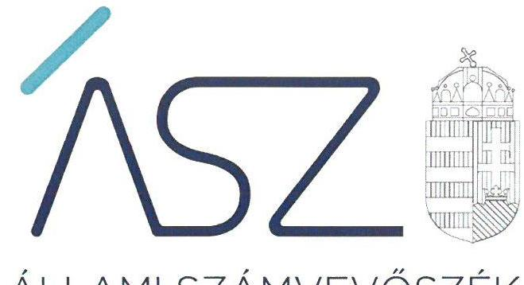
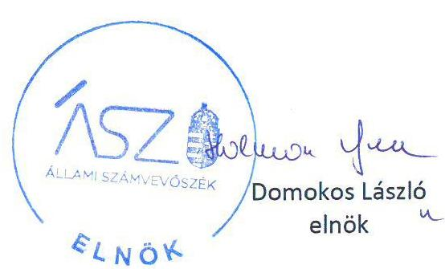
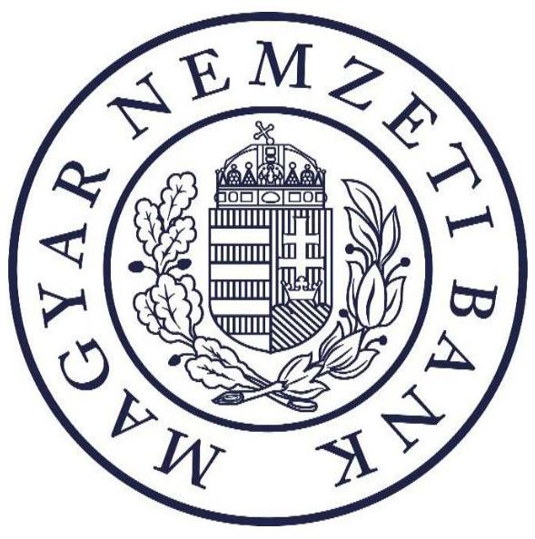

ÁLLAMI SZÁMVEVŐSZÉK

# JELENTÉS 

A Magyar Nemzeti Bank működése szabályszerűségének ellenőrzése

2021. 

21034
www.asz.hu

---

ÁLLAMI SZÁMVEVŐSZÉK

# JELENTÉS 

A Magyar Nemzeti Bank működése szabályszerűségének ellenőrzése
2021. 

21034
www.asz.hu

---

|  | AZ ELLENŐRZÉST FELÜGYELTE: |
| :--: | :--: |
|  | MAKKAI MÁRIA felügyeleti vezetö |
|  | AZ ELLENŐRZÉST VEZETTE ÉS A VÉGREHAJTÁSÁÉRT FELELŐS: |
|  | DORMÁN ISTVÁN ZOLTÁN ellenőrzésvezető |
|  | A PROGRAM ÖSSZEÁLLÍTÁSÁÉRT FELELŐS: |
|  | GÖRGÉNYI GÁBOR ellenőrzési program készítéséért felelős vezető |
|  | A TÉMÁHOZKAPCSOLÓDÓ KORÁBBISZÁMVEVŐSZÉKI JELENTÉSEK: |
| - címe: | Jelentés - A Magyar Nemzeti Bank müködése szabályszerűségének ellenőrzése |
| - sorszáma: | 19049 |
| - címe: | Jelentés - A Magyar Nemzeti Bank müködése szabályszerűségének ellenőrzése |
| - sorszáma: | 18179 |
| IKTATÓSZÁM: EL-3158-001/2021 |  |
| TÉMASZÁM: 2540 |  |
| ELLENŐRZÉS-AZONOSÍTÓ SZÁM: V0884 |  |

---

# TARTALOMJEGYZÉK 

- ÖSSZEGZÉS ..... 5
- AZ ELLENŐRZÉS CÉLJA ..... 6
- AZ ELLENŐRZÉS TERÜLETE ..... 7
- AZ ELLENŐRZÉS HÁTTERE, INDOKOLTSÁGA ..... 8
- A JELENTÉS LÉNYEGES KÉRDÉSKÖREI. ..... 9
- AZ ELLENŐRZÉS HATÓKÖRE ÉS MÓDSZEREI. ..... 10
- MEGÁLLAPÍTÁSOK ..... 12
- MELLÉKLETEK. ..... 17
I. sz. melléklet: Értelmező szótár ..... 17
II. sz. melléklet: Az MNB vagyonának alakulása a 2018-2019. években (M R). ..... 18
III. sz. melléklet: Az Állami Számvevőszék 18179. számú jelentéséhez kapcsolódó intézkedésiterv végrehajtása (Javaslatok alapján) ..... 19
- FÜGGELÉK: ÉSZREVÉTELEK ..... 21
- RÖVIDÍTÉSEK JEGYZÉKE ..... 23

---

.

---

# ÖSSZEGZÉS 

A Magyar Nemzeti Bank irányítási, döntéshozatali és ellenőrzési rendszere szabályszerű müködését biztosították. A gazdálkodás keretei megfeleltek a jogszabályi előírásoknak. A pénzügyi közvetítőrendszert felügyelő, ellenőrző és szabályozó tevékenysége kereteinek kialakítása támogatta a pénzügyi közvetítőrendszer szabályszerű müködését, a fogyasztói érdekek védelmét. A Magyar Nemzeti Bank intézkedési tervében foglalt feladatok végrehajtása elősegítette a pénzügyi közvetítőrendszer biztonságos müködését.

## Az ellenőrzés társadalmi indokoltsága

Az egyszemélyes részvénytársasági formában múködő Magyar Nemzeti Bank Magyarország központi bankja, az Alaptörvény rendelkezése szerint felelős a monetáris politikáért és 2013. október 1-jétől ellátja a pénzügyi közvetítő rendszer felügyeletét, ezért tevékenysége, gazdálkodása a közérdeklődés középpontjában áll. A részvényesi jogokat az államháztartásért felelős miniszter gyakorolja.

Az Állami Számvevőszék törvényi kötelezettsége a Magyar Nemzeti Bank gazdálkodásának és a Magyar Nemzeti Bankról szóló 2013. évi CXXXIX. törvényben foglaltak alapján folytatott, az alapvető feladatai közé nem tartozó tevékenységének ellenőrzése. Ezen ellenőrzési kötelezettségének teljesítésével ÁSZ ${ }^{1}$ támogatja az Országgyűlés munkáját, tájékoztatja az érdekelteket és a szélesebb közvéleményt a Magyar Nemzeti Bank müködésének és gazdálkodásának szabályszerűségéről, alapvető feladatai közé nem sorolt feladatainak ellátásáról, a közpénzekkel való felelős gazdálkodásról. Az ellenőrzés hozzájárul az Állami Számvevőszék Stratégiájában megfogalmazott küldetése megvalósításához, a közpénzügyek átláthatóságának, rendezettségének előmozdításához.

## Főbb megállapítások, következtetések

A Magyar Nemzeti Bank irányítási, döntéshozatali és ellenőrzési rendszerének müködése szabályozott és szabályszerű volt. Szervezeti felépítése összhangban volt a jogszabályi előírásokkal. A Felügyelőbizottság és a belső ellenőrzés szabályszerűen látta el tevékenységét. A Magyar Nemzeti Bank a többségi tulajdonában álló Pénzjegynyomda Zrt. feletti tulajdonosi joggyakorlása során szabályszerűen járt el.

A Magyar Nemzeti Bank gazdálkodásának kereteit 2018-2019. években a jogszabályi előírásoknak megfelelően alakította ki. A pénzügyi évek kezdete előtt a Magyar Nemzeti Bank a jogszabályi előírások szerint készítette el éves tervét, amelyben a működési költségeket és a beruházásokat az alapvető és egyéb feladatai vonatkozásában elkülönítetten, részletes formában mutatta ki. A Magyar Nemzeti Bank a jogszabályi előírások szerinti tartalommal és gyakorisággal teljesítette a tevékenységével kapcsolatos beszámolási és tájékoztatási kötelezettségét. Ezáltal a Magyar Nemzeti Bank alapfeladatai közé nem tartozó tevékenységei és gazdálkodása tekintetében az átláthatóságot biztosította.

A Magyar Nemzeti Bank a pénzügyi közvetítőrendszer felügyeletével kapcsolatos feladatok ellátásának szervezeti kereteit a jogszabályokkal összhangban alakította ki, a pénzügyi közvetítőrendszer felügyeletével kapcsolatban biztosította a kapcsolódó szabályozási háttér kialakítását. A Pénzügyi Békéltető Testület szervezeti keretei és müködése a jogszabályi előírásoknak megfeleltek. A pénzügyi közvetítőrendszer felügyeletéhez kapcsolódó eljárások elősegítették a pénzügyi rendszer szereplőinek szabálykövető magatartását.

A Magyar Nemzeti Bank a 18179. sorszámú számvevőszéki jelentésben foglalt megállapításokkal összhangban készített intézkedési tervében foglaltakat az előírt határidőben végrehajtotta, amellyel hozzájárult a pénzügyi közvetítőrendszer stabilitásának megőrzéséhez.

---

# AZ ELLENŐRZÉS CÉLJA 

zott feladatokat az MNB végrehajtotta-e.

AZ ELLENŐRZÉS CÉLJA a Magyar Nemzeti Bank alapfeladatai közé nem tartozó tevékenységei és gazdálkodása tekintetében annak értékelése volt, hogy az MNB ${ }^{2}$ irányítási, döntéshozatali és ellenőrzési rendszere működését biztosították-e; az MNB gazdálkodásának keretei megfeleltek-e a jogszabályi előírásoknak, a pénzügyi közvetítőrendszert felügyelő, ellenőrző és szabályozó tevékenységének szervezeti kereteit kialakították-e. Az utóellenőrzés célja annak értékelése volt, hogy a 18179. sorszámú számvevőszéki jelentésben foglalt megállapításokkal összhangban készített intézkedési tervben meghatározott feladatokat az MNB végrehajtotta-e.

---

# AZ ELLENŐRZÉS TERÜLETE 

## Magyar Nemzeti Bank

A MAGYAR NEMZETI BANK 1924. június 24. óta müködik. Részvénytársasági formában müködő jogi személy, részvénye a magyar állam tulajdonában van. Az államot, mint részvényest, az államháztartásért felelős miniszter képviseli.

Az Alaptörvény ${ }^{3}$ 41. cikke kimondja, hogy a Magyar Nemzeti Bank Magyarország központi bankja, sarkalatos törvényben meghatározott módon felelős a monetáris politikáért. Alapvető feladatain túl szanálási hatóságként jár el, kizárólagosan ellátja a pénzügyi közvetítőrendszer felügyeletét, valamint a Pénzügyi Békéltető Testület útján ellátja a fogyasztó és a pénzügyi közvetítőrendszer szervezetei közötti - szolgáltatás igénybevételére vonatkozó - jogviszony létrejöttével és teljesítésével kapcsolatos vitás ügyek bírósági eljáráson kívüli rendezését.

Jogállását, elsődleges célját, alapvető, valamint alapvető feladatai közé nem tartozó egyéb feladatait és szervezeti felépítését a Magyar Nemzeti Bankról szóló 2013. évi CXXXIX. törvény szabályozza. A törvényben rögzített feladatai ellátása, valamint kötelességei teljesítése során független. A Magyar Nemzeti Bank tagja a Központi Bankok Európai Rendszerének, valamint a Pénzügyi Felügyeletek Európai Rendszerének is.

A Magyar Nemzeti Bank szerveinek minősülnek az Igazgatóság ${ }^{4}$, a Monetáris Tanács, a Pénzügyi Stabilitási Tanács, a Pénzügyi Békéltető Testület és a szakmai feladatokat végrehajtó igazgatóságok.

A Magyar Nemzeti Bank Igazgatósága felelős a Magyar Nemzeti Bankról szóló 2013. évi CXXXIX. törvényben meghatározott feladatkörök tekintetében egyrészt a Monetáris Tanács, másrészt a Pénzügyi Stabilitási Tanács döntéseinek végrehajtásáért, továbbá a Magyar Nemzeti Bank müködésének irányításáért. Az Igazgatóság tagjai a Magyar Nemzeti Bank elnöke, mint az Igazgatóság elnöke, és a Magyar Nemzeti Bank alelnökei.

A Magyar Nemzeti Bank elnökét a miniszterelnök javaslatára a köztársasági elnök nevezte ki 2013. március 4-i hatállyal hat éves időtartamra. Az elnök munkáját az ellenőrzött időszakban három alelnök segítette.

A Magyar Nemzeti Bank elnöke a szervezet tevékenységéről féléves rendszerességgel beszámol az Országgyűlés gazdasági ügyekért felelős állandó bizottságának.

A könyvviteli mérlegek adatai alapján a Magyar Nemzeti Bank vagyona 2017. december 31-ről 2018. december 31-re 9307752 M Ft-ról 11129442 M Ft-ra, 2019. december 31-re 12347868 M Ft-ra nőtt (II. sz. melléklet).

---

# AZ ELLENŐRZÉS HÁTTERE, INDOKOLTSÁGA 

AZ ÁLLAMI SZÁMVEVŐSZÉK ellenőrzi az MNB gazdálkodását és a Magyar Nemzeti Bankról szóló 2013. évi CXXXIX. törvényben foglaltak alapján folytatott, az alapvető feladatok körébe nem tartozó tevékenységét. Az ÁSZ rendszeresen értékeli az MNB gazdálkodása szabályszerűségét és a szabályszerű működés feltételeinek érvényesülését.

AZ MNB Magyarország központi bankja, az Alaptörvény rendelkezései szerint felelős a monetáris politikáért, ellátja a pénzügyi közvetítő rendszer felügyeletét, ezért tevékenysége, gazdálkodása a közérdeklődés középpontjában áll. Az ellenőrzés alapvető hozadéka az Országgyűlés munkájának támogatása, az érdekeltek és a szélesebb közvélemény tájékoztatása az MNB múködésének és gazdálkodásának szabályszerűségéről. Az „ellenőrök ellenőreként" az ÁSZ munkájának eredményei hatványozottan hasznosulhatnak, hiszen megállapításai az ellenőrzők tevékenységének szabályszerűbbé és hatékonyabbá tételében érvényesülhetnek. A közvélemény számára hiteles információt nyújt az MNB müködéséről és gazdálkodásáról, a közpénzekkel való felelős gazdálkodásról.

AZ ÁSZ TV. ${ }^{5}$ 33. § (1) bekezdése értelmében az ÁSZ az ellenőrzési megállapításait tartalmazó jelentését megküldi az ellenőrzött szervezet vezetőjének. Az ellenőrzött szervezet vezetője köteles a jelentésben foglalt megállapításokhoz kapcsolódó intézkedési tervet összeállítani, és azt a jelentés kézhezvételétől számított harminc napon belül az Állami Számvevőszék részére megküldeni.

## AZ ÁSZ ÁLTAL BEFOGADOTT INTÉZKEDÉSI

TERVBEN foglaltak megvalósítását - az ÁSZtv. 33. § (7) bekezdésében foglaltak alapján - az Állami Számvevőszék utóellenőrzés keretében ellenőrizheti. Az utóellenőrzés keretében - az intézkedések értékelése során az Állami Számvevőszék figyelembe veszi az ellenőrzött szervezet működési feltételeiben, valamint a jogszabályi előírásokban bekövetkezett változásokat.

AZ UTÓELLENŐRZÉS SORÁN az ÁSZ értékelte, hogy a 18179. sorszámú számvevőszéki jelentés foglalt intézkedést igénylő megállapításokkal és javaslatokkal összhangban, a Magyar Nemzeti Bank által készített intézkedési tervben meghatározott feladatokata feladatra kijelöltek határidőre végrehajtották-e.

---

# A JELENTÉS LÉNYEGES KÉRDÉSKÖREI 

1. Az MNB irányítási, döntéshozatali és ellenőrzési rendszere szabályszerű múködését biztosították-e?
2. Az MNB gazdálkodásának keretei megfeleltek-e a jogszabályi előírásoknak?
3. Az MNB pénzügyi közvetítőrendszert felügyelő, ellenőrző és szabályozó tevékenysége szabályszerű kereteit kialakították-e?
4. Az MNB az intézkedési tervben foglaltakat az előírt határidőben végrehajtotta-e?

---

# AZ ELLENŐRZÉS HATÓKÖRE ÉS MÓDSZEREI 

## Az ellenőrzés típusa

Szabályszerúségi ellenőrzés.

## Az ellenőrzött időszak

A 2018-2019. évek. Az éves számviteli beszámoló készítése, jóváhagyása, a beszámolóval kapcsolatos tájékoztatási kötelezettség teljesítése kapcsán az ellenőrzött időszak kiterjed ezen feladatok jogszabályban előírt végrehajtásának időpontjáig.

Az utóellenőrzés esetében az utóellenőrzés alapját képező 18179. sorszámú számvevőszéki jelentés közzétételének napjától az utóellenőrzésről szóló kiértesítő levél keltének napjáig tartó időszak.

## Az ellenőrzés tárgya

Az MNB gazdálkodásának és az alapvető feladatok körébe nem tartozó irányítási, döntéshozatali, ellenőrzési, és a pénzügyi közvetítőrendszert felügyelő, ellenőrző és szabályozó - tevékenységek ellenőrzése.

Az utóellenőrzés tekintetében a számvevőszéki jelentésben foglalt megállapításokkal és javaslatokkal összhangban - az MNB által - készített intézkedési tervben foglaltak végrehajtásának ellenőrzése.

## Az ellenőrzött szervezetek

Magyar Nemzeti Bank

## Az ellenőrzés jogalapja

Az ÁSZ az ÁSZ tv. 5. § (10) bekezdésében foglaltak alapján ellenőrzi az MNB gazdálkodását és az MNB tv. ${ }^{6}$-ben foglaltak alapján folytatott, az alapvető feladatok körébe nem tartozó tevékenységét. E körben az ÁSZ azt ellenőrzi, hogy az MNB a jogszabályoknak és az alapszabályának megfelelően mükö-dik-e. Az MNB tv. 4. § (1)-(7) bekezdései tartalmazzák az MNB alapvető feladatait.

Az utóellenőrzés jogszabályi alapját az ÁSZ tv. 33. § (7) bekezdésének előírása képezi.

---

# Az ellenőrzés módszerei 

Az ellenőrzést az ellenőrzési program szempontjai, az ellenőrzött időszakban hatályos jogszabályok, az ellenőrzés szakmai szabályai, a jelen ellenőrzésre irányadó ÁSZ módszertanok figyelembevételével végeztük.

Az ellenőrzés ideje alatt az ellenőrzött szervezettel történő kapcsolattartást az ÁSZ SZMSZ²-ének vonatkozó előírásai alapján biztosítottuk.

Az ellenőrzési bizonyítékként felhasználható adatforrások közé tartoztak egyrészt az ellenőrzési program részletes szempontjainál felsorolt adatforrások, másrészt minden egyéb - az ellenőrzés folyamán feltárt, az ellenőrzés szempontjából információt tartalmazó - dokumentum.

Az ellenőrzési kérdések megválaszolásához szükséges bizonyítékok megszerzése az ellenőrzött által rendelkezésre bocsátott dokumentumokra, adatokra alapozva megfigyelés, szemle (szemrevételezés), kérdésfeltevés (információkérés), valamint elemző eljárás útján történt.

Az utóellenőrzés során az intézkedési tervben előírt feladatokat azok végrehajthatósága, illetve végrehajtása szempontjából az alábbiak szerint értékelte az ÁSZ:
$\longrightarrow$ „határidőben végrehajtott" a feladat, ha a teljesítés dokumentáltan, az intézkedési tervben előírt határidőben és tartalommal megtörtént;
$\longrightarrow$ „határidőn túl végrehajtott" a feladat, ha annak teljesítése az intézkedési tervben meghatározott módon, de az abban előírt határidőn túl történt meg;
$\longrightarrow$ „nem végrehajtott" a feladat, ha a végrehajtás nem történt meg, dokumentumokkal nem igazolt annak teljesítése;
$\longrightarrow$ „okafogyottá vált" a feladat, ha végrehajtására - meghatározott esemény bekövetkezése, továbbá külső körülmény, a működést érintő feltétel változása miatt - már nincs szükség, illetve lehetőség, és egyértelműen megállapítható, hogy az intézkedést szükségessé tevő körülmény a jövőben nem fordulhat elő;
$\longrightarrow$ „nem időszerű" az a feladat, amelynek ellenőrzési időszakon belüli végrehajtására azért nem került (kerülhetett) sor, mert az intézkedés alapjául szolgáló esemény nem következett be, de annak jövőbeni előfordulása lehetséges, a végrehajtása nem volt esedékes, vagy a végrehajtás határideje még nem járt le.
Az ellenőrzés lefolytatásához az ellenőrzött szervezet a tanúsítványok elektronikus kitöltésével, valamint az ÁSZ által kért dokumentumok elektronikus megküldésével szolgáltatott adatokat, amelyek valódiságát és teljes körűségét az ellenőrzött szervezet vezetője által tett teljességi és hitelességi nyilatkozat igazolja. A rendelkezésre bocsátott adatok, információk kontrollja az ellenőrzés keretében történt.

---

# 1. Az MNB irányítási, döntéshozatali és ellenőrzési rendszere szabályszerű múködését biztosították-e? 

Összegző megállapítás

Az MNB irányítási, döntéshozatali és ellenőrzési rendszere szabályszerű múködését biztosították.

AZ MNB ALAPVETŐ FELADATOK KÖRÉBE NEM TARTOZÓ TEVÉKENYSÉGEK ELLÁTÁSÁRA VONATKOZÓ SZERVEZETI FELÉPÍTÉSE összhangban volt az MNB tv. rendelkezéseivel, a szervezeti kereteket az MNB szabályszerűen alakította ki. Az MNB szervezeti felépítéséről a 2018-2019 években az SZMSZ ${ }_{1,2}{ }^{8}$ rendelkezett.

A MONETÁRIS TANÁCS szervezeti kereteit kialakították. Az MNB tv. 9. § (3) bekezdésében foglaltaknak megfelelően az MNB-nél kilenc tagú MT9 múködött. Az MNB tv. 9. § (4) bekezdése előírásainak megfelelően az MT tagja volt az MNB elnöke és három alelnöke, valamint az Országgyűlés által hat évre megválasztott öt tag. Az MT múködésének rendjét az ellenőrzött időszakban az Ügyrend ${ }_{\text {MT }}{ }^{10}$ tartalmazta.

AZ IGAZGATÓSÁG az előírásoknak megfelelően múködött. Az Igazgatóság az MNB tv. 12. § (4) bekezdés b) pontjában foglaltak szerint döntött a hatáskörébe tartozó feladatok tekintetében a 2018. évi és a 2019. évi számviteli beszámoló elfogadásáról, az osztalékfizetésről, továbbá a megállapított számviteli beszámolóról, illetve a részvényesnek küldendő jelentésről, az üzletvezetésről és az MNB vagyoni helyzetéről.

A PÉNZÜGYI STABILITÁSI TANÁCS szervezeti kereteit kialakították. A PST ${ }^{11}$ megalkotta az Ügyrend ${ }_{\text {PST-11 }}$ jét, amelyben szabályozták a PST működésének rendjét, az MNB tv. 13. § (6) bekezdésével összhangban rendelkeztek a PST ülések tartásának rendjéről, a PST határozatképességéről.

A FELÜGYELŐBIZOTTSÁG szervezeti keretei a jogszabályi előírásoknak megfeleltek. A folyamatos tulajdonosi ellenőrzés ellátása céljából az MNB-nél a Ptk. ${ }^{12}$ 3:119. § -ában, valamint az MNB tv. 14. § (4) bekezdésében foglaltaknak megfelelően hat tagú Felügyelőbizottság múködött az ellenőrzött időszakban.

Az MNB a Ptk. 3:122. § (3) bekezdésében foglaltak alapján a Felügyelőbizottság ügyrendjét maga állapította meg, melyet a részvényest képviselő államháztartásért felelős miniszter jóváhagyott. Az Ügyrend ${ }_{18}{ }^{13} 1 . \S$ (1) bekezdésében rögzítették, hogy a Felügyelőbizottság az MNB folyamatos tulajdonosi ellenőrzésének szerve, a 2. §. (2) bekezdésében az MNB tv. 14. §

---

(1)-(3) bekezdéseivel összhangban szabályozták a Felügyelőbizottság feladatait.

A BELSŐ ELLENŐRZÉS rendszerét kiépítették. A belső ellenőrzési feladatokat az ellenőrzött időszakban az SZMSZ1-2-nek megfelelően a Belső ellenőrzési főosztály látta el. A Belső ellenőrzési főosztály az MNB tv. szerint a Felügyelőbizottság, a Felügyelőbizottság hatáskörébe nem tartozó feladatok tekintetében az Igazgatóság irányítása alatt múködött, biztosítva a szervezeti egység függetlenségét.

A belső ellenőrzés előre meghatározott ellenőrzési tervek alapján végezte munkáját, tevékenységéről a beszámolókat elkészítette.

A PÉNZÜGYI BÉKÉLTETŐ TESTÜLET szervezeti keretei és múködése a jogszabályi előírásoknak megfeleltek. Az MNB-nél az MNB tv. 96. § (1) -(3) bekezdésében foglaltaknak megfelelően elnökből és békéltető testületi tagokból álló, önálló és szakmailag független, az SZMSZ1-2- ben az MNB szervezeti rendjében közvetlenül az elnökhöz tartozó PBT14 múködött. A PBT múködését a Működési rend ${ }^{15}$-ben szabályozták.

A PBT elnöke az MNB tv. előírásainak megfelelően a PBT tevékenységéről szóló éves jelentéseket az MNB pénzügyi szervezetek felügyeletéért és fogyasztóvédelemért felelős alelnöke, illetve a fogyasztóvédelemért felelős miniszter részére megküldte.

AZ MNB PÉNZJEGYNYOMDA ZRT. FELETTI TULAJDONOSI JOGGYAKORLÁSA megfelelt az előírásoknak. A határozathozatal megfelelt a Ptk. 3:109. § (4) bekezdésében foglaltaknak.

A tulajdonosi jogokat gyakorló MNB nevében az Igazgatóság a Ptk. 3:109. (2) bekezdésében foglaltak szerint döntött a Pénzjegynyomda Zrt. éves számviteli beszámolóinak jóváhagyásáról, határozatban döntött a nyereség felosztásáról.

A Pénzjegynyomda Zrt.-nél a jogszabályban előírt felügyelőbizottságot létrehozták. A felügyelőbizottság részvényesi határozattal jóváhagyott ügyrend szerint látta el feladatait, megfelelve a Ptk. 3:122. (3) bekezdésében rögzítetteknek.

A Pénzjegynyomda Zrt. éves beszámolóinak jóváhagyásához a felügyelőbizottság írásbeli jelentése rendelkezésre állt.

# 2. Az MNB gazdálkodásának keretei megfeleltek-e a jogszabályi előírásoknak? 

Összegző megállapítás

Az MNB gazdálkodásának keretei megfeleltek a jogszabályi előírásoknak. Az MNB elnöke az előírt tájékoztatási és beszámolási kötelezettségének eleget tett.

A MAGYAR NEMZETI BANK gazdálkodásának kereteit szabályszerűen alakította ki. A Számv.tv. 6. § (1) bekezdésének, és az MNB tv.

---

12. § (4) bekezdés b, pontjának megfelelően az ellenőrzött időszakban elkészítette éves beszámolóit, amelyeket a könyvvizsgáló hitelesítő záradékkal látott el. Az MNB tv. 131. § (2) bekezdésének megfelelően az MNB elnöke féléves rendszerességgel elkészítette az éves beszámolónak megfelelő tartalmú jelentéseit. Az éves beszámolók, féléves és Éves jelentések ${ }^{16}$ megfeleltek a 221/2000. (XII. 19.) Korm. rendelet ${ }^{17}$ előírásainak.

Az MNB az ellenőrzött időszak pénzügyi éveinek kezdete előtt működési költségeire, valamint beruházásaira vonatkozóan - az MNB tv. 131. § (5) bekezdésének megfelelően - készített éves terveket, amelyeket az Igazgatóság határozataival elfogadott. Az MNB az MNB tv. 131. § (5) bekezdésének megfelelően, a pénzügyi évek lezárását követően elkészítette az öszszehasonlító elemzéseket ${ }^{18}$ a múködési költségek és beruházási kiadások tervezett és a tényleges alakulásáról, amelyeket az MNB könyvvizsgálója ellenőrzött.

AZ MNB ELNÖKE az MNB tv-ben előírt tájékoztatási és beszámolási kötelezettségének elegettett. Az összehasonlító elemzéseket a könyvvizsgáló véleményével ellátva, az éves beszámolóval egyidejúleg az MNB tv. 131. § (5) bekezdésének megfelelően megküldte az Országgyűlés gazdasági ügyekért felelős állandó bizottsága és az Állami Számvevőszék részére.

Az MNB az általa végrehajtott devizamúveletekről, valamint az aranyés devizatartalékokról az államháztartásért felelős minisztert az MNB tv. 135. § (4) bekezdése előírásai szerint, hetente tájékoztatta.

# 3. Az MNB pénzügyi közvetítőrendszert felügyelő, ellenőrző és szabályozó tevékenysége szabályszerű kereteit kialakították-e? 

## Összegző megállapítás

Az MNB pénzügyi közvetítőrendszert felügyelő, ellenőrző és szabályozó tevékenysége szabályszerű kereteit kialakították.

## A PÉNZÜGYI KÖZVETÍTŐRENDSZERT FELÜGYELŐ, ELLENŐRZŐ ÉS SZABÁLYOZÓ TEVÉ-

KENYSÉGE kialakításához az MNB rendelkezett hatályos belső utasításokkal, az alkalmazandó eljárásrendet szabályszerűen kialakította.

A felügyeleti tevékenysége keretében végzett - az MNB tv. 48. § (1) bekezdés a) pontja szerinti - engedélyezési eljárások lefolytatásával kapcsolatos belső szabályokat, eljárásrendeket rögzítették.

Az MNB elnöke Elnöki utasításokban ${ }^{19}$ meghatározta az MNBtv. rendelkezéseivel összhangban lévő, az ellenőrzési eljárásokra és a felügyeleti ellenőrzésekre vonatkozó eljárások alapvető szabályait.

Alelnöki utasításokban ${ }^{20}$ rögzítették a felügyeleti tevékenység keretében végzett - az MNB tv. 48. § (1) bekezdés b) és e) pontjában meghatározott - ellenőrzési eljárásokra, valamint a felügyeleti ellenőrzéssel összefüggő feladatokra vonatkozó részletszabályokat.

Az MNB szabályozó tevékenysége keretében az MNB elnöke - az MNB tv. 171. § (1) bekezdés j) pontja alapján - MNB rendeletben ${ }^{21}$ meghatározta, a felügyeleti díj megfizetésének, kiszámításának módjára és feltételeire vonatkozó szabályokat.

---

A pénzügyi szervezetek felügyeletéért és fogyasztóvédelemért felelős alelnök - Alelnöki utasításban ${ }^{22}$ - meghatározta és kiadta a felügyeleti biztosok kirendelésével összefüggő eljárásokra vonatkozó belső szabályokat, amelyek tartalmazták az MNB tv. 39. §-ában felsorolt jogszabályok hatálya alá tartozó intézményekhez történő felügyeleti biztos kirendelésének előkészítésére, kirendelésére, valamint az együttmúködésre és a kirendelést lezáró eljárásokra vonatkozó rendelkezéseket.

Az MNB, fogyasztóvédelmi szempontú folyamatos felügyelési rendszert alakított ki és rendelkezett a Pénzügyi közvetítőrendszer felügyeletéhez kapcsolódó fogyasztóvédelmi ellenőrzési eljárásokra vonatkozó szabályzatokkal ${ }^{23}$.

Az MNB-nél elkészítették a Piacfelügyeleti eljárásokra vonatkozó belső szabályzatokat ${ }^{24}$, ezáltal meghatározták a piacfelügyeleti bejelentések kezelésének belső eljárásrendjét és a piacfelügyeleti eljárásokra vonatkozó részletszabályokat.

# A PÉNZÜGYIKÖZVETÍTŐRENDSZER FELÜGYELETÉHEZ KAPCSOLÓDÓ ELLENŐRZÉS végrehajtásának feltételei biztosítottak voltak. Az MNB rendelkezett az MNB tv. 48. § (2a) bekezdés előírásainak megfelelő, PST által jóváhagyott éves felügyeleti ellenőrzési tervvel. 

## 4. Az MNB az intézkedési tervben foglaltakat az előírt határidőben végrehajtotta-e?

Összegző megállapítás

Az MNB az intézkedési tervben foglaltakat az előírt határidőben végrehajtotta.

## AZ INTÉZKEDÉSI TERVBEN ${ }^{25}$ ELŐÍRT HATÁRIDŐ-

BEN, a Szantv. ${ }^{26}$ 4. § (2) bekezdés b) pontja alapján az MNB meghatározta a szanálási tervek elkészítésének ütemezését, melyet a PST 2017. november 30-i ülésén a Szanálási igazgató ${ }^{27}$ előterjesztése alapján a 194/2017. (XI. 30.) PST határozattal tudomásul vett és jóváhagyott. A PST a 2018. december 13-i ülésén a 469/2018. (XII.13.) PST határozattal elfogadta a Szanálási igazgató előterjesztését a 2018. évi beszámolójáról, valamint a szanálási tervezésről és a szanálhatósági vizsgálatok 2019. évi ütemezéséről.

Az Állami Számvevőszék 18179. számú jelentéséhez kapcsolódó intézkedési terv végrehajtását a III. sz. melléklet mutatja.

---

.

---

# MELLÉKLETEK 

I. SZ. MELLÉKLET: ÉRTELMEZŐ SZÓTÁR
belső szabályozás
intézkedési terv

MNB egyéb feladatai
Az MNB tevékenységét meghatározó belső irányítási eszközök összessége (pl. szabályzatok, utasítások, irányelvek)
Az ellenőrzött szervezet vezetője köteles a jelentésben foglalt megállapításokhoz kapcsolódó intézkedési tervet összeállítani, és azt a jelentés kézhezvételétől számított harminc, napon belül az Állami Számvevőszék részére megküldeni. (ÁSZ tv. 33. § (1) bekezdés)
Az MNB ellátja pénzügyi közvetítőrendszer felügyeletét
a) a pénzügyi közvetítőrendszer zavartalan, átlátható és hatékony múködésének biztosítása,
b) a pénzügyi közvetítőrendszer részét képező személyek és szervezetek prudens múködésének elősegítése, a tulajdonosok gondos joggyakorlásának felügyelete,
c) az egyes pénzügyi szervezeteket, illetve a pénzügyi szervezetek egyes szektorait fenyegető, nemkívánatos üzleti és gazda-sági kockázatok feltárása, a már kialakult egyedi vagy szektoriális kockázatok csökkentése vagy megszüntetése, illetve az egyes pénzügyi szervezetek prudens múködésének biztosítása érdekében megelőző intézkedések alkalmazása,
d) a pénzügyi szervezetek által nyújtott szolgáltatásokat igény-bevevők érdekeinek védelme, a pénzügyi közvetítőrendszerrel szembeni közbizalom erősítése céljából. Az MNB - a Pénzügyi Békéltető Testület útján - ellátja a fogyasztó és az MNB tv. 39. $\S$-ában meghatározott törvények hatálya alá tartozó szervezetek vagy személyek között létrejött - szolgáltatás igénybevételére vonatkozó - jogviszony létrejöttével és teljesítésével kapcsolatos vitás ügy bírósági eljáráson kívüli rendezését.
Az MNB alapvető feladatai közé nem tartozó feladatok az MNB egyéb feladatai, amelyeket - jogszabályban meghatározottak szerint - csak elsődleges célja és alapvető feladatai teljesítésének veszélyeztetése nélkül folytathat. Az MNB külön törvényben meghatározott jogkörében szanálási hatóságként jár el. (MNB tv. 4. § 8.-10., 14. bekezdések)
tulajdonosi joggyakorló
Aki a nemzeti vagyon felett az államot vagy a helyi önkormányzatot megillető tulajdonosi jogok és kötelezettségek összessé-gének gyakorlására jogosult. (Nemzeti Vagyonról szóló 2011. évi CXCVI. törvény 3. § (1) 17. pont)

---

II. SZ. MELLÉKLET: AZ MNB VAGYONÁNAK ALAKULÁSA A 2018-2019. ÉVEKBEN (M FT)

|  Ssz. | Megnevezés | 2017. december 31. | 2018. december 31. | 2019. december 31.  |
| --- | --- | --- | --- | --- |
|  1. | Követelések forintban | 1285030 | 1426188 | 1995333  |
|  2. | Központi költségvetéssel szembeni követelések | 39178 | 39178 | 39178  |
|  3. | Hitelintézetekkel szembeni követelések | 1242519 | 1383386 | 1749826  |
|  4. | Egyéb követelések | 3333 | 3624 | 206329  |
|  5. | Követelések devizában | 7879638 | 9438194 | 10082066  |
|  6. | Arany- és devizatartalék | 7228962 | 8793473 | 9360769  |
|  7. | Központi költségvetéssel szembeni devizakövetelések | 0 | 0 | 0  |
|  8. | Hitelintézetekkel szembeni devizakövetelések | 2490 | 4968 | 7829  |
|  9. | Egyéb devizakövetelések | 648186 | 639753 | 713468  |
|  10. | Banküzemieszközök | 79533 | 93646 | 109918  |
|  11. | ebből: Befektetett eszközök | 75361 | 77719 | 108759  |
|  12. | Aktív időbeli elhatárolások | 63551 | 171414 | 160551  |
|  13. | Eszközök összesen | 9307752 | 11129442 | 12347868  |

|  Ssz. | Megnevezés | 2017. december 31. | 2018. december 31. | 2019. december 31.  |
| --- | --- | --- | --- | --- |
|  1. | Kötelezettségek forintban | 7521201 | 8669779 | 9452741  |
|  2. | Központi költségvetés betétei | 380874 | 1136720 | 599542  |
|  3. | Hitelintézetek betétei | 1963446 | 1470306 | 2253265  |
|  4. | ebből: irányadó eszköz* | 74977 | 0 | -  |
|  5. | Forgalomban lévő bankjegy és érme | 5113983 | 5997810 | 6530351  |
|  6. | Egyéb betétek és kötelezettségek | 62898 | 64943 | 69583  |
|  7. | Kötelezettségek devizában | 1454373 | 1810490 | 2027735  |
|  8. | Központi költségvetés betétei | 397402 | 593962 | 743025  |
|  9. | Hitelintézetek betétei | 16599 | 62246 | 43732  |
|  10. | Egyéb kötelezettségek devizában | 1040372 | 1154282 | 1240978  |
|  11. | Céltartalék | 641 | 668 | 703  |
|  12. | Banküzem egyéb forrásai | 45318 | 125132 | 101463  |
|  13. | Passzív időbeli elhatárolások | 43847 | 88925 | 82294  |
|  14. | Saját tőke | 242372 | 434448 | 682932  |
|  15. | Jegyzett tőke | 10000 | 10000 | 10000  |
|  16. | Eredménytartalék | 162150 | 200443 | 198210  |
|  17. | Értékelési tartalék | 0 | 0 | 0  |
|  18. | Forintárfolyam kiegyenlítési tartaléka | 28010 | 169601 | 187801  |
|  19. | Deviza-értékpapírok kiegyenlítési tartaléka | 3919 | 6637 | 32222  |
|  20. | Tárgyévi eredmény | 38293 | 47767 | 254699  |
|  21. | Források összesen | 9307752 | 11129442 | 12347868  |

[^0] [^0]: *Az irányadó eszköz a három hónapos futomidejű MNB-betét 2015. szeptember 23-tól 2018. december 31-ig, 2019-től a kötelező tartalék vette át az irányadó eszköz szerepét.

---

### III. SZ. MELLÉKLET: AZ ÁLLAMI SZÁMVEVŐSZÉK 18179. SZÁMÚ JELENTÉSÉHEZ KAPCSOLÓDÓ INTÉZKEDÉSI TERV VÉGREHAJTÁSA (JAVASLATOK ALAPIÁN)

|  1. | Intézkedési terv alapján elvégzendő feladat és felelőse | Az intézkedésitervben meghatározott határidő | Az intézkedés végrehajtása  |
| --- | --- | --- | --- |
|   | 1. | 2. | 3.  |
|   |  | Végrehajtott intézkedés |   |
|  1. | A Magyar Nemzeti Bankról szóló 2013. évi CXXXIX. törvény (a továbbiakban: MNB tv., vagy Jbt.) 90. § (5) bekezdése, 91. § (6) bekezdése, 48. § (4a) bekezdése, az MNB tv. 39. § (1) bekezdésében írt jogszabályok, illetve a büntetőeljárásról szóló 1998. évi XIX. törvény (a továbbiakban: régi Be.) 71. §-a között fennálló, a piacfelügyeleti eljárásban beszerzett adatok kezelésére vonatkozó (akár csak áttételes) rendelkezések közötti összhang megteremtése érdekében a Magyar Nemzeti Bank (továbbiakban: MNB) ezt a problémát ez idáig számos alkalommal a Pénzügyminisztérium jogelődje, a Nemzetgazdasági Minisztérium (a továbbiakban: Minisztérium) elé tárta, kérve a vonatkozó jogszabályok közötti összhang megteremtését (különös tekintettel arra, hogy a Minisztérium illetékes munkatársaitól az MNB egy 2016. február 25. napján tartott egyeztetésen szóbeli ígéretet is kapott a helyzet rendezésére). Tekintettel az MNB eljárásait átfogóan is érintő jogszabály módosítási folyamatokra, figyelembe véve a büntetőeljárásról szóló 2017. évi XC. törvény (a továbbiakban: új Be.) rendelkezéseit is (melyek a régi Be.-hez hasonlóan a megkeresések teljesítésére az MNB-t is kötelező rendelkezéseket tartalmaznak), az érintett személyes adatok megsemmisítésére vonatkozó jogszabályhely törlésére vonatkozó javaslat idén benyújtásra kerül a Minisztérium felé. Intézkedési terv kiegészítése: A piacfelügyeleti eljárások során az MNB birtokába jutott, az MNB tv. hatályos ugyanakkor más vonatkozó jogszabályi előírásokkal nem teljesen konzisztens rendelkezései alapján nem kezelhető adatok azonosítása és ütemezett megsemmisítése. Felelős: Tőkepiaci és piacfelügyeleti igazgatóság vezetője; Tőkepiaci és fogyasztóvédelmi jogérvényesítési igazgatóság vezetője; Informatikai igazgatóság vezetője; Koordinációs főosztály vezetője. | 2020. december 31. | "Nem időszerű" feladat, ellenőrzési időszakon belüli végrehajtására azért nem került (kerülhetett) sor, mert a végrehajtás határideje még nem járt le. Az MNB által az ellenőrzéshez rendelkezésére bocsátott dokumentum alapján a feladat végrehajtását megkezdték, a piacfelügyeleti eljárásban beszerzett adatok kezelésének jogszabályi rendelkezésre vonatkozó egyeztetési folyamata az ellenőrzött időszakban nem zárult le. Az intézkedési tervben foglaltak teljesítése érdekében az MNB által az utóellenőrzés megkezdéséig tett intézkedéseket alátámasztó dokumentumokat rendelkezésre bocsátották, melyek alapján az MNB felvette a kapcsolatot a Pénzügyminisztériummal, az igazságügyi Minisztériummal, a Magyar Nemzeti Levéltárral a szükséges intézkedések megtétele, összehangolása érdekében.  |

---

|  1. | 2. | 3.  |
| --- | --- | --- |
|  2.a) A pénzügyi közvetítőrendszer egyes szereplőinek biztonságát erősítő intézményrendszer továbbfejlesztéséről szóló 2014. évi XXXVII. törvény (a továbbiakban: Szantv.) 4. § (2) bekezdés b) pontja alapján az MNB jogosult meghatározni a szanálási tervek elkészítésének ütemezését a pénzügyi intézmények jellemzői alapján. A Pénzügyi Stabilitási Tanács (a továbbiakban: PST) 2016. december 7-én tudomásul vette, hogy a szanálási tervezés ütemezésére vonatkozó 2014. szeptember 23. napján hozott döntése határidőben történő végrehajtásának objektív akadálya volt, ugyanakkor döntött a „Szanálási tervek és szanálhatósági vizsgálatok 2017-es ütemezése" tárgyú előterjesztés elfogadásáról, amely eredményeként a 2017. évben és a 2018. év I. félévében az MNB, mint szanálási hatóság valamennyi, a PST által előirányzott és hatáskörébe tartozó szanálási tervet elkészítette. A 2017. évi ütemterv teljesítése mellett az MKB Bank Zrt. és a KELER Zrt. vonatkozásában is megkezdődött a szanálási tervezés. A PST 247439-3/2017. számú döntése alapján a fenti két szanálási terv elkészítésének határideje 2018. év vége. Felelős: Szanálási igazgatóság vezetője | IT: 2018. november 30. | A Szanálási igazgatóság a Kiegészített intézkedési tervben foglaltaknak megfelelően, határidőn belül, 2017. november 27-én előterjesztést nyújtott be a PST részére, amelyet a PST a 2017. november 30-i ülésén megtárgyalt (194/2017. (XI. 30.) PST határozat).
Az előterjesztés az MKB Bank Zrt. és a KELER Zrt. esetében bemutatta, hogy megkezdődött a szanálási tervezés, „ami várhatóan a PST által 2018-ban kerül elfogadásra". A PST a 2018. december 13-i ülésén elfogadta a Szanálási igazgatóság 2018. évi beszámolóját (469/2018. (XII.13.) PST határozat). Az előterjesztés az MKB esetében a "szanálási terv státusza" szerint átütemezte a szanálási terv elkészítésének határidejét 2019. I. negyedévre, a KELER Zrt. esetében a 2019. I. negyedévről 2020. I. negyedévre.  |
|  2.b) Az MNB az ÁSZ V0807 azonosítószámú ellenőrzésének megkezdését megelőzően meghozta és döntő részt végre is hajtotta mindazon intézkedéseket, amelyek a szanálási tervek elkészítéséhez szükségesek. Az intézkedések visszamérését a Magyar Nemzeti Bank Szanálási Kézikönyvéről szóló 2018-1006. elnöki utasítás 32. pontja biztosítja, amely szerint a szanálási terv készítési „ütemterv teljesítése viszsaellenőrzésének biztosítására az SZN köteles évente beszámolni az adott évre előirányzott szanálási tervek elkészítésének státuszáról, teljesítéséről. Az éves beszámolót az SZN legkésőbb a következő évre vonatkozó ütemterv jóváhagyására irányuló előterjesztésével egy időben benyújtja a PST-nek." A fentiek alapján a Szanálási igazgatóság vezetője köteles a szanálási tervek elkészítésének státuszáról a PST-t tájékoztatni.
Felelős: Szanálási igazgatóság vezetője | IT: 2018. november 30. | A Szanálási igazgatóság a Kiegészített intézkedési tervben foglaltaknak megfelelően, határidőn belül, 2017. november 27-én előterjesztést nyújtott be a PST részére, amelyet a PST a 2017. november 30-i ülésén megtárgyalt (194/2017. (XI. 30.) PST határozat). A PST a 2018. december 13-i ülésén megtárgyalta és elfogadta a Szanálási igazgatóság előterjesztését (469/2018. (XII.13.) PST határozat).
Az előterjesztés a 2017. év vonatkozásában az előirányzott szanálásitervek elkészítésének státuszáról, azok teljesítéséről, valamint a szanálási tervezés és szanálhatósági vizsgálatok 2018. évi ütemezéséről nyújtott tájékoztatást. A PST 2018. december 13-i ülésén tárgyalta a Szanálási igazgatóság tájékoztatását a 2018. év vonatkozásában az előirányzott szanálási tervek elkészítésének státuszáról, azok teljesítéséről, valamint a szanálási tervezésről és a szanálhatósági vizsgálatok 2019. évi ütemezéséről.  |

---

# FÜGGELÉK: ÉSZREVÉTELEK 

A jelentéstervezetet a Számvevőszék 15 napos észrevételezésre megküldte az ellenőrzött szervezet vezetőjének az ÁSZ tv. 29. §* (1) bekezdése előírásának megfelelően.

A Magyar Nemzeti Bank elnöke nemleges észrevételt tett.

[^0]
[^0]:    * 29. § (1) Az Állami Számvevőszék az ellenőrzési megállapításait megküldi az ellenőrzött szervezet vezetőjének vagy az általa megbízott személynek, és annak, akinek személyes felelősségét állapította meg.
    (2) Az ellenőrzött szervezet vezetője és a felelősként megjelölt személy az ellenőrzés megállapításaira tizenöt napon belül írásban észrevételt tehet.
    (3) Az Állami Számvevőszék az észrevételre a beérkezésétől számított harminc napon belül írásban válaszol. A figyelembe nem vett észrevételeket köteles a jelentésben feltüntetni, és megindokolni, hogy azokat miért nem fogadta el.

---

.

---

# RÖVIDÍTÉSEK JEGYZÉKE 

${ }^{1}$ ÁSZ
${ }^{2}$ MNB
${ }^{3}$ Alaptörvény
${ }^{4}$ Igazgatóság
${ }^{5}$ ÁSZ tv.
${ }^{6}$ MNB tv.
${ }^{7}$ ÁSZ SZMSZ
${ }^{8}$ SZMSZ ${ }_{1,2}$

## ${ }^{9}$ MT

${ }^{10}$ Ügyrend $_{\text {MT }}$
${ }^{11}$ PST
${ }^{12}$ Ptk.
${ }^{13}$ Ügyrend $_{\text {PB }}$
${ }^{14}$ PBT
${ }^{15}$ Működési rend
${ }^{16}$ Éves jelentések
${ }^{17}$ 221/2000. (XII. 19.) Korm. rendelet
${ }^{18}$ összehasonlító elemzések
${ }^{19}$ Elnöki utasítások
${ }^{20}$ Alenöki utasítások

Állami Számvevőszék
Magyar Nemzeti Bank
Magyarország Alaptörvénye (hatályos: 2011. április 25-től)
A Magyar Nemzeti Bank Igazgatósága
2011. évi LXVI. törvény az Állami Számvevőszékről (hatályos 2011. július 1-jétől)
2013. évi CXXXIX. törvény a Magyar Nemzeti Bankról

Állami Számvevőszék Szervezeti és Működési Szabályzata
A Magyar Nemzeti Bank elnökének 9/2017. (XII.29.) MNB utasítása a Magyar Nemzeti Bank Szervezeti és Működési Szabályzatáról (hatályos: 2017. december 30-tól 2018. december 17-ig); A Magyar Nemzeti Bank elnökének 5/2018. (XII.17.) MNB utasítása a Magyar Nemzeti Bank Szervezeti és Működési Szabályzatáról (hatályos: 2018. december 18-tól)
Monetáris Tanács
A Magyar Nemzeti Bank Monetáris Tanácsának Ügyrendje (hatályos:2017. július 19-től)
Pénzügyi Stabilitási Tanács
2013. évi V. törvény a Polgári Törvénykönyvről

A Magyar Nemzeti Bank Felügyelőbizottságának Ügyrendje (hatályos: 2015. július 28-tól, 2018 szeptember 21-től)
A Magyar Nemzeti Bank Pénzügyi Békéltető Testülete
A Magyar Nemzeti Bank Pénzügyi Békéltető Testületének Működési Rendje 2/2014 számú utasítás (módosítva 2018. március 30-tól)
A Magyar Nemzeti Bank 2018. évről szóló üzleti jelentése és beszámolója, a Magyar Nemzeti Bank 2019. évről szóló üzleti jelentése és beszámolója
221/2000. (XII. 19.) Korm. rendelet a Magyar Nemzeti Bank éves beszámoló készítési és könyvvezetési kötelezettségének sajátosságairól
A Magyar Nemzeti Bank 2018. és 2019. évi múködési költségeinek és beruházási kiadásainak tervezett és tényleges alakulása
2018-101 elnöki utasítása Magyar Nemzeti Bank ellenőrzési eljárásainak alapvető szabályairól (hatályos: 2018.01.20-tól 2018.12.28-ig); 2018-116 elnöki utasítás a Magyar Nemzeti Bank ellenőrzési eljárásainak alapvető szabályairól (hatályos: 2018. 12. 29.-től)

2017-245. alelnöki utasítás a tőkepiaci szolgáltatókfelügyelete keretében végzett ellenőrzési eljárások lefolytatásáról (hatályos: 2018.01. 03.-2019.11. 27.); 2019242 alelnöki utasítás a tőkepiaci szolgáltatók felügyelete keretében végzett ellenőrzési eljárások lefolytatásáról (hatályos: 2019. 11. 28-tól); 2017-243 alelnöki utasítás a hitelintézeti felügyeleti igazgatósághoz tartozó vizsgálatok ellenőrzési eljárásának lefolytatásáról (hatályos: 2018. 01. 02.-2018. 05. 02.); 2018-221. alelnöki utasítás a hitelintézeti felügyeleti igazgatósághoz tartozó vizsgálatok ellenőrzési eljárásának lefolytatásáról (hatályos: 2018. 05. 03.-2019. 03. 28.); 2019-212 alelnöki utasítás a hitelintézeti felügyeleti igazgatósághoz tartozó vizsgálatok ellenőrzési eljárásának lefolytatásáról, valamint a felügyeleti ellenőrzésnek a lefolytatásáról (hatályos: 2019. 03. 29-től); 2017-246 alelnöki utasítás a biztosítók, pénztárak, közvetítők felügyelete keretében végzett ellenőrzési eljárások valamint a felügyeleti ellenőrzés lefolytatásáról (hatályos: 2018. 01. 03.-2018. 05. 02.); 2018-222 alelnöki utasítás a biztosítók, pénztárak,

---

közvetítők felügyelete keretében végzett ellenőrzési eljárások valamint a felügyeleti ellenőrzés lefolytatásáról (hatályos: 2018.05. 03.-2019. 03. 28.); 2019213 alelnöki utasítás a biztosítók, pénztárak, közvetítők felügyelete keretében végzett ellenőrzési eljárások valamint a felügyeleti ellenőrzés lefolytatásáról (hatályos: 2019. 03. 29-től); 2017-202 alelnöki utasítás a nyilvános értékpapírkibocsátók feletti folyamatos felügyelet, illetve a nyilvánosan forgalomba hozott értékpapírokkal kapcsolatos tájékoztatási és a kapcsolódó kötelezettségek tárgyában lefolytatott ellenőrzési eljárások szabályairól (2017.01. 13.-2018. 07. 09.); 2018-239 alelnöki utasítás a nyilvános értékpapírkibocsátók feletti folyamatos felügyelet, illetve a nyilvánosan forgalomba hozott értékpapírokkal kapcsolatos tájékoztatási és a kapcsolódó kötelezettségek tárgyában lefolytatott ellenőrzési eljárások szabályairól (hatályos: 2018. 07. 10.től); 2017-212. alelnöki utasítás a pénzügyi szervezetek felügyeletéért és fogyasztóvédelemért felelős alelnökség kiemelt ellenőrzési célterületeinek és belső prioritásainak meghatározásáról, valamint a felügyeleti feladatokhoz kapcsolódó vizsgálati tervezés folyamatáról (hatályos: 2017.04. 27.-2018. 02. 12ig); 2018-206. alelnöki utasítás a pénzügyi szervezetek felügyeletéért és fogyasztóvédelemért felelős alelnökség kiemelt ellenőrzési célterületeinek és belső prioritásainak meghatározásáról, valamint a felügyeleti feladatokhoz kapcsolódó vizsgálatitervezés folyamatáról (hatályos: 2018. 02. 13.-2018. 05. 02); 2018-228. alelnöki utasítás a pénzügyi szervezetek felügyeletéért és fogyasztóvédelemért felelős alelnökség kiemelt ellenőrzési célterületeinek és belső prioritásainak meghatározásáról, valamint a felügyeleti feladatokhoz kapcsolódó vizsgálati tervezés folyamatáról (hatályos: 2018. 05. 03.-2019. 08. 12.); 2019-237. alelnöki utasítás a pénzügyi szervezetek felügyeletéért és a fogyasztóvédelemért felelős alelnökség kiemelt ellenőrzési célterületeinek meghatározásáról, a felügyeleti feladatokhoz kapcsolódó vizsgálati tervezés folyamatáról és a felügyeleti munkatervről (hatályos: 2019. 08. 13.-2019. 12. 19.); 2019-255. alelnöki utasítás a pénzügyi szervezetek felügyeletéért és a fogyasztóvédelemért felelős alelnökség kiemelt ellenőrzési célterületeinek meghatározásáról, a felügyeleti feladatokhoz kapcsolódó vizsgálati tervezés folyamatáról és a felügyeleti munkatervről (hatályos: 2019. 12. 20-tól); 2014-220 alelnöki utasítás a pénzügyi közvetítőrendszer felügyelete keretében folytatott prudenciális ellenőrzés során vizsgált magatartások intézkedési politikájáról (hatályos: 2014. 07. 01.-2018. 06. 08.); 2018-235 alelnöki utasítás a pénzügyi közvetítőrendszer felügyelete keretében folytatott prudenciális ellenőrzés során vizsgált magatartások intézkedési politikájáról (hatályos: 2018. 06. 09-től); 2014217 alelnöki utasítás pénzügyi eszközök MNB által történő felfüggesztése, kereskedésből történő törlése, illetve kereskedésbe történő visszaállítása, továbbá a MNB számára előírt értesítési kötelezettség teljesítése során követendő eljárásról (hatályos: 2014. 06. 26.-2019. 01. 23.); 2019-202 alelnöki utasítás a pénzügyi eszközök MNB által történő felfüggesztése, kereskedésből történő törlése, illetve kereskedésbe történő visszaállítása, továbbá az MNB számára előírt értesítési kötelezettség teljesítése során követendő eljárásról (hatályos: 2019. 01. 24.-től); 2014-224 alelnöki utasítás a független biztosítás és pénzpiaci közvetítők, valamint biztosítási szaktanácsadók felelősségbiztosítása, továbbá a független biztosításközvetítők saját tőke hiánya kezelésének eljárásrendjéről (hatályos: 2014. 07. 24.-től); 2017-216. alelnöki utasítás a CRR hatálya alá tartozó intézmény válsághelyzetének kezeléséhez kapcsolódó felügyeleti eljárások rendjéről (hatálya: 2017.04. 27.-2018. 06. 02.); 2018-237 alelnöki utasítás a CRR hatálya alá tartozó intézmény válsághelyzetének kezeléséhez kapcsolódó felügyeleti eljárások rendjéről (hatályos: 2018.06. 03.-2019. 06. 25.); 2019-221 alelnöki utasítása CRR hatálya alá tartozó intézmény válsághelyzetének kezeléséhez kapcsolódó felügyeleti eljárások rendjéről (hatályos: 2019. 06. 26.-2019. 12. 09-ig); 2019-243 alelnöki utasítása CRR hatálya alá tartozó intézmény válsághelyzetének kezeléséhez kapcsolódó felügyeleti eljárások rendjéről (hatályos: 2019. 12. 10-től);

---

2017-239. alelnöki utasítás a Biztosítók, biztosítói csoportok válsághelyzetének kezeléséhez kapcsolódó felügyeleti eljárások rendjéről (hatályos: 2017.10. 04.2018. 05. 02.); 2018-219 alelnöki utasítás a Biztosítók, biztosítói csoportok válsághelyzetének kezeléséhez kapcsolódó felügyeleti eljárások rendjéről (hatályos: 2018. 05. 03.-tól); 2016-203 alelnöki utasítás az értékpapírszámla online lekérdezéséhez szolgáltatott adatok ellenőrzéséről (hatályos: 2016. 01.30-tól 2018.05.02-ig); 2018-216 alelnöki utasítás az értékpapírszámla online lekérdezéséhez szolgáltatott adatok ellenőrzéséről (hatályos: 2018. 05.03.-2019. 03. 08.); 2019-208 alelnöki utasítás az értékpapírszámla online lekérdezéséhez szolgáltatott adatok ellenőrzéséről (hatályos: 2019. 03. 09.-től), 2015-204 számú alelnöki utasítás a pénzforgalommal és kereskedési tevékenységgel kapcsolatos rendelkezésre állási incidensnek bejelentésével összefüggő feladatokról (hatályos: 2015. 02. 25.-től); 2017-222. alelnöki utasítás a Központi Törzsadattárkarbantartás eljárásrendjéről (hatályos: 2017. 04. 27-től)
44/2013. (XII. 29.) MNB rendelet a felügyeleti díj megfizetésének, kiszámításának módjáról és feltételeiről (hatályos: 2014. 01. 01.-2018. 12. 31.)
17/2018. (V. 29.) MNB rendelet a felügyeleti díj megfizetésének, kiszámításának módjáról és feltételeiről (hatályos: 2019. 01. 01.-től)
2014-226 alelnöki utasítás a felügyeleti biztos kirendelésével és a kirendelés megszüntetésével kapcsolatos feladatokról (hatályos: 2014. 07. 30.2018. 06. 08.); 2018-236 alelnöki utasítás a felügyeleti biztos kirendelésével és a kirendelés megszüntetésével kapcsolatos feladatokról (hatályos: 2018. 06. 09.-től)
2015-221 alelnöki utasítás a fogyasztóvédelmi ellenőrzési eljárások eljárásrendjéről (hatályos: 2015. 08. 11.-2019. 06. 13-ig); 2019-218 alelnöki utasítás a Fogyasztóvédelmi igazgatóság ellenőrzési eljárásainak lefolytatásáról (hatályos: 2019. 06. 14-től); 2016-215 alelnöki utasítás a fogyasztóvédelmi ellenőrzési eljárások során vizsgált magatartások intézkedési politikájáról (hatályos: 2016. 05. 18.-2018. 08. 22.); 2018-243 alelnöki utasítás a fogyasztóvédelmi ellenőrzési eljárások során vizsgált magatartások intézkedési politikájáról (hatályos: 2018. 08. 23-tól); 2015-219 alelnöki utasítás a fogyasztóvédelmi szempontú folyamatos felügyelés eljárásrendjéről (hatályos: 2015. 08. 24-től), A Fogyasztóvédelmi igazgatóság 2018-2. technológiai eljárása a Fogyasztóvédelmi alkalmazások ellenőrzési feladatairól (hatályos: 2018. 02. 22.2018. 05. 08.); A Fogyasztóvédelmi igazgatóság 2018-6. technológiai eljárása a Fogyasztóvédelmi alkalmazások ellenőrzési feladatairólszóló 2018-2. technológiai eljárás módosításáról (módosításokkal egységes szerkezetbe) (hatályos: 2018. 05. 09.-2018. 10. 12.); A Fogyasztóvédelmi igazgatóság 2018-10. technológiai eljárása a Fogyasztóvédelmi alkalmazások ellenőrzési feladatairól (hatályos: 2018.10.13.tól); A Fogyasztóvédelmi igazgatóság 2019-2. számú technológiai eljárása a hitelintézetnek nem minősülő pénzügyi szervezetek kockázatalapú felügyelésének eljárásrendjéről szóló alelnöki utasítás végrehajtásának (hatályos: 2019.07.17.-től) 2017-241. alelnöki utasítás a Piacfelügyeleti bejelentések kezelésének eljárásrendjéről (hatályos: 2017. 11. 28.- 2018. 05. 02.); 2018-220 alelnöki utasítás a Piacfelügyeleti bejelentések kezelésének eljárásrendjéről (hatályos: 2018. 05. 03.-2019. 12. 19.), 2019-254 alelnöki utasítás a Piacfelügyeleti bejelentések kezelésének eljárásrendjéről (hatályos: 2019. 12. 20.-tól), 2016-224 alelnöki utasítás a piacfelügyeleti eljárások lefolytatásáról (hatályos: 2016.08. 04. - 2018. 07. 09.); 2017-201 alelnöki utasítás a piacfelügyeleti eljárásokban vizsgált magatartások szankcionálási politikájáról (hatályos: 2017. 01. 06.2018. 07. 09.); 2018-238 alelnöki utasítás a piacfelügyeleti eljárások lefolytatásáról (hatályos: 2018. 07. 10.-2019. 12. 20.); 2019-256 alelnöki utasítás a piacfelügyeleti eljárások lefolytatásáról (hatályos: 2019. 12. 21-től)

---

${ }^{25}$ intézkedési terv
${ }^{26}$ Szantv.
${ }^{27}$ Szanálási igazgató
az MNB 34401-12/2018. iktsz. intézkedési terve (kelt 2018. szeptember 12.) és az MNB 34401-16/2018. iktsz. intézkedési terv kiegészítéssel (kelt 2018. november 15.) együtt kezelve, melyeket együttesen az ÁSZ elnöke az EL-0579-057/2018. iktsz. levelében fogadott el (2018. december 5-én)
2014. évi XXXVII. törvény - a pénzügyi közvetítőrendszer egyes szereplőinek biztonságát erősítő intézményrendszer továbbfejlesztéséről (hatályos 2014. július 21-től)
Magyar Nemzeti Bank szanálási igazgatója

---

# ASZ 

ALLAMI SZAMVEVOSZEK
1052 Budapest, Apáczai Cs. J. u. 10. | 1364 Budapest 4. Pf. 54
TEL: +36 14849100
email: szamvevoszek@asz.hu
web: www.asz.hu | www.aszhirportal.hu