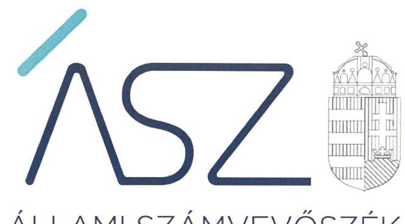

ÁLLAMI SZÁMVEVŐSZÉK

# JELENTÉS 

Pártok gazdálkodása

A költségvetési támogatásban részesülő pártok 2018-2019. évi gazdálkodása törvényességének ellenőrzése a FIDESZ - Magyar Polgári Szövetségnél
2021.

21035
www.asz.hu

---

ÁLLAMI SZÁMVEVŐSZÉK

# JELENTÉS 

## Pártok gazdálkodása

A költségvetési támogatásban részesülő pártok 2018-2019. évi gazdálkodása törvényességének ellenőrzése a FIDESZ - Magyar Polgári Szövetségnél
2021. 04. hó 30. nap

21035
www.asz.hu

---

|  AZ ELLENŐRZÉST FELÜGYELTE: |  |  |  |  |   |
| --- | --- | --- | --- | --- | --- |
|   |  |  |  |  | DR. NAGY IMRE felügyeleti vezető  |
|   |  |  |  |  | AZ ELLENŐRZÉST VEZETTE ÉS A VÉGREHAJTÁSÁÉRT FELELŐS:  |
|   |  |  |  |  | NEMESVÁRI-HORTHY ESZTER ellenőrzésvezető  |
|   |  |  |  |  | A PROGRAM ÖSSZEÁLLÍTÁSÁÉRT FELELŐS:  |
|   |  |  |  |  | GÖRGÉNYI GÁBOR osztályvezető  |
|   |  |  |  |  | A TÉMÁHOZ KAPCSOLÓDÓ KORÁBBISZÁMVEVŐSZÉKI JELENTÉSEK:  |
|   |  |  |  |  | - címe: A költségvetési támogatásban részesülő pártok 2016-2017. évi gazdálkodása törvényességének ellenőrzése - FIDESZ - Magyar Polgári Szövetség  |
|   |  |  |  |  | - sorszáma: 19028  |
|  Jelentéseink az Országgyűlés számítógépes hálózatán és az interneten a www.asz.hu címen is olvashatóak. |  |  |  |  | IKTATÓSZÁM: EL-3161-001/2021.  |
|   |  |  |  |  | TÉMASZÁM: 2548  |
|   |  |  |  |  | ELLENŐRZÉS-AZONOSÍTÓ SZÁM: V0882001  |

---

# TARTALOMJEGYZÉK 

- ÖSSZEGZÉS ..... 5
- AZ ELLENŐRZÉS CÉLJA ..... 6
- AZ ELLENŐRZÉS TERÜLETE ..... 7
- AZ ELLENŐRZÉS HÁTTERE, INDOKOLTSÁGA ..... 8
- A JELENTÉS LÉNYEGES KÉRDÉSKÖREI. ..... 9
- AZ ELLENŐRZÉS HATÓKÖRE ÉS MÓDSZEREI. ..... 10
- MEGÁLLAPÍTÁSOK ..... 12
- JAVASLATOK ..... 14
- MELLÉKLETEK. ..... 15
I. sz. melléklet: Értelmező szótár ..... 15
- FÜGGELÉK: ÉSZREVÉTELEK ..... 17
- RÖVIDÍTÉSEK JEGYZÉKE ..... 19

---

.

---

# ÖSSZEGZÉS 

A FIDESZ - Magyar Polgári Szövetség gazdálkodásának törvényessége a 2018-2019. években biztosított volt, a könyvvezetés és a gazdálkodás során betartotta a jogszabályi előírásokat. Ezzel biztosította a közpénzek felhasználásának átláthatóságát és elszámoltathatóságát.

## Az ellenőrzés társadalmi indokoltsága

A pártok az állampolgárok egyesülési szabadsága alapján létrehozott olyan szervezetek, amelyek kereteket nyújtanak a népakarat kialakításához és kinyilvánításához, a politikai életben való állampolgári részvételhez.

A politikai élet tisztasága érdekében törvény állapítja meg a pártok vagyonára és gazdálkodására vonatkozó szabályokat. Az egyesülési jog alapján létrejövő más szervezetekhez képest szűkebb körben határozza meg azt a gazdasági tevékenységet, amelyet a párt végezhet, biztosítja azonban a pártok részére azt a jogosultságot, hogy az állami költségvetésből támogatásban részesüljenek. A pártok gazdálkodását a politikai élet tisztasága érdekében rendszeresen indokolt ellenőrizni, ezért törvényi előírás alapján az Állami Számvevőszék a költségvetési támogatást kapott pártok gazdálkodását kétévente ellenőrzi. A gazdálkodás szabályszerűségének, a felhasznált közpénzek nagyságának bemutatásával a társadalom objektív képet alkothat a pártok működéséről.

A pártokkal szembeni társadalmi elvárás a törvényt tisztelő, jogkövető magatartás, mivel a párt képviselői a jogállamiságot megtestesítő törvényhozó hatalom részei. Mindezekre tekintettel fokozott társadalmi veszélyességet hordoz egy párt elszámoltathatóságának hiánya, elszámolási kötelezettségének nem teljesítése.

## Főbb megállapítások, következtetések, javaslatok

A FIDESZ - Magyar Polgári Szövetség gazdálkodására vonatkozó számviteli keretek kialakítása és a belső szabályozások megalkotása során érvényesültek a jogszabályi előírások, amelyek támogatták a közpénzekkel való átlátható és ellenőrizhető gazdálkodást. A könyvvezetés és a nyilvántartási rendszer kialakítása a jogszabályi előírások szerint történt. A FIDESZ - Magyar Polgári Szövetség a gazdálkodásával kapcsolatos ellenőrzés rendjét kialakította és működtette.

A FIDESZ - Magyar Polgári Szövetség 2018. és 2019. évi pénzügyi kimutatásait a jogszabályi előírások szerint készítette el, azok közzétételéről határidőben gondoskodott, ezzel biztosítva gazdálkodásának átláthatóságát.

A FIDESZ - Magyar Polgári Szövetség a működéséhez a forrásokat, köztük a költségvetésből juttatott és az egyéb támogatásokat, adományokat szabályszerűen használta fel, tiltott vagyoni hozzájárulást nem fogadott el. A FIDESZ Magyar Polgári Szövetség a vagyonnal való gazdálkodás szabályait meghatározta, működése során a vagyon felhasználása törvényes volt.

Az Állami Számvevőszék a FIDESZ - Magyar Polgári Szövetség elnökének egy javaslatot tett.

---

# AZ ELLENŐRZÉS CÉLJA 

AZ ELLENŐRZÉS CÉLJA annak értékelése volt, hogy a FIDESZ - Magyar Polgári Szövetség által közzétett pénzügyi kimutatások a törvényi előírásoknak megfeleltek-e, a könyvvezetés és gazdálkodás során betartották-e a vonatkozó jogszabályi és belső előírásokat; a FIDESZ - Magyar Polgári Szövetség a működéséhez szabályszerűen igénybe vehető forrásokat használt-e fel.

---

# AZ ELLENŐRZÉS TERÜLETE 

## FIDESZ - Magyar Polgári Szövetség

A FIDESZ - Magyar Polgári Szövetség 1988. március 30-án létrejött olyan egyesület, amely nyilvántartott tagsággal rendelkezett és a nyilvántartásba vételét végző bíróság előtt kinyilvánította, hogy a Párttörvény ${ }^{1}$ rendelkezéseit magára nézve kötelezőnek ismeri el a Párttörvény 1.§-a alapján. Az Alapszabály ${ }_{1,2}{ }^{2}$ szerint működésének egyik kiemelt célja, az ember méltóságán és felelősségvállalásán alapuló polgári társadalom megszilárdítása.

A FIDESZ - Magyar Polgári Szövetség legfelsőbb tanácskozó és döntéshozó szerve az Alapszabály ${ }_{1,2}$ szerint a Kongresszus ${ }^{3}$, amely titkos szavazással választja meg a FIDESZ - Magyar Polgári Szövetség elnökét.

A FIDESZ - Magyar Polgári Szövetség a Magyar Közlöny mellékletét képező, Hivatalos Értesítő ${ }^{4}$ 2019. évi 25. számában, illetve a 2020. évi 21. számában közzétett pénzügyi kimutatásaiban a 2018. évre 2 426,3 M Ft bevételt, valamint 2 305,1 M Ft kiadást, a 2019. évre 1970,5 M Ft bevételt, valamint 2 375,4 M Ft kiadást számolt el. A pénzügyi kimutatásában a költségvetési törvény szerint jóváhagyott 2018. évre 1 541,7 M Ft-os, illetve 2019. évi 967,8 M Ft-os költségvetési támogatást mutatott ki.

A FIDESZ - Magyar Polgári Szövetség gazdasági társaságot nem alapított, a Szövetség a Polgári Magyarországért Alapítványt 2003-ban hozta létre.

---

# AZ ELLENŐRZÉS HÁTTERE, INDOKOLTSÁGA 

Az ÁSZtv. ${ }^{5}$ 5. § (11) bekezdés a) pontja és a Párttörvény 10. § (1) bekezdése alapján a pártok gazdálkodása törvényességének ellenőrzésére az ÁSZ ${ }^{6}$ jogosult. Törvényi előírás alapján az ÁSZ kétévente ellenőrzi azoknak a pártoknak a gazdálkodását, amelyek rendszeres költségvetési támogatásban részesültek.

Az ÁSZ legutóbb a FIDESZ - Magyar Polgári Szövetség 2016-2017. évi gazdálkodásának törvényességét ellenőrizte.

A gazdálkodás szabályszerűségének, a felhasznált közpénzek nagyságának bemutatásával a társadalom objektív képet alkothat a pártok működéséről. Az ellenőrzés megállapításai a gazdálkodás megfelelőségének bemutatásával elősegíthetik, hogy a törvényalkotók konkrét lépéseket tegyenek a pártok finanszírozására vonatkozó szabályozások megváltoztatása, átláthatóbbá, ellenőrizhetőbbé tétele irányába. Az ellenőrzés rámutat a pártok gazdálkodásával kapcsolatos jó gyakorlatokra és szabálytalanságokra. A hiányosságok, szabálytalanságok feltárása, az ennek kapcsán megfogalmazott megállapítások elősegíthetik a törvényi rendelkezések megsértésének szankcionálását.

---

# A JELENTÉS LÉNYEGES KÉRDÉSKÖREI 

1.     - A FIDESZ - Magyar Polgári Szövetség gazdálkodásának törvényessége biztosított volt-e?
2.     - A FIDESZ - Magyar Polgári Szövetség könyvvezetése és gazdálkodása során a vonatkozó jogszabályi rendelkezéseket és belső előírásokat betartotta-e?
3.     - A FIDESZ - Magyar Polgári Szövetség pénzügyi kimutatása megfelelt-e a jogszabályi előírásoknak, közzétételi kötelezettségét szabályszerűen teljesítette-e?

---

# AZ ELLENŐRZÉS HATÓKÖRE ÉS MÓDSZEREI 

## Az ellenőrzés típusa

Szabályszerűségi ellenőrzés.

## Az ellenőrzött időszak

A 2018-2019. évek

## Az ellenőrzés tárgya

A FIDESZ - Magyar Polgári Szövetség ellenőrzése során az ellenőrzés tárgyát képezte a 2018. és a 2019. évre vonatkozó pénzügyi kimutatás elkészítésére, jóváhagyására, közzétételére, a könyvvezetésére, gazdálkodására, ennek keretében a számviteli szabályozás kialakítására, a bizonylati rend, bizonylati fegyelem betartására, egyéb gazdálkodási, ellenőrzési és pénzügyi-számviteli informatikai feladatok ellátására irányuló tevékenységek. Az ellenőrzés tárgya volt még a Párttörvény szerinti források elszámolása és felhasználása, valamint a vagyon jogszabályi előírásoknak megfelelő hasznosítása.

Az ellenőrzés kiterjedt minden olyan körülményre és adatra, amely az ÁSZ jogszabályban meghatározott feladatainak teljesítéséhez, valamint a program végrehajtása folyamán felmerült újabb összefüggések feltárásához szükséges volt.

## Az ellenőrzött szervezet

FIDESZ - Magyar Polgári Szövetség

## Az ellenőrzés jogalapja

Az ellenőrzés jogalapját a ÁSZtv. 5. § (11) bekezdés a) pontja, a Párttörvény 4. § (4)-(5) bekezdései, valamint 10. § (1), (3)-(4) bekezdései képezték.

## Az ellenőrzés módszerei

Az ÁSZ ellenőrzésére az ellenőrzési program szempontjai, az ellenőrzött időszakban hatályos jogszabályok, az ellenőrzés általános szakmai szabályai, az ellenőrzésre irányadó ÁSZ módszertanok figyelembevételével került sor. A közpénzekkel való felelős gazdálkodás segítésére irányuló javaslatok kidolgozásakor a hatályos jogszabályok irányadóak.

---

Az ellenőrzés ideje alatt a FIDESZ - Magyar Polgári Szövetséggel történő kapcsolattartást az ÁSZ SZMSZ²-ének vonatkozó előírásai alapján biztosította az ÁSZ.

Az ellenőrzés céljának eléréséhez szükséges bizonyítékok megszerzése a FIDESZ - Magyar Polgári Szövetség által rendelkezésre bocsátott dokumentumokra, adatokra alapozva közvetlen, részletes elemzés, megfigyelés, szemrevételezés, információkérés, megerősítés, valamint elemző eljárás útján történt. Az ellenőrzési bizonyítékként felhasználható adatforrások közé tartoztak egyrészt az ellenőrzési program részletes szempontjainál felsorolt adatforrások, másrészt minden egyéb - az ellenőrzés folyamán feltárt, az ellenőrzési program részletes szempontjainál felsorolt adatforrások, másrészt minden egyéb - az ellenőrzés folyamán feltárt, az ellenőrzés szempontjából információt tartalmazó - dokumentum.

Az ellenőrzés lefolytatásához a FIDESZ - Magyar Polgári Szövetség az ÁSZ által kért dokumentumok megküldésével szolgáltatott adatokat, amelyek valódiságát és teljes körűségét a FIDESZ - Magyar Polgári Szövetség vezetője által tett teljességi és hitelességi nyilatkozatnak kellett igazolnia. A rendelkezésre bocsátott adatok, információk kontrollja az ellenőrzés keretében történt.

Az ÁSZ a tételes ellenőrzés mellett statisztikai alapú mintavételezést és értékelést alkalmazott. A minták kiválasztása rétegzett mintavételezéssel történt. A hozzájárulások, adományok és egyéb bevételek, valamint a személyi juttatások (működési kiadáson belül), eszközbeszerzések és a működési kiadások további tételei, politikai tevékenység kiadásai, egyéb kiadások mintatételeinek értékelése „szabályszerű", ha a minta ellenőrzésének eredménye alapján 95%-os bizonyossággal a teljes sokaságban az átlagos hibaarány nem haladta meg a 10%-ot, „nem szabályszerű", ha nagyobb volt, mint 10%. Abban az esetben, ha a teljes sokaság tekintetében a 10%-os hibaarányhoz való viszony megítélésének megbízhatósága nem érte el a 95%-ot, annak elérése érdekében az értékelés további szempontokkal egészült ki, a feltárt hibák értéke is figyelembe vételre került.

---

# 1. A FIDESZ - Magyar Polgári Szövetség gazdálkodásának törvényessége biztosított volt-e? 

Összegző megállapítás

A FIDESZ ${ }^{8}$ gazdálkodásának törvényessége az ellenőrzött időszakban biztosított volt.

A FIDESZ rendelkezett a Számv. tv. ${ }^{9}$ előírásával összhangban lévő Számviteli politika ${ }_{1,2}{ }^{10}$-vel, Leltározási szabályzat ${ }_{1,2}{ }^{11}$-vel , Értékelési szabályzat ${ }_{1,2}{ }^{12}$-vel, a pénzkezelési szabályokat tartalmazó Pénzügyi szabályzat ${ }_{1,2}{ }^{13}$-vel, valamint Számlarend ${ }_{1,2}{ }^{14}$-vel.

A Számlarend ${ }_{1,2}$-ben rögzítették az
 egyéb bevételek fogalmát, a működési kiadások körét, az eszközbeszerzés tartalmát, a politikai tevékenység kiadásainak, továbbá az egyéb kiadásoknak a körét, biztosítva ezzel a Párttörvény 1. számú melléklete szerinti adatok rendelkezésre állását. Az Értékelési szabályzat ${ }_{1,2}$-ben – a Párttörvény 4. § (5) bekezdésében előírtak alapján – meghatározták a nem pénzbeli vagyoni hozzájárulás értékelésének szabályait.

A FIDESZ kialakította a gazdálkodásához kapcsolódó ellenőrzés szabályait, amelyeket az Alapszabály ${ }_{1,2}$-ben és Pénzügyi szabályzat ${ }_{1,2}$-ben rögzített. Az Alapszabály ${ }_{2}$-ben a Ptk. ${ }^{15} 3: 26. § (4) bekezdése előírása ellenére az első felügyelőbizottság tagjait nem jelölte ki.

## 2. A FIDESZ - Magyar Polgári Szövetség könyvvezetése és gazdálkodása során a vonatkozó jogszabályi rendelkezéseket és belső előírásokat betartotta-e?

Összegző megállapítás

A FIDESZ a 2018-2019. évi könyvvezetése és gazdálkodása során a vonatkozó jogszabályi rendelkezéseket és belső előírásokat betartotta.

2.1. számú megállapítás

A FIDESZ a 2018-2019. években a bevételeket szabályszerűen számolta el.

A FIDESZ az ellenőrzött időszakban kettős könyvviteli rendszerben vette nyilvántartásba bevételeit, amelyek elszámolása a Számlarend ${ }_{1,2}$-ben foglalt főkönyvi számlákon történt, összhangban a Számviteli politika ${ }_{1,2}$-ben foglaltakkal.

A FIDESZ a Párttörvény előírásait betartva jogi személytől, jogi személyiséggel nem rendelkező szervezettől vagyoni hozzájárulást nem fogadott el.

---

|  2.2. számú megállapítás | A FIDESZ a gazdálkodással összefüggő tevékenységének keretében a kiadások kifizetése során betartotta a jogszabályok és a belső szabályzatok előírásait.  |
| --- | --- |
|   | A FIDESZ a 2018. és a 2019. évi kiadásainak elszámolása szabályszerű volt, a kifizetések elszámolása során a Számv. tv., az Art. ${ }^{16}$, az Mt. ${ }^{17}$, az Szja tv ${ }^{18}$, valamint a belső szabályzatok előírásait betartotta.  |
|  2.3. számú megállapítás | A FIDESZ működése során a vagyon felhasználása törvényes volt.  |
|   | A vagyonnal való gazdálkodás szabályait a FIDESZ az Alapszabály ${ }_{1,2}$-ben határozta meg. A FIDESZ az MFB Zrt. ${ }^{19}$-vel kötött hitelszerződésből eredő törlesztési kötelezettségének a szerződésben foglaltaknak megfelelően eleget tett.  |

# 3. A FIDESZ - Magyar Polgári Szövetség pénzügyi kimutatása megfelelt-e a jogszabályi előírásoknak, közzétételi kötelezettségét szabályszerűen teljesítette-e?

Összegző megállapítás A FIDESZ pénzügyi kimutatásait a jogszabályi előírások alapján készítette el, a közzétételi kötelezettségét szabályszerűen teljesítette.

A FIDESZ a 2018. és 2019. évi pénzügyi kimutatásokat a Párttörvény 1. számú mellékletben előírt szerkezetben állította össze, az abban szereplő bevételi és kiadási kategóriák megfeleltek a Párttörvény 1. számú mellékletében foglaltaknak.

A FIDESZ a Párttörvény előírásai alapján a 2018-2019. évi pénzügyi kimutatásokat határidőben tette közzé a Magyar Közlöny mellékletét képező Hivatalos Értesítőben és saját honlapján.

---

# JAVASLATOK 

Az ÁSZ tv. 33. § (1) bekezdésében foglaltak értelmében az ellenőrzött szervezet vezetője köteles a jelentésben foglalt megállapításokhoz kapcsolódó intézkedési tervet összeállítani és azt a jelentés kézhezvételétől számított 30 napon belül az ÁSZ részére megküldeni. Amennyiben az ellenőrzött szervezet vezetője nem küldi meg határidőben az intézkedési tervet, vagy továbbra sem elfogadható intézkedési tervet küld, az Állami Számvevőszék elnöke az ÁSZ tv. 33. § (3) bekezdése a) és b) pontjaiban foglaltakat érvényesítheti.

## FIDESZ- Magyar Polgári Szövetség elnöke

1. Intézkedjen a felügyelő bizottság tagjainak Alapszabályban történő kijelöléséről a jogszabályi előírás szerint.
(1. sz. megállapítás 3. bekezdés 2. mondata alapján)

---

# MELLÉKLETEK 

- I. SZ. MELLÉKLET: ÉRTELMEZŐ SZÓTÁR
pénzügyi kimutatás
a párt gazdasági-vállalkozási tevékenysége
költségvetési támogatás
nem pénzbeli támogatás

A Párttörvény. 9. § (1) bekezdésében meghatározott, a törvény 1. számú melléklete szerinti pénzügyi kimutatás (hatályos 2014. május 6-ától), amelyet a pártok kötelesek minden év május 31-ig a Magyar Közlönyben, valamint saját honlappal rendelkező pártok a honlapjukon is közzétenni.
A Párttörvény 6. § (1) bekezdésének megfelelően a párt a költségeinek fedezése és vagyonának gyarapítása érdekében a következő gazdasági-vállalkozási tevékenységeket folytathatja:
a) politikai céljainak és tevékenységének megismertetése érdekében kiadványokat jelentethet meg és terjeszthet, a pártot szimbolizáló jelvényeket és más ilyen célú tárgyakat árusíthat, és pártrendezvényeket szervezhet;
b) a tulajdonában álló ingatlanokat és ingókat díj ellenében hasznosíthatja és elidegenítheti.
Az államháztartás alrendszerei terhére nyújtott pénzbeli vagy nem pénzbeli juttatás, amelyet a támogató nem elsősorban ellenszolgáltatás ellenében, de konkrét program megvalósítása vagy meghatározott időszakban a támogatott szervezet működtetése érdekében nyújt. (Civil tv. ${ }^{20}$ 2. § 15. pont)
Vagyoni értékkel rendelkező forgalomképes dolog, szellemi alkotás, illetve vagyoni értékű jog részben vagy egészében, véglegesen vagy ideiglenesen, teljesen vagy részben ingyenesen történő átruházása vagy átengedése, illetve szolgáltatás biztosítása. (Civil tv. 2. § 25. pont)

---

.

---

# FÜGGELÉK: ÉSZREVÉTELEK 

A jelentéstervezetet a Számvevőszék 15 napos észrevételezésre megküldte az ellenőrzött szervezet vezetőjének az ÁSZ tv. 29. §*(1) bekezdése előírásának megfelelően.

Az ellenőrzött szervezet vezetője a jelentéstervezet megállapításaira nem tett észrevételt.

[^0]
[^0]:    * 29. § (1) Az Állami Számvevőszék az ellenőrzési megállapításait megküldi az ellenőrzött szervezet vezetőjének vagy az általa megbízott személynek, és annak, akinek személyes felelősségét állapította meg.
    (2) Az ellenőrzött szervezet vezetője és a felelősként megjelölt személy az ellenőrzés megállapításaira tizenöt napon belül írásban észrevételt tehet.
    (3) Az Állami Számvevőszék az észrevételre a beérkezésétől számított harminc napon belül írásban válaszol. A figyelembe nem vett észrevételeket köteles a jelentésben feltüntetni, és megindokolni, hogy azokat miért nem fogadta el.

---

.

---

# RÖVIDÍTÉSEK JEGYZÉKE 

${ }^{1}$ Párttörvény
${ }^{2}$ Alapszabály ${ }_{1}$
Alapszabály ${ }_{2}$
${ }^{3}$ Kongresszus
${ }^{4}$ Hivatalos Értesítő
${ }^{5}$ ÁSZtv.
${ }^{6}$ ÁSZ
${ }^{7}$ ÁSZ SZMSZ
${ }^{8}$ FIDESZ
${ }^{9}$ Számv.tv.
${ }^{10}$ Számviteli politika ${ }_{1}$
Számviteli politika ${ }_{2}$
${ }^{11}$ Leltározási szabályzat ${ }_{1}$
Leltározási szabályzat ${ }_{2}$
${ }^{12}$ Értékelési szabályzat ${ }_{1}$
Értékelési szabályzat ${ }_{2}$
${ }^{13}$ Pénzügyi szabályzat ${ }_{1}$
Pénzügyi szabályzat ${ }_{2}$
${ }^{14}$ Számlarend ${ }_{1}$
Számlarend ${ }_{2}$
${ }^{15}$ Ptk.
${ }^{16}$ Art.
${ }^{17}$ Mt.
${ }^{18}$ Szjatv.
${ }^{19}$ MFB Zrt.
${ }^{20}$ Civil tv.
1989. évi XXXIII. törvény a pártok működéséről és gazdálkodásáról (hatályos 1989. október 30-tól)

A FIDESZ - Magyar Polgári Szövetség Alapszabálya (hatályos: 2017. 11.13-tól 2019. szeptember 28-áig)
A FIDESZ - Magyar Polgári Szövetség Alapszabálya (hatályos: 2019. szeptember 29-étől)
Fidesz - Magyar Polgári Szövetség kongresszusa
A Magyar Közlöny melléklete
2011. évi LXVI. törvény az Állami Számvevőszékről (hatályos: 2011. július 1-jétől)

Állami Számvevőszék
Állami Számvevőszék Szervezeti és Működési Szabályzata
FIDESZ - Magyar Polgári Szövetség
2000. évi C. törvény a számvitelről (hatályos: 2001. január 1-jétől)
A FIDESZ - Magyar Polgári Szövetség Számviteli politikája (hatályos 2018. január 1-jétől)
A FIDESZ - Magyar Polgári Szövetség Számviteli politikája (hatályos 2019. január 1-jétől)
A FIDESZ - Magyar Polgári Szövetség Leltározási szabályzata (hatályos 2018. január 1-jétől)
A FIDESZ - Magyar Polgári Szövetség Leltározási szabályzata (hatályos 2019. január 1-jétől)
A FIDESZ - Magyar Polgári Szövetség Értékelési szabályzata (hatályos 2018. január 1-jétől)
A FIDESZ - Magyar Polgári Szövetség Értékelési szabályzata (hatályos 2019. január 1-jétől)
A FIDESZ - Magyar Polgári Szövetség Pénzügyi szabályzata (hatályos 2018. január 1-jétől)
A FIDESZ - Magyar Polgári Szövetség Pénzügyi szabályzata (hatályos 2019. január 1-jétől)
A FIDESZ - Magyar Polgári Szövetség Számlarendje (hatályos 2018. január 1-jétől)
A FIDESZ - Magyar Polgári Szövetség Számlarendje (hatályos 2019. január 1-jétől)
2013. évi V. törvény - a Polgári Törvénykönyvről
2017. évi CL. törvény az adózás rendjéről (hatályos 2018. január 1-jétől)
2012. évi I. törvény a munka törvénykönyvéről (hatályos 2012. július 1-jétől)
1995. évi CXVII. törvény a személyi jövedelemadóról (hatályos 1996. január 1-jétől)
Magyar Fejlesztési Bank Zrt.
2011. évi CLXXV. törvény az egyesülési jogról, a közhasznú jogállásról, valamint a civil szervezetek működéséről és támogatásáról (hatályos 2012. január 1-jétől)

---

# ASZ 

1052 Budapest, Apáczai Cs. J. u. 10. | 1364 Budapest 4. Pf. 54 TEL: +36 14849100
email: szamvevoszek@asz.hu
web: www.asz.hu | www.aszhirportal.hu
