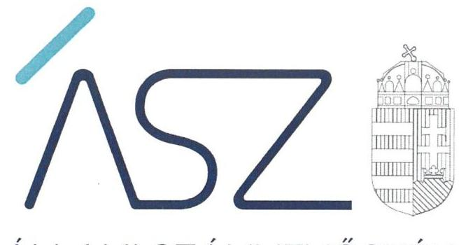
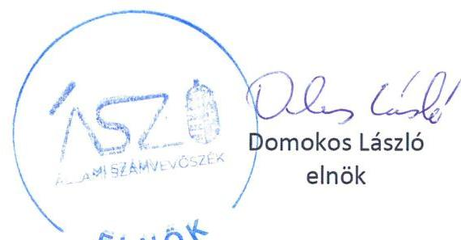
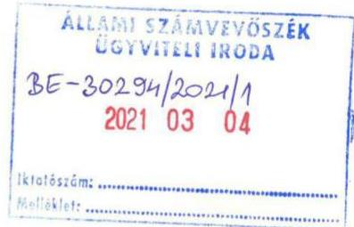
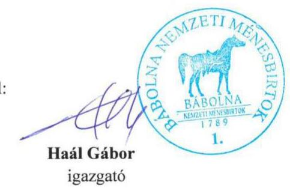
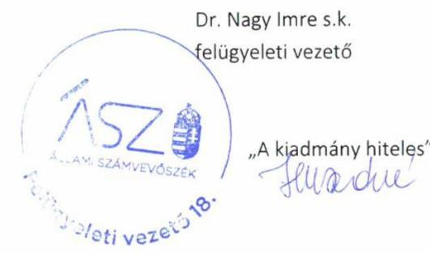

ÁLLAMI SZÁMVEVŐSZÉK

# JELENTÉS 

## A központi költségvetési szervek ellenőrzése Vagyongazdálkodás

Állami Ménesgazdaság Szilvásvárad
2021.

21036
www.asz.hu

---

ÁLLAMI SZÁMVEVŐSZÉK

# JELENTÉS

A központi költségvetési szervek ellenőrzése – Vagyongazdálkodás

Állami Ménesgazdaság Szilvásvárad

2021. 04. hó 21. nap

21036
www.asz.hu

---

# AZ ELLENŐRZÉST FELÜGYELTE: 

DR. NAGY IMRE felügyeleti vezető

## AZ ELLENŐRZÉST VEZETTE ÉS A VÉGREHAJTÁSÁÉRT FELELŐS:

JANIK JÓZSEF ellenőrzésvezető

A PROGRAM ÖSSZEÁLLÍTÁSÁÉRT FELELŐS:
GÖRGÉNYI GÁBOR osztályvezető

IKTATÓSZÁM: EL-3168-001/2021.
TÉMASZÁM: 2549
ELLENŐRZÉS-AZONOSÍTÓ SZÁM: V089309
Jelentéseink az Országgyúlés számítógépes hálózatán és az interneten a www.asz.hu címen is olvashatóak.

---

# TARTALOMJEGYZÉK 

- ÖSSZEGZÉS ..... 5
- AZ ELLENŐRZÉS CÉLJA ..... 6
- AZ ELLENŐRZÉS TERÜLETE ..... 7
- AZ ELLENŐRZÉS HÁTTERE, INDOKOLTSÁGA ..... 8
- A JELENTÉS LÉNYEGES KÉRDÉSKÖREI. ..... 9
- AZ ELLENŐRZÉS HATÓKÖRE ÉS MÓDSZEREI. ..... 10
- MEGÁLLAPÍTÁSOK ..... 12
- JAVASLATOK ..... 15
- MELLÉKLETEK. ..... 17
I. sz. melléklet: Értelmező szótár ..... 17
- FÜGGELÉK: ÉSZREVÉTELEK ..... 19
- RÖVIDÍTÉSEK JEGYZÉKE ..... 29

---

.

---

# ÖSSZEGZÉS 

Az Állami Ménesgazdaság Szilvásvárad a nemzeti vagyon értékének megőrzését, a vagyon védelmét és a vagyonnal való elszámoltathatóságot nem biztositotta.

## Az ellenőrzés társadalmi indokoltsága

Az államháztartás központi alrendszerébe tartozó szervezet ek alapvető rendeltetése a társadalom javát szolgáló közfeladatok ellátásának hatékony, számon kérhető, pazarlásmentes biztosítása. A közpénzek felhasználásában meghatározó arányt képviselő központi költségvetési szervek gazdálkodásuk révén jelentős hatást gyakorolhatnak a költségvetés egyensúlyának fenntartására, a közpénzek felelős, takarékos felhasználására, a nemzeti vagyon értékének megóvására, gyarapítására, társadalmi érdeknek megfelelő hasznosítására.

A szabályszerű, korrupciómentes, átlátható müködés és az elszámoltatható közpénzfelhasználás nélkülözhetetlen feltétele a közfeladat ellátását szolgáló vagyonelemek valósághű számbavétele, értékelése, nyilvántartásának valódisága, ami megalapozza a vagyon éves költségvetési beszámolókban történő megbízható bemutatását is.

Indokolt ezért, hogy az Állami Számvevőszék a központi költségvetési szervek vagyongazdálkodását rendszeresen ellenőrizze, értékelve, hogy vagyongazdálkodásuk elszámoltatható volt-e és hozzájárult-e a kiegyensúlyozott, átlátható és fenntartható költségvetési gazdálkodás Alaptörvényben meghatározott elvének érvényesítéséhez. Az ellenőrzések megállapításai rávilágíthatnak az egyes szervezetek vagyongazdálkodásában beazonosított konkrét hiányosságokra csakúgy, mint a központi alrendszerben vagy annak egyes ágazataiban esetlegesen felmerülő pénzügyi, szabályozási feszültségekre.

## Főbb megállapítások, következtetések, javaslatok

Az Állami Ménesgazdaság Szilvásvárad a vagyongazdálkodás szempontjából meghatározó legfontosabb belső szabályozások közül számlarenddel nem rendelkezett, így hiányzott a vagyon nyilvántartásának, számbavételének számviteli szabályozási háttere. A valós helyzetet tükröző beszámolás a szabályszerű, a mérleg adatait teljes körűen alátámasztó leltárak hiányában, ezen túlmenően 2019-ben a beszámoló adatainak részletező nyilvántartással való alátámasztottsága hiányában nem valósult meg. Mindezek miatt az intézmény a kezelésében álló vagyonnal nem számolt el, nem biztosította a nemzeti vagyon védelmét, átlátható kimutatását.

Nem vezették azokat a jogszabályban előírt nyilvántartásokat, amelyek alapján a gazdálkodási jogkörrel rendelkezők személye, aláírása egyértelműen, napra készen beazonosítható lett volna. Így nem volt biztosított az Állami Ménesgazdaság Szilvásvárad vagyonának kezelésével, megóvásával kapcsolatos gazdasági folyamatokban az átláthatóság, számon kérhetőség, elszámoltathatóság követelményének érvényesülése, a vagyonváltozást eredményező döntések, a vagyonban bekövetkezett változások szabályszerű végrehajtása, elszámolása.

A számviteli politikát, az ahhoz kapcsolódó leltározási és leltárkészítési szabályzatot, valamint eszközök és források értékelési szabályzatát kialakították, azonban azok tartalma nem állt összhangban a jogszabályok előírásaival, amely hiányosságokat 2019. I. félévében részben kijavították.

Az Állami Számvevőszék az ellenőrzés során feltárt szabálytalanságok kijavítása céljából, a szabályszerű müködés helyreállítása érdekében az Állami Ménesgazdaság Szilvásvárad igazgatója részére négy javaslatot fogalmazott meg.

---

# AZ ELLENŐRZÉS CÉLJA 

AZ ELLENŐRZÉS CÉLJA annak megállapítása volt, hogy a központi költségvetési szerv a jó gazda gondosságával biztosította-e a nemzeti vagyon értékének megőrzését, védelmét és szabályszerű kezelését. Az államháztartás központi alrendszerébe tartozó szervezet vagyongazdálkodása elszámoltatható volt-e és megfelelte annak az Alaptörvényben meghatározott alapvetésnek, hogy Magyarország a kiegyensúlyozott, átlátható és fenntartható költségvetési gazdálkodás elvét érvényesíti.

---

# AZ ELLENŐRZÉS TERÜLETE 

## Állami Ménesgazdaság Szilvásvárad

Az Állami Ménesgazdaság Szilvásvárad 1993-ban alapított, az Agrárminisztérium irányítása alá tartozó, önálló jogi személyként működő központi költségvetési szerv.

Alaptevékenysége a Lipicai és Gidrán Ménes, valamint más őshonos magyar lófajta ménesének a fenntartása, a lótenyésztés olyan irányú fejlesztése, hogy a fajták megfeleljenek a rájuk jellemző tradicionális jellegeknek és használatnak. Ennek kapcsán tevékenységi körébe tartozik a tenyésztett fajtákhoz kapcsolódó lovas hagyományok ápolása, népszerűsítése, nemzetközi és hazai összehasonlító versenyek szervezése, a lovassport, a lovas-élet hagyományait ápoló múzeum és kiállítások fenntartása, a magyar lótenyésztés idegenforgalmi célú bemutatása, továbbá az állomány fenntartásához szükséges takarmány előállítása, a tenyésztési cél eléréséhez, illetve a génfenntartáshoz szükséges nagy genetikai értékű egyedek beszerzése, tenyészállatok exportja és importja.

Az intézmény az ellenőrzött időszakban saját gazdasági szervezettel nem rendelkezett. Gazdálkodási feladatait a 2018. év végéig a Nemzeti Agrárkutatási és Innovációs Központ látta el, amelytől az agrárminiszter döntése alapján 2019. január 1-i hatállyal a Bábolna Nemzeti Ménesbirtok vette át ezt a feladatot.

Az Állami Ménesgazdaság Szilvásvárad vezetője az igazgató, személyében az ellenőrzött időszakban két alkalommal, 2019. elején, majd 2019. júniusban történt változás.

Az intézmény 2019-es beszámolója szerint a teljesített kiadások éves összege 831,6 M Ft volt, és összesen 647,7 M Ft központi költségvetési, illetve irányító szervi támogatásban részesült, saját vagyona az év végén 7069,5 M Ft-ot tett ki.

---

# AZ ELLENŐRZÉS HÁTTERE, INDOKOLTSÁGA 

Az államháztartás központi alrendszerébe tartozó szervezet vagyona a nemzeti vagyon része, az azzal való gazdálkodás a közérdek szolgálata érdekében történik. Az ÁSZ ${ }^{1}$ ellenőrzi az éves költségvetési törvény végrehajtását, majd az ellenőrzés során feltárt és a terület folyamatos kockázatelemzésével beazonosított kockázatok kezelése érdekében ráépülő ellenőrzésekkel ellenőrzi a költségvetési szervek gazdálkodását, müködését. Az ellenőrzések megállapításaival támogatja az ellenőrzött szervezetek szabályszerű gazdálkodását, javaslataival elősegíti az Alaptörvényben megfogalmazott alapvetések érvényesülését a mindennapi életben a szervezetek szintjén.

A központi költségvetés rendszerében zajló folyamatok holisztikus elemzéseivel, a kockázatok folyamatos figyelemmel kísérésének módszerével, az így kiválasztott szervezetek célzott, hatékony ellenőrzéseivel az ÁSZ betölti a legfőbb gazdasági ellenőrző szerv küldetését. Az ellenőrzések megállapításaival és egyes időszakok ellenőrzési eredményeinek elemzésével az ÁSZ ráirányíthatja a jogalkotók figyelméta központi alrendszerben vagy annak adott ágazatában esetlegesen felmerülő vagyongazdálkodási, szabályozási feszültségekre.

---

# A JELENTÉS LÉNYEGES KÉRDÉSKÖREI 

1.     - Biztosított volt-e a vagyongazdálkodás szabályozottsága?
2.     - A központi költségvetési szerv vagyonnal való gazdálkodása során biztosította-e a nemzeti vagyon védelmét, szabályszerűen végezték-e a nemzeti vagyon nyilvántartását és kimutatását?
3.     - A központi költségvetési szervnél kialakították-e a teljesítmény mérésére alkalmas követelményeket?

---

# AZ ELLENŐRZÉS HATÓKÖRE ÉS MÓDSZEREI 

## Az ellenőrzés típusa

| Megfelelőségi ellenőrzés.

## Az ellenőrzött időszak

A 2017-2019. évek.

## Az ellenőrzés tárgya

A központi költségvetési szerv vagyongazdálkodási feltételeinek kialakítása, annak szabályszerűsége, az elszámoltathatóság biztosítása a szabályozás szintjén. Az intézménynél hozott, vagyonváltozást eredményező döntések, a vagyonban bekövetkezett változások végrehajtásának, elszámolásának szabályszerűsége. Az intézmény könyveiben, mérlegében kimutatott nemzeti vagyon nyilvántartásának szabályszerűsége, a vagyon kimutatása, értékelése és a mérleg leltárral való alátámasztásának szabályszerűsége.

## Az ellenőrzött szervezet

Állami Ménesgazdaság Szilvásvárad, valamint a gazdasági szervezet feladatait ellátó Nemzeti Agrárkutatási és Innovációs Központ (2017-2018.), és Bábolna Nemzeti Ménesbirtok (2019.)

## Az ellenőrzés jogalapja

Az ellenőrzés jogszabályi alapját az ÁSZ tv. ${ }^{2} 1$. § (3) bekezdés, 5. § (2), (3) és (6) bekezdései, valamint az Áht. ${ }^{3} 61 . \S$ (2) bekezdésének előírásai képezték.

## Az ellenőrzés módszerei

Az ÁSZ az ellenőrzést az ellenőrzési program szempontjai, az ellenőrzött időszakban hatályos jogszabályok, az ellenőrzés szakmai szabályai, a jelen ellenőrzésre irányadó ÁSZ módszertanok figyelembevételével hajtotta végre. Az ellenőrzési kérdések megválaszolásához szükséges bizonyítékok megszerzése az ellenőrzött szervezet által rendelkezésre bocsátott dokumentumokra és adatokra alapozva, továbbá megfigyelés, szemle (szemre-

---

vételezés), kérdésfeltevés (információkérés), érték alapján szűkített, lényeges sokaságon végrehajtott mintavétel, valamint elemző eljárás útján történt. Az ellenőrzési bizonyítékként felhasználható adatforrások közé tartoztak az ellenőrzési program részletes szempontjainál felsorolt adatforrások, valamint minden egyéb - az ellenőrzés folyamán feltárt, az ellenőrzés szempontjából információt tartalmazó-dokumentum. Az ellenőrzés lefolytatásához az ellenőrzött szervezet tanúsítványok kitöltésével, valamint az ÁSZ által kért dokumentumok megküldésével szolgáltatott adatokat, amelyekről az ellenőrzött szervezet vezetője teljességi és hitelességi nyilatkozatot állított ki. A rendelkezésre bocsátott dokumentumok, adatok és információk kontrollja az ellenőrzés keretében történt.

A 2019. évi vagyonnövekedések és vagyoncsökkenések elszámolásának szabályszerűségét, a nemzeti vagyon nyilvántartásának és év végi értékelésének szabályszerűségét lényeges sokaságból véletlen mintavételi eljárással kiválasztott tételek alapján ellenőrzi az ÁSZ. A mintavételi sokaságok esetében a mintavétel azokra a legnagyobb értékű tételekre - a lényeges sokaságra - terjedtek ki, melyek összértéke eléri a teljes sokaság összértékének 50\%-át. Amennyiben valamely lényeges sokaság elemszáma kisebb, mint az előírt mintaelemszám, a lényeges sokaság tételesen került ellenőrzésre. A mintavétellel ellenőrzött területek esetében minden egyes tétel vonatkozásában a szabályszerűségre vonatkozó kérdéseket tett fel az ÁSZ, amelyek eredménye összesítésre került. „Szabályszerűnek" értékelt egy ellenőrzött területet, amennyiben 95\%-os bizonyossággal a lényeges sokaságban az átlagos hibaarány legfeljebb 10\%, „nem szabályszerűnek", amennyiben 10\%-nál magasabb arányt képviselt. Abban az esetben, ha a lényeges sokaság tekintetében a 10\%-os hibaarányhoz való viszony megítélésének megbízhatósága nem éri el a 95\%-ot, annak elérése érdekében az értékelés további szempontokkal egészült ki, figyelembe véve a feltárt hibák értékét.

Az ellenőrzés ideje alatt az ellenőrzött szervezettel a kapcsolattartás biztosítása az ÁSZ SZMSZ ${ }^{4}$ vonatkozó előírásai alapján történt.

---

# 1. Biztosított volt-e a vagyongazdálkodás szabályozottsága? 

## Összegző megállapítás

### 1.1. számú megállapítás

Az Állami Ménesgazdaság Szilvásvárad vagyongazdálkodásának szabályozottsága nem volt biztosított.

Az Állami Ménesgazdaság Szilvásvárad vagyongazdálkodásra vonatkozó szabályozásának kialakítása nem volt szabályszerű.

Az Állami Ménesgazdaság Szilvásvárad a Számv. tv. ${ }^{5}$ és az Áhsz. ${ }^{6}$ előírásaival összhangban rendelkezett számviteli politikával és az ahhoz kapcsolódó szabályzatokkal, így leltározási és leltárkészítési szabályzattal, valamint az eszközök és a források értékelési szabályzatával. A Számv. tv. 161. § (1) bekezdésének és az Áhsz. 51. § (2) bekezdésének rendelkezései ellenére számlarendet nem készítettek.

Számlarend hiányában a Számv. tv. 161. § (2) bekezdés és az Áhsz. 51.§ (3) bekezdés ellenére nem szabályozták az alkalmazásra kijelölt számlák számjelét, megnevezését, tartalmát, a részletező nyilvántartások vezetésének módját, azoknak a kapcsolódó könyvviteli és nyilvántartási számlákkal való egyeztetését, valamint a bizonylati rendet.

A 2019. júniusig hatályos számviteli politikában a Számv. tv. 14. § (4) bekezdés előírásai ellenére nem rögzítették, mit tekintenek az elszámolás, értékelés szempontjából lényegesnek, nem lényegesnek. Továbbá a számviteli politika az államháztartás szervezetei részére irányadó, sajátos számviteli szabályokat rögzítő Áhsz. helyett a 2014 óta hatálytalan 249/2000. (XII. 24.) kormányrendeletet jelölte meg a számviteli politikát meghatározó jogszabályként, ennek rendelkezéseire tartalmazott konkrét hivatkozásokat, erre utalva használt a hatályos jogszabályban nem definiált, így a könyvvezetés során nem értelmezhető fogalmakat. Emiatt a számviteli politika nem az Áhsz. rendelkezéseivel összhangban rögzítette a költségvetési és a pénzügyi számvitel alkalmazásával kapcsolatos sajátos szabályokat, módszereket, és nem biztosította az Áhsz. 2. § (1) bekezdésében rögzített követelmény érvényesülését, amely szerint a költségvetési szerv az Áhsz. előírásai szerint köteles eleget tenni könyvvezetési kötelezettségének. Ezeket a hiányosságokat a 2019. június 14-én hatályba lépett új számviteli politikában kijavították.

A leltározási és leltárkészítési szabályzatban a Számv. tv. 69. § (3) bekezdés, valamint az Áhsz. 5. § (1) és 22. § (1) bekezdés előírása ellenére nem határozták meg a mennyiségi felvétellel történő leltározásgyakoriságát.

### 1.2. számú megállapítás

A vagyongazdálkodáshoz kapcsolódó jogkörgyakorlás szabályozása szabályszerűen történt.

Az Állami Ménesgazdaság Szilvásvárad rendelkezett a gazdálkodás részletes rendjét meghatározó belső szabályozásokkal. Ezekben az Áht. és az

---

Ávr. ${ }^{7}$ előírásaival összhangban rögzítették a gazdasági szervezet feladatait, a gazdálkodással összefüggő feladat és hatásköröket, a gazdasági folyamatok lebonyolításának módját, a költségvetés tervezésével és végrehajtásával, a beszámolással kapcsolatos előírásokat. Meghatározták a kötelezettségvállalás, teljesítés igazolás gyakorlásának módjával, eljárási és dokumentációs részletszabályaival, valamint az ezeket végző személyek kijelölésének rendjével kapcsolatos belső előírásokat, feltételeket is.

# 2. A központi költségvetési szerv vagyonnal való gazdálkodása során biztosította-e a nemzeti vagyon védelmét, szabályszerűen végezték-e a nemzeti vagyon nyilvántartását és kimutatását? 

Összegző megállapítás

Az Állami Ménesgazdaság Szilvásvárad a vagyonnal való gazdálkodása során a nemzeti vagyon védelmét, szabályszerű nyilvántartását és kimutatását nem biztosította.

### 2.1. számú megállapítás

A vagyongazdálkodás során nem volt biztosított a gazdálkodási jogkörök szabályszerű gyakorlása.

A gazdálkodási jogkörök gyakorlására, így különösen a kötelezettségvállalásra, teljesítés igazolásra jogosult személyekről és aláírásuk mintájáról az Ávr. 60. § (3) bekezdésében rögzített követelmények szerint szükséges naprakész nyilvántartás vezetéséről az Állami Ménesgazdaság Szilvásvárad nem gondoskodott. 2019. június 13-ig nyilvántartással egyáltalán nem rendelkeztek. A nyilvántartás ezt követően sem volt szabályszerű, mivel a gazdálkodási jogkörök változása, visszavonása nem volt nyomon követhető, a nyilvántartás a kötelezettségvállalásra nem terjedt ki, dátumot, a hatályosság időtartamára vonatkozó adatot, információt nem tartalmazott.

## 2.2. számú megállapítás

A nemzeti vagyont nem szabályszerűen, nem a valóságnak megfelelő módon tartották nyilván és mutatták ki.

Az Állami Ménesgazdaság Szilvásvárad a 2017-2018. évekre vonatkozóan nem készített az Áhsz. 5. § (1) bekezdésében és 22. § (1) bekezdésében, valamint a Számv.tv. 69. § (1) bekezdésében előírtak szerinti leltárt, amely tételesen és ellenőrizhető módon tartalmazta volna a mérlegben szereplő eszközöket és forrásokat mennyiségben és értékben. Az éves költségvetési beszámolókban szereplő mérlegtételek közül egyedül a pénzeszközök leltárral való alátámasztása történt meg.

A 2019. évben az Áhsz. 5. (1) bekezdésében, 39. § (3) bekezdésében és 45. § (3) bekezdésében foglaltak ellenére nem gondoskodtak a beszámoló adatainak a könyvviteli számlákhoz kapcsolódó részletező nyilvántartásokkal történő alátámasztásáról. A tenyészállatok állományának csökkenésére, illetve növekedésére vonatkozóan a 2019. évi költségvetési beszámolóban szereplő értékeket sem részletező nyilvántartások, sem pedig a könyvviteli számlák adatai nem támasztották alá. A részletező nyilvántartások hiánya miatt az adatok összevethetősége, a leltár megbízhatósága 2019-ben sem volt biztosított.

---

# 3. A központi költségvetési szervnél kialakították-e a teljesítmény mérésére alkalmas követelményeket? 

## Összegző megállapítás

Az Állami Ménesgazdaság Szilvásvárad igazgatója nem alakított ki a teljesítmény mérésére alkalmas követelményeket.

Az Állami Ménesgazdaság Szilvásvárad központi költségvetési szervnél nem alakítottak ki a szervezeti célok elérését szolgáló feladatok, folyamatok, tevékenységek mérésére használható indikátorokat, mérőszámokat, feladat- és teljesítménymutatókat, amelyek alkalmasak a szervezeti tevékenység teljesítményének mérésére a Bkr. ${ }^{8} 2 . \S \mathrm{g}$ ), i), j) pontjaiban meghatározott eredményesség, gazdaságosság és hatékonyság követelményeinek érvényesítése érdekében. Ezzel a teljesítmény mérésének lehetőségét nem biztosították és nem teremtették meg annak elöfeltételeit, hogy a Bkr. 4. § a) pontjának előírásaival összhangban biztosítsák a költségvetési szerv valamennyi tevékenységének és céljának összhangját a gazdaságosság, hatékonyság és eredményesség követelményeivel.

---

# JAVASLATOK 

Az ÁSZ tv. 33. § (1) bekezdésében foglaltak értelmében az ellenőrzött szervezet vezetője köteles a jelentésben foglalt megállapításokhoz kapcsolódó intézkedési tervet összeállítani és azt a jelentés kézhezvételétől számított 30 napon belül az ÁSZ részére megküldeni. Amennyiben az ellenőrzött szervezet vezetője nem küldi meg határidőben az intézkedési tervet, vagy továbbra sem elfogadható intézkedési tervet küld, az Állami Számvevőszék elnöke az ÁSZ tv. 33. § (3) bekezdése a) és b) pontjaiban foglaltakat érvényesítheti.

## Állami Ménesgazdaság Szilvásvárad igazgatójának

1. Intézkedjen a számlarend elkészitéséről a jogszabályi előírásoknak megfelelően.
(1.1. sz. megállapítás 1. bekezdés utolsó mondatrésze és 2. bekezdése alapján)
2. Intézkedjen arról, hogy a leltározási szabályzatban kerüljön meghatározásra a mennyiségi felvétellel történő leltározás gyakorisága a törvényi előírásnak megfelelően.
(1.1. sz. megállapítás 4. bekezdése alapján)
3. Intézkedjen a jövőben a kötelezettségvállalásra és teljesítés igazolására jogosult személyekről és aláírás-mintájukról a belső szabályzatában foglaltak szerinti naprakész nyilvántartás vezetéséről a jogszabályi előírásnak megfelelően.
(2.1. sz. megállapítás 1. bekezdése alapján)
4. Gondoskodjon a jövőben a jogszabályi előírások szerinti részletező nyilvántartások vezetéséről.
(2.2. sz. megállapítás 2. bekezdése alapján)

---

.

---

# MELLÉKLETEK 

- I. SZ. MELLÉKLET: ÉRTELMEZŐ SZÓTÁR
állami vagyon
állami vagyon használója
állami vagyon kezelője (vagyonkezelő)
gazdasági szervezet
hasznosítás
irányítószerv/felügyeleti szerv
közfeladat

Állami vagyonnak minősül:
a) az állam tulajdonában lévő dolog, valamint a dolog módjára hasznosítható természeti erő,
b) az a) pont hatálya alá nem tartozó mindazon vagyon, amely vonatkozásában törvény az állam kizárólagos tulajdonjogát nevesíti,
c) az állam tulajdonában lévő tagsági jogviszonyt megtestesítő értékpapír, illetve az államot megillető egyéb társasági részesedés,
d) az államot megillető olyan immateriális, vagyoni értékkel rendelkező jogosultság, amelyet jogszabály vagyoni értékű jogként nevesít, e) az állam tulajdonában lévő pénzügyi eszközök.
(Forrás: Vtv. ${ }^{9}$ 1. § (2) bekezdés)
Az a természetes vagy jogi személy, jogi személyiséggel nem rendelkező szervezet, aki, vagy amely törvény vagy szerződés alapján, bármely jogcímen (bérlet, haszonbérlet, használat stb.) állami vagyont birtokol, használ, szedi annak hasznait, hasznosít, ide nem értve a haszonélvezőt, a vagyonkezelőt és a tulajdonosi jogok gyakorlóját. (Forrás: Vtvr. ${ }^{10}$ 1. § (7) a) pont)
Az állami tulajdonában álló vagyon tekintetében - a nemzeti vagyonról szóló törvényben vagyonkezelőként meghatározott azon személy, amellyel az állami vagyon vagyonkezelésére a Magyar Nemzeti Vagyonkezelő Zrt. valamint annak jogelődje, vagy az állami vagyon tulajdonosi joggyakorlója vagyonkezelési szerződést kötött, továbbá akit törvény vagyonkezelőnek kijelölt. (Forrás: Vtvr. 1. § (7) b) pont
A költségvetés tervezéséért, az előirányzatok módosításának, átcsoportosításának és felhasználásának végrehajtásáért, a finanszírozási, adatszolgáltatási, beszámolási és a pénzügyi, számviteli rend betartásáért, a költségvetési szerv múködtetéséért, a használatában lévő vagyon használatával, védelmével összefüggő feladatok teljesítéséért felelős szervezeti egység. (Forrás: Ávr. 9. § (1) bekezdés)
A nemzeti vagyon birtoklásának, használatának, hasznok szedése jogának bármely - a tulajdonjog átruházásátnem eredményező - jogcímen történőátengedése, ide nem értve a vagyonkezelésbe adást, valamint a haszonélvezeti jog alapítását. (Forrás: Nvtv. ${ }^{11}$ 3. § (1) 4. pont) A költségvetési szerv tekintetében az Áht-ban meghatározott irányítási hatáskört gyakorló szerv. (Forrás: Áht. 1. § 9. pont)
Jogszabályban meghatározott állami vagy önkormányzati feladat, amelynek ellátása költségvetési szervek alapításával és múködtetésével vagy az ellátáshoz szükséges pénzügyi fedezet részben vagy egészben közpénzből történő biztosításával valósul meg. A közfeladatot meghatározó jogszabályban rendelkezni kell a közfeladat ellátásának módjáról és egyidejűleg az annak ellátásához szükséges pénzügyi fedezet biztosításáról. Közfeladat kizárólag az ellátását biztosító pénzügyi fedezet rendelkezésre állása esetén írható elő vagy vállalható. (Forrás: Áht. 3/A. §)

---

múködtetés

A nemzeti vagyon birtoklásából, használatából, hasznai szedéséből, a nemzeti vagyon fenntartásából és üzemeltetéséből álló tevékenységek együttese, amely - jogszabály vagy szerződés alapján - a nemzeti vagyon felújítására, fejlesztésére, a birtoklásának, használatának hasznai szedése jogának továbbengedésére is kiterjedhet.
(Forrás: Nvtv. 3. § (1) 10. pont)
nemzeti vagyon
A nemzeti vagyon körébe tartoznak:
a) az állam vagy a helyi önkormányzat kizárólagos tulajdonában álló dolgok,
b) az a) pont hatálya alá nem tartozó, az állam vagy a helyi önkormányzat tulajdonában lévő dolgok,
c) az állam vagy a helyi önkormányzat tulajdonában lévő pénzügyi eszközök, továbbá az államot vagy a helyi önkormányzatot megillető társasági részesedések,
d) az államot vagy a helyi önkormányzatot megillető bármely vagyoni értékkel rendelkező jogosultság, amelyet jogszabály vagyoni értékű jogként nevesít,
e) a Magyarország határa által körbezárt terület feletti légtér,
f) az üvegházhatású gázok kibocsátási egységeinek kereskedelméről szóló törvény szerinti kibocsátási egység és légiközlekedési kibocsátási egység, valamint az ENSZ Éghajlatváltozási Keretegyezménye és annak Kiotói Jegyzőkönyve végrehajtási keretrendszeréről szóló törvény szerinti kiotói egység,
g) az állami vagy helyi önkormányzati fenntartású közgyűjtemény (muzeális intézmény, levéltár, közgyűjteményként működő kép- és hangarchívum, valamint könyvtár) saját gyűjteményében nyilvántartott kulturális javak körébe tartozó dolog, kivéve, ha az állami vagy önkormányzati tulajdon jogszerű létrejötte kétséget kizáró módon nem bizonyítható és a dologra nézve más a tulajdonjogát bizonyítja vagy a kulturális javakra vonatkozó jogszabályokban meghatározott eljárás keretében valószínűsíti,
h) a régészeti lelet,
i) a nemzeti adatvagyon körébe tartozó állami nyilvántartások fokozottabb védelméről szóló törvény szerinti nemzeti adatvagyon
(Forrás: Nvtv. 1. § (2) bekezdés)
tulajdonosi joggyakorló
A nemzeti vagyon felett az államot vagy a helyi önkormányzatot megillető tulajdonosi jogok és kötelezettségek összességének gyakorlására jogosult személy. (Forrás: Nvtv. 3. § (1) 17. pont)
vagyongazdálkodás

A nemzeti vagyon rendeltetésének megfelelő, az állam, az önkormányzat mindenkori teherbíró képességéhez igazodó, elsődlegesen a közfeladatok ellátásához és a mindenkori társadalmi szükségletek kielégítéséhez szükséges, egységes elveken alapuló, átlátható, hatékony és költségtakarékos működtetése, értékének megőrzése, állagának védelme, értéknövelő használata, hasznosítása, gyarapítása, továbbá az állam vagy a helyi önkormányzat feladatának ellátása szempontjából feleslegessé váló vagyontárgyak elidegenítése.
(Forrás: Nvtv. 7. § (2) bekezdés)

---

# FÜGGELÉK: ÉSZREVÉTELEK 

A jelentéstervezetet a Számvevőszék 15 napos észrevételezésre megküldte az ellenőrzött szervezetek vezetőinek az ÁSZ tv. 29. §* (1) bekezdése előírásának megfelelően.

Az Állami Ménesgazdaság Szilvásvárad igazgatója a jelentéstervezet megállapításaira nem tett észrevételt.
A Bábolna Nemzeti Ménesbirtok igazgatója a jelentéstervezet megállapításaira észrevételt tett. Az ÁSZ tv. 29. § (3) bekezdésével összhangban az ÁSZ a Függelékben feltünteti a jelentéstervezet megállapításaival kapcsolatban tett, figyelembe nem vett észrevételeket, és megindokolja, hogy azokat miért nem fogadta el.

[^0]
[^0]:    * 29. § (1) Az Állami Számvevőszék az ellenőrzési megállapításait megküldi az ellenőrzött szervezet vezetőjének vagy az általa megbízott személynek, és annak, akinek személyes felelősségét állapította meg.
    (2) Az ellenőrzött szervezet vezetője és a felelősként megjelölt személy az ellenőrzés megállapításaira tizenöt napon belül írásban észrevételt tehet.
    (3) Az Állami Számvevőszék az észrevételre a beérkezésétől számított harminc napon belül írásban válaszol. A figyelembe nem vett észrevételeket köteles a jelentésben feltüntetni, és megindokolni, hogy azokat miért nem fogadta el.

---

Tárgy: Jelentéstervezetre vonatkozó észrevételek

# ÁLLAMI SZÁMVEVŐSZÉK

Dr. Nagy Imre felügyeleti vezető részére

1052 Budapest, Apáczai Csere János utca 10.

Tisztelt Felügyeleti vezető Úr!

Az EL-2847-07/2021. iktatószámú, „A központi költségvetési szervek ellenőrzése – Vagyongazdálkodás- Állami Ménesgazdaság Szilvásvárad” című számvevőszéki jelentéstervezetre (továbbiakban: Jelentéstervezet) vonatkozóan, az Állami Számvevőszékről szóló 2011. évi LXVI. törvény 29. § (2) bekezdésében foglalt határidőn belül az alábbi észrevételt teszem:

- A Jelentéstervezet 12. oldalán található, Megállapítások 1.1. számú megállapítás alatt: Számlarend hiányában a Számv. tv. 161. § (2) bekezdés és az Ahsz. 51.§ (3) bekezdés ellenére nem szabályozták az alkalmazásra kijelölt számlák számjelét, megnevezését, tartalmát, a részletező nyilvántartások vezetésének módját, azoknak a kapcsolódó könyvviteli és nyilvántartási számlákkal való egyeztetését, valamint a bizonylati rendet.

A Jelentéstervezet 5. oldalán található, Főbb megállapítások, következtetések, javaslatok cím alatt: Az Állami Ménesgazdaság Szilvásvárad a vagyongazdálkodás szempontjából meghatározó legfontosabb belső szabályozások közül számlarenddel nem rendelkezett, így hiányzott a vagyon nyilvántartásának, számbavételének számviteli szabályozási háttere.

Az Állami Ménesgazdaság Szilvásvárad rendelkezik 2019. június 14-én hatályba lépett Számlarenddel.

- A Jelentéstervezet 5. oldalán található, Főbb megállapítások, következtetések, javaslatok cím alatt: A valós helyzetet tükröző beszámolás a szabályszerű, a mérleg adatait teljes körűen alátámasztó leltárak hiányában, ezen túlmenően 2019-ben a beszámoló adatainak részletező nyilvántartással való alátámasztottsága hiányában nem valósult meg.

A 2019. évi beszámoló adatait alátámasztó leltárak az EL-2847-002/2020. adatbekérő levél keretében a 1.1.1.2. és az 1.1.1.3.) sorszám alatt megküldésre kerültek.

---

- A Jelentéstervezet 12. oldalán található, Megállapítások 1.1. számú megállapítás alatt: Ezeket a hiányosságokat a 2019. június 14-én hatályba lépett új számviteli politikában kijavitották.
A Jelentéstervezet 5. oldalán található, Főbb megállapítások, következtetések, javaslatok cím alatt:
A számviteli politikát, az ahhoz kapcsolódó leltározási és leltárkészitési szabályzatot, valamint eszközök és források értékelési szabályzatát kialakították, azonban azok tartalma nem állt összhangban a jogszabályok előirásaival, amely hiányosságokat 2019. I. félévében részben kijavitották.
Állami Ménesgazdaság Szilvásvárad rendelkezik 2019. június 14-én hatályba léptett számviteli politikával, a számviteli politika hiányosságaira vonatkozóan nem tartalmaz megállapítást a Jelentéstervezet.
- A Jelentéstervezet 12. oldalán található, Megállapítások 1.1. számú megállapítás alatt: A leltározási és leltárkészitési szabályzatban a Számv. tv. 69. § (3) bekezdés, valamint az Áhsz. 5. § (1) és 22. § (1) bekezdés elöirása ellenére nem határozták meg a mennyiségi felvétellel történő leltározás gyakoriságát.
Az Együttmüködési (munkamegosztási) megállapodás a pénzügyi gazdasági feladatokról II. (5) pontja alapján Bábolna Nemzeti Ménesbirtoknak a leltározási és leltárkészitési szabályzat vonatkozásában közremüködési kötelezettsége nem áll fenn.
A fenti szabályozás ellenére a leltározási és leltárkészitési szabályzat tervezetét a Bábolna Nemzeti Ménesbirtok gazdasági vezetője 2019. június 28 -án átadta az Állami Ménesgazdaság Szilvásvárad igazgató-helyettesének, amely 2. számú melléklete tartalmazta a mennyiségi felvétellel történő leltározás gyakoriságát, ahogy a szabályzat 5. oldala is tartalmazza. A szabályzat hatályba léptetésére és a dolgozókkal való megismertetésére vonatkozóan információval nem rendelkezünk.
- A Jelentéstervezet 13. oldalán található, Megállapítások 2.1. számú megállapítás alatt: A gazdálkodási jogkörök gyakorlására, így különösen a kötelezettségvállalásra, teljesités igazolásra jogosult személyekröl és aláírásuk mintájáról az Ávr. 60. § (3) bekezdésében rögzített követelmények szerint szükséges naprakész nyilvántartás vezetéséről az Állami Ménesgazdaság Szilvásvárad nem gondoskodott. 2019. június 13-ig nyilvántartással egyáltalán nem rendelkeztek. A nyilvántartás ezt követően sem volt szabályszerü, mivel a gazdálkodási jogkörök változása, visszavonása nem volt nyomon követhető, a nyilvántartás a kötelezettségvállalásra nem terjedt ki, dátumot, a hatályosság időtartamára vonatkozó adatot, információt nem tartalmazott.
Együttmüködési (munkamegosztási) megállapodás a pénzügyi gazdasági feladatokról III. 4.) pontja alapján Bábolna Nemzeti Ménesbirtok látja el a kötelezettségvállalások pénzügyi ellenjegyzését, érvényesítést és a pénztárosi, pénztár-helyettesi feladatokat.
A kötelezettségvállalásra az Állami Ménesgazdaság Szilvásvárad igazgatója, vagy az általa kijelölt személy jogosult. A szakmai teljesítésigazolásra jogosult személy kijelöléséről az Állami Ménesgazdaság Szilvásvárad belső szabályzatában köteles rendelkezni.
A fenti szabályozás alapján a gazdálkodási jogkörök közül a pénzügyi ellenjegyzésre, érvényesítésre jogosultak nyilvántartása Bábolna Nemzeti Ménesbirtok 5/2017. (VII.9.) számú szabályzat a kötelezettségvállalás-, az ellenjegyzés-, a szakmai teljesítésigazolás-, az érvényesítés- és az utalványozás rendjéről szóló szabályzat tartalmazza, amely az EL-2847020/2020. iktatószámú adatszolgáltatás keretében a 1.4.2.) sorszám alatt került megküldésre. A fenti szabályozás alapján a gazdálkodási jogkörök közül a kötelezettségvállalásra, szakmai teljesítésigazolásra jogosultak nyilvántartását az Állami Ménesgazdaság Szilvásvárad

---

kötelezettségvállalás-, az ellenjegyzés-, a szakmai teljesítésigazolás-, az érvényesítés- és az utalványozás rendjére vonatkozó szabályzata tartalmazza, amelyet az EL-2847-001/2020. iktatószámú adatszolgáltatás keretében került megküldésre.

- A Jelentéstervezet 13. oldalán található, Megállapítások 2.2. számú megállapítás alatt: A 2019. évben az Áhsz. 5. (1) bekezdésében, 39. § (3) bekezdésében és 45. § (3) bekezdésében foglaltak ellenére nem gondoskodtak a beszámoló adatainak a könyvviteli számlákhoz kapcsolódó részletezố nyilvántartásokkal történố alátámasztásáról. A tenyészállatok állományának csökkenésére, illetve növekedésére vonatkozóan a 2019. évi költségvetési beszámolóban szereplő értékeket sem részletezô nyilvántartások, sem pedig a könyvviteli számlák adatai nem támasztották alá. A részletezố nyilvántartások hiánya miatt az adatok összevethetősége, a leltár megbizhatósága 2019-ben sem volt biztositott.
A 2019. évi beszámoló adatainak könyvviteli számlákhoz kapcsolódó, részletezõ nyilvántartások kimutatásai a bizonylattípusok alapján azonosítható, mely az EL-2847002/2020. adatbekérő levél keretében a 1.2.1.2.1.- 1.2.2.4.1.) sorszám alatt került megküldésre.

Kérem, hogy a fenti észrevételeket az EL-2847-07/2021. iktatószámú, „A központi költségvetési szervek ellenôrzése - Vagyongazdálkodás- Állami Ménesgazdaság Szilvásvárad" címủ számvevőszéki jelentéstervezet véglegesítése és a Javaslatok előirása során figyelembe venni szíveskedjenek!

Bábolna, 2021. március 2.

---

# 150 éve a közpénzek öre 

ÁLLAMI SZÁMVEVÓSZEK

Ikt. szám: EL-2847-081/2021.
Haál Gábor úr
igazgató

Bábolna Nemzeti Ménesbirtok

## Bábolna

Tisztelt Igazgató Úr!
„A központi költségvetési szervek ellenőrzése - Vagyongazdálkodás - Állami Ménesgazdaság Szilvásvárad" címmel készített számvevőszéki jelentéstervezetben foglalt ellenőrzési megállapításokra tett észrevételeit megkaptam.

Az Állami Számvevőszék észrevételekre vonatkozó álláspontjáról a felügyeleti vezető által készített részletes tájékoztatást csatoltan megküldöm.

Tájékoztatom Igazgató urat, hogy a számvevőszéki jelentésben - az Állami Számvevőszékről szóló 2011. évi LXVI. törvény 29. § (3) bekezdése alapján - a figyelembe nem vett észrevételeket szerepeltetjük az elutasítás indokának feltüntetésével.

Budapest, 2021. 03. hónap 26. nap

Tisztelettel:

## 0211

Domokos László

Melléklet: Tájékoztatás az észrevételek kezeléséről

---

# Tájékoztatás az észrevételek kezeléséről 

„A központi költségvetési szervek ellenőrzése - Vagyongazdálkodás - Állami Ménesgazdaság Szilvásvárad" című számvevőszéki jelentéstervezethez (továbbiakban: jelentéstervezet) kapcsolódóan az ellenőrzés megállapításaira az Állami Számvevőszékhez (továbbiakban: ÁSZ) 2021. március 4-én beérkezett, 97/2021. iktatószámú levelében megküldött észrevételeit áttekintettem. Az észrevételek kezeléséről az alábbi tájékoztatást adom.

1. A jelentéstervezet Megállapítások rész 1.1. pont 2. bekezdésében a számlarenddel kapcsolatos megállapításra tett észrevételt az alábbi indokolás alapján az ÁSZ nem veszi figyelembe.
Az ÁSZ az EL-2847-020/2020. iktatószámú, 2020. október 1-jén kelt levele 3. melléklet I. 2. pontjában kérte be az Állami Ménesgazdaság Szilvásvárad (továbbiakban: Állami Ménesgazdaság) aláírt, hiteles számlarendjét.
Igazgató úr a 2020. október 7-én kelt teljességi és hitelességi nyilatkozatban nyilatkozott az adatszolgáltatás során arról, hogy az ÁSZ részére átadott dokumentumok, adatok megbízhatóak, és a bekért adatokra, dokumentumokra vonatkozóan teljes körű információt tartalmaznak.
Az ellenőrzéshez a Bábolna Nemzeti Ménesbirtok (továbbiakban: Ménesbirtok) által az adatbekérés során rendelkezésre bocsátott dokumentumok felülvizsgálata megerősítette, hogy a Ménesbirtok nem bocsátotta az ellenőrzés rendelkezésére az Állami Ménesgazdaság 2019. évi hiteles számlarendjét. Az adatszolgáltatási felületen - az adatbekérő levélben foglaltak ellenére - az Állami Ménesgazdaság képviseletére jogosult személy aláírása nélküli dokumentumot bocsátottak az ÁSZ rendelkezésére.
A fentiekre tekintettel az észrevételt nem fogadom el, a jelentéstervezet megállapítása helytálló, módosítása nem indokolt.
2. A jelentéstervezet Megállapítások rész 2.2. pont 2. bekezdésében a beszámoló alátámasztásával kapcsolatos megállapításra tett észrevételt az alábbi indokolás alapján az ÁSZ nem veszi figyelembe.
Az ÁSZ az EL-2847-002/2020. iktatószámú, 2020. szeptember 9-én kelt levele 3. melléklet II. pontjában kérte be a Ménesbirtoktól a vagyonnövekedés/vagyoncsökkenés miatt érintett pénzügyi számvitelben vezetett könyvviteli számlák tételes tartozik/követel forgalmát az Immateriális javak, az Ingatlanok és kapcsolódó vagyoni értékű jogok, a Gépek, berendezések, felszerelések, járművek és a Tenyészállatok főkönyvi számlákat érintően.
Igazgató úr a 2020. szeptember 18-án kelt teljességi és hitelességi nyilatkozatban nyilatkozott az adatszolgáltatás során arról, hogy az ÁSZ részére átadott dokumentumok, adatok megbízhatóak, és a bekért adatokra, dokumentumokra vonatkozóan teljes körű információt tartalmaznak.
A teljességi és hitelességi nyilatkozattal igazoltan a Ménesbirtok által rendelkezésre bocsátott részletező nyilvántartások (Immateriális javak növvekedés.xls, Ingatlanok és k.vagy.jogok növ.xls, Gépek berend járművek növekedés.xls, Tenyészállatok csökkenés.xlsx, Ingatlanok és kapcs vagy jog csök.xls, Gépek berend járművek csökkenés.xls, SZV 15.xlsx, II-6. Nyilatkozat.pdf, II-7. Nyilatkozat.pdf, I-

---

2. 2019. (12.31) főkönyvi kivonat.pdf) felülvizsgálata megerősítette, hogy az Állami Ménesgazdaság 2019. évi költségvetési beszámoló 15/A űrlap 6. oszlop 8. és 14. sor adatait nem támasztották alá sem a tenyészállatok csökkenése adatbázis, sem a főkönyvi kivonat 141 főkönyvi számla forgalmi adatai. A beszámoló jelzett soraiban a Tenyészállatok állományváltozását bruttó módon kellett volna szerepeltetni, azonban állománynövekedést a beszámoló hivatkozott űrlapja nem tartalmazott, a 6. oszlop 14. sora a Tenyészállatok vagyonnövekedésének és csökkenésének egyenlegét tartalmazta összesen állománycsökkenésként. Igazgató úr nyilatkozata szerint (II-7. Nyilatkozat.pdf) 2019-ben a „költségvetési beszámoló 15. űrlap 6. sor értékadata 0, így arra vonatkozó adatbázis nem áll rendelkezésre".
Az ÁSZ ellenőrzése megállapította, hogy a Ménesbirtok Tenyészállatok növekedése adatbázist nem bocsátott rendelkezésre, azonban a Tenyészállatok csökkenése adatbázis tartozik forgalma (átminősítés készletből) és a főkönyvi kivonat (1411 főkönyvi számla tartozik forgalma) szerint is történt állománynövekedés. Az Állami Ménesgazdaság által beküldött tenyészállatok vagyoncsökkenése adatbázis szerint a 2019. évi tenyészállat növekedés 2190000 Ft , a csökkenés 2530000 Ft volt. (10. Tenyészállatok csökkenés.xlsx). A tenyészállatok csökkenése adatbázis adatait a főkönyvi kivonat nem támasztotta alá, mivel a növekedés a 1411 főkönyvi számlán 2190000 Ft , a 14191 számlán 3540000 Ft , összesen 5730000 Ft volt. A csökkenés a 1411 főkönyvi számlán 4770000 Ft , a 14191 számlán 1300000 Ft , összesen 6070000 Ft volt. A fentiek megerősítették a jelentéstervezetben foglalt megállapítást, amely szerint a tenyészállatok állományának csökkenésére, illetve növekedésére vonatkozóan a 2019. évi költségvetési beszámolóban szereplő értékeket sem részletező nyilvántartások, sem pedig a könyvviteli számlák adatai nem támasztották alá.
A fentiekre tekintettel az észrevételt nem fogadom el, a jelentéstervezet megállapítása helytálló, módosítása nem indokolt.
3. A jelentéstervezet a Főbb megállapítások, következtetések, javaslatok rész 3. bekezdésében és a Megállapítások rész 1.1. pont 3. bekezdésében a számviteli szabályzatokkal, kiemelten a számviteli politikával kapcsolatos megállapításra tett észrevételt az alábbi indokolás alapján az ÁSZ nem veszi figyelembe.
Igazgató úr észrevétele alapján felülvizsgáltuk a jelentéstervezet Megállapítások és Főbb megállapítások, következtetések, javaslatok részében szereplő szövegrészek összhangját. A felülvizsgálat megerősítette, hogy az Állami Ménesgazdaság 2019. június 14-től rendelkezett számviteli politikával, ugyanakkor az eszközök és források leltározási és leltárkészítési szabályzatában feltárt hiányosság a teljes ellenőrzött időszakban fennállt. Ez alapján helytálló a jelentéstervezet megállapítása, amely szerint „a számviteli politikát, az ahhoz kapcsolódó leltározási és leltárkészítési szabályzatot, valamint eszközök és források értékelési szabályzatát kialakították, azonban azok tartalma nem állt összhangban a jogszabályok előírásaival, amely hiányosságokat 2019. I. félévében részben kijavították."
A fentiekre tekintettel az észrevételt nem fogadom el, a jelentéstervezet megállapítása helytálló, módosítása nem indokolt.

---

4. A jelentéstervezet Megállapítások rész 1.1. pont 4. bekezdésében a leltározási és leltárkészítési szabályzattal kapcsolatos megállapításra tett észrevételt az alábbi indokolás alapján az ÁSZ nem veszi figyelembe.
Az ÁSZ az EL-2847-001/2020. iktatószámú, 2020. szeptember 9-én kelt levele 3. melléklet I. 2. pontjában kérte be az Állami Ménesgazdaságtól az aláírt, hiteles eszközök és források leltárkészítési és leltározási szabályzatát.
Az Állami Ménesgazdaság igazgatója a 2020. október 7-én kelt teljességi és hitelességi nyilatkozatban nyilatkozott az adatszolgáltatás során arról, hogy az ÁSZ részére átadott dokumentumok, adatok megbízhatóak, és a bekért adatokra, dokumentumokra vonatkozóan teljes körű információt tartalmaznak.
A dokumentumok felülvizsgálata megerősítette, hogy az Állami Ménesgazdaság által az adatbekérés során rendelkezésre bocsátott, a 2017-2018. években hatályos leltározási szabályzatban a számvitelről szóló 2000. évi C. törvény 69. § (3) bekezdésének előírása ellenére nem határozták meg a mennyiségi felvétellel történő leltározás gyakoriságát, illetve a 2019. évre vonatkozóan az adatszolgáltatási felületen - az adatbekérő levélben foglaltak ellenére - az Állami Ménesgazdaság képviseletére jogosult személy aláírása nélküli, nem hiteles dokumentumot bocsátottak az ÁSZ rendelkezésére.
A fentiekre tekintettel az észrevételt nem fogadom el, a jelentéstervezet megállapítása helytálló, módosítása nem indokolt.
5. A jelentéstervezet Megállapítások rész 2.1. pontjában a gazdálkodási jogkörök nyilvántartásával kapcsolatos megállapításra tett észrevételt az alábbi indokolás alapján az ÁSZ nem veszi figyelembe.
Az ÁSZ az Állami Ménesgazdaságtól az EL-2847-001/2020. iktatószámú, 2020. szeptember 9-én kelt levele 3. melléklet I. 4. pontjában kérte a kötelezettségvállalásra, teljesítés igazolására jogosult személyekről és aláírás-mintájukról vezetett naprakész nyilvántartást, illetve a Ménesbirtoktól az EL-2847-020/2020. iktatószámú, 2020. október 1-jén kelt levele 3. melléklet I. 4. pontjában a gazdálkodás részletes rendjét meghatározó szabályzatot.
Igazgató úr a 2020. október 7-én kelt teljességi és hitelességi nyilatkozatban nyilatkozott az adatszolgáltatás során arról, hogy az ÁSZ részére átadott dokumentumok, adatok megbízhatóak, és a bekért adatokra, dokumentumokra vonatkozóan teljes körű információt tartalmaznak.
A kötelezettségvállalásra jogosult személyek vonatkozásában becsatolt aláírási címpéldány (Köt.vállra jog. 2017-2018.pdf) a szervezetet képviselő vezető aláírásképének azonosítására szolgál, nem nevesíti a gyakorolt gazdálkodási jogkört, nem minősül az államháztartási törvény végrehajtásáról szóló 368/2011. (XII. 31.) Korm. rendelet (továbbiakban: Ávr.) 60. § (3) bekezdésben előírt nyilvántartásnak.
A 2013-ban kiadott és 2019. június 13-ig hatályos gazdálkodási szabályzat tartalmazta a teljesítésigazolásra jogosult személyeket, de aláírás-mintát és a jogkörgyakorlásra vonatkozó időtartamokat nem. A 2019. június 14-től hatályos kötelezettségvállalási szabályzat 3. számú melléklete (Köt.vál. telj.ig. jog. személyek.pdf) tartalmazta a teljesítésigazolásra jogosult személyeket és aláírás-mintájukat, azonban a naprakészség kritériumának ez sem felelt meg. Nem volt nyomon követhető, hogy mely személy, mikor volt jogosult a kijelölés szerinti jogkör gyakorlásra. Az Állami Ménesgazdaság további dokumentumokat a kötelezettségvállalás és a teljesítésigazolás gazdálkodási jogkörgyakorlásra vonatkozóan nem bocsátott az ellenőrzés rendelkezésére.

---

A dokumentumok felülvizsgálata megerősítette, hogy a gazdálkodási jogkörök gyakorlására, így különösen a kötelezettségvállalásra, teljesítés igazolásra jogosult személyekről és aláírásuk mintájáról az Ávr. 60. § (3) bekezdésében rögzített követelmények szerint szükséges naprakész nyilvántartás vezetéséről az Állami Ménesgazdaság nem gondoskodott.

A fentiekre tekintettel az észrevételt nem fogadom el, a jelentéstervezet megállapítása helytálló, módosítása nem indokolt.

Budapest, 2021. 03. hónap 26. nap

---

.

---

# RÖVIDÍTÉSEK JEGYZÉKE 

${ }^{1}$ ÁSZ
${ }^{2}$ ÁSZ tv.
${ }^{3}$ Áht.
${ }^{4}$ ÁSZ SZMSZ
${ }^{5}$ Számv. tv.
${ }^{6}$ Áhsz.
${ }^{7}$ Ávr.
${ }^{8}$ Bkr.
${ }^{9}$ Vtv.
${ }^{10}$ Vtvr.
${ }^{11}$ Nvtv.

Állami Számvevőszék
az Állami Számvevőszékről szóló 2011. évi LXVI. törvény
az államháztartásról szóló 2011. évi CXCV. törvény
Állami Számvevőszék Szervezeti és Müködési Szabályzata
a számvitelről szóló 2000. évi C. törvény
az államháztartás számviteléről szóló 4/2013. (I. 11.) Korm. rendelet
az államháztartási törvény végrehajtásáról szóló 368/2011. (XII. 31.) Korm. rendelet
a költségvetési szervek belső kontrollrendszeréről és belső ellenőrzéséről szóló 370/2011. (XII. 31.) Korm. rendelet
az állami vagyonról szóló 2007. évi CVI. törvény
az állami vagyonnal való gazdálkodásról szóló 254/2007. (X. 4.) Korm. rendelet
a nemzeti vagyonról szóló 2011. évi CXCVI. törvény

---

# ASZ 

ALLAMI SZAMVEVOSZEK
1052 Budapest, Apáczai Cs. J. u. 10. | 1364 Budapest 4. Pf. 54
TEL: +36 14849100
email: szamvevoszek@asz.hu
web: www.asz.hu | www.aszhirportal.hu