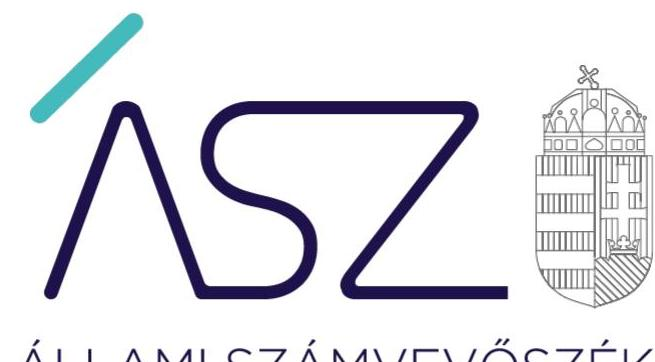
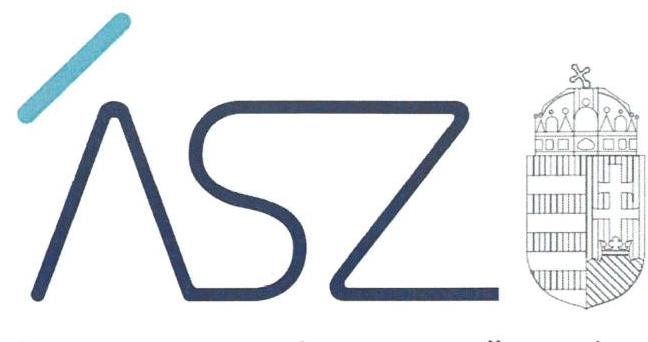
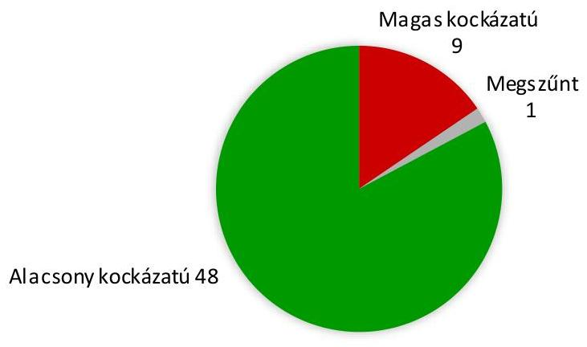
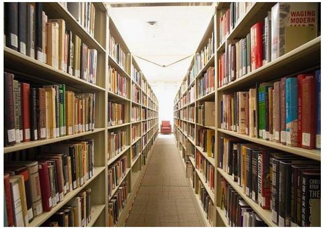

ÁLLAMI SZÁMVEVŐSZÉK

# JELENTÉS 

A nyilvános könyvtári ellátást végzők ellenőrzése
2021.

21037
www.asz.hu

---

ÁLLAMI SZÁMVEVŐSZÉK

# JELENTÉS 

A nyilvános könyvtári ellátást végzők ellenőrzése
2021. 11. hó 11. nap

21037
www.asz.hu

---

# AZ ELLENŐRZÉST FELÜGYELTE: 

VARGA EDIT felügyeleti vezető
D R. NAGY IMRE ellenőrzésvezető

AZ ELLENŐRZÉST VEZETTE ÉS A VÉGREHAJTÁSÁÉRT FELELŐS:
D R. NAGY IMRE ellenőrzésvezető
DÉZSINÉ KIS HAJNALKA ellenőrzésvezető

A PROGRAM ÖSSZEÁLLÍTÁSÁÉRT FELELŐS:
SALAMON ILDIKÓ ellenőrzési program készítéséért felelősvezető

Jelentéseink az Országgyúlés számítógépes hálózatán és az interneten a www.asz.hu címen is olvashatóak.

IKTATÓSZÁM: EL-3170-001/2021.
TÉMASZÁM: 2518
ELLENŐRZÉS-AZONOSÍTÓ SZÁM: V0862

---

# TARTALOMJEGYZÉK 

■ ÖSSZEGZÉS ..... 5
■ AZ ELLENŐRZÉS CÉLJA ..... 7
■ AZ ELLENŐRZÉS TERÜLETE ..... 8
■ AZ ELLENŐRZÉS HÁTTERE, INDOKOLTSÁGA ..... 9
■ A JELENTÉS LÉNYEGES KÉRDÉSKÖREI ..... 10
■ ELLENŐRZÉS HATÓKÖRE ÉS MÓDSZEREI ..... 11
■ ÉRTÉKELÉSEK. ..... 13
■ FÜGGELÉK ..... 15
I. sz. függelék: Az ellenőrzött könyvtárak és kockázati értékelésük ..... 15
■ RÖVIDÍTÉSEK JEGYZÉKE ..... 19

---

.

---

# ÖSSZEGZÉS 

Az ellenőrzött 58 könyvtár közül 48 könyvtár gazdálkodása alacsony kockázatot hordoz. Közülük 4 könyvtár az ellenőrzött időszakban a gazdálkodás lényeges területein eleget tett az alapvető jogszabályi követelményeknek, 44 könyvtárnál az ellenőrzött időszakot követően csökkentek a gazdálkodási kockázatok az Állami Számvevőszék felhívására. 9 könyvtárnál nem intézkedtek a kockázatok csökkentésére, esetükben a törvényes gazdálkodást veszélyeztető kockázatok fennmaradtak. Egy könyvtár az ellenőrzött időszakot követően megszünt.

## Az ellenőrzés társadalmi indokoltsága

A könyvtárak felbecsülhetetlen nemzeti értékeket, az egyetemes kultúrához kapcsolódó dokumentumokat, gyüjteményeket őriznek. A társadalom egésze szempontjából szükséges a könyvtári ellátás fenntartása és fejlesztése. Az állami és önkormányzati fenntartású könyvtárak saját gyűjteményében nyilvántartott kulturális javak a nemzeti vagyon körébe tartoznak. A könyvtárak fenntartására fordított közpénz nagysága, a nyilvános könyvtárak, és a feladatellátó helyek számossága, valamint a könyvtárak által kezelt speciális vagyoni kör, továbbá a témakört érintően azonosított kockázatok is alátámasztják a nyilvános könyvtárak ellenőrzésének szükségességét.

Jelen ellenőrzés 58 könyvtár 2017. és 2018. évi gazdálkodásának lényeges területeire terjedt ki. A gazdálkodás átláthatóságának és a közpénzfelhasználás elszámoltathatóságának alapja a törvény szerinti számviteli beszámoló elkészítése. A beszámoló egyaránt szolgálja a szélesebb értelemben vetttársadalom, a helyi lakosság, az önkormányzat, továbbá a könyvtári szolgáltatást igénybe vevők tájékoztatását az intézmény gazdálkodásáról. A beszámolóhoz elengedhetetlen azoknak a számviteli szabályozásoknak a megalkotása és alkalmazása, amelyek biztosítják a könyvvezetés megbízhatóságát és a beszámoló készítéséhez szükséges adatok rendelkezésre állását. Emellett a könyvtár szabályszerű gazdálkodása és a közfeladatellátás minősége szempontjából kulcsfontosságú a felelős vezetői magatartás és feladatellátás. Lényeges, hogy a könyvtár vezetője kialakítsa és müködtesse azokat a kontrollokat, amelyek hozzájárulnak a könyvtár szabályszerű, eredményes és gazdaságos müködéséhez.

Az ellenőrzés hozzájárulhat a nyilvános könyvtárak ellenőrzésének nagyobb lefedettségéhez, támogatja a közpénzek felhasználásának és a közvagyon használatának szabályszerűségét, célszerűségét.

## Értékelés

AZ ELLENŐRZÖTT IDŐSZAKRA, a 2017-2018. évekre vonatkozóan az Állami Számvevőszék értékelte 58 könyvtár gazdálkodásának azon lényeges területeit, amelyekérdemi kockázatot jelenthetnek az ellenőrzött szervezet közpénzügyi helyzetére. Az ellenőrzött könyvtáraknál ilyen lényeges terület volt egyrészt a gazdálkodás alapvető feltételeinek biztosítása, ezen belül a számviteli szabályozottság és a kontrolltevékenységek kialakítása, másrészt a gazdálkodás átláthatóságának biztosítása.
AZ ELLENŐRZÖTT IDŐSZAKOT KÖVETŐEN a közpénzügyek átláthatóságának, rendezettségének mielőbbi előmozdítása érdekében az Állami Számvevőszék figyelemfelhívó levéllel fordult a könyvtárak vezető felé. Az Állami Számvevőszék a figyelemfelhívással lehetőséget biztosított arra, hogy a könyvtárak vezetői lépéseket tegyenek a feltárt hiányosságok megszüntetésére.

Azoknál a könyvtáraknál, amelyek nem éltek az Állami Számvevőszék által biztosított lehetőséggel és felhívásra sem történtek intézkedések, az Állami Számvevőszék a könyvtár feletti irányítói jogokat gyakorló polgármestert kereste meg, hogy tegyen intézkedéseket a feltárt hiányosságok megszüntetésének és a gazdálkodási kockázatok csökkentésének előmozdítására az érintett könyvtárnál.

Az ellenőrzési tapasztalatok, valamint a számvevőszéki felhívásokra érkezett válaszok értékelése alapján az ellenőrzött könyvtárak az alábbiak szerint sorolhatók be a gazdálkodásra vonatkozó kockázat mértéke alapján.

---

Az ellenőrzött könyvtárak kockázati besorolását az 1. ábra mutatja be.

1. ábra

**ALACSONY A KOCKÁZAT** a gazdálkodás elszámoltathatóságára és átláthatóságára vonatkozóan 48 könyvtárnál.

Közülük négy könyvtárnál (Gonda Ferenc Városi Könyvtár-Kaba, Keresztély Gyula Városi Könyvtár-Bátaszék, Városi Könyvtár-Nyírbátor, Városi Könyvtár-Tiszaföldvár) az ellenőrzött időszakban kialakították a gazdálkodáshoz előírt alapvető számviteli szabályozásokat, kontrolltevékenységeket, továbbá összeállították a leltárral alátámasztott éves költségvetési beszámolójukat az ellenőrzött időszak minden évében. A jogszabályi rendelkezések és a kialakított belső szabályozások betartásához kapcsolódó kockázatokat ezeknek a könyvtáraknak is kezelnie kell.

A 48 könyvtárból 44 könyvtárnál az ellenőrzött időszakot követően csökkentek a gazdálkodási kockázatok az Állami Számvevőszék felhívására. Ezeknél az könyvtáraknál a szabályszerű pénzügyi és vagyongazdálkodás akkor biztosítható, ha a számvevőszéki felhívásra válaszul jelzett intézkedések érvényesülnek a könyvtárak gazdálkodásában, továbbá kezelik a gazdálkodáshoz kapcsolódó jogszabályok és a kialakított belső szabályozások betartásához kapcsolódó kockázatokat.

**MAGAS A KOCKÁZAT** a gazdálkodásának elszámoltathatóságára és átláthatóságára 9 könyvtárnál. Ezeknél a könyvtáraknál az ellenőrzött időszakot követően sem intézkedtek a feltárthiányosságok megszüntetése érdekében, ezért a gazdálkodást érintő kockázatok fennmaradtak. Az ellenőrzés során feltárthiányosságok kockázatot jelentenek a gazdálkodás törvényességére és a közpénz szabályszerű felhasználására. Ezáltal veszélyeztetik a rájuk bízott önkormányzati közfeladat ellátását, és a helyi lakosság könyvtári szolgáltatásokhoz való hozzáférését.

Az ellenőrzött időszakot követően is kockázatos könyvtárakat a 2. ábra mutatja be.

1. ábra

|  Sz. | Ellenőrzött | Helység  |
| --- | --- | --- |
|  1. | Csurgó Városi Könyvtár | Csurgó  |
|  2. | Falu Tamás Városi Könyvtár | Ócsa  |
|  3. | Hegedűs Géza Városi Könyvtár | Szigethalom  |
|  4. | Községi Könyvtár | Somogyszentpál  |
|  5. | Lőrinci Városi Könyvtár és Művelődési Ház (Lőrinci Városi Könyvtár) | Lőrinci  |
|  6. | Németh László Városi Könyvtár és Pósa Lajos Gyermekkönyvtár | Hódmezővásárhely  |
|  7. | Orosháza Városi Önkormányzat Justh Zsigmond Városi Kt. | Orosháza  |
|  8. | Szobi Érdy János Könyvtár és Információs Központ | Szob  |
|  9. | Városi Könyvtár és Információs Központ | Tiszafüred  |

Romhány Község Önkormányzata Integrált Közművelődési Könyvtárának gazdálkodása az ellenőrzött időszakban magas kockázatot hordozott. A könyvtár az ellenőrzött időszakot követően jogutód nélkül megszűnt.

---

# AZ ELLENŐRZÉS CÉLJA 

Az ellenőrzés célja annak értékelése volt, hogy a nyilvános könyvtárak biztosították-e a szabályszerű pénzügyi és vagyongazdálkodás alapvető feltételeit.

---

# **AZ ELLENŐRZÉS TERÜLETE**

## **Nyilvános könyvtárak!**

Az ellenőrzött 58 nyilvános könyvtár önkormányzati fenntartású, ezek irányító szervei a települési vagy megyei önkormányzatok. Az ellenőrzött intézmények mindegyike önálló jogi személy.

Az ellenőrzött intézmények alaptevékenysége a nyilvános könyvtári ellátás biztosítása.

Az ellenőrzött könyvtárak felsorolását az I. számú függelék tartalmazza.

---

# AZ ELLENŐRZÉS HÁTTERE, INDOKOLTSÁGA 

A könyvtárak fenntartására fordított közpénz nagysága, a nyilvános könyvtárak fenntartóinak sokszínűsége, a nyilvános könyvtárak, és a feladatellátó helyek számossága, valamint a könyvtárak által kezelt speciális vagyoni kör, továbbá a témakört érintően azonosított kockázatok alátámasztották a nyilvános könyvtárak ellenőrzésének szükségességét.

Az önkormányzati fenntartású könyvtárak saját gyűjteményében nyilvántartott kulturális javak a nemzeti vagyon köréhez tartoznak, ezért a vagyon értékmegőrzése, gyarapítása, állagának védelme, illetve hasznosítása terén megtett intézkedések kiemelkedő fontosságúak.

A lényeges területekre kiterjedő ellenőrzés hozzájárult - az ellenőrzött szervezetek leterheltségének mérséklése mellett - az ellenőrzés időtartamának csökkentéséhez, vagyis az ellenőrzési hatékonyság növeléséhez, továbbá az ellenőrzött szervezetek számának növeléséhez, ezáltal a nyilvános könyvtárak ellenőrzésének nagyobb lefedettségéhez. A lényeges területekre kiterjedő ellenőrzések előmozdíthatják a közpénzek felhasználásának és a közvagyon használatának célszerűségét és hatékonyságát.

---

# A JELENTÉS LÉNYEGES KÉRDÉSKÖREI 

1- A könyvtárak biztositották-e a gazdálkodás alapvető feltételeit?
2. A könyvtárak gazdálkodása átlátható volt-e?

---

# ELLENŐRZÉS HATÓKÖRE ÉS MÓDSZEREI 

## Az ellenőrzés típusa

Megfelelőségi ellenőrzés.

## Az ellenőrzött időszak

2017-2018. évek

## Az ellenőrzés tárgya

A nyilvános könyvtárak vonatkozásában a gazdálkodás átláthatóságának ellenőrzése, továbbá annak értékelése, hogy biztosították-e a gazdálkodás szabályozottságát és a kontrolltevékenységek kialakítását.

## Az ellenőrzött szervezetek

58 könyvtár az I. számú függelék szerint.

## Az ellenőrzés jogalapja

Az ÁSZ tv. ${ }^{2}$ 1. § (3) bekezdése, az 5. § (2)-(3) bekezdései, a (4) bekezdés a) pontja, továbbá a (6) bekezdése.

## Az ellenőrzés módszerei

Az ellenőrzést az ellenőrzött időszakban hatályos jogszabályok, az ellenőrzés szakmai szabályai, a jelen ellenőrzésre irányadó ÁSZ³ módszertanok, az ellenőrzési programban foglalt értékelési szempontok szerint hajtotta végre az ÁSZ. Az ellenőrzést az ÁSZ a program kérdéseire adott válaszok kiértékelésével, valamint a programban ismertetett adatforrások, továbbá az adott időszakban hatályos jogszabályok figyelembevételével folytatta le.

A kockázatértékelésen alapuló, új megközelítésű ellenőrzés során azokat a lényeges területeket értékeli az ÁSZ, amelyek érdemi kockázatot jelenthetnek az ellenőrzött szervezet közpénzügyi helyzetére. Jelen ellenőrzés a pénzügyi és vagyongazdálkodás lényeges területeire terjedt ki, és súlypontok meghatározásával lehetőséget biztosított a kockázatok beazonosítására.

A kockázatokat két lényeges kérdéskörön belül három kockázatiterület alapján értékelte az ÁSZ:

---

1. A gazdálkodás alapvető feltételeinek biztosításának ellenőrzése

- a gazdálkodás számviteli szabályozottsága
- a kontrolltevékenységek kialakítása
2. A gazdálkodás átláthatóságának ellenőrzése.

Az ellenőrzés során 9 lényeges dokumentum értékelését végezte el az ÁSZ, olyan kiválasztott kritériumok alapján, amelyek bármelyikének az ellenőrzött múltbeli időszakra vonatkozóan megállapított hiánya kockázatot jelent az ellenőrzött szervezet közpénzekkel való szabályszerű gazdálkodására. A fentiekre tekintettel az ÁSZ nem a lényeges területek és azokat alátámasztó 9 dokumentum szabályszerűségére tesz megállapítást, hanem az ellenőrzött szervezetre vonatkozó működési és gazdálkodási kockázatokat azonosítja.

Az ellenőrzés ideje alatt az ellenőrzött szervezettel történő kapcsolattartás az ÁSZ szervezeti és működési szabályzatának vonatkozó előírásai alapján volt biztosított.

A könyvtárak vezetői számára figyelemfelhívó levél került megküldésre a 2018. évre vonatkozó szabálytalanságokról, az ÁSZ tv. előírásával összhangban 15 nap állt rendelkezésükre az ebben foglaltak elbírálására, valamint a megfelelő intézkedések meghozatalára.

Az ellenőrzött könyvtárak vezetői által a figyelemfelhívó levélre adott válaszok alapján az ÁSZ értékelte a 2018. évre vonatkozóan feltárt hiányosságok intézményvezetői kezelését. Amennyiben az ellenőrzött intézmények vezetői intézkedéseket fogalmaztak meg a hiányosság megszüntetése érdekében, az ÁSZ a gazdálkodás lényeges területein korábban fennálló kockázatokról megállapította, hogy azokat csökkentették.

---

# 1. A könyvtárak biztosították-e a gazdálkodás alapvető feltételeit? 

Összegző értékelés Az ellenőrzött 58 könyvtár közül 2017. évben 45, 2018. évben 44 könyvtárnál tárt fel lényeges hiányosságot az ellenőrzés a gazdálkodás alapvető feltételeinek kialakítása területén.

A SZÁMVITELI SZABÁLYOZOTTSÁG az ellenőrzött könyvtárak többségénél magas kockázatot hordoz, mert 2017-ben 44, 2018-ban 43 könyvtár nem alakította ki az alapvető számviteli szabályozását. Ezek a szabályzatok szükségesek a költségvetési beszámolókban szereplő pénzügyi, vagyoni helyzetre, azok alakulására vonatkozó objektív információk biztosításához, annak érdekében, hogy a költségvetési szervek a nyilvánosság előtt el tudjanak számolni a közpénzekkel való gazdálkodásukkal. A számviteli szabályzatok hiánya kockázatot jelent a közpénz szabályszerű, átlátható és elszámoltatható felhasználására. Az alapvető számviteli szabályozását 2017-ben 14, 2018-ban 15 könyvtár kialakította.

A KONTROLLTEVÉKENYSÉGEK KIALAKÍTÁSA azellenőrzött könyvtárak többségénél magas kockázatot hordoz, mert 2017ben 40, 2018-ban 39 könyvtár nem alakította ki a gazdálkodási jogkörök gyakorlásához szükséges alapvető szabályozását. Az előírt belső szabályozás hiányában a könyvtár nem biztosította a jogszabályban előírt naprakész nyilvántartás vezetésének szabályozási feltételeit sem. A szabályozás és a nyilvántartás hiánya kockázatot jelent a források cél szerinti, elszámoltatható felhasználására. A gazdálkodási jogkörök gyakorlásához szükséges alapvető szabályozását 2017-ben 18, 2018-ban 19 könyvtár kialakította.

MEGHATÁROZÓ SZABÁLYTALANSÁG volt az ellenőrzött könyvtárak döntő többségénél, hogy nem a könyvtár vezetője, hanem a gazdálkodási feladatokat ellátó önkormányzati hivatal, vagy az erre kijelölt más szervezet vezetője alakította ki a könyvtár gazdálkodásához kapcsolódó számviteli vagy gazdálkodási szabályozásokat és rendelte el azok alkalmazását.

A jogszabályi előírások szerint az éves költségvetési beszámoló valódiságának és megbízhatóságának szabályozási feltételeit biztosító számviteli szabályzatokat a beszámolót készítő szerv vezetőjének kell kiadnia. A beszámolót készítő szerv vezetője ezzel rendeli el felelős vezetőként azoknak a szabályoknak az alkalmazását, amelyek a jogszabályi előírások betartásához, a beszámoló alátámasztásához és elkészítéséhez szükségesek. Emellett a jogszabályi előírások szerint a költségvetési szerv vezetőjének kell belső szabályzatban rendeznie a költségvetési szerv előirányzatait terhelő pénzügyi kihatással bíró, jogszabályban nem szabályozott kérdéseket.

Az érintett könyvtáraknál a számviteli szabályozottság és a kontrolltevékenységek kialakítása területén feltárt szabálytalanságok miatt nem érvényesült a felelős gazdálkodás elve és a könyvtár vezetőjének elszámoltathatósága. A gazdálkodási feltételek kialakítása nem volt összhangban az önkormányzati képviselőtestületnek azzal a döntésével sem, hogy közfeladat ellátására önálló jogi személyt, költségvetési szervet hoz létre.

---

# 2. A könyvtárak gazdálkodása átlátható volt-e? 

## Összegző értékelés

Az ellenőrzött 58 könyvtár közül 2017. évben 44, 2018. évben 46 könyvtár gazdálkodásának átláthatósága területén tárt fel hiányosságot az ellenőrzés.

ÉVES KÖLTSÉGVETÉSI BESZÁMOLÓVAL 2017. és 2018. évben 27-27 könyvtár nem rendelkezett. A beszámoló hiánya kockázatot jelent a nemzeti vagyon védelmére, az ellenőrzött gazdálkodásának átláthatóságára. 2017-ben és 2018-ban 31-31 könyvtár rendelkezett éves költségvetési beszámolóval.

LELTÁRRAL NEM TÁMASZTOTTA ALÁ az éves költségvetési beszámoló mérlegtételeit 2017. évben 21 könyvtár, a 2018. évben 23 könyvtár. Ennek hiánya kockázatot jelent a könyvtárak éves költségvetési beszámolójának megalapozottságára, a nemzeti vagyon védelmére. 2017-ben 37, 2018-ban 35 könyvtár a beszámoló mérlegtételeit leltárral alátámasztotta.

A KÖNYVTÁR BELSŐ KONTROLLRENDSZERE minőségének értékeléséről szóló nyilatkozatát a könyvtár vezetője 2017. évben 23 könyvtár, a 2018. évben 21 könyvtár esetében nem készítette el. Az értékelés hiánya kockázatot jelent a felelős vezetői feladatellátás megvalósítására. 2017-ben 35, 2018-ban 37 könyvtár esetében a vezető elkészítette a jogszabályban előírt nyilatkozatot.

Az ellenőrzés során feltárt lényeges hiányosságokat az alábbi, 1. táblázat mutatja be a 2018. év értékelése alapján.

1. táblázat

| 6.2. | Ellenőrzés lényeges területre | Hiányosság | Erintett könyvtárak száma |
| :--: | :--: | :--: | :--: |
| 1. | Számviteli szabályozottság | Nem rendelkezett számviteli politikával | 42 |
| 2. |  | Nem rendelkezett eszközök és források leltárkészítési és leltározási szabályzatával | 40 |
| 3. |  | Nem rendelkezett az eszközök és források értékelési szabályzatával | 42 |
| 4. |  | Nem rendelkezett pénzkezelési szabályzattal | 40 |
| 5. | Kontroll tevékenységek kialakítása | Nem rendelkezett a gazdálkodási jogkörgyakorlás szabályozásával | 38 |
| 6. |  | Nem vezették a gazdálkodási jogkörgyakorlókra előírt jogszabály szerinti nyilvántartást | 39 |
| 7. | Gazdálkodás átláthatósága | Nem rendelkezett éves költségvetési beszámolóval | 27 |
| 8. |  | Nem állították össze a mérleg tételeinek alátámasztásához a leltárt | 23 |
| 9. |  | Nem értékelték vezető nyilatkozatban a belső kontrollrendszer minőségét | 21 |

---

# FÜGGELÉK

I. SZ. FÜGGELÉK: AZ ELLENŐRZÖTT KÖNYVTÁRAK ÉS KOCKÁZATI ÉRTÉKELÉSÜK

|  Ssz. | A könyvtár megnevezése | A gazdálkodás számviteli szabályozottságának kockázati értékelése 2018. évre | A kontroltevékenységek kialakításának kockázati értékelése 2018. évre | A gazdálkodás átláthatóságának kockázati értékelése 2018. évre | Összesített kockázati besorolás 2018. évre | Kockázati besorolás az ellenőrzött időszakot követően tett intézkedések hatására  |
| --- | --- | --- | --- | --- | --- | --- |
|  1. | Gonda Ferenc Városi Könyvtár (Kaba) | Alacsony | Alacsony | Alacsony | Alacsony | Alacsony  |
|  2. | Keresztély Gyula Városi Könyvtár (Bátaszék) | Alacsony | Alacsony | Alacsony | Alacsony | Alacsony  |
|  3. | Városi Könyvtár Nyirbátor | Alacsony | Alacsony | Alacsony | Alacsony | Alacsony  |
|  4. | Városi Könyvtár Tiszaföldvár | Alacsony | Alacsony | Alacsony | Alacsony | Alacsony  |
|  5. | Berzsenyi Dániel Városi Könyvtár (Marcali) | Alacsony | Alacsony | Magas | Közepes | Alacsony  |
|  6. | Falu Tamás Városi Könyvtár (Ócsa) | Alacsony | Alacsony | Magas | Közepes | Magas  |
|  7. | Fejér György Városi Könyvtár (Keszthely) | Alacsony | Magas | Alacsony | Közepes | Alacsony  |
|  8. | Gróf Bercsényi Zsuzsanna Városi Könyvtár (Budaörs) | Magas | Alacsony | Alacsony | Közepes | Alacsony  |
|  9. | Községi Közkönyvtár Tőszeg | Alacsony | Alacsony | Magas | Közepes | Alacsony  |
|  10. | Nagy Gáspár Városi Könyvtár (Budakeszi) | Alacsony | Alacsony | Magas | Közepes | Alacsony  |
|  11. | Németh László Községi Könyvtár (Mezőszilas) | Alacsony | Alacsony | Magas | Közepes | Alacsony  |
|  12. | Paksi Pákolitz István Városi Könyvtár | Alacsony | Alacsony | Magas | Közepes | Alacsony  |
|  13. | Ratkó József Városi Könyvtár (Nagykálló) | Alacsony | Alacsony | Magas | Közepes | Alacsony  |
|  14. | Sátoraljaújhelyi Városi Könyvtár | Alacsony | Alacsony | Magas | Közepes | Alacsony  |
|  15. | Solymár Imre Városi Könyvtár (Bonyhád) | Alacsony | Alacsony | Magas | Közepes | Alacsony  |
|  16. | Városi Könyvtár (Kenderes) | Alacsony | Alacsony | Magas | Közepes | Alacsony  |
|  17. | Anóka Eszter Városi Könyvtár (Nagyhalász) | Magas | Magas | Magas | Magas | Alacsony  |
|  18. | Balatonboglári Lukács Károly Városi Könyvtár | Magas | Magas | Magas | Magas | Alacsony  |
|  19. | Barcsi Városi Könyvtár | Magas | Magas | Magas | Magas | Alacsony  |
|  20. | Berzsenyi Dániel Megyei Hatókörü Városi Könyvtár (Szombathely) | Magas | Magas | Magas | Magas | Alacsony  |
|  21. | Biatorbágyi Karlkó János Könyvtár | Magas | Magas | Magas | Magas | Alacsony  |
|  22. | Bokor József Városi Könyvtár (Kadarkút) | Magas | Magas | Magas | Magas | Alacsony  |
|  23. | Chernel Kálmán Városi Könyvtár (Köszeg) | Magas | Magas | Magas | Magas | Alacsony  |
|  24. | Csanádpalotai Városi Könyvtár | Magas | Magas | Alacsony | Magas | Alacsony  |
|  25. | Csuka Zoltán Városi Könyvtár (Érd) | Magas | Magas | Magas | Magas | Alacsony  |

---

|  Ssz. | A könyvtár megnevezése | A gazdálkodás számviteli szabályozottságának kockázati értékelése 2018. évre | A kontrolltevékenységek kialakításának kockázati értékelése 2018. évre | A gazdálkodás átláthatóságának kockázati értékelése 2018. évre | Összesített kockázati besorolás 2018. évre | Kockázati besorolás az ellenőrzött időszakot követően tett intézkedések hatására  |
| --- | --- | --- | --- | --- | --- | --- |
|  26. | Csurgó Városi Könyvtár | Magas | Magas | Magas | Magas | Magas  |
|  27. | Deák Ferenc Megyei és Városi Könyvtár (Zalaegerszeg) | Magas | Alacsony | Magas | Magas | Alacsony  |
|  28. | Dunaharaszti Városi Könyvtár | Magas | Magas | Magas | Magas | Alacsony  |
|  29. | Egressy Béni Városi Könyvtár (Kazincbarcika) | Magas | Magas | Magas | Magas | Alacsony  |
|  30. | Földes Községi Könyvtár | Magas | Magas | Magas | Magas | Alacsony  |
|  31. | Göd Városi Könyvtár | Magas | Magas | Magas | Magas | Alacsony  |
|  32. | Hamvas Béla Pest Megyei Könyvtár (Szentendre) | Magas | Magas | Alacsony | Magas | Alacsony  |
|  33. | Határ Győző Városi Könyvtár (Gyomaendrőd) | Magas | Magas | Alacsony | Magas | Alacsony  |
|  34. | Hegedüs Géza Városi Könyvtár (Szigethalom) | Magas | Magas | Magas | Magas | Magas  |
|  35. | József Attila Könyvtár Dunaújváros | Magas | Magas | Magas | Magas | Alacsony  |
|  36. | Kartal Nagyközségi Könyvtár | Magas | Magas | Magas | Magas | Alacsony  |
|  37. | Képes Géza Városi Könyvtár (Mátészalka) | Magas | Magas | Alacsony | Magas | Alacsony  |
|  38. | Kertész László Városi Könyvtár (Hajdúbőszörmény) | Magas | Magas | Magas | Magas | Alacsony  |
|  39. | Községi Könyvtár (Somogyszentpál) | Magas | Magas | Magas | Magas | Magas  |
|  40. | Lengyel Menyhért Városi Könyvtár (Balmazújváros) | Magas | Magas | Alacsony | Magas | Alacsony  |
|  41. | Ligetalja Könyvtár Nyíracsád | Magas | Magas | Magas | Magas | Alacsony  |
|  42. | Lőninci Városi Könyvtár | Magas | Magas | Magas | Magas | Magas  |
|  43. | Madarász József Városi Könyvtár (Sárbogárd) | Magas | Magas | Alacsony | Magas | Alacsony  |
|  44. | Mezőkovácsházi Városi Könyvtár | Magas | Magas | Magas | Magas | Alacsony  |
|  45. | Mezőtúri Móricz Zsigmond Városi Könyvtár | Magas | Magas | Magas | Magas | Alacsony  |
|  46. | Mogyoróssy János Városi Könyvtár (Gyula) | Magas | Magas | Magas | Magas | Alacsony  |
|  47. | Németh László Városi Könyvtár és Pósa Lajos Gyermekkönyvtár (Hódmezővásárhely) | Magas | Alacsony | Magas | Magas | Magas  |
|  48. | Öbudai Platán Könyvtár | Magas | Magas | Magas | Magas | Alacsony  |
|  49. | Orosháza Városi Önkormányzat Justh Zsigmond Városi Könyvtára | Magas | Magas | Alacsony | Magas | Magas  |
|  50. | Romhány Község Önkormányzata Integrált Közművelődési Könyvtára | Magas | Magas | Magas | Magas | Magas (megszűrő)  |
|  51. | Sinka István Községi Könyvtár (Csömör) | Magas | Magas | Magas | Magas | Alacsony  |

---

| Ssz. | A könyvtár megnevezése | A gazdálkodás   számviteli szabályo-   zottságának kocká-   zati értékelése   2018. évre | A kontrolltevékeny-   ségek kialakításának   kockázati értékelése   2018. évre | A gazdálkodás át-   láthatóságának   kockázati értéke-   lése 2018. évre | Összesített kocká-   zati besorolás   2018. évre | Kockázati besorolás az el-   lenőrzött időszakot köve-   tően tett intézkedések   hatására |
| :--: | :--: | :--: | :--: | :--: | :--: | :--: |
| 52. | Szabó Magda Városi Könyvtár   (Kerepes) | Magas | Magas | Magas | Magas | Alacsony |
| 53. | Szobi Érdy János Könyvtár és In-   formációs Központ | Magas | Magas | Magas | Magas | Magas |
| 54. | Tahy Olga Városi Könyvtár (Me-   zőkeresztes) | Magas | Alacsony | Magas | Magas | Alacsony |
| 55. | Takáts Gyula Megyei és Városi   Könyvtár (Kaposvár) | Magas | Magas | Magas | Magas | Alacsony |
| 56. | Tolna Megyei Illyés Gyula   Könyvtár (Szekszárd) | Magas | Alacsony | Magas | Magas | Alacsony |
| 57. | Várday István Városi Könyvtár   (Kivárda) | Magas | Magas | Magas | Magas | Alacsony |
| 58. | Városi Könyvtár és Információs   Központ (Tiszafüred) | Magas | Magas | Magas | Magas | Magas |

---

.

---

# RÖVIDÍTÉSEKJEGYZÉKE 

${ }^{1}$ Nyilvános könyvtárak
${ }^{2}$ Ász tv.
${ }^{3}$ ÁSZ

A muzeális intézményekről, a nyilvános könyvtári ellátásról és a közművelődésről szóló 1997. évi CXL törvényben meghatározott könyvtári dokumentumok rendszeres gyűjtését, feltárását, megőrzését és használatát biztosító szervezet.
2011. évi LXVI. törvény az Állami Számvevőszékről (hatályos 2011. július 1-jétől) Állami Számvevőszék

---

# ASZ 

ALLAMI SZAMVEVOSZEK
1052 Budapest, Apáczai Cs. J. u. 10. | 1364 Budapest 4. Pf. 54
TEL: +36 14849100
email: szamvevoszek@asz.hu
web: www.asz.hu | www.aszhirportal.hu