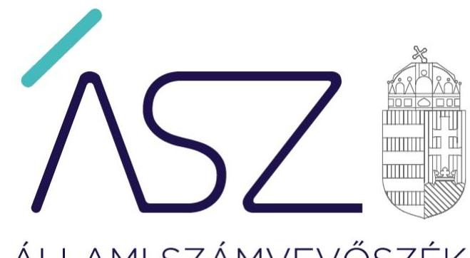
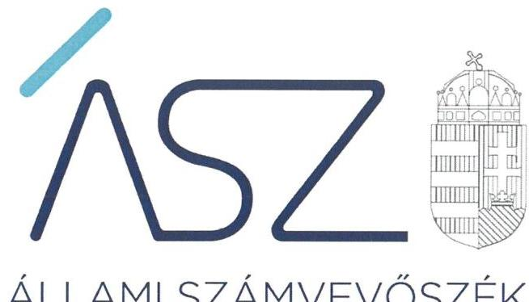
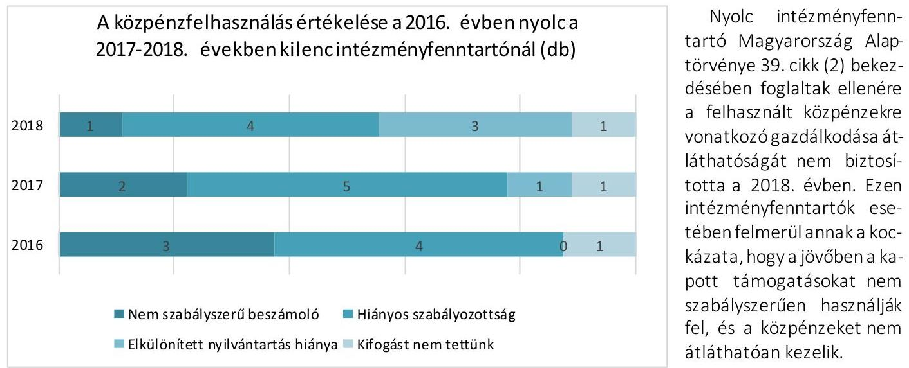

ÁLLAMI SZÁMVEVŐSZÉK

# JELENTÉS 

## Nem állami humánszolgáltatók ellenőrzése

A köznevelési és szociális humánszolgáltatást nyújtó intézmények, szolgáltatók államháztartáson kívüli fenntartói központi költségvetésből kapott támogatásai felhasználásának ellenőrzése - kilenc gazdasági társaságnál
2021.

21038
www.asz.hu

---

ÁLLAMI SZÁMVEVŐSZÉK

# JELENTÉS 

## Nem állami humánszolgáltatók ellenőrzése

A köznevelési és szociális humánszolgáltatást nyújtó intézmények, szolgáltatók államháztartáson kívüli fenntartói központi költségvetésből kapott támogatásai felhasználásának ellenőrzése - kilenc gazdasági társaságnál
2021. 04. hó 27. nap

21038
www.asz.hu

---

# AZ ELLENŐRZÉST FELÜGYELTE: 

KLINGA LÁSZLÓ felügyeleti vezető

## AZ ELLENŐRZÉST VEZETTE ÉS A VÉGREHAJTÁSÁÉRT FELELŐS:

KISTÓTH KRISZTINA ellenőrzésvezető

A PROGRAM ÖSSZEÁLLÍTÁSÁÉRT FELELŐS:
FE KETE-NAGY ANDRÁS GÁBOR projekt vezető

IKTATÓSZÁM: EL-3188-001/2021
TÉMASZÁM: 2523
ELLENŐRZÉS-AZONOSÍTÓ SZÁM: V-0867235
Jelentéseink az Országgyúlés számitógépes hálózatán és az interneten a www.asz.hu címen is olvashatóak.

---

# TARTALOMJEGYZÉK 

- ÖSSZEGZÉS ..... 5
- AZ ELLENŐRZÉS CÉLJA ..... 7
- AZ ELLENŐRZÉS TERÜLETE ..... 8
- AZ ELLENŐRZÉS HÁTTERE, INDOKOLTSÁGA ..... 10
- AZ ELLENŐRZÉS LÉNYEGES KÉRDÉSKÖREI. ..... 11
- AZ ELLENŐRZÉS HATÓKÖRE ÉS MÓDSZEREI. ..... 12
- MEGÁLLAPÍTÁSOK ..... 14
- MELLÉKLETEK. ..... 19
I. sz. melléklet: Az ellenőrzött szervezetek felsorolása ..... 19
II. sz. melléklet: Értelmező szótár ..... 20
- FÜGGELÉK: ÉSZREVÉTELEK ..... 21
- RÖVIDÍTÉSEK JEGYZÉKE ..... 25

---

.

---

# ÖSSZEGZÉS 

Az ellenőrzött nyolc köznevelési és egy köznevelési és szociális humánszolgáltatást nyújtó államháztartáson kívüli intézményfenntartóközül egy intézményfenntartó biztosította a köznevelési humánszolgáltatási közfeladatok ellátására kapott költségvetési támogatások felhasználásának átláthatóságát. Három intézményfenntartó nem biztosította a költségvetési támogatásokkal való elszámolás ellenőrizhetősége feltételeit, míg öt intézményfenntartó nem biztositotta a költségvetési támogatások elszámoltathatóságát. Az ÁSZ kezdeményezésére az ellenőrzött időszakot követően, a 2019. évre hét intézményfenntartónál a közpénzel való elszámoltathatóság javult.

## Az ellenőrzés társadalmi indokoltsága

A köznevelés feladatok, valamint a szociális gondoskodást igénylők védelme és a kapcsolódó feladatok ellátása az Alaptörvényben meghatározott, a társadalom szempontjából fontos tevékenység. Jogszabályok teszik lehetővé, hogy államháztartáson kívüli szervezetek-így például az egyházi fenntartók, alapítványok, gazdasági társaságok, egyesületek - által fenntartott intézmények is végezzenek köznevelési, szociális feladatokat. Mindehhez a központi költségvetés évente jelentős összegű támogatással járul hozzá. Az államháztartáson kívüli, humánszolgáltatást végző intézmények az igényelt közpénzekből társadalmilag hasznos, közösségteremtő, közérdekű, illetve közhasznú tevékenységet végeznek, illetve közfeladatokat látnak el.

Az intézményfenntartók ellenőrzésével az Állami Számvevőszék hozzájárul ahhoz, hogy ezen közpénzeket az államháztartáson kívüli szervezetek is ellenőrizhető, átlátható és elszámoltatható módon használják fel a közfeladatok ellátása során. Az ellenőrzések célja továbbá, hogy a nyilvánosság és az igénybevevők megfelelő tájékoztatást kapjanak az államháztartáson kívüli közfeladatot ellátók múködéséről. Az Állami Számvevőszék ellenőrzései arra adnak választ, hogy az intézményfenntartók arra használták-e fel a közpénzeket, a mire igényelték. A szabályszerű gazdálkodás elengedhetetlen a közfeladat ellátás szakmai céljainak megvalósításához, valamint a társadalmi közbizalom fenntartásához.

## Főbb megállapítások, következtetések

Számviteli szabályozás kialakítása

Számviteli keretek nélkül a közpénzfelhasználás nem elszámoltatható.

Számviteli politika és annak keretében készítendő szabályzatok, valamint a számlarend hiányában a költségvetési támogatások elszámolási kereteit nem alakították ki.

## Beszámolási kötelezettség teljesítése

Számviteli beszámolók hiányában a közpénzfelhasználás nem elszámoltatható.

A számviteli beszámoló hiányában a költségvetési támogatás felhasználása nem volt átlátható.

## Közpénzfelhasználás elkülönített nyilvántartása

Elkülönített nyilvántartás nélkül a közpénzfelhasználásának ellenőrizhetősége nem biztosított, ezáltal nem elszámoltatható.

Elkülönített nyilvántartás hiányában az intézményfenntartó nem tudtajazolni a költségvetési támogatás cél szerinti felhasználását.

---

Egy intézményfenntartó esetén lényeges hibát nem tárt fel az ÁSZ a 2018. évi költségvetési támogatások átláthatósága és elszámoltathatósága terén.

Az ÁSZ kezdeményezte nyolc intézményfenntartónál, hogy az ellenőrzött időszakot követő 2019. évre vonatkozóan bemutassák a közpénzekkel való elszámolás feltételeinek meglétét, hozzájárulva ezzel a költségvetési támogatások felhasználásának elszámoltathatóságához.

Az ellenőrzött időszakot követő 2019. évre vonatkozó, az ÁSZ kezdeményezésére bemutatott dokumentumok alapján négy intézményfenntartónál a költségvetési támogatások felhasználásának és az elszámoltathatóságnak a feltételei több területen, így a számviteli szabályozottság, a számviteli beszámoló készítése, illetve a költségvetési támogatások feladatonkénti elkülönítése terén lényegesen jobb helyzetet mutatnak, mint az ellenőrzött időszakban. Három intézményfenntartónál a költségvetési támogatások felhasználásának és az elszámoltathatóságnak a feltételei egy esetben a számviteli szabályozottság, egy esetben a számviteli beszámoló készítése, egy esetben a költségvetési támogatások feladatonkénti elkülönítése terén jobb helyzetet mutatott 2019-ben.

Egy intézményfenntartónál az ÁSZ kezdeményezése ellenére az ellenőrzött időszakot követően a költségvetési támogatások felhasználásának és az elszámoltathatóságnak a feltételei nem javultak 2019-ben. Emiatt változatlanul fennáll annak kockázata, hogy a közpénzeket nem átláthatóan és elszámoltathatóan kezeli. Ezért az ÁSZ a KONTIKISZAKKÉPZŐ Szakképzés Szervezési Nonprofit Kiemelkedően Közhasznú Zártkörűen Működő Részvénytársaság tekintetében az államháztartás alrendszeréből nyújtott, az intézményfenntartót megillető támogatások folyósításának felfüggesztését kezdeményezte.

---

# AZ ELLENŐRZÉS CÉLJA 

AZ ELLENŐRZÉS CÉLJA annak értékelése volt, hogy a nem állami, nem önkormányzati köznevelési és szociális intézményi fenntartó központi költségvetésből kapott támogatásainak felhasználása szabályszerű volt-e.

---

# AZ ELLENŐRZÉS TERÜLETE 

## Köznevelési, valamint köznevelési és szociális (főfeladatként köznevelési) humánszolgáltatási közfeladatokat ellátó államháztartáson kívüli fenntartók

A köznevelési feladatok ellátása jellemzően intézményi formában történik. Köznevelési intézményt, ha a tevékenység folytatásának jogát - jogszabályban foglaltak szerint - megszerezte, az Nkt. ${ }^{1}$ szerint más személy vagy szervezet (például civil szervezet, alapítvány, gazdasági társaság) alapíthat és tarthat fenn.

Nem állami szociális és gyermekvédelmi intézményfenntartó pedig a Szoc. tv. ${ }^{2}$ és a Gyvt. ${ }^{3}$ szerint a helyi önkormányzat mellett az egyházi jogi személy, az egyéni vállalkozó és a magyarországi székhelyú jogi személy lehet.

A köznevelési és szociális szolgáltatást biztosító nem állami fenntartó a mindenkori költségvetési törvényben ${ }^{4}$ biztosított támogatásra jogosult. Az Áht. ${ }^{5}$, Ávr. ${ }^{6}$, Nkt. vhr. ${ }^{7}$ előírásai szerint a Kincstár ${ }^{8}$ a megítélt támogatásokat a fenntartó részére folyósítja.

Az államháztartáson kívüli nyolc köznevelési, valamint egy köznevelési és szociális támogatásban részesült fenntartó központi költségvetésből kapott támogatásai felhasználását ellenőriztük. Az összesen kilenc gazdálkodó szervezetből hét társasági formája korlátolt felelősségű társaság, míg kettő társaság zártkörűen múködő részvénytársaság volt.
$\longrightarrow$ A budapesti székhelyű BÓBITAOVIBÖLCSI Nonprofit Korlátolt Felelősségű Társaság a 2016-2018. években egy nem önállóan gazdálkodó gyermekvédelmi és egy önálló jogi személyiséggel rendelkező köznevelési Intézményt ${ }_{1}{ }^{9}$ tartott fenn. A gyermekvédelmi intézmény családi napközi majd a 2017. évtől családi bölcsődei ellátást, a köznevelési intézmény óvodai nevelési feladatot végzett.
$\longrightarrow$ A pécsi székhelyű Gandhi Gimnázium Közhasznú Nonprofit Korlátolt Felelősségű Társaság a 2016-2018. években egy önálló jogi személyiséggel rendelkező köznevelési Intézményt ${ }_{2}{ }^{10}$ tartott fenn. Az Intézmény ${ }_{2}$ négy köznevelési alapfeladatot, gimnáziumi-oktatást, gimnáziumi nemzetiségi nevelés-oktatást, alapfokú művészetoktatást és kollégiumi nevelés-oktatást végzett.
$\longrightarrow$ A győri székhelyű Hangfestő Oktató és Szolgáltató Nonprofit Korlátolt Felelősségű Társaság a 2016-2018. években egy önálló jogi személyiséggel rendelkező köznevelési Intézményt ${ }_{3}{ }^{11}$ tartott fenn. Az Intézmény ${ }_{3}$ egy köznevelési alapfeladatot, alapfokú művészetoktatást végzett.
$\longrightarrow$ A dunakeszi székhelyű Kincsem Sziget Közhasznú Nonprofit Korlátolt Felelősségű Társaság a 2016-2018. években egy önálló jogi személyiséggel rendelkező köznevelési Intézményt ${ }_{4}{ }^{12}$ tartott fenn. Az Intézmény kettő köznevelési alapfeladatot, óvodai nevelést és a többi

---

gyermekkel együtt nevelhető sajátos nevelési igényű gyermekek óvodai nevelését látta el.

- A budapesti székhelyű KONTIKI-SZAKKÉPZŐ Szakképzés Szervezési Nonprofit Kiemelkedően Közhasznú Zártkörűen Működő Részvénytársaság a 2016-2018. években kettő önálló jogi személyiséggel rendelkező köznevelési Intézményt ${ }^{13}$ tartott fenn. Intézményeiben ${ }_{5}$ három köznevelési alapfeladatot, szakközépiskolai nevelés-oktatást, szakgimnáziumi nevelés-oktatást és gyógypedagógiai, konduktív pedagógiai nevelési, oktatási, intézményi ellátást végzett.
- A zalaegerszegi székhelyű LARTIS Környezetvédelmi és Művészeti Nonprofit Korlátolt Felelősségű Társaság a 2016-2018. években kettő önálló jogi személyiséggel rendelkező köznevelési Intézményt ${ }^{14}$ tartott fenn. Az Intézmények ${ }_{6}$ egy köznevelési alapfeladatot, alapfokú művészetoktatást láttak el.
- A budapesti székhelyű Nemzeti Artista- Előadó- és Cirkuszművészeti Központ Nonprofit Korlátolt Felelősségű Társaság (2019. május 31ig MACIVA Magyar Cirkusz és Varieté Nonprofit Korlátolt Felelősségű Társaság) a 2016-2018. években egy önálló jogi személyiséggel rendelkező köznevelési Intézményt ${ }^{15}$ tartott fenn. Az Intézmény ${ }_{7}$ kettő köznevelési alapfeladatot, gimnáziumi és szakgimnáziumi ne-velést-oktatást végzett.
- A mezőhegyesi székhelyű Nemzeti Ménesbirtok és Tangazdaság Zártkörűen Működő Részvénytársaság 2017. augusztus 15-étől egy önálló jogi személyiséggel rendelkező köznevelési Intézményt ${ }^{16}$ tartott fenn. Az Intézmény ${ }_{8}$ három köznevelési alapfeladatot, szakgimnáziumi, szakközépiskolai nevelés-oktatást, valamint kollégiumi ellátást nyújtott. A Fenntartó ${ }^{17}$ 2016. év vonatkozásában nem volt ellenőrzött szervezet, mert 2016. évre köznevelési közfeladat ellátásra az államháztartásból támogatásban nem részesült.
- A nyíregyházi székhelyű NYÍR-ART Nonprofit Közhasznú Korlátolt Felelősségű Társaság a 2016-2018. években egy önálló jogi személyiséggel rendelkező köznevelési Intézményt ${ }^{18}$ tartott fenn. Az Intézményben ${ }_{8}$ egy köznevelési alapfeladatot, alapfokú művészetoktatást végzett.
A humánszolgáltatást nyújtó államháztartáson kívüli fenntartók az 1. táblázatban bemutatott mértékű költségvetési támogatásban részesültek az ellenőrzött időszakban a Kincstár adatai alapján.

1. táblázat

|  A FELADAT ELLÁTÁSÁRA KAPOTT KÖLTSÉGVETÉSI TÁMOGATÁS (millió forintban) |  |  |  |   |
| --- | --- | --- | --- | --- |
|  Ellenőrzött szervezet |  | 2016. | 2017. | 2018.  |
|  1. BÓBITAOVIBÓLCSI Nonprofit Kft. |  | 54,1 | 75,0 | 85,7  |
|  2. Gandhi Gimnázium Közhasznú Nonprofit Kft. |  | 157,0 | 165,8 | 180,1  |
|  3. Hangfestő Oktató és Szolgáltató Nonprofit Kft. |  | 57,9 | 63,2 | 64,5  |
|  4. Kincsem Sziget Közhasznú Nonprofit Kft. |  | 44,8 | 58,0 | 74,2  |
|  5. KONTIKI-SZAKKÉPZŐ Szakképzés Szervezési Nonprofit Kiemelkedően Közhasznú Zrt. |  | 260,8 | 171,1 | 228,7  |
|  6. LARTIS Környezetvédelmi és Múvészeti Nonprofit Kft. |  | 69,8 | 79,9 | 80,7  |
|  7. Nemzeti Artista- Előadó- és Cirkuszművészeti Központ Nonprofit Kft. |  | 68,2 | 164,1 | 221,6  |
|  8. Magyar Ménesbirtok és Tangazdaság Zrt. |  | - | 14,6 | 133,1  |
|  9. NYÍR-ART Nonprofit Közhasznú Kft. |  | 71,5 | 77,8 | 74,0  |

---

# AZ ELLENŐRZÉS HÁTTERE, INDOKOLTSÁGA 

A köznevelési és szociális feladatokat ellátó nem állami intézményfenntartók részére közfeladataik ellátására évente jelentős összegű pénzügyi támogatást biztosítottak a mindenkori költségvetési törvények (Kvtv.-ek) a bennük megfogalmazott feltételek mellett. A felhasználható költségvetési támogatások Kvtv.-ek szerinti előirányzata 2016-2018. években együtt 846 Mrd Ft volt.

Az ÁSZ a stratégiájában célul tűzte ki, hogy az államháztartáson kívülre nyújtott költségvetési támogatások ellenőrzésével hozzájárul ahhoz, hogy a közpénzeket az államháztartáson kívüli szervezetek is átlátható módon használják fel a közfeladatok szerződésben vállalt ellátása érdekében. Az ÁSZ stratégiájában foglaltak alapján is indokolt az ellenőrzés, amely a társadalom számára jelzi, hogy a közpénz államháztartáson kívüli felhasználása sem maradhat ellenőrizetlenül. Az államháztartáson kívülre nyújtott költségvetési támogatások ellenőrzésével az ÁSZ hozzájárul ahhoz, hogy a közpénzeket a nem állami fenntartók átlátható módon használják fel a közfeladatok ellátására kötött szerződésekben vállalt kötelezettségek teljesítése érdekében. Az ÁSZ az ellenőrzés javaslataival hozzájárulhat az említett rendszerek szabályszerű támogatás-felhasználásához, javíthatja a társa-dalmi-gazdasági döntések megalapozottságát, amely a „jól irányított állam müködésének" feltétele.

A holisztikus megközelítés jegyében az ÁSZ az ellenőrzés keretében egyedi kockázatelemzés alapján kiválasztott fenntartóknál értékeli az államháztartáson kívüli köznevelési és szociális tevékenységhez kapcsolódó támogatások felhasználásának megfelelőségét.

---

# AZ ELLENŐRZÉS LÉNYEGES KÉRDÉSKÖREI 

1. A köznevelési / szociális ellátó államháztartáson kívüli fenntartók szabályszerű múködési - és gazdálkodási környezet kialakításával megteremtették-e a költségvetési támogatások átlátható, elszámoltatható igénybevételének, felhasználásának feltételeit?
2. Az államháztartáson kívüli fenntartók a köznevelési / szociálisintézményei múködtetéséhez felhasznált közpénzekre vonatkozó gazdálkodásával a nyilvánosság előtt elszámoltak-e?
3. Az államháztartáson kívüli fenntartók az átvállalt köznevelési / szociális közfeladathoz biztositott költségvetési támogatásokat szabályszerűen fordították-e a humánszolgáltató intézmény múködtetésére?

---

# AZ ELLENŐRZÉS HATÓKÖRE ÉS MÓDSZEREI 

## Az ellenőrzés típusa

| Megfelelőségi ellenőrzés.

## Az ellenőrzött időszak

A 2016. január 1-je és 2018. december 31-e közötti időszak.

## Az ellenőrzés tárgya

Az ellenőrzés a köznevelési és szociális humánszolgáltatási közfeladatokat ellátó államháztartáson kívüli fenntartók humánszolgáltatási közfeladatai ellátásához a központi költségvetésből kapott támogatásaik humánszolgáltatási közfeladatokra való fenntartó általi felhasználása szabályszerűségének értékelésére terjedt ki.

## Az ellenőrzött szervezet

A kockázati alapon kiválasztott nyolc köznevelési és egy köznevelési és szociális intézményfenntartó az I. melléklet szerint.

## Az ellenőrzés jogalapja

Az ellenőrzés jogszabályi alapját az ÁSZ tv. 1. § (3) bekezdése, valamint az 5. § (3) bekezdésében foglalt előírások adták.

## Az ellenőrzés módszerei

Az ellenőrzést az ellenőrzési program szempontjai, kérdései, az ellenőrzött időszakban hatályos jogszabályok, a nemzetközi standardokat irányadónak tekintve, az ellenőrzés szakmai szabályok és módszertanok figyelembe vételével végezte az ÁSZ. A közpénzekkel való felelős gazdálkodás segítésére irányuló javaslatok kidolgozásakor a hatályos jogszabályok az irányadóak.

Az ellenőrzés ideje alatt az ellenőrzött szervezettel történő kapcsolattartást az ÁSZ SZMSZ ${ }^{19}$-ének vonatkozó előírásai alapján biztosította az ÁSZ.

---

Az ellenőrzési kérdések megválaszolásához szükséges bizonyítékok megszerzése az ellenőrzött által rendelkezésre bocsátott dokumentumokra, adatokra alapozva megfigyelés, szemle (szemrevételezés), kérdésfeltevés (információkérés), mintavétel, valamint elemző eljárással történt.

Az ellenőrzési bizonyítékként felhasználható adatforrások közé tartoztak egyrészt a szakmai program részletes szempontjainál felsorolt adatforrások, másrészt minden - az ellenőrzés folyamán feltárt, az ellenőrzés szempontjából információt tartalmazó - dokumentum.

Az ellenőrzés lefolytatásához az ellenőrzött szervezet a kitöltött tanúsítványok, valamint az ÁSZáltal kért dokumentumok elektronikus úton való megküldésével szolgáltatott adatokat, információkat. Az így rendelkezésre bocsátott adatok, információk és a tanúsítványok adatai valódiságának kontrollja az ellenőrzés keretében történt.

Az egységes értelmezést támogatja a program mellékletét képező fogalomtár és rövidítésjegyzék.

Az ellenőrzést alapvetően a köznevelési és szociális humánszolgáltatások esetében a központi költségvetési támogatások igénylésével, módosításával, felhasználásával, elszámolásával kapcsolatos feladatokat ellátó államháztartáson kívüli fenntartóknál/szervezeteinél végzi az ÁSZ.

A köznevelési, szociális humánszolgáltatások központi költségvetési támogatásaival kapcsolatos, államháztartáson kívüli fenntartó jogszabályokban előírt feladatai betartását, továbbá a központi költségvetési támogatások szabályszerű nyilvántartását ellenőriztük a fenntartónál rendelkezésre álló nyilvántartások, beszámolók és egyéb dokumentumok alapján. Az ellenőrzés nem terjedt ki a köznevelési és szociális humánszolgáltatások központi költségvetési támogatásai igénylése, módosítása, elszámolása valódiságának, megalapozottságának, helyességének - sem a fenntartónál, sem a székhely intézményeinél való - értékelésére (mivel ennek felülvizsgálata, ellenőrzése a finanszírozó jogszabályban előírt feladata, határozatai kiadása előtt). Továbbá nem terjedt ki az ellenőrzés e források szabályszerű felhasználásának értékelésére.

---

# 1. BÓBITAOVIBÖLCSI Nonprofit Korlátolt Felelősségü Társaság 

A Fenntartó ${ }_{1}{ }^{20}$ nem rendelkezett a Számv.tv. ${ }^{21}$ 14. § (5) bekezdés d) pontjában előírt pénzkezelési szabályzattal 2016. január 1. és 2018. augusztus 31. közötti időszakban. A Fenntartó ${ }_{1}$ a könyvvezetésre, a bizonylatolásra vonatkozó részletes belső szabályait nem alakította ki úgy, hogy az a beszámoló adatainak közvetlen alátámasztására alkalmas legyen. Ezáltal 2016-2017. években nem teremtette meg a költségvetési támogatások elszámoltatható, átlátható felhasználásának szabályozási kereteit.

A Fenntartó ${ }_{1}$ a 2018. évben a hatályos Kvtv. ${ }^{22}$ 7. melléklet VI.2. pontjában előírtak ellenére nem igazolta a költségvetési támogatások átadását az önálló jogi személyiséggel rendelkező köznevelési intézménye részére.

A Fenntartó ${ }_{1}$ a 2018. évben a Számv.tv. 161/A. § (2) bekezdésének előírása ellenére nem gondoskodott könyvvezetési rendszere oly módon való továbbrészletezéséről, hogy abból a külön jogszabályban az Nkt. vhr. 37/G. § (1) és az Atr. ${ }^{23}$ 16. § (1) bekezdésében meghatározott, a támogatás-felhasználásra vonatkozó adatok a felhasználás ellenőrizhetősége érdekében rendelkezésre álljanak. A Fenntartó ${ }_{1}$ a kapott költségvetési támogatás felhasználásának ellenőrizhetőségét nem biztosította, ezáltal nem igazolta, hogy a kapott támogatásokat szabályszerűen az ellátott közfeladatra fordította.

## 2. Gandhi Gimnázium Közhasznú Nonprofit Korlátolt Felelősségü Társaság

A Fenntartó ${ }_{2}{ }^{24}$ a 2016. évben nem rendelkezett a Számv. tv. 14. § (4) bekezdésében foglalt előírásoknak megfelelő számviteli politikával. A számviteli politikában nem határozták meg, hogy mit tekintenek a számviteli elszámolás, az értékelés szempontjából kivételes nagyságú vagy előfordulású bevételnek, költségnek, ráfordításnak. Továbbá a Számv. tv. 14. § (5) bekezdés b) pontja szerinti eszközök és a források értékelési szabályzatát nem készítette el. Ezzel a Fenntartó ${ }_{2}$ a könyvvezetésre, a bizonylatolásra vonatkozó részletes belső szabályait nem alakította ki úgy, hogy az a beszámoló adatainak közvetlen alátámasztására alkalmas legyen. Ezáltal nem teremtette meg a költségvetési támogatások elszámoltatható, átlátható felhasználásának szabályozási kereteit.

A 2017-2018. években a Fenntartó ${ }_{2}$ a Számv. tv. 161/A. § (2) bekezdésének előírása ellenére nem gondoskodott könyvvezetési rendszere továbbrészletezéséről, hogy abból a külön jogszabályban, az Nkt. vhr. 37/G. § (1) bekezdésében meghatározott, a támogatás-felhasználásra vonatkozó adatok a felhasználás ellenőrizhetősége érdekében rendelkezésre álljanak.

---

A Fenntartó a kapott költségvetési támogatás felhasználásának ellenőrizhetőségét nem biztosította ezáltal nem igazolta, hogy a kapott támogatásokat szabályszerűen az ellátott közfeladatra fordította.

# 3. Hangfestő Oktató és Szolgáltató Nonprofit Korlátolt Felelősségű Társaság 

A Fenntartó ${ }^{25}$ a 2016-2018. években rendelkezett a Számv. tv. szerinti számviteli politikával és az annak keretében készítendő szabályzatokkal valamint számlarenddel.

A 2016-2018. években a Fenntartó ${ }_{3}$ Számv. tv. 4. § (1) bekezdésében előírtak ellenére beszámoló készítési kötelezettségének nem tett eleget, mert azt a Számv. tv. 20. § (6) bekezdésében előírtak ellenére a képviseletre jogosult személy nem írta alá. Ezáltal a köznevelési humánszolgáltatási közfeladatot ellátó intézménye működtetéséhez felhasznált közpénzekre vonatkozó gazdálkodásával a nyilvánosság előtt nem számolt el. Beszámoló hiányában a költségvetési támogatások felhasználása, a közpénzekkel való gazdálkodás nem volt átlátható és elszámoltatható.

## 4. Kincsem Sziget Közhasznú Nonprofit Korlátolt Felelősségű Társaság

A Fenntartó ${ }^{26}$ a 2016-2018. években a Számv.tv. 161. § (1) bekezdésében foglaltak ellenére nem rendelkezett számlarenddel. Ezzel a Fenntartó a könyovezetésre, a bizonylatolásra vonatkozó részletes belső szabályait nem alakította ki úgy, hogy az a beszámoló adatainak közvetlen alátámasztására alkalmas legyen. Ezáltal a Fenntartó ${ }_{4}$ nem teremtette meg a költségvetési támogatások elszámoltatható, átlátható felhasználásának szabályozási kereteit.

A Fenntartó a 2016. évre vonatkozóan nem tett eleget beszámoló készítési kötelezettségének a Számv.tv. 4. § (1) bekezdésében foglaltak ellenére, mert az egyszerűsített éves beszámolója nem tartalmazta a Számv. tv. 96. § (1) bekezdésében előírt kiegészítő mellékletet. Ezáltal a köznevelési humánszolgáltatási közfeladatot ellátó intézménye működtetéséhez felhasznált közpénzekre vonatkozó gazdálkodásával a nyilvánosság előtt nem számolt el. Beszámoló hiányában a költségvetési támogatások felhasználása, a közpénzekkel való gazdálkodás nem volt átlátható és elszámoltatható.

## 5. KONTIKI-SZAKKÉPZŐ Szakképzés Szervezési Nonprofit Kiemelkedően Közhasznú Zártkörűen Müködő Részvénytársaság

A Fenntartó ${ }^{27}$ a 2016-2018. években nem rendelkezett a Számv. tv. 14. § (3) bekezdésében előírt számviteli politikával és az annak keretében elkészítendő a Számv. tv. 14. § a), b) és d) pontjában előírt szabályzatokkal.

---

Továbbá a Fenntartó a 2016-2018. években a Számv. tv. 161. § (4) bekezdésében foglaltak ellenére nem rendelkezett számlarenddel. Ezzel a Fenntartós a könyvvezetésre, a bizonylatolásra vonatkozó részletes belső szabályait nem alakította ki úgy, hogy az a beszámoló adatainak közvetlen alátámasztására alkalmas legyen. Ezáltal nem teremtette meg a költségvetési támogatások elszámoltatható, átlátható felhasználásának szabályozási kereteit.

A Fenntartós a 2016. évre vonatkozóan nem tett eleget beszámoló készítési kötelezettségének a Számv. tv. 4. § (1) bekezdésekben foglaltak ellenére, mert az egyszerűsített éves beszámoló nem tartalmazta a Számv. tv. 96. § (1) bekezdésében előírt kiegészítő mellékletet. Ezáltal a köznevelési humánszolgáltatási közfeladatot ellátó intézménye működtetéséhez felhasznált közpénzekre vonatkozó gazdálkodásával a nyilvánosság előtt nem számolt el. Beszámoló hiányában a költségvetési támogatások felhasználása, a közpénzekkel való gazdálkodás nem volt átlátható és elszámoltatható.

A Fenntartó a 2017-2018. években a kapott költségvetési támogatás felhasználásának a Számv. tv. 161/A. § (2) bekezdésében előírt ellenőrizhetőségét nem biztosította, mivel az Atr. 16. § (1) bekezdésében foglalt szabályozás ellenére nem rendelkezett a költségvetési támogatások felhasználásának elkülönített nyilvántartásával. Ezzel Fenntartó nem igazolta, hogy a kapott támogatásokat szabályszerűen az ellátott közfeladatra fordította.

# 6. LARTIS Környezetvédelmi és Művészeti Nonprofit Korlátolt Felelősségű Társaság 

A Fenntartó ${ }^{28}$ a 2016-2017. években nem rendelkezett a Számv. tv. 14. § (4) bekezdés előírásának megfelelő tartalmú számviteli politikával. A számviteli politikában nem határozták meg, hogy mit tekintenek a számviteli elszámolás, az értékelés szempontjából lényegesnek, nem lényegesnek, kivételes nagyságú vagy előfordulású bevételnek, költségnek, ráfordításnak, valamint, hogy az értékcsökkenés elszámolás választott módszerét milyen feltételek fennállása esetén alkalmazzák. A Fenntartó ${ }_{6}$ a könyvvezetésre, a bizonylatolásra vonatkozó részletes belső szabályait nem alakította ki úgy, hogy az a beszámoló adatainak közvetlen alátámasztására alkalmas legyen. Ezáltal nem teremtette meg a költségvetési támogatások elszámoltatható, átlátható felhasználásának szabályozási kereteit.

A Fenntartós a 2018. évben a Számv.tv. 161/A. § (2) bekezdésének előírása ellenére nem gondoskodott könyvvezetési rendszere oly módon való továbbrészletezéséről, hogy abból a külön jogszabályban, az Nkt. vhr. 37/G. § (1) bekezdésében meghatározott, a támogatás-felhasználásra vonatkozó adatok a felhasználás ellenőrizhetősége érdekében rendelkezésre álljanak. A Fenntartós a kapott költségvetési támogatás felhasználásának ellenőrizhetőségét nem biztosította ezáltal nem igazolta, hogy a kapott támogatásokat szabályszerűen az ellátott közfeladatra fordította.

---

# 7. Nemzeti Artista- Előadó- és Cirkuszművészeti Központ Nonprofit Korlátolt Felelősségű Társaság 

A Fenntartó ${ }_{7}{ }^{29}$ a 2016-2018. években a Számv. tv. 14. § (3) bekezdése ellenére nem rendelkezett számviteli politikával. A Fenntartó ${ }_{7}$ a könyvvezetésre, a bizonylatolásra vonatkozó részletes belső szabályaitnem alakította ki úgy, hogy az a beszámoló adatainak közvetlen alátámasztására alkalmas legyen. Ezzel nem teremtette meg a költségvetési támogatások elszámoltatható, átlátható felhasználásának szabályozási kereteit.

A Fenntartó ${ }_{7}$ a 2017. évben beszámolási kötelezettségének a Számv.tv. 4. § (1) bekezdésben foglaltak ellenére nem tett eleget, mert azt a Számv. tv. 20. § (6) bekezdésében előírtak ellenére a képviseletre jogosult személy nem írta alá. Ezáltal a köznevelési humánszolgáltatási közfeladatot ellátó intézménye múködtetéséhez felhasznált közpénzekre vonatkozó gazdálkodásával a nyilvánosság előtt nem számolt el. Beszámoló hiányában a költségvetési támogatások felhasználása, a köz pénzekkel való gazdálkodás nem volt átlátható és elszámoltatható.

## 8. Nemzeti Ménesbirtok és Tangazdaság Zártkörűen Múködő Részvénytársaság

A Fenntartó ${ }_{8}$ a 2017-2018. években a Számv. tv. 161. § (1) bekezdésében foglaltak ellenére nem rendelkezett számlarenddel. Ezzel a Fenntartó ${ }_{8}$ a könyvvezetésre, a bizonylatolásra vonatkozó részletes belső szabályait nem alakította ki úgy, hogy az a beszámoló adatainak közvetlen alátámasztására alkalmas legyen. Ezáltal a Fenntartó ${ }_{8}$ nem teremtette meg a költségvetési támogatások elszámoltatható, átlátható felhasználásának szabályozási kereteit.

## 9. NYÍR-ART Nonprofit Közhasznú Korlátolt Felelősségű Társaság

A 2016-2018. években a Fenntartó ${ }_{9}{ }^{30}$ gazdálkodásának lényeges területeit - számviteli szabályozottságot, beszámolási kötelezettség teljesítését, a kapott támogatások felhasználásának szabályszerű elkülönítését - megvizsgáltuk és annak eredményeképpen kifogást nem teszünk.

---

.

---

# MELLÉKLETEK

I. SZ. MELLÉKLET: AZ ELLENŐRZÖTT SZERVEZETEK FELSOROLÁSA

|  Sorszám | Ellenőrzött szervezet megnevezése  |
| --- | --- |
|  1. | BÓBITAOVIBÓLCSI Nonprofit Korlátolt Felelősségű Társaság  |
|  2. | Gandhi Gimnázium Közhasznú Nonprofit Korlátolt Felelősségű Társaság  |
|  3. | Hangfestő Oktató és Szolgáltató Nonprofit Korlátolt Felelősségű Társaság  |
|  4. | Kincsem Sziget Közhasznú Nonprofit Korlátolt Felelősségű Társaság  |
|  5. | KONTIKI-SZAKKÉPZŐ Szakképzés Szervezési Nonprofit Kiemelkedően Közhasznú Zártkörűen Működő  |
|   | Részvénytársaság  |
|  6. | LARTIS Környezetvédelmi és Művészeti Nonprofit Korlátolt Felelősségű Társaság  |
|  7. | Nemzeti Artista- Előadó- és Cirkuszművészeti Központ Nonprofit Korlátolt Felelősségű Társaság  |
|   | (2019. május 31-ig MACIVA Magyar Cirkusz és Varieté Nonprofit Korlátolt Felelősségű Társaság)  |
|  8. | Nemzeti Ménesbirtok és Tangazdaság Zártkörűen Működő Részvénytársaság  |
|  9. | NYÍR-ART Nonprofit Közhasznú Korlátolt Felelősségű Társaság  |

---

# II. SZ. MELLÉKLET: ÉRTELMEZŐ SZÓTÁR 

humánszolgáltatás
köznevelési közfeladat
köznevelési intézmény
költségvetési támogatás
nem állami, nem önkormányzati (államháztartáson kívüli) intézményfenntartó
székhely intézmény
szociális szolgáltató
szociális intézmény
kötőstegvetési támogatás a társadalombiztosítás pénzügyi alapjai kivételével az államháztartás központi alrendszeréből ellenérték nélkül, pénzben nyújtott támogatások (Áht. 1. § 14. pont)
A költségvetési törvényekben (2013. évi CCXXX. törvény 33-34. §, 2014. évi C. törvény 42-43. §, 2015. évi C. törvény 40-41. §) megállapított támogatás. Például a 2015. évi C. törvény 40-41. § szerint többek között: Az Országgyűlés a szociális, gyermekjóléti, gyermekvédelmi közfeladatot ellátó intézményt, szolgáltatást fenntartó egyházi jogi személy, civil szervezet, közalapítvány, országos nemzetiségi önkormányzat, települési vagy területi nemzetiségi önkormányzat, gazdasági társaság, és a humánszolgáltatást alaptevékenységként végző, az Szja tv. ${ }^{31}$ hatálya alá tartozó egyéni vállalkozó (a továbbiakban együtt: nem állami szociális fenntartó) részére támogatást állapít meg a következők szerint: a támogatás a nem állami szociális fenntartót a települési önkormányzatok 2. melléklet III. pont 3. alpont c)-k) pontjában és III. pont 5. alpont a) pontjában meghatározott támogatásaival azonos jogcímeken, összegben és feltételek mellett illeti meg.
A szociális, gyermekjóléti és gyermekvédelmi közfeladatokat/humánszolgáltatásokat el-
látó intézményt fenntartó egyházi jogi személy, társadalmi szervezet, alapítvány, közala-
pítvány, civil szervezet, országos nemzetiségi önkormányzat, nonprofit gazdasági társaság, gazdasági társaság és a humánszolgáltatást alaptevékenységként végző, Szja tv. ha-
tálya alá tartozó egyéni vállalkozó. (2013. évi Kvtv. 35. § (1), (3) bekezdés, 2014. évi Kvtv. 33. §, 34. § (1), (4) bekezdés, 2015. évi Kvtv. 42. §, 43. § (1), (4) bekezdés, 2016. évi Kvtv. 40. §, 41. § (1), (4) bekezdés, 2017. évi Kvtv. 41. § (1), (4))
a szolgáltató székhelye, azaz a szolgáltató központi ügyintézésének helye, függetlenül attól, hogy használják-e szolgáltatás nyújtására (Sznyvhr. ${ }^{32} 1 . \S$ k) pont) (hatályos: 2013. december 1-től)
az a személy vagy szervezet, amely kizárólag a Szoc.tv. 60-65/E. §-ban meghatározott szociális alapszolgáltatásokat nyújtja. (Szoc. tv. 4. § (1) g) pont) (hatályos: 2005. január 1től)
a Szoc. tv-ben meghatározott nappali, illetve bentlakásos ellátást vagy támogatott lakhatást nyújtó szervezet; (Szoc. tv. 4. § (1) h) pont) (hatályos: 2013. január 2-től)

---

# FÜGGELÉK: ÉSZREVÉTELEK 

A jelentéstervezetet a Számvevőszék 15 napos észrevételezésre megküldte az ellenőrzött szervezetek vezetőinek az ÁSZ tv. 29. §* (1) bekezdése előírásának megfelelően.

A BÓBITAOVIBÖLCSI Nonprofit Korlátolt Felelősségü Társaság ügyvezetője, a LARTIS Környezetvédelmi és Müvészeti Nonprofit Korlátolt Felelősségü Társaság ügyvezetője, a Nemzeti Artista- Előadó- és Cirkuszmüvészeti Központ Nonprofit Korlátolt Felelősségü Társaság ügyvezetője és a Nemzeti Ménesbirtok és Tangazdaság Zártkörüen Müködő Részvénytársaság vezérigazgatója az ellenőrzés megállapításaira észrevételt tettek. A társaságok vezetőinek figyelembe nem vett észrevételeit és az arra adott válaszokat a függelék tartalmazza.
A többi ellenőrzött szervezettől a jelentéstervezetre nem érkezett észrevétel.

[^0]
[^0]:    * 29. § (1) Az Állami Számvevőszék az ellenőrzési megállapításait megküldi az ellenőrzött szervezet vezetőjének vagy az általa megbízott személynek, és annak, akinek személyes felelősségét állapította meg.
    (2) Az ellenőrzött szervezet vezetője és a felelősként megjelölt személy az ellenőrzés megállapításaira tizenöt napon belül írásban észrevételt tehet.
    (3) Az Állami Számvevőszék az észrevételre a beérkezésétől számított harminc napon belül írásban válaszol. A figyelembe nem vett észrevételeket köteles a jelentésben feltüntetni, és megindokolni, hogy azokat miért nem fogadta el.

---

# BÓBITAOVIBÖLCSI Nonprofit Korlátolt Felelősségű Társaság 

A BÓBITAOVIBÖLCSI Nonprofit Korlátolt Felelősségű Társaság (továbbiakban: Társaság) ügyvezetője észrevételt tett az ellenőrzés pénzkezelési szabályzattal, a költségvetési támogatás átadásával, illetve elkülönített nyilvántartásával kapcsolatos megállapításaira.
A Társaság ügyvezetőjének észrevétele szerint a Társaság rendelkezett pénzkezelési szabályzattal, amelyet valóban nem töltöttek fel az adatszolgáltatás során. Észrevételében elismerte, hogy 2018-ban a költségvetési támogatást az önálló jogi személyiséggel rendelkező köznevelési intézmény saját bankszámlájára valóban nem utalta át.

Az ÁSZ az EL-2642-001/2020. iktatószámú, 2020. május 8-án kelt levelében kérte be a Társaságtól a 2016-2018. években hatályos pénzkezelési szabályzatot, a központi költségvetési támogatás intézményeinek való átadását igazoló dokumentumokat, valamint a 2016-2018. évekre a köznevelési közfeladat ellátásra kapott támogatás felhasználásának elkülönített nyilvántartását alátámasztó dokumentumokat.

A Társaság ügyvezetője az adatszolgáltatás során nyilatkozott arról, hogy az ÁSZ részére átadott dokumentumok, adatok megbízhatóak, és a bekért adatokra, dokumentumokra vonatkozóan teljes körű információt tartalmaznak. A 2020. május 22-én kelt teljességi és hitelességi nyilatkozattal igazoltan a 2018. szeptember 1-jétől hatályos pénzkezelési szabályzatot bocsátották az ellenőrzés rendelkezésére. Továbbá a teljességi és hitelességi nyilatkozattal igazoltan a Társaság az ellenőrzött évekre „A köznevelési és/vagy szociális közfeladat ellátásra kapott támogatások intézmény részére történt átadásáról" című kimutatásokat adta át az intézményeire vonatkozóan. A kimutatásokat az ügyvezető aláírta, az azokon szereplő adatokat - intézménynek átadott támogatás összege, átadás dátuma - azonban bizonylat nem támasztja alá. A hivatkozott teljességi és hitelességi nyilatkozattal igazoltan a Társaság az egyes évekre vonatkozó főkönyvi kivonatokat és főkönyvi számlák kartonjait bocsátotta az ellenőrzés rendelkezésére. A Társaság a számviteli nyilvántartásában, főkönyvi könyvelésében a támogatás felhasználásának az óvodai és a bölcsődei feladatonkénti elkülönítését a bérköltségek tekintetében nem végezte el.

Az ellenőrzéshez a Társaság által az adatbekérés során rendelkezésre bocsátott dokumentumok felülvizsgálata alapján megállapítható, hogy a Társaság nem rendelkezett olyan számviteli szabályozással, amely a beszámolók megbízhatóságát, szabályszerű könyvvezetéssel történő alátámasztását, valamint a támogatásokkal való elszámoltathatóság feltételeit biztosította volna.

Fentiekre tekintettel az ellenőrzés megállapításai helytállóak, így a jelentéstervezet módosítása nem indokolt.

## LARTIS Környezetvédelmi és Művészeti Nonprofit Korlátolt Felelősségű Társaság

A LARTIS Környezetvédelmi és Múvészeti Nonprofit Korlátolt Felelősségű Társaság (továbbiakban: Társaság) ügyvezetője észrevételt tett az ellenőrzés által a 2016-2017. évi számviteli politikával kapcsolatosan tett megállapításokra.
A Társaság ügyvezetőjének észrevétele szerint a Társaság 2016. és 2017. évekre vonatkozóan rendelkezett számviteli politikával, amelyet az ellenőrzés során az ÁSZ rendelkezésére bocsátottak.

Az ÁSZ az EL-2644-001/2020. iktatószámú, 2020. május 8-án kelt levelében kérte be a Társaság a 2016-2018. években hatályos számviteli politikáját. A Társaság ügyvezetőjének 2020. május 20-án kelt teljességi és hitelességi nyilatkozata szerint az ÁSZ rendelkezésére bocsátotta a Társaság 2013. január 1-től 2017. december 31-ig hatályos, valamint a 2018. január 1-től hatályos számviteli politikáit.

A jelentéstervezet Társaságra vonatkozó megállapításai megerősítik, hogy a Társaság a 2016-2017. években is rendelkezett számviteli politikával, azonban tartalmát tekintve nem felelt meg a Számv. tv. 14. § (4) bekezdés előírásának.

A Társaság 2016-2017. években hatályos számviteli politikájának felülvizsgálata alapján megállapítható, hogy abban nem rögzítették a Számv. tv. 14. § (4) bekezdés előírása ellenére, hogy a Fenntartó mit tekint a számviteli elszámolás, az értékelés szempontjából lényegesnek, nem lényegesnek, kivételes nagyságú vagy előfordulású bevételnek, költségnek, ráfordításnak, valamint, hogy az értékcsökkenés elszámolás választott módszerét milyen feltételek fennállása esetén alkalmazzák. Az ügyvezető ezt, a jelentéstervezetben is rögzített megállapítást észrevételében nem cáfolta.

Fentiekre tekintettel az ellenőrzés megállapításai helytállóak, így a jelentéstervezet módosítása nem indokolt.

---

# Nemzeti Artista- Előadó- és Cirkuszmúvészeti Központ Nonprofit Korlátolt Felelősségű Társaság 

A Nemzeti Artista- Előadó- és Cirkuszmúvészeti Központ Nonprofit Korlátolt Felelősségű Társaság (továbbiakban: Társaság) ügyvezetője észrevételt tett az ellenőrzés számviteli politikával és a beszámoló készítési kötelezettséggel kapcsolatos megállapításaira.

A Társaság ügyvezetőjének észrevétele szerint a Társaság az ellenőrzött időszakban rendelkezett számviteli politikával, valamint 2017-ben eleget tett a beszámolási kötelezettségének az OBR rendszeren keresztüli közzététellel, azonban az adatbekérés során nem az aláirt, hiteles beszámolópéldányt bocsátották az ÁSZ rendelkezésére. Észrevételéhez mellékelte a számviteli politikát és az aláirt beszámolókat.

Az ÁSZ az EL-2594-001/2020. iktatószámú, 2020. május 8-án kelt levelében bekérte a 2016-2018. években hatályos számviteli politikát, valamint a Társaság képviseletére jogosult személy által aláírt 2016-2018. évi számviteli beszámolóit.
A Társaság ügyvezetője nyilatkozott az adatszolgáltatás során arról, hogy az ÁSZ részére átadott dokumentumok, adatok megbízhatóak, és a bekért adatokra, dokumentumokra vonatkozóan teljes körű információt tartalmaznak. A 2020. május 20-án kelt teljességi és hitelességi nyilatkozattal igazoltan a Társaság nem bocsátott az ellenőrzés rendelkezésére számviteli politikát, illetve 2017. évi hiteles, aláírt beszámolót.

Az ÁSZ az ellenőrzés során kizárólag az adatszolgáltatásra rendelkezésre álló - az ÁSZtv. 28. § (2) bekezdés szerinti - határidőn belül beérkezett, teljességi és hitelességi nyilatkozattal alátámasztott dokumentumokat veszi figyelembe. A törvényes határidőn túl - így az észrevétel mellékleteként - megküldött dokumentumokat az ÁSZ nem értékeli.

A 2016-2018. években hatályos számviteli politika hiánya miatt nem igazolt, hogy a Társaság a vonatkozó beszámolót megfelelő számviteli nyilvántartásokkal, könyvvezetéssel támasztotta alá. Az adatszolgáltatási felületre a 2017. évhez kapcsolódóan - az adatbekérő levélben foglaltak ellenére - a Társaság képviseletére jogosult személy aláírása nélkül beszámolót, kiegészítő mellékletet és közhasznúsági mellékletet töltötték fel.

Fentiekre tekintettel az ellenőrzés megállapításai helytállóak, így a jelentéstervezet módosítása nem indokolt.

## Nemzeti Ménesbirtok és Tangazdaság Zártkörűen Működő Részvénytársaság

A Nemzeti Ménesbirtok és Tangazdaság Zártkörűen Múködő Részvénytársaság (továbbiakban: Társaság) vezérigazgatója észrevételt tett az ellenőrzés számlarend hiányával kapcsolatos megállapítására.

A Társaság vezérigazgatójának észrevétele szerint az ÁSZ az adatbekérések során, valamint a helyszíni adatbetekintés alatt nevesítve nem kérte be a Társaság számlarendjét, ezért elmaradt azok becsatolása. Észrevételéhez mellékelte a Társaság 2016. január 1-jétől, valamint a 2018. január 1-jétől hatályos Számlarendjeit.

Az ÁSZ az EL-2643-011/2020. iktatószámú, 2020. augusztus 14-én kelt levelében nevesítve kérte megküldeni a Társaság vonatkozásában a 2016-2018. években hatályos számlarendet.

Az ÁSZ az ellenőrzés során kizárólag az adatszolgáltatás során- az ÁSZ tv. 28. § (2) bekezdés szerinti - határidőn belül rendelkezésre bocsátott, teljességi és hitelességi nyilatkozattal alátámasztott dokumentumokat veszi figyelembe.
A Társaság vezérigazgatója nyilatkozott az adatszolgáltatás során arról, hogy az ÁSZ részére átadott dokumentumok, adatok megbízhatóak, és a bekért adatokra, dokumentumokra vonatkozóan teljes körű információt tartalmaznak. A 2020. augusztus 28-án kelt teljességi és hitelességi nyilatkozattal igazoltan a Társaság nem rendelkezett számlarenddel. A vezérigazgató a „Nyilatkozat a korábban bekért adatok felhasználhatóságáról" dokumentumban a tárgyi adatbekéréshez kapcsolódóan nyilatkozott arról, hogy az EL-2643-001/2020. iktatószámú adatbekérőlevél (sarkalatos dokumentumok bekérése) alapján az ÁSZ részére 2020. augusztus 7-8. napján feltöltésre került dokumentumok felhasználhatóak. Ezen nyilatkozatban a „7. számlarend" ponthoz kapcsolódóan „az előző adatbekérés 1.4 ponthoz bemutatott és becsatolt teljes dokumentáció" megjegyzés található. Ugyanakkor a hivatkozott dokumentumokkal a vezérigazgató nem bocsátott az ÁSZ rendelkezésére számlarendet.

Fentiekre tekintettel az ellenőrzés megállapításai helytállóak, így a jelentéstervezet módosítása nem indokolt.

---

.

---

# RÖVIDÍTÉSEK JEGYZÉKE 

${ }^{1}$ Nkt.
${ }^{2}$ Szoc. tv.
${ }^{3}$ Gyvt.
${ }^{4}$ költségvetési törvény 2016. évi Kvtv.
2017. évi Kvtv.
2018. évi Kvtv.
${ }^{5}$ Áht.
${ }^{6}$ Ávr.
${ }^{7}$ Nkt. vhr.
${ }^{8}$ Kincstár
${ }^{9}$ Intézmény ${ }_{1}$
${ }^{10}$ Intézmény ${ }_{2}$
${ }^{11}$ Intézmény ${ }_{3}$
${ }^{12}$ Intézmény ${ }_{4}$
${ }^{13}$ Intézmény ${ }_{5}$
${ }^{14}$ Intézmény ${ }_{6}$
${ }^{15}$ Intézmény ${ }_{7}$
${ }^{16}$ Intézmény ${ }_{8}$
${ }^{17}$ Fenntartó ${ }_{8}$
${ }^{18}$ Intézmény ${ }_{9}$
${ }^{19}$ ÁSZ SZMSZ
${ }^{20}$ Fenntartó ${ }_{1}$
${ }^{21}$ Számv. tv.
${ }^{22}$ Kvtv.
${ }^{23}$ Atr.
${ }^{24}$ Fenntartó ${ }_{2}$
${ }^{25}$ Fenntartó ${ }_{3}$
${ }^{26}$ Fenntartó ${ }_{4}$

2011. évi CXC. törvény a nemzeti köznevelésről (hatályos: 2012. szeptember 1-jétől)
1993. évi III. törvény a szociális igazgatásról és szociális ellátásokról (hatályos: 1993. február 26-tól)
1997. évi XXXI. törvény a gyermekek védelméről és a gyámügyi igazgatásról (hatályos 1997. november 1-jétől)
2015. évi C. törvény - Magyarország 2016. évi központi költségvetéséről (hatályos: 2015. július 4-étől)
2016. évi CX. törvény - Magyarország 2017. évi központi költségvetéséről (hatályos: 2016. november 1-jétől)
2017. évi C. törvény - Magyarország 2018. évi központi költségvetéséről (hatályos: 2017. november 1-jétől)
az államháztartásról szóló 2011. évi CXCV. törvény (hatályos: 2012. január 1-jétől) 368/2011. (XII. 31.) Korm. rendelet az államháztartásról szóló törvény végrehajtásáról (hatályos 2012. január 1-től)
229/2012. (VIII. 28.) Korm. rendelet - a nemzeti köznevelésről szóló törvény végrehajtásáról (hatályos 2012. szeptember 1-től)
Magyar Államkincstár
Bóbita 1 Családi Napközi, Bóbita 2 Családi Napközi, Bóbita 3 Családi Napközi és Bóbita 4 Családi Napközi (2013.10.01-től 2016.05.12-ig), Bóbita Családi Napkózik (2016.05.13-tól 2016.12.31-ig) majd Bóbita Családi Bölcsőde Hálózat (2017.01.01-től 2019.10.31-ig), valamint Bóbita Varázspalota Magánóvoda

Gandhi Gimnázium, Kollégium és Alapfokú Művészeti Iskola
Hangfestő Alapfokú Művészeti Iskola
Kincsem Sziget Óvoda
TANEXT Akadémia Szakiskola, Szakközépiskola és Gimnázium, „Pillich Ferenc Akadémia" Szakközépiskola, Szakiskola és Speciális Szakiskola
„Cinege" Alapfokú Művészeti Iskola, „Körtánc" Alapfokú Művészeti Iskola
Baross Imre Artistaképző Intézet Előadó-művészeti Szakgimnázium, Gimnázium és Alapfokú Táncművészeti Iskola
Kozma Ferenc Mezőgazdasági Szakképző Iskola és Kollégium
Nemzeti Ménesbirtok és Tangazdaság Zártkörűen Működő Részvénytársaság
Almafa Alapfokú Művészeti Iskola
Állami Számvevőszék Szervezeti és Müködési Szabályzata
BÓBITAO VIBÓLCSI Nonprofit Korlátolt FelelősségűTársaság
2000. évi C. törvény - a számvitelről (hatályos 2001. január 1-jétől)
2017. évi C. törvény - Magyarország 2018. évi központi költségvetéséről (hatályos: 2017. november 1-jétől)
489/2013. (XII. 18.) Korm. rendelet - az egyházi és nem állami fenntartású szociális, gyermekjóléti és gyermekvédelmi szolgáltatók, intézmények és hálózatok állami támogatásáról (hatályos 2014. január 1-jétől)
Gandhi Gimnázium Közhasznú Nonprofit Korlátolt FelelősségűTársaság
Hangfestő Oktató és Szolgáltató Nonprofit Korlátolt FelelősségűTársaság
Kincsem Sziget Közhasznú Nonprofit Korlátolt Felelősségű Társaság

---

${ }^{27}$ Fenntartó ${ }_{5}$
${ }^{28}$ Fenntartó ${ }_{6}$
${ }^{29}$ Fenntartó ${ }_{7}$
${ }^{30}$ Fenntartó ${ }_{9}$
${ }^{31}$ Szja tv.
${ }^{32}$ Sznyvhr.

KONTIKI-SZAKKÉPZŐ Szakképzés Szervezési Nonprofit Kiemelkedően Közhasznú Zártkörűen Működő Részvénytársaság
LARTIS Környezetvédelmi és Művészeti Nonprofit Korlátolt Felelősségű Társaság
Nemzeti Artista- Előadó- és Cirkuszművészeti Központ Nonprofit Korlátolt Felelősségű Társaság (2019. május 31-ig MACIVA Magyar Cirkusz és Varieté Nonprofit Korlátolt Felelősségű Társaság)
NYÍR-ART Nonprofit Közhasznú Korlátolt Felelősségű Társaság
1995. évi CXVII. törvény a személyi jövedelemadóról (hatályos 1996. január 1-jétől)
369/2013. (X. 24.) Korm. rendelet a szociális, gyermekjóléti és gyermekvédelmi szolgáltatók, intézmények és hálózatok hatósági nyilvántartásáról és ellenőrzéséről (hatályos 2013. december 1-jétől)

---

# ASZ 

1052 Budapest, Apáczai Cs. J. u. 10. | 1364 Budapest 4. Pf. 54 TEL: +36 14849100
email: szamvevoszek@asz.hu
web: www.asz.hu | www.aszhirportal.hu