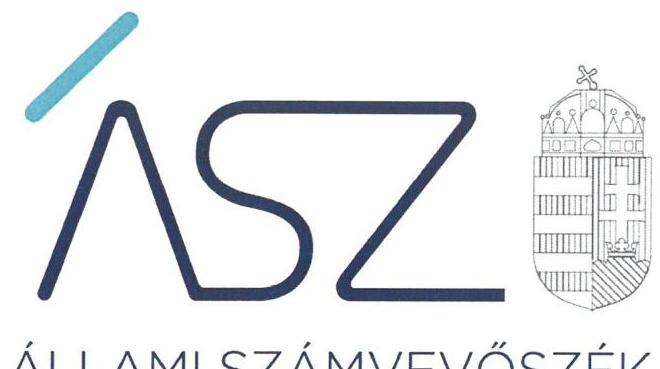

ÁLLAMI SZÁMVEVŐSZÉK

# JELENTÉS 

Pártok gazdálkodása

A költségvetési támogatásban részesülő pártok 2018-2019. évi gazdálkodása törvényességének ellenőrzése a Kereszténydemokrata Néppártnál
2021.

21039
www.asz.hu

---

ÁLLAMI SZÁMVEVŐSZÉK

# JELENTÉS 

Pártok gazdálkodása

A költségvetési támogatásban részesülő pártok 2018-2019. évi gazdálkodása törvényességének ellenőrzése a Kereszténydemokrata Néppártnál
2021. 04. hó 30. nap

21039
www.asz.hu

---

AZ ELLENŐRZÉST FELÜGYELTE:
DR. NAGY IMRE felügyeleti vezető

AZ ELLENŐRZÉST VEZETTE ÉS A VÉGREHAJTÁSÁÉRT FELELŐS:
NEMESVÁRI-HORTHY ESZTER ellenőrzésvezető

A PROGRAM ÖSSZEÁLLÍTÁSÁÉRT FELELŐS:
GÖRGÉNYI GÁBOR osztályvezető

A TÉMÁHOZKAPCSOLÓDÓ KORÁBBISZÁMVEVŐSZÉKIJELENTÉSEK:

- címe: A költségvetési támogatásban részesülő pártok 2016-2017. évi gazdálkodása törvényességének ellenőrzése - Kereszténydemokrata Néppárt
- sorszáma: 19029

Jelentéseink az Országgyúlés számítógépes hálózatán és az interneten a www.asz.hu címen is olvashatóak.

IKTATÓSZÁM: EL-3181-001/2021.
TÉMASZÁM: 2548
ELLENŐRZÉS-AZONOSÍTÓ SZÁM: V0882002

---

# TARTALOMJEGYZÉK 

- ÖSSZEGZÉS ..... 5
- AZ ELLENŐRZÉS CÉLJA ..... 6
- AZ ELLENŐRZÉS TERÜLETE ..... 7
- AZ ELLENŐRZÉS HÁTTERE, INDOKOLTSÁGA ..... 8
- A JELENTÉS LÉNYEGES KÉRDÉSKÖREI. ..... 9
- AZ ELLENŐRZÉS HATÓKÖRE ÉS MÓDSZEREI. ..... 10
- MEGÁLLAPÍTÁSOK ..... 12
- JAVASLATOK ..... 14
- MELLÉKLETEK. ..... 15
I. sz. melléklet: Értelmező szótár ..... 15
- FÜGGELÉK: ÉSZREVÉTELEK ..... 17
- RÖVIDÍTÉSEK JEGYZÉKE ..... 19

---

.

---

# ÖSSZEGZÉS 

A Kereszténydemokrata Néppárt gazdálkodásának törvényessége a 2018-2019. években biztositott volt, a könyvvezetés és a gazdálkodás során betartotta a jogszabályi elöírásokat. Ezzel biztositotta a közpénzek felhasználásának átláthatóságát és elszámoltathatóságát.

## Az ellenőrzés társadalmi indokoltsága

A pártok az állampolgárok egyesülési szabadsága alapján létrehozott olyan szervezetek, amelyek kereteket nyújtanak a népakarat kialakításához és kinyilvánításához, a politikai életben való állampolgári részvételhez.

A politikai élet tisztasága érdekében törvény állapítja meg a pártok vagyonára és gazdálkodására vonatkozó szabályokat. Az egyesülési jog alapján létrejövő más szervezetekhez képest szűkebb körben határozza meg azt a gazdasági tevékenységet, amelyet a párt végezhet, biztosítja azonban a pártok részére azt a jogosultságot, hogy az állami költségvetésből támogatásban részesüljenek. A pártok gazdálkodását a politikai élet tisztasága érdekében rendszeresen indokolt ellenőrizni, ezért törvényi előírás alapján az Állami Számvevőszék a költségvetési támogatást kapott pártok gazdálkodását kétévente ellenőrzi. A gazdálkodás szabályszerűségének, a felhasznált közpénzek nagyságának bemutatásával a társadalom objektív képet alkothat a pártok múködéséről.

A pártokkal szembeni társadalmi elvárás a törvényt tisztelő, jogkövető magatartás, mivel a párt képviselői a jogállamiságot megtestesítő törvényhozó hatalom részei. Mindezekre tekintettel fokozott társadalmi veszélyességet hordoz egy párt elszámoltathatóságának hiánya, elszámolási kötelezettségének nem teljesítése.

## Főbb megállapítások, következtetések, javaslatok

A Kereszténydemokrata Néppárt gazdálkodására vonatkozó számviteli keretek kialakítása és a belső szabályozások megalkotása során érvényesültek a jogszabályi előírások, amelyek támogatták a közpénzekkel való átlátható és ellenőrizhető gazdálkodást. A Kereszténydemokrata Néppárt könyvvezetése és nyilvántartási rendszere a jogszabály előírásoknak megfelelt. A Kereszténydemokrata Néppárt a gazdálkodásához kapcsolódó ellenőrzés rendjét kialakította és múködtette.

A Kereszténydemokrata Néppárt 2018. és 2019. évi pénzügyi kimutatásait a jogszabályban előírt tartalommal készítette el, azok közzétételéről határidőben gondoskodott, a felhasznált közpénzeket átláthatóan és a közélet tisztasága elvének figyelembevételével kezelte.

A Kereszténydemokrata Néppárt a múködéséhez a forrásokat, köztük a költségvetésből juttatott és az egyéb támogatásokat, adományokat szabályszerűen használta fel, tiltott vagyoni hozzájárulást nem fogadottel. A Kereszténydemokrata Néppárt a vagyonnal való gazdálkodás szabályait meghatározta, múködése során a vagyon felhasználása törvényes volt.

A Kereszténydemokrata Néppárta 2016-2017. évi gazdálkodásának számvevőszéki ellenőrzése során tett megállapításokra intézkedési tervet készített. Az intézkedési tervben foglaltak ellenére a párt gazdasági vezetője nem gondoskodott a számviteli politika kiegészítéséről. Az intézkedési tervben vállalt határidőre felügyelő bizottság létrehozására nem került sor.

Az Állami Számvevőszék a Kereszténydemokrata Néppárt elnökének egy javaslatot tett.

---

# AZ ELLENŐRZÉS CÉLJA 

AZ ELLENŐRZÉS CÉLJA annak értékelése volt, hogy a Kereszténydemokrata Néppártáltal közzétett pénzügyi kimutatások a törvényi előírásoknak megfelel-tek-e, a könyvvezetés és gazdálkodás során betartották-e a vonatkozó jogszabályi és belső előírásokat; a Kereszténydemokrata Néppárt a múködéséhez szabályszerűen igénybe vehető forrásokat használt-e fel.

---

# AZ ELLENŐRZÉS TERÜLETE 

## Kereszténydemokrata Néppárt

A Kereszténydemokrata Néppárt - mint az 1944-ben létrejött Demokrata Néppárt jogutódja - 1989-ben újjá alakult olyan egyesület, amely nyilvántartott tagsággal rendelkezett és a nyilvántartásba vételét végző bíróság előtt kinyilvánította, hogy a Párttörvény ${ }^{1}$ rendelkezéseit magára nézve kötelezőnek ismeri el. Az Alapszabály² szerint a Kereszténydemokrata Néppárt működésének célja, a magyar nemzet és a magyar haza szolgálata a keresztény-keresztyén erkölcs és értékek alapján a politikai életben; az európai népek közösségében együttmüködő, szabad és független Magyarország fejlődésének előmozdítása, hogy az ország szellemiekben és anyagiakban, népességében és erkölcsében egyaránt gyarapodjék.

A Kereszténydemokrata Néppárt Alapszabálya szerint a szervezeti alapegységek a helyi szervezetek, amelyek taggyúlése testületi formában müködik, a helyi szervezet élén a helyi szervezet vezetősége áll. A választott politikai testületek a megyékben a Megyei Választmány ${ }^{3}$, az Országos Elnökség ${ }^{4}$ és az Országos Választmány ${ }^{5}$, a folyamatosan működő végrehajtó és képviseleti, vezető testületi szerv az Ügyvezető Elnökség ${ }^{6}$. A Kereszténydemokrata Néppárt elnöke az Országos Elnökség és az Ügyvezető Elnökség elnöke is.

A Kereszténydemokrata Néppárt a Magyar Közlöny mellékletét képező Hivatalos Értesítő ${ }^{7}$ 2019. évi 32. számában, illetve a 2020. évi 29. számában közzétett pénzügyi kimutatásaiban a 2018. évre 205,5 M Ft bevételt, valamint 180,0 M Ft kiadást, a 2019. évre 203,1 M Ft M Ft bevételt, valamint 173,6 M Ft kiadást számolt el. A pénzügyi kimutatásában a költségvetési törvény szerint jóváhagyott és a Párttörvény előírása alapján csökkentett központi költségvetésből származó támogatás 2018. évi 168,8 M Ft-os, illetve 2019. évi 180,4 M Ft-os összegét mutatta ki.

A Kereszténydemokrata Néppárt gazdasági társaságot nem alapított, a Barankovics István Alapítványt 2006-ban hozta létre.

---

# AZ ELLENŐRZÉS HÁTTERE, INDOKOLTSÁGA 

Az ÁSZ tv. ${ }^{\circ}$ 5. § (11) bekezdés a) pontja és a Párt tv. 10. § (1) bekezdése alapján a pártok gazdálkodása törvényességének ellenőrzésére az ÁSZ ${ }^{\circ}$ jogosult. Törvényi előírás alapján az ÁSZ kétévente ellenőrzi azoknak a pártoknak a gazdálkodását, amelyek rendszeres költségvetési támogatásban részesültek.

Az ÁSZ legutóbb a Kereszténydemokrata Néppárt 2016-2017. évi gazdálkodásának törvényességét ellenőrizte.

A gazdálkodás szabályszerűségének, a felhasznált közpénzek nagyságának bemutatásával a társadalom objektív képet alkothat a pártok múködéséről. Az ellenőrzés megállapításai a gazdálkodás megfelelőségének bemutatásával elősegíthetik, hogy a törvényalkotók konkrét lépéseket tegyenek a pártok finanszírozására vonatkozó szabályozások megváltoztatása, átláthatóbbá, ellenőrizhetőbbé tétele irányába. Az ellenőrzés rámutat a pártok gazdálkodásával kapcsolatos jó gyakorlatokra és szabálytalanságokra. A hiányosságok, szabálytalanságok feltárása, az ennek kapcsán megfogalmazott megállapítások elősegíthetik a törvényi rendelkezések megsértésének szankcionálását.

---

# A JELENTÉS LÉNYEGES KÉRDÉSKÖREI 

1. A Kereszténydemokrata Néppárt gazdálkodásának törvényessége biztositottvolt-e?
2. A Kereszténydemokrata Néppárt könyvvezetése és gazdálkodása során a vonatkozó jogszabályi rendelkezéseket és belső elöírásokat betartotta-e?
3. A Kereszténydemokrata Néppárt pénzügyi kimutatása megfelelte a jogszabályi elöírásoknak, közzétételi kötelezettségét szabályszerüen teljesitette-e?

---

# AZ ELLENŐRZÉS HATÓKÖRE ÉS MÓDSZEREI 

## Az ellenőrzés típusa

Szabályszerúségi ellenőrzés.

## Az ellenőrzött időszak

A 2018-2019. évek

## Az ellenőrzés tárgya

A Kereszténydemokrata Néppárt ellenőrzése során az ellenőrzés tárgyát képezte a 2018. és a 2019. évre vonatkozó pénzügyi kimutatás elkészítésére, jóváhagyására, közzétételére, a könyvvezetésére, gazdálkodására, ennek keretében a számviteli szabályozás kialakítására, a bizonylati rend, bizonylati fegyelem betartására, egyéb gazdálkodási, ellenőrzési és pénzügyi-számviteli informatikai feladatok ellátására irányuló tevékenységek. Az ellenőrzés tárgya volt még a Párttörvény szerinti források elszámolása és felhasználása, valamint a vagyon jogszabályi előírásoknak megfelelő hasznosítása.

Az ellenőrzés kiterjedt minden olyan körülményre és adatra, amely az ÁSZ jogszabályban meghatározott feladatainak teljesítéséhez, valamint a program végrehajtása folyamán felmerült újabb összefüggések feltárásához szükséges volt.

## Az ellenőrzött szervezet

Kereszténydemokrata Néppárt

## Az ellenőrzés jogalapja

Az ellenőrzés jogalapját a ÁSZ tv. 5. § (11) bekezdés a) pontja, a Párt tv. 4. § (4)-(5) bekezdései, valamint 10. § (1), (3)-(4) bekezdései képezték.

## Az ellenőrzés módszerei

Az ÁSZ ellenőrzésére az ellenőrzési program szempontjai, az ellenőrzött időszakban hatályos jogszabályok, az ellenőrzés általános szakmai szabá-

---

lyai, az ellenőrzésre irányadó ÁSZ módszertanok figyelembevételével került sor. A közpénzekkel való felelős gazdálkodás segítésére irányuló javaslatok kidolgozáskor a hatályos jogszabályok irányadóak.

Az ellenőrzés ideje alatt a Kereszténydemokrata Néppárttal történő kapcsolattartást az ÁSZ SZMSZ ${ }^{10}$-ének vonatkozó előírásai alapján biztosította az ÁSZ.

Az ellenőrzés céljának eléréséhez szükséges bizonyítékok megszerzése a Kereszténydemokrata Néppárt által rendelkezésre bocsátott dokumentumokra, adatokra alapozva közvetlen, részletes elemzés, megfigyelés, szemrevételezés, információkérés, megerősítés, valamint elemző eljárás útján történt. Az ellenőrzési bizonyítékként felhasználható adatforrások közé tartoztak egyrészt az ellenőrzési program részletes szempontjainál felsorolt adatforrások, másrészt minden egyéb - az ellenőrzés folyamán feltárt, az ellenőrzés szempontjából információt tartalmazó - dokumentum.

Az ellenőrzés lefolytatásához a Kereszténydemokrata Néppárt az ÁSZ által kért dokumentumok megküldésével szolgáltatott adatokat, amelyek valódiságát és teljes körűségét a Kereszténydemokrata Néppárt vezetője által tett teljességi és hitelességi nyilatkozatnak kellett igazolnia. A rendelkezésre bocsátott adatok, információk kontrollja az ellenőrzés keretében történt.

Az ÁSZ a tételes ellenőrzés mellett statisztikai alapú mintavételezést és értékelést alkalmazott. A minták kiválasztása rétegzett mintavételezéssel történt. A hozzájárulások, adományok és egyéb bevételek, valamint a személyi juttatások (működési kiadáson belül), eszközbeszerzések és a működési kiadások további tételei, politikai tevékenység kiadásai, egyéb kiadások mintatételeinek értékelése „szabályszerü", ha a minta ellenőrzésének eredménye alapján 95\%-os bizonyossággal a teljes sokaságban az átlagos hibaarány nem haladta meg a 10\%-ot, „nem szabályszerü", ha nagyobb volt, mint 10\%. Abban az esetben, ha a teljes sokaság tekintetében a 10\%os hibaarányhoz való viszony megítélésének megbízhatósága nem érte el a 95\%-ot, annak elérése érdekében az értékelés további szempontokkal egészült ki, a feltárt hibák értéke is figyelembe vételre került.

---

# 1. A Kereszténydemokrata Néppárt gazdálkodásának törvényessége biztosított volt-e? 

Összegző megállapítás

A KDNP ${ }^{11}$ gazdálkodásának törvényessége a 2018-2019. években biztosított volt.

A KDNP az ellenőrzött időszakban rendelkezett Számviteli politikával ${ }^{12}$, melynek keretében elkészítette a Leltározási és leltárkészítési szabályzatot ${ }^{13}$, az Értékelési szabályzatot ${ }^{14}$, és a Pénzkezelési szabályzatot ${ }^{15}$. A KDNP a Számviteli politikában a Számv.tv. ${ }^{16} 14$. § (4) bekezdésének előírása ellenére nem rögzítette, hogy a számviteli elszámolás, az értékelés szempontjából mit tekint lényegesnek és mit tekint nem lényegesnek. A KDNP rendelkezett a Számv. tv. előírásai szerinti Számlarenddel ${ }^{17}$.

A KDNP az Értékelési szabályzatban a Párttörvény 4. § (5) bekezdésében előírtak alapján meghatározta a részére nyújtott nem pénzbeli vagyoni hozzájárulás értékelésének szabályait. A tagok által fizetendő tagdíjat, annak összegét az Alapszabályban, a tagdíjbevételek kezelésére vonatkozó szabályokat a Pénzkezelési szabályzatban és a Gazdálkodási szabályzat ${ }^{18}$ ban rögzítette.

A KDNP az Alapszabályában szabályozta a gazdálkodásához kapcsolódó ellenőrzés kereteit. A Megyei Pénzügyi Ellenőrző Bizottság ${ }^{19}$ és az Országos Pénzügyi Ellenőrző Bizottság ${ }^{20}$ feladataként határozta meg a helyi és az országos szervezetekben a gazdálkodás szabályszerűségének, a vagyon gondos és takarékos kezelésének, a költségvetés betartásnak felügyeletét, a visszaélések kiküszöbölését. A KDNP az Alapszabályban a Ptk. 3:82. § (1) bekezdésének előírása ellenére felügyelő bizottság létrehozásáról nem gondoskodott.

## 2. A Kereszténydemokrata Néppárt könyvvezetése és gazdálkodása során a vonatkozó jogszabályi rendelkezéseket és belső előírásokat betartotta-e?

Összegző megállapítás

A KDNP a 2018-2019. évi könyvvezetése és gazdálkodása során a vonatkozó jogszabályi rendelkezéseket és belső előírásokat betartotta.

2.1. számú megállapítás

A KDNP a 2018-2019. években a bevételeket szabályszerűen számolta el.

A KDNP az ellenőrzött időszakban kettős könyvviteli rendszerben vette nyilvántartásba bevételeit, amelyek elszámolása a Számlarendben foglalt főkönyvi számlákon történt.

---

2.2. számú megállapítás

A KDNP a Párttörvény előírásait betartva jogi személytől, jogi személyiséggel nem rendelkező szervezettől vagyoni hozzájárulást nem fogadott el.
A KDNP 2018. és 2019. években a gazdálkodással összefüggő tevékenységének keretében a kiadások kifizetése során, továbbá a vagyon használata során betartotta a jogszabályok előírásait.

A KDNP 2018. és 2019. évi kiadásai elszámolása szabályszerű volt, a kifizetések elszámolása során betartotta a Számv. tv., az Art. ${ }^{21}$, a Tbj. tv² ${ }^{22}$ Az Mt. ${ }^{23}$, az Szja tv. ${ }^{24}$, a Gjt. ${ }^{25}$, valamint a belső szabályzatok előírásait.

A KDNP a vagyonnal való gazdálkodás szabályait, az azzal kapcsolatos feladat- és hatásköröket az Alapszabályban, a Számviteli politikában, a Számlarendben, a Szerződéskötés rendjében ${ }^{26}$, a Gazdálkodási szabályzatban és a Pénzkezelési szabályzatban határozta meg.

A KDNP az MFB Zrt. ${ }^{27}$-vel kötött hitelszerződésből eredő törlesztési kötelezettségének a szerződésben foglaltaknak megfelelően eleget tett.

# 3. A Kereszténydemokrata Néppárt pénzügyi kimutatása megfelel-e a jogszabályi előírásoknak, közzétételi kötelezettségét szabályszerűen teljesítette-e? 

Összegző megállapítás

A KDNP pénzügyi kimutatásait a jogszabályi előírások alapján készítette el, a közzétételi kötelezettségét szabályszerűen teljesítette.

A KDNP a 2018 és a 2019. évi pénzügyi kimutatásait a Párttörvény 1. számú mellékletben előírt szerkezetben állította össze, az abban szereplő bevételi és kiadási kategóriák megfeleltek a Párttörvény 1. számú mellékletében foglaltaknak.

A KDNP a Párttörvény előírásai alapján a 2018-2019. évi pénzügyi kimutatásokat határidőben tette közzé a Magyar Közlöny mellékletét képező Hivatalos Értesítőben és saját honlapján.

---

# JAVASLATOK 

Az ÁSZ tv. 33. § (1) bekezdésében foglaltak értelmében az ellenőrzött szervezet vezetője köteles a jelentésben foglalt megállapításokhoz kapcsolódó intézkedési tervet összeállítani és azt a jelentés kézhezvételétől számított 30 napon belül az ÁSZ részére megküldeni. Amennyiben az ellenőrzött szervezet vezetője nem küldi meg határidőben az intézkedési tervet, vagy továbbra sem elfogadható intézkedési tervet küld, az Állami Számvevőszék elnöke az ÁSZ tv. 33. § (3) bekezdése a) és b) pontjaiban foglaltakat érvényesítheti.

## Kereszténydemokrata Néppárt elnöke

1. Intézkedjen a számviteli politika jogszabályi előirás szerinti kiegészítéséről.
(1. sz. megállapítás 1. bekezdés 2. mondata alapján)

---

# MELLÉKLETEK 

- I. SZ. MELLÉKLET: ÉRTELMEZŐ SZÓTÁR
pénzügyi kimutatás
a párt gazdasági-vállalkozási tevékenysége
költségvetési támogatás
nem pénzbeli támogatás

A Párttörvény. 9. § (1) bekezdésében meghatározott, a törvény 1. számú melléklete szerinti pénzügyi kimutatás (hatályos 2014. május 6-ától), amelyet a pártok kötelesek minden év május 31-ig a Magyar Közlönyben, valamint saját honlappal rendelkező pártok a honlapjukon is közzétenni.
A Párttörvény 6. § (1) bekezdésének megfelelően a párt a költségeinek fedezése és vagyonának gyarapítása érdekében a következő gazdasági-vállalkozási tevékenységeket folytathatja:
a) politikai céljainak és tevékenységének megismertetése érdekében kiadványokat jelentethet meg és terjeszthet, a pártot szimbolizáló jelvényeket és más ilyen célú tárgyakat árusíthat, és pártrendezvényeket szervezhet;
b) a tulajdonában álló ingatlanokat és ingókat díj ellenében hasznosíthatja és elidegenítheti.
Az államháztartás alrendszerei terhére nyújtott pénzbeli vagy nem pénzbeli juttatás, amelyet a támogató nem elsősorban ellenszolgáltatás ellenében, de konkrét program megvalósítása vagy meghatározott időszakban a támogatott szervezet múködtetése érdekében nyújt. (Civil tv. 2. § 15. pont)
Vagyoni értékkel rendelkező forgalomképes dolog, szellemi alkotás, illetve vagyoni értékű jog részben vagy egészében, véglegesen vagy ideiglenesen, teljesen vagy részben ingyenesen történő átruházása vagy átengedése, illetve szolgáltatás biztosítása. (Civil tv. 2. § 25. pont)

---

.

---

# FÜGGELÉK: ÉSZREVÉTELEK 

A jelentéstervezetet a Számvevőszék 15 napos észrevételezésre megküldte az ellenőrzött szervezet vezetőjének az ÁSZ tv. 29. §* (1) bekezdése előírásának megfelelően.

A KDNP elnöke a jelentéstervezet megállapításaira észrevételt tett. Az ÁSZ tv. 29. § (3) bekezdésével összhangban az ÁSZ a Függelékben feltünteti a jelentéstervezet megállapításaival kapcsolatban tett, figyelembe nem vett észrevételeket, és megindokolja, hogy azokat miért nem fogadta el.

A KDNP elnöke a jelentéstervezet Összegzés fejezet „Főbb megállapítások, következtetések, javaslatok" rész 4. bekezdés 3. mondatára vonatkozóan tett észrevételt. A KDNP elnöke az észrevételében arról adott tájékoztatást, hogy 2020. január 18-án létrehozták a felügyelő bizottságot.

Az elnök észrevételéhez kapcsolódóan az ÁSZ jelezte, hogy a törvényi előírások és a belső szabályok szerint működő felügyelő bizottság ellenőrzési tevékenysége nagyban támogathatja a párt döntéshozó szervének munkáját, ezzel hozzájárulhat a párt gazdálkodásának szabályszerűségéhez. Ugyanakkor az ÁSZ tájékoztatta a KDNP elnökét, hogy az ellenőrzés a párt 2018-2019. évi gazdálkodása törvényességének ellenőrzésére terjedt ki, ezért a felügyelő bizottság 2020. január 18-i létrehozásáról szóló tájékoztatást a megállapítások megtétele során nem tudja figyelembe venni. A számvevőszéki jelentéstervezet módosítása nem indokolt.

[^0]
[^0]:    * 29. § (1) Az Állami Számvevőszék az ellenőrzési megállapításait megküldi az ellenőrzött szervezet vezetőjének vagy az általa megbízott személynek, és annak, akinek személyes felelősségét állapította meg.
    (2) Az ellenőrzött szervezet vezetője és a felelősként megjelölt személy az ellenőrzés megállapításaira tizenöt napon belül írásban észrevételt tehet.
    (3) Az Állami Számvevőszék az észrevételre a beérkezésétől számított harminc napon belül írásban válaszol. A figyelembe nem vett észrevételeket köteles a jelentésben feltüntetni, és megindokolni, hogy azokat miért nem fogadta el.

---

.

---

# RÖVIDÍTÉSEK JEGYZÉKE 

${ }^{1}$ Párttörvény
${ }^{2}$ Alapszabály
${ }^{3}$ Megyei Választmány
${ }^{4}$ Országos Elnökség
${ }^{5}$ Országos Választmány
${ }^{6}$ Úgyvezető Elnökség
${ }^{7}$ Hivatalos Értesítő
${ }^{8}$ ÁSZtv.
${ }^{9}$ ÁSZ
${ }^{10}$ ÁSZ SZMSZ
${ }^{11}$ KDNP
${ }^{12}$ Számviteli politika
${ }^{13}$ Leltározási és leltárkészítési szabályzat
${ }^{14}$ Értékelési szabályzat
${ }^{15}$ Pénzkezelési Szabályzat
${ }^{16}$ Számv.tv.
${ }^{17}$ Számlarend
1989. évi XXXIII. törvény a pártok müködéséről és gazdálkodásáról (hatályos: 1989. 10. 30-tól)
A Kereszténydemokrata Néppárt 2017. 12. 16-ai módosítással egységes szerkezetbe foglalt Alapszabálya
Kereszténydemokrata Néppárt Megyei Választmány
Kereszténydemokrata Néppárt Országos Elnökség
Kereszténydemokrata Néppárt Országos Választmány
Kereszténydemokrata Néppárt Úgyvezető Elnökség
A Magyar Közlöny melléklete
2011. évi LXVI. törvény az Állami Számvevőszékről (hatályos: 2011. 07. 01-től)

Állami Számvevőszék
Állami Számvevőszék Szervezeti és Működési Szabályzata
Kereszténydemokrata Néppárt
Kereszténydemokrata Néppárt Számviteli politika (hatályos: 2008. 03. 05-től)

1. számú kiegészítés a párt Számviteli politikához (hatályos: 2009. 01. 01-től)
2. számú kiegészítés a párt Számviteli politikához (hatályos: 2012. 01. 01-től)
3. számú kiegészítés a párt Számviteli politikához (hatályos: 2012. 01. 01-től)
4. számú kiegészítés a párt Számviteli politikához (hatályos: 2012. 01. 01-től)
5. számú kiegészítés a párt Számviteli politikához (hatályos: 2016. 11. 18-tól)
6. számú kiegészítés a párt Számviteli politikához (hatályos: 2017. 07. 15-től)
7. számú kiegészítés a párt Számviteli politikához (hatályos: 2019. 05. 10-től)
Kereszténydemokrata Néppárt Leltározási és leltárkészítési Szabályzata (hatályos: 2008.03. 05-től)
Kereszténydemokrata Néppárt Eszközök és források értékelési Szabályzata (hatályos 2007. 11. 27-től)
Kereszténydemokrata Néppárt Pénzkezelési szabályzat (hatályos: 2008. 03. 05-től)
Kiegészítés a párt Pénzkezelési szabályzatához (hatályos: 2008. 03. 01-től)
I. számú kiegészítés a Pénzkezelési szabályzathoz (hatályos: 2008. 09. 11-től)
II. számú kiegészítés a Pénzkezelési szabályzathoz (hatályos: 2008. 09. 11-től)
III. számú kiegészítés a Pénzkezelési szabályzathoz (hatályos: 2009. 01. 01-től)
IV. számú kiegészítés a Pénzkezelési szabályzathoz (hatályos: 2011. 01. 13-tól)
V. és VI. számú kiegészítés a Pénzkezelési szabályzathoz (hatályos: 2013. 01.01-től)
VII. számú kiegészítés a Pénzkezelési szabályzathoz (hatályos: 2013. 01.01-től)
VIII. számú kiegészítés a Pénzkezelési szabályzathoz (hatályos: 2013. 01.01-től)
IX. számú kiegészítés a Pénzkezelési szabályzathoz (hatályos: 2015. 05. 12-től)
X. számú kiegészítés a Pénzkezelési szabályzathoz (hatályos: 2015. 07. 01-től)
2000. évi C. törvény - a számvitelről (hatályos: 2001. 01.01-től)

Kereszténydemokrata Néppárt Számlarend (hatályos: 2008. 03. 05-től) Számlatükör melléklet (hatályos: 2009. 01. 01-től)

1. számú kiegészítés a párt Számlarendjéhez (hatályos: 2009. 01. 01-től)
2. számú kiegészítés a párt Számlarendjéhez (hatályos: 2012. 01. 01-től)
3. számú kiegészítés a párt Számlarendjéhez (hatályos: 2017. 07. 15-től)
III. számú kiegészítés a párt Számlarendjéhez (hatályos: 2019. 05. 10-től)

---

${ }^{18}$ Gazdálkodási szabályzat
${ }^{19}$ Megyei Pénzügyi Ellenőrző Bizottság
${ }^{20}$ Országos Pénzügyi Ellenőrző Bizottság
${ }^{21}$ Art.
${ }^{22}$ Tbj. tv.
${ }^{23} \mathrm{Mt}$.
${ }^{24}$ Szj a tv.
${ }^{25}$ Gjt.
${ }^{26}$ Szerződéskötés rendje
${ }^{27}$ MFB Zrt.

Számlatükör 2018.
Számlatükör 2019.
Kereszténydemokrata Néppárt gazdálkodási szabályzata (hatályos: 2010. 11. 08-tól)
Kereszténydemokrata Néppárt Megyei PénzügyiEllenőrző Bizottsága
Kereszténydemokrata Néppárt Országos Pénzügyi Ellenőrző Bizottsága
2017. évi CL. törvény az adózás rendjéről (hatályos 2018. 01. 01-től)
1997. évi LXXX. törvény a társadalombiztosítás ellátásaira és a magánnyugdíra jogosultakról, valamint e szolgáltatások fedezetéről (hatályos: 1998. 01. 01-től)
2012. évi I. törvény a munka törvénykönyvéről (hatályos 2012. 07. 01-től)
1995. évi CXVII. törvény a személyi jövedelemadóról (hatályos 1996. 01. 01-től)
1991. évi LXXXII. törvény a gépjárműadóról (hatályos: 1992. 01. 01-től)

Kereszténydemokrata Néppárt Szerződéskötés és Utalványozás rendje (hatályos: 2007. 11. 24-től)

Magyar Fejlesztési Bank Zrt.

---

# ASZ 

ALLAMI SZAMVEVOSZEK
1052 Budapest, Apáczai Cs. J. u. 10. | 1364 Budapest 4. Pf. 54
TEL: +36 14849100
email: szamvevoszek@asz.hu
web: www.asz.hu | www.aszhirportal.hu