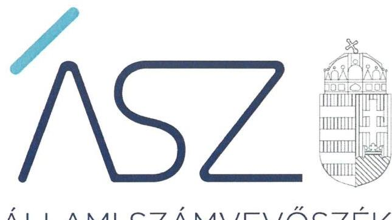
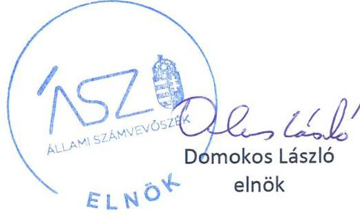

ÁLLAMI SZÁMVEVŐSZÉK

# JELENTÉS 

Nem állami humánszolgáltatók ellenőrzése

A köznevelési humánszolgáltatást nyújtó intézmények, szolgáltatók államháztartáson kívüli fenntartói központi költségvetésből kapott támogatásai felhasználásának ellenőrzése Képzett Polgárságért Alapítvány
2021.

21040
www.asz.hu

---

ÁLLAMI SZÁMVEVŐSZÉK

# JELENTÉS

Nem állami humánszolgáltatók ellenőrzése

A köznevelési humánszolgáltatást nyújtó intézmények, szolgáltatók államháztartáson kívüli fenntartói központi költségvetésből kapott támogatásai felhasználásának ellenőrzése

Képzett Polgárságért Alapítvány

2021. 05. 04.

21040
www.asz.hu

---

# AZ ELLENŐRZÉST VEZETTE ÉS A VÉGREHAJTÁSÁÉRT FELELŐS: 

## NEMESVÁRI-HORTHY ESZTER ellenőrzésvezető

LAJÓ ADRIENN ellenőrzésvezető

## A PROGRAM ÖSSZEÁLLÍTÁSÁÉRT FELELŐS:

GÖRGÉNYI GÁBOR osztályvezető

IKTATÓSZÁM: EL-3180-001/2021.
TÉMASZÁM: 2547
ELLENŐRZÉS-AZONOSÍTÓ SZÁM: V0867283, V089101

Jelentéseink az Országgyűlés számítógépes hálózatán és az interneten a www.asz.hu címen is olvashatóak.

---

# TARTALOMJEGYZÉK 

- ÖSSZEGZÉS ..... 5
- AZ ELLENŐRZÉS CÉLJA ..... 6
- AZ ELLENŐRZÉS TERÜLETE ..... 7
- AZ ELLENŐRZÉS HÁTTERE, INDOKOLTSÁGA ..... 8
- AZ ELLENŐRZÉS LÉNYEGES KÉRDÉSKÖREI ..... 9
- AZ ELLENŐRZÉS HATÓKÖRE ÉS MÓDSZEREI ..... 10
MELLÉKLETEK ..... 13
I. sz. melléklet: Értelmező szótár ..... 13
- FÜGGELÉK: ÉSZREVÉTELEK ..... 15
- RÖVIDÍTÉSEK JEGYZÉKE ..... 17

---

.

---

# ÖSSZEGZÉS 

A budapesti székhelyű Képzett Polgárságért Alapítvány a 2016-2019. években a köznevelési humánszolgáltatási közfeladat ellátására kapott költségvetési támogatások felhasználása tekintetében nem volt ellenőrizhető, így nem volt elszámoltatható.

## Az ellenőrzés társadalmi indokoltsága

A köznevelési feladatok ellátása az Alaptörvényben meghatározott, a társadalom szempontjából fontos tevékenység. Jogszabályok teszik lehetővé, hogy államháztartáson kívüli szervezetek - így például az egyházi fenntartók, alapítványok, gazdasági társaságok, egyesületek - által fenntartott intézmények is végezzenek köznevelési feladatokat. Mindehhez a központi költségvetés évente jelentős összegű támogatással járul hozzá. Az államháztartáson kívüli, humánszolgáltatást végző intézmények az igényelt közpénzekből társadalmilag hasznos, közösségteremtő, közérdekű, illetve közhasznú tevékenységet végeznek és közfeladatokat látnak el.

Az intézményfenntartók ellenőrzésével az Állami Számvevőszék hozzájárul ahhoz, hogy a közpénzeket az államháztartáson kívüli szervezetek is ellenőrizhető, átlátható és elszámoltatható módon használják fel a közfeladatok ellátása során. Az ellenőrzések célja továbbá, hogy a nyilvánosság és az igénybevevők megfelelő tájékoztatást kapjanak az államháztartáson kívüli közfeladatot ellátók működéséről.

Az Állami Számvevőszék ellenőrzései arra adnak választ, hogy az intézményfenntartók kialakították-e a támogatások szabályszerű felhasználásának feltételeit, a központi költségvetésből kapott támogatásokat szabályszerűen használták-e fel.

A szabályszerű gazdálkodás elengedhetetlen a közfeladat ellátás szakmai céljainak megvalósításához, valamint a társadalmi közbizalom fenntartásához.

## Főbb megállapítások, következtetések

A Képzett Polgárságért Alapítvány a Ptk. ${ }^{1}$ 3:7. §-ában foglalt előírások ellenére a székhelyén a részére címzett jognyilatkozatok fogadását és a jogi személy jogszabályban meghatározott iratainak elérhetőségét nem biztosította.

A Képzett Polgárságért Alapítvány a Számv. tv. ${ }^{2}$-ben előírt számviteli politika és annak keretében elkészítendő eszközök és források leltárkészítési és leltározási szabályzata, értékelési szabályzata, valamint a pénzkezelési szabályzat hiányában a 2016-2019. években a kapott költségvetési támogatások átlátható és elszámoltatható igénybevételének és felhasználásának alapvető feltételeit nem teremtette meg.

A Képzett Polgárságért Alapítvány a kapott költségvetési támogatások és azok felhasználásának Számv. tv.-ben előírt elkülönített nyilvántartása hiányában a 2016-2019. években nem biztosította a költségvetésből kapott támogatása átlátható és elszámoltatható igénybevételének és felhasználásának feltételeit, nem igazolta a támogatások átlátható, elszámoltatható igénybevételét és azt, hogy a kapott központi költségvetési támogatást a köznevelési közfeladat céljára fordította.

A Képzett Polgárságért Alapítvány a Számv. tv.-ben számviteli beszámolási kötelezettsége teljesítése hiányában a 2016-2019. években a köznevelési közfeladat ellátására kapott költségvetési támogatás felhasználásának elszámoltathatóságát, átláthatóságát nem biztosította.

Mindezek következtében a Képzett Polgárságért Alapítvány az Alaptörvény ${ }^{3}$ 39. cikk (2) bekezdésében foglaltak ellenére a 2016-2019. években a felhasznált közpénzekre vonatkozó gazdálkodása átláthatóságát és elszámoltathatóságát nem biztosította, nem igazolt, hogy a 2016-2019. években kapott 226,0 millió Ft központi költségvetési támogatást rendeltetésszerűen, a köznevelési közfeladat ellátására használta fel.

---

# AZ ELLENŐRZÉS CÉLJA

**AZ ELLENŐRZÉS CÉLJA** annak értékelése volt, hogy a nem állami, nem önkormányzati köznevelési intézmény fenntartója, a Képzett Polgárságért Alapítvány központi költségvetésből kapott támogatásainak felhasználása szabályszerű volt-e.

---

# **AZ ELLENŐRZÉS TERÜLETE**

## **Képzett Polgárságért Alapítvány**

A budapesti székhelyű Fenntartó4 a Fővárosi Törvényszék a civil szervezetek névjegyzékébe 1998. október 15-én jegyezte be.

A Fenntartó az OBH5 nyilvántartása alapján egy budapesti székhelyű köznevelési Intézmény6 fenntartója.

A Fenntartó a Kincstár7 adatai alapján a köznevelési közfeladatainak ellátására a központi költségvetésből a 2016. évben 32,1 millió Ft, a 2017. évben 32,7 millió Ft, a 2018. évben 76,0 millió Ft, a 2019. évben 85,2 millió Ft költségvetési támogatásban részesült.

---

# AZ ELLENŐRZÉS HÁTTERE, INDOKOLTSÁGA 

A köznevelési közfeladatot ellátó államháztartáson kívüli szervezetek által ellátott feladatok a társadalom széles rétegét érintik, ezért közérdeklődésre tartanak számot. Az állam az éves költségvetési törvényekben jelentős összegű támogatást biztosít a nem állami humánszolgáltatóknak feladataik ellátásához. A támogatások célszerű, szabályszerű felhasználása biztosítja a feladatok magas színvonalú ellátását, amely hatással van a szolgáltatásokat igénybe vevők közérzetére, a szervezetek felé irányuló bizalom növekedésére.

A közpénzügyek átláthatóságának, rendezettségének növelése és a feltárt kockázatok csökkentése érdekében indokolt a nem állami humánszolgáltatók, illetve az államháztartáson kívüli közfeladatot ellátók részére biztosított közpénzek további ellenőrzése, a külső védelmi vonalak erősítése.

A köznevelési közfeladatot ellátó nem állami humánszolgáltatóknak feladataik ellátásához biztosított állami támogatások Kvtv.-ek. ${ }^{8}$ szerinti előirányzata 2016-2019. években együtt 815 Mrd Ft volt.

---

# AZ ELLENŐRZÉS LÉNYEGES KÉRDÉSKÖREI 

I. 2016-2018. évek:

1.     - A köznevelési közfeladatot ellátó államháztartáson kívüli fenntartó szabályszerű működési- és gazdálkodási környezet kialakításával megteremtette-e a költségvetési támogatások átlátható, elszámoltatható igénybevételének, felhasználásának feltételeit?
2.     - Az államháztartáson kívüli fenntartó az átvállalt köznevelési közfeladathoz biztosított költségvetési támogatásokat szabályszerűen fordította-e a humánszolgáltató intézménye/i működtetésére?
3.     - Az államháztartáson kívüli fenntartó a köznevelési intézménye/i működtetéséhez felhasznált közpénzekre vonatkozó gazdálkodásával a nyilvánosság előtt elszámolt-e, ennek érdekében ellenőrzési, értékelési és a külső ellenőrzésekkel kapcsolatos intézkedési feladatait szabályszerűen látta-e el?
II. 2019. év:
4.     - A köznevelési humánszolgáltatást nyújtó intézmények államháztartáson kívüli fenntartója rendelkezett-e megbízható számviteli beszámolóval?
5.     - A köznevelési humánszolgáltatást nyújtó intézmények államháztartáson kívüli fenntartója szabályszerűen biztosította-e az átvállalt köznevelési közfeladathoz biztosított költségvetési támogatások elkülönített nyilvántartását?
6.     - A köznevelési humánszolgáltatást nyújtó intézmények államháztartáson kívüli fenntartója saját és intézményei működési- és gazdálkodási kereteinek kialakításával megteremtette-e a költségvetési támogatások szabályszerű felhasználásának feltételeit?

---

# AZ ELLENŐRZÉS HATÓKÖRE ÉS MÓDSZEREI 

## Az ellenőrzés típusa

| Megfelelőségi ellenőrzés.

## Az ellenőrzött időszak

2016-2019. évek

## Az ellenőrzés tárgya

Az ellenőrzés a köznevelési humánszolgáltatási közfeladatokat ellátó intézmények államháztartáson kívüli fenntartói gazdálkodása szabályozási kereteinek kialakítására, valamint a humánszolgáltatási közfeladataik ellátásához a központi költségvetésből kapott támogatások humánszolgáltatási közfeladatokra való fenntartó általi felhasználása szabályszerűségére terjedt ki.

Az ellenőrzés kiterjedt minden olyan körülményre és adatra, amely az ÁSZ ${ }^{9}$ jogszabályban meghatározott feladatainak teljesítéséhez, valamint a program végrehajtása folyamán felmerült újabb összefüggések feltárásához szükséges.

## Az ellenőrzött szervezet

Képzett Polgárságért Alapítvány

## Az ellenőrzés jogalapja

Az ellenőrzés jogszabályi alapját az ÁSZtv. 1. § (3) és 5. § (3) bekezdésében foglalt előírások adták.

## Az ellenőrzés módszerei

Az ellenőrzést az ellenőrzési program szempontjai, kérdései, az ellenőrzött időszakban hatályos jogszabályok, a nemzetközi standardokat irányadónak tekintve, az ellenőrzés szakmai szabályok és módszertanok figyelembe vételével végzi az ÁSZ. A közpénzekkel való felelős gazdálkodás segítésére irányuló javaslatok kidolgozásakor a hatályos jogszabályok az irányadóak.

Az ellenőrzési kérdések megválaszolásához szükséges bizonyítékok megszerzése az ellenőrzött által rendelkezésre bocsátott

---

dokumentumokra, adatokra alapozva megfigyelés, szemle (szemrevételezés), összehasonlítás, kérdésfeltevés (információkérés), valamint elemző eljárással történik.

Az ellenőrzési bizonyítékként felhasználható adatforrások közé tartoznak egyrészt a szakmai program részletes szempontjainál felsorolt adatforrások, másrészt minden - az ellenőrzés folyamán feltárt, az ellenőrzés szempontjából információt tartalmazó - dokumentum.

Az ellenőrzés lefolytatásához az ellenőrzött szervezet a kitöltött tanúsítványok, valamint az ÁSZ által kért dokumentumok elektronikus úton való megküldésével szolgáltat adatokat, információkat. Az így rendelkezésre bocsátott adatok, információk és a tanúsítványok adatai valódiságának kontrollja az ellenőrzés keretében történik.

Az egységes értelmezést támogatja a program mellékletét képező fogalomtár és rövidítésjegyzék.

Az ellenőrzést alapvetően a köznevelési humánszolgáltatások esetében a központi költségvetési támogatások igénylésével, módosításával, felhasználásával, elszámolásával kapcsolatos feladatokat ellátó államháztartáson kívüli fenntartóknál végzi az ÁSZ.

A köznevelési humánszolgáltatásokat ellátó intézmények fenntartóinak jogszabályokban előírt feladatai betartása, továbbá a központi költségvetési támogatások szabályszerű nyilvántartása kerül ellenőrzésre a fenntartónál rendelkezésre álló nyilvántartások, beszámolók és egyéb dokumentumok alapján. Az ellenőrzés nem terjed ki a köznevelési humánszolgáltatások központi költségvetési támogatásai igénylése, módosítása, elszámolása valódiságának, megalapozottságának, helyességének - sem a fenntartónál, sem az intézményeinél való értékelésére (mivel ennek felülvizsgálata, ellenőrzése a finanszírozó jogszabályban előírt feladata, határozatai kiadása előtt).

Az ellenőrzés ideje alatt az ellenőrzött szervezettel történő kapcsolattartást az ÁSZ SZMSZ ${ }^{10}$ vonatkozó előírásai biztosítják.

---

.

---

# MELLÉKLETEK 

- I. SZ. MELLÉKLET: ÉRTELMEZŐ SZÓTÁR
civil szervezet
humánszolgáltatás
költségvetési támogatás

A Civil tv. ${ }^{11}$ 2. § 6. pontja szerint civil szervezet a civil társaság, a Magyarországon nyilvántartásba vett egyesület (a párt, a szakszervezet és a kölcsönös biztosító egyesület kivételével), a közalapítvány és a pártalapítvány kivételével az alapítvány.
Külön törvényben meghatározott szociális, gyermekjóléti, gyermekvédelmi, közoktatási, felsőoktatási, kulturális közfeladatok (2016. évi Kvtv. 41. § (1), (4) bekezdés, 1. számú melléklet XX/20/2/3. jogcím csoport, 19. alcím, 2016. évi Kvtv. 41. § (1), (4) bekezdés, 1. számú melléklet XX/20/2/3. jogcím csoport, 19. alcím, 2017. évi Kvtv. 41. § (1), (4) bekezdés, 1. számú melléklet XX/20/2/3. jogcím csoport, 19. alcím, 2018. évi Kvtv. 41. § (1), (4) bekezdés, 1. számú melléklet XX/20/2/3. jogcím csoport, 19. alcím, 2019. évi Kvtv. 41-42.§, XX/20/2/3/, XX/20/19/1/jogcím csoport).
Az Nkt. vhr. ${ }^{12}$ 37/B. § (2) bekezdése szerint: „Az átlagbér alapú támogatás, a gyermek- és tanulóétkeztetéshez nyújtott támogatás és a tankönyvtámogatások (a továbbiakban: támogatások)
Civil tv. 2. § 8. pontja szerint a Civil törvény alkalmazásában feladatfinanszírozást szolgáló költségvetési támogatás: valamely közfeladat államháztartáson kívüli szervezet által történő ellátását, valamint e feladat ellátásához közvetlenül kapcsolódó, arányos működési költségeket finanszírozó költségvetési támogatás.
A költségvetési törvényben (2016. évi XC. törvény 40. §) megállapított támogatás többek között: Átlagbéralapú támogatást állapít meg a nevelési-oktatási, valamint pedagógiai szakszolgálati intézményt fenntartó nemzetiségi önkormányzat, az egyházi és magán köznevelési intézmény fenntartója részére az általuk fenntartott nevelési-oktatási intézményben, továbbá pedagógiai szakszolgálati intézményben pedagógus és - a (3) bekezdés kivételével - a nevelő-oktató munkát közvetlenül segítő munkakörben foglalkoztatottak után a 7. melléklet I. pontjában meghatározott jogosultak után, az őket ott megillető mértékek szerint. Működési támogatást állapít meg a nemzetiségi önkormányzat vagy az egyházi jogi személy által fenntartott nevelési-oktatási intézményekben ellátott, továbbá a pedagógiai szakszolgálati intézményekben gyógypedagógiai tanácsadásban, korai fejlesztésben, oktatásban és gondozásban, valamint a fejlesztő nevelésben részt vevő gyermekekre, tanulókra tekintettel a nemzetiségi önkormányzat és a bevett egyház részére a 7. melléklet II. pontja szerint.

---

# köznevelési feladat 

A köznevelési intézmény alapító okiratában foglalt feladat: óvodai nevelés, nemzetiséghez tartozók óvodai nevelése, általános iskolai nevelés-oktatás, nemzetiséghez tartozók általános iskolai nevelése-oktatása, kollégiumi ellátás, nemzetiségi kollégiumi ellátás, gimnáziumi nevelés-oktatás, szakközépiskolai nevelés-oktatás, szakiskolai nevelés-oktatás, nemzetiségi gimnáziumi nevelés-oktatása, nemzetiségi szakközépiskolai nevelés-oktatása, nemzetiségi szakiskolai nevelés-oktatása,

 Köznevelési Hídprogramok keretében folyó nevelés-oktatás, felnőttképzés, alapfokú művészetoktatás, fejlesztő nevelés, fejlesztő nevelés-oktatás, pedagógiai szakszolgálati feladat, a többi gyermekkel, tanulóval együtt nevelhető, oktatható sajátos nevelési igényű gyermekek, tanulók óvodai nevelése és iskolai nevelése-oktatása, azoknak a sajátos nevelési igényű gyermekeknek, tanulóknak az óvodai, iskolai, kollégiumi ellátása, akik a többi gyermekkel, tanulóval nem foglalkoztathatók együtt, a gyermekgyógyüdülőkben, egészségügyi intézményekben, rehabilitációs intézményekben tartós gyógykezelés alatt álló gyermekek tankötelezettségének teljesítéséhez szükséges oktatás, pedagógiai szakmai szolgáltatás.(Nkt. ${ }^{13} 4 . \S$ (1) bek.)
köznevelési intézmény
nem állami, nem önkormányzati (államháztartáson kívüli) intézmény fenntartó

A nevelési-oktatási intézmény, pedagógiai szakszolgálati intézmény, pedagógiai-szakmai szolgáltatást nyújtó intézmény.(Nkt. 2. § (3) bek.))
A köznevelési közfeladatokat/humánszolgáltatásokat ellátó intézményt fenntartó egyházi jogi személy, társadalmi szervezet, alapítvány, közalapítvány, civil szervezet, országos nemzetiségi önkormányzat, nonprofit gazdasági társaság, gazdasági társaság és a humánszolgáltatást alaptevékenységként végző, Szja tv. hatálya alá tartozó egyéni vállalkozó. (2016. évi Kvtv. 41. § (1), bekezdés, 2017. évi Kvtv. 41. § (1) bekezdés, 2018. évi Kvtv. 41. § (1) bekezdés, 2019. évi Kvtv. 42. § (1) bekezdés)

---

# FÜGGELÉK: ÉSZREVÉTELEK 

A jelentéstervezetet a Számvevőszék 15 napos észrevételezésre megküldte az ellenőrzött szervezet vezetőjének az ÁSZ tv. 29. § (1) bekezdése előírásának megfelelően.

A Képzett Polgárságért Alapítvány kuratóriumi elnöke - mint az ellenőrzött szervezet vezetője - a jelentéstervezet megállapításaira nem tett észrevételt.

[^0]
[^0]:    * 29. § (1) Az Állami Számvevőszék az ellenőrzési megállapításait megküldi az ellenőrzött szervezet vezetőjének vagy az általa megbízott személynek, és annak, akinek személyes felelősségét állapította meg.
    (2) Az ellenőrzött szervezet vezetője és a felelősként megjelölt személy az ellenőrzés megállapításaira tizenöt napon belül írásban észrevételt tehet.
    (3) Az Állami Számvevőszék az észrevételre a beérkezésétől számított harminc napon belül írásban válaszol. A figyelembe nem vett észrevételeket köteles a jelentésben feltüntetni, és megindokolni, hogy azokat miért nem fogadta el.

---

.

---

# RÖVIDÍTÉSEK JEGYZÉKE 

${ }^{1}$ Ptk.
${ }^{2}$ Számv. tv.
${ }^{3}$ Alaptörvény
${ }^{4}$ Fenntartó
${ }^{5}$ OBH
${ }^{6}$ Intézmény
${ }^{7}$ Kincstár
${ }^{8}$ Kvtv.-ek
${ }^{9}$ ÁSZ
${ }^{10}$ ÁSZ SZMSZ
${ }^{11}$ Civil tv.
${ }^{12}$ Nkt. vhr.
${ }^{13} \mathrm{Nkt}$.

2013. évi V. törvény a Polgári Törvénykönyvről (hatályos 2014. március 15-től) 2000. évi C. törvény a számvitelről (hatályos 2001. január 1-jétől)

Magyarország Alaptörvénye (hatályos 2012. január 1-től)
Képzett Polgárságért Alapítvány
Országos Bírósági Hivatal
2016. január 1-től 2019. március 21-ig: Comenius Szakiskola és Gazdasági Szakközépiskola,
2019. március 21-től: Comenius Középiskola és Alapfokú Művészeti Iskola
Magyar Államkincstár
2015. évi C. törvény - Magyarország 2016. évi központi költségvetéséről (hatályos 2015. július 4-től 2019. december 31-ig)
2016. évi XC. törvény - Magyarország 2017. évi központi költségvetéséről (hatályos 2016. november 1-jétől 2020. december 31-ig)
2017. évi C. törvény - Magyarország 2018. évi központi költségvetéséről (hatályos 2017. november 1-től 2027. december 31-ig)
2018. évi L. törvény - Magyarország 2019. évi központi költségvetéséről (2018. november 1-től 2022. december 31-ig)
Állami Számvevőszék
Állami Számvevőszék Szervezeti és működési szabályzata
2011. évi CLXXV. törvény az egyesülési jogról, a közhasznú jogállásról, valamint a civil szervezetek működéséről és támogatásáról (hatályos 2011. december 22-től) 229/2012. (VIII. 28.) Korm. rendelet a nemzeti köznevelésről szóló törvény végrehajtásáról (hatályos 2012. szeptember 1-től)
2011. évi CXC. törvény a nemzeti köznevelésről (hatályos 2012. szeptember 1-től)

---

# ASZ 

1052 Budapest, Apáczai Cs. J. u. 10. | 1364 Budapest 4. Pf. 54 TEL: +36 14849100
email: szamvevoszek@asz.hu
web: www.asz.hu | www.aszhirportal.hu
