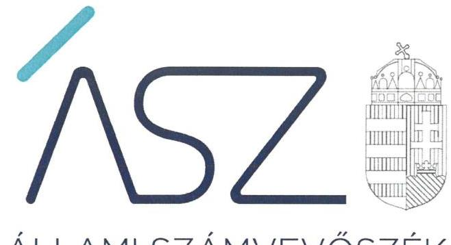
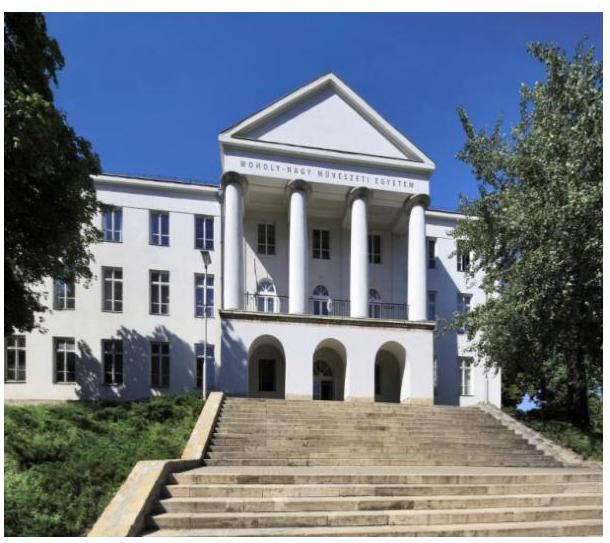
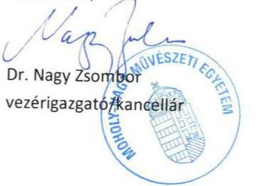
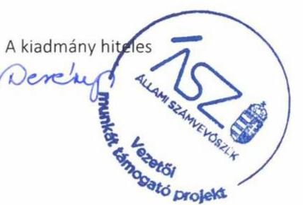

ÁLLAMI SZÁMVEVŐSZÉK

# JELENTÉS 

## A központi költségvetési szervek ellenőrzése Vagyongazdálkodás

Moholy-Nagy Művészeti Egyetem
2021.

21041
www.asz.hu

---

ÁLLAMI SZÁMVEVŐSZÉK

# JELENTÉS 

## A központi költségvetési szervek ellenőrzése Vagyongazdálkodás

Moholy-Nagy Művészeti Egyetem
2021. 06. hó 03. nap

21041
www.asz.hu

---

# AZ ELLENŐRZÉST FELÜGYELTE: 

DR. PULAY GYULA ZOLTÁN felügyeleti vezető

## AZ ELLENŐRZÉST VEZETTE ÉS A VÉGREHAJTÁSÁÉRT FELELŐS:

DR. SIMON JÓZSEF ellenőrzésvezető

## A PROGRAM ÖSSZEÁLLÍTÁSÁÉRT FELELŐS:

GÖRGÉNYI GÁBOR osztályvezető
DÁM-POLYÁK ORSOLYA projektvezető

## A TÉMÁHOZ KAPCSOLÓDÓ KORÁBBI SZÁMVEVŐSZÉKI JELENTÉSEK:

- címe: Jelentés Központi költségvetési szervek ellenőrzése Integritás- és belső kontroll, Vagyongazdálkodás -Moholy-Nagy Művészeti Egyetem
- sorszáma: $\quad 19073$

IKTATÓSZÁM: EL-3193-001/2021
TÉMASZÁM: 2549
ELLENŐRZÉS-AZONOSÍTÓ SZÁM: V089313

---

# TARTALOMJEGYZÉK 

■ ÖSSZEGZÉS ..... 5
■ AZ ELLENŐRZÉS CÉLJA ..... 6
■ AZ ELLENŐRZÉS TERÜLETE ..... 7
■ AZ ELLENŐRZÉS HÁTTERE, INDOKOLTSÁGA ..... 8
■ A JELENTÉS LÉNYEGES KÉRDÉSKÖREI ..... 9
■ AZ ELLENŐRZÉS HATÓKÖRE ÉS MÓDSZEREI ..... 10
■ MEGÁLLAPÍTÁSOK ..... 12
■ MELLÉKLETEK ..... 15
I. sz. melléklet: Értelmező szótár ..... 15
■ FÜGGELÉK: ÉSZREVÉTELEK ..... 17
■ RÖVIDÍTÉSEK JEGYZÉKE ..... 27

---

.

---

# ÖSSZEGZÉS 

A Moholy-Nagy Müvészeti Egyetem vagyongazdálkodása a 2018-2019. években, valamint a 2020. évben a fenntartóváltás időpontjáig nem volt átlátható és elszámoltatható, nem biztosította a közfeladat ellátását szolgáló nemzeti vagyon megőrzését és védelmét.

## Az ellenőrzés társadalmi indokoltsága

Az államháztartás központi alrendszerébe tartozó szervezet vagyona a nemzeti vagyon része. Magyarország Alaptörvénye rögzíti, hogy a vagyonnal való gazdálkodás célja a közérdek szolgálata. Az ország átfogó versenyképessége szoros kapcsolatban van a felsőoktatás minőségével. Minőségi felsőoktatás nem képzelhető el hatékony és eredményes közpénz felhasználás nélkül.

Az ellenőrzést indokolja az is, hogy a Moholy-Nagy Művészeti Egyetem is a felsőoktatási modellváltással érintett intézmények közé tartozik. A vagyonjuttatásról rendelkező jogszabály szerint: „A művészeti, kreatív ipari képzési terület, ezen keresztül az innovációt támogatni kész magyar felsőoktatási intézményrendszer és környezetének megerősítése, a képzést folytató oktatók, kutatók, tanárok, a képzésben részt vevők támogatása érdekében" a MoholyNagy Művészeti Egyetem fenntartói jogait, amelyeket eddig az állam nevében az illetékes miniszter gyakorolt, a kormány által létrehozott közérdekű vagyonkezelő alapítvány vette át, és azokat az alapítvány kuratóriuma gyakorolja.

Az Állami Számvevőszék tanácsadó funkciója keretében az ellenőrzési megállapításokon keresztül támogatja a közfeladathoz kapcsolódó vagyonnal való hatékony és eredményes gazdálkodást azzal, hogy felhívja a figyelmet a fenntartó váltással érintett felsőoktatási intézmények vagyongazdálkodásának kockázatos pontjaira.

## Főbb megállapítások, következtetések

A Moholy-Nagy Művészeti Egyetem rendelkezett a 2018-2019. években az alapvető számviteli szabályzatokkal. A vagyongazdálkodás kereteit azonban a 2018-2019. években nem szabályszerűen alakította ki, mivel az alkalmazott számlarend nem volt összhangban a jogszabályi előírásokkal. Ezáltal nem alakította ki a szabályszerű könyvvezetés és vagyongazdálkodás alapvető feltételét.

A Moholy-Nagy Művészeti Egyetem a 2018. és 2019. évi éves költségvetési beszámolók elkészítéséhez, a mérleg tételeinek alátámasztásához nem állított össze leltárt, amely tételesen, ellenőrizhető módon tartalmazza a mérlegben szereplő eszközöket és forrásokat. A leltárak hiányában a beszámolók nem nyújtottak megbízható és valós képet a vagyoni helyzetéről és ennek változásáról, ezáltal a vagyon jogszabályi előírások szerinti kimutatása nem volt biztosított.

A fenntartóváltás fordulónapjára vonatkozóan a záró beszámolót a Moholy-Nagy Művészeti Egyetem a 2020. évben elkészítette, azonban nem állított össze leltárt a rendelkezésére álló vagyoni elemekről. Ezáltal a fenntartóváltás időpontjában nem volt biztosított a záró beszámolóban szereplő vagyonelemek szabályszerű kimutatása, és a vagyonelemek megléte sem volt igazolt.

A 2018-2019. években a Moholy-Nagy Művészeti Egyetem működésében és gazdálkodásában érvényesült a teljesítményelv.
Következtetés
A Moholy-Nagy Müvészeti Egyetemen a kancellári rendszer bevezetése sem biztosította a nemzeti vagyon védelmét, ezért indokolt volt a tulajdonosi joggyakorlás megerősítése.

---

# AZ ELLENŐRZÉS CÉLJA 

AZ ELLENŐRZÉS CÉLJA annak megállapítása volt, hogy a központi költségvetési szerv a fenntartóváltás előtt a jó gazda gondosságával biztosította-e a nemzeti vagyon értékének megőrzését, védelmét és szabályszerű kezelését, illetve kimutatását. Az államháztartás központi alrendszerébe tartozó szervezet vagyongazdálkodása elszámoltatható volt-e és megfelelt-e annak az Alaptör-vény ${ }^{1}$-ben meghatározott alapvetésnek, hogy Magyarország a kiegyensúlyozott, átlátható és fenntartható költségvetési gazdálkodás elvét érvényesíti.

---

# **AZ ELLENŐRZÉS TERÜLETE**

## **Moholy-Nagy Művészeti Egyetem**

A Moholy-Nagy Művészeti Egyetem felett az alapítói jogok gyakorlója az Országgyűlés, irányító szerve és fenntartója az ellenőrzött időszakban 2019. szeptember 1-ig az Emberi Erőforrások Minisztériuma, 2019. szeptember 1-től az Innovációs és Technológiai Minisztérium volt.

Az Egyetem2 jogi státusza, 2020. augusztus 1-jétől a 2020. évi XXXV. tv.3 szerint közérdekű vagyonkezelő alapítvány fenntartásában álló felsőoktatási intézményre változott.

Az Egyetem alaptevékenysége felsőfokú oktatás, közfeladata oktatási, tudományos kutatási és művészeti alkotótevékenység folytatása volt. Illetékessége, működési területe Magyarország területe, a felvehető maximális hallgatólétszáma 1 059 fő volt.

Az Egyetem alaptevékenységéért felelős első számú vezetője és képviselője a rektor volt, a felsőoktatási intézmény működtetését a kancellár végezte. A rektor és a kancellár személyében az ellenőrzött időszakban változás nem történt.

A 2019. évi éves költségvetési beszámoló adatai alapján az Egyetem teljesített összes bevétele 9 118,5 M Ft, a teljesített összes kiadása 8 252,6 M Ft. Az Egyetem rendelkezésére álló vagyonról nem volt megbízható adat.

---

# AZ ELLENŐRZÉS HÁTTERE, INDOKOLTSÁGA 

Az államháztartás központi alrendszerébe tartozó szervezet vagyona a nemzeti vagyon része, mellyel történő gazdálkodás a közérdek szolgálata érdekében történik. Az ÁSZ ${ }^{4}$ ellenőrzi az éves költségvetési törvény végrehajtását, majd az ellenőrzés során feltárt kockázatok és a terület folyamatos kockázat-elemzésével beazonosított kockázatok kezelése érdekében ráépülő ellenőrzésekkel ellenőrzi a költségvetési szervek gazdálkodását, működését. Ezáltal az ellenőrzések megállapításaival támogatja az ellenőrzött szervezetek szabályszerű gazdálkodását, javaslataival elősegíti az Alaptörvényben megfogalmazott alapvetések érvényesülését a mindennapi életben a szervezetek szintjén.

Az Nftv. ${ }^{5}$ előírásai értelmében a magyar állam által működtetett felsőoktatási Intézmény fenntartói joga, mint vagyoni értékű jog - a Kormány külön engedélyével - a Kormány által létrehozott alapítványra átruházható. A fenntartóváltással érintett felsőoktatási intézménynek az Nftv. előírásai alapján a fenntartóváltás napját megelőző fordulónappal az államháztartási számviteli szabályok szerinti záró beszámolót kell készítenie.

A központi költségvetés rendszerében zajló folyamatok holisztikus elemzései, a kockázatok folyamatos figyelemmel kísérésének módszerével, az így kiválasztott szervezetek célzott, hatékony ellenőrzéseivel az ÁSZ betölti a legfőbb gazdasági ellenőrző szerv küldetését.

---

# A JELENTÉS LÉNYEGES KÉRDÉSKÖREI 

1. Biztosított volt-e az Egyetemnél a vagyongazdálkodás szabályozottsága?
2. A nemzeti vagyon nyilvántartását és kimutatását a valóságnak megfelelő módon, szabályszerűen végezte-e az Egyetem, biztosított volt-e a nemzeti vagyon védelme?
3. Az Egyetem a fenntartóváltás során a használatában levő vagyontárgyakat szabályszerűen mutatta-e ki a záró beszámolójában, biztosított volt-e a nemzeti vagyon megőrzése?
4. Az Egyetemnél kialakították-e a teljesítmény mérésére alkalmas követelményeket?

---

# AZ ELLENŐRZÉS HATÓKÖRE ÉS MÓDSZEREI 

## Az ellenőrzés típusa

Megfelelőségi ellenőrzés.

## Az ellenőrzött időszak

A 2018. és 2019. év, valamint 2020. január 1-jétől a felsőoktatási intézmény Nftv. szerinti fenntartóváltásának napjáig tartó Időszak.

## Az ellenőrzés tárgya

A központi költségvetési szerv vagyongazdálkodási feltételeinek kialakítása, annak szabályszerűsége, az elszámoltathatóság biztosítása a szabályozás szintjén. Az intézmény könyveiben, mérlegében kimutatott nemzeti vagyon nyilvántartásának szabályszerűsége, vagyon kimutatása, értékelése és a mérleg leltárral való alátámasztásának szabályszerűsége. Az intézménynél hozott vagyonváltozást eredményező döntések, a vagyonban bekövetkezett változások végrehajtásának, elszámolásának szabályszerűsége.

A felsőoktatási intézmény záró beszámolójában kimutatott nemzeti vagyon kimutatása és a mérleg leltárral való alátámasztásának szabályszerűsége.

## Az ellenőrzött szervezet

Moholy-Nagy Művészeti Egyetem

## Az ellenőrzés jogalapja

Az ellenőrzés jogszabályi alapját az ÁSZ tv. ${ }^{6}$ 1. § (3) bekezdés, az 5. § (2)-(4) és (6) bekezdései, valamint az Áht. ${ }^{7}$ 61. § (2) bekezdésének előírásai képezték.

## Az ellenőrzés módszerei

Az ÁSZ az ellenőrzést az ellenőrzési program szempontjai, az ellenőrzött időszakban hatályos jogszabályok, az ellenőrzés szakmai szabályai, a jelen ellenőrzésre irányadó ÁSZ módszertanok figyelembevételével hajtotta végre. Az 1-2. és 4. kérdéskör tekintetében az ellenőrzés a 2018-2019.

---

évekre vonatkozott, a 3. kérdéskör esetében az ellenőrzött időszak 2020. január 1-jétől a felsőoktatási intézmény Nftv. szerinti fenntartóváltásának napjáig tartott.

Az ellenőrzési kérdések megválaszolásához szükséges bizonyítékok megszerzése az ellenőrzött szervezet által rendelkezésre bocsátott dokumentumokra és adatokra alapozva, továbbá megfigyelés, szemle (szemrevételezés), kérdésfeltevés (információkérés), valamint elemző eljárás útján történt. Az ellenőrzési bizonyítékként felhasználható adatforrások közé tartoztak az ellenőrzési program részletes szempontjainál felsorolt adatforrások, valamint minden egyéb - az ellenőrzés folyamán feltárt, az ellenőrzés szempontjából információt tartalmazó - dokumentum.

Az ellenőrzés lefolytatásához az ellenőrzött szervezet tanúsítvány kitöltésével, valamint az ÁSZ által kért dokumentumok megküldésével szolgáltatott adatokat, amelyekről az ellenőrzött szervezet vezetője teljességi és hitelességi nyilatkozatot állított ki. A rendelkezésre bocsátott dokumentumok, adatok és információk kontrollja az ellenőrzés keretében történt.

---

# 1. Biztosított volt-e az Egyetemnél a vagyongazdálkodás szabályozottsága? 

Összegző megállapítás

Az Egyetemnél a vagyongazdálkodás szabályozottsága a 2018-2019. években nem volt biztosított.

Az Egyetem az ellenőrzött időszakban a Számv. tv. ${ }^{8}$ és az Áhsz. ${ }^{9}$ előírásával összhangban rendelkezett számviteli politikával ${ }_{1,2}{ }^{10}$, valamint a számviteli politika keretében elkészítendő eszközök és a források leltárkészítési és leltározási szabályzatával ${ }_{1,2,3}{ }^{11}$, illetve az eszközök és a források értékelési szabályzatával ${ }_{1,2,3}{ }^{12}$.

Az Egyetem a 2018-2019. évben rendelkezett a Számv. tv., illetve az Áhsz. rendelkezése szerint önköltségszámítási szabályzattal ${ }_{1,2,3}{ }^{13}$.

Az Egyetem az Áhsz. előírása szerint rendelkezett számlarenddel ${ }_{1,2}{ }^{14}$, azonban a számlarend nem volt összhangban a jogszabályi előírásokkal, mivel nem tartalmazta az Áhsz. 51. § (3) bekezdésében szereplő rendelkezés ellenére
$\longrightarrow$ a részletező nyilvántartások vezetésének módját;
$\longrightarrow$ az összesítő bizonylatok (feladások) elkészítésének rendjét;
$\longrightarrow$ illetve az összesítő bizonylat tartalmi és formai követelményeit.

## 2. A nemzeti vagyon nyilvántartását és kimutatását a valóságnak megfelelő módon, szabályszerűen végezte-e az Egyetem, biztosított volt-e a nemzeti vagyon védelme?

## Összegző megállapítás

Az Egyetem a 2018-2019. években a nemzeti vagyon védelmét nem biztosította.

Az Egyetem a 2018. és a 2019. évben nem készített az Áhsz. 5. § (1) bekezdésében és 22. § (1) bekezdésében, valamint a Számv. tv. 69. § (1) bekezdésében előírtak szerinti leltárt, amely tételesen és ellenőrizhető módon tartalmazta a mérlegben szereplő eszközöket és forrásokat mennyiségben és értékben. A leltár hiánya miatt a központi költségvetési szerv vagyonnal való gazdálkodása során a 2018. és a 2019. évben nem biztosította a nemzeti vagyon védelmét.

A leltár hiánya miatt az ellenőrzött szervezet vagyonkimutatása nem volt megalapozott, ennek következtében a költségvetési beszámolójának mérlege nem volt alátámasztott, az abban szereplő vagyonelemek megléte nem igazolt.

Mindennek következtében a központi költségvetési szervnél nem érvényesült a felelős vagyongazdálkodás.

---

Az Egyetem a 2018-2019. években a vagyonnal való gazdálkodása során nem biztosította a nemzeti vagyon védelméhez szükséges nyilvántartás rendelkezésre állását, mert az Egyetem nem vezetett a 2018-2019. években az Ávr ${ }^{25}$. 60. § (3) bekezdésében szereplő előírás ellenére a kötelezettségvállalásra, illetve a teljesítés igazolására jogosult személyek aláírás-mintájáról naprakész nyilvántartást.

# 3. Az Egyetem a fenntartóváltás során a használatában levő vagyontárgyakat szabályszerűen mutatta-e ki a záró beszámolójában, biztosított volt-e a nemzeti vagyon megőrzése? 

## Összegző megállapítás

A nemzeti vagyon megőrzése - a megelőző időszakkal megegyezően - nem volt biztosított az Egyetemnél, mivel a záró beszámolót nem támasztotta alá leltárral.

Az Nftv. rendelkezésével összhangban az Egyetem elkészítette a fenntartóváltás napját megelőző fordulónappal a záró beszámolót.

Az Egyetem a vagyonnal való gazdálkodása során 2020. január 1. és 2020. július 31. között nem biztosította a nemzeti vagyon védelmét, a nemzeti vagyon kimutatását nem szabályszerűen végezte, mert nem készített az Nftv. 117/C. § (4a) bekezdésében szereplő rendelkezés ellenére - az Áhsz. 5. § (1) bekezdésében és a 22. § (1) bekezdésében előírtak szerinti leltárt, amely tételesen és ellenőrizhető módon tartalmazta volna a záró mérlegben szereplő eszközöket és forrásokat mennyiségben és értékben. Ezáltal az Egyetem a Számv. tv. 69. § (1) bekezdésében előírtak ellenére a záró beszámoló mérlegtételeit nem támasztotta alá leltárral.

## 4. Az Egyetemnél kialakították-e a teljesítmény mérésére alkalmas követelményeket?

## Összegző megállapítás

Az Egyetem a teljesítmény mérésére alkalmas követelményeket a 2018-2019. években kialakította.

Az Egyetem az intézményfejlesztési tervében a helyzetértékelés alapján meghatározta a jövőképét, a stratégiai témákat, illetve irányokat, valamint a hozzájuk tartozó beavatkozási területeket és intézkedéseket. Az éves vezetői önértékelések keretében a múködésre vonatkozó célokat, illetve indikátorokat határoztak meg. Az Egyetem a vagyongazdálkodáshoz kapcsolódóan szintén fogalmazott meg célokat.

---

.

---

# MELLÉKLETEK 

- I. SZ. MELLÉKLET: ÉRTELMEZŐ SZÓTÁR
állami vagyon
állami vagyonnak minősül:
a) az állam tulajdonában lévő dolog, valamint a dolog módjára hasznosítható természeti erő,
b) az a) pont hatálya alá nem tartozó mindazon vagyon, amely vonatkozásában törvény az állam kizárólagos tulajdonjogát nevesíti,
c) az állam tulajdonában lévő tagsági jogviszonyt megtestesítő értékpapír, illetve az államot megillető egyéb társasági részesedés,
d) az államot megillető olyan immateriális, vagyoni értékkel rendelkező jogosultság, amelyet jogszabály vagyoni értékű jogként nevesít,
e) az állam tulajdonában lévő pénzügyi eszközök.
(Forrás: Vtv. ${ }^{16}$ 1. § (2) bekezdése)
állami vagyon kezelője /vagyonkezelő
Az állami tulajdonában álló vagyon tekintetében - a nemzeti vagyonról szóló törvényben vagyonkezelőként meghatározott azon személy, amellyel az állami vagyon vagyonkezelésére a Magyar Nemzeti Vagyonkezelő Zrt. valamint annak jogelődje, vagy az állami tulajdonosi joggyakorlója vagyonkezelési szerződést kötött, továbbá akit törvény vagyonkezelőnek kijelölt. (Forrás: Vtvr. ${ }^{17}$ 1. § (7) bekezdés b) pontja és az Nvtv. ${ }^{18}$ 3. § 19. a) pontja)
A költségvetési szerv tekintetében az e törvényben meghatározott irányítási hatáskört gyakorló szerv. (Forrás: Áht. 1. § 9. pontja)
nemzeti vagyon
a) az állam vagy a helyi önkormányzat kizárólagos tulajdonában álló dolgok,
b) az a) pont hatálya alá nem tartozó, az állam vagy a helyi önkormányzat tulajdonában lévő dolog,
c) az állam vagy a helyi önkormányzat tulajdonában lévő pénzügyi eszközök, továbbá az államot vagy a helyi önkormányzatot megillető társasági részesedések,
d) az államot vagy a helyi önkormányzatot megillető bármely vagyoni értékkel rendelkező jogosultság, amelyet jogszabály vagyoni értékű jogként nevesít,
e) Magyarország határa által körbezárt terület feletti légtér,
f) az üvegházhatású gázok kibocsátási egységeinek kereskedelméről szóló törvény szerinti kibocsátási egység és légiközlekedési kibocsátási egység, valamint az ENSZ Éghajlatváltozási Keretegyezménye és annak Kiotói Jegyzőkönyve végrehajtási keretrendszeréről szóló törvény szerinti kiotói egység,
g) állami vagy helyi önkormányzati fenntartású közgyűjtemény (muzeális intézmény, levéltár, közgyűjteményként működő kép- és hangarchívum, valamint könyvtár) saját gyűjteményében nyilvántartott kulturális javak körébe tartozó dolog, kivéve, ha az állami vagy önkormányzati tulajdon jogszerű létrejötte kétséget kizáró módon nem bizonyítható és a dologra nézve más a tulajdonjogát bizonyítja vagy a kulturális javakra vonatkozó jogszabályokban meghatározott eljárás keretében valószínűsíti,
h) a régészeti lelet,
i) a nemzeti adatvagyon körébe tartozó állami nyilvántartások fokozottabb védelméről szóló törvény szerinti nemzeti adatvagyon (Forrás: Nvtv. 2. § (2) bekezdés a)-i) pontok).

---

tulajdonosi joggyakorló vagyongazdálkodás

Aki a nemzeti vagyon felett az államot vagy a helyi önkormányzatot megillető tulajdonosi jogok és kötelezettségek összességének gyakorlására jogosult. (Forrás: Nvtv. 3. § (1) bekezdés 17. pontja)

A nemzeti vagyongazdálkodás feladata a nemzeti vagyon rendeltetésének megfelelő, az állam, az önkormányzat mindenkori teherbíró képességéhez igazodó, elsődlegesen a közfeladatok ellátásához és a mindenkori társadalmi szükségletek kielégítéséhez szükséges, egységes elveken alapuló, átlátható, hatékony és költségtakarékos működtetése, értékének megőrzése, állagának védelme, értéknövelő használata, hasznosítása, gyarapítása, továbbá az állam vagy a helyi önkormányzat feladatának ellátása szempontjából feleslegessé váló vagyontárgyak elidegenítése. (Forrás: Nvtv. 7. § (2) bekezdése)

---

# FÜGGELÉK: ÉSZREVÉTELEK 

A jelentéstervezetet a Számvevőszék 15 napos észrevételezésre megküldte az ellenőrzött szervezet vezetőinek az ÁSZ tv. 29. §* (1) bekezdése előírásának megfelelően.

A Moholy-Nagy Müvészeti Egyetem kancellárja a jelentéstervezet megállapításaira észrevételt tett. Az ÁSZ tv. 29. § (3) bekezdésével összhangban az ÁSZ a Függelékben feltünteti a jelentéstervezet megállapításaival kapcsolatban tett, figyelembe nem vett észrevételeket, és megindokolja, hogy azokat miért nem fogadta el.

[^0]
[^0]:    * 29. § (1) Az Állami Számvevőszék az ellenőrzési megállapításait megküldi az ellenőrzött szervezet vezetőjének vagy az általa megbízott személynek, és annak, akinek személyes felelősségét állapította meg.
    (2) Az ellenőrzött szervezet vezetője és a felelősként megjelölt személy az ellenőrzés megállapításaira tizenöt napon belül írásban észrevételt tehet.
    (3) Az Állami Számvevőszék az észrevételre a beérkezésétől számított harminc napon belül írásban válaszol. A figyelembe nem vett észrevételeket köteles a jelentésben feltüntetni, és megindokolni, hogy azokat miért nem fogadta el.

---

Ikt.sz.: MOME/623-2/2021.
Hiv. szám: EL-2977-059/2021. iktatószámú ÁSZ elnök levél
EL-2977-057/2021. iktatószámú ÁSZ jelentéstervezet

Budapest, 2021. április 9.

# Domokos László elnök részére 

Állami Számvevőszék

## Budapest

Apáczai Csere János utca 10.
1052
(1364 Budapest 4. Pf.54.)

Tisztelt Elnök Úr!
Az EL-2977-057/2021. iktatószámon „A központi költségvetési szervek ellenőrzése - Vagyongazdálkodás - Moholy - Nagy Művészeti Egyetem" címmel folytatott számvevőszéki ellenőrzés jelentéstervezetét ('Jelentéstervezet'), az abban foglaltakat megismertem, a hiányosságokban a szükséges intézkedéseket megteszem. Az Állami Számvevőszék javaslatait az Egyetem szem előtt fogja tartani.

A Jelentéstervezet néhány elemére a csatolt mellékletben teszek észrevételt. Amennyiben tisztelet Elnök Úr az észrevételeinket szakmailag megalapozottnak és elfogadhatónak ítéli, kérjük, hogy a Jelentéstervezet összegzését és egyes megállapításait szíveskedjék felülvizsgáltatni, illetve indokolt esetben módosítani.

Tisztelettel,

---

Melléklet az EL-2977-057/2021. iktatószámon „A központi költségvetési szervek ellenőrzése - Vagyongazdálkodás - Moholy - Nagy Müvészeti Egyetem" címmel folytatott számvevőszéki ellenőrzés jelentéstervezetére ('Jelentéstervezet')
I. A Jelentéstervezetet, valamint annak összegzését, főbb megállapításait, következtetéseit érintő átfogó észrevételeink

Megítélésünk szerint, az áttekinthető vagyongazdálkodás, a közfeladat ellátást szolgáló nemzeti vagyon megőrzése és védelme - a rendelkezésre álló, az ÁSZ Elektronikus Adatszolgáltatási Rendszerébe feltöltött - hivatalos dokumentumok alapján a vizsgált időszakban is biztosított volt. A fenntartói visszaigazolások, valamint a könyvvizsgálói kamarai tagsággal rendelkező könyvvizsgálói jelentések és abban foglalt könyvvizsgálói záradék is a megfelelő gazdálkodást támasztják alá, melyek alapján az átláthatóság, valamint elszámoltathatóság hiánya nem merült fel.

A könyvvizsgálói kamarai tagsággal rendelkező könyvvizsgáló által elfogadott, ellenjegyzett mérlegkivonatokat - az elöírásoknak megfelelően - a Magyar Államkincstár elektronikus rendszerére is fel kellett tölteni, mely feltöltés hiányosság, hiba esetén nem lehetséges.
II. A Jelentéstervezetben megfogalmazott, sorszámozott megállapításokkal kapcsolatos észrevételek

# 1. számú megállapításban foglaltak kapcsán 

A jelen számvevőszéki ellenőrzés témájához kapcsolódó korábbi számvevőszéki jelentés (sorszáma: 19073) rögzíti az 1.1. számú megállapításában, hogy „...A hatályos jogszabályok szerint elkészítették a Számlarend-t, valamint a Bizonylati szabályzatot..."

A korábbi (2017. november 06. napján hatályba lépett)-, valamint időközben frissített (2019. december 20. napján hatályba lépett) MOME Számviteli Politika, melynek mellékletét képezte a Számlarend - az államháztartás számviteléről szóló 4/2013.(I.11.) Korm. rendeletben ('Áhsz') foglaltak szerint - változatlan formában rögzítette a részletező nyilvántartások vezetésének módját: Számviteli Politika 37.§ és 83. §; Számlarend 1. §.

A zárás-, valamint nyitás lépéseit a Számlarend 1. § (4) bekezdése; a követelések nyilvántartását a Számlarend 2. §-a; a jogszabály szerinti kötelező bontást a Számlarend 1. függeléke rögzíti. Az Egyetem a könyvvezetési feladatait a Saldo integrált program segítségével végzi. Ebben az integrált rendszerben már nincs feladás az analitika és a főkönyv között, mert a program automatikusan vezeti át a modulok közötti tételeket. Ezen felül a Saldo rendszer saját, az államháztartásról szóló 2011. évi CXCV. törvény ('Áht.') és Áhsz. szabályainak megfelelő nyomtatványokat készít ellenőrzött módon, sorszámmal és időbélyegzővel ellátva. Az Egyetem ezeket a nyomtatványokat alkalmazza. Az Áhsz-nek megfelelően kerül egyeztetésre az integrált rendszerben havonta, negyedévente, évente a számvitelről szóló 2000. évi C. törvény ('Számv.tv.')előírásait figyelembe véve az analitika és a főkönyvi nyilvántartás.

---

# 2. számú megállapítás tekintetében 

Álláspontunk szerint - a Számv. tv. 69. § (1) bekezdésében foglaltaknak megfelelően a mérlegtételek leltárral történő alátámasztása biztosított volt a vizsgált időszakban. Véleményünk szerint az ÁSZ kérésnek megfelelően, az ÁSZ részére továbbított, valamint MOME rendelkezésére álló dokumentumok (köztük pl. leltárak elrendelése, leltárösszesítők) a jogszabályi előírások szerint támasztják alá a bennük foglalt gazdasági eseményeket.

Az Áhsz. 22. § (2) bekezdése alapján kell a leltározást végrehajtani. Az Áhsz. 22. § (3) bekezdése értelmében a 22. § (2) bekezdés a) pontja szerinti (,... a koncesszióba, vagyonkezelésbe adott eszközöket a működtető, vagyonkezelő által elkészített és hitelesített leltárral kell alátámasztani...") leltározást kell a vagyonkezelőnek évente elvégeznie, vagyonkezelői szerződés eltérő rendelkezése hiányában. Az Áhsz. 11. § (11) bekezdése rendelkezik arról - és tételesen felsorolja -, hogy a vagyonkezelésbe adott eszközök között mely nemzeti vagyonba tartozó befektetett eszközöket (és azok értékhelyesbítését) kell a mérlegben kimutatni, melyekbe az intézményeknél lévő állami vagyon nem tartozik bele.
A Számv. tv. 69. § (3) bekezdésében foglaltakra figyelemmel, amennyiben a számviteli alapelveknek megfelelő nyilvántartást vezet a költségvetési szerv, a kezelt állami vagyon esetén lehetőség van a leltárkészítési és leltározási szabályzatban meghatározott időszakonkénti, de legalább a háromévenkénti mennyiségi felvételre, mely mennyiségi leltárfelvétel 2018. decemberében megtörtént a MOME-n.

2019-ben sor került a leltár elrendelésére (március 14. napján), azonban - a gazdasági igazgató javaslatát elfogadva - az a felsővezetői döntés született, hogy a 'fizikai' leltár - figyelemmel a Számv.tv. 69. § (3) bekezdésében foglaltakra - a modellváltást követő tételes vagyonátadás alkalmával történjen meg. Ki kívánjuk emelni, hogy a campusfejlesztés eredményeként az új eszközök aránya $93 \%$ volt, amely eszközök tételes átvétele szabályos, igazolt módon megtörtént a beszállítóktól, és amely eszközök hiánytalanul, az előírásoknak megfelelően bevezetésre kerültek a könyvekbe.

A teljességre törekedve írjuk, hogy a 2019. év az Egyetem életében meghatározó és rendkívül terhelt időszak volt. Ebben az évben adták át az Egyetem megújult Campusát, melynek eredményeként egy közel öt évig tartó átfogó fejlesztés zárult. MOME a campusfejlesztés mellett, annak utolsó periódusában, az intézmény teljes visszaköltöztetését is bonyolította, továbbá az Egyetem - kiemelt céljainak elérése érdekében - működési modelljének átalakításán is dolgozott úgy, hogy mindeközben az Egyetem napi működődésének fenntartását, feladatainak ellátást is biztosította.

2020-ban a fenntartóváltást követően, a nemzeti felsőoktatásról szóló 2011. évi CCIV. törvény ('Nftv.') 117/C. § (4a) bekezdésében foglaltaknak megfelelően készítette el MOME a záró beszámolót és az egyéb (kapcsolódó) dokumentumokat. A vagyonátadás a Magyar Nemzeti Vagyonkezelő Zrt. szakmai támogatásával, iránymutatása alapján, helyszíni szemle mellett történt, átadás-átvételi jegyzőkönyvvel igazolt módon, amely jegyzőkönyvet - egyéb releváns dokumentumokkal együtt - jelen levél mellékleteként csatolunk.

Megerősítjük, hogy a felelős vagyongazdálkodása körében mindvégig szem előtt tartottuk, tartjuk a transzparens gazdálkodást és naprakészen, a jogszabályi,

---

valamint vonatkozó - a kötelezettségvállalás, ellenjegyzés, utalványozás és érvényesítés rendjéről szóló - belső szabályzata előírásoknak megfelelően vezettük jelenleg is vezetjük- a kötelezettségvállalásra, valamint teljesítés igazolásra jogosult személyek aláírás mintájának nyilvántartását.
Meg kívánjuk jegyezni, hogy megítélésünk szerint azon megállapítás, hogy „Az Egyetem a 2018-2019. években a vagyonnal való gazdálkodása során nem biztosította a nemzeti vagyon védelméhez szükséges nyilvántartás rendelkezésre állását, mert az Egyetem nem vezetett a 2018-2019. években az Ávr. 60. § (3) bekezdésében szereplő előírás ellenére a kötelezettségvállalásra, illetve a teljesítés igazolására jogosult személyek aláírás-mintájáról naprakész nyilvántartást." nem támasztja alá alaposan, megalapozottan a vélt szabálytalanságot, ugyanis a jelentéstervezet véleményünk szerint nem tartalmaz adatszerű meghatározást a hivatkozott megállapítás kapcsán.

# 3. számú megállapítást illetően 

A Jelentéstervezet a jelezett számú megállapításban foglaltaktól eltérően a MOME az Nftv. vonatkozó rendelkezésével összhangban készítette el a fenntartóváltás napját megelőző fordulónappal a záró beszámolót és az ahhoz kapcsolódó - államháztartási számviteli szabályok szerinti - egyéb, alátámasztó valamennyi dokumentumot.

## 4. számú megállapítás kapcsán

A MOME 2000 óta a hatályos felsőoktatási törvény előírásai alapján készítette el az intézményfejlesztési tervet (a továbbiakban: IFT). Az előző - öt éves időtávra szóló stratégia a tavalyi év végén járt le, tehát lefedi a Jelentéstervezetben rögzített, ellenőrzött idősávot (2018- 2019. évek). A korábbi jelentés (sorszáma: 19073) szerint már vizsgált az ÁSZ és a Megállapítások között (3. pont) az alábbiakat rögzítette:
Összegző megállapítás: „Az Egyetemnél kialakították teljesítmény mérésére alkalmas követelmény-keretrendszert."

Fentiekhez képest - ugyanazon témában, ugyanazon IFT-időszakra, ugyanazon dokumentum alapján - a Jelentéstervezet az alábbiakat tartalmazza: „Az Egyetem nem alakította ki a teljesítmény mérésére alkalmas követelményeket a 2018-2019. években."

A fentieket alátámasztó hivatalos dokumentumokat MOME az ÁSZ kérésének megfelelően - teljességi és hitelességi nyilatkozattal igazolt módon - minden alkalommal feltöltötte az ÁSZ Elektronikus Adatszolgáltatási Rendszerébe, melyeket a teljesség okán - ismét megküldünk.

## IV. 'CD' Melléklet:

- az ellenőrzött időszakban hatályos MOME Számviteli Politikák (melyek melléklete a Számlarend);
- a mérlegadatok valódiságát alátámasztó dokumentumok és egyéb hivatalos iratok hiteles másolatai évenkénti bontásban;
- kötelezettségvállalásra és teljesítés igazolásra jogosult személyek aláírás mintájának naprakész nyilvántartása évenkénti bontásban;
- MOME - vizsgált időszakra vonatkozó - intézményfejlesztési terve és annak mellékletei;
- NGM tisztségviselőjének állásfoglalása leltár készítés kapcsán;

---

- jegyzőkönyv;
- Teljességi és hitelességi nyilatkozatok másolatai az Állami Számvevőszék részére korábban megküldött dokumentumokról és adatokról

---

# 150 éve   a közpénzek öre   ÁLLAMI SZÁMVEVÓSZÉK 

Ikt. szám: EL-2977-061/2021.

Dr. Nagy Zsombor úr
kancellár
Moholy-Nagy Művészeti Egyetem

## Budapest

Tisztelt Kancellár Úr!
„A központi költségvetési szervek ellenőrzése - Vagyongazdálkodás - Moholy-Nagy Müvészeti Egyetem" című ellenőrzés megállapításaira a 2021. április 9-én kelt, MOME/623-2/2021. iktatószámú levelében megküldött észrevételeit megkaptam.

Az Állami Számvevőszék észrevételre vonatkozó álláspontjáról a felügyeleti vezető által készített részletes tájékoztatást csatoltan megküldöm.

Tájékoztatom Kancellár urat, hogy a számvevőszéki jelentésben - az Állami Számvevőszékről szóló 2011. évi LXVI. törvény 29. § (3) bekezdése alapján - a figyelembe nem vett észrevételeket szerepeltetjük az elutasítás indokának feltüntetésével.

Budapest, 2021. 05. hónap 11. nap

Tisztelettel:
Pgy

Domokos László

Melléklet: Tájékoztatás az észrevétel kezeléséről

---

# Tájékoztatás az észrevétel kezeléséről 

„A központi költségvetési szervek ellenőrzése - Vagyongazdálkodás - Moholy-Nagy Müvészeti Egyetem" című ellenőrzés megállapításaira a 2021. április 9-én kelt, MOME/623-2/2021. iktatószámú levelében megküldött észrevételeket áttekintettem. Az észrevételek kezeléséről az alábbi tájékoztatást adom.

1. A számlarend hiányosságára vonatkozó megállapításra (Jelentéstervezet 12. oldal 1. megállapítás 3. bekezdése és annak francia bekezdései) tett észrevétel.
Kancellár úr az észrevételében leírta, hogy a Moholy-Nagy Müvészeti Egyetem (továbbiakban: Egyetem) Számviteli Politikái mellékletét képezte a Számlarend - az államháztartás számviteléről szóló 4/2013. (I. 11.) Korm. rendeletben (továbbiakban: Áhsz.) foglaltak szerint - amely rögzítette a részletező nyilvántartások vezetésének módját: Számviteli Politika 37. § és 83. §; Számlarend 1. §. Kancellár úr észrevételében leírta továbbá, hogy az Egyetem a könyvvezetési feladatait a Saldo integrált program segítségével végzi. Ebben az integrált rendszerben már nincs feladás az analitika és a főkönyv között, mert a program automatikusan vezeti át a modulok közötti tételeket. Ezen felül a Saldo rendszer saját, az államháztartásról szóló 2011. évi CXCV. törvény és Áhsz. szabályainak megfelelő nyomtatványokat készít ellenőrzött módon, sorszámmal és időbélyegzővel ellátva. Az Egyetem ezeket a nyomtatványokat alkalmazza. Az Áhsz.-nek megfelelően kerül egyeztetésre az integrált rendszerben havonta, negyedévente, évente a számvitelről szóló 2000. évi C. törvény (továbbiakban: Számv. tv.) előírásait figyelembe véve az analitika és a főkönyvi nyilvántartás.
Tájékoztatom Kancellár urat, hogy az észrevételében hivatkozott Saldo integrált program nem helyettesíti a jogszabályokban előírt szabályozási kötelezettséget, a számlarendben szabályozni kell a hivatkozott program által elvégzendő feladatokat.

Az Egyetem által az adatszolgáltatásra biztosított határidőben az Állami Számvevőszék (továbbiakban: ÁSZ) rendelkezésére bocsátott Számlarend dokumentumok ismételt felülvizsgálata során az ÁSZ megállapította, hogy azok sem az Egyetem belső szabályozása (Számviteli Politikák 37. §-ai) előírásai, sem az Áhsz. 51. § (3) bekezdésében szereplő rendelkezés ellenére nem tartalmazzák a részletező nyilvántartások vezetésének módját, az összesítő bizonylatok (feladások) elkészítésének rendjét, illetve az összesítő bizonylat tartalmi és formai követelményeit.
2. A 2018-2019. évi leltárak hiányára, valamint a jelentéstervezet záró beszámolót alátámasztó leltár hiányára vonatkozó megállapításaira (Jelentéstervezet 12. oldal 2. megállapítás 1. bekezdése, továbbá a Jelentéstervezet 13. oldal 3. számú megállapítás 2. bekezdés 2. mondatrésze) tett észrevétel.
Kancellár úr észrevételében jelezte, hogy álláspontjuk szerint - a Számv. tv. 69. § (1) bekezdésében foglaltaknak megfelelően - a mérlegtételek leltárral történő alátámasztása biztosított volt a vizsgált időszakban. Véleményük szerint az ÁSZ részére továbbított, valamint MOME rendelkezésére álló dokumentumok (köztük pl. leltárak elrendelése, leltárösszesítők) a jogszabályi előírások szerint támasztják alá a bennük foglalt gazdasági eseményeket.

---

Az Egyetem által az ÁSZ rendelkezésére bocsátott - döntő többségében a leltározási tevékenységhez kapcsolódó - dokumentumok ismételt felülvizsgálata során az ÁSZ megállapította, hogy az Egyetem a 2018-2019. évi éves beszámoló, valamit a 2020. évi záró beszámoló mérleg tételeit nem támasztotta alá - a Számv. tv. 69. § (1) bekezdése, valamint az Áhsz. 22. § (1) bekezdése előírásai szerinti - olyan leltárral, amely tételesen, ellenőrizhető módon tartalmazza a mérleg fordulónapján meglévő eszközöket és forrásokat mennyiségben és értékben.
A leltározási tevékenység ténye önmagában nem pótolja azt, hogy az Egyetem a 2018-2019. években a devizaszámlák, a követelés jellegű elszámolások, az előzetesen felszámított általános forgalmi adó elszámolása, a fizetendő általános forgalmi adóelszámolása, az egyéb sajátos elszámolások valamint a saját tőke, a kötelezettségek és passzív időbeli elhatárolások mérlegtételek értékét nem támasztotta alá leltárral. Továbbá az Egyetem a 2020. évben a záró beszámoló keretében az immateriális javak, a tárgyi eszközök, a követelések, az egyéb sajátos elszámolások, valamint a saját tőke és a kötelezettségek mérlegtételek értékét nem támasztotta alá leltárral.
3. A kötelezettségvállalásra, illetve a teljesítés igazolására jogosult személyek aláírás-minta hiányára vonatkozó megállapításra (Jelentéstervezet 13. oldal 2. számú megállapítás 4. bekezdése) tett észrevétel.
Kancellár úr észrevételében leírta, hogy a felelős vagyongazdálkodás körében szem előtt tartják a transzparens gazdálkodást és naprakészen, a jogszabályi, valamint vonatkozó - a kötelezettségvállalás, ellenjegyzés, utalványozás és érvényesítés rendjéről szóló - belső szabályzata előírásoknak megfelelően vezetik - a kötelezettségvállalásra, valamint teljesítés igazolásra jogosult személyek aláírás mintájának nyilvántartását.
Az ÁSZ a 2020. október 14-i keltezésű EL-2977-001/2020. iktatószámú adatbekérő levél 3. számú melléklete I/4. pontjában kérte az ellenőrzéshez rendelkezésre bocsátani a kötelezettségvállalásra, teljesítés igazolására jogosult személyekről és aláírás-mintájukról vezetett naprakész nyilvántartást. Kancellár úr az adatszolgáltatásra biztosított határidőben a 2020. október 22-i keltezésű THNY-nyel igazoltan a THNY 1.1.4.1 sorszámtól 1.1.4.1.5 sorszámig a kötelezettségvállalásra és teljesítés igazolásra vonatkozó, összesen hat dokumentumot bocsátott az ellenőrzés rendelkezésére. Ezek a dokumentumok a 2018-2019. évekre vonatkozó kötelezettségvállalásra felhatalmazások és teljesítésigazolásra kijelölések voltak, továbbá az Egyetemnél a kötelezettségvállalásra és teljesítésigazolásra jogosultak köréről nyilvántartások.
Az Egyetem által az ÁSZ rendelkezésére bocsátott „Kötváll felhatalmazások lista.pdf,, fájl, valamint a „TIG felhatalmazások lista.pdf" fájl dokumentumok ismételt felülvizsgálata során az ÁSZ megállapította, hogy azok nem felelnek meg sem az államháztartásról szóló törvény végrehajtásáról szóló 368/2011. (XII. 31.) Korm. rendelet (továbbiakban: Ávr.) 60. §. (3) bekezdésében, sem az Egyetem ellenőrzött időszakban hatályos „A kötelezettségvállalás, ellenjegyzés, utalványozás és érvényesítés rendjéről" szóló szabályzatok 13. § (1) bekezdésében foglalt előírásoknak, mivel azok nem tartalmazzák a jogosult személyek aláírás-mintáját. Az adatszolgáltatás során az ÁSZ rendelkezésére bocsátott kötelezettségvállalásra vonatkozó felhatalmazás és teljesítésigazolásra vonatkozó kijelölés dokumentumok nem azonosak az Ávr. 60. § (3) bekezdésében előírt naprakész nyilvántartással.

---

4. A teljesítmény mérésére alkalmas követelmények kialakításának hiányára vonatkozó megállapításra (Jelentéstervezet 13. oldal 4. számú megállapítás Összegző megállapítása, továbbá az 1. bekezdés 1. mondata) tett észrevétel.
Kancellár úr észrevételében leírta, hogy az Egyetem 2000 óta a hatályos felsőoktatási törvény elöírásai alapján készítette el az intézményfejlesztési tervet (a továbbiakban: IFT). Az előző - öt éves időtávra szóló - stratégia a tavalyi év végén járt le, tehát lefedi a Jelentéstervezetben rögzített, ellenőrzött idősávot (2018- 2019. évek). A korábbi jelentés (sorszáma: 19073) szerint már vizsgált az ÁSZ és a Megállapítások között (3. pont) az alábbiakat rögzítette: Összegző megállapítás: „Az Egyetemnél kialakítottak teljesítmény mérésére alkalmas követelmény-keretrendszert."

A teljesítmény mérésére alkalmas követelmények kialakításának hiányára vonatkozó észrevételét az ÁSZ elfogadja, a számvevőszéki jelentés 4. számú megállapítását módosítja.
„A központi költségvetési szervek ellenőrzése - Vagyongazdálkodás - Moholy-Nagy Müvészeti Egyetem" című ellenőrzés megállapításaira tett észrevételeit érintően tájékoztatom Kancellár urat, hogy az Egyetem ÁSZ ellenőrzésére az ellenőrzési program szempontjai, az ellenőrzött időszakban hatályos jogszabályok, az ellenőrzés általános szakmai szabályai, az ellenőrzésre irányadó ÁSZ módszertanok figyelembevételével került sor, az Egyetem által az ellenőrzés rendelkezésére bocsátott dokumentumok alapján.

A konkrét észrevételeire adott fenti válaszok alátámasztják, hogy az Egyetem vagyongazdálkodásában az ellenőrzés megalapozottan állapított meg súlyos hiányosságokat. Mindezek alapján helytálló az a az észrevétele I. pontjában kifogásolt - megállapítás is, miszerint az Egyetem vagyongazdálkodása a 2018-2019. években, valamint a 2020. évben a fenntartóváltás időpontjáig nem volt átlátható és elszámoltatható. Erre tekintettel az ellenőrzés 1-3. számú megállapításainak módosítása nem indokolt.

Kancellár úr észrevételhez mellékletként csatolt, az ÁSZ részére az adatszolgáltatásra biztosított törvényi határidőn kívül megküldött, utólag rendelkezésre bocsátott dokumentumokat az ÁSZ nem értékelte.

Budapest, 2021. 05. hónap 44. nap

Dr. Pulay Gyula s.k.
felügyeleti vezető

---

# RÖVIDÍTÉSEK JEGYZÉKE 

${ }^{1}$ Alaptörvény
${ }^{2}$ Egyetem
${ }^{3}$ 2020. évi XXXV. tv.
${ }^{4}$ ÁSZ
${ }^{5}$ Nftv.
${ }^{6}$ ÁSZ tv.
${ }^{7}$ Áht.
${ }^{8}$ Számv. tv.
${ }^{9}$ Áhsz.
${ }^{10}$ számviteli politika 1
számviteli politika 2
${ }^{11}$ leltárkészítési és leltározási szabályzat 1
leltárkészítési és leltározási szabályzat2
leltárkészítési és leltározási szabályzat3
${ }^{12}$ értékelési szabályzat 1
értékelési szabályzat2
értékelési szabályzat3
${ }^{13}$ önköltségszámítási szabályzat 1
önköltségszámítási szabályzat2
önköltségszámítási szabályzat3
${ }^{14}$ számlarend ${ }_{1}$
számlarend ${ }_{2}$
${ }^{15}$ Ávr.
${ }^{16} \mathrm{Vtv}$.

Magyarország Alaptörvénye (hatályos 2012. január 1-jétől)
Moholy-Nagy Művészeti Egyetem
2020. évi XXXV. törvény a Moholy-Nagy Művészeti Egyetemért Alapítványról, a Moholy-Nagy Művészeti Egyetemért Alapítvány és a Moholy-Nagy Művészeti Egyetem részére történő vagyonjuttatásról (hatályos 2020. május 29-től)
Állami Számvevőszék
2011. évi CCIV. törvény a nemzeti felsőoktatásról (hatályos 2012. január 1-jétől)
2011. évi LXVI. törvény az Állami Számvevőszékről (hatályos 2011. július 1-jétől)
2011. évi CXCV. törvény az államháztartásról (hatályos 2011. december 31-től)
2000. évi C. törvény a számvitelről (hatályos 2001. január 1-jétől)
4/2013. (I. 11.) Korm. rendelet az államháztartás számviteléről (hatályos 2014. január 1-jétől)
16/2017. számú kancellári utasítás a Moholy-Nagy Művészeti Egyetem Számviteli politikájáról (hatályos 2017. november 6-tól 2019. december 19-ig)
10/2019. számú kancellári utasítás a Moholy-Nagy Művészeti Egyetem Számviteli politikájáról (hatályos 2019. december 20-tól)
4/2015. számú kancellári utasítás a Moholy-Nagy Művészeti Egyetem Leltározási Szabályzat (hatályos 2016. január 1-jétől 2018. március 21-ig)
5/2018. számú kancellári utasítás a Moholy-Nagy Művészeti Egyetem Leltározási Szabályzat (hatályos 2018. március 22-től 2019. december 19-ig)
8/2019. számú kancellári utasítás a Moholy-Nagy Művészeti Egyetem Leltározási Szabályzat (hatályos 2019. december 20-tól)
5/2015. számú kancellári utasítás a Moholy-Nagy Művészeti Egyetem Eszközök és Források Értékelési Szabályzata (hatályos 2016. január 1-jétől 2018. május 28-ig)
11/2018. számú kancellári utasítás a Moholy-Nagy Művészeti Egyetem Eszközök és Források Értékelési Szabályzata (hatályos 2018. május 29-től 2019. december 19-ig)
9/2019. számú kancellári utasítás a Moholy-Nagy Művészeti Egyetem Eszközök és Források Értékelési Szabályzata (hatályos 2019. december 20-tól)
6/2015. számú kancellári utasítás a Moholy-Nagy Művészeti Egyetem Önköltségszámítási Szabályzat (hatályos 2016. január 1-jétől 2018. március 21-ig)
4/2018. számú kancellári utasítás a Moholy-Nagy Művészeti Egyetem Önköltségszámítási Szabályzat (hatályos 2018. március 22-től 2019. december 19-ig)
7/2019. számú kancellári utasítás a Moholy-Nagy Művészeti Egyetem Önköltségszámítási Szabályzat (hatályos 2019. december 20-tól)
16/2017. számú kancellári utasítás a Moholy-Nagy Művészeti Egyetem Számviteli politikájáról (hatályos 2017. november 6-tól 2019. december 19-ig)
10/2019. számú kancellári utasítás a Moholy-Nagy Művészeti Egyetem Számviteli politikájáról (hatályos 2019. december 20-tól)
368/2011. (XII. 31.) Korm. rendelet az államháztartásról szóló törvény végrehajtásáról (hatályos 2012. január 1-jétől)
2007. évi CVI. törvény az állami vagyonról (hatályos 2007. szeptember 25-től)

---

${ }^{17}$ Vtvr.
${ }^{18}$ Nvtv.
254/2007. (X. 4.) Korm. rendelet - az állami vagyonnal való gazdálkodásról (hatályos 2007. október 4-től)
2011. évi CXCVI. törvény a nemzeti vagyonról (hatályos 2011. december 31-től)

---

# 1052 

1052 Budapest, Apáczai Cs. J. u. 10. I 1364 Budapest 4. Pf. 54 TEL: +36 14849100
email: szamvevoszek@asz.hu
web: www.asz.hu | www.aszhirportal.hu