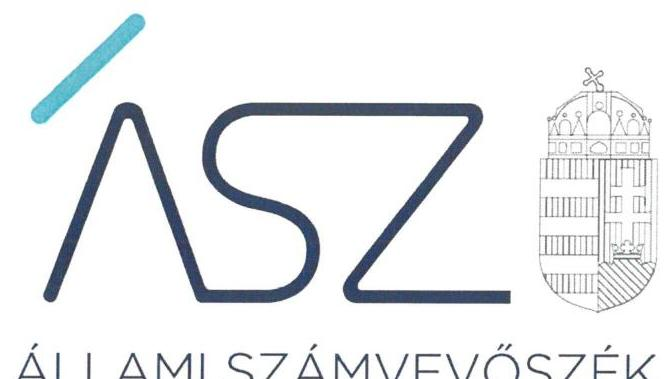
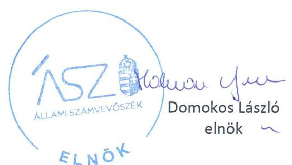

ÁLLAMI SZÁMVEVŐSZÉK

# JELENTÉS

A költségvetési támogatásban részesülő pártalapítványok 2018-2019. évi gazdálkodása törvényességének ellenőrzése

Indítsuk Be Magyarországot Alapítvány

2021.

21042
www.asz.hu

---

ÁLLAMI SZÁMVEVŐSZÉK

# JELENTÉS

A költségvetési támogatásban részesülő pártalapítványok 2018-2019. évi gazdálkodása törvényességének ellenőrzése

Indítsuk Be Magyarországot Alapítvány

2021. 06. hó 01. nap

21042
www.asz.hu

---

# AZ ELLENŐRZÉST FELÜGYELTE: 

PETŐ KRISZTINA felügyeleti vezető
KAKAS SÁNDOR felügyeleti vezető
AZ ELLENŐRZÉST VEZETTE ÉS A VÉGREHAJTÁSÁÉRT FELELŐS:
KISTÓTH KRISZTINA ellenőrzésvezető
A PROGRAM ÖSSZEÁLLÍTÁSÁÉRT FELELŐS:
GÖRGÉNYI GÁBOR ETAMO osztályvezető

IKTATÓSZÁM: EL-3194-001/2021
TÉMASZÁM: 2539
ELLENŐRZÉS-AZONOSÍTÓ SZÁM: V-0883003

---

# TARTALOMJEGYZÉK 

■ ÖSSZEGZÉS ..... 5
■ AZ ELLENŐRZÉS CÉLJA ..... 6
■ AZ ELLENŐRZÉS TERÜLETE ..... 7
■ AZ ELLENŐRZÉS HÁTTERE, INDOKOLTSÁGA ..... 8
■ A JELENTÉS LÉNYEGES KÉRDÉSKÖREI ..... 9
■ AZ ELLENŐRZÉS HATÓKÖRE ÉS MÓDSZEREI ..... 10
■ MEGÁLLAPÍTÁSOK ..... 12
■ MELLÉKLETEK ..... 15
I. sz. melléklet: Értelmező szótár ..... 15
■ FÜGGELÉK: ÉSZREVÉTELEK ..... 17
■ RÖVIDÍTÉSEK JEGYZÉKE ..... 19

---

.

---

# ÖSSZEGZÉS 

Az Indítsuk Be Magyarországot Alapítvány a 2018-2019. években kialakította gazdálkodásának szabályszerű kereteit, a kapott támogatások felhasználása és nyilvántartása szabályszerű volt. Az éves jelentéseket tevékenységéről a jogszabályi előírások szerint elkészítette.

## Az ellenőrzés társadalmi indokoltsága

A pártok a politikai kultúra fejlesztése érdekében tudományos, ismeretterjesztő, kutatási és oktatási tevékenységük elősegítésére költségvetési támogatásra jogosult alapítványt hozhatnak létre. Ezen pártalapítványok gazdálkodása törvényességének ellenőrzése a Pártalapítványi törvény szerint az Állami Számvevőszék feladata. E törvény alapján az ÁSZ kétévente - kötelező jelleggel - ellenőrzi azoknak a pártalapítványoknak a gazdálkodását, amelyek állami költségvetési támogatásban részesültek.

Az ellenőrzés a gazdálkodás szabályszerűségének bemutatásával hozzájárul ahhoz, hogy a társadalom objektív képet alkothasson a pártalapítványok működéséről. Az ellenőrzés eredménye elősegítheti, hogy a jelentésben foglalt megállapítások, következtetések és javaslatok alapján a törvényalkotók konkrét lépéseket tegyenek a pártalapítványok finanszírozására vonatkozó szabályozások megváltoztatása, átláthatóbbá, ellenőrizhetőbbé tétele irányába. Az ellenőrzött szervezetek szintjén a hiányosságok, szabálytalanságok feltárása, az ennek kapcsán megfogalmazott megállapítások csökkenthetik a működés szabályszerűségének kockázatait, elősegíthetik a pártalapítványok szabályszerű gazdálkodását. A gazdálkodás szabályszerűségének bemutatásával az ellenőrzés értékteremtő módon járul hozzá az ÁSZ stratégiai céljainak megvalósításához.

## Főbb megállapítások, következtetések

Az Indítsuk Be Magyarországot Alapítvány gazdálkodása szabályszerű szervezeti és szabályozási kereteit megteremtette, ezzel a közpénzekkel való ellenőrizhető és átlátható gazdálkodás feltételeit biztosította.

A 2018-2019. években a kapott támogatások elfogadása, felhasználása és nyilvántartása szabályszerű volt. Az Indítsuk Be Magyarországot Alapítvány tevékenységének kiadásait szabályszerűen számolta el.

Az Indítsuk Be Magyarországot Alapítvány a 2018-2019. évekre szabályszerűen elkészítette tevékenységéről a Pártalapítványi törvény szerinti éves jelentését.

---

# AZ ELLENŐRZÉS CÉLJA 

AZ ELLENŐRZÉS CÉLJA, hogy az ÁSZ¹ - mint az Országgyűlés legfőbb ellenőrző szerve - független és szakmailag megalapozott véleményt adjon a pártalapítványok, mint ellenőrzött szervezetek gazdálkodásának törvényességéről. Annak megállapítása, hogy a pártalapítvány törvényesen gazdálkodott-e, az éves számviteli beszámolók és a pártalapítvány tevékenységéről szóló éves jelentések a jogszabályi előírásoknak megfeleltek-e, a könyvvezetés és gazdálkodás során a vonatkozó jogszabályi rendelkezéseket és belső előírásokat betartották-e.

---

# **AZ ELLENŐRZÉS TERÜLETE**

## **Indítsuk Be Magyarországot Alapítvány**

Az Indítsuk Be Magyarországot Alapítványt 2018. évben hozta létre határozatlan időre a Momentum Mozgalom, 200 e Ft induló vagyonnal. A Pártalapítványt2 a Fővárosi Törvényszék 2018. december 18-án vette nyilvántartásba. A pártalapítványok törvényes gazdálkodásának (könyvvezetése, beszámolása, jelentéstétele) szabályait alapvetően a Pártalapítványi tv.3–en túl a Számv. tv.4 és annak végrehajtási rendelete Számviteli vhr.5 határozzák meg.

A Pártalapítvány Alapító okirata6 szerinti célja a politikai kultúra fejlesztése, valamint ehhez kapcsolódóan különböző tudományos, kutatási, ismeretterjesztő, oktatási tevékenység végzése, amely hozzájárul az állampolgárok közéleti ismereteinek szélesítéséhez. Céljának elérése érdekében végzett tevékenységei tudományos elemzés, közvélemény kutatás; nevelés, oktatás, ismeretterjesztés; előadások, konferenciák, rendezvények szervezése; könyvek, tanulmányok, kiadványok, dokumentumok gyűjtése, archiválása, rendszerezése, feldolgozása. Pályázatokon történő részvétel; kezdeményezések támogatása; kapcsolatok építése, ápolása és együttműködés civil szervezetekkel.

Az Alapító okirat szerint a Pártalapítvány az alapítványi cél megvalósításával közvetlenül összefüggő gazdasági tevékenység végzésére jogosult, azonban számviteli politikája szerint az ellenőrzött időszakban gazdasági vállalkozási tevékenységet nem végzett.

A Pártalapítvány ügyvezető szerve a 3 tagból álló Kuratórium7 volt, megbízásuk 5 évre szól, az ellenőrzött időszakban a tagjai összetételében nem történt változás. Tevékenységét, működésének törvényességét a három tagú Felügyelő Bizottság8 ellenőrizte. A cél szerinti tevékenységét a Pártalapítvány 2019. évben kezdte meg.

A Pártalapítvány a kettős könyvvezetése alapján egyszerűsített éves beszámolót készített. A pénzügyi és számviteli feladatokat szerződés alapján külső szervezet látta el. A Pártalapítvány könyvvizsgáló alkalmazására nem volt kötelezett, könyvvizsgálót nem bízott meg.

A Pártalapítvány – Országos Bírósági Hivatalnál letétbe helyezett – beszámolója szerint 2018. évben 7 239 e Ft és 2019. évben 74 180 e Ft költségvetési támogatásban részesült.

A Pártalapítványt az ÁSZ korábban még nem vizsgálta, az ellenőrzött időszakban külső ellenőrzés nem volt.

---

# AZ ELLENŐRZÉS HÁTTERE, INDOKOLTSÁGA 

Társadalmi elvárás a közpénzek értékelvű, rendeltetésszerű felhasználása, a közpénzekből nyújtott támogatások átláthatóságának megteremtése, amelyhez az ÁSZ az államháztartásból nyújtott támogatások ellenőrzésével kíván hozzájárulni. A Párt tv ${ }^{9}$. 9/A § (1) bekezdése alapján a politikai kultúra fejlesztése érdekében tudományos, ismeretterjesztő, kutatási, oktatási tevékenység folytatása céljából létrehozott pártalapítványok gazdálkodása törvényességének ellenőrzése - Pártalapítványi tv. 4. § (2) bekezdése értelmében - az ÁSZ feladata. E törvény 4. § (4) bekezdése alapján az ÁSZ kétévente - kötelező jelleggel - ellenőrzi azoknak a pártalapítványoknak a gazdálkodását, amelyek állami költségvetési támogatásban részesültek.

Az ÁSZ, mint az Országgyűlés ellenőrző szerve a pártalapítványok gazdálkodása törvényességének/szabályszerűségének értékelésével hozzájárul ahhoz, hogy a társadalom objektív képet alkothasson a pártalapítványok működéséről. Az ellenőrzés eredményeinek célzott felhasználói a nyilvánosság, a jogalkotó, továbbá a pártalapítványok esetén azok alapítója és szervei. A jelentésben foglalt megállapítások, következtetések és javaslatok alapján a törvényalkotók konkrét lépéseket tehetnek a pártalapítványokra vonatkozó szabályozások megváltoztatása, átláthatóbbá, ellenőrizhetőbbé tétele irányába. Az ellenőrzött szervezetek szintjén a hiányosságok, szabálytalanságok feltárása, az ennek kapcsán megfogalmazott megállapítások elősegíthetik a pártalapítványok szabályszerű gazdálkodását.

Az ÁSZ tv ${ }^{10}$. 33. § (1) bekezdése értelmében az ellenőrzött szervezet vezetője köteles a jelentésben foglalt megállapításokhoz kapcsolódó intézkedési tervet összeállítani, és azt a jelentés kézhezvételétől számított harminc napon belül az Állami Számvevőszék részére megküldeni.

---

# A JELENTÉS LÉNYEGES KÉRDÉSKÖREI 

1. Az Indítsuk Be Magyarországot Alapítvány gazdálkodásának törvényessége biztosított volt-e?
2. Az Indítsuk Be Magyarországot Alapítvány könyvvezetése és gazdálkodása során a vonatkozó jogszabályi rendelkezéseket és belső előírásokat betartották-e?
3. Az Indítsuk Be Magyarországot Alapítvány tevékenységéről szóló éves jelentések, az éves számviteli beszámolók a jogszabályi előírásoknak megfeleltek-e?

---

# AZ ELLENŐRZÉS HATÓKÖRE ÉS MÓDSZEREI 

## Az ellenőrzés típusa

Szabályszerűségi ellenőrzés.

## Az ellenőrzött időszak

2018-2019. évek.

## Az ellenőrzés tárgya

Az ellenőrzés tárgyát képezi a pártalapítvány gazdálkodása, a könyvvezetés szabályozása és gyakorlata szabályszerűsége, az éves számviteli beszámolókra és az alapítvány tevékenységéről szóló éves jelentésekre vonatkozó kötelezettség teljesítése.

Az ellenőrzés kiterjed minden olyan körülményre és adatra, amely az ÁSZ jogszabályban meghatározott feladatainak teljesítéséhez, valamint a program végrehajtása folyamán felmerült újabb összefüggések feltárásához szükséges.

## Az ellenőrzött szervezet

Indítsuk Be Magyarországot Alapítvány

## Az ellenőrzés jogalapja

Az ÁSZ tv. 1. § (3) bekezdése, 5. § (3) bekezdése, a Pártalapítványi tv. 4. § (2) és (4) bekezdései.

## Az ellenőrzés módszerei

Az ellenőrzést az Ellenőrzési program szempontjai, az ellenőrzött időszakban hatályos jogszabályok, a jelen ellenőrzésre irányadó ÁSZ módszertan figyelembe vételével kell elvégezni.

Az ellenőrzés ideje alatt az ellenőrzött szervezettel történő kapcsolattartás az ÁSZ SZMSZ ${ }^{11}$-ének vonatkozó előírásai alapján történik.

Az ellenőrzést az ellenőrzött szervezetek által rendelkezésre bocsátott dokumentumokra, adatokra kell alapozni. A rendelkezésre bocsátott adatok, információk kontrollja az ellenőrzés keretében történik. Az ellenőrzés céljának eléréséhez szükséges bizonyítékokat a számvevő az egyes adatok

---

közvetlen, részletes elemzésével szerzi meg, a következő ellenőrzési eljárások alkalmazásával: megfigyelés, szemrevételezés, információkérés, megerősítés, mintavétel, valamint elemző eljárás. Az ellenőrzésvezető indoklással kezdeményezheti a helyszínen végrehajtott szemrevételezést.

Az ÁSZ a tételes ellenőrzés mellett statisztikai alapú mintavételezést és értékelést alkalmaz. A minták kiválasztása rétegzett mintavételezéssel történik. A minta tételeinek értékelése „szabályszerű", ha a minta ellenőrzésének eredménye alapján 95\%-os bizonyossággal a teljes sokaságban az átlagos hibaarány nem haladja meg a 10\%-ot, „nem szabályszerű, ha nagyobb, mint 10\%. Abban az esetben, ha a teljes sokaság tekintetében a 10\%-os hibaarányhoz való viszony megítélésének megbízhatósága nem éri el a 95\%-ot, annak elérése érdekében az értékelés további szempontokkal egészül ki, a feltárt hibák értéke is figyelembe vételre kerül.

Az ellenőrzési bizonyítékként felhasználható adatforrások közé tartoznak egyrészt az Ellenőrzési program részletes szempontjainál felsorolt adatforrások, másrészt minden egyéb - az ellenőrzés folyamán - feltárt, az ellenőrzés szempontjából információt tartalmazó dokumentum.

Az ellenőrzés lefolytatásához az ellenőrzött a tanúsítványok elektronikus kitöltésével, valamint az ÁSZ által kért dokumentumok elektronikus megküldésével szolgáltat adatokat. Az így rendelkezésre bocsátott adatok, információk, a tanúsítványok adatai valódiságának kontrollja az ellenőrzés keretében történik.

---

# 1. Az Indítsuk Be Magyarországot Alapítvány gazdálkodásának törvényessége biztosított volt-e? 

Összegző megállapítás

A Pártalapítvány szabályszerű szervezeti és szabályozási feltételei kialakításával biztosította a törvényes gazdálkodás kereteit.

A Pártalapítvány kialakította szabályszerű szervezeti kereteit. Az Alapító Okirata a Ptk. ${ }^{12}$ szerint tartalmazta a Pártalapítvány célját, fő tevékenységét, a részére teljesítendő vagyoni hozzájárulásokat, a vagyon felhasználási módját, a kezelésének szabályait, szerveinek hatáskörét és eljárási szabályait. A Kuratórium munkamódját az Ügyrendben ${ }^{13}$, a képviselet és a kötelezettségvállalás rendjét az SZMSZ ${ }^{14}$-ben rögzítették.

A Pártalapítvány - megalakulását követő 90 napon belül - a Számv. tv. szerint kialakította gazdálkodása belső szabályait. Rendelkezett Számviteli politikával ${ }^{15}$, és az annak keretében készítendő szabályzatokkal, elkészítette Számlarendjét ${ }^{16}$ és Bizonylati szabályzatát ${ }^{17}$.

A Pártalapítvány a Pártalapítványi tv. szerint a támogatások elfogadásának szabályait az Alapító okiratban rögzítette. A kapott támogatások elkülönített nyilvántartásáról, az elszámolás, beszámolás szabályairól a Számlarend és a támogatások szabályzata ${ }^{18}$ a Számviteli vhr. előírásaival összhangban rendelkezett.

## 2. Az Indítsuk Be Magyarországot Alapítvány könyvvezetése és gazdálkodása során a vonatkozó jogszabályi rendelkezéseket és belső előírásokat betartották-e?

## Összegző megállapítás

A Pártalapítvány könyvvezetése és gazdálkodása a 2018-2019. években szabályszerű volt.

A Pártalapítvány a 2019. évben a külföldről származó támogatást a Pártalapítványi tv. előírásai szerint fogadta el. 2018-2019. években a kapott költségvetési, a 2019. évben a külföldről kapott támogatásokat a Számviteli vhr., valamint a belső szabályzatok előírásait betartva elkülönítetten tartotta nyilván.

A Pártalapítvány tevékenysége kiadásainak elszámolása szabályszerű volt, érvényesültek a Számv. tv., a Számviteli politika, a Számlarend és az SZMSZ előírásai.

---

# 3. Az Indítsuk Be Magyarországot Alapítvány tevékenységéről szóló éves jelentések, az éves számviteli beszámolók a jogszabályi előírásoknak megfeleltek-e? 

Összegző megállapítás A Pártalapítvány éves jelentését a 2018-2019. évekre szabályszerűen elkészítette és közzétette.

A 2018-2019. évekre a Pártalapítvány a Pártalapítványi tv. szerinti részletezettséggel a tevékenységéről szóló éves jelentését elkészítette és határidőben közzétette.

A 2018. évi számviteli beszámoló mérlegtételeinek besorolása, azok leltárral való alátámasztottsága szabályszerű volt.

A Pártalapítvány 2018-2019. évi számviteli beszámolóit a Kuratórium szabályszerűen jóváhagyta, határidőben letétbe helyezték és közzétették.

---

.

---

# MELLÉKLETEK 

- I. SZ. MELLÉKLET: ÉRTELMEZŐ SZÓTÁR
alapítvány
adomány
gazdálkodó tevékenység
gazdasági-vállalkozási tevékenység
költségvetésből juttatott/nyújtott forrás/támogatás
pártalapítvány
támogatást nyújtó személy
törzsvagyon

Az alapítvány az alapító által az alapító okiratban meghatározott tartós cél folyamatos megvalósítására létrehozott jogi
 személy. Az alapító az alapító okiratban meghatározza az alapítványnak juttatott vagyont és az alapítvány szervezetét. Alapítvány nem alapítható gazdasági-vállalkozási tevékenység folytatására. Az alapítvány az alapítványi cél megvalósításával közvetlenül összefüggő gazdasági tevékenység végzésére jogosult. Alapítvány nem lehet korlátlan felelősségű tagja más jogalanynak, nem létesíthet alapítványt és nem csatlakozhat alapítványhoz. (Forrás: Ptk. 3:378. §, 3:379. § (1) - (3) bekezdés)
a civil szervezetnek - létesítő/alapító okiratban rögzített céljaira - ellenszolgáltatás nélkül juttatott eszköz, illetve nyújtott szolgáltatás (Forrás: Ectv ${ }^{19}$. 2. § 1. pont.)
azon tevékenységek összessége, amelyek a civil szervezet vagyoni, pénzügyi, jövedelmi helyzetére kiható gazdasági eseményt eredményeznek. (Forrás: Ectv. 2. § 10. pont.)
A jövedelem- és vagyonszerzésre irányuló vagy azt eredményező, üzletszerűen végzett gazdasági tevékenység, kivéve az adomány (ajándék) elfogadását, a létesítő okiratban meghatározott cél szerinti tevékenységet (ideértve a közhasznú tevékenységet is), 2015. november 28-tól - a pénzeszközök betétbe, értékpapírba, társasági részesedésbe történő elhelyezését és az ingatlan megszerzését, használatának átengedését és átruházását. (Forrás: Ectv. 2. § 11. pont.)
a pártalapítványoknak a Párt tv. 9/A. § (1) bekezdése és a Pártalapítványi tv. 1. § előírásainak értelmében, az éves költségvetési törvények szerint - jellemzően az 1. számú melléklet I. Országgyűlés fejezet 9. Pártalapítványok támogatás címen - az állami költségvetésből juttatott forrás/támogatás.
az államháztartás központi alrendszeréből - a Tb alap kivételével - ellenérték nélkül, pénzben nyújtott költségvetési támogatás (Forrás: Áht ${ }^{20}$. 1. § 14. pont)
a politikai kultúra fejlesztése érdekében, tudományos, ismeretterjesztő, kutatási és oktatási tevékenység folytatása céljából pártok által létrehozott, külön jogszabályban - a Pártalapítványi tv. 1. § és 3. § (1) bekezdése - meghatározott, jogi személynek minősülő egyéb szervezet, speciális jogállású alapítvány (Forrás: Párt tv. 9/A. § (1) bekezdés, Pártalapítványi tv. 1. §, Ectv. 1. § (2) bekezdés, 2. § 6. c) pont, Számv. tv. 3. § (1) bekezdése 4. pont, Számviteli vhr. 2. § (1) bekezdés I) pont)
egyértelműen azonosítható - természetes, vagy jogi - személy. (Forrás: Pártalapítványi tv. 3. § (3)-(4) bekezdése)
az induló tőke, megnövelve alapítvány esetében a csatlakozók által kifejezetten az induló tőke növelése érdekében rendelkezésre bocsátott vagyonnal (Forrás: Ectv. 2. § 28. pont)

---

.

---

# FÜGGELÉK: ÉSZREVÉTELEK 

A jelentéstervezetet a Számvevőszék 15 napos észrevételezésre megküldte az ellenőrzött szervezet vezetőinek az ÁSZ tv. 29. § (1) bekezdése előírásának megfelelően.

Az Indítsuk Be Magyarországot Alapítvány képviseletre jogosult vezetői a jelentéstervezet megállapításaira az ÁSZ tv. 29. § (2) bekezdésében foglalt határidőn belül nem tettek észrevételt.

[^0]
[^0]:    * 29. § (1) Az Állami Számvevőszék az ellenőrzési megállapításait megküldi az ellenőrzött szervezet vezetőjének vagy az általa megbízott személynek, és annak, akinek személyes felelősségét állapította meg.
    (2) Az ellenőrzött szervezet vezetője és a felelősként megjelölt személy az ellenőrzés megállapításaira tizenöt napon belül írásban észrevételt tehet.
    (3) Az Állami Számvevőszék az észrevételre a beérkezésétől számított harminc napon belül írásban válaszol. A figyelembe nem vett észrevételeket köteles a jelentésben feltüntetni, és megindokolni, hogy azokat miért nem fogadta el.

---

.

---

# RÖVIDÍTÉSEK JEGYZÉKE 

${ }^{1}$ ÁSZ
${ }^{2}$ Pártalapítvány
${ }^{3}$ Pártalapítványi tv.
${ }^{4}$ Számv. tv.
${ }^{5}$ Számviteli vhr.
${ }^{6}$ Alapító okirat
${ }^{7}$ Kuratórium
${ }^{8}$ Felügyelő Bizottság
${ }^{9}$ Párt tv.
${ }^{10}$ ÁSZ tv.
${ }^{11}$ ÁSZ SZMSZ
${ }^{12}$ Ptk.
${ }^{13}$ Ügyrend
${ }^{14}$ SZMSZ
${ }^{15}$ Számviteli politika
${ }^{16}$ Számlarend
${ }^{17}$ Bizonylati szabályzat
${ }^{18}$ támogatások szabályzata
${ }^{19}$ Ectv.
${ }^{20}$ Áht.

Állami Számvevőszék
Indítsuk Be Magyarországot Alapítvány
2003. évi XLVII. törvény a pártok működését segítő tudományos, ismeretterjesztő, kutatási, oktatási tevékenységet végző alapítványokról (hatályos: 2003. július 1-jétől)
2000. évi C. törvény a számvitelről (hatályos: 2001. január 1-jétől)

479/2016. (XII.26.) Korm. rendelet a számviteli törvény szerinti egyes egyéb szervezetek beszámoló készítési és könyvvezetési kötelezettségeinek sajátosságairól (hatályos: 2017. január 1-jétől)
Indítsuk Be Magyarországot Alapítvány alapító okirata (Nyilvántartásba vétel: A Fővárosi Törvényszék 16. Pk.60548/2018/4 sz. végzése alapján 2018. december 18-án)
az Indítsuk Be Magyarországot Alapítvány Kuratóriuma
az Indítsuk Be Magyarországot Alapítvány Felügyelő Bizottsága
1989. évi XXXIII. törvény a pártok működéséről és gazdálkodásáról (hatályos: 1989. október 30-tól)
2011. évi LXVI. törvény az Állami Számvevőszékről

Állami Számvevőszék Szervezeti és Működési Szabályzata
2013. évi V. törvény a Polgári Törvénykönyvről (hatályos: 2014. március 15-től)
az Indítsuk Be Magyarországot Alapítvány Ügyrendje (hatályos: 2019. március 18-tól)
az Indítsuk Be Magyarországot Alapítvány Szervezeti és Működési Szabályzata (hatályos: 2019. március 18-tól)
az Indítsuk Be Magyarországot Alapítvány Számviteli Politikája (hatályos: 2018. december 18-tól)
az Indítsuk Be Magyarországot Alapítvány Számlarendje (hatályos: 2018. december 18-tól)
az Indítsuk Be Magyarországot Alapítvány Bizonylati szabályzata (hatályos: 2018. december 18-tól)
Az Indítsuk Be Magyarországot Alapítvány működését segítő költségvetési támogatások, költségvetési források és egyéb támogatások elszámolásának, nyilvántartásának, beszámolási kötelezettségének szabályzata (hatályos 2019. július 1-jétől)
2011. évi CLXXV. törvény az egyesülési jogról, a közhasznú jogállásról, valamint a civil szervezetek működéséről és támogatásáról
2011. évi CXCV. törvény az államháztartásról

---

# 1052 

1052 Budapest, Apáczai Cs. J. u. 10. I 1364 Budapest 4. Pf. 54 TEL: +36 14849100
email: szamvevoszek@asz.hu
web: www.asz.hu | www.aszhirportal.hu
