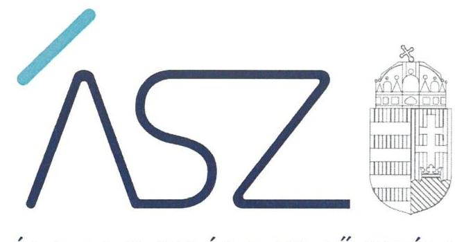
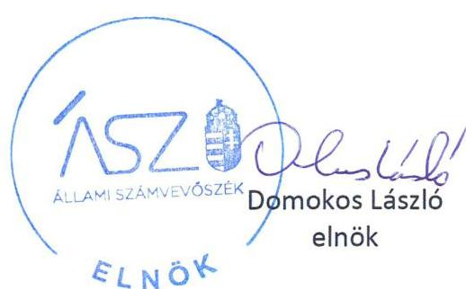

ÁLLAMI SZÁMVEVŐSZÉK

# JELENTÉS 

## A központi költségvetési szervek ellenőrzése Vagyongazdálkodás

Színház- és Filmművészeti Egyetem
2021.

21044
www.asz.hu

---

ÁLLAMI SZÁMVEVŐSZÉK

# JELENTÉS 

## A központi költségvetési szervek ellenőrzése Vagyongazdálkodás

Színház- és Filmművészeti Egyetem
2021. 04. hó 26. nap

21044
www.asz.hu

---

|  J | AZ ELLENŐRZÉST FELÜGYELTE:  |
| --- | --- |
|   | DR. PULAY GYULA ZOLTÁN felügyeleti vezető  |
|   | AZ ELLENŐRZÉST VEZETTE ÉS A VÉGREHAJTÁSÁÉRT FELELŐS:  |
|   | DR. SIMON JÓZSEF ellenőrzésvezető  |
|   | A PROGRAM ÖSSZEÁLLÍTÁSÁÉRT FELELŐS:  |
|   | GÖRGÉNYI GÁBOR osztályvezető  |
|   | DÁM-POLYÁK ORSOLYA projektvezető  |
|   | A TÉMÁHOZ KAPCSOLÓDÓ KORÁBBISZÁMVEVŐSZÉKI JELENTÉSEK:  |
|   | - címe: Jelentés Központi költségvetési szervek ellenőrzése Integritás- és belső kontroll, Vagyongazdálkodás Színház- és Filmművészeti Egyetem  |
|  Jelentéseink az Országgyúlés számítógépes hálózatán és az interneten a www.asz.hu címen is olvashatóak. | - sorszáma: 19054  |
|   | IKTATÓSZÁM: EL-3197-001/2021  |
|   | TÉMASZÁM: 2549  |
|   | ELLENŐRZÉS-AZONOSÍTÓ SZÁM: V089314  |

---

# TARTALOMJEGYZÉK 

- ÖSSZEGZÉS ..... 5
- AZ ELLENŐRZÉS CÉLJA ..... 7
- AZ ELLENŐRZÉS TERÜLETE ..... 8
- AZ ELLENŐRZÉS HÁTTERE, INDOKOLTSÁGA ..... 9
- A JELENTÉS LÉNYEGES KÉRDÉSKÖREI. ..... 10
- AZ ELLENŐRZÉS HATÓKÖRE ÉS MÓDSZEREI. ..... 11
- MEGÁLLAPÍTÁSOK ..... 13
- MELLÉKLETEK. ..... 15
I. sz. melléklet: Értelmező szótár ..... 15
- FÜGGELÉK: ÉSZREVÉTELEK ..... 17
- RÖVIDÍTÉSEK JEGYZÉKE ..... 19

---

.

---

# ÖSSZEGZÉS 

A Színház- és Filmművészeti Egyetem vagyongazdálkodása a 2018-2019. években, valamint a 2020. évben a fenntartóváltás időpontjáig nem volt átlátható és elszámoltatható, nem biztosította a közfeladat ellátását szolgáló nemzeti vagyon megőrzését és védelmét.

## Az ellenőrzés társadalmi indokoltsága

Az államháztartás központi alrendszerébe tartozó szervezet vagyona a nemzeti vagyon része. Magyarország Alaptörvénye rögzíti, hogy a vagyonnal való gazdálkodás célja a közérdek szolgálata. Magyarország versenyképessége szoros kapcsolatban van a felsőoktatás minőségével, amely nem képzelhető el hatékony és eredményes közpénz felhasználás nélkül.

Az ellenőrzést indokolja az is, hogy a Színház- és Filmművészeti Egyetem is a felsőoktatási modellváltással érintett intézmények közé tartozik. A vagyonjuttatásról rendelkező jogszabály szerint: „A művészeti képzési terület, ezen keresztül az innovációt támogatni kész magyar felsőoktatási intézményrendszer és környezetének megerősítése, a képzést folytató oktatók, kutatók, tanárok, a képzésben részt vevők támogatása érdekében" a Színház- és Filmművészeti Egyetem fenntartói jogait, amelyeket eddig az állam nevében az illetékes miniszter gyakorolt, a kormány által létrehozott közérdekű vagyonkezelő alapítvány vette át, és azokat az alapítvány kuratóriuma gyakorolja.

Az Állami Számvevőszék tanácsadó funkciója keretében az ellenőrzési megállapításokon keresztül támogatja a közfeladathoz kapcsolódó vagyonnal való hatékony és eredményes gazdálkodást azzal, hogy felhívja a figyelmet a fenntartó váltással érintett felsőoktatási intézmények vagyongazdálkodásának kockázatos pontjaira.

## Főbb megállapítások, következtetések

A Színház- és Filmművészeti Egyetem rendelkezett a 2018-2019. években az alapvető számviteli szabályzatokkal. A vagyongazdálkodás kereteit azonban a 2018-2019. években nem szabályszerűen alakította ki, mivel az alkalmazott számlarend nem volt összhangban a jogszabályi előírásokkal, illetve a 2019. évben nem rendelkezett az önköltségszámítás rendjére vonatkozó szabályzattal. Ezáltal nem alakította ki a szabályszerű könyvvezetés és vagyongazdálkodás alapvető feltételeit.

A Színház- és Filmművészeti Egyetem a 2018. és 2019. évi éves költségvetési beszámolók elkészítéséhez, a mérleg tételeinek alátámasztásához nem állított össze leltárt, amely tételesen, ellenőrizhető módon tartalmazza a mérlegben szereplő eszközöket és forrásokat. A leltárak hiányában a beszámolók nem nyújtottak megbízható és valós képet a vagyoni helyzetéről és ennek változásáról, ezáltal a vagyon jogszabályi előírások szerinti kimutatása nem volt biztosított.

A fenntartóváltás fordulónapjára vonatkozóan a 2020. évben a Színház- és Filmművészeti Egyetem nem készített záró beszámolót, illetve nem állított össze leltárt a rendelkezésére álló vagyoni elemekről. Ezáltal a fenntartóváltás időpontjában nem volt biztosított a számviteli nyilvántartásaiban szereplő vagyonelemek szabályszerű kimutatása, és nem volt igazolt azok megléte. E törvénysértés miatt indokolt munkajogi eljárást az ÁSZ azért nem kezdeményezett, mert a kancellár foglalkoztatási jogviszonya időközben megszűnt.

A 2018-2019. években a Színház- és Filmművészeti Egyetem működésében és gazdálkodásában a teljesítményelv nem érvényesült.

Az ellenőrzés megállapításai alapján levonható a következtetés, hogy a Színház- és Filmművészeti Egyetemen a kancellári rendszer bevezetése sem biztosította a nemzeti vagyon védelmét, indokolt volt a tulajdonosi joggyakorlás kereteinek megerősítése.

---

A modellváltásra tekintettel az ÁSZ az ellenőrzött szervezet részére javaslatokat nem fogalmazott meg, hanem elnöki levélben hívta fel a Színház- és Filmművészeti Egyetemet fenntartó kuratórium elnökének figyelmét az ellenőrzés által feltárt hiányosságok megszüntetésének szükségességére.

---

# AZ ELLENŐRZÉS CÉLJA 

AZ ELLENŐRZÉS CÉLJA annak megállapítása volt, hogy a központi költségvetési szerv a fenntartóváltás előtt a jó gazda gondosságával biztosította-e a nemzeti vagyon értékének megőrzését, védelmét és szabályszerű kezelését, illetve kimutatását. Az államháztartás központi alrendszerébe tartozó szervezet vagyongazdálkodása elszámoltatható volt-e és megfelelt-e annak az Alaptör-vény1-ben meghatározott alapvetésnek, hogy Magyarország a kiegyensúlyozott, átlátható és fenntartható költségvetési gazdálkodás elvét érvényesíti.

---

# AZ ELLENŐRZÉS TERÜLETE

## Színház- és Filmművészeti Egyetem

A Színház- és Filmművészeti Egyetem felett az alapítói jogok gyakorlója az Országgyűlés, irányító szerve és fenntartója az ellenőrzött időszakban 2019. szeptember 1-ig az Emberi Erőforrások Minisztériuma, 2019. szeptember 1-től az Innovációs és Technológiai Minisztérium volt.

Az Egyetem2 jogi státusza, 2020. augusztus 1-től a 2020. évi LXXII. tv.3 szerint közérdekű vagyonkezelő alapítvány fenntartásában álló felsőoktatási intézményre változott.

Az Egyetem alaptevékenysége felsőfokú oktatás, közfeladata oktatási, tudományos kutatási és művészeti alkotótevékenység folytatása volt. Illetékessége, működési területe Magyarország területe, a felvehető maximális hallgatólétszáma 548 fő volt.

Az Egyetem alaptevékenységért felelős első számú vezetője és képviselője a rektor volt, a felsőoktatási intézmény működtetését a kancellár végezte. A rektor személye 2019. március 4-től változott, a kancellár személyében az ellenőrzött időszakban változás nem történt.

A 2019. évi éves költségvetési beszámoló adatai alapján az Egyetem teljesített összes bevétele 2 062,4 M Ft, a teljesített összes kiadása 1 949,6 M Ft. Az Egyetem rendelkezésére álló vagyonról nem volt megbízható adat.

---

# AZ ELLENŐRZÉS HÁTTERE, INDOKOLTSÁGA 

Az államháztartás központi alrendszerébe tartozó szervezet vagyona a nemzeti vagyon része, mellyel történő gazdálkodás a közérdek szolgálata érdekében történik. Az ÁSZ ${ }^{4}$ ellenőrzi az éves költségvetési törvény végrehajtását, majd az ellenőrzés során feltárt kockázatok és a terület folyamatos kockázat-elemzésével beazonosított kockázatok kezelése érdekében ráépülő ellenőrzésekkel ellenőrzi a költségvetési szervek gazdálkodását, működését. Ezáltal az ellenőrzések megállapításaival támogatja az ellenőrzött szervezetek szabályszerű gazdálkodását, javaslataival elősegíti az Alaptörvényben megfogalmazott alapvetések érvényesülését a mindennapi életben a szervezetek szintjén.

Az Nftv. ${ }^{5}$ előírásai értelmében a magyar állam által működtetett felsőoktatási Intézmény fenntartói joga, mint vagyoni értékű jog - a Kormány külön engedélyével - a Kormányáltal létrehozott alapítványraátruházható. A fenntartóváltással érintett felsőoktatási intézménynek az Nftv. előírásai alapján a fenntartóváltás napját megelőző fordulónappal az államháztartási számviteli szabályok szerinti záró beszámolót kell készítenie.

A központi költségvetés rendszerében zajló folyamatok holisztikus elemzései, a kockázatok folyamatos figyelemmel kísérésének módszerével, az így kiválasztott szervezetek célzott, hatékony ellenőrzéseivel az ÁSZ betölti a legfőbb gazdasági ellenőrző szerv küldetését.

---

# A JELENTÉS LÉNYEGES KÉRDÉSKÖREI 

1.     - Biztosított volt-e az Egyetemnél a vagyongazdálkodás szabályozottsága?
2.     - A nemzeti vagyon nyilvántartását és kimutatását a valóságnak megfelelő módon, szabályszerűen végezte-e az Egyetem, biztosított volt-e a nemzeti vagyon védelme?
3.     - Az Egyetem a fenntartóváltás során a használatában levő vagyontárgyakat szabályszerűen mutatta-e ki a záró beszámolójában, biztosított volt-e a nemzeti vagyon megőrzése?
4.     - Az Egyetemnél kialakították-e a teljesítmény mérésére alkalmas követelményeket?

---

# AZ ELLENŐRZÉS HATÓKÖRE ÉS MÓDSZEREI 

## Az ellenőrzés típusa

| Megfelelőségi ellenőrzés.

## Az ellenőrzött időszak

A 2018. és 2019. év, valamint 2020. január 1-jétől a felsőoktatási intézmény Nftv. szerinti fenntartóváltásának napjáig tartó időszak.

## Az ellenőrzés tárgya

A központi költségvetési szerv vagyongazdálkodási feltételeinek kialakítása, annak szabályszerűsége, az elszámoltathatóság biztosítása a szabályozás szintjén. Az intézmény könyveiben, mérlegében kimutatott nemzeti vagyon nyilvántartásának szabályszerűsége, vagyon kimutatása, értékelése és a mérleg leltárral való alátámasztásának szabályszerűsége. Az intézménynél hozott vagyonváltozást eredményező döntések, a vagyonban bekövetkezett változások végrehajtásának, elszámolásának szabályszerűsége.

A felsőoktatási intézmény záró beszámolójában kimutatott nemzeti vagyon kimutatása és a mérleg leltárral való alátámasztásának szabályszerűsége.

## Az ellenőrzött szervezet

Színház- és Filmművészeti Egyetem

## Az ellenőrzés jogalapja

Az ellenőrzés jogszabályi alapját az ÁSZtv. ${ }^{6}$ 1. § (3) bekezdés, az 5. § (2)-(4) és (6) bekezdései, valamint az Áht. ${ }^{7}$ 61. § (2) bekezdésének előírásai képezték.

## Az ellenőrzés módszerei

Az ÁSZ az ellenőrzést az ellenőrzési program szempontjai, az ellenőrzött időszakban hatályos jogszabályok, az ellenőrzés szakmai szabályai, a jelen ellenőrzésre irányadó ÁSZ módszertanok figyelembevételével hajtotta végre. Az 1-2. és 4. kérdéskör tekintetében az ellenőrzés a 2018-2019.

---

évekre vonatkozott, a 3. kérdéskör esetében az ellenőrzött időszak 2020. január 1-jétől a felsőoktatási intézmény Nftv. szerinti fenntartóváltásának napjáig tartott.

Az ellenőrzési kérdések megválaszolásához szükséges bizonyítékok megszerzése az ellenőrzött szervezet által rendelkezésre bocsátott dokumentumokra és adatokra alapozva, továbbá megfigyelés, szemle (szemrevételezés), kérdésfeltevés (információkérés), valamint elemző eljárás útján történt. Az ellenőrzési bizonyítékként felhasználható adatforrások közé tartoztak az ellenőrzési program részletes szempontjainál felsorolt adatforrások, valamint minden egyéb - az ellenőrzés folyamán feltárt, az ellenőrzés szempontjából információt tartalmazó - dokumentum.

Az ellenőrzés lefolytatásához az ellenőrzött szervezet tanúsítvány kitöltésével, valamint az ÁSZ által kért dokumentumok megküldésével szolgáltatott adatokat, amelyekről az ellenőrzött szervezet vezetője teljességi és hitelességi nyilatkozatot állított ki. A rendelkezésre bocsátott dokumentumok, adatok és információk kontrollja az ellenőrzés keretében történt.

---

# 1. Biztosított volt-e az Egyetemnél a vagyongazdálkodás szabályozottsága? 

Összegző megállapítás Az Egyetemnél a vagyongazdálkodás szabályozottsága a 20182019. években nem volt biztosított.

Az Egyetem a 2018-2019. években a Számv. tv. ${ }^{8}$ és az Áhsz. ${ }^{9}$ előírásával összhangban rendelkezett számviteli politikával ${ }^{10}$, valamint a számviteli politika keretében elkészítendő eszközök és források leltárkészítési és leltározási szabályzatával ${ }_{1,2}{ }^{11}$, illetve az eszközök és források értékelési szabályzatával ${ }_{1,2}{ }^{12}$.

Az Egyetem az Áhsz. előírása szerint rendelkezett számlarenddel ${ }^{13}$, azonban a számlarend nem volt összhangban a jogszabályi előírásokkal, mivel nem tartalmazta az Áhsz. 51. § (3) bekezdésében szereplő rendelkezés ellenére
$\longrightarrow$ a részletező nyilvántartások kapcsolódó könyvviteli és nyilvántartási számlákkal való egyeztetésének dokumentálását,
$\longrightarrow$ valamint az összesítő bizonylat tartalmi és formai követelményeit.
Az Egyetem a 2019. évben nem rendelkezett a Számv. tv. 14. § (5) bekezdés c) pontjában, illetve az Áhsz. 50. § (1) bekezdésében előírt rendelkezés ellenére az önköltségszámítás rendjére vonatkozó belső szabályzattal.

## 2. A nemzeti vagyon nyilvántartását és kimutatását a valóságnak megfelelő módon, szabályszerűen végezte-e az Egyetem, biztosított volt-e a nemzeti vagyon védelme?

Összegző megállapítás Az Egyetem a nemzeti vagyon védelmét nem biztosította, mivel a 2018-2019. évi beszámolót leltárral nem támasztotta alá.

Az Egyetem a 2018. és a 2019. évben nem készített az Áhsz. 5. § (1) bekezdésében és 22. § (1) bekezdésében, valamint a Számv. tv. 69. § (1) bekezdésében előírtak szerinti leltárt, amely tételesen és ellenőrizhető módon tartalmazta a mérlegben szereplő eszközöket és forrásokat mennyiségben és értékben. A leltár hiánya miatt a központi költségvetési szerv vagyonnal való gazdálkodása során a 2018. és a 2019. évben nem biztosította a nemzeti vagyon védelmét.

A leltár hiánya miatt az ellenőrzött szervezet vagyonkimutatása nem volt megalapozott, ennek következtében a költségvetési beszámolójának mérlege nem volt alátámasztott, az abban szereplő vagyonelemek megléte nem igazolt.

---

Mindennek következtében a központi költségvetési szervnél nem érvényesült a felelős vagyongazdálkodás.

Az Egyetem a kötelezettségvállalásra, teljesítés igazolására jogosult személyekről és aláírás-mintájukról az Ávr. ${ }^{14}$ előírásával összhangban naprakész nyilvántartást vezetett a 2018-2019. években.

# 3. Az Egyetem a fenntartóváltás során a használatában levő vagyontárgyakatszabályszerűen mutatta-e ki a záró beszámolójában, biztosított volt-e a nemzeti vagyon megőrzése? 

Összegző megállapítás

A nemzeti vagyon megőrzése - a megelőző időszakkal megegyezően - nem volt biztosított az Egyetemnél, mivel a záró beszámolót nem támasztotta alá leltárral.

Az Egyetem a vagyonnal való gazdálkodása során 2020. január 1. és 2020. július 31. között nem biztosította a nemzeti vagyon védelmét,

- a nemzeti vagyon kimutatását nem szabályszerűen vezette, mert az Nftv. 117/C. § (4a) bekezdésében és az Áhsz. 5. § (1) bekezdésében előírtak ellenére nem készítette el a fenntartóváltás napját megelőző fordulónappal a záró beszámolót;
- a nemzeti vagyon kimutatását nem szabályszerűen végezte, mert az Nftv. 117/C. § (4a) bekezdésében szereplő előírás ellenére - nem készített az Áhsz. 5. § (1) bekezdésében és a 22. § (1) bekezdésében előírtak szerinti leltárt, amelytételesen és ellenőrizhető módon tartalmazta volna a számviteli nyilvántartásaiban szereplő eszközöket és forrásokat mennyiségben és értékben.

## 4. Az Egyetemnél kialakították-e a teljesítmény mérésére alkalmas követelményeket?

## Összegző megállapítás

Az Egyetem nem alakította ki a teljesítmény mérésére alkalmas követelményeket a 2018-2019. években.

A szervezeti célok elérését szolgáló feladatok, folyamatok tevékenységek mérését szolgáló indikátorokat, mérőszámokat, feladat- és teljesítménymutatókat az Egyetem a 2018-2019. években nem képzett. Ezáltal nem teremtette meg a Bkr. ${ }^{15} 4$. § a) pontjának előírása ellenére azon feltételt, hogy biztosítsa a költségvetési szerv valamennyi tevékenységének és céljának összhangját a gazdaságosság, hatékonyság és eredményesség követelményeivel.

---

# MELLÉKLETEK 

## I. SZ. MELLÉKLET: ÉRTELMEZŐ SZÓTÁR

állami vagyon
a) az állam tulajdonában lévő dolog, valamint a dolog módjára hasznosítható természeti erő,
b) az a) pont hatálya alá nem tartozó mindazon vagyon, amely vonatkozásában törvény az állam kizárólagos tulajdonjogát nevesíti,
c) az állam tulajdonában lévő tagsági jogviszonyt megtestesítő értékpapír, illetve az államot megillető egyéb társasági részesedés,
d) az államot megillető olyan immateriális, vagyoni értékkel rendelkező jogosultság, amelyet jogszabály vagyoni értékű jogként nevesít,
e) az állam tulajdonában lévő pénzügyi eszközök.
(Forrás: Vtv. ${ }^{16}$ 1. § (2) bekezdése)
állami vagyon kezelője /vagyonkezelő
Az állami tulajdonában álló vagyon tekintetében - a nemzeti vagyonról szóló törvényben vagyonkezelőként meghatározott azon személy, amellyel az állami vagyon vagyonkezelésére a Magyar Nemzeti Vagyonkezelő Zrt. valamint annak jogelődje, vagy az állami tulajdonosi joggyakorlója vagyonkezelési szerződést kötött, továbbá akit törvény vagyonkezelőnek kijelölt. (Forrás: Vtvr. ${ }^{17}$ 1. § (7) bekezdés b) pontja és az Nvtv. ${ }^{18}$ 3. § 19. a) pontja)
irányító szerv
nemzeti vagyon

A költségvetési szerv tekintetében az e törvényben meghatározott irányítási hatáskört gyakorló szerv. (Forrás: Áht. 1. § 9. pontja)
a) az állam vagy a helyi önkormányzat kizárólagos tulajdonában álló dolgok,
b) az a) pont hatálya alá nem tartozó, az állam vagy a helyi önkormányzat tulajdonában lévő dolog,
c) az állam vagy a helyi önkormányzat tulajdonában lévő pénzügyi eszközök, továbbá az államot vagy a helyi önkormányzatot megillető társasági részesedések,
d) az államot vagy a helyi önkormányzatot megillető bármely vagyoni értékkel rendelkező jogosultság, amelyet jogszabály vagyoni értékű jogként nevesít,
e) Magyarország határa által körbezárt terület feletti légtér,
f) az üvegházhatású gázok kibocsátási egységeinek kereskedelméről szóló törvény szerinti kibocsátási egység és légiközlekedési kibocsátási egység, valamint az ENSZ Éghajlatváltozási Keretegyezménye és annak Kiotói Jegyzőkönyve végrehajtási keretrendszeréről szóló törvény szerinti kiotói egység,
g) állami vagy helyi önkormányzati fenntartású közgyűjtemény (muzeális intézmény, levéltár, közgyűjteményként működő kép- és hangarchívum, valamint könyvtár) saját gyűjteményében nyilvántartott kulturális javak körébe tartozó dolog, kivéve, ha az állami vagy önkormányzati tulajdon jogszerű létrejötte kétséget kizáró módon nem bizonyítható és a dologra nézve más a tulajdonjogát bizonyítja vagy a kulturális javakra vonatkozó jogszabályokban meghatározott eljárás keretében valószínűsíti,
h) a régészeti lelet,
i) a nemzeti adatvagyon körébe tartozó állami nyilvántartások fokozottabb védelméről szóló törvény szerinti nemzeti adatvagyon (Forrás: Nvtv. 2. § (2) bekezdés a)-i) pontok).

---

tulajdonosi joggyakorló vagyongazdálkodás

Aki a nemzeti vagyon felett az államot vagy a helyi önkormányzatot megillető tulajdonosi jogok és kötelezettségek összességének gyakorlására jogosult. (Forrás: Nvtv. 3. § (1) bekezdés 17. pontja)

A nemzeti vagyongazdálkodás feladata a nemzeti vagyon rendeltetésének megfelelő, az állam, az önkormányzat mindenkori teherbíró képességéhez igazodó, elsődlegesen a közfeladatok ellátásához és a mindenkori társadalmi szükségletek kielégítéséhez szükséges, egységes elveken alapuló, átlátható, hatékony és költségtakarékos müködtetése, értékének megőrzése, állagának védelme, értéknövelő használata, hasznosítása, gyarapítása, továbbá az állam vagy a helyi önkormányzat feladatának ellátása szempontjából feleslegessé váló vagyontárgyak elidegenítése. (Forrás: Nvtv. 7. § (2) bekezdése)

---

# FÜGGELÉK: ÉSZREVÉTELEK 

A jelentéstervezetet a Számvevőszék 15 napos észrevételezésre megküldte az ellenőrzött szervezet vezetőjének az ÁSZ tv. 29. §* (1) bekezdése elöírásának megfelelően.

A Színház- és Filmművészeti Egyetem általános rektorhelyettese és kancellárja az ÁSZ tv. 29. § (2) bekezdésében foglalt észrevételezési jogával nem élt, a jelentéstervezetre észrevételt nem tett.

[^0]
[^0]:    * 29. § (1) Az Állami Számvevőszék az ellenőrzési megállapításait megküldi az ellenőrzött szervezet vezetőjének vagy az általa megbízott személynek, és annak, akinek személyes felelősségét állapította meg.
    (2) Az ellenőrzött szervezet vezetője és a felelősként megjelölt személy az ellenőrzés megállapításaira tizenöt napon belül írásban észrevételt tehet.
    (3) Az Állami Számvevőszék az észrevételre a beérkezésétől számított harminc napon belül írásban válaszol. A figyelembe nem vett észrevételeket köteles a jelentésben feltüntetni, és megindokolni, hogy azokat miért nem fogadta el.

---

.

---

# RÖVIDÍTÉSEKJEGYZÉKE 

${ }^{1}$ Alaptörvény
${ }^{2}$ Egyetem
${ }^{3}$ 2020. évi LXXII. tv.
${ }^{4}$ ÁSZ
${ }^{5}$ Nftv.
${ }^{6}$ ÁSZ tv.
${ }^{7}$ Áht.
${ }^{8}$ Számv. tv.
${ }^{9}$ Áhsz.
${ }^{10}$ számviteli politika
${ }^{11}$ leltárkészítési és leltározási szabályzat ${ }_{1}$
leltárkészítési és leltározási szabályzat ${ }_{2}$
${ }^{12}$ értékelési szabályzat ${ }_{1}$
értékelési szabályzat ${ }_{2}$
${ }^{13}$ számlarend
${ }^{14}$ Ávr.
${ }^{15}$ Bkr.
${ }^{16}$ Vtv.
${ }^{17}$ Vtvr.
${ }^{18} \mathrm{Nvtv}$.

Magyarország Alaptörvénye (hatályos 2012. január 1-jétől)
Színház- és Filmművészeti Egyetem
2020. évi LXXII. törvény a Színház- és Filmművészetért Alapítványról, a Színház- és Filmművészetért Alapítvány és a Színház- és Filmművészeti Egyetem részére történő vagyonjuttatásról (hatályos 2020. július 10-től)
Állami Számvevőszék
2011. évi CCIV. törvény a nemzeti felsőoktatásról (hatályos 2012. január 1-jétől) 2011. évi LXVI. törvény az Állami Számvevőszékről (hatályos 2011. július 1-jétől) 2011. évi CXCV. törvény az államháztartásról (hatályos 2011. december 31-től) 2000. évi C. törvény a számvitelről (hatályos 2001. január 1-jétől)
4/2013. (I. 11.) Korm. rendelet az államháztartás számviteléről (hatályos 2014. január 1-jétől)
Színház- és Filmművészeti Egyetem Számviteli politika (hatályos 2016. január 1-jétől)
Színház- és Filmművészeti Egyetem Leltározási és leltárkészítési szabályzat (hatályos 2016. március 30-tól 2019. március 17-ig)
2/2019. számú kancellári utasítása Színház- és Filmművészeti Egyetem Leltározási és leltárkészítési szabályzata (hatályos 2019. március 18-tól)
Színház- és Filmművészeti Egyetem Eszközök és források értékelési szabályzata (hatályos 2016. március 30-tól 2018. január 30-ig)
1/2018. számú kancellári utasítás a Színház- és Filmművészeti Egyetem Eszközök és források értékelési szabályzata (hatályos 2018. január 31-től)
Színház- és Filmművészeti Egyetem Számlarend (hatályos 2018. január 1-jétől) 368/2011. (XII.31.) Korm. rendelet az államháztartásról szóló törvény végrehajtásáról
370/2011. (XII. 31.) Korm. rendelet a költségvetési szervek belső kontrollrendszeréről és belső ellenőrzéséről (hatályos 2012. január 1-jétől) 2007. évi CVI. törvény az állami vagyonról (hatályos 2007. szeptember 25-től) 254/2007. (X. 4.) Korm. rendelet - az állami vagyonnal való gazdálkodásról (hatályos 2007. október 4-től)
2011. évi CXCVI. törvény a nemzeti vagyonról (hatályos 2011. december 31-től)

---

# ASZ 

1052 Budapest, Apáczai Cs. J. u. 10. | 1364 Budapest 4. Pf. 54 TEL: +36 14849100
email: szamvevoszek@asz.hu
web: www.asz.hu | www.aszhirportal.hu