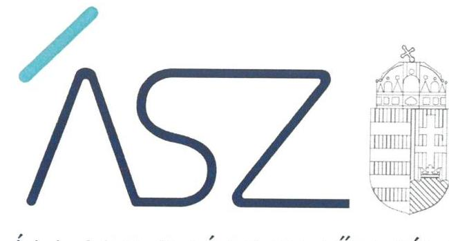

ÁLLAMI SZÁMVEVŐSZÉK

# JELENTÉS 

## A jelentős beruházások ellenőrzése

Harkányi Gyógy- és Strandfürdő fejlesztése beruházási projekt
2021.

21045
www.asz.hu

---

ÁLLAMI SZÁMVEVŐSZÉK

# JELENTÉS 

## A jelentős beruházások ellenőrzése

Harkányi Gyógy- és Strandfürdő fejlesztése beruházási projekt
2021. 05. hó 20. nap

21045
www.asz.hu

---

# AZ ELLENŐRZÉST FELÜGYELTE: 

PETŐ KRISZTINA felügyeleti vezető
VARGA EDIT felügyeleti vezető

AZ ELLENŐRZÉST VEZETTE ÉS A VÉGREHAJTÁSÁÉRT FELELŐS:
ÁRPÁSI TIBOR ellenőrzésvezető

A PROGRAM ÖSSZEÁLLÍTÁSÁÉRT FELELŐS:
NÉMETH ANITA projektvezető

IKTATÓSZÁM: EL-3195-001/2021
TÉMASZÁM: 2535
ELLENŐRZÉS-AZONOSÍTÓ SZÁM: V0879001

---

# TARTALOMJEGYZÉK 

- ÖSSZEGZÉS ..... 5
- AZ ELLENŐRZÉS CÉLJA ..... 6
- AZ ELLENŐRZÉS TERÜLETE ..... 7
- AZ ELLENŐRZÉS HÁTTERE, INDOKOLTSÁGA ..... 9
- A JELENTÉS LÉNYEGES KÉRDÉSKÖREI. ..... 10
- AZ ELLENŐRZÉS HATÓKÖRE ÉS MÓDSZEREI. ..... 11
- MEGÁLLAPÍTÁSOK ..... 13
- MELLÉKLETEK. ..... 15
I. sz. melléklet: Fogalomtár. ..... 15
- FÜGGELÉK: ÉSZREVÉTELEK ..... 17
- RÖVIDÍTÉSEK JEGYZÉKE ..... 19

---

.

---

# ÖSSZEGZÉS 

A Harkányi Gyógy- és Strandfürdő felújitásának döntés előkészitése és a megvalósitás előkészitése megfelelő volt.

## Az ellenőrzés társadalmi indokoltsága

Az Állami Számvevőszék a jelentős beruházások ellenőrzésével támogatja a közpénzek szabályos és átlátható felhasználását. A beruházás előkészítésében közreműködő szervezetnek az Alaptörvényben meghatározott alapeleek szerint kell a közpénzeket felhasználnia. A szervezet köteles kiépíteni azokat a kontrollokat, amelyek az átláthatóság, az önállóság és a felelősség, azaz elszámoltathatóság, a törvényesség, a célszerűség és az eredményesség követelményének teljesülését szolgálják. Tekintettel arra, hogy a beruházások jellemzően több tízmillió, vagy több milliárd Ft-os támogatásból valósulnak meg, ezért az Alaptörvény követelményeinek betartásához szükséges szervezeti keretek, a szabályozó eszközök kialakítása, és azok betartása a beruházási kockázatok feltárása és kezelése elvárás a szervezet felé.

Az átláthatóságlényege, hogy a szervezetnek a törvényeknek és egyéb jogszabályoknak megfelelően kell végeznie a tevékenységét és arról nyilvánosan be kell számolnia. Az elszámoltathatóság lényege a felelősség. A szervezet felelős a közfeladatai ellátásáért, a közpénzek használatáért. Az eredményesség a kitűzött célok és azok megvalósulásának összehasonlításával mérhető.

A Harkányi Gyógy- és Strandfürdő felújítása előkészítésének ellenőrzése hozzájárulhat a beruházás eredményességéhez, a beruházási folyamat transzparenciájának erősítéséhez.

## Főbb megállapítások, következtetések

Harkány Város Önkormányzata szabályszerűen határozott a Harkányi Gyógy- és Strandfürdő felújítása előkészítési tevékenységeinek megkezdéséről. A beruházás előkészítésének támogatását biztosító szerződések szabályszerűen kerültek megkötésre.

Harkány Város Önkormányzata belső szabályozottsága, szervezeti és működési folyamatai bizt osították a beruházás megfelelő előkészítését. Harkány Város Önkormányzata a Harkányi Gyógy- és Strandfürdő felújítását szabályszerűen előkészítette, az előkészítési szakaszban megkötött szerződések megfelelőek voltak.

---

# AZ ELLENŐRZÉS CÉLJA 

AZ ELLENŐRZÉS CÉLJA a beruházás eredményes megvalósulásának elősegítése érdekében, a folyamatban lévő beruházás vonatkozásában, a döntés-előkészítésétől a megvalósítás megkezdéséig felmerülő kockázatok beazonosításának és az integritási szempontok érvényesülésének értékelése.

---

# AZ ELLENŐRZÉS TERÜLETE

## A Harkányi Gyógy- és Strandfürdő felújítása előkészítésének támogatása - Harkány Város Önkormányzata

Harkány város fejlődését a gyógyvize hasznosításán alapuló idegenforgalom jelentős mértékben meghatározza. A Harkányi Gyógy- és Strandfürdő vonzerejének növelése érdekében Harkány Város Önkormányzata és Magyarország Kormánya a 2015-2018. évek önkormányzati és központi költségvetéseiben biztosított fejlesztési forrásokat.

A Kormány 2014. december 23-án az 1826/2014. (XII. 23.) Korm. határozatban1 215 M Ft átcsoportosításáról döntött Harkány város feladatainak biztonságos finanszírozása érdekében. Az Önkormányzat2 képviselő-testülete 2015. február 3-án a 27/2015. (II. 03.) számú Önkormányzati határozatában döntött arról, hogy a kormányhatározat alapján megítélt vissza nem térítendő támogatást a Gyógyfürdő3 V-VI. számú medencéjének felújítására-korszerűsítésre fordítja, valamint arról, hogy a beruházáshoz 20 M Ft önerőt biztosít.

A Kormány 2015. december 29-én a 2006/2015. (XII. 29.) Korm. határozatban4 Harkány város javára turisztikai célú beruházás címen 300 M Ft átcsoportosításáról döntött. Az Önkormányzat a 3/2016. (I. 11.) számú Önkormányzati határozatban rendelkezett arról, hogy a vissza nem térítendő támogatást a Gyógyfürdő II. számú épületének részleges felújítására-korszerűsítésre fordítja.

A Kormány 2016. december 22-én az 1818/2016. (XII. 22.) Korm. határozatban5 döntött 1000 M Ft átcsoportosításáról Harkány város javára fürdőfejlesztés érdekében nyújtott támogatás címen. Az Önkormányzat a 61/2017. (IV. 18.) számú Önkormányzati határozatban úgy döntött, hogy a kapott támogatást a Gyógyfürdő II. számú épületének részleges átalakítására, felújítására és a 3. számú medence átalakítására, korszerűsítésére fordítja. A fejlesztési cél maradéktalan megvalósítása érdekében az 1493/2018. (X. 10.) Korm. határozat6 további 47,9 M Ft infrastrukturális fejlesztési támogatást hagyott jóvá.

A beruházások (előkészítésének) támogatására vonatkozó kormánydöntések alapján a Belügyminisztérium és az Önkormányzat Támogatási szerződéseket1-37 kötött, amelyekben rögzítésre kerültek a központi költségvetési támogatások folyósításának, felhasználásnak és elszámolásának szabályai. A beruházások előkészítő fázisainak megvalósítása – engedélyezési terv készítése, engedélyeztetés lefolytatása, kivitelezési terv elkészítése, kapcsolódó beszerzési/közbeszerzési eljárások lebonyolítása – az ingatlan tulajdonosa, Harkány Város Önkormányzata feladata volt.

Az Önkormányzat a Gyógyfürdő II. számú épületének részleges átalakítását-felújítását és a 3. számú medence átalakítását-korszerűsítését szolgáló beruházás megvalósítására vonatkozó közbeszerzési hirdetményt „Az 1818/2016 (XII. 22.) Kormányhatározatban meghatározott fürdőfejlesztési

---

támogatáshoz kapcsolódó bővítési kivitelezési feladatok elvégzése" tárgyban 2017. december 7-én tette közzé.

A megvalósult beruházásokat követően a turizmus regionális fellendítése érdekében a Kormány az 1837/2018. (XII. 27.) Korm. határozatban ${ }^{8}$ biztosított támogatást a 2019-2021. évek központi költségvetésében a Gyógyfürdő további fejlesztésére. A beruházás kivitelezésére az ellenőrzött időszakot követően került sor.

Harkány Városállandó lakosainak száma 2020. január 1-én 5022 fő volt, az ellenőrzött időszakban a polgármester ${ }^{9}$ és a jegyző ${ }^{10}$ személye nem változott.

---

# AZ ELLENŐRZÉS HÁTTERE, INDOKOLTSÁGA 

A közpénzek szabályos és átlátható felhasználásának támogatása céljából az ÁSZ ${ }^{11}$ a beruházások ellenőrzését - a megvalósításra fordított költségvetési források nagyságrendjére, a beruházások révén létrehozott nemzeti vagyon hasznosítására tekintettel - kiemelt fontosságú területként kezeli.

A közpénzből megvalósuló beruházások eredményes megvalósulása érdekében indokolt már a döntés-előkészítéstől a megvalósítás megkezdéséig tartó szakaszban felmerülő kockázatok beazonosításának és a kezelésükre kidolgozott intézkedések értékelése, az átláthatóság követelményével összhangban az integritási szempontok érvényesülésének biztosítása.

A beruházások előkészítésére fókuszáló ellenőrzés megállapításainak hasznosításaként lehetőség nyílhat még a beruházás folyamatában a feltárt hiányosságok, szabálytalanságok megszüntetéséhez szükséges korrekciók megtételére, a kontrollok erősítésére.

Jelen ellenőrzés, ezáltal hozzájárulhat az ÁSZ kockázatértékelő rendszere alapján kiválasztott, államháztartásból származó forrásból finanszírozott beruházások eredményességéhez, a beruházási folyamat transzparenciájának biztosításához.

Az ellenőrzés eredményeinek célzott felhasználói a nyilvánosság, valamint a beruházások előkészítésében és megvalósításában résztvevő szervezetek.

---

# A JELENTÉS LÉNYEGES KÉRDÉSKÖREI 

1- A beruházás döntés-előkészitése szabályszerűen történt-e?
2. - A beruházás előkészitését végző ellenőrzött szervezet belső szabályozottsága, szervezeti és müködési folyamatai biztositották-e a beruházás megfelelő előkészitését?
3. - A beruházás megvalósitásának előkészitése, a beruházás előkészitése keretében megkötött szerződések megfelelőek voltak-e?

---

# AZ ELLENŐRZÉS HATÓKÖRE ÉS MÓDSZEREI 

## Az ellenőrzés típusa

| Megfelelőségi ellenőrzés.

## Az ellenőrzött időszak

A 2015-2018. évi központi vagy önkormányzati költségvetésben megjelenő beruházások első döntés-előkészítésétől a beruházás előkészítési szakaszának befejezéséig (a megvalósításra vonatkozó közbeszerzési eljárás meghirdetésének időpontjáig) terjedő időszak, azaz 2015. február 3. 2017. december 7.

## Az ellenőrzés tárgya

Az ellenőrzés a beruházást érintő önkormányzati, kormányzati beruházási döntés-előkészítést beterjesztő szervezet, valamint a beruházás előkészítését végző önkormányzat és gazdálkodási feladatait ellátó polgármesteri hivatal, költségvetési szerv, nemzeti tulajdonban lévő gazdasági társaság döntés-előkészítési és beruházás előkészítési tevékenységének müködési folyamataira, azok belső szabályozottságára, a megvalósítás előkészítésének megfelelőségére terjed ki.

## Az ellenőrzött szervezet

$\longrightarrow$ Harkány Város Önkormányzata
$\longrightarrow$ Harkányi Közös Önkormányzati Hivatal

## Az ellenőrzés jogalapja

Az ellenőrzés jogszabályi alapját az ÁSZ tv. ${ }^{12}$ 1. § (3) bekezdése és 5. § (2) - (5) bekezdései, valamint az Áht. 61. § (2) bekezdése képezték.

## Az ellenőrzés módszerei

Az ÁSZ az ellenőrzést az ellenőrzési program szempontjai, kérdései, az ellenőrzött időszakban hatályos jogszabályok, az ellenőrzés szakmai szabályai, az ÁSZ megfelelőségi ellenőrzési módszertana alapján végezte.

---

Az ellenőrzés ideje alatt az ellenőrzött szervezettel történő kapcsolattartást az ÁSZ Szervezeti és Müködési Szabályzatának vonatkozó előírásai alapján biztosította az ÁSZ.

A program ellenőrzési szempontjai a szabályszerűségi szempontok szerinti ellenőrzésben a jogszabályok, közjogi szervezetszabályozó eszközök, önkormányzati rendeletek, határozatok, további belső utasítások, belső szabályozók előírásai, a helyénvalósági szempontok szerinti ellenőrzésben az ÁSZ korábbi beruházásokat érintő ellenőrzései során beazonosított „jó gyakorlatok" és általánosan elfogadott szakmai szabályok alapján kerültek meghatározásra.

Az ellenőrzési szempontok tartalmaztak helyénvalósági kritériumokat is, amelyet az ÁSZ honlapján tett közzé. A helyénvalósági kritériumok az ellenőrzés tárgyát képező, általánosan elfogadott, jogszabályok által nem szabályozott, illetve nemzetközi vagy hazai „jó gyakorlatokon" alapuló ellenőrzési szempontok, melyek hozzájárulnak az ellenőrzött szervezetek integritásának megerősítéséhez.

Az ellenőrzési kérdések megválaszolásához szükséges bizonyítékok megszerzése a következő ellenőrzési eljárások alkalmazásával történt: megfigyelés, kérdésfeltevés (információkérés), összehasonlítás, mintavételi eljárás, valamint elemző eljárás. Az ellenőrzés végrehajtásához a rétegzett mintavételi eljárással történik a mintavétel. Az ellenőrzési bizonyítékként felhasználható adatforrások közé tartoztak egyrészt az ellenőrzési programban felsorolt adatforrások, másrészt adatforrás volt még minden - az ellenőrzés folyamán - feltárt, az ellenőrzés szempontjából információkat tartalmazó dokumentum.

Mintavételes ellenőrzésre a beruházás előkészítésére vonatkozóan, közbeszerzési eljárások eredményeként kötött szerződések, továbbá a közbeszerzési értékhatárt el nem érő beszerzések (megrendelésekre, megbízásokra) szerinti rétegzés alapján kiválasztott szerződések esetében került sor.

A mintatételek kiválasztása a közbeszerzési határértéket elérő, illetve el nem érő szerződésekből véletlen rétegzett mintavétellel történt. A vizsgált terület „szabályszerü" minősítést kapott, ha a minta ellenőrzésének eredménye alapján 95\%-os bizonyossággal a teljes sokaságban az átlagos hibaarány nem haladta meg a 10\%-ot, „nem szabályszerű" minősítést kapott, ha nagyobb volt, mint 10\%. Abban az esetben, ha a teljes sokaság tekintetében a 10\%-os hibaarányhoz való viszony megítélésének megbízhatósága nem érte el a 95\%-ot, annak elérése érdekében az értékelés további szempontokkal egészült ki, a feltárt hibák értéke is figyelembe vételre került. Amennyiben a sokaság elemszáma nem haladta meg az előírt minta elemszámot, akkor a sokaság valamennyi elemének tételes ellenőrzésére került sor.

Az ellenőrzés során minden olyan körülmény és adat is ellenőrzésre került, amely a program végrehajtása kapcsán felmerült újabb összefüggéseknek az ellenőrzés céljaival összhangban lévő feltárásához szükséges volt.

---

# 1. A beruházás döntés-előkészítése szabályszerűen történt-e? 

## Összegző megállapítás

Az Önkormányzat tevékenysége a beruházás döntés-előkészítése során szabályszerű volt.

Az Önkormányzat az Mötv. ${ }^{13}$ előírásaival összhangban az önkormányzati SZMSZ ${ }_{1,2}{ }^{14}$-ben kialakította a képviselő-testület határozathozatalához kapcsolódó előterjesztésekre vonatkozó előírásokat, a döntéshozatali eljárás, a szavazás módját. Az ellenőrzött projekt esetében a beruházások döntéselőkészítési folyamata, tartalma és formája összhangban volt az önkormányzati SZMSZ ${ }_{1,2}$-ben, a Harkányi Közös Önkormányzati Hivatal hivatali SZMSZ ${ }_{1,2}{ }^{15}$-ben előírt döntéshozatali eljárással, előterjesztéssel kapcsolatos előírásokkal.

Az Önkormányzat Képviselő-testülete a Gyógyfürdő felújítása egyes fázisainak előkészítéséről és megvalósításáról az önkormányzati SZMSZ, a hivatali SZMSZ előírásaival összhangban határozott.

Az Áht. ${ }^{16}$ előírásai alapján a költségvetési támogatás alapját képező kormányhatározatokban részletezettekkel összhangban az Önkormányzat a Belügyminisztériummal Támogatási Szerződés ${ }_{1-3}$-at kötött.

## 2. A beruházás előkészítését végző ellenőrzött szervezet belső szabályozottsága, szervezeti és múködési folyamatai biztosított-ták-e a beruházás megfelelő előkészítését?

## Összegző megállapítás

A beruházás előkészítését végző Önkormányzat belső szabályozottsága, szervezeti és múködési folyamatai biztosították a beruházás megfelelő előkészítését.

Az Önkormányzat az Mötv. és az Nvtv. ${ }^{17}$ előírásának megfelelően rendelkezett gazdasági programmal ${ }^{18}$, vagyongazdálkodási tervvel ${ }^{19}$. A gazdasági program az Mötv. előírásaival összhangban tartalmazta a Gyógyfürdő fejlesztésével kapcsolatos célkitűzéseket, feladatokat.

Az önkormányzati SZMSZ ${ }_{1,2}$-ben és a hivatali SZMSZ ${ }_{1,2}$-ben az Áht., az Mötv., valamint a Bkr. ${ }^{20}$ előírásainak megfelelően meghatározásra került az Önkormányzat és a Hivatal ${ }^{21}$ szervezete, a feladatai ellátásának részletes rendje, módja. Az Ávr. ${ }^{22}$ előírásaival összhangban a hivatali SZMSZ ${ }_{1,2}$ tartalmazta a szervezeti egységek feladatait, a nevesített munkakörökhöz tartozó feladat- és hatásköröket.

A gazdálkodás részletes rendjét meghatározó szabályzat ${ }_{1,2}{ }^{23}$-ben az Ávr. előírásai szerint rögzítették a kötelezettségvállalás, a teljesítésigazolás gyakorlásának módját, az erre jogosultak aláírás-mintáját. Az Önkormányzat az Áhsz. ${ }^{24}$ és a Számv.tv. ${ }^{25}$ előírásainak eleget téve rendelkezett Számviteli

---

politika ${ }_{1-3}{ }^{26}$-mal, Leltározási szabályzat ${ }_{1,2}{ }^{27}$-vel, valamint Értékelési szabályzat ${ }_{1-3}{ }^{28}$-mal és Számlarend ${ }_{1-4}{ }^{29}$-gyel. A Közbeszerzési szabályzat ${ }_{1,3}{ }^{30}$-ban a Kbt. ${ }_{1,2}{ }^{31}$ előírásaival összhangban meghatározták a beruházások közbeszerzési eljárásai előkészítésének, lefolytatásának, belső ellenőrzésének felelősségi rendjét, az Önkormányzat nevében eljáró személyek, valamint szervezetek felelősségi körét, a közbeszerzési eljárás dokumentálási rendjét.

Az Önkormányzatnál a beruházások előkészítése során a monitoring és beszámolási rendszereket kialakították. Az Önkormányzat az operatív tevékenysége keretében nyomon követte a beruházások állását. A beruházásokhoz kapcsolódó beszámolási és adatszolgáltatási kötelezettségét az Önkormányzat teljesítette.

# 3. A beruházás megvalósításának előkészítése, a beruházás előkészítése keretében megkötött szerződések megfelelőek voltak-e? 

## Összegző megállapítás

A Harkányi Gyógy- és Strandfürdő felújítását megfelelően készítette elő az Önkormányzat, az előkészítési szakaszban megkötött szerződések megfelelőek voltak.

Az Önkormányzat megfelelően készítette elő a beruházás megvalósítását. Az Önkormányzat elkészítette a beruházási projektek időbeli ütemezését, rendelkezett költségkalkulációkkal, költségszámítással, becsült költségvetéssel. A tervezési feladatok elvégzésére, projektmenedzsmentre, a múszaki ellenőri feladatok ellátására és a közbeszerzések lebonyolítására vonatkozó szerződéseket szabályszerűen kötötte meg az Önkormányzat. A közbeszerzési eljárás keretében megkötött szerződések eleget tettek a Kbt. ${ }_{2}$, a közbeszerzési értékhatárt el nem érő beszerzés keretében megkötött szerződések az Ávr. és az Önkormányzat Beszerzési Szabályzata ${ }^{32}$ előírásainak.

---

# MELLÉKLETEK 

- I. SZ. MELLÉKLET: FOGALOMTÁR
beruházás
beterjesztő szervezet
felújítás
jelentős beruházás
monitoring
önkormányzat

A tárgyi eszközök beszerzése, létesítése, saját vállalkozásban történő előállítása, a beszerzett tárgyi eszköz üzembe helyezése, rendeltetésszerű használatbavétele érdekében az üzembe helyezésig, a rendeltetésszerű használatbavételig végzett tevékenység (szállítás, vámkezelés, közvetítés, alapozás, üzembe helyezés, továbbá mindaz a tevékenység, amely a tárgyi eszköz beszerzéséhez hozzákapcsolható, ideértve a tervezést, az előkészítést, a lebonyolítást, a hiteligénybevételt, a biztosítást is); beruházás a meglévő tárgyi eszköz bővítését, rendeltetésének megváltoztatását, átalakítását, élettartamának, teljesítőképességének közvetlen növelését eredményező tevékenység is, az előbbiekben felsorolt, e tevékenységhez hozzákapcsolható egyéb tevékenységekkel együtt. (Forrás: Számv. tv. 3. § (4) bekezdés 7. pont). A jelentős beruházásokat érintően beruházásnak tekintjük az immateriális javak beszerzését is.
A beruházási döntésre vonatkozó előterjesztésért felelős képviselő-testület bizottsága, polgármester, és/vagy a beruházási döntésre vonatkozó előterjesztésért felelős minisztérium.
Az elhasználódott tárgyi eszköz eredeti állaga (kapacitása, pontossága) helyreállítását szolgáló, időszakonként visszatérő olyan tevékenység, amely mindenképpen azzal jár, hogy az adott eszköz élettartama megnövekszik, eredeti múszaki állapota, teljesítőképessége megközelítően vagy teljesen visszaáll, az előállított termékek minősége vagy az adott eszköz használata jelentősen javul és így a felújítás pótlólagos ráfordításából a jövőben gazdasági előnyök származnak; felújítás a korszerűsítés is, ha az a korszerű technika alkalmazásával a tárgyi eszköz egyes részeinek az eredetitől eltérő megoldásával vagy kicserélésével a tárgyi eszköz üzembiztonságát, teljesítőképességét, használhatóságát vagy gazdaságosságát növeli; a tárgyi eszközt akkor kell felújítani, amikor a folyamatosan, rendszeresen elvégzett karbantartás mellett a tárgyi eszköz oly mértékben elhasználódott (szerkezeti elemei elöregedtek), amely elhasználódottság már a rendeltetésszerű használatot veszélyezteti; nem felújítás az elmaradt és felhalmozódó karbantartás egyidőben való elvégzése, függetlenül a költségek nagyságától. (Forrás: Számv.tv. 3. § (4) bekezdés 8. pont)

Jelentős beruházás az a beruházás, amelyet az ÁSZ kockázatelemzés alapján annak tekint. A kockázat-elemzés során figyelembe vett szempontok: a beruházás háttere, funkciója, bekerülési értéke, a szervezet költségvetéséhez, gazdasági társaság esetén mérlegfőösszegéhez való nagyságrendi viszonya, beruházás megvalósítási költségében a központi költségvetési támogatás részaránya.
A monitoring általánosságban a különböző szintű szervezeti célok megvalósításának folyamatát kíséri figyelemmel, melynek során a releváns eseményekről és tevékenységekről (együtt: folyamatokról) rendszeres jelleggel, strukturált, döntéstámogató információkhoz jutnak a szervezet vezetői. (Forrás: NGM Államháztartási Belső Kontroll Standardok és Gyakorlati Útmutató, 2017. szeptember)
A helyi önkormányzat jogi személy. Az önkormányzati feladatok ellátását a képviselő-testület és szervei biztosítják. A képviselő-testület szervei: a polgármester, a főpolgármester, a megyei közgyűlés elnöke, a képviselő-testület bizottságai, a részönkormányzat testülete, a polgármesteri hivatal, a megyei önkormányzati hivatal, a közös önkormányzati hivatal, a jegyző, továbbá a társulás. A képviselő-testület a

---

feladatkörébe tartozó közszolgáltatások ellátására - jogszabályban meghatározottak szerint - költségvetési szervet, a Polgári perrendtartásról szóló 2016. évi CXXX. törvény szerinti gazdálkodó szervezetet (a továbbiakban: gazdálkodó szervezet), nonprofit szervezetet és egyéb szervezetet (a továbbiakban együtt: intézmény) alapíthat, továbbá szerződést köthet természetes és jogi személlyel vagy jogi személyiséggel nem rendelkező szervezettel. (Forrás: Mótv. 41. § (1), (2), (6) bekezdései).

---

# FÜGGELÉK: ÉSZREVÉTELEK 

A jelentéstervezetet a Számvevőszék 15 napos észrevételezésre megküldte az ellenőrzött szervezetek vezetőinek az ÁSZ tv. 29. §* (1) bekezdése elöírásának megfelelően.

Az ellenőrzött szervezetek vezetői a jelentéstervezet megállapításaira nem tettek észrevételt.

[^0]
[^0]:    * 29. § (1) Az Állami Számvevőszék az ellenőrzési megállapításait megküldi az ellenőrzött szervezet vezetőjének vagy az általa megbízott személynek, és annak, akinek személyes felelősségét állapította meg.
    (2) Az ellenőrzött szervezet vezetője és a felelősként megjelölt személy az ellenőrzés megállapításaira tizenöt napon belül írásban észrevételt tehet.
    (3) Az Állami Számvevőszék az észrevételre a beérkezésétől számított harminc napon belül írásban válaszol. A figyelembe nem vett észrevételeket köteles a jelentésben feltüntetni, és megindokolni, hogy azokat miért nem fogadta el.

---

.

---

# RÖVIDÍTÉSEKJEGYZÉKE 

${ }^{1}$ 1826/2014. (XII. 23.) Korm. határozat
${ }^{2}$ Önkormányzat
${ }^{3}$ Gyógyfürdő
${ }^{4}$ 2006/2015. (XII. 29.) Korm. határozat
${ }^{5}$ 1818/2016. (XII. 22.) Korm. határozat
${ }^{6}$ 1493/2018. (X. 10.) Korm. határozat
${ }^{7}$ Támogatási szerződés ${ }_{1}$

Támogatási szerződés ${ }_{2}$

Támogatási szerződés ${ }_{3}$
${ }^{8}$ 1837/2018. (XII. 27.) Korm. határozat
${ }^{9}$ polgármester
${ }^{10}$ jegyző
${ }^{11}$ ÁSZ
${ }^{12}$ ÁSZ tv.
${ }^{13}$ Mötv
${ }^{14}$ önkormányzati SZMSZ ${ }_{1}$
önkormányzati SZMSZ ${ }_{2}$
${ }^{15}$ hivatali SZMSZ ${ }_{1}$
hivatal SZMSZ ${ }_{2}$
${ }^{16}$ Áht.
${ }^{17}$ Nvtv.
${ }^{18}$ gazdasági program
${ }^{19}$ vagyongazdálkodási terv
${ }^{20}$ Bkr.
${ }^{21}$ Hivatal

1826/2014. (XII. 23.) Korm. határozat egyes önkormányzatok feladatainak támogatása érdekében történő előirányzat-átcsoportosításokról
Harkány Város Önkormányzata
Harkányi Gyógy- és Strandfürdő
2006/2015. (XII. 29.) Korm. határozat egyes önkormányzatok feladatainak támogatása érdekében történő előirányzat-átcsoportosításokról
1818/2016. (XII. 22.) Korm. határozat egyes önkormányzatok feladatainak támogatása érdekében történő előirányzat-átcsoportosításokról
1493/2018. (X. 10.) Korm. határozat rendkívüli kormányzati intézkedésekre szolgáló tartalékból történő átcsoportosításról, az egyes kiemelt kormányzati kötelezettségek végrehajtásáról és a további szükséges intézkedésekről szóló
A Belügyminisztérium és az Önkormányzat között 2015. február 27-én létrejött 896-19/2015. számú Támogatási megállapodás 215 M Ft 100\%-os intenzitású támogatásról
A Belügyminisztérium és az Önkormányzat között 2016. február 29-én létrejött 204-26/2016. számú Támogatási szerződés 300 M Ft 100\%-os intenzitású támogatásáról
A Belügyminisztérium által 2018. február 2-án kiadott BMÖGF/125-2/2018. számú Támogatói okirat 1000 M Ft 100\%-os intenzitású támogatásáról
1837/2018. (XII. 27.) Korm. határozat a Harkányi Gyógy- és Strandfürdő fejlesztéséhez szükséges egyes intézkedésekről
Harkány Város polgármestere
Harkányi Közös Önkormányzati Hivatal jegyzője
Állami Számvevőszék
2011. évi LXVI. törvény az Állami Számvevőszékről (hatályos 2011. július 1-jétől)
2011. évi CLXXXIX. törvény Magyarország helyi önkormányzatairól

Harkány Város Önkormányzat Képviselő-testületének 8/2011. (IV. 13.) számú rendelete a Szervezeti és Müködési Szabályzatról (hatályos 2011. május 1-jétől 2016. december 31-éig)

Harkány Város Önkormányzat Képviselő-testületének 26/2016. (XII. 27.) számú rendelete a Szervezeti és Müködési Szabályzatról (hatályos 2017. január 1-jétől)
A Harkányi Közös Önkormányzati Hivatal Szervezeti és Müködés Szabályzata (hatályos: 2015. április 15-étől)
A Harkányi Közös Önkormányzati Hivatal Szervezeti és Müködés Szabályzata (hatályos: 2016. november 1-jétől)
2011. évi CXCV. törvény az államháztartásról
2011. évi CXCVI. törvény a nemzeti vagyonról

77/2015. (IV. 21.) számú Önkormányzati határozattal elfogadott Harkány Város Önkormányzatának Gazdasági programja 2015-2019. évekre
78/2013. (V. 30.) számú Önkormányzati határozattal elfogadott Harkány Város Önkormányzata Közép- és Hosszú Távú Vagyongazdálkodási terve 2013.
370/2011. (XII. 31.) Korm. rendelet a költségvetési szervek belső kontrollrendszeréről és belső ellenőrzéséről
Harkányi Közös Önkormányzati Hivatal

---

${ }^{22}$ Ávr.
${ }^{23}$ Gazdálkodási szabályzat ${ }_{1}$

Gazdálkodási szabályzat ${ }_{2}$
${ }^{24}$ Áhsz.
${ }^{25}$ Számv.tv.
${ }^{26}$ Számviteli politika $_{1}$

Számviteli politika ${ }_{2}$
Számviteli politika ${ }_{3}$
${ }^{27}$ Leltározási szabályzat ${ }_{1}$

Leltározási szabályzat ${ }_{2}$
${ }^{28}$ Értékelési szabályzat ${ }_{1}$

Értékelési szabályzat ${ }_{2}$
Értékelési szabályzat ${ }_{3}$
${ }^{29}$ Számlarend $_{1}$
Számlarend $_{2}$
Számlarend $_{3}$
${ }^{30}$ Közbeszerzési szabályzat ${ }_{1}$

Közbeszerzési szabályzat ${ }_{2}$
Közbeszerzési szabályzat ${ }_{3}$
${ }^{31} \mathrm{Kbt} .1$
Kbt. 2
${ }^{32}$ Beszerzési szabályzat

368/2011. (XII. 31.) Korm. rendelet az államháztartásról szóló törvény végrehajtásáról (hatályos: 2012. január 1-jétől)
Körjegyzőségként működő Harkányi Közös Önkormányzati Hivatal, a Hivatalhoz tartozó önkormányzatok és azok költségvetési szervei, továbbá az illetőségi területen működő nemzetiségi önkormányzatok Gazdálkodási Szabályzat (hatályos: 2013. július 1-jétől)
Körjegyzőségként működő Harkányi Közös Önkormányzati Hivatal, a Hivatalhoz tartozó önkormányzatok, társulások, költségvetési szervek, továbbá az illetőségi területen működő nemzetiségi önkormányzatok Gazdálkodási Szabályzat (hatályos: 2016. április 14-étől)
4/2013. (I. 11.) Korm. rendelet az államháztartás számviteléről
2000. évi C. törvény a számvitelről

Harkányi Közös Önkormányzati Hivatal Számviteli Politika (hatályos: 2014. január 1-jétől)
Harkányi Közös Önkormányzati Hivatal Számviteli Politika (hatályos: 2016. április 1-jétől)
Harkányi Közös Önkormányzati Hivatal Számviteli Politika (hatályos: 2017. január 1-jétől)
Harkány Város Önkormányzata, Harkány Város Önkormányzatának Polgármesteri Hivatala és a Polgármesteri Hivatalhoz rendelt költségvetési szervek Leltárkészítési és leltározási szabályzat (hatályos: 2012. január 1-jétől)
Harkányi Közös Önkormányzati Hivatal Leltárkészítési és leltározási szabályzat (hatályos: 2016. október 1-jétől)
Harkány Város Önkormányzata, Harkány Város Önkormányzatának Polgár-mesteri Hivatala és a Polgármesteri Hivatalhoz rendelt költségvetési szervek Eszközök és források értékelési szabályzata (Hatályos: 2012. január 1-jétől)
Harkányi Közös Önkormányzati Hivatal Eszközök és források értékelési szabályzata (hatályos: 2016. április 1-jétől)
Harkányi Közös Önkormányzati Hivatal Eszközök és források értékelési szabályzata (hatályos: 2017. január 1-jétől)
Harkányi Közös Önkormányzati Hivatal Számlarend (hatályos: 2014. január 1-jétől)
Harkányi Közös Önkormányzati Hivatal Számlarend (hatályos: 2016. szeptember 30-tól)
Harkányi Közös Önkormányzati HivatalSzámlarend (hatályos: 2017. január 1-jétől)
Harkány Város Önkormányzatának Módosításokkal egységes szerkezetbe foglalt Közbeszerzési szabályzata (hatályos: 2015. március 6-tól)
Harkány Város Önkormányzatának Közbeszerzési szabályzata (hatályos: 2016. február 15-től)
Harkány Város Önkormányzatának Közbeszerzési szabályzata (hatályos: 2017. február 15-től)
2011. évi CVIII. törvény a közbeszerzésekről (hatályos: 2015. október 31-ig)
2015. évi CXLIII. törvény a közbeszerzésekről (hatályos:2015. november 1-jétől)

Harkány Város Önkormányzat Szabályzata a közbeszerzési törvény hatálya alá nem tartozó beszerzésekről (hatályos: 2015. március 1-jétől)

---

# ASZ 

1052 Budapest, Apáczai Cs. J. u. 10. | 1364 Budapest 4. Pf. 54 TEL: +36 14849100
email: szamvevoszek@asz.hu
web: www.asz.hu | www.aszhirportal.hu