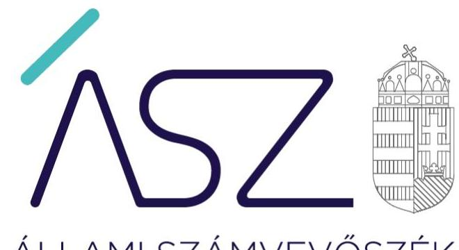
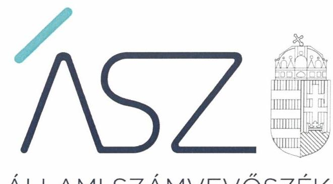
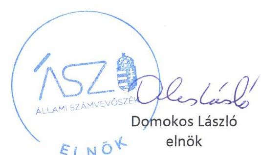

ÁLLAMI SZÁMVEVŐSZÉK

# JELENTÉS 

## A jelentős beruházások ellenőrzése

Nyíregyházi Atlétikai Centrumot érintő beruházási projekt
2021.

21046
www.asz.hu

---

ÁLLAMI SZÁMVEVŐSZÉK

# JELENTÉS 

## A jelentős beruházások ellenőrzése

Nyíregyházi Atlétikai Centrumot érintő beruházási projekt
2021. 06. hó 20. nap

21046
www.asz.hu

---

# AZ ELLENŐRZÉST FELÜGYELTE: 

PETŐ KRISZTINA felügyeleti vezető
VARGA EDIT felügyeleti vezető

AZ ELLENŐRZÉST VEZETTE ÉS A VÉGREHAJTÁSÁÉRT FELELŐS:
ÁRPÁSI TIBOR ellenőrzésvezető

A PROGRAM ÖSSZEÁLLÍTÁSÁÉRT FELELŐS:
NÉMETH ANITA projektvezető

IKTATÓSZÁM: EL-3198-001/2021
TÉMASZÁM: 2535
ELLENŐRZÉS-AZONOSÍTÓ SZÁM: V0879002

---

# TARTALOMJEGYZÉK 

- ÖSSZEGZÉS ..... 5
- AZ ELLENŐRZÉS CÉLJA ..... 6
- AZ ELLENŐRZÉS TERÜLETE ..... 7
- AZ ELLENŐRZÉS HÁTTERE, INDOKOLTSÁGA ..... 9
- A JELENTÉS LÉNYEGES KÉRDÉSKÖREI ..... 10
- AZ ELLENŐRZÉS HATÓKÖRE ÉS MÓDSZEREI ..... 11
- MEGÁLLAPÍTÁSOK ..... 14
- JAVASLATOK ..... 16
- MELLÉKLETEK ..... 17
I. sz. melléklet: Fogalomtár ..... 17
- FÜGGELÉK: ÉSZREVÉTELEK ..... 19
- RÖVIDÍTÉSEK JEGYZÉKE ..... 21

---

.

---

# ÖSSZEGZÉS 

A Nyíregyházi Atlétikai Centrum megépítésének döntés-előkészítése és a beruházás megvalósításának előkészítése megfelelő volt.

## Az ellenőrzés társadalmi indokoltsága

Az Állami Számvevőszék a jelentős beruházások ellenőrzésével támogatja a közpénzek szabályos és átlátható felhasználását. A beruházás előkészítésében közreműködő szervezetnek az Alaptörvényben meghatározott alapelvek szerint kell a közpénzeket felhasználnia. A szervezet köteles kiépíteni azokat a kontrollokat, amelyek az átláthatóság, az önállóság és a felelősség, azaz elszámoltathatóság, a törvényesség, a célszerűség és az eredményesség követelményének teljesülését szolgálják. Tekintettel arra, hogy a beruházások jellemzően több tízmillió, vagy több milliárd Ft-os támogatásból valósulnak meg, ezért az Alaptörvény követelményeinek betartásához szükséges szervezeti keretek, a szabályozó eszközök kialakítása, és azok betartása a beruházási kockázatok feltárása és kezelése elvárás a szervezet felé.

Az átláthatóság lényege, hogy a szervezetnek a törvényeknek és egyéb jogszabályoknak megfelelően kell végeznie a tevékenységét és arról nyilvánosan be kell számolnia. Az elszámoltathatóság lényege a felelősség. A szervezet felelős a közfeladatai ellátásáért, a közpénzek használatáért. Az eredményesség a kitűzött célok és azok megvalósulásának összehasonlításával mérhető.

A Nyíregyházi Atlétikai Centrumot érintő beruházás előkészítésének ellenőrzése hozzájárulhat a beruházási folyamat transzparenciájához.

## Főbb megállapítások, következtetések, javaslatok

A Nemzeti Fejlesztési Minisztérium, mint az Innovációs és Technológiai Minisztérium jogelődje, valamint az Emberi Erőforrások Minisztériuma a jogszabályokban és belső előírásaiban rögzített módon készítette elő és terjesztette a Modern Városok Bizottsága elé a Nyíregyházi Atlétikai Centrumot érintő beruházási projekt előkészítésére és megvalósítására vonatkozó javaslatát. Nyíregyháza Megyei Jogú Város Önkormányzata szabályszerűen határozott a Nyíregyházi Atlétikai Centrumot érintő beruházási projekt előkészítési tevékenységeinek megkezdéséről. A beruházás előkészítésének támogatását biztosító okiratok szabályszerűen kerültek kiadásra.

Nyíregyháza Megyei Jogú Város Önkormányzata belső szabályozottsága, szervezeti és működési folyamatai biztosították a beruházás megfelelő előkészítését. Nyíregyháza Megyei Jogú Város Önkormányzata a Nyíregyházi Atlétikai Centrumot érintő beruházási projektet szabályszerűen előkészítette, az előkészítési szakaszban megkötött szerződések megfelelőek voltak.

Az Állami Számvevőszék az ellenőrzés megállapítása alapján Nyíregyháza Megyei Jogú Város Polgármesteri Hivatalának jegyzője részére egy javaslatot fogalmazott meg.

---

# AZ ELLENŐRZÉS CÉLJA 

AZ ELLENŐRZÉS CÉLJA a beruházás eredményes megvalósulásának elősegítése érdekében, a folyamatban lévő beruházás vonatkozásában, a döntés-előkészítésétől a megvalósítás megkezdéséig felmerülő kockázatok beazonosításának és az integritási szempontok érvényesülésének értékelése.

---

# AZ ELLENŐRZÉS TERÜLETE 

## A Nyíregyházi Atlétikai Centrumot érintő beruházási projekt előkészítésének támogatása - Innovációs és Technológiai Minisztérium, Emberi Erőforrások Minisztériuma, Nyíregyháza Megyei Jogú Város Önkormányzata

A Modern Városok Program keretében a Kormány ${ }^{1}$ 2015. november 10-én együttműködési megállapodást ${ }^{2}$ kötött Nyíregyháza Megyei Jogú Város Önkormányzatával a modern Nyíregyházáért, amely együttműködési megállapodás 7. pontjában a Kormány vállalta, hogy segítséget nyújt Nyíregyháza közösségi és sportéletének támogatása jegyében egy atlétikai centrum kialakításához.

Az együttműködési megállapodásban foglaltak végrehajtása érdekében elfogadott 1955/2015. (XII. 17.) Korm. határozat ${ }^{3} 7$. pontjában a Kormány egyetértett azzal, hogy a nyíregyházi Tiszavasvári úti sporttelepen kormányzati támogatással atlétikai centrum kerüljön 2018. március 31-ig megépítésre. E cél megvalósításának elősegítése céljából a Kormány felhívta a nemzeti fejlesztési minisztert és az emberi erőforrások miniszterét, hogy az Önkormányzattal ${ }^{4}$ együttműködve tegyenek javaslatot az atlétikai centrum megvalósítását szolgáló beruházás koncepciójára és a beruházás megvalósításának a támogatására.

Az 1038/2016. (II. 10.) Korm. határozatban ${ }^{5}$ a Kormány felhívta a Miniszterelnökséget vezető minisztert, hogy gondoskodjon az együttműködési megállapodásban, illetve a kormányhatározatokban meghatározott feladatok végrehajtásának koordinálásáról, továbbá 250 millió Ft forrásigényt fogadott el a 2016. évi központi költségvetés terhére az atlétikai centrum megépítésének előkészítő munkálataira.

A Kormány az MVP ${ }^{6}$ keretében nyújtott költségvetési támogatások odaítélésének, felhasználásának szabályait az MVP rendeletben ${ }^{7}$ határozta meg. Meghatározásra került, hogy az egyes megyei jogú városokkal kötött együttműködési megállapodások végrehajtásával összefüggő feladatokról döntő egyedi kormányhatározatokban foglaltak végrehajtásának koordinálását a kijelölt miniszter ${ }_{1-3}{ }^{8}$ lássa el, míg a végrehajtás a szakpolitikai felelős és a társfelelős feladata. A központi költségvetés Miniszterelnökség fejezetében megállapított, MVP elnevezésű, e célt szolgáló fejezeti kezelésű előirányzat terhére nyújtható MVP támogatás ${ }^{9}$ odaítéléséről az MVP Bizottság ${ }^{10}$ döntött. Az MVP Bizottság a döntéseit a szakpolitikai felelős előterjesztése alapján hozta. A támogatási döntésről a miniszter támogatói okiratot adott ki.
2016. november 18-án az Innovációs és Technológiai Minisztérium jogelődje, a Nemzeti Fejlesztési Minisztérium szakpolitikai felelősként előterjesztést ${ }_{1}{ }^{11}$ nyújtott be az MVP Bizottság részére a „Nyíregyházi Atlétikai Centrum kialakítása" elnevezésű beruházás előkészítésének támogatásáról. Az előterjesztés ${ }_{1}$ társfelelőse az Emberi Erőforrások Minisztériuma

---

volt. Az MVP Bizottság 250 millió Ft támogatás nyújtásáról szóló döntése alapján a Miniszterelnökség 2016. december 23-án állította ki a beruházás előkészítése (tervellenőrzés és műszaki ellenőrzés, bontási, tereprendezési munkálatok, valamint a közműfejlesztési folyamatok megindítása) támogatásának feltételeit tartalmazó Támogatói Okiratot ${ }_{1}{ }^{12}$.

A Kormány az 1528/2017. (VIII. 14.) Korm. határozatban ${ }^{13}$ egyetértett a beruházás megvalósítása határidejének 2019. május 31-re történő módosításával. Az 1584/2017. (VIII. 28.) Korm. határozatban ${ }^{14}$ a Kormány a Nyíregyházi Atlétikai Centrum beruházásának megvalósítása érdekében egyetértett összesen 3482,5 millió Ft támogatás biztosításáról a 2017-2019. évi központi költségvetések terhére.
2017. szeptember 19-én az NFM ${ }^{15}$ szakpolitikai felelősként újabb előterjesztést nyújtott be az MVP Bizottság részére a „Nyíregyházi Atlétikai Centrum megvalósítása" elnevezésű projekt támogatása érdekében. Az előterjesztés társfelelőse az EMMI ${ }^{16}$ volt. Az MVP Bizottság 3482,5 millió Ft támogatás nyújtásáról szóló döntése alapján a Miniszterelnökség 2017. december 22-én kiadta a beruházás további előkészítése (különösen projektmenedzsment, felelős akkreditált közbeszerzési szaktanácsadó kiválasztása, közbeszerzések lebonyolítása, tervező kiválasztása, tervezés [engedélyes és kiviteli tervdokumentáció] készítése, műszaki ellenőr kiválasztása), műszaki ellenőri tevékenység, PR és marketing tevékenység, kivitelező kiválasztása és a kivitelezés támogatásának feltételeit tartalmazó Támogatói Okiratot ${ }_{2}$.

A beruházáshoz kapcsolódó meghatározott közigazgatási hatósági ügyeket a 203/2017. (VII. 10.) Korm. rendelet ${ }^{17}$ nemzetgazdasági szempontból kiemelt jelentőségű üggyé nyilvánította.

Az Önkormányzat Gazdasági és Tulajdonosi Bizottsága ${ }^{18}$ megtárgyalta és 49/2016. (II. 19.) számú határozatával jóváhagyta a Nyíregyházi Atlétikai Sportcentrum kialakítására vonatkozó koncepciót.

A beruházás előkészítési feladatainak koordinációját az Önkormányzat részéről a Polgármesteri Kabinet ${ }^{19}$ látta el.

Az Önkormányzat a sporttelep korszerűsítését szolgáló beruházás megvalósítására vonatkozó közbeszerzési hirdetményt „Nyíregyházi Atlétikai Centrum építési munkái" tárgyban 2018. november 21-én tette közzé.

---

# AZ ELLENŐRZÉS HÁTTERE, INDOKOLTSÁGA 

A közpénzek szabályos és átlátható felhasználásának támogatása céljából az ÁSZ ${ }^{20}$ a beruházások ellenőrzését - a megvalósításra fordított költségvetési források nagyságrendjére, a beruházások révén létrehozott nemzeti vagyon hasznosítására tekintettel - kiemelt fontosságú területként kezeli.

A közpénzből megvalósuló beruházások eredményes megvalósulása érdekében indokolt már a döntés-előkészítéstől a megvalósítás megkezdéséig tartó szakaszban felmerülő kockázatok beazonosításának és a kezelésükre kidolgozott intézkedések értékelése, az átláthatóság követelményével összhangban az integritási szempontok érvényesülésének biztosítása.

A beruházások előkészítésére fókuszáló ellenőrzés megállapításainak hasznosításaként lehetőség nyílhat még a beruházás folyamatában a feltárt hiányosságok, szabálytalanságok megszüntetéséhez szükséges korrekciók megtételére, a kontrollok erősítésére.

Jelen ellenőrzés ezáltal hozzájárulhat az ÁSZ kockázatértékelő rendszere alapján kiválasztott, államháztartásból származó forrásból finanszírozott beruházások eredményességéhez, a beruházási folyamat transzparenciájának biztosításához.

Az ellenőrzés eredményeinek célzott felhasználói a nyilvánosság, valamint a beruházások előkészítésében és megvalósításában résztvevő szervezetek.

---

# A JELENTÉS LÉNYEGES KÉRDÉSKÖREI 

1. A beruházás döntés-előkészítése szabályszerűen történt-e?
2. A beruházás előkészítését végző ellenőrzött szervezet belső szabályozottsága, szervezeti és működési folyamatai biztosították-e a beruházás megfelelő előkészítését?
3. A beruházás megvalósításának előkészítése, a beruházás előkészítése keretében megkötött szerződések megfelelőek voltak-e?

---

# AZ ELLENŐRZÉS HATÓKÖRE ÉS MÓDSZEREI 

## Az ellenőrzés típusa

| Megfelelőségi ellenőrzés.

## Az ellenőrzött időszak

A 2015-2018. évi központi vagy önkormányzati költségvetésben megjelenő beruházások első döntés-előkészítésétől a beruházás előkészítési szakaszának befejezéséig (a megvalósításra vonatkozó közbeszerzési eljárás meghirdetésének időpontjáig) terjedő időszak, azaz 2015. december 17. - 2018. november 21.

## Az ellenőrzés tárgya

Az ellenőrzés a beruházást érintő önkormányzati, kormányzati beruházási döntés-előkészítést beterjesztő szervezet, valamint a beruházás előkészítését végző önkormányzat és gazdálkodási feladatait ellátó polgármesteri hivatal, költségvetési szerv, nemzeti tulajdonban lévő gazdasági társaság döntés-előkészítési és beruházás előkészítési tevékenységének működési folyamataira, azok belső szabályozottságára, a megvalósítás előkészítésének megfelelőségére terjed ki.

## Az ellenőrzött szervezet

- Innovációs és Technológiai Minisztérium
- Emberi Erőforrások Minisztériuma
- Nyíregyháza Megyei Jogú Város Önkormányzata
- Nyíregyháza Megyei Jogú Város Polgármesteri Hivatala

## Az ellenőrzés jogalapja

Az ellenőrzés jogszabályi alapját az ÁSZ tv. ${ }^{21}$ 1. § (3) bekezdése és 5. § (2)(5) bekezdései, valamint az Áht. ${ }^{22}$ 61. § (2) bekezdése képezték.

---

# Az ellenőrzés módszerei 

Az ÁSZ az ellenőrzést az ellenőrzési program szempontjai, kérdései, az ellenőrzött időszakban hatályos jogszabályok, az ellenőrzés szakmai szabályai, az ÁSZ megfelelőségi ellenőrzési módszertana alapján végezte.

Az ellenőrzés ideje alatt az ellenőrzött szervezettel történő kapcsolattartást az ÁSZ Szervezeti és Működési Szabályzatának vonatkozó előírásai alapján biztosította az ÁSZ.

A program ellenőrzési szempontjai a szabályszerűségi szempontok szerinti ellenőrzésben a jogszabályok, közjogi szervezetszabályozó eszközök, önkormányzati rendeletek, határozatok, további belső utasítások, belső szabályozók előírásai, a helyénvalósági szempontok szerinti ellenőrzésben az ÁSZ korábbi beruházásokat érintő ellenőrzései során beazonosított „jó gyakorlatok" és általánosan elfogadott szakmai szabályok alapján kerültek meghatározásra.

Az ellenőrzési szempontok tartalmaztak helyénvalósági kritériumokat is, amelyet az ÁSZ honlapján tett közzé. A helyénvalósági kritériumok az ellenőrzés tárgyát képező, általánosan elfogadott, jogszabályok által nem szabályozott, illetve nemzetközi vagy hazai „jó gyakorlatokon" alapuló ellenőrzési szempontok, melyek hozzájárulnak az ellenőrzött szervezetek integritásának megerősítéséhez.

Az ellenőrzési kérdések megválaszolásához szükséges bizonyítékok megszerzése a következő ellenőrzési eljárások alkalmazásával történt: megfigyelés, kérdésfeltevés (információkérés), összehasonlítás, mintavételi eljárás, valamint elemző eljárás. Az ellenőrzés végrehajtásához a rétegzett mintavételi eljárással történik a mintavétel. Az ellenőrzési bizonyítékként felhasználható adatforrások közé tartoztak egyrészt az ellenőrzési programban felsorolt adatforrások, másrészt adatforrás volt még minden - az ellenőrzés folyamán - feltárt, az ellenőrzés szempontjából információkat tartalmazó dokumentum.

Mintavételes ellenőrzésre a beruházás előkészítésére vonatkozóan, közbeszerzési eljárások eredményeként kötött szerződések, továbbá a közbeszerzési értékhatárt el nem érő beszerzések (megrendelésekre, megbízásokra) szerinti rétegzés alapján kiválasztott szerződések esetében került sor.

A mintatételek kiválasztása a közbeszerzési határértéket elérő, illetve el nem érő szerződésekből véletlen rétegzett mintavétellel történt. A vizsgált terület „szabályszerű" minősítést kapott, ha a minta ellenőrzésének eredménye alapján 95%-os bizonyossággal a teljes
 sokaságban az átlagos hibaarány nem haladta meg a 10%-ot, „nem szabályszerű" minősítést kapott, ha nagyobb volt, mint 10%. Abban az esetben, ha a teljes sokaság tekintetében a 10%-os hibaarányhoz való viszony megítélésének megbízhatósága nem érte el a 95%-ot, annak elérése érdekében az értékelés további szempontokkal egészült ki, a feltárt hibák értéke is figyelembe vételre került. Amennyiben a sokaság elemszáma nem haladta meg az előírt minta elemszámot, akkor a sokaság valamennyi elemének tételes ellenőrzésére került sor.

---

Az ellenőrzés során minden olyan körülmény és adat is ellenőrzésre került, amely a program végrehajtása kapcsán felmerült újabb összefüggéseknek az ellenőrzés céljaival összhangban lévő feltárásához szükséges volt.

---

# 1. A beruházás döntés-előkészítése szabályszerűen történt-e? 

## Összegző megállapítás

A beruházás döntés-előkészítése szabályszerűen történt.
A Nyíregyházi Atlétikai Centrum beruházást érintő kormányzati döntések előkészítése szabályszerű volt. Az NFM a Kormány ügyrendje ${ }^{23}$, az MVP rendelet előírásaival összhangban, továbbá az NFM SZMSZ-ben ${ }^{24}$ és az NFM ügyrendjében ${ }^{25}$ rögzített módon, szakmai felelősként készítette el és terjesztette az MVP Bizottság elé a beruházás előkészítésére és megvalósítására vonatkozó javaslatát.

Az EMMI társfelelősként a jogszabályok és az EMMI SZMSZ² előírásai szerint vett részt az előterjesztések elkészítésében.

A Gazdasági és Tulajdonosi Bizottság a Polgármesteri Kabinet előterjesztése alapján az Mötv. ${ }^{27}$, az önkormányzati SZMSZ ${ }^{28}$ és a hivatali SZMSZ ${ }^{29}$ előírásaival összhangban járult hozzá a projekt előkészítésének megvalósításához.

A Támogatói Okiratok kiadására az MVP Bizottság támogató döntése alapján került sor, tartalmuk eleget tett az Áht.-ben és az Ávr. ${ }^{30}$-ben megfogalmazott tartalmi követelményeknek.

## 2. A beruházás előkészítését végző ellenőrzött szervezet belső szabályozottsága, szervezeti és működési folyamatai biztosították-e a beruházás megfelelő előkészítését?

## Összegző megállapítás

A beruházás előkészítését végző Önkormányzat belső szabályozottsága, szervezeti és működési folyamatai biztosították a beruházás megfelelő előkészítését.

Az Önkormányzat az Mötv. és az Nvtv. ${ }^{31}$ előírásának megfelelően rendelkezett gazdasági programmal ${ }^{32}$, vagyongazdálkodási tervvel ${ }^{33}$. A gazdasági program az Mötv. előírásaival összhangban tartalmazta a sportcélú fejlesztésekkel kapcsolatos célkitűzéseket, feladatokat.

Az atlétikai centrum megvalósítására vonatkozó beruházási projekt előkészítésében közreműködő Polgármesteri Hivatal ${ }^{34}$ SZMSZ-e az Ávr. előírásaival összhangban tartalmazta a szervezeti egységek feladatait, a nevesített munkakörökhöz tartozó feladat- és hatásköröket. A Számv. tv. ${ }^{35}$ és az Áhsz. ${ }^{36}$ előírásainak eleget téve rendelkezett számviteli politika-val, értékelési szabályzat-tal, leltározási szabályzat-tal, valamint számlarend-del.

A gazdálkodás részletes rendje az Áht. előírásaival összhangban a gazdasági szervezet ügyrend-ben került meghatározásra. Az Ávr. 13. §

---

(2) bekezdés a) pontjában foglaltak ellenére nem rendezték belső szabályzatban a kötelezettségvállalás, teljesítésigazolás gyakorlásának módjára, az eljárási és dokumentációs részletszabályokra, valamint az ezeket végző személyek kijelölésének rendjére vonatkozó előírásokat. A kötelezettségvállalásra, teljesítésigazolásra jogosultak az Ávr. előírásával összhangban rendelkeztek írásbeli felhatalmazással és róluk, valamint aláírás-mintájukról naprakész nyilvántartást vezettek.

Az Önkormányzat a Közbeszerzési szabályzat-ban a Kbt. ${ }^{43}$ előírásaival összhangban meghatározta a közbeszerzési eljárásai előkészítésének, lefolytatásának, belső ellenőrzésének felelősségi rendjét. A Közbeszerzési szabályzat tartalmazta továbbá az Önkormányzat nevében eljáró, illetve az eljárásba bevont személyek, valamint szervezetek felelősségi körét és a közbeszerzési eljárás dokumentálási rendjét.

Az Önkormányzatnál a beruházási projekt előkészítése során a jogszabályi előírásokkal összhangban kialakították a monitoring és beszámolási rendszereket. Az Önkormányzat az operatív tevékenységek keretében megvalósuló folyamatos és eseti nyomon követési (monitoring) rendszerét megfelelően működtette a beruházás előkészítése során. A beruházásokhoz kapcsolódó beszámolási és adatszolgáltatási kötelezettségét az Önkormányzat szabályszerűen teljesítette.

# 3. A beruházás megvalósításának előkészítése, a beruházás előkészítése keretében megkötött szerződések megfelelőek voltak-e? 

## Összegző megállapítás

A Nyíregyházi Atlétikai Centrumot érintő beruházás megvalósításának előkészítése, az előkészítés során megkötött szerződések megfelelőek voltak.

Az Önkormányzat megfelelően készítette elő a beruházás megvalósítását. Az Önkormányzat elkészítette a beruházási projektek időbeli ütemezését, rendelkezett költségkalkulációkkal, költségszámítással, becsült költségvetéssel. A tervezési feladatok elvégzésére, tervellenőri feladatok ellátására, előzetes költség-haszon elemzés elkészítésére, a közbeszerzések lebonyolítására vonatkozó szerződéseket szabályszerűen kötötte meg az Önkormányzat. A közbeszerzési eljárás keretében megkötött szerződés eleget tett a Kbt., a közbeszerzési értékhatárt el nem érő beszerzés keretében megkötött szerződések az Ávr. előírásainak.

---

# JAVASLATOK 

Az ÁSZ tv. 33. § (1) bekezdésében foglaltak értelmében az ellenőrzött szervezet vezetője köteles a jelentésben foglalt megállapításokhoz kapcsolódó intézkedési tervet összeállítani és azt a jelentés kézhezvételétől számított 30 napon belül az ÁSZ részére megküldeni. Amennyiben az ellenőrzött szervezet vezetője nem küldi meg határidőben az intézkedési tervet, vagy továbbra sem elfogadható intézkedési tervet küld, az Állami Számvevőszék elnöke az ÁSZ tv. 33. § (3) bekezdése a) és b) pontjaiban foglaltakat érvényesítheti.

## Nyíregyháza Megyei Jogú Város Polgármesteri Hivatala jegyzője részére

1. Rendezve belső szabályzatban a kötelezettségvállalás, teljesítésigazolás gyakorlásának módjára, az eljárási és dokumentációs részletszabályokra, valamint az ezeket végző személyek kijelölésének rendjére vonatkozó előírásokat.
(2. összegző megállapítás 3. bekezdésének 2. mondata alapján)

---

# MELLÉKLETEK 

- I. SZ. MELLÉKLET: FOGALOMTÁR
beruházás
beterjesztő szervezet
felújítás
jelentős beruházás
mentő́s beruházás
A tárgyi eszközök beszerzése, létesítése, saját vállalkozásban történő előállítása, a beszerzett tárgyi eszköz üzembe helyezése, rendeltetésszerű használatbavétele érdekében az üzembe helyezésig, a rendeltetésszerű használatbavételig végzett tevékenység (szállítás, vámkezelés, közvetítés, alapozás, üzembe helyezés, továbbá mindaz a tevékenység, amely a tárgyi eszköz beszerzéséhez hozzákapcsolható, ideértve a tervezést, az előkészítést, a lebonyolítást, a hiteligénybevételt, a biztosítást is); beruházás a meglévő tárgyi eszköz bővítését, rendeltetésének megváltoztatását, átalakítását, élettartamának, teljesítőképességének közvetlen növelését eredményező tevékenység is, az előbbiekben felsorolt, e tevékenységhez hozzákapcsolható egyéb tevékenységekkel együtt. (Forrás: Számv. tv. 3. § (4) bekezdés 7. pont). A jelentős beruházásokat érintően beruházásnak tekintjük az immateriális javak beszerzését is.
A beruházási döntésre vonatkozó előterjesztésért felelős képviselő-testület bizottsága, polgármester, és/vagy a beruházási döntésre vonatkozó előterjesztésért felelős minisztérium.
Az elhasználódott tárgyi eszköz eredeti állaga (kapacitása, pontossága) helyreállítását szolgáló, időszakonként visszatérő olyan tevékenység, amely mindenképpen azzal jár, hogy az adott eszköz élettartama megnövekszik, eredeti műszaki állapota, teljesítőképessége megközelítőleg vagy teljesen visszaáll, az előállított termékek minősége vagy az adott eszköz használata jelentősen javul és így a felújítás pótlólagos ráfordításából a jövőben gazdasági előnyök származnak; felújítás a korszerűsítés is, ha az a korszerű technika alkalmazásával a tárgyi eszköz egyes részeinek az eredetitől eltérő megoldásával vagy kicserélésével a tárgyi eszköz üzembiztonságát, teljesítőképességét, használhatóságát vagy gazdaságosságát növeli; a tárgyi eszközt akkor kell felújítani, amikor a folyamatosan, rendszeresen elvégzett karbantartás mellett a tárgyi eszköz oly mértékben elhasználódott (szerkezeti elemei öregedtek), amely elhasználódottság már a rendeltetésszerű használatot veszélyezteti; nem felújítás az elmaradt és felhalmozódó karbantartás egyidőben való elvégzése, függetlenül a költségek nagyságától. (Forrás: Számv. tv. 3. § (4) bekezdés 8. pont)
Jelentős beruházás az a beruházás, amelyet az ÁSZ kockázatelemzés alapján annak tekint. A kockázat-elemzés során figyelembe vett szempontok: a beruházás háttere, funkciója, bekerülési értéke, a szervezet költségvetéséhez, gazdasági társaság esetén mérlegfőösszegéhez való nagyságrendi viszonya, beruházás megvalósítási költségében a központi költségvetési támogatás részaránya.
Magyarország megyei jogú városainak fejlesztésére irányuló, a Kormány és a megyei jogú város önkormányzata között, a megyei jogú város további fejlődése és megújulása érdekében létrejött együttműködési megállapodásokban foglalt, 2015. és 2022. között több mint 250 jelentős beruházást, projektet előirányzó, hazai forrásból nyújtott költségvetési támogatásból megvalósuló terv.
A monitoring általánosságban a különböző szintű szervezeti célok megvalósításának folyamatát kíséri figyelemmel, melynek során a releváns eseményekről és tevékenységekről (együtt: folyamatokról) rendszeres jelleggel, strukturált, döntéstámogató információkhoz jutnak a szervezet vezetői. (Forrás: NGM Államháztartási Belső Kontroll Standardok és Gyakorlati Útmutató, 2017. szeptember)

---

önkormányzat

A helyi önkormányzat jogi személy. Az önkormányzati feladatok ellátását a képviselő-testület és szervei biztosítják. A képviselő-testület szervei: a polgármester, a főpolgármester, a megyei közgyűlés elnöke, a képviselő-testület bizottságai, a részönkormányzat testülete, a polgármesteri hivatal, a megyei önkormányzati hivatal, a közös önkormányzati hivatal, a jegyző, továbbá a társulás. A képviselő-testület a feladatkörébe tartozó közszolgáltatások ellátására - jogszabályban meghatározottak szerint - költségvetési szervet, a Polgári perrendtartásról szóló 2016. évi CXXX. törvény szerinti gazdálkodó szervezetet (a továbbiakban: gazdálkodó szervezet), nonprofit szervezetet és egyéb szervezetet (a továbbiakban együtt: intézmény) alapíthat, továbbá szerződést köthet természetes és jogi személlyel vagy jogi személyiséggel nem rendelkező szervezettel. (Forrás: Mötv. 41. § (1), (2), (6) bekezdései).

---

# FÜGGELÉK: ÉSZREVÉTELEK 

A jelentéstervezetet a Számvevőszék 15 napos észrevételezésre megküldte az ellenőrzött szervezetek vezetőinek az ÁSZ tv. 29. § (1) bekezdése előírásának megfelelően.

Az Információs és Technológiai Minisztérium minisztere, az Emberi Erőforrások Minisztériuma minisztere, Nyíregyháza Megyei Jogú Város Önkormányzat polgármestere, illetve Nyíregyháza Megyei Jogú Város Polgármesteri Hivatal jegyzője a jelentéstervezetre nem tett észrevételt.

[^0]
[^0]:    * 29. § (1) Az Állami Számvevőszék az ellenőrzési megállapításait megküldi az ellenőrzött szervezet vezetőjének vagy az általa megbízott személynek, és annak, akinek személyes felelősségét állapította meg.
    (2) Az ellenőrzött szervezet vezetője és a felelősként megjelölt személy az ellenőrzés megállapításaira tizenöt napon belül írásban észrevételt tehet.
    (3) Az Állami Számvevőszék az észrevételre a beérkezésétől számított harminc napon belül írásban válaszol. A figyelembe nem vett észrevételeket köteles a jelentésben feltüntetni, és megindokolni, hogy azokat miért nem fogadta el.

---

.

---

# RÖVIDÍTÉSEK JEGYZÉKE 

${ }^{1}$ Kormány
${ }^{2}$ együttműködési megállapodás
${ }^{3} 1955 / 2015$. (XII. 17.) Korm. határozat
${ }^{4}$ Önkormányzat
${ }^{5} 1038 / 2016$. (II. 10.) Korm. határozat
${ }^{6}$ MVP
${ }^{7}$ MVP rendelet
${ }^{8}$ miniszter ${ }_{1}$
miniszter $_{2}$
miniszter $_{3}$
${ }^{9}$ MVP támogatás
${ }^{10}$ MVP Bizottság
${ }^{11}$ előterjesztés $_{1}$
előterjesztés $_{2}$
${ }^{12}$ Támogatói Okirat ${ }_{1}$
Támogatói Okirat ${ }_{2}$
${ }^{13} 1528 / 2017$. (VIII. 14.) Korm. határozat
${ }^{14} 1584 / 2017$. (VIII. 28.) Korm. határozat
${ }^{15}$ NFM
${ }^{16}$ EMMI
${ }^{17} 203 / 2017$. (VII. 10.) Korm. rendelet
${ }^{18}$ Gazdasági és Tulajdonosi Bizottság
${ }^{19}$ Polgármesteri Kabinet

Magyarország Kormánya
A Kormány és Nyíregyháza Megyei Jogú Város Önkormányzata között 2015. november 10-én létrejött együttműködési megállapodás a modern Nyíregyházáért
1955/2015. (XII. 17.) Korm. határozat Magyarország Kormánya és Nyíregyháza Megyei Jogú Város Önkormányzata közötti együttműködési megállapodás végrehajtásával összefüggő feladatokról
Nyíregyháza Megyei Jogú Város Önkormányzata
1038/2016. (II. 10.) Korm. határozat a Modern Városok Program keretében Magyarország Kormánya és a megyei jogú városok önkormányzatai között első ütemben kötött együttműködési megállapodásokkal összefüggő intézkedésekről
Modern Városok Program
250/2016. (VIII. 24.) Korm. rendelet a Modern Városok Program megvalósításáról a kormányzati tevékenység összehangolásáért felelős kijelölt miniszter 2016. augusztus 25-től 2017. október 10-ig
a megyei jogú városok fejlesztéséért felelős tárca nélküli miniszter 2017. október 11-től 2018. június 11-ig
a településfejlesztésért és településrendezésért felelős miniszter 2018. június 12-től
Modern Városok Program végrehajtását szolgáló, hazai forrásból nyújtott költségvetési támogatás
Modern Városok Program Bizottság
A Nemzeti Fejlesztési Minisztérium 2016. november 18-án kelt SBF/27402/2016NFM iktatószámú előterjesztése a Modern Városok Bizottsága részére
A Nemzeti Fejlesztési Minisztérium 2017. szeptember 19-én
 kelt SBF/66501/2017/NFM iktatószámú előterjesztése a Modern Városok Bizottsága részére
A Miniszterelnökség 2016. december 23-án kelt GF/JSZF/1053/9/2016. iktatószámú Támogatói Okirata
A Miniszterelnökség 2017. december 22-én kelt GF/SZKF/1045/6/2017. iktatószámú Támogató Okirata, a Támogatói Okirat ${ }_{1}$ 1. számú módosítása
1528/2017. (VIII. 14.) Korm. határozat a Magyarország Kormánya és Nyíregyháza Megyei Jogú Város Önkormányzata közötti együttműködési megállapodás végrehajtásával összefüggő feladatokról szóló 1955/2015. (XII. 17.) Korm. határozat módosításáról
1584/2017. (VIII. 28.) Korm. határozat a Modern Városok Program keretében a Nyíregyházi Atlétikai Centrum megvalósítása érdekében támogatás biztosításáról Nemzeti Fejlesztési Minisztérium, jogutóda az Innovációs és Technológiai Minisztérium 2018. május 22-től
Emberi Erőforrások Minisztériuma
203/2017. (VII. 10.) Korm. rendelet a Modern Városok Program keretében egyes sportcélú beruházásokkal összefüggő közigazgatási hatósági ügyek nemzetgazdasági szempontból kiemelt jelentőségű üggyé nyilvánításáról
Nyíregyháza Megyei Jogú Város Közgyűlésének Gazdasági és Tulajdonosi Bizottsága
Nyíregyháza Megyei Jogú Város Polgármesteri Hivatala Polgármesteri Kabinet

---

${ }^{20}$ ÁSZ
${ }^{21}$ ÁSZ tv.
${ }^{22}$ Áht.
${ }^{23}$ Kormány ügyrendje
${ }^{24}$ NFM SZMSZ
${ }^{25}$ NFM ügyrend $_{1}$
NFM ügyrend $_{2}$
${ }^{26}$ EMMI SZMSZ
${ }^{27}$ Mötv.
${ }^{28}$ önkormányzati SZMSZ
${ }^{29}$ hivatali SZMSZ
${ }^{30}$ Ávr.
${ }^{31}$ Nvtv.
${ }^{32}$ gazdasági program
${ }^{33}$ vagyongazdálkodási terv
${ }^{34}$ Polgármesteri Hivatal
${ }^{35}$ Számv. tv.
${ }^{36}$ Áhsz.
${ }^{37}$ számviteli politika $_{1}$
számviteli politika $_{2}$
számviteli politika $_{3}$
${ }^{38}$ értékelési szabályzat ${ }_{1}$
értékelési szabályzat ${ }_{2}$
${ }^{39}$ leltározási szabályzat ${ }_{1}$
leltározási szabályzat ${ }_{2}$
leltározási szabályzat ${ }_{3}$
${ }^{40}$ számlarend $_{1}$
számlarend $_{2}$
számlarend $_{3}$

Állami Számvevőszék
2011. évi LXVI. törvény az Állami Számvevőszékről (hatályos 2011. július 1-jétől)
2011. évi CXCV. törvény az államháztartásról (hatályos: 2011. december 31-től)

1144/2010. (VII. 7.) Korm. határozat a Kormány ügyrendjéről
33/2014. (X. 10.) NFM utasítás a Nemzeti Fejlesztési Minisztérium Szervezeti és Működési Szabályzatáról (hatályos: 2014. október 11-től)
az NFM Sportcélú Beruházások Főosztálya SBF/26671/2016-NFM iktatószámú ügyrendje (hatályos: 2016. szeptember 28-tól)
az NFM Sportcélú Beruházások Főosztálya SBF/51918/2017-NFM iktatószámú ügyrendje (hatályos: 2017. július 20-tól)
33/2014. (IX. 16.) EMMI utasítás az Emberi Erőforrások Minisztériuma Szervezeti és Működési Szabályzatáról (hatályos: 2014. szeptember 17-től)
2011. évi CLXXXIX. törvény Magyarország helyi önkormányzatairól (hatályos: 2012. január 1-jétől)

Nyíregyháza Megyei Jogú Város Közgyűlésének 9/2011. (III. 10.) sz. önkormányzati rendelete Nyíregyháza Megyei Jogú Város Önkormányzata Szervezeti és Működési Szabályzatáról (hatályos: 2011. március 11-től)
Nyíregyháza Megyei Jogú Város Közgyűlésének 24/2011. (II. 10.) sz. önkormányzati határozata Nyíregyháza Megyei Jogú Város Polgármesteri Hivatala Szervezeti és Működési Szabályzata megállapításáról (hatályos: 2011. március 1-jétől)
368/2011. (XII. 31.) Korm. rendelet az államháztartásról szóló törvény végrehajtásáról (hatályos: 2012. január 1-jétől)
2011. évi CXCVI. törvény a nemzeti vagyonról

47/2015. (III. 26.) sz. közgyűlési határozattal elfogadott Nyíregyháza Megyei Jogú Város Önkormányzatának Gazdasági programja 2015-2019. évekre
13/2017. (I. 26.) sz. közgyűlési határozattal elfogadott Nyíregyháza Megyei Jogú Város Önkormányzatának Vagyongazdálkodási terve
Nyíregyháza Megyei Jogú Város Polgármesteri Hivatala
2000. évi C. törvény a számvitelről (hatályos 2001. január 1-jétől)

4/2013. (I. 11.) Korm. rendelet az államháztartás számviteléről (hatályos: 2014. január 1-jétől)
Számviteli politika, hatályos 2015. október 26-tól
Számviteli politika, hatályos 2017. április 1-jétől
Számviteli politika, a számviteli politika 2 1. sz. módosítása, hatályos 2017. november 1-jétől
Nyíregyháza Megyei Jogú Város Polgármesteri Hivatala eszközök és források értékelési szabályzata, hatályos 2015. január 1-jétől
Nyíregyháza Megyei Jogú Város Polgármesteri Hivatala eszközök és források értékelési szabályzata, hatályos 2017. április 1-jétől
Nyíregyháza Megyei Jogú Város Polgármesteri Hivatala szabályzata a leltározásról és a leltárkészítésről, hatályos 2015. december 1-jétől
Nyíregyháza Megyei Jogú Város Polgármesteri Hivatala szabályzata a leltározásról és a leltárkészítésről, hatályos 2017. március 1-jétől
Nyíregyháza Megyei Jogú Város Polgármesteri Hivatala szabályzata a leltározásról és a leltárkészítésről, hatályos 2017. október 1-jétől
Számlarend, hatályos 2014. március 31-től
Számlarend, hatályos 2016. március 29-től
Számlarend, hatályos 2017. április 1-jétől

---

${ }^{41}$ gazdasági szervezet ügyrendje ${ }_{1}$
gazdasági szervezet ügyrendje ${ }_{2}$
gazdasági szervezet ügyrendje ${ }_{3}$
gazdasági szervezet ügyrendje ${ }_{4}$
gazdasági szervezet ügyrendje ${ }_{5}$
${ }^{42}$ közbeszerzési szabályzat ${ }_{1}$
közbeszerzési szabályzat ${ }_{2}$
közbeszerzési szabályzat ${ }_{3}$
${ }^{43} \mathrm{Kbt}$.

Nyíregyháza Megyei Jogú Város Polgármesteri Hivatala Gazdasági szervezetének ügyrendje, hatályos 2015. január 5-től
Nyíregyháza Megyei Jogú Város Polgármesteri Hivatala Gazdasági szervezetének ügyrendje, hatályos 2016. június 30-tól
Nyíregyháza Megyei Jogú Város Polgármesteri Hivatala Gazdasági szervezetének ügyrendje, hatályos 2017. április 1-jétől
Nyíregyháza Megyei Jogú Város Polgármesteri Hivatala Gazdasági szervezetének ügyrendje, a Gazdasági szervezet ügyrendje ${ }_{4}$ 1. számú módosítása, hatályos 2017. november 1-jétől
Nyíregyháza Megyei Jogú Város Polgármesteri Hivatala Gazdasági szervezetének ügyrendje, hatályos 2018. január 2-ától
Melléklet a Nyíregyháza Megyei Jogú Város közgyűlésének 319/2015. (XII. 17.) számú határozathoz Nyíregyháza Megyei Jogú Város Önkormányzatának Közbeszerzési Szabályzatáról, hatályos 2015. december 18-tól
Melléklet a Nyíregyháza Megyei Jogú Város közgyűlésének 368/2016. (XII. 29.) számú határozathoz Nyíregyháza Megyei Jogú Város Önkormányzata Közbeszerzési Szabályzatáról, hatályos 2017. január 1-jétől
Melléklet a Nyíregyháza Megyei Jogú Város közgyűlésének 149/2018. (IX. 6.) számú határozathoz Nyíregyháza Megyei Jogú Város Önkormányzatának Közbeszerzési Szabályzatáról szóló 368/2016. (XII. 29.) számú határozat módosításáról, hatályos 2018. szeptember 10-től
A közbeszerzésekről szóló 2015. évi CXLIII. törvény (hatályos 2015. november 1-jétől)

---

# ASZ 

ÁLLAMI SZÁMVEVŐSZÉK
1052 Budapest, Apáczai Cs. J. u. 10. | 1364 Budapest 4. Pf. 54
TEL: +36 14849100
email: szamvevoszek@asz.hu
web: www.asz.hu | www.aszhirportal.hu

