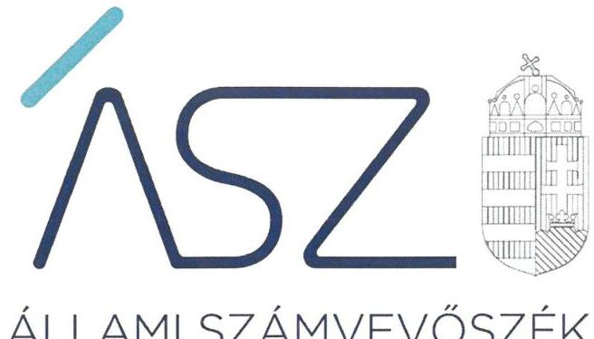
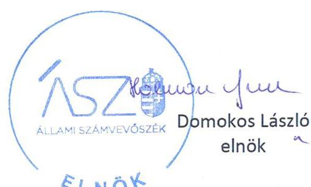
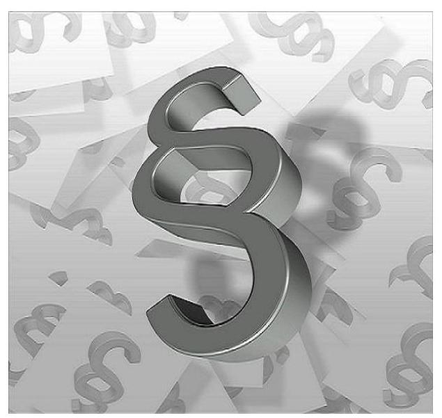

ÁLLAMI SZÁMVEVŐSZÉK

# JELENTÉS 

A költségvetési támogatásban részesülő pártalapítványok 2018-2019. évi gazdálkodása törvényességének ellenőrzése

Szövetség a Polgári Magyarországért Alapítvány
2021.

21048
www.asz.hu

---

ÁLLAMI SZÁMVEVŐSZÉK

# JELENTÉS

A költségvetési támogatásban részesülő pártalapítványok 2018-2019. évi gazdálkodása törvényességének ellenőrzése

Szövetség a Polgári Magyarországért Alapítvány

2021. 06. hó 01. nap

21048
www.asz.hu

---

# AZ ELLENŐRZÉST FELÜGYELTE: 

PETŐ KRISZTINA felügyeleti vezető
KAKAS SÁNDOR felügyeleti vezető

AZ ELLENŐRZÉST VEZETTE ÉS A VÉGREHAJTÁSÁÉRT FELELŐS:
KISTÓTH KRISZTINA ellenőrzésvezető

A PROGRAM ÖSSZEÁLLÍTÁSÁÉRT FELELŐS:
GÖRGÉNYI GÁBOR ETAMO osztályvezető

A TÉMÁHOZ KAPCSOLÓDÓ KORÁBBI SZÁMVEVŐSZÉKI JELENTÉSEK:

- címe: A költségvetési támogatásban részesülő pártalapítványok 2016-2017. évi gazdálkodása törvényességének ellenőrzése Szövetség a Polgári Magyarországért Alapítvány
- sorszáma: 19153

IKTATÓSZÁM: EL-3204-001/2021
TÉMASZÁM: 2539
ELLENŐRZÉS-AZONOSÍTÓ SZÁM: V-0883001

---

# TARTALOMJEGYZÉK 

■ ÖSSZEGZÉS ..... 5
■ AZ ELLENŐRZÉS CÉLJA ..... 6
■ AZ ELLENŐRZÉS TERÜLETE ..... 7
■ AZ ELLENŐRZÉS HÁTTERE, INDOKOLTSÁGA ..... 8
■ A JELENTÉS LÉNYEGES KÉRDÉSKÖREI ..... 9
■ AZ ELLENŐRZÉS HATÓKÖRE ÉS MÓDSZEREI ..... 10
■ MEGÁLLAPÍTÁSOK ..... 12
■ MELLÉKLETEK ..... 15
I. sz. melléklet: Értelmező szótár ..... 15
■ FÜGGELÉK: ÉSZREVÉTELEK ..... 17
■ RÖVIDÍTÉSEK JEGYZÉKE ..... 19

---

.

---

# ÖSSZEGZÉS 

A Szövetség a Polgári Magyarországért Alapítvány a 2018-2019. években törvényesen gazdálkodott. A pártalapítvány szervezeti és gazdálkodási kereteinek kialakításával megteremtette a szabályszerű gazdálkodás feltételeit, a könyvvezetés és gazdálkodás során betartotta a törvényi előírásokat.

## Az ellenőrzés társadalmi indokoltsága

A pártok a politikai kultúra fejlesztése érdekében tudományos, ismeretterjesztő, kutatási és oktatási tevékenységük elősegítésére költségvetési támogatásra jogosult alapítványt hozhatnak létre. Ezen pártalapítványok gazdálkodása törvényességének ellenőrzése a Pártalapítványi törvény szerint az Állami Számvevőszék feladata. E törvény alapján az ÁSZ kétévente - kötelező jelleggel - ellenőrzi azoknak a pártalapítványoknak a gazdálkodását, amelyek állami költségvetési támogatásban részesültek.

Az ellenőrzés a gazdálkodás szabályszerűségének bemutatásával hozzájárul ahhoz, hogy a társadalom objektív képet alkothasson a pártalapítványok működéséről. Az ellenőrzés eredménye elősegítheti, hogy a jelentésben foglalt megállapítások, következtések és javaslatok alapján a törvényalkotók konkrét lépéseket tegyenek a pártalapítványok finanszírozására vonatkozó szabályozások megváltoztatása, átláthatóbbá, ellenőrizhetőbbé tétele irányába. Az ellenőrzött szervezetek szintjén a hiányosságok, szabálytalanságok feltárása, az ennek kapcsán megfogalmazott megállapítások csökkenthetik a működés szabályszerűségének kockázatait, elősegíthetik a pártalapítványok szabályszerű gazdálkodását. A gazdálkodás szabályszerűségének bemutatásával az ellenőrzés értékteremtő módon járul hozzá az ÁSZ stratégiai céljainak megvalósításához.

## Főbb megállapítások, következtetések

A Szövetség a Polgári Magyarországért Alapítvány gazdálkodása szervezeti és szabályozási kereteit a jogszabályban előírtak szerint kialakította, ezzel a szabályszerű gazdálkodás feltételeit megteremtette.

A 2018-2019. években a kapott támogatások elfogadása, felhasználása és nyilvántartása szabályszerű volt, a tevékenység kiadásait és a nyújtott támogatásokat szabályszerűen számolták el. Ezzel biztosított volt a jogszabályok és belső szabályok szerinti könyvvezetés és gazdálkodás. A Szövetség a Polgári Magyarországért Alapítvány 2018-2019. évekre a Pártalapítványi törvény és a Számviteli törvény szerint elkészítette a tevékenységéről szóló éves jelentéseket és az éves számviteli beszámolókat, amelyeket határidőben letétbe helyezett és közzétett.

Ezáltal a Szövetség a Polgári Magyarországért Alapítvány biztosította gazdálkodása törvényességét, a közpénzekkel való átlátható és ellenőrizhető gazdálkodást.

---

# AZ ELLENŐRZÉS CÉLJA 

AZ ELLENŐRZÉS CÉLJA, hogy az ÁSZ ${ }^{1}$ - mint az Országgyűlés legfőbb ellenőrző szerve - független és szakmailag megalapozott véleményt adjon a pártalapítványok, mint ellenőrzött szervezetek gazdálkodásának törvényességéről. Annak megállapítása, hogy a pártalapítvány törvényesen gazdálkodott-e, az éves számviteli beszámolók és a pártalapítvány tevékenységéről szóló éves jelentések a jogszabályi előírásoknak megfeleltek-e, a könyvvezetés és gazdálkodás során a vonatkozó jogszabályi rendelkezéseket és belső előírásokat betartották-e.

Az ellenőrzés célja továbbá annak értékelése, hogy az előző számvevőszéki jelentésben foglalt megállapításokkal összhangban készített intézkedési tervben meghatározott feladatokat az ellenőrzött szervezet végrehajtotta-e.

---

# AZ ELLENŐRZÉS TERÜLETE 

## Szövetség a Polgári Magyarországért Alapítvány

A Szövetség a Polgári Magyarországért Alapítványt a FIDESZMagyar Polgári Szövetség hozta létre 2003. október 2-án, a Párt tv. ${ }^{2}$ és a Pártalapítványi tv. ${ }^{3}$ előírásai alapján, 0,6 M Ft induló vagyonnal. A pártalapítványok törvényes gazdálkodásának (könyvvezetése, beszámolása, jelentéstétele) szabályait alapvetően a Pártalapítványi tv.-en túl a Számv. tv. ${ }^{4}$ és annak végrehajtási rendelete Számviteli vhr. ${ }^{5}$ határozzák meg.
A Pártalapítvány ${ }^{6}$ Alapító okirat ${ }^{7}$ szerinti célja a politikai kultúra fejlesztése a nemzeti elkötelezettség és a kereszténydemokrata eszmekör jegyében. A Pártalapítvány cél szerinti tevékenysége jellemzően, a korszerű oktatási, tudományos, ismeretterjesztő és kutatási tevékenység, előadások, konferenciák szervezése, támogatása. Valamint tanulmányok, szakkönyvek, egyéb az alapítvány célját szolgáló kiadványok kiadása, illetve kiadásuk támogatása.

A Pártalapítvány ügyvezető szerve a 3 tagból álló Kuratórium ${ }^{8}$ volt, amely tagjai az ellenőrzött időszakban nem változtak.

A Pártalapítvány működését, gazdálkodását háromtagú felügyelő bizottság ellenőrizte, szervezeti és működési szabályzata ${ }_{1-5}{ }^{9}$ szerint munkaszervezetét főigazgató vezette.

A Pártalapítvány a kettős könyvvezetése alapján egyszerűsített éves beszámoló készítésére volt kötelezett. A könyvviteli feladatai ellátását külső szolgáltató ${ }^{10}$ bevonásával biztosította, a számviteli beszámoló vizsgálatára könyvvizsgálót bízott meg. Az ellenőrzött időszakban a Pártalapítvány számviteli politikája és beszámolója szerint gazdasági-vállalkozási tevékenységet nem folytatott.

A Pártalapítvány - Országos Bírósági Hivatalnál letétbe helyezett - beszámolója szerint 2018. évben 551,5 M Ft, a 2019. évben 1468,9 M Ft költségvetési támogatásban részesült.

Külső ellenőrzésre a Pártalapítványnál az ellenőrzött időszakban nem került sor.

Az ÁSZ 2019. évben ellenőrizte a Pártalapítvány gazdálkodásának törvényességét. A 19153. számú számvevőszék jelentés ${ }^{11}$ javaslatot nem tartalmazott. A Pártalapítványnak nem volt intézkedési kötelezettsége. Ezért jelen ellenőrzés keretében utóellenőrzésre nem került sor.

---

# AZ ELLENŐRZÉS HÁTTERE, INDOKOLTSÁGA 

Társadalmi elvárás a közpénzek értékelvű, rendeltetésszerű felhasználása, a közpénzekből nyújtott támogatások átláthatóságának megteremtése, amelyhez az ÁSZ ${ }^{12}$ az államháztartásból nyújtott támogatások ellenőrzésével kíván hozzájárulni. A Párt tv. 9/A § (1) bekezdése alapján a politikai kultúra fejlesztése érdekében tudományos, ismeretterjesztő, kutatási, oktatási tevékenység folytatása céljából létrehozott pártalapítványok gazdálkodása törvényességének ellenőrzése - Pártalapítványi tv. 4. § (2) bekezdése értelmében - az ÁSZ feladata. E törvény 4. § (4) bekezdése alapján az ÁSZ kétévente - kötelező jelleggel - ellenőrzi azoknak a pártalapítványoknak a gazdálkodását, amelyek állami költségvetési támogatásban részesültek.

Az ÁSZ, mint az Országgyűlés ellenőrző szerve a pártalapítványok gazdálkodása törvényességének/szabályszerűségének értékelésével hozzájárul ahhoz, hogy a társadalom objektív képet alkothasson a pártalapítványok működéséről. Az ellenőrzés eredményeinek célzott felhasználói a nyilvánosság, a jogalkotó, továbbá a pártalapítványok esetén azok alapítója és szervei. A jelentésben foglalt megállapítások, következtetések és javaslatok alapján a törvényalkotók konkrét lépéseket tehetnek a pártalapítványokra vonatkozó szabályozások megváltoztatása, átláthatóbbá, ellenőrizhetőbbé tétele irányába. Az ellenőrzött szervezetek szintjén a hiányosságok, szabálytalanságok feltárása, az ennek kapcsán megfogalmazott megállapítások elősegíthetik a pártalapítványok szabályszerű gazdálkodását.

Az ÁSZ tv. ${ }^{13}$ 33. § (1) bekezdése értelmében az ellenőrzött szervezet vezetője köteles a jelentésben foglalt megállapításokhoz kapcsolódó intézkedési tervet összeállítani, és azt a jelentés kézhezvételétől számított harminc napon belül az Állami Számvevőszék részére megküldeni.

Az ÁSZ által befogadott intézkedési tervben foglaltak megvalósítását az ÁSZ tv. 33. § (7) bekezdésében foglaltak alapján - az ÁSZ utóellenőrzés keretében ellenőrizheti. Az utóellenőrzések keretében - az intézkedések értékelése során - az ÁSZ figyelembe veszi az ellenőrzött szervezetek müködési feltételeiben, valamint a jogszabályi előírásokban bekövetkezett változásokat.

---

# A JELENTÉS LÉNYEGES KÉRDÉSKÖREI 

1. A Szövetség a Polgári Magyarországért Alapítvány gazdálkodásának törvényessége biztositott volt-e?
2. A Szövetség a Polgári Magyarországért Alapítvány könyvvezetése és gazdálkodása során a vonatkozó jogszabályi rendelkezéseket és belső előírásokat betartották-e?
3. A Szövetség a Polgári Magyarországért Alapítvány tevékenységéről szóló éves jelentések, az éves számviteli beszámolók a jogszabályi előírásoknak megfeleltek-e?

---

# AZ ELLENŐRZÉS HATÓKÖRE ÉS MÓDSZEREI 

## Az ellenőrzés típusa

Szabályszerűségi ellenőrzés.

## Az ellenőrzött időszak

2018-2019. évek

## Az ellenőrzés tárgya

Az ellenőrzés tárgyát képezi a pártalapítvány gazdálkodása, a könyvvezetés szabályozása és gyakorlata szabályszerűsége, az éves számviteli beszámolókra és az alapítvány tevékenységéről szóló éves jelentésekre vonatkozó kötelezettség teljesítése, valamint a gazdálkodáshoz kapcsolódó ellenőrzések javaslatainak hasznosítására irányuló tevékenység.

Az ellenőrzés kiterjed minden olyan körülményre és adatra, amely az ÁSZ jogszabályban meghatározott feladatainak teljesítéséhez, valamint a program végrehajtása folyamán felmerült újabb összefüggések feltárásához szükséges.

## Az ellenőrzött szervezet

Szövetség a Polgári Magyarországért Alapítvány

## Az ellenőrzés jogalapja

Az ÁSZ tv. 1. § (3) bekezdése, 5. § (3) bekezdése, 33. § (7) bekezdése, a Pártalapítványi tv. 4. § (2) és (4) bekezdései.

## Az ellenőrzés módszerei

Az ellenőrzést az Ellenőrzési program szempontjai, az ellenőrzött időszakban hatályos jogszabályok, a jelen ellenőrzésre irányadó ÁSZ módszertan figyelembe vételével kell elvégezni.

Az ellenőrzés ideje alatt az ellenőrzött szervezettel történő kapcsolattartás az ÁSZ SZMSZ ${ }^{14}$-ének vonatkozó előírásai alapján történik.

Az ellenőrzést az ellenőrzött szervezetek által rendelkezésre bocsátott dokumentumokra, adatokra kell alapozni. A rendelkezésre bocsátott adatok, információk kontrollja az ellenőrzés keretében történik. Az ellenőrzés

---

céljának eléréséhez szükséges bizonyítékokat a számvevő az egyes adatok közvetlen, részletes elemzésével szerzi meg, a következő ellenőrzési eljárások alkalmazásával: megfigyelés, szemrevételezés, információkérés, megerősítés, mintavétel, valamint elemző eljárás. Az ellenőrzésvezető indoklással kezdeményezheti a helyszínen végrehajtott szemrevételezést.

Az ÁSZ a tételes ellenőrzés mellett statisztikai alapú mintavételezést és értékelést alkalmaz. A minták kiválasztása rétegzett mintavételezéssel történik. A minta tételeinek értékelése „szabályszerű", ha a minta ellenőrzésének eredménye alapján 95\%-os bizonyossággal a teljes sokaságban az átlagos hibaarány nem haladja meg a 10\%-ot, „nem szabályszerű, ha nagyobb, mint 10\%. Abban az esetben, ha a teljes sokaság tekintetében a 10\%-os hibaarányhoz való viszony megítélésének megbízhatósága nem éri el a 95\%-ot, annak elérése érdekében az értékelés további szempontokkal egészül ki, a feltárt hibák értéke is figyelembe vételre kerül.

Az ellenőrzési bizonyítékként felhasználható adatforrások közé tartoznak egyrészt az Ellenőrzési program részletes szempontjainál felsorolt adatforrások, másrészt minden egyéb - az ellenőrzés folyamán - feltárt, az ellenőrzés szempontjából információt tartalmazó dokumentum.

Az ellenőrzés lefolytatásához az ellenőrzött a tanúsítványok elektronikus kitöltésével, valamint az ÁSZ által kért dokumentumok elektronikus megküldésével szolgáltat adatokat. Az így rendelkezésre bocsátott adatok, információk, a tanúsítványok adatai valódiságának kontrollja az ellenőrzés keretében történik.

---

# 1. A Szövetség a Polgári Magyarországért Alapítvány gazdálkodásának törvényessége biztosított volt-e? 

Összegző megállapítás

A Pártalapítvány szabályszerű szervezeti és szabályozási feltételek kialakításával biztosította a törvényes gazdálkodása kereteit.

A Pártalapítvány kialakította gazdálkodása szabályszerű szervezeti kereteit. Az Alapító okirat a Ptk. ${ }^{15}$ szerint tartalmazta a Pártalapítvány célját és főtevékenységét, a részére teljesítendő vagyoni hozzájárulásokat, a vagyon kezelésének szabályait, az alapítványi szervek hatáskörét és eljárási szabályait. A Kuratórium és a munkáját támogató munkaszervezet múködésének szabályait a szervezeti és múködési szabályzatban rögzítették.

A gazdálkodás szabályozási kereteit a Pártalapítvány a Számv. tv., valamint a Számviteli vhr. szerint kialakította, elkészítette számviteli politikáját ${ }_{1-4}{ }^{16}$ és az annak keretében készítendő szabályzatait, valamint számlarendjét ${ }_{1,2}{ }^{17}$.

A Pártalapítvány a támogatás elfogadásának szabályait a Pártalapítványi tv. előírásaival összhangban az Alapító okiratban, valamint szervezeti és múködési szabályzatában rögzítette. A kapott támogatás elszámolási, nyilvántartási szabályait a Számv. vhr. szerint a számlarend ${ }_{1,2}$ tartalmazta.

## 2. A Szövetség a Polgári Magyarországért Alapítvány könyvvezetése és gazdálkodása során a vonatkozó jogszabályi rendelkezéseket és belső előírásokat betartották-e?

## Összegző megállapítás

A Pártalapítvány könyvvezetése, gazdálkodása, valamint a kapott és adott támogatások elszámolása szabályszerű volt.

A támogatások elfogadása során érvényesültek a Pártalapítványi tv. és a belső előírások. A kapott támogatások számviteli elszámolását és elkülönített nyilvántartását a Pártalapítvány a Számv. vhr., valamint belső szabályzatai szerint végezte. A Pártalapítvány a kapott támogatásokkal kapcsolatos közzétételi kötelezettségének a jogszabályi előírások szerint eleget tett.

A 2018-2019. évi kiadások a Számv. tv. és a Számvitel vhr., előírásaival összhangban kerültek elszámolásra. A nyújtott támogatások elbírálása, a támogatások folyósítása, valamint annak elszámolása és nyilvántartása szabályszerű volt.

---

# 3. A Szövetség a Polgári Magyarországért Alapítvány tevékenységéről szóló éves jelentések, az éves számviteli beszámolók a jogszabályi előírásoknak megfeleltek-e? 

Összegző megállapítás

A Pártalapítvány éves jelentését és éves számviteli beszámolóját a 2018-2019. évekre szabályszerűen elkészítette és közzétette.

A Pártalapítvány a 2018-2019. évek vonatkozásában a Pártalapítványi tv. szerinti tartalommal elkészítette a tevékenységéről szóló éves jelentését.

A 2018-2019. években a számviteli beszámolót az előírt határidőig a Kuratórium, a Pártalapítvány jóváhagyásra jogosult testülete jóváhagyta. A számviteli beszámolókban a mérlegtételek besorolása, azok leltárral való alátámasztottsága szabályszerű volt. A Pártalapítvány a 2018. és 2019. évi számviteli beszámolóját és mellékleteit határidőben letétbe helyezte és közzétette. A tevékenységéről szóló éves jelentést a Pártalapítványi tv. szerint határidőben közzétette.

Ezzel a Pártalapítvány éves jelentési-, beszámolási- és közzétételi kötelezettségét szabályszerűen teljesítette.

---

.

---

# MELLÉKLETEK 

- I. SZ. MELLÉKLET: ÉRTELMEZŐ SZÓTÁR
alapítvány
adomány
gazdálkodó tevékenység
gazdasági-vállalkozási tevékenység
költségvetésből juttatott/nyújtott forrás/támogatás
pártalapítvány
támogatást nyújtó személy
törzsvagyon

Az alapítvány az alapító által az alapító okiratban meghatározott tartós cél folyamatos megvalósítására létrehozott jogi személy. Az alapító az alapító okiratban meghatározza az alapítványnak juttatott vagyont és az alapítvány szervezetét. Alapítvány nem alapítható gazdasági-vállalkozási tevékenység folytatására. Az alapítvány az alapítványi cél megvalósításával közvetlenül összefüggő gazdasági tevékenység végzésére jogosult. Alapítvány nem lehet korlátlan felelősségű tagja más jogalanynak, nem létesíthet alapítványt és nem csatlakozhat alapítványhoz. (Forrás: Ptk. 3:378. §, 3:379. § (1) - (3) bekezdés)
a civil szervezetnek - létesítő/alapító okiratban rögzített céljaira - ellenszolgáltatás nélkül juttatott eszköz, illetve nyújtott szolgáltatás (Forrás: Ectv ${ }^{18}$. 2. § 1. pont.)
azon tevékenységek összessége, amelyek a civil szervezet vagyoni, pénzügyi, jövedelmi helyzetére kiható gazdasági eseményt eredményeznek. (Forrás: Ectv. 2. § 10. pont.)
A jövedelem- és vagyonszerzésre irányuló vagy azt eredményező, üzletszerűen végzett gazdasági tevékenység, kivéve az adomány (ajándék) elfogadását, a létesítő okiratban meghatározott cél szerinti tevékenységet (ideértve a közhasznú tevékenységet is), 2015. november 28-tól - a pénzeszközök betétbe, értékpapírba, társasági részesedésbe történő elhelyezését és az ingatlan megszerzését, használatának átengedését és átruházását. (Forrás: Ectv. 2. § 11. pont.)
a pártalapítványoknak a Párt tv. 9/A. § (1) bekezdése és a Pártalapítványi tv. 1. § előírásainak értelmében, az éves költségvetési törvények szerint - jellemzően az 1. számú melléklet I. Országgyűlés fejezet 9. Pártalapítványok támogatás címen - az állami költségvetésből juttatott forrás/támogatás.
az államháztartás központi alrendszeréből - a Tb alap kivételével - ellenérték nélkül, pénzben nyújtott költségvetési támogatás (Forrás: Áht ${ }^{19}$. 1. § 14. pont)
a politikai kultúra fejlesztése érdekében, tudományos, ismeretterjesztő, kutatási és oktatási tevékenység folytatása céljából pártok által létrehozott, külön jogszabályban - a Pártalapítványi tv. 1. § és 3. § (1) bekezdése - meghatározott, jogi személynek minősülő egyéb szervezet, speciális jogállású alapítvány (Forrás: Párt tv. 9/A. § (1) bekezdés, Pártalapítványi tv. 1. §, Ectv. 1. § (2) bekezdés, 2. § 6. c) pont, Számv. tv. 3. § (1) bekezdése 4. pont, Számviteli vhr. 2. § (1) bekezdés I) pont)
egyértelműen azonosítható - természetes, vagy jogi - személy. (Forrás: Pártalapítványi tv. 3. § (3)-(4) bekezdése)
az induló tőke, megnövelve alapítvány esetében a csatlakozók által kifejezetten az induló tőke növelése érdekében rendelkezésre bocsátott vagyonnal (Forrás: Ectv. 2. § 28. pont)

---

.

---

# FÜGGELÉK: ÉSZREVÉTELEK 

A jelentéstervezetet a Számvevőszék 15 napos észrevételezésre megküldte az ellenőrzött szervezet vezetőjének az ÁSZ tv. 29. §* (1) bekezdése előírásának megfelelően.

A Szövetség a Polgári Magyarországért Alapítvány kuratóriumának elnöke a jelentéstervezetre az ÁSZ tv. 29. § (2) bekezdésében foglalt határidőn belül nemleges észrevételt tett.

[^0]
[^0]:    * 29. § (1) Az Állami Számvevőszék az ellenőrzési megállapításait megküldi az ellenőrzött szervezet vezetőjének vagy az általa megbízott személynek, és annak, akinek személyes felelősségét állapította meg.
    (2) Az ellenőrzött szervezet vezetője és a felelősként megjelölt személy az ellenőrzés megállapításaira tizenöt napon belül írásban észrevételt tehet.
    (3) Az Állami Számvevőszék az észrevételre a beérkezésétől számított harminc napon belül írásban válaszol. A figyelembe nem vett észrevételeket köteles a jelentésben feltüntetni, és megindokolni, hogy azokat miért nem fogadta el.

---

.

---

# RÖVIDÍTÉSEK JEGYZÉKE 

${ }^{1}$ ÁSZ
${ }^{2}$ Párt tv.
${ }^{3}$ Pártalapítványi tv.
${ }^{4}$ Számv. tv.
${ }^{5}$ Számviteli vhr.
${ }^{6}$ Pártalapítvány
${ }^{7}$ Alapító okirat
${ }^{8}$ Kuratórium
${ }^{9}$ szervezeti és müködési szabályzat ${ }_{1}$
szervezeti és müködési szabályzat ${ }_{2}$
szervezeti és müködési szabályzat ${ }_{3}$
szervezeti és müködési szabályzat ${ }_{4}$
szervezeti és müködési szabályzat ${ }_{5}$
${ }^{10}$ külső szolgáltató
${ }^{11}$ 19153. számú jelentés
${ }^{12}$ ÁSZ
${ }^{13}$ ÁSZ tv.
${ }^{14}$ ÁSZ SZMSZ
${ }^{15}$ Ptk.
${ }^{16}$ Számviteli politika1
Számviteli politika2
Számviteli politika3
Számviteli politika4

Állami Számvevőszék
1989. évi XXXIII. törvény a pártok müködéséről és gazdálkodásáról (hatályos: 1989. október 30-tól)
2003. évi XLVII. törvény a pártok müködését segítő tudományos, ismeretterjesztő, kutatási, oktatási tevékenységet végző alapítványokról (hatályos: 2003. július 1-jétől)
2000. évi C. törvény a számvitelről (hatályos: 2001. január 1-jétől)
479/2016. (XII.26.) Korm. rendelet a számviteli törvény szerinti egyes egyéb szervezetek beszámoló készítési és könyvvezetési kötelezettségeinek sajátosságairól (hatályos: 2017. január 1-jétől)
Szövetség a Polgári Magyarországért Alapítvány
A Szövetség a Polgári Magyarországért Alapítvány módosításokkal egységes szerkezetbe foglalt Alapító okirata (kelt: 2017. február 21.)
Szövetség a Polgári Magyarországért Alapítvány Kuratóriuma
Szövetség a Polgári Magyarországért Alapítvány Szervezeti Müködési Szabályzata (hatályos: 2017. február 17-től 2018. szeptember 7-ig)
Szövetség a Polgári Magyarországért Alapítvány Szervezeti Müködési Szabályzata (hatályos: 2018. szeptember 8-tól 2018. december 31-ig)
Szövetség a Polgári Magyarországért Alapítvány Szervezeti Müködési Szabályzata (hatályos: 2019. január 1-jétől 2019. március 31-ig)
Szövetség a Polgári Magyarországért Alapítvány Szervezeti Müködési Szabályzata (hatályos: 2019. április 1-jétől 2019. október 27-ig)
Szövetség a Polgári Magyarországért Alapítvány Szervezeti Müködési Szabályzata (hatályos: 2019. október 28-tól)
Derzsi \& Wernitzer Korlátolt Felelősségű Társaság
„A költségvetési támogatásban részesülő pártalapítványok 2017-2018. évi gazdálkodása törvényességének ellenőrzése - Szövetség a Polgári Magyarországért Alapítvány" címmel 2019. december 18-án megjelent számvevőszéki jelentés
Állami Számvevőszék
2011. évi LXVI. törvény az Állami Számvevőszékről
Állami Számvevőszék Szervezeti és Müködési Szabályzata
2013. évi V. törvény a Polgári Törvénykönyvről (hatályos: 2014. március 15-től)
Szövetség a Polgári Magyarországért Alapítvány Számviteli politikája (hatályos: 2017. szeptember 18-tól 2018. december 31-ig)

Szövetség a Polgári Magyarországért Alapítvány Számviteli politikája (hatályos: 2019. január 1-től 2019. március 31-ig)

Szövetség a Polgári Magyarországért Alapítvány Számviteli politikája (hatályos: 2019. április 1-től 2019. október 27-ig)

Szövetség a Polgári Magyarországért Alapítvány Számviteli politikája (hatályos: 2019. október 28-tól

---

${ }^{17}$ Számlarend: Számlarend: ${ }^{18}$ Ectv.
${ }^{19}$ Áht.

Szövetség a Polgári Magyarországért Alapítvány Számlarendje (hatályos: 2017. 09. 18.-tól 2018. május 27-ig)

Szövetség a Polgári Magyarországért Alapítvány Számlarendje (hatályos: 2018. május 28-tól)
2011. évi CLXXV. törvény az egyesülési jogról, a közhasznú jogállásról, valamint a civil szervezetek múködéséről és támogatásáról
2011. évi CXCV. törvény az államháztartásról

---

# 1052 

1052 Budapest, Apáczai Cs. J. u. 10. I 1364 Budapest 4. Pf. 54 TEL: +36 14849100
email: szamvevoszek@asz.hu
web: www.asz.hu | www.aszhirportal.hu