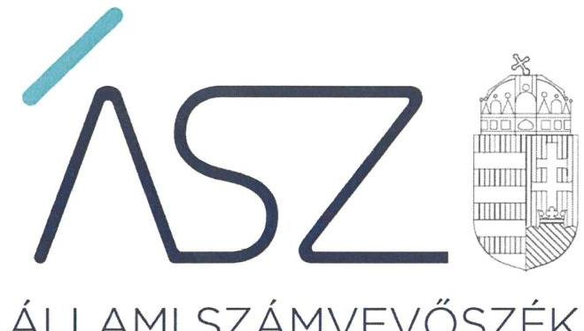
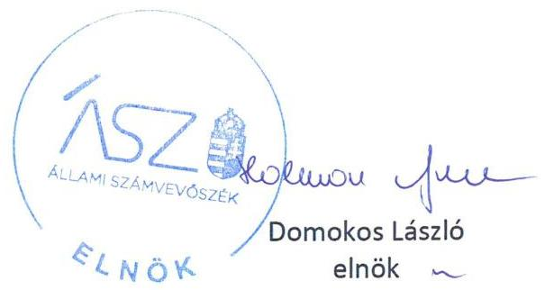

ÁLLAMI SZÁMVEVŐSZÉK

# JELENTÉS 

A költségvetési támogatásban részesülő pártalapítványok 2018-2019. évi gazdálkodása törvényességének ellenőrzése

Barankovics István Alapítvány
2021.

21049
www.asz.hu

---

ÁLLAMI SZÁMVEVŐSZÉK

# JELENTÉS

A költségvetési támogatásban részesülő pártalapítványok 2018-2019. évi gazdálkodása törvényességének ellenőrzése

Barankovics István Alapítvány

2021. 06. hó 15. nap

21049
www.asz.hu

---

# AZ ELLENŐRZÉST FELÜGYELTE: 

PETŐ KRISZTINA felügyeleti vezető
KAKAS SÁNDOR felügyeleti vezető

AZ ELLENŐRZÉST VEZETTE ÉS A VÉGREHAJTÁSÁÉRT FELELŐS:
KISTÓTH KRISZTINA ellenőrzésvezető

A PROGRAM ÖSSZEÁLLÍTÁSÁÉRT FELELŐS:
GÖRGÉNYI GÁBOR ETAMO osztályvezető

A TÉMÁHOZ KAPCSOLÓDÓ KORÁBBI SZÁMVEVŐSZÉKI JELENTÉSEK:

- címe: A költségvetési támogatásban részesülő pártalapítványok 2016-2017. évi gazdálkodása törvényességének ellenőrzése Barankovics István Alapítvány
- sorszáma: 19244

IKTATÓSZÁM: EL-3210-001/2021.
TÉMASZÁM: 2539
ELLENŐRZÉS-AZONOSÍTÓ SZÁM: V-0883002

---

# TARTALOMJEGYZÉK 

■ ÖSSZEGZÉS ..... 5
■ AZ ELLENŐRZÉS CÉLJA ..... 6
■ AZ ELLENŐRZÉS TERÜLETE ..... 7
■ AZ ELLENŐRZÉS HÁTTERE, INDOKOLTSÁGA ..... 8
■ A JELENTÉS LÉNYEGES KÉRDÉSKÖREI ..... 9
■ AZ ELLENŐRZÉS HATÓKÖRE ÉS MÓDSZEREI ..... 10
■ MEGÁLLAPÍTÁSOK ..... 13
■ MELLÉKLETEK ..... 15
I. sz. melléklet: Értelmező szótár ..... 15
■ FÜGGELÉK: ÉSZREVÉTELEK ..... 17
■ RÖVIDÍTÉSEK JEGYZÉKE ..... 19

---

.

---

# ÖSSZEGZÉS 

A Barankovics István Alapítvány a 2018-2019. években gazdálkodásának szabályszerű kereteit kialakította, a kapott támogatások felhasználása és nyilvántartása szabályszerű volt. Tevékenységéről az éves jelentéseket a jogszabályi előírások szerint elkészítette.

## Az ellenőrzés társadalmi indokoltsága

A pártok a politikai kultúra fejlesztése érdekében tudományos, ismeretterjesztő, kutatási és oktatási tevékenységük elősegítésére költségvetési támogatásra jogosult alapítványt hozhatnak létre. Ezen pártalapítványok gazdálkodása törvényességének ellenőrzése a Pártalapítványi törvény szerint az Állami Számvevőszék feladata. E törvény alapján az ÁSZ kétévente - kötelező jelleggel - ellenőrzi azoknak a pártalapítványoknak a gazdálkodását, amelyek állami költségvetési támogatásban részesültek.

Az ellenőrzés a gazdálkodás szabályszerűségének bemutatásával hozzájárul ahhoz, hogy a társadalom objektív képet alkothasson a pártalapítványok működéséről. Az ellenőrzés eredménye elősegítheti, hogy a jelentésben foglalt megállapítások, következtések és javaslatok alapján a törvényalkotók konkrét lépéseket tegyenek a pártalapítványok finanszírozására vonatkozó szabályozások megváltoztatása, átláthatóbbá, ellenőrizhetőbbé tétele irányába. Az ellenőrzött szervezetek szintjén a hiányosságok, szabálytalanságok feltárása, az ennek kapcsán megfogalmazott megállapítások csökkenthetik a működés szabályszerűségének kockázatait, elősegíthetik a pártalapítványok szabályszerű gazdálkodását. A gazdálkodás szabályszerűségének bemutatásával az ellenőrzés értékteremtő módon járul hozzá az ÁSZ stratégiai céljainak megvalósításához.

## Főbb megállapítások, következtetések

A Barankovics István Alapítvány a jogszabályi előírásokkal összhangban gazdálkodása szabályszerű szervezeti és szabályozási kereteit kialakította, ezzel megteremtette a közpénzekkel való ellenőrizhető és átlátható gazdálkodás feltételeit.

A 2018-2019. években a Barankovics István Alapítványnál a támogatás elfogadása, elszámolása és nyilvántartása szabályszerű volt, a költségek és ráfordítások elszámolása megfelelt a jogszabályi előírásoknak. A 2018-2019. évekre elkészítette tevékenységéről a Pártalapítványi törvény szerinti éves jelentését és számviteli beszámolóját.

A Barankovics István Alapítvány a 2016-2017. évi gazdálkodásának ellenőrzéséről szóló számvevőszéki jelentés javaslatot megalapozó megállapításai alapján meghozott intézkedései a pénzügyi gazdálkodás területén előforduló szabálytalanságok kockázatát csökkentették, a gazdálkodás szabályszerűsége javult.

---

# AZ ELLENŐRZÉS CÉLJA 

AZ ELLENŐRZÉS CÉLJA, hogy az ÁSZ ${ }^{1}$ - mint az Országgyűlés legfőbb ellenőrző szerve - független és szakmailag megalapozott véleményt adjon a pártalapítványok, mint ellenőrzött szervezetek gazdálkodásának törvényességéről. Annak megállapítása, hogy a pártalapítvány törvényesen gazdálkodott-e, az éves számviteli beszámolók és a pártalapítvány tevékenységéről szóló éves jelentések a jogszabályi előírásoknak megfeleltek-e, a könyvvezetés és gazdálkodás során a vonatkozó jogszabályi rendelkezéseket és belső előírásokat betartották-e.

Az ellenőrzés célja továbbá annak értékelése, hogy az előző számvevőszéki jelentésben foglalt megállapításokkal összhangban készített intézkedési tervben meghatározott feladatokat az ellenőrzött szervezet végrehajtotta-e.

---

# **AZ ELLENŐRZÉS TERÜLETE**

## **Barankovics István Alapítvány**

A Barankovics István Alapítványt 2006-ban hozta létre határozatlan időre a Kereszténydemokrata Néppárt, 0,7 M Ft indulóvagyonnal. A pártalapítványok törvényes gazdálkodásának (könyvvezetése, beszámolása, jelentéstétele) szabályait alapvetően a Pártalapítványi tv.2-en túl a Számv. tv.3 és annak végrehajtási rendelete Számviteli vhr.4 határozzák meg.

A Pártalapítvány5 Alapító okirata1,26 szerinti célja az európai kereszténydemokrata és keresztényszociális eszme megismertetése, a nemzeti elkötelezettség és a kereszténydemokrata eszmekör jegyében az alapító szándékával és a közjó szolgálatával összhangban a politikai kultúra fejlesztése érdekében tudományos, ismeretterjesztő, kutatási és oktatási tevékenység elősegítése.

Alapcél szerinti tevékenysége korszerű oktatási, tudományos, ismeretterjesztő tevékenységi formák, a céljait szolgáló kutatási tevékenység, előadások, konferenciák szervezése, támogatása. Tanulmányok, szakkönyvek, egyéb, a céljait szolgáló kiadványok kiadása, a kiadás támogatása, a célokkal összefüggésben kiírt pályázaton való részvétel.

A Pártalapítvány legfőbb, általános ügydöntő, ügyintéző, képviselő és kezelő szerve a hét tagból álló Kuratórium7 volt. Az ellenőrzött időszakban a Kuratórium elnökének személye nem változott. A Pártalapítvány tevékenységét az Alapító okirat1,2-ben foglaltak szerint három tagú Felügyelő Bizottság8 ellenőrizte. Az Alapító okirat1,2 gazdasági-vállalkozási tevékenység folytatását nem tette lehetővé, a Pártalapítvány beszámolója szerint az ellenőrzött időszakban gazdasági-vállalkozási tevékenységet nem végzett. Közhasznúsági fokozatba történő besorolással nem rendelkezett.

A Pártalapítvány az ellenőrzött időszakban egyszerűsített éves beszámolót készített, amelyet kettős könyvvitellel támasztott alá. A pénzügyi- és számviteli feladatai ellátását szerződés alapján számviteli szolgáltatást nyújtó társaság bevonásával biztosította. A Számv. tv. szerint a Pártalapítvány az ellenőrzött időszakban nem volt könyvvizsgálatra kötelezett, a számviteli beszámoló felülvizsgálatával könyvvizsgálót nem bízott meg.

A Pártalapítvány – Országos Bírósági Hivatalnál letétbe helyezett – beszámolója szerint 2018-ban 56,1 M Ft, 2019-ben 149,7 M Ft költségvetési támogatásban részesült.

Az ÁSZ 2019. évben ellenőrizte a Pártalapítvány gazdálkodásának törvényességét. Az utóellenőrzés az ÁSZ tv.9-nek megfelelően a 19244. számú jelentés10 megállapításaira készített intézkedési tervben foglaltak végrehajtásának ellenőrzésére terjedt ki.

A Pártalapítványnál további külső ellenőrzés az ellenőrzött időszakban nem volt.

---

# AZ ELLENŐRZÉS HÁTTERE, INDOKOLTSÁGA 

Társadalmi elvárás a közpénzek értékelvű, rendeltetésszerű felhasználása, a közpénzekből nyújtott támogatások átláthatóságának megteremtése, amelyhez az ÁSZ az államháztartásból nyújtott támogatások ellenőrzésével kíván hozzájárulni. A Párt tv. ${ }^{11}$ 9/A § (1) bekezdése alapján a politikai kultúra fejlesztése érdekében tudományos, ismeretterjesztő, kutatási, oktatási tevékenység folytatása céljából létrehozott pártalapítványok gazdálkodása törvényességének ellenőrzése - Pártalapítványi tv. 4. § (2) bekezdése értelmében - az ÁSZ feladata. E törvény 4. § (4) bekezdése alapján az ÁSZ kétévente - kötelező jelleggel - ellenőrzi azoknak a pártalapítványoknak a gazdálkodását, amelyek állami költségvetési támogatásban részesültek.

Az ÁSZ, mint az Országgyűlés ellenőrző szerve a pártalapítványok gazdálkodása törvényességének/szabályszerűségének értékelésével hozzájárul ahhoz, hogy a társadalom objektív képet alkothasson a pártalapítványok működéséről. Az ellenőrzés eredményeinek célzott felhasználói a nyilvánosság, a jogalkotó, továbbá a pártalapítványok esetén azok alapítója és szervei. A jelentésben foglalt megállapítások, következtetések és javaslatok alapján a törvényalkotók konkrét lépéseket tehetnek a pártalapítványokra vonatkozó szabályozások megváltoztatása, átláthatóbbá, ellenőrizhetőbbé tétele irányába. Az ellenőrzött szervezetek szintjén a hiányosságok, szabálytalanságok feltárása, az ennek kapcsán megfogalmazott megállapítások elősegíthetik a pártalapítványok szabályszerű gazdálkodását.

Az ÁSZ tv. 33. § (1) bekezdése értelmében az ellenőrzött szervezet vezetője köteles a jelentésben foglalt megállapításokhoz kapcsolódó intézkedési tervet összeállítani, és azt a jelentés kézhezvételétől számított harminc napon belül az Állami Számvevőszék részére megküldeni.

Az ÁSZ által befogadott intézkedési tervben foglaltak megvalósítását az ÁSZ tv. 33. § (7) bekezdésében foglaltak alapján - az ÁSZ utóellenőrzés keretében ellenőrizheti. Az utóellenőrzések keretében - az intézkedések értékelése során - az ÁSZ figyelembe veszi az ellenőrzött szervezetek múködési feltételeiben, valamint a jogszabályi előírásokban bekövetkezett változásokat.

---

# A JELENTÉS LÉNYEGES KÉRDÉSKÖREI 

1. A Barankovics István Alapítvány gazdálkodásának törvényessége biztositott volt-e?
2. A Barankovics István Alapítvány könyvvezetése és gazdálkodása során a vonatkozó jogszabályi rendelkezéseket és belső elöírásokat betartották-e?
3. A Barankovics István Alapítvány tevékenységéről szóló éves jelentések, az éves számviteli beszámolók a jogszabályi elöírásoknak megfeleltek-e?
4. A Barankovics István Alapítvány az intézkedési tervben meghatározott feladatokat végrehajtotta-e?

---

# AZ ELLENŐRZÉS HATÓKÖRE ÉS MÓDSZEREI 

## Az ellenőrzés típusa

Szabályszerüségi ellenőrzés.

## Az ellenőrzött időszak

2018-2019. évek. Továbbá az utóellenőrzés alapját képező ÁSZ jelentés közzétételének napjától, azaz 2019. december 18-ától jelen ellenőrzésről szóló kiértesítő levél keltének napjáig 2020. november 26-ig tartó időszak.

## Az ellenőrzés tárgya

Az ellenőrzés tárgyát képezi a pártalapítvány gazdálkodása, a könyvvezetés szabályozása és gyakorlata szabályszerűsége, az éves számviteli beszámolókra és az alapítvány tevékenységéről szóló éves jelentésekre vonatkozó kötelezettség teljesítése, valamint a gazdálkodáshoz kapcsolódó ellenőrzések javaslatainak hasznosítására irányuló tevékenység.

Az utóellenőrzés az ÁSZ tv. 2011. július 1-jei hatálybalépését követően a pártalapítványnál végzett ellenőrzések alapján készített jelentésekben foglalt megállapítások alapján készített intézkedési tervben foglaltak végrehajtásának ellenőrzésére terjed ki.

Az ellenőrzés kiterjed minden olyan körülményre és adatra, amely az ÁSZ jogszabályban meghatározott feladatainak teljesítéséhez, valamint a program végrehajtása folyamán felmerült újabb összefüggések feltárásához szükséges.

## Az ellenőrzött szervezet

Barankovics István Alapítvány

## Az ellenőrzés jogalapja

Az ÁSZ tv. 1. § (3) bekezdése, 5. § (3) bekezdése, 33. § (7) bekezdése, a Pártalapítványi tv. 4. § (2) és (4) bekezdései.

---

# Az ellenőrzés módszerei 

Az ellenőrzést az Ellenőrzési program szempontjai, az ellenőrzött időszakban hatályos jogszabályok, a jelen ellenőrzésre irányadó ÁSZ módszertan figyelembe vételével kell elvégezni.

Az ellenőrzés ideje alatt az ellenőrzött szervezettel történő kapcsolattartás az ÁSZ SZMSZ ${ }^{12}$-ének vonatkozó előírásai alapján történik.

Az ellenőrzést az ellenőrzött szervezetek által rendelkezésre bocsátott dokumentumokra, adatokra kell alapozni. A rendelkezésre bocsátott adatok, információk kontrollja az ellenőrzés keretében történik. Az ellenőrzés céljának eléréséhez szükséges bizonyítékokat a számvevő az egyes adatok közvetlen, részletes elemzésével szerzi meg, a következő ellenőrzési eljárások alkalmazásával: megfigyelés, szemrevételezés, információkérés, megerősítés, mintavétel, valamint elemző eljárás. Az ellenőrzésvezető indoklással kezdeményezheti a helyszínen végrehajtott szemrevételezést.

Az ÁSZ a tételes ellenőrzés mellett statisztikai alapú mintavételezést és értékelést alkalmaz. A minták kiválasztása rétegzett mintavételezéssel történik. A minta tételeinek értékelése „szabályszerű", ha a minta ellenőrzésének eredménye alapján 95\%-os bizonyossággal a teljes sokaságban az átlagos hibaarány nem haladja meg a 10\%-ot, „nem szabályszerű, ha nagyobb, mint 10\%. Abban az esetben, ha a teljes sokaság tekintetében a 10\%-os hibaarányhoz való viszony megítélésének megbízhatósága nem éri el a 95\%-ot, annak elérése érdekében az értékelés további szempontokkal egészül ki, a feltárt hibák értéke is figyelembe vételre kerül.

Az ellenőrzési bizonyítékként felhasználható adatforrások közé tartoznak egyrészt az Ellenőrzési program részletes szempontjainál felsorolt adatforrások, másrészt minden egyéb - az ellenőrzés folyamán - feltárt, az ellenőrzés szempontjából információt tartalmazó dokumentum.

Az ellenőrzés lefolytatásához az ellenőrzött a tanúsítványok elektronikus kitöltésével, valamint az ÁSZ által kért dokumentumok elektronikus megküldésével szolgáltat adatokat. Az így rendelkezésre bocsátott adatok, információk, a tanúsítványok adatai valódiságának kontrollja az ellenőrzés keretében történik.

Az utóellenőrzés megállapításait az ÁSZ rendelkezésére álló dokumentumok, valamint az ÁSZ adatbekérése szerint, az ellenőrzött szervezetek által elektronikusan rendelkezésre bocsátott dokumentumok, adatok alapján kell megfogalmazni, amely indokolt esetén kiegészülhet az ellenőrzött szervezet székhelyén történő adatbetekintéssel, helyszínen végrehajtott ellenőrzéssel is. Az ellenőrzés esetében az intézkedési tervekben előírt feladatokat, azok végrehajthatósága, illetve végrehajtása szempontjából az alábbiak szerint kell értékelni:
„határidőben végrehajtott" a feladat, ha a teljesítés dokumentáltan, az intézkedési tervben előírt határidőben és tartalommal megtörtént;
„határidőn túl végrehajtott" a feladat, ha annak teljesítése az intézkedési tervben meghatározott módon, de az abban előírt határidőn túl történt meg;

---

$\qquad$
„nem végrehajtott" a feladat, ha a végrehajtás nem történt meg, vagy amennyiben a teljesítést/végrehajtást nem dokumentálták, dokumentumokkal nem tudják igazolni annak teljesítését;
$\qquad$ "okafogyottá vált" a feladat, ha végrehajtására - meghatározott esemény bekövetkezése, továbbá külső körülmény, a múködést érintő feltétel változása miatt - már nincs szükség, illetve lehetőség, és egyértelmúen megállapítható, hogy az intézkedést szükségessé tevő körülmény a jövőben nem fordulhat elő;
$\qquad$ "nem időszerü" az a feladat, amelynek ellenőrzési időszakon belüli végrehajtására azért nem került (kerülhetett) sor, mert az intézkedés alapjául szolgáló esemény nem következett be, de annak jövőbeni előfordulása lehetséges, a végrehajtása nem volt esedékes, vagy a végrehajtás határideje még nem járt le.

---

# 1. A Barankovics István Alapítvány gazdálkodásának törvényessége biztosított volt-e? 

Összegző megállapítás

A Pártalapítvány gazdálkodása szabályszerű szervezeti és szabályozási feltételeit kialakította, ezzel biztosította a törvényes gazdálkodás kereteit.

A Pártalapítvány szervezeti kereteit szabályszerűen kialakította. Az Alapító okirat a Ptk. ${ }^{13}$ szerint tartalmazta a Pártalapítvány célját és főtevékenységét, a részére teljesítendő vagyoni hozzájárulásokat, a vagyon kezelésének szabályait, az alapítványi szervek hatáskörét és eljárási szabályait. A Kuratórium müködésének szabályait az SZMSZ ${ }^{14}$ tartalmazta.

A Pártalapítvány rendelkezett a Számv. tv. szerinti számviteli politiká ${ }_{1,2}{ }^{15}$-vel, és az annak keretében készítendő szabályzatokkal, valamint számlarend ${ }_{1,2}{ }^{16}$-vel.

A támogatások elfogadásának szabályait a Pártalapítványi tv. szerint az Alapító okirat tartalmazta. A kapott támogatás elszámolási és nyilvántartási rendjét a Pártalapítvány a Számv. tv. és a Számv. vhr. előírásaival összhangban a számlarend ${ }_{1,2}$-ben rögzítette.

## 2. A Barankovics István Alapítvány könyvvezetése és gazdálkodása során a vonatkozó jogszabályi rendelkezéseket és belső előírásokat betartották-e?

## Összegző megállapítás

A 2018-2019. években a Pártalapítvány könyvvezetése és gazdálkodása szabályszerű volt.

Az ellenőrzött időszakban a támogatások elfogadása során érvényesültek a Pártalapítványi tv. előírásai. A Pártalapítvány a kapott támogatás számviteli elszámolását és elkülönített nyilvántartását a Számv. vhr., valamint a számlarend ${ }_{1,2}$ előírásaival összhangban végezte.

A Pártalapítvány a 2018-2019. évi költségeket és ráfordításokat szabályszerűen számolta el.

Az Alapító Okiratban előírtak szerint került sor a nyújtott támogatások elbírálására, a támogatási szerződések megkötésére. Az adott támogatás kifizetését a Pártalapítvány szabályszerűen, a Számv. tv. és a számlarend ${ }_{1,2}$ előírásai szerint rögzítette a számviteli nyilvántartásokban.

---

# 3. A Barankovics István Alapítvány tevékenységéről szóló éves jelentések, az éves számviteli beszámolók a jogszabályi előírásoknak megfeleltek-e? 

Összegző megállapítás A Pártalapítvány a 2018-2019. évekre a tevékenységéről szóló éves jelentéseket szabályszerűen elkészítette és közzétette.

A 2018-2019 évekre a Pártalapítvány egyszerűsített éves beszámolójával egy időben a Pártalapítványi tv. szerinti részletezettséggel szabályszerűen elkészítette tevékenységéről szóló éves jelentését, és határidőben közzétette.

A Pártalapítvány 2018-2019. évi számviteli beszámolóit az annak jóváhagyására jogosult Kuratórium szabályszerűen jóváhagyta, határidőben letétbe helyezték és közzétették.

## 4. A Barankovics István Alapítvány az intézkedési tervben meghatározott feladatokat végrehajtotta-e?

Összegző megállapítás A Pártalapítvány a korábbi számvevőszéki ellenőrzés során feltárt szabálytalanságok megszüntetése érdekében hozott intézkedései a múködés szabályszerűségének kockázatait csökkentették.

A 19244. számú jelentésben megfogalmazott javaslatokat megalapozó megállapításokkal összhangban a Pártalapítvány - az ÁSZ tv.-ben rögzített határidőben - hét pontból álló intézkedési tervet készített.

Jelen ellenőrzés megállapította, hogy a 2019. évi költségek és ráfordítások vonatkozásában a végrehajtás igazolása szabályszerű volt, a Pártalapítvány a 2019. évi beszámolóját és éves jelentését határidőben közzétette. A korábbi ellenőrzés során feltárt szabálytalanságok nem ismétlődtek meg, ezzel a könyvvitel és a közzététel területén a szabálytalanságok ismételt előfordulásának kockázata csökkent.

Jelen ellenőrzés a leltár vonatkozásában feltárta, hogy a 2019. évi tárgyi eszközök és pénzeszközök mennyiségi leltára rendelkezésre állt. Ugyanakkor a Pártalapítvány a 2018-2019. években a saját tőke, a követelések és kötelezettségek mérlegtételeket a Számv. tv. 69. § (4) bekezdése, valamint a leltárkészítési és leltározási szabályzat ${ }^{17} 1$. fejezet 4 . bekezdése és a 8 . fejezetben foglaltak ellenére leltárral nem támasztotta alá. Ezzel a megtett intézkedés hatására mérséklődött annak a kockázata, hogy a számviteli beszámoló leltári alátámasztottsága elmarad.

---

# MELLÉKLETEK 

- I. SZ. MELLÉKLET: ÉRTELMEZŐ SZÓTÁR
alapítvány
adomány
gazdálkodó tevékenység
gazdasági-vállalkozási tevékenység
költségvetésből juttatott/nyújtott forrás/támogatás
pártalapítvány
támogatást nyújtó személy
törzsvagyon

Az alapítvány az alapító által az alapító okiratban meghatározott tartós cél folyamatos megvalósítására létrehozott jogi személy. Az alapító az alapító okiratban meghatározza az alapítványnak juttatott vagyont és az alapítvány szervezetét. Alapítvány nem alapítható gazdasági-vállalkozási tevékenység folytatására. Az alapítvány az alapítványi cél megvalósításával közvetlenül összefüggő gazdasági tevékenység végzésére jogosult. Alapítvány nem lehet korlátlan felelősségű tagja más jogalanynak, nem létesíthet alapítványt és nem csatlakozhat alapítványhoz. (Forrás: Ptk. 3:378. §, 3:379. § (1) - (3) bekezdés)
a civil szervezetnek - létesítő/alapító okiratban rögzített céljaira - ellenszolgáltatás nélkül juttatott eszköz, illetve nyújtott szolgáltatás (Forrás: Ectv. ${ }^{18}$ 2. § 1. pont.)
azon tevékenységek összessége, amelyek a civil szervezet vagyoni, pénzügyi, jövedelmi helyzetére kiható gazdasági eseményt eredményeznek.
(Forrás: Ectv. 2. § 10. pont.)
A jövedelem- és vagyonszerzésre irányuló vagy azt eredményező, üzletszerűen végzett gazdasági tevékenység, kivéve az adomány (ajándék) elfogadását, a létesítő okiratban meghatározott cél szerinti tevékenységet (ideértve a közhasznú tevékenységet is), - 2015. november 28-tól - a pénzeszközök betétbe, értékpapírba, társasági részesedésbe történő elhelyezését és az ingatlan megszerzését, használatának átengedését és átruházását. (Forrás: Ectv. 2. § 11. pont.)
a pártalapítványoknak a Párt tv. 9/A. § (1) bekezdése és a Pártalapítványi tv. 1. § előírásainak értelmében, az éves költségvetési törvények szerint - jellemzően az 1. számú melléklet I. Országgyűlés fejezet 9. Pártalapítványok támogatás címen - az állami költségvetésből juttatott forrás/támogatás.
az államháztartás központi alrendszeréből - a Tb alap kivételével - ellenérték nélkül, pénzben nyújtott költségvetési támogatás (Forrás: Áht ${ }^{19}$. 1. § 14. pont)
a politikai kultúra fejlesztése érdekében, tudományos, ismeretterjesztő, kutatási és oktatási tevékenység folytatása céljából pártok által létrehozott, külön jogszabályban - a Pártalapítványi tv. 1. § és 3. § (1) bekezdése - meghatározott, jogi személynek minősülő egyéb szervezet, speciális jogállású alapítvány (Forrás: Párt tv. 9/A. § (1) bekezdés, Pártalapítványi tv. 1. §, Ectv. 1. § (2) bekezdés, 2. § 6. c) pont, Számv. tv. 3. § (1) bekezdése 4. pont, Számviteli vhr. 2. § (1) bekezdés I) pont)
egyértelműen azonosítható - természetes, vagy jogi - személy. (Forrás: Pártalapítványi tv. 3. § (3)-(4) bekezdése)
az induló tőke, megnövelve alapítvány esetében a csatlakozók által kifejezetten az induló tőke növelése érdekében rendelkezésre bocsátott vagyonnal (Forrás: Ectv. 2. § 28. pont)

---

.

---

# FÜGGELÉK: ÉSZREVÉTELEK 

A jelentéstervezetet a Számvevőszék 15 napos észrevételezésre megküldte az ellenőrzött szervezet vezetőjének az ÁSZ tv. 29. §* (1) bekezdése előírásának megfelelően.

A Barankovics István Alapítvány kuratóriumi elnöke a jelentéstervezet megállapításaira írásban észrevételt tett.

[^0]
[^0]:    * 29. § (1) Az Állami Számvevőszék az ellenőrzési megállapításait megküldi az ellenőrzött szervezet vezetőjének vagy az általa megbízott személynek, és annak, akinek személyes felelősségét állapította meg.
    (2) Az ellenőrzött szervezet vezetője és a felelősként megjelölt személy az ellenőrzés megállapításaira tizenöt napon belül írásban észrevételt tehet.
    (3) Az Állami Számvevőszék az észrevételre a beérkezésétől számított harminc napon belül írásban válaszol. A figyelembe nem vett észrevételeket köteles a jelentésben feltüntetni, és megindokolni, hogy azokat miért nem fogadta el.

---

.

---

# RÖVIDÍTÉSEK JEGYZÉKE 

${ }^{1}$ ÁSZ
${ }^{2}$ Pártalapítványi tv.
${ }^{3}$ Számv. tv.
${ }^{4}$ Számv. vhr.
${ }^{5}$ Pártalapítvány
${ }^{6}$ Alapító okirat: Alapító okirat:
${ }^{7}$ Kuratórium
${ }^{8}$ Felügyelő Bizottság
${ }^{9}$ ÁSZ tv.
${ }^{10} 19244$. számú jelentés
${ }^{11}$ Párt tv.
${ }^{12}$ ÁSZ SZMSZ
${ }^{13}$ Ptk.
${ }^{14}$ SZMSZ
${ }^{15}$ számviteli politika:
számviteli politika:
${ }^{16}$ számlarend:
számlarend:
${ }^{17}$ leltárkészítési és leltározási szabályzat
${ }^{18}$ Ectv.
${ }^{19}$ Áht.

Állami Számvevőszék
2003. évi XLVII. törvény a pártok müködését segítő tudományos, ismeretterjesztő, kutatási, oktatási tevékenységet végző alapítványokról (hatályos: 2003. július 1-jétől)
2000. évi C. törvény a számvitelről (hatályos: 2001. január 1-jétől)

479/2016. (XII.26.) Korm. rendelet a számviteli törvény szerinti egyes egyéb szervezetek beszámoló készítési és könyvvezetési kötelezettségeinek sajátosságairól (hatályos: 2017. január 1-jétől)
Barankovics István Alapítvány
A Barankovics István Alapítvány alapító okirata (hatályos 2014. január 2-ától)
A Barankovics István Alapítvány alapító okirata (hatályos 2018. január 16-ától)
A Barankovics István Alapítvány kuratóriuma
A Barankovics István Alapítvány felügyelőbizottsága
2011. évi LXVI. törvény az Állami Számvevőszékről
„A költségvetési támogatásban részesülő pártalapítványok 2017-2018. évi gazdálkodása törvényességének ellenőrzése - Barankovics István Alapítvány" címmel 2019. december 18-án megjelent számvevőszéki jelentés
1989. évi XXXIII. törvény a pártok müködéséről és gazdálkodásáról (hatályos: 1989. október 30-tól)

Állami Számvevőszék Szervezeti és Működési Szabályzata
2013. évi V. törvény a Polgári Törvénykönyvről (hatályos: 2014. március 15-től)
A Barankovics István Alapítvány Szervezeti és működési szabályzata (hatályos 2016. január 1-jétől)

A Barankovics István Alapítvány számviteli politikája (hatályos 2016. január 1-jétől)
A Barankovics István Alapítvány számviteli politikája (hatályos 2019. január 1-jétől)
A Barankovics István Alapítvány számlarendje (hatályos 2018. január 1-jétől)
A Barankovics István Alapítvány számlarendje (hatályos 2019. január 1-jétől)
A Barankovics István Alapítvány leltárkészítési és leltározási szabályzata (hatályos 2016. január 1-jétől)
2011. évi CLXXV. törvény az egyesülési jogról, a közhasznú jogállásról, valamint a civil szervezetek müködéséről és támogatásáról
2011. évi CXCV. törvény az államháztartásról

---

# 1052 

1052 Budapest, Apáczai Cs. J. u. 10. I 1364 Budapest 4. Pf. 54 TEL: +36 14849100
email: szamvevoszek@asz.hu
web: www.asz.hu | www.aszhirportal.hu