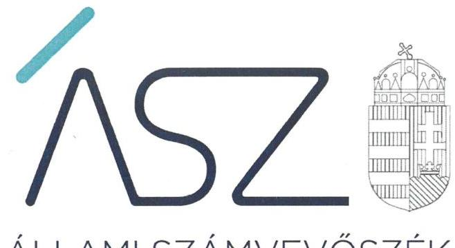
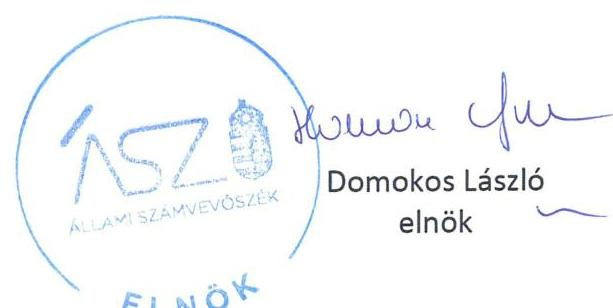

ÁLLAMI SZÁMVEVŐSZÉK

# JELENTÉS 

A költségvetési támogatásban részesülő pártalapítványok 2018-2019. évi gazdálkodása törvényességének ellenőrzése

Savköpő Menyét Alapítvány
2021.

21050
www.asz.hu

---

ÁLLAMI SZÁMVEVŐSZÉK

# JELENTÉS

A költségvetési támogatásban részesülő pártalapítványok 2018-2019. évi gazdálkodása törvényességének ellenőrzése

Savköpő Menyét Alapítvány

2021. 08. hó 19. nap

21050
www.asz.hu

---

# AZ ELLENŐRZÉST FELÜGYELTE: 

PETŐ KRISZTINA felügyeleti vezető
KAKAS SÁNDOR felügyeleti vezető

AZ ELLENŐRZÉST VEZETTE ÉS A VÉGREHAJTÁSÁÉRT FELELŐS:
KISTÓTH KRISZTINA ellenőrzésvezető

A PROGRAM ÖSSZEÁLLÍTÁSÁÉRT FELELŐS:
GÖRGÉNYI GÁBOR ETAMO osztályvezető

IKTATÓSZÁM: EL-3218-001/2021
TÉMASZÁM: 2539
ELLENŐRZÉS-AZONOSÍTÓ SZÁM: V0883004

---

# TARTALOMJEGYZÉK 

■ ÖSSZEGZÉS ..... 5
■ AZ ELLENŐRZÉS CÉLJA ..... 7
■ AZ ELLENŐRZÉS TERÜLETE ..... 8
■ AZ ELLENŐRZÉS HÁTTERE, INDOKOLTSÁGA ..... 9
■ A JELENTÉS LÉNYEGES KÉRDÉSKÖREI ..... 10
■ AZ ELLENŐRZÉS HATÓKÖRE ÉS MÓDSZEREI ..... 11
■ MEGÁLLAPÍTÁSOK ..... 13
■ JAVASLATOK ..... 14
■ MELLÉKLETEK ..... 15
I. sz. melléklet: Értelmező szótár ..... 15
■ FÜGGELÉK: ÉSZREVÉTELEK ..... 17
■ RÖVIDÍTÉSEK JEGYZÉKE ..... 19

---

.

---

# ÖSSZEGZÉS 

A Savköpő Menyét Alapítvány a 2018-2019. években gazdálkodása törvényességét, a közpénzek jogszerü felhasználásának alapvető feltételeit, a költségvetési támogatással való elszámoltathatóságot nem biztositotta.

## Az ellenőrzés társadalmi indokoltsága

A pártok a politikai kultúra fejlesztése érdekében tudományos, ismeretterjesztő, kutatási és oktatási tevékenységük elősegítésére költségvetési támogatásra jogosult alapítványt hozhatnak létre. Ezen pártalapítványok gazdálkodása törvényességének ellenőrzése a Pártalapítványi törvény szerint az Állami Számvevőszék feladata. E törvény alapján az ÁSZ kétévente - kötelező jelleggel - ellenőrzi azoknak a pártalapítványoknak a gazdálkodását, amelyek állami költségvetési támogatásban részesültek.

Az ellenőrzés a gazdálkodás szabályszerűségének bemutatásával hozzájárul ahhoz, hogy a társadalom objektív képet alkothasson a pártalapítványok múködéséről. Az ellenőrzés eredménye elősegítheti, hogy a jelentésben foglalt megállapítások, következtések és javaslatok alapján a törvényalkotók konkrét lépéseket tegyenek a pártalapítványok finanszírozására vonatkozó szabályozások megváltoztatása, átláthatóbbá, ellenőrizhetőbbé tétele irányába. Az ellenőrzött szervezetek szintjén a hiányosságok, szabálytalanságok feltárása, az ennek kapcsán megfogalmazott megállapítások csökkenthetik a múködés szabályszerűségének kockázatait, elősegíthetik a pártalapítványok szabályszerű gazdálkodását. A gazdálkodás szabályszerűségének bemutatásával az ellenőrzés értékteremtő módon járul hozzá az ÁSZ stratégiai céljainak megvalósításához.

## Főbb megállapítások, következtetések, javaslatok

A pártalapítvány Magyarország Alaptörvénye értelmében köteles a nyilvánosság előtt elszámolni a közpénzekre vonatkozó gazdálkodásával, továbbá köteles a közpénzeket az átláthatóság elve szerint kezelni. A törvényes gazdálkodásnak és a közpénzek törvényes felhasználásának szükséges feltétele a Számviteli törvény által előírt szabályzatok elkészítése. A közpénzekkel való átlátható elszámolás vonatkozásában a Pártalapítványi törvény rögzíti, hogy a pártalapítvány köteles a tevékenységéről jelentést készíteni, amelynek kötelező részét képezi a számviteli beszámoló.

A Savköpő Menyét Alapítvány a 2018. évben 8,1 M Ft, a 2019. évben 41,3 M Ft, az ellenőrzött időszakban összesen 49,4 millió Ft költségvetési támogatásban részesült. A kapott költségvetési támogatás felhasználásáról elszámolási kötelezettség terhelte.

A Savköpő Menyét Alapítvány a gazdálkodásának belső szabályát nem alkotta meg, a 2018-2019. években nem rendelkezett a Számviteli törvény szerinti számviteli politikával. Ezzel nem biztosította a közpénzekkel való ellenőrizhető, elszámoltatható és átlátható gazdálkodás feltételeit.

A 2018-2019. években a Savköpő Menyét Alapítvány a Számviteli törvény és a Pártalapítványi törvény ellenére beszámolási kötelezettségét nem teljesítette, nem rendelkezett számviteli beszámolóval, valamint nem készítette el az éves jelentését tevékenységéről.

Ezáltal a Savköpő Menyét Alapítvány 2018-2019. évi gazdálkodása nem volt törvényes, az Alaptörvénnyel ellentétesen a közpénzekre vonatkozó gazdálkodásával a nyilvánosság előtt nem számolt el, a felhasznált közpénzekre vonatkozó gazdálkodása átláthatóságát és elszámoltathatóságát nem biztosította. A Savköpő Menyét Alapítványnál nem álltak fenn a törvényes gazdálkodáshoz és a közpénzek törvényes felhasználásához szükséges feltételek.

Az Állami Számvevőszék intézkedés megtétele céljából a Savköpő Menyét Alapítvány kuratóriumi elnökének egy javaslatot fogalmazott meg.

---

# KÖVETKEZTETÉS 

Az ellenőrzés során megállapított lényeges szabálytalanság, az átláthatóság és az elszámoltathatóság hiánya miatt a Savköpő Menyét Alapítványnál felmerült a pénzeszközök rendeltetésellenes felhasználásának veszélye. Ezért a Savköpő Menyét Alapítványnak igazolnia kellett azoknak a szabályozási feltételeknek a fennállását, amelyek a pártalapítvány törvényes, elszámoltatható és átlátható gazdálkodásához, és a közpénzek törvényes felhasználásához szükségesek. Ennek keretében a Savköpő Menyét Alapítvány által az ellenőrzés rendelkezésére bocsátott számviteli szabályzat nem felelt meg a törvényi előírásoknak. A számviteli politika nem tartalmazta azokat a pártalapítványra jellemző szabályokat, előírásokat, módszereket, amelyekkel meghatározza, hogy mit tekint a számviteli elszámolás, az értékelés szempontjából lényegesnek, nem lényegesnek, jelentősnek, nem jelentősnek, illetve a törvényben biztosított választási, minősítési lehetőségek közül alkalmazott gyakorlatot milyen okok miatt kell megváltoztatni. Emiatt a szabályozás nem töltötte be a szerepét, nem volt alkalmas arra, hogy a törvényes elszámoltatható és átlátható gazdálkodás alapvető feltételeit biztosítsa, a célszerű közpénzfelhasználás nem biztosított. A Savköpő Menyét Alapítványnak ki kell alakítania a szabályszerű, átlátható és elszámoltatható gazdálkodás feltételeit biztosító számviteli politikát.

---

# AZ ELLENŐRZÉS CÉLJA 

AZ ELLENŐRZÉS CÉLJA, hogy az ÁSZ ${ }^{1}$ - mint az Országgyűlés legfőbb ellenőrző szerve - független és szakmailag megalapozott véleményt adjon a pártalapítványok, mint ellenőrzött szervezetek gazdálkodásának törvényességéről. Annak megállapítása, hogy a pártalapítvány törvényesen gazdálkodott-e, az éves számviteli beszámolók és a pártalapítvány tevékenységéről szóló éves jelentések a jogszabályi előírásoknak megfeleltek-e, a könyvvezetés és gazdálkodás során a vonatkozó jogszabályi rendelkezéseket és belső előírásokat betartották-e.

---

# **AZ ELLENŐRZÉS TERÜLETE**

## **Savköpő Menyét Alapítvány**

A Savköpő Menyét Alapítványt 2018. május 18-án a Magyar Kétfarkú Kutya Párt alapította a Párt tv.2 és a Pártalapítványi tv.3 alapján. A Pártalapítvány4 induló vagyona az alapító5 által rendelkezésére bocsátott 100 ezer forint készpénz volt.

A pártalapítványok törvényes gazdálkodásának (könyvvezetése, beszámolása, jelentéstétele) szabályait alapvetően a Pártalapítványi tv.-en túl a Számv. tv.6 és annak végrehajtási rendelete Számviteli vhr.7 határozzák meg.

A Pártalapítvány Alapító Okirat8szerinti célja a politikai kultúra fejlesztése érdekében történő tudományos, ismeretterjesztő, kutatási, oktatási tevékenység folytatása. A cél szerinti tevékenysége a politikai kultúrával összefüggő legjobb nemzetközi gyakorlatok azonosítása, azok tapasztalatainak megismertetése érdekében kutatásokat végez, támogat. Támogatja az állampolgári aktivitás módszereinek fejlesztését, oktatását és megismertetését. A politikai kultúra fejlesztését szolgáló rendezvényeket szervez, illetve támogat és együttműködik a politikai kultúra fejlesztésére irányuló tevékenységet folytató magyar és nemzetközi civil és más szervezetekkel.

Az Alapító okirat szerint a Pártalapítvány ügyvezető szerve a három tagú kuratórium. Felügyelő bizottságot az ellenőrzött időszakban nem hozott létre. Főkönyvi kivonata szerint alkalmazottat nem foglalkoztatott.

A Számviteli vhr.-szerint kettős könyvvitelt vezetett. Könyvvizsgálatra nem volt kötelezett, könyvvizsgálót nem bízott meg.

A 2018 és 2019. évi központi költségvetéséről szóló törvény végrehajtásáról szóló törvény9 szerint a Pártalapítvány tevékenysége ellátásához 2018. évben 8,1 M Ft, 2019. évben 41,3 M Ft költségvetési támogatásban részesült.

Az Alapító okirat szerint a pártalapítvány az alapítványi cél megvalósításával közvetlenül összefüggő gazdasági tevékenység végzésére jogosult, azonban az ellenőrzött időszakban főkönyvi kivonata szerint vállalkozási tevékenységet nem végzett. Az ellenőrzött időszakban nem volt közhasznú szervezet.

A Pártalapítványt az Állami Számvevőszék korábban még nem ellenőrizte.

---

# AZ ELLENŐRZÉS HÁTTERE, INDOKOLTSÁGA 

Társadalmi elvárás a közpénzek értékelvű, rendeltetésszerű felhasználása, a közpénzekből nyújtott támogatások átláthatóságának megteremtése, amelyhez az ÁSZ az államháztartásból nyújtott támogatások ellenőrzésével kíván hozzájárulni. A Párt tv. 9/A § (1) bekezdése alapján a politikai kultúra fejlesztése érdekében tudományos, ismeretterjesztő, kutatási, oktatási tevékenység folytatása céljából létrehozott pártalapítványok gazdálkodása törvényességének ellenőrzése - Pártalapítványi tv. 4. § (2) bekezdése értelmében - az ÁSZ feladata. E törvény 4. § (4) bekezdése alapján az ÁSZ kétévente - kötelező jelleggel - ellenőrzi azoknak a pártalapítványoknak a gazdálkodását, amelyek állami költségvetési támogatásban részesültek.

Az ÁSZ, mint az Országgyűlés ellenőrző szerve a pártalapítványok gazdálkodása törvényességének/szabályszerúségének értékelésével hozzájárul ahhoz, hogy a társadalom objektív képet alkothasson a pártalapítványok működéséről. Az ellenőrzés eredményeinek célzott felhasználói a nyilvánosság, a jogalkotó, továbbá a pártalapítványok esetén azok alapítója és szervei. A jelentésben foglalt megállapítások, következtetések és javaslatok alapján a törvényalkotók konkrét lépéseket tehetnek a pártalapítványokra vonatkozó szabályozások megváltoztatása, átláthatóbbá, ellenőrizhetőbbé tétele irányába. Az ellenőrzött szervezetek szintjén a hiányosságok, szabálytalanságok feltárása, az ennek kapcsán megfogalmazott megállapítások elősegíthetik a pártalapítványok szabályszerű gazdálkodását.

Az ÁSZ tv. ${ }^{10}$ 33. § (1) bekezdése értelmében az ellenőrzött szervezet vezetője köteles a jelentésben foglalt megállapításokhoz kapcsolódó intézkedési tervet összeállítani, és azt a jelentés kézhezvételétől számított harminc napon belül az Állami Számvevőszék részére megküldeni.

---

# A JELENTÉS LÉNYEGES KÉRDÉSKÖREI 

1- A Savköpő Menyét Alapítvány gazdálkodásának törvényessége biztositott volt-e?
2. A Savköpő Menyét Alapítvány könyvvezetése és gazdálkodása során a vonatkozó jogszabályi rendelkezéseket és belső előirásokat betartotta-e? A Savköpő Menyét Alapítvány tevékenységéről szóló éves jelentések, az éves számviteli beszámolók a jogszabályi elöírásoknak megfeleltek-e?

---

# AZ ELLENŐRZÉS HATÓKÖRE ÉS MÓDSZEREI 

## Az ellenőrzés típusa

Szabályszerűségi ellenőrzés.

## Az ellenőrzött időszak

2018-2019. évek.

## Az ellenőrzés tárgya

Az ellenőrzés tárgyát képezi a pártalapítvány gazdálkodása, a könyvvezetés szabályozása és gyakorlata szabályszerűsége, az éves számviteli beszámolókra és az alapítvány tevékenységéről szóló éves jelentésekre vonatkozó kötelezettség teljesítése.

Az ellenőrzés kiterjed minden olyan körülményre és adatra, amely az ÁSZ jogszabályban meghatározott feladatainak teljesítéséhez, valamint a program végrehajtása folyamán felmerült újabb összefüggések feltárásához szükséges.

## Az ellenőrzött szervezet

Savköpő Menyét Alapítvány

## Az ellenőrzés jogalapja

Az ÁSZ tv. 1. § (3) bekezdése, 5. § (3) bekezdése, a Pártalapítványi tv. 4. § (2) és (4) bekezdései.

## Az ellenőrzés módszerei

Az ellenőrzést az Ellenőrzési program szempontjai, az ellenőrzött időszakban hatályos jogszabályok, a jelen ellenőrzésre irányadó ÁSZ módszertan figyelembe vételével kell elvégezni.

Az ellenőrzés ideje alatt az ellenőrzött szervezettel történő kapcsolattartás az ÁSZ SZMSZ ${ }^{11}$-ének vonatkozó előírásai alapján történik.

Az ellenőrzést az ellenőrzött szervezetek által rendelkezésre bocsátott dokumentumokra, adatokra kell alapozni. A rendelkezésre bocsátott adatok, információk kontrollja az ellenőrzés keretében történik. Az ellenőrzés céljának eléréséhez szükséges bizonyítékokat a számvevő az egyes adatok

---

közvetlen, részletes elemzésével szerzi meg, a következő ellenőrzési eljárások alkalmazásával: megfigyelés, szemrevételezés, információkérés, megerősítés, mintavétel, valamint elemző eljárás. Az ellenőrzésvezető indoklással kezdeményezheti a helyszínen végrehajtott szemrevételezést.

Az ÁSZ a tételes ellenőrzés mellett statisztikai alapú mintavételezést és értékelést alkalmaz. A minták kiválasztása rétegzett mintavételezéssel történik. A minta tételeinek értékelése „szabályszerű", ha a minta ellenőrzésének eredménye alapján 95\%-os bizonyossággal a teljes sokaságban az átlagos hibaarány nem haladja meg a 10\%-ot, „nem szabályszerű, ha nagyobb, mint 10\%. Abban az esetben, ha a teljes sokaság tekintetében a 10\%-os hibaarányhoz való viszony megítélésének megbízhatósága nem éri el a 95\%-ot, annak elérése érdekében az értékelés további szempontokkal egészül ki, a feltárt hibák értéke is figyelembe vételre kerül.

Az ellenőrzési bizonyítékként felhasználható adatforrások közé tartoznak egyrészt az Ellenőrzési program részletes szempontjainál felsorolt adatforrások, másrészt minden egyéb - az ellenőrzés folyamán - feltárt, az ellenőrzés szempontjából információt tartalmazó dokumentum.

Az ellenőrzés lefolytatásához az ellenőrzött a tanúsítványok elektronikus kitöltésével, valamint az ÁSZ által kért dokumentumok elektronikus megküldésével szolgáltat adatokat. Az így rendelkezésre bocsátott adatok, információk, a tanúsítványok adatai valódiságának kontrollja az ellenőrzés keretében történik.

---

# MEGÁLLAPÍTÁSOK 

## 1. A Savköpő Menyét Alapítvány gazdálkodásának törvényessége biztosított volt-e?

Összegző megállapítás

A Pártalapítvány gazdálkodása belső szabályait nem alkotta meg, ezzel nem biztosította a szabályszerű gazdálkodás feltételeit.

A Pártalapítvány gazdálkodása szabályozottsága a 2018-2019. években nem felelt meg a jogszabályi előírásoknak, mivel a Pártalapítvány nem rendelkezett a Számv. tv. 14. § (3)-(4) bekezdései szerinti számviteli politikával.

Az Alapító okirat a Ptk. ${ }^{12}$ előírásaival összhangban tartalmazta a Pártalapítvány célját és főtevékenységét, a részére teljesítendő vagyoni hozzájárulásokat, a vagyon kezelésének szabályait, a kuratórium hatáskörérét és eljárási szabályait.

## 2. A Savköpő Menyét Alapítvány könyvvezetése és gazdálkodása során a vonatkozó jogszabályi rendelkezéseket és belső előírásokat betartotta-e? A Savköpő Menyét Alapítvány tevékenységéről szóló éves jelentések, az éves számviteli beszámolók a jogszabályi előírásoknak megfeleltek-e?

## Összegző megállapítás

A Pártalapítvány gazdálkodása 2018-2019. években nem volt szabályszerű, beszámolási kötelezettségét nem teljesítette.

A Pártalapítvány az éves beszámolási és közzétételi kötelezettségét a 20182019. évekre nem teljesítette, mivel a Számv. tv. 4. § (1) bekezdésében és 20. § (6) bekezdésében foglaltak ellenére nem rendelkezett a képviseletére jogosult személy aláírásával ellátott éves számviteli beszámolóval. Továbbá a 2018-2019. évekre a Pártalapítvány nem készítette el a Pártalapítványi tv. 3/A. § (1) bekezdés szerinti éves jelentést tevékenységéről.

A Pártalapítvány Alapító okiratában rögzítette a támogatás elfogadás szabályait. A 2019. évben magánszemélytől egy alkalommal kapott támogatás elfogadása a Pártalapítványi tv. és a belső előírások szerint történt.

---

# JAVASLATOK 

Az ÁSZ tv. 33. § (1) bekezdésében foglaltak értelmében az ellenőrzött szervezet vezetője köteles a jelentésben foglalt megállapításokhoz kapcsolódó intézkedési tervet összeállítani és azt a jelentés kézhezvételétől számított 30 napon belül az ÁSZ részére megküldeni. Amennyiben az ellenőrzött szervezet vezetője nem küldi meg határidőben az intézkedési tervet, vagy továbbra sem elfogadható intézkedési tervet küld, az Állami Számvevőszék elnöke az ÁSZ tv. 33. § (3) bekezdése a) és b) pontjaiban foglaltakat érvényesítheti.

## A Pártalapítvány kuratóriumi elnökének

1. Gondoskodjon a számviteli törvénynek megfelelő számviteli politika elkészitéséről.
(1. sz. megállapítás 1. bekezdése alapján)

---

# MELLÉKLETEK 

- I. SZ. MELLÉKLET: ÉRTELMEZŐ SZÓTÁR
alapítvány
adomány
gazdálkodó tevékenység
gazdasági-vállalkozási tevékenység
költségvetésből juttatott/nyújtott forrás/támogatás
pártalapítvány
támogatást nyújtó személy
törzsvagyon

Az alapítvány az alapító által az alapító okiratban meghatározott tartós cél folyamatos megvalósítására létrehozott jogi személy. Az alapító az alapító okiratban meghatározza az alapítványnak juttatott vagyont és az alapítvány szervezetét. Alapítvány nem alapítható gazdasági-vállalkozási tevékenység folytatására. Az alapítvány az alapítványi cél megvalósításával közvetlenül összefüggő gazdasági tevékenység végzésére jogosult. Alapítvány nem lehet korlátlan felelősségű tagja más jogalanynak, nem létesíthet alapítványt és nem csatlakozhat alapítványhoz. (Forrás: Ptk. 3:378. §, 3:379. § (1) - (3) bekezdés) a civil szervezetnek - létesítő/alapító okiratban rögzített céljaira - ellenszolgáltatás nélkül juttatott eszköz, illetve nyújtott szolgáltatás (Forrás: Ectv ${ }^{13}$. 2. § 1. pont.) azon tevékenységek összessége, amelyek a civil szervezet vagyoni, pénzügyi, jövedelmi helyzetére kiható gazdasági eseményt eredményeznek. (Forrás: Ectv. 2. § 10. pont.) A jövedelem- és vagyonszerzésre irányuló vagy azt eredményező, üzletszerűen végzett gazdasági tevékenység, kivéve az adomány (ajándék) elfogadását, a létesítő okiratban meghatározott cél szerinti tevékenységet (ideértve a közhasznú tevékenységet is), - 2015. november 28-tól - a pénzeszközök betétbe, értékpapírba, társasági részesedésbe történő elhelyezését és az ingatlan megszerzését, használatának átengedését és átruházását. (Forrás: Ectv. 2. § 11. pont.)
a pártalapítványoknak a Párt tv. 9/A. § (1) bekezdése és a Pártalapítványi tv. 1. § előírásainak értelmében, az éves költségvetési törvények szerint - jellemzően az 1. számú melléklet I. Országgyűlés fejezet 9. Pártalapítványok támogatás címen - az állami költségvetésből juttatott forrás/támogatás.
az államháztartás központi alrendszeréből - a Tb alap kivételével - ellenérték nélkül, pénzben nyújtott költségvetési támogatás (Forrás: Áht ${ }^{14}$. 1. § 14. pont)
a politikai kultúra fejlesztése érdekében, tudományos, ismeretterjesztő, kutatási és oktatási tevékenység folytatása céljából pártok által létrehozott, külön jogszabályban - a Pártalapítványi tv. 1. § és 3. § (1) bekezdése - meghatározott, jogi személynek minősülő egyéb szervezet, speciális jogállású alapítvány (Forrás: Párt tv. 9/A. § (1) bekezdés, Pártalapítványi tv. 1. §, Ectv. 1. § (2) bekezdés, 2. § 6. c) pont, Számv. tv. 3. § (1) bekezdése 4. pont, Számviteli vhr. 2. § (1) bekezdés I) pont)
egyértelműen azonosítható - természetes, vagy jogi - személy. (Forrás: Pártalapítványi tv. 3. § (3)-(4) bekezdése)
az induló tőke, megnövelve alapítvány esetében a csatlakozók által kifejezetten az induló tőke növelése érdekében rendelkezésre bocsátott vagyonnal (Forrás: Ectv. 2. § 28. pont)

---

.

---

# FÜGGELÉK: ÉSZREVÉTELEK 

A jelentéstervezetet a Számvevőszék 15 napos észrevételezésre megküldte az ellenőrzött szervezet vezetőjének az ÁSZ tv. 29. §* (1) bekezdése előírásának megfelelően.

A Savköpő Menyét Alapítvány kuratóriumi elnöke a jelentéstervezet megállapításaira az ÁSZ tv. 29. § (2) bekezdésében foglalt határidőn belül nem tett észrevételt.

[^0]
[^0]:    * 29. § (1) Az Állami Számvevőszék az ellenőrzési megállapításait megküldi az ellenőrzött szervezet vezetőjének vagy az általa megbízott személynek, és annak, akinek személyes felelősségét állapította meg.
    (2) Az ellenőrzött szervezet vezetője és a felelősként megjelölt személy az ellenőrzés megállapításaira tizenöt napon belül írásban észrevételt tehet.
    (3) Az Állami Számvevőszék az észrevételre a beérkezésétől számított harminc napon belül írásban válaszol. A figyelembe nem vett észrevételeket köteles a jelentésben feltüntetni, és megindokolni, hogy azokat miért nem fogadta el.

---

.

---

# RÖVIDÍTÉSEK JEGYZÉKE 

${ }^{1}$ ÁSZ
${ }^{2}$ Párt tv.
${ }^{3}$ Pártalapítványi tv.
${ }^{4}$ Pártalapítvány
${ }^{5}$ alapító
${ }^{6}$ Számv. tv.
${ }^{7}$ Számviteli vhr.
${ }^{8}$ Alapító Okirat
${ }^{9}$ központi költségvetéséről szóló törvény végrehajtásáról szóló törvény
${ }^{10}$ ÁSZ tv.
${ }^{11}$ ÁSZ SZMSZ
${ }^{12}$ Ptk.
${ }^{13}$ Ectv.
${ }^{14}$ Áht.

Állami Számvevőszék
a pártok müködéséről és gazdálkodásáról szóló 1989. évi XXXIII. törvény (hatályos: 1989.10.30-tól)
a pártok müködését segítő tudományos, ismeretterjesztő, kutatási, oktatási tevékenységet végző alapítványokról szóló 2003. évi XLVII. törvény (hatályos: 2003.07.01.)

Savköpő Menyét Alapítvány
Magyar Kétfarkú Kutya Párt
2000. évi C. törvény a számvitelről (hatályos: 2001. január 1-jétől)

479/2016. (XII.26.) Korm. rendelet a számviteli törvény szerinti egyes egyéb szervezetek beszámoló készítési és könyvvezetési kötelezettségeinek sajátosságairól (hatályos: 2017. január 1-jétől)
A Savköpő Menyét Alapítvány Alapító okirata, kelt: 2018. május 18.
2019. évi LXXIX. törvény a Magyarország 2018. évi központi költségvetéséről szóló 2017. évi C. törvény végrehajtásáról
2020. évi CXVII. törvény a Magyarország 2019. évi központi költségvetéséről szóló 2018. évi L. törvény végrehajtásáról
2011. évi LXVI. törvény az Állami Számvevőszékről

Állami Számvevőszék Szervezeti és Müködési Szabályzata
2013. évi V. törvény a Polgári Törvénykönyvről (hatályos: 2014. március 15-től)
2011. évi CLXXV. törvény az egyesülési jogról, a közhasznú jogállásról, valamint a civil szervezetek müködéséről és támogatásáról
2011. évi CXCV. törvény az államháztartásról

---

# 1052 

1052 Budapest, Apáczai Cs. J. u. 10. I 1364 Budapest 4. Pf. 54 TEL: +36 14849100
email: szamvevoszek@asz.hu
web: www.asz.hu | www.aszhirportal.hu