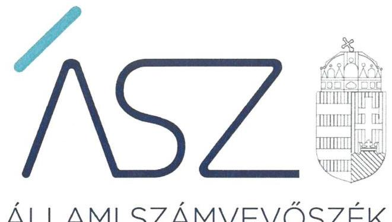
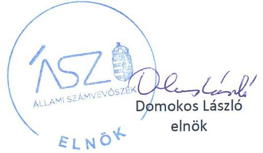
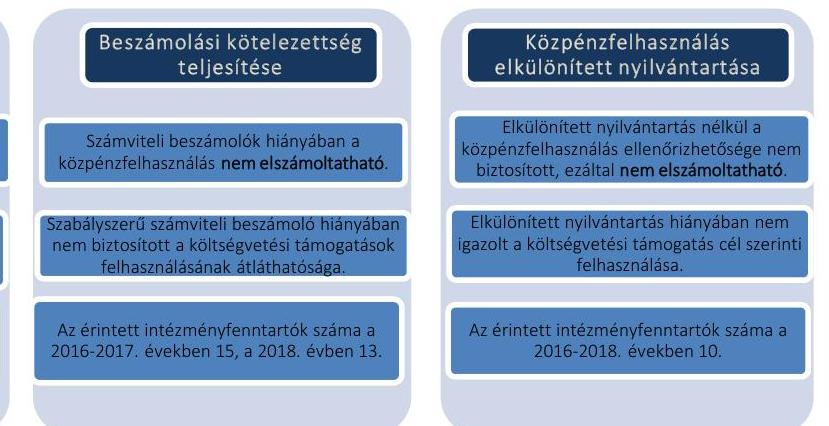

ÁLLAMI SZÁMVEVŐSZÉK

# JELENTÉS 

## Nem állami humánszolgáltatók ellenőrzése

A köznevelési és szociális humánszolgáltatást nyújtó intézmények, szolgáltatók államháztartáson kívüli fenntartói központi költségvetésből kapott támogatásai felhasználásának ellenőrzése - 28 intézményfenntartó
2021.

21051
www.asz.hu

---

ÁLLAMI SZÁMVEVŐSZÉK

# JELENTÉS

## Nem állami humánszolgáltatók ellenőrzése

A köznevelési és szociális humánszolgáltatást nyújtó intézmények, szolgáltatók államháztartáson kívüli fenntartói központi költségvetésből kapott támogatásai felhasználásának ellenőrzése – 28 intézményfenntartó

2021. 05. hó 26. nap

21051 www.asz.hu

---

# AZ ELLENŐRZÉST FELÜGYELTE: 

MAKKAI MÁRIA felügyeleti vezető

## AZ ELLENŐRZÉST VEZETTE ÉS A VÉGREHAJTÁSÁÉRT FELELŐS:

HOFMEISTER LÁSZLÓ ellenőrzésvezető

## A PROGRAM ÖSSZEÁLLÍTÁSÁÉRT FELELŐS:

TÓTPÁL SZABOLCS ellenőrzési program készítéséért felelős vezető
FEKETE-NAGY ANDRÁS GÁBOR ellenőrzési program készítéséért felelős vezető

IKTATÓSZÁM: EL-3220-001/2021
Jelentéseink az Országgyúlés számítógépes
hálózatán és az interneten a www.asz.hu címen is olvashatóak.

TÉMASZÁM: 2523
ELLENŐRZÉS-AZONOSÍTÓ SZÁM: V0867253

---

# TARTALOMJEGYZÉK 

■ ÖSSZEGZÉS ..... 5
■ AZ ELLENŐRZÉS CÉLJA ..... 7
■ AZ ELLENŐRZÉS TERÜLETE ..... 8
■ AZ ELLENŐRZÉS HÁTTERE, INDOKOLTSÁGA ..... 9
■ A JELENTÉS LÉNYEGES KÉRDÉSKÖREI ..... 10
■ AZ ELLENŐRZÉS HATÓKÖRE ÉS MÓDSZEREI ..... 11
■ MEGÁLLAPÍTÁSOK ..... 13
■ JAVASLATOK ..... 15
■ MELLÉKLETEK ..... 16
I. sz. melléklet: Értelmező szótár ..... 16
II. sz. melléklet: Az ellenőrzött fenntartók részére köznevelési és szociális közfeladat ellátásra a Kincstár által biztosított költségvetési támogatások összege a 2016-2018 években (FT) ..... 18
III. sz. melléklet: Az ellenőrzött fenntartókkal kapcsolatos részletes megállapítások ..... 19
■ FÜGGELÉKEK ..... 27
I. sz. függelék a jelentéshez ..... 27
II. sz. függelék: Észrevételek ..... 28
■ RÖVIDÍTÉSEK JEGYZÉKE ..... 33

---

.

---

# ÖSSZEGZÉS 

Az ellenőrzött 28 humánszolgáltatást nyújtó államháztartáson kívüli fenntartó közül öt fenntartó biztosította a kapott költségvetési támogatások felhasználásának átláthatóságát, 23 fenntartó nem biztosította a köznevelési és szociális humánszolgáltatási közfeladatok ellátására kapott költségvetési támogatások elszámoltathatóságát. Az ÁSZ kezdeményezésére az ellenőrzött időszakot követően, a 2019. évre 22 intézményfenntartónál a közpénzzel való elszámoltathatóság javult.

## Az ellenőrzés társadalmi indokoltsága

A köznevelési feladatok ellátása és a szociális gondoskodást igénylők védelme az Alaptörvényben meghatározott, a társadalom szempontjából fontos tevékenység. Jogszabályok teszik lehetővé, hogy államháztartáson kívüli szervezetek - az alapítványok, egyesületek - által fenntartott intézmények is végezzenek köznevelési valamint szociális és gyermekvédelmi feladatokat. Mindehhez a központi költségvetés évente jelentős összegű támogatással járul hozzá. Az államháztartáson kívüli, humánszolgáltatást végző intézmények az igényelt közpénzekből társadalmilag hasznos, közösségteremtő, közérdekű, illetve közhasznú tevékenységet végeznek, illetve közfeladatokat látnak el.

Az intézményfenntartók ellenőrzésével az Állami Számvevőszék hozzájárul ahhoz, hogy ezen közpénzeket az államháztartáson kívüli szervezetek is ellenőrizhető, átlátható és elszámoltatható módon használják fel a közfeladatok ellátása során. Az ellenőrzések célja továbbá, hogy a nyilvánosság és az igénybevevők megfelelő tájékoztatást kapjanak az államháztartáson kívüli közfeladatot ellátók működéséről.

Az Állami Számvevőszék ellenőrzései arra adnak választ, hogy az intézményfenntartók arra használták-e fel a közpénzeket, amire igényelték. A szabályszerű gazdálkodás elengedhetetlen a közfeladat ellátás szakmai céljainak megvalósításához, valamint a társadalmi közbizalom fenntartásához.

## Főbb megállapítások, következtetések

Számviteli szabályozási kereteik
kielégítésének hiányában a
közpénzfelhasználók nem elszámoltathatóak

Számviteli szabályozás hiányában a költségvetési támogatások szabályszerű használatának feltételei nem biztosítottak

Az érintett intézményfenntartók száma a 2016. évben 18. a 2017-2018. években 17

A 2016. évben 25, a 2017-2018. években 23 fenntartó az Alaptörvény ${ }^{1}$ 39. cikk (2) bekezdésében foglaltak ellenére a felhasznált közpénzekre vonatkozó gazdálkodása átláthatóságát nem biztosította. Ezen fenntartók esetén felmerül annak
kockázata, hogy a jövőben a kapott támogatásokat nem szabályszerűen használják fel, és a közpénzeket nem átláthatóan kezelik.
A 2016. évben három, a 2017-2018. években öt fenntartó ellenőrzése során alapvető hibát nem tárt fel az ÁSZ² a költségvetési támogatások átláthatósága és elszámoltathatósága terén.

Az ÁSZ 23 intézményfenntartónál kezdeményezte, hogy az ellenőrzött időszakot követő 2019. évre vonatkozóan bemutassák a közpénzekkel való elszámolás feltételeinek meglétét, hozzájárulva ezzel a költségvetési támogatások felhasználásának elszámoltathatóságához.

---

A feltárt hiányosságokkal kapcsolatban a figyelemfelhívó levelekre érkezett válaszok alapján az alábbi következtetést lehet tenni.

8 intézményfenntartónál a 2019. évre vonatkozó, az ÁSZ kezdeményezésére bemutatott dokumentumok alapján a költségvetési támogatások felhasználásának és az elszámoltathatóságnak a feltételei a számviteli szabályozottság, a számviteli beszámoló készítése, illetve a költségvetési támogatások feladatonkénti elkülönítése terén lényegesen jobb helyzetet mutattak, mint az ellenőrzött időszakban.

14 intézményfenntartónál a költségvetési támogatások felhasználásának és az elszámoltathatóságnak a feltételei a számviteli szabályozottság és a beszámolási kötelezettség terén jobb helyzetet mutattak 2019-ben.

1 intézményfenntartó esetében a költségvetési támogatások felhasználásának és az elszámoltathatóságnak a feltételei nem javultak 2019-ben, változatlanul fennáll annak kockázata, hogy a közpénzeket nem átláthatóan és elszámoltathatóan kezelik. Ezért az ÁSZ az intézményfenntartó tekintetében az államháztartás alrendszeréből nyújtott, az intézményfenntartót megillető támogatások folyósításának felfüggesztését kezdeményezte.

Az ÁSZ az ellenőrzés megállapításai alapján három fenntartó részére összesen három javaslatot fogalmazott meg.

---

# AZ ELLENŐRZÉS CÉLJA 

AZ ELLENŐRZÉS CÉLJA annak értékelése volt, hogy a nem állami, nem önkormányzati köznevelési és szociális intézményfenntartó központi költségvetésből kapott támogatásainak felhasználása szabályszerű volt-e.

---

# AZ ELLENŐRZÉS TERÜLETE 

## Költségvetési támogatásban részesült humánszolgáltatási feladatokat végző Fenntartók - Alapítványok, Egyesületek

Köznevelési, valamint szociális és gyermekvédelmi intézményt létesíthet és működtethet nem állami, nem önkormányzati intézmény a jogszabályokban meghatározott feltételek szerint. A központi költségvetés a fenntartott intézmény köznevelési, szociális és gyermekvédelmi feladatainak ellátásához költségvetési hozzájárulást biztosít, a jogszabályban előírt feltételek teljesülése esetén. A Magyar Államkincstár a megítélt támogatásokat a fenntartó részére folyósítja.

Az államháztartáson kívüli köznevelési, szociális és gyermekvédelmi intézmények központi költségvetésből kapott támogatásai felhasználását 28 fenntartónál ellenőriztük, amelyek közül 20 alapítványi és 8 egyesületi formában működött.

Az ellenőrzött fenntartók köznevelési humánszolgáltatási közfeladatokat, hét fenntartó esetében szociális és gyermekvédelmi humánszolgáltatási közfeladatokat is végeztek az ellenőrzött időszakban.

A fenntartók összesen 36 - önálló jogi személyiséggel rendelkező - köznevelési és szociális intézményt működtettek. Nyolc fenntartó egynél több intézmény fenntartásában vett részt.

A fenntartók részére a köznevelési és szociális humánszolgáltatási feladat ellátásához a Magyar Államkincstár részéről a központi költségvetésből biztosított támogatások összegét a II. számú melléklet tartalmazza.

---

# AZ ELLENŐRZÉS HÁTTERE, INDOKOLTSÁGA 

A köznevelési és szociális feladatokat ellátó nem állami intézményfenntartók részére közfeladataik ellátására évente jelentős összegű pénzügyi támogatást biztosítottak a mindenkori költségvetési törvények a bennük megfogalmazott feltételek mellett. A köznevelési és szociális feladatokra felhasználható állami támogatások előirányzata a 2016-2018. években 846 Mrd Ft volt.

Az ÁSZ stratégiájában foglaltak alapján is indokolt az ellenőrzés, amely a társadalom számára jelzi, hogy a közpénz államháztartáson kívüli felhasználása sem maradhat ellenőrizetlenül. Az államháztartáson kívülre nyújtott költségvetési támogatások ellenőrzésével az ÁSZ hozzájárul ahhoz, hogy a közpénzeket a nem állami fenntartók átlátható módon használják fel a közfeladatok ellátására kötött szerződésekben vállalt kötelezettségek teljesítése érdekében. Az ÁSZ az ellenőrzés javaslataival hozzájárulhat az említett rendszerek szabályszerű támogatás-felhasználásához, javíthatja a társadalmi-gazdasági döntések megalapozottságát, amely a „jól irányított állam működésének" feltétele.

---

# A JELENTÉS LÉNYEGES KÉRDÉSKÖREI 

1.     - A közfeladatot ellátó államháztartáson kívüli fenntartók szabályszerű működési - és gazdálkodási környezet kialakításával megteremtették-e a költségvetési támogatások átlátható, elszámoltatható igénybevételének, felhasználásának feltételeit, a közpénzekre vonatkozó gazdálkodásukkal a nyilvánosság előtt elszámoltak-e?
2.     - Az államháztartáson kívüli fenntartók az átvállalt köznevelési és szociális közfeladathoz biztosított költségvetési támogatásokat szabályszerűen fordították-e a humánszolgáltató intézmény működtetésére?

---

# AZ ELLENŐRZÉS HATÓKÖRE ÉS MÓDSZEREI 

## Az ellenőrzés típusa

Megfelelőségi ellenőrzés.

## Az ellenőrzött időszak

A 2016. január 1-je és 2018. december 31-e közötti időszak

## Az ellenőrzés tárgya

Az ellenőrzés a köznevelési és szociális humánszolgáltatási közfeladatokat ellátó államháztartáson kívüli Fenntartók humánszolgáltatási közfeladatai ellátásához a központi költségvetésből kapott támogatásaik humánszolgáltatási közfeladatokra való, fenntartó általi felhasználása szabályszerűségének értékelésére terjedt ki.

## Az ellenőrzött szervezet

Az államháztartásból nyújtott költségvetési támogatásban részesült köznevelési és szociális feladatokat ellátó intézmények Fenntartói (II. számú melléklet).

## Az ellenőrzés jogalapja

Az ellenőrzés jogszabályi alapját az ÁSZ tv. ${ }^{3} 1 . \S$ (3) bekezdése, 5. § (3) bekezdésében foglalt előírások adták.

## Az ellenőrzés módszerei

Az ellenőrzést az ellenőrzési program szempontjai, kérdései, az ellenőrzött időszakban hatályos jogszabályok, a nemzetközi standardokat irányadónak tekintve, az ellenőrzés szakmai szabályok és módszertanok figyelembevételével végezte az ÁSZ. A közpénzekkel való felelős gazdálkodás segítésére irányuló javaslatok kidolgozásakor a hatályos jogszabályok voltak az irányadóak.

Az ellenőrzés ideje alatt az ellenőrzött szervezettel történő kapcsolattartást az ÁSZ SZMSZ²-ének vonatkozó előírásai alapján biztosította az ÁSZ.

---

Az ellenőrzési kérdések megválaszolásához szükséges bizonyítékok megszerzése az ellenőrzött által rendelkezésre bocsátott dokumentumokra, adatokra alapozva megfigyelés, szemle (szemrevételezés), kérdésfeltevés (információkérés), valamint elemző eljárással történt.

Az ellenőrzési bizonyítékként felhasználható adatforrások közé tartoztak egyrészt az ellenőrzési program részletes szempontjainál felsorolt adatforrások, másrészt minden - az ellenőrzés folyamán feltárt, az ellenőrzés szempontjából információt tartalmazó - dokumentum.

Az ellenőrzés lefolytatásához az ellenőrzött szervezet a kitöltött tanúsítványok, valamint az ÁSZ által kért dokumentumok elektronikus úton való megküldésével szolgáltatott adatokat, információkat. Az így rendelkezésre bocsátott adatok, információk és a tanúsítványok adatai valódiságának kontrollja az ellenőrzés keretében történt.

Az ellenőrzést az ÁSZ alapvetően a köznevelési és szociális szolgáltatások esetében a központi költségvetési támogatások igénylésével, módosításával, felhasználásával, elszámolásával kapcsolatos feladatokat ellátó államháztartáson kívüli Fenntartóknál végezte.

A köznevelési és szociális humánszolgáltatások központi költségvetési támogatásaival kapcsolatos, államháztartáson kívüli fenntartó jogszabályokban előírt feladatai betartását, továbbá a központi költségvetési támogatások szabályszerű nyilvántartását ellenőrizte az ÁSZ a Fenntartónál rendelkezésre álló nyilvántartások, beszámolók és egyéb dokumentumok alapján.

Az ellenőrzés nem terjedt ki a köznevelési és szociális humánszolgáltatások központi költségvetési támogatásai igénylése, módosítása, elszámolása valódiságának, megalapozottságának, helyességének - sem a Fenntartónál, sem a székhely intézménynél való - értékelésére (mivel ennek felülvizsgálata, ellenőrzése a finanszírozó jogszabályban előírt feladata, határozatai kiadása előtt). Továbbá nem terjedt ki az ellenőrzés e források köznevelési és szociális intézmények általi szabályszerű felhasználásának értékelésére.

---

# A JOGSZABÁLYI ELŐÍRÁSOKKAL ÖSSZHANGBAN 

a 2016. évben három, a 2017-2018. években öt ellenőrzött fenntartó kialakította a kapott támogatások elszámoltathatóságának alapvető feltételeinek számviteli szabályozását, elkészítette számviteli éves beszámolóit, elkülönített nyilvántartásait, mellyel biztosították a költségvetési támogatások felhasználásának átláthatóságát.

A számviteli szabályzatok elkészítésére vonatkozó kötelezettségét 18 ellenőrzött fenntartó nem teljesítette a 2016. évben, 17 fenntartó a 2017-2018. években.

- Hét fenntartó az ellenőrzött időszakban a Számv. tv. ${ }^{5}$ 14. § (3) bekezdés előírása ellenére nem rendelkezett számviteli politikával.
- Nyolc fenntartó a 2016-2018. években a Számv. tv. 14. § (5) bekezdés a) pontjában foglaltak ellenére nem készítette el az eszközök és a források leltárkészítési és leltározási szabályzatát.
- Hét fenntartó a 2016-2018. években a Számv. tv. 14. § (5) bekezdés b) pontjában foglaltak ellenére nem készítette el az eszközök és a források értékelési szabályzatát.
- Hét fenntartó a 2016-2018. években a Számv. tv. 14. § (5) bekezdés d) pontjában foglaltak ellenére nem készítette el pénzkezelési szabályzatát.
- A 2016. évben 15, a 2017-2018. években 14 fenntartó a Számv. tv. 161. § (1) bekezdésben foglalt előírás ellenére nem alakította ki számlarendjét.
Számviteli szabályozás hiányában a beszámolók nem megbízhatóak, nem volt biztosított a számviteli beszámolók szabályszerű könyvvezetéssel való alátámasztása, a költségvetési támogatások felhasználásának elszámoltathatósága, átláthatósága.

Számviteli beszámolóval - amely a jogszabályi előírásoknak megfelel - nem rendelkezett 15 fenntartó

 a 2016-2017. években és 13 fenntartó a 2018. évben. Ezen fenntartók nem tettek eleget a Civil

| Szabálytalan számviteli beszámolók | Fenntartók száma |  |  |
| :--: | :--: | :--: | :--: |
|  | 2016. | 2017. | 2018. |
| Kiegészítő melléklet hiánya | 9 | 8 | 8 |
| Aláiratlan beszámoló | 6 | 7 | 5 |

$\mathrm{tv} .{ }^{6} 29 . \S$ (2) bekezdés c) pontjában előírt kiegészítő melléklet készítési kötelezettségnek, illetve nem rendelkeztek a Civil tv. 28. § (1) és a Számv. tv. 4. § (1) bekezdésben foglaltak ellenére számviteli beszámolóval. Számviteli beszámolók hiányában az intézményfenntartók a nyilvánosság előtt nem számoltak el a közfeladatot ellátó intézményük működtetéséhez felhasznált közpénzekre vonatkozó gazdálkodásukkal, amely így nem volt átlátható és elszámoltatható.

A KÖLTSÉGVETÉSI TÁMOGATÁSOK elkülönített nyilvántartását, amelyből a támogatások felhasználása elkülönítetten jelenik meg, tíz intézményfenntartó nem vezette a jogszabályi előírásnak megfelelően. A fenntartók a Számv. tv. 161/A. § (2) bekezdésének előírása

---

ellenére nem gondoskodtak a könyvvezetési rendszerük oly módon való továbbrészletezéséről, hogy abból az Nkt. vhr. ${ }^{7}$ 37/G. § (1), illetve az Atr. ${ }^{8}$ 16. § (1) bekezdésében meghatározott, a támogatás-felhasználásra vonatkozó adatok a felhasználás ellenőrizhetősége érdekében rendelkezésre álljanak.

Nyilvántartás hiányában az intézményfenntartók nem igazolták, hogy a kapott támogatásokat az ellátott köznevelési, illetve szociális humánszolgáltatási közfeladatra fordították.

Az egyes ellenőrzött intézményfenntartóra vonatkozó megállapításokat a III. számú melléklet tartalmazza.

---

# JAVASLATOK 

Az ÁSZ tv. 33. § (1) bekezdésében foglaltak értelmében az ellenőrzött szervezet vezetője köteles a jelentésben foglalt megállapításokhoz kapcsolódó intézkedési tervet összeállítani és azt a jelentés kézhezvételétől számított 30 napon belül az ÁSZ részére megküldeni. Amennyiben az ellenőrzött szervezet vezetője nem küldi meg határidőben az intézkedési tervet, vagy továbbra sem elfogadható intézkedési tervet küld, az Állami Számvevőszék elnöke az ÁSZ tv. 33. § (3) bekezdése a) és b) pontjaiban foglaltakat érvényesítheti.

## Az ETO JÖVŐJÉÉRT Alapítvány kuratóriumi elnökének

1. Intézkedjen az Nkt. vhr. rendelkezéseinek megfelelően a kapott támogatások felhasználása alapfeladatonkénti elkülönített nyilvántartásának kialakításáról.
(III. sz. melléklet ellenőrzöttre vonatkozó megállapítás 3. bekezdése alapján)

## BURATTINO Szociális és Kulturális Egyesület elnökének

1. Intézkedjen a Számv. tv. előírásainak megfelelő számviteli beszámoló elkészítéséről.
(III. sz. melléklet ellenőrzöttre vonatkozó megállapítás 3. bekezdése alapján)

## Hiperaktív Alapítvány kuratóriumi elnökének

1. Intézkedjen a Számv. tv. előírásainak megfelelő számviteli beszámoló elkészítéséről.
(III. sz. melléklet ellenőrzöttre vonatkozó megállapítás 3. bekezdése alapján)

---

# MELLÉKLETEK 

- I. SZ. MELLÉKLET: ÉRTELMEZŐ SZÓTÁR
humánszolgáltatás
költségvetési támogatás
köznevelési közfeladat
köznevelési intézmény
nem állami, nem önkormányzati (államháztartáson kívüli) intézmény fenntartó

Külön törvényben meghatározott szociális, gyermekjóléti, gyermekvédelmi, közoktatási, felsőoktatási, kulturális közfeladatok (2015. évi C. törvény Magyarország 2016. évi központi költségvetéséről, 2016 évi XC. törvény Magyarország 2017. évi központi költségvetéséről, 2017. évi C. törvény Magyarország 2018. évi központi költségvetéséről).
a társadalombiztosítás pénzügyi alapjai kivételével az államháztartás központi alrendszeréből ellenérték nélkül, pénzben nyújtott támogatások (Áht. 1. § 14. pont)
A költségvetési törvényekben (2015. évi C. törvény Magyarország 2016. évi központi költségvetéséről, 2016 évi XC. törvény Magyarország 2017. évi központi költségvetéséről, 2017. évi C. törvény Magyarország 2018. évi központi költségvetéséről) megállapított támogatás. A 2015. évi C. törvény 40-41. § szerint többek között: Az Országgyűlés a szociális, gyermekjóléti, gyermekvédelmi közfeladatot ellátó intézményt, szolgáltatást fenntartó egyházi jogi személy, civil szervezet, közalapítvány, országos nemzetiségi önkormányzat, települési vagy területi nemzetiségi önkormányzat, gazdasági társaság, és a humánszolgáltatást alaptevékenységként végző, az Szja tv. hatálya alá tartozó egyéni vállalkozó (a továbbiakban együtt: nem állami szociális fenntartó) részére támogatást állapít meg a következők szerint: a támogatás a nem állami szociális fenntartót a települési önkormányzatok 2. melléklet III. pont 3. alpont c)-k) pontjában és III. pont 5. alpont a) pontjában meghatározott támogatásaival azonos jogcímeken, összegben és feltételek mellett illeti meg.
A köznevelési intézmény alapító okiratában foglalt feladat: óvodai nevelés, nemzetiséghez tartozók óvodai nevelése, általános iskolai nevelés-oktatás, nemzetiséghez tartozók általános iskolai nevelése-oktatása, kollégiumi ellátás, nemzetiségi kollégiumi ellátás, gimnáziumi nevelés-oktatás, szakközépiskolai nevelés-oktatás, szakiskolai nevelés-oktatás, nemzetiség gimnáziumi nevelés-oktatása, nemzetiség szakközépiskolai nevelés-oktatása, nemzetiség szakiskolai nevelés-oktatása, Köznevelési Hidprogramok keretében folyó nevelés-oktatás, felnőttoktatás, alapfokú művészetoktatás, fejlesztő nevelés, fejlesztő nevelés-oktatás, pedagógiai szakszolgálati feladat, a többi gyermekkel, tanulóval együtt nevelhető, oktatható sajátos nevelési igényű gyermekek, tanulók óvodai nevelése és iskolai nevelése-oktatása, azoknak a sajátos nevelési igényű gyermekeknek, tanulóknak az óvodai, iskolai, kollégiumi ellátása, akik a többi gyermekkel, tanulóval nem foglalkoztathatók együtt, a gyermekgyógyüdülőkben, egészségügyi intézményekben, rehabilitációs intézményekben tartós gyógykezelés alatt álló gyermekek tankötelezettségének teljesítéséhez szükséges oktatás, pedagógiai-szakmai szolgáltatás.
A nevelési- oktatási intézmény, pedagógiai szakszolgálati intézmény, pedagógiaiszakmai szolgáltatást nyújtó intézmény.
A szociális közfeladatokat/humánszolgáltatásokat ellátó intézményt fenntartó egyházi jogi személy, társadalmi szervezet, alapítvány, közalapítvány, civil szervezet, országos nemzetiségi önkormányzat, nonprofit gazdasági társaság, gazdasági társaság és a humánszolgáltatást alaptevékenységként végző, Szja tv. hatálya alá tartozó egyéni vállalkozó. (2015. évi C. törvény Magyarország 2016. évi központi költségvetéséről, 2016 évi XC. törvény Magyarország 2017. évi központi költségvetéséről, 2017. évi C. törvény Magyarország 2018. évi központi költségvetéséről)

---

szociális szolgáltató, szociális intézmény
szociális alapszolgáltatások

A 1993. évi III. törvény a szociális igazgatásról és szociális ellátásokról 4. § g) pontja alapján szociális szolgáltató: az a személy vagy szervezet, amely kizárólag a törvény 60-65/E. §-ban meghatározott szociális alapszolgáltatásokat nyújtja. Ha jogszabály másként nem rendelkezik, a szociális szolgáltatókra a szociális intézményekre vonatkozó szabályokat kell megfelelően alkalmazni.
A 1993. évi III. törvény a szociális igazgatásról és szociális ellátásokról 4. § h) pontja alapján szociális intézmény: az e törvényben meghatározott nappali, illetve bentlakásos ellátást vagy támogatott lakhatást nyújtó szervezet.
Az 1993. évi III. törvény a szociális igazgatásról és szociális ellátásokról 57. § (1) bekezdése alapján szociális alapszolgáltatások: a falugondnoki és tanyagondnoki szolgáltatás, az étkeztetés, a házi segítségnyújtás, a családsegítés, a jelzőrendszeres házi segítségnyújtás, a közösségi ellátások, a támogató szolgáltatás, az utcai szociális munka, a nappali ellátás.

---

II. SZ. MELLÉKLET: AZ ELLENŐRZÖTT FENNTARTÓK RÉSZÉRE KÖZNEVELÉSI ÉS SZOCIÁLIS KÖZFELADAT ELLÁTÁSRA A KINCSTÁR ÁLTAL BIZTOSÍTOTT KÖLTSÉGVETÉSI TÁMOGATÁSOK ÖSSZEGE A 2016-2018 ÉVEKBEN (FT)

|  Helyszín megnevezése | Köznevelési feladatra kapott támogatás |  |  | Szociális feladatra kapott támogatás |  |   |
| --- | --- | --- | --- | --- | --- | --- |
|   | 2016 | 2017 | 2018 | 2016 | 2017 | 2018  |
|  A Felcsúti Utánpótlás Neveléséért Alapítvány | 118271185 | 130644448 | 135137017 |  |  |   |
|  Alternatíva Életfa Iskoláért Egyesület | 15784347 | 52715278 | 61099334 |  |  |   |
|  Az ETO JÖVŐJÉÉRT Alapítvány | 80762290 | 83105843 | 84285033 |  |  |   |
|  Budapesti Német Iskola Alapítvány | 195047774 | 216302128 | 213917501 |  |  |   |
|  Budapesti Osztrák Iskola Alapítvány | 87398058 | 90252088 | 89110000 |  |  |   |
|  BURATTINO Szociális és Kulturális Egyesület | - | 129960046 | 134561332 | 51328433 | 52339793 | 65283485  |
|  Csillagbölcső Waldorf Egyesület | 33535711 | 51749393 | 67046934 |  |  |   |
|  Danubia Művészetoktatási és Közművelődési Intézményfenntartó és Működhető Alapítvány | 123599245 | 131848795 | 124813234 |  |  |   |
|  Együtt Veled Alapítvány | 75656092 | 85232745 | 68636133 |  |  |   |
|  Épülő virgenc gyermekekért Alapítvány | 63121188 | 68322541 | 67067000 | 21327160 | 21393400 | 21907000  |
|  Esthajnalcsillag Oktatási Alapítvány | 57604546 | 57654492 | 62376000 |  |  |   |
|  Gyermekkor Alapítvány - a Kisgyermekkori Nevelés Támogatására | 62172304 | 77200158 | 99353787 | 12001413 | 22228515 | 19013493  |
|  Győri Waldorf Egyesület | 112604495 | 124254134 | 120330317 |  |  |   |
|  Habakukk a Gyermekekért Alapítványi Óvoda és Gyermeknyelviskola | 45544136 | 54851824 | 57963092 | 26347198 | 30366283 | 27803657  |
|  Hiperaktív Alapítvány | 83789783 | 101698561 | 120676374 |  |  |   |
|  Jerikó Humán Egylet | 132723160 | 125156691 | 97388134 |  |  |   |
|  Krétakör Oktatási és Kulturális Közhasznú Alapítvány | 169936154 | 175650149 | 166340734 | 2682000 | 3608780 | 3960000  |
|  Magyar Műhely Közhasznú Alapítvány | 134211596 | 137824955 | 144154033 |  |  |   |
|  Murától a Balatonig Norvég-Magyar Müvészetoktatási, Szakképzési, Közművelődési és Nyelvvisgaközpontot Intézményfenntartó és Müködhető Alapítvány | 115512882 | 125904629 | 136341500 |  |  |   |
|  Narancsliget Alapítvány | 60316900 | 68434005 | 69859300 | 9734822 | 18866732 | 22436555  |
|  Nemzetközi Oktatási Központ Alapítvány | 82591148 | 92813833 | 101095367 |  |  |   |
|  Rákosmenti Waldorf Pedagógiai Alapítvány | 110968637 | 127523996 | 129245133 |  |  |   |
|  Rózsabimbó Óvoda és Bölcsőde Alapítvány | 101248388 | 125947242 | 127353483 | 12825113 | 14523885 | 12733096  |
|  SEK Budapest Oktatási Alapítvány | 112354066 | 123100840 | 128077967 |  |  |   |
|  Szegedi Waldorf Társas Kör Egyesület | 120296068 | 125743966 | 125163521 |  |  |   |
|  Törpe-Ovi Alapítvány | 59554873 | 62539368 | 63021800 |  |  |   |
|  Veszprémí Waldorf Egyesület | 117012801 | 136796478 | 139170682 |  |  |   |
|  Weöres Sándor Oktatási, Kulturális és Szabadulós Egyesület | 119425932 | 133666139 | 135870200 |  |  |   |

---

# 1. A Felcsúti Utánpótlás Neveléséért Alapítvány 

A felcsúti székhelyű A Felcsúti Utánpótlás Neveléséért Alapítvány a 2016-2018. években két önálló jogi személy köznevelési intézményt tartott fenn. A Felcsúti Letenyey Lajos Gimnázium Szakgimnázium és Szakközépiskola és a Puskás Ferenc Labdarúgó Akadémia Kollégiuma gimnáziumi- és szakgimnáziumi nevelés-oktatás, szakiskolai nevelés-oktatás köznevelési alapfeladatokat láttak el.

A Fenntartó gazdálkodásának lényeges területeit - számviteli szabályozottságot, beszámolási kötelezettség teljesítését, a kapott támogatások felhasználásának szabályszerű elkülönítését - megvizsgáltuk és annak eredményeképpen kifogást nem teszünk a 2016-2018. évekre vonatkozóan.

## 2. Alternatíva Életfa Iskoláért Egyesület

A miskolci székhelyű Alternatíva Életfa Iskoláért Egyesület a 2016-2018. években egy önálló jogi személy köznevelési intézményt tartott fenn. Az Alternatíva Életfa Általános Iskola,
 Gimnázium, Szakgimnázium és Alapfokú Művészetoktatási Intézmény általános iskolai nevelés-oktatás, szakgimnáziumi nevelés-oktatás, alapfokú művészetoktatás köznevelési alapfeladatokat látott el.

A Fenntartó nem rendelkezett a 2016-2018. években a képviseletére jogosult által aláírt, hiteles, a Számv. tv. 14. § (3) bekezdésében előírt számviteli politikával, valamint a Számv. tv. 161. § (1) és (4) bekezdésében előírt számlarenddel. Ezáltal nem teremtette meg a költségvetési támogatások elszámoltatható, átlátható felhasználásának szabályozási feltételeit.

A Fenntartó a 2016-2018. években a Számv. tv. 4. § (1) bekezdésében és a Civil tv. 28. § (1) bekezdésében foglaltak ellenére – figyelemmel a Számv. tv. 20. § (6) bekezdésében foglaltakra – a képviseletére jogosult által aláírt beszámolóval nem rendelkezett, így a nyilvánosság előtt a közfeladatot ellátó intézményei működtetéséhez felhasznált közpénzekre vonatkozó gazdálkodásával nem számolt el.

Az ellenőrzött Fenntartó a 2016-2018. években a kapott támogatások felhasználásának nyilvántartását az Nkt. vhr. 37/G. § (1) bekezdésében foglaltak ellenére alapfeladatonként nem vezette elkülönítetten. Ezáltal a költségvetési támogatás felhasználásának a Számv. tv. 161/A. § (2) bekezdésében előírt ellenőrizhetőségét nem biztosította.

## 3. Az ETO JÖVŐJÉÉRT Alapítvány

A győri székhelyű Az ETO JÖVŐJÉÉRT Alapítvány a 2016-2018. években egy önálló jogi személy köznevelési intézményt tartott fenn. A Fehér Miklós Labdarúgó Akadémia Gimnáziuma és Kollégiuma gimnáziumi nevelés-oktatás, kollégiumi ellátás köznevelési alapfeladatokat látott el.

A Fenntartó a 2016-2018. években a Számv. tv. 161. § (1) és (4) bekezdésében foglaltak ellenére nem rendelkezett a képviseletére jogosult által aláírt, hiteles számlarenddel. Ezáltal nem teremtette meg a költségvetési támogatások elszámoltatható, átlátható felhasználásának szabályozási feltételeit. Számlarend hiányában a Fenntartó a számviteli beszámolóit szabályszerű könyvvezetéssel nem támasztotta alá.

Az ellenőrzött Fenntartó a 2016-2018. években a kapott támogatások felhasználásának nyilvántartását az Nkt. vhr. 37/G. § (1) bekezdésében foglaltak ellenére alapfeladatonként nem vezette elkülönítetten. Ezáltal a költségvetési támogatás felhasználásának a Számv. tv. 161/A. § (2) bekezdésében előírt ellenőrizhetőségét nem biztosította.

## 4. Budapesti Német Iskola Alapítvány

A budapesti székhelyű Budapesti Német Iskola Alapítvány a 2016-2018. években egy önálló jogi személy köznevelési intézményt tartott fenn. A Budapesti Német Általános Iskola és Gimnázium általános iskolai nevelés-oktatás és gimnáziumi nevelés-oktatás köznevelési alapfeladatokat látott el.

A Fenntartó nem rendelkezett a 2016-2018. években a Számv. tv. 14. § (3) bekezdésében előírt számviteli politikával, valamint a Számv. tv. 14. § (5) bekezdés a-b) és d) pontokban előírt eszközök és a források leltárkészítési és leltározási szabályzatával, eszközök és források értékelési szabályzatával, pénzkezelési szabályzattal, valamint a Számv. tv. 161. § (1) és (4) bekezdésében előírt, a képviseletére jogosult által aláírt, hiteles számlarenddel. Ezáltal nem teremtette meg a költségvetési támogatások elszámoltatható, átlátható felhasználásának szabályozási feltételeit. Számviteli szabályozás hiányában a Fenntartó a számviteli beszámolóit szabályszerű könyvvezetéssel nem támasztotta alá.

# 5. Budapesti Osztrák Iskola Alapítvány 

A budapesti székhelyű Budapesti Osztrák Iskola Alapítvány a 2016-2018. években egy önálló jogi személy köznevelési intézményt tartott fenn. A Budapesti Osztrák Iskola – Osztrák Felső reál Gimnázium gimnáziumi nevelés-oktatás köznevelési alapfeladatot látott el.

A Fenntartó a 2016. évben a Számv. tv. 161. § (1) bekezdésében foglaltak ellenére nem rendelkezett számlarenddel. Ezáltal a 2016. évben nem teremtette meg a költségvetési támogatások elszámoltatható, átlátható felhasználásának szabályozási feltételeit. Számlarend hiányában a Fenntartó a 2016. évben a számviteli beszámolóját szabályszerű könyvvezetéssel nem támasztotta alá.

A Fenntartó gazdálkodásának lényeges területeit – számviteli szabályozottságot, beszámolási kötelezettség teljesítését, a kapott támogatások felhasználásának szabályszerű elkülönítését – megvizsgáltuk és annak eredményeképpen kifogást nem teszünk a 2017-2018. évre vonatkozóan.

## 6. BURATTINO Szociális és Kulturális Egyesület

A budapesti székhelyű BURATTINO Szociális és Kulturális Egyesület a 2016-2018. években egy önálló jogi személy köznevelési és szociális intézményt tartott fenn. A Burattino Általános és Középiskola, Gyermekotthon általános iskolai, szakgimnáziumi, gimnáziumi nevelés-oktatás köznevelési, valamint gyermekotthonba elhelyezettek ellátása szociális alapfeladatokat látott el.

A Fenntartó a 2016-2018. években az ÁSZ részére megküldött dokumentumok és az azok teljeskörűségére vonatkozó nyilatkozata alapján nem alakította ki a Számv. tv. 14. § (5) bekezdés d) pontjában előírtak ellenére pénzkezelési szabályzatát. Ezáltal nem teremtette meg a költségvetési támogatások elszámoltatható, átlátható felhasználásának szabályozási feltételeit.

A Fenntartó a 2016-2018. években a Számv. tv. 4. § (1) bekezdésében és a Civil tv. 28. § (1) bekezdésében foglaltak ellenére – figyelemmel a Számv. tv. 20. § (6) bekezdésében foglaltakra – a képviseletére jogosult által aláírt beszámolóval nem rendelkezett, így a nyilvánosság előtt a közfeladatot ellátó intézményei működtetéséhez felhasznált közpénzekre vonatkozó gazdálkodásával nem számolt el.

Az ellenőrzött Fenntartó a 2017-2018. években a kapott támogatások felhasználásának nyilvántartását az Nkt. vhr. 37/G. § (1) bekezdésében foglaltak ellenére alapfeladatonként nem vezette elkülönítetten. A Fenntartó a 2018. évben a kapott támogatások felhasználásáról az Atr. 16. § (1) bekezdésében foglalt szabályozás ellenére nem vezetett olyan nyilvántartást, melyből megállapítható volt, hogy a költségvetési támogatásokat milyen célra használta fel. Ezáltal a költségvetési támogatás felhasználásának a Számv. tv. 161/A. § (2) bekezdésében előírt ellenőrizhetőségét nem biztosította.

## 7. Csillagbölcső Waldorf Egyesület

A kecskeméti székhelyű Csillagbölcső Waldorf Egyesület a 2016-2018. években egy önálló jogi személy köznevelési intézményt tartott fenn. A Csillagbölcső Gyermekközpontú Óvoda, Általános Iskola és Alapfokú Művészeti Iskola óvodai nevelés, általános iskolai nevelés-oktatás, alapfokú művészetoktatás köznevelési alapfeladatokat látott el.

A Fenntartó a 2016-2018. években a Számv. tv. 4. § (1) bekezdésében és a Civil tv. 28. § (1) bekezdésében foglaltak ellenére – figyelemmel a Számv. tv. 20. § (6) bekezdésében foglaltakra – a képviseletére jogosult által aláírt beszámolóval nem rendelkezett, így a nyilvánosság előtt a közfeladatot ellátó intézményei működtetéséhez felhasznált közpénzekre vonatkozó gazdálkodásával nem számolt el.

---

# 8. Danubia Művészetoktatási és Közművelődési Intézményfenntartó és Működtető Alapítvány 

A bajai székhelyű Danubia Művészetoktatási és Közművelődési Intézményfenntartó és Működtető Alapítvány a 2016-2018. években egy önálló jogi személy köznevelési intézményt tartott fenn. A Danubia Alapfokú Művészeti Iskola alapfokú művészetoktatás köznevelési alapfeladatot látott el.

A Fenntartó 2016. évi beszámolója a Civil tv. 29. § (2) bekezdés c) pontjában foglaltak ellenére kiegészítő mellékletet nem tartalmazott, ezért a Civil tv. 28. § (1) bekezdésében és a Számv. tv. 4. § (1) bekezdésben foglaltak ellenére beszámoló készítési kötelezettségének nem tett eleget, intézménye működtetéséhez felhasznált közpénzekre vonatkozó gazdálkodásával a nyilvánosság előtt nem számolt el.

A Fenntartó gazdálkodásának lényeges területeit – számviteli szabályozottságot, beszámolási kötelezettség teljesítését, a kapott támogatások felhasználásának szabályszerű elkülönítését – megvizsgáltuk és annak eredményeképpen kifogást nem teszünk a 2017-2018. évre vonatkozóan.

## 9. Együtt Veled Alapítvány

A budapesti székhelyű Együtt Veled Alapítvány a 2016-2018. években egy önálló jogi személy köznevelési intézményt tartott fenn. A Humánus Alapítványi Általános Iskola általános iskolai nevelés-oktatás köznevelési alapfeladatot látott el.

A Fenntartó nem rendelkezett a 2016-2018. években a képviseletére jogosult által aláírt, hiteles, a Számv. tv. 14. § (3) bekezdésében előírt számviteli politikával, valamint a Számv. tv. 14. § (5) bekezdés a-b) és d) pontokban előírt eszközök és a források leltárkészítési és leltározási szabályzatával, eszközök és források értékelési szabályzatával, pénzkezelési szabályzattal. A Fenntartó a 2016-2018. években az ÁSZ részére megküldött dokumentumok és az azok teljeskörűségére vonatkozó nyilatkozata alapján nem alakította ki a Számv. tv. 161. § (1) bekezdésében foglaltak ellenére számlarendjét. Ezáltal nem teremtette meg a költségvetési támogatások elszámoltatható, átlátható felhasználásának szabályozási feltételeit.

A Fenntartó a 2017. évben a Számv. tv. 4. § (1) bekezdésében és a Civil tv. 28. § (1) bekezdésében foglaltak ellenére – figyelemmel a Számv. tv. 20. § (6) bekezdésében foglaltakra – a képviseletére jogosult által aláírt beszámolóval nem rendelkezett, így a nyilvánosság előtt a közfeladatot ellátó intézményei működtetéséhez felhasznált közpénzekre vonatkozó gazdálkodásával nem számolt el.

## 10. Épülő virgonc gyermekekért Alapítvány

A pilisvörösvári székhelyű Épülő virgonc gyermekekért Alapítvány a 2016-2018. években egy önálló jogi személy intézményt tartott fenn a „Virgonc Gyermekház” Egységes Gyógypedagógiai, Konduktív Pedagógiai Módszertani Intézmény, amely fogyatékos személyek nappali ellátása szociális alapfeladatot és fejlesztő nevelés-oktatás köznevelési alapfeladatot látott el.

A Fenntartó 2016-2018. évi beszámolói a Civil tv. 29. § (2) bekezdés c) pontjában foglaltak ellenére kiegészítő mellékletet nem tartalmaztak, ezért a Civil tv. 28. § (1) bekezdésében és a Számv. tv. 4. § (1) bekezdésben foglaltak ellenére beszámoló készítési kötelezettségének nem tett eleget, intézménye működtetéséhez felhasznált közpénzekre vonatkozó gazdálkodásával a nyilvánosság előtt nem számolt el.

## 11. Esthajnalcsillag Oktatási Alapítvány

A keszthelyi székhelyű Esthajnalcsillag Oktatási Alapítvány a 2016-2018. években egy önálló jogi személy köznevelési intézményt tartott fenn. Az Életfa Általános és Alapfokú Művészeti Iskola általános iskolai nevelés-oktatás és alapfokú művészetoktatás köznevelési alapfeladatokat látott el.

A Fenntartó nem rendelkezett a 2016-2018. években a képviseletére jogosult által aláírt, hiteles, a Számv. tv. 14. § (3) bekezdésében előírt számviteli politikával, valamint a Számv. tv. 14. § (5) bekezdés a-b) és d) pontokban előírt eszközök és a források leltárkészítési és leltározási szabályzatával, eszközök és források értékelési szabályzatával, pénzkezelési szabályzattal. Ezáltal nem teremtette meg a költségvetési támogatások elszámoltatható, átlátható felhasználásának szabályozási feltételeit.

---

A Fenntartó 2016-2018. évi beszámolói a Civil tv. 29. § (2) bekezdés c) pontjában foglaltak ellenére kiegészítő mellékletet nem tartalmaztak, ezért a Civil tv. 28. § (1) bekezdésében és a Számv. tv. 4. § (1) bekezdésben foglaltak ellenére beszámoló készítési kötelezettségének nem tett eleget, intézménye működtetéséhez felhasznált közpénzekre vonatkozó gazdálkodásával a nyilvánosság előtt nem számolt el.

Az ellenőrzött Fenntartó a 2016-2018. években a kapott támogatások felhasználásának nyilvántartását az Nkt. vhr. 37/G. § (1) bekezdésében foglaltak ellenére alapfeladatonként nem vezette elkülönítetten. Ezáltal a költségvetési támogatás felhasználásának a Számv. tv. 161/A. § (2) bekezdésében előírt ellenőrizhetőségét nem biztosította.

# 12. Gyermekkor Alapítvány – a Kisgyermekkori Nevelés Támogatására 

A budapesti székhelyű Gyermekkor Alapítvány – a Kisgyermekkori Nevelés Támogatására a 2016-2018. években két önálló jogi személy köznevelési intézményt és két szociális intézményt tartott fenn. Az Idesüss Óvoda és a Tündérkert Óvoda óvodai nevelés köznevelési alapfeladatot, az Idesüss Bölcsőde és a Tündérkert Bölcsőde bölcsődei ellátás szociális alapfeladatot látott el.

A Fenntartó a 2016-2018. években a Számv. tv. 161. § (1) és (4) bekezdésében foglaltak ellenére nem rendelkezett a képviseletére jogosult által aláírt, hiteles számlarenddel. Ezáltal nem teremtette meg a költségvetési támogatások elszámoltatható, átlátható felhasználásának szabályozási feltételeit. Számlarend hiányában a Fenntartó a számviteli beszámolóit szabályszerű könyvvezetéssel nem támasztotta alá.

## 13. Győri Waldorf Egyesület

A győri székhelyű Győri Waldorf Egyesület a 2016-2018. években egy önálló jogi személy köznevelési intézményt tartott fenn. A Forrás Waldorf Általános Iskola, Gimnázium és Alapfokú Művészeti Iskola általános iskolai és gimnáziumi nevelés-oktatás, alapfokú művészetoktatás köznevelési alapfeladatokat látott el.

A Fenntartó a 2016-2018. években a Számv. tv. 161. § (1) és (4) bekezdésében foglaltak ellenére nem rendelkezett a képviseletére jogosult által aláírt,
 hiteles számlarenddel. Ezáltal nem teremtette meg a költségvetési támogatások elszámoltatható, átlátható felhasználásának szabályozási feltételeit. Számlarend hiányában a Fenntartó a számviteli beszámolóit szabályszerű könyvvezetéssel nem támasztotta alá.

Az ellenőrzött Fenntartó a 2016-2018. években a kapott támogatások felhasználásának nyilvántartását az Nkt. vhr. 37/G. § (1) bekezdésében foglaltak ellenére alapfeladatonként nem vezette elkülönítetten. Ezáltal a költségvetési támogatás felhasználásának a Számv. tv. 161/A. § (2) bekezdésében előírt ellenőrizhetőségét nem biztosította.

## 14. Habakukk a Gyermekekért Alapítványi Óvoda és Gyermeknyelviskola

A budapesti székhelyű Habakukk a Gyermekekért Alapítványi Óvoda és Gyermeknyelviskola a 2016-2018. években egy önálló és két nem önálló jogi személy intézményt tartott fenn. Az önálló jogi személy „Habakukk a Gyermekekért" Alapítványi Bölcsőde és Német Nemzetiségi Óvoda köznevelési alapfeladatként óvodai nevelést, szociális alapfeladatként bölcsődei ellátást nyújtott. Az önálló jogi személyiséggel nem rendelkező Habakukk Alapítványi Családi Bölcsőde és Napraforgó Családi Bölcsőde bölcsődei ellátás szociális alapfeladatot láttak el.

A Fenntartó a 2016-2018. években a Számv. tv. 161. § (1) bekezdésében foglaltak ellenére nem rendelkezett számlarenddel. Ezáltal nem teremtette meg a költségvetési támogatások elszámoltatható, átlátható felhasználásának szabályozási feltételeit. Számlarend hiányában a Fenntartó a számviteli beszámolóit szabályszerű könyvvezetéssel nem támasztotta alá.

## 15. Hiperaktív Alapítvány

A solymári székhelyű Hiperaktív Alapítvány a 2016-2018. években egy önálló jogi személy köznevelési intézményt tartott fenn. A Tüskevár Általános Iskola, Gimnázium, Szakgimnázium általános iskolai, gimnáziumi nevelés-oktatás köznevelési alapfeladatokat látott el.

A Fenntartó nem rendelkezett a 2016-2018. években a képviseletére jogosult által aláírt, hiteles, a Számv. tv. 14. § (3) bekezdésében előírt számviteli politikával, valamint a Számv. tv. 14. § (5) bekezdés a)-b) és d) pontokban előírt eszközök és a források leltárkészítési és leltározási szabályzatával, eszközök és források értékelési szabályzatával,

---

pénzkezelési szabályzattal, valamint Számv. tv. 161. § (1) és (4) bekezdésében előírt számlarenddel. Ezáltal nem teremtette meg a költségvetési támogatások elszámoltatható, átlátható felhasználásának szabályozási feltételeit.

A Fenntartó 2016-2018. évi beszámolói a Civil tv. 29. § (2) bekezdés c) pontjában foglaltak ellenére kiegészítő mellékletet nem tartalmaztak, ezért a Civil tv. 28. § (1) bekezdésében és a Számv. tv. 4. § (1) bekezdésben foglaltak ellenére beszámoló készítési kötelezettségének nem tett eleget, intézménye működtetéséhez felhasznált közpénzekre vonatkozó gazdálkodásával a nyilvánosság előtt nem számolt el.

Az ellenőrzött Fenntartó a 2016-2018. években a kapott támogatások felhasználásának nyilvántartását az Nkt. vhr. 37/G. § (1) bekezdésében foglaltak ellenére alapfeladatonként nem vezette elkülönítetten. Ezáltal a költségvetési támogatás felhasználásának a Számv. tv. 161/A. § (2) bekezdésében előírt ellenőrizhetőségét nem biztosította.

# 16. Jerikó Humán Egylet 

A budapesti székhelyű Jerikó Humán Egylet a 2016-2018. években egy önálló jogi személy köznevelési intézményt tartott fenn. A Jerikó Keresztény Humán Gimnázium és Pedagógia Szakközépiskola gimnáziumi nevelés-oktatás köznevelési alapfeladatot látott el.

A Fenntartó nem rendelkezett a 2016-2018. években a képviseletére jogosult által aláírt, hiteles, a Számv. tv. 14. § (3) bekezdésében előírt számviteli politikával, valamint a Számv. tv. 14. § (5) bekezdés a)-b) és d) pontokban előírt eszközök és a források leltárkészítési és leltározási szabályzatával, eszközök és források értékelési szabályzatával, pénzkezelési szabályzattal. Ezáltal nem teremtette meg a költségvetési támogatások elszámoltatható, átlátható felhasználásának szabályozási feltételeit.

A Fenntartó által az ÁSZ részére megküldött dokumentumok és az azok teljeskörűségére vonatkozó nyilatkozat alapján a 2016-2018. évekre számviteli beszámolóval nem rendelkezett, ezért nem tett eleget a Civil tv. 28. § (1) bekezdésében és a Számv. tv. 4. § (1) bekezdésében előírt beszámoló készítési kötelezettségének. Intézménye működtetéséhez felhasznált közpénzekre vonatkozó gazdálkodásával a nyilvánosság előtt nem számolt el.

## 17. Krétakör Oktatási és Kulturális Közhasznú Alapítvány

A budapesti székhelyű Krétakör Oktatási és Kulturális Közhasznú a 2016-2018. években két önálló jogi személy köznevelési és egy nem önálló jogi személy szociális intézményt tartott fenn. A Free Dance Alapfokú Művészeti Iskola, valamint a Bíborka Alapfokú Művészeti Iskola alapfokú művészetoktatás köznevelési alapfeladatot látott el, a Cseperedő Palánták bölcsődei ellátás szociális alapfeladatot látott el.

A Fenntartó gazdálkodásának lényeges területeit - számviteli szabályozottságot, beszámolási kötelezettség teljesítését, a kapott támogatások felhasználásának szabályszerű elkülönítését - megvizsgáltuk és annak eredményeképpen kifogást nem teszünk a 2016-2018. évre vonatkozóan.

## 18. Magyar Műhely Közhasznú Alapítvány

A mezőörsi székhelyű Magyar Műhely Közhasznú Alapítvány a 2016-2018. években egy önálló jogi személy köznevelési intézményt tartott fenn. A Magyar Műhely Általános Művelődési Központ két tagintézményével általános iskolai és gimnáziumi nevelés-oktatás, kollégiumi ellátás köznevelési alapfeladatokat látott el.

A Fenntartó nem rendelkezett a 2016-2018. években a Számv. tv. 14. § (5) bekezdés a) pontjában előírt eszközök és a források leltárkészítési és leltározási szabályzatával, valamint Számv. tv. 161. § (1) bekezdésében előírt számlarenddel. Ezáltal nem teremtette meg a költségvetési támogatások elszámoltatható, átlátható felhasználásának szabályozási feltételeit. Számviteli szabályozás hiányában a Fenntartó a számviteli beszámolóit szabályszerű könyvvezetéssel nem támasztotta alá.

---

# 19. Murától a Balatonig Norvég-Magyar Művészetoktatási, Szakképzési, Közművelődési és Nyelvvizsgaközpontot Intézményfenntartó és Működtető Alapítvány 

A budapesti székhelyű Murától a Balatonig Norvég-Magyar Művészetoktatási, Szakképzési, Közművelődési és Nyelvvizsgaközpontot Intézményfenntartó és Működtető Alapítvány a 2016-2018. években egy önálló jogi személy köznevelési intézményt tartott fenn. Az Overtones Alapfokú Művészeti Iskola alapfokú művészetoktatás köznevelési alapfeladatot látott el.

A Fenntartó gazdálkodásának lényeges területeit - számviteli szabályozottságot, beszámolási kötelezettség teljesítését, a kapott támogatások felhasználásának szabályszerű elkülönítését - megvizsgáltuk és annak eredményeképpen kifogást nem teszünk a 2016-2018. évekre vonatkozóan.

## 20. Narancsliget Alapítvány

A szigetszentmiklósi székhelyű Narancsliget Alapítvány a 2016-2018. években két önálló jogi személy intézményt tartott fenn. A Narancsliget Bölcsőde bölcsődei ellátás szociális alapfeladatot, a Narancsliget Óvoda óvodai nevelés köznevelési alapfeladatot látott el.

A Fenntartó nem rendelkezett a 2016-2018. években a képviseletére jogosult által aláírt, hiteles, a Számv. tv. 14. § (3) bekezdésében előírt számviteli politikával, valamint a Számv. tv. 14. § (5) bekezdés a)-b) és d) pontokban előírt eszközök és a források leltárkészítési és leltározási szabályzatával, eszközök és források értékelési szabályzatával, pénzkezelési szabályzattal, valamint Számv. tv. 161. § (1) és (4) bekezdésében előírt számlarenddel. Ezáltal nem teremtette meg a költségvetési támogatások elszámoltatható, átlátható felhasználásának szabályozási feltételeit. Számviteli szabályozás hiányában a Fenntartó a számviteli beszámolóit szabályszerű könyvvezetéssel nem támasztotta alá.

## 21. Nemzetközi Oktatási Központ Alapítvány

A budapesti székhelyű Nemzetközi Oktatási Központ Alapítvány a 2016-2018. években egy önálló jogi személy köznevelési intézményt tartott fenn. A Budapesti Nemzetközi Iskola-International School of Budapest és Magyar-Angol Két Tanítási Nyelvű Általános Iskola és Gimnázium általános iskolai és gimnáziumi nevelés-oktatás köznevelési alapfeladatokat látott el.

A Fenntartó a 2016-2018. években a Számv. tv. 161. § (1) és (4) bekezdésében foglaltak ellenére nem rendelkezett a képviseletére jogosult által aláírt, hiteles számlarenddel. Ezáltal nem teremtette meg a költségvetési támogatások elszámoltatható, átlátható felhasználásának szabályozási feltételeit.

A Fenntartó 2016-2018. évi számviteli beszámolói a Civil tv. 29. § (2) bekezdés c) pontjában foglaltak ellenére kiegészítő mellékletet nem tartalmaztak, ezért a Civil tv. 28. § (1) bekezdésében és a Számv. tv. 4. § (1) bekezdésben foglaltak ellenére beszámoló készítési kötelezettségének nem tett eleget, intézménye működtetéséhez felhasznált közpénzekre vonatkozó gazdálkodásával a nyilvánosság előtt nem számolt el.

## 22. Rákosmenti Waldorf Pedagógiai Alapítvány

A budapesti székhelyű Rákosmenti Waldorf Pedagógiai Alapítvány a 2016-2018. években két önálló jogi személy köznevelési intézményt tartott fenn. A Sashalmi Waldorf Általános Iskola és Alapfokú Művészeti Iskola általános iskolai nevelés-oktatás és alapfokú művészetoktatás, a Tündérrózsa Waldorf Óvoda óvodai nevelés oktatás köznevelési alapfeladatot látott el.

A Fenntartó 2016-2018. évi számviteli beszámolói a Civil tv. 29. § (2) bekezdés c) pontjában foglaltak ellenére kiegészítő mellékletet nem tartalmaztak, ezért a Civil tv. 28. § (1) bekezdésében és a Számv. tv. 4. § (1) bekezdésben foglaltak ellenére beszámoló készítési kötelezettségének nem tett eleget, intézménye működtetéséhez felhasznált közpénzekre vonatkozó gazdálkodásával a nyilvánosság előtt nem számolt el.

---

# 23. Rózsabimbó Óvoda és Bölcsőde Alapítvány 

A budapesti székhelyű Rózsabimbó Óvoda és Bölcsőde Alapítvány a 2016-2018. években két önálló jogi személy köznevelési intézményt, és egy nem önálló jogi személy szociális intézményt tartott fenn. A Rózsabimbó Óvoda óvodai nevelés, a Szabó Magda Magyar- Angol Kéttannyelvű Általános Iskola általános iskolai nevelés-oktatás köznevelési alapfeladatot láttak el. A Rózsabimbó Bölcsőde bölcsődei ellátás szociális alapfeladatot végzett.

A Fenntartó nem rendelkezett a 2016-2018. években a képviseletére jogosult által aláírt, hiteles, a Számv. tv. 14.§ (5) bekezdés a) pontjában előírt leltárkészítési és leltározási szabályzattal, valamint Számv. tv. 161. § (1) és (4) bekezdésében előírt számlarenddel. Ezáltal nem teremtette meg a költségvetési támogatások elszámoltatható, átlátható felhasználásának szabályozási feltételeit.

A Fenntartó 2016-2018. évi számviteli beszámolói a Civil tv. 29. § (2) bekezdés c) pontjában foglaltak ellenére kiegészítő mellékletet nem tartalmaztak, ezért a Civil tv. 28. § (1) bekezdésében és a Számv. tv. 4. § (1) bekezdésben foglaltak ellenére beszámoló készítési kötelezettségének nem tett eleget, intézménye működtetéséhez felhasznált közpénzekre vonatkozó gazdálkodásával a nyilvánosság előtt nem számolt el.

## 24. SEK Budapest Oktatási Alapítvány

A budapesti székhelyű SEK Budapest Oktatási Alapítvány a 2016-2018. években egy önálló jogi személy köznevelési intézményt tartott fenn. A SEK Budapest Óvoda, Általános Iskola és Gimnázium óvodai, általános iskolai, gimnáziumi nevelés-oktatás köznevelési alapfeladatot látott el.

A Fenntartó nem rendelkezett a 2016-2018. években a képviseletére jogosult által aláírt, hiteles, a Számv. tv. 14. § (5) bekezdés b) pontjában előírt eszközök és források értékelési szabályzatával, valamint Számv. tv. 161. § (1) és (4) bekezdésében előírt számlarenddel. Ezáltal nem teremtette meg a költségvetési támogatások elszámoltatható, átlátható felhasználásának szabályozási feltételeit.

A Fenntartó a 2016-2017. években a Számv. tv. 4. § (1) bekezdésében és a Civil tv. 28. § (1) bekezdésében foglaltak ellenére - figyelemmel a Számv. tv. 20. § (6) bekezdésében foglaltakra - a képviseletére jogosult által aláírt beszámolóval nem rendelkezett, így a nyilvánosság előtt a közfeladatot ellátó intézményei működtetéséhez felhasznált közpénzekre vonatkozó gazdálkodásával nem számolt el.

Az ellenőrzött Fenntartó a 2016-2018. években a kapott támogatások felhasználásának nyilvántartását az Nkt. vhr. 37/G. § (1) bekezdésében foglaltak ellenére alapfeladatonként nem vezette elkülönítetten. Ezáltal a költségvetési támogatás felhasználásának a Számv. tv. 161/A. § (2) bekezdésében előírt ellenőrizhetőségét nem biztosította.

## 25. Szegedi Waldorf Társas Kör Egyesület

A szegedi székhelyű Szegedi Waldorf Társas Kör Egyesület a 2016-2018. években két önálló jogi személy köznevelési intézményt tartott fenn. A Szegedi Waldorf Óvoda óvodai nevelés, a Szegedi Waldorf Általános Iskola és Gimnázium, Alapfokú Művészeti Iskola általános iskolai és gimnáziumi nevelés-oktatás és alapfokú művészetoktatás köznevelési alapfeladatokat látott el.

A Fenntartó a 2016-2018. években a Számv. tv. 161. § (1) és (4) bekezdésében foglaltak ellenére nem rendelkezett a képviseletére jogosult által aláírt, hiteles számlarenddel. Ezáltal nem teremtette meg a költségvetési támogatások elszámoltatható, átlátható felhasználásának szabályozási feltételeit.

A Fenntartó a 2016-2018. években a Számv.
 tv. 4. § (1) bekezdésében és a Civil tv. 28. § (1) bekezdésében foglaltak ellenére – figyelemmel a Számv. tv. 20. § (6) bekezdésében foglaltakra – a képviseletére jogosult által aláírt beszámolóval nem rendelkezett, így a nyilvánosság előtt a közfeladatot ellátó intézményei működtetéséhez felhasznált közpénzekre vonatkozó gazdálkodásával nem számolt el.

Az ellenőrzött Fenntartó a 2016–2018. években a kapott támogatások felhasználásának nyilvántartását az Nkt. vhr. 37/G. § (1) bekezdésében foglaltak ellenére alapfeladatonként nem vezette elkülönítetten. Ezáltal a költségvetési támogatás felhasználásának a Számv. tv. 161/A. § (2) bekezdésében előírt ellenőrizhetőségét nem biztosította.

---

# 26. Törpe-Ovi Alapítvány 

A bodajki székhelyű Törpe-Ovi Alapítvány a 2016–2018. években egy önálló jogi személy köznevelési intézményt tartott fenn. A Törpe-Ovi Alapítvány Óvodája óvodai nevelés köznevelési alapfeladatot látott el.

A Fenntartó 2016–2018. évi számviteli beszámolói a Civil tv. 29. § (2) bekezdés c) pontjában foglaltak ellenére kiegészítő mellékletet nem tartalmaztak, ezért a Civil tv. 28. § (1) bekezdésében és a Számv. tv. 4. § (1) bekezdésben foglaltak ellenére beszámoló készítési kötelezettségének nem tett eleget, intézménye működtetéséhez felhasznált közpénzekre vonatkozó gazdálkodásával a nyilvánosság előtt nem számolt el.

A Fenntartó a kapott támogatások felhasználását a 2016–2018. években az Nkt. vhr. 37/G. § (1) bekezdésében foglalt szabályozás ellenére nem gondoskodott olyan nyilvántartás kialakításáról, hogy abból megállapítható legyen, hogy a költségvetési támogatásokat milyen célra használta fel. Ezáltal a költségvetési támogatás felhasználásának a Számv. tv. 161/A. § (2) bekezdésében előírt ellenőrizhetőségét nem biztosította.

## 27. Veszprémi Waldorf Egyesület

A nemesvámosi székhelyű Veszprémi Waldorf Egyesület a 2016–2018. években egy önálló jogi személy köznevelési intézményt tartott fenn. A Fehérlófia Waldorf Óvoda, Általános Iskola, Gimnázium és Alapfokú Művészeti Iskola óvodai, általános iskolai és gimnáziumi nevelés-oktatást, valamint alapfokú művészeti oktatás köznevelési alapfeladatokat látott el.

Az ellenőrzött Fenntartó a 2016–2018. években a kapott támogatások felhasználásának nyilvántartását az Nkt. vhr. 37/G. § (1) bekezdésében foglaltak ellenére alapfeladatonként nem vezette elkülönítetten. Ezáltal a költségvetési támogatás felhasználásának a Számv. tv. 161/A. § (2) bekezdésében előírt ellenőrizhetőségét nem biztosította.

## 28. Weöres Sándor Oktatási, Kulturális és Szabadidős Egyesület

A gödöllői székhelyű Weöres Sándor Oktatási, Kulturális és Szabadidős Egyesület a 2016–2018. években két önálló jogi személy köznevelési intézményt tartott fenn. A Gödöllői Szabad Waldorf Óvoda óvodai nevelés, a Gödöllői Waldorf Általános Iskola és Alapfokú Művészeti Iskola általános iskolai nevelés-oktatás, alapfokú művészetoktatás köznevelési alapfeladatokat látott el.

A Fenntartó 2016–2018. évi számviteli beszámolói a Civil tv. 29. § (2) bekezdés c) pontjában foglaltak ellenére kiegészítő mellékletet nem tartalmaztak, ezért a Civil tv. 28. § (1) bekezdésében és a Számv. tv. 4. § (1) bekezdésben foglaltak ellenére beszámoló készítési kötelezettségének nem tett eleget, intézménye működtetéséhez felhasznált közpénzekre vonatkozó gazdálkodásával a nyilvánosság előtt nem számolt el.

---

# FÜGGELÉKEK 

- 1. SZ. FÜGGELÉK A JELENTÉSHEZ

Az Állami Számvevőszék az ellenőrzések során feltárt tényekhez kapcsolódó további körülmények tisztázására eszközrendszerrel nem rendelkezik. Amennyiben az ellenőrzésen túlmutatóan indokoltnak látszik az ellenőrzés során feltárt körülmények további vizsgálata, az Állami Számvevőszék törvényi felhatalmazás alapján az ellenőrzés által feltárt körülményeket továbbítja a hatáskörrel rendelkező szervnek a szükséges intézkedések megtétele, eljárások lefolytatása érdekében.
I.

A Habakukk a Gyermekekért Alapítványi Óvoda és Gyermeknyelviskola Alapítvány (továbbiakban: Fenntartó) a Számv. tv. 161. § (1) bekezdésében foglalt kötelezettsége teljesítésének igazolására 2016. január 1-jén aláírt számlarendet bocsátott az ellenőrzés rendelkezésére. A Fenntartó a számlarend elkészítésénél figyelembe vett jogszabályok között feltüntette a 479/2016. (XII.28.) kormányrendeletet, melynek kihirdetésére a számlarend aláírása után került sor.
Fentiek alapján nem zárható ki, hogy a Fenntartó jogszabályi kötelezettségének teljesítése igazolására valótlan tartalmú magánokiratot használt fel.
Az eset konkrét körülményeinek felderítésére a nyomozóhatóság rendelkezik hatáskörrel.

---

A jelentéstervezetet a Számvevőszék 15 napos észrevételezésre megküldte az ellenőrzött szervezetek vezetőinek az ÁSZ tv. 29. §*(1) bekezdése előírásának megfelelően.

Az ÁSZ tv. 29. § (3) bekezdésével összhangban a függelék az alábbiakban tartalmazza az ellenőrzés megállapításaival kapcsolatban tett, figyelembe nem vett észrevételeket, és annak indoklását, hogy azokat az Állami Számvevőszék miért nem fogadta el.

[^0]
[^0]:    * 29. § (1) Az Állami Számvevőszék az ellenőrzési megállapításait megküldi az ellenőrzött szervezet vezetőjének vagy az általa megbízott személynek, és annak, akinek személyes felelősségét állapította meg.
    (2) Az ellenőrzött szervezet vezetője és a felelősként megjelölt személy az ellenőrzés megállapításaira tizenöt napon belül írásban észrevételt tehet.
    (3) Az Állami Számvevőszék az észrevételre a beérkezésétől számított harminc napon belül írásban válaszol. A figyelembe nem vett észrevételeket köteles a jelentésben feltüntetni, és megindokolni, hogy azokat miért nem fogadta el.

---

# Az ETO JÖVŐJÉÉRT Alapítvány 

Az észrevétel szerint „az alapítvány részére az EMMI diákétkeztetési normativát utal”, amelynek bevételi oldalát és a felhasználását külön főkönyvi számlán kezelik, és ezzel eleget tesznek a jogszabályi előírásoknak.
Az ellenőrzés során az arra nyitva álló határidőben az Állami Számvevőszék rendelkezésére bocsátott dokumentumok alapján az Alapítvány az ellenőrzött időszakban központi költségvetési támogatást gimnáziumi nevelés-oktatás és kollégiumi ellátás alapfeladatra vonatkozóan kapott.
A költségvetési támogatás felhasználása nem azonos a támogatás fenntartott intézmény részére történő átadásával. A központi költségvetési támogatás felhasználásának elkülönített nyilvántartására vonatkozó 229/2012. (VIII. 28.) Korm. rendelet 37/G. § (1) bekezdése egyértelmű előírása szerint „A fenntartó a támogatások felhasználását, az ingyenesség, tandíj, térítési díj megállapításával, beszedésével kapcsolatos rendelkezéseket, okiratokat alapfeladatonkénti bontásban elkülönítetten és naprakészen tartja nyilván. Az adatok valódiságát az egyes fenntartónál, köznevelési intézménynél megfelelő nyilvántartással, szakmai és pénzügyi dokumentációval kell alátámasztani. A fenntartó a nyilvántartás kialakításáról akként gondoskodik, hogy abból megállapítható legyen, hogy a támogatások milyen határnappal kerültek átadásra és milyen célra kerültek felhasználásra.”

## Budapesti Német Iskola Alapítvány

Az észrevétel szerint a Budapesti Német Iskola Alapítvány „az előírásoknak megfelelően, már nagyon régen rendelkezik számviteli politikával, eszközök és források leltárkészítési és leltározási szabályzatával, eszközök és források értékelési szabályzatával, valamint pénzkezelési szabályzattal”, valamint, hogy „félreértés történt” és ezért az utolsó rendelkezésükre álló – 2019. évi – egységes szerkezetbe foglalt szabályzatokat bocsátották az Állami Számvevőszék rendelkezésére.
Az észrevétel megerősíti, hogy az Alapítvány nem bocsátott az Állami Számvevőszék rendelkezésére az ellenőrzött időszakra vonatkozó szabályzatokat.

## Budapesti Osztrák Iskola Alapítvány

Az észrevétel szerint „a Fenntartó a 2016-os évre vonatkozó számlarendjének aláírással ellátott verziója nem állt rendelkezésre, ezért nem került becsatolásra”.
Az észrevétel megerősíti az Állami Számvevőszék megállapítását, amely az Állami Számvevőszékről szóló 2011. évi LXVI. törvénynek megfelelően az ellenőrzés során bekért és az arra nyitva álló határidőn belül rendelkezésre bocsátott dokumentumokon alapul.

---

# Csillagbölcső Waldorf Egyesület 

Az észrevétel szerint a Csillagbölcső Waldorf Egyesület 2016–2018. évekre vonatkozó, „az OBH részére elektronikusan megküldött egyszerűsített éves beszámolói és közhasznúsági jelentései” dokumentumokat az Állami Számvevőszék EL-2685-001/2020 iktatószámú adatbekérő levele alapján az ellenőrzés rendelkezésére bocsátották.
Az észrevételben hivatkozott adatbekérő levél 3. számú mellékletének 5. pontja szerint a fenntartó „képviseletre jogosult személy által aláírt 2016–2018. évi számviteli beszámolói”-t kérte az Állami Számvevőszék, nem az OBH részére elektronikusan megküldött számviteli beszámolókat.

## Danubia Művészetoktatási és Közművelődési Intézményfenntartó és Működtető Alapítvány

Az észrevétel szerint az Állami Számvevőszék által feltárt hibát javították.
Az észrevétel megerősíti, hogy ellenőrzés során az arra nyitva álló határidőben, az ÁSZ rendelkezésre bocsátott 2016. évi egyszerűsített éves beszámoló a Civil tv. 29. § (2) bekezdés c) pontjában foglaltak ellenére kiegészítő mellékletet nem tartalmazott.

## Esthajnalcsillag Oktatási Alapítvány

Az észrevétel szerint az Esthajnalcsillag Oktatási Alapítvány rendelkezik számviteli politikával, azt „az eredeti, szöveges PDF formátumban”, a képviseletre jogosult aláírása nélkül bocsátották az Állami Számvevőszék rendelkezésére. Véleményük szerint az ellenőrzés során kitöltött és aláírt teljességi és hitelességi nyilatkozat pótol minden cégszerű aláírást.
Az ellenőrzés során, az ellenőrzött szervezet vezetője adatszolgáltatáshoz kapcsolódó teljességi és hitelességi nyilatkozata egyértelműen rögzíti, hogy „az átadott dokumentumok, adatok … … az eredetivel mindenben megegyeznek”, vagyis a rendelkezésre bocsátott dokumentum az eredeti dokumentummal az aláírást illetően is megegyezik.

## Gyermekkor Alapítvány – a Kisgyermekkori Nevelés Támogatására

Az észrevétel szerint az Alapítvány rendelkezik hiteles számlarenddel.
Az ellenőrzés során az arra nyitva álló határidőben az ÁSZ rendelkezésére bocsátott számlarend a gazdálkodó képviseletére jogosult aláírásának hiányában nem hiteles, kiadmányozott dokumentum.

---

# Győri Waldorf Egyesület 

Az észrevétel szerint a Szervezet rendelkezett számlarenddel és azt elektronikus úton benyújtották a Számvevőszéknek.
Az ellenőrzés során az arra nyitva álló határidőben az ÁSZ rendelkezésére bocsátott 2016–2018. évi számlatükrök nem aláírt, hiteles dokumentumok. Továbbá nem tartalmazzák a számla tartalmát, a számla értéke növekedésének, csökkenésének jogcímeit, a számlát érintő gazdasági eseményeket, azok más számlákkal való kapcsolatát, a főkönyvi számla és az analitikus nyilvántartás kapcsolatát, valamint a számlarendben foglaltakat alátámasztó bizonylati rendet.

## Nemzetközi Oktatási Központ Alapítvány

Az észrevétel szerint a Nemzetközi Oktatási Központ Alapítvány az ellenőrzött években és azon túl is rendelkezett a képviseletre jogosult által aláírt, hiteles számlarenddel, továbbá azt is rögzíti, hogy a beszámoló készítési kötelezettségének körében a közhasznúsági melléklet és jelentés elkészítésével eleget tettek a kiegészítő melléklet tartalmi elemeinek elkészítési és nyilvánosságra hozatali kötelezettségének.
Az ellenőrzés során az arra nyitva álló határidőben az ÁSZ rendelkezésére bocsátott dokumentumok nem tartalmazták az aláírt számlarend hitelesített másolati példányát, továbbá az Alapítvány az adatszolgáltatás teljességéről és hitelességéről, az adatszolgáltatás lezárásaként nyilatkozatot tett.
A beszámoló készítési kötelezettség teljesítésével összefüggésben a Civil tv. 29. § (2)–(3) bekezdése szerint a kettős könyvvitelt vezető civil szervezet beszámolója mérlegből, eredménykimutatásból és kiegészítő mellékletből áll, továbbá a beszámolóval egyidejűleg közhasznúsági mellékletet is köteles készíteni. A kiegészítő melléklet nem azonos a közhasznúsági melléklettel.

---

.

---

# RÖVIDÍTÉSEK JEGYZÉKE 

${ }^{1}$ Alaptörvény
${ }^{2}$ ÁSZ
${ }^{3}$ ÁSZ tv.
${ }^{4}$ ÁSZ SZMSZ
${ }^{5}$ Számv. tv.
${ }^{6}$ Civil tv.
${ }^{7}$ Nkt. vhr.
${ }^{8}$ Atr.

Magyarország Alaptörvénye (hatályos: 2012. január 1-jétől)
Állami Számvevőszék
2011. évi LXVI. törvény az Állami Számvevőszékről (hatályos 2011. július 1-jétől)
az Állami Számvevőszék Szervezeti és Működési Szabályzata
2000. évi C. törvény a számvitelről (hatályos 2001. január 1-jétől)
2011. évi CLXXV. törvény – az egyesülési jogról, a közhasznú jogállásról, valamint a civil szervezetek működéséről és támogatásáról (hatályos: 2011.12.22-étől) 229/2012. (VIII. 28.) Korm. rendelet a nemzeti köznevelésről szóló törvény végrehajtásáról (hatályos 2012. szeptember 1-jétől)
489/2013. (XII. 18.) Korm. rendelet az egyházi és nem állami fenntartású szociális, gyermekjóléti és gyermekvédelmi szolgáltatók, intézmények és hálózatok állami támogatásáról (hatályos 2014. január 1-jétől)

---

# 1052 

1052 Budapest, Apáczai Cs. J. u. 10. I 1364 Budapest 4. Pf. 54 TEL: +36 1 4849100
email: szamvevoszek@asz.hu
web: www.asz.hu | www.aszhirportal.hu

