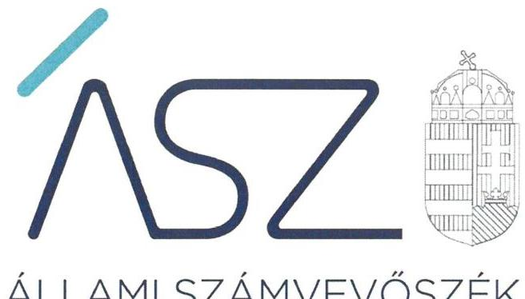
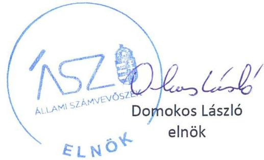
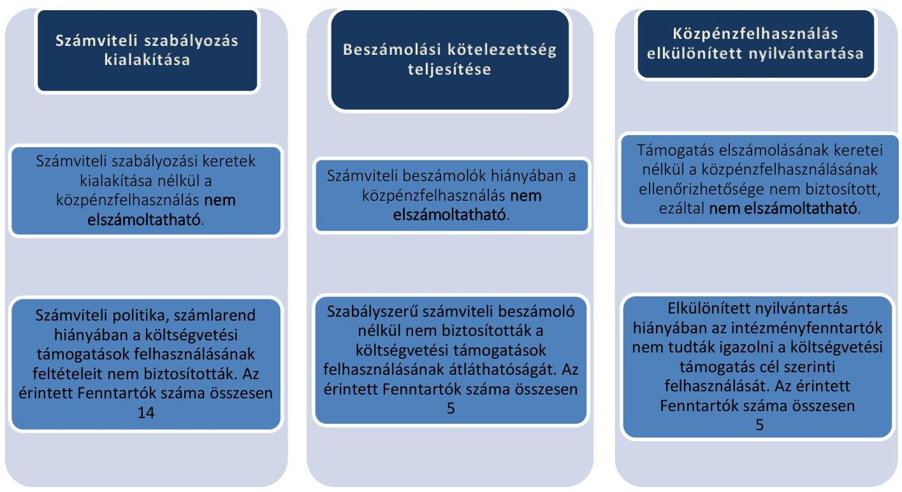
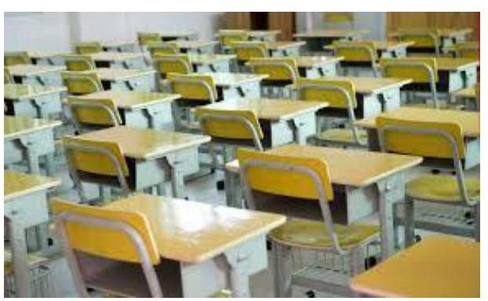

ÁLLAMI SZÁMVEVŐSZÉK

# JELENTÉS 

## Nem állami humánszolgáltatók ellenőrzése

A köznevelési humánszolgáltatást nyújtó intézmények, szolgáltatók államháztartáson kívüli fenntartói központi költségvetésből kapott támogatásai felhasználásának ellenőrzése 28 intézményfenntartó
2021.

21052
www.asz.hu

---

ÁLLAMI SZÁMVEVŐSZÉK

# JELENTÉS

## Nem állami humánszolgáltatók ellenőrzése

A köznevelési humánszolgáltatást nyújtó intézmények, szolgáltatók államháztartáson kívüli fenntartói központi költségvetésből kapott támogatásai felhasználásának ellenőrzése – 28 intézményfenntartó

2021. 05. hó 27. nap

21052 www.asz.hu

---

# AZ ELLENŐRZÉST FELÜGYELTE: 

MAKKAI MÁRIA felügyeleti vezető

## AZ ELLENŐRZÉST VEZETTE ÉS A VÉGREHAJTÁSÁÉRT FELELŐS:

DORMÁN ISTVÁN ZOLTÁN ellenőrzésvezető

## A PROGRAM ÖSSZEÁLLÍTÁSÁÉRT FELELŐS:

FEKETE-NAGY ANDRÁS GÁBOR ellenőrzési program készítéséért felelős vezető

IKTATÓSZÁM: EL-3221-001/2021
TÉMASZÁM: 2523
ELLENŐRZÉS-AZONOSÍTÓ SZÁM: V0867

---

# TARTALOMJEGYZÉK 

■ ÖSSZEGZÉS ..... 5
■ AZ ELLENŐRZÉS CÉLJA ..... 7
■ AZ ELLENŐRZÉS TERÜLETE ..... 8
■ AZ ELLENŐRZÉS HÁTTERE, INDOKOLTSÁGA ..... 9
■ A JELENTÉS LÉNYEGES KÉRDÉSKÖREI ..... 10
■ AZ ELLENŐRZÉS HATÓKÖRE ÉS MÓDSZEREI ..... 11
■ MEGÁLLAPÍTÁSOK ..... 13
■ JAVASLATOK ..... 15
■ MELLÉKLETEK ..... 17
I. sz. melléklet: Értelmező szótár ..... 17
II. sz. melléklet: Az ellenőrzött Fenntartók részére köznevelési közfeladat ellátásra a Kincstár által biztosított költségvetési támogatások összege 2016-2018. években (Ft) ..... 18
III. sz. melléklet: A jelentésben szereplő megállapításokkal érintett Fenntartók ..... 19
IV. sz. melléklet: Az ellenőrzött Fenntartókkal kapcsolatos részletes megállapítások ..... 20
■ FÜGGELÉK: ÉSZREVÉTELEK ..... 29
■ RÖVIDÍTÉSEK JEGYZÉKE ..... 33

---

.

---

# ÖSSZEGZÉS 

A 28 ellenőrzött köznevelési humánszolgáltatást nyújtó államháztartáson kívüli Fenntartó közül három Fenntartó biztositotta a költségvetési támogatások felhasználásának átláthatóságát. 24 Fenntartó nem biztositotta a köznevelési humánszolgáltatási közfeladatok ellátására kapott költségvetési támogatások elszámoltathatóságát. Egy Fenntartó nem biztositotta az ellenőrizhetőség feltételeit. Az ÁSZ kezdeményezésére az ellenőrzött időszakot követően, a 2019. évre 21 intézményfenntartónál a közpénzzel való elszámoltathatóság javult.

## Az ellenőrzés társadalmi indokoltsága

A köznevelési feladatok ellátása az Alaptörvényben meghatározott, a társadalom szempontjából fontos tevékenységek. Jogszabályok teszik lehetővé, hogy államháztartáson kívüli szervezetek - így például az egyházi fenntartók, alapítványok, gazdasági társaságok, egyesületek - által fenntartott intézmények is végezzenek köznevelési feladatokat. Mindehhez a központi költségvetés évente jelentős összegű támogatással járul hozzá. Az államháztartáson kívüli, humánszolgáltatást végző intézmények az igényelt közpénzekből társadalmilag hasznos, közösségteremtő, közérdekű, illetve közhasznú tevékenységet végeznek, illetve közfeladatokat látnak el.

Az intézményfenntartók ellenőrzésével az Állami Számvevőszék hozzájárul ahhoz, hogy ezen közpénzeket az államháztartáson kívüli szervezetek is ellenőrizhető, átlátható és elszámoltatható módon használják fel a közfeladatok ellátása során. Az ellenőrzések célja továbbá, hogy a nyilvánosság és az igénybevevők megfelelő tájékoztatást kapjanak az államháztartáson kívüli közfeladatot ellátók múködéséről.

Az Állami Számvevőszék ellenőrzései arra adnak választ, hogy az intézményfenntartók arra használták-e fel a közpénzeket, amire igényelték. A szabályszerű gazdálkodás elengedhetetlen a közfeladat ellátás szakmai céljainak megvalósításához, valamint a társadalmi közbizalom fenntartásához.

---

# Főbb megállapítások, következtetések 

A 28 ellenőrzött Fenntartó közül három Fenntartó ellenőrzése során alapvető hibát nem tárt fel az ÁSZ a költségvetési támogatások átláthatósága és elszámoltathatósága terén.

24 Fenntartó az Alaptörvény ${ }^{1}$ 39. cikk (2) bekezdésében foglaltak ellenére nem biztosította a felhasznált közpénzekre vonatkozó gazdálkodásuk átláthatóságát. Ezáltal felmerül annak a kockázata, hogy a Fenntartók a kapott támogatásokat nem szabályszerűen használják fel, és a közpénzeket nem átláthatóan kezelik.

Egy Fenntartó az ÁSZ tv. ${ }^{2}$ 28. § (1)-(2) bekezdésében rögzített előírás ellenére az Állami Számvevőszék kérésére nem bocsátotta rendelkezésre az ellenőrzés lefolytatása érdekében szükséges adatokat és dokumentumokat, illetve a kapcsolódó tájékoztatást nem adta meg. Ennek hiányában az ellenőrizhetőséget nem biztosította.

Az ÁSZ 23 intézményfenntartónál kezdeményezte, hogy az ellenőrzött időszakot követő 2019. évre vonatkozóan bemutassák a közpénzekkel való elszámolás feltételeinek meglétét, hozzájárulva ezzel a költségvetési támogatások felhasználásának elszámoltathatóságához.

A feltárt hiányosságokkal kapcsolatban a figyelemfelhívó levelekre érkezett válaszok alapján az alábbi következtetést lehet tenni.

6 intézményfenntartónál a 2019. évre vonatkozó, az ÁSZ kezdeményezésére bemutatott dokumentumok alapján a költségvetési támogatások felhasználásának és az elszámoltathatóságnak a feltételei a számviteli szabályozottság, a számviteli beszámoló készítése, illetve a költségvetési támogatások feladatonkénti elkülönítése terén lényegesen jobb helyzetet mutattak, mint az ellenőrzött időszakban.

15 intézményfenntartónál a költségvetési támogatások felhasználásának és az elszámoltathatóságnak a feltételei a számviteli szabályozottság és a beszámolási kötelezettség terén jobb helyzetet mutattak 2019-ben.

2 intézményfenntartó esetében a költségvetési támogatások felhasználásának és az elszámoltathatóságnak a feltételei nem javultak 2019-ben, változatlanul fennáll annak kockázata, hogy a közpénzeket nem átláthatóan és elszámoltathatóan kezelik. Ezért az ÁSZ a két intézményfenntartó tekintetében az államháztartás alrendszeréből nyújtott, az intézményfenntartót megillető támogatások folyósításának felfüggesztését kezdeményezte.

Az ÁSZ az ellenőrzés megállapításai alapján egy fenntartó részére két javaslatot fogalmazott meg.

---

# AZ ELLENŐRZÉS CÉLJA 

AZ ELLENŐRZÉS CÉLJA annak értékelése volt, hogy a nem állami, nem önkormányzati köznevelési intézmények fenntartói központi költségvetésből kapott támogatásainak felhasználása szabályszerű volt-e.

---

# AZ ELLENŐRZÉS TERÜLETE

## **Köznevelési humánszolgáltatási közfeladatokat ellátó államháztartáson kívüli fenntartók (28 Fenntartó, Alapítványok, Egyesületek)**

Köznevelési intézményt az Nktv.3 szerint nem állami, nem önkormányzati fenntartó is alapíthat és tarthat fenn, a törvények keretei között. A központi költségvetés a fenntartott intézmény köznevelési feladatainak ellátásához költségvetési hozzájárulást biztosít, a jogszabályban előírt feltételek teljesülése esetén. Az Áht.4, Ávr.5, Nkt. vhr. előírásai szerint a Kincstár6 a megítélt támogatásokat a fenntartó részére folyósítja.

Az államháztartáson kívüli köznevelési intézmények központi költségvetésből kapott támogatásai felhasználását 28 intézmény Fenntartójánál7 ellenőriztük, amelyek közül 23 alapítványi, négy egyesületi, és egy szakszervezeti formában működött (II. számú melléklet).

Az ellenőrzött Fenntartók köznevelési alapfeladatai közé az óvodai, általános iskolai nevelés-oktatás; az alapfokú művészetoktatás; gimnáziumi, szakgimnáziumi-, szakközépiskolai, szakiskolai nevelés-oktatás, szakgimnáziumi párhuzamos szakképzés; sajátos nevelési igényű gyermekek, tanulók óvodai, iskolai nevelése-oktatása, nappali rendszerű gimnáziumi oktatása; felnőttoktatás, felnőttképzés és a kollégiumi ellátás tartozott. Az intézményeket Fenntartók összesen 31– önálló jogi személyiséggel rendelkező – köznevelési intézményt működtettek. Négy Fenntartó egynél több intézmény fenntartásában vett részt.

A Fenntartók részére a köznevelési humánszolgáltatási feladatellátásra a Magyar Államkincstár adatai alapján biztosított költségvetési támogatás összege a 2016. évben 2867,1 M Ft, a 2017. évben 3477,0 M Ft, a 2018. évben 3747,1 M Ft volt. Az intézményeket Fenntartók részére a köznevelési humánszolgáltatási feladat ellátásához a Magyar Államkincstár részéről a központi költségvetésből biztosított támogatások összegét a II. számú melléklet tartalmazza.

---

# AZ ELLENŐRZÉS HÁTTERE, INDOKOLTSÁGA 

A köznevelési feladatokat ellátó nem állami intézményfenntartók részére közfeladataik ellátására évente jelentős összegű pénzügyi támogatást biztosítottak a mindenkori költségvetési törvények a bennük megfogalmazott feltételek mellett. A köznevelési feladatokra felhasználható állami támogatások előirányzata a 2016-2018. években 574 Mrd Ft volt.

Az ÁSZ ${ }^{8}$ a stratégiájában célul tűzte ki, hogy az államháztartáson kívülre nyújtott költségvetési támogatások ellenőrzésével hozzájárul ahhoz, hogy a közpénzeket az államháztartáson kívüli szervezetek is átlátható módon használják fel a közfeladatok szerződésben vállalt ellátása érdekében. Az ÁSZ stratégiájában foglaltak alapján is indokolt az ellenőrzés, amely a társadalom számára jelzi, hogy a közpénz államháztartáson kívüli felhasználása sem maradhat ellenőrizetlenül. Az államháztartáson kívülre nyújtott költségvetési támogatások ellenőrzésével az ÁSZ hozzájárul ahhoz, hogy a közpénzeket a nem állami fenntartók átlátható módon használják fel a közfeladatok ellátására kötött szerződésekben vállalt kötelezettségek teljesítése érdekében. Az ÁSZ az ellenőrzés javaslataival hozzájárulhat az említett rendszerek szabályszerű támogatás-felhasználásához, javíthatja a társa-dalmi-gazdasági döntések megalapozottságát, amely a „jól irányított állam müködésének" feltétele.

A holisztikus megközelítés jegyében az ÁSZ az ellenőrzés keretében egyedi kockázatelemzés alapján kiválasztott fenntartóknál értékelte az államháztartáson kívüli köznevelési tevékenységhez kapcsolódó támogatások felhasználásának megfelelőségét.

---

# A JELENTÉS LÉNYEGES KÉRDÉSKÖREI 

1. Az államháztartáson kívüli fenntartók szabályszerű müködési- és gazdálkodási környezet kialakításával megteremtették-e a költségvetési támogatások átlátható, elszámoltatható igénybevételének, felhasználásának feltételeit? Az államháztartáson kívüli fenntartók a köznevelési intézmény müködtetéséhez felhasznált közpénzekre vonatkozó gazdálkodásával a nyilvánosság előtt el-számoltak-e?
2. Az államháztartáson kívüli fenntartók az átvállalt köznevelési közfeladathoz biztositott költségvetési támogatásokat szabályszerűen fordították-e a humánszolgáltató intézmény müködtetésére?

---

# AZ ELLENŐRZÉS HATÓKÖRE ÉS MÓDSZEREI 

## Az ellenőrzés típusa

Megfelelőségi ellenőrzés.

## Az ellenőrzött időszak

A 2016. január 1-je és 2018. december 31-e közötti időszak.

## Az ellenőrzés tárgya

Az ellenőrzés a köznevelési humánszolgáltatási közfeladatokat ellátó államháztartáson kívüli Fenntartók humánszolgáltatási közfeladatai ellátásához a központi költségvetésből kapott támogatásaik humánszolgáltatási közfeladatokra való, fenntartó általi felhasználása szabályszerűségének értékelésére terjedt ki.

## Az ellenőrzött szervezet

Az államháztartásból nyújtott költségvetési támogatásban részesült köznevelési feladatokat ellátó intézmények Fenntartói (II. számú melléklet).

## Az ellenőrzés jogalapja

Az ellenőrzés jogszabályi alapját az ÁSZ tv. 1. § (3) bekezdése, 5. § (3) bekezdésében foglalt előírások adták.

## Az ellenőrzés módszerei

Az ellenőrzést az ellenőrzési program szempontjai, kérdései, az ellenőrzött időszakban hatályos jogszabályok, a nemzetközi standardokat irányadónak tekintve, az ellenőrzés szakmai szabályok és módszertanok figyelembe vételével végeztük. A közpénzekkel való felelős gazdálkodás segítésére irányuló javaslatok kidolgozásakor a hatályos jogszabályok voltak az irányadóak.

Az ellenőrzés ideje alatt az ellenőrzött szervezettel történő kapcsolattartást az ÁSZ SZMSZ²-ének vonatkozó előírásai alapján biztosítottuk.

---

Az ellenőrzési kérdések megválaszolásához szükséges bizonyítékok megszerzése az ellenőrzött által rendelkezésre bocsátott dokumentumokra, adatokra alapozva megfigyelés, szemle (szemrevételezés), kérdésfeltevés (információkérés), mintavétel, valamint elemző eljárással történt.

Az ellenőrzési bizonyítékként felhasználható adatforrások közé tartoztak egyrészt a szakmai program részletes szempontjainál felsorolt adatforrások, másrészt minden - az ellenőrzés folyamán feltárt, az ellenőrzés szempontjából információt tartalmazó - dokumentum.

Az ellenőrzés lefolytatásához az ellenőrzött szervezet a kitöltött tanúsítványok, valamint az ÁSZ által kért dokumentumok elektronikus úton való megküldésével szolgáltatott adatokat, információkat. Az így rendelkezésre bocsátott adatok, információk és a tanúsítványok adatai valódiságának kontrollja az ellenőrzés keretében történt.

Az ellenőrzést alapvetően a köznevelési humánszolgáltatások esetében a központi költségvetési támogatások igénylésével, módosításával, felhasználásával, elszámolásával kapcsolatos feladatokat ellátó államháztartáson kívüli fenntartóknál/szervezeteinél végeztük.

A köznevelési humánszolgáltatások központi költségvetési támogatásaival kapcsolatos, államháztartáson kívüli fenntartó jogszabályokban előírt feladatai betartását, továbbá a központi költségvetési támogatások szabályszerű nyilvántartását ellenőriztük a fenntartónál rendelkezésre álló nyilvántartások, beszámolók és egyéb dokumentumok alapján. Az ellenőrzés nem terjedt ki a köznevelési humánszolgáltatások központi költségvetési támogatásai igénylése, módosítása, elszámolása valódiságának, megalapozottságának, helyességének - sem a fenntartónál, sem a székhely intézményeinél való - értékelésére (mivel ennek felülvizsgálata, ellenőrzése a finanszírozó jogszabályban előírt feladata, határozatai kiadása előtt). Továbbá nem terjedt ki az ellenőrzés e források szabályszerű felhasználásának értékelésére.

---

# MEGÁLLAPÍTÁSOK 

1. ábra

## KRITÉRIUM

A Számv. tv. alapján a fenntartónak rendelkeznie kell számviteli politikával és a hozzá kapcsolódó, gazdálkodását meghatározó belső szabályzatokkal, a pénzgazdálkodással kapcsolatos folyamatok, feladat- és hatáskörök szabályozásával.

Forrás: ÁSZ saját szerkesztés
2. ábra

## KRITÉRIUM

A Számv. tv. alapján a gazdálkodó múködéséről, vagyoni, pénzügyi és jövedelmi helyzetéről a törvényben meghatározott könyvvezetéssel alátámasztott beszámolót köteles készíteni, amelynek megbízható és valós összképet kell adnia vagyonáról, annak összetételéről, pénzügyi helyzetéről és tevékenysége eredményéről.

Forrás: ÁSZ saját szerkesztés

## A JOGSZABÁLYI ELŐÍRÁSOKNAK MEGFELELŐEN

három Fenntartó megteremtette a költségvetési támogatások elszámoltatható, átlátható felhasználásának szabályozási kereteit, számviteli beszámolási kötelezettségének eleget tett, a költségvetési támogatások elkülönített nyilvántartását vezette.

A SZÁMVITELI SZABÁLYZATOK elkészítésére vonatkozó kötelezettségét 14 Fenntartó nem teljesítette. A 14 Fenntartó közül nyolc Fenntartó a Számv. tv. 14. § (3) bekezdése előírása ellenére nem rendelkezett számviteli politikával, a Számv. tv. 14. § (5) bekezdés a-b) és d) pontok előírásai ellenére a számviteli politika keretében elkészítendő szabályzatok közül az eszközök és a források leltárkészítési és leltározási szabályzatával; az eszközök és források értékelési szabályzatával; valamint pénzkezelési szabályzattal, illetve a Számv. tv. 161. § (1) bekezdése előírása ellenére nem rendelkezett számlarenddel. Hat Fenntartó számviteli politikája, illetve számlarendje nem felelt meg a Számv. tv. előírásainak.

A számviteli szabályzatok hiányában a Fenntartók a Számv. tv. előírásai ellenére a könyvvezetésre, a bizonylatolásra vonatkozó részletes belső szabályaikat nem úgy alakították ki, hogy az a mérleg és az eredménykimutatás, valamint a kiegészítő melléklet adatainak közvetlen alátámasztására is alkalmas legyen, ezzel nem biztosították a beszámolók megbízhatóságát, szabályszerű könyvvezetéssel történő alátámasztását, valamint a kapott támogatásokkal való elszámoltathatóság feltételeit.

A SZÁMVITELI BESZÁMOLÓ elkészítésére vonatkozó, a Civil tv. 28. § (1) bekezdésében és a Számv. tv. 4. § (1) bekezdésében előírt kötelezettségének négy Fenntartó az ellenőrzött időszakban, egy Fenntartó 2017-2018. évben nem tett eleget, éves beszámolóik a Civil tv. 29. § (2) bekezdés c) pontjában foglaltak szerinti kiegészítő mellékletet nem tartalmaztak.

A számviteli beszámolók hiányában a Fenntartók a nyilvánosság előtt a közfeladatot ellátó intézményük múködtetéséhez felhasznált közpénzekre vonatkozó gazdálkodással nem számoltak el.

---

3. ábra

## KRITÉRIUM

A 2016-2018. évi Kvtv. előírásai értelmében a fenntartó a köznevelési feladataira kapott támogatásokat a fenntartott intézménynek átadja úgy, hogy az intézmény kiegyensúlyozott múködését biztosítsa. Az Nkt. vhr. előírja, hogy a fenntartó a támogatások felhasználását alapfeladatonkénti bontásban elkülönítetten és naprakészen tartja nyilván.

Forrás: ÁSZ saját szerkesztés

A KÖLTSÉGVETÉSI TÁMOGATÁSOK elkülönített nyilvántartását, amelyből a támogatások felhasználása alapfeladatonként elkülönítetten jelenik meg, öt Fenntartó nem a jogszabályi előírásnak megfelelően vezette. A Fenntartók a Számv. tv. 161/A. § (2) bekezdésének előírása ellenére nem gondoskodtak a könyvvezetési rendszerük oly módon való továbbrészletezéséről, hogy abból az Nkt. vhr. 37/G. § (1) bekezdésében meghatározott, a támogatásfelhasználásra vonatkozó adatok a felhasználás ellenőrizhetősége érdekében rendelkezésre álljanak.

Nyilvántartás hiányában a Fenntartók nem biztosították a köznevelési közfeladat ellátására kapott költségvetési támogatások felhasználásának a Számv. tv.-ben előírt ellenőrizhetőségét, és nem igazolták, hogy a kapott támogatásokat az ellátott köznevelési humánszolgáltatási közfeladatra fordították.

Az ellenőrzött 28 Fenntartó közül egy Fenntartó a Kvtv. $1-3^{10} 7$. melléklet VI.2. pontjában előírtak ellenére nem igazolta a költségvetési támogatások átadását az önálló jogi személyiséggel rendelkező intézménye részére.

Egy Fenntartó az ÁSZ tv. 28. § (1)-(2) bekezdés előírása ellenére nem bocsátotta rendelkezésre az ellenőrzés lefolytatása érdekében szükséges dokumentumokat, az ellenőrizhetőséget nem biztosította.

Az egyes ellenőrzött Fenntartókra vonatkozó megállapításokat a III. és a IV. számú mellékletek tartalmazzák.

---

# JAVASLATOK 

Az ÁSZ tv. 33. § (1) bekezdésében foglaltak értelmében az ellenőrzött szervezet vezetője köteles a jelentésben foglalt megállapításokhoz kapcsolódó intézkedési tervet összeállítani és azt a jelentés kézhezvételétől számított 30 napon belül az ÁSZ részére megküldeni. Amennyiben az ellenőrzött szervezet vezetője nem küldi meg határidőben az intézkedési tervet, vagy továbbra sem elfogadható intézkedési tervet küld, az Állami Számvevőszék elnöke az ÁSZ tv. 33. § (3) bekezdése a) és b) pontjaiban foglaltakat érvényesítheti.

## A Wadrózsa Pedagógiai Műhely Közhasznú Egyesület elnökének

1. Intézkedjen a Számv. tv. előírásainak megfelelően a számlarend elkészítéséről.
(IV. sz. melléklet ellenőrzöttre vonatkozó megállapítás 2. bekezdése alapján)
2. Intézkedjen a Számv. tv. előírásainak megfelelő számviteli beszámoló elkészítéséről.
(IV. sz. melléklet ellenőrzöttre vonatkozó megállapítás 3. bekezdése alapján)

---

.

---

# MELLÉKLETEK 

- I. SZ. MELLÉKLET: ÉRTELMEZŐ SZÓTÁR
humánszolgáltatás
költségvetési támogatás
köznevelési közfeladat
köznevelési intézmény
nem állami, nem önkormányzati (államháztartáson kívüli) intézmény fenntartó

Külön törvényben meghatározott szociális, gyermekjóléti, gyermekvédelmi, közoktatási, felsőoktatási, kulturális közfeladatok (2015. évi C. törvény Magyarország 2016. évi központi költségvetéséről, 2016 évi XC. törvény Magyarország 2017. évi központi költségvetéséről, 2017. évi C. törvény Magyarország 2018. évi központi költségvetéséről). a társadalombiztosítás pénzügyi alapjai kivételével az államháztartás központi alrendszeréből ellenérték nélkül, pénzben nyújtott támogatások (Áht. 1. § 14. pont)
A költségvetési törvényekben (2015. évi C. törvény Magyarország 2016. évi központi költségvetéséről, 2016 évi XC. törvény Magyarország 2017. évi központi költségvetéséről, 2017. évi C. törvény Magyarország 2018. évi központi költségvetéséről) megállapított támogatás. A 2015. évi C. törvény 40-41. § szerint többek között: Az Országgyűlés a szociális, gyermekjóléti, gyermekvédelmi közfeladatot ellátó intézményt, szolgáltatást fenntartó egyházi jogi személy, civil szervezet, közalapítvány, országos nemzetiségi önkormányzat, települési vagy területi nemzetiségi önkormányzat, gazdasági társaság, és a humánszolgáltatást alaptevékenységként végző, az Szja tv. hatálya alá tartozó egyéni vállalkozó (a továbbiakban együtt: nem állami szociális fenntartó) részére támogatást állapít meg a következők szerint: a támogatás a nem állami szociális fenntartót a települési önkormányzatok 2. melléklet III. pont 3. alpont c)-k) pontjában és III. pont 5. alpont a) pontjában meghatározott támogatásaival azonos jogcímeken, összegben és feltételek mellett illeti meg.
A köznevelési intézmény alapító okiratában foglalt feladat: óvodai nevelés, nemzetiséghez tartozók óvodai nevelése, általános iskolai nevelés-oktatás, nemzetiséghez tartozók általános iskolai nevelése-oktatása, kollégiumi ellátás, nemzetiségi kollégiumi ellátás, gimnáziumi nevelés-oktatás, szakközépiskolai nevelés-oktatás, szakiskolai nevelésoktatás, nemzetiség gimnáziumi nevelés-oktatása, nemzetiség szakközépiskolai neve-lés-oktatása, nemzetiség szakiskolai nevelés-oktatása, Köznevelési Hídprogramok keretében folyó nevelés-oktatás, felnőttoktatás, alapfokú művészetoktatás, fejlesztő nevelés, fejlesztő nevelés-oktatás, pedagógiai szakszolgálati feladat, a többi gyermekkel, tanulóval együtt nevelhető, oktatható sajátos nevelési igényű gyermekek, tanulók óvodai nevelése és iskolai nevelése-oktatása, azoknak a sajátos nevelési igényű gyermekeknek, tanulóknak az óvodai, iskolai, kollégiumi ellátása, akik a többi gyermekkel, tanulóval nem foglalkoztathatók együtt, a gyermekgyógyüdülőkben, egészségügyi intézményekben, rehabilitációs intézményekben tartós gyógykezelés alatt álló gyermekek tankötelezettségének teljesítéséhez szükséges oktatás, pedagógiai-szakmai szolgáltatás.
A nevelési- oktatási intézmény, pedagógiai szakszolgálati intézmény, pedagógiai-szakmai szolgáltatást nyújtó intézmény.
A szociális közfeladatokat/humánszolgáltatásokat ellátó intézményt fenntartó egyházi jogi személy, társadalmi szervezet, alapítvány, közalapítvány, civil szervezet, országos nemzetiségi önkormányzat, nonprofit gazdasági társaság, gazdasági társaság és a humánszolgáltatást alaptevékenységként végző, Szja tv. hatálya alá tartozó egyéni vállalkozó. (2015. évi C. törvény Magyarország 2016. évi központi költségvetéséről, 2016 évi XC. törvény Magyarország 2017. évi központi költségvetéséről, 2017. évi C. törvény Magyarország 2018. évi központi költségvetéséről)

---

II. SZ. MELLÉKLET: AZ ELLENŐRZÖTT FENNTARTÓK RÉSZÉRE KÖZNEVELÉSI KÖZFELADAT ELLÁTÁSRA A KINCSTÁR ÁLTAL BIZTOSÍTOTT KÖLTSÉGVETÉSI TÁMOGATÁSOK ÖSSZEGE 2016-2018. ÉVEKBEN (FT)

|  Fenntertók (28 db) | 2016. | 2017. | 2018.  |
| --- | --- | --- | --- |
|  ABAÚJI FIATALOK OKTATÁSÁÉRT ALAPÍTVÁNY | 42526193 | 57817368 | 66563000  |
|  Alapítvány az Árnyas Utcai Gyermekekért | 57802870 | 62906697 | 71124462  |
|  Angol Nyelvű Közoktatásért Alapítvány | 53996998 | 70776213 | 73201333  |
|  „Aranyszív a gyermekekért" Közhasznú Alapítvány | 168664448 | 174007205 | 226185134  |
|  Briliáns Oktatási Alapítvány | 63227177 | 68750068 | 70243086  |
|  Budapesti Politechnikum Alapítvány | 205469980 | 238661000 | 244485983  |
|  Cilinder Színház és Iskola Alapítvány | 38578024 | 71823863 | 80545833  |
|  Claudius Táncsport Egyesület | 109522730 | 114231483 | 119299667  |
|  Csepel-Sziget Humánerőforrás Fejlesztő és Foglalkoztatást Támogató Alapítvány | 89362536 | - | 106465533  |
|  Csillagberek Waldorf Alapítvány | 40183490 | 56853661 | 69122201  |
|  Csodálatos Gyermekvilág - Pedagógusok a XVIII. Kerület Gyermekeiért Alapítvány | 71112611 | 74364925 | 76388100  |
|  Egri Számítástechnikai és Rehabilitációs Szakképzésért Alapítvány | 86052628 | 89404122 | 84227633  |
|  Emil Molt Alapítvány | 106066686 | 147375109 | 165436667  |
|  Európa 2000 Közgazdasági, Idegenforgalmi és Informatikai Oktatási Központ Alapítvány | 188715265 | 186599271 | 181024434  |
|  Juniorka Alapítvány | 66388934 | 74951908 | 72640884  |
|  Kalyi Jag Roma Művészeti Inter-Európai Integrációs, Foglalkoztatási és Oktatás-fejlesztési Közhasznú Egyesület | - | 251880258 | 259668668  |
|  Képességfejlesztés 1990-1998 Alapítvány | 142849396 | 161992664 | 166823099  |
|  Kürt Alapítvány | 131320397 | 156652730 | 174344500  |
|  Magyar Zeneművészek és Táncművészek Szakszervezete | 174107806 | 212312531 | 213955834  |
|  Megérted Alapítvány, Részképesség Fejlesztő Oktatási, Nevelési és Módszertani Továbbképző Központ | 118829156 | 146796641 | 163064666  |
|  Meixner Alapítvány | 96756676 | 105336692 | 108632767  |
|  MESZAT Intézményfenntartó Központ Alapítvány | 173545027 | 134200392 | 98709066  |
|  Öbudai Waldorf Alapítvány | 208184895 | 238933126 | 264171967  |
|  OKTATÁSÉRT ALAPÍTVÁNY | 91111314 | 102929584 | 99262667  |
|  Osztrák-Magyar Európa-Iskola Alapítvány | 192444253 | 196204062 | 188771333  |
|  Székesfehérvári Waldorf Egyesület | 34620552 | 50005760 | 63702667  |
|  SZÉPTAN Múvészetoktató, Kultúrát Teremtő és Támogató Művészeti Alapítvány | 115627414 | 119919379 | 119990500  |
|  Wadrózsa Pedagógiai Műhely Közhasznú Egyesület | - | 111279086 | 119028100  |
|  MINUÖSSZÉSEN (Fenntertók (28 db)) | 2867067456 | 3476965798 | 3747079784  |

---

| Számviteli szabályozás hiánya | Számviteli beszámoló elkészítésére vonatkozó kötelezettség nem teljesítése | Közpénzfelhasználás elkülönített nyilvántartásának hiánya |
| :--: | :--: | :--: |
| ABAÚJI FIATALOK OKTATÁSÁÉRT ALAPÍTVÁNY | Juniorka Alapítvány | Emil Molt Alapítvány |
| Angol Nyelvű Közoktatásért Alapítvány | Megérted Alapítvány, Részképesség Fejlesztő Oktatási, Nevelési és Módszertani Továbbképző Központ | Európa 2000 Közgazdasági, Idegenforgalmi és Informatikai Oktatási Központ Alapítvány |
| Alapítvány az Árnyas Utcai Gyermekekért | Kalyi Jag Roma Művészeti Inter-Európai Integrációs, Foglalkoztatási és Oktatás-fejlesztési Közhasznú Egyesület | Képességfejlesztés 1990-1998 Alapítvány |
| „Aranyszív a gyermekekért" Közhasznú Alapítvány | MESZAT Intézményfenntartó Központ Alapitvány | Kürt Alapítvány |
| Cilinder Színház és Iskola Alapítvány | Osztrák-Magyar Európa-Iskola Alapítvány | Óbudai Waldorf Alapítvány |
| Csepel-Sziget Humánerőforrás Fejlesztő és Foglalkoztatást Támogató Alapítvány Csillagberek Waldorf Alapítvány |  |  |
| Csodálatos Gyermekvilág - Pedagógusok a XVIII. Kerület Gyermekeiért Alapítvány |  |  |
| Egri Számítástechnikai és Rehabilitációs Szakképzésért Alapítvány |  |  |
| Meixner Alapítvány |  |  |
| OKTATÁSÉRT ALAPÍTVÁNY |  |  |
| Székesfehérvári Waldorf Egyesület |  |  |
| SZÉPTAN Művészetoktató, Kultúrát Teremtő és Támogató Művészeti Alapítvány |  |  |
| Wadrózsa Pedagógiai Mühely Közhasznú Egyesület |  |  |
| Az érintett Fenntartók száma összesen 14 | Az érintett Fenntartók száma összesen 5 | Az érintett Fenntartók száma összesen 5 |

---

# 1. ABAÚJI FIATALOK OKTATÁSÁÉRT ALAPÍTVÁNY 

A szikszói székhelyű ABAÚJI FIATALOK OKTATÁSÁÉRT ALAPÍTVÁNY a 2016-2018. években egy önálló jogi személyiséggel rendelkező köznevelési intézményt tartott fenn. A Szikszói Szakképző Iskola és Szakgimnázium többcélú köznevelési intézmény (szakközépiskola, szakiskola) köznevelési alapfeladatot látott el.

A Fenntartó az ellenőrzött időszakban a Számv. tv. 14. § (3) bekezdése előírása ellenére nem rendelkezett számviteli politikával és a Számv. tv. 14. § (5) bekezdés a-b) és d) pontjai előírásai ellenére a számviteli politika keretében elkészítendő az eszközök és a források leltárkészítési és leltározási szabályzatával; az eszközök és források értékelési szabályzatával; valamint pénzkezelési szabályzattal. Az ellenőrzés lefolytatásához az Alapítványra vonatkozó, a 20162018. évekre hatályos számviteli politikát és az annak keretében elkészítendő szabályzatokat nem bocsátott rendelkezésre, intézménye számviteli szabályzataival rendelkezett. A Fenntartó a könyvvezetésre, a bizonylatolásra vonatkozó részletes belső szabályait nem alakította ki úgy, hogy az a beszámoló adatainak közvetlen alátámasztására alkalmas legyen. Ezáltal nem teremtette meg a költségvetési támogatások elszámoltatható, átlátható felhasználásának szabályozási kereteit.

## 2. Alapítvány az Árnyas Utcai Gyermekekért

A veresegyházi székhelyű Alapítvány az Árnyas Utcai Gyermekekért a 2016-2018. években egy önálló jogi személyiséggel rendelkező köznevelési intézményt tartott fenn. Az Árnyas Óvoda óvodai nevelés köznevelési alapfeladatot látott el.

A Fenntartó a Számv. tv. 161. § (1) bekezdés előírásai ellenére az ellenőrzött időszakban nem rendelkezett számlarenddel. Az ellenőrzés lefolytatásához az Alapítvány az ellenőrzött időszakra aláírt, hiteles számlarendet nem bocsátott rendelkezésre. A Fenntartó a könyvvezetésre, a bizonylatolásra vonatkozó részletes belső szabályait nem alakította ki úgy, hogy az a beszámoló adatainak közvetlen alátámasztására alkalmas legyen. Ezáltal nem teremtette meg a költségvetési támogatások elszámoltatható, átlátható felhasználásának szabályozási kereteit.

## 3. Angol Nyelvű Közoktatásért Alapítvány

A budapesti székhelyű Angol Nyelvű Közoktatásért Alapítvány a 2016-2018. években egy önálló jogi személyiséggel rendelkező köznevelési intézményt tartott fenn. A BME által alapított Két Tanítási Nyelvű Gimnázium gimnázium köznevelési alapfeladatot látott el.

A Fenntartó számviteli politikája és a számlarendje az ellenőrzött időszakban nem felelt meg a Számv. tv. előírásainak. A számviteli politika a Számv. tv. 14. § (4) bekezdése előírása ellenére nem tartalmazta azokat a gazdálkodóra jellemző szabályokat, előírásokat, módszereket, amelyekkel meghatározza, hogy mit tekint a számviteli elszámolás, az értékelés szempontjából kivételes nagyságú vagy előfordulású bevételnek, költségnek, ráfordításnak. A számlarend a Számv. tv. 161. § (2) bekezdés a), b) és d) pontjai előírása ellenére nem tartalmazta minden alkalmazásra kijelölt számla számlajelét és megnevezését, a számla tartalmát, valamint a számlarendet alátámasztó bizonylati rendet. A Fenntartó a könyvvezetésre, a bizonylatolásra vonatkozó részletes belső szabályait nem alakította ki úgy, hogy az a beszámoló adatainak közvetlen alátámasztására alkalmas legyen. Ezáltal nem teremtette meg a költségvetési támogatások elszámoltatható, átlátható felhasználásának szabályozási kereteit.

## 4. „Aranyszív a gyermekekért" Közhasznú Alapítvány

A nyíregyházi székhelyű „Aranyszív a gyermekekért" Közhasznú Alapítvány a 2016-2018. években egy önálló jogi személyiséggel rendelkező köznevelési intézményt tartott fenn. A "SZAK-MA" Középiskola gimnáziumi nevelés, oktatás, szakgimnáziumi nevelés, oktatás, szakközépiskolai nevelés, oktatás, felnőttoktatás, felnőttképzés, általános középfokú oktatás, szakmai középfokú oktatás, felső szintű, nem felsőfokú oktatás köznevelési alapfeladatokat látott el.

A Fenntartó az ellenőrzött időszakban a Számv. tv. 14. § (3) bekezdése előírása ellenére nem rendelkezett számviteli politikával és a Számv. tv. 14. § (5) bekezdés a-b) és d) pont előírásai ellenére a számviteli politika keretében elkészítendő az eszközök és a források leltárkészítési és leltározási szabályzatával;az eszközök és források értékelési

---

szabályzatával; valamint pénzkezelési szabályzattal. A Fenntartó a Számv. tv. 161. § (1) bekezdés előírásai ellenére az ellenőrzött időszakban nem rendelkezett számlarenddel. Az ellenőrzés lefolytatásához a 2016-2018. évekre hatályos számviteli politikát, az annak keretében elkészítendő szabályzatokat, valamint számlarendet nem bocsátott rendelkezésre, a benyújtott dokumentumok nem az ellenőrzött időszakra vonatkoznak. A Fenntartó a könyvvezetésre, a bizonylatolásra vonatkozó részletes belső szabályait nem alakította ki úgy, hogy az a beszámoló adatainak közvetlen alátámasztására alkalmas legyen. Ezáltal nem teremtette meg a költségvetési támogatások elszámoltatható, átlátható felhasználásának szabályozási kereteit.

# 5. Briliáns Oktatási Alapítvány 

A budapesti székhelyű Briliáns Oktatási Alapítvány a 2016-2018. években egy önálló jogi személyiséggel rendelkező köznevelési intézményt tartott fenn. A Talento-Ház Alapítványi Óvoda, Általános Iskola és Alapfokú Művészeti Iskola óvodai nevelés, általános iskolai nevelés-oktatás, alapfokú művészetoktatás köznevelési alapfeladatokat látott el.

A Fenntartó gazdálkodásának lényeges területeit - számviteli szabályozottságot, beszámolási kötelezettség teljesítését, a kapott támogatások felhasználásának szabályszerű elkülönítését - megvizsgáltuk és annak eredményeképpen észrevételt nem teszünk.

## 6. Budapesti Politechnikum Alapítvány

A budapesti székhelyű Budapesti Politechnikum Alapítvány a 2016-2018. években egy önálló jogi személyiséggel rendelkező köznevelési intézményt tartott fenn. A Közgazdasági Politechnikum Alternatív Gimnázium gimnáziumi neve-lés-oktatás, szakközépiskolai nevelés-oktatás, a többi gyermekkel, tanulóval együtt nevelhető, oktatható sajátos nevelési igényű gyermekek iskolai nevelése-oktatása köznevelési alapfeladatokat látott el.

A Fenntartó gazdálkodásának lényeges területeit - számviteli szabályozottságot, beszámolási kötelezettség teljesítését, a kapott támogatások felhasználásának szabályszerű elkülönítését - megvizsgáltuk és annak eredményeképpen észrevételt nem teszünk.

## 7. Cilinder Színház és Iskola Alapítvány

A budapesti székhelyű Cilinder Színház és Iskola Alapítvány a 2016-2018. években egy önálló jogi személyiséggel rendelkező köznevelési intézményt tartott fenn. A META Alapfokú Művészeti Iskola alapfokú művészetoktatás köznevelési alapfeladatot látott el.

A Fenntartó az ellenőrzött időszakban a Számv. tv. 14. § (3) bekezdése előírása ellenére nem rendelkezett számviteli politikával és a Számv. tv. 14. § (5) bekezdés a-b) és d) pontok előírásai ellenére a számviteli politika keretében elkészítendő az eszközök és a források leltárkészítési és leltározási szabályzatával;az eszközök és források értékelési szabályzatával; valamint pénzkezelési szabályzattal. Az ellenőrzés lefolytatásához a 2016-2018. évekre hatályos számviteli politikát és az annak keretében elkészítendő szabályzatokat nem bocsátott rendelkezésre, a benyújtott dokumentumok nem az ellenőrzött időszakra vonatkoznak. A Fenntartó a Számv. tv. 161. § (1) bekezdés előírásai ellenére az ellenőrzött időszakban nem rendelkezett számlarenddel, az ellenőrzés lefolytatásához számlarendet nem bocsátott rendelkezésre, a számlarendhez tartozó főkönyvi kivonatokat nyújtotta be. A Fenntartó a könyvvezetésre, a bizonylatolásra vonatkozó részletes belső szabályait nem alakította ki úgy, hogy az a beszámoló adatainak közvetlen alátámasztására alkalmas legyen. Ezáltal nem teremtette meg a költségvetési támogatások elszámoltatható, átlátható felhasználásának szabályozási kereteit.

## 8. Claudius Táncsport Egyesület

A Fenntartó az ÁSZ tv. 28. § (1)-(2) bekezdésében rögzített előírás ellenére az Állami Számvevőszék felszólítására nem bocsátotta rendelkezésre az ellenőrzés lefolytatása érdekében szükséges adatokat és dokumentumokat, illetve a kapcsolódó tájékoztatást nem adta meg. Ennek hiányában az ellenőrizhetőség feltétele nem volt biztosított.

## 9. Csepel-Sziget Humánerőforrás Fejlesztő és Foglalkoztatást Támogató Alapítvány

A budapesti székhelyű Csepel-Sziget Humánerőforrás Fejlesztő és Foglalkoztatást Támogató Alapítvány a 2016-2018. években egy önálló jogi személyiséggel rendelkező köznevelési intézményt tartott fenn. A Szabóky Adolf Általános és

---

Szakképző Iskola általános iskolai, szakiskolai, szakközépiskolai, szakgimnáziumi nevelés-oktatás, felnőttoktatás, a sajátos nevelési igényű gyermekek, tanulók óvodai nevelése és iskolai nevelése-oktatása, kollégiumi ellátása köznevelési alapfeladatokat látott el.

A Fenntartó az ellenőrzött időszakban a Számv. tv. 14. § (3) bekezdés előírása ellenére nem rendelkezett számviteli politikával és a Számv. tv. 14. § (5) bekezdés a-b) és d) pontok előírásai ellenére a számviteli politika keretében elkészítendő az eszközök és a források leltárkészítési és leltározási szabályzatával;az eszközök és források értékelési szabályzatával; valamint pénzkezelési szabályzattal. Az ellenőrzés lefolytatásához a 2016-2018. évekre hatályos aláírt, hiteles számviteli politikát és az annak keretében elkészítendő szabályzatokat nem bocsátott rendelkezésre. A Fenntartó a Számv. tv. 161. § (1) bekezdés előírásai ellenére az ellenőrzött időszakban nem rendelkezett számlarenddel, az ellenőrzés lefolytatásához számlarendet nem bocsátott rendelkezésre, számlatükröt nyújtott be. A Fenntartó a könyvvezetésre, a bizonylatolásra vonatkozó részletes belső szabályait nem alakította ki úgy, hogy az a beszámoló adatainak közvetlen alátámasztására alkalmas legyen. Ezáltal nem teremtette meg a költségvetési támogatások elszámoltatható, átlátható felhasználásának szabályozási kereteit.

# 10. Csillagberek Waldorf Alapítvány 

A budapesti székhelyű Csillagberek Waldorf Alapítvány a 2016-2018. években két önálló jogi személyiséggel rendelkező köznevelési intézményt tartott fenn. A Csillagberek Waldorf Általános Iskola és Alapfokú Művészeti Iskola, valamint a Csillagberek Waldorf Óvoda oktatás, nevelés köznevelési alapfeladatokat látott el.

A Fenntartó a 2016-2017. években a Számv. tv. 161. § (1) bekezdés előírásai ellenére nem rendelkezett számlarenddel, az ellenőrzés lefolytatásához 2018. szeptember 23 -ai keltezésű számlarendet bocsátott rendelkezésre. A Fenntartó a könyvvezetésre, a bizonylatolásra vonatkozó részletes belső szabályait nem alakította ki úgy, hogy az a beszámoló adatainak közvetlen alátámasztására alkalmas legyen. Ezáltal nem teremtette meg a költségvetési támogatások elszámoltatható, átlátható felhasználásának szabályozási kereteit.

## 11. Csodálatos Gyermekvilág - Pedagógusok a XVIII. Kerület Gyermekeiért Alapítvány

A budapesti székhelyű Csodálatos Gyermekvilág - Pedagógusok a XVIII. Kerület Gyermekeiért Alapítvány a 2016-2018. években egy önálló jogi személyiséggel rendelkező köznevelési intézményt tartott fenn. A Csodavilág Óvoda óvodai nevelés köznevelési alapfeladatot látott el.

A Fenntartó 2016-2017. években a Számv. tv. 14.§ (3) bekezdése előírása ellenére nem rendelkezett számviteli politikával és a Számv. tv. 14- § (5) bekezdés b) pont előírásai ellenére a számviteli politika keretében elkészítendő az eszközök és források értékelési szabályzatával, az ellenőrzés lefolytatásához 2018. január 1-től hatályos dokumentumokat bocsátott rendelkezésre. A Fenntartó a Számv. tv. 161. § (1) bekezdés előírásai ellenére az ellenőrzött időszakban nem rendelkezett számlarenddel, a 2016-2018. évekre hatályos aláírt, hiteles számlarendet nem bocsátott rendelkezésre. A Fenntartó a könyvvezetésre, a bizonylatolásra vonatkozó részletes belső szabályait nem alakította ki úgy, hogy az a beszámoló adatainak közvetlen alátámasztására alkalmas legyen. Ezáltal nem teremtette meg a költségvetési támogatások elszámoltatható, átlátható felhasználásának szabályozási kereteit.

## 12. Egri Számítástechnikai és Rehabilitációs Szakképzésért Alapítvány

Az egri székhelyű Egri Számítástechnikai és Rehabilitációs Szakképzésért Alapítvány a 2016-2018. években egy önálló jogi személyiséggel rendelkező köznevelési intézményt tartott fenn. A Gimnázium, Informatikai, Közgazdasági, Nyomdaipari Szakközépiskola és Szakiskola nappali rendszerú közoktatás köznevelési alapfeladatot látott el.

A Fenntartó a Számv. tv. 161. § (1) bekezdés előírásai ellenére az ellenőrzött időszakban nem rendelkezett számlarenddel, az ellenőrzés lefolytatásához számlarendet nem bocsátott rendelkezésre, számlatükröt nyújtott be. A Fenntartó a könyvvezetésre, a bizonylatolásra vonatkozó részletes belső szabályait nem alakította ki úgy, hogy az a beszámoló adatainak közvetlen alátámasztására alkalmas legyen. Ezáltal nem teremtette meg a költségvetési támogatások elszámoltatható, átlátható felhasználásának szabályozási kereteit.

---

# 13. Emil Molt Alapítvány 

A budapesti székhelyű Emil Molt Alapítvány a 2016-2018. években egy önálló jogi személyiséggel rendelkező köznevelési intézményt tartott fenn. A Göllner Mária Regionális Waldorf Gimnázium és Alapfokú Művészeti Iskola gimnáziumi nevelés-oktatás, alapfokú művészetoktatás köznevelési alapfeladatokat látott el.

A Fenntartó gazdálkodásának lényeges területeit - számviteli szabályozottságot, beszámolási kötelezettség teljesítését - megvizsgáltuk és annak eredményeképpen észrevételt nem teszünk.

A Fenntartó 2016-2018. években nem vezetett olyan nyilvántartást, amelyből a támogatások felhasználása elkülönítetten, alapfeladatonkénti bontásban jelenik meg, a Számv. tv. 161/A. § (2) bekezdésének előírása ellenére nem gondoskodott a könyvvezetési rendszerének oly módon való továbbrészletezéséről, hogy abból az Nkt. vhr. 37/G. § (1) bekezdésében meghatározott, a támogatás-felhasználásra vonatkozó adatok - a felhasználás ellenőrizhetősége érdekében - rendelkezésre álljanak. A Fenntartó a kapott költségvetési támogatás felhasználásának ellenőrizhetőségét nem biztosította ezáltal nem igazolta, hogy a kapott támogatásokat szabályszerűen az ellátott közfeladatra fordította.

## 14. Európa 2000 Közgazdasági, Idegenforgalmi és Informatikai Oktatási Központ Alapítvány

A budapesti székhelyű Európa 2000 Közgazdasági, Idegenforgalmi és Informatikai Oktatási Központ Alapítvány a 2016-2018. években egy önálló jogi személyiséggel rendelkező köznevelési intézményt tartott fenn. Az Európa 2000 Középiskola gimnáziumi nevelés-oktatás, szakgimnáziumi nevelés-oktatás, szakközépiskolai nevelés oktatás köznevelési alapfeladatokat látott el.

A Fenntartó gazdálkodásának lényeges területeit - számviteli szabályozottságot, beszámolási kötelezettség teljesítését - megvizsgáltuk és annak eredményeképpen észrevételt nem teszünk.

A Fenntartó 2016-2018. években nem vezetett olyan nyilvántartást, amelyből a támogatások felhasználása elkülönítetten, alapfeladatonkénti bontásban jelenik meg, a Számv. tv. 161/A. § (2) bekezdésének előírása ellenére nem gondoskodott a könyvvezetési rendszerének oly módon való továbbrészletezéséről, hogy abból az Nkt. vhr. 37/G. § (1) bekezdésében meghatározott, a támogatás-felhasználásra vonatkozó adatok - a felhasználás ellenőrizhetősége érdekében - rendelkezésre álljanak. A Fenntartó a kapott költségvetési támogatás felhasználásának ellenőrizhetőségét nem biztosította ezáltal nem igazolta, hogy a kapott támogatásokat szabályszerűen az ellátott közfeladatra fordította.

## 15. Juniorka Alapítvány

A tatai székhelyű Juniorka Alapítvány a 2016-2018. években egy önálló jogi személyiséggel rendelkező köznevelési intézményt tartott fenn. A Juniorka Alapítványi Óvoda óvodai nevelés köznevelési alapfeladatot látott el.

A Civil tv. 29. § (2) bekezdés c) pontjában foglaltak ellenére a Fenntartó 2016-2018. évi egyszerűsített éves beszámolói kiegészítő mellékletet nem tartalmaztak, amely alapján a Civil tv. 28. § (1) bekezdésében és a Számv. tv. 4. § (1) bekezdésben foglaltak ellenére beszámoló készítési kötelezettségének nem tett eleget. A köznevelési humánszolgáltatási közfeladatot ellátó intézménye működtetéséhez felhasznált közpénzekre vonatkozó gazdálkodásával a nyilvánosság előtt nem számolt el.
16. Kalyi Jag Roma Művészeti Inter-Európai Integrációs, Foglalkoztatási és Oktatás-fejlesztési Közhasznú Egyesület A budapesti székhelyű Kalyi Jag Roma Művészeti Inter-Európai Integrációs, Foglalkoztatási és Oktatás-fejlesztési Közhasznú Egyesület a 2016-2018. években egy önálló jogi személyiséggel rendelkező köznevelési intézményt tartott fenn. A Kalyi Jag Roma Nemzetiségi Általános és Középiskola oktatási-nevelési tevékenység köznevelési alapfeladatot látott el. A Fenntartó 2017-2018. években részesült költségvetési támogatásban.

A Civil tv. 29. § (2) bekezdés c) pontjában foglaltak ellenére a Fenntartó 2017-2018. évi egyszerűsített éves beszámolója kiegészítő mellékletet nem tartalmazott, amely alapján a Civil tv. 28. § (1) bekezdésében és a Számv. tv. 4. § (1) bekezdésben foglaltak ellenére beszámoló készítési kötelezettségének nem tett eleget. A Fenntartó a 2017-2018. évekre vonatkozóan nem igazolta, hogy a Kvtv. 1-3 7. számú melléklet VI.2. pontjában foglalt kötelezettségének eleget

---

tett és a részére folyósított költségvetési támogatásokat átadta az intézménye részére. A köznevelési humánszolgáltatási közfeladatot ellátó intézménye működtetéséhez felhasznált közpénzekre vonatkozó gazdálkodásával a nyilvánosság előtt nem számolt el.

# 17. Képességfejlesztés 1990-1998 Alapítvány 

A tatai székhelyű Képességfejlesztés 1990-1998 Alapítvány a 2016-2018. években egy önálló jogi személyiséggel rendelkező köznevelési intézményt tartott fenn. A Talentum Angol-Magyar Két tanítási Nyelvű Általános Iskola és Művészeti Szakgimnázium általános iskolai nevelés oktatás, szakgimnáziumi párhuzamos szakképzés köznevelési alapfeladatokat látott el.

A Fenntartó gazdálkodásának lényeges területeit - számviteli szabályozottságot, beszámolási kötelezettség teljesítését - megvizsgáltuk és annak eredményeképpen észrevételt nem teszünk.

A Fenntartó 2016-2018. években nem vezetett olyan nyilvántartást, amelyből a támogatások felhasználása elkülönítetten, alapfeladatonkénti bontásban jelenik meg, a Számv. tv. 161/A. § (2) bekezdésének előírása ellenére nem gondoskodott a könyvvezetési rendszerének oly módon való továbbrészletezéséről, hogy abból az Nkt. vhr. 37/G. § (1) bekezdésében meghatározott, a támogatás-felhasználásra vonatkozó adatok - a felhasználás ellenőrizhetősége érdekében - rendelkezésre álljanak. A Fenntartó a kapott költségvetési támogatás felhasználásának ellenőrizhetőségét nem biztosította ezáltal nem igazolta, hogy a kapott támogatásokat szabályszerűen az ellátott közfeladatra fordította.

## 18. Kürt Alapítvány

A budapesti székhelyű Kürt Alapítvány a 2016-2018. években egy önálló jogi személyiséggel rendelkező köznevelési intézményt tartott fenn. A Kürt Alapítványi Gimnázium négy évfolyamos gimnáziumi nevelés-oktatás köznevelési alapfeladatot látott el.

A Fenntartó gazdálkodásának számviteli szabályozottságát megvizsgáltuk és annak eredményeképpen észrevételt nem teszünk.

A Fenntartó a számviteli beszámoló elkészítésére vonatkozó, a Civil tv. 28. § (1) bekezdésében és a Számv. tv. 4. § (1) bekezdésében előírt kötelezettségének 2016. évben nem tett eleget, aláírt beszámolóval nem rendelkezett. A köznevelési humánszolgáltatási közfeladatot ellátó intézménye működtetéséhez felhasznált közpénzekre vonatkozó gazdálkodásával a nyilvánosság előtt nem számolt el.

A Fenntartó 2016-2018. években nem vezetett olyan nyilvántartást, amelyből a támogatások felhasználása elkülönítetten, alapfeladatonkénti bontásban jelenik meg, a Számv. tv. 161/A. § (2) bekezdésének előírása ellenére nem gondoskodott a könyvvezetési rendszerének oly módon való továbbrészletezéséről, hogy abból az Nkt. vhr. 37/G. § (1) bekezdésében meghatározott, a támogatás-felhasználásra vonatkozó adatok - a felhasználás ellenőrizhetősége érdekében - rendelkezésre álljanak. A Fenntartó a kapott költségvetési támogatás felhasználásának ellenőrizhetőségét nem biztosította ezáltal nem igazolta, hogy a kapott támogatásokat szabályszerűen az ellátott közfeladatra fordította.

## 19. Magyar Zenemúvészek és Táncmúvészek Szakszervezete

A budapesti székhelyű Magyar Zeneművészek és Táncművészek Szakszervezete a 2016-2018. években egy önálló jogi személyiséggel rendelkező köznevelési intézményt tartott fenn. A Kőbányai Zenei Stúdió Magyar Zeneművészek és Táncművészek Szakszervezete Művészeti Szakiskola nevelés-oktatás, felnőttoktatás köznevelési alapfeladatot látott el.

A Fenntartó gazdálkodásának lényeges területeit - számviteli szabályozottságot, beszámolási kötelezettség teljesítését, a kapott támogatások felhasználásának szabályszerű elkülönítését - megvizsgáltuk és annak eredményeképpen észrevételt nem teszünk.

---

# 20. Megérted Alapítvány, Részképesség Fejlesztő Oktatási, Nevelési és Módszertani Továbbképző Központ 

A budapesti székhelyű Megérted Alapítvány, Részképesség Fejlesztő Oktatási, Nevelési és Módszertani Továbbképző Központ a 2016-2018. években egy önálló jogi személyiséggel rendelkező köznevelési intézményt tartott fenn. A Laborc Általános Iskola általános iskolai oktatás köznevelési alapfeladatot látott el.

A Civil tv. 29. § (2) bekezdés c) pontjában foglaltak ellenére a Fenntartó 2016. évi egyszerűsített éves beszámolója kiegészítő mellékletet nem tartalmazott, amely alapján a Civil tv. 28. § (1) bekezdésében és a Számv. tv. 4. § (1) bekezdésben foglaltak ellenére beszámoló készítési kötelezettségének nem tett eleget. A Fenntartó 2017., 2018. évi egyszerűsített éves beszámolója kiegészítő melléklete nem felelt meg a jogszabályi előírásnak. A 2017. évi kiegészítő melléklet a Civil tv. 29. § (4) bekezdése előírása ellenére nem tartalmazta a támogatási program keretében végleges jelleggel felhasznált összegeket támogatásonként, és a Civil tv. 29. § (5) bekezdés előírása ellenére nem tartalmazta a szervezet által az üzleti évben végzett főbb tevékenységeket és programokat. A 2018. évi kiegészítő melléklet a Civil tv. 29. § (4) bekezdése előírása ellenére nem tartalmazza a támogatási program keretében végleges jelleggel felhasznált összegeket támogatásonként. A köznevelési humánszolgáltatási közfeladatot ellátó intézményei működtetéséhez felhasznált közpénzekre vonatkozó gazdálkodásával a nyilvánosság előtt nem számolt el.

## 21. Meixner Alapítvány

A budapesti székhelyű Meixner Alapítvány a 2016-2018. években egy önálló jogi személyiséggel rendelkező köznevelési intézményt tartott fenn. A Rákospalotai Meixner Általános Iskola és Alapfokú Művészeti Iskola általános iskolai nevelés-oktatás, alapfokú művészetoktatás köznevelési alapfeladatokat látott el.

A Fenntartó számlarendje az ellenőrzött időszakban nem felelt meg a jogszabályi előírásoknak. A számlarend a Számv. tv. 161. § (2) bekezdés d) pontja előírása ellenére nem tartalmazta a számlarendet alátámasztó bizonylati rendet. A Fenntartó a könyvvezetésre, a bizonylatolásra vonatkozó részletes belső szabályait nem alakította ki úgy, hogy az a beszámoló adatainak közvetlen alátámasztására alkalmas legyen. Ezáltal nem teremtette meg a költségvetési támogatások elszámoltatható, átlátható felhasználásának szabályozási kereteit.

## 22. MESZAT Intézményfenntartó Központ Alapítvány

A budapesti székhelyű MESZAT Intézményfenntartó Központ Alapítvány a 2016-2018. években két önálló jogi személyiséggel rendelkező köznevelési intézményt tartott fenn. A MESTERKÉPZŐ Középiskola és Alapfokú Művészeti Iskola, valamint a HARMÓNIA Alapfokú Művészeti Iskola és Szakgimnázium gimnáziumi, szakgimnáziumi, szakközépiskolai nevelés-oktatás, felnőttoktatás, alapfokú művészetoktatás köznevelési alapfeladatokat látott el.

A Civil tv. 29. § (2) bekezdés c) pontjában foglaltak ellenére a Fenntartó 2016-2018. évi egyszerűsített éves beszámolói kiegészítő mellékletet nem tartalmaztak, amely alapján a Civil tv. 28. § (1) bekezdésében és a Számv. tv. 4. § (1) bekezdésben foglaltak ellenére beszámoló készítési kötelezettségének nem tett eleget. A köznevelési humánszolgáltatási közfeladatot ellátó intézménye működtetéséhez felhasznált közpénzekre vonatkozó gazdálkodásával a nyilvánosság előtt nem számolt el.

## 23. Óbudai Waldorf Alapítvány

A budapesti székhelyű Óbudai Waldorf Alapítvány a 2016-2018. években két önálló jogi személyiséggel rendelkező köznevelési intézményt tartott fenn. Az Óbudai Waldorf Óvoda; valamint az Óbudai Waldorf Általános Iskola, Gimnázium és Alapfokú Művészeti Iskola óvodai nevelés, illetve általános iskolai nevelés-oktatás, gimnáziumi nevelés-oktatás köznevelési alapfeladatokat látott el.

A Fenntartó gazdálkodásának lényeges területeit - számviteli szabályozottságot, beszámolási kötelezettség teljesítését - megvizsgáltuk és annak eredményeképpen észrevételt nem teszünk.

A Fenntartó 2016-2018. években nem vezetett olyan nyilvántartást, amelyből a támogatások felhasználása elkülönítetten, alapfeladatonkénti bontásban jelenik meg, a Számv. tv. 161/A. § (2) bekezdésének előírása ellenére nem gondoskodott a könyvvezetési rendszerének oly módon való továbbrészletezéséről, hogy abból az Nkt. vhr. 37/G. § (1)

---

bekezdésében meghatározott, a támogatás-felhasználásra vonatkozó adatok - a felhasználás ellenőrizhetősége érdekében - rendelkezésre álljanak. A Fenntartó a kapott költségvetési támogatás felhasználásának ellenőrizhetőségét nem biztosította ezáltal nem igazolta, hogy a kapott támogatásokat szabályszerűen az ellátott közfeladatra fordította.

# 24. OKTATÁSÉRT ALAPÍTVÁNY 

A székesfehérvári székhelyű OKTATÁSÉRT ALAPÍTVÁNY a 2016-2018. években egy önálló jogi személyiséggel rendelkező köznevelési intézményt tartott fenn. A Lánczos Kornél Gimnázium gimnáziumi nevelés-oktatás, a többi gyermekkel, tanulóval együtt nevelhető, oktatható sajátos nevelési igényű gyermekek, tanulók nappali rendszerű gimnáziumi oktatása köznevelési alapfeladatokat látott el.

A Fenntartó számviteli politikája és a számlarendje az ellenőrzött időszakban nem felelt meg a Számv. tv. előírásainak. A számviteli politika a Számv. tv. 14. § (4) bekezdése előírása ellenére nem tartalmazta azokat a gazdálkodóra jellemző szabályokat, előírásokat, módszereket, amelyekkel meghatározza, hogy mit tekint a számviteli elszámolás, az értékelés szempontjából kivételes nagyságú vagy előfordulású bevételnek, költségnek, ráfordításnak. A számlarend a Számv. tv. 161. § (2) bekezdés a) és d) pontja előírása ellenére nem tartalmazta minden alkalmazásra kijelölt számla számlajelét és megnevezését, valamint a számlarendet alátámasztó bizonylati rendet. A Fenntartó a könyvvezetésre, a bizonylatolásra vonatkozó részletes belső szabályait nem alakította ki úgy, hogy az a beszámoló adatainak közvetlen alátámasztására alkalmas legyen. Ezáltal nem teremtette meg a költségvetési támogatások elszámoltatható, átlátható felhasználásának szabályozási kereteit.

## 25. Osztrák-Magyar Európa-Iskola Alapítvány

A budapesti székhelyű Osztrák-Magyar Európa Iskola Alapítvány a 2016-2018. években egy önálló jogi személyiséggel rendelkező köznevelési intézményt tartott fenn. Az Osztrák-Magyar Európaiskola általános iskolai nevelés oktatás, külföldi nevelési intézmény köznevelési alapfeladatot látott el.

A Civil tv. 29. § (2) bekezdés c) pontjában foglaltak ellenére a Fenntartó 2016-2018. évi egyszerűsített éves beszámolója kiegészítő mellékletet nem tartalmazott, amely alapján a Civil tv. 28. § (1) bekezdésében és a Számv. tv. 4. § (1) bekezdésben foglaltak ellenére beszámoló készítési kötelezettségének nem tett eleget. A köznevelési humánszolgáltatási közfeladatot ellátó intézménye működtetéséhez felhasznált közpénzekre vonatkozó gazdálkodásával a nyilvánosság előtt nem számolt el.

## 26. Székesfehérvári Waldorf Egyesület

A székesfehérvári székhelyű Székesfehérvári Waldorf Egyesület a 2016-2018. években egy önálló jogi személyiséggel rendelkező köznevelési intézményt tartott fenn. A Fehér Vár Waldorf Óvoda, Általános Iskola És Alapfokú Művészeti Iskola többcélú intézmény általános iskola, alapfokú művészeti iskola, óvoda köznevelési alapfeladatokat látott el.

A Fenntartó számlarendje az ellenőrzött időszakban nem felelt meg a Számv. tv. 161. § (2) bekezdés előírásainak. A számlarend a Számv. tv. 161. § (2) bekezdés a), b) és d) pontja előírása ellenére nem tartalmazta minden alkalmazásra kijelölt számla számlajelét és megnevezését, a számla tartalmát, valamint a számlarendet alátámasztó bizonylati rendet.

A Civil tv. 29. § (2) bekezdés c) pontjában foglaltak ellenére a Fenntartó 2016. évi egyszerűsített éves beszámolója kiegészítő mellékletet nem tartalmazott, amely alapján a Civil tv. 28. § (1) bekezdésében és a Számv. tv. 4. § (1) bekezdésben foglaltak ellenére beszámoló készítési kötelezettségének nem tett eleget. A Fenntartó a könyvvezetésre, a bizonylatolásra vonatkozó részletes belső szabályait nem alakította ki úgy, hogy az a beszámoló adatainak közvetlen alátámasztására alkalmas legyen. Ezáltal nem teremtette meg a költségvetési támogatások elszámoltatható, átlátható felhasználásának szabályozási kereteit.

A Fenntartó 2016-2018. években nem vezetett olyan nyilvántartást, amelyből a támogatások felhasználása elkülönítetten, alapfeladatonként jelenik meg, a Számv. tv. 161/A. § (2) bekezdésének előírása ellenére nem gondoskodott a könyvvezetési rendszerének oly módon való továbbrészletezéséről, hogy abból az Nkt. vhr. 37/G. § (1) bekezdésében

---

meghatározott, a támogatás-felhasználásra vonatkozó adatok - a felhasználás ellenőrizhetősége érdekében - rendelkezésre álljanak. A Fenntartó a kapott költségvetési támogatás felhasználásának ellenőrizhetőségét nem biztosította ezáltal nem igazolta, hogy a kapott támogatásokat szabályszerűen az ellátott közfeladatra fordította.

# 27. SZÉPTAN Múvészetoktató, Kultúrát Teremtő és Támogató Múvészeti Alapítvány 

A sátoraljaújhelyi székhelyű SZÉPTAN Művészetoktató, Kultúrát Teremtő és Támogató Művészeti Alapítvány a 20162018. években egy önálló jogi személyiséggel rendelkező köznevelési intézményt tartott fenn. A Széptan Alapfokú Művészeti Iskola alapfokú művészetoktatás köznevelési alapfeladatot látott el.

A Fenntartó a 2016. évben a Számv. tv. 14.§ (3) bekezdése előírása ellenére nem rendelkezett számviteli politikával. 2017-2018. évben a számviteli politika nem felelt meg a Számv. tv. 14.§ (4) bekezdésben foglaltaknak, a Számv. tv. 14. § (4) bekezdésében foglaltak ellenére a számviteli politika keretében nem rögzítették írásban azokat a gazdálkodóra jellemző szabályokat, előírásokat, módszereket, amelyekkel meghatározzák, hogy mit tekintenek a számviteli elszámolás, az értékelés szempontjából lényegesnek, jelentősnek, nem lényegesnek, nem jelentősnek,, kivételes nagyságú vagy előfordulású bevételnek, költségnek, ráfordításnak, továbbá nem határozták meg azt, hogy a törvényben biztosított választási, minősítési lehetőségek közül melyeket, milyen feltételek fennállása esetén alkalmaznak, az alkalmazott gyakorlatot milyen okok miatt kell megváltoztatni. A Fenntartó a könyvvezetésre, a bizonylatolásra vonatkozó részletes belső szabályait nem alakította ki úgy, hogy az a beszámoló adatainak közvetlen alátámasztására alkalmas legyen. Ezáltal nem teremtette meg a költségvetési támogatások elszámoltatható, átlátható felhasználásának szabályozási kereteit.

A Fenntartó 2016-2018. években nem vezetett olyan nyilvántartást, amelyből a támogatások felhasználása elkülönítetten, alapfeladatonként jelenik meg, a Számv. tv. 161/A. § (2) bekezdésének előírása ellenére nem gondoskodott a könyvvezetési rendszerének oly módon való továbbrészletezéséről, hogy abból az Nkt. vhr. 37/G. § (1) bekezdésében meghatározott, a támogatás-felhasználásra vonatkozó adatok - a felhasználás ellenőrizhetősége érdekében - rendelkezésre álljanak. A Fenntartó a kapott költségvetési támogatás felhasználásának ellenőrizhetőségét nem biztosította ezáltal nem igazolta, hogy a kapott támogatásokat szabályszerűen az ellátott közfeladatra fordította.

## 28. Wadrózsa Pedagógiai Múhely Közhasznú Egyesület

A győrsövényházi székhelyű Wadrózsa Pedagógiai Műhely Közhasznú Egyesület a 2016-2018. években két önálló jogi személyiséggel rendelkező köznevelési intézményt tartott fenn. A Vadrózsa Waldorf Általános Iskola, Alapfokú Múvészeti Iskola és Óvoda, valamint a Csipkebogyó Waldorf Óvoda általános iskolai nevelés-oktatás, óvodai nevelés, alapfokú művészetoktatás, a többi tanulóval együtt nevelhető, oktatható sajátos nevelési igényű gyermekek, tanulók óvodai és iskolai nevelése-oktatása köznevelési alapfeladatokat látott el. A Fenntartó 2017-2018. években részesült költségvetési támogatásban.

A Fenntartó számlarendje az ellenőrzött időszakban nem felelt meg a Számv. tv. 161. § (2) bekezdés előírásainak. A Számv. tv. 161. § (2) bekezdés a) pontjában foglaltak ellenére a számlarend nem tartalmazza minden alkalmazásra kijelölt számla számjelét és megnevezését. A Számv. tv. 161. § (1) bekezdés b) pontjában foglaltak ellenére a számlarend nem teljes körűen tartalmazza a számla értéke növekedésének, csökkenésének jogcímeit, a számlát érintő gazdasági eseményeket, azok más számlákkal való kapcsolatát. A Számv. tv. 161. § (1) bekezdés c) pontjában foglaltak ellenére a számlarend nem tartalmazza a főkönyvi számla és az analitikus nyilvántartás kapcsolatát. A Fenntartó a könyvvezetésre, a bizonylatolásra vonatkozó részletes belső szabályait nem alakította ki úgy, hogy az a beszámoló adatainak közvetlen alátámasztására alkalmas legyen. Ezáltal nem teremtette meg a költségvetési támogatások elszámoltatható, átlátható felhasználásának szabályozási kereteit.

A Civil tv. 29. § (2) bekezdés c) pontjában foglaltak ellenére a Fenntartó 2017-2018. évi egyszerűsített éves beszámolója kiegészítő mellékletet nem tartalmazott, amely alapján a Civil tv. 28. § (1) bekezdésében és a Számv. tv. 4. § (1) bekezdésben foglaltak ellenére beszámoló készítési kötelezettségének nem tett eleget. A köznevelési humánszolgáltatási közfeladatot ellátó intézményei működtetéséhez felhasznált közpénzekre vonatkozó gazdálkodásával a nyilvánosság előtt nem számolt el.

---

.

---

# FÜGGELÉK: ÉSZREVÉTELEK 

A jelentéstervezetet a Számvevőszék 15 napos észrevételezésre megküldte az ellenőrzött szervezetek vezetőinek az ÁSZ tv. 29. §* (1) bekezdése előírásának megfelelően.

Az ÁSZ tv. 29. § (3) bekezdésével összhangban a függelék az alábbiakban tartalmazza az ellenőrzés megállapításaival kapcsolatban tett, figyelembe nem vett észrevételeket, és annak indoklását, hogy azokat az Állami Számvevőszék miért nem fogadta el.

[^0]
[^0]:    * 29. § (1) Az Állami Számvevőszék az ellenőrzési megállapításait megküldi az ellenőrzött szervezet vezetőjének vagy az általa megbízott személynek, és annak, akinek személyes felelősségét állapította meg.
    (2) Az ellenőrzött szervezet vezetője és a felelősként megjelölt személy az ellenőrzés megállapításaira tizenöt napon belül írásban észrevételt tehet.
    (3) Az Állami Számvevőszék az észrevételre a beérkezésétől számított harminc napon belül írásban válaszol. A figyelembe nem vett észrevételeket köteles a jelentésben feltüntetni, és megindokolni, hogy azokat miért nem fogadta el.

---

# ABAÚJI FIATALOK OKTATÁSÁÉRT ALAPÍTVÁNY 

Az észrevétel szerint az ABAÚJI FIATALOK OKTATÁSÁÉRT ALAPÍTVÁNY rendelkezik Számviteli politika, Eszközök és források leltárkészittési és leltározási Szabályzata, az Eszközök és források értékelési Szabályzata, valamint a Pénzkezelési Szabályzat dokumentumokkal, azokat az ellenőrzés során rendelkezésre bocsátották.
Az ellenőrzés során az arra nyitva álló határidőben az ÁSZ rendelkezésére bocsátott számviteli politika, az Eszközök és források értékelési szabályzata és a Pénzkezelési Szabályzat az Alapítvány fenntartásában müködő intézményre és nem az Alapítványra vonatkozó dokumentumok.
Az Alapítvány Leltározási és leltárkészittési szabályzataként rendelkezésre bocsátott szabályozás személyi hatálya az Alapítvány valamennyi intézményére kiterjed, azonban magára az Alapítványra nem.

## Claudius Táncsport Egyesület

Az észrevétel szerint a Claudius Táncsport Egyesület a törvényi előírások alapján minden tájékoztatást megadott.
A Claudius Táncsport Egyesületnél az ellenőrizhetőség feltétele nem volt biztositott, az Állami Számvevőszék által az EL-2664-001/2020. iktatószámú adatbekérő levél 2020. május 12-én került kiküldésre Cégkapun keresztül a Claudius Táncsport Egyesület hivatalos Cégkapu azonosítójára. A Cégkapu rendszertől 2020. május 28-án a küldeményről meghiúsulási igazolás érkezett, amely szerint a dokumentumot a címzett a második értesítést követően rendelkezésére álló 5 munkanapon belül sem vette át.
Ezt követően 2020. június 25-én az adatszolgáltatás nem teljesítéséről szóló teljességi és hitelességi nyilatkozatra vonatkozó adatbekérő levél (EL-2664-003/2020. iktatószám) került kiküldésre a Cégkapun keresztül, amit a Cégkapu rendszer szerint a Claudius Táncsport Egyesület átvett, de az ellenőrzött nem reagált a levélre.
Az adatszolgáltatás nem teljesítéséről szóló teljességi és hitelességi nyilatkozatra vonatkozó adatbekérő levél (EL-2664-005/2020. iktatószám) 2020. július 27-én postai úton, papír alapon is kiküldésre került, amely 2020. augusztus 18-án „nem kereste" jelzéssel visszaérkezett.
Ezek után az Állami Számvevőszék képviselői a Claudius Táncsport Egyesület közhiteles nyilvántartásban szereplő székhelyén 2020. szeptember 03-án helyszíni adatbetekintés céljából megjelentek, amely eredménytelenül zárult, az ellenőrzött szervezet székhelyén, annak müködésére utaló körülményt nem találtak.

---

# Kürt Alapitvány 

Az észrevétel szerint az Alapítvány a 2016. évre vonatkozóan aláirt beszámolóval rendelkezett, azonban az Állami Számvevőszék rendelkezésére bocsátott beszámolónak „technikai" probléma miatt nem minden oldala volt látható. Rögzíti továbbá, hogy az ellenőrzött időszakban a támogatás felhasználásáról költséghelyes elkülönített fökönyvi nyilvántartást vezetett.
Az ellenőrzés során az arra nyitva álló határidőben az ÁSZ rendelkezésére bocsátott 2016. évi beszámoló aláirást nem tartalmazott.
A költségvetési támogatás felhasználása nem azonos a támogatás fenntartott intézmény részére történő átadásával. A támogatás felhasználásának fenntartó által vezetett elkülönített nyilvántartásából a cél szerinti felhasználásnak megállapíthatónak kell lennie. Ennek érdekében a fenntartónak olyan elkülönített nyilvántartással kell rendelkeznie, amely ennek megállapítására alkalmas. A fenntartott intézmény által vezetett költséghely szerinti elkülönités nem minősül fenntartói nyilvántartásnak.

## Osztrák-Magyar Európa-Iskola Alapítvány

Az észrevétel szerint az Osztrák-Magyar Európa-Iskola Alapítvány minden évben határidőre elkészítette a beszámolóját, és az előirt közzétételi kötelezettségének eleget tett. Emellett részletezi a kiegészítő melléklet tartalmára vonatkozó egyes jogszabályi előirásokat.
Az észrevételben idézett jogszabályi rendelkezések egyértelmüek, az egyesülési jogról, a közhasznú jogállásról, valamint a civil szervezetek müködéséről és támogatásáról szóló 2011. évi CLXXV. törvény (továbbiakban Civil tv.) 29. § (2) bekezdés c) pontja alapján a kiegészítő melléklet elkészitése minden kettős könyvvitelt vezető civil szervezet számára kötelező, az Osztrák-Magyar Európa-Iskola Alapítvány 2016-2018. évi egyszerüsitett éves beszámolója kiegészítő mellékletet nem tartalmazott.
A kiegészítő melléklet tartalmi elemeit a Civil tv. és a számvitelről szóló 2000. évi C. törvény együttesen szabályozza. A Civil tv. 29. § (4) bekezdése szerint „Támogatási program alatt a központi, az önkormányzati, illetve nemzetközi forrásból, illetve más gazdálkodótól kapott, a tevékenység fenntartását, fejlesztését célzó támogatást, adományt kell érteni. " Az OsztrákMagyar Európa-Iskola Alapítvány a központi költségvetésből a köznevelési feladatok ellátását végző intézménye fenntartására kapott támogatást.

## SZÉPTAN Müvészetoktató, Kultúrát Teremtő és Támogató Müvészeti Alapítvány

Az észrevétel szerint az Alapítvány ,,2016 évben rendelkezett Számviteli politikával és annak kötelező elemeivel, mint: Értékelési, Leltározási, Pénzkezelési Szabályzatok" azonban az aláírás nélküli példány került irattározásra. Az észrevétel rögzíti továbbá, hogy a fenntartó a támogatásokat, költségeket munkaszám szerint elkülönítve igyekszik nyilván tartani.

---

Az ellenőrzés során az arra nyitva álló határidőben az ÁSZ rendelkezésére bocsátott 2016. évi számviteli politika nem tartalmazott aláirást, az nem hiteles dokumentum, amelyet az észrevétel megerősít.
A központi költségvetési támogatás felhasználásának elkülönített nyilvántartásával kapcsolatban az ellenőrzés rendelkezésére bocsátott dokumentumok nem igazolják, hogy a fenntartó a nemzeti köznevelésről szóló törvény végrehajtásáról szóló 229/2012. (VIII. 28.) Korm. rendelet 37/G. § (1) bekezdése szerint olyan nyilvántartást vezetett, amelyből megállapítható a támogatás teljes összegének cél szerinti felhasználása. A fenntartó által a fenntartott intézménynek történő támogatás átadása nem igazolja a támogatás cél szerinti felhasználását.

---

# RÖVIDÍTÉSEK JEGYZÉKE 

${ }^{1}$ Alaptörvény
${ }^{2}$ ÁSZ tv.
${ }^{3}$ Nktv.
${ }^{4}$ Áht.
${ }^{5}$ Ávr.
${ }^{6}$ Kincstár
${ }^{7}$ Fenntartó, intézményfenntartó
${ }^{8}$ ÁSZ
${ }^{9}$ ÁSZ SZMSZ
${ }^{10}$ Kvtv. 1-3

Magyarország Alaptörvénye (hatályos: 2012. január 1-jétől)
2011. évi LXVI. törvény az Állami Számvevőszékről (hatályos: 2019. május 1-jétől) 2011. évi CXC. törvény a nemzeti köznevelésről (hatályos: 2012. szeptember 1-től) az államháztartásról szóló 2011. évi CXCV. törvény (hatályos: 2012. január 1-jétől) 368/2011. (XII. 31.) Korm. rendelet az államháztartásról szóló törvény végrehajtásáról (hatályos: 2012. január 1-től)
Magyar Államkincstár
A II. számú melléklet szerinti ellenőrzött szervezetek
Állami Számvevőszék
az Állami Számvevőszék Szervezeti és Működési Szabályzata
2015. évi C. törvény Magyarország 2016. évi központi költségvetéséről, 2016 évi
XC. törvény Magyarország 2017. évi központi költségvetéséről, 2017. évi
C. törvény Magyarország 2018. évi központi költségvetéséről

---

# 1052 

1052 Budapest, Apáczai Cs. J. u. 10. I 1364 Budapest 4. Pf. 54 TEL: +36 14849100
email: szamvevoszek@asz.hu
web: www.asz.hu | www.aszhirportal.hu