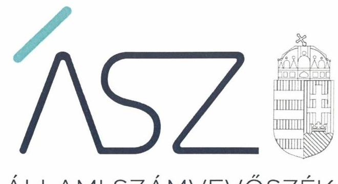

ÁLLAMI SZÁMVEVŐSZÉK

# JELENTÉS 

## Vélemény a 2022. évi költségvetésről

Vélemény Magyarország 2022. évi központi költségvetéséről szóló törvényjavaslatról
2021.

$$
T / 16118 / 1
$$

21053
www.asz.hu

---

ÁLLAMI SZÁMVEVŐSZÉK

# JELENTÉS 

## Vélemény a 2022. évi költségvetésről

Vélemény Magyarország 2022. évi központi költségvetéséről szóló törvényjavaslatról
2021. 01 hó 4 nap
$\mathrm{T} / 16118 / 1$
21053
www.asz.hu

---

|  | AZ ELLENŐRZÉST FELÜGYELTE: |
| :--: | :--: |
|  | MARTUS BETTINA SZANDRA felügyeletivezető |
|  | AZ ELLENŐRZÉST VEZETTE ÉS A VÉGREHAJTÁSÁÉRT FELELŐS: |
|  | BERTALAN RUDOLF GYULA ellenőrzésvezető |
|  | A PROGRAM ÖSSZEÁLLÍTÁSÁÉRT FELELŐS: |
|  | DR. FELFÖLDI IZABELLA projektvezető |
|  | A TÉMÁHOZ KAPCSOLÓDÓ KORÁBBISZÁMVEVŐSZÉKI JELENTÉSEK: |
| - címe: | Vélemény Magyarország 2021. évi központi |
| - sorszáma: | költségvetéséről szóló törvényjavaslatról   20102 |
| - címe: | Vélemény Magyarország 2020. évi központi |
| - sorszáma: | költségvetéséről szóló törvényjavaslatról   19097 |
| J | IKTATÓSZÁM: EL-3185-248/2021 |
|  | TÉMASZÁM: 2571 |
|  | ELLENŐRZÉS-AZONOSÍTÓ SZÁM: V0914 |

---

# TARTALOMJEGYZÉK 

- ÖSSZEGZÉS ..... 5
- A VÉLEMÉNYADÁS CÉLJA ..... 8
- A VÉLEMÉNYADÁS TERÜLETE ..... 9
- A VÉLEMÉNYADÁS HÁTTERE, INDOKOLTSÁGA ..... 10
- A VÉLEMÉNYADÁS LÉNYEGES KÉRDÉSKÖREI ..... 11
- A VÉLEMÉNYADÁS HATÓKÖRE ÉS MÓDSZEREI. ..... 12
- ÁSZ VÉLEMÉNYEK ..... 14
MELLÉKLETEK. ..... 43
I. sz. melléklet: Értelmező szótár ..... 43
II. sz. melléklet: A 2022. évi központi költségvetésről szóló törvényjavaslat részben megalapozott, nem megalapozott és kockázatos bevételi, valamint kiadási előirányzatai. ..... 45
III. sz. melléklet: A központi alrendszer azon előirányzatai, melyek teljesülése módosítás nélkül eltérhet az előirányzattól ..... 47
- RÖVIDÍTÉSEK JEGYZÉKE ..... 49

---

.

---

# ÖSSZEGZÉS 

A 2022. évi központi költségvetésről szóló törvényjavaslat tervezése az Alaptörvényben, az Államháztartásról szóló törvényben, és a Magyarország gazdasági stabilitásáról szóló törvényben foglaltak, valamint a Tervezési tájékoztatóban megfogalmazott követelmények betartásával történt. A törvényjavaslat és a Konvergencia Program között az összhang biztositott. A költségvetési törvényjavaslat megalapozott, bevételi elöirányzatai teljesíthetőek, kiadási előirányzatai elegendőek a közfeladatok ellátására. Kockázatként a társasági adóbevétel alulteljesülése azonosítható. Az államadósság-mutató csökkentésének alkotmányos kötelezettsége teljesül.

## A véleményadás társadalmi indokoltsága

A véleményadás keretében az Állami Számvevőszékről szóló 2011. évi LXVI. törvény 5. § (1) bekezdése alapján az Állami Számvevőszék támogatja az Országgyűlést a költségvetési törvényjavaslatról való megalapozott döntéshozatalban. Ezáltal hozzájárul ahhoz, hogy az Országgyűlés a jogszabályok által előírt követelményeket teljesítő költségvetési törvényt fogadhasson el.

A véleményadás keretében az Állami Számvevőszék rámutat a 2022. évi költségvetésről szóló törvényjavaslatban azonosított kockázatokra, amelyek kezelése hatékonyan és időben megtörténhet az Országgyűlés által. A véleményadás elsősorban az Országgyűlési vitában véleményt formálókat támogatja, de a költségvetés tervezéséért felelős intézményeket és szervezeteket, illetve a költségvetési szerveket is a megalapozott jövőbeli költségvetési tervek elkészítésében.

## Értékelés, következtetések

A 2022. évi központi költségvetésről szóló törvényjavaslat elkészítése során a tervezést végző szervezetek a jogszabályi előírásokat betartották. A törvényjavaslat szerkezete összhangban van a jogszabályi előírásokkal, ezáltal teljesül az átlátható költségvetési tervezés követelménye.

Magyarország gazdasági teljesítményének volumene 2020-ban 5\%-kal esett vissza a 2019. évhez képest. A 2020. évi megtorpanást követően a prognózisok mindegyike növekedést vetít előre a 2021. és 2022. évekre. Az Európai Bizottság előrejelzése szerint 2022-ben 5\%-os GDP növekedés várható, míg az infláció 2,9\% lesz. Az IMF 2021. áprilisában ugyanezen mutatók esetében 4,9\% és 3,0\%-kal számol. A Századvég Gazdaságkutató Zrt. 2021 márciusban a GDP növekedésre 5,1\%-ot, az inflációra 3,2\%-ot prognosztizált. A Magyar Nemzeti Bank márciusi inflációs jelentése szerint 5-6\% közötti GDP növekedés várható, míg az infláció mértéke 2,9-3,0\% között fog mozogni. A 2022. évi költésgvetési törvényjavaslat 2022-re 5,2\%-os gazdasági növekedéssel, 3,0\%-os inflációval, 5,9\%-os GDP-arányoohiánycéllal, valamint a GDP 0,4\%-át meghaladó biztonsági tartalékkal számol. Az Állami Számvevőszék annak feltételezésével végzi a törvényjavaslat értékelését, hogy a kormányzat által meghatározott makrogazdasági prognózisok teljesülnek.

A 2022. évi költségvetési törvényjavaslatban a makrogazdasági folyamatoktól függő bevételi és kiadási előirányzatokat a 2021-2025. évekre kiterjedő Konvergencia Programban rögzített gazdasági előrejelzésekkel összhangban határozták meg.

A 2022. évi központi költségvetésről szóló törvényjavaslat az államháztartás központi alrendszerének kiadási főösszegét 28 505,2 Mrd Ft-ban, bevételi főösszegét 25 352,5 Mrd Ft-ban, hiányát 3152,7 Mrd Ft-ban állapítja meg, amely a hazai felhalmozási költségvetés 2514,8 Mrd Ft-os hiányából és az európai uniós fejlesztési költségvetés 637,9 Mrd Ft-os hiányából tevődik össze. A működési költségvetés egyenlege a korábbi évekhez hasonlóan a 2022. évi költségvetésben is nulla. A törvényjavaslat indoklása számszerűen bemutatja, hogy a kormányzati szektor Európai

---

Unió módszertana szerint számított hiánya 3325,3 Mrd Ft, amely a 2022. évre tervezett nominális GDP 5,9\%-a. A kormányzati szektor - európai uniós módszertan szerint számított - GDP 3,0\%-át meghaladó hiányát, az európai uniós szabályok előreláthatóan a 2022. évre vonatkozóan is lehetővé teszik.

A 2022. évi központi költségvetésről szóló törvényjavaslatban, összhangban a jogszabályi előírásokkal, meghatározták a költségvetési év utolsó napjára a GDP arányában tervezett államadósság-mutató nagyságát, amely megegyezik az Európai Unió által meghatározott módszertan szerinti államadósság-mutatóval. Az államadósság-mutató 2021. év végihez viszonyított 0,6 százalékpontos csökkenése megfelel az Alaptörvényben meghatározottállamadósság-szabálynak és a Magyarország gazdasági stabilitásáról szóló törvényben foglalt előírásoknak. Számítások szerint az államadósság-szabály akkor nem teljesülne, ha az államadósság - a tervezett GDP növekedés mellett - további, 262,1 Mrd Ft-ot meghaladó mértékben növekedne, vagy a nominális GDP növekedési üteme - a tervezett államadósság mellett $-0,7 \%$-ot meghaladó mértékben alacsonyabb lenne a tervezett értéknél.

A Magyarország 2022. évi központi költségvetéséről szóló törvényjavaslat meghatározó bevételi előirányzatainak - összesen 178 db előirányzat - 98,3\%-a megalapozott, 1,7\%-a részben megalapozott. A meghatározó bevételi előirányzatok 0,4\%-ának teljesülése kockázatos. Az ellenőrzés során a részben megalapozottnak minősített bevételi előirányzatok összege 401,3 Mrd Ft, a kockázat összege 98,0 Mrd Ft, amely a társasági adóhoz kapcsolható. A közvetlen bevételi előirányzatok megalapozottak és teljesíthetőek a Társasági adó, a Tárgyévet megelőző években teljesített kiadások uniós bevétele, és az Egyéb programok 2021-2027 előirányzata kivételével, amelyek részben meglapozottak. A társasági adó bevétel kisebb hányadban alulteljesülhet.

A meghatározó kiadási előirányzatok ( 77 db ) 98,9\%-a megalapozott, 1,1\%-a részben meglapozott, a közfeladat ellátása tekintetében kockázatot nem hordoznak. A részben megalapozott kiadási előirányzatok összege 279,5 Mrd Ft, melyben nincs kockázatos előirányzat.

A költségvetés hiányának megfelelő szinten tartása szempontjából kockázatot hordoz, hogy a 2022. évi kiadási előirányzatok főösszegéhez viszonyítva 45,5\%-os az aránya azon előirányzatoknak, amelyek teljesülése módosítás nélkül eltérhet az előirányzattól. A felülről nyitott előirányzatokból a részben megalapozott előirányzatok összege 113,8 Mrd Ft, mely a kiadási főösszeg 0,4\%-át teszik ki.

A törvényjavaslatban a központi tartalék előirányzatok - a Rendkívüli kormányzati intézkedések, a Gazdaság-újraindítási programok és a Járvány Elleni Védekezés Központi Tartaléka - összege 233,0 Mrd Ft, mely az előző évi előirányzathoz képest 10\%-ot meghaladó mértékben növekedett. További tartalékként kötött célú felha sználásra került megtervezésre - a Pénzügyminisztérium fejezeten belül - a Céltartalékok előirányzata, valamint a Gazdaság-újraindítási Alap és a Külgazdasági és Külügyminisztérium fejezeten belül összesen további 559,0 Mrd Ft összegben jelentenek tartalékot a Beruházási Előkészítési Alap és a Beruházási Alap, valamint a Brexit Alkalmazkodási Tartalék előirányzatok. Az Alapokon belül alapvetően két kiadási csoport található: a funkcionálisan determinált kiadások, mint például a 13. havi nyugdíj, illetve az egészségügyi dolgozók bérének megemelése, amely kiadások a társadalom jólétét, egyúttal a fogyasztás bővítését szolgálják. Ugyanakkor a kiadások másik csoportja az, amely a gazdaság felpörgetését célozza, illetve amelyre a kormánynak nagyobb döntési befolyása van, ilyen kiadások például a beruházási előirányzatok.

A 2021. évi Gazdaság-újraindítási Akciótervvel összefüggő változás, hogy a Gazdaságvédelmi Alap megnevezése Gazdaság-újraindítási Alapra módosult. A törvényjavaslat alapján a fejezet szerkezeti felépítése a 2021. évi központi költségvetési törvényhez képest nem változott. A Gazdaság-újraindítási Alap kiadási előirányzatainak tervezése kettő előirányzat kivételével - megalapozott.

Az Egészségbiztosítási és Járvány Elleni Védekezési Alap a 2021. évben kialakult szerkezetnek megfelelően, egy alapban tartalmazza a járvány elleni védekezéshez, illetve az egészségügyi ellátórendszer múködtetéséhez szükséges forrásokat és kiadásokat. A Nyugdíjbiztosítási Alap kiadásai tartalmazzák többek között a 2021. évtől kezdődően fokozatosan visszavezetésre kerülő 13. havi nyugdíjat fél havi összegben. Az Egészségbiztosítási és Járvány Elleni Védekezési Alap, valamint a Nyugdíjbiztosítási Alap bevételi és kiadási előirányzatai megalapozottak.

A 2022. évi központi költségvetés tervezésével összefüggésben makrogazdasági bizonytalanságok érzékelhetők. Számolni kell azzal, hogy a koronavírus-járvány esetleges további hullámai hatással lesznek hazánk 2022. évi központi költségvetésének végrehajthatóságára. A járvány elleni védekezés költségeinek biztosítása mellett, a gazdaság élénkítését, újraindítását biztosító intézkedésekre is szükség van. A prognózisok teljesülését több tényező - elsősorban a világgazdaság és a hazai gazdaság járványhelyzetet követő újraindításának sebessége - befolyásolja, amely miatt a reziliens (rugalmas) költségvetés megléte elengedhetetlen.

---

A költségvetési hiány megfelelő szinten tartása és az elkövetkezendő években annak 3\%-hoz közelítő pályára állítása jelentős versenyelőnyt eredményezhet Magyarország számára a nemzetközi gazdasági környezetben. Erre elsősorban az adna lehetőséget, ha a magánszféra beruházásainak dinamikus bővülése esetén a kormányzat mérsékelné az állami beruházások arányát. Ennek támogatása céljából az Állami Számvevőszék értékelte a Gazdaság-újraindítási Alapból finanszírozni tervezett, egyes állami beruházások területét áttekintve, hogy a beruházások tényleges lefutása alapján, illetve a folyamatok kulcspontjainak kockázataira tekintettel, a beruházások egyedi mérlegelést követően átütemezhetőek-e. Egyes beruházások a készültségi fokuktól függően, a vállalt kötelezettségekre tekintettel halaszthatóak, így a kiadások csökkenthetők, kedvező hatást gyakorolva ezzel a költségvetési hiány alakulására.

A tartalékokkal kapcsolatban fontos megjegyezni, hogy ezek olyan forrásokat jelentenek, amelyek a reálisan számbavehető kockázatok hatásaira nyújtanak fedezetet. Az elmúlt évben az eddigi kockázatok mellett olyan makrogazdasági bizonytalanságok következtek be, amelyek a kormányzati kiadások növekedésére is hatással voltak. A járvány miatti gazdasági visszaesés időszakában különösen fontos, hogy a gazdaság, illetve a költségvetés reziliens legyen, azaz, hogy a makrogazdasági feltételek alakulásához rugalmasan alkalmazkodjon. Tekintettel arra, hogy a 2022. évi költségvetési törvényjavaslat a jelenlegi makrogazdasági prognózisokra épül és az előirányzatok meghatározásánál az 5,2\%-os GDP növekedést vették alapul, ezért kiemelt szempont, hogy a 2022. évi költségvetés végrehajtását folyamatos monitoring, azaz irányított menedzsment kísérje. Az erős kormányzási képességre a folyamatos bizonytalanságok miatt most minden eddiginél nagyobb szükség van.

Az Állami Számvevőszék elemzése a 2019. évi költségvetési folyamatok makrogazdasági összefüggéséről a zárszámadás ellenőrzése kapcsán értékelte, hogy Magyarország Kormánya mára 2019. évben is folya matosan figyelemmel kísérte a költségvetés végrehajtását, így lehetőség nyílt arra, hogy a Kormány többletkiadásokról döntsön. Hasonló tapasztalat mondható el a 2018. évről is, amelyre az Elemzés a 2018. évi költségvetési folyamatok makrogazdasági összefüggéseiről a zárszámadás ellenőrzése kapcsán című elemzés mutat rá. A folyamatos monitoring végrehajtásához eredményességi kritériumok meghatározása szükséges, amelyek alapján értékelhetőek a teljesülések.

A reziliens költségvetés a finanszírozás terheit enyhítheti. Tekintettel arra, hogy a tartalékok inkább az előre kiszámolható kockázatok hatásaira nyújtanak fedezetet, így szükséges a járvány egy esetleges következő hullámánál a felülről nyitott előirányzatok teljesítésére, illetve a beruházások szabályozására nagyobb hangsúlyt fektetni, mivel ezek nagy hányadot képviselnek a költségvetésben, ugyanakkor ezek növekedési üteme a makrogazdasági pálya alakulásához igazítható.

---

# A VÉLEMÉNYADÁS CÉLJA 

A VÉLEMÉNYADÁS CÉLJA annak értékelése volt, hogy a központi költségvetési törvényjavaslat összeállítása megfelel-e a jogszabályi előírásoknak, a törvényjavaslat bevételi és kiadási előirányzatait, valamint a makrogazdasági előrejelzéseket is figyelembe véve tervezték-e meg; biztosították-e a tervezésnél alkalmazott módszerek, háttérszámítások, hatás-tanulmányok, valamint az állami szabályozó eszközök javasolt módosításai a törvényjavaslat megalapozottságát. A véleményadás kiterjedt továbbá arra is, hogy teljesültek-e a Tervezési Tájékoztatóban ${ }^{1}$ megfogalmazott követelmények, az Alaptörvényben ${ }^{2}$ és a Magyarország gazdasági stabilitásáról szóló törvényben foglaltak alapján érvényesül-e az államadósságszabály, biztosított-e az összhang a törvényjavaslat és a kormányzati programnak részét képezőtervek között; a tervezett előirányzatok tartalmazzák-e a közfeladatok ellátáshoz szükséges kiadásokat, számításba vették-e az EU ${ }^{3}$ tagság pénzügyi, gazdasági hatásait.

---

# A VÉLEMÉNYADÁS TERÜLETE 

A VÉLEMÉNYADÁS során az Állami Számvevőszék azt értékelte, hogy a központi költségvetésről szóló törvényjavaslat összeállítása szabályszerűen történt-e; Magyarország 2022. évi központi költségvetéséről szóló törvényjavaslat bevételi és kiadási előirányzatai keretszámainak megtervezése szabályszerű volt-e, a tervezett előirányzatok megalapozottak, illetve alátámasztottak-e, a bevételi előirányzatok teljesíthetők-e.

Az Állami Számvevőszék azt is értékelte, hogy az Alaptörvényben és a Magyarország gazdasági stabilitásáról szóló törvényben foglalt államadósság-szabály érvényesül-e.

---

# A VÉLEMÉNYADÁS HÁTTERE, INDOKOLTSÁGA 

Az Állami Számvevőszék törvényi kötelezettségének teljesítésével véleményezi a költségvetésről szóló törvényjavaslatot rámutatva annak kockázataira. Ezáltal támogatja az országgyűlési képviselőket a jogszabályi követelményeket teljesítő költségvetési törvény elfogadásában.

Az ÁSZ tv. ${ }^{4}$ 5. § (13) bekezdése alapján az ÁSZ ${ }^{5}$ elemzéseket és tanulmányokat készít, ezek rendelkezésre bocsátásával segíti a Költségvetési Tanácsot feladatai ellátásában. Az Állami Számvevőszék a 2022. évi központi költségvetés véleményezéséhez kapcsolódó elemzésekben véleményt nyilvánít a 2022. évi költségvetésről szóló törvényjavaslatról, az államadó-ság-mutató kidolgozására vonatkozó eljárásokról, a tervezett államadósság összegét megalapozó számításokról, azok alátámasztottságáról, valamint a 2022. évi költségvetésről szóló törvényjavaslat parlamenti zárószavazását megelőzően az Alaptörvényben és a Magyarország gazdasági stabilitásról szóló törvényben rögzített államadósság-szabály érvényesüléséről, vagyis arról, hogy a törvényjavaslat elfogadásához szükséges feltételek teljesültek-e. Az ÁSZ által a KT részére készített elemzések hozzájárulnak az KT megalapozott állásfoglalásának kialakításához, a törvényalkotói munka támogatásához.

A 2022. évi költségvetési tervezés szempontjából meghatározó körülmény a koronavírus-járvány, melynek következményei megváltoztatták a globális és a magyar gazdaság 2021. évi kilátásait. A makrogazdaság bizonytalanságai felértékelik az Állami Számvevőszék véleményalkotását.

---

# A VÉLEMÉNYADÁS LÉNYEGES KÉRDÉSKÖREI 

1. A központi költségvetésről szóló törvényjavaslat összeállítása a jogszabályi előírásoknak megfelelően történt-e?
2. A Magyarország 2022. évi központi költségvetéséről szóló törvényjavaslatában foglalt bevételi és kiadási előirányzatok meg-alapozottak-e és a bevételi előirányzatok teljesíthetőek-e?

---

# A VÉLEMÉNYADÁS HATÓKÖRE ÉS MÓDSZEREI 

## A véleményadás típusa

Értékelés.

## A véleményadással érintett időszak

A 2022. év.

## A véleményadás tárgya

A 2022. évi központi költségvetésről szóló törvényjavaslat összeállításának szabályszerűsége, a tervezés megalapozottsága, az előirányzatok megalapozottsága, alátámasztottsága, a bevételi előirányzatok teljesíthetősége, a hiányra vonatkozó törvényi előírások és az államadósság-szabály érvényesülése.

## A véleményadásban érintett szervezetek

Pénzügyminisztérium, Belügyminisztérium, Emberi Erőforrások Minisztériuma, Agrárminisztérium, Honvédelmi Minisztérium, Igazságügyi Minisztérium, Külgazdasági és Külügyminisztérium, Miniszterelnökség, Innovációs és Technológiai Minisztérium, nemzeti vagyon kezeléséért felelős tárca nélküli miniszter, családokért felelős tárca nélküli miniszter, Miniszterelnöki Kabinetiroda, Miniszterelnöki Kormányiroda, Nemzeti Adó- és Vámhivatal, Nemzeti Egészségbiztosítási Alapkezelő, Államadósság Kezelő Központ Zrt., Magyar Államkincstár.

## A véleményadás jogalapja

Az ÁSZ tv. 1. § (3), 5. § (1) bekezdéseiben foglaltak.

## A véleményadás módszerei

Az ÁSZ a makrogazdasági mutatók alakulásától függő bevételi és kiadási előirányzatok megalapozottságát annak alapján értékeli, hogy azok összhangban vannak-e a makrogazdasági prognózisban foglaltakkal. Az ÁSZ a törvényjavaslat részét képező makrogazdasági prognózis megbízhatóságát nem minősíti.

---

Az ÁSZ a törvényjavaslatot megalapozó makrogazdasági prognózist megfelelő alapnaktekintia 2022. évi költségvetés tervezéséhez. Következésképpen a bevételi előirányzatok teljesülését azon feltételezés mellett értékeli, hogy a gazdasági folyamatok tényleges alakulása a prognózisban előre jelzetthez közeli lesz.

Az ÁSZ a véleményadást a program kérdései, a véleményadással érintett időszakban hatályos jogszabályok és az irányadó ÁSZ módszertan (Módszertani útmutató a Magyarország központi költségvetéséről szóló törvényjavaslat véleményezését megalapozó ellenőrzéshez) figyelembevételével végezte.

A véleményadási kérdések megválaszolásához szükséges bizonyítékok megszerzése az adatszolgáltatásra kötelezett szervezetek által rendelkezésre bocsátott dokumentumokra, adatokra alapozva megfigyelés, szemle (szemrevételezés), kérdésfeltevés (információkérés), valamint elemző eljárás útján történt. A bizonyítékként felhasználható adatforrások közé tartoztak egyrészt a program részletes szempontjainál felsorolt adatforrások, másrészt minden egyéb - a vélemény kialakítása folyamán feltárt, a véleményadás szempontjából információt tartalmazó - dokumentum.

A központi költségvetésről szóló törvényjavaslatban szereplő előirányzatok esetében a véleményadás a bevételi főösszeg 91,2\%-ára, illetve a kiadási főösszeg 87,9\%-ára terjedt ki.

A véleményadáshoz az adatszolgáltatásra kötelezett szervezetek a tanúsítványok és monitoring táblázatok kitöltésével, valamint az Állami Számvevőszék által kért dokumentumok rendelkezésre bocsátásával szolgáltattak adatokat.

Az egyes központi állami beruházások átütemezhetőségét a költségvetés rugalmasságára tekintettel, a beruházási folyamatok kulcspontjainak kockázataira, a készültségi fokuktól függően vállalt kötelezettségekre tekintettel értékelte az ÁSZ.

A véleményadás lefolytatása során az ÁSZ figyelembe vette az Európai Bizottság részére a Kormány által benyújtott Magyarország 2021-2025. évekre vonatkozó Konvergencia Programot.

Az ÁSZ vélemény a 2021. május 10. napjáig benyújtott törvényjavaslatokat és módosításokat vette figyelembe.

---

# 1. A központi költségvetésről szóló törvényjavaslat összeállítása a jogszabályi előírásoknak megfelelően történt-e? 

Összegző vélemény

1.1. számú vélemény

A 2022. évi Kvtv. javaslat ${ }^{6}$ összeállítása a jogszabályi előírásoknak megfelelően történt, az államadósság alakulásával kapcsolatos jogszabályi előírások teljesülnek.

A 2022. évi Kvtv. javaslat előkészítésének és összeállításának folyamata szabályszerű volt, a fejezetet irányító szervek szabályszerűen hajtották végre a tervezési feladatokat, a törvényjavaslat összeállítása megfelel a jogszabályi előírásoknak.

A 2022. évi Kvtv. javaslat szerkezeti felépítése az Áht. ${ }^{7}$ előírásai szerint került kialakításra.

Az államháztartásért felelős miniszter gondoskodott a 2022. évi Kvtv. javaslat összeállításához szükséges feltételekről és az érvényesítendő követelményekről szóló Tervezési tájékoztató összeállításáról és biztosította annak nyilvános elérhetőségét.

A 2022. évi Kvtv. javaslatban az előirányzatok összege hazai működési, felhalmozási és uniós fejlesztési kiadások és bevételek szerinti bontásban is rendelkezésre áll. Az Áht.-ben foglaltaknak megfelelően a költségvetési szervek a fejezeteken belül címet alkotnak, a IX., XLI., XLII., XLIII. és XLIV. fejezetek kizárólag központi kezelésű előirányzatokat tartalmaznak.

A 2022. évi Kvtv. javaslat általános, illetve részletes indoklása tartalmazza a Kormány gazdaságpolitikáját, az államháztartás céljait és kereteit, Magyarország és az Európai Unió költségvetési kapcsolatait, az államháztartás központi alrendszere hiányának finanszírozását, az adósság kezelését és alakulását, a strukturális egyenlegre vonatkozó tervezett mértékeket és azok indokait, valamint a központi költségvetés bruttó adósságának, a Gst. ${ }^{8}$ szerint számított államadósság-mutató alakulását a GDP ${ }^{9} \%$-ában.

A fejezetet irányító szervek az ágazati jogszabályok vonatkozó rendelkezései, valamint az államháztartásért felelős miniszter által a Tervezési tájékoztatóban közzétett szempontok figyelembevételével jártak el, a tervezési feladatokat szabályszerűen hajtották végre.

A fejezetet irányító szervek meghatározták a fejezetbe sorolt költségvetési szervek, központi kezelésű előirányzatok, fejezeti kezelésű előirányzatok tervezett bevételi és kiadási előirányzatainak összegeit a lebontott tervszámok szerkezeti változásokkal és szintre hozásokkal módosított öszszegeként. A fejezetet irányító szervek felülvizsgálták, hogy az Ávr. ${ }^{10}$-ben foglalt követelmények, szempontok érvényesítése megtörtént-e a bevételek és kiadások tervszámainak kidolgozásáért a felelősök által.

---

### 1.2. számú vélemény

Az államháztartásért felelős miniszterrel a tervezett bevételeket és kiadásokat, valamint az azokhoz kapcsolódó javaslatokat - az előzetes adatszolgáltatásokat követően - egyeztették. Az egyeztetés után a tervezett bevételeket és kiadásokat a fejezetet irányító szervek véglegezték, az előirányzatokat rögzítették a KAR ${ }^{11}$-ban.

A 2022. évi Kvtv. javaslat a Vélemény elkészítéséig a fejezeti indoklásokat még nem tartalmazta.

A 2022. évi Kvtv. és az aktuális konvergencia program közötti összhang biztosított. Az államadósság-szabállyal kapcsolatos, a Gst.ben meghatározott előírásokat a veszélyhelyzet ideje alatt - a Kormány veszélyhelyzet alatt hozott rendeletében meghatározottak alapján - nem kell alkalmazni.

Magyarország 2021-2025. évekre vonatkozó Konvergencia Programját ${ }^{12}$ a Kormány elkészítette és közzétette 2021. április 30-ig. A 2022. évi Kvtv. javaslatban szereplő makrogazdasági mutatószámok - az államadósság-mutató 2022. december 31-ére tervezett mértéke (a GDP \%-ában) 79,3\%; a Maastrichti egyenleg (a kormányzati szektor ESA ${ }^{13}$ egyenlege) a GDP \%ában 5,9\% - összhangban vannak a 2021-2025. évekre vonatkozó Konvergencia Programban foglaltakkal. A 2022. évre vonatkozóan a tervezésnél, a Konvergencia Programban foglaltakkal megegyezően, 5,2\%-os GDP-bővülést és 3,0\%-os inflációt vettek figyelembe.

A 2022. évi Kvtv. javaslat az államháztartás központi alrendszerének hiányát 3152,7 Mrd Ft-ban állapítja meg, amely a hazai felhalmozási költségvetés 2514,8 Mrd Ft-os hiányából és az európai uniós fejlesztési költségvetés 637,9 Mrd Ft-os hiányából tevődik össze. A működési költségvetés egyenlege a korábbi évekhez hasonlóan a 2022. évi költségvetésben is nulla.

A 2022. évi Kvtv. javaslatban a Kormány az államháztartás egészének pénzforgalmi egyenlegére 5,9\%-os GDP arányos hiányt (3309,1 Mrd Ft) tervezett, melyből - az elkülönített állami pénzalapok 125,4 Mrd Ft-os (0,2\%) többlete mellett - 3131,3 Mrd Ft-ot (5,6\%) tesz ki a központi költségvetés hiánya, 146,8 Mrd Ft-ot (0,3\%) az Egészségbiztosítási Alap hiánya, továbbá 156,4 Mrd Ft-ot (0,3\%) a helyi önkormányzatok hiánya. A Nyugdíjbiztosítási Alap bevételei és kiadásai egymással egyező mértékben kerültek meghatározásra, pénzforgalmi egyenlegük nulla.

A 2022. évi Kvtv. javaslatban a kormányzati szektor uniós módszertan szerint számított hiánya (ESA egyenleg) 3325,3 Mrd Ft, amely a 2022. évre tervezett nominális GDP 5,9\%-a. A kormányzati szektor 3,0\%-ot meghaladó hiánya vonatkozásában az EU-s kezdeményezések azt vetítik előre, hogy az általános mentesítési rendelkezés alkalmazása 2022-ben is érvényben marad. A hiány tervezett összegére vonatkozóan a Gst. 3/A. § (2) bekezdés b) pontjának előírását - mely szerint a kormányzati szektor egyenlegének hiánya ne haladja meg a GDP 3\%-át-a 27/2021. (I.29.) Korm. rendelet ${ }^{14}$ szerinti veszélyhelyzet ideje alatt nem kell alkalmazni, figyelemmel a Kormány - Alaptörvény 53. cikk (2) bekezdésében a veszélyhelyzet, mint különleges jogrend idejére biztosított - eredeti jogalkotói hatáskörében hozott 196/2021. (VI. 28.) Korm. rendelete ${ }^{15}$ 1. §-ában foglaltakra.

A Kormány az Áht. 22. § (3) bekezdés d) pontja előírását betartva a 2022. évi Kvtv. javaslat indokolásában ismertette a kormányzati szektor Gst. 1. § e) pontja szerinti egyenlegét, valamint a Gst. 1. § e) pontja szerinti

---

# 1.3. számú vélemény 

strukturális egyenleget. A kormányzati szektor egyenlegének mértékére vonatkozóan a Gst. 3/A § (2) bekezdés a) pontjának előírását - mely szerint a kormányzati szektor egyenlege meghatározása összhangban legyen a középtávú költségvetési cél elérésével - a 27/2021. (I.29.) Korm. rendelet szerinti veszélyhelyzet ideje alatt nem kell alkalmazni, figyelemmel a Kormány - Alaptörvény 53. cikk (2) bekezdésében a veszélyhelyzet, mint különleges jogrend idejére biztosított - eredeti jogalkotói hatáskörében hozott 196/2021. (VI. 28.) Korm. rendelete 1. §-ában foglaltakra.

A 2022. évi központi költségvetésről szóló törvényjavaslat alapján az államadósság alakulásával kapcsolatos jogszabályi előírások teljesülnek. A 2022. évi Kvtv. javaslat az államadósság-mutató 2021. év végihez viszonyított 0,6 százalékpontos csökkenését tartalmazza.

A 2022. évi Kvtv. javaslatban, összhangban a Gst. 4. § (1) bekezdésében foglaltakkal, meghatározták a költségvetési év utolsó napjára tervezett ál-lamadósság-mutató mértékét (79,3\% a GDP arányában), amely a Gst. előírásának megfelelően megegyezik az Európai Unió által meghatározott módszertan szerinti államadósság-mutatóval. A mutató számításakor a Gst. 2. § a) pontja szerinti államadósságot a Gst. 1. § f) pontjában meghatározott módon számították ki, annak 2022. év végére tervezett összege 44 713,7 Mrd Ft. A konszolidált államadósság 2021. december 31-ére várható összege 41 223,1 Mrd Ft (a GDP arányában 79,9\%). A tervezett állam-adósság-mutató alapján a 2022. évben - a GDP arányosállamadósság 0,6 százalékpontos csökkenése mellett - az államadósság 8,5\%-os növekedésével számol a Kormány.

A 2022. évi Kvtv. javaslat az államadósság-mutató 2021. év végihez viszonyított 0,6 százalékpontos csökkenését tartalmazza, mely megfelel az Alaptörvény 36. cikk (5) bekezdésében előírt államadósság-szabálynak, és a Gst. 4. § (2a) bekezdése rendelkezésének, amely azt írja elő, hogy az ál-lamadósság-mutató éves csökkenése, az államadósság mértékére vonatkozó európai uniós szabályok érvényesítése mellett legalább 0,1 százalékpontot érjen el.

A 2022. évi Kvtv. javaslatban foglaltak szerint a 2022. év végére várható 44 713,7 Mrd Ft államadósságból a központi költségvetés bruttó adóssága névértéken 42 678,5 Mrd Ft-ot ( $95,4 \%$-ot), a központi alrendszeren kívüli egyéb tételek összege 2035,2 Mrd Ft-ot (4,6\%-ot) tesz ki.

A 2022. évi Kvtv. javaslat indoklása alapján az önkormányzatok 2022. december 31-ére tervezett konszolidált adóssága 295,0 Mrd Ft, állampapír állománya 190,0 Mrd Ft.

A makrogazdasági prognózistól eltérő változásokat ellensúlyozza az implicit tartalék, amely azt mutatja meg, hogy mekkora mozgásteret tartalmaz az államadósság-mutató összetevőire vonatkozóan a prognózis az államadósság-szabály teljesülése mellett.

---

1. táblázat

|  | AZ ÁLLAMADÓSSÁG-KEZELÉS IMPLICIT TARTALÉKA A 2022. ÉVBEN (MRD FT) |  |  |  |  |  |
| :--: | :--: | :--: | :--: | :--: | :--: | :--: |
|  | 2021. év
várható | 2022. év
tervezett | Maximális államadósság | Minimális nominális GDP | 2022. év
Tervezetthez képest kisebb GDP csökénés | Még megengedett mértékű állam- adósság növekedés |
| Nominális GDP | 51616,9 | 56360,6 | 44975,8 | 56032,2 | $0,7 \%$ | 262,1 |
| Államadósság | 41223,1 | 44713,7 |  |  |  |  |

Fonrás: ÁSZ számitás Magyarország 2022. évi központi költségvetéséről szóló törvényjavaslat adatai alapján
Az államadósság-kezelés implicit tartaléka szűk mozgásteret enged.
Az államadósság-szabály akkor nem teljesülne, ha az államadósság tervezett GDP növekedés mellett - további, 262,1 Mrd Ft-ot meghaladó mértékben növekedne, vagy pedig a nominális GDP növekedési üteme - a tervezett államadósság mellett - 0,7\%-ot meghaladó mértékben alacsonyabb lenne a tervezett értékénél.

# 2. A Magyarország 2022. évi központi költségvetéséről szóló törvényjavaslatában foglalt bevételi és kiadási előirányzatok megalapozottak-e és a bevételi előirányzatok teljesíthetőek-e? 

Összegző vélemény

A Magyarország 2022. évi Kvtv. javaslat meghatározó bevételi előirányzatainak 98,3\%-a megalapozott, 1,7\%-a részben megalapozott. A 0,4\%-ának teljesülése kockázatos. A meghatározó kiadási előirányzatok 98,9\%-a megalapozott, 1,1\%-a részben meglapozott.
2.1. számú vélemény

A közvetlen bevételi előirányzatok megalapozottak és teljesíthetőek a Társasági adó, a Tárgyévet megelőző években teljesített kiadások uniós bevétele, és az Egyéb programok 2021-2027 előirányzata kivételével. A Társasági adó részben megalapozott, alulteljesülése várható, így kockázatos. A Tárgyévet megelőző években teljesített kiadások uniós bevétele, és az Egyéb programok 2021-2027 előirányzata részben megalapozott, de nem minősül kockázatosnak. A fejezetek bevételi előirányzatainak tervezése megfelelő volt.

A 2022. évi Kvtv. javaslatban a Költségvetés közvetlen bevételei és kiadásai fejezet 2022. évre tervezett bevételi előirányzat összege 14 718,8 Mrd Ft, a 2021. évi eredeti előirányzatot (12 749,3 Mrd Ft) 15,4\%-kal a 2020. évi előzetes teljesítést ( 12 787,4 Mrd Ft) 15,1\%-al haladja meg.

A költségvetési közvetlen bevételeit az adó és adójellegú bevételek, az európai uniós programokhoz kapcsolódó bevételek, valamint az Európai Uniót megillető vámbevételekből a tagállamot megillető bevételi rész alkotják.

A Társasági adó 2022. évi tervezett bevételi előirányzata 588,7 Mrd Ft, amely a 2020. évi előzetes teljesítést 182,2 Mrd Ft-tal, a 2021. évi eredeti előirányzatot 50,2 Mrd Ft-tal haladja meg. A PM ${ }^{16}$ adatszolgáltatásában a

---

2021. évi várható társasági adó bevételt 446,7 Mrd Ft összegben szerepelteti, azaz 91,8 Mrd Ft adóbevétel kieséssel számol a 2021. évi eredeti előirányzathoz képest. A 2022. évi bevétel bázis alapon történő tervezése elsősorban a makrogazdasági mutatók kedvező előrejelzésein alapszik. A tervezés során figyelembe vett mutatók hatását nem számszerűsítették, a társasági adó alap-2020. évi várható teljesítéséhez képest - 15,1\%-os emelkedésével számoltak. A társasági adó előirányzat a tervezés során figyelembe vett tényezők alapján számszakilag részben alátámasztott, részben megalapozott, a 2021. évi tendenciák alapján alulteljesülés valószínűsíthető, így teljesülése kockázatot hordoz. A tervezett teljesítési összegtől való elmaradás miatt a kockázat becsült összege 98,0 Mrd Ft.

A Kisadózók tételes adója 2022. évi tervezett bevételi előirányzata 236,8 Mrd Ft, amely a 2020. évi előzetes teljesítést 78,6 Mrd Ft-tal meghaladja, ugyanakkor a 2021. évi eredeti előirányzattól minimálisan (0,6 Mrd Ft-tal) elmarad. Az előirányzat 2022. évi összegét az előző évi tendenciák, a bevétel teljesíthetőségét befolyásoló tényezők (kiadózók évi átlagos létszáma, tevékenységüket szüneteltetők aránya) figyelembevételével tervezték meg. Az előirányzat alátámasztott, teljesíthető, így megalapozott.

Az Általános forgalmi adó 2022. évi tervezett bevételi előirányzata 5444,0 Mrd Ft, a 2020. évi előzetes teljesítést 775,0 Mrd Ft-tal, a 2021. évi eredeti előirányzatot 429,0 Mrd Ft-tal haladja meg. A tervezés 21,3\%-os átlagos adókulccsal számolt folyóáras lakossági vásárolt fogyasztáson alapszik. A bevételek tervezésekor a vásárolt fogyasztáson túl a lakossági beruházásokat, és az egyéb vásárlásokat is számszerűsítették a makrogazdasági prognózisok, az államháztartási szektor kiadásainak (dologi, beruházási) figyelembevételével. Az új építésű lakóingatlanok esetében - a jogszabályi előírásokkal összhangban - 5\%-os adókulccsal kalkuláltak. Az általános forgalmi adó előirányzata alátámasztott, teljesíthető, azaz megalapozott.

A Jövedéki adó 2022. évi tervezett bevételi előirányzata 1296,2 Mrd Ft, amely a 2020. évi előzetes teljesítést 100,2 Mrd Ft-tal, a 2021. évi eredeti előirányzatot 33,1 Mrd Ft-tal haladja meg. A jövedéki adó bevétel tervezése során a makrogazdasági prognózisokat, valamint az egyes termékkörök piacát jellemző trendeket vették figyelembe. Az üzemanyagok és az alkoholtermékek esetében a gazdaság helyreállásának, valamint a lakossági fogyasztás várható növekedésének eredményeként a bevételek emelkedésével számoltak. Ugyanakkor a kőolaj várhatóan magas világpiaci ára miatt az üzemanyagokra vonatkozó alacsonyabb adómértékkel kalkuláltak. A dohánytermékek esetében figyelembe vették az uniós jogharmonizációhoz köthető többlépcsős adómérték emelést. Az előirányzat alátámasztott, teljesíthető, így megalapozott.

A Pénzügyi tranzakciós illeték 2022. évi tervezett bevételi előirányzata 232,5 Mrd Ft, amely a 2020. évi előzetes teljesítést 14,7 Mrd Ft-tal, a 2021. évi eredeti előirányzatot 13,7 Mrd Ft-tal haladja meg. A számítások bázisadatait a 2020. év teljes évi, illetve a 2021. év rendelkezésre álló halmozott bevallási adatok képezték. A piaci szolgáltatások esetében növekedéssel számoltak, a Magyar Államkincstár vonatkozásában úgy kalkuláltak, hogy az illetékalap, illetve az illetékek nem növekednek. A pénzügyi tranzakciós illeték előirányzata alátámasztott, teljesíthető, így megalapozott.

A Személyi jövedelemadó 2022. évi tervezett bevételi előirányzata 2866,5 Mrd Ft, amely a 2020. évi előzetes teljesítést 338,6 Mrd Ft-tal, a

---

2021. évi eredeti előirányzatot 183,0 Mrd Ft-tal haladja meg. A személyi jövedelemadó előirányzatának meghatározása során a bázisadatokat, a 2021. év várható teljesülési adatokat figyelembe vették, és számoltak a 25 év alattiak adóalap kedvezményével, 933,3 Mrd Ft-tal csökkentve az összevont adóalap előirányzatát. A tervezés alapjául a makro-pálya alakulása és a NAV által készített jövedelem-eloszlásokról, magánszemélyhez nem köthető forrásadós tételek alakulásáról szóló kimutatás szolgált. A bevételi előirányzat alátámasztott, teljesíthető, így megalapozott.

A Lakossági illetékek 2022. évi tervezett bevételi előirányzata 198,7 Mrd Ft, a 2020. évi előzetes teljesítéstől 8,5 Mrd Ft-tal, a 2021.évi eredeti előirányzattól 20,0 Mrd Ft-tal alacsonyabb összegben került meghatározásra. A 2022. évi előirányzat tervezésekor a 2020. és 2021. évi adatok alapulvételével és az illetékfizetésre vonatkozó szabályok 2021. évi változásának figyelembevételével alakították ki a lakossági illetékek előirányzatát. Az előirányzat terv számszaki adatokkal és szöveges indoklással alátámasztott. A megalapozásul szolgáló tényezők számbevétele és értékelése alapján az előirányzat az előző évi tendenciákkal és a várható értékkel összhangban van, alátámasztott és teljesíthető, azaz megalapozott.

A Megtett úttal arányos útdíj 2022. évi tervezett bevételi előirányzata 263,0 Mrd Ft, amely a 2020. évi előzetes teljesítést 45,9 Mrd Ft-tal, a 2021. évi eredeti előirányzatot 38,0 Mrd Ft-tal haladja meg. A 2022. évi útdíj bevétel tervezése során a 2021. évi várható bevételt korrigálták a hálózati hatással (új szakaszok díjasítása), éves szinten 3\%-os forgalombővüléssel és a bázisévre (2021) prognosztizált 3,6\% fogyasztói árindexszel számoltak. A számítással alátámasztott előirányzat teljesíthető, így meglapozott.

Az Önkormányzatok szolidaritási hozzájárulása 2022. évi tervezett bevételi előirányzata 129,8 Mrd Ft, amely 71,7 Mrd Ft-tal haladja meg a 2020. évi előzetes teljesítést, ugyanakkor a 2021. évi eredeti előirányzattól 35,7 Mrd Ft-tal elmarad. A teljesíthetőség megítéléséhez bázis adatnak a 2021. évi előirányzat tekinthető, mivel a 2020. évi előírásokhoz képest változtak a hozzájárulás fizetésének feltételei. A 2022. évi előirányzat meghatározása a 2022. évi Kvtv. javaslatban rögzített paraméterek (egy lakosra jutó iparűzési adóerő-képesség, hozzájárulás mértéke a szolidaritási hozzájárulás alapjának százalékában) alkalmazásával történt, alátámasztottés az előző évi tendenciák alapján teljesíthető, így megalapozott.

A Tárgyévet megelőző években teljesített kiadások uniós bevétele (KOP) 2022. évi tervezett bevételi összege 1287,8 Mrd Ft, 135,8 Mrd Ft-tal marad el a 2020. évi előzetes teljesítéstől, és 435,0 Mrd Ft-tal haladja meg a 2021. évi eredeti előirányzatot. Az előirányzat célja az Európai Unió által notifikált nemzeti Kohéziós Operatív Programok megvalósítása kapcsán előző években teljesített költségvetési kiadások uniós forrásokból származó megtérítésének elszámolása. Az előirányzat tervezése során biztosították a tervezett bevételek számszaki megalapozottságát. Az előirányzat alátámasztott, megalapozott.

A Vidékfejlesztési Program (VP) 2022. évi tervezett előirányzata 152,0 Mrd Ft, 37,3 Mrd Ft-tal marad el a 2020. évi előzetes teljesítéstől, és 10,8 Mrd Ft-tal a 2021. évi eredeti előirányzattól. A 2022. évi Kvtv. javaslatban a szerkezeti változásokat figyelembe vették, a jogcímen belüli átcsoportosításokat elvégezték. Az előirányzat jogszabályi alapja a Vidékfejlesztési Program éves fejlesztési keretének megállapításáról szóló 1248/2016.

---

(V.18.) Korm. határozat által biztosított és a tervezési időszakban nem módosult. Az előirányzat megalapozott.

A Tárgyévet megelőző években teljesített kiadások uniós bevétele (MAHOP) 2022. évi tervezett bevételi összege 3,4 Mrd Ft, a 2020. évi előzetes teljesítéstől 1,1 Mrd Ft-tal elmarad, a 2021. évi eredeti előirányzatot 2,0 Mrd Ft-tal meghaladja. Az előirányzat tervezésének alapja a 2021. április 1-jei hatállyal módosított a Magyar Halgazdálkodási Operatív Program éves fejlesztési keretének megállapításáról szóló 1056/2016 (II. 17.) Korm. határozat. Az előirányzat megalapozott.

A Tárgyévet megelőző években teljesített kiadások uniós bevétele (CEF) 2022. évi tervezett bevételi összege 40,8 Mrd Ft, amely 18,6 Mrd Ft-tal kisebb a 2020. évi előzetes teljesítésnél és 40,0 Mrd Ft-tal alacsonyabb öszszegben került meghatározásra a 2021. évi előirányzatnál. A 2022. évi Kvtv. javaslat szerinti összeg a 7 éves uniós programozási időszakra eső, időarányos, évi 41,4 Mrd Ft-os összegéhez képest 0,6 Mrd Ft-tal alacsonyabb, amely az időarányos összeg 98,6\%-a. A bevételek tervezésénél a déli körvasút projektre várható források bevételét ( 9,7 Mrd Ft) is figyelembe vették, azonban erre vonatkozó Kormány határozat a véleményadás időpontjában még nem született. Így az előirányzat részben alátámasztott, mivel a tervezett összegéből 9,7 Mrd Ft döntéssel még nem alátámasztott; teljesíthető, ezért részben megalapozott.

Az Egyéb programok 2022. évi tervezett bevételi összege 13,8 Mrd Ft, a 2020. évi előzetes teljesítést 8,6 Mrd Ft-tal, a 2021.évi eredeti előirányzatot 1,5 Mrd Ft-tal haladja meg. Az előirányzat megállapodással, illetve számításokkal alátámasztott, teljesíthető, megalapozott.

Az Egyéb programok 2021-2027 előirányzat 2022. évi tervezett bevételi összege 5,4 Mrd Ft, a 2021. év eredeti 6,0 Mrd Ft előirányzathoz viszonyítva 0,6 Mrd Ft-tal, 10\%-kal alacsonyabb összegben az óvatos tervezés elvének érvényesítésével került megtervezésre. Az előirányzat célja a 6. cím Uniós programok bevételei más sorain el nem számolt, minden más programból származó uniós forrás bevételének kimutatása. Első alkalommal 2021. évben került a költségvetésben tervezésre. Számításokat tartalmazó dokumentumok hiányában az előirányzat 5,4 Mrd Ft-os összege részben alátámasztottnak minősül, teljesíthető, így részben megalapozott.

A Helyreállítási és Ellenállóképességi Eszköz (RRF) bevételi előirányzat alcím szolgál az RRF keretében megvalósuló NGEU ${ }^{17}$ programok uniós bevételeinek elszámolására. Az előirányzat először a 2022. évben került megtervezésre, tervezett bevételi összege 348,5 Mrd Ft. A tervezés során az óvatosság elvét követve jártak el, bevételként az RRF kiadás 77,4\%-át irányozták elő. Az előirányzat alátámasztott, teljesíthető, így megalapozott.

A Kohéziós Operatív Programok 2021-2027 bevételi előirányzat célja az Európai Unió által notifikált nemzeti Kohéziós Operatív Programok kapcsán előző években teljesített költségvetési kiadások uniós forrásokból származó finanszírozásának elszámolása. A 2022. évi Kvtv. javaslat első ízben tartalmaz ezen a jogcímen eredeti bevételi előirányzatot. A 2022. évre tervezett bevételi előirányzat 499,9 Mrd Ft, összegét a 2021-2027 közötti programozási időszakban rendelkezésre álló kohéziós politikai uniós források nagyságrendje és a gazdaságélénkítési, gazdaság-újraindítási politika alapozza meg. A bevételi előirányzatot a kifizetésekhez kapcsolódó bevételek (332,7 Mrd Ft), az előlegek elszámolásához tartozó bevételek

---

(132,1 Mrd Ft) és az Alapok alapja bevétel (35,1 Mrd Ft) alkotják. EU előlegből származó bevétellel nem számoltak. A bevételi előirányzat tervezése során biztosították a tervezett bevételi előirányzat számszaki alátámasztottságát, teljesíthető, így megalapozott.

A Vámbeszedési költség megtérítése előirányzat 2022. évi tervezett bevételi összege 22,4 Mrd Ft, amely a 2020. évi előzetes teljesítést 6,5 Mrd Ft-tal, a 2021. évi eredeti előirányzatot 6,2 Mrd Ft-tal haladja meg. Az előirányzat az Európai Unió közösségi bevételekből a magyar költségvetésben vámbeszedési költségtérítésként megjelenő, visszatartható összeg. A bázisév és tárgyévi előirányzat között tapasztalható növekedés hátterében elsősorban a Tanács (EU, Euratom) 2020/2053 határozat ${ }^{18}$ hatályba lépése áll, amely a nemzeti költségvetésben maradó összeg arányát 20\%ról 25\%-ra növeli. Az előirányzat jogszabállyal alátámasztott, teljesíthető és megalapozott.

A 2022. évi Kvtv. javaslatban az AM ${ }^{19}$, a BM $^{20}$, a PM, az ITM ${ }^{21}$, a KKM $^{22}$ és az EMMI ${ }^{23}$ fejezetek által tervezett meghatározó bevételi előirányzatok alátámasztottak és megalapozottak.

Az AM fejezet 2022. évi Kvtv. javaslat szerinti bevételi előirányzata 31,7 Mrd Ft, a 2020. évi előzetes teljesítéstől 33,5 Mrd Ft-tal, a 2021. évi eredeti előirányzattól 0,03 Mrd Ft-tal marad el. A fejezet meghatározó bevételi előirányzatainak tervezése a fejezeti és központi kezelésű előirányzatok kezelésének és felhasználásának szabályairól szóló 14/2021. (III. 25.) AM rendelet ${ }^{24} 1$. számú mellékletben foglaltak szerint történt, a jogszabályi előírással alátámasztott bevételek teljesíthetőek.

A BM fejezet 2022. évi Kvtv. javaslat szerinti bevételi előirányzata 32,0 Mrd Ft, a 2020. évi előzetes teljesítéstől 178,3 Mrd Ft-tal kevesebb, a 2021. évi eredeti előirányzatot 3,6 Mrd Ft-tal haladja meg. A bevételek között megtervezték az ellátott közfeladatokkal kapcsolatos, a rendszeresen előforduló, az eszközök hasznosításával összefüggő bevételeket. Elkészítették a költségvetési szervek a bevételi tervek teljesülését befolyásoló közjogi szervezetszabályozó eszközök, szerződések vagy más kötelezettségek módosítására vonatkozó javaslatokat, és azok indokoltságát alátámasztották. Az előirányzat teljesíthető.

Az ITM fejezet 2022. évi Kvtv. javaslat szerinti bevételi előirányzata 153,3 Mrd Ft, a 2020. évi előzetes teljesítéstől 540,0 Mrd Ft-tal, a 2021. évi eredeti előirányzattól 293,5 Mrd Ft-tal kevesebb. A fejezet meghatározó bevételi előirányzatainak tervezése megfelelő volt. Az előirányzatokat számításokkal alátámasztották, a bevételek teljesíthetők és megalapozottak.

Az ITM fejezeten belül az Egyetemek, főiskolák bevételei 2022. évi tervezett előirányzata 28,6 Mrd Ft, mely a 2020. évi előzetes teljesítéstől 457,6 Mrd Ft-tal, a 2021. eredeti előirányzattól 299,0 Mrd Ft-tal kevesebb. Az előirányzat jelentős változását a modellváltó intézmények bevételeinek (irányítószervi támogatás, tandíjak, pályázati bevételek, stb.) kiesése eredményezi. Az előirányzat az állami fenntartásban maradó egyetemekkel, főiskolákkal kapcsolatos bevételeket tartalmazza.

Az ITM fejezet Kibocsátási egységek értékesítéséből számazó bevételek 2022. évi tervezett előirányzata 75,4 Mrd Ft, amely 4,2 Mrd Ft-tal marad el a 2020. évi előzetes teljesítéstől, és 5,1 Mrd Ft-tal haladja meg a 2021. évi eredeti előirányzatot. Az előirányzat azállami tulajdonban lévő európai uniós $\mathrm{CO}_{2}$ kibocsátási, valamint légiközlekedési kibocsátási egységek értékesítéséből származó, várható bevétel összege. A tervezést a 2022. évre

---

várhatóan értékesíthető 5,9 millió egységben meghatározott kvótamenynyiség, az átlagos 35,5 EUR/egység tőzsdei kvótaár, és a 2022. évi Kvtv. javaslatban rögzített 360,9 Ft/EUR árfolyam figyelembevételével végzeték. Az előirányzat számításokkal és dokumentumokkal alátámasztott, teljesíthető, így megalapozott.

Az EMMI fejezet 2022. évi Kvtv. javaslat szerinti bevételi előirányzata 1201,9 Mrd Ft, a 2020. évi előzetes teljesítést 88,2 Mrd Ft-tal, a 2021. évi eredeti előirányzatot 338,0 Mrd Ft-tal haladja meg. Az EMMI meghatározó előirányzatai között lényeges a Gyógyító megelőző ellátás intézzetei 2022. évi tervezett bevételi előirányzat 1048,2 Mrd Ft, amely a 2020. évi előzetes teljesítést 186,3 Mrd Ft-tal, a 2021. évi eredeti előirányzatot 319,3 Mrd Fttal haladja meg. A Gyógyító-megelőző ellátás intézeteinek a múködését alapvetően - az alcím bevételeinek jelentős részét képező - Nemzeti Egészségügyi Alapkezelőtől kapott, teljesítménytől függő támogatás értékű bevétel határozza meg. A növekedést az egyes egészségügyi dolgozók és egészségügyben dolgozók bérnöveléséhez kapcsolódó ágazati bérfejlesztések, továbbá az intézmények által jelzett, szakterület által jóváhagyott (szakmai indok alapján történő) intézményi bevétel változások együttes összege indokolják. Az előirányzat összege dokumentumokkal és számítással alátámasztott teljesíthető, így megalapozott.

# 2.2. számú vélemény 

A költségvetés közvetlen meghatározó kiadási előirányzatai - öt részben megalapozott előirányzat kivételével - megalapozottak, a Babaváró támogatások és A nemzetközi pénzügyi intézményekkel kapcsolatos egyéb kiadások, az Egyéb vegyes kiadások, a Garantiqa Hitelgarancia Zrt. garanciaügyleteiből eredő fizetési kötelezettség, valamint az Agrár-Vállalkozási Hitelgarancia Alapítvány garanciaügyleteiből eredő fizetési kötelezettség előirányzatai részben megalapozottak. A fejezetek által tervezett meghatározó kiadási előirányzatok megalapozottak

A költségvetés közvetlen bevételei és kiadásai fejezet 2022. évi kiadási föösszege 2 173,4 Mrd Ft, amely 18,4\%-kal haladja meg a 2021. évi eredeti kiadási főösszeget. A költségvetés közvetlen kiadási előirányzatai alátámasztottak és megalapozottak öt előirányzat kivételével, amelyek részben megalapozottak.

A Babaváró támogatások 2022. évi Kvtv. javaslat szerinti felülről nyitott kiadási előirányzat 91,5 Mrd Ft, ami 35,2\%-kal magasabb a 2021. évi eredeti előirányzatnál és 136,4\%-kal magasabb a 2020. évi előzetes teljesítésnél. Az előirányzat tervezése becslési elemeket tartalmaz. A Babaváró támogatások előirányzaton a 2021. évben a Babaváró támogatás banki költségtérítése, a Babaváró támogatás tartozások elengedése, és a Babaváró támogatás kamattámogatása összevonásra került. Az előirányzat tervezése tényezőnként (kamattámogatás, tartozások elengedése, banki költségtérítés) történt. Az előirányzat számításokkal részben alátámasztott (12,5 Mrd Ft nem alátámasztott), de elegendő a közfeladat ellátásához, így részben megalapozott.

A nemzetközi pénzügyi intézményekkel kapcsolatos egyéb kiadások felülről nyitott előirányzat összege a 2022. évi Kvtv. javaslat alapján 6,3 Mrd Ft, amely 4,9 Mrd Ft-tal haladja meg a 2021. évi eredeti előirányzatot, amely növekmény (4,9 Mrd Ft) számításokkal, dokumentummal nem

---

alátámasztott. Az előirányzat részben alátámasztott, de elegendő a közfeladat ellátásához, részben megalapozott.

Az Egyéb vegyes kiadások 2022. évi Kvtv. javaslat szerinti felülről nyitott előirányzat 63,3 Mrd Ft, ami több, mint nyolcszorosa a 2021. évi eredeti előirányzatnak és a 2020. évi előzetes teljesítésnek. A jogcímcsoporton kerülnek elszámolásra többek között a kincstári átutalásokhoz kapcsolódó díjak, forgalmi jutalékok, bankközvetítői díjak, postai szolgáltatás díjai, értékpapír számlavezetési díjak. A tervezett előirányzat összegéből számítással, indoklással 54,9 Mrd Ft nem alátámasztott, de az előirányzat összege elegendő a közfeladat ellátásához, így részben megalapozott.

Garantiqa Hitelgarancia Zrt. garanciaügyleteiből eredő fizetési kötelezettség a 2022. évi Kvtv. javaslat szerinti előirányzata 35,0 Mrd Ft, amely 16,7\%-kal magasabb a 2021. évi eredeti előirányzatnál és 25,8 Mrd Ft-tal nagyobb a 2020. évi előzetes teljesítés adatainál. Az Európai Bizottság által a járványhelyzet gazdasági hatásaira figyelemmel meghirdetett Garantiqa Krízis Garanciaprogram, amelynek keretében a 2020. év végéig - legfeljebb hat évre - nyújtott hitelekhez vállalható kezesség. A növekedést indokolja a Garantiqa Krízis Garanciaprogram állománya és a járvány gazdasági hatása következtében feltételezhetően romló viszontgarancia lehívás és beváltási ráta is. Az előirányzat 1170/2020. (IV. 21.) Korm. határozattal ${ }^{25}$ alátámasztott, ugyanakkor összegéből 6,9 Mrd Ft számításokkal nem alátámasztott, az előirányzat felülről nyitott, így a megtervezett összeg elegendő a közfeladat ellátásához, ezért részben megalapozott.

Agrár-Vállalkozási Hitelgarancia Alapítvány garanciaügyleteiből eredő fizetési kötelezettség 2022. évi Kvtv. javaslat szerint 8,0 Mrd Ft, amely 128,6\%-kal magasabb a 2021. évi eredeti előirányzatnál és 5,9 Mrd Ft-tal magasabba 2020. évi előzetes teljesítésnél. A növekedést indokolja a járvány miatt bevezetett, az agárhitelekre is vonatkozó hiteltörlesztési moratórium lejártával várhatóan megnövekvő garanciabeváltási volumen. Az előirányzat 1195/2020. (IV. 30.) Korm. határozattal ${ }^{26}$ alátámasztott. Az előirányzat összegéből 1,1 Mrd Ft számításokkal nem alátámasztott, az előirányzat felülről nyitott, így a megtervezett összeg elegendő a közfeladat ellátására, ezért részben megalapozott.

A Szociálpolitikai menetdíj támogatás 2022. évi Kvtv. javaslatban szereplő felülről nyitott előirányzata 120,0 Mrd Ft, amely a 2021. évi eredeti előirányzattól 12,9\%-kal alacsonyabb, a 2020. évi előzetes teljesítésnél 84,6\%-kal magasabb. A 2022. évi előirányzat tervezése során a 121/2012. (VI. 26.) Kormányrendelet - a szociálpolitikai menetdíj-támogatás megállapításának és igénybevételének szabályairól - 2020. december 1-jétől hatályos módosítása alapján jártak el. Az előirányzat összegében bekövetkezett változást a rendeletben foglalt szerkezeti változás és az egyes, helyközi közlekedési térítési-támogatások változása indokolta. Az előirányzat jogszabállyal alátámasztott, elegendő a közfeladat ellátásához, megalapozott.

A 2022. évi Kvtv. javaslatban az $\mathrm{OGY}^{27}, \mathrm{ME}^{28}$, az AM, a $\mathrm{HM}^{29}$, a BM, a PM az ITM, a KKM az EMMI, a MEKORI ${ }^{30}$ fejezetek meghatározó kiadási előirányzatai számításokkal, dokumentummal alátámasztottak és elegendőek a közfeladatok ellátásához, megalapozottak.

Az A gárminisztérium fejezet meghatározó kiadási előirányzatai a 2022. évi Kvtv. javaslatban alátámasztottak elegendőek a közfeladat elvégzéséhez, megalapozottak.

---

A 2022. évi Kvtv. javaslat szerint az AM fejezeten belül az Állat-növényés GMO ${ }^{31}$ kártalanítás felülről nyitott előirányzata 3,5 Mrd Ft, amely a 2021. évi eredeti előirányzattal egyező, a 2020. évi előzetes teljesítés 10,9\%-a. Az előirányzat tervezésénél figyelembe vették, hogy az egyes állatbetegségek, valamint a növényi kórokozók és károsítók járványos fellépése, annak mértéke előre nem becsülhető. Az előirányzat teljesülése külön szabályozás nélkül is eltérhet az előirányzattól, így a támogatási előirányzat túllépése esetén biztosított a károsultak részére való kifizetések teljesülése.

A Földügyi feladatok 2022. évi Kvtv. javaslat szerinti előirányzata 1,6 Mrd Ft, amely 13,8\%-a 2021. évi eredeti előirányzatnak. Az előirányzat csökkenése a termelőszövetkezeti földhasználati jog rendezésével kapcsolatos forrásokat biztosítja. A 2020. évi XL törvény ${ }^{32}$ végrehajtásával kapcsolatban a 2021. évi előirányzat tervezése során a teljes kártalanítási összeg ( 9,5 Mrd Ft) biztosításra került, mivel nem volt előre modellezhető a kártalanítási igények ütemezése, így a 2022. évre ezen összegen felül újabb forrásigénnyel már nem számolnak.

A Nemzeti agrárkár-enyhítés kiadási előirányzat a 2022. évi Kvtv. javaslat szerint 12,8 Mrd Ft, amrly a 2021. évi eredetei előirányzat 148,8\%-a, a 2020. évi előzetes teljesítés 79,5\%-a. A többletet a kárenyhítésre fel nem használt előző évi összegek növelő hatása indokolta. Az előirányzat 2020. évi teljesítése a 2020. évi eredeti kiadási előirányzatát meghaladhatta, mivel a korábbi évek során fel nem használt (felhalmozódott) pénzforrás öszszege (költségvetési maradványa) is felhasználható volt a kárenyhítő juttatások teljesítésére.

A PM fejezet 2022. évre tervezett meghatározó előirányzatai számítással, dokumentummal alátámasztottak, elegendőek a közfeladat ellátásához, így megalapozottak.

A PM fejezeten belül a NAV ${ }^{33}$ 2022. évi kiadási előirányzat javaslata 197,0 Mrd Ft, amely a 2021. évi eredeti kiadási előirányzatnál 8,2\%-kal magasabb, a 2020. évi előzetes teljesítéshez képest (dologi és működési célú kiadásokat érintően) 33,7\%-kal alacsonyabb. Az előirányzat növekedést a 2021. évi eredeti előirányzathoz képest elsősorban a személyi juttatások növekedése indokolta.

A MÁK ${ }^{34}$ 2022. évi kiadási előirányzat javaslata 63,7 Mrd Ft a 2021. évi eredeti kiadási előirányzatnál 4,1\%-kal magasabb, a 2020. évi előzetes teljesítésnél (dologi és egyéb működési célú kiadások tekintetében) 41,5\%kal alacsonyabb. Az előirányzat változását a 2021. évi eredeti előirányzathoz képest elsősorban a bevételi előirányzat korrekciójához kapcsolódó fejlesztések miatti többlet kiadás és átcsoportosítás indokolja.

A Közbeszerzési és Ellátási Főigazgatóság 2022. évi kiadási előirányzat javaslata 70,7 Mrd Ft, amely a 2021. évi eredeti kiadási előirányzatot 27,8\%-kal haladja meg, a 2020. évi előzetes teljesítésnél (beruházások tekintetében) 28,6\%-kal alacsonyabb. A 2021. évi eredeti előirányzathoz képest a kiadási többletet felújítások, az 1520/2020. (VIII. 14.) Kormányhatározat ${ }^{35}$ alapján beruházások indokolják.

A 2007-2013. évek közötti operatív programok visszaforgó pénzeszközeinek felhasználása és kezelése 2022. évi kiadási előirányzat javaslata 9,1 Mrd Ft, amely a 2021. évi eredeti kiadási előirányzat 39,4\%-a, a 2020. évi előzetes teljesítés 21,0\%-a. A csökkenést a programok befejeződése, a

---

lehívható források időbeni kifutása okozza. A megpályázott, elnyert, lehívott, majd a meghiúsult megvalósítások miatt visszafizetett források újbóli lehívásának lehetőségét tartalmazza az előirányzat.

Az ITM fejezet 2022. évre tervezett kiadásai előirányzatai számítással, dokumentummal alátámasztottak, elegendőek a közfeladat elvégzéséhez, így megalapozottak.

Az ITM fejezeten belül a Szakképzési Centrumok kiadási előirányzata esetében a 2022. évi kiadási előirányzat javaslata 176,5 Mrd Ft, amely a 2021. évi eredeti előirányzatot 31,8 Mrd Ft-tal haladja meg. A 2022. évi tervszám emelkedését a szakképzésben oktatók és más alkalmazottak 2020. évi bérfejlesztése kapcsán keletkezett 2022. évi többletkiadás indokolja.

Az Egyetemek, főiskolák kiadási előirányzata 79,6 Mrd Ft, amely a 2021. évi eredeti előirányzattól 396,2 Mrd Ft-tal kevesebb. Az előirányzat csökkenését a felsőoktatásban folyamatban lévő modellváltás okozta. A modellváltás keretében az állam az intézmények fenntartói jogát átruházta egy-egy, erre a célra létrehozott vagyonkezelő alapítvány, illetve egyház részére. 2021-ben tíz egyetem került át alapítványi, illetve egy intézmény egyházi fenntartásba, hat egyetem állami fenntartású maradt. Az előirányzat a 11 alapítványi/egyházi fenntartás alá kerülő intézmény kiadásaival csökkent. Az előirányzat az állami fenntartásban maradó egyetemekkel, főiskolákkal kapcsolatos kiadások fedezetére szolgál.

A Nem állami felsőoktatási intézmények támogatása kiadási előirányzat javaslata 172,5 Mrd Ft, amely a 2021. évi eredeti előirányzatot 113,4 Mrd Ft-tal haladja meg. Az előirányzat változását a felsőoktatást érintő modellváltás indokolja. Az előirányzat fedezi az Egyetemek, főiskolák kiadási előirányzatról átcsoportosított, modellváltással érintett (alapítványi/egyházi fenntartás alá kerülő) intézmények részére nyújtandó támogatás összegét.

Az EMMI fejezet 2022. évre tervezett előirányzatai alátámasztottak, elegendőek a közfeladat elvégzéséhez, így megalapozottak.

Az EMMI fejezeten belül a Szociális és gyermekvédelmi, gyermekjóléti feladatellátás és irányítás intézményei 2022. évi kiadási előirányzat javaslata 149,8 Mrd Ft, amely 1,4 MrdFt-tal meghaladja a 2021. évi eredeti előirányzatot, a 2020. évi előzetes teljesítéstől 9,6\%-kal marad el. A 2021. évi eredeti előirányzathoz képest a növekedés elsősorban a személyi jellegű kiadások jogszabályokban előírt növekedéséből adódik.

Gyógyító-megelőző ellátás intézetei 2022. évi kiadási előirányzat javaslata 1050,3 Mrd Ft, amely 320,7 Mrd Ft-tal haladja meg a 2021. évi eredeti előirányzatot és 12,6\%-kal magasabb a 2020. évi előzetes teljesítésnél. A 2021. évi eredeti előirányzathoz képest a változást a folyamatos jelleggel beépítésre kerülő kötelező legkisebb munkabér és garantált bérminimum 2021. évi emelés korrekciója, a jogszabály változások miatti béremelések, továbbá az intézmények által jelzett, szakterületáltal jóváhagyott intézményi bevétel változások együttes összege indokolja. A múködést alapvetően a Nemzeti Egészségügyi Alapkezelőtől kapott, teljesítménytől függő támogatás értékű bevétel határozza meg.

Klebelsberg Központ 2022. évi kiadási előirányzat javaslata 643,6 Mrd Ft, amely a 2021. évi eredeti előirányzatnál 9,1\%-kal magasabb,

---

a 2020. évi előzetes teljesítéstől 2,4\%-kal marad el. A 2021. évi eredeti előirányzathoz képest a növekedést elsősorban az illetménynövelés hatására a személyi juttatások növekedése indokolja.

Köznevelési célú humánszolgáltatás és múködési támogatás 2022. évi kiadási előirányzat javaslata 314,0 Mrd Ft. az előirányzat 2021. évi eredeti előirányzatot a dologi és egyéb működési kiadások növekedése következtében 11,5\%-kal, a 2020 évi előzetes teljesítést 8,8\%-kal haladja meg. Az előirányzat jelentősebb változásait a települési önkormányzatok egyes szociális és gyermekjóléti feladataihoz kapcsolódó források fenntartóváltás miatti átvétele, előirányzat átcsoportosítása indokolja. Az előirányzat felülről nyitott, mely a Kormány jóváhagyásával túlléphetők.

Szociális célú nem állami humánszolgáltatások támogatása 2022. évi 171,3 Mrd Ft kiadási előirányzat javaslat összege - elsősorban a szociális szakterület részéről felosztásra váró kiadási kiemelt előirányzat növekedése következtében - 21,7\%-kal magasabb a 2021. évi eredeti előirányzatnál. A 2020. évi előzetes teljesítést 3,4\%-kal haladja meg. Az előirányzat emelését a szociális intézmények egyházi fenntartásba vétele, valamint az önkormányzatok által fenntartott szolgáltatások államháztartáson kívülre történő átadása, illetve többletfeladat vállalás indokolta. A tervezett előirányzat felülről nyitott, mely a Kormány jóváhagyásával túlléphető.

Az EMMI fejezet központi kezelésű, felülről nyitott előirányzatai, amelyek tekintetében a teljesülés külön szabályozás nélkül is eltérhet az előirányzattól (Családtámogatások, Korhatár alatti ellátások, Jövedelempótló és jövedelemkiegészítő, Szociális támogatások, Közgyógyellátás), valamint a nyugdíjszerű ellátásban részesülő személyek évközi ellátásemelése végrehajtásával összefüggésben tételes elszámolás alapján a szociál- és nyugdíjpolitikáért felelős miniszter engedélyével túlléphető előirányzat (Egyéb térítések) alátámasztottak és megalapozottak. A felülről nyitott előirányzatok eredeti előirányzathoz viszonyított túlteljesítési kockázata nem áll fenn a 2021. évi eredeti előirányzatok és 2020. évi előzetes teljesítések alapján.

Családi támogatások 2022. évi előirányzat javaslata 401,1 Mrd Ft, amely 0,6\%-kal a 2021. évi eredeti előirányzatnál, 0,4\%-kal a 2020. évi előzetes teljesítésnél magasabb. A 2020. év végi és 2021. év eleji megtorpanó, illetve csökkenő születési adatok miatt a tervezett létszámok minimálisan változtak. Az alcímen belül meghatározó a családi pótlék, mely esetében kismértékű létszámnövekedéssel terveztek.

Korhatár alatti ellátások 2022. évi kiadási előirányzat javaslata 97,1 Mrd Ft, amely a 2021. évi eredeti előirányzatnál 4,8\%-kal, a 2020. évi előzetes teljesítésnél 4,5\%-kal magasabb. A tervezésnél figyelembe vették a nyugdíjemelés, valamint a nyugdíjprémium és a 13. havi ellátás hatását, valamint az 1957-es korosztály nyugdíjba vonulása miatti létszámcsökkenést.

Jövedelempótló és jövedelemkiegészítő szociális támogatások 2022. évi kiadási előirányzat javaslata 162,3 Mrd Ft, amely a 2021. évi eredeti előirányzatnál 4,0\%-kal, a 2020. évi előzetes teljesítésnél 14,5\%-kal magasabb. Az előirányzaton belül a kifutójellegű Jövedelempótló és jövedelemkiegészítő ellátások, a nyugdíjemelés és a nyugdíjprémium hatása mellett létszámcsökkenéssel számoltak. A megváltozott munkaképességűek kere-set-kiegészítése nevű ellátás összegét az emelés évére tervezett infláció mértékével emelték. A Járási szociális feladatok ellátása előirányzatból az ápolási díj összege emelkedik.

---

Közgyógyellátás 2022. évi kiadási előirányzat javaslata 17,4 Mrd Ft, a 2021. évi eredeti előirányzattal megegyező összegű, a 2020. évi előzetes teljesítésnél 1,2\%-kal magasabb. A változatlan ellátási összeg tervezése a 2020. évi adatok alapján az ellátásra jogosultak csökkenő száma és növekvő keretátlag összege mellett valósult meg.

Egyéb térítések 2022. évi kiadási előirányzat javaslata 7,4 Mrd Ft, amely a 2021. évi eredeti előirányzattal egyező, a 2020. évi előzetes teljesítésnél 37,0\%-kal magasabb. Az előirányzat tartalmazza az egészségügyi feladatok ellátásával kapcsolatos hozzájárulás, valamint a folyósított ellátások utáni térítés forrását.

A költségvetés közvetlen bevételei és kiadásai fejezet, valamint az OGY, az IM ${ }^{36}$, ME, az AM, a HM, a BM, a PM az ITM, a KKM az EMMI, a MEKORI, a fejezeteknél tervezett felülről nyitott előirányzatokon túl az Adósságszolgálattal kapcsolatos bevételek és kiadások, az Állami vagyonnal kapcsolatos bevételek és kiadások, az NFA ${ }^{37}$, a GUA $^{38}$, az Ny alap ${ }^{39}$ és az EJEVA ${ }^{40}$ fejezetek is tartalmaznak olyan előirányzatokat, melyek teljesülése módosítás nélkül eltérhet az előirányzattól. A kiadások tekintetében kockázatot hordoz, hogy a 2022. évi kiadási előirányzatok főösszegéhez viszonyítva 45,5\%-os az aránya (összege: 12 975,7 Mrd Ft) azon előirányzatoknak, amelyek teljesülése módosítás nélkül eltérhet az előirányzattól. Ebből a részben megalapozott előirányzatok összege 117,8 Mrd Ft, mely a kiadási főösszeg 0,4\%-át teszik ki. Betarthatóságukattovábbi intézkedésekkel kell megalapozni, arányuk kellő súllyal nem tükröződik a tartalékok nagyságában.

# 2.3. számú vélemény 

A Gazdaság-újraindítási Alap bevételi előirányzatainak tervezése megalapozott, az Elöfinanszirozott uniós programok kiadásainak visszatérülése előirányzat kivételével, amely részben megalapozott. A Gazda-ság-újraindítási Alap kiadási előirányzatainak tervezése - kettő előirányzat kivételével - meglapozott. A Filmszakmai közvetett támogatások mozgókép törvény szerinti kiegészítő finanszírozása és az Állami szakképző intézmények szakképzésről szóló törvény szerinti ingyenes képzéseinek kiegészítő finanszírozása előirányzatok részben megalapozottak. Egyes beruházások a készültségi fokuktól függően, a vállalt kötelezettségekre tekintettel halaszthatóak.

A Gazdaság-újraindítási Alap a 2020. évi költségvetésben más fejezeteknél korábban már tervezett programok folytatására, kiemelt fejlesztésekre, beruházásokra, továbbá a foglalkoztatás elősegítését célzó intézkedésekre vonatkozó előirányzatokat tartalmazza. A 2021. évi Gazdaság-újraindítási Akciótervvel összefüggő változás, hogy a Gazdaságvédelmi Alap megnevezése Gazdaság-újraindítási Alapra módosult. A 2022. évi Kvtv. javaslat alapján a fejezet szerkezeti felépítése a 2021. évi Kvtv.-hez képest nem változott. A 2022. évi Kvtv. javaslat a fejezet új, először tervezett jogcímcsoportként tartalmazza az Beruházási Alap 550,0 Mrd Ft összegű és az Egészségügyi béremelés támogatása 458,8 Mrd Ft összegű kiadási előirányzatokat.

A 2022. évi Kvtv. javaslatban a GUA bevételi előirányzatai a GUFA ${ }^{41}$ címen tervezettek. A 2022. évi összesített bevételi előirányzat 469,4 Mrd Ft, amely a 2021. évi 428,9 Mrd Ft bevételi előirányzatot 9,4\%-kal (40,5 Mrd Ft-tal), a 2020. évi 461,2 Mrd Ft előzetes teljesítést 1,8\%-kal (8,2 Mrd Fttal) haladja meg. A Társadalombiztosítási járulék GUFA-t megillető része a források meghatározó eleme továbbra is, amelynek 267,5 Mrd Ft összegű

---

előirányzata a GUA bevételeinek 57,0\%-át teszi ki, és a 2021. évi (249,6 Mrd Ft) előirányzatot 7,2\%-kal meghaladja. A Szakképzési hozzájárulás 2022. évi 68,7 Mrd Ft összegű előirányzata a GUA bevételeinek 14,7\%-át alkotja, és a 2021. évi (105,9 Mrd Ft) előirányzatnál 35,1\%-kal alacsonyabb. Az Előfinanszírozott uniós programok kiadásainak visszatérülése 2022. évi 80,0 Mrd Ft összegű előirányzata a GUA bevételeinek 17,0\%át teszi ki. A GUA bevételeinek 11,2\%-át a költségvetési támogatás és egyéb bevétel (összesen 52,8 Mrd Ft) képezi.

Az Elöfinanszírozottuniós programok kiadásainak visszatérülése bevételi előirányzat 80,0 Mrd Ft, amely a 2021. évi 70,0 Mrd Ft eredeti előirányzatot 10,0 Mrd Ft-tal, 14,3\%-kal meghaladja, a 2020. évi 118,8 Mrd Ft előzetes teljesítéshez képest 38,8 Mrd Ft-tal, 32,7\%-kal alacsonyabb. A 2022. évre tervezett 80,0 Mrd Ft előirányzat számításokkal nem alátámasztott, azonban jogszabályi alátámasztása a jelenleg hatályban lévő 272/2014. (XI. 5.) Korm. rendelet ${ }^{42}$ alapján biztosított. A 2020. évben az előirányzat teljesítése 48,8 Mrd Ft-tal meghaladta a 2020. évi 70,0 Mrd Ft előirányzatot. A 2021. év I-III. havi teljesítés adatok (26,8 Mrd Ft) alapján a 2021. évi 70,0 Mrd Ft előirányzat 38,3\%-os teljesítési szintet mutat, amely 9,3 Mrd Ft-tal meghaladja az időarányos teljesítés (17,5 Mrd Ft) összegét. Ez alapján a 2022. évi előirányzat várhatóan teljesül. Az előirányzat 80 Mrd Ft-os összege számításokkal és dokumentumokkal nem alátámasztott, de az előző évi tendenciák alapján teljesíthető, így az előirányzat részben megalapozott.

A 2022. évi Kvtv. javaslat alapján a GUA 2022. évi összesített kiadási előirányzata 3883,2 Mrd Ft, amely a 2021. évi 2610,4 Mrd Ft összesített kiadási előirányzatot 48,8\%-kal (1272,8 Mrd Ft-tal), a 2020. évi 452,6 Mrd Ft előzetes teljesítést 758,0\%-kal (3430,6 Mrd Ft-tal) haladja meg.

A GUA kiadási főösszegéből azok a kiadási előirányzatok, amelyek teljesülése külön szabályozás nélkül is eltérhet az előirányzattól (a Filmszakmai közvetett támogatások mozgókép törvény szerinti kiegészítő finanszírozása, a Tizenharmadik havi nyugdíj visszaépítésének támogatása, a Nyugdíjprémium céltartalék támogatása, az Egészségügyi béremelés támogatása, a Lakástámogatások, a Passzív kiadások, álláskeresési támogatások, valamint az EU-s elő- és társfinanszírozás) 1286,4 Mrd Ft összeget jelentenek. A Kormány jóváhagyásával túlléphető előirányzatok (az EximbankZrt. kamatkiegyenlítése, az Állami szakképző intézmények szakképzésről szóló törvény szerinti ingyenes képzéseinek kiegészítő finanszírozása, a Kötött segélyhitelezés, a Start-munkaprogram) további 175,5 Mrd Ft-ot tesznek ki. Ezen előirányzatok összege 1461,9 Mrd Ft, amely a GUA kiadási főöszszegének 37,6\%-a.

A Filmszakmai közvetett támogatások mozgókép törvény szerinti kiegészítő finanszírozása 2022. évi kiadási előirányzata 27,0 Mrd Ft, amely a 2020 és a 2021. évi 27,0 Mrd Ft eredeti előirányzat szintjén tervezett, a 2020. évi 27,6 Mrd Ft előzetes teljesítésnél 0,6 Mrd Ft-tal alacsonyabb. Az előirányzat a 2004. évi II. törvény ${ }^{43}$ 31/D. § (13) bekezdés alapján jogszabállyal alátámasztott. Az előirányzat 27,0 Mrd Ft-os összege számításokkal és dokumentumokkal nem alátámasztott, de a tervezett kiadás összege elegendő a közfeladat ellátáshoz, így az előirányzat részben megalapozott.

Az Állami szakképző intézmények szakképzésről szóló törvény szerinti ingyenes képzéseinek kiegészítő finanszírozása 2022. évi tervezett kiadási előirányzata 12,3 Mrd Ft, amely a 2021. évi (új előirányzatként megjelenő)

---

5,8 Mrd Ft összegű eredeti előirányzatnál 6,5 Mrd Ft-tal (112,1\%-kal) magasabb. A 2022. évi előirányzat a szakképzési centrumok és más, állami szakképző intézmények 2019. évi LXXX. törvény ${ }^{44}$ szerinti közfeladat ellátásának stabil finanszírozhatóságát biztosítja. A 2022. évi előirányzat 2021. évi 5,8 Mrd Ft eredeti előirányzatot meghaladó 6,5 Mrd Ft növekménye számításokkal nem alátámasztott, ezért az előirányzat részben alátámasztott, várhatóan elegendő a közfeladat ellátáshoz, így részben megalapozott.

Az Eximbank Zrt. a koronavírus világjárvány negatív gazdasági hatásainak mérséklése érdekében új hitelprogramokat hirdetett, amelyek kamatkiegyenlítésére a Kormány a 1185/2020. (IV. 27.) Korm. határozat ${ }^{45}$ alapján fedezetet biztosít. Az Eximbank Zrt. kamatkiegyenlítése 2022. évre tervezett 31,2 Mrd Ft összegű kiadási előirányzata a 2021. évi 25,0 Mrd Ft eredeti előirányzatot 6,2 Mrd Ft-tal (24,8\%-kal), a 2020. évi 17,4 Mrd Ft előzetes teljesítést (79,3\%-kal) meghaladja. A 2022. évre tervezett előirányzat a 2022. évre számított hitel igénybevételen (kihasználtságon) alapul. Az előirányzat számszaki alátámasztása biztosított, a tervezett kiadás összege elegendő a közfeladat ellátáshoz, az előirányzat megalapozott.

Az Egészségügyi béremelés támogatása új, először tervezett jogcímcsoport, 2022. évi kiadási előirányzata 458,8 Mrd Ft. A 2022. évi előirányzat összege a 256/2013. (VII. 5.) Korm. rendeletnek ${ }^{46}$ az egészségügyi ágazati előmeneteli szabályok hatálya alá tartozó egészségügyi és egészségügyben dolgozók bérfejlesztésére vonatkozó, 2021. január 1-től alkalmazandó rendelkezésein, valamint a Korm. rendeletben részletezett, az illetmény-vagy bérnövelésére igényelhető, fizetési osztályonként kimutatott támogatási összegen alapul. E Korm. rendelet meghatározza, hogy milyen végzettségű, szakvégzettségű, az Esztv. ${ }^{47}$ szerinti egészségügyi szolgálati jogviszonyban lévő egészségügyi dolgozók részesülnek béremelésben. A 2022. évre tervezett 458,8 Mrd Ft összegű előirányzat számszaki és jogszabályi alátámasztása biztosított, a tervezett kiadás összege elegendő a közfeladat ellátáshoz, az előirányzat megalapozott.

Az Tizenharmadik havi nyugdíj visszaépítésének támogatása 2022. évi tervezett 160,3 Mrd Ft kiadási előirányzat a 2021. évi 77,0 Mrd Ft eredeti előirányzatot 83,3 Mrd Ft-tal, 108,2\%-kal meghaladja. A tizenharmadik havi nyugdíj összege a 2022. évben a 1997. évi LXXXI. törvény ${ }^{48}$ alapján meghatározott. A Nyugdíjprémium céltartalék támogatása 2022. évre tervezett 68,5 Mrd Ft kiadási előirányzat a 2021. évi 53,4 Mrd Ft eredeti előirányzatot 15,1 Mrd Ft-tal, 28,3\%-kal haladta meg. Az 1997. évi LXXXI. törvény alapján 3,5\% felettigazdasági növekedés, és az államháztartás tárgyévi egyenlegcéljának várható teljesülése esetén nyugdíjprémium illeti meg az arra jogosultakat. A 2022. évre tervezett 68,5 Mrd Ft előirányzat összege a várható gazdasági teljesítményeken alapul. Az előirányzatok számszaki alátámasztása biztosított, a tervezett kiadás összege elegendő a közfeladat ellátáshoz, az előirányzatok megalapozottak.

A Lakástámogatások 2022. évre tervezett 381,8 Mrd Ft kiadási előirányzata a 2021. évi 249,6 Mrd Ft eredeti előirányzatot 132,2 Mrd Ft-tal, 53,0\%-kal, a 2020. évi 251,5 Mrd Ft előzetes teljesítést 130,3 Mrd Ft-tal, 51,8\%-kal meghaladja. Az 567/2020. (XII. 9.) Korm. rendelet ${ }^{49}$ 2020. december 10-től a lakástámogatásokkal összefüggő Korm. rendeletek egyes rendelkezéseit módosította. A Lakástámogatások az Otthonteremtés Program célkitűzéseinek megvalósítását segítik elő. A 2022. évre tervezett

---

előirányzat számszaki alátámasztása biztosított, a tervezett kiadás összege elegendő a közfeladat ellátáshoz, az előirányzat megalapozott.

A hazai forrásból megvalósuló beruházási programok között a 2022. évben tovább folytatódik a Magyar Falu Program és a Modern Városok Program. A Magyar Falu Program 2022. évre tervezett 93,0 Mrd Ft kiadási előirányzata a 2021. évi 192,0 Mrd Ft eredeti előirányzatnál 99,0 Mrd Ft-tal, 51,6\%-kal alacsonyabb a Magyar Falu Program útfelújításai és projektjei 2021. évi ütemének kivezetése miatt. A Modern Városok Program 2022. évre tervezett előirányzata a 2021. évi előirányzattal egyezően 50,0 Mrd Ft, a 2020. évi 48,4 Mrd Ft előzetes teljesítést, 3,3\%-kal meghaladja. A 2022. évre tervezett előirányzatok összegét kormányhatározatok (többek között 1646/2019. (XI. 19.) ${ }^{50}$, 1402/2020. (VII. 15.) ${ }^{51}$, 1929/2020. (XII. 17.) ${ }^{52}$, 1937/2020. (XII. 17.) ${ }^{53}$, 1171/2021. (IV. 9.) ${ }^{54}$ Korm. határozat), és a 2021. évben pályázati kiírásra került támogatási célok és azok keretösszegei támasztják alá. Az előirányzatok számszaki alátámasztása biztosított, a tervezett kiadás összege elegendő a közfeladat ellátáshoz, az előirányzatok megalapozottak.

A Paks II Atomerőmú Zrt. tőkeemelése 2022. évre tervezett 270,2 Mrd Ft kiadási előirányzat a 2021. évi 115,9 Mrd Ft eredeti előirányzatot 154,3 Mrd Ft-tal, 133,1\%-kal, a 2020. évi 72,9 Mrd Ft előzetes teljesítést 197,3 Mrd Ft-tal, 270,6\%-kal meghaladja. A 2022. évre tervezett 270,2 Mrd Ft összegű kiadási előirányzat a 2015. évi VII. törvény55, a 2014. évi II. törvény ${ }^{56}$, a 2014. évi XXIV. törvény ${ }^{57}$ és az 1429/2014. (VII. 31.) Korm. határozat ${ }^{58}$ rendelkezésein alapul. Az előirányzat számszaki alátámasztása biztosított, a tervezett kiadás összege elegendő a közfeladat ellátáshoz, az előirányzat megalapozott.

A Közúti fejlesztések 2022. évre tervezett 201,3 Mrd Ft aggregált előirányzata az előzetes 2020. évi 201,3 Mrd Ft teljesítési adattal azonos, a 2021. évi 203,9 Mrd Ft eredeti előirányzathoz képest 2,6 Mrd Ft-tal, 1,3\%kal kevesebb. A Közúti fejlesztések tervezett aggregált kiadási előirányzatának részét képező beruházások (Kiemelt közúti projektek, a Kiemelt társadalmi igényeken alapuló közútfejlesztések, a Gazdaságfejlesztési célokhoz kapcsolódó közútfejlesztések) a kormányhatározatoknak (többek között 1181/2019. (IV. 4.) ${ }^{59}$, 1974/2020. (XII. 22.) ${ }^{60}$ Korm. határozat) megfelelően kerültek megtervezésre. A Vasúti fejlesztések 2022. évre tervezett 183,5 Mrd Ft aggregált előirányzata a 2021. évi 188,0 Mrd Ft eredeti előirányzathoz képest 4,5 Mrd Ft-tal (2,4\%-kal) kevesebb, a 2020. évi 181,0 Mrd Ft előzetes teljesítésnél 2,5 Mrd Ft-tal (1,4\%-kal) több. Az előirányzat Keskeny nyomtávú vasúti fejlesztések, Vasúthálózat fejlesztése, Budapest-Belgrád vasútvonal magyarországi szakaszának felújítása, Vasúti személyszállítási gördülőállomány fejlesztése feladatokra biztosít kormányhatározatokban (többek között 2056/2020 (XII. 30.) ${ }^{61}$, 1489/2018. (X. 9.) ${ }^{62}$ Korm. határozat), szerződésekben előírtak alapján forrást. Az előirányzatok számszakilag alátámasztottak, a tervezett kiadás összege várhatóan elegendő a közfeladat ellátáshoz, az előirányzatok megalapozottak.

A Gazdaságfejlesztési feladatok 2022. évre tervezett 100,1 Mrd Ft aggregált kiadási előirányzata a 2021. évi 84,2 Mrd Ft eredeti előirányzatnál 15,9 Mrd Ft-tal (18,9\%-kal), a 2020. évi 60,0 Mrd Ft előzetes teljesítésnél 40,1 Mrd Ft-tal (66,8\%-kal) magasabb. Az aggregált előirányzat részét képező beruházások (Autó-motorsport támogatása, Gazdaságfejlesztési programok, Térségi fejlesztési feladatok) számításokkal alátámasztottak,

---

kormányhatározatoknak (többek között 1398/2020. (VII. 15.) ${ }^{63}$, 1913/2020. (XII. 16.) Korm. határozat ${ }^{64}$ ) megfelelően kerültek megtervezésre. Az előirányzat számszaki alátámasztása biztosított, a tervezett kiadás összege elegendő a közfeladat ellátáshoz, az előirányzat megalapozott.

A Beruházás ösztönzési célelőirányzat 2022. évre tervezett 80,0 Mrd Ft kiadási előirányzata a 2020. évi eredeti előirányzattal azonos, a 2020. évi 21,9 M Ft előzetes teljesítést 265,3\%-kal meghaladja. Az előirányzaton a magyarországi székhellyel, fióktelephellyel rendelkező, kiemelt ágazatok beruházását preferáló támogatásokra terveztek forrást, melynek hátterét a 210/2014. (VIII. 27.) Korm. rendelet ${ }^{65}$ tartalmazza. Az előirányzat aktuálisan 128 érvényes támogatási szerződést finanszíroz. A 2021-2022 évekre vállalt kötelezettség az érvényes szerződések alapján 145,7 Mrd Ft, amely a 2021. évben várhatóan teljesül. Az előirányzat számszaki alátámasztása biztosított, a tervezett kiadás összege elegendő a közfeladat ellátáshoz, az előirányzat megalapozott.

Az Egyedi magasépítési beruházások 2022. évre tervezett 143,6 Mrd Ft előirányzata a 2021. évi 92,1 Mrd Ft előirányzatnál 51,5 Mrd Ft-tal (55,9\%kal) magasabb. Az előirányzatban megtervezett forrás Kormányhatározatban (többek között 1727/2020. (X. 30.) ${ }^{66}$, 1051/2021. (II. 15.) ${ }^{67}$, 1095/2021. (III. 4.) ${ }^{68}$, 1089/2021. (III. 3.) Korm. határozat ${ }^{69}$ ) megjelent fő fejlesztések megvalósítását szolgálja. Az előirányzat számszaki alátámasztása biztosított, a tervezett kiadás összege elegendő a közfeladat ellátáshoz, az előirányzat megalapozott.

A Passzív kiadások, álláskeresési támogatások 2022. évre tervezett 105,0 Mrd Ft előirányzata a 2021. évi 108,5 Mrd Ft eredeti előirányzathoz képest 3,5 Mrd Ft-tal (3,2\%), a 2020. évi 122,9 Mrd Ft előzetes teljesítéshez képest 17,9 Mrd Ft-tal (14,6\%-kal) alacsonyabb. Az előirányzat nyújt fedezetet a 90 napig igénybe vehető álláskeresési járadékra. A kiadási szükséglet tervezésekor azzal számoltak, hogy a 2022-ben munkanélküli ellátásokban részesülők átlagos napi létszáma a 2021. évi várható 87,2 ezer főről 87,5 ezer főre nő, azonban a járványhelyzet mellett a tényleges 2020. évi átlagos napi 96,8 ezer főhöz képest 9,6 ezer fővel csökken. Az előirányzat számszaki alátámasztása biztosított, a tervezett kiadás összege elegendő a közfeladat ellátáshoz, az előirányzat megalapozott.

A Start-munkaprogram 2022. évre tervezett 120,0 Mrd Ft előirányzat a 2021. évi 165,0 Mrd Ft eredeti előirányzatnál 45,0 Mrd Ft-tal (27,3\%-kal), a 2020. évi 124,7 Mrd Ft előzetes teljesítésnél 4,7 Mrd Ft-tal (3,8\%-kal) alacsonyabb. A Start-munkaprogram az elsődleges munkaerőpiacon elhelyezkedni nem tudók foglalkoztatásának fedezetét biztosítja. A kiadási előirányzat számszaki meghatározásakor a 2022. évre tervezett - a 2021. évhez képest javuló - makrogazdasági prognózist, a foglalkoztatottság 1,1\%os növekedését, és a munkanélküliség 3,3\%-ra történő csökkenését vették figyelembe. Az előirányzat számszaki alátámasztása biztosított, a tervezett kiadás összege elegendő a közfeladat ellátáshoz, az előirányzat megalapozott.

A 2022. évi Kvtv. javaslat GUA fejezetében tervezett beruházások esetleges átütemezése lehet indokolt a 2022. évre tervezett hiány csökkentése érdekében. Az egyes beruházások a készültségi fokuktól függően, a vállalt kötelezettségekre tekintettel halaszthatóak.

---

Az államadósság-csökkenésének követelménye, a költségvetési hiánycél teljesítése, a beruházások felgyorsítása és a forrásigényük összehangolása céljából a beruházások új döntéshozatali és forrásbiztosítási rendszer szerint valósulhatnak meg. A költségvetés rugalmas alkalmazkodását támogatja a változó gazdasági környezethez, hogy a GUA fejezetében finanszírozni tervezett beruházások kapcsolódnak a Gazdaság-újraindítási Akciótervhez. Ezek közül számos jelentős beruházás előkészítési fázisban van. Felmerül a megvalósítást megelőző szakaszra tekintettel a beruházások halasztása, amely mozgásteret ad a források költségvetésen belüli más területeken való felhasználására, vagy a költségvetési hiány előírt szinten tartására.

Az ÁSZ értékelte egyes állami beruházások kisebb területére fókuszálva, hogy a beruházások tényleges lefutása alapján, illetve a folyamatok kulcspontjainak kockázataira tekintettel, azok egyedi mérlegelést követően át-ütemezhetőek-e. Öt - összesen 19,7 Mrd Ft összegű - beruházás ütemezését, lefutását vizsgálta meg, és megállapította, hogy egy beruházás a vállalt kötelezettségekre tekintettel halasztható, így későbbi időpontban is finanszírozható.
2.4. számú vélemény

A központi tartalékok tervezése megalapozott. A Céltartalékok kötött felhasználásúak, ezért nem vehetők figyelembe a költségvetés végrehajtása során jelentkező kockázatok kezelésében. A tervezett tartalékok a felmerülő kockázatok kezelésére csak a prognózisok teljesülése esetén elegendőek.

A 2022. évi Kvtv. javaslatban a központi tartalék előirányzatok - az RKI, a Gazdaság-újraindítási programok és a Járvány Elleni Védekezés Központi Tartaléka-összege 233,0 Mrd Ft, mely az előző évi előirányzathoz képest 10,4\%-kal növekedett. Ez a biztonságos gazdálkodás szempontjából kedvezőbb költségvetési potenciált jelent az előző évinél.

A RKI ${ }^{70}$-re a 2022. évi Kvtv. javaslat 145,0 Mrd Ft előirányzatot tartalmaz, amely a 2021. évi előirányzathoz képest 22,9\%-kal magasabb összegben tervezett. Az előirányzat megtervezése szabályszerű, mert az Áht. 21. § (1)-(2) bekezdésében előírtak szerint az előirányzat összege a 2022. évi költségvetés kiadási főösszegének 0,5\%-át meghaladja. Az előirányzat jogszabállyal alátámasztott, várhatóan elegendő a közfeladatok ellátásához, így megalapozott.

A Gazdaság-újraindítási Alap fejezetben a Gazdaság-újraindítási programok jogcímcsoporton a 2021. évi előirányzattal megegyező összegű, 68,0 Mrd Ft előirányzat került tervezésre. Az előirányzat jogszabályi háttere biztosított, a kialakítását dokumentáló módszertan, stratégia rendelkezésre állnak, valamint megfelel a makrogazdasági előrejelzéseknek, a gazdaságpolitikai céloknak. Az előirányzat felhasználásáról a Kormány dönt. Az előirányzat alátámasztott, várhatóan elegendő a közfeladatok ellátásához, tehát megalapozott.

Az Egészségbiztosítási és Járvány Elleni Védekezési Alap fejezeten belül tervezett Járvány Elleni Védekezés Központi Tartaléka előirányzat összege 20,0 Mrd Ft, mely a 2021. évi előirányzat 80,0\%-a. Az előirányzat összege a járványhelyzettől függően az Operatív Törzs döntésének végrehajtásához szükséges mértékben az államháztartásért felelős miniszter engedélyével túlléphető. Az előirányzat alátámasztott és összege várhatóan elegendő a járvány elleni védekezés feladatainak ellátásához, tehát megalapozott.

---

További tartalékként kötött célú felhasználásra került megtervezésre a Pénzügyminisztérium fejezeten belül - a Céltartalékok 93,5 Mrd Ft-os előirányzata, mely a 2021. évi előirányzat 50,6\%-a. A 2022. évi Kvtv. javaslatban a felhasználás célja meghatározásra került, a közszférában foglalkoztatottak bérkompenzációjára, különféle kifizetésekre, ágazati életpályák és bérintézkedésekre szolgál. A céltartalék előirányzatának tervezésekor a vonatkozó jogszabályváltozásokat figyelembe vették, a teljesülés külön szabályozás nélkül is eltérhet az előirányzattól. Az előirányzat dokumentumokkal, számításokkal alátámasztott és várhatóan elegendő a közfeladat ellátásához, így megalapozott.

A Gazdaság-újraindítási Alap fejezeten belül további tartalékként került tervezésre a Beruházás Előkészítési Alapban 5,0 Mrd Ft előirányzat, mely a 2021. évi előirányzat 50,0\%-a. Az előirányzat célja a központi költségvetési forrásokból finanszírozott beruházások megalapozottságának elősegítése az előkészítési folyamatok finanszírozásával. Az előirányzat összege megfelel a makrogazdasági előrejelzéseknek, a gazdaságpolitikai céloknak, rendelkezik a kialakítását dokumentáló módszertannal, stratégiával és jogszabályi háttérrel (233/2018. (XII. 6.) Korm. rendelet ${ }^{71}$ ) így alátámasztott, megalapozott.

A Gazdaság-újraindítási Alap fejezet 2022. évben létrehozott speciális új központi tartalék előirányzata a Beruházási Alap 550,0 Mrd Ft összeggel. A Beruházási Alap előirányzat terhére 2022-ben folytatódnak az oktatási, egészségügyi, közlekedési, kulturális-, szabadidő és sport, turizmusfejlesztési, egyházi, illetve környezetvédelmi területen elkezdett beruházások, és további hasonló célú jelentős beruházások vannak előkészítési fázisban. A Beruházási tartalék megfelelő rugalmasságot biztosít annak érdekében, hogy a beruházási feladattal érintett fejezet részére a beruházás szükséges és indokolt fedezetét biztosítsa. A központi tartalék indoklással alátámasztott, várhatóan elegendő a tervezett beruházások finanszírozására, ezért megalapozott.

A Brexit Alkalmazkodási Tartalék új előirányzat a Külgazdasági és Külügyminisztérium fejezet központi kezelésű előirányzatain belül, melynek tervezett összege 4,0 Mrd Ft, az államháztartásért felelős miniszter engedélyével túlléphető. Az Európai Unió 2020 nyarán hozta létre a Brexit Kiigazítási Alapot az Egyesült Királyság Unióból való kilépése következtében az előre nem látható és kedvezőtlen gazdasági folyamatok ellensúlyozására. A 2022. évi Kvtv. javaslat alapján az alapból finanszírozandó többek között a halászattal és igazgatással kapcsolatban felmerülő többletkiadások (adó, vám), az egészségügyi, növény-egészségügyi és egyéb kiadások. Az előirányzat indoklással alátámasztott, várhatóan elegendő a Brexitből adódó többlet-kifizetések finanszírozására, ezért megalapozott.

A tervezett tartalékok összege a prognosztizált gazdasági növekedés, valamint az egyéb makrogazdasági feltételek teljesülése esetén megfelelő fedezetet biztosít további rendkívüli kiadásokra. A tartalékok mértéke elegendő a változó körülményekből eredő kockázatok kezelésre, a nem várt kiadások finanszírozására.

---

### 2.5. számú vélemény

## A Társadalombiztosítás pénzügyi alapjainak bevételi és kiadási előirányzatait megfelelően tervezték meg, az előirányzatok alátámasztottak és megalapozottak.

A TB Alapok ${ }^{72}$ az állam által működtetett szociális ellátórendszer részei, a társadalom tagjainak közös kockázatvállalása jegyében. Elemei a nyugdíjbiztosítás és az egészségbiztosítás.

A TB Alapok 2022. évi Kvtv. javaslatban tervezett bevételi és kiadási főösszege 7790,4 Mrd Ft, amely 13,6\%-kal haladja meg a 2021. évi eredeti bevételi és kiadási előirányzatokat. Ezen belül az Ny. Alap 2022. évi tervezett bevételi és kiadási előirányzata 4170,0 Mrd Ft, míg az EJEVA esetében a főösszeg 3620,4 Mrd Ft. Az EJEVA fejezet az E. Alap-ból és a JEV Alap ${ }^{73}$ ból tevődik össze.

A TB Alapok bevételeinek tervezése során figyelembe vették a makrogazdasági paramétereken belül a bruttó bér- és keresettömeg 9,8\%-os, a foglalkoztatottak számának 1,1\%-os tervezett növekedését. A TB Alapok bevételeinek 70,3\%-os arányát a szociális hozzájárulási adó, és a társadalombiztosítási járulék adja. A bevételek 23,0\%-át teszik ki a költségvetési hozzájárulások, amelyek többek között a tizenharmadik havi nyugdíj, a nyugdíjprémium és az egészségügyi béremelés finanszírozására tervezett előirányzatokból tevődnek össze. A bevételi előirányzatok teljesülését befolyásolja a veszélyhelyzeti kedvezmények kifutása, a megszűnő szakképzési hozzájárulás kedvezményeinek beintegrálása és a szociális hozzájárulási adó mértékének 2022. július 1-jétől tervezett 0,5\%-os csökkentése. A jelenlegi makrogazdasági prognózisok és a törvényi változások alapján tervezett TB Alapok bevételi előirányzatai számszakilag, dokumentumokkal, jogszabályokkal alátámasztottak, megalapozottak és teljesíthetőek.

A Ny. Alapból a nyugellátásokra fordított kiadások tervezése során figyelembe vették a tervezett 3,0\%-os infláció mértékével megegyező nyugdíjemelést, az árva ellátás havi minimum összegének növekedését. A nyugdíjasok átlagos összlétszáma nem változik érdemben a 2022. évben, azonban ezen belül emelkedik a nők korhatár előtti nyugdíjában részesülők száma. Ezért az összetétel hatás és a bruttó bérnövekedésből származó cserélődési hatás együttesen 1,6\%-kal emeli a rendszeres ellátások kiadásait. A 2021. évtől kezdődően fokozatosan visszavezetésre kerülő 13. havi nyugdíjat 160,3 Mrd Ft-ban, fél havi összegben tervezték meg, figyelembe véve a nyugdíjemelést. A MÁK az 5,2\%-os tervezett gazdasági növekedés alapján határozta meg a nyugdíjprémium céltartalék tervezett értékét. Mindezek alapján a Ny. Alap kiadási előirányzatai számszakilag, dokumentumokkal, jogszabályokkal alátámasztottak, megalapozottak és elegendőek a közfeladat ellátásához.

Az E. Alap ${ }^{74}$ kiadásai között a pénzbeli ellátásokra fordított kiadások 13,8\%-kal, a természetbeni ellátásokra fordított kiadások 27,1\%-kal nagyobb összegben kerültek megtervezésre a 2022. évi Kvtv. javaslatban a 2021. évi eredeti előirányzatokhoz képest.

Az E. Alap 2022. évi kiadási előirányzatainak tervezése során figyelembe vették a bruttó átlagkereset tervezett növekedését, a tervezett inflációs rátát, valamint az ellátottak számának várható változását. Az E. Alap összes kiadásainak 12,7\%-át teszi ki 458,8 Mrd Ft összegben az egészségügyi dolgozók tóbblépcsős béremelésének 2022. évi hatása. Számításba vették a

---

### 2.6. számú vélemény

CSED ${ }^{75}$ 75,5\%-ról 100\%-ra történő emelésének áthúzódó hatását, a megváltozott munkaképességűek 13. havi nyugdíjának visszaépítését, a tervezhető eszközbeszerzések igényét és a nagy értékű gyógyszerek kiadásainak várható összegét. Az E. Alap kiadási előirányzatai számszakilag, dokumentumokkal, jogszabályokkal alátámasztottak, megalapozottak és elegendőek a közfeladat ellátásához.

Az Uniós források tervezése megalapozott. A Gazdaság-újraindítási alap uniós fejlesztései fejezet előirányzatai megalapozattak az Alapok alapja GINOP pénzügyi eszközök, az Alapok alapja VEKOP pénzügyi eszközök, az Alapok alapja EFOP pénzügyi eszközök, illetve az Alapok alapja GINOP Plusz pénzügyi eszközök bevételi előirányzatainak, valamint az Alapok alapja GINOP pénzügyi eszközök, az Alapok alapja VEKOP pénzügyi eszközök, az Alapok alapja EFOP pénzügyi eszközök kiadási előirányzatainak kivételével, amelyek részben megalapozottak.

A 2021 és 2027 közötti hétéves költségvetési keretből 22,5 Mrd EUR (8 120,3 Mrd Ft) kohéziós és 11,9 Mrd EUR (4 294,7 Mrd Ft) agrárpolitikai forrásokra számíthat Magyarország. A COVID-1976 járvány negatív gazdasági hatásának enyhítésére szolgáló Next Generation EU alap Helyreállítási és Rezilienciaépítési Eszközéből (RRF77) 8,5 Mrd EUR (3067,6 Mrd Ft) áll rendelkezésre. Magyarország Helyreállítási és Ellenállóképességi Terve 2021-re 761,2 Mrd Ft-ot, 2022-re 1313,3 Mrd Ft-ot irányoz elő. Az RRF eszköz strukturális reformokra használható fel.

Az uniós kiadási előirányzatok „felülről nyitott" előirányzatok, a támogatások felhasználása érdekében, illetve ha az átcsoportosítási szabályokban foglalt lehetőségek kimerültek, az együttes eredeti kiadási előirányzat 30\%-ig az államháztartásért felelős miniszter engedélye, e fölött a Kormány döntése alapján túlléphetők.

Az AM, a BM és a PM fejezetek a 2014-2020. évi költségvetési ciklus lejártát követően - az n+3 szabály értelmében - a kötelezettségvállalással terhelt tárgyévre jutó felhasználható, valamint a 2021-2027. évi költségvetési ciklus uniós és a kapcsolódó hazai források bevételeit, illetve kiadásait megtervezték.

Az európai uniós fejlesztési költségvetés bevételei előirányzatainak 2022. évi tervezett összege 2363,3 Mrd Ft, amely 1234,2 Mrd Ft-tal (109,3\%-kal) haladja meg a 2021. évi előirányzatot (1129,1 Mrd Ft), a kiadásainak tervezett összege 3001,2 Mrd Ft, amely 1400,3 Mrd Ft-tal (87,5\%-kal) haladja meg a 2021. évi előirányzatot (1600,9 Mrd Ft). A 2021. évi költségvetési törvény szerint a központi alrendszer kiadásainak 6,8\%-a, a bevételek 5,1\%-a származik uniós fejlesztési forrásból. A 2022. évi Kvtv. javaslatban a központi alrendszer kiadásainak 10,5\%-a, a bevételek 9,3\%-a származik uniós fejlesztési forrásból.

A bevételi előirányzatok a 2022. évi Kvtv. javaslatban nagyrészt a XLII. A költségvetés közvetlen bevételei és kiadásai fejezetben jelennek meg (2351,6 Mrd Ft), továbbá a BM fejezetben (0,2 Mrd Ft), a PM fejezetben (0,3 Mrd Ft) és a Gazdaság-újraindítási alap uniós fejlesztései fejezetben (219,4 Mrd Ft).

---

A 2022. évi Kvtv. javaslatban az európai uniós fejlesztési költségvetés kiadási előirányzatai nagyrészt a XIX. Gazdaság-újraindítási alap uniós fejlesztései fejezetben (2955,4 Mrd Ft) jelennek meg, továbbá az AM fejezetben (13,0 Mrd Ft), a BM fejezetben (27,6 Mrd Ft), a PM fejezetben (1,2 Mrd Ft) és a KKM fejezetben (4,0 Mrd Ft).

A 2022. évi Kvtv. javaslatban új előirányzatként jelenik meg a Gazdaságújraindítási alap uniós fejlesztései fejezet hazai költségvetés részét képező kiadási és bevételi Alapok alapja GINOP pénzügyi eszközök, az Alapok alapja VEKOP pénzügyi eszközök, az Alapok alapja EFOP pénzügyi eszközök és az Alapok alapja GINOP plusz pénzügyi eszközök előirányzata, valamint az európai uniós fejlesztési költségvetés részeként a Helyreállítási és Ellenállóképességi Eszköz (RRF) kiadási előirányzata, a költségvetés közvetlen bevételei és kiadásai fejezet Kohéziós Operatív Programok 2021-2027 Helyreállítási és Ellenállóképességi Eszköz (RRF) bevételi előirányzata.

A Gazdaság-újraindítási alap uniós fejlesztései fejezetben az Alapok alapja pénzügyi eszközök alcímen a kiadások és a bevételek azonos összegben kerültek megtervezésre az uniós forrású hitelprogramok vonatkozásában.

Az Alapok alapja GINOP pénzügyi eszközök a kiadási és bevételi előirányzatai egyező összegben (164,5 Mrd Ft) kerültek megtervezésre. A kiadási előirányzat 25,3 Mrd Ft-tal, a bevételi előirányzat 35,1 Mrd Ft-tal marad el a 2020. évi bevételi, illetve kiadási előirányzatok előzetes teljesítési összegétől.

Az Alapok alapja VEKOP pénzügyi eszközök előirányzat 2022. évi egyező kiadási és bevételi előirányzata (1,1 Mrd Ft) a 2020. évi kiadási előirányzat előzetes teljesítésétől 2,8 Mrd Ft-tal, a 2020. évi bevételi előirányzat előzetes teljesítésétől 2,6 Mrd Ft-tal marad el.

Az Alapok alapja EFOP pénzügyi eszközök előirányzat 2022. évi egyezőkiadási és bevételi előirányzata ( 0,1 Mrd Ft) a 2020. évi kiadási előirányzat előzetes teljesítéssel azonosan és a 2020. évi bevételi előirányzat előzetes teljesítéséhez képest 0,3 Mrd Ft-tal alacsonyabb összegben került meghatározásra.

Az Alapok alapja GINOP Plusz pénzügyi eszközök kiadási és bevételi előirányzataként 2022. évre 42,5 Mrd Ft-ot terveztek. Figyelembe vették a pénzügyi eszközök céljára az MFB Zrt. felé történő utalást, valamint az MFB Zrt. és a pénzügyi közvetítők kapcsolódó tevékenységeinek finanszírozását. A kiadási előirányzat összege alátámasztott, elegendő a közfeladat ellátásához, ezért megalapozott.

Az Alapok alapja GINOP pénzügyi eszközök, az Alapok alapja VEKOP pénzügyi eszközök, az Alapok alapja EFOP pénzügyi eszközök kiadási előirányzatok dokumentumokkal, számításokkal nem alátámasztottak, de elegendőek a közfeladat ellátásához, így részben megalapozottak.

Az Alapok alapja GINOP pénzügyi eszközök, az Alapok alapja VEKOP pénzügyi eszközök, az Alapok alapja EFOP pénzügyi eszközök és az Alapok alapja GINOP Plusz pénzügyi eszközök bevétel előirányzatai dokumentumokkal, számításokkal nem alátámasztottak, az előző évi tendenciák alapján teljesíthetőek, így részben megalapozottak.

A Kohéziós politikai operatív programok 2014-2020 (nyolc előirányzat összesen 1036,9 Mrd Ft), a Vidékfejlesztési és halászati programok 20142020 (három előirányzat összesen 233,5 Mrd Ft) és a Kohéziós politikai

---

operatív programok (KOP) 2021-2027 (hét előirányzat összesen 1103,6 Mrd Ft) kiadási előirányzatainak tervező - és háttértáblái, valamint a kapcsolódó szöveges indoklások alátámasztották az előirányzatok tervezett összegét. Prioritásonként tartalmazták a 2022. évre tervezett számla alapú, illetve előleg alapú kifizetéseket, továbbá az elszámolt előlegeket. A Helyreállítási és Ellenállóképességi Eszköz (RRF) (450,0 Mrd Ft) tervezésekor az időarányosan lehívható tagállami forrásigény alapján szükséges tagállami előfinanszírozás került figyelembevételre. A kiadási előirányzatok számszakilag alátámasztottak, a kiadások elegendőek a közfeladat ellátásához, ezért megalapozottak.

A XIV. BM fejezet uniós kiadási előirányzatai (három előirányzat összesen 27,6 Mrd Ft) tervezés során figyelembe vették a Belügyi Alapokhoz, a bűnügyi együttműködési és a határigazgatási programokhoz szükséges informatikai és kommunikációs fejlesztéseket. Az előirányzatok számításokkal és dokumentumokkal egyaránt alátámasztottak, elegendőek a közfeladat ellátásához, így megalapozottak. A fejezet 0,2 Mrd Ft-os uniós bevételi előirányzata alátámasztott, teljesíthető, így megalapozott.

Az EGT ${ }^{78}$ és Norvég Finanszírozási Mechanizmusok 2014-2021 kiadási előirányzat a 2022. évi Kvtv. alapján 25,0 Mrd Ft, amely a 2021. évi eredeti előirányzatot 5,1 Mrd Ft-tal haladja meg. A Svájci-Magyar Együttmüködési Program II. előirányzat 2022. évre tervezett kiadási összege 7,9 Mrd Ft, amely a 2021. évi eredeti előirányzatot 0,5 Mrd Ft-tal haladja meg. Mindkét előirányzat esetében figyelembe vették a donor- és a nemzeti hozzájárulást, megkötötték a kapcsolódó nemzetközi szerződéseket, dokumentumokkal alátámasztottak, elegendőek a közfeladat ellátására, ezért megalapozottak.

# 2.7. számú vélemény 

Az adósságszolgálattal kapcsolatos bevételek és kiadások 2022. évre tervezett összege alátámasztott és megalapozott.

Az Adósságszolgálattal kapcsolatos bevételi elöirányzatok 2022. évi tervezett összege 105,0 Mrd Ft, amely 139,9 Mrd Ft-tal alacsonyabb a 2020. évi előzetes teljesítésnél, a 2021. évi eredeti előirányzat összegét 11,5 Mrd Fttal haladja meg. A bevételi előirányzatok 2022. évre tervezett összege megalapozott és teljesíthető, nem kockázatos.

Az Adósságszolgálattal kapcsolatos kiadási előirányzatok 2022. évi tervezett összege 1413,0 Mrd Ft, amely a 2022. évre várható GDP 2,5\%-át jelenti. Az adósságszolgálattal kapcsolatos kiadási előirányzatok összege a 2020. évi előzetes teljesítésnél 143,1 Mrd Ft-tal (11,3\%-kal), a 2021. évi eredeti előirányzatnál 348,7 Mrd Ft-tal (32,8\%-kal) magasabb. A kiadási előirányzatok 2022. évre tervezett összege számszakilag alátámasztott, megalapozott, nem minősül kockázatosnak.

A 2022. évi Kvtv. javaslatban az adósságszolgálattal kapcsolatos bevételek és a kiadások tervezett összegeinek egyenlege -1308,0 Mrd Ft, amely a 2021. évi -970,8 Mrd Ft egyenleghez képest 34,7\%-os kedvezőtlen irányú változást jelent.

A makrogazdasági stabilizációt hosszú távon a növekvő hazai megtakarítások és az államadósság belföldi finanszírozása biztosítják, ezért az adósságkezelés célja továbbra is a lakosság részvételének növelése az államadósság finanszírozásában, továbbá a devizaadósság részarányának alacsony szinten (10-20\% közötti sávban) tartása és az államadósság futam-

---

idejének növelése. Ennek megfelelően az ÁKK ${ }^{79}$ prognózisa szerint a lakossági finanszírozás aránya várhatóan a teljes adósságon belül 25,9\%-ról 26,9\%-ra emelkedik.

Az adósság finanszírozásával kapcsolatos kiadások szempontjából meghatározó tényezőt jelent a folyamatosan fennálló adósságállomány, amelynek nagysága befolyásolja az adósságszolgálattal kapcsolatos kiadások változását. A 2022. évre tervezett Adósságszolgálattal kapcsolatos kiadások döntő részét, $96,9 \%$-át a kamatkiadások teszik ki, amelynek 10,2\%-a devizában, $86,7 \%$-a forintban fennálló kamatelszámolás. Az adósság és követeléskezelés egyéb kiadásai 3,1\%-os arányt képviselnek.

A 2022. évi Kvtv. javaslatban a kamatkiadások tervezett összege 1369,6 Mrd Ft, - mely a 2022.évre előre jelzett GDP (56 360,6 Mrd Ft) 2,4\%-át jelenti - 455,4 Mrd Ft-tal (49,8\%-al) magasabb a 2021. évi eredeti előirányzatnál és 334,8 Mrd Ft-tal (32,4\%-al) haladja meg a 2020. évi előzetes teljesítés összegét.

A Devizában fennálló adósság és követelések kamatelszámolásainak kiadási előirányzata az adósságszolgálattal kapcsolatos bruttó pénzforgalmi kiadásokon belül 143,6 Mrd Ft a 2022. évre vonatkozóan, amely a 2020. évi előzetes teljesítésnél 91,5 Mrd Ft-tal, a 2021. évi eredeti előirányzatnál 6,4 Mrd Ft-tal alacsonyabb összegben tervezett. A csökkenést a magasabb nominális állomány ellenére, a lejárt magas kamatozású devizaadósság alacsonyabb kamatozású refinanszírozása eredményezi.

Az előirányzaton belül a Devizahitelek kamatelszámolásai alcím kiadási előirányzat alatt szerepelnek az állam által nemzetközi pénzügyi szervezetektől felvett hosszú lejáratú devizahitelek külföld felé történő kamatfizetései. A 2022. évre ezen a címen 33,6 Mrd Ft kamatkifizetést terveztek, ami 6,4 Mrd Ft növekedést jelent a 2021. évi eredeti előirányzathoz képest. A növekedést döntően a magasabb összegű hitelállomány okozza.

A Devizakötvények kamatelszámolása alcím kiadásai között szerepelnek a Magyar Állam által kibocsátott devizakötvények után fizetendő kamatok, ami a devizaadósság döntő többségét képezi. A devizakötvények utáni 2022. évre tervezett kamatkiadás 109,8 Mrd Ft, mely a 2021. évi eredeti előirányzathoz képest 13,0 Mrd Ft-tal alacsonyabb összegben került megállapításra. 2015-től a devizalejáratok megújítása nagyobb részben forint kibocsátással történt, így a devizakötvények állománya - az államadósság kezelés céljaival összhangban - csökkent a 2021. évre és további csökkenése tervezett a 2022. évre.

A forintban fennálló adósság és követelések kamatelszámolásainak kiadási előirányzata 1226,0 Mrd Ft a 2022. évi Kvtv. javaslat szerint, amely a 2020. évi előzetes teljesítésnél 235,7 Mrd Ft-tal, a 2021. évi eredeti előirányzatnál 345,6 Mrd Ft-tal magasabb.

A Forinthitelek kamatelszámolásai alcím 18,3 Mrd Ft kiadással számola 2022. évben, amely a 2021. évi eredeti előirányzathoz képest 6,9 Mrd Ftos kamatkiadás csökkenést jelent a forinthitel állomány csökkenésének eredményeként.

Az Államkötvények kamatelszámolásai kiadási előirányzata a 2022. évi Kvtv. javaslat szerint 2022. évben várhatóan 1170,1 Mrd Ft-ot tesz ki, amely az előző évi eredeti előirányzathoz képest 351,1 Mrd Ft-os növekedést (42,9\%) jelent. Ennek oka, hogy a 2022. évi Kvtv. javaslatban megállapított, a központi alrendszer 3152,7 Mrd Ft összegű hiányának meghatá-

---

rozó része államkötvény kibocsátással kerül finanszírozásra. A hiányt finanszírozó és adósságmegújító államkötvények kamatelszámolásai a 2022. évben várhatóan 770,1 Mrd Ft-ot tesznek ki, amely 248,0 Mrd Ft-os (47,5\%os) növekedést jelent a 2021. évi eredeti előirányzathoz képest. A lakossági kötvények 2022. évre tervezett 399,7 Mrd Ft-os összege 103,1 Mrd Ft-tal magasabb, mint a 2021. évi eredeti előirányzat. Az elmúlt években dinamikusan növekvő lakossági finanszírozás 2020-ban a koronavírus járvány következtében megtorpant, azonban a Kormány azzal számol, hogy 2021-re visszatér a korábbi évekre jellemző kereslet, és a tendencia tovább erősödik a 2022. évben is, így a lakosság továbbra is jelentős részt képvisel az államadósság és a hiány finanszírozásában.

A Kincstárjegyek kamatelszámolásai alcímen a kincstárjegyek utáni kamatkiadásokra 37,0 Mrd Ft-ot terveztek a 2022. évre, amely a kincstárjegyek állományának enyhe növekedése miatt, 2,1 Mrd Ft-tal haladja meg a 2021.évi eredeti előirányzatot.

Az adósság és követeléskezelés egyéb kiadásai címben a nem kamatjellegú kiadások és a költségvetés jutalék jellegú kifizetések, valamint az adósságkezeléssel kapcsolatos egyéb költségek kerülnek megtervezésre. Az adósság és követeléskezelés egyéb kiadásai cím 2022. évi előirányzata 43,4 Mrd Ft, amely a 2020. évi előzetes teljesítésnél 1,1 Mrd Ft-tal alacsonyabb, a 2021. évi eredeti előirányzatnál 9,5 Mrd Ft-tal magasabb.

A főbb állampapírok befektetői hozamainak alakulására 2. táblázat mutatja:
2. táblázat

# A FŐBB ÁLLAMPAPÍROK AUKCIÓS BEFEKTETŐI HOZAMAINAK ALAKULÁSA 

| Állampapír megnevezése | 2020.   szexterio-   bor | 2020.   december | 2021.   január | 2021.   március |
| :-- | :--: | :--: | :--: | :--: |
| 3 hónapos diszkontkincstárjegy | $0,46 \%$ | $0,28 \%$ | $0,36 \%$ | $0,61 \%$ |
| 3 éves futamidejú államkötvény | $1,32 \%$ | $0,73 \%$ | - | - |
| 5 éves futamidejú államkötvény | $1,87 \%$ | $1,38 \%$ | $1,42 \%$ | $1,80 \%$ |
| 10 éves futamidejú államkötvény | $2,60 \%$ | $2,10 \%$ | $2,26 \%$ | $2,61 \%$ |

A 2. táblázat számadataiból megállapítható, hogy nincs olyan egyértelmú külső hatás, vagy tényező, amely jelentősen befolyásolná a főbb állampapírok - folyamatosan változó - aukciós befektetői hozamait. A befektetői hozamok havi alakulását jellemzően a makrogazdasági környezet változása, a veszélyhelyzet okozta bizonytalanság, valamint az inflációs várakozások együttesen befolyásolják.
2.8. számú vélemény

Az Állami vagyonnal kapcsolatos bevételek és kiadások, valamint a Nemzeti Földalappal kapcsolatos bevételek és kiadások megalapozottak.

A XLIII. Állami vagyonnal kapcsolatos bevételek és kiadások fejezet 2022. évi Kvtv. javaslatban tervezett bevételi előirányzatainak összege 194,5 Mrd Ft, amely a 2021. évi 57,0 Mrd Ft eredeti előirányzatot 137,5 Mrd Ft-tal haladja meg. A fejezet bevételi előirányzatának 2022. évi növekedésében meghatározó a 2022. évi Kvtv. javaslatban új előirányzatként tervezett frekvencia használati jog értékesítéséből származó 150,2 Mrd Ft összegű

---

bevétel. Az új előirányzat hatása nélkül értékelve azonban a fejezet bevételi előirányzata a 2021. évi előirányzathoz viszonyítva 22,3\%-kal, 12,7 Mrd Ft-tal mérséklődött, elsősorban az MNV Zrt. ${ }^{80}$ ingatlanokkal kapcsolatos bevételei, valamint az NVTNM ${ }^{81}$ tulajdonosi joggyakorlásával kapcsolatos társaságok tervezett osztalékbevételének jelentős mérséklődése következtében. A fejezet tervezett bevételi előirányzatai alátámasztottak, megalapozottak és teljesíthetőek.

A 2022. évi Kvtv. javaslatban tervezett költségvetési kiadások előirányzata 178,8 Mrd Ft, amely a 2021. évi 152,2 Mrd Ft eredeti előirányzatot 17,5\%-kal, 26,6 Mrd Ft-tal haladja meg. A fejezet 2022. évre tervezett költségvetési kiadásai növekedésében meghatározó az MNV Zrt. rábízott vagyonának kezelése körében az ingatlanokkal és ingóságokkal kapcsolatos kiadások változása. A fejezet tervezett előirányzatai alátámasztottak, megalapozottak, elegendőek a közfeladat ellátásához.

Az MNV Zrt. rábízott vagyonával kapcsolatos költségvetési bevételek 2022. évi előirányzata 21,8 Mrd Ft, az előző évhez képest 4,9 Mrd Ft-tal mérséklődött. Az előirányzaton belül az ingatlanokkal és ingóságokkal kapcsolatos bevételek előirányzata 2,1 Mrd Ft-tal, a társaságokkal kapcsolatos bevételek előirányzata 1,3 Mrd Ft-tal, az egyéb bevételeké 1,5 Mrd Ft-tal csökkent. Az előirányzat csökkenését az ingatlan értékesítésből, bérleti díjakból származó bevételek mérséklődése, az értékesíthető örökölt társasági részesedések csökkenése, az előző években jelentős osztalékbevételt teljesítő társaságok állami részesedéseinek megszűnése, az EU által finanszírozott projektek elszámolásából származó bevételek esetében az uniós források nagyságrendjének változása, az állami örökléssel kapcsolatos értékesítésből származó, végrehajtási elszámolásokban kimutatott bevételek határozták meg.

A MNV Zrt. rábízott vagyonával kapcsolatos költségvetési kiadások tervezett előirányzata 78,5 Mrd Ft, amely 21,2 Mrd Ft-tal haladja meg a 2021. évi eredeti előirányzatot. Az előirányzaton belül az ingatlanokkal és ingóságokkal kapcsolatos kiadások előirányzata 20,7 Mrd Ft-tal, a vagyongazdálkodás egyéb kiadásai előirányzat 1,5 Mrd Ft-tal növekedett, és a társaságokkal kapcsolatos kiadások előirányzata 1,0 Mrd Ft-tal csökkent. Az előirányzat növekedését befolyásolta a tervezésbe vont kormányzati projektek száma, kormányhatározatokkal meghatározott forrásainak nagyságrendje, a megkötött egyedi szerződések, az MNV Zrt. tulajdonosi joggyakorlása alá tartozó társaságok forrásigénye, valamint a prognosztizált inflációs hatások. Az előirányzat része a Központi Költségvetési Szervek elhelyezésének költségei megtérítésére szolgáló 16,1 Mrd Ft előirányzat, mely a a 2022. évi Kvtv. javaslat szerint a Kormány jóváhagyásával túlléphető.

Az NVTNM tulajdonosi joggyakorlásával kapcsolatos bevételek 2022. évi előirányzata 22,1 Mrd Ft, amely a 2021. évi eredeti előirányzathoz képest 7,7 Mrd Ft-tal mérséklődött. Az előirányzat tervezése során figyelembe vették a gazdasági társaságok várható gazdasági és finanszírozási helyzetét, melyre tekintettel csökkenő összegű (-7,2 Mrd Ft) az osztalékbevétellel terveztek, valamint a szerencsejáték, dohánytermékek, infrastruktúra koncessziós díjakból származó bevétel 0,5 Mrd Ft-tal történő csökkenésével számoltak.

Az NVTNM tulajdonosi joggyakorlásával kapcsolatos kiadások tervezett előirányzata 62,4 Mrd Ft, amely 1,9 Mrd Ft-tal haladja meg a 2021. évben

---

tervezettet. Az előirányzaton belül az NHKV Zrt. 50,0 Mrd Ft összegű támogatási előirányzata az előző évben tervezettel azonos, prognosztizált szolgáltatási díjon alapul. Az NVTNM tulajdonosi joggyakorlása alá tartozó egyéb társaságok forrásjuttatási előirányzaton tervezett kiadás 1,9 Mrd Fttal haladja meg az előző évben tervezettet. Az előirányzat tervezése szerződésen alapuló feladatok ellátásához szükséges kiadások figyelembe vételével történt.

A Nemzeti Útdíjfizetési Szolgáltató Zrt. tulajdonosi joggyakorlásával kapcsolatos kiadások 2022. évi tervezett előirányzata 5,5 Mrd Ft, amely a 2021. évi előirányzatot 0,5 Mrd Ft-tal haladja meg. Az előirányzat tervezése a 76/2016. (XII. 30.) NFM rendelet ${ }^{82}$ alapján ellátandó feladatok forrásigényének figyelembe vételével történt.

A Nemzeti Vízmúvek Zrt. tulajdonosi joggyakorlásával kapcsolatos bevételek 0,026 Mrd Ft-os előirányzata a 2022. évi Kvtv. javaslatban új előirányzatként tervezett. A Nemzeti Vízmúvek Zrt. tulajdonosi joggyakorlásával kapcsolatos kiadások előirányzata 26,0 Mrd Ft. A kiadási alcímen belül tervezett az állami tulajdonú víziközmű-vagyonon végzett értéknövelő beruházások megtérítésének 3,0 Mrd Ft-os előirányzata, amely a 2022. évi Kvtv. javaslatban új előirányzat. A regionális vízi közmű társaságok támogatására szolgáló 23,0 Mrd Ft előirányzat a 2021. évi előirányzattal azonos összegű. A Nemzeti Vízmúvek Zrt. tulajdonosi joggyakorlásával kapcsolatos bevételek és kiadások előirányzatainak tervezése a Vksztv. ${ }^{83}$ valamint a Vagyontv. ${ }^{84}$ által meghatározottak figyelembe vételével történt.

A frekvenciahasznosítással kapcsolatos bevételek 2022. évi tervezett előirányzata 150,5 Mrd Ft. A távközlési koncessziókból származó díj alcím 0,3 Mrd Ft-os előirányzata az előző évben tervezettel azonos nagyságrendű. A frekvencia használati jog értékesítéséből származó bevételek alcímen tervezett 150,2 Mrd Ft előirányzat a 2022. évi Kvtv. javaslatban új előirányzat. Az előirányzat a frekvenciajogosultságok függvényében fizetendő szerződés szerinti díjakon alapul, teljesíthető.

A XLIV. Nemzeti Földalappal kapcsolatos bevételek és kiadások fejezet 2022. évi Kvtv. javaslatban tervezett költségvetési bevételi előirányzata 5,3 Mrd Ft, amely a 2021. évi eredeti előirányzattól 64,7\%-kal, 9,7 Mrd Fttal marad el. A jelentős csökkenést az értékesítendő állami tulajdonú földterületek számának változása követeztében az ingatlan értékesítésből származó bevételek előirányzatának 10,2 Mrd Ft-os mérséklődése okozta. A bevételi előirányzatok tervezése szerződések, a Tszfh. tv. ${ }^{85}$ előírásai, a feladatok ellátásához szükséges kiadások figyelembe vételével történt. A fejezet tervezett bevételi előirányzatai alátámasztottak, megalapozottak, teljesíthetők.

A fejezet tervezett költségvetési kiadási előirányzata 17,7 Mrd Ft, amely a 2021. évi eredeti előirányzatot 5,4\%-kal, 0,9 Mrd Ft-tal haladja meg. Az előirányzat tervezése során figyelembe vették a termőfölddel kapcsolatos felajánlások, vásárlások, visszavásárlások, kényszervételek várható számát, összegét, az életjáradéki programra jogosultak számát, az átlagos életjáradék összegét, az ingatlanok fenntartásával járó hasznosítási, vagyongazdálkodási kötelezettséget, az elszámolási igényeken alapuló beruházások megtérítésével járó kiadást. A fejezet tervezett kiadási előirányzatai alátámasztottak, megalapozottak, elegendőka közfeladat ellátásához.

---

# 2.9. számú vélemény 

## A helyi önkormányzatok központi költségvetési támogatásának előirányzatai megalapozottak.

A 2022. évi Kvtv. javaslat a helyi önkormányzatok támogatására 873,4 Mrd Ft kiadási előirányzatot határozott meg, amely a 2021. évi 864,8 Mrd Ft eredeti előirányzathoz viszonyítva 1,0\%-os növekedést mutat.

A települési önkormányzatok általános múködésének és ágazati feladata inak támogatására a 2022. évi Kvtv. javaslat szerint összesen 774,2 Mrd Ft - a teljes előirányzat 88,6\%-a - fordítható. Ezen belül a települési önkormányzatok múködésének általános támogatására tervezett előirányzat 266,6 Mrd Ft, amely a 2021. évi eredeti előirányzathoz képest 0,7\%-os emelkedést jelent. A települési önkormányzatok egyes köznevelési feladata inak támogatására tervezett kiadás 216,8 Mrd Ft, amely a 2021. évi eredeti előirányzathoz viszonyítva 1,5\%-kal magasabb. A települési önkormá nyzatok egyes szociális és gyermekjóléti feladatainak támogatására tervezett előirányzat 180,8 Mrd Ft, amely az előző évben tervezett eredeti előirányzatot 2,7\%-kal haladja meg.

A települési önkormányzatokáltalános múködésének és ágazati feladatainak támogatása, valamint a helyi önkormányzatok múködési célú kiegészítő támogatásai előirányzatok tervezésekor figyelembe vételre került, hogy a 2022. évi általános múködési és ágazati feladatok ellátása előirányzatba beépült a 2021. évi 4,0\%-os minimálbér emelés és a garantált bérminimum 4,0\%-os emelése a teljes évre.

A 2022. évi előirányzatok tervezése során figyelembe vették a kis- és közepes vállalkozások iparúzési adókedvezményének ellentételezésére, a 25 ezer fő lakosság szám alatti népességszámú települések helyi adóbevétel kiesésének mértékével megegyező összegű támogatását (25,0 Mrd Ft) és a kiegészítő támogatást, amennyiben az adózók 2022. évi bevallása alapján a bevételkiesés meghaladná a 2021. évi bevallásokban a várható összeget.

A helyi önkormányzatokáltalános múködésének és ágazati feladatainak támogatása címen belül az ellenőrzött előirányzatokat a 2022. évi Kvtv. javaslatban meghatározott feladatmutatók és a hozzárendelt fajlagos támogatások alapján állapították meg. A kiadási előirányzatok megalapozottak, várhatóan elégségesek a közfeladat ellátásához.

---

# MELLÉKLETEK 

- I. SZ. MELLÉKLET: ÉRTELMEZŐ SZÓTÁR
államadósság-mutató
államadósság-szabály
cserélődési hatás
előirányzatok alátámasztottsága
előirányzatok megalapozottsága
előirányzatok teljesíthetősége
felülről nyitott előirányzatok

GDP
infláció
kockázatos előirányzat
konszolidált adósság

Konvergencia Program

Az államadósság-mutató olyan százalékban kifejezett, egy tizedesig kerekített hányados, amely számlálójában az államadósságnak, nevezőjében a Közösségben a nemzeti és regionális számlák európai rendszeréről szóló tanácsi rendeletben meghatározottak szerint számított bruttó hazai terméknek a Gst. szerinti értéke szerepel. (Gst. 2.§)
Az Országgyűlés nem fogadhat el olyan központi költségvetésről szóló törvényt, amelynek eredményeképpen az államadósság meghaladná a teljes hazai össztermék felét. Mindaddig, amíg az államadósság a teljes hazai össztermék felét meghaladja, az Országgyűlés csak olyan központi költségvetésről szóló törvényt fogadhat el, amely az államadósság a teljes hazai össztermékhez viszonyított arányának csökkentését tartalmazza. (Forrás: Alaptörvény, Az állam fejezet 36. cikk (4) és (5) bekezdése)
A bruttó bérnövekedés eredményeként az újonnan ellátotti körbe kerülők nyugellátására fordított kiadások meghaladják az ellátotti körből kikerülő állampolgárok nyugellátására felhasznált kiadások összegét.
Egy előirányzat alátámasztott, amennyiben az irányító szerv, vagy az előirányzatot kezelő szerv felmérte a várható teljesítéseket és előirányzat-maradványokat; az előirányzat kialakítását dokumentáló módszertan, modellek, számítások, hatástanulmányok, stratégia rendelkezésre állnak, a számítások alátámasztják a kialakított költségvetési előirányzatot; a jogszabályi háttere biztosított, valamint a szervezeti és szer kezeti változásokat figyelembe véve alakították ki az előirányzatot; megfelel a makrogazdasági előrejelzéseknek, a gazdaságpolitikai céloknak. (Forrás: Módszertani útmutató a Magyarország központi költségvetéséről szóló törvényjavaslat véleményezését megalapozó ellenőrzéshez.)
Egy kiadási előirányzat megalapozottsága azt jelenti, hogy a tervezett kiadás összege alátámasztott és elegendő a közfeladat ellátásához. A bevételi előirányzat akkor megalapozott, ha összege alátámasztott és teljesíthető. (Forrás: Módszertani útmutató a Magyarország központi költségvetéséről szóló törvényjavaslat véleményezését megalapozó ellenőrzéshez.)
A bevételi előirányzat teljesíthető, ha az előirányzat az előző évi tendenciákkal és a várható összegekkel összhangban van, vagy túlteljesülés várható. (Forrás: Módszertani útmutató a Magyarország központi költségvetéséről szóló törvényjavaslat véleményezését megalapozó ellenőrzéshez.)
A központi alrendszer azon - a költségvetési törvény mellékletében felsorolt - előirányzatai, amelyek teljesülése külön szabályozás nélkül eltérhet (felfelé) az előirányzattól. (2021. évi Kvtv. javaslat 4. sz. melléklet 1. pontja szerint)
Bruttó nemzeti termék, egy ország lakossága és vállalatai által megtermelt javak öszszessége
Az árszínvonal tartós emelkedése, a pénz vásárlóerejének romlása mellett.
Azon előirányzat, amelynek nincs szabályozási, illetve számítási háttere, stratégiája, hatástanulmánya és nem teljesíthető a tervezett összege.
A Gst. 2. § (1) bekezdésének a) pontja értelmében az államháztartás központi alrendszerének, az államháztartás önkormányzati alrendszerének, és a kormányzati szektorba sorolt egyéb szervezetek egymással szembeni kötelezettségek kiszűrésével számított adóssága.
Az 1997. június 16-án és június 17-én elfogadott Stabilitási és Növekedési Paktum egyik fő célja a Gazdasági és Monetáris Unió megteremtésének további lépéseihez

---

|  | szükséges költségvetési fegyelem biztosítása. Az euró-övezeti tagállamok által készített stabilitási, illetve az egyéb tagállamok által beterjesztett konvergencia program a tagállamok középtávú költségvetési stratégiáját ismerteti, azaz azt, hogy az egyes tagállamok a Paktummal összhangban miként kívánnak középtávon rendezett költségvetési egyenleget elérni, vagy megőrizni. |
| :--: | :--: |
| kormányzati szektor | Az uniós statisztika szerinti „kormányzati szektor" magában foglalja a „központi kormányzatot", a „tartományi kormányzatot", a „helyi önkormányzatot" és a „társadalombiztosítási alapokat". A magyar terminológia szerinti költségvetési szerveken kívül egyéb, meghatározott feltételeknek eleget tevő szervezetek is a kormányzati szektorhoz, azon belül meghatározott alszektorokba tartoznak. |
| makrogazdasági előrejelzések | A Kormány által készített makrogazdasági előrejelzések. |
| meghatározó előirányzat | A költségvetési egyenlegcél betartására meghatározó hatást gyakorló, a központi alrendszer bevételi, illetve kiadási főösszegének 0,5\%-át elérő, vagy meghaladó összegű előirányzatok, amelyek körének kialakítását további szűrők támogatják. |
| nominális GDP | A nominális GDP egyenlő a fogyasztás, a beruházások és az exportált javak összesített értékének importált javak értékével csökkentett összegével. |
| reál GDP | A reál GDP egyenlő a nominális GDP árszínvonal változással korrigált értékével. |
| részben megalapozott előirányzat | Azon előirányzat, a melye teljesíthető és részben alátámasztott minősítéssel rendelkezik. |
| strukturális egyenleg | A kormányzati szektornak a gazdaság ciklikus hatásaitól és egyedi tételektől megtisztított egyenlege. |
| teljesíthető előirányzat | Azon előirányzat, amelynek tervezett összege az előző évi tendenciákkal és várható összeggel összhangban van. |
| Tervezési Tájékoztató | Az államháztartásért felelős miniszter által kidolgozott, a központi költségvetési tervezés részletes ütemtervét, kereteit, tartalmi követelményeit, így különösen a tervezés során érvényesítendő számszerű és szabályozási követelményeket, a tervezéshez használt dokumentumokat, módszertani elveket, feltevéseket és paramétereket, továbbá az előírt adatszolgáltatások teljesítésének módját meghatározó dokumentum. (Forrás: Áht. 13. § (1) bekezdése) |

---

II. SZ. MELLÉKLET: A 2022. ÉVI KÖZPONTI KÖLTSÉGVETÉSRŐL SZÓLÓ TÖRVÉNYAVASLAT RÉSZBEN MEGALAPOZOTT, NEM MEGALAPOZOTT ÉS KOCKÁZATOS BEVÉTELI, VALAMINT KIADÁSI ELŐIRÁNYZATAI

|  |   |   |   |   |
| --- | --- | --- | --- | --- |
|  |   |   |   |   |
|  |   |   |   |   |
|  |   |   |   |   |
|  |   |   |   |   |
|  |   |   |   |   |
|  |   |   |   |   |
|  |   |   |   |   |
|  |   |   |   |   |
|  |   |   |   |   |
|  |   |   |   |   |
|  |   |   |   |   |
|  |   |   |   |   |
|  |   |   |   |   |
|  |   |   |   |   |
|  |   |   |   |   |
|  |   |   |   |   |
|  |   |   |   |   |
|  |   |   |   |   |
|  |   |   |   |   |
|  |   |   |   |   |
|  |   |   |   |   |
|  |   |   |   |   |
|  |   |   |   |   |
|  |   |   |   |   |
|  |   |   |   |   |
|  |   |   |   |   |
|  |   |   |   |   |
|  |   |   |   |   |
|  |   |   |   |   |
|  |   |   |   |   |
|  |   |   |   |   |

---

| Kiadási elöirányzatok |  |  |  |  |
| :--: | :--: | :--: | :--: | :--: |
| Megnevezés | 2022. évi elöirányzat | Részben meglapozott | Nem meg alapozott | Kockázatértéke |
| XIX. GAZDASÁG-ÚJRAINDÍTÁSI ALAP UNIÓS FEJLESZTÉSEI |  |  |  |  |
| Alapok alapja GINOP pénzügyi eszközök | 164,5 | 164,5 |  |  |
| Alapok alapja VEKOP pénzügyi eszközök | 1,1 | 1,1 |  |  |
| Alapok alapja EFOP pénzügyi eszközök/ bevételi ei | 0,1 | 0,1 |  |  |
| XLII. A KÖLTSÉGVETÉS KÖZVETLEN BEVÉTELEI ÉS KIADÁSAI |  |  |  |  |
| Babavárótámogatások | 91,5 | 12,5 |  |  |
| Garantiqa Hitelgarancia Zrt. garanciaügyleteiből eredő fizetési kötelezettség | 35,0 | 6,9 |  |  |
| Agrár-Vállalkozási Hitelgarancia Alapitvány garanciaügyleteiből eredő fizetési kötelezettség | 8,0 | 1,1 |  |  |
| A nemzetközi pénzügyi intézményekkel kapcsolatos egyéb kiadások | 6,3 | 4,9 |  |  |
| Egyéb vegyes kiadások kiadási ei. | 63,3 | 54,9 |  |  |
| XLVII. GAZDASÁGVÉDELMI ALAP |  |  |  |  |
| Filmszakmai közvetett támogatások mozgókép törvény szerinti kiegészítő finanszírozása | 27,0 | 27,0 |  |  |
| Állami szakképző intézmények szakképzésről szóló törvény szerinti ingyenes képzéseinek kiegészítő finanszírozása | 12,3 | 6,5 |  |  |
| Összesen | 409,1 | 279,5 |  |  |

---

III. SZ. MELLÉKLET: A KÖZPONTI ALRENDSZER AZON ELŐIRÁNYZATAI, MELYEK TELIESÜLÉSE MÓDOSÍTÁS NÉLKÜL ELTÉRHET AZ ELŐIRÁNYZATTÓL

|  |   |
| --- | --- |
|  Megnevezés | Elöirányzat összege  |
|   | Kiadási előirányzat  |
|  A teljesülés külön szabályozás nélkül is eltérhet az előirányzattól | 9150,2  |
|  2. Az előirányzat a Kormány jóváhagyásával túlléphető | 816,5  |
|  3, Az európai uniós tagsághoz kapcsolódó támogatások felhasználása érdekében, illetve ha az átcsoportosítási szabályokban foglalt lehetőségek kimerültek, az együttes eredeti kiadási előirányzat 30\%-ig az államháztartásért felelős miniszter engedélye, e fölött a Kormány döntése alapján túlléphető | 3001,2  |
|  4. A gyógyszertári tulajdoni hányad állami elővásárlásával összefüggésben az egészségbiztosításért felelős miniszter engedélyével, az államháztartásért felelős miniszter egyetértése mellett túlléphető | 0,3  |
|  5. A nyugdíjszerű ellátásban részesülő személyek évközi ellátás-emelése végrehajtásával összefüggésben tételes elszámolás alapján a szociál- és nyugdíjpolitikáért felelős miniszter engedélyével túlléphető | 7,4  |
|  Összesen | 12975,7  |
|  Kiadási főösszeg összesen | 28505,2  |
|  Felülről nyitott előirányzatok aránya | $45,5 \%$  |

---

.

---

# RÖVIDÍTÉSEK JEGYZÉKE 

${ }^{1}$ Tervezési tájékoztató
${ }^{2}$ Alaptörvény
${ }^{3} \mathrm{EU}$
${ }^{4}$ ÁSZ tv.
${ }^{5}$ ÁSZ
${ }^{6}$ 2022. évi Kvtv. javaslat
${ }^{7}$ Áht.
${ }^{8}$ Gst.
${ }^{9}$ GDP
${ }^{10}$ Ávr.
${ }^{11}$ KAR
${ }^{12}$ Konvergencia Program
${ }^{13}$ ESA
${ }^{14}$ 27/2021. (I. 29.) Korm. rendelet
${ }^{15}$ 196/2021. (VI. 28.) Korm. rendelete
${ }^{16}$ PM
${ }^{17}$ NGEU
${ }^{18}$ Tanács (EU, Euratom) 2020/2053 határozat
${ }^{19}$ AM
${ }^{20}$ BM
${ }^{21}$ ITM
${ }^{22}$ KKM
${ }^{23}$ EMMI
${ }^{24}$ 14/2021. (III. 25.) AM rendelet
${ }^{25}$ 1170/2020. (IV. 21.) Korm. határozattal
${ }^{26}$ 1195/2020. (IV. 30.) Korm. határozattal
${ }^{27}$ OGY
${ }^{28} \mathrm{ME}$

Tájékoztató a 2022. évi költségvetési törvényjavaslat összeállításához szükséges feltételekről és az érvényesítendő követelményekről
Magyarország Alaptörvénye (2011. április 25.)
Európai Unió
2011. évi LXVI. törvény az Állami Számvevőszékről

Állami Számvevőszék
Törvényjavaslat Magyarország 2022. évi köz-ponti költségvetéséről
2011. évi CXCV. törvény az államháztartásról
2011. évi CXCIV. törvény Magyarország gazdasági stabilitásáról

Bruttó Hazai Termék (Gross Domestic Product)
368/2011. (XII. 31.) Korm. rendelet az államháztartásról szóló törvény végrehajtásáról
Költségvetési Adatcserélő Rendszer
Magyarország konvergencia programja 2021-2025
Európai Unió Nemzetgazdasági Számlák Statisztikai Rendszere
27/2021. (I. 29.) Korm. rendelet - a veszélyhelyzet kihirdetéséről és a veszélyhelyzeti intézkedések hatálybalépéséről
196/2021. (VI. 28.) Korm. rendelet a Magyarország gazdasági stabilitásáról szóló törvény egyes szabályainak veszélyhelyzet ideje alatti eltérő alkalmazásáról
Pénzügyminisztérium
Next Generation EU
A Tanács (EU, Euratom) 2020/2053 határozata (2020. december 14-én.) az Európai Unió saját forrásainak rendszeréről és a 2014/335/EU, Euratom határozat hatályon kívül helyezéséről
Agrárminisztérium
Belügyminisztérium
Innovációs és Technológiai Minisztérium
Külgazdasági és Külügyminisztérium
Emberi Erőforrások Minisztériuma
a fejezeti és központi kezelésű előirányzatok kezelésének és felhasználásának szabályairól szóló 14/2021. (III. 25.) AM rendelet
1170/2020. (IV. 21.) Korm. határozat a Gazdaságvédelmi Akcióterv keretében a koronavírus világjárvány mikro-, kis- és középvállalkozásokra, valamint nagyvállalatokra gyakorolt gazdasági hatásainak mérséklése érdekében az MFB Magyar Fejlesztési Bank Zártkörűen Működő Részvénytársaság és a Garantiqa Hitelgarancia Zártkörűen Múködő Részvénytársaság által megvalósítandó garanciakonstrukciókkal kapcsolatos intézkedésekről
1195/2020. (IV. 30.) Korm. határozat a Gazdaságvédelmi Akcióterv keretében a koronavírus világjárvány mikro-, kis- és középvállalkozásokra, valamint nagyvállalatokra gyakorolt gazdasági hatásainak mérséklése érdekében az agrárgazdasághoz kapcsolódó hitel- és garanciakonstrukciókkal kapcsolatos intézkedésekről
Országgyűlés
Miniszterelnökség

---

${ }^{29}$ HM
${ }^{30}$ MEKORI
${ }^{31}$ GMO
${ }^{32} 2020$ évi XL törvény
${ }^{33}$ NAV
${ }^{34}$ MÁK
${ }^{35} 1520 / 2020$ (VIII. 14.) Kormányhatározat
${ }^{36}$ IM
${ }^{37}$ NFA
${ }^{38}$ GUA
${ }^{39}$ Ny. Alap
${ }^{40}$ EJEVA
${ }^{41}$ GUFA
${ }^{42} 272 / 2014$. (XI. 5.) Korm. rendelet
${ }^{43} 2004$. évi II. törvény
${ }^{44} 2019$. évi LXXX. törvény
${ }^{45} 1185 / 2020$. (IV. 27.) Korm. határozat
${ }^{46} 256 / 2013$. (VII. 5.) Korm. rendelet
${ }^{47}$ Esztv.
${ }^{48} 1997$. évi LXXXI. törvény
${ }^{49} 567 / 2020$. (XII. 9.) Korm. rendelet
${ }^{50} 1646 / 2019$. (XI. 19.) Korm. határozat
${ }^{51} 1402 / 2020$. (VII. 15.) Korm. határozat
${ }^{52} 1929 / 2020$. (XII. 17.) Korm. határozat
${ }^{53} 1937 / 2020$. (XII. 17.) Korm. határozat

Honvédelmi Minisztérium
Miniszterelnöki Kormányiroda
Genetikailag Módosított Organizmusok
2020. évi XL. törvény a termelőszövetkezeti földhasználati jog alatt álló földrészletek tulajdonjogának rendezéséről és egyes földügyi tárgyú törvények módosításáról
Nemzeti Adó- és Vámhivatal
Magyar Államkincstár
1520/2020. (VIII. 14.) Kormányhatározat az Egészséges Budapest Programban érintett állami fenntartású, közfinanszírozott kórházak fertőtlenítési célú felújításával kapcsolatos beruházásokhoz szükséges forrás biztosításáról
Igazságügyi Minisztérium
Nemzeti Földalap
Gazdaság-újraindítási Alap
Nyugdíjbiztosítási Alap
Egészségbiztosítási és Járvány Elleni Védekezési Alap
Gazdaság-újraindítási Foglalkoztatási Alap
272/2014. (XI. 5.) Korm. rendelet a 2014-2020 programozási időszakban az egyes európai uniós alapokból származó támogatások felhasználásának rendjéről
2004. évi II. törvény a mozgóképről
2019. évi LXXX. törvény a szakképzésről
1185/2020. (IV. 27.) Korm. határozat a Gazdaságvédelmi Akcióterv keretében a koronavírus világjárvány mikro-, kis- és középvállalkozásokra, valamint nagyvállalatokra gyakorolt gazdasági hatásainak mérséklése érdekében a Magyar Export- Import Bank Zártkörűen Működő Részvénytársaság és a Magyar Exporthitel Biztosító Zártkörűen Működő Részvénytársaság által megvalósításra kerülő hitel-, garancia- és biztosítási konstrukciókkal kapcsolatos intézkedésekről 256/2013. (VII. 5.) Korm. rendelet egyes egészségügyi dolgozók és egészségügyben dolgozók illetmény- vagy bérnövelésének, valamint az ahhoz kapcsolódó támogatás igénybevételének részletes szabályairól
2020. évi C. törvény az egészségügyi szolgálati jogviszonyról
1997. évi LXXXI. törvény a társadalombiztosítási nyugellátásról
567/2020. (XII. 9.) Korm. rendelet a családok anyagi biztonságának erősítése érdekében szükséges, a veszélyhelyzettel összefüggő egyes rendelkezésekről
1646/2019. (XI. 19.) Korm. határozat a Magyar Falu Program keretében megvalósuló egyes programelemekkel összefüggő intézkedések végrehajtásához szükséges feladatokról
1402/2020. (VII. 15.) Korm. határozat a Magyar Falu Program részeként ütemezetten megvalósuló, a kistelepüléseket érintő további útfelújításokhoz, valamint a Magyar Közút Nonprofit Zártkörűen Működő Részvénytársaság által saját hatáskörben végzendő nagyfelületű burkolatjavítási program végrehajtásához szükséges intézkedésekről
1929/2020. (XII. 17.) Korm. határozat a Modern Városok Program keretében a Munkácsy Mihály örökségét ápoló és népszerűsítő Munkácsy-negyed fejlesztési projekt megvalósításához szükséges többletforrás biztosításáról
1937/2020. (XII. 17.) Korm. határozat a Modern Városok Program keretében a kecskeméti állami repülések céljára szolgáló repülőtér közös felhasználású (katonai-polgári) fejlesztéseinek támogatásáról és az ehhez szükséges források biztosításáról szóló 1845/2016. (XII. 23.) Korm. határozat módosításáról

---

| 54 | 1171/2021. (IV. 9.) Korm. határozat | 1171/2021. (IV. 9.) Korm. határozat a Modern Városok Program keretében a debreceni Csokonai Nemzeti Színház teljes körű felújításához szükséges többletforrás biztosításáról |
| :--: | :--: | :--: |
| 55 | 2015. évi VII. törvény | 2015. évi VII. törvény a Paksi Atomerőmú kapacitásának fenntartásával kapcsolatos beruházásról, valamint az ezzel kapcsolatos egyes törvények módosításáról |
| 56 | 2014. évi II. törvény | 2014. évi II. törvény a Magyarország Kormánya és az Oroszországi Föderáció Kormánya közötti nukleáris energia békés célú felhasználása terén folytatandó együttműködésről szóló Egyezmény kihirdetéséről |
| 57 | 2014. évi XXIV. törvény | 2014. évi XXIV. törvény az Oroszországi Föderáció Kormánya és Magyarország Kormánya között a Magyarország Kormányának a magyarországi atomerőmú építésének finanszírozásához nyújtandó állami hitel folyósításáról szóló megállapodás kihirdetéséről |
| 58 | 1429/2014. (VII. 31.) Korm. határozat | 1429/2014. (VII. 31.) Korm. határozat a Magyarország Kormánya és az Oroszországi Föderáció Kormánya közötti nukleáris energia békés célú felhasználása terén folytatandó együttműködésről szóló Egyezmény kihirdetéséről szóló 2014. évi II. törvény szerinti Magyar Kijelölt Szervezet kijelölése érdekében szükséges intézkedésről |
| 59 | 1181/2019. (IV. 4.) Korm. határozat | 1429/2014. (VII. 31.) Korm. határozat a Magyarország Kormánya és az Oroszországi Föderáció Kormánya közötti nukleáris energia békés célú felhasználása terén folytatandó együttműködésről szóló Egyezmény kihirdetéséről szóló 2014. évi II. törvény szerinti Magyar Kijelölt Szervezet kijelölése érdekében szükséges intézkedésről |
| 60 | 1974/2020. (XII. 22.) Korm. határozat | 1974/2020. (XII. 22.) Korm. határozat a kiemelt társadalmi igényeken alapuló egyes közútfejlesztések megvalósításáról |
| 61 | 2056/2020 (XII. 30.) Korm. határozat | 2056/2020 (XII. 30.) Korm. határozat a „V0" Budapestet délről elkerülő teherforgalmi vasútvonal előkészítéséről |
| 62 | 1489/2018. (X. 9.) Korm. határozat | 1489/2018. (X. 9.) Korm. határozata a Budapest-Belgrád vasútvonal újjáépítési beruházáshoz kapcsolódó független mérnöki, műszaki ellenőrzési feladatok ellátásához szükséges források biztosításáról |
| 63 | 1398/2020. (VII. 15.) Korm. határozat | 1398/2020. (VII. 15.) Korm. határozat a HUNGARORING Sport Zártkörűen Működő Részvénytársaság Stratégiai Fejlesztési Programjának előkészítéséhez szükséges intézkedésekről és a Formula-1 Világbajnokság Magyar Nagydíj megrendezésének 2027-ig történő meghosszabbításával kapcsolatos kormányzati szerepvállalásról |
| 64 | 1913/2020. (XII. 16.) Korm. határozat | 1913/2020. (XII. 16.) Korm. határozat a Széchenyi Kártya Programmal kapcsolatos feladatokról |
| 65 | 210/2014. (VIII. 27.) Korm. rendelet | 210/2014. (VIII. 27.) Korm. rendelet a beruházás ösztönzési célelőirányzat felhasználásáról |
| 66 | 1727/2020. (X. 30.) Korm. határozat | 1727/2020. (X. 30.) Korm. határozat az új Nemzeti Atlétikai Központ megvalósításához szükséges források biztosításáról |
| 67 | 1051/2021. (II. 15.) Korm. határozat | 1051/2021. (II. 15.) Korm. határozat a Budapesti Agglomerációhoz tartozó Pest megyei településeken müködő köznevelési intézmények infrastrukturális fejlesztéseinek további előkészítéséről |
| 68 | 1095/2021. (III. 4.) Korm. határozat | 1095/2021. (III. 4.) Korm. határozat az Országos Sportegészségügyi Intézet infrastrukturális fejlesztésének I. üteméről |
| 69 | 1089/2021. (III. 3.) Korm. határozat | 1089/2021. (III. 3.) Korm. határozat a nyíregyházi stadion beruházás megvalósításáról |
|  |  | Rendkívüli kormányzati intézkedések |
|  |  | 233/2018. (XII. 6.) Korm. rendelet a Beruházás Előkészítési Alap felhasználásáról |
|  |  | Társadalombiztosítási Alapok |
|  |  | Járvány elleni védekezési alap |
|  |  | Egészségbiztosítási Alap |
|  |  | Csecsemőgondozási díj |

---

${ }^{76}$ COVID-19
${ }^{77}$ RRF
${ }^{78}$ EGT
${ }^{79}$ ÁÁK
${ }^{80}$ MNV Zrt.
${ }^{81}$ NVTNM
${ }^{82}$ 76/2016. (XII. 30.) NFM rendelet
${ }^{83}$ Vksztv.
${ }^{84}$ Vagyontv.
${ }^{85}$ Tszfh. tv.

Koronavírus-betegség 2019. (Coronavirus Disease 2019.)
Next Generation EU alap Helyreállítási és Rezilienciaépítési Eszközéből
Európai Gazdasági Térség
Államadósság Kezelő Központ Zártkörűen Működő Részvénytársaság
Magyar Nemzeti Vagyonkezelő Zártkörű részvénytársaság
a nemzeti vagyon kezelésért felelős tárca nélküli miniszter
76/2016. (XII. 30.) NFM rendelet az országos közutak használatáért fizetendő útdíjak beszedésére alkalmas elektronikus díjszedési rendszer, a tengelysúlyrendszer és az Elektronikus Közúti Áruforgalom Ellenőrző Rendszer jármű ellenőrzéshez szükséges informatikai eszközei felett az államot megillető tulajdonosi jogokat gyakorló és kötelezettségeket teljesítő szervezet kijelöléséről
A víziközmű-szolgáltatásról szóló 2011. évi CCIX. törvény (hatályos 2011. 12. 31től)
Az állami vagyonról szóló 2007. évi CVI. törvény (hatályos 2007. 09. 25 -től)
A termelőszövetkezeti földhasználati jog alatt álló földrészletek tulajdonjogának rendezéséről és egyes földügyi tárgyú törvények módosításáról szóló 2020. évi XL. törvény (hatályos 2020. 07. 01-től)

---

# ASZ 

1052 Budapest, Apáczai Cs. J. u. 10. | 1364 Budapest 4. Pf. 54 TEL: +36 14849100
email: szamvevoszek@asz.hu
web: www.asz.hu | www.aszhirportal.hu