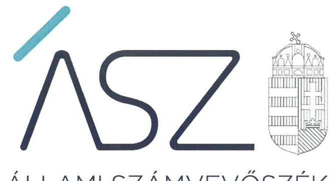

ÁLLAMI SZÁMVEVŐSZÉK

# JELENTÉS 

## A központi költségvetési szervek ellenőrzése Vagyongazdálkodás

Állatorvostudományi Egyetem
2021.

21054
www.asz.hu

---

ÁLLAMI SZÁMVEVŐSZÉK

# JELENTÉS 

## A központi költségvetési szervek ellenőrzése Vagyongazdálkodás

Állatorvostudományi Egyetem
2021. 08. hó 03. nap

21054
www.asz.hu

---

# AZ ELLENŐRZÉST FELÜGYELTE: 

DR. NÉMETH ERZSÉBET felügyeleti vezető
PETŐ KRISZTINA felügyeleti vezető

## AZ ELLENŐRZÉST VEZETTE ÉS A VÉGREHAJTÁSÁÉRT FELELŐS:

KUSZINGER ANDREA ellenőrzésvezető
SIPOSNÉ DÓCZI KLÁRA ellenőrzésvezető
DR. NAGY IMRE ellenőrzésvezető

A PROGRAM ÖSSZEÁLLÍTÁSÁÉRT FELELŐS:
GÖRGÉNYI GÁBOR ETAMO osztályvezető

Jelentéseink az Országgyúlés számítógépes hálózatán és az interneten a www.asz.hu címen is olvashatóak.

IKTATÓSZÁM: EL-3230-001/2021.
TÉMASZÁM: 2549
ELLENŐRZÉS-AZONOSÍTÓ SZÁM: V089304

---

# TARTALOMJEGYZÉK 

- ÖSSZEGZÉS ..... 5
- AZ ELLENŐRZÉS CÉLJA ..... 7
- AZ ELLENŐRZÉS TERÜLETE ..... 8
- AZ ELLENŐRZÉS HÁTTERE, INDOKOLTSÁGA ..... 9
- A JELENTÉS LÉNYEGES KÉRDÉSKÖREI ..... 10
- AZ ELLENŐRZÉS HATÓKÖRE ÉS MÓDSZEREI ..... 11
- MEGÁLLAPÍTÁSOK ..... 13
- MELLÉKLETEK ..... 15
I. sz. melléklet: Értelmező szótár ..... 15
- FÜGGELÉK: ÉSZREVÉTELEK ..... 17
- RÖVIDÍTÉSEK JEGYZÉKE ..... 19

---

.

---

# ÖSSZEGZÉS 

Az Állatorvostudományi Egyetem a 2017-2019. közötti években nem biztositotta a nemzeti vagyon védelmét. Továbbá nem igazolta, hogy a 2020. évi fenntartóváltáskor nyilvántartott nemzeti vagyon ténylegesen rendelkezésre állt a közfeladat ellátásához.

## Az ellenőrzés társadalmi indokoltsága

Az államháztartás központi alrendszerébe tartozó szervezet vagyona a nemzeti vagyon része. Magyarország Alaptörvénye rögzíti, hogy a vagyonnal való gazdálkodás célja a közérdek szolgálata. Magyarország versenyképessége szoros kapcsolatban van a felsőoktatás minőségével, amely nem képzelhető el hatékony és eredményes közpénz felhasználás nélkül.

Az ellenőrzést indokolja az is, hogy az Állatorvostudományi Egyetem a felsőoktatási modellváltással érintett intézmények közé tartozik. A vagyonjuttatásról rendelkező jogszabály szerint: „Az állatorvostudományi képzést támogatni kész magyar felsőoktatási intézményrendszer és környezetének megerősítése, a képzést folytató oktatók, kutatók, tanárok, a képzésben részt vevők támogatása érdekében" az Állatorvostudományi Egyetem fenntartói jogait, amelyeket eddig az állam nevében az illetékes miniszter gyakorolt, a kormány által létrehozott közérdekú vagyonkezelő alapítvány vette át, és azokat az alapítvány kuratóriuma gyakorolja.

Az Állami Számvevőszék tanácsadó funkciója keretében az ellenőrzési megállapításokon keresztül támogatja a közfeladathoz kapcsolódó vagyonnal való hatékony és eredményes gazdálkodást azzal, hogy felhívja a figyelmet a fenntartóváltással érintett felsőoktatási intézmények vagyongazdálkodásának kockázatos pontjaira.

## Főbb megállapítások, következtetések

Az ellenőrzött 2017. és 2019. közötti időszakban az Állatorvostudományi Egyetem vagyongazdálkodása a számviteli politika, az értékelési szabályzat, a kötelezettségvállalási és teljesítés igazolási jogkörökre előírt nyilvántartás, továbbá a beszámolók mérlegtételeit alátámasztó leltárak hiányában nem biztosította az átláthatóságot és az elszámoltathatóságot.

A törvényben előírt számviteli szabályzatok mindegyikének megléte a szabályszerű gazdálkodás alapvető feltétele. Számviteli politika hiányában az Állatorvostudományi Egyetem nem alakította ki a szabályszerű könyvvezetés és vagyongazdálkodás alapvető számviteli kereteit. Így nem biztosította annak szabályozási feltételeit, hogy az éves beszámolót a törvényi követelményeknek megfelelő, szabályszerű, megbízható könyvvezetés támassza alá.

Leltárkészítési és leltározási szabályzat hiányában az Állatorvostudományi Egyetem nem határozta meg az éves beszámoló mérlegének alátámasztásához szükséges követelményeket. Nem teremtette meg annak a szabályozási feltételeit, hogy az éves beszámoló valós és megbízható képet mutasson az intézmény vagyonáról, továbbá hogy a beszámolójában szereplő tételek a valóságban is megtalálhatók, bizonyíthatók, kívülállók által is megállapíthatók legyenek.

A kötelezettségvállalási és teljesítés igazolási jogkörök gyakorlására jogosultak és aláírás mintájának nyilvántartása hiányában az Állatorvostudományi Egyetem nem biztosította, hogy kötelezettséget csak az vállalhasson és teljesítést csak az igazolhasson, aki erre jogosult. Így nem teremtette meg a garanciális feltételeket ahhoz, hogy a vagyongazdálkodás során kötelezettség vállalására és kifizetésre kizárólag az Egyetem feladatkörébe tartozó célra kerüljön sor.

A beszámolók mérlegtételeit alátámasztó leltárak hiányában az Állatorvostudományi Egyetem éves költségvetési beszámolóinak megalapozottsága és a nemzeti vagyon védelme nem volt biztosított. Nem igazolt, hogy a beszámolókban szereplő tételek a valóságban is megtalálhatóak voltak.

A 2020. július 31-ei fenntartóváltáshoz kapcsolódóan jogszabályban előírt záró beszámolót az Állatorvostudományi Egyetem elkészítette, azonban a záró beszámoló mérlegtételeit leltárral nem támasztotta alá.

---

Ezáltal nem igazolt, hogy a záró beszámolóban szereplő nemzeti vagyon a közfeladat ellátásához rendelkezésre állt a fenntartóváltáskor.

A 2017. és 2019. között az Állatorvostudományi Egyetem múködésében és gazdálkodásában a teljesítményelv nem érvényesült.
Az ellenőrzés megállapításai alapján levonható a következtetés, hogy az Állatorvostudományi Egyetemen a kancellári rendszer bevezetése sem biztosította a nemzeti vagyon védelmét, indokolt volt a tulajdonosi joggyakorlás kereteinek megerősítése.

---

# AZ ELLENŐRZÉS CÉLJA 

AZ ELLENŐRZÉS CÉLJA annak megállapítása, hogy a központi költségvetési szerv jó gazda gondosságával biztosította-e a nemzeti vagyon értékének megőrzését, védelmét és szabályszerű kezelését. Az államháztartás központi alrendszerébe tartozó szervezet vagyongazdálkodása elszámoltatható volt-e és megfelelt-e annak az Alaptörvényben meghatározott alapvetésnek, hogy Magyarország a kiegyensúlyozott, átlátható és fenntartható költségvetési gazdálkodás elvét érvényesíti.

---

# AZ ELLENŐRZÉS TERÜLETE

## Állatorvostudományi Egyetem

Az Állatorvostudományi Egyetem feletti alapítói jogok gyakorlója az Országgyűlés, irányító szerve és fenntartója az ellenőrzött időszakban 2019. szeptember 1-jéig az Emberi Erőforrások Minisztériuma, 2019. szeptember 1-jétől az Innovációs és Technológiai Minisztérium volt. Az Egyetem1 alaptevékenysége az oktatás, a tudományos kutatás, valamint ezen tevékenységekhez kapcsolódóan az állategészségügyi ellátás folytatása; az állatorvos-, és biológiai tudomány területeken nyújtott alapképzést, mesterképzést, osztatlan képzést, doktori képzést és szakirányú továbbképzést. A felvehető maximális hallgatólétszáma 2000 fő volt.

Az Egyetem önálló egyetemként 2016. július 1-jétől végezte a tevékenységét, jogelőd szervezetei 1787-ig vezethetők viszsza. Székhelye Budapest, kilenc telephellyel rendelkezett.

Az Egyetem első számú vezetője és képviselője a rektor volt, a felsőoktatási intézmény működtetését a kancellár végezte 2020. július 31-ig. A rektor és a kancellár személyében az ellenőrzött időszakban változás nem történt.

Az Egyetem jogi státusza 2020. augusztus 1-jétől az Egyetem fenntartóváltásáról szóló törvény2 szerint közhasznú vagyonkezelő alapítvány fenntartásában álló felsőoktatási intézményre változott.

---

# AZ ELLENŐRZÉS HÁTTERE, INDOKOLTSÁGA 

Az államháztartás központi alrendszerébe tartozó szervezet vagyona a nemzeti vagyon része, mellyel történő gazdálkodás a közérdek szolgálata érdekében történik. Az ÁSZ ${ }^{3}$ ellenőrzi az éves költségvetési törvény végrehajtását, majd az ellenőrzés során feltárt kockázatok és a terület folyamatos kockázatelemzésével beazonosított kockázatok kezelése érdekében ráépülő ellenőrzésekkel ellenőrzi a költségvetési szervek gazdálkodását, müködését. Ezáltal az ellenőrzések megállapításaival támogatja az ellenőrzött szervezetek szabályszerű gazdálkodását, javaslataival elősegíti az Alaptörvényben megfogalmazott alapvetések érvényesülését a mindennapi életben a szervezetek szintjén.

Az Nftv. ${ }^{4}$ előírásai értelmében a magyar állam által működtetett felsőoktatási Intézmény fenntartói joga, mint vagyoni értékű jog - a Kormány külön engedélyével - a Kormány által létrehozott alapítványra átruházható. A fenntartóváltással érintett felsőoktatási intézménynek az Nftv. előírásai alapján a fenntartóváltás napját megelőző fordulónappal az államháztartási számviteli szabályok szerinti záró beszámolót kell készítenie.

A központi költségvetés rendszerében zajló folyamatok holisztikus elemzései, a kockázatok folyamatos figyelemmel kísérésének módszerével, az így kiválasztott szervezetek célzott, hatékony ellenőrzéseivel az ÁSZ betölti a legfőbb gazdasági ellenőrző szerv küldetését. Az egyes ellenőrzések megállapításaival és egy időszak ellenőrzési eredményeinek elemzésével az ÁSZ ráirányíthatja a jogalkotók figyelmét a központi alrendszerben vagy annak egy ágazatában esetlegesen felmerülő vagyongazdálkodási, szabályozási feszültségekre.

---

# A JELENTÉS LÉNYEGES KÉRDÉSKÖREI 

1.     - Biztosított volt-e az Egyetemnél a vagyongazdálkodás szabályozottsága?
2.     - A nemzeti vagyon nyilvántartását és kimutatását a valóságnak megfelelő módon, szabályszerűen végezte-e az Egyetem, biztosított volt-e a nemzeti vagyon védelme?
3.     - Az Egyetem a fenntartóváltás során a használatában levő vagyontárgyakat szabályszerűen mutatta-e ki a záró beszámolójában, biztosított volt-e a nemzeti vagyon megőrzése?
4.     - Az Egyetemnél kialakították-e a teljesítmény mérésére alkalmas követelményeket?

---

# AZ ELLENŐRZÉS HATÓKÖRE ÉS MÓDSZEREI 

## Az ellenőrzés típusa

Megfelelőségi ellenőrzés.

## Az ellenőrzött időszak

2017., 2018., 2019. évek, továbbá 2020. január 1-jétől a felsőoktatási intézmény Nftv. szerinti fenntartóváltásának napjáig, 2020. július 31-ig terjedő időszak.

## Az ellenőrzés tárgya

A központi költségvetési szerv vagyongazdálkodási feltételeinek kialakítása, annak szabályszerűsége, az elszámoltathatóság biztosítása a szabályozás szintjén. Az intézménynél hozott vagyonváltozást eredményező döntések, a vagyonban bekövetkezett változások végrehajtásának, elszámolásának szabályszerűsége. Az intézmény könyveiben, mérlegében kimutatott nemzeti vagyon nyilvántartásának szabályszerűsége, vagyon kimutatása, értékelése és a mérleg leltárral való alátámasztásának szabályszerűsége. A felsőoktatási intézmény záró beszámolójában kimutatott nemzeti vagyon kimutatása és a mérleg leltárral való alátámasztásának szabályszerűsége.

## Az ellenőrzött szervezet

Állatorvostudományi Egyetem

## Az ellenőrzés jogalapja

Az ellenőrzés jogszabályi alapját az ÁSZ tv. ${ }^{5} 1 . \S$ (3) bekezdés, 5. § (2)-(4) és (6) bekezdései, valamint az Áht. ${ }^{6} 61 . \S$ (2) bekezdésének előírásai képezik.

## Az ellenőrzés módszerei

Az ÁSZ az ellenőrzést az ellenőrzési program szempontjai, az ellenőrzött időszakban hatályos jogszabályok, az ellenőrzés szakmai szabályai, a jelen ellenőrzésre irányadó ÁSZ módszertanok figyelembevételével hajtotta végre. Az 1-2. és 4. kérdéskör tekintetében az ellenőrzés a 2018-2019. évekre vonatkozott, a 3. kérdéskör esetében az ellenőrzött időszak 2020.

---

január 1-jétől a felsőoktatási intézmény Nftv. szerinti fenntartóváltásának napjáig tartott.

Az ellenőrzési kérdések megválaszolásához szükséges bizonyítékok megszerzése az ellenőrzött szervezet által rendelkezésre bocsátott dokumentumokra és adatokra alapozva, továbbá megfigyelés, szemle (szemrevételezés), kérdésfeltevés (információkérés), valamint elemző eljárás útján történt. Az ellenőrzési bizonyítékként felhasználható adatforrások közé tartoztak az ellenőrzési program részletes szempontjainál felsorolt adatforrások, valamint minden egyéb - az ellenőrzés folyamán feltárt, az ellenőrzés szempontjából információt tartalmazó - dokumentum.

Az ellenőrzés lefolytatásához az ellenőrzött szervezet tanúsítvány kitöltésével, valamint az ÁSZ által kért dokumentumok megküldésével szolgáltatott adatokat, amelyekről az ellenőrzött szervezet vezetője teljességi és hitelességi nyilatkozatot állított ki. A rendelkezésre bocsátott dokumentumok, adatok és információk kontrollja az ellenőrzés keretében történt.

---

# 1. Biztosított volt-e az Egyetemnél a vagyongazdálkodás szabályozottsága? 

Összegző megállapítás Az Egyetemnél a vagyongazdálkodás szabályozottsága a 2017-2019. közötti években nem volt biztosított.

Az Egyetem a szabályszerű vagyongazdálkodás szabályozási feltételeit nem biztosította, mivel nem rendelkezett a Számv. tv. ${ }^{7}$ 14. § (3) bekezdésében és az Áhsz. ${ }^{8}$ 50. § (1) bekezdésében előírt számviteli politikával, továbbá a Számv. tv. 14. § (5) bekezdés a) pontjában és az Áhsz. 50. § (1) bekezdésében előírt eszközök és források leltárkészítési és leltározási szabályzatával.

Az Egyetem eszközök és források értékelési szabályzatával 2018. június 19-től rendelkezett.

## 2. A nemzeti vagyon nyilvántartását és kimutatását a valóságnak megfelelő módon, szabályszerűen végezte-e az Egyetem, biztosított volt-e a nemzeti vagyon védelme?

## Összegző megállapítás

Az Egyetemnél a nemzeti vagyon nyilvántartása és kimutatása 2017. és 2019. közötti években nem volt szabályszerű, nem biztosította a nemzeti vagyon védelmét.

Az Egyetem nem vezetett az Ávr. ${ }^{9}$ 60. § (3) bekezdésében előírt nyilvántartást a kötelezettségvállalásra, teljesítés igazolására jogosult személyekről és aláírás-mintájukról, mivel a nyilvántartás a jogosultak aláírás-mintáját nem tartalmazta. A jogszabályban előírt nyilvántartás hiányában az Egyetem nem biztosította annak feltételeit, hogy vagyonváltozást eredményező kötelezettségvállalásra és kifizetésre kizárólag az arra jogosult személy által, az Egyetem feladatkörébe tartozó célra kerüljön sor.

Az Egyetem a nemzeti vagyon nyilvántartását és kimutatását nem szabályszerűen végezte, mert nem készített az Áhsz. 5. § (1) bekezdésében és 22. § (1) bekezdésében, valamint a Számv. tv. 69. § (1) bekezdésében előírtak szerinti olyan leltárt, amely tételesen és ellenőrizhető módon tartalmazta volna a mérlegben szereplő eszközöket és forrásokat mennyiségben és értékben. Az Egyetem az Áhsz. 22. § (2) bekezdésében és a Számv. tv. 69. § (3) bekezdésében foglaltak ellenére a 2017-2019. közötti években nem győződött meg mennyiségi felvétellel történő leltározással a leltárba bekerülő adatok valódiságáról.

---

# 3. Az Egyetem a fenntartóváltás során a használatában levő vagyontárgyakat szabályszerűen mutatta-e ki a záró beszámolójában, biztosított volt-e a nemzeti vagyon megőrzése? 

## Összegző megállapítás

A 2020. évi fenntartóváltás során az Egyetemnél a nemzeti vagyon kimutatása nem volt szabályszerű, a nemzeti vagyon megőrzése nem volt biztosított.

Az Egyetem elkészítette a fenntartóváltás napját megelőző fordulónappal a záró beszámolót az Nftv. rendelkezésével összhangban.

Az Egyetem a vagyonnal való gazdálkodása során 2020. január 1. és 2020. július 31. között a nemzeti vagyon kimutatását nem szabályszerűen végezte, mivel nem készített - az Nftv. 117/C. § (4a) bekezdésében szereplő rendelkezés ellenére - az Áhsz. 5. § (1) bekezdésében és a 22. § (1) bekezdésében előírtak szerinti leltárt, amely tételesen és ellenőrizhető módon tartalmazta volna a záró beszámolóban szereplő eszközöket és forrásokat mennyiségben és értékben. Ezáltal az Egyetem a Számv. tv. 69. § (1) bekezdésében foglaltak ellenére a záró beszámoló mérlegtételeit nem támasztotta alá leltárral.

## 4. Az Egyetemnél kialakították-e a teljesítmény mérésére alkalmas követelményeket?

## Összegző megállapítás

Az Egyetemnél nem alakítottak ki a teljesítmény mérésére alkalmas követelményeket.

Az Egyetemnél nem alakítottak ki a szervezeti célok elérését szolgáló feladatok, folyamatok, tevékenységek mérésére használható indikátorokat, mérőszámokat, feladat- és teljesítménymutatókat, amelyek alkalmasak lettek volna a szervezeti tevékenység teljesítményének mérésére a Bkr. ${ }^{10}$ 2. § g), i), j) pontjaiban meghatározott eredményesség, gazdaságosság és hatékonyság követelményeinek érvényesítése érdekében.

Ezzel a teljesítmény mérésének lehetőségét nem biztosították és nem teremtették meg annak előfeltételeit, hogy a Bkr. 4. § a) pontjának előírásaival összhangban biztosítsák a költségvetési szerv valamennyi tevékenységének és céljának összhangját a gazdaságosság, hatékonyság és eredményesség követelményeivel.

---

# MELLÉKLETEK 

- I. SZ. MELLÉKLET: ÉRTELMEZŐ SZÓTÁR
állami vagyon
irányító szerv
nemzeti vagyon
tulajdonosi joggyakorló
vagyongazdálkodás

Állami vagyonnak minősül:
a) az állam tulajdonában lévő dolog, valamint a dolog módjára hasznosítható természeti erő,
b) az a) pont hatálya alá nem tartozó mindazon vagyon, amely vonatkozásában törvény az állam kizárólagos tulajdonjogát nevesíti,
c) az állam tulajdonában lévő tagsági jogviszonyt megtestesítő értékpapír, illetve az államot megillető egyéb társasági részesedés,
d) az államot megillető olyan immateriális, vagyoni értékkel rendelkező jogosultság, amelyet jogszabály vagyoni értékű jogként nevesít,
e) az állam tulajdonában lévő pénzügyi eszközök.
(Forrás: Vtv. ${ }^{11}$ 1. § (2) bekezdése)
A költségvetési szerv tekintetében az e törvényben meghatározott irányítási hatáskört gyakorló szerv. (Forrás: Áht. 1. § 9. pontja)
a) az állam vagy a helyi önkormányzat kizárólagos tulajdonában álló dolgok,
b) az a) pont hatálya alá nem tartozó, az állam vagy a helyi önkormányzat tulajdonában lévő dolog,
c) az állam vagy a helyi önkormányzat tulajdonában lévő pénzügyi eszközök, továbbá az államot vagy a helyi önkormányzatot megillető társasági részesedések,
d) az államot vagy a helyi önkormányzatot megillető bármely vagyoni értékkel rendelkező jogosultság, amelyet jogszabály vagyoni értékű jogként nevesít,
e) Magyarország határa által körbezárt terület feletti légtér,
f) az üvegházhatású gázok kibocsátási egységeinek kereskedelméről szóló törvény szerinti kibocsátási egység és légiközlekedési kibocsátási egység, valamint az ENSZ
Éghajlatváltozási Keretegyezménye és annak Kiotói Jegyzőkönyve végrehajtási keretrendszeréről szóló törvény szerinti kiotói egység,
g) állami vagy helyi önkormányzati fenntartású közgyűjtemény (muzeális intézmény, levéltár, közgyűjteményként működő kép- és hangarchívum, valamint könyvtár) saját gyűjteményében nyilvántartott kulturális javak körébe tartozó dolog, kivéve, ha az állami vagy önkormányzati tulajdon jogszerű létrejötte kétséget kizáró módon nem bizonyítható és a dologra nézve más a tulajdonjogát bizonyítja vagy a kulturális javakra vonatkozó jogszabályokban meghatározott eljárás keretében valószínűsíti,
h) a régészeti lelet,
i) a nemzeti adatvagyon körébe tartozó állami nyilvántartások fokozottabb védelméről szóló törvény szerinti nemzeti adatvagyon (Forrás: Nvtv. ${ }^{12}$ 2. § (2) bekezdés a)-i) pontok).
Aki a nemzeti vagyon felett az államot vagy a helyi önkormányzatot megillető tulajdonosi jogok és kötelezettségek összességének gyakorlására jogosult. (Forrás: Nvtv. 3. § (1) bekezdés 17. pontja)
A nemzeti vagyongazdálkodás feladata a nemzeti vagyon rendeltetésének megfelelő, az állam, az önkormányzat mindenkori teherbíró képességéhez igazodó, elsődlegesen a közfeladatok ellátásához és a mindenkori társadalmi szükségletek kielégítéséhez szükséges, egységes elveken alapuló, átlátható, hatékony és költségtakarékos működtetése, értékének megőrzése, állagának védelme, értéknövelő használata, hasznosítása, gyarapítása, továbbá az állam vagy a helyi önkormányzat feladatának ellátása szempontjából feleslegessé váló vagyontárgyak elidegenítése. (Forrás: Nvtv. 7. § (2) bekezdése)

---

.

---

# FÜGGELÉK: ÉSZREVÉTELEK 

A jelentéstervezetet a Számvevőszék 15 napos észrevételezésre megküldte az ellenőrzött szervezet vezetőjének az ÁSZ tv. 29. §* (1) bekezdése előírásának megfelelően.

Az Állatorvostudományi Egyetem rektora a jelentéstervezetre nem tett észrevételt.

[^0]
[^0]:    * 29. § (1) Az Állami Számvevőszék az ellenőrzési megállapításait megküldi az ellenőrzött szervezet vezetőjének vagy az általa megbízott személynek, és annak, akinek személyes felelősségét állapította meg.
    (2) Az ellenőrzött szervezet vezetője és a felelősként megjelölt személy az ellenőrzés megállapításaira tizenöt napon belül írásban észrevételt tehet.
    (3) Az Állami Számvevőszék az észrevételre a beérkezésétől számított harminc napon belül írásban válaszol. A figyelembe nem vett észrevételeket köteles a jelentésben feltüntetni, és megindokolni, hogy azokat miért nem fogadta el.

---

.

---

# RÖVIDÍTÉSEK JEGYZÉKE 

${ }^{1}$ Egyetem
${ }^{2}$ Egyetem fenntartóváltásáról szóló törvény
${ }^{3}$ ÁSZ
${ }^{4}$ Nftv.
${ }^{5}$ ÁSZ tv.
${ }^{6}$ Áht.
${ }^{7}$ Számv. tv.
${ }^{8}$ Áhsz.
${ }^{9}$ Ávr.
${ }^{10}$ Bkr.
${ }^{11}$ Vtv.
${ }^{12}$ Nvtv.

Állatorvostudományi Egyetem
2020. évi XXXIV. tv. a Marek József Alapítványról, a Marek József Alapítvány és az Állatorvostudományi Egyetem részére történő vagyonjuttatásról (hatályos 2020. május 29-től)
Állami Számvevőszék
2011. évi CCIV. törvény a nemzeti felsőoktatásról (hatályos 2012. január 1-jétől)
2011. évi LXVI. törvény az Állami Számvevőszékről (hatályos 2011. július 1-jétől)
2011. évi CXCV. törvény az államháztartásról (hatályos 2011. december 31-től)
2000. évi C. törvény a számvitelről (hatályos 2001. január 1-jétől)
4/2013. (I. 11.) Korm. rendelet az államháztartás számviteléről (hatályos 2014. január 1-jétől)
368/2011. (XII. 31.) Korm. rendelet az államháztartásról szóló törvény végrehajtásáról (hatályos 2012. január 1-jétől)
370/2011. (XII. 31.) Korm. rendelet a költségvetési szervek belső kontrollrendszeréről és belső ellenőrzéséről (hatályos 2012. január 1-jétől) 2007. évi CVI. törvény az állami vagyonról (hatályos 2007. szeptember 25-től) 2011. évi CXCVI. törvény a nemzeti vagyonról (hatályos: 2011. december 31-től)

---

# 1052 

1052 Budapest, Apáczai Cs. J. u. 10. I 1364 Budapest 4. Pf. 54 TEL: +36 14849100
email: szamvevoszek@asz.hu
web: www.asz.hu | www.aszhirportal.hu