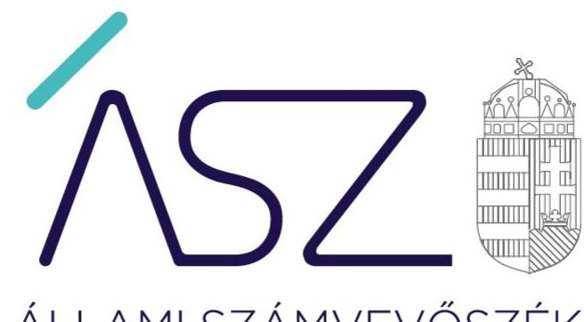
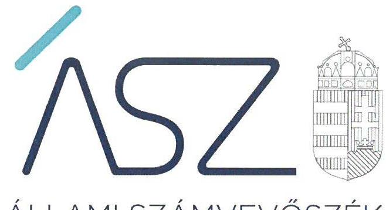
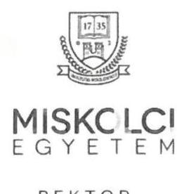
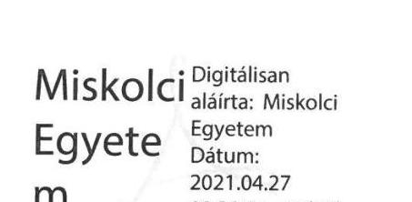
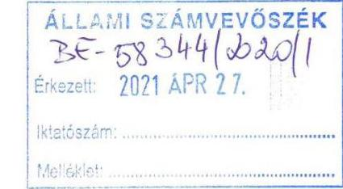

ÁLLAMI SZÁMVEVŐSZÉK

# JELENTÉS 

A központi költségvetési szervek ellenőrzése Vagyongazdálkodás

Miskolci Egyetem
2021.

21055
www.asz.hu

---

ÁLLAMI SZÁMVEVŐSZÉK

# JELENTÉS 

## A központi költségvetési szervek ellenőrzése Vagyongazdálkodás

Miskolci Egyetem
2021. 06. hó 03. nap

21055
www.asz.hu

---

# AZ ELLENŐRZÉST FELÜGYELTE: 

DR. NÉMETH ERZSÉBET felügyeleti vezető
PETŐ KRISZTINA felügyeleti vezető

## AZ ELLENŐRZÉST VEZETTE ÉS A VÉGREHAJTÁSÁÉRT FELELŐS:

DR. NAGY IMRE ellenőrzésvezető
SIPOSNÉ DÓCZI KLÁRA ellenőrzésvezető

## A PROGRAM ÖSSZEÁLLÍTÁSÁÉRT FELELŐS:

GÖRGÉNYI GÁBOR ETAMO osztályvezető

## A TÉMÁHOZ KAPCSOLÓDÓ KORÁBBI SZÁMVEVŐSZÉKI JELENTÉSEK:

- címe:
- sorszáma:
- címe:
- sorszáma: $\square$

Jelentés a Miskolci Egyetem ellenőrzéséről - Az állami felsőoktatási intézmények gazdálkodásának, működésének ellenőrzése
14200
Jelentés - Az állami felsőoktatási intézmények gazdálkodásának, működésének ellenőrzéséről készült jelentések utóellenőrzése - Miskolci Egyetem 17051

IKTATÓSZÁM: EL-3248-001/2021.
TÉMASZÁM: 2549
ELLENŐRZÉS-AZONOSÍTÓ SZÁM: V089305

---

# TARTALOMJEGYZÉK 

■ ÖSSZEGZÉS ..... 5
■ AZ ELLENŐRZÉS CÉLJA ..... 6
■ AZ ELLENŐRZÉS TERÜLETE ..... 7
■ AZ ELLENŐRZÉS HÁTTERE, INDOKOLTSÁGA ..... 8
■ A JELENTÉS LÉNYEGES KÉRDÉSKÖREI ..... 9
■ AZ ELLENŐRZÉS HATÓKÖRE ÉS MÓDSZEREI ..... 10
■ MEGÁLLAPÍTÁSOK ..... 12
■ MELLÉKLETEK ..... 15
I. sz. melléklet: Értelmező szótár ..... 15
■ FÜGGELÉK: ÉSZREVÉTELEK ..... 17
■ RÖVIDÍTÉSEK JEGYZÉKE ..... 25

---

.

---

# ÖSSZEGZÉS 

A Miskolci Egyetem vagyongazdálkodása a 2017-2018. években biztosította a nemzeti vagyon védelmét. A 2019. évben, valamint a 2020. évben a fenntartóváltás időpontjáig az Egyetem vagyongazdálkodása nem volt átlátható és elszámoltatható, nem biztosította a közfeladat ellátását szolgáló nemzeti vagyon megőrzését és védelmét.

## Az ellenőrzés társadalmi indokoltsága

Az államháztartás központi alrendszerébe tartozó szervezet vagyona a nemzeti vagyon része. Magyarország Alaptörvénye rögzíti, hogy a vagyonnal való gazdálkodás célja a közérdek szolgálata. Magyarország versenyképessége szoros kapcsolatban van a felsőoktatás minőségével, amely nem képzelhető el hatékony és eredményes közpénz felhasználás nélkül.

Az ellenőrzést indokolja az is, hogy a Miskolci Egyetem is a felsőoktatási modellváltással érintett intézmények közé tartozik. A vagyonjuttatásról rendelkező jogszabály szerint: „A Miskolci Egyetem képzési területeinek, ezen keresztül az innovációt támogatni kész magyar felsőoktatási intézményrendszer és környezetének megerősítése, a képzést folytató oktatók, kutatók, tanárok, a képzésben részt vevők támogatása érdekében" a Miskolci Egyetem fenntartói jogait, amelyeket eddig az állam nevében az illetékes miniszter gyakorolt, a kormány által létrehozott közérdekű vagyonkezelő alapítvány vette át, és azokat az alapítvány kuratóriuma gyakorolja.

Az Állami Számvevőszék tanácsadó funkciója keretében az ellenőrzési megállapításokon keresztül támogatja a közfeladathoz kapcsolódó vagyonnal való hatékony és eredményes gazdálkodást azzal, hogy felhívja a figyelmet a fenntartóváltással érintett felsőoktatási intézmények vagyongazdálkodásának kockázatos pontjaira.

## Főbb megállapítások, következtetések

A Miskolci Egyetem vagyongazdálkodásának szabályozása 2017-2018-ban a számlarend hiánya miatt nem biztosította a szabályszerű könyvvezetés alapvető feltételeit. A 2019. évre a szabályozottság javult, a Miskolci Egyetem a szabályszerű könyvvezetés alapvető feltételeit kialakította.

A Miskolci Egyetem 2017-2018. években biztosította a nemzeti vagyon védelmét. A 2019. évben a vagyon elszámolása területén feltárt hiányosságok miatt a nemzeti vagyon védelme nem volt biztosított.

A fenntartóváltás fordulónapjára vonatkozóan a 2020. évben a Miskolci Egyetem a záró beszámolót elkészítette, azonban nem állított össze leltárt a rendelkezésére álló vagyoni elemekről. Ezáltal a fenntartóváltás időpontjában nem volt biztosított a számviteli nyilvántartásaiban szereplő vagyonelemek szabályszerű kimutatása, és nem volt igazolt azok megléte. E törvénysértés miatt indokolt munkajogi eljárást az ÁSZ azért nem kezdeményezett, mert a kancellár foglalkoztatási jogviszonya időközben megszűnt.

A 2017-2019. években a Miskolci Egyetem működésében és gazdálkodásában a teljesítményelv érvényesült.
Az ellenőrzés megállapításai alapján levonható a következtetés, hogy a Miskolci Egyetemen a kancellári rendszer bevezetése sem biztosította a nemzeti vagyon védelmét, indokolt volt a tulajdonosi joggyakorlás kereteinek megerősítése.

---

# AZ ELLENŐRZÉS CÉLJA

**AZ ELLENŐRZÉS CÉLJA** annak megállapítása, hogy a központi költségvetési szerv jó gazda gondosságával biztosította-e a nemzeti vagyon értékének megőrzését, védelmét és szabályszerű kezelését. Az államháztartás központi alrendszerébe tartozó szervezet vagyongazdálkodása elszámoltatható volt-e és megfelel-e annak az Alaptörvényben meghatározott alapvetésnek, hogy Magyarország a kiegyensúlyozott, átlátható és fenntartható költségvetési gazdálkodás elvét érvényesíti.

---

# AZ ELLENŐRZÉS TERÜLETE 

## Miskolci Egyetem

A Miskolci Egyetem feletti alapítói jogok gyakorlója az Országgyűlés, irányító szerve és fenntartója az ellenőrzött időszakban 2019. szeptember 1-ig az Emberi Erőforrások Minisztériuma, 2019. szeptember 1-től az Innovációs és Technológiai Minisztérium volt. A Miskolci Egyetem alaptevékenysége felsőfokú oktatás, közfeladata oktatási, tudományos kutatási és művészeti alkotótevékenység folytatása. Illetékessége, működési területe Magyarország területe, a felvehető maximális hallgatólétszáma 13000 fő volt.

A Miskolci Egyetem jogelődje 1949-ben alakult, azóta több karral is gazdagodott. Jelenleg földtudományi, anyagtudományi, gépészmérnöki és informatikai, állam- és jogtudományi, gazdaságtudományi, bölcsészettudományi, zeneművészeti és egészségügyi területen többciklusú alap-, mester- és doktori képzést nyújt. Az egyetem neve 1990. július 1-vel Miskolci Egyetemre változott.

A Miskolci Egyetem első számú vezetője és képviselője a rektor volt, a felsőoktatási intézmény működtetését a kancellár végezte. A rektor és a kancellár személyében az ellenőrzött időszakban változás nem történt.

Az Egyetem ${ }^{1}$ jogi státusza, 2020. augusztus 1-től az Egyetem fenntartóváltásáról szóló törvény² szerint közhasznú vagyonkezelő alapítvány fenntartásában álló felsőoktatási intézményre változott.

---

# AZ ELLENŐRZÉS HÁTTERE, INDOKOLTSÁGA 

Az államháztartás központi alrendszerébe tartozó szervezet vagyona a nemzeti vagyon része, mellyel történő gazdálkodás a közérdek szolgálata érdekében történik. Az ÁSZ ${ }^{3}$ ellenőrzi az éves költségvetési törvény végrehajtását, majd az ellenőrzés során feltárt kockázatok és a terület folyamatos kockázatelemzésével beazonosított kockázatok kezelése érdekében ráépülő ellenőrzésekkel ellenőrzi a költségvetési szervek gazdálkodását, működését. Ezáltal az ellenőrzések megállapításaival támogatja az ellenőrzött szervezetek szabályszerű gazdálkodását, javaslataival elősegíti az Alaptörvényben megfogalmazott alapvetések érvényesülését a mindennapi életben a szervezetek szintjén.

Az Nftv. ${ }^{4}$ előírásai értelmében a magyar állam által működtetett felsőoktatási intézmény fenntartói joga, mint vagyoni értékű jog - a Kormány külön engedélyével - a Kormány által létrehozott alapítványra átruházható. A fenntartóváltással érintett felsőoktatási intézménynek az Nftv. előírásai alapján a fenntartóváltás napját megelőző fordulónappal az államháztartási számviteli szabályok szerinti záró beszámolót kell készítenie.

A központi költségvetés rendszerében zajló folyamatok holisztikus elemzései, a kockázatok folyamatos figyelemmel kísérésének módszerével, az így kiválasztott szervezetek célzott, hatékony ellenőrzéseivel az ÁSZ betölti a legfőbb gazdasági ellenőrző szerv küldetését. Az egyes ellenőrzések megállapításaival és egy időszak ellenőrzési eredményeinek elemzésével az ÁSZ ráirányíthatja a jogalkotók figyelmét a központi alrendszerben vagy annak egy ágazatában esetlegesen felmerülő vagyongazdálkodási, szabályozási feszültségekre.

---

# A JELENTÉS LÉNYEGES KÉRDÉSKÖREI 

1. Biztosított volt-e az Egyetemnél a vagyongazdálkodás szabályozottsága?
2. A nemzeti vagyon nyilvántartását és kimutatását a valóságnak megfelelő módon, szabályszerűen végezte-e az Egyetem, biztosított volt-e a nemzeti vagyon védelme?
3. Az Egyetem a fenntartóváltás során a használatában levő vagyontárgyakat szabályszerűen mutatta-e ki a záró beszámolójában, biztosított volt-e a nemzeti vagyon megőrzése?
4. Az Egyetemnél kialakították-e a teljesítmény mérésére alkalmas követelményeket?

---

# AZ ELLENŐRZÉS HATÓKÖRE ÉS MÓDSZEREI 

## Az ellenőrzés típusa

Megfelelőségi ellenőrzés.

## Az ellenőrzött időszak

2017., 2018., 2019. évek, továbbá 2020. január 1-jétől a felsőoktatási intézmény Nftv. szerinti fenntartóváltásának napjáig, 2020. július 31-ig terjedő időszak.

## Az ellenőrzés tárgya

A központi költségvetési szerv vagyongazdálkodási feltételeinek kialakítása, annak szabályszerűsége, az elszámoltathatóság biztosítása a szabályozás szintjén. Az intézménynél hozott vagyonváltozást eredményező döntések, a vagyonban bekövetkezett változások végrehajtásának, elszámolásának szabályszerűsége. Az intézmény könyveiben, mérlegében kimutatott nemzeti vagyon nyilvántartásának szabályszerűsége, vagyon kimutatása, értékelése és a mérleg leltárral való alátámasztásának szabályszerűsége. A felsőoktatási intézmény záró beszámolójában kimutatott nemzeti vagyon kimutatása és a mérleg leltárral való alátámasztásának szabályszerűsége.

## Az ellenőrzött szervezet

Miskolci Egyetem

## Az ellenőrzés jogalapja

Az ellenőrzés jogszabályi alapját az ÁSZ tv. ${ }^{5} 1 . \S$ (3) bekezdés, 5. § (2)-(3) és (6) bekezdései, valamint az Áht. ${ }^{6} 61 . \S$ (2) bekezdésének előírásai képezik.

## Az ellenőrzés módszerei

Az ÁSZ az ellenőrzést az ellenőrzési program szempontjai, az ellenőrzött időszakban hatályos jogszabályok, az ellenőrzés szakmai szabályai, a jelen ellenőrzésre irányadó ÁSZ módszertanok figyelembevételével hajtotta végre. Az 1-2. és 4. kérdéskör tekintetében az ellenőrzés a 2018-2019. évekre vonatkozott, a 3. kérdéskör esetében az ellenőrzött időszak 2020.

---

január 1-jétől a felsőoktatási intézmény Nftv. szerinti fenntartóváltásának napjáig tartott.

Az ellenőrzési kérdések megválaszolásához szükséges bizonyítékok megszerzése az ellenőrzött szervezet által rendelkezésre bocsátott dokumentumokra és adatokra alapozva, továbbá megfigyelés, szemle (szemrevételezés), kérdésfeltevés (információkérés), valamint elemző eljárás útján történt. Az ellenőrzési bizonyítékként felhasználható adatforrások közé tartoztak az ellenőrzési program részletes szempontjainál felsorolt adatforrások, valamint minden egyéb - az ellenőrzés folyamán feltárt, az ellenőrzés szempontjából információt tartalmazó - dokumentum.
Az ellenőrzés lefolytatásához az ellenőrzött szervezet tanúsítvány kitöltésével, valamint az ÁSZ által kért dokumentumok megküldésével szolgáltatott adatokat, amelyekről az ellenőrzött szervezet vezetője teljességi és hitelességi nyilatkozatot állított ki. A rendelkezésre bocsátott dokumentumok, adatok és információk kontrollja az ellenőrzés keretében történt.

A vagyonnövekedések és vagyoncsökkenések elszámolása, a vagyon nyilvántartása és a vagyontárgyak év végi értékelésének szabályszerűsége lényeges sokaságon alapuló egyszerű véletlen mintavétellel történt. A vizsgált terület „szabályszerű" minősítést kapott, ha a minta ellenőrzésének eredménye alapján 95\%-os bizonyossággal a teljes sokaságban az átlagos hibaarány nem haladta meg a 10\%-ot, „nem szabályszerű" minősítést kapott, ha nagyobb volt, mint 10\%. Abban az esetben, ha a teljes sokaság tekintetében a 10\%-os hibaarányhoz való viszony megítélésének megbízhatósága nem érte el a 95\%-ot, annak elérése érdekében az értékelés további szempontokkal egészült ki, a feltárt hibák értéke is figyelembe vételre került. Amennyiben a sokaság elemszáma nem haladta meg az előírt minta elemszámot, akkor a sokaság valamennyi elemének tételes ellenőrzésére került sor.

---

# 1. Biztosított volt-e az Egyetemnél a vagyongazdálkodás szabályozottsága? 

Összegző megállapítás

Az Egyetemnél a vagyongazdálkodás szabályozottsága a 2017-2018. években nem volt biztosított, 2019. évben biztosított volt.

Az Egyetem rendelkezett számviteli politikával, melynek keretében elkészítette az eszközök és források leltározási és leltárkészítési szabályzatát és értékelési szabályzatát.

Ugyanakkor az Egyetem a 2017-2018. években nem teremtette meg a szabályszerű könyvvezetés szabályozási feltételeit, mert a Számv. tv. ${ }^{7}$ 161. § (1) és (4) bekezdésében, valamint az Áhsz ${ }^{8}$ 51. § (2) bekezdésében foglaltak ellenére 2019. július 1-ig nem rendelkezett számlarenddel. Ennek következtében az Egyetem nem határozta meg a Számv. tv. 161. § (2) bekezdés a) és c) pontjaiban előírtak ellenére az alkalmazásra kijelölt számlák számjelét és megnevezését, valamint a főkönyvi számla és az analitikus nyilvántartás kapcsolatát.

A 2019. július 1-től hatályos számlarend elkészítésével az Egyetem 2019-re kialakította a szabályszerű könyvvezetés szabályozási feltételeit.

## 2. A nemzeti vagyon nyilvántartását és kimutatását a valóságnak megfelelő módon, szabályszerűen végezte-e az Egyetem, biztosított volt-e a nemzeti vagyon védelme?

Összegző megállapítás

Az Egyetemnél a nemzeti vagyon nyilvántartása és kimutatása szabályszerű volt. A vagyon elszámolása 2019-ben nem volt szabályszerű, nem biztosította a nemzeti vagyon védelmét.

A VAGYON NYILVÁNTARTÁSA ÉS KIMUTATÁSA szabályszerű volt. Az Egyetem a 2017-2019. évekre vonatkozó mérlegében kimutatott eszközeit és forrásait a Számv. tv és az Áhsz. rendelkezései szerinti leltárral alátámasztotta. A 2017-2019. években az Egyetem a jogszabályi előírásoknak megfelelően mennyiségi felvétellel, illetve egyeztetéssel történő leltározással meggyőződött a leltárba bekerülő adatok valódiságáról. A 2019. évben a vagyontárgyak részletező nyilvántartását az Áhsz. rendelkezéseiben
 előírt tartalommal vezették.

A VAGYON ELSZÁMOLÁSA a 2019. évben nem volt szabályszerű a vagyoncsökkenés és a vagyonnövekedés tekintetében feltárt alábbi hiányosságok miatt.

A 2019. évben az Egyetemnél a vagyoncsökkenések elszámolása nem volt szabályszerű, mert

---

$\longrightarrow$ az Egyetem az Áhsz. 26. § (10a) bekezdés ellenére egyéb ráfordításként nem számolta el az értékesített és a hiányzó, állományból kivezetett eszközök könyv szerinti értékét,
$\longrightarrow$ az Vtv. ${ }^{9}$ 33.§ (2) bekezdés előírásának ellenére az Egyetem nem rendelkezett az értékesítés lebonyolításához a tulajdonosi joggyakorlóval kötött megbízási szerződéssel, valamint a Vtvr. ${ }^{10} 14 . \S$ (5) bekezdés ellenére a vagyon értékesítését követő kilencven napon belül nem tett eleget az értékesítéshez kapcsolódó adatszolgáltatási kötelezettségének,
$\longrightarrow$ a Számv. tv. 165. § (2) bekezdésében foglalt előírás ellenére az Egyetem a selejtezett tárgyi eszköz számviteli nyilvántartásból történő kivezetését bizonylattal nem támasztotta alá.
A 2019. évben a vagyonnövekedések területén az ellenőrzés feltárta, hogy egy esetben az Egyetem a vagyonkezelésbe vett ingatlan bekerülési értékét a Számv. tv. 165. § (2) bekezdésében foglalt előírás ellenére bizonylattal nem támasztotta alá.

# 3. Az Egyetem a fenntartóváltás során a használatában levő vagyontárgyakat szabályszerűen mutatta-e ki a záró beszámolójában, biztosított volt-e a nemzeti vagyon megőrzése? 

Összegző megállapítás A 2020. évi fenntartóváltás során az Egyetemnél a nemzeti vagyon kimutatása nem volt szabályszerű, a nemzeti vagyon megőrzése nem volt biztosított.

Az Egyetem elkészítette a fenntartóváltás napját megelőző fordulónappal a záró beszámolót az Nftv. rendelkezésével összhangban.

Az Egyetem a vagyonnal való gazdálkodása során 2020. január 1. és 2020. július 31. között a nemzeti vagyon kimutatását nem szabályszerűen végezte, mivel nem készített - az Nftv. 117/C. § (4a) bekezdésében szereplő rendelkezés ellenére - az Áhsz. 5. § (1) bekezdésében és a 22. § (1) bekezdésében előírtak szerinti leltárt, amely tételesen és ellenőrizhető módon tartalmazta volna a záró beszámolóban szereplő eszközöket és forrásokat mennyiségben és értékben. Ezáltal az Egyetem a Számv. tv. 69. § (1) bekezdésében foglaltak ellenére a záró beszámoló mérlegtételeit nem támasztotta alá leltárral.

## 4. Az Egyetemnél kialakították-e a teljesítmény mérésére alkalmas követelményeket?

## Összegző megállapítás Az Egyetemnél kialakították a teljesítmény mérésére alkalmas követelményeket.

Az Egyetemnél kialakították a szervezeti célok elérését szolgáló feladatok, folyamatok, tevékenységek mérésére használható indikátorokat, mérőszámokat, feladat- és teljesítménymutatókat, amelyek alkalmasak a szervezeti

---

tevékenység teljesítményének mérésére a Bkr. 2. § g), i), j) pontjaiban meghatározott eredményesség, gazdaságosság és hatékonyság követelményeinek érvényesítése érdekében.

---

# MELLÉKLETEK 

- I. SZ. MELLÉKLET: ÉRTELMEZŐ SZÓTÁR
állami vagyon
irányító szerv
nemzeti vagyon
tulajdonosi joggyakorló
vagyongazdálkodás

Állami vagyonnak minősül:
a) az állam tulajdonában lévő dolog, valamint a dolog módjára hasznosítható természeti erő,
b) az a) pont hatálya alá nem tartozó mindazon vagyon, amely vonatkozásában törvény az állam kizárólagos tulajdonjogát nevesíti,
c) az állam tulajdonában lévő tagsági jogviszonyt megtestesítő értékpapír, illetve az államot megillető egyéb társasági részesedés,
d) az államot megillető olyan immateriális, vagyoni értékkel rendelkező jogosultság, amelyet jogszabály vagyoni értékű jogként nevesít,
e) az állam tulajdonában lévő pénzügyi eszközök.
(Forrás: Vtv. 1. § (2) bekezdése)
A költségvetési szerv tekintetében az e törvényben meghatározott irányítási hatáskört gyakorló szerv. (Forrás: Áht. 1. § 9. pontja)
a) az állam vagy a helyi önkormányzat kizárólagos tulajdonában álló dolgok,
b) az a) pont hatálya alá nem tartozó, az állam vagy a helyi önkormányzat tulajdonában lévő dolog,
c) az állam vagy a helyi önkormányzat tulajdonában lévő pénzügyi eszközök, továbbá az államot vagy a helyi önkormányzatot megillető társasági részesedések,
d) az államot vagy a helyi önkormányzatot megillető bármely vagyoni értékkel rendelkező jogosultság, amelyet jogszabály vagyoni értékű jogként nevesít,
e) Magyarország határa által körbezárt terület feletti légtér,
f) az üvegházhatású gázok kibocsátási egységeinek kereskedelméről szóló törvény szerinti kibocsátási egység és légiközlekedési kibocsátási egység, valamint az ENSZ
Éghajlatváltozási Keretegyezménye és annak Kiotói Jegyzőkönyve végrehajtási keretrendszeréről szóló törvény szerinti kiotói egység,
g) állami vagy helyi önkormányzati fenntartású közgyűjtemény (muzeális intézmény, levéltár, közgyűjteményként működő kép- és hangarchívum, valamint könyvtár) saját gyűjteményében nyilvántartott kulturális javak körébe tartozó dolog, kivéve, ha az állami vagy önkormányzati tulajdon jogszerű létrejötte kétséget kizáró módon nem bizonyítható és a dologra nézve más a tulajdonjogát bizonyítja vagy a kulturális javakra vonatkozó jogszabályokban meghatározott eljárás keretében valószínűsíti,
h) a régészeti lelet,
i) a nemzeti adatvagyon körébe tartozó állami nyilvántartások fokozottabb védelméről szóló törvény szerinti nemzeti adatvagyon (Forrás: Nvtv. ${ }^{11}$ 2. § (2) bekezdés a)-i) pontok). Aki a nemzeti vagyon felett az államot vagy a helyi önkormányzatot megillető tulajdonosi jogok és kötelezettségek összességének gyakorlására jogosult. (Forrás: Nvtv. 3. § (1) bekezdés 17. pontja)
A nemzeti vagyongazdálkodás feladata a nemzeti vagyon rendeltetésének megfelelő, az állam, az önkormányzat mindenkori teherbíró képességéhez igazodó, elsődlegesen a közfeladatok ellátásához és a mindenkori társadalmi szükségletek kielégítéséhez szükséges, egységes elveken alapuló, átlátható, hatékony és költségtakarékos működtetése, értékének megőrzése, állagának védelme, értéknövelő használata, hasznosítása, gyarapítása, továbbá az állam vagy a helyi önkormányzat feladatának ellátása szempontjából feleslegessé váló vagyontárgyak elidegenítése. (Forrás: Nvtv. 7. § (2) bekezdése)

---

.

---

# FÜGGELÉK: ÉSZREVÉTELEK 

A jelentéstervezetet a Számvevőszék 15 napos észrevételezésre megküldte az ellenőrzött szervezet vezetőjének az ÁSZ tv. 29. §* (1) bekezdése előírásának megfelelően.

A Miskolci Egyetem rektora a jelentéstervezet megállapításaira észrevételt tett. Az ÁSZ tv. 29. § (3) bekezdésével összhangban az ÁSZ a Függelékben feltünteti a jelentéstervezet megállapításaival kapcsolatban tett, figyelembe nem vett észrevételeket, és megindokolja, hogy azokat miért nem fogadta el.

[^0]
[^0]:    * 29. § (1) Az Állami Számvevőszék az ellenőrzési megállapításait megküldi az ellenőrzött szervezet vezetőjének vagy az általa megbízott személynek, és annak, akinek személyes felelősségét állapította meg.
    (2) Az ellenőrzött szervezet vezetője és a felelősként megjelölt személy az ellenőrzés megállapításaira tizenöt napon belül írásban észrevételt tehet.
    (3) Az Állami Számvevőszék az észrevételre a beérkezésétől számított harminc napon belül írásban válaszol. A figyelembe nem vett észrevételeket köteles a jelentésben feltüntetni, és megindokolni, hogy azokat miért nem fogadta el.

---

# Miskolc   Egyetem     

## Állami Számvevőszék

1052 Budapest
Apáczai Csere János u. 10.

Domokos László
elnök nevében eljáró
Holman Magdolna
alelnök

Tárgy: Észrevétel
Hiv.szám: EL-2799-090/2021

Ikt.sz.: 27.608-1/2021

Tisztelt Alelnök asszony!
A Miskolci Egyetem megkapta „Az Állami Számvevőszékről szóló 2011. évi LXVI. törvény 29.§ (1) bekezdésben foglaltak alapján észrevételezés céljából megküldött „A Központi költségvetési szervek ellenőrzése - Vagyongazdálkodás - Miskolci Egyetem" című számvevőszéki jelentéstervezetet".

ÁSZ tv. 29.§. (2) bekezdése alapján az ellenőrzés megállapításaira érdemi észrevételt kívánok tenni.

## 1. Kérdés: Biztosított volt-e az Egyetemnél a vagyongazdálkodás szabályozottsága?

Állami Számvevőszék összegző megállapítás: „Az Egyetemnél a vagyongazdálkodás szabályozottsága 2017-ben és 2018-ban nem volt biztosított, 2019-ben biztosított volt. Ugyanakkor az Egyetem 2017ben és 2018-ban nem teremtette meg a szabályszerű könyvvezetés szabályozási feltételeit, mert a Számv.tv 161§ (1) és (4) bekezdésében, valamint az Áhsz 51.§ (2) bekezdésében foglaltak ellenére 2019. július 1-ig nem rendelkezett számlarenddel...."

Miskolci Egyetem észrevétel: A Miskolci Egyetem működése során folyamatosan rendelkezett számlarenddel. 2020.08.12-én a Teljességi és hitelességi nyilatkozattal feltöltésre került az ÁSZ felületére a „6.3. sz. Egyetemi Szabályzat" a Miskolci Egyetem Számlarend dokumentum, mely a Miskolci Egyetem Szenátusának 253/2016. sz. határozata alapján, 2016.11.24-én lépett hatályba. A dokumentum hatályban volt 2019. évig.

Fenti tárgykörökben hiánypótló kérdés nem érkezett, sem személyesen, sem írásban az Állami Számvevőszék részéről.

---

# MISKCLCI   EGYETEM 

## REKTOR

2. Kérdés: A nemzeti vagyon nyilvántartását és kimutatását a valóságnak megfelelő módon, szabályszerűen végezte-e az Egyetem, biztosított volt-e a nemzeti vagyon védelme?

Állami Számvevőszék összegző megállapítás: Az Egyetemnél a nemzeti vagyon nyilvántartása és kimutatása szabályszerű volt. A vagyon elszámolása 2019-ben nem volt szabályszerű, nem biztosította a nemzeti vagyon védelmét.

Miskolci Egyetem észrevétel:

- A Miskolci Egyetem az Áhsz.26.§. (10a) bekezdés szerint egyéb ráfordításként elszámolta az értékesített és a hiányzó, állományból kivezetett eszközök könyv szerinti értékét. A 2020.07.20-án ÁSZ felületre feltöltött 2019. évi főkönyvi kivonat 8421000000 Hiányzó.selejt.megsem.áll.ból.kiv.tt.eszk.kszért nevű főkönyvi számlája tartalmazza ezen tételeket.
- A felügyeleti szerv részére hivatalos levélben megküldésre került a 85 rovaton értékesített eszközök vonatkozásában bevételi és kiadási előirányzat rendezési és felhasználási kérelem, melyet minden esetben jóváhagyott az EMMI, későbbiekben az ITM.
- Számviteli törvény 165.§.(2) bekezdésben foglalt előírásnak megfelelően a selejtezett tárgyi eszközök számviteli nyilvántartásból való kivezetését a Miskolci Egyetem bizonylattal alátámasztotta. Ennek dokumentumai (eszközkarton, szervezeti egység vezetők vizsgálatai, selejtezési bizottság jegyzőkönyve, összefoglaló levél kancellári egyetértéssel) 2020. október 7-én fel lettek töltve az ÁSZ felületére.
- 2019. évi vagyonnövekedést eredményezett a Ferenczi Sándor Szakgimnázium vagyonkezelésbe vétele. Az Ingatlan bekerülési értékét a Miskolci Szakképzési Centrumtól, mint korábbi vagyonkezelőtől származó adatok támasztják alá. 2020. október 7-én a Miskolc Megyei Jogú Várossal kötött Vagyonkezelési Szerződés, valamint a Miskolci Szakképzési Centrummal létrejött Nyilatkozat a Ferenczi Sándor Szakgimnázium című dokumentum és mellékletei.

Fenti tárgykörökben hiánypótló kérdés nem érkezett, sem személyesen, sem írásban az Állami Számvevőszék részéről.
3. Kérdés: Az Egyetem a fenntartóváltás során a használatában levő vagyontárgyakat szabályszerűen mutatta-e ki a záró beszámolójában, biztosított volt-e a nemzeti vagyon megőrzése?

Állami Számvevőszék összegző megállapítás: A 2020. évi fenntartóváltás során az Egyetemnél a nemzeti vagyon kimutatása nem volt szabályszerű, a nemzeti vagyon megőrzése nem volt biztosított. Az Egyetem.... nem készített - az Nftv. 117/C.§ (4a) bekezdésében szereplő rendelkezés ellenére - az Áhsz. 5.§ (1) bekezdésében és a 22.§ (1) bekezdésében előírtak szerint leltárt,...Ezáltal az Egyetem a Számv.tv. 69.§ (1) bekezdésében foglaltak ellenére a záró beszámoló mérlegtételeit nem támasztotta alá leltárral."

Miskolci Egyetem észrevétel: A Miskolci Egyetem a 2020.07.31. fordulónapi beszámolóját Számviteli törvény 46.§. (3) bekezdés szerinti egyeztető leltárral támasztotta alá. Ennek bizonylatai eszközök és források tekintetében 2020.10.09. napján feltöltésre kerültek az ÁSZ felületére.

---

# MISKCLCI   EGYETEM 

## REKTOR

Fenti tárgykörökben hiánypótló kérdés nem érkezett, sem személyesen, sem írásban az Állami Számvevőszék részéről.
4. Kérdés: Az Egyetemnél kialakították-e a teljesítmény mérésére alkalmas követelményeket?

Állami Számvevőszék összegző megállapítás: Az Egyetemnél nem alakítottak ki a teljesítmény mérésére alkalmas követelményeket.

Miskolci Egyetem észrevétel: A Miskolci Egyetem kialakította a teljesítmény mérésére alkalmas követelményeket. 2020. október 20-án az ÁSZ felületére feltöltésre került az Intézményfejlesztési Terv, melyben meghatározásra kerültek az egyetemi célok elérését szolgáló feladatok, folyamatok, tevékenységek mérésére alkalmas indikátorok és mérőszámok. Rendszeresen beazonosításra kerültek a kockázatok, azok nagysága és hatása, melyet alátámasztanak a feltöltött kockázatkezelési bizottsági jegyzőkönyvek. A minisztérium részére megküldött havi kancellári beszámolók részletesen tartalmazták az elvégzett és elvégzendő feladatokat, eredményeket. A rektor és kancellár tevékenysége, teljesítménye évente értékelésre került, melynek része volt egyrészről a feltöltött önértékelés, valamint a fenntartói értékelés.

Fenti tárgykörökben hiánypótló kérdés nem érkezett, sem személyesen, sem írásban az Állami Számvevőszék részéről.

Fenti indokaink alapján kérem, hogy a jelentéstervezetet felülvizsgálni szíveskedjenek.
Miskolc, 2021. április 27.

Tisztelettel:
Prof. Dr. Horváth Zita

---

# Huszámé Borbás Melinda 

## 150 éve   a közpénzek őre

Ikt. szám: EL-2799-092/2021.

Prof.
 Dr. Horváth Zita úrhölgy
rektor
Miskolci Egyetem

## Miskolc

Tisztelt Rektor Úrhölgy!
„A központi költségvetési szervek ellenőrzése - Vagyongazdálkodás - Miskolci Egyetem" című ellenőrzés megállapításaira a 2021. április 27-én kelt, RT/698-1/2021. iktatószámú levelében megküldött észrevételeit megkaptam.

Az Állami Számvevőszék észrevételre vonatkozó álláspontjáról a felügyeleti vezető által készített részletes tájékoztatást csatoltan megküldöm.

Tájékoztatom Rektor úrhölgyet, hogy a számvevőszéki jelentésben - az Állami Számvevőszékről szóló 2011. évi LXVI. törvény 29. § (3) bekezdése alapján - a figyelembe nem vett észrevételeket szerepeltetjük az elutasítás indokának feltüntetésével.

Budapest, 2021. május 26.

Tisztelettel:

Domokos László
elnök nevében eljáró
Holman Magdolna
alelnök s.k.

Melléklet: Tájékoztatás az észrevétel kezeléséről

---

# Tájékoztatás az észrevétel kezeléséről 

„A központi költségvetési szervek ellenőrzése - Vagyongazdálkodás - Miskolci Egyetem" című ellenőrzés megállapításaira a 2021. április 27-én kelt, RT/698-1/2021. iktatószámú levelében megküldött észrevételeket áttekintettem. Az észrevételek kezeléséről az alábbi tájékoztatást adom.

1. A számlarend hiányosságára vonatkozó megállapításra (Jelentéstervezet 12. oldal 1. megállapítás 2. bekezdése) tett észrevétel.

Rektor úrhölgy az észrevételében leírta, hogy az Egyetem működése során folyamatosan rendelkezett számlarenddel. 2020. 08. 12-én a Teljességi és hitelességi nyilatkozattal feltöltésre került az ÁSZ felületére a „6.3. sz. Egyetemi Szabályzat" a Miskolci Egyetem Számlarend dokumentum, mely a Miskolci Egyetem Szenátusának 253/2016. sz. határozata alapján, 2016. 11. 24-én lépett hatályba. A dokumentum hatályban volt 2019. évig.
A Miskolci Egyetem (továbbiakban: Egyetem) által az adatszolgáltatásra biztosított határidőben beküldött „2. Számlarend_2016.pdf" megnevezésű file ismételt felülvizsgálata során megállapítottam, hogy az Egyetem Szenátusának 253/2016. számú határozatával elfogadott számlarend a Kancellár aláírásának hiányában, nem került kiadmányozásra, így nem lépett hatályba, ezáltal az Egyetem a számvitelről szóló 2000. évi C. törvény (továbbiakban: Számv. tv.) 161. § (1) és (4) bekezdésében, valamint az államháztartás számviteléről szóló 4/2013. (I. 11.) Korm. rendelet (továbbiakban: Áhsz.) 51. § (2) bekezdésében foglaltak szerinti számlarenddel 2019. július 1-ig nem rendelkezett.
2. A vagyonelszámolás hiányosságaira vonatkozó megállapításra (Jelentéstervezet 12. oldal 2. megállapítás utolsó bekezdése, valamint a 13. oldal 1-3. francia bekezdései és 1. bekezdése) tett észrevétel.
Rektor úrhölgy észrevételében jelezte, hogy

- Az Egyetem az Áhsz. 26. § (10a) bekezdés szerint egyéb ráfordításként elszámolta az értékesített és a hiányzó, állományból kivezetett eszközök könyv szerinti értékét. A 2020. 07. 20-án ÁSZ felületre feltöltött 2019. évi főkönyvi kivonat 8421000000 Hiányzó, selejt, megsem.áll.ból kivett eszk.kszért nevű főkönyvi számlája tartalmazza ezen tételeket;
- A felügyeleti szerv részére hivatalos levélben megküldésre került a B5 rovaton értékesített eszközök vonatkozásában bevételi és kiadási előirányzat rendezési és felhasználási kérelem, melyet minden esetben jóváhagyott az EMMI, későbbiekben az ITM.
- A Számv. tv. 165. § (2) bekezdésben foglalt előírásnak megfelelően a selejtezett tárgyi eszközök számviteli nyilvántartásból való kivezetését az Egyetem bizonylattal alátámasztotta. Ennek dokumentumai fel lettek töltve az ÁSZ felületére.

---

- 2019. évi vagyonnövekedést eredményezett a Ferenczi Sándor Szakgimnázium vagyonkezelésbe vétele. Az ingatlan bekerülési értékét a Miskolci Szakképzési Centrumtól, mint korábbi vagyonkezelőtől származó adatok támasztják alá. 2020. október 7-én a Miskolc Megyei Jogú Várossal kötött Vagyonkezelési Szerződés, valamint a Miskolci Szakképzési Centrummal létrejött Nyilatkozat a Ferenczi Sándor Szakgimnázium című dokumentum és mellékletei.

Az Egyetem által az adatszolgáltatásra biztosított határidőben az ÁSZ rendelkezésére bocsátott dokumentumok ismételt felülvizsgálata során az ÁSZ megállapította, hogy

- A statisztikai módszerrel értékelt dokumentumok egyikénél sem volt igazolt az, hogy a tárgyi eszköz értékesítésekor a könyv szerinti érték, továbbá a selejtezés és a leltárhiány miatt az állományból kivezetett eszközök könyv szerinti értéke az egyéb ráfordítások között az Áhsz. 26. § (10a) bekezdésében foglalt előírások szerint elszámolásra került, mivel ezen adatokat az dokumentumok nem tartalmazták.
- Az EL-2799-089/2021. iktatószámú számvevőszéki jelentéstervezet 2. sz. megállapítás 3. bekezdés 2. francia bekezdés első mondatrésze nem a bevételi és kiadási előirányzat rendezési és felhasználási kérelem hiányát állapította meg, hanem azt, hogy az Egyetem nem rendelkezett az értékesítés lebonyolításához a tulajdonosi joggyakorlóval kötött, az állami vagyonról szóló 2007. évi CVI. törvény 33. § (2) bekezdés előírásai szerinti megbízási szerződéssel, továbbá hogy az állami vagyonnal való gazdálkodásról szóló 254/2007. (X. 4.) Korm. rendelet 14. § (5) bekezdés ellenére a vagyon értékesítését követő kilencven napon belül az Egyetem nem tett eleget az értékesítéshez kapcsolódó adatszolgáltatási kötelezettségének.
Az Egyetem JBO/928/2020. iktatószámú, 2020. október 7-i keltezésű nyilatkozata szerint az Egyetem rendelkezett a tulajdonosi joggyakorlóval kötött megbízási szerződéssel, azonban a nyilatkozatban hivatkozott SZT-32178/1 számú vagyonkezelői szerződés módosítást, amelynek III.6. pontja adott felhatalmazást az állami vagyon értékesítésére, az Egyetem nem bocsátotta az ÁSZ rendelkezésére. Ugyanakkor az Egyetem fenti nyilatkozatának utolsó bekezdése szerint „az értékesítéshez kapcsolódó adatszolgáltatásról külön dokumentumot nem találtak."
- A Számv. tv. 165. § (2) bekezdése és az Áhsz. 52. § előírásának ellenére az Egyetemnél nem állt rendelkezésre az eszköz számviteli nyilvántartásból történő kivezetésének dokumentuma, mivel a selejtezési jegyzőkönyv nem tartalmazta a bútor selejtezését.
- A vagyonnövekedés elszámolása szabályszerűségének értékelése statisztikai módszer alapján történt. Az Egyetem az aktivált bekerülési érték meghatározásának alátámasztásához nem bocsátott az ellenőrzés rendelkezésére olyan dokumentumot, amely a bekerülési értéket tartalmazná, ilyen adatot a vagyonkezelői szerződés sem tartalmazott.

---

3. A záró beszámolót alátámasztó leltár hiányára vonatkozó megállapításra (Jelentéstervezet 13. oldal 3. számú megállapítás 2. bekezdés 2. mondatrésze) tett észrevétel.

Rektor úrhölgy észrevételében leírta, hogy az Egyetem a 2020. 07. 31. fordulónapi beszámolóját Számv. tv. 46. §. (3) bekezdés szerinti egyeztető leltárral támasztotta alá. Ennek bizonylatai eszközök és források tekintetében 2020. 10. 09. napján feltöltésre kerültek az ÁSZ felületére.

Az Egyetem által az ÁSZ rendelkezésére bocsátott 2020. január 1 - július 31. közötti időszakra vonatkozó leltárak, valamint a zárás előtti főkönyvi kivonat ismételt felülvizsgálata során az ÁSZ megállapította, hogy az Egyetem a fenntartóváltás kapcsán készített 2020. évi záró beszámolójának mérlegtételeit nem támasztotta alá - a Számv. tv. 69. § (1) bekezdése, valamint az Áhsz. 22. § (1) bekezdése előírásai szerinti - olyan leltárral, amely tételesen, ellenőrizhető módon tartalmazza a mérleg fordulónapján meglévő eszközöket és forrásokat mennyiségben és értékben, mivel a 2020. évben a záró beszámoló keretében a saját tőke, a mérleg szerinti eredmény, a kötelezettségek és a passzív időbeli elhatárolások mérlegtételek értékét nem támasztotta alá leltárral.
4. A teljesítmény mérésére alkalmas követelmények kialakításának hiányára vonatkozó megállapításra (Jelentéstervezet 13. oldal 4. számú megállapítás 1. bekezdés) tett észrevétel.

Rektor úrhölgy észrevételében leírta, hogy az Egyetem kialakította a teljesítmény mérésére alkalmas követelményeket. 2020. október 20-án az ÁSZ felületére feltöltésre került az Intézményfejlesztési Terv, melyben meghatározásra kerültek az egyetemi célok elérését szolgáló feladatok, folyamatok, tevékenységek mérésére alkalmas indikátorok és mérőszámok. Rendszeresen beazonosításra kerültek a kockázatok, azok nagysága és hatása, melyet alátámasztanak a feltöltött kockázatkezelési bizottsági jegyzőkönyvek. A minisztérium részére megküldött havi kancellári beszámolók részletesen tartalmazták az elvégzett és elvégzendő feladatokat, eredményeket. A rektor és kancellár tevékenysége, teljesítménye évente értékelésre került, melynek része volt egyrészről a feltöltött önértékelés, valamint a fenntartói értékelés.

A teljesítmény mérésére alkalmas követelmények kialakításának hiányára vonatkozó észrevételt az ÁSZ elfogadja, a számvevőszéki jelentés 4. számú megállapítását módosítja.

Mindezek alapján az ellenőrzés 1-3. számú megállapításainak módosítása nem indokolt.
Budapest, 2021. május 26.

Dr. Németh Erzsébet s.k.
felügyeleti vezető

---

# RÖVIDÍTÉSEK JEGYZÉKE 

${ }^{1}$ Egyetem
${ }^{2}$ Egyetem fenntartóváltásáról szóló törvény
${ }^{3}$ ÁSZ
${ }^{4}$ Nftv.
${ }^{5}$ ÁSZ tv.
${ }^{6}$ Áht.
${ }^{7}$ Számv.tv.
${ }^{8}$ Áhsz.
${ }^{9}$ Vtv.
${ }^{10}$ Vtvhr.
${ }^{11}$ Nvtv.

Miskolci Egyetem
2020. évi XXXIX. törvény az Universitas Miskolcinensis Alapítványról, az Universitas Miskolcinensis Alapítvány és a Miskolci Egyetem részére történő vagyonjuttatásról (hatályos 2020. május 29-től)
Állami Számvevőszék
2011. évi CCIV. törvény a nemzeti felsőoktatásról (hatályos 2012. január 1-től)
2011. évi LXVI. törvény az Állami Számvevőszékről (hatályos 2011. július 1-től)
2011. évi CXCV. törvény az államháztartásról (hatályos 2011. december 31-től)
2000. évi C. törvény a számvitelről (hatályos: 2001. január 1-től)
4/2013. (I. 11.) Korm. rendelet az államháztartás számviteléről (hatályos 2013. január 11-től)
2007. évi CVI. törvény az állami vagyonról (hatályos 2007. szeptember 25-től) 254/2007. (X. 4.) Korm. rendelet az állami vagyonnal való gazdálkodásról (hatályos: 2007. október 4-től)
2011. évi CXCVI. törvény a nemzeti vagyonról (hatályos: 2011. december 31-től)

---

# 1052 

1052 Budapest, Apáczai Cs. J. u. 10. I 1364 Budapest 4. Pf. 54 TEL: +36 14849100
email: szamvevoszek@asz.hu
web: www.asz.hu | www.aszhirportal.hu

