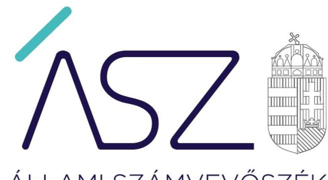
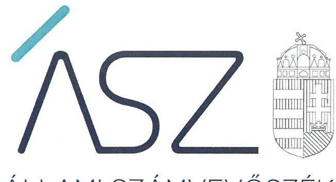
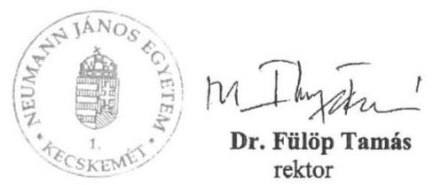

ÁLLAMI SZÁMVEVŐSZÉK

# JELENTÉS 

A központi költségvetési szervek ellenőrzése -
Vagyongazdálkodás

Neumann János Egyetem
2021.

21056
www.asz.hu

---

ÁLLAMI SZÁMVEVŐSZÉK

# JELENTÉS 

## A központi költségvetési szervek ellenőrzése Vagyongazdálkodás

Neumann János Egyetem
2021. 06. hó 03. nap

21056
www.asz.hu

---

# AZ ELLENŐRZÉST FELÜGYELTE: 

DR. NÉMETH ERZSÉBET felügyeleti vezető
PETŐ KRISZTINA felügyeleti vezető

## AZ ELLENŐRZÉST VEZETTE ÉS A VÉGREHAJTÁSÁÉRT FELELŐS:

KUSZINGER ANDREA ellenőrzésvezető
SIPOSNÉ DÓCZI KLÁRA ellenőrzésvezető
DR. NAGY IMRE ellenőrzésvezető

A PROGRAM ÖSSZEÁLLÍTÁSÁÉRT FELELŐS:
GÖRGÉNYI GÁBOR ETAMO osztályvezető

Jelentéseink az Országgyűlés számítógépes hálózatán és az interneten a www.asz.hu címen is olvashatóak.

IKTATÓSZÁM: EL-3231-001/2021.
TÉMASZÁM: 2549
ELLENŐRZÉS-AZONOSÍTÓ SZÁM: V089306

---

# TARTALOMJEGYZÉK 

■ ÖSSZEGZÉS ..... 5
■ AZ ELLENŐRZÉS CÉLJA ..... 6
■ AZ ELLENŐRZÉS TERÜLETE ..... 7
■ AZ ELLENŐRZÉS HÁTTERE, INDOKOLTSÁGA ..... 8
■ A JELENTÉS LÉNYEGES KÉRDÉSKÖREI ..... 9
■ AZ ELLENŐRZÉS HATÓKÖRE ÉS MÓDSZEREI ..... 10
■ MEGÁLLAPÍTÁSOK ..... 12
■ MELLÉKLETEK ..... 15
I. sz. melléklet: Értelmező szótár ..... 15
■ FÜGGELÉK: ÉSZREVÉTELEK ..... 17
■ RÖVIDÍTÉSEK JEGYZÉKE ..... 27

---

.

---

# ÖSSZEGZÉS 

A Neumann János Egyetem vagyongazdálkodása a 2017-2019. közötti időszakban, valamint a 2020. évben a fenntartóváltás időpontjáig nem volt átlátható és elszámoltatható, nem biztosította a közfeladat ellátását szolgáló nemzeti vagyon megőrzését és védelmét.

## Az ellenőrzés társadalmi indokoltsága

Az államháztartás központi alrendszerébe tartozó szervezet vagyona a nemzeti vagyon része. Magyarország Alaptörvénye rögzíti, hogy a vagyonnal való gazdálkodás célja a közérdek szolgálata. Magyarország versenyképessége szoros kapcsolatban van a felsőoktatás minőségével, amely nem képzelhető el hatékony és eredményes közpénz felhasználás nélkül.

Az ellenőrzést indokolja az is, hogy a Neumann János Egyetem a felsőoktatási modellváltással érintett intézmények közé tartozik. A vagyonjuttatásról rendelkező jogszabály szerint: „A regionális szerepet erősíteni tudó, ezen keresztül az innovációt támogatni kész magyar felsőoktatási intézményrendszer és környezetének megerősítése, a képzést folytató oktatók, kutatók, tanárok, a képzésben részt vevők támogatása érdekében" a Neumann János Egyetem fenntartói jogait, amelyeket eddig az állam nevében az illetékes miniszter gyakorolt, a kormány által létrehozott közérdekű vagyonkezelő alapítvány vette át, és azokat az alapítvány kuratóriuma gyakorolja.

Az Állami Számvevőszék tanácsadó funkciója keretében az ellenőrzési megállapításokon keresztül támogatja a közfeladathoz kapcsolódó vagyonnal való hatékony és eredményes gazdálkodást azzal, hogy felhívja a figyelmet a fenntartóváltással érintett felsőoktatási intézmények vagyongazdálkodásának kockázatos pontjaira.

## Főbb megállapítások, következtetések

A Neumann János Egyetem vagyongazdálkodásának szabályozása 2017-ben a számlarend hiánya miatt nem biztosította a szabályszerű könyvvezetés alapvető feltételeit. 2018-tól a Neumann János Egyetem a szabályszerű könyvvezetés alapvető feltételeit kialakította.

A Neumann János Egyetemnél a 2017-2019. közötti időszakban a vagyon kimutatása területén feltárt hiányosságok miatt a nemzeti vagyon védelme nem volt biztosított. A fenntartóváltás fordulónapjára a 2020. évben a Neumann János Egyetem a záró beszámolót nem készítette el. Ezáltal a fenntartóváltás időpontjában nem volt biztosított a számviteli nyilvántartásaiban szereplő vagyonelemek szabályszerű kimutatása, és nem volt igazolt azok megléte.

2017-2019. között a Neumann János Egyetem működésében és gazdálkodásában a teljesítményelv nem érvényesült.

Az ellenőrzés megállapításai alapján levonható a következtetés, hogy a Neumann János Egyetemen a kancellári rendszer bevezetése sem biztosította a nemzeti vagyon védelmét, indokolt volt a tulajdonosi joggyakorlás kereteinek megerősítése.

---

# AZ ELLENŐRZÉS CÉLJA

**AZ ELLENŐRZÉS CÉLJA** annak megállapítása, hogy a központi költségvetési szerv jó gazda gondosságával biztosította-e a nemzeti vagyon értékének megőrzését, védelmét és szabályszerű kezelését. Az államháztartás központi alrendszerébe tartozó szervezet vagyongazdálkodása elszámoltatható volt-e és megfelel-e annak az Alaptörvényben meghatározott alapvetésnek, hogy Magyarország a kiegyensúlyozott, átlátható és fenntartható költségvetési gazdálkodás elvét érvényesíti.

---

# **AZ ELLENŐRZÉS TERÜLETE**

## **Neumann János Egyetem**

A Neumann János Egyetem feletti alapítói jogok gyakorlója az Országgyűlés, irányító szerve és fenntartója az ellenőrzött időszakban 2019. szeptember 1-ig az Emberi Erőforrások Minisztériuma, 2019. szeptember 1-től az Innovációs és Technológiai Minisztérium volt. Az Egyetem alaptevékenysége felsőfokú oktatás, közfeladata oktatási, tudományos kutatási tevékenység folytatása volt. Illetékessége, működési területe Magyarország területe, a felvehető maximális hallgatólétszáma 6545 fő volt.

Az Egyetem¹ a Kecskeméti Főiskola és Szolnoki Főiskola jogutód intézményeként, alkalmazott tudományok egyetemeként jött létre 2016. július 1-i hatállyal, Pallasz Athéné Egyetem elnevezéssel. Neumann János Egyetem néven 2017. augusztus 1-től működik, székhelye Kecskemét.

Az Egyetem vezetésével kapcsolatos feladatokat a szenátus, a rektor és a kancellár látta el. Az ellenőrzött időszakban a rektor személye 2019. augusztus 1-től változott, a kancellár személye nem változott. Ugyanakkor vezetői megbízása 2019. június 30-án lejárt, újbóli kinevezése 2019. október 1-től történt.

Az Egyetem jogi státusza 2020. augusztus 1-től az Egyetem fenntartóváltásáról szóló törvény² szerint közhasznú vagyonkezelő alapítvány fenntartásában álló felsőoktatási intézményre változott.

---

# AZ ELLENŐRZÉS HÁTTERE, INDOKOLTSÁGA 

Az államháztartás központi alrendszerébe tartozó szervezet vagyona a nemzeti vagyon része, mellyel történő gazdálkodás a közérdek szolgálata érdekében történik. Az ÁSZ³ ellenőrzi az éves költségvetési törvény végrehajtását, majd az ellenőrzés során feltárt kockázatok és a terület folyamatos kockázatelemzésével beazonosított kockázatok kezelése érdekében ráépülő ellenőrzésekkel ellenőrzi a költségvetési szervek gazdálkodását, működését. Ezáltal az ellenőrzések megállapításaival támogatja az ellenőrzött szervezetek szabályszerű gazdálkodását, javaslataival elősegíti az Alaptörvényben megfogalmazott alapvetések érvényesülését a mindennapi életben a szervezetek szintjén.

Az Nftv.⁴ előírásai értelmében a magyar állam által működtetett felsőoktatási intézmény fenntartói joga, mint vagyoni értékű jog - a Kormány külön engedélyével - a Kormány által létrehozott alapítványra átruházható. A fenntartóváltással érintett felsőoktatási intézménynek az Nftv. előírásai alapján a fenntartóváltás napját megelőző fordulónappal az államháztartási számviteli szabályok szerinti záró beszámolót kell készítenie.

A központi költségvetés rendszerében zajló folyamatok holisztikus elemzései, a kockázatok folyamatos figyelemmel kísérésének módszerével, az így kiválasztott szervezetek célzott, hatékony ellenőrzéseivel az ÁSZ betölti a legfőbb gazdasági ellenőrző szerv küldetését. Az egyes ellenőrzések megállapításaival és egy időszak ellenőrzési eredményeinek elemzésével az ÁSZ ráirányíthatja a jogalkotók figyelmét a központi alrendszerben vagy annak egy ágazatában esetlegesen felmerülő vagyongazdálkodási, szabályozási feszültségekre.

---

# A JELENTÉS LÉNYEGES KÉRDÉSKÖREI 

1.     - Biztosított volt-e az Egyetemnél a vagyongazdálkodás szabályozottsága?
2.     - A nemzeti vagyon nyilvántartását és kimutatását a valóságnak megfelelő módon, szabályszerűen végezte-e az Egyetem, biztosított volt-e a nemzeti vagyon védelme?
3.     - Az Egyetem a fenntartóváltás során a használatában levő vagyontárgyakat szabályszerűen mutatta-e ki a záró beszámolójában, biztosított volt-e a nemzeti vagyon megőrzése?
4. Az Egyetemnél kialakították-e a teljesítmény mérésére alkalmas követelményeket?

---

# AZ ELLENŐRZÉS HATÓKÖRE ÉS MÓDSZEREI 

## Az ellenőrzés típusa

Megfelelőségi ellenőrzés.

## Az ellenőrzött időszak

2017., 2018., 2019. évek, továbbá 2020. január 1-jétől a felsőoktatási intézmény Nftv. szerinti fenntartóváltásának napjáig, 2020. július 31-ig terjedő időszak.

## Az ellenőrzés tárgya

A központi költségvetési szerv vagyongazdálkodási feltételeinek kialakítása, annak szabályszerűsége, az elszámoltathatóság biztosítása a szabályozás szintjén. Az intézménynél hozott vagyonváltozást eredményező döntések, a vagyonban bekövetkezett változások végrehajtásának, elszámolásának szabályszerűsége. Az intézmény könyveiben, mérlegében kimutatott nemzeti vagyon nyilvántartásának szabályszerűsége, vagyon kimutatása, értékelése és a mérleg leltárral való alátámasztásának szabályszerűsége.

## Az ellenőrzött szervezet

Neumann János Egyetem

## Az ellenőrzés jogalapja

Az ellenőrzés jogszabályi alapját az ÁSZ tv.⁵ 1. § (3) bekezdés, 5. § (2)-(4) és (6) bekezdései, valamint az Áht.⁶ 61. § (2) bekezdésének előírásai képezik.

## Az ellenőrzés módszerei

Az ÁSZ az ellenőrzést az ellenőrzési program szempontjai, az ellenőrzött időszakban hatályos jogszabályok, az ellenőrzés szakmai szabályai, a jelen ellenőrzésre irányadó ÁSZ módszertanok figyelembevételével hajtotta végre. Az 1-2. és 4. kérdéskör tekintetében az ellenőrzés a 2018-2019. évekre vonatkozott, a 3. kérdéskör esetében az ellenőrzött időszak 2020. január 1-jétől a felsőoktatási intézmény Nftv. szerinti fenntartóváltásának napjáig tartott.

---

Az ellenőrzési kérdések megválaszolásához szükséges bizonyítékok megszerzése az ellenőrzött szervezet által rendelkezésre bocsátott dokumentumokra és adatokra alapozva, továbbá megfigyelés, szemle (szemrevételezés), kérdésfeltevés (információkérés), valamint elemző eljárás útján történt. Az ellenőrzési bizonyítékként felhasználható adatforrások közé tartoztak az ellenőrzési program részletes szempontjainál felsorolt adatforrások, valamint minden egyéb - az ellenőrzés folyamán feltárt, az ellenőrzés szempontjából információt tartalmazó - dokumentum.
Az ellenőrzés lefolytatásához az ellenőrzött szervezet tanúsítvány kitöltésével, valamint az ÁSZ által kért dokumentumok megküldésével szolgáltatott adatokat, amelyekről az ellenőrzött szervezet vezetője teljességi és hitelességi nyilatkozatot állított ki. A rendelkezésre bocsátott dokumentumok, adatok és információk kontrollja az ellenőrzés keretében történt.

A vagyonnövekedések és vagyoncsökkenések elszámolása, a vagyon nyilvántartása és a vagyontárgyak év végi értékelésének szabályszerűsége lényeges sokaságon alapuló egyszerű véletlen mintavétellel történt. A vizsgált terület „szabályszerű" minősítést kapott, ha a minta ellenőrzésének eredménye alapján 95%-os bizonyossággal a teljes sokaságban az átlagos hibaarány nem haladta meg a 10%-ot, „nem szabályszerű" minősítést kapott, ha nagyobb volt, mint 10%. Abban az esetben, ha a teljes sokaság tekintetében a 10%-os hibaarányhoz való viszony megítélésének megbízhatósága nem érte el a 95%-ot, annak elérése érdekében az értékelés további szempontokkal egészült ki, a feltárt hibák értéke is figyelembe vételre került. Amennyiben a sokaság elemszáma nem haladta meg az előírt minta elemszámot, akkor a sokaság valamennyi elemének tételes ellenőrzésére került sor.

---

# 1. Biztosított volt-e az Egyetemnél a vagyongazdálkodás szabályozottsága? 

Összegző megállapítás

Az Egyetemnél a vagyongazdálkodás szabályozottsága 2017-ben nem volt biztosított, 2018-ban és 2019-ben biztosított volt.

Az Egyetem rendelkezett Számviteli politikával, melynek keretében elkészítette az eszközök és források leltározási és leltárkészítési szabályzatát és értékelési szabályzatát.

Ugyanakkor az Egyetem a 2017. évben nem teremtette meg a szabályszerű könyvvezetés szabályozási feltételeit, mert a Számv. tv.⁷ 161. § (1) és (4) bekezdésében, valamint az Áhsz.⁸ 51. § (2) bekezdésében foglaltak ellenére 2018. április 14-ig nem rendelkezett számlarenddel. Ennek következtében az Egyetem nem határozta meg a Számv. tv. 161. § (2) bekezdés a) és c) pontjaiban előírtak ellenére az alkalmazásra kijelölt számlák számjelét és megnevezését, valamint a főkönyvi számla és az analitikus nyilvántartás kapcsolatát.

A 2018. április 14-től hatályos számlarend elkészítésével az Egyetem 2018-tól kialakította a szabályszerű könyvvezetés szabályozási feltételeit.

## 2. A nemzeti vagyon nyilvántartását és kimutatását a valóságnak megfelelő módon, szabályszerűen végezte-e az Egyetem, biztosított volt-e a nemzeti vagyon védelme?

## Összegző megállapítás

Az Egyetemnél a nemzeti vagyon kimutatása 2017-2019. között, és a vagyon nyilvántartása 2019-ben nem volt szabályszerű, nem biztosította a nemzeti vagyon védelmét.

Az Egyetem a nemzeti vagyon kimutatását nem szabályszerűen végezte, mert a 2017-2019. közötti időszakban nem készített az Áhsz. 5. § (1) bekezdésében és 22. § (1) bekezdésében, a Számv. tv. 69. § (1) bekezdésében előírtak szerinti leltárt, amely tételesen és ellenőrizhető módon tartalmazta volna a mérlegben szereplő eszközöket és forrásokat mennyiségben és értékben, továbbá a Leltározási szabályzat 1. §-a szerint a használt, de a mérlegben értékkel nem szereplő immateriális javakat, tárgyi eszközöket, készleteket mennyiségben.

A 2019. évben az Egyetemnél a vagyon nyilvántartása nem volt szabályszerű, mert az ellenőrzött vagyonnövekedések esetében a vagyontárgyak részletező nyilvántartását nem az Áhsz. 45. § (3) bekezdése és 14. melléklete VII. pont 1. pontjában előírt tartalommal vezették.

---

# 3. Az Egyetem a fenntartóváltás során a használatában levő vagyontárgyakat szabályszerűen
 mutatta-e ki a záró beszámolójában, biztosított volt-e a nemzeti vagyon megőrzése? 

## Összegző megállapítás

A 2020. évi fenntartóváltás során az Egyetemnél a nemzeti vagyon kimutatása nem volt szabályszerű, a nemzeti vagyon megőrzése nem volt biztosított.

Az Egyetem a 2020. évben a vagyonnal való gazdálkodása során a nemzeti vagyon kimutatását nem szabályszerűen végezte, mert az Nftv. 117/C. § (4a) bekezdésében és az Áhsz. 5. § (1) bekezdésében előírtak ellenére nem készítette el a fenntartóváltás napját megelőző fordulónappal a záró beszámolót.

## 4. Az Egyetemnél kialakították-e a teljesítmény mérésére alkalmas követelményeket?

## Összegző megállapítás

Az Egyetemnél nem alakítottak ki a teljesítmény mérésére alkalmas követelményeket.

Az Egyetemnél nem alakítottak ki a szervezeti célok elérését szolgáló feladatok, folyamatok, tevékenységek mérésére használható indikátorokat, mérőszámokat, feladat- és teljesítménymutatókat, amelyek alkalmasak a szervezeti tevékenység teljesítményének mérésére a Bkr. ${ }^{9}$ 2. § g), i), j) pontjaiban meghatározott eredményesség, gazdaságosság és hatékonyság követelményeinek érvényesítése érdekében.

Ezzel a teljesítmény mérésének lehetőségét nem biztosították és nem teremtették meg annak előfeltételeit, hogy a Bkr. 4. § a) pontjának előírásaival összhangban biztosítsák a költségvetési szerv valamennyi tevékenységének és céljának összhangját a gazdaságosság, hatékonyság és eredményesség követelményeivel.

---

.

---

# MELLÉKLETEK 

- I. SZ. MELLÉKLET: ÉRTELMEZŐ SZÓTÁR
állami vagyon
irányító szerv
nemzeti vagyon
tulajdonosi joggyakorló

Állami vagyonnak minősül:
a) az állam tulajdonában lévő dolog, valamint a dolog módjára hasznosítható természeti erő,
b) az a) pont hatálya alá nem tartozó mindazon vagyon, amely vonatkozásában törvény az állam kizárólagos tulajdonjogát nevesíti,
c) az állam tulajdonában lévő tagsági jogviszonyt megtestesítő értékpapír, illetve az államot megillető egyéb társasági részesedés,
d) az államot megillető olyan immateriális, vagyoni értékkel rendelkező jogosultság, amelyet jogszabály vagyoni értékű jogként nevesít,
e) az állam tulajdonában lévő pénzügyi eszközök.
(Forrás: Vtv. ${ }^{10}$ 1. § (2) bekezdése)
A költségvetési szerv tekintetében az e törvényben meghatározott irányítási hatáskört gyakorló szerv. (Forrás: Áht. 1. § 9. pontja)
a) az állam vagy a helyi önkormányzat kizárólagos tulajdonában álló dolgok,
b) az a) pont hatálya alá nem tartozó, az állam vagy a helyi önkormányzat tulajdonában lévő dolog,
c) az állam vagy a helyi önkormányzat tulajdonában lévő pénzügyi eszközök, továbbá az államot vagy a helyi önkormányzatot megillető társasági részesedések,
d) az államot vagy a helyi önkormányzatot megillető bármely vagyoni értékkel rendelkező jogosultság, amelyet jogszabály vagyoni értékű jogként nevesít,
e) Magyarország határa által körbezárt terület feletti légtér,
f) az üvegházhatású gázok kibocsátási egységeinek kereskedelméről szóló törvény szerinti kibocsátási egység és légiközlekedési kibocsátási egység, valamint az ENSZ
Éghajlatváltozási Keretegyezménye és annak Kiotói Jegyzőkönyve végrehajtási keretrendszeréről szóló törvény szerinti kiotói egység,
g) állami vagy helyi önkormányzati fenntartású közgyűjtemény (muzeális intézmény, levéltár, közgyűjteményként működő kép- és hangarchívum, valamint könyvtár) saját gyűjteményében nyilvántartott kulturális javak körébe tartozó dolog, kivéve, ha az állami vagy önkormányzati tulajdon jogszerű létrejötte kétséget kizáró módon nem bizonyítható és a dologra nézve más a tulajdonjogát bizonyítja vagy a kulturális javakra vonatkozó jogszabályokban meghatározott eljárás keretében valószínűsíti,
h) a régészeti lelet,
i) a nemzeti adatvagyon körébe tartozó állami nyilvántartások fokozottabb védelméről szóló törvény szerinti nemzeti adatvagyon (Forrás: Nvtv. ${ }^{11}$ 2. § (2) bekezdés a)-i) pontok).
Aki a nemzeti vagyon felett az államot vagy a helyi önkormányzatot megillető tulajdonosi jogok és kötelezettségek összességének gyakorlására jogosult. (Forrás: Nvtv. 3. § (1) bekezdés 17. pontja)

---

vagyongazdálkodás

A nemzeti vagyongazdálkodás feladata a nemzeti vagyon rendeltetésének megfelelő, az állam, az önkormányzat mindenkori teherbíró képességéhez igazodó, elsődlegesen a közfeladatok ellátásához és a mindenkori társadalmi szükségletek kielégítéséhez szükséges, egységes elveken alapuló, átlátható, hatékony és költségtakarékos működtetése, értékének megőrzése, állagának védelme, értéknövelő használata, hasznosítása, gyarapítása, továbbá az állam vagy a helyi önkormányzat feladatának ellátása szempontjából feleslegessé váló vagyontárgyak elidegenítése. (Forrás: Nvtv. 7. § (2) bekezdése)

---

# FÜGGELÉK: ÉSZREVÉTELEK 

A jelentéstervezetet a Számvevőszék 15 napos észrevételezésre megküldte az ellenőrzött szervezet vezetőjének az ÁSZ tv. 29. §* (1) bekezdése előírásának megfelelően.

A Neumann János Egyetem rektora a jelentéstervezet megállapításaira észrevételt tett. Az ÁSZ tv. 29. § (3) bekezdésével összhangban az ÁSZ a Függelékben feltünteti a jelentéstervezet megállapításaival kapcsolatban tett, figyelembe nem vett észrevételeket, és megindokolja, hogy azokat miért nem fogadta el.

[^0]
[^0]:    * 29. § (1) Az Állami Számvevőszék az ellenőrzési megállapításait megküldi az ellenőrzött szervezet vezetőjének vagy az általa megbízott személynek, és annak, akinek személyes felelősségét állapította meg.
    (2) Az ellenőrzött szervezet vezetője és a felelősként megjelölt személy az ellenőrzés megállapításaira tizenöt napon belül írásban észrevételt tehet.
    (3) Az Állami Számvevőszék az észrevételre a beérkezésétől számított harminc napon belül írásban válaszol. A figyelembe nem vett észrevételeket köteles a jelentésben feltüntetni, és megindokolni, hogy azokat miért nem fogadta el.

---

# NEUMANN JÁNOS EGYETEM 

## RÉKTOR

## Állami Számvevőszék

Iktatószám: NJE-GI-PSZI/24/2021
Tárgy: ÁSZ ellenőrzési jelentéstervezetre észrevétel
Hivatkozási szám: EL-2800-090/2021

## Domokos László

elnök

## BUDAPEST

Apáczai Csere János u. 10.
1052

## Tisztelt Elnök Úr!

Köszönettel megkaptam Öntől az EL-2800-090/2021. számú „A Központi költségvetési szervek ellenőrzése - Vagyongazdálkodás - Neumann János Egyetem" című számvevőszéki jelentéstervezetet, amelynek megállapításaira az alábbi észrevételeket kívánom tenni.

1) Biztosított volt-e az Egyetemnél a vagyongazdálkodás szabályozottsága?

Összegző megállapítás: Az Egyetemnél a vagyongazdálkodás szabályozottsága 2017-ben nem volt biztosított, 2018-ban és 2019-ben biztosított volt.

## Észrevétel:

A Kecskeméti Főiskola 2015. október 10-én kiadott Számlarendje az államháztartás számviteléről szóló 4/2013.(I.11.) Korm.rendelet (továbbiakban: Ahsz) és az Szt. alapján készült el és tartalmazta az alkalmazásra kijelölt számlák számjelét és megnevezését, valamint a főkönyvi számlák és az analitikus nyilvántartás kapcsolatát. A Neumann János Egyetem könyvvezetésének szabályszerű feltételei 2017-ben a jogelőd Kecskeméti Főiskola hatályos Számlarendjében foglaltak szerint biztosítottak voltak. 2018-tól a szabályszerű könyvvezetés szabályozási feltételeit az Egyetem 2018. április 14-től hatályos számlarendje biztosította.
2) A nemzeti vagyon nyilvántartását és kimutatását a valóságnak megfelelő módon, szabályszerűen végezte-e az Egyetem, biztosított volt-e nemzeti vagyon védelme?
Összegző megállapítás: Az Egyetemnél a nemzeti vagyon kimutatása 2017-2019. között, és a vagyon nyilvántartása 2019-ben nem volt szabályszerű, nem biztosította a nemzeti vagyon védelmét.

## Észrevétel:

Az Egyetem rendelkezett Számviteli politikával, melynek keretében elkészítette az eszközök és források leltározási és leltárkészítési szabályzatát. A Szabályzatban foglaltaknak megfelelően, az Egyetem 2017. december 31-i és 2019. december 31-ei fordulónappal a mérlegben szereplő eszközöket és forrásokat mennyiségben és értékben, valamint a használt és a mérlegben értékkel nem bíró immateriális javak, tárgyi eszközök és készleteket mennyiségben felleltározta.

Az Egyetem Vállalkozási keretszerződést kötött az SDA informatika Zrt-vel a Neptun Egységes Intézményirányítási Rendszer (továbbiakban: SAP) technológiai és jogszabálykövetésére, támogatására, valamint a kapcsolódó szolgáltatások nyújtására. A vagyon nyilvántartása 2019.

---

# NEUMANN JÁNOS EGYETEM 

## REKTOR

január 01. napjától az SAP Neptun Gazdálkodási moduljában valósult meg, amely biztosította az Ahsz. 45. § (3) bekezdése valamint a 14. számú melléklet VII. bekezdésének 1. pontjában előírt tartalmat.
3) Az Egyetem a fenntartóváltás során a használatában levő vagyontárgyakat szabályszerűen mutatta-e ki a záró beszámolójában, biztosított volt-e a nemzeti vagyon megőrzése?
Összegzö megállapítás: A 2020. évi fenntartóváltás során az Egyetemnél a nemzeti vagyon kimutatása nem volt szabályszerű, a nemzeti vagyon megőrzése nem volt biztosított.

Észrevétel: Az Egyetem az Ahsz 5. § (1) bekezdésében és a 32. § (1) bekezdésében foglaltaknak megfelelően a fenntartóváltást megelőző fordulónapra készített záró beszámolót a megszünés napját követő 60 napon belül - 2020. szeptember 29-én - a Kincstár által működtetett elektronikus adatszolgáltató rendszerbe feltöltötte - a főkönyvi kivonattal együtt. A feltöltést igazoló bizonylatot jelen levelünk 1.sz Melléklete tartalmazza.
4) Az Egyetemnél kialakították-e a teljesítmény mérésére alkalmas követelményeket?

Összegzö megállapítás: Az Egyetemnél nem alakítottak ki a teljesítmény mérésére alkalmas követelményeket.

Észrevétel: Az Egyetem Ellenőrzési nyomvonaláról szóló 1/2018. számú rektori-kancellári utasítás tartalmazza azokat a folyamatokat, amelyek alkalmasak a szervezeti tevékenység teljesítményének a mérésére a Bkr. 2. § g), i), j) pontjaiban meghatározott eredményesség, gazdaságosság, és hatékonyság követelményeinek az érvényesítésére, mint pl.

- lejárt tartozások kezelése és behajtása,
- intézményfejlesztés,
- minőségirányítás,
- HR gazdálkodás,
- beszerzési eljárások

Az 1/2018 számú rektori-kancellári utasítást jelen levelünk 2. sz Melléklete tartalmazza.
Az Egyetem 2017-2019 időszakában az alábbi szervezeti változások következtek be, amelyek késleltették a teljesítmény mérésére alkalmas követelmények egységes szempontok szerinti gyakorlati kialakítását:

A jogelőd Kecskemét Főiskola és a Szolnoki Főiskola integrációjával a nemzeti felsőoktatásról szóló 2011. évi CCIV. törvény (továbbiakban: Nftv.) 115. § (18) bekezdése alapján 2016. július 1. napján jött létre a jogutód Pallasz Athéné Egyetem. 2017. augusztus 1. napjától az Nftv. 115. § (18a) bekezdése szerinti névváltozás alapján az Intézmény Neumann János Egyetem néven működött tovább.

A Debreceni Egyetem Szenátusa a 32/2019. (I.24) számú határozatával megerősített szándéknyilatkozata és a Neumann János Egyetem Szenátusa az 1/2019. (02. 14.) számú határozatával megerősített szándéknyilatkozata, valamint az Emberi Erőforrások Minisztériuma a 12452-3/2019/FIRFIN számon meghozott fenntartói döntése alapján a Neumann János Egyetem Gazdálkodási Kara (Szolnok), a Neumann János Egyetem szervezetéből kivált, és a Debreceni Egyetem szervezetébe olvadt be 2019. augusztus 1. napi hatállyal.

---

A fent felsorolt észrevételeket alátámasztó dokumentumok az ÁSZ elektronikus felületére az adatszolgáltatás időpontjában feltöltésre kerültek.

Kecskemét, 2021. április 26.

Tisztelettel:

---

# Függelék: Észrevételek 

## 150 150 éve   a közpénzek őre

Ikt. szám: EL-2800-093/2021.

Dr. Fülöp Tamás Ferenc úr
rektor
Neumann János Egyetem

## Kecskemét

Tisztelt Rektor Úr!
„A központi költségvetési szervek ellenőrzése - Vagyongazdálkodás - Neumann János Egyetem" című ellenőrzés megállapításaira a 2021. április 26-án kelt, NJE-GI-PSZI/24/2021. iktatószámú levelében megküldött észrevételeit megkaptam.

Az Állami Számvevőszék (továbbiakban: ÁSZ) észrevételre vonatkozó álláspontjáról a felügyeleti vezető által készített részletes tájékoztatást csatoltan megküldöm.

Tájékoztatom Rektor urat, hogy a számvevőszéki jelentésben - az Állami Számvevőszékről szóló 2011. évi LXVI. törvény (továbbiakban: ÁSZ tv.) 29. § (3) bekezdése alapján - a figyelembe nem vett észrevételeket szerepeltetjük az elutasítás indokának feltüntetésével.

Budapest, 2021. május 28.

Tisztelettel:

Domokos László s.k.

Melléklet: Tájékoztatás az észrevétel kezeléséről

---

# Tájékoztatás az észrevétel kezeléséről 

„A központi költségvetési szervek ellenőrzése - Vagyongazdálkodás - Neumann János Egyetem" című ellenőrzés megállapításaira a 2021. április 26-án kelt, NJE-GI-PSZI/24/2021. iktatószámú levelében megküldött észrevételeket áttekintettem. Az észrevételek kezeléséről az alábbi tájékoztatást adom.

1. A jelentéstervezet 1. megállapítás 2. bekezdésében a számlarenddel kapcsolatos megállapításra tett észrevétele
Rektor úr észrevétele szerint a Kecskeméti Főiskola 2015. október 10-én kiadott Számlarendje alapján az Egyetem könyvvezetésének szabályszerű feltételei 2017-ben biztosítottak voltak.
Tájékoztatom, hogy a 2020. augusztus 13-án kelt teljességi és hitelességi nyilatkozat alapján nem került az ellenőrzés során olyan bizonyíték rendelkezésre bocsátásra, mely az észrevételében jelzett Számlarend 2015. október 10-én történő kiadását igazolná. Az adatszolgáltatási felületen rendelkezésre bocsátott adat ezt nem támasztja alá.
Az ÁSZ az EL-2800-005/2020. iktatószámú levél 3. mellékletében a Neumann János Egyetem (továbbiakban: Egyetem) aláírt, hiteles számlarendjét kérte be. Rektor úr meghatalmazottja nyilatkozott az adatszolgáltatás során arról, hogy az ÁSZ részére átadott dokumentumok, adatok megbízhatóak, és a bekért adatokra, dokumentumokra vonatkozóan teljes körű információt tartalmaznak.

A fenti körülményeket az ÁSZ a jelentés készítésénél felhasználja.
2. A
 jelentéstervezet 2. megállapításában a vagyon kimutatásával kapcsolatos megállapításra tett észrevétele
Rektor úr észrevétele szerint az Egyetem rendelkezett Számviteli politikával, melynek keretében elkészítette az eszközök és források leltározási és leltárkészítési szabályzatát. A szabályzatban foglaltaknak megfelelően, az Egyetem 2017. december 31-i és 2019. december 31-ei fordulónappal a mérlegben szereplő eszközöket és forrásokat mennyiségben és értékben, valamint a használt és a mérlegben értékkel nem bíró immateriális javak, tárgyi eszközök és készleteket mennyiségben felleltározta. Észrevételében jelezte továbbá, hogy a vagyon nyilvántartása 2019. január 1-jétől az SAP Neptun Gazdálkodási moduljában valósult meg, amely biztosította az államháztartás számviteléről szóló 4/2013. (I. 11.) Korm. rendelet (továbbiakban: Áhsz.) 45. § (3) bekezdése, valamint a 14. számú melléklet VII. bekezdésének 1. pontjában előírt tartalmat.
Az ÁSZ az EL-2800-001/2020. iktatószámú levél 3. mellékletében kérte be az Egyetemtől a 2017., 2018., 2019. évi mérleg tételeit alátámasztó leltárakat, beleértve a használt, de a mérlegben értékkel nem szereplő immateriális javakat, tárgyi eszközöket, készleteket is, valamint az EL-2800-005/2020. iktatószámú levél 3. mellékletében a mennyiségi felvétellel történő leltározást igazoló záró jegyzőkönyveit és a leltári különbözetek elszámolását, a leltár eltérések okainak kivizsgálását alátámasztó dokumentumokat.
Rektor úr meghatalmazottja a 2020. július 20-án, illetve a 2020. augusztus 13-án kelt teljességi és hitelességi nyilatkozatokban nyilatkozott az adatszolgáltatás során arról, hogy az ÁSZ részére átadott

---

dokumentumok, adatok megbízhatóak, és a bekért adatokra, dokumentumokra vonatkozóan teljes körű információt tartalmaznak.

Az Egyetem által rendelkezésre bocsátott dokumentumok felülvizsgálata alapján megállapítható, hogy 2017. évben a leltár nem volt teljes körű, mivel a B/I/1 Vásárolt készleteknél a főkönyvi számlaszámok/kódok szerinti leltár kimutatás volt, de tételes, ellenőrizhető leltárral nem rendelkezett. A B/I/4 Befejezetlen termelés értéke a Kertész és Vidékfejlesztési Kar mezei leltárával alátámasztott, a félkész és késztermékek értéke tételes leltárral nem volt alátámasztva, csak értékbeli adatokat tartalmazott. Továbbá a C/I/2 Kincstárban vezetett devizaszámlák sornál a 2017. december 22-ei kivonat nem tartalmazta az átszámolási árfolyamot és azt sem, hogy milyen árfolyamot használtak, továbbá nem igazolt, hogy az adott évben ténylegesen ez a bankkivonat az utolsó. Az Egyetem nem bocsátotta az ellenőrzés rendelkezésére a leltározást lezáró jegyzőkönyv mellékleteit.
A 2018. évi leltárral kapcsolatosan megállapítható, hogy a B/Nemzeti vagyonba tartozó forgóeszközök esetén a mérlegsorok értéke értékbeni adatokkal igen, de mennyiségi adatokkal nem volt alátámasztva (B/I/1 Vásárolt készletek és B/I/4 Befejezetlen termelés, félkész termékek, késztermékek - a Leltározási szabályzat 2/A. § 1. és 3. pontjának megfelelően informatikai rendszerből, elektronikus formában mentett állomány a termékek egyedi azonosítóját, cikk kódját és a nyilvántartás szerinti értékét tartalmazta, mennyiséget nem, a leltárfelvétel módja a rendelkezésre álló dokumentumokból nem ismert). A Követelések mérlegsoroknál az E/I/3 Adott előleghez kapcsolódó előzetesen felszámított nem levonható általános forgalmi adó és az E/I/4 Más előzetesen felszámított nem levonható általános forgalmi adó tételeket analitika nem támasztotta alá, az E/I/2 Más fizetendő általános forgalmi adó sor értéke nem egyezett meg az áfa bevallásban szereplő fizetendő adó összegével. Továbbá a Kötelezettségek mérlegsoroknál a H/III/9 Nemzetközi támogatási programok pénzeszközei sor nem volt leltárral alátámasztva. Az Egyetem nem bocsátotta az ellenőrzés rendelkezésére a leltározást lezáró jegyzőkönyvet.
Az Egyetem 2019-re vonatkozóan nem bocsátott az ellenőrzés rendelkezésére olyan dokumentumot, amely igazolná, hogy az Áhsz. 22. § (2) bekezdése b) pontjában foglaltak szerint a használt, de a mérlegben értékkel nem szereplő immateriális javak, tárgyi eszközök készletek leltározását, továbbá az Áhsz. 53. § (8) bekezdése b) pontja előírásai szerint az éves könyvviteli zárlat keretében a leltáreltérések okainak kivizsgálását elvégezték volna.
Az ÁSZ az EL-2800-035/2020. iktatószámú helyszíni adatbekérés során felvett jegyzőkönyvben, a vagyonnövekedés 2019. évi mintatételeihez kapcsoló 6. pontban kérte az Egyetemtől a vagyontárgyak részletező nyilvántartását az Áhsz.-ben előírt kötelező minimum adattartalommal.
Rektor úr meghatalmazottja a 2020. október 7-én kelt teljességi és hitelességi nyilatkozatban nyilatkozott az adatszolgáltatás során arról, hogy az ÁSZ részére átadott dokumentumok, adatok megbízhatóak, és a bekért adatokra, dokumentumokra vonatkozóan teljes körű információt tartalmaznak.
A kiválasztott vagyonnövekedési mintatételekhez az ellenőrzés rendelkezésére bocsátott dokumentumok felülvizsgálata alapján megállapítható, hogy az Egyetem egyedi eszköznyilvántartó kartonokat nem bocsátott az ÁSZ rendelkezésére. A rendelkezésre bocsátott állományba-vételi bizonylatok és főkönyvi kartonok adattartalma nem felelt meg az Áhsz. 45. § (3) bekezdése és 14. melléklete VII. 1. pontjában előírtaknak, mivel azok nem tartalmaznak minden előírt adatot.
A fentiekre tekintettel az észrevételt az ÁSZ nem fogadja el, az ellenőrzés megállapítása helytálló,

---

módosítása nem indokolt.

# 3. A jelentéstervezet 3. megállapításában a záró beszámolóval kapcsolatos megállapításra tett észrevétele 

Rektor úr észrevétele szerint az Egyetem az Áhsz. 5. § (1) bekezdésében és a 32. § (1) bekezdésében foglaltaknak megfelelően a fenntartóváltást megelőző fordulónapra készített záró beszámolót a megszünés napját követő 60 napon belül - 2020. szeptember 29-én - a Kincstár által működtetett elektronikus adatszolgáltató rendszerbe feltöltötte a főkönyvi kivonattal együtt. A feltöltést igazoló bizonylatot az észrevételhez mellékelten az ÁSZ rendelkezésére bocsátják.
Észrevétele az Áhsz. 5. § (1) bekezdésében és a 32. § (1) bekezdésében foglaltaknak megfelelően a fenntartóváltást megelőző fordulónapra készített záró beszámoló a Kincstár által működtetett elektronikus adatszolgáltató rendszerbe való feltöltésére irányul, amelyre vonatkozóan a jelentéstervezet nem tartalmaz megállapítást.
Tájékoztatom, hogy az ÁSZ az EL-2800-032/2020. iktatószámú levél 3. mellékletében az Egyetemtől a fenntartóváltás napját megelőző fordulónappal készített 2020. évi záró beszámoló aláírt, hiteles másolatát kérte be, melyet az Áhsz. 31. § (1) bekezdése is rögzít.
A 2020. október 9-én kelt teljességi és hitelességi nyilatkozattal igazoltan - az adatbekérő levélben foglaltak ellenére - beszámolóként az Egyetem képviseletére jogosult személy aláírása nélküli adatot bocsátottak az ÁSZ rendelkezésére, amelyen továbbá az sem szerepelt, hogy mely fordulónappal, mely időszakra vonatkozóan készült. Rektor úr meghatalmazottja nyilatkozott az adatszolgáltatás során arról, hogy az ÁSZ részére átadott dokumentumok, adatok megbízhatóak, és a bekért adatokra, dokumentumokra vonatkozóan teljes körű információt tartalmaznak. Mindezek alapján nem igazolt, hogy az Egyetem a beszámolókészítési kötelezettségének az államháztartás számviteléről szóló jogszabály szerint eleget tett.
A fenti körülményeket az ÁSZ a jelentés készítésénél felhasználja.

## 4. A jelentéstervezet 4. megállapításában a teljesítmény mérésére alkalmas követelmények kialakításának hiányára vonatkozó megállapításra tett észrevétele

Rektor úr észrevétele szerint az Egyetem Ellenőrzési nyomvonaláról szóló 1/2018. számú rektorikancellári utasítás tartalmazza azokat a folyamatokat, amelyek alkalmasak a szervezeti tevékenység teljesítményének a mérésére a költségvetési szervek belső kontrollrendszeréről és belső ellenőrzéséről szóló 370/2011. (XII. 31.) Korm. rendelet (továbbiakban: Bkr.) 2. § g), i), j) pontjaiban meghatározott eredményesség, gazdaságosság, és hatékonyság követelményeinek az érvényesítésére. Az Egyetemnél 2017-2019 időszakában szervezeti változások következtek be, amelyek késleltették a teljesítmény mérésére alkalmas követelmények egységes szempontok szerinti gyakorlati kialakítását.
Az ÁSZ az EL-2800-049/2020. iktatószámú levél 3. mellékletében kérte be az Egyetemtől a 2017-2019 közötti időszakra vonatkozóan a kialakított gazdaságossági, hatékonysági és eredményességi követelményeket tartalmazó hatályos dokumentumokat (belső szabályozás, megvalósulást mérő indikátorok, monitoring adatok, jelentések/beszámolók).

---

Az ÁSZ ellenőrzési megállapításait kizárólag az ÁSZ tv. 28. § (2) bekezdésben meghatározott adatszolgáltatási időszakon belül rendelkezésre bocsátott, teljességi és hitelességi nyilatkozattal alátámasztott dokumentumokra alapozva teszi meg. Rektor úr meghatalmazottja nyilatkozott az adatszolgáltatás során arról, hogy az ÁSZ részére átadott dokumentumok, adatok megbízhatóak, és a bekért adatokra, dokumentumokra vonatkozóan teljes körű információt tartalmaznak. Az észrevételhez rendelkezésre bocsátott szabályzat (ellenőrzési nyomvonal) azonos az adatbekérés során az adatfeltöltési felületen az Egyetem által már rendelkezésre bocsátott szabályzattal.
Rektor úr észrevételében elismeri, hogy az Egyetemnél 2017-2019 időszakában szervezeti változások következtek be, amelyek késleltették a teljesítmény mérésére alkalmas követelmények egységes szempontok szerinti gyakorlati kialakítását.
A 2020. október 20-án kelt teljességi és hitelességi nyilatkozattal igazoltan az ellenőrzéshez az adatbekérés során rendelkezésre bocsátott dokumentumok felülvizsgálata megerősítette, hogy a teljesítménykövetelmények kialakítása nem dokumentált.
A fentiekre tekintettel az ÁSZ a teljesítménykövetelmények kialakítására vonatkozó észrevételét nem fogadja el. Egyebekben a fenti körülményeket az ÁSZ a jelentés készítésénél felhasználja.

Budapest, 2021. május 28.

Dr. Németh Erzsébet s.k.
felügyeleti vezető

---

.

---

# RÖVIDÍTÉSEK JEGYZÉKE 

${ }^{1}$ Egyetem
${ }^{2}$ Egyetem fenntartóváltásáról szóló törvény
${ }^{3}$ ÁSZ
${ }^{4}$ Nftv.
${ }^{5}$ ÁSZ tv.
${ }^{6}$ Áht.
${ }^{7}$ Számv. tv.
${ }^{8}$ Áhsz.
${ }^{9}$ Bkr.
${ }^{10}$ Vtv.
${ }^{11}$ Nvtv.

Neumann János Egyetem
2020. évi XXXVI. tv. a Neumann János Egyetemért Alapítványról, a Neumann János Egyetemért Alapítvány és a Neumann János Egyetem részére történő vagyonjuttatásról (hatályos 2020. május 29-től)
Állami Számvevőszék
2011. évi CCIV. törvény a nemzeti felsőoktatásról (hatályos 2012. január 1-jétől) 2011. évi LXVI. törvény az Állami Számvevőszékről (hatályos 2011. július 1-jétől) 2011. évi CXCV. törvény az államháztartásról (hatályos 2011. december 31-től) 2000. évi C. törvény a számvitelről (hatályos: 2001. január 1-jétől) 4/2013. (I. 11.) Korm. rendelet az államháztartás számviteléről (hatályos 2013. január 11-től)
370/2011. (XII. 31.) Korm. rendelet a költségvetési szervek belső kontrollrendszeréről és belső ellenőrzéséről (hatályos: 2012. január 1-jétől) 2007. évi CVI. törvény az állami vagyonról (hatályos 2007. szeptember 25-től) 2011. évi CXCVI. törvény a nemzeti vagyonról (hatályos: 2011. december 31-től)

---

# 1052 

1052 Budapest, Apáczai Cs. J. u. 10. I 1364 Budapest 4. Pf. 54 TEL: +36 14849100
email: szamvevoszek@asz.hu
web: www.asz.hu | www.aszhirportal.hu
