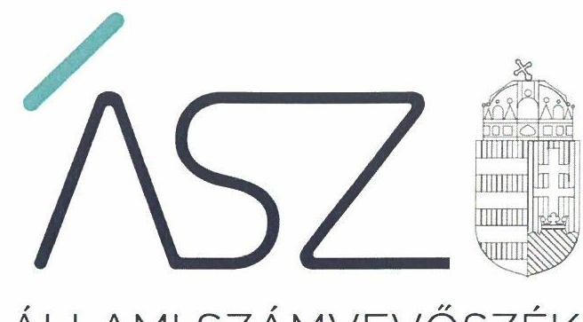

ÁLLAMI SZÁMVEVŐSZÉK

# JELENTÉS 

## A központi költségvetési szervek ellenőrzése: Vagyongazdálkodás

Széchenyi István Egyetem
2021.

21058
www.asz.hu

---

ÁLLAMI SZÁMVEVŐSZÉK

# JELENTÉS 

## A központi költségvetési szervek ellenőrzése: Vagyongazdálkodás

Széchenyi István Egyetem
2021. 06. hó 03. nap

21058
www.asz.hu

---

Jelentéseink az Országgyűlés számítógépes hálózatán és az interneten a www.asz.hu címen is olvashatóak.

## AZ ELLENŐRZÉST FELÜGYELTE:

PETŐ KRISZTINA felügyeleti vezető

DR. NÉMETH ERZSÉBET felügyeleti vezető

## AZ ELLENŐRZÉST VEZETTE ÉS A VÉGREHAJTÁSÁÉRT FELELŐS:

SIPOSNÉ DÓCZI KLÁRA ellenőrzésvezető

DR. NAGY IMRE ellenőrzésvezető

## A PROGRAM ÖSSZEÁLLÍTÁSÁÉRT FELELŐS:

GÖRGÉNYI GÁBOR ETAMO osztályvezető

## A TÉMÁHOZ KAPCSOLÓDÓ KORÁBBI SZÁMVEVŐSZÉKI JELENTÉSEK:

- címe:

Jelentés a Széchenyi István Egyetem ellenőrzéséről: Az állami felsőoktatási intézmények gazdálkodásának, működésének ellenőrzése

- sorszáma: 14201
- címe: Az állami felsőoktatási intézmények gazdálkodásának, működésének ellenőrzéséről készült jelentések utóellenőrzése - Széchenyi István Egyetem

17112

IKTATÓSZÁM: EL-3233-001/2021.
TÉMASZÁM: 2549
ELLENŐRZÉS-AZONOSÍTÓ SZÁM: V089308

---

# TARTALOMJEGYZÉK 

■ ÖSSZEGZÉS ..... 5
■ AZ ELLENŐRZÉS CÉLJA ..... 6
■ AZ ELLENŐRZÉS TERÜLETE ..... 7
■ AZ ELLENŐRZÉS HÁTTERE, INDOKOLTSÁGA ..... 8
■ A JELENTÉS LÉNYEGES KÉRDÉSKÖREI ..... 9
■ AZ ELLENŐRZÉS HATÓKÖRE ÉS MÓDSZEREI ..... 10
■ MEGÁLLAPÍTÁSOK ..... 12
■ MELLÉKLETEK ..... 15
I. sz. melléklet: Értelmező szótár ..... 15
■ FÜGGELÉK: ÉSZREVÉTELEK ..... 17
■ RÖVIDÍTÉSEK JEGYZÉKE ..... 27

---

.

---

# ÖSSZEGZÉS 

A Széchenyi István Egyetem a 2017-2019. közötti években nem biztosította a nemzeti vagyon védelmét. Nem igazolta továbbá, hogy a 2020. évi fenntartóváltáskor nyilvántartott nemzeti vagyon ténylegesen rendelkezésre állt a közfeladat ellátásához.

## Az ellenőrzés társadalmi indokoltsága

Az államháztartás központi alrendszerébe tartozó szervezet vagyona a nemzeti vagyon része. Magyarország Alaptörvénye rögzíti, hogy a vagyonnal való gazdálkodás célja a közérdek szolgálata. Magyarország versenyképessége szoros kapcsolatban áll a felsőoktatás minőségével, amely nem képzelhető el hatékony és eredményes közpénz felhasználás nélkül.

Az ellenőrzést indokolja az is, hogy a Széchenyi István Egyetem a felsőoktatási modellváltással érintett intézmények közé tartozik. A vagyonjuttatásról rendelkező jogszabály szerint: „A gazdaság- és társadalomtudományi képzési terület, ezen keresztül az innovatív vállalkozásokat támogatni kész magyar felsőoktatási intézményrendszer és környezetének megerősítése, a képzést folytató oktatók, kutatók, tanárok, a képzésben részt vevők támogatása érdekében" a Széchenyi István Egyetem fenntartói jogait, amelyeket eddig az állam nevében az illetékes miniszter gyakorolt, a kormány által létrehozott közérdekű vagyonkezelő alapítvány vette át, és azokat az alapítvány kuratóriuma gyakorolja.

Az Állami Számvevőszék tanácsadó funkciója keretében az ellenőrzési megállapításokon keresztül támogatja a közfeladathoz kapcsolódó vagyonnal való hatékony és eredményes gazdálkodást azzal, hogy felhívja a figyelmet a fenntartóváltással érintett felsőoktatási intézmények vagyongazdálkodásának kockázatos pontjaira.

## Főbb megállapítások, következtetések

Az ellenőrzött 2017. és 2019. közötti időszakban a Széchenyi István Egyetem vagyongazdálkodása a beszámolók mérlegtételeit alátámasztó leltárak hiányában nem biztosította az átláthatóságot és az elszámoltathatóságot. Leltárak hiányában a Széchenyi István Egyetem éves költségvetési beszámolóinak megalapozottsága és a nemzeti vagyon védelme nem volt biztosított. Nem igazolt, hogy a beszámolókban szereplő tételek a valóságban is megtalálhatóak voltak.

A 2020. július 31-ei fenntartóváltáshoz kapcsolódóan a jogszabályban előírt záró beszámolót a Széchenyi István Egyetem elkészítette, azonban a záró beszámoló mérlegtételeit leltárral nem támasztotta alá. Ezáltal nem igazolt, hogy a záró beszámolóban szereplő nemzeti vagyon a közfeladat ellátásához rendelkezésre állt a fenntartóváltáskor.

A Széchenyi István Egyetem kialakította a teljesítményelv érvényesülésének alapját jelentő mérési követelményeket.
Az ellenőrzés megállapításai alapján levonható a következtetés, hogy a Széchenyi István Egyetemen a kancellári rendszer bevezetése sem biztosította a nemzeti vagyon védelmét, indokolt volt a tulajdonosi joggyakorlás kereteinek megerősítése.

---

# AZ ELLENŐRZÉS CÉLJA

**AZ ELLENŐRZÉS CÉLJA** annak megállapítása, hogy a központi költségvetési szerv jó gazda gondosságával biztosította-e a nemzeti vagyon értékének megőrzését, védelmét és szabályszerű kezelését. Az államháztartás központi alrendszerébe tartozó szervezet vagyongazdálkodása elszámoltatható volt-e és megfelel-e annak az Alaptörvényben meghatározott alapvetésnek, hogy Magyarország a kiegyensúlyozott, átlátható és fenntartható költségvetési gazdálkodás elvét érvényesíti.

---

# AZ ELLENŐRZÉS TERÜLETE 

## Széchenyi István Egyetem

A Széchenyi István Egyetem feletti alapítói jogok gyakorlója az Országgyűlés, irányító szerve és fenntartója az ellenőrzött időszakban 2019. szeptember 1-jéig az Emberi Erőforrások Minisztériuma, 2019. szeptember 1-jétől az Innovációs és Technológiai Minisztérium volt. Az Egyetem ${ }^{1}$ alaptevékenysége felsőfokú oktatás, közfeladata oktatási, tudományos kutatási tevékenység folytatása volt. Illetékessége, működési területe Magyarország területe, a felvehető maximális hallgatólétszáma 17449 fő volt.

A Széchenyi István Egyetem története 1968-ig nyúlik vissza, ekkor alapították az egyetem közvetlen jogelődjét, a Közlekedési és Távközlési Műszaki Főiskolát. Széchenyi István nevét 1986-óta viseli az intézmény, amely 2002. január 1-jével kapott egyetemi rangot. Az Egyetemen kilenc kar és négy doktori iskola működött.

A Széchenyi István Egyetem első számú vezetője és képviselője a rektor volt, a felsőoktatási intézmény működtetését a kancellár végezte. A rektor és a kancellár személyében az ellenőrzött időszakban változás nem történt.

Az Egyetem jogi státusza, 2020. augusztus 1-jétől az Egyetem fenntartóváltásáról szóló törvény² szerint közhasznú vagyonkezelő alapítvány fenntartásában álló felsőoktatási intézményre változott.

---

# AZ ELLENŐRZÉS HÁTTERE, INDOKOLTSÁGA 

Az államháztartás központi alrendszerébe tartozó szervezet vagyona a nemzeti vagyon része, mellyel történő gazdálkodás a közérdek szolgálata érdekében történik. Az ÁSZ ${ }^{3}$ ellenőrzi az éves költségvetési törvény végrehajtását, majd az ellenőrzés során feltárt kockázatok és a terület folyamatos kockázatelemzésével beazonosított kockázatok kezelése érdekében ráépülő ellenőrzésekkel ellenőrzi a költségvetési szervek gazdálkodását, működését. Ezáltal az ellenőrzések megállapításaival támogatja az ellenőrzött szervezetek szabályszerű gazdálkodását, javaslataival elősegíti az Alaptörvényben megfogalmazott alapvetések érvényesülését a mindennapi életben a szervezetek szintjén.

Az Nftv. ${ }^{4}$ előírásai értelmében a magyar állam által működtetett felsőoktatási intézmény fenntartói joga, mint vagyoni értékű jog - a Kormány külön engedélyével - a Kormány által létrehozott alapítványra átruházható. A fenntartóváltással érintett felsőoktatási intézménynek az Nftv. előírásai alapján a fenntartóváltás napját megelőző fordulónappal az államháztartási számviteli szabályok szerinti záró beszámolót kell készítenie.

A központi költségvetés rendszerében zajló folyamatok holisztikus elemzései, a kockázatok folyamatos figyelemmel kísérésének módszerével, az így kiválasztott szervezetek célzott, hatékony ellenőrzéseivel az ÁSZ betölti a legfőbb gazdasági ellenőrző szerv küldetését. Az egyes ellenőrzések megállapításaival és egy időszak ellenőrzési eredményeinek elemzésével az ÁSZ ráirányíthatja a jogalkotók figyelmét a központi alrendszerben vagy annak egy ágazatában esetlegesen felmerülő vagyongazdálkodási, szabályozási feszültségekre.

---

# A JELENTÉS LÉNYEGES KÉRDÉSKÖREI 

1.     - Biztosított volt-e az Egyetemnél a vagyongazdálkodás szabályozottsága?
2.     - A nemzeti vagyon nyilvántartását és kimutatását a valóságnak megfelelő módon, szabályszerűen végezte-e az Egyetem, biztosított volt-e a nemzeti vagyon védelme?
3.     - Az Egyetem a fenntartóváltás során a használatában levő vagyontárgyakat szabályszerűen mutatta-e ki a záró beszámolójában, biztosított volt-e a nemzeti vagyon megőrzése?
4. Az Egyetemnél kialakították-e a teljesítmény mérésére alkalmas követelményeket?

---

# AZ ELLENŐRZÉS HATÓKÖRE ÉS MÓDSZEREI 

## Az ellenőrzés típusa

Megfelelőségi ellenőrzés.

## Az ellenőrzött időszak

2017., 2018., 2019. évek, továbbá 2020. január 1-jétől a felsőoktatási intézmény Nftv. szerinti fenntartóváltásának napjáig, 2020. július 31-ig terjedő időszak.

## Az ellenőrzés tárgya

A központi költségvetési szerv vagyongazdálkodási feltételeinek kialakítása, annak szabályszerűsége, az elszámoltathatóság biztosítása a szabályozás szintjén. Az intézménynél hozott vagyonváltozást eredményező döntések, a vagyonban bekövetkezett változások végrehajtásának, elszámolásának szabályszerűsége. Az intézmény könyveiben, mérlegében kimutatott nemzeti vagyon nyilvántartásának szabályszerűsége, vagyon kimutatása, értékelése és a mérleg leltárral való alátámasztásának szabályszerűsége. A felsőoktatási intézmény záró beszámolójában kimutatott nemzeti vagyon kimutatása és a mérleg leltárral való alátámasztásának szabályszerűsége.

## Az ellenőrzött szervezet

Széchenyi István Egyetem

## Az ellenőrzés jogalapja

Az ellenőrzés jogszabályi alapját az ÁSZ tv. ${ }^{5} 1$. § (3) bekezdése, 5. § (2)-(3) és (6) bekezdései, valamint az Áht. ${ }^{6} 61 . \S$ (2) bekezdésének előírásai képezik.

## Az ellenőrzés módszerei

Az ÁSZ az ellenőrzést az ellenőrzési program szempontjai, az ellenőrzött időszakban hatályos jogszabályok, az ellenőrzés szakmai szabályai, a jelen ellenőrzésre irányadó ÁSZ módszertanok figyelembevételével hajtotta végre. Az 1-2. és 4. kérdéskör tekintetében az ellenőrzés a 2018-2019. évekre vonatkozott, a 3. kérdéskör esetében az ellenőrzött időszak 2020.

---

január 1-jétől a felsőoktatási intézmény Nftv. szerinti fenntartóváltásának napjáig tartott.

Az ellenőrzési kérdések megválaszolásához szükséges bizonyítékok megszerzése az ellenőrzött szervezet által rendelkezésre bocsátott dokumentumokra és adatokra alapozva, továbbá megfigyelés, szemle (szemrevételezés), kérdésfeltevés (információkérés), valamint elemző eljárás útján történt. Az ellenőrzési bizonyítékként felhasználható adatforrások közé tartoztak az ellenőrzési program részletes szempontjainál felsorolt adatforrások, valamint minden egyéb - az ellenőrzés folyamán feltárt, az ellenőrzés szempontjából információt tartalmazó - dokumentum.
Az ellenőrzés lefolytatásához az ellenőrzött szervezet tanúsítvány kitöltésével, valamint az ÁSZ által kért dokumentumok megküldésével szolgáltatott adatokat, amelyekről az ellenőrzött szervezet vezetője teljességi és hitelességi nyilatkozatot állított ki. A rendelkezésre bocsátott dokumentumok, adatok és információk kontrollja az ellenőrzés keretében történt.

---

# 1. Biztosított volt-e az Egyetemnél a vagyongazdálkodás szabályozottsága? 

Összegző megállapítás

Az Egyetemnél a vagyongazdálkodás szabályozottsága a 2017-2019. közötti években nem volt biztosított.

Az Egyetem rendelkezett az eszközök és források leltározási és leltárkészítési szabályzatával, 2017. május 30-tól számviteli politikával és 2017. június 26-tól az eszközök és források értékelési szabályzatával.

A számviteli politika a Számv. tv. ${ }^{7}$ 14. § (4) bekezdésben foglaltak ellenére ugyanakkor nem rögzítette, hogy mit tekint a számviteli elszámolás, az értékelés szempontjából lényegesnek, illetve nem lényegesnek. Az eszközök és források leltárkészítési és leltározási szabályzata az Áhsz. ${ }^{8}$ 22. § (2) bekezdés b) pontjával ellentétesen nem tartalmazta a használt, de a mérlegben értékkel nem szereplő immateriális javak, tárgyi eszközök, illetve készletek leltározási módját.
Az Egyetem a 2017-2019. években nem teremtette meg a szabályszerű könyvvezetés szabályozási feltételeit, mert számlarendje nem felelt meg az Áhsz. 51. § (2) bekezdésében foglaltaknak, így az nem töltötte be gazdálkodással, illetve a számviteli keretek kialakításával kapcsolatos törvényben előírt feladatait.

## 2. A nemzeti vagyon nyilvántartását és kimutatását a valóságnak megfelelő módon, szabályszerűen végezte-e az Egyetem, biztosított volt-e a nemzeti vagyon védelme?

## Összegző megállapítás

Az Egyetemnél a nemzeti vagyon nyilvántartása és kimutatása 2017-2019. években nem volt szabályszerű, nem biztosította a nemzeti vagyon védelmét.

Az Egyetem a Számv. tv. 69. § (3) bekezdése, valamint az Egyetem Eszközök és források leltárkészítési és leltározási szabályzata szerint 2017. és 2019. között az immateriális javak, a tárgyi eszközök és a készletek tekintetében mennyiségi felvétellel történő leltározást végzett. Az Egyetem a nemzeti vagyon nyilvántartását és kimutatását azonban nem végezte szabályszerűen, mert nem készített az Áhsz. 5. § (1) bekezdésében és 22. § (1) bekezdésében, valamint a Számv. tv. 69. § (1) bekezdésében előírtak szerinti olyan leltárt, amely tételesen és ellenőrizhető módon tartalmazta volna a mérlegben szereplő eszközöket és forrásokat mennyiségben és értékben.

Az Egyetem a kötelezettségvállalásra, teljesítés igazolására jogosult személyekről és aláírás-mintájukról jogszabályban előírt nyilvántartást vezetett.

---

# 3. Az Egyetem a fenntartóváltás során a használatában levő vagyontárgyakat szabályszerűen mutatta-e ki a záró beszámolójában, biztosított volt-e a nemzeti vagyon megőrzése? 

## Összegző megállapítás

A 2020. évi fenntartóváltás során az Egyetemnél a nemzeti vagyon kimutatása nem volt szabályszerű, a nemzeti vagyon megőrzése nem volt biztosított.

Az Egyetem elkészítette a fenntartóváltás napját megelőző
 fordulónappal a záró beszámolót az Nftv. rendelkezéseivel összhangban.

Az Egyetem a vagyonnal való gazdálkodása során 2020. január 1. és 2020. július 31. között a nemzeti vagyon kimutatását nem szabályszerűen végezte, mivel nem készített - az Nftv. 117/C. § (4a) bekezdésében szereplő rendelkezés ellenére - az Áhsz. 5. § (1) bekezdésében és a 22. § (1) bekezdésében előírtak szerinti leltárt, amely tételesen és ellenőrizhető módon tartalmazta volna a záró beszámolóban szereplő eszközöket és forrásokat mennyiségben és értékben. Ezáltal az Egyetem a Számv. tv. 69. § (1) bekezdésében foglaltak ellenére a záró beszámoló mérlegtételeit nem támasztotta alá leltárral.

## 4. Az Egyetemnél kialakították-e a teljesítmény mérésére alkalmas követelményeket?

## Összegző megállapítás

Az Egyetemnél kialakították a teljesítmény mérésére alkalmas követelményeket.

Az Egyetemnél kialakították a szervezeti célok elérését szolgáló feladatok, folyamatok, tevékenységek mérésére használható indikátorokat, mérőszámokat, feladat- és teljesítménymutatókat, amelyek alkalmasak a Bkr. ${ }^{9}$-ben meghatározott, szervezeti tevékenység teljesítményének mérésére.

---

.

---

# MELLÉKLETEK 

- I. SZ. MELLÉKLET: ÉRTELMEZŐ SZÓTÁR
állami vagyon
irányító szerv
nemzeti vagyon
tulajdonosi joggyakorló
vagyongazdálkodás

Állami vagyonnak minősül:
a) az állam tulajdonában lévő dolog, valamint a dolog módjára hasznosítható természeti erő,
b) az a) pont hatálya alá nem tartozó mindazon vagyon, amely vonatkozásában törvény az állam kizárólagos tulajdonjogát nevesíti,
c) az állam tulajdonában lévő tagsági jogviszonyt megtestesítő értékpapír, illetve az államot megillető egyéb társasági részesedés,
d) az államot megillető olyan immateriális, vagyoni értékkel rendelkező jogosultság, amelyet jogszabály vagyoni értékű jogként nevesít,
e) az állam tulajdonában lévő pénzügyi eszközök.
(Forrás: Vtv. ${ }^{10}$ 1. § (2) bekezdése)
A költségvetési szerv tekintetében az e törvényben meghatározott irányítási hatáskört gyakorló szerv. (Forrás: Áht. 1. § 9. pontja)
a) az állam vagy a helyi önkormányzat kizárólagos tulajdonában álló dolgok,
b) az a) pont hatálya alá nem tartozó, az állam vagy a helyi önkormányzat tulajdonában lévő dolog,
c) az állam vagy a helyi önkormányzat tulajdonában lévő pénzügyi eszközök, továbbá az államot vagy a helyi önkormányzatot megillető társasági részesedések,
d) az államot vagy a helyi önkormányzatot megillető bármely vagyoni értékkel rendelkező jogosultság, amelyet jogszabály vagyoni értékű jogként nevesít,
e) Magyarország határa által körbezárt terület feletti légtér,
f) az üvegházhatású gázok kibocsátási egységeinek kereskedelméről szóló törvény szerinti kibocsátási egység és légiközlekedési kibocsátási egység, valamint az ENSZ
Éghajlatváltozási Keretegyezménye és annak Kiotói Jegyzőkönyve végrehajtási keretrendszeréről szóló törvény szerinti kiotói egység,
g) állami vagy helyi önkormányzati fenntartású közgyűjtemény (muzeális intézmény, levéltár, közgyűjteményként működő kép- és hangarchívum, valamint könyvtár) saját gyűjteményében nyilvántartott kulturális javak körébe tartozó dolog, kivéve, ha az állami vagy önkormányzati tulajdon jogszerű létrejötte kétséget kizáró módon nem bizonyítható és a dologra nézve más a tulajdonjogát bizonyítja vagy a kulturális javakra vonatkozó jogszabályokban meghatározott eljárás keretében valószínűsíti,
h) a régészeti lelet,
i) a nemzeti adatvagyon körébe tartozó állami nyilvántartások fokozottabb védelméről szóló törvény szerinti nemzeti adatvagyon (Forrás: Nvtv. ${ }^{11}$ 2. § (2) bekezdés a)-i) pontok).
Aki a nemzeti vagyon felett az államot vagy a helyi önkormányzatot megillető tulajdonosi jogok és kötelezettségek összességének gyakorlására jogosult. (Forrás: Nvtv. 3. § (1) bekezdés 17. pontja)
A nemzeti vagyongazdálkodás feladata a nemzeti vagyon rendeltetésének megfelelő, az állam, az önkormányzat mindenkori teherbíró képességéhez igazodó, elsődlegesen a közfeladatok ellátásához és a mindenkori társadalmi szükségletek kielégítéséhez szükséges, egységes elveken alapuló, átlátható, hatékony és költségtakarékos működtetése, értékének megőrzése, állagának védelme, értéknövelő használata, hasznosítása, gyarapítása, továbbá az állam vagy a helyi önkormányzat feladatának ellátása szempontjából feleslegessé váló vagyontárgyak elidegenítése. (Forrás: Nvtv. 7. § (2) bekezdése)

---

.

---

# FÜGGELÉK: ÉSZREVÉTELEK 

A jelentéstervezetet a Számvevőszék 15 napos észrevételezésre megküldte az ellenőrzött szervezet vezetőjének az ÁSZ tv. 29. § (1) bekezdése előírásának megfelelően.

A Széchenyi István Egyetem rektora a jelentéstervezet megállapításaira észrevételt tett. Az ÁSZ tv. 29. § (3) bekezdésével összhangban az ÁSZ a Függelékben feltünteti a jelentéstervezet megállapításaival kapcsolatban tett, figyelembe nem vett észrevételeket, és megindokolja, hogy azokat miért nem fogadta el.

[^0]
[^0]:    * 29. § (1) Az Állami Számvevőszék az ellenőrzési megállapításait megküldi az ellenőrzött szervezet vezetőjének vagy az általa megbízott személynek, és annak, akinek személyes felelősségét állapította meg.
    (2) Az ellenőrzött szervezet vezetője és a felelősként megjelölt személy az ellenőrzés megállapításaira tizenöt napon belül írásban észrevételt tehet.
    (3) Az Állami Számvevőszék az észrevételre a beérkezésétől számított harminc napon belül írásban válaszol. A figyelembe nem vett észrevételeket köteles a jelentésben feltüntetni, és megindokolni, hogy azokat miért nem fogadta el.

---

# Domokos László 

Elnök
Állami Számvevőszék
Tárgy: ÁSZ jelentéstervezetre tett észrevételek

## Tisztelt Elnök Úr!

Köszönettel megkaptuk a „A Központi költségvetési szervek ellenőrzése - Vagyongazdálkodás - Széchenyi István Egyetem" címü, EL-2802-088/2021. iktatószámú, számvevőszéki jelentéstervezetet.

Az ÁSZ tv. 29. § (2) bekezdésében foglalt jogkörünkben eljárva az alábbi észrevételeket tesszük a jelentés tervezetre:

1. Jelentéstervezet 12. oldal 1. pontjára tett észrevétel, mely szerint „Az Egyetemnél a vagyongazdálkodás szabályozottsága a 2017-2019. közötti években nem volt biztosított."

- „A számviteli politika a Számv. tv. 7 14. § (4) bekezdésben foglaltak ellenére ugyanakkor nem rögzítette, hogy mit tekint a számviteli elszámolás, az értékelés szempontjából lényegesnek, illetve nem lényegesnek.

## Észrevétel:

Az Egyetem Számviteli politikája, a Számviteli törvény 16.§ (4) bekezdésével összhangban tartalmazza (10. oldal 13. pont A Lényegesség elve), hogy lényegesnek minősül a beszámoló szempontjából minden olyan információ, amelynek elhagyása vagy téves bemutatása - az ésszerűség határain belül - befolyásolja a beszámoló adatait, felhasználók döntéseit. Tehát az Egyetem meghatározta azokat az előírásokat, amelyek alapján lényegesnek tekint valamit.

## Kérjük a megállapítás törlését.

- Az eszközök és források leltárkészítési és leltározási szabályzata az Áhsz. 8 22. § (2) bekezdés b) pontjával ellentétesen nem tartalmazta a használt, de a mérlegben értékkel nem szereplő immateriális javak, tárgyi eszközök, illetve készletek leltározási módját."

## Észrevétel:

A Leltározási szabályzat 1. Fogalmi meghatározások 1.1 pontja tartalmazza, hogy a leltározás az Egyetem kezelésébe vagy használatába adott, valamennyi eszköz (aktíva), valamint azok forrásai (passzíva), továbbá a birtokában lévő idegen eszközök valóságban meglévő állományának (mennyiségének) megállapítása, függetlenül attól, hogy a mérlegben értékkel szerepel-e vagy sem.
Ebből eredően a Leltározási szabályzatban részletesen bemutatott módszerek az értékkel nem rendelkező immateriális javakra, tárgyi eszközökre és készletekre is vonatkoznak.

## Kérjük a megállapítás törlését.

---

- „Az Egyetem a 2017-2019. években nem teremtette meg a szabályszerű könyvvezetés szabályozási feltételeit, mert a Számv. tv. 161. § (1) és (4) bekezdésében, valamint az Ahsz. 51. § (2) bekezdésében foglaltak ellenére nem rendelkezett számlarenddel. Ennek következtében az Egyetem nem határozta meg a Számv. tv. 161. § (2) bekezdés a) és c) pontjaiban előírtak ellenére az alkalmazásra kijelölt számlák számjelét és megnevezését, valamint a főkönyvi számla és az analitikus nyilvántartás kapcsolatát."

# Észrevétel: 

Benyújtásra került az Egyetem teljes vizsgált időszakot lefedő Számlarendje, ami az EL-2802-008/2020. iktatószámú teljességi nyilatkozaton is szerepel a 1.2.1, 1.2.2, 1.2.3 sorszámon, valamint az EL-2802028/2020. iktatószámú teljességi nyilatkozaton a 1.1.9.1 sorszámon

Az ÁSZ rendelkezésére bocsátott dokumentumok a vizsgált időszakra vonatkozóan:

- 2017. május 30-ig: 2_Szamlarend_2008_I_resz.pdf, 2_Szamlarend_2008_II_resz.pdf, 2_Szamlarend_2008_III_resz.pdf
- 2017. május 30-tól: I_9_Szamlarend_170530.pdf

A fenti számlarendek tartalmazták az ÁSZ által hiányolt Számviteli törvény szerinti tartalmi elemeket.

Kérjük a megállapítás törlését, valamint az 1. számú fókuszkérdésre tett összegző megállapításra módosítását, oly módon, hogy a Vagyongazdálkodás szabályozottsága szabályszerű minősítést kapjon.
2. Jelentéstervezet 12. oldal 2. pontjára tett észrevétel, mely szerint „Az Egyetemnél a nemzeti vagyon nyilvántartása és kimutatása 2017-2019. években nem volt szabályszerű, nem biztosította a nemzeti vagyon védelmét."

- „Az Egyetem a nemzeti vagyon nyilvántartását és kimutatását nem szabályszerűen végezte, mert nem készített az Áhsz. 5. § (1) bekezdésében és 22. § (1) bekezdésében, valamint a Számv. tv. 69. § (1) bekezdésében előírtak szerinti olyan leltárt, amely tételesen és ellenőrizhető módon tartalmazta volna a mérlegben szereplő eszközöket és forrásokat mennyiségben és értékben."

## Észrevétel:

A leltárak hiányára vonatkozó megállapítást indokolatlannak tartjuk. Az Egyetem az ellenőrzött időszak minden évében a számviteli törvény előírásaival összhangban leltározással győződött meg a mérlegforduló napján meglévő eszköz- és forrásairól, amelyeket csak 2020. év vonatkozásában ellenőrzött az ÁSZ, de azokkal a 2017-2019 években is rendelkezett az Egyetem. A leltározás alapján az Egyetem eszköz- és forráscsoporttól függően mennyiségi és egyeztetéses módszerrel támasztotta alá a leltározás elvégzését. Az Egyetem minden ellenőrzött évben, a 2020. évben is, elkészítette a mérlegsorokat alátámasztó leltár analitikákat és leltár összesítőket, amelyeket az EL-2802-008/2020 adatbekérés 10. pontjához feltöltött dokumentumok tartalmaznak.

- Az Egyetem 2017-ben és 2019-ben az immateriális javak, a tárgyi eszközök és a készletek tekintetében mennyiségi felvétellel történő leltározást végzett. Az Egyetem az Áhsz. 22. § (2) bekezdésében, a Számv. tv. 69. § (3) bekezdésében és a Leltározási szabályzat 5.3. pontjában foglaltak ellenére a 2017-

---

2019. közötti időszakban a készpénz tekintetében nem győződött meg mennyiségi felvétellel történő leltározással a leltárba bekerülő adatok valódiságáról."

# Észrevétel 

Az Egyetem 2012. évtől nem alkalmaz forint készpénzt a forgalomban, nem működhet forint házi pénztár. A 2017-2019. évi főkönyvi kivonatok - amelyek az EL-2802-001/2020. iktatószámú teljességi nyilatkozaton a 1.1.8.1, 1.1.8.2, 1.1.8.3 sorszámon beküldésre kerültek - alátámasztják, hogy nem működött forint pénztár. Ennek tényét a Pénzeszközök mérlegsort alátámasztó, EL-2802-001/2020 adatbekérés I/8 ponthoz feltöltött leltár dokumentumok támasztják alá.

Valutapénztárral 2017-ben és 2018-ban rendelkezett az Egyetem, mindkét évben 0 Ft záró pénzkészlettel. Az alátámasztó leltárt évenkénti bontásban "Összesítő tábla pénzkészlet egyeztetéshez" dokumentumok tartalmazzák. A valutapénztár alátámasztó leltár a helyszíni adatbetekintés során bemutatásra került, amit az "EL-2802-021/2020." iktatószámú jegyzőkönyv alátámaszt. (2. oldal: "1 oldal terjedelemben "Összesítő tábla pénzkészlet egyeztetéséhez 2017.12.31. LELTÁR" megnevezésű táblázat és 3. oldal: 2018. év "Összesítő táblázat pénzkészlet egyeztetéséhez"

Mindezek alapján kérjük a leltárak hiányára, ill. a készpénzre vonatkozó leltározás elmaradására tett megállapítások törlését. Kérjük a 2. fókuszkérdésre tett összegző megállapítás módosítását, amely indokolatlanul rossz színben tünteti fel az Egyetem vagyongazdálkodását és a nemzeti vagyon védelmére vonatkozó jogszabályi kötelezettségét. Az Egyetemen a vizsgált időszakban jelentős infrastruktúra bővítések történtek, amelyek a nemzeti vagyon gyarapodását szolgálták. A támogató szervezetek által végrehajtott külső ellenőrzések ezek szabályosságát minden esetben visszaigazolták.
3. Jelentéstervezet 13. oldal 3. pontjára tett észrevétel, mely szerint „A 2020. évi fenntartóváltás során az Egyetemnél a nemzeti vagyon kimutatása nem volt szabályszerű, a nemzeti vagyon megőrzése nem volt biztosított."

- Az Egyetem a vagyonnal való gazdálkodása során 2020. január 1. és 2020. július 31. között a nemzeti vagyon kimutatását nem szabályszerűen végezte, mivel nem készített - az Nftv. 117/C. § (4a) bekezdésében szereplő rendelkezés ellenére - az Áhsz. 5. § (1) bekezdésében és a 22. § (1) bekezdésében előírtak szerinti leltárt, amely tételesen és ellenőrizhető módon tartalmazta volna a záró beszámolóban szereplő eszközöket és forrásokat mennyiségben és értékben. Ezáltal az Egyetem a Számv.tv. 69.
 § (1) bekezdésében foglaltak ellenére a záró beszámoló mérlegtételeit nem támasztotta alá leltárral.

## Észrevétel:

Az Egyetem a fenntartóváltás napjára elkészítette a leltárakat és 2020. október 8-án az ÁSZ vizsgálat rendelkezésére bocsátotta. A dokumentumok a Teljességi nyilatkozaton 1.1.5.1 - 1.1.5.1.9 sorszámmal szerepelnek, az alábbi elnevezésekkel:

- I_5_Merleg_alat_lelt_1.pdf
- I_5_Merleg_alat_lelt_2.pdf
- I_5_Merleg_alat_lelt_3.pdf
- I_5_Merleg_alat_lelt_4.pdf

---

- I_5_Merleg_alat_lelt_5.pdf
- I_5_Merleg_alat_lelt_6.pdf
- I_5_Merleg_alat_lelt_7.pdf
- I_5_Merleg_alat_lelt_8.pdf
- I_5_Merleg_alat_lelt_9.pdf

A 2. fókuszkérdésre tett megállapításhoz tett észrevételeinket a 2020. évi fenntartóváltás napjára készített leltárakra vonatkozóan is fenntartjuk, így az előző ponthoz leírtakhoz hasonlóan, itt is kérjük a megállapítások törlését és a 3. fókuszkérdésre tett összegző megállapítások módosítását.
4. A Jelentéstervezet 13. oldal 4. pontjára tett észrevétel, mely szerint „Az Egyetemnél nem alakítottak ki a teljesítmény mérésére alkalmas követelményeket."

- Az Egyetemnél nem alakítottak ki a szervezeti célok elérését szolgáló feladatok, folyamatok, tevékenységek mérésére használható indikátorokat, mérőszámokat, feladat- és teljesítménymutatókat, amelyek alkalmasak lettek volna a szervezeti tevékenység teljesítményének mérésére a Bkr. 10. 2. § g), i), j) pontjaiban meghatározott eredményesség, gazdaságosság és hatékonyság követelményeinek érvényesítése érdekében. Ezzel a teljesítmény mérésének lehetőségét nem biztosították, és nem teremtették meg annak előfeltételeit, hogy a Bkr. 4. § a) pontjának előírásaival összhangban biztosítsák a költségvetési szerv valamennyi tevékenységének és céljának összhangját a gazdaságosság, hatékonyság és eredményesség követelményeivel.

# Észrevétel: 

Az Egyetem által kialakított teljesítmény mérésére alkalmas követelményeket tartalmazó dokumentumokat az ÁSZ vizsgálat részére feltöltöttük, a dokumentumok listáját EL-2802-042/2020 teljességi nyilatkozat tartalmazza.

Az Egyetem a BKR 6.§ (2) alapján olyan szabályzatokat adott ki, valamint olyan folyamatokat alakított ki és működtetett, amelyek a szabályszerű és szabályozott működtetésen túl biztosították a források gazdaságos, hatékony, eredményes felhasználását:

Folyamatok és szabályzatok, amelyeket az Egyetem a fenti előírás érdekében a vizsgált időszakban alkalmazott:

- Intézményi stratégiai célok és indikátorok (Intézményfejlesztési terv tartalmazza)
- Kockázatkezelési rendszer (Kockázatkezelési szabályzat tartalmazza)
- Vagyongazdálkodási terv és beszámoló (évente készül a megvalósult fejlesztések bemutatásával)
- Beszámoló az Egyetem gazdálkodásáról (évente készült a Szenátus és a fenntartó részére, visszaméréssel, elemzésekkel)
- Egyetemi vagyon védelme (teljeskörű vagyon és felelősségbiztosítás)
- Kötelezettségvállalás rendje (Kötelezettségvállalási Szabályzat)
- EVSZA jelentések bevételi és kiadási megbontásban (valamennyi szervezeti egység bevételeinek és kiadásainak mérésére)
- Ellenőrzések intézkedéseinek végrehajtása és nyomon követése
- Működési folyamatok kontrollja (Ellenőrzési nyomvonal)

---

- HR tervezés, munkavállalói teljesítményértékelés, oktatói teljesítmény elvárás, kiválósági bérrendszer, oktatói terhelés mérése (Humánpolitikai szabályzat)
- Nemzetköziesítés indikátorai (nemzetközi ranking listák, nemzetközi hallgatók számának növelése, angol nyelvű képzések, nemzetközi együttműködési szerződések, nemzetközi hallgatói mobilitás, nemzetközi oktatói és munkatársi mobilitás, hallgatótoborzó ügynöki hálózat)
- Minőségbiztosítási rendszer

A BKR 5.§ előírásai alapján az Egyetem figyelembe vette a Pénzügyminiszter által kiadott módszertani útmutatók előírásait is, azokkal összhangban alakította ki a fenti mutatószámokat, folyamatokat, melyeket minden év vonatkozásában értékelt. A visszamérést alátámasztják az EL-2802_042/2020 adatbekéréshez az ÁSZ ellenőrzés rendelkezésére bocsátott dokumentumok.

Mindezek alapján kérjük a megállapítások törlését és a 4. fókuszkérdésre tett összegző megállapítások módosítását.

Az észrevételeink alapján mind a 4 fókuszkérdésre tett ÁSZ megállapítás módosítását kértük, ennek megfelelően indokoltnak tartjuk az ÁSZ jelentéstervezet 5. oldalán szereplő összegzés, a *főbb megállapítások, következtetések* észrevételeinkkel összhangban történő módosítását.

Kérem a fenti észrevételeinket a végleges jelentés összeállítása során szíveskedjenek figyelembe venni.

Győr, 2021. 04. 27.

Dr. Földesi Péter
rektor

Dr. Filep Bálint
elnök

Dr. Kovács Zsolt
kancellár

---

# 1521 

Lórántné Walcz Iréne

## 150 éve a közpénzek őre

ÁLLAM: SZÁMVEVŐSZÉK

Ikt. szám: EL-2802-093/2021.

Dr. Földesi Péter úr
rektor
Széchenyi István Egyetem

Győr

Tisztelt Rektor Úr!
"A központi költségvetési szervek ellenőrzése - Vagyongazdálkodás - Széchenyi István Egyetem" című ellenőrzés megállapításaira a 2021. április 27-én kelt levelében megküldött észrevételeit megkaptam.

Az Állami Számvevőszék észrevételre vonatkozó álláspontjáról a felügyeleti vezető által készített részletes tájékoztatást csatoltan megküldöm.

Tájékoztatom Rektor urat, hogy a számvevőszéki jelentésben - az Állami Számvevőszékről szóló 2011. évi LXVI. törvény 29. § (3) bekezdése alapján - a figyelembe nem vett észrevételeket szerepeltetjük az elutasítás indokának feltüntetésével.

Budapest, 2021. május 28.

Tisztelettel:

Domokos László s.k.

Melléklet: Tájékoztatás az észrevétel kezeléséről

---

# Tájékoztatás az észrevétel kezeléséről 

„A központi költségvetési szervek ellenőrzése - Vagyongazdálkodás - Széchenyi István Egyetem" című ellenőrzés megállapításaira a 2021. április 27-én kelt levelében megküldött észrevételeket áttekintettem. Az észrevételek kezeléséről az alábbi tájékoztatást adom.

1. A számviteli politika, az eszközök és források leltárkészítési és leltározási szabályzata hiányosságaira, valamint a számlarend hiányára vonatkozó megállapításra (Jelentéstervezet 12. oldal 1. megállapítás 2-3. bekezdései) tett észrevétel.

Rektor úr az észrevételében leírta, hogy
a) A Széchenyi István Egyetem (továbbiakban: Egyetem) Számviteli politikája a számvitelről szóló 2000. évi C. törvény (továbbiakban: Számv. tv.) 16. § (4) bekezdésével összhangban tartalmazza, hogy lényegesnek minősül a beszámoló szempontjából minden olyan információ, amelynek elhagyása vagy téves bemutatása - az ésszerűség határain belül - befolyásolja a beszámoló adatait, felhasználók döntéseit.
b) A Leltározási szabályzat 1. Fogalmi meghatározások 1.1 pontja tartalmazza, hogy a leltározás az Egyetem kezelésébe vagy használatába adott, valamennyi eszköz, valamint azok forrásai, továbbá a birtokában lévő idegen eszközök valóságban meglévő állományának (mennyiségének) megállapítása, függetlenül attól, hogy a mérlegben értékkel szerepel-e vagy sem. Ebből eredően a Leltározási szabályzatban részletesen bemutatott módszerek az értékkel nem rendelkező immateriális javakra, tárgyi eszközökre és készletekre is vonatkoznak.
c) Benyújtásra került az Egyetem teljes vizsgált időszakot lefedő Számlarendje, melyek tartalmazták a Számv. tv. szerinti tartalmi elemeket.
Az Egyetem által az adatszolgáltatásra biztosított határidőben az Állami Számvevőszék (továbbiakban: ÁSZ) rendelkezésére bocsátott adatok ismételt felülvizsgálata során megállapításra került, hogy
a) A 2017. május 30-tól hatályos Számviteli politika 13. pontja (10. oldal) a Számv. tv. 16. § (4) bekezdés előírásai szerinti lényegesség elvét határozza meg, azaz, hogy lényegesnek minősül a beszámoló szempontjából minden olyan információ, amelynek elhagyása vagy téves bemutatása - az ésszerűség határain belül - befolyásolja a beszámoló adatait felhasználók döntéseit. Ez azonban nem azonos a Számv. tv. 14. § (4) bekezdésében meghatározott, a számviteli politika keretében rögzítendő, a gazdálkodóra jellemző azon szabályokkal, előírásokkal, módszerekkel, amelyekkel meghatározza, hogy mit tekint a számviteli elszámolás, az értékelés szempontjából lényegesnek, illetve nem lényegesnek. A jelentéstervezet ezt a hiányosságot állapítja meg, tehát a megállapítás módosítása nem indokolt.
b) Az Egyetem leltározási szabályzatai 5.2. pontjainak első bekezdései rendelkeztek arról, hogy a költségvetési évről december 31-i fordulónappal készített könyvviteli mérlegben kimutatott eszközöket mennyiségben és értékben, a forrásokat értékben minden évben leltározni kell, ugyanakkor a szabályzatok a használt, de a mérlegben értékkel nem szereplő immateriális javak, tárgyi eszközök, készletek vonatkozásában további külön rendelkezéseket nem 

---

tartalmaztak, ezáltal az Egyetem az államháztartás számviteléről szóló 4/2013. (I. 11.) Korm. rendelet (továbbiakban: Áhsz.) 22. § (2) bekezdés b) pontjában foglaltaknak nem tett eleget.
c) Az ÁSZ az EL-2802-008/2020. iktatószámú adatbekérő levél 3. számú melléklet 2. pontjában a 2017. január 1- 2019. december 31. közötti időszakra vonatkozó, hatályos számlarendet kérte az ellenőrzés rendelkezésére bocsátani. Rektor úr a bekért adatokra vonatkozóan a 2020. augusztus 11-i keltezésű Teljességi és hitelességi nyilatkozatban (továbbiakban: THNY) nyilatkozott, hogy az ÁSZ részére átadott, a THNY-ben részletezett dokumentumok, adatok megbízhatóak, és a bekért adatokra, dokumentumokra teljes körű információt tartalmaznak. Az Egyetem által az ellenőrzés rendelkezésére bocsátott „Számlarend_2008_I-III.pdf", a 2008-ban elfogadásra került számlarend nem felelt meg az Áhsz. számlarendre vonatkozóan 2014. január 1-től hatályos követelményeinek. Az Egyetem így a 2017-2019. években nem teremtette meg a szabályszerű könyvvezetés szabályozási feltételeit.
2. A nemzeti vagyon nyilvántartása és kimutatása hiányosságaira vonatkozó megállapításra (Jelentéstervezet 12. oldal 2. megállapítás 1-2. bekezdései, valamint a 13. oldal 1. bekezdése) tett észrevétel.
Rektor úr észrevételében jelezte, hogy
a) Az Egyetem az ellenőrzött időszak minden évében a számviteli törvény előírásaival összhangban leltározással győződött meg a mérleg fordulónapján meglévő eszközeiről és forrásairól. A leltározás alapján az Egyetem eszköz és forráscsoporttól függően mennyiségi és egyeztetéses módszerrel támasztotta alá a leltározás elvégzését. Az Egyetem minden ellenőrzött évben, a 2020. évben is, elkészítette a mérlegsorokat alátámasztó leltár analitikákat és leltár összesítőket.
b) Az Egyetem 2012. évtől nem alkalmaz forint készpénzt a forgalomban, nem működtet forint házi pénztárt. A 2017-2019. évi főkönyvi kivonatok alátámasztják, hogy nem működött forint pénztár.
Valutapénztárral 2017-ben és 2018-ban rendelkezett az Egyetem, mindkét évben 0 Ft záró pénzkészlettel. Az alátámasztó leltárt évenkénti bontásban "Összesítő tábla pénzkészlet egyeztetéshez" dokumentumok tartalmazzák. A valutapénztár alátámasztó leltár a helyszíni adatbetekintés során bemutatásra került.

Az Egyetem által az adatszolgáltatásra biztosított határidőben az ÁSZ rendelkezésére bocsátott adatok ismételt felülvizsgálata során az ÁSZ megállapította, hogy
a) az Egyetem a 2017-2019. évi éves beszámoló mérleg tételeit nem támasztotta alá - a Számv. tv. 69. § (1) bekezdése, valamint az Áhsz. 22. § (1) bekezdése előírásai szerinti - olyan leltárral, amely tételesen, ellenőrizhető módon tartalmazza a mérleg fordulónapján meglévő eszközöket és forrásokat mennyiségben és értékben.
Az Egyetem a 2017. évben a befektetett pénzügyi eszközök, a költségvetési évben esedékes követelések működési bevételre, az előzetesen felszámított általános forgalmi adó elszámolása, a fizetendő általános forgalmi adó elszámolása valamint a saját tőke mérlegtételek értékét nem támasztotta alá leltárral.
Az Egyetem a 2018. évben a befektetett pénzügyi eszközök, a befejezetlen termelés, félkész termékek, késztermékek, a költségvetési évben esedékes követelések működési bevételre, a fizetendő általános forgalmi adó elszámolása valamint a saját tőke mérlegtételek értékét nem

---

támasztotta alá leltárral.
Az Egyetem a 2019. évben a befektetett pénzügyi eszközök, a költségvetési évben esedékes követelések működési bevételre, valamint a saját tőke mérlegtételek értékét nem támasztotta alá leltárral.
b) Rektor úr észrevétele alapján a jelentéstervezet 12. oldal 2. megállapítás 2. bekezdés 2. mondatában, valamint a 13. oldal 1. bekezdésében szereplő ellenőrzési megállapítással kapcsolatban tett észrevételt az ÁSZ elfogadja, a megállapítást törli.
3. A záró beszámolót alátámasztó leltár hiányára vonatkozó megállapításra (Jelentéstervezet 13. oldal 3. számú megállapítás 2. bekezdés 2. mondatrésze) tett észrevétel.

Rektor úr észrevétele szerint az Egyetem a fenntartóváltás napjára elkészítette a leltárakat és 2020. október 8-án az ÁSZ vizsgálat rendelkezésére bocsátotta.

Az Egyetem által az ÁSZ rendelkezésére bocsátott 2020. január 1 - július 31. közötti időszakra vonatkozó leltárak, valamint a zárás előtti főkönyvi kivonat ismételt felülvizsgálata során az ÁSZ megállapította, hogy az Egyetem a fenntartóváltás kapcsán készített 2020. évi záró beszámolójának mérleg tételeit nem támasztotta alá - a Számv. tv. 69. § (1) bekezdése, valamint az Áhsz. 22. § (1) bekezdése előírásai szerinti - olyan leltárral, amely tételesen, ellenőrizhető módon tartalmazza a mérleg fordulónapján meglévő eszközöket és forrásokat mennyiségben és értékben, mivel a 2020. évben a záró beszámoló keretében a befektetett pénzügyi eszközök, a költségvetési évben esedékes követelések működési bevételre, valamint a saját tőke mérlegtételek értékét nem támasztotta alá leltárral.
4. A teljesítmény mérésére alkalmas követelmények kialakításának hiányára vonatkozó megállapításra (Jelentéstervezet 13. oldal 4. számú megállapítás) tett észrevétel.
Rektor úr észrevételében leírta, hogy az Egyetem által kialakított teljesítmény mérésére alkalmas követelményeket tartalmazó dokumentumokat az ÁSZ vizsgálat részére feltöltötték. Az Egyetem
 a költségvetési szervek belső kontrollrendszeréről és belső ellenőrzéséről szóló 370/2011. (XII. 31.) Korm. rendelet (továbbiakban: Bkr.) 6. § (2) bekezdése alapján olyan szabályzatokat adott ki, valamint olyan folyamatokat alakított ki és működtetett, amelyek a szabályszerű és szabályozott működtetésen túl biztosították a források gazdaságos, hatékony, eredményes felhasználását. A rektor észrevételében jelezte továbbá, hogy a Bkr. 5. § előírásai alapján az Egyetem figyelembe vette a Pénzügyminiszter által kiadott módszertani útmutatók előírásait is, azokkal összhangban alakította ki a fenti mutatószámokat, folyamatokat, melyeket minden év vonatkozásában értékelt.

Az ellenőrzéshez az Egyetem által rendelkezésre bocsátott, Rektor úr észrevételében hivatkozott dokumentumok ismételt áttekintése során megállapítottuk, hogy azok alátámasztják, hogy az Egyetem kidolgozott a teljesítmény mérésére alkalmas követelményeket. A jelentéstervezet 4. megállapítását és az azt indokoló szövegrészeket a fentiek alapján módosítjuk.

Budapest, 2021. május 28.
Dr. Németh Erzsébet s.k.
felügyeleti vezető

---

# RÖVIDÍTÉSEK JEGYZÉKE 

${ }^{1}$ Egyetem
${ }^{2}$ Egyetem fenntartóváltásáról szóló törvény
${ }^{3}$ ÁSZ
${ }^{4}$ Nftv.
${ }^{5}$ ÁSZ tv.
${ }^{6}$ Áht.
${ }^{7}$ Számv. tv.
${ }^{8}$ Áhsz.
${ }^{9}$ Bkr.
${ }^{10}$ Vtv.
${ }^{11}$ Nvtv.

Széchenyi István Egyetem
2020. évi XXXVIII. tv. a Széchenyi István Egyetemért Alapítványról, a Széchenyi István Egyetemért Alapítvány és a Széchenyi István Egyetem részére történő vagyonjuttatásról (hatályos 2020. május 29-től)
Állami Számvevőszék
2011. évi CCIV. törvény a nemzeti felsőoktatásról (hatályos 2012. január 1-jétől) 2011. évi LXVI. törvény az Állami Számvevőszékről (hatályos 2011. július 01-től) 2011. évi CXCV. törvény az államháztartásról (hatályos 2011. december 31-től) 2000. évi C. törvény a számvitelről (hatályos: 2001. január 1-jétől) 4/2013. (I. 11.) Korm. rendelet az államháztartás számviteléről (hatályos 2014. január 1-jétől)
370/2011. (XII. 31.) Korm. rendelet a költségvetési szervek belső kontrollrendszeréről és belső ellenőrzéséről (hatályos: 2012. január 1-jétől) 2007. évi CVI. törvény az állami vagyonról (hatályos 2007. szeptember 25-től) 2011. évi CXCVI. törvény a nemzeti vagyonról (hatályos: 2011. december 31-től)

---

# 1052 

1052 Budapest, Apáczai Cs. J. u. 10. I 1364 Budapest 4. Pf. 54 TEL: +36 14849100
email: szamvevoszek@asz.hu
web: www.asz.hu | www.aszhirportal.hu
