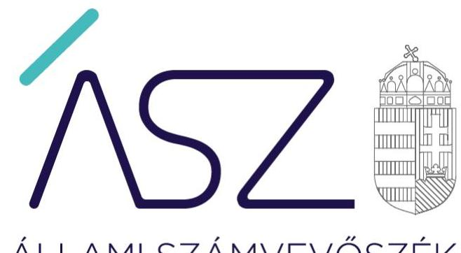
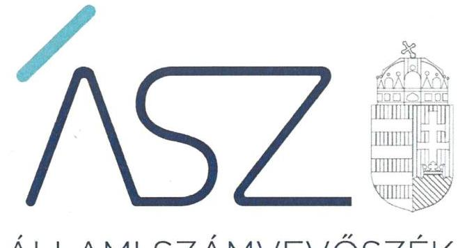
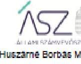

ÁLLAMI SZÁMVEVŐSZÉK

# JELENTÉS 

A költségvetési támogatásban részesülő számviteli törvény szerinti egyéb szervezetek ellenőrzése - Sportegyesületek, sportszövetségek ellenőrzése

Magyar Diáksport Szövetség
2021.

21059
www.asz.hu

---

ÁLLAMI SZÁMVEVŐSZÉK

# JELENTÉS

A költségvetési támogatásban részesülő számviteli törvény szerinti egyéb szervezetek ellenőrzése – Sportegyesületek, sportszövetségek ellenőrzése

Magyar Diáksport Szövetség

2021. 10. hó 25. nap

21059
www.asz.hu

Domokos László
elnök

---

# AZ ELLENŐRZÉST FELÜGYELTE: 

SALAMON ILDIKÓ felügyeleti vezető

## AZ ELLENŐRZÉST VEZETTE ÉS A VÉGREHAJTÁSÁÉRT FELELŐS:

KISTÓTH KRISZTINAellenőrzésvezető

A PROGRAM ÖSSZEÁLLÍTÁSÁÉRT FELELŐS:
FEKETE-NAGY ANDRÁS GÁBOR projekt vezető

IKTATÓSZÁM: EL-3252-001/2021
TÉMASZÁM: 2558
ELLENŐRZÉS-AZONOSÍTÓ SZÁM: V-090201
Jelentéseink az Országgyúlés számitógépes hálózatán és az interneten a www.asz.hu címen is olvashatóak.

---

# TARTALOMJEGYZÉK 

- ÖSSZEGZÉS ..... 5
- AZ ELLENŐRZÉS CÉLJA ..... 7
- AZ ELLENŐRZÉS TERÜLETE ..... 8
- AZ ELLENŐRZÉS HÁTTERE, INDOKOLTSÁGA ..... 9
- A JELENTÉS LÉNYEGES KÉRDÉSKÖREI. ..... 10
- AZ ELLENŐRZÉS HATÓKÖRE ÉS MÓDSZEREI. ..... 11
- MEGÁLLAPÍTÁSOK ..... 13
- JAVASLATOK ..... 15
- MELLÉKLETEK. ..... 17
I. sz. melléklet: Fogalomtár. ..... 17
- FÜGGELÉK: ÉSZREVÉTELEK ..... 19
- RÖVIDÍTÉSEK JEGYZÉKE ..... 27

---

.

---

# ÖSSZEGZÉS 

A Magyar Diáksport Szövetség - szabályszerű gazdálkodási keretek hiányában - nem biztosította az átlátható közpénzfelhasználás alapvető feltételeit a 2019. évben. A hibák feltárását követően az Állami Számvevőszék felhívására a hiányosságok javitása megtörtént.

## Az ellenőrzés társadalmi indokoltsága

A sport a modern polgári társadalmakban egyre jobban az emberek mindennapi életének részévé, tömegessé válik, mint a testkultúra, az egészséges életmód része, a szabadidő eltöltésének hasznos módja, a prevenció és a rekreáció eszköze. A sportolás ebben az értelemben egyre inkább ún. második generációs állampolgári joggá válik. A szolgáltató állam kötelezettsége, hogy az ország gazdasági-társadalmi teherbíró-képességéhez igazodva - egyre bővülő mértékben - segítse elő, illetve tegye lehetővé a lakosság egészének a sportolás lehetőségét („a sport mindenkié").

A sportolás és a rendszeres testedzés támogatása az Alaptörvényben meghatározott, a testi és lelki egészséghez való alapvető jog érvényesülésének, biztosításának egyik segítő eszköze.

A jogszabályok lehetővé teszik, hogy a sportegyesületek - mint klasszikus sportszervezeti forma, több ezer sportegyesület müködik Magyarországon - nemcsak a sportszövetségeken keresztül, hanem önállóan is részesíthetők állami támogatásban. A sportszövetségek - az országos sportági szakszövetség, a sportági szövetségek, a szabadidősport szövetségek és a fogyatékosok sportszövetségei, a diák- és főiskolai-egyetemi sport sportszövetségei - a társadalmi szervezetek önálló formája, a sportszövetség sportszövetségi jellegét a bírósági nyilvántartásban kifejezetten fel kell tüntetni. A sportegyesületek és a sportszövetségek müködésükre és szakmai tevékenységük ellátására kapott költségvetési támogatást, illetve ingyenes vagyonjuttatást széles körű társadalmi érintettség következtében is, közérdeklődés övezi. Az Állami Számvevőszék még nem ellenőrizte ezt a területet.

Az Állami Számvevőszék ellenőrzései arra adnak választ, hogy a sportegyesületek, sportszövetségek az éves beszámolási kötelezettségüket és az államháztartásból kapott támogatásokkal kapcsolatos nyilvántartási kötelezettségüket szabályszerűen teljesítették-e, a szervezeti és gazdálkodási kereteket szabályszerűen kialakították-e. A szabályszerű gazdálkodás elengedhetetlen a közfeladatok szakmai céljainak megvalósításához, a közbizalom fenntartásához.

## Értékelés, következtetések, javaslatok

Alapvető elvárás, hogy a társadalom objektív képet alkothasson a költségvetési támogatásban részesülő számviteli törvény szerinti egyéb szervezetek, így a sportegyesületek, sportszövetségek müködéséről. Ennek alapfeltétele a közpénzekkel való gazdálkodás elszámoltathatósága, a támogatások felhasználásának átláthatósága, amelyek hiánya sérti a közélet tisztaságának elvét. Az objektív információk rendelkezésre állása érdekében törvény határozza meg azokat a lényeges számviteli, elszámolási szabályokat és szabályozási kötelezettségeket, amelyeknek hiánya akadályozza a törvény a számviteli alapelveknek megfelelő végrehajtását, így a valós helyzetet tükröző információk előállítását.

A Magyar Diáksport Szövetségnél a számviteli politika és a keretében elkészítendő szabályzatok hiányában nem kerültek rögzítésre a számviteli elszámolás, az értékelés szempontjából a szervezet adottságainak, körülményeinek leginkább megfelelő szabályok, előírások, módszerek. Az eszközök és a források leltárkészítési és leltározási szabályzatának hiányában nem biztosított a szabályozott és szabályszerű leltározás és leltárkészítés, a leltárba kerülő adatok valódisága, ezáltal a mérleg alátámasztottsága. Az eszközök és a források értékelési szabályzatának, így a könyvekbe bejegyzésre kerülő eszközök és források értékelésére vonatkozó módszereknek és eljárásoknak a hiányában nem biztosított a beszámolóban kimutatott adatok törvényi előírásokkal való összhangja. A pénzkezelési szabályzat, és ezáltal a pénztárak, a bankszámlák használatának, a pénzmozgások bizonylati rendjének, a szigorú számadású bizony-

---

latoknak, az értékpapírok megőrzésére és kezelésére vonatkozó szabályoknak a meghatározása hiányában a szervezet pénzkezeléssel kapcsolatos eljárásai, feladat- és felelősségi körei nem számon kérhetőek, a pénz kezelésének menete nem nyomon követhető.

Számlarend hiányában nem biztosított a szabályozott könyvvezetés, a törvényben előírt beszámoló készítéséhez szükséges adatok alátámasztottsága, azok bizonylati alátámasztása.

Ezáltal a törvényben előírt beszámoló készítését biztosító könyvvezetésre, bizonylatolásra vonatkozó részletes belső szabályait a Magyar Diáksport Szövetség nem alakította ki.

A törvényben előírt számviteli szabályozások, valamint szabályozott könyvvezetés hiányában nem értékelhető a számviteli beszámoló, valamint a számviteli (könyvvezetési) rendszer támogatásonként tovább részletezett adatai, mivel fennáll a kockázata, hogy azok kívülállók számára nem megállapíthatók. Mindez kockázatot jelent a támogatások felhasználásának ellenőrizhetőségére.

A közpénzügyi kockázatot növelte, hogy a Magyar Diáksport Szövetség Felügyelő Bizottsága az ügyrendjét nem állapította meg. Ennek következtében hiányzotta belső védelmi ellenőrző rendszer alapvető feltétele, amely a feltárt hibákat saját felelősségi körben megelőzhette volna.

A közpénzügyi helyzet mielőbbi javítása érdekében az Állami Számvevőszék figyelemfelhívással fordult a Magyar Diáksport Szövetség képviseletére jogosult vezetőkhöz az alapvető számviteli szabályozások elkészítése érdekében. Ennek eredményeként - a bemutatott dokumentumok alapján -, a Magyar Diáksport Szövetségnél az átlátható közpénzfelhasználás alapvető feltételei a számviteli szabályozások terén lényegesen javultak.

Az Állami Számvevőszék az ellenőrzés megállapításai alapján egy javaslatot tett a Magyar Diáksport Szövetség képviseletére jogosult vezetőknek a feltárt hiba jövőbeni megakadályozására.

---

# AZ ELLENŐRZÉS CÉLJA 

AZ ELLENŐRZÉS CÉLJA annak értékelése, hogy a szervezet az éves beszámolási kötelezettségét és az államháztartásból kapott támogatásokkal kapcsolatos nyilvántartási kötelezettségétszabályszerűen teljesítettee, a szervezet a szervezeti és gazdálkodási kereteit szabályszerűen kialakította-e.

---

# **AZ ELLENŐRZÉS TERÜLETE**

## **Magyar Diáksport Szövetség**

A Magyar Diáksport Szövetséget (a továbbiakban: MDSZ¹) 1987-ben alapították, közhasznú tevékenységet 2014. december 18 óta végez. Az MDSZ a Sport tv.² szerint a diáksport területén országos jelleggel működő sportszövetség. Az Alapszabály³ szerint "a diák sportszervezetek és sporttevékenységet kifejtő természetes személyek tevékenységét összefogó, önkormányzati elv alapján működő, érdekképviseletet is kifejtő közhasznú szervezet".

Az MDSZ rendes és pártoló tagsággal rendelkezik, tagjai tagdíjat fizetnek. Legfőbb szerve a küldöttgyűlés, amely a rendes tagok szavazati joggal rendelkező küldöttjeinek összessége. Az MDSZ tevékenységét az elnökség irányítja, az elnökség tagjai vezető tisztségviselőknek minősülnek. Az MDSZ képviseletét önállóan az elnök, valamint az ügyvezető igazgató látja el. A küldöttgyűlés az MDSZ működésének és gazdálkodásának ellenőrzésére 3 fős felügyelő bizottságot választott.

Az MDSZ munkaszervezetét az országos központ és regionális irodái képezik, Debrecenben, Miskolcon, Szegeden, Székesfehérváron, Pécsett, Szombathelyen és Budapesten.

Az ellenőrzött időszakban közhasznú jogállására tekintettel az MDSZ kettős könyvvitel vezetésére volt köteles, a beszámoló formája egyszerűsített éves beszámoló volt. A beszámoló felülvizsgálatára az MDSZ könyvvizsgálót bízott meg. A beszámoló készítésével egyidejűleg az MDSZ a Civil tv.⁴ szerint közhasznúsági jelentés készítésére volt kötelezett.

Az MDSZ Alapszabálya szerint vállalkozási tevékenységet, kizárólag közhasznú céljainak elérése érdekében, azokat nem veszélyeztetve végezhet. A beszámoló adatai alapján 2019. évben az MDSZ folytatott vállalkozási tevékenységet.

A Magyar Államkincstár adatai szerint 2019. évben az MDSZ 669,3 millió forint központi költségvetési támogatásban részesült.

---

# AZ ELLENŐRZÉS HÁTTERE, INDOKOLTSÁGA 

A sportegyesületek, sportszövetségek müködésükre és szakmai tevékenységük ellátására költségvetési támogatásban vagy ingyenes vagyonjuttatásban részesülhetnek, amelyre fokozott közérdeklődés irányul. Társadalmi elvárás a közpénzek értékelvű, rendeltetésszerű felhasználása, a közpénzekből nyújtott támogatások átláthatóságának megteremtése.

Az ÁSZ5 a sportegyesületeknél, sportszövetségeknél ellenőrzi a közpénzekkel való gazdálkodás alapvető szabályozási kereteit, a nyilvántartások vezetését, a beszámolási kötelezettség teljesítését. A felhasznált támogatások átláthatóságának, a közpénzekkel való gazdálkodás elszámoltathatóságának értékelésével az ÁSZ előmozdítja, hogy a társadalom objektív képet alkothasson a költségvetési támogatásban részesülő számviteli törvény szerinti egyéb szervezetek, így a sportegyesületek, sportszövetségek müködéséről. Az ÁSZ Stratégiában rögzített célkitűzése, hogy az államháztartáson kívülre nyújtott költségvetési támogatás és vagyonjuttatás ellenőrzésével hozzájáruljon ahhoz, hogy a közpénzeket a sportegyesületek, sportszövetségek is átlátható módon és célszerűen használják fel.

Az ellenőrzés eredményeinek célzott felhasználói a nyilvánosság, a jogalkotó, továbbá a sportegyesületek, sportszövetségek alapítói. Az ellenőrzés eredményeképp a törvényalkotás számára tapasztalatok állnak rendelkezésre a sportegyesületek, sportszövetségek gazdálkodása szabályozásához. Az ellenőrzött szervezetek szintjén gazdálkodásuk vonatkozásában a hiányosságok, szabálytalanságok feltárása, az ennek kapcsán megfogalmazott megállapítások elősegíthetik a sportegyesületek, sportszövetségek szabályszerű gazdálkodását. Az ellenőrzés a társadalom számára információt szolgáltat arról, hogy a sportegyesületek, sportszövetségek a közpénzek szabályszerű felhasználásának feltételeit kialakították-e.

---

# A JELENTÉS LÉNYEGES KÉRDÉSKÖREI 

1.     - A sportszövetség a szervezeti és gazdálkodási kereteinek kialakításával megteremtette-e a költségvetési támogatások szabályszerű felhasználásának feltételeit?
2.     - A sportszövetség rendelkezett-e éves számviteli beszámolóval és szabályszerűen kialakította-e a költségvetési támogatások elkülönített nyilvántartását?

---

# AZ ELLENŐRZÉS HATÓKÖRE ÉS MÓDSZEREI 

## Az ellenőrzés típusa

Szabályszerúségi ellenőrzés.

## Az ellenőrzött időszak

2019. év

## Az ellenőrzés tárgya

A sportegyesület, a sportszövetség beszámolási kötelezettsége teljesítésének, az államháztartási forrásból kapott támogatással kapcsolatosan vezetett nyilvántartásának, valamint a gazdálkodása alapvető szabályozási keretei kialakításának ellenőrzésére terjed ki.

## Az ellenőrzött szervezet

Magyar Diáksport Szövetség

## Az ellenőrzés jogalapja

Az ÁSZ tv. ${ }^{6}$ 1. § (3) bekezdése, 5. § (3) bekezdése, valamint a Civil tv. 47. § előírásai.

## Az ellenőrzés módszerei

Az ellenőrzést az ellenőrzési program szempontjai, kérdései, az ellenőrzött időszakban hatályos jogszabályok, a nemzetközi standardokat irányadónak tekintve, az ellenőrzés szakmai szabályok és módszertanok figyelembevételével végzi az ÁSZ. A közpénzekkel való felelős gazdálkodás segítésére irányuló javaslatok kidolgozásakor a hatályos jogszabályok az irányadóak.

Az ellenőrzés alapvető feltétele az ellenőrizhetőség kérdése, a melyre az elkülönített nyilvántartás vizsgálatával adunk választ. Elszámoltatható és átlátható a szervezet akkor, ha beszámolási kötelezettségének szabályszerűen eleget tett.

Az ellenőrzési kérdések megválaszolásához szükséges bizonyítékok megszerzése az ellenőrzött által rendelkezésre bocsátott dokumentu-

---

mokra, adatokra alapozva megfigyelés, szemle (szemrevételezés), összehasonlítás kérdésfeltevés (információkérés), valamint elemző eljárással történik.

Az ellenőrzési bizonyítékként felhasználható adatforrások közé tartoznak egyrészt a szakmai program részletes szempontjainál felsorolt adatforrások, másrészt minden - az ellenőrzés folyamán feltárt, az ellenőrzés szempontjából információt tartalmazó - dokumentum.

Az ellenőrzés lefolytatásához az ellenőrzött szervezet a kitöltött tanúsítvány, valamint az ÁSZ által kért dokumentumok elektronikus úton való megküldésével szolgáltat adatokat, információkat. Az így rendelkezésre bocsátott adatok, információk és a tanúsítványok adatai valódiságának kontrollja az ellenőrzés keretében történik.

Az ellenőrzés ideje alatt az ellenőrzött szervezettel történő kapcsolattartást az ÁSZ SZMSZ²-ének vonatkozó előírásai alapján szükséges biztosítani.

---

# 1. A sportszövetség a szervezeti és gazdálkodási kereteinek kialakításával megteremtette-e a költségvetési támogatások szabályszerű felhasználásának feltételeit? 

Összegző megállapítás

Az MDSZ a 2019. évben a közpénz felhasználás szabályszerű szervezeti és gazdálkodási kereteit nem alakította ki.

Az MDSZ rendelkezett a Küldöttgyűlés által elfogadott Alapszabállyal, valamint a Civil tv. szerint létrehozta felügyelő bizottságát. Ugyanakkor a felügyelő bizottság a Civilt tv. 40. § (2) bekezdésében előírtak ellenére nem állapította meg ügyrendjét. Ezzel az MDSZ nem biztosította a költségvetési támogatások szabályszerű felhasználásához a pénzügyi kontroll környezet szervezeti kereteit.

A 2019. évben az MDSZ nem rendelkezett a Számv. tv. ${ }^{8}$ 14. § (3) bekezdés, valamint a 14. § (5) bekezdés a), b), és d) pontjai ellenére számviteli politikával és annak keretében elkészítendő, az eszközök és a források leltárkészítési és leltározási szabályzatával, az eszközök és a források értékelési szabályzatával és pénzkezelési szabályzattal. A számviteli szabályzatok hiánya akadályozta a számviteli alapelvek érvényesülését, a Számv. tv. szerinti értékelési elvek, módszerek alkalmazása nem volt biztosított az MDSZnél.

Az MDSZ a Számv. tv. 161. § (1) bekezdés szerinti számlarendjét nem készítette el. A számlarend hiányában a könyvvezetésre, bizonylatolásra vonatkozó részletes belső szabályokat nem határozta meg. Ezáltal az MDSZ a támogatások felhasználásának szabályszerű gazdálkodási kereteit, pénzügyi elszámolási feltételeit nem teremtette meg.

## 2. A sportszövetség rendelkezett-e éves számviteli beszámolóval és szabályszerűen kialakította-e a költségvetési támogatások elkülönített nyilvántartását?

Összegző megállapítás

Az MDSZ 2019. évi számviteli beszámolójának és a támogatások elkülönített nyilvántartásának alátámasztottsága nem volt biztosított.

Az MDSZ a 2019. évi számviteli beszámoló készítésének szabályait nem alakította ki a Számv. tv. előírásainak megfelelően. A beszámolóra vonatkozó részletes előírások, a számviteli alapelvek érvényesítése hiányában nem biztosított, hogy a beszámoló valós képet adjon a vagyoni, pénzügyi helyzetről, a jövedelem alakulásáról. Továbbá, hogy a beszámoló ne tartalmazzon olyan eredményt, amelynek realizálása bizonytalan, vagy olyan vagyont, amely esetleg már nem áll rendelkezésre. A szabályzatok hiányában

---

a számviteli beszámoló a Számv. tv. 4. § (1) bekezdésében foglaltak ellenére a törvényben meghatározott szabályszerű könyvvezetéssel nem volt alátámasztott.

A 2019. évben az MDSZ az államháztartásból kapott támogatásokat és annak felhasználását tartalmazó elkülönített nyilvántartása adatainak alátámasztottsága - a Számv. tv. előírásai szerinti szabályozások hiányában nem volt biztosított.

---

# JAVASLATOK 

Az ÁSZ tv. 33. § (1) bekezdésében foglaltak értelmében az ellenőrzött szervezet vezetője köteles a jelentésben foglalt megállapításokhoz kapcsolódó intézkedési tervet összeállítani és azt a jelentés kézhezvételétől számított 30 napon belül az ÁSZ részére megküldeni. Amennyiben az ellenőrzött szervezet vezetője nem küldi meg határidőben az intézkedési tervet, vagy továbbra sem elfogadható intézkedési tervet küld, az Állami Számvevőszék elnöke az ÁSZ tv. 33. § (3) bekezdése a) és b) pontjaiban foglaltakat érvényesítheti.

## a Magyar Diáksport Szövetség képviseletére jogosult vezetöknek

1. Kezdeményezze, hogy a törvényi elöírásoknak eleget téve a felügyelö bizottság állapítsa meg ügyrendjét.
(1. sz. megállapítás 1. bekezdés 2. mondata alapján)

---

.

---

# MELLÉKLETEK 

I. SZ. MELLÉKLET: FOGALOMTÁR
átláthatóság
államháztartásból származó forrás
civil szervezet
elszámoltathatóság
gazdálkodó tevékenység
gazdasági-vállalkozási tevékenység
költségvetési támogatás
közhasznú tevékenység
sportegyesület
sportszövetség

Előfeltétele az elszámoltathatóságnak, a célok elérése érdekében folytatott tevékenységekről, folyamatokról a fontos információk közzé- vagy hozzáférhetővé legyenek téve (Forrás: Az államháztartási belső kontroll standardok és gyakorlati útmutató, 28. oldal, NGM, 2017)
az államháztartás központi és önkormányzati alrendszeréből származó forrás
a civil társaság; a Magyarországon nyilvántartásba vett egyesület - a párt, a szakszervezet és a kölcsönös biztosító egyesület kivételével és - a közalapítvány és a pártalapítvány kivételével - az alapítvány. (Forrás: Civil tv. 2. § 6. pont a)-c) pontjai)
A vezető vagy a munkatárs felelős a tevékenységéért, az érintettek pedig jogosultak számon kérni azt, hogy a tevékenység valóban az ő érdekükben, és az elvártnak megfelelően történt (Forrás: Az államháztartási belső kontroll standardok és gyakorlati útmutató, 28. oldal, NGM, 2017)
azon tevékenységek összessége, amelyek a civil szervezet vagyoni, pénzügyi, jövedelmi helyzetére kiható gazdasági eseményt eredményeznek. (Forrás: Civiltv. 2. § 10. pont)
A jövedelem- és vagyonszerzésre irányuló vagy azt eredményező, üzletszerűen végzett gazdasági tevékenység, kivéve az adomány (ajándék) elfogadását, a létesítő okiratban meghatározott cél szerinti tevékenységet (ideértve a közhasznú tevékenységet is), - 2015. november 28-tól - a pénzeszközök betétbe, értékpapírba, társaság í részesedésbe történő elhelyezését és az ingatlan megszerzését, használatának átengedését és átruházását. (Forrás: Civil tv. 2. § 11. pont a)-d) pontjai)
az államháztartás alrendszerei terhére nyújtott pénzbeli vagy nem pénzbeli juttatás, amelyet a támogató nem elsősorban ellenszolgáltatás ellenében, de konkrét program megvalósítása vagy meghatározott időszakban a támogatott szervezet múködtetése érdekében nyújt. Költségvetési támogatás különösen: a pályázat útján, valamint egyedi döntéssel kapott költségvetési támogatás; az Európai Unió strukturális alapjaiból, illetve a Kohéziós Alapból származó, a költségvetésből juttatott támogatás; az Európai Unió költségvetéséből vagy más államtól, nemzetközi szervezettől származó támogatás és a személyi jövedelemadó meghatározott részének az adózó rendelkezése szerint felajánlott összege. (Forrás: Civil tv. 2. § 15. pont)
minden olyan tevékenység, amely a létesítő okiratban megjelölt közfeladat teljesítését közvetlenül vagy közvetve szolgálja, ezzel hozzájárulva a társadalom és az egyén közös szükségleteinek kielégítéséhez. (Forrás: Civil tv. 2. § 20. pont)
Sportegyesület - a Sport törvényben megállapított eltérésekkel - a Civiltv. és a Polgári Törvénykönyv szabályai szerint működő olyan egyesület, amelynek alaptevékenysége a sporttevékenység szervezése, valamint a sporttevékenység feltételeinek megteremtése. A sportegyesület a magyar sport hagyományos szervezeti alapegysége, a versenysport, a tehetséggondozás, az utánpótlás-nevelés és a szabadidősport múhelye. (Forrás: Sport tv. 16. § (1)-(2) bekezdés
A sportszövetségek meghatározott sporttevékenységek körében a sportversenyek szervezésére, a tagok érdekvédelmére és a részükre való szolgáltatásokra, valamint a nemzetközi kapcsolatok lebonyolítására létrehozott, jogi személyiséggel és önkormányzattal rendelkező, a Civil tv. és a Polgári Törvénykönyv alapján - az e törvényben foglalt eltérésekkel - különös formában múködő egyesületek. (Forrás: Sport tv. 19. § (1) bekezdés)

---

.

---

# FÜGGELÉK: ÉSZREVÉTELEK 

A jelentéstervezetet a Számvevőszék 15 napos észrevételezésre megküldte az ellenőrzött szervezet vezetőinek az ÁSZ tv. 29. §* (1) bekezdése elöírásának megfelelően.

A Magyar Diáksport Szövetség elnöke a jelentéstervezet megállapításaira észrevételt tett. Az ÁSZ tv. 29. § (3) bekezdésével összhangban az ÁSZ a Függelékben feltünteti a jelentéstervezet megállapításaival kapcsolatban tett, figyelembe nem vett észrevételeket, és megindokolja, hogy azokat miért nem fogadta el.

[^0]
[^0]:    * 29. § (1) Az Állami Számvevőszék az ellenőrzési megállapításait megküldi az ellenőrzött szervezet vezetőjének vagy az általa megbízott személynek, és annak, akinek személyes felelősségét állapította meg.
    (2) Az ellenőrzött szervezet vezetője és a felelősként megjelölt személy az ellenőrzés megállapításaira tizenöt napon belül írásban észrevételt tehet.
    (3) Az Állami Számvevőszék az észrevételre a beérkezésétől számított harminc napon belül írásban válaszol. A figyelembe nem vett észrevételeket köteles a jelentésben feltüntetni, és megindokolni, hogy azokat miért nem fogadta el.

---

Állami Számvevőszék

Domokos László
Elnök

Iktatószám: 10IK21
Ügyintéző: Bartháné Madarassy Katafin
Telefonszám: 30-662-9255
Fc - 64611/2021/1
2021 05 07

Tárgy: észrevétel
Hiv. szám: EL-2931-035/2021.
EL-2931-038/2021.

# Tisztelt Elnök Úr! 

A Magyar Diáksport Szövetség (1063 Budapest, Munkácsy M. u. 17., a továbbiakban: MDSZ) képviseletében eljárva, hivatkozással a tárgyi iktatószámú felhívásban, valamint az annak mellékleteként kézhez vett ellenőrzési jelentéstervezetben („A költségvetési támogatásban részesülő számviteli törvény szerinti egyéb szervezetek ellenőrzése - Sportegyesületek, sportszövetségek ellenőrzése" - a továbbiakban: Jelentéstervezet) foglaltakra, az ÁSZ tv. 29. § (2) bekezdése alapján az alábbi

## észrevételt

teszem, kérve annak szíves elfogadását, és a jelentéstervezet ennek megfelelő módosítását.
Szervezetünk elhivatott a közpénzek szabályos és átlátható felhasználása mellett. Az MDSZ immár 2009. óta folyamatosan rendelkezik a gazdálkodására vonatkozó, jogszabályok által előírt valamennyi szabályzattal, így egyebek mellett a jelentéstervezetben hiányosságként tételesen feltüntetett

- számviteli politikával,
- az eszközök és a források leltárkészítési és leltározási szabályzatával,
- az eszközök és a források értékelési szabályzatával,
- pénzkezelési szabályzattal, valamint
- számlarenddel is.

Szabályzataink frissítése is megtörténik a törvényi rendelkezéseknek megfelelő gyakorisággal. Szervezetünk a hatályos szabályzatokban és jogszabályokban foglaltaknak megfelelően végzi el a számviteli feladatokat, készíti el hivatalos elszámolásait, beszámolóit.

A szabályzatok megléte mellett a Felügyelő Bizottság kérésére szervezetünk müködését és éves beszámolóját immár öt éve, éves gyakorisággal független könyvvizsgáló ellenőrzi. A támogató szervezetekhez benyújtott elszámolásainkat az Emberi Erőforrások Minisztériumának több főosztálya, valamint az uniós ERASMUS projektek forrásfelhasználását az illetékes uniós szerv (European Education and Culture Executive Agency - EACEA) ellenőrzi. A nagy támogatási összegű ERASMUS projektek elszámolásait, illetve a vonatkozó számviteli és pénzügyi rendszer megfelelőségét szintén független könyvvizsgáló ellenőrzi. A támogatások felhasználásának szabályosságát rendszerszerűen kifogásoló megállapítást mindezidáig soha nem kaptunk. A könyvvizsgálatok és ellenőrzések során az elmúlt 10 évben is több alkalommal megvizsgálásra került a számviteli politika és az Állami Számvevőszék által is ellenőrzött szabályzatok, amelyeket minden alkalommal rendelkezésre bocsátottunk, kifogás ezekkel kapcsolatosan sem merült fel.

---

A felszólítás, illetve a jelentéstervezet kézhezvételét követően megkiséreltük feltárni, hogy a hiányosságként rögzített - ténylegesen azonban létező és rendelkezésre álló - szabályzatok milyen körülmények között kerültek benyújtásra az Állami Számvevőszékhez. Az ellenőrzés folyamán kronologikusan az alábbi lépéseket tettük:

- A 2020. szeptember 25-én kelt ellenőrzési felhívásban rögzítetteknek megfelelően 2020. október 9-ig az összes vonatkozó melléklet - így a felszólítás tárgyát képező, hiányosságként felrótt szabályzatok is - feltöltésre kerültek az ÁSZ által megadott elektronikus felületre.
- 2020. november 11-én újabb értesítést kaptunk, amely tájékoztatott bennünket a vizsgálatot vezető személyek nevéről, azonban újabb hiánypótlási vagy értesítési megkeresés nem érkezett.
- Főkönyvelőnk, Bartháné Madarassy Katalin 2021. január 15-én - egyéb elérhetőség hiányában - telefonos úton érdeklődött, hogy van-e további teendőnk a vizsgálatot illetően. A hatóság munkatársa ennek során azt a tájékoztatást adta, hogy hivatalos értesítést kapunk, amennyiben bármilyen probléma merül fel bármelyik benyújtott melléklettel kapcsolatban. (A telefonbeszélgetés rögzítésre került.) Ez a Jelentéstervezet kézhezvételéig nem történt meg.
- A Jelentéstervezet kézhezvételét követően új jelszót kértünk az ÁSZ elektronikus felületéhez, ahol jelenleg is megtalálhatók és hozzáférhetők a fentieknek megfelelően feltöltött szabályzatok.

A fentiekre tekintettel álláspontunk szerint egyértelműen megállapítható, hogy a Jelentéstervezet „Összegzés - Értekelés, következtetések, javaslatok" című fejezetében (5-6. oldal), úgyszintén a „Megállapítások" című fejezetében (13-14. oldal) rögzített megállapítások nem helytállóak, tévesen állapítja meg a Jelentéstervezet a hivatkozott fejezetben felsorolt szabályzatok hiányát, illetve figyelmen kívül hagyja azt a tényt, hogy a felsorolt szabályzatokkal az MDSZ rendelkezik, az ellenőrzés tárgyidőszakában is bizonyíthatóan rendelkezett, és ezek a dokumentumok a felhívásnak megfelelően az Állami Számvevőszék rendelkezésére bocsátottuk az elektronikus felületen.

Ebből következően nem megalapozott a Jelentéstervezetben rögzített azon megállapítás, amely szerint „az MDSZ a 2019. évben a közpénz felhasználás szabályszerű szervezeti és gazdálkodási kereteit nem alakította ki", hiszen a megállapítás indokolásában felsorolt szabályzatokkal az MDSZ rendelkezett a tárgyidószak vonatkozásában, és azokat a Számvevőszék felhívásának megfelelően be is mutatta az ellenőrzés keretében. Nem megalapozott továbbá az a megállapítás sem, mely szerint „az MDSZ 2019. évi számviteli beszámolójának és a támogatások elkülönített nyilvántartásának alátámasztottsága nem volt biztosított", hiszen e megállapítást a Jelentéstervezet ugyancsak a releváns szabályzatok hiányára alapította.

Nyilatkozunk ugyanakkor, hogy az MDSZ Felügyelő Bizottsága az eddigiekben valóban nem rendelkezett írásban rögzített ügyrenddel, ezt pótolandó a bizottság soron következő ülésén, 2021. május 25. napján elfogadásra kerül a Felügyelő Bizottság írásbeli ügyrendje. Mindazonáltal a Felügyelő Bizottság az eddigiekben írásos ügyrend hiányában is minden évben felülvizsgálta a szervezet gazdálkodásának szabályszerűségét, ennek keretében az előírt szabályzatok meglétét és betartását, a megállapításait (melyek hiányosságot nem tártak fel) minden évben jegyzőkönyvben rögzítette az éves számviteli beszámoló elfogadását megelőzően. Erre tekintettel - valamint figyelemmel arra is, hogy a szervezet gazdálkodását és számviteli tevékenységét független könyvvizsgáló is ellenőrzi minden évben - álláspontunk szerint a felügyelő bizottsági ügyrend hiánya semmiképpen nem tekinthető olyan, a gazdálkodás szabályszerűségét veszélyeztető, jelentős mértékű hiányosságnak, amely a Jelentéstervezet megállapításait önmagában indokolttá tehetné.

---

Arra az esetre, amennyiben - jóllehet erre vonatkozó jelzést, hiánypótlási felhívást kifejezett kérdésünkre sem kaptunk - a hiányosságok megállapítását az indokolta, hogy a vonatkozó dokumentumok esetlegesen nem megfelelő formátumban (aláírt pdf) kerültek feltöltésre, a hivatkozott felhívásban foglaltaknak megfelelően, jelen észrevételemhez mellékelem az aláírt szabályzatok hitelesített másolati példányait.

A szóban forgó szabályzatok közül a Számlarend kapcsán előadjuk továbbá a teljesség kedvéért, hogy az ellenőrzés korábbi szakaszában e szabályzatnak az általunk relevánsnak vélt - a főkönyvi számok listáját rögzítő - „Számlatükör" része került feltöltésre az elektronikus felületre, a jelen észrevételhez ugyanakkor e szabályzatnak a szöveges részét is tartalmazó teljes verzióját is mellékeljük.

Kérem, hogy amennyiben az ellenőrzést végző szakemberek a szabályzatokkal kapcsolatosan bármilyen további hiányosságot vagy hibát állapítanak meg, legyenek szívesek ezt jelezni felém vagy ügyintéző munkatársam irányában, az esetleges formai vagy tartalmi hiányosságok kiküszöbölése érdekében.

Kérem Tisztelt Elnök Urat, hogy a fent előadott észrevételeimet elfogadni, és a Jelentéstervezet annak megfelelő módosításáról gondoskodni szíveskedjék.

Amennyiben az ellenőrzés lezárását bármilyen további információval elő tudjuk segíteni, természetesen kollégáimmal együtt állunk az Állami Számvevőszék munkatársainak szíves rendelkezésére.

Segítő együttműködését köszönöm.

Budapest, 2021. május 6.

Mellékletek:

1. Számviteli politika
2. Eszközök és források leltárkészítési és leltározási szabályzata
3. Eszközök és források értékelési szabályzata
4. Pénzkezelési szabályzat
5. Számlarend
(Valamennyi melléklet 1-1 db aláírt, hitelesített másolati példányban kerül benyújtásra.)

---

Ikt. szám: EL-2931-041/2021.

Balogh Gábor úr elnök

Magyar Diáksport Szövetség

Budapest

Tisztelt Elnök Úr!

"A költségvetési támogatásban részesülő számviteli törvény szerinti egyéb szervezetek ellenőrzése – Sportegyesületek, sportszövetségek ellenőrzése - Magyar Diáksport Szövetség" című ellenőrzés megállapításaira a 2021. május 6-án kelt, 10lk21 iktatószámú levelében megküldött észrevételeit megkaptam.

Az Állami Számvevőszék (továbbiakban: ÁSZ) észrevételre vonatkozó álláspontjáról a felügyeleti vezető által készített részletes tájékoztatást csatoltan megküldöm.

Tájékoztatom Elnök urat, hogy a számvevőszék jelentésben – az Állami Számvevőszékről szóló 2011. évi LXVI. törvény (továbbiakban: ÁSZ tv.) 29. § (3) bekezdése alapján – a figyelembe nem vett észrevételeket szerepeltetjük az elutasítás indokának feltüntetésével.

Budapest, 2021. 06. hónap 04. nap

Tisztelettel:

Domokos László s.k.

Melléklet: Tájékoztatás az észrevételek kezeléséről

1052 Budapest, Ápázzai Csere János u. 10, 1364 Budapest 4. Pf. 54.
számvevccsel@azs.hu | www.azs.hu | www.azshoportal.hu

---

# Tájékoztatás az észrevételek kezeléséről 

„A költségvetési támogatásban részesülő számviteli törvény szerinti egyéb szervezetek ellenőrzése Sportegyesületek, sportszövetségek ellenőrzése - Magyar Diäksport Szövetség" címú ellenőrzés megállapításaira a 2021. május 6-án kelt, 10IK21. iktatószámú levelében megküldött észrevételeket áttekintettem. Az észrevételek kezeléséről az alábbi tájékoztatást adom.

1. A jelentéstervezet 1. megállapítás 2. bekezdésében a számviteli politikával és annak keretében elkészítendő szabályzatokkal kapcsolatos megállapításra tett észrevételét nem fogadtam el.
Elnök úr észrevétele szerint nem megalapozott a jelentéstervezet megállapítása, hogy a Magyar Diäksport Szövetség (továbbiakban: MDSZ) a 2019. évben a közpénz felhasználás szabályszerű szervezeti és gazdálkodási kereteit nem alakította ki. Az MDSZ 2009. óta folyamatosan rendelkezik a gazdálkodásra vonatkozó, jogszabályok által előirt valamennyi szabályzattal. A szabályzatok frissítése is megtörténik a törvényi rendelkezéseknek megfelelő gyakorisággal.
Az ÁSZ az EL-2931-001/2020. iktatószámú levél 3. számú melléklete Dokumentumok jegyzéke 1-4. pontjában kérte be az MDSZ aláirt, hiteles, 2019. január 1. - 2019. december 31. közötti időszakra vonatkozó számviteli politikáját, az eszközök és a források leltárkészítési és leltározási szabályzatát, az eszközök és a források értékelési szabályzatát és pénzkezelési szabályzatát.
Az MDSZ ügyvezető igazgatója a 2020. október 8-án kelt teljességi és hitelességi nyilatkozatban nyilatkozott arról, hogy az átadott dokumentumok, adatok hitelességéért, valódiságáért, hiánytalanságáért és hatályosságáért teljes felelősséget vállal.
A 2020. október 8-án kelt teljességi és hitelességi nyilatkozattal az ellenőrzés rendelkezésére bocsátott számviteli politika 2020. április 1-jén lépett hatályba, tehát 2019. január 1. és 2019. december 31. közötti időszakra, mint ellenőrzött időszakra az MDSZ nem rendelkezett hatályos számviteli politikával. Az adatszolgáltatási felületen - annak ellenére, hogy az adatbekérő levélben az aláirt és hiteles dokumentumokat kérte az ÁSZ - az MDSZ képviseletére jogosult személy aláírása nélküli, bélyegzőlenyomatot és kiadmányozás dátumát nem tartalmazó „eszközök és források leltárkészítési és leltározási szabályzata", „eszközök és források értékelési szabályzata", valamint „pénzkezelési szabályzat" elnevezésű adatokat bocsátották az ellenőrzés rendelkezésére. Az aláírás, a kiadmányozás dátuma és a bélyegzőlenyomat a szabályzatok alkalmazása elrendelésének alapvető kelléke.
Mindezek alapján az ellenőrzött szervezet nem igazolta, hogy rendelkezett a 2019. évben a számvitelről szóló 2000. évi C. törvény (továbbiakban: Számv. tv.) 14. § (3) bekezdés, valamint a 14. § (5) bekezdés a), b), és d) pontjai szerinti számviteli politikával és annak keretében elkészítendő, az eszközök és a források leltárkészítési és leltározási szabályzatával, az eszközök és a források értékelési szabályzatával és pénzkezelési szabályzattal.
A fentiekre tekintettel az ÁSZ az észrevételt nem veszi figyelembe, az ellenőrzés megállapítása helytálló, módosítása nem indokolt.

---

2. A jelentéstervezet 1. megállapítás 3. bekezdésében a számlarenddel kapcsolatos megállapításra tett észrevételét nem fogadtam el.
Elnök úr észrevétele szerint nem megalapozott a jelentéstervezet megállapítása, hogy az MDSZ a 2019. évben a közpénz felhasználás szabályszerű szervezeti és gazdálkodási kereteit nem alakította ki. Az MDSZ 2009. óta folyamatosan rendelkezik a gazdálkodásra vonatkozó, jogszabályok által előirt valamennyi szabályzattal, így számlarenddel is. A szabályzatok frissítése is megtörténik a törvényi rendelkezéseknek megfelelő gyakorisággal.
Az ÁSZ az EL-2931-007/2020. iktatószámú levél 2. számú melléklete Dokumentumok jegyzéke 8. pontjában kérte az MDSZ aláirt, hiteles számlarendjét az ellenőrzés rendelkezésére bocsátani.
Az MDSZ ügyvezető igazgatója a 2020. november 5-én kelt teljességi és hitelességi nyilatkozatban nyilatkozott arról, hogy az ÁSZ részére átadott dokumentumok, adatok megbízhatóak, és a kért adatokra, dokumentumokra vonatkozóan teljes körű információt tartalmaznak.
A 2020. november 5-én kelt teljességi és hitelességi nyilatkozattal igazoltan az ügyvezető igazgató a „Számlarend_2019.xlsx" file-t bocsátotta az ellenőrzés rendelkezésére, amely az MDSZ képviseletére jogosult személy aláírását, bélyegzőlenyomatot és kiadmányozás dátumát nem tartalmazta. A dokumentum emellett csak a „főkönyvi törzs" felsorolását (az alkalmazott főkönyvi számlák számát, megnevezését, az alkalmazási időszakot, típust és altípust) tartalmazta. Nem tartalmazta a Számv. tv. 161. § (2) bekezdésében a számlakeret tartalmi kellékei közül a b) pontban megjelölt feltételeket - a számla értéke növekedésének, csökkenésének jogcímeit, a számlát érintő gazdasági eseményeket, azok más számlákkal való kapcsolatát -, a c) pontban foglaltaknak megfelelően a főkönyvi számla és az analitikus nyilvántartás kapcsolatát, valamint a d) pontban feltüntetett feltételként a számlarendben foglaltakat alátámasztó bizonylati rendet. Elnök úr észrevételében megerősítette, hogy a számlarendet nem bocsátották az ellenőrzés rendelkezésére, mindössze a relevánsnak vélt - a főkönyvi számok listáját rögzítő - számlatúkör került feltöltésre az adatszolgáltatási felületre.
A fentiekre tekintettel az észrevételt az ÁSZ nem veszi figyelembe, az ellenőrzés megállapítása helytálló, módosítása nem indokolt.
3. A jelentéstervezet 2. megállapítás 1-2. bekezdésében az MDSZ 2019. évi számviteli beszámolójával, valamint az államháztartásból kapott támogatásokat és azok felhasználását tartalmazó elkülönített nyilvántartással kapcsolatos megállapításra tett észrevételét nem fogadtam el.
Elnök úr észrevétele szerint nem megalapozott a jelentéstervezet azon megállapítása, amely szerint az MDSZ 2019. évi számviteli beszámolójának és a támogatások elkülönített nyilvántartásának alátámasztottsága nem volt biztosított, hiszen a jelentéstervezet e megállapításokat is a releváns szabályzatok hiányára alapította. Az észrevétel szerint továbbá a szervezet müködését és beszámolóját öt éve, évente független könyvvizsgáló ellenőrzi. A támogatásokkal kapcsolatos elszámolásokat pedig az Emberi Eröforrások Minisztériumának több főosztálya, valamint az Európai Unió projektjeinek forrásfelhasználását az illetékes uniós szerv és független könyvvizsgáló ellenőrzi. Az MDSZ a szabályzatok, a beszámoló és a támogatások felhasználásának szabályosságát rendszerszerűen kifogásoló megállapítást mindezidáig nem kapott.
Az ÁSZ ellenőrzési megállapításait az ÁSZ tv. 28. § (2) bekezdésben meghatározott adatszolgáltatási időszakon belül az ellenőrzés rendelkezésére bocsátott, továbbá a teljességi és hitelességi nyilatkozattal alátámasztott dokumentumokra alapozza. Az észrevétel mellékleteként csatolt - a

---

törvényi adatszolgáltatási határidőn túl küldött - szabályzatokat az ellenőrzési megállapítások kialakításakor nem veszi figyelembe.

Az 1-2. pontban foglaltak szerint, megalapozott az az ellenőrzési megállapítás, amely szerint a 2019. évben az MDSZ nem rendelkezett a Számv. tv. 14. § (3) bekezdés, valamint a 14. § (5) bekezdés a), b), és d) pontjai ellenére számviteli politikával és annak keretében elkészítendő, az eszközök és a források leltárkészítési és leltározási szabályzatával, az eszközök és a források értékelési szabályzatával és pénzkezelési szabályzattal. Továbbá az MDSZ a Számv. tv. 161. § (1) bekezdés szerinti számlarendjét nem készítette el. Mindezek alapján, az MDSZ a számviteli beszámoló készítésének szabályait nem alakította ki. A Számv. tv-ben előírt szabályzatok hiánya a törvénynek a számviteli alapelveknek megfelelő végrehajtását akadályozza. A beszámolóra vonatkozó részletes előírások hiányában, a számviteli beszámoló nem biztosítja a számviteli alapelvek érvényesülését. Ennek következtében megalapozottak az MDSZ 2019. évi számviteli beszámolójára és a támogatások elkülönített nyilvántartásának alátámasztottságára vonatkozó ellenőrzési megállapítások is.

A fentiekre tekintettel az észrevételt az ÁSZ nem veszi figyelembe, az ellenőrzés megállapítása helytálló, módosítása nem indokolt.

Köszönettel vettük tájékoztatását az MDSZ Felügyelő Bizottsága ügyrendjének elkészítéséről, amely hozzájárul a közpénzügyek rendezettségének erősítéséhez.

Budapest, 2021. 06. hónap 04. nap

Salamon Ildikó s.k.
felügyeleti vezető

---

# RÖVIDÍTÉSEK JEGYZÉKE 

${ }^{1}$ MDSZ
${ }^{2}$ Sport tv.
${ }^{3}$ MDSZ Alapszabálya
${ }^{4}$ Civil tv.
${ }^{5}$ ÁSZ
${ }^{6}$ ÁSZ tv.
${ }^{7}$ ÁSZ SZMSZ
${ }^{8}$ Számv. tv.

Magyar Diáksport Szövetség
2004. évi I. törvény a sportról

A Magyar Diáksport Szövetség Alapszabálya (az MDSZ 2018. május 31. napján tartott küldöttgyűlését hozott határozattal elfogadott módosításokkal egységes szerkezetben)
2011. évi CLXXV. törvény az egyesülési jogról, a közhasznú jogállásról, valamint a civil szervezetek müködéséről és támogatásáról
Állami Számvevőszék
2011. évi LXVI. törvény az Állami Számvevőszékről

Állami Számvevőszék Szervezeti és Működési Szabályzata
2000. évi C. törvény a számvitelről

---

# ASZ 

ALLAMI SZAMVEVOSZEK
1052 Budapest, Apáczai Cs. J. u. 10. | 1364 Budapest 4. Pf. 54
TEL: +36 14849100
email: szamvevoszek@asz.hu
web: www.asz.hu | www.aszhirportal.hu