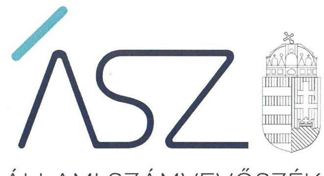

ÁLLAMI SZÁMVEVŐSZÉK

# JELENTÉS 

Pártok gazdálkodása

A költségvetési támogatásban részesülő pártok 2018-2019. évi gazdálkodása törvényességének ellenőrzése a Momentum Mozgalomnál
2021.

21060
www.asz.hu

---

ÁLLAMI SZÁMVEVŐSZÉK

# JELENTÉS 

Pártok gazdálkodása

A költségvetési támogatásban részesülő pártok 2018-2019. évi gazdálkodása törvényességének ellenőrzése a Momentum Mozgalomnál
2021. 06. hó 25. nap

21060
www.asz.hu

---

# AZ ELLENŐRZÉST FELÜGYELTE: 

DR. NAGY IMRE felügyeleti vezető

## AZ ELLENŐRZÉST VEZETTE ÉS A VÉGREHAJTÁSÁÉRT FELELŐS:

NEMESVÁRI-HORTHY ESZTER ellenőrzésvezető

## A PROGRAM ÖSSZEÁLLÍTÁSÁÉRT FELELŐS:

GÖRGÉNYI GÁBOR osztályvezető

IKTATÓSZÁM: EL-3256-001/2021.
TÉMASZÁM: 2548
ELLENŐRZÉS-AZONOSÍTÓ SZÁM: V0882003

Jelentéseink az Országgyűlés számítógépes hálózatán és az interneten a www.asz.hu címen is olvashatóak.

---

# TARTALOMJEGYZÉK 

■ ÖSSZEGZÉS ..... 5
■ AZ ELLENŐRZÉS CÉLJA ..... 6
■ AZ ELLENŐRZÉS TERÜLETE ..... 7
■ AZ ELLENŐRZÉS HÁTTERE, INDOKOLTSÁGA ..... 8
■ A JELENTÉS LÉNYEGES KÉRDÉSKÖREI ..... 9
■ AZ ELLENŐRZÉS HATÓKÖRE ÉS MÓDSZEREI ..... 10
■ MEGÁLLAPÍTÁSOK ..... 12
■ JAVASLATOK ..... 15
■ MELLÉKLETEK ..... 17
I. sz. melléklet: Értelmező szótár ..... 17
■ FÜGGELÉK: ÉSZREVÉTELEK ..... 19
■ RÖVIDÍTÉSEK JEGYZÉKE ..... 23

---

.

---

# ÖSSZEGZÉS 

A Momentum Mozgalom 2018-2019. évi gazdálkodása nem volt megbízható, nem biztosította a gazdálkodásának átláthatóságát és a közpénzek felhasználásának elszámoltathatóságát a párt tagsága és az állampolgárok felé.

## Az ellenőrzés társadalmi indokoltsága

A pártok az állampolgárok egyesülési szabadsága alapján létrehozott olyan szervezetek, amelyek kereteket nyújtanak a népakarat kialakításához és kinyilvánításához, a politikai életben való állampolgári részvételhez.

A politikai élet tisztasága érdekében törvény állapítja meg a pártok vagyonára és gazdálkodására vonatkozó szabályokat. Az egyesülési jog alapján létrejövő más szervezetekhez képest szűkebb körben határozza meg azt a gazdasági tevékenységet, amelyet a párt végezhet, biztosítja azonban a pártok részére azt a jogosultságot, hogy az állami költségvetésből támogatásban részesüljenek. A pártok gazdálkodását a politikai élet tisztasága érdekében rendszeresen indokolt ellenőrizni, ezért törvényi előírás alapján az Állami Számvevőszék a költségvetési támogatást kapott pártok gazdálkodását kétévente ellenőrzi. A gazdálkodás szabályszerűségének, a felhasznált közpénzek nagyságának bemutatásával a társadalom objektív képet alkothat a pártok működéséről.

A pártokkal szembeni társadalmi elvárás a törvényt tisztelő, jogkövető magatartás, mivel a párt képviselői a jogállamiságot megtestesítő törvényhozó hatalom részei. Mindezekre tekintettel fokozott társadalmi veszélyességet hordoz egy párt elszámoltathatóságának hiánya, elszámolási kötelezettségének nem teljesítése.

## Főbb megállapítások, következtetések, javaslatok

A Momentum Mozgalom a 2018. és 2019. évben nem alakított ki szabályszerű könyvvezetési rendszert, és nem biztosította a könyvvezetésének törvényességét. Ezáltal a párt szabályszerű könyvvezetéssel nem támasztotta alá a pénzügyi kimutatásaiban szereplő bevételi és kiadási adatokat. A párt ezzel megtévesztette a saját tagságát és a közvéleményt is, mivel nem biztosította, hogy valós képet kapjanak a párt 2018. és 2019. évi gazdálkodásáról. Ennek következtében a Momentum Mozgalom a 2018-2019. években nem biztosította a törvényes gazdálkodás feltételeit, gazdálkodása nem volt átlátható és elszámoltatható.

A Momentum Mozgalom a nem pénzbeli vagyoni hozzájárulások értékelése hiányában nem biztosította a közélet tisztaságára vonatkozó törvényi előírások érvényesülését. Ezáltal nem zárható ki, hogy nem engedélyezett források felhasználásával tisztességtelen előnyhöz juthatott más pártokkal szemben.

Az Állami Számvevőszék az intézkedések megtétele céljából a Momentum Mozgalom elnökének kilenc javaslatot fogalmazott meg.

---

# AZ ELLENŐRZÉS CÉLJA 

AZ ELLENŐRZÉS CÉLJA annak értékelése volt, hogy a Momentum Mozgalom által közzétett pénzügyi kimutatások a törvényi előírásoknak megfeleltek-e, a könyvvezetés és gazdálkodás során betartották-e a vonatkozó jogszabályi és belső előírásokat; a Momentum Mozgalom a működéséhez szabályszerűen igénybe vehető forrásokat használt-e fel.

---

# AZ ELLENŐRZÉS TERÜLETE 

## Momentum Mozgalom

A Momentum Mozgalom 2017. május 19-én létrejött olyan egyesület, amely nyilvántartott tagsággal rendelkezett, és a nyilvántartásba vételét végző bíróság előtt kinyilvánította, hogy a Párttörvény ${ }^{1}$ rendelkezéseit magára nézve kötelezőnek ismeri el a Párttörvény 1. §-a alapján. Az Alapszabály ${ }_{1-2}{ }^{2}$ szerint a Momentum Mozgalom működésének célja, hogy a magyar civil társadalom önszerveződését, közéletben való részvételét, politikai tudatosságának kialakítását, és az állampolgárok demokratikus és felelős állampolgári nevelését és oktatását előmozdítsa.

A Momentum Mozgalom legfelsőbb tanácskozó és döntéshozó szerve az Alapszabály ${ }_{1-2}$ szerint a Küldöttgyűlés ${ }^{3}$, ügyvezető szerve az Elnökség ${ }^{4}$.

A Momentum Mozgalom pénzügyi kimutatásaiban 2018. évben a 1247/2018. (V. 25.) Korm. határozat ${ }^{5}$ és a Kftv. ${ }^{6}$ szerinti 553,5 M Ft-os, illetve 2019. évben a 2019. évi költségvetési törvény szerint jóváhagyott központi költségvetésből származó támogatás szerinti 44,3 M Ft-os összeget mutatta ki.

A Momentum Mozgalom a 2018. évi pénzügyi kimutatásában 585,3 M Ft bevételt, valamint 596,4 M Ft kiadást, a 2019. évi pénzügyi kimutatásában 162,1 M Ft bevételt, valamint 171,9 M Ft kiadást számolt el.

A Momentum Mozgalom gazdasági társaságot nem alapított, az „Indítsuk Be Magyarországot Alapítvány"-t 2018-ban hozta létre.

---

# AZ ELLENŐRZÉS HÁTTERE, INDOKOLTSÁGA 

Az ÁSZ tv. ${ }^{7}$ 5. § (11) bekezdés a) pontja és a Párttörvény 10. § (1) bekezdése alapján a pártok gazdálkodása törvényességének ellenőrzésére az ÁSZ ${ }^{8}$ jogosult. Törvényi előírás alapján az ÁSZ kétévente ellenőrzi azoknak a pártoknak a gazdálkodását, amelyek rendszeres költségvetési támogatásban részesültek.

Az ÁSZ a Momentum Mozgalom gazdálkodásának törvényességét jelen ellenőrzést megelőzően nem értékelte, mert a Momentum Mozgalom az 1247/2018. (V. 25.) Korm. határozatban foglaltak szerinti költségvetési támogatásban 2018. június 1-jétől részesül.

A gazdálkodás szabályszerűségének, a felhasznált közpénzek nagyságának bemutatásával a társadalom objektív képet alkothat a pártok működéséről. Az ellenőrzés megállapításai a gazdálkodás megfelelőségének bemutatásával elősegíthetik, hogy a törvényalkotók konkrét lépéseket tegyenek a pártok finanszírozására vonatkozó szabályozások megváltoztatása, átláthatóbbá, ellenőrizhetőbbé tétele irányába. Az ellenőrzés rámutat a pártok gazdálkodásával kapcsolatos jó gyakorlatokra és szabálytalanságokra. A hiányosságok, szabálytalanságok feltárása, az ennek kapcsán megfogalmazott megállapítások elősegíthetik a törvényi rendelkezések megsértésének szankcionálását.

---

# A JELENTÉS LÉNYEGES KÉRDÉSKÖREI 

1. A Momentum Mozgalom gazdálkodásának törvényessége biztosított volt-e?
2. A Momentum Mozgalom könyvvezetése és gazdálkodása során a vonatkozó jogszabályi rendelkezéseket és belső előírásokat betartotta-e?
3. A Momentum Mozgalom pénzügyi kimutatása megfelelt-e a jogszabályi előírásoknak, közzétételi kötelezettségét szabályszerűen teljesítette-e?

---

# AZ ELLENŐRZÉS HATÓKÖRE ÉS MÓDSZEREI 

## Az ellenőrzés típusa

Szabályszerűségi ellenőrzés.

## Az ellenőrzött időszak

A 2018-2019. évek

## Az ellenőrzés tárgya

A Momentum Mozgalom ellenőrzése során az ellenőrzés tárgyát képezte a 2018. és a 2019. évre vonatkozó pénzügyi kimutatás elkészítésére, jóváhagyására, közzétételére, a könyvvezetésére, gazdálkodására, ennek keretében a számviteli szabályozás kialakítására, a bizonylati rend, bizonylati fegyelem betartására, egyéb gazdálkodási, ellenőrzési és pénzügyi-számviteli informatikai feladatok ellátására irányuló tevékenységek. Az ellenőrzés tárgya volt még a Párttörvény szerinti források elszámolása és felhasználása, valamint a vagyon jogszabályi előírásoknak megfelelő hasznosítása.

Az ellenőrzés kiterjedt minden olyan körülményre és adatra, amely az ÁSZ jogszabályban meghatározott feladatainak teljesítéséhez, valamint a program végrehajtása folyamán felmerült újabb összefüggések feltárásához szükséges volt.

## Az ellenőrzött szervezet

Momentum Mozgalom

## Az ellenőrzés jogalapja

Az ellenőrzés jogalapját a ÁSZ tv. 5. § (11) bekezdés a) pontja, a Párttörvény 4. § (4)-(5) bekezdései, valamint 10. § (1), (3)-(4) bekezdései képezték.

## Az ellenőrzés módszerei

Az ÁSZ ellenőrzésére az ellenőrzési program szempontjai, az ellenőrzött időszakban hatályos jogszabályok, az ellenőrzés általános szakmai szabályai, az ellenőrzésre irányadó ÁSZ módszertanok figyelembevételével került sor. A közpénzekkel való felelős gazdálkodás segítésére irányuló javaslatok kidolgozásakor a hatályos jogszabályok irányadóak.

---

Az ellenőrzés ideje alatt a Momentum Mozgalommal történő kapcsolattartást az ÁSZ SZMSZ ${ }^{6}$-ének vonatkozó előírásai alapján biztosította az ÁSZ.

Az ellenőrzés céljának eléréséhez szükséges bizonyítékok megszerzése a Momentum Mozgalom által rendelkezésre bocsátott dokumentumokra, adatokra alapozva közvetlen, részletes elemzés, megfigyelés, szemrevételezés, információkérés, megerősítés, valamint elemző eljárás útján történt. Az ellenőrzési bizonyítékként felhasználható adatforrások közé tartoztak egyrészt az ellenőrzési program részletes szempontjainál felsorolt adatforrások, másrészt minden egyéb - az ellenőrzés folyamán feltárt, az ellenőrzés szempontjából információt tartalmazó - dokumentum.

Az ellenőrzés lefolytatásához a Momentum Mozgalom az ÁSZ által kért dokumentumok megküldésével szolgáltatott adatokat, amelyek valódiságát és teljes körűségét a Momentum Mozgalom vezetője által tett teljességi és hitelességi nyilatkozatnak kellett igazolnia. A rendelkezésre bocsátott adatok, információk kontrollja az ellenőrzés keretében történt.

Az ÁSZ a tételes ellenőrzés mellett statisztikai alapú mintavételezést és értékelést alkalmazott. A minták kiválasztása rétegzett mintavételezéssel történt. A hozzájárulások, adományok és egyéb bevételek, valamint a személyi juttatások (működési kiadáson belül), eszközbeszerzések és a működési kiadások további tételei, politikai tevékenység kiadásai, egyéb kiadások mintatételeinek értékelése „szabályszerű”, ha a minta ellenőrzésének eredménye alapján 95%-os bizonyossággal a teljes sokaságban az átlagos hibaarány nem haladta meg a 10%-ot, „nem szabályszerű”, ha nagyobb volt, mint 10%. Abban az esetben, ha a teljes sokaság tekintetében a 10%-os hibaarányhoz való viszony megítélésének megbízhatósága nem érte el a 95%-ot, annak elérése érdekében az értékelés további szempontokkal egészült ki, a feltárt hibák értéke is figyelembe vételre került.

---

# 1. A Momentum Mozgalom gazdálkodásának törvényessége biztosított volt-e? 

Összegző megállapítás

### 1.1. számú megállapítás

A Momentum Mozgalom gazdálkodásának törvényessége a 2018-2019. években nem volt biztosított.

A Momentum Mozgalom gazdálkodására vonatkozó számviteli rendszerének szabályozottsága, könyvviteli rendszere és nyilvántartási rendszere nem volt szabályszerű.

A Momentum Mozgalom a Számv. tv. ${ }^{10}$ előírásai alapján rendelkezett Számviteli Politiká${ }^{11}$-val, amelynek keretében elkészítette a Leltározási szabályzat ${ }_{1-2}{ }^{12}$-t, az Értékelési szabályzat ${ }_{1-2}{ }^{13}$-t és a Pénzkezelési Szabályzat ${ }_{1-5}{ }^{14}$-t. A Momentum Mozgalom a Számv. tv. előírása alapján rendelkezett Számlarend${ }^{15}$-del és Bizonylati Szabályzat ${ }_{1-3}{ }^{16}$-al.

A Pénzkezelési Szabályzat ${ }_{1-5}$-ban a Számv. tv. 14. § (8) bekezdésében előírtak ellenére nem rendelkezett a napi készpénz záró állomány maximális mértékéről.

A Bizonylati Szabályzat ${ }_{1-3}$ 8. pontjában a Számv. tv. 169. § (2) bekezdésében foglaltak ellenére, a számviteli bizonylatok megőrzésére előírt nyolc év helyett rövidebb, „öt plusz egy év”-es megőrzési időt határozott meg.

A Számlarend ${ }_{1-4}$ a Számv. tv. 161. § (1) bekezdésében rögzített előírás ellenére nem biztosította a Párttörvény 1. számú melléklete szerinti pénzügyi kimutatás elkészítését, mivel a Számv. tv. 161/A. § (2) bekezdése ellenére a nyilvántartási (könyvvezetési) rendszerét nem oly módon részletezte tovább, hogy abból a Párttörvény 1. számú mellékletében meghatározott adatok rendelkezésre álljanak.

A 2018. és 2019. években a Momentum Mozgalom a Számv. tv. 69. § (1) bekezdése, valamint a Leltározási Szabályzat ${ }_{1,2}$ II/1. pontja előírása ellenére a könyvek üzleti év végi zárásához, a beszámoló elkészítéséhez nem állított össze leltárt, amely tételesen, ellenőrizhető módon tartalmazza a mérleg fordulónapján meglévő eszközeit és forrásait mennyiségben és értékben.

## 1.2. számú megállapítás

A Momentum Mozgalom a gazdálkodására vonatkozó ellenőrzési rendszerét nem a jogszabályi előírások szerint működtette.

A Momentum Mozgalom a gazdálkodásával összefüggő ellenőrzés kereteit az Alapszabály ${ }_{1-2}$-ben, az SZMSZ ${ }_{1-4}{ }^{17}$-ben, a Számviteli Politiká${ }_{1-3}$-ban, a Pénzkezelési szabályzat ${ }_{1-5}$-ban, a Bizonylati szabályzat ${ }_{1-3}$-ban és a Pénzügyi és Gazdálkodási Ellenőrzési Szabályzatban ${ }^{18}$ meghatározta.

A Momentum Mozgalom a Számv. tv. 14. § (8) bekezdése előírása szerint a Pénzkezelési Szabályzat ${ }_{1-5}$-ben meghatározta a készpénzállomány ellenőrzésekor követendő eljárást. A Momentum Mozgalomnál az évenkénti

---

pénztárellenőrzések során a Pénzkezelési Szabályzat
 ${ }_{1-5}$ 3.2. pontja előírása ellenére a 2018-2019. évi pénztárjelentésekbe bevezetett tételekre vonatkozó alapbizonylatok és pénztári bizonylatok meglétének vizsgálatát nem végezték el. A Pénzkezelési Szabályzat ${ }_{1-5}$ 5.1. pontjában előírt havi pénztári ellenőrzési kötelezettségének az ellenőrzött időszakban a pénztári ellenőr nem tett eleget.

A Momentum Mozgalom Etikai és Felügyelőbizottsága a Ptk. ${ }^{19}$ 3:27. § (1) bekezdésében és az Alapszabály ${ }_{1,2}$ 5. § (11) bekezdésében foglaltak ellenére a 2018-2019. évi pénzügyi kimutatások tervezetét az elfogadásuk előtt nem véleményezte.

# 2. A Momentum Mozgalom könyvvezetése és gazdálkodása során a vonatkozó jogszabályi rendelkezéseket és belső előírásokat betartotta-e? 

Összegző megállapítás

## 2.1. számú megállapítás

2.2. számú megállapítás

A Momentum Mozgalom 2018-2019. évi könyvvezetése és gazdálkodása nem volt szabályszerű.

A Momentum Mozgalom a 2018-2019. években a bevételeket nem szabályszerűen számolta el.

A Momentum Mozgalom bevételeinek elszámolása nem volt szabályszerű, mert:

- a 2018. évben a Számv. tv. 165. § (3) bekezdés a) pontjában foglalt előírás ellenére a bankszámla forgalomnál nem a hitelintézeti értesítés megérkezésekor rögzítették a bevételeket;
- a 2019. évben a Számv. tv. 167. § (1) bekezdés i) pontja ellenére a bevételek könyvviteli nyilvántartásban történő rögzítésének időpontját nem rögzítették a számviteli bizonylatokon;
- a 2019. évben a Számv. tv. 165. § (2) bekezdésében előírtak ellenére számviteli bizonylat nélkül jegyeztek be adatokat.
A Momentum Mozgalom 2018-2019. évben - jogi személyektől bérelt ingatlanok esetében - a Párttörvény 4. § (5) bekezdésében foglaltak ellenére nem gondoskodott a nem pénzbeli vagyoni hozzájárulások értékeléséről.

A 2018. évi kiadások elszámolása nem volt szabályszerű, a 2019. évi kiadások elszámolása szabályszerű volt.

A kiadások elszámolása 2018. évben nem volt szabályszerű az alábbiak miatt:
$\longrightarrow$ a költségtérítések kifizetése esetében az Szja tv. ${ }^{20}$ 3. § 11. pontjától eltérően a munkáltató tevékenységével összefüggő feladat ellátása érdekében szükséges belföldi kiküldetések elrendelése nem történt meg;
$\longrightarrow$ a szállás-, illetve repülőjegy elszámolása során nem állították ki az Szja tv 3. § 83. pontjában előírt kiküldetési rendelvényt;

---

$\longrightarrow$ a személyi jellegű kifizetések, a költségtérítések és egyéb kiadások kifizetése során a Számv. tv. 167. § (1) bekezdés c) pontjában foglaltak ellenére az utalványozó és a rendelkezés végrehajtását igazoló személy aláírása a bizonylatokon nem került feltüntetésre;
$\longrightarrow$ az egyéb kiadások kifizetése során a Számv. tv. 167. § (1) bekezdés h) pontjában foglaltak ellenére a könyvelés módjára, az érintett könyvviteli számlákra történő hivatkozást a bizonylatokon nem tüntették fel;
$\longrightarrow$ az egyéb kiadások kifizetése során a Számv. tv. 165. § (2) bekezdésétől eltérően a könyvviteli nyilvántartásba kifizetési/átutalási bizonylat hiányában jegyeztek be adatokat, illetve a kifizetett összegek nem egyeztek meg a számlán szereplő összeggel.
A Momentum Mozgalomnál a 2019. évben a kiadások elszámolása szabályszerű volt.

# 3. A Momentum Mozgalom pénzügyi kimutatása megfelelt-e a jogszabályi előírásoknak, közzétételi kötelezettségét szabályszerűen teljesítette-e? 

Összegző megállapítás
A Momentum Mozgalom által közzétett 2018. és 2019. évi pénzügyi kimutatások nem feleltek meg a jogszabályi előírásoknak.

A Momentum Mozgalom a közzétett 2018. és 2019. évi pénzügyi kimutatások bevételi és kiadási adatait szabályszerű könyvvezetéssel nem támasztotta alá.

---

# JAVASLATOK 

Az ÁSZ tv. 33. § (1) bekezdésében foglaltak értelmében az ellenőrzött szervezet vezetője köteles a jelentésben foglalt megállapításokhoz kapcsolódó intézkedési tervet összeállítani és azt a jelentés kézhezvételétől számított 30 napon belül az ÁSZ részére megküldeni. Amennyiben az ellenőrzött szervezet vezetője nem küldi meg határidőben az intézkedési tervet, vagy továbbra sem elfogadható intézkedési tervet küld, az Állami Számvevőszék elnöke az ÁSZ tv. 33. § (3) bekezdése a) és b) pontjaiban foglaltakat érvényesítheti.

## Momentum Mozgalom elnöke

1. Intézkedjen a pénzkezelési szabályzat jogszabályi előírás szerinti kiegészítéséről.
(1.1. sz. megállapítás 2. bekezdése alapján)
2. Intézkedjen arról, hogy a Momentum Mozgalom belső szabályozása a törvényi rendelkezéssel összhangban tartalmazza a számviteli bizonylatok törvényben előírt időtartamra történő megőrzésének előírását.
(1.1. sz. megállapítás 3. bekezdése alapján)
3. Intézkedjen annak érdekében, hogy a Momentum Mozgalom a törvényi előírások szerinti számlarenddel rendelkezzen.
(1.1. sz. megállapítás 4. bekezdése alapján)
4. Intézkedjen a jövőben a jogszabályi előírások szerinti leltár elkészítéséről.
(1.1. sz. megállapítás 5. bekezdése alapján)
5. Intézkedjen a jövőben a pénztárellenőrzés során a jogszabályi előírások és az azok alapján előírt belső szabályok betartásáról.
(1.2. sz. megállapítás 2. bekezdése alapján)
6. Intézkedjen arról, hogy a jövőben a felügyelő bizottság az elfogadása előtt véleményezze a pénzügyi kimutatás tervezetét a jogszabályi és belső előírás szerint.
(1.2. sz. megállapítás 3. bekezdése alapján)

---

7. Intézkedjen arról, hogy a jövőben a számviteli bizonylatok tartalmazzák a könyvviteli nyilvántartásban történő rögzítés időpontját a jogszabályi előírás szerint.
(2.1. sz. megállapítás 1. bekezdés 2. francia bekezdése alapján)
8. Intézkedjen arról, hogy a jövőben a Számv. tv. előírásának megfelelően adatokat a számviteli (könyvviteli) nyilvántartásokba csak bizonylat alapján jegyezzenek be.
(2.1. sz. megállapítás 1. bekezdés 3. francia bekezdése alapján)
9. Gondoskodjon a jövőben a Momentum Mozgalom részére nyújtott nem pénzbeli hozzájárulások értékeléséről a jogszabályi előírás szerint.
(2.1. sz. megállapítás 2. bekezdés alapján)

---

# MELLÉKLETEK 

- I. SZ. MELLÉKLET: ÉRTELMEZŐ SZÓTÁR
pénzügyi kimutatás
a párt gazdasági-vállalkozási tevékenysége
költségvetési támogatás
nem pénzbeli támogatás

A Párttörvény 9. § (1) bekezdésében meghatározott, a törvény 1. számú melléklete szerinti pénzügyi kimutatás (hatályos 2014. május 6-ától), amelyet a pártok kötelesek minden év május 31-ig a Magyar Közlönyben, valamint saját honlappal rendelkező pártok a honlapjukon is közzétenni.
A Párttörvény 6. § (1) bekezdésének megfelelően a párt a költségeinek fedezése és vagyonának gyarapítása érdekében a következő gazdasági-vállalkozási tevékenységeket folytathatja:
a) politikai céljainak és tevékenységének megismertetése érdekében kiadványokat jelentethet meg és terjeszthet, a pártot szimbolizáló jelvényeket és más ilyen célú tárgyakat árusíthat, és pártrendezvényeket szervezhet;
b) a tulajdonában álló ingatlanokat és ingókat díj ellenében hasznosíthatja és elidegenítheti.
Az államháztartás alrendszerei terhére nyújtott pénzbeli vagy nem pénzbeli juttatás, amelyet a támogató nem elsősorban ellenszolgáltatás ellenében, de konkrét program megvalósítása vagy meghatározott időszakban a támogatott szervezet működtetése érdekében nyújt. (Civil tv. ${ }^{21}$ 2. § 15. pont)
Vagyoni értékkel rendelkező forgalomképes dolog, szellemi alkotás, illetve vagyoni értékű jog részben vagy egészében, véglegesen vagy ideiglenesen, teljesen vagy részben ingyenesen történő átruházása vagy átengedése, illetve szolgáltatás biztosítása. (Civil tv. 2. § 25. pont)

---

.

---

# FÜGGELÉK: ÉSZREVÉTELEK 

A jelentéstervezetet a Számvevőszék 15 napos észrevételezésre megküldte az ellenőrzött szervezet vezetőjének az ÁSZ tv. 29. §* (1) bekezdése előírásának megfelelően.

A Momentum Mozgalom elnöke az ellenőrzés megállapításaira írásban észrevételt tett. Az ÁSZ tv. 29. § (3) bekezdésével összhangban az ÁSZ a Függelékben feltünteti az ellenőrzés megállapításaival kapcsolatban tett, figyelembe nem vett észrevételeket, és megindokolja, hogy azokat miért nem fogadta el.

[^0]
[^0]:    * 29. § (1) Az Állami Számvevőszék az ellenőrzési megállapításait megküldi az ellenőrzött szervezet vezetőjének vagy az általa megbízott személynek, és annak, akinek személyes felelősségét állapította meg.
    (2) Az ellenőrzött szervezet vezetője és a felelősként megjelölt személy az ellenőrzés megállapításaira tizenöt napon belül írásban észrevételt tehet.
    (3) Az Állami Számvevőszék az észrevételre a beérkezésétől számított harminc napon belül írásban válaszol. A figyelembe nem vett észrevételeket köteles a jelentésben feltüntetni, és megindokolni, hogy azokat miért nem fogadta el.

---

Az ellenőrzés megállapításaival kapcsolatban a Momentum Mozgalom elnöke által 2021. május 3-án tett (az Állami Számvevőszékhez 2021. május 4-én érkezett) el nem fogadott észrevételek és azok kezelésének indokolása.

1. A Momentum Mozgalom gazdálkodására vonatkozó számviteli rendszerének szabályozottságához, könyvviteli rendszeréhez és nyilvántartási rendszeréhez kapcsolódó megállapításokra tett észrevételek.
a) A Momentum Mozgalom elnöke észrevételt tett a párt pénzkezelési szabályzatában törvényi előírás szerint rögzítendő napi készpénz záró állomány maximális mértékével kapcsolatos megállapításra.

A Momentum Mozgalom pénzkezelési szabályzata havi zárás készítését írta elő, ehhez kapcsolódóan rendelkezett a havi „zárlat után tartható" házipénztári készpénzállományról. A hivatkozott szabályozás a napi készpénz záró állomány maximális mértéknek meghatározását nem tartalmazta.

A fentiek alapján az észrevételt az Állami Számvevőszék nem fogadta el, a megállapítás módosítása nem indokolt.
b) A Momentum Mozgalom elnöke észrevételt tett a párt számlarendjével kapcsolatos megállapításra.

A Momentum Mozgalom a 2018. és 2019. évi gazdálkodása során alkalmazott több főkönyvi számla esetében nem rendelkezett a számlarendjében arról, hogy azok a pénzügyi kimutatás mely soraihoz kapcsolódnak. Az ellenőrzés rendelkezésre bocsátott dokumentumok alapján az egyes főkönyvi számlákon elszámolt kiadási tételek összegei a pénzügyi kimutatás több sorában is megjelentek az ellenőrzött időszakban.

A Párttörvény pénzügyi kimutatás elkészítését írja elő a törvényben rögzített tartalommal. A Számv. tv. előírja, hogy a közpénzek felhasználásának és a köztulajdon használatának nyilvánossága és ellenőrizhetősége érdekében a nyilvántartási (könyvvezetési) rendszerét a gazdálkodóknak, így a pártoknak is úgy szükséges továbrészletezni, hogy abból a vonatkozó külön jogszabályban, ebben az esetben a Párttörvényben előírt pénzügyi kimutatás elkészítéséhez szükséges adatok rendelkezésre álljanak. Törvényi előírások szerinti számlarend hiányában a Számv. tv. szerinti könyvvezetés és így a Párttörvény szerinti pénzügyi kimutatás elkészítése nem biztosított.

A fentiek alapján az észrevételt az Állami Számvevőszék nem fogadta el, a megállapítás módosítása nem indokolt.
c) A Momentum Mozgalom elnöke észrevételt tett a törvényi előírás szerinti leltár összeállításához kapcsolódó megállapításra.

A Momentum Mozgalom a 2018. évre vonatkozóan az aktív és passzív időbeli elhatárolások, valamint a saját tőke mérlegsorok, továbbá a 2019. évre vonatkozóan a saját tőke leltárát nem készítette el, így a törvényi előírás és a belső szabályozás ellenére a könyvek üzleti év végi zárásához, a beszámoló elkészítéséhez, a mérleg tételeinek alátámasztásához nem állított össze olyan leltárt, amely tételesen, ellenőrizhető módon tartalmazta volna a mérleg fordulónapján meglévő eszközeit és forrásait.

A fentiek alapján az észrevételt az Állami Számvevőszék nem fogadta el, a megállapítás módosítása nem indokolt.
2. A Momentum Mozgalom gazdálkodására vonatkozó ellenőrzési rendszer működtetéséhez kapcsolódó megállapításokra tett észrevételek.
a) A Momentum Mozgalom elnöke észrevételt tett a pénztár ellenőrzésével kapcsolatos megállapításra.

Az Állami Számvevőszék a számvevőszéki jelentéstervezetben szereplő megállapításokat a Momentum Mozgalom által tett teljességi és hitelességi nyilatkozat és a rendelkezésre bocsátott dokumentumok alapján tette meg.

Az évenkénti pénztárellenőrzésről rendelkezésre bocsátott jegyzőkönyvek az észrevételében hivatkozott fedlapot nem tartalmaztak, nem igazolták a 2018-2019. évi pénztárjelentésekbe bevezetett tételekre vonatkozó pénztári bizonylatok és alapbizonylatok meglétének előírt ellenőrzését.

A Momentum Mozgalom pénzkezelési Szabályzata szerint a pénztárosnak a havi zárás során meg kellett állapítania a pénztárban lévő készpénzállományt, ezt egyeztetnie kellett a pénztárjelentésben szereplő egyenleggel, és az egyeztetés megtörténtét aláírásával kellett igazolnia a pénztárjelentésen. A pénzkezelési Szabályzat szerint a pénztári ellenőr feladata volt a pénztárjelentés helyességének és a kimutatott pénzkészlet meglétének ellenőrzése. A Momentum Mozgalom nem bocsátott olyan dokumentumot az ellenőrzés rendelkezésére, amely a párt belső szabályozásában előírt pénztárellenőrzési feladat elvégzését igazolta volna. Az ellenőrzés rendelkezésre bocsátott dokumentumok teljeskörűségét a Momentum Mozgalom teljességi és hitelességi nyilatkozatával igazolta.

---

A fentiek alapján az észrevételt az Állami Számvevőszék nem fogadta el, a megállapítás módosítása nem indokolt.
b) A Momentum Mozgalom elnöke
 észrevételt tett a pénzügyi kimutatások tervezetének az elfogadásuk előtti véleményezésével kapcsolatos megállapításra.

A Momentum Mozgalom Alapszabálya az Etikai és Felügyelőbizottság számára feladatként határozta meg a pénzügyi kimutatások tervezetének elfogadás előtti véleményezését, azonban a párt teljességi és hitelességi nyilatkozata szerint a pénzügyi kimutatást az Etikai és Felügyelőbizottság nem véleményezte. A Pénzügyi Ellenőrző Bizottság észrevételében jelzett tevékenysége az Etikai és Felügyelőbizottság feladatellátásának értékelését nem befolyásolja.

A fentiek alapján az észrevételt az Állami Számvevőszék nem fogadta el, a megállapítás módosítása nem indokolt.
3. A 2018-2019. évi bevételek nem szabályszerű elszámolására vonatkozó megállapításokra tett észrevételek.
a) A Momentum Mozgalom elnöke észrevételeket tett a bevételek elszámolásával kapcsolatos megállapításokra.

A Számv. tv. a bevételek könyvelésének folyamatát részleteiben nem szabályozza, ugyanakkor a könyvvezetés megbízhatósága érdekében előírja, hogy csak szabályszerűen kiállított bizonylat alapján lehet adatokat bejegyezni, meghatározza melyik bizonylat tekinthető szabályszerűnek és mikor kell a szabályszerű bizonylatot a könyvekben rögzíteni. Ehhez kapcsolódóan a Számv. tv. előírja, hogy a számviteli bizonylatokon a könyvviteli nyilvántartásokban történt rögzítés időpontját és annak igazolását szerepeltetni kell.

Az Állami Számvevőszék a számvevőszéki jelentéstervezetben szereplő megállapításokat a Momentum Mozgalom által tett teljességi és hitelességi nyilatkozat és a rendelkezésre bocsátott dokumentumok alapján tette meg.

Az ellenőrzés rendelkezésre bocsátott dokumentumokból az Állami Számvevőszék megállapította, hogy törvényi előírások ellenére a 2018. évben a bankszámla forgalomnál a bevételeket nem a hitelintézeti értesítés megérkezésekor rögzítették a könyvekben. Emellett a Momentum Mozgalom által rendelkezésre bocsátott dokumentumok szerint 2019. évben a bevételek könyvviteli nyilvántartásban történő rögzítésének időpontját nem rögzítették a számviteli bizonylatokon és számviteli bizonylat nélkül jegyeztek be adatokat.

A fentiek alapján az észrevételt az Állami Számvevőszék nem fogadta el, a megállapítás módosítása nem indokolt.
b) A Momentum Mozgalom elnöke észrevételt tett a nem pénzbeli vagyoni hozzájárulások értékelésével kapcsolatos megállapításra.

A Párttörvény alapján a pártok feladata és felelőssége a nem pénzben nyújtott vagyoni hozzájárulások értékelése, értékének meghatározása. A Momentum Mozgalom az értékelési szabályzatában szintén előírta a nem pénzbeli hozzájárulások, adományok értékelését, ezen belül külön rögzítette a bérelt ingatlanok esetében a bérleti díj évente történő értékelésének szabályait.

Az Állami Számvevőszék a számvevőszéki jelentéstervezetben szereplő megállapításokat a Momentum Mozgalom által tett teljességi és hitelességi nyilatkozat és a rendelkezésre bocsátott dokumentumok alapján tette meg. A Momentum Mozgalom több jogi személytől is bérelt ingatlant az ellenőrzött időszakban. Ennek ellenére a jogi személytől bérelt ingatlanokhoz kapcsolódóan a nem pénzbeli vagyoni hozzájárulások értékeléséről a Momentum Mozgalom nem bocsátott dokumentumot az ellenőrzés rendelkezésére, és a teljességi és hitelességi nyilatkozata szerint sem végezte el a nem pénzben nyújtott vagyoni hozzájárulások értékelését.

A fentiek alapján az észrevételt az Állami Számvevőszék nem fogadta el, a megállapítás módosítása nem indokolt.
4. A 2018. évi kiadások nem szabályszerű elszámolására vonatkozó megállapításokra tett észrevételek.

A Momentum Mozgalom elnöke észrevételeket tett a kiadások elszámolásával kapcsolatos megállapításokra.
Az Állami Számvevőszék a számvevőszéki jelentéstervezetben szereplő megállapításokat a Momentum Mozgalom által tett teljességi és hitelességi nyilatkozat és a rendelkezésre bocsátott dokumentumok alapján tette meg.

A Momentum Mozgalom által az ellenőrzés rendelkezésre bocsátott dokumentumok alapján törvényi előírások ellenére a személyi jellegű kifizetések, a költségtérítések és egyéb kiadások kifizetése során az utalványozó és a rendelkezés végrehajtását igazoló személy aláírása a bizonylatokon nem került feltüntetésre, továbbá az egyéb kiadások kifizetése során a könyvelés módjára, az érintett könyvviteli számlákra történő hivatkozást a bizonylatokon nem tün-

tették fel, valamint az egyéb kiadások kifizetése során a könyvviteli nyilvántartásba kifizetési/átutalási bizonylat hiányában jegyeztek be adatokat, illetve a kifizetett összegek nem egyeztek meg a számlán szereplő összeggel.
Az Állami Számvevőszék köszönettel vette az észrevételben foglalt tájékoztatást, mely szerint a 2019. évben a Gépjármű használati szabályzat, valamint a Külföldi és belföldi kiküldetés szabályzat hatályba léptetésével a párt intézkedéseket tett a törvényi előírásoknak való megfelelés biztosítása érdekében.
A fentiek alapján az észrevételt az Állami Számvevőszék nem fogadta el, a megállapítás módosítása nem indokolt.
Az Állami Számvevőszék tájékoztatást adott arról, hogy a Momentum Mozgalom ellenőrzése során az Állami Számvevőszék a vonatkozó törvényi előírások, eljárási szabályok és nyilvános módszertani dokumentumok maradéktalan betartásával járt el. Az ellenőrzés módszereinek bemutatását az ÁSZ tv. 29. § (1) bekezdése szerinti 15 napos észrevételezésre megküldött jelentéstervezet is tartalmazta. Az Állami Számvevőszék az ellenőrzési megállapításait a törvényi előírásokat alkalmazva, a szabályszerűségi ellenőrzés szakmai szabályai szerint, az ellenőrzés során rendelkezésére álló hiteles ellenőrzési bizonyítékokkal alátámasztott dokumentumok alapján tette meg.
Az Állami Számvevőszék tájékoztatta a Momentum Mozgalom elnökét, hogy a Számv. tv. rendelkezéseinek érvényre juttatása és a törvényi előírások alapján kiadott számviteli szabályzatok betartása nem formai kérdés, hanem alapvető jelentőségű a pártok könyvvezetésének és pénzügyi kimutatásának megbízhatósága szempontjából. A Számv. tv. általános alaptételként rögzíti, hogy minden gazdasági múveletről, eseményről, amely az eszközök, illetve az eszközök forrásának állományát vagy összetételét megváltoztatja, bizonylatot kell kiállítani, a szabályszerűen kiállított bizonylatok adatait pedig a könyvviteli nyilvántartásokban rögzíteni kell. A törvény a könyvvezetés megbízhatósága érdekében azt is előírja, melyik bizonylat tekinthető szabályszerűnek, melyek a szabályszerű bizonylat alaki és tartalmi kellékei, és mikor kell a szabályszerű bizonylatot a könyvekben rögzíteni.
Az Állami Számvevőszék továbbá tájékoztatta a Momentum Mozgalom elnökét, hogy összességében a számviteli szabályok betartásának célja a pártok esetében, hogy a pénzügyi kimutatás adatai ne legyenek a Számv. tv. szerinti értelemben megtévesztésre alkalmasak, hanem megbízható és valós összképet adjanak a saját tagsága és a választók részére a párt gazdálkodásának lényeges, törvényben rögzített elemeiről. A hivatkozott törvényi előírások és az azzal összhangban megalkotott belső szabályok betartása a pártok átlátható és elszámoltatható gazdálkodásának alapvető feltétele.

---

# RÖVIDÍTÉSEK JEGYZÉKE 

${ }^{1}$ Párttörvény
${ }^{2}$ Alapszabály $2_{1-2}$
${ }^{3}$ Küldöttgyülés
${ }^{4}$ Elnökség
${ }^{5}$ 1247/2018. (V. 25.) Korm. határozat
${ }^{6}$ Kftv.
${ }^{7}$ ÁSZ tv.
${ }^{8}$ ÁSZ
${ }^{9}$ ÁSZ SZMSZ
${ }^{10}$ Számv. tv.
${ }^{11}$ Számviteli Politika $2-3$
${ }^{12}$ Leltározási szabályzat ${ }_{1-2}$
${ }^{13}$ Értékelési szabályzat ${ }_{3-2}$
${ }^{14}$ Pénzkezelési szabályzat ${ }_{3-5}$
a pártok működéséről és gazdálkodásáról szóló 1989. évi XXXIII. törvény (hatályos: 1989. október 30-ától)

Alapszabály ${ }_{1}$ (a Momentum Mozgalom Alapszabálya, hatályos: 2018. december 21-éig)
Alapszabály ${ }_{2}$ (a Momentum Mozgalom Alapszabálya, hatályos: 2018. december 22-étől)
a Momentum Mozgalom Küldöttgyűlése
a Momentum Mozgalom Elnöksége
1247/2018. (V. 25.) Korm. határozat a pártokat és a pártalapítványokat az országgyűlési képviselők 2018. évi általános választása eredményének megfelelően megillető támogatás mértékének meghatározásáról, valamint a támogatást szolgáló előirányzatok közötti átcsoportosításról
az országgyűlési képviselők választása kampányköltségeinek átláthatóvá tételéről szóló 2013. évi LXXXVII. törvény (hatályos 2013. június 20-ától)
2011. évi LXVI. törvény az Állami Számvevőszékről (hatályos: 2011. július 1-jétől)

Állami Számvevőszék
Állami Számvevőszék Szervezeti és Működési Szabályzata
a számvitelről szóló 2000. évi C. törvény (hatályos: 2001. január 1-jétől)
Számviteli politika ${ }_{1}$ (a Momentum Mozgalom Számviteli politikája, hatályos: 2019. február 8 -áig)
Számviteli politika ${ }_{2}$ (a Momentum Mozgalom Számviteli politikája, hatályos: 2019. március 30 -áig)
Számviteli politika ${ }_{3}$ (a Momentum Mozgalom Számviteli politikája, hatályos: 2019. március 31-étől)
Leltározási szabályzat ${ }_{1}$ (a Momentum Mozgalom Leltározási és selejtezési szabályzata, hatályos: 2018. június 12-éig)
Leltározási szabályzat ${ }_{2}$ (a Momentum Mozgalom Leltározási és selejtezési szabályzata, hatályos: 2018. június 13-ától)
Értékelési szabályzat ${ }_{1}$ (a Momentum Mozgalom Értékelési szabályzata, hatályos: 2019. március 30 -áig)

Értékelési szabályzat ${ }_{2}$ (a Momentum Mozgalom Értékelési szabályzata, hatályos: 2019. március 31-étől)

Pénzkezelési szabályzat ${ }_{1}$ (a Momentum Mozgalom Pénzkezelési szabályzata, hatályos: 2018. szeptember 24-éig)
Pénzkezelési szabályzat ${ }_{2}$ (a Momentum Mozgalom Pénzkezelési szabályzata, hatályos: 2019. február 8 -áig)
Pénzkezelési szabályzat ${ }_{3}$ (a Momentum Mozgalom Pénzkezelési szabályzata, hatályos: 2019. március 30 -áig)
Pénzkezelési szabályzat ${ }_{4}$ (a Momentum Mozgalom Pénzkezelési szabályzata, hatályos: 2019. augusztus 30 -áig)
Pénzkezelési szabályzat ${ }_{5}$ (a Momentum Mozgalom Pénzkezelési szabályzata, hatályos: 2019. augusztus 31-étől)

---

${ }^{15}$ Számlarend $_{1-4}$
${ }^{16}$ Bizonylati szabályzat ${ }_{1-3}$
${ }^{17} \mathrm{SZMSZ}_{1-3}$
${ }^{18}$ Pénzügyi és Gazdálkodási Ellenőrzési Szabályzat
${ }^{19}$ Ptk.
${ }^{20}$ Szja tv.
${ }^{21}$ Civil tv.

Számlarend 1 (a Momentum Mozgalom Számlarendje, hatályos: 2018. február 27-éig)
Számlarend ${ }_{2}$ (a Momentum Mozgalom Számlarendje, hatályos: 2018. december 31-éig)
Számlarend ${ }_{3}$ (a Momentum Mozgalom Számlarendje, hatályos: 2019. március 30 -áig)
Számlarend ${ }_{4}$ (a Momentum Mozgalom Számlarendje, hatályos: 2019. március 31-étől)
Bizonylati szabályzat ${ }_{1}$ (a Momentum Mozgalom Bizonylati szabályzata, hatályos: 2018. június 12-éig)

Bizonylati szabályzat ${ }_{2}$ (a Momentum Mozgalom Bizonylati szabályzata, hatályos: 2019. március 30 -áig)

Bizonylati szabályzat ${ }_{3}$ (a Momentum Mozgalom Bizonylati szabályzata, hatályos: 2019. március 31-étől)

SZMSZ ${ }_{1}$ (a Momentum Mozgalom Szervezeti és működési szabályzata, hatályos: 2018. január 13-ig)

SZMSZ ${ }_{2}$ (a Momentum Mozgalom Szervezeti és működési szabályzata, hatályos: 2018. május 4-ig)
SZMSZ ${ }_{3}$ (a Momentum Mozgalom Szervezeti és működési szabályzata, hatályos: 2019. március 21-ig)

SZMSZ ${ }_{4}$ (a Momentum Mozgalom Szervezeti és működési szabályzata, hatályos: 2019. március 22-től)
a Momentum Mozgalom Pénzügyi Ellenőrző Bizottságának 2019. január 14-i ülésén elfogadott Pénzügyi és Gazdálkodási Ellenőrzési Szabályzata.
a Polgári Törvénykönyvről szóló 2013. évi V. törvény (hatályos: 2014. március 15-étől)
1995. évi CXVII. évi törvény a személyi jövedelemadóról (hatályos: 1996. január 1-jétől)
2011. évi CLXXV. törvény az egyesülési jogról, a közhasznú jogállásról, valamint a civil szervezetek működéséről és támogatásáról (hatályos 2011. december 22-től)

---

# ASZ 

ÁLLAMI SZÁMVEVŐSZÉK
1052 Budapest, Apáczai Cs. J. u. 10. I 1364 Budapest 4. Pf. 54 TEL: +36 14849100
email: szamvevoszek@asz.hu
web: www.asz.hu | www.aszhirportal.hu

