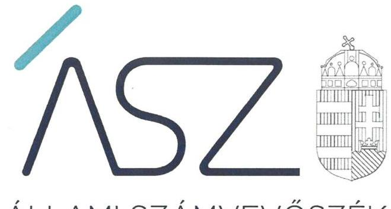
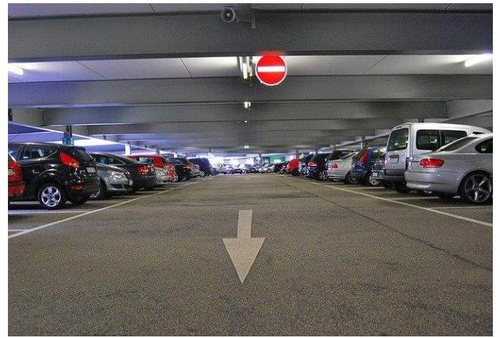

ÁLLAMI SZÁMVEVŐSZÉK

# JELENTÉS 

## A jelentős beruházások ellenőrzése

Petz Aladár Megyei Oktató Kórházat érintő beruházási projekt
2021.

21061
www.asz.hu

---

ÁLLAMI SZÁMVEVŐSZÉK

# JELENTÉS 

## A jelentős beruházások ellenőrzése

Petz Aladár Megyei Oktató Kórházat érintő beruházási projekt
2021. 06. hó 29. nap

21061
www.asz.hu

---

# AZ ELLENŐRZÉST FELÜGYELTE: 

PETŐ KRISZTINA felügyeleti vezető
VARGA EDIT felügyeleti vezető

AZ ELLENŐRZÉST VEZETTE ÉS A VÉGREHAJTÁSÁÉRT FELELŐS:
KUSZINGER ANDREA ellenőrzésvezető
ÁRPÁSI TIBOR ellenőrzésvezető

A PROGRAM ÖSSZEÁLLÍTÁSÁÉRT FELELŐS:
NÉMETH ANITA projektvezető

Jelentéseink az Országgyúlés számítógépes hálózatán és az interneten a www.asz.hu címen is olvashatóak.

IKTATÓSZÁM: EL-3261-001/2021
TÉMASZÁM: 2535
ELLENŐRZÉS-AZONOSÍTÓ SZÁM: V0879003

---

# TARTALOMJEGYZÉK 

■ ÖSSZEGZÉS ..... 5
■ AZ ELLENŐRZÉS CÉLJA ..... 6
■ AZ ELLENŐRZÉS TERÜLETE ..... 7
■ AZ ELLENŐRZÉS HÁTTERE, INDOKOLTSÁGA ..... 9
■ A JELENTÉS LÉNYEGES KÉRDÉSKÖREI ..... 10
■ AZ ELLENŐRZÉS HATÓKÖRE ÉS MÓDSZEREI ..... 11
■ MEGÁLLAPÍTÁSOK ..... 13
■ MELLÉKLETEK ..... 15
I. sz. melléklet: Fogalomtár ..... 15
■ FÜGGELÉK: ÉSZREVÉTELEK ..... 17
■ RÖVIDÍTÉSEK JEGYZÉKE ..... 19

---

.

---

# ÖSSZEGZÉS 

A Petz Aladár Megyei Oktató Kórház parkolási infrastruktúrája fejlesztésének döntés-előkészítése és a beruházás megvalósításának előkészítése megfelelő volt.

## Az ellenőrzés társadalmi indokoltsága

Az Állami Számvevőszék a jelentős beruházások ellenőrzésével támogatja a közpénzek szabályos és átlátható felhasználását. A beruházás előkészítésében közreműködő szervezetnek az Alaptörvényben meghatározott alapelvek szerint kell a közpénzeket felhasználnia. A szervezet köteles kiépíteni azokat a kontrollokat, amelyek az átláthatóság, az önállóság és a felelősség, azaz elszámoltathatóság, a törvényesség, a célszerűség és az eredményesség követelményének teljesülését szolgálják. Tekintettel arra, hogy a beruházások jellemzően több tízmillió, vagy több milliárd Ft-os támogatásból valósulnak meg, ezért az Alaptörvény követelményeinek betartásához szükséges szervezeti keretek, a szabályozó eszközök kialakítása, és azok betartása a beruházási kockázatok feltárása és kezelése elvárás a szervezet felé.

Az átláthatóság lényege, hogy a szervezetnek a törvényeknek és egyéb jogszabályoknak megfelelően kell végeznie a tevékenységét és arról nyilvánosan be kell számolnia. Az elszámoltathatóság lényege a felelősség. A szervezet felelős a közfeladatai ellátásáért, a közpénzek használatáért. Az eredményesség a kitűzött célok és azok megvalósulásának összehasonlításával mérhető.

A Petz Aladár Megyei Oktató Kórházat érintő beruházás előkészítésének ellenőrzése hozzájárulhat a beruházási folyamat transzparenciájának erősítéséhez.

## Főbb megállapítások, következtetések

A Nemzeti Fejlesztési Minisztérium az Innovációs és Technológiai Minisztérium jogelődjeként a jogszabályokban és belső előírásaiban rögzített módon készítette elő és terjesztette a Modern Városok Bizottsága elé a Petz Aladár Megyei Oktató Kórház parkolási infrastruktúrájának fejlesztését szolgáló beruházási projekt előkészítésére és megvalósítására vonatkozó javaslatát. A beruházás előkészítésének támogatását biztosító okirat szabályszerűen került kiadásra.

Győr Megyei Jogú Város Önkormányzata belső szabályozottsága, szervezeti és működési folyamatai biztosították a beruházás megfelelő előkészítését. Győr Megyei Jogú Város Önkormányzata a Petz Aladár Megyei Oktató Kórházat érintő beruházási projektet szabályszerűen előkészítette, az előkészítési szakaszban megkötött szerződések megfelelőek voltak.

---

# AZ ELLENŐRZÉS CÉLJA 

AZ ELLENŐRZÉS CÉLJA a beruházás eredményes megvalósulásának elősegítése érdekében, a folyamatban lévő beruházás vonatkozásában, a döntés-előkészítésétől a megvalósítás megkezdéséig felmerülő kockázatok beazonosításának és az integritási szempontok érvényesülésének értékelése.

---

# AZ ELLENŐRZÉS TERÜLETE 

## A Petz Aladár Megyei Oktató Kórház parkolási infrastruktúrájának fejlesztése

A Modern Városok Program keretében a Kormány ${ }^{1}$ 2017. április 28-án együttműködési megállapodást ${ }^{2}$ kötött Győr Megyei Jogú Város Önkormányzatával a város fejlődése és megújulása érdekében, amely együttműködési megállapodás 2. pontjában a Kormány vállalta, hogy a megyeszékhely egészségügyi fejlesztése keretében támogatja a Petz Aladár Megyei Oktató Kórház parkolójának bővítését.

Az együttműködési megállapodásban foglaltak végrehajtása érdekében elfogadott 1387/2017. (VI. 27.) Korm. határozat ${ }^{3}$ 2. pont b) alpontjában a Kormány felhívta az emberi erőforrások miniszterét és a nemzeti fejlesztési minisztert, hogy tegyék meg a szükséges intézkedéseket a Kórház ${ }^{4}$ parkolási infrastruktúrájának fejlesztése érdekében.

A Kormány az MVP ${ }^{5}$ keretében nyújtott költségvetési támogatások odaítélésének, felhasználásának szabályait az MVP rendeletben ${ }^{6}$ határozta meg. Meghatározásra került, hogy az egyes megyei jogú városokkal kötött együttműködési megállapodások végrehajtásával összefüggő feladatokról döntő egyedi kormányhatározatokban foglaltak végrehajtásának koordinálását a kijelölt miniszter ${ }_{1-3}{ }^{7}$ lássa el, míg a végrehajtás a szakpolitikai felelősként megjelölt kormánytag feladata. A központi költségvetés Miniszterelnökség fejezetében megállapított, MVP elnevezésű, e célt szolgáló fejezeti kezelésű előirányzat terhére nyújtható MVP támogatás ${ }^{8}$ odaítéléséről az MVP Bizottság ${ }^{9}$ dönt. Az MVP Bizottság a döntéseit a szakpolitikai felelős előterjesztése alapján hozza. A támogatási döntésről a miniszter támogatói okiratot ad ki.

Az 1387/2017. (VI. 27.) Korm. határozatban megjelölt szakpolitikai felelős Emberi Erőforrások Minisztériuma 2018. február 28-án átadta a szakpolitikai felelősi feladatokat a Nemzeti Fejlesztési Minisztérium, az Innovációs és Technológiai Minisztérium jogelődje részére.

Az NFM ${ }^{10}$ 2018. március 20-án szakpolitikai felelősként előterjesztést ${ }_{1-2}{ }^{11}$ nyújtott be az MVP Bizottság részére a „Petz Aladár Megyei Oktató Kórház parkolási infrastruktúrájának fejlesztése" elnevezésű beruházás támogatásáról. Az MVP Bizottság 2000 millió Ft támogatás nyújtásáról szóló döntése alapján a Miniszterelnökség 2018. április 23-án állította ki a beruházás támogatásának feltételeit tartalmazó Támogatói Okiratot ${ }^{12}$.

A beruházás előkészítési feladatait az Önkormányzat ${ }^{13}$ részéről a Polgármesteri Hivatal ${ }^{14}$ látta el.

Az Önkormányzat a parkolási lehetőségek bővítését szolgáló beruházás megvalósítására vonatkozó közbeszerzési hirdetményt „Győr PAMOK parkolólemez" tárgyban 2018. augusztus 29-én tette közzé.

2020 nyarán a korábban 380 db gépkocsi befogadására alkalmas parkoló területén a háromszintes parkoló megépítésével befejeződött a beru-

---

házás, aminek eredményeként 180 db további parkolóhely létesült, valamint megvalósult a Kórház területére irányuló célforgalom, illetve a parkolási létesítmény forgalmának biztonságos szétválasztása is. Ezenfelül 41 db új parkolóhely létesült a Kórház területén belül, elsősorban a dolgozók részére.

---

# AZ ELLENŐRZÉS HÁTTERE, INDOKOLTSÁGA 

A közpénzek szabályos és átlátható felhasználásának támogatása céljából az ÁSZ ${ }^{15}$ a beruházások ellenőrzését - a megvalósításra fordított költségvetési források nagyságrendjére, a beruházások révén létrehozott nemzeti vagyon hasznosítására tekintettel - kiemelt fontosságú területként kezeli.

A közpénzből megvalósuló beruházások eredményes megvalósulása érdekében indokolt már a döntés-előkészítéstől a megvalósítás megkezdéséig tartó szakaszban felmerülő kockázatok beazonosításának és a kezelésükre kidolgozott intézkedések értékelése, az átláthatóság követelményével összhangban az integritási szempontok érvényesülésének biztosítása.

A beruházások előkészítésére fókuszáló ellenőrzés megállapításainak hasznosításaként lehetőség nyílhat még a beruházás folyamatában a feltárt hiányosságok, szabálytalanságok megszüntetéséhez szükséges korrekciók megtételére, a kontrollok erősítésére.

Jelen ellenőrzés ezáltal hozzájárulhat az ÁSZ kockázatértékelő rendszere alapján kiválasztott, államháztartásból származó forrásból finanszírozott beruházások eredményességéhez, a beruházási folyamat transzparenciájának biztosításához.

Az ellenőrzés eredményeinek célzott felhasználói a nyilvánosság, valamint a beruházások előkészítésében és megvalósításában résztvevő szervezetek.

---

# A JELENTÉS LÉNYEGES KÉRDÉSKÖREI 

1.     - A beruházás döntés-előkészitése szabályszerűen történt-e?
2.     - A beruházás előkészitését végző ellenőrzött szervezet belső szabályozottsága, szervezeti és müködési folyamatai biztositották-e a beruházás megfelelő előkészitését?
3.     - A beruházás megvalósitásának előkészitése, a beruházás előkészitése keretében megkötött szerződések megfelelőek voltak-e?

---

# AZ ELLENŐRZÉS HATÓKÖRE ÉS MÓDSZEREI 

## Az ellenőrzés típusa

Megfelelőségi ellenőrzés.

## Az ellenőrzött időszak

A 2015-2018. évi központi vagy önkormányzati költségvetésben megjelenő beruházások első döntés-előkészítésétől a beruházás előkészítési szakaszának befejezéséig (a megvalósításra vonatkozó közbeszerzési eljárás meghirdetésének időpontjáig) terjedő időszak, azaz 2017. július 27. 2018. augusztus 29.

## Az ellenőrzés tárgya

Az ellenőrzés a beruházást érintő önkormányzati, kormányzati beruházási döntés-előkészítést beterjesztő szervezet, valamint a beruházás előkészítését végző önkormányzat és gazdálkodási feladatait ellátó polgármesteri hivatal, költségvetési szerv, nemzeti tulajdonban lévő gazdasági társaság döntés-előkészítési és beruházás előkészítési tevékenységének működési folyamataira, azok belső szabályozottságára, a megvalósítás előkészítésének megfelelőségére terjed ki.

## Az ellenőrzött szervezet

- Innovációs és Technológiai Minisztérium
- Emberi Erőforrások Minisztériuma
- Győr Megyei Jogú Város Önkormányzata
- Győr Megyei Jogú Város Polgármesteri Hivatala

## Az ellenőrzés jogalapja

Az ellenőrzés jogszabályi alapját az ÁSZ tv. ${ }^{16}$ 1. § (3) bekezdése és 5. § (2) - (5) bekezdései, valamint az Áht. ${ }^{17} 61 . \S$ (2) bekezdése képezték.

## Az ellenőrzés módszerei

Az ÁSZ az ellenőrzést az ellenőrzési program szempontjai, kérdései, az ellenőrzött időszakban hatályos jogszabályok, az ellenőrzés szakmai szabályai, az ÁSZ megfelelőségi ellenőrzési módszertana alapján végezte.

---

Az ellenőrzés ideje alatt az ellenőrzött szervezettel történő kapcsolattartást az ÁSZ Szervezeti és Múködési Szabályzatának vonatkozó előírásai alapján biztosította az ÁSZ.

A program ellenőrzési szempontjai a szabályszerűségi szempontok szerinti ellenőrzésben a jogszabályok, közjogi szervezetszabályozó eszközök, önkormányzati rendeletek, határozatok, további belső utasítások, belső szabályozók előírásai, a helyénvalósági szempontok szerinti ellenőrzésben az ÁSZ korábbi beruházásokat érintő ellenőrzései során beazonosított „jó gyakorlatok" és általánosan elfogadott szakmai szabályok alapján kerültek meghatározásra.

Az ellenőrzési szempontok tartalmaztak helyénvalósági kritériumokat is, amelyet az ÁSZ honlapján tett közzé. A helyénvalósági kritériumok az ellenőrzés tárgyát képező, általánosan elfogadott, jogszabályok által nem szabályozott, illetve nemzetközi vagy hazai „jó gyakorlatokon" alapuló ellenőrzési szempontok, melyek hozzájárulnak az ellenőrzött szervezetek integritásának megerősítéséhez.

Az ellenőrzési kérdések megválaszolásához szükséges bizonyítékok megszerzése a következő ellenőrzési eljárások alkalmazásával történt: megfigyelés, kérdésfeltevés (információkérés), összehasonlítás, mintavételi eljárás, valamint elemző eljárás. Az ellenőrzés végrehajtásához a rétegzett mintavételi eljárással történik a mintavétel. Az ellenőrzési bizonyítékként felhasználható adatforrások közé tartoztak egyrészt az ellenőrzési programban felsorolt adatforrások, másrészt adatforrás volt még minden - az ellenőrzés folyamán - feltárt, az ellenőrzés szempontjából információkat tartalmazó dokumentum.

Mintavételes ellenőrzésre a beruházás előkészítésére vonatkozóan, közbeszerzési eljárások eredményeként kötött szerződések, továbbá a közbeszerzési értékhatárt el nem érő beszerzések (megrendelésekre, megbízásokra) szerinti rétegzés alapján kiválasztott szerződések esetében került sor.

A mintatételek kiválasztása a közbeszerzési határértéket elérő, illetve el nem érő szerződésekből véletlen rétegzett mintavétellel történt. A vizsgált terület „szabályszerű" minősítést kapott, ha a minta ellenőrzésének eredménye alapján 95\%-os bizonyossággal a teljes sokaságban az átlagos hibaarány nem haladta meg a 10\%-ot, „nem szabályszerű" minősítést kapott, ha nagyobb volt, mint 10\%. Abban az esetben, ha a teljes sokaság tekintetében a 10\%-os hibaarányhoz való viszony megítélésének megbízhatósága nem érte el a 95\%-ot, annak elérése érdekében az értékelés további szempontokkal egészült ki, a feltárt hibák értéke is figyelembe vételre került. Amennyiben a sokaság elemszáma nem haladta meg az előírt minta elemszámot, akkor a sokaság valamennyi elemének tételes ellenőrzésére került sor.

Az ellenőrzés során minden olyan körülmény és adat is ellenőrzésre került, amely a program végrehajtása kapcsán felmerült újabb összefüggéseknek az ellenőrzés céljaival összhangban lévő feltárásához szükséges volt.

---

# 1. A beruházás döntés-előkészítése szabályszerűen történt-e? 

## Összegző megállapítás

A beruházás döntés-előkészítése szabályszerűen történt.
A Kórház ${ }^{18}$ parkolási infrastruktúrájának fejlesztését szolgáló beruházást érintő kormányzati döntések előkészítése szabályszerű volt. Az NFM a Kormány ügyrendje ${ }^{19}$, az MVP rendelet előírásaival összhangban, továbbá az NFM SZMSZ-ben ${ }^{20}$ rögzített módon, szakmai felelősként készítette el és terjesztette az MVP Bizottság elé a beruházás előkészítésére és megvalósítására vonatkozó javaslatát.

Az Önkormányzat támogatási kérelmének előterjesztése során az Mötv. ${ }^{21}$, az önkormányzati SZMSZ ${ }^{22}$ és a hivatali SZMSZ ${ }^{23}$ előírásaival összhangban járt el.

A Támogatói Okirat kiadására az MVP Bizottság támogató döntése alapján került sor, amely megfelelt az Áht.-ban és az Ávr. ${ }^{24}$-ben megfogalmazott követelményeknek.

## 2. A beruházás előkészítését végző ellenőrzött szervezet belső szabályozottsága, szervezeti és müködési folyamatai biztosított-ták-e a beruházás megfelelő előkészítését?

## Összegző megállapítás

A beruházás előkészítését végző Önkormányzat belső szabályozottsága, szervezeti és müködési folyamatai biztosították a beruházás megfelelő előkészítését.

Az Önkormányzat az Mötv. ${ }^{25}$ és az Nvtv. ${ }^{26}$. előírásának megfelelően rendelkezett gazdasági programmal ${ }^{27}$, vagyongazdálkodási tervvel ${ }^{28}$. A gazdasági program az Mótv. előírásaival összhangban szakterületenként tartalmazta a fejlesztési elképzeléseket, feladatokat.

A kórházi parkoló megvalósítására vonatkozó beruházási projekt előkészítésében közreműködő Polgármesteri Hivatal SZMSZ-e az Ávr. előírásaival összhangban tartalmazta a szervezeti egységek feladatait, a nevesített munkakörökhöz tartozó feladat- és hatásköröket. A Számv. tv. ${ }^{29}$ és az Áhsz. ${ }^{30}$ előírásainak eleget téve rendelkezett számviteli politikával ${ }^{31}$, értékelési szabályzattal ${ }^{32}$, leltározási szabályzattal ${ }^{33}$, valamint számlarenddel ${ }^{34}$.

A kötelezettségvállalásra, teljesítésigazolásra jogosultak az Ávr. előírásával összhangban rendelkeztek írásbeli felhatalmazással és róluk, valamint aláírás-mintájukról naprakész nyilvántartást vezettek.

Az Önkormányzat a Közbeszerzési szabályzatban ${ }^{35}$ a Kbt. ${ }^{36}$ előírásaival összhangban meghatározta a közbeszerzési eljárásai előkészítésének, lefolytatásának, belső ellenőrzésének felelősségi rendjét. A Közbeszerzési szabályzat tartalmazta továbbá az Önkormányzat nevében eljáró, illetve az

---

eljárásba bevont személyek, valamint szervezetek felelősségi körét és a közbeszerzési eljárás dokumentálási rendjét.

A jegyző ${ }^{37}$ a Bkr. rendelkezéseivel összhangban felmérte és értékelte a beruházás kockázatait, meghatározta a kockázatokkal kapcsolatos intézkedéseket.

# 3. A beruházás megvalósításának előkészítése, a beruházás előkészítése keretében megkötött szerződések megfelelőek voltak-e? 

Összegző megállapítás A beruházás megvalósításának előkészítése, az előkészítés során megkötött szerződések megfelelőek voltak.

Az Önkormányzat megfelelően készítette elő a beruházás megvalósítását. Az Önkormányzat elkészítette a beruházási projektek időbeli ütemezését, rendelkezett költségkalkulációkkal, költségszámítással. A közbeszerzési szakértői és jogi tevékenységre, műszaki ellenőrzésre, beruházás bonyolításra vonatkozó szerződéseket a beszerzési szabályzat ${ }^{38}$ előírásaival összhangban, szabályszerűen kötötte meg az Önkormányzat. A közbeszerzési értékhatárt el nem érő beszerzés keretében megkötött szerződések eleget tettek az Ávr. előírásainak.

---

# MELLÉKLETEK 

- I. SZ. MELLÉKLET: FOGALOMTÁR
beruházás

A tárgyi eszközök beszerzése, létesítése, saját vállalkozásban történő előállítása, a beszerzett tárgyi eszköz üzembe helyezése, rendeltetésszerű használatbavétele érdekében az üzembe helyezésig, a rendeltetésszerű használatbavételig végzett tevékenység (szállítás, vámkezelés, közvetítés, alapozás, üzembe helyezés, továbbá mindaz a tevékenység, amely a tárgyi eszköz beszerzéséhez hozzákapcsolható, ideértve a tervezést, az előkészítést, a lebonyolítást, a hiteligénybevételt, a biztosítást is); beruházás a meglévő tárgyi eszköz bővítését, rendeltetésének megváltoztatását, átalakítását, élettartamának, teljesítőképességének közvetlen növelését eredményező tevékenység is, az előbbiekben felsorolt, e tevékenységhez hozzákapcsolható egyéb tevékenységekkel együtt. (Forrás: Számv. tv. 3. § (4) bekezdés 7. pont). A jelentős beruházásokat érintően beruházásnak tekintjük az immateriális javak beszerzését is.
beterjesztő szervezet
felújítás
jelentős beruházás

Modern Városok Program
monitoring

A beruházási döntésre vonatkozó előterjesztésért felelős képviselő-testület bizottsága, polgármester, és/vagy a beruházási döntésre vonatkozó előterjesztésért felelős minisztérium.
Az elhasználódott tárgyi eszköz eredeti állaga (kapacitása, pontossága) helyreállítását szolgáló, időszakonként visszatérő olyan tevékenység, amely mindenképpen azzal jár, hogy az adott eszköz élettartama megnövekszik, eredeti műszaki állapota, teljesítőképessége megközelítően vagy teljesen visszaáll, az előállított termékek minősége vagy az adott eszköz használata jelentősen javul és így a felújítás pótlólagos ráfordításából a jövőben gazdasági előnyök származnak; felújítás a korszerűsítés is, ha az a korszerű technika alkalmazásával a tárgyi eszköz egyes részeinek az eredetitől eltérő megoldásával vagy kicserélésével a tárgyi eszköz üzembiztonságát, teljesítőképességét, használhatóságát vagy gazdaságosságát növeli; a tárgyi eszközt akkor kell felújítani, amikor a folyamatosan, rendszeresen elvégzett karbantartás mellett a tárgyi eszköz oly mértékben elhasználódott (szerkezeti elemei elöregedtek), amely elhasználódottság már a rendeltetésszerű használatot veszélyezteti; nem felújítás az elmaradt és felhalmozódó karbantartás egyidőben való elvégzése, függetlenül a költségek nagyságától. (Forrás: Számv. tv. 3. § (4) bekezdés 8. pont)
Jelentős beruházás az a beruházás, amelyet az ÁSZ kockázatelemzés alapján annak tekint. A kockázat-elemzés során figyelembe vett szempontok: a beruházás háttere, funkciója, bekerülési értéke, a szervezet költségvetéséhez, gazdasági társaság esetén mérlegfőösszegéhez való nagyságrendi viszonya, beruházás megvalósítási költségében a központi költségvetési támogatás részaránya.
Magyarország megyei jogú városainak fejlesztésére irányuló, a Kormány és a megyei jogú város önkormányzata között, a megyei jogú város további fejlődése és megújulása érdekében létrejött együttműködési megállapodásokban foglalt, 2015. és 2022. között több mint 250 jelentős beruházást, projektet előirányzó, hazai forrásból nyújtott költségvetési támogatásból megvalósuló terv.
A monitoring általánosságban a különböző szintű szervezeti célok megvalósításának folyamatát kíséri figyelemmel, melynek során a releváns eseményekről és tevékenységekről (együtt: folyamatokról) rendszeres jelleggel, strukturált, döntéstámogató információkhoz jutnak a szervezet vezetői. (Forrás: NGM Államháztartási Belső Kontroll Standardok és Gyakorlati Útmutató, 2017. szeptember)

---

önkormányzat

A helyi önkormányzat jogi személy. Az önkormányzati feladatok ellátását a képvi-selő-testület és szervei biztosítják. A képviselő-testület szervei: a polgármester, a főpolgármester, a megyei közgyűlés elnöke, a képviselő-testület bizottságai, a részönkormányzat testülete, a polgármesteri hivatal, a megyei önkormányzati hivatal, a közös önkormányzati hivatal, a jegyző, továbbá a társulás. A képviselő-testület a feladatkörébe tartozó közszolgáltatások ellátására - jogszabályban meghatározottak szerint - költségvetési szervet, a Polgári perrendtartásról szóló 2016. évi CXXX. törvény szerinti gazdálkodó szervezetet (a továbbiakban: gazdálkodó szervezet), nonprofit szervezetet és egyéb szervezetet (a továbbiakban együtt: intézmény) alapíthat, továbbá szerződést köthet természetes és jogi személlyel vagy jogi személyiséggel nem rendelkező szervezettel. (Forrás: Mötv. 41. § (1), (2), (6) bekezdései).

---

# FÜGGELÉK: ÉSZREVÉTELEK 

A jelentéstervezetet a Számvevőszék 15 napos észrevételezésre megküldte az ellenőrzött szervezetek vezetőinek az ÁSZ tv. 29. §* (1) bekezdése előírásának megfelelően.

Az Információs és Technológiai Minisztérium minisztere és az Emberi Erőforrások Minisztériuma európai uniós fejlesztéspolitikáért felelős államtitkára írásban jelezte, hogy a jelentéstervezet megállapításaira észrevételt nem tesz. Az Emberi Erőforrások Minisztériuma minisztere, Győr Megyei Jogú Város Önkormányzata polgármestere, illetve Győr Megyei Jogú Város Polgármesteri Hivatal jegyzője a jelentéstervezet megállapításaira nem tettek észrevételt.

[^0]
[^0]:    * 29. § (1) Az Állami Számvevőszék az ellenőrzési megállapításait megküldi az ellenőrzött szervezet vezetőjének vagy az általa megbízott személynek, és annak, akinek személyes felelősségét állapította meg.
    (2) Az ellenőrzött szervezet vezetője és a felelősként megjelölt személy az ellenőrzés megállapításaira tizenöt napon belül írásban észrevételt tehet.
    (3) Az Állami Számvevőszék az észrevételre a beérkezésétől számított harminc napon belül írásban válaszol. A figyelembe nem vett észrevételeket köteles a jelentésben feltüntetni, és megindokolni, hogy azokat miért nem fogadta el.

---

.

---

# RÖVIDÍTÉSEK JEGYZÉKE 

${ }^{1}$ Kormány
${ }^{2}$ együttműködési megállapodás
${ }^{3}$ 1387/2017. (VI. 27.) Korm. határozat
${ }^{4}$ Kórház
${ }^{5}$ MVP
${ }^{6}$ MVP rendelet
${ }^{7}$ miniszter ${ }_{1}$
miniszter $_{2}$
miniszter $_{3}$
${ }^{8}$ MVP támogatás
${ }^{9}$ MVP Bizottság
${ }^{10}$ NFM
${ }^{11}$ előterjesztés ${ }_{1}$
előterjesztés $_{2}$
${ }^{12}$ Támogatói Okirat
${ }^{13}$ Önkormányzat
${ }^{14}$ Polgármesteri Hivatal
${ }^{15}$ ÁSZ
${ }^{16}$ ÁSZ tv.
${ }^{17}$ Áht.
${ }^{18}$ Kórház
${ }^{19}$ Kormány ügyrendje
${ }^{20}$ NFM SZMSZ
${ }^{21}$ Mötv.
${ }^{22}$ önkormányzati SZMSZ

Magyarország Kormánya
A Kormány és Győr Megyei Jogú Város Önkormányzata között 2017. április 28-án létrejött együttműködési megállapodás a modern Győrért
1387/2017. (VI. 27.) Korm. határozat Magyarország Kormánya és Győr Megyei Jogú Város Önkormányzata közötti együttműködési megállapodás végrehajtásával összefüggő feladatokról
Győri Petz Aladár Megyei Oktató Kórház
Modern Városok Program
250/2016. (VIII. 24.) Korm. rendelet a Modern Városok Program megvalósításáról a kormányzati tevékenység összehangolásáért felelős kijelölt miniszter 2016. augusztus 25-től 2017. október 10-ig
a megyei jogú városok fejlesztéséért felelős tárca nélküli miniszter 2017. október 11-től 2018. június 11-ig
a településfejlesztésért és településrendezésért felelős miniszter 2018. június 12-től
Modern Városok Program végrehajtását szolgáló, hazai forrásból nyújtott költségvetési támogatás
Modern Városok Program Bizottság
Nemzeti Fejlesztési Minisztérium, jogutóda az Innovációs és Technológiai Minisztérium 2018. május 22-től
A Nemzeti Fejlesztési Minisztérium 2018. március 20-án kelt NFPF/25176/2018NFM iktatószámú előterjesztése a Modern Városok Bizottsága részére
A Nemzeti Fejlesztési Minisztérium 2018. április 9-én kelt NFPF/251762/2018NFM iktatószámú előterjesztése a Modern Városok Bizottsága részére az NFPF/25176/2018-NFM iktatószámú előterjesztés kiegészítése tárgyában
A Miniszterelnökség 2018. április 23-án kelt GF/SZKF/301/8/2018. iktatószámú Támogatói Okirata
Győr Megyei Jogú Város Önkormányzata
Győr Megyei Jogú Város Önkormányzat Polgármesteri Hivatala
Állami Számvevőszék
2011. évi LXVI. törvény az Állami Számvevőszékről (hatályos: 2011. július 1-től)
2011. évi CXCV. törvény az államháztartásról (hatályos: 2011. december 31-től)

Győri Petz Aladár Megyei Oktató Kórház
1144/2010. (VII. 7.) Korm. határozat a Kormány ügyrendjéről (hatályos: 2010. július 8-tól)
33/2014.(X. 10.) NFM utasítás a Nemzeti Fejlesztési Minisztérium Szervezeti és Müködési Szabályzatáról (hatályos: 2014. október 11-től)
2011. évi CLXXXIX. törvény Magyarország helyi önkormányzatairól (hatályos: 2012. január 1-től)
Győr Megyei Jogú Város Közgyűlésének 30/2012. (XII. 19.) számú önkormányzati rendelete Győr Megyei Jogú Város Önkormányzata Szervezeti és Müködési Szabályzatáról (hatályos: 2013. január 1-től)

---

${ }^{23}$ hivatali SZMSZ
${ }^{24}$ Áht.
${ }^{25}$ Mötv.
${ }^{26}$ Nvtv.
${ }^{27}$ gazdasági program
${ }^{28}$ vagyongazdálkodási terv
${ }^{29}$ Számv. tv.
${ }^{30}$ Áhsz.
${ }^{31}$ számviteli politika
${ }^{32}$ értékelési szabályzat
${ }^{33}$ leltározási szabályzat
${ }^{34}$ számlarend
${ }^{35}$ közbeszerzési szabályzat
${ }^{36} \mathrm{Kbt}$.
${ }^{37}$ jegyző
${ }^{38}$ beszerzési szabályzat

Győr Megyei Jogú Város Közgyűlésének 286/2012. (XII. 19.) számú önkormányzati határozata Győr Megyei Jogú Város Polgármesteri Hivatala Szervezeti és Müködési Szabályzata megállapításáról (hatályos: 2013. január 1-től)
2011. évi CXCV. törvény az államháztartásról (hatályos: 2011. december 31-től)
2011. évi CLXXXIX. törvény Magyarország helyi önkormányzatairól (hatályos: 2012. január 1-től)
2011. évi CXCVI. törvény a nemzeti vagyonról (hatályos: 2011. december 31-től) 84/2015. (IV. 30.) sz. közgyűlési határozattal elfogadott Győr Megyei Jogú Város Önkormányzatának Gazdasági programja 2015-2020. évekre
77/2013. (III. 29.) sz. közgyűlési határozattal elfogadott Győr Megyei Jogú Város Önkormányzatának közép- és hosszú távú vagyongazdálkodási terve
2000. évi C. törvény a számvitelről (hatályos 2001. január 1-től)
4/2013. (I. 11.) Korm. rendelet az államháztartás számviteléről (hatályos: 2014. január 1-től)
Győr Megyei Jogú Város Önkormányzata és Polgármesteri Hivatala E/8/2013. (XII. 31.) számú szabályzata a számviteli politikáról (hatályos: 2014. január 1-től)
Győr Megyei Jogú Város Önkormányzata és Polgármesteri Hivatala E/10/2013. (XII. 31.) számú szabályzata az eszközök és források értékelési szabályzatáról (hatályos: 2014. január 1-től)
Győr Megyei Jogú Város Önkormányzata és Polgármesteri Hivatala E/10/2012. (I. 02.) számú szabályzata a leltárkészítésről és leltározásról (hatályos: 2012. január 2-től)

Győr Megyei Jogú Város Önkormányzata és Polgármesteri Hivatala E/18/2015. (XII. 31.) számú szabályzata a számlarendről (hatályos: 2016. január 1-től)

Győr Megyei Jogú Város Önkormányzata és Polgármesteri Hivatala E/10/2015. (X. 30.) számú szabályzata a közbeszerzésről (hatályos: 2015. november 1-től)
2015. évi CXLIII. törvény a közbeszerzésekről (hatályos: 2015. november 1-től)

Győr Megyei Jogú Város Jegyzője
Győr Megyei Jogú Város Önkormányzatának és Polgármesteri Hivatalának E/2/2015. (II. 27.) számú Beszerzési szabályzata a közbeszerzési értékhatár alatti beszerzésekről (hatályos: 2015. február 28-tól)

---

# 1052 

1052 Budapest, Apáczai Cs. J. u. 10. I 1364 Budapest 4. Pf. 54 TEL: +36 14849100
email: szamvevoszek@asz.hu
web: www.asz.hu | www.aszhirportal.hu