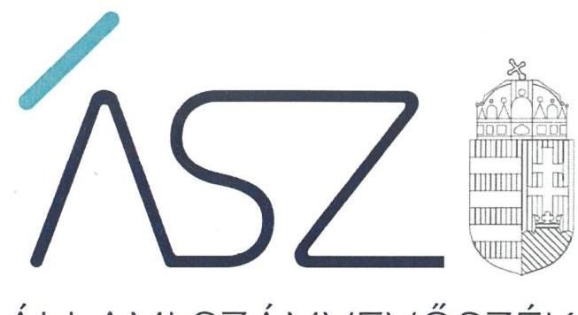
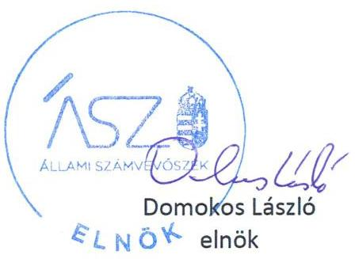
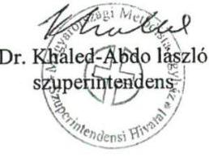
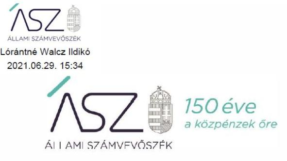

ÁLLAMI SZÁMVEVŐSZÉK

# JELENTÉS 

## Utóellenőrzések

Nem hitéleti célra kapott költségvetési támogatásban részesülő, jogi személyiséggel rendelkező vallási közösségek utóellenőrzése
2021.

21062
www.asz.hu

---

ÁLLAMI SZÁMVEVŐSZÉK

# JELENTÉS 

## Utóellenőrzések

Nem hitéleti célra kapott költségvetési támogatásban részesülő, jogi személyiséggel rendelkező vallási közösségek utóellenőrzése
2021. 08. hó 03. nap

21062
www.asz.hu

---

Jelentéseink az Országgyűlés számítógépes hálózatán és az interneten a www.asz.hu címen is olvashatóak.

## AZ ELLENŐRZÉST VEZETTE ÉS A VÉGREHAJTÁSÁÉRT FELELŐS:

LAJÓ ADRIENN ellenőrzésvezető

KAKAS SÁNDOR ellenőrzésvezető

FEKETE-NAGY ANDRÁS GÁBOR ellenőrzésvezető

## A PROGRAM ÖSSZEÁLLÍTÁSÁÉRT FELELŐS:

GÖRGÉNYI GÁBOR osztályvezető

|  A TÉMÁHOZ KAPCSOLÓDÓ KORÁBBI SZÁMVEVŐSZÉKI JELENTÉSEK: |   |
| --- | --- |
|  - címe: | Nem állami humánszolgáltatók ellenőrzése A humánszolgáltatást nyújtó államháztartáson kívüli köznevelési és szociális intézmények, szolgáltatók fenntartói központi költségvetésből kapott támogatásai felhasználásának ellenőrzése - Magyar Pünkösdi Egyház 2019.  |
|  - sorszáma: | 19099  |
|  - címe: | Nem állami humánszolgáltatók ellenőrzése A humánszolgáltatást nyújtó államháztartáson kívüli köznevelési és szociális intézmények, szolgáltatók fenntartói központi költségvetésből kapott támogatásai felhasználásának ellenőrzése - Budapesti Zsidó Hitközség 2019.  |
|  - sorszáma: | 19090  |
|  - címe: | Nem állami humánszolgáltatók ellenőrzése A humánszolgáltatást nyújtó államháztartáson kívüli köznevelési és szociális intézmények, szolgáltatók fenntartói központi költségvetésből kapott támogatásai felhasználásának ellenőrzése - Magyarországi Metodista Egyház 2019.  |
|  - sorszáma: | 19069  |

IKTATÓSZÁM: EL-3264-001/2021. TÉMASZÁM: 24. ELLENŐRZÉS-AZONOSÍTÓ SZÁM: V087603

---

# TARTALOMJEGYZÉK 

■ ÖSSZEGZÉS ..... 5
■ AZ ELLENŐRZÉS CÉLJA ..... 7
■ AZ ELLENŐRZÉS TERÜLETE ..... 8
■ AZ ELLENŐRZÉS HÁTTERE, INDOKOLTSÁGA ..... 10
■ A JELENTÉS LÉNYEGES KÉRDÉSKÖREI ..... 11
■ AZ ELLENŐRZÉS HATÓKÖRE ÉS MÓDSZEREI ..... 12
■ MEGÁLLAPÍTÁSOK ..... 14
■ MELLÉKLETEK ..... 17
I. sz. melléklet: Fogalomtár ..... 17
■ FÜGGELÉK: ÉSZREVÉTELEK ..... 19
■ RÖVIDÍTÉSEK JEGYZÉKE ..... 25

---

.

---

# ÖSSZEGZÉS 

A Magyar Pünkösdi Egyház mint köznevelési és szociális intézmények egyházi fenntartója az intézkedési tervben vállalt feladatokat végrehajtotta, a működésből eredő kockázatokat csökkentette, ezáltal a közpénzügyi helyzet javult.
A Budapesti Zsidó Hitközség mint köznevelési és szociális intézmények egyházi fenntartója az intézkedési tervben vállalt feladatokat végrehajtotta, a működésből eredő kockázatokat csökkentette, ezáltal a közpénzügyi helyzet javult.
A Magyarországi Metodista Egyház mint köznevelési és szociális intézmények egyházi fenntartója a közpénzfelhasználás átláthatóságát és elszámoltathatóságát továbbra sem biztosította, mivel az intézkedési tervében e tekintetben vállalt feladatokat nem hajtotta végre.

## Az ellenőrzés társadalmi indokoltsága

Az Állami Számvevőszék stratégiájában célul tűzte ki a számvevőszéki munka hasznosulásának javítását. Ezzel összhangban ellenőrzi, hogy az ellenőrzött szervezetek megvalósították-e a korábbi, Állami Számvevőszék ellenőrzései során feltárt hibák, hiányosságok és szabálytalanságok megszüntetése céljából elkészített intézkedési tervekben foglaltakat. A rendszeres utóellenőrzések hozzájárulnak a szükséges intézkedések tényleges végrehajtásához, ezáltal a közpénzügyek rendezettségének javulásához.

A szociális gondoskodást igénylők védelme, a kapcsolódó feladatok ellátása, valamint a köznevelési feladatok ellátása az Alaptörvényben meghatározott, a társadalom szempontjából fontos tevékenységek. Jogszabályok teszik lehetővé, hogy államháztartáson kívüli szervezetek - köztük az egyházi szervezetek - által fenntartott intézmények is végezzenek szociális és gyermekvédelmi, illetve köznevelési feladatokat. Mindehhez a központi költségvetés évente jelentős összegű támogatással járul hozzá. Az államháztartáson kívüli, humánszolgáltatást végző intézmények az igényelt közpénzekből társadalmilag hasznos, közösségteremtő, közérdekű tevékenységet végeznek, illetve közfeladatokat látnak el.

Az intézményfenntartók ellenőrzésével az Állami Számvevőszék hozzájárul ahhoz, hogy ezen közpénzeket az államháztartáson kívüli szervezetek is ellenőrizhető, átlátható és elszámoltatható módon használják fel a közfeladatok ellátása során. Az ellenőrzések célja továbbá, hogy a nyilvánosság és az igénybevevők megfelelő tájékoztatást kapjanak az államháztartáson kívüli közfeladatot ellátók működéséről.

Jelen utóellenőrzés három jogi személyiséggel rendelkező vallási közösség belső szabályozottságának és működésének lényeges területeit értékelte.

## Főbb megállapítások, következtetések

A MAGYAR PÜNKÖSDI EGYHÁZ mint köznevelési és szociális egyházi intézményfenntartó az Állami Számvevőszék korábbi ellenőrzése eredményeképpen feltárt szabálytalanságokat megszüntette, az intézkedési tervben vállalt feladatokat végrehajtotta. Az intézkedések végrehajtásával a költségvetési támogatások felhasználásának és a beszámoló megalapozottságának kockázatai csökkentek.

A BUDAPESTI ZSIDÓ HITKÖZSÉG mint köznevelési és szociális egyházi intézményfenntartó az Állami Számvevőszék korábbi ellenőrzését követően javított a közpénzügyi helyzetén, a szabálytalan működésből eredő kockázatait csökkentette. A belső szabályozottság terén feltárt hiányosságokat megszüntette, a szabályszerű gazdálkodás feltételeinek kialakításával csökkentette a közpénzek elszámoltatható felhasználásának kockázatait.

---

A MAGYARORSZÁGI METODISTA EGYHÁZ mint köznevelési és szociális egyházi intézményfenntartó az Állami Számvevőszék korábbi ellenőrzése eredményeképpen a költségvetési támogatások felhasználása vonatkozásában feltárt szabálytalanságokat nem szüntette meg. A jogszabályi előírásnak megfelelő számlarenddel nem rendelkezett és a költségvetési támogatások szabályszerű felhasználását igazoló elkülönített nyilvántartást nem vezetett, ezáltal nem biztosította a közfeladatra kapott közpénzek átláthatóságát, elszámoltathatóságát. Az elkülönített nyilvántartás hiánya, illetve a számviteli szabályozás kialakításának hiányossága kockázatot hordoz a költségvetési támogatások cél szerinti felhasználására vonatkozóan. Az intézkedési tervben vállalt, a beszámoló megalapozottságát biztosító intézkedést végrehajtotta, ezáltal a beszámoló megalapozottságának kockázatait csökkentette.

---

# AZ ELLENŐRZÉS CÉLJA 

Az utóellenőrzés célja annak kockázatalapú értékelése volt, hogy a nem hitéleti célra kapott költségvetési támogatásban részesülő, jogi személyiséggel rendelkező vallási közösségek hasznosították-e az ÁSZ¹ jelentésben a hiányosságok megszüntetése, illetve a kockázatok csökkentése érdekében megfogalmazott ÁSZ javaslatokat a szervezet vezetője által összeállított intézkedési tervben foglalt intézkedések végrehajtásával, összességében javult-e a közpénzügyi helyzet és az ÁSZ ellenőrzési megállapításai hasznosultak-e.

---

# **AZ ELLENŐRZÉS TERÜLETE**

## **Utóellenőrzések (harmadik szakasz)**

Az utóellenőrzés az átlátható és elszámoltatható közpénzfelhasználás érdekében három jogi személyiséggel rendelkező vallási közösség szabályozottságának és működésének lényeges területeit értékelte.

### **1. MAGYAR PÜNKÖSDI EGYHÁZ**

A Magyar Pünkösdi Egyház 1928-ban alakult felekezetté, a század elején hazánkban létrejött pünkösdi gyülekezetek összefogásával. Már a harmincas években szociális intézményei voltak a pünkösdi közösségnek, ahol gondoskodtak az idősekről és az árvákról. A második világháború viszontagságai következtében a felekezet egysége megszűnt. Az így kialakult Evangéliumi Pünkösdi Egyház és az Evangéliumi Keresztények nevű pünkösdi felekezetek egyesüléséből 1962-ben jött létre az Evangéliumi Pünkösdi Közösség. A legfőbb döntéshozó szerveként funkcionáló Közgyűlés 2011. évben a felekezet nevének Magyar Pünkösdi Egyházra módosításáról határozott. A Magyar Pünkösdi Egyház az Országgyűlés által elismert bevett egyház, amely szerepel az egyházi jogi személyek nyilvántartásában.

A Fenntartó 2019. évben tíz köznevelési intézmény és négy szociális humánszolgáltató intézmény fenntartásával és működtetésével vett részt az önkormányzati és állami közfeladat-ellátásban. A Fenntartó¹ a 2019. évben 3.100 millió Ft költségvetési támogatásban részesült.

Az ÁSZ a 2014-2017. évekre vonatkozóan ellenőrizte a Magyar Pünkösdi Egyházat, mint köznevelési és szociális intézmények költségvetési támogatásban részesült fenntartóját. Az ellenőrzés végrehajtásáról készült számvevőszéki jelentést² 2019. július 4-én hozta nyilvánosságra.

### **2. BUDAPESTI ZSIDÓ HITKÖZSÉG**

Az 1950-ben létrejött Budapesti Zsidó Hitközség a magyarországi zsidóság budapesti "egyházkerülete", amely 2012-től a Magyarországi Zsidó Hitközségek Szövetsége belső egyházi jogi személyeként működött. Tizenöt zsinagóga, illetve imaház tartozott hozzá, ami alapján ugyanennyi templomi körzetre bontva működött a fővárosban. A Budapesti Zsidó Hitközség bevett egyház, amely szerepel az egyházi jogi személyek nyilvántartásában.

A Fenntartó 2019. évben három köznevelési intézmény és három szociális humánszolgáltató intézmény fenntartásával és működtetésével vett részt az önkormányzati és állami közfeladat-ellátásban. A Fenntartó a 2019. évben 809 millió Ft költségvetési támogatásban részesült.

Az ÁSZ korábban a Budapesti Zsidó Hitközséget, mint köznevelési és szociális intézmények költségvetési támogatásban részesült fenntartóját ellenőrizte a 2014-2017. évekre vonatkozóan. Az ellenőrzés végrehajtásáról készült számvevőszéki jelentést³ 2019. május 30-án hozta nyilvánosságra.

---

# 3. MAGYARORSZÁGI METODISTA EGYHÁZ 

A metodista egyház a XVIII. században jött létre az anglikán egyházon belüli vallási megújulási mozgalomként. A Magyarországi Metodista Egyház az United Methodist Church (Egyesült Metodista Egyház) nemzetközi közösségének része. Magyarországon 1898. óta működik, 1947. óta törvényesen elismert vallásfelekezetként. A Magyarországi Metodista Egyház 2012. óta bevett egyházként működik, amely szerepel az egyházi jogi személyek nyilvántartásában.

A Fenntartó 2019. évben két köznevelési intézmény és két szociális humánszolgáltató intézmény fenntartásával és működtetésével vett részt az önkormányzati és állami közfeladat-ellátásban. A Fenntartó a 2019. évben 719,3 millió Ft költségvetési támogatásban részesült.

Az ÁSZ korábban a Magyarországi Metodista Egyházat, mint köznevelési és szociális intézmények költségvetési támogatásban részesült fenntartóját ellenőrizte a 2014-2017. évekre vonatkozóan. Az ellenőrzés végrehajtásáról készült számvevőszéki jelentést,⁴ 2019. május 30-án hozta nyilvánosságra.

---

# AZ ELLENŐRZÉS HÁTTERE, INDOKOLTSÁGA 

Az Alaptörvény⁵ N) cikke rögzíti a költségvetési gazdálkodás főbb elveit. Ezek közül a kiegyensúlyozottság a kiszámítható állami működést, az átláthatóság a tájékozott és felelős polgárok részvételével zajló demokratikus közéletet, a fenntarthatóság pedig a jövendő nemzedékek sorsáért való felelősségvállalást is szolgálja az elsődleges pénzügyi célok mellett. Az Alaptörvény R) cikke rögzíti a jogforrások kötelező jellegét, amelyben mindenki kötelességeként írja elő az Alaptörvény és a jogszabályok megtartását.

Az ÁSZ az ellenőrzési jelentéseiben világosan, következetesen és egyértelműen fogalmazza meg a megállapításait és javaslatait, amelyekre vonatkozóan az ÁSZ tv.⁶ 33. § (1) bekezdése értelmében ellenőrzött szervezetek vezetői intézkedési tervet készítenek, támogatva a felelős és a jognak érvényt szerző közpénzfelhasználást.

Az ÁSZ törvényben kapott felhatalmazás alapján különböző ellenőrzési programok végrehajtása keretében ellenőrzi a közpénzt és a nemzeti vagyont kezelő és felhasználó szervezeteket. Az ellenőrzések tapasztalatairól készült jelentéseiben az ÁSZ a szervezet szabályszerű működésének visszaállítása érdekében fogalmaz meg javaslatokat. A szervezetek intézkedési terveinek végrehajtásával javul a közpénzügyi helyzet és hasznosul az ÁSZ ellenőrzési tevékenysége. ÁSZ tv. 33. § (7) bekezdése szerint a - közpénzzel és a nemzeti vagyonnal történő felelős gazdálkodás érvényre jutása érdekében készített - intézkedési tervben foglaltak megvalósítását az ÁSZ utóellenőrzés keretében ellenőrizheti.

Az ellenőrzött szervezet vezetője által készített intézkedési tervben foglalt feladatok hiányos végrehajtása, vagy annak elmaradása a szabályos működés vonatkozásában kockázatot hordoz. Az utóellenőrzés során is fennálló szabálytalanságok esetén további intézkedéseket vonhat maga után.

Az ellenőrzött szervezet szintjén az utóellenőrzés feltárja, hogy a szervezet az intézkedések végrehajtásával hasznosította-e a korábbi ellenőrzési jelentésben a megfogalmazott javaslatokat, illetve az intézkedések végrehajtása elmaradásának esetén értékeli a közpénzek, közvagyon veszélyeztetettségét.

Az ÁSZ szintjén az utóellenőrzés visszacsatolást ad az ellenőrzési jelentések hasznosulásáról.

---

# A JELENTÉS LÉNYEGES KÉRDÉSKÖREI 

1. Csökkent-e a Magyar Pünkösdi Egyháznál a szabálytalan működés kockázata?
2. Csökkent-e a Budapesti Zsidó Hitközségnél a szabálytalan működés kockázata?
3. Csökkent-e a Magyarországi Metodista Egyháznál a szabálytalan működés kockázata?

---

# AZ ELLENŐRZÉS HATÓKÖRE ÉS MÓDSZEREI 

## Az ellenőrzés típusa

Megfelelőségi ellenőrzés.

## Az ellenőrzött időszak

2019. év

## Az ellenőrzés tárgya

Az ÁSZ jelentésben foglalt megállapításokhoz kapcsolódó - az ellenőrzött szervezet vezetője által készített - intézkedési tervben lényeges dokumentumok tekintetében meghatározott intézkedések végrehajtásának kockázatalapú ellenőrzése.

## Az ellenőrzött szervezetek

- Magyar Pünkösdi Egyház
- Budapesti Zsidó Hitközség
- Magyarországi Metodista Egyház

## Az ellenőrzés jogalapja

Az ÁSZ tv. 1. § (3) bekezdés és 33. § (7) bekezdés.

## Az ellenőrzés módszerei

Az ellenőrzés az ellenőrzött időszakban hatályos jogszabályok, az ellenőrzés szakmai szabályai, a jelen ellenőrzésre irányadó ÁSZ módszertanok, az ellenőrzési programban foglalt értékelési szempontok szerint kerül végrehajtásra.

Az ellenőrzés ideje alatt az ellenőrzött szervezetekkel történő kapcsolattartás az ÁSZ SZMSZ²-ének vonatkozó előírásai alapján kerül biztosításra.

Az ellenőrzött szervezet

 esetében a szabálytalan működés fennállása kockázatának értékelése az intézkedési terv utóellenőrzéssel érintett, lényegességi szempontok alapján meghatározott pontjainak intézkedési kötelezettséggel érintett dokumentumainak ellenőrzésével történik.

---

Az utóellenőrzés megállapításai az ÁSZ rendelkezésére álló dokumentumok, az ÁSZ adatbekérésére az ellenőrzött szervezetek által az ÁSZ rendelkezésére bocsátott dokumentumok, adatok alapján kerülnek megfogalmazásra.

Az ellenőrzési kérdések megválaszolásához szükséges bizonyítékok megszerzése az ellenőrzöttek által rendelkezésre bocsátott dokumentumokra, adatokra alapozva megfigyelés, szemle (szemrevételezés) kérdésfeltevés (információkérés), valamint elemző eljárás alkalmazásával történik. Az ellenőrzési bizonyítékként felhasználható adatforrások közé tartoznak egyrészt az ellenőrzési program részletes szempontjainál felsorolt adatforrások, másrészt minden - az ellenőrzés folyamán feltárt, az ellenőrzés szempontjából információt tartalmazó - dokumentum.

Az ellenőrzés kiterjed minden olyan körülményre és adatra, amely az ÁSZ jogszabályban meghatározott feladataiban, valamint a program végrehajtása folyamán felmerült újabb összefüggések feltárásához szükséges.

---

# 1. Csökkent-e a Magyar Pünkösdi Egyháznál a szabálytalan működés kockázata? 

Összegző megállapítás

A Magyar Pünkösdi Egyház intézkedett a működési szabálytalanságok megszüntetéséről, így a szabálytalan működésből eredő kockázatokat csökkentette.

A MAGYAR PÜNKÖSDI EGYHÁZ az intézkedési tervben a költségvetési támogatások szabályszerű felhasználásának biztosítása és a beszámoló megalapozottságának biztosítása érdekében vállalt intézkedéseket végrehajtotta, ezáltal megszűntek a korábban feltárt szabálytalanságok. A Fenntartó a beszámoló megalapozottságát és a költségvetési támogatások szabályszerű felhasználását biztosító lényeges dokumentumokkal a 2019. évben rendelkezett.

## 2. Csökkent-e a Budapesti Zsidó Hitközségnél a szabálytalan működés kockázata?

Összegző megállapítás

A Budapesti Zsidó Hitközség intézkedett a működési szabálytalanságok megszüntetéséről, így a szabálytalan működésből eredő kockázatokat csökkentette.

A BUDAPESTI ZSIDÓ HITKÖZSÉGNÉL csökkent a szabálytalan működésből eredő kockázat. A Fenntartó az intézkedési tervben vállalt összes intézkedést végrehajtotta, ezáltal megszűnt a korábban feltárt szabálytalanság. A Fenntartó a 2019. évben a számviteli beszámolójának megalapozottságát és a költségvetési támogatások szabályszerű felhasználását biztosító lényeges dokumentumokkal rendelkezett.

---

# 3. Csökkent-e a Magyarországi Metodista Egyháznál a szabálytalan működés kockázata? 

Összegző megállapítás

A Magyarországi Metodista Egyház nem intézkedett a költségvetési támogatások szabályszerű felhasználásával kapcsolatos szabálytalanságok megszüntetéséről, így a kockázatokat ezen a területen nem csökkentette. A beszámoló megalapozottságát biztosító intézkedést végrehajtotta, ezáltal a kockázatok csökkentek.

A MAGYARORSZÁGI METODISTA EGYHÁZ az intézkedési tervben a költségvetési támogatások szabályszerű felhasználásának biztosítása érdekében vállalt intézkedéseket nem hajtotta végre. A korábban feltárt szabálytalanságok nem szűntek meg, mert
$\longrightarrow$ a köznevelési közfeladatra kapott központi költségvetési támogatások felhasználását az Nkt. vhr. ${ }^{8}$ 37/G. § (1) bekezdésének előírása ellenére nem alapfeladatonkénti bontásban, elkülönítetten tartották nyilván;
$\longrightarrow$ a számlarend a Számv. tv. ${ }^{9}$ 161. § (1) bekezdés d) pontjának előírása ellenére nem tartalmazta a számlarendben foglaltakat alátámasztó bizonylati rendet;
Elkülönített nyilvántartás hiányában a kapott központi költségvetési támogatások felhasználása nem elszámoltatható. A szabályszerű számlarend hiányában a költségvetési támogatások felhasználásának feltételei nem biztosítottak. A nyilvántartás hiánya, illetve a számviteli szabályozás kialakításának hiányossága kockázatot hordoz a költségvetési támogatások cél szerinti felhasználására vonatkozóan.

A Fenntartó a 2019. évben a beszámoló megalapozottságát biztosító lényeges dokumentumokkal rendelkezett. Az intézkedési tervben foglalt, a beszámoló megalapozottságát biztosító intézkedést végrehajtotta, ezáltal megszűnt a korábban feltárt szabálytalanság.

---

.

---

egyházi fenntartó
felelős vezető
intézkedési terv
költségvetési támogatás
jogi személyiséggel rendelkező vallási közösség
vallási közösség

Az Ehtv. ${ }^{10}$ 33. §-a alapján az Ehtv. mellékletében felsorolt egyházak és az általuk meghatározott, az egyház belső egyházi szabálya szerint jogi személyiséggel rendelkező szervezetek - a nyilvántartásba vételük dátumától függetlenül - 2012. január 1-jétől minősülnek egyházi fenntartóknak.
A számvevőszéki jelentésben foglalt megállapításokhoz kapcsolódó intézkedési terv összeállításáért felelős ellenőrzött szervezet első számú vezetője (ÁSZ tv. 33. § (1) bekezdés)
Az ellenőrzött szervezet vezetője köteles a számvevőszéki jelentésben foglalt megállapításokhoz kapcsolódó intézkedési tervet összeállítani. (ÁSZ tv. 33. § (1) bekezdés)
Az Atr. ${ }^{11} 1 . \S$ i) és 1) pontjai szerint az Atr. alkalmazásában támogatás: a központi költségvetésről szóló törvényben a szolgáltatások működéséhez biztosított támogatás, valamint az egyházi kiegészítő támogatás, ide nem értve a támogató szolgáltatás és a közösségi ellátások finanszírozásának rendjéről szóló 191/2008. (VII. 30.) Korm. rendelet alapján nyújtott támogatást, működési támogatás: a központi költségvetésről szóló törvényben a szolgáltatások működéséhez biztosított támogatás, ide nem értve a szociális ágazati összevont pótlékhoz, valamint az egészségügyi kiegészítő pótlékhoz nyújtott támogatást.
Az Nkt. vhr. 37/B. § (2) bekezdése szerint: „Az átlagbér alapú támogatás, a gyermek- és tanulóétkeztetéshez nyújtott támogatás és a tankönyvtámogatások (a továbbiakban: támogatások)
Civil tv. ${ }^{12}$ 2. § 8. pontja szerint a Civil tv. alkalmazásában feladatfinanszírozást szolgáló költségvetési támogatás: valamely közfeladat államháztartáson kívüli szervezet által történő ellátását, valamint e feladat ellátásához közvetlenül kapcsolódó, arányos működési költségeket finanszírozó költségvetési támogatás.
Vallási egyesület, nyilvántartásba vett egyház, bejegyzett egyház és bevett egyház (Ehtv. 7. § (2) bekezdés a-d) pontok).
Természetes személyek minden olyan közössége, szervezeti formától, jogi személyiségtől vagy elnevezéstől függetlenül, amely vallás gyakorlására alakult, és elsődlegesen vallási tevékenységet végez (Ehtv. 6. §).

---

lényeges dokumentum

Az egyházi szervezet utóellenőrzéséhez bekérendő - ÁSZ által a szabályszerű működéshez nélkülözhetetlennek ítélt - dokumentumok:

- a fenntartóra vonatkozó számviteli beszámoló,
- számviteli politika és annak keretében elkészítendő szabályzatok,
- számlarend (abban az esetben, ha a jogszabály ennek készítését számára kötelezően előírja) vagy egyéb olyan számviteli szabályozás, amely biztosítja a Számv. tv. 161/a. § (2) bekezdésében előírtak teljesítését,
- a köznevelési és/vagy szociális közfeladat ellátásra kapott támogatás elkülönített nyilvántartása,
- a költségvetési támogatás egyházi szervezet intézményeinek való átadását igazoló dokumentumok,
- a köznevelési és/vagy szociális közfeladat ellátásra kapott támogatás felhasználásának elkülönített nyilvántartását igazoló dokumentuma,
- a fenntartói szabályok az intézményben kérhető térítési díj és tandíj megállapítására vonatkozóan, az intézményi térítési díj fenntartó általi meghatározásának dokumentuma,
- adatvédelmi és adatbiztonsági szabályzat.

---

# FÜGGELÉK: ÉSZREVÉTELEK 

A jelentéstervezetet a Számvevőszék 15 napos észrevételezésre megküldte az ellenőrzött szervezetek vezetőinek az ÁSZ tv. 29. § (1) bekezdése előírásának megfelelően.

A Magyar Pünkösdi Egyház elnöke, a Budapesti Zsidó Hitközség elnöke és ügyvezető igazgatója a jelentéstervezet megállapításaira nem tett észrevételt.
A Magyarországi Metodista Egyház szuperintendense a jelentéstervezet megállapításaira észrevételt tett. Az ÁSZ tv. 29. § (3) bekezdésével összhangban az ÁSZ a Függelékben feltünteti a jelentéstervezet megállapításaival kapcsolatban tett, figyelembe nem vett észrevételeket, és megindokolja, hogy azokat miért nem fogadta el.

[^0]
[^0]:    * 29. § (1) Az Állami Számvevőszék az ellenőrzési megállapításait megküldi az ellenőrzött szervezet vezetőjének vagy az általa megbízott személynek, és annak, akinek személyes felelősségét állapította meg.
    (2) Az ellenőrzött szervezet vezetője és a felelősként megjelölt személy az ellenőrzés megállapításaira tizenöt napon belül írásban észrevételt tehet.
    (3) Az Állami Számvevőszék az észrevételre a beérkezésétől számított harminc napon belül írásban válaszol. A figyelembe nem vett észrevételeket köteles a jelentésben feltüntetni, és megindokolni, hogy azokat miért nem fogadta el.

---

# Magyarországi Metodista Egyház

**Digitálisan aláírta:** Magyarországi Metodista Egyház

**Dátum:** 2021.06.02 12:35:18 +02'00'

**Magyarországi Metodista Egyház**

**Állami Számvevőszék**

**Domokos László elnök részére**

**1364 Budapest, Pf. 54.**

**Tárgy:** Észrevétel az EL-3052-058/2021 számú Jelentés tervezettel kapcsolatban

**Tisztelt Elnök Úr!**

A Magyarországi Metodista Egyház (1032 Budapest, Kiscelli utca 73.) képviseletében az Állami Számvevőszék 2021. május 19-én kézhez vett EL-3052-058/2021 számú Jelentés tervezetére az ÁSZ tv 29. § (2) bekezdése szerint a törvényes határidőn belül a következő észrevételeket teszem:

1. **Megállapítás:** A Magyarországi Metodista Egyház köznevelési közfeladatra kapott központi költségvetési támogatások felhasználását az Nkt. vhr. 37/G. § (1) bekezdésének előírása ellenére nem alapfeladatonkénti bontásban, elkülönítetten tartotta nyilván.

**Észrevétel:** **Álláspontunk szerint a Magyarországi Metodista Egyház ennek a kötelezettségének eleget tett.**

Az Nkt. vhr. 37/G. § (1) bekezdése szerint „a fenntartó a támogatások felhasználását, az ingyenesség, tandíj, térítési díj megállapításával, beszedésével kapcsolatos rendelkezéseket, okiratokat alapfeladatonkénti bontásban elkülönítetten és naprakészen tartja nyilván. Az adatok valódiságát az egyes fenntartónál, köznevelési intézménynél megfelelő nyilvántartással, szakmai és pénzügyi dokumentációval kell alátámasztani. A fenntartó a nyilvántartás kialakításáról akként gondoskodik, hogy abból megállapítható legyen, hogy a támogatások milyen határnappal kerültek átadásra és milyen célra kerültek felhasználásra.”

**A Magyarországi Metodista Egyház ennek a kötelezettségének a következő módon tett eleget:**

Az akkor hatályos Nkt. alapján került megállapításra az alapfeladatonkénti nyilvántartás részletezése. Az intézményeink által ellátott alapfeladatok 2019-ben:

1. gimnáziumi oktatás,
2. szakközépiskolai oktatás,
3. szakgimnáziumi + művészeti szakgimnáziumi oktatás,
4. alapfokú művészeti oktatás.

Az általunk 3. számon írt alapfeladat (szakgimnázium) az Államkincstár támogatást megállapító határozatában három soron szerepel, az egyházi főkönyvi számlatükörben pedig egy főkönyvi számon, de a könyvelésben az egy főkönyvi számlán belül az államkincstári részletezettség és a munkaszám módszer alkalmazásával a feladatellátási hely szerinti bontás is megvalósult. Ehhez az alapfeladathoz az átlagbér támogatási összegeket a fenntartó bevételi nyilvántartásában a 96841130 főkönyvi számlaszámon, a támogatás továbbadását, felhasználását pedig a 86841130 főkönyvi számlaszámon tartja nyilván. Ehhez az alapfeladathoz a működési támogatási összegeket a fenntartó bevételi nyilvántartásában a

---

96841430 főkönyvi számlaszámon, a támogatás továbbadását, felhasználását pedig a 86841430 főkönyvi számlaszámon tartja nyilván. A fenntartó nyilvántartási rendszerében használt munkaszámok a köznevelési feladatellátási helyek szerint: munkaszám 914 Forrai Metodista Gimnázium és Művészeti Technikum, munkaszám 917 „Schola Europa Akadémia" Technikum, Gimnázium és AMI.
A pénzügyi továbbadás nyomon követése a „Magyarországi Metodista Egyház köznevelési közfeladat, szociális közfeladat kapcsán állami támogatások elkülönített nyilvántartási rendje" szabályzatában rögzítettek szerint: a fenntartó egyház bankszámláján jóváírásra kerülő állami támogatás a 4-es számlaosztályban a 47941 az átlagbér támogatás pénzügyi átvezetési számla, a 47942 a működési támogatás pénzügyi átvezetési számla mutatja ki az intézmények felé történő továbbadás pénzügyi mozgásait. Ez a két főkönyvi számla úgynevezett ütköztető számla, amely segítségével az egyház havonta ellenőrizte, hogy valóban a támogatás átadásra került-e, azaz a főkönyvi számla aktuális egyenlege nullát mutatott-e. E két főkönyvi számláról a bevételek a 9-es számlaosztály megfelelő főkönyvi számláira lettek könyvelve, a támogatás továbbadásai pedig a 8-as számlaosztály megfelelő főkönyvi számaira lettek könyvelve.
Értelmezésünk szerint a fenntartó jogszabályi kötelezettségét teljesítette, mert nyilvántartásából megállapítható, hogy a támogatások milyen határnappal kerültek átadásra és milyen célra kerültek felhasználásra. Ennek alátámasztására becsatoljuk a tételes főkönyvi számla listákat.
2. Megállapítás: A Magyarországi Metodista Egyház számlarendje a Számv. tv. 161. § (1) bekezdés d) pontjának előírása ellenére nem tartalmazta a számlarendben foglaltakat alátámasztó bizonylati rendet.

Észrevétel: Értelmezési probléma miatt nem került csatolásra a bizonylati rend egyházi szabályzat. Jelen észrevételünkhöz csatoljuk a Magyarországi Metodista Egyház 2019. október 14-én kelt és 2019. január 1-től hatályos Bizonylati rend szabályzatát.
Az „Utóellenőrzések (harmadik szakasz) - Nem hitéleti célra kapott költségvetési támogatásban részesülő, jogi személyiséggel rendelkező vallási közösségek utóellenőrzése" című ellenőrzés előkészítéséhez küldött adatbekérés 3. számú melléklete sorolta fel a beküldendő dokumentumok jegyzékét, amelynek 8. szerint beküldendő: „Számlatükröt is tartalmazó számlarend (Számv.tv. 161/A. § (2) bekezdésében írtak teljesítését."
A Magyarországi Metodista Egyház számlarendjén belül külön szabályzatba van foglalva a bizonylati rend. Értelmezésünk szerint a dokumentumlistában felsorolt számlarend becsatolásával teljesítettük ezt a pontot, így nem tartottuk szükségesnek a bizonylati rend csatolását.
Jelen észrevételünkhöz természetesen csatoljuk az egyház hatályos
 bizonylati rendjét.
Köszönjük szakmai ellenőrzésüket, iránymutatásukat, Isten áldását kívánjuk életükre!
Budapest, 2021. június 2.
Tisztelettel:

---

Ikt. szám: EL-3052-063/2021

Dr. Khaled-Abdo László úr
szuperintendens

Magyarországi Metodista Egyház
Budapest

Tisztelt Szuperintendens Úr!
„Utóellenőrzések - Nem hitéleti célra kapott költségvetési támogatásban részesülő, jogi személyiséggel rendelkező vallási közösségek utóellenőrzése"címmel készített számvevőszéki jelentéstervezetre tett észrevételeit megkaptam.

Az Állami Számvevőszék észrevételekre vonatkozó álláspontjáról az ellenőrzésvezető által készített részletes tájékoztatást csatoltan megküldöm.

Tájékoztatom Szuperintendens urat, hogy a számvevőszéki jelentésben - az Állami Számvevőszékről szóló 2011. évi LXVI. törvény 29. § (3) bekezdése alapján - a figyelembe nem vett észrevételeket szerepeltetjük az elutasítás indokának feltüntetésével.

Budapest, 2021. 06. hónap 28. nap

Tisztelettel:

Domokos László s.k.

Melléklet: Tájékoztatás az észrevételek kezeléséről

---

# Tájékoztatás az észrevételek kezeléséről 

„Utóellenőrzések - Nem hitéleti célra kapott költségvetési támogatásban részesülő, jogi személyiséggel rendelkező vallási közösségek utóellenőrzése" című számvevőszéki jelentéstervezetre (továbbiakban: jelentéstervezet) az Állami Számvevőszékhez (továbbiakban: ÁSZ) 2021. június 2-án beérkezett levelében megküldött észrevételeit köszönettel áttekintettem. Az észrevételek kezeléséről az alábbi tájékoztatást adom.

## 1. A jelentéstervezet Megállapítások részében az intézkedési tervben meghatározottak végrehajtásával kapcsolatos megállapításra tett észrevétel:

Szuperintendens úr észrevételében leírta, hogy a Magyarországi Metodista Egyház a köznevelési közfeladatra kapott központi költségvetési támogatások felhasználása során eleget tett a köznevelési törvény végrehajtásáról szóló 229/2012. (VIII. 28.) Korm. rendelet (Nkt.vhr.) 37/G. § (1) bekezdése szerint kötelezettségének, mert mint fenntartó a támogatások felhasználását, az ingyenesség, tandíj, térítési díj megállapításával, beszedésével kapcsolatos rendelkezéseket, okiratokat alapfeladatonkénti bontásban elkülönítetten és naprakészen tartja nyilván. A nyilvántartás kialakításáról akként gondoskodik, hogy abból megállapítható legyen, hogy a támogatások milyen határnappal kerültek átadásra és milyen célra kerültek felhasználásra. Nyilvántartási rendszerében a 8-és 9-es főkönyvi nyilvántartás mellett a köznevelési feladatellátási helyek szerinti elkülönítésre munkaszámokat is alkalmaz. A támogatások pénzügyi továbbadásának nyomon követése a „Magyarországi Metodista Egyház köznevelési közfeladat, szociális közfeladat kapcsán állami támogatások elkülönített nyilvántartási rendje" szabályzata szerint történik.

Tájékoztatom, hogy az utóellenőrzéshez az EL -3052-001/2021 iktatószámú adatbekérő levél 3. melléklet 9-10. pontjai alapján az ÁSZ rendelkezésére bocsátott, a köznevelési közfeladatra kapott támogatás 2019. évre vonatkozó elkülönített nyilvántartása, illetve a költségvetési támogatások oktatási intézményeinek átadását igazoló dokumentumok, valamint az észrevételéhez csatolt főkönyvi nyilvántartások sem igazolják a Nkt.vhr. 37/G. § (1) bekezdésében előírt feltételeknek való megfelelést.

A köznevelési közfeladatra kapott központi költségvetési támogatások felhasználását az Nkt. vhr. 37/G. § (1) bekezdésének előírása ellenére nem alapfeladatonkénti bontásban, elkülönítetten tartották nyilván, mivel a kialakított számviteli nyilvántartásból támogatási jogcímenként nem állapítható meg teljeskörűen az, hogy az adott intézmény mely feladatellátásához kapcsolódik a támogatás.

A fentiekre tekintettel az észrevételt nem fogadom el, a jelentéstervezet megállapítása helytálló, módosítása nem indokolt.

## 2. A jelentéstervezet Megállapítások részében az intézkedési tervben meghatározottak végrehajtásával kapcsolatos megállapításra tett észrevétel:

A szuperintendens észrevétele szerint értelmezési probléma miatt nem csatolták a 2019. október 14-én kelt, 2019. január 1-től hatályos Bizonylati rend szabályzatot, amit jelen észrevételhez

---

csatolnak.
Az ÁSZ az EL-3052-001/2021. iktatószámú levél 3. melléklet 8. pontjában kérte be az utóellenőrzéshez kapcsolódóan a számlatükröt is tartalmazó számlarendet, vagy egyéb olyan számviteli szabályozást, amely biztosítja a számvitelről szóló 2000. évi C. törvény (Számvtv.) 161/A. § (2) bekezdésében előírtak teljesítését.

Szuperintendens úr az adatszolgáltatás során nyilatkozott arról, hogy az ÁSZ részére átadott dokumentumok, adatok megbízhatóak, és a bekért adatokra, dokumentumokra vonatkozóan teljes körű információt tartalmaznak. A 2021. január 12-én kelt teljességi és hitelességi nyilatkozattal igazoltan Önök nem bocsátották az ÁSZ rendelkezésére az Állami Számvevőszékről szóló 2011. évi LXVI. törvény 28. § (2) bekezdése szerinti határidőben - 5 munkanap - az utóellenőrzéshez bekért, az intézkedési tervben meghatározott feladat végrehajtását alátámasztó, azt igazoló dokumentumot. A Számvtv. 161. § (2) bekezdés d) pontja rendelkezik arról, hogy a számlarendnek része a számlarendben foglaltakat alátámasztó bizonylati rend is.

A fentiekre tekintettel az észrevételt nem fogadom el, a jelentéstervezet megállapítása helytálló, módosítása nem indokolt.

Budapest, 2021. 06. hónap 28. nap
Lajó Adrienn
ellenőrzésvezető s.k.

---

# RÖVIDÍTÉSEK JEGYZÉKE 

${ }^{1}$ ÁSZ
${ }^{2}$ számvevőszéki jelentés ${ }_{1}$
${ }^{3}$ számvevőszéki jelentés $_{2}$
${ }^{4}$ számvevőszéki jelentés $_{3}$

Állami Számvevőszék
Az Állami Számvevőszék 19099. számú jelentése - Nem állami
humánszolgáltatók ellenőrzése - A humánszolgáltatást nyújtó
államháztartáson kívüli köznevelési és szociális intézmények, szolgáltatók
fenntartói központi költségvetésből kapott támogatásai felhasználásának
ellenőrzése - Magyar Pünkösdi Egyház 2019.
https://www.asz.hu/storage/files/files/jelentes/2019/19099.pdf
Az Állami Számvevőszék 19090. számú jelentése - Nem állami
humánszolgáltatók ellenőrzése - A humánszolgáltatást nyújtó
államháztartáson kívüli köznevelési és szociális intézmények, szolgáltatók
fenntartói központi költségvetésből kapott támogatásai felhasználásának
ellenőrzése - Budapesti Zsidó Hitközség 2019.
https://www.asz.hu/storage/files/files/jelentes/2019/19090.pdf
Az Állami Számvevőszék 19069. számú jelentése - Nem állami
humánszolgáltatók ellenőrzése - A humánszolgáltatást nyújtó
államháztartáson kívüli köznevelési és szociális intézmények, szolgáltatók
fenntartói központi költségvetésből kapott támogatásai felhasználásának ellenőrzése - Magyarországi Metodista Egyház 2019.
https://www.asz.hu/storage/files/files/jelentes/2019/19069.pdf
Magyarország Alaptörvénye
2011. évi LXVI. törvény az Állami Számvevőszékről

Állami Számvevőszék Szervezeti és Működési Szabályzata
229/2012. (VIII. 28.) Korm. rendelet a nemzeti köznevelésről szóló törvény végrehajtásáról
2000. évi C. törvény a számvitelről
2011. évi CCVI. törvény a lelkiismereti és vallásszabadság jogáról, valamint az egyházak, vallásfelekezetek és vallásközösségek jogállásáról 489/2013. (XII. 18.) Korm. rendelet az egyházi és nem állami fenntartású szociális, gyermekjóléti és gyermekvédelmi szolgáltatók, intézmények és hálózatok állami támogatásáról
2011. évi CLXXV. törvény az egyesülési jogról, a közhasznú jogállásról, valamint a civil szervezetek müködéséről és támogatásáról

---

# 1052 

1052 Budapest, Apáczai Cs. J. u. 10. I 1364 Budapest 4. Pf. 54 TEL: +36 14849100
email: szamvevoszek@asz.hu
web: www.asz.hu | www.aszhirportal.hu
