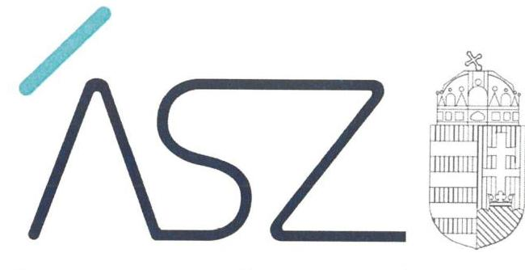
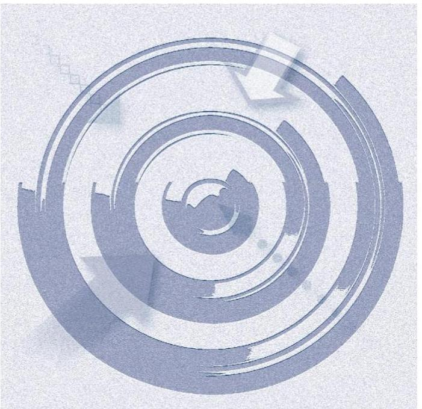
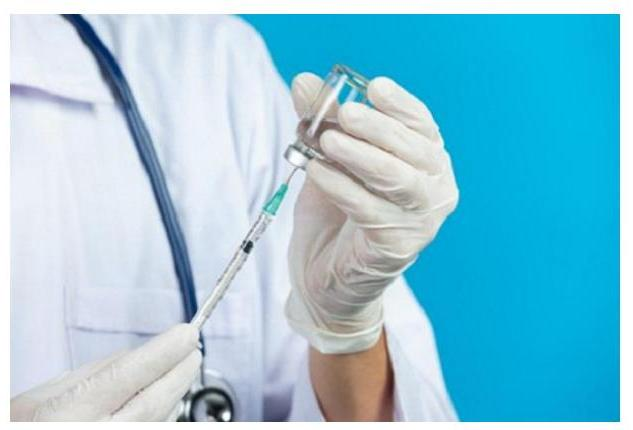
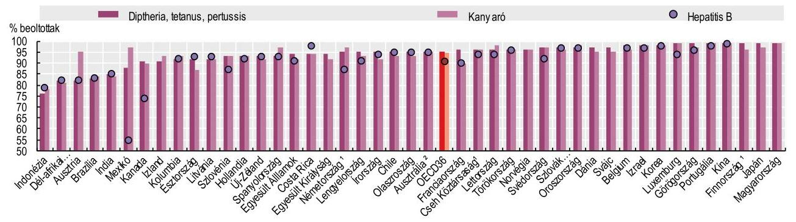
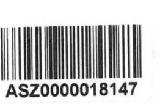
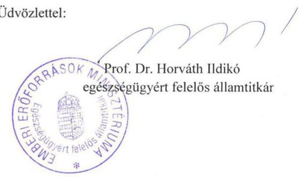

ÁLLAMI SZÁMVEVŐSZÉK

# JELENTÉS 

A lakosság védelme a fertőző betegségekkel szemben
2021.

21063
www.asz.hu

---

ÁLLAMI SZÁMVEVŐSZÉK

# JELENTÉS 

A lakosság védelme a fertőző betegségekkel szemben
2021. 07. hó 06. nap

21063
www.asz.hu

---

# AZ ELLENŐRZÉST FELÜGYELTE: 

DR. PULAY GYULA felügyeleti vezető
LAJŐ ADRIENN ellenőrzésvezető

AZ ELLENŐRZÉST VEZETTE ÉS A VÉGREHAJTÁSÁÉRT FELELŐS:
BAJNAI ZSUZSANNAellenőrzésvezető
SZAPPANOS JÚUA ellenőrzésvezető

A PROGRAM ÖSSZEÁLLÍTÁSÁÉRT FELELŐS:
FEKETE-NAGY ANDRÁS projektvezető
HORVÁTH TÍMEA projektvezető

Jelentéseink az Országgyúlés számítógépes hálózatán és az interneten a www.asz.hu címen is olvashatóak.

IKTATÓSZÁM: EL-3263-001/2021.
TÉMASZÁM: 2544
ELLENŐRZÉS-AZONOSÍTÓ SZÁM: V-0888

---

# TARTALOMJEGYZÉK 

- ÖSSZEGZÉS ..... 5
- AZ ELLENŐRZÉS CÉLJA ..... 6
- AZ ELLENŐRZÉS TERÜLETE ..... 7
- AZ ELLENŐRZÉS HÁTTERE, INDOKOLTSÁGA ..... 9
- A JELENTÉS LÉNYEGES KÉRDÉSKÖREI. ..... 10
- AZ ELLENŐRZÉS HATÓKÖRE ÉS MÓDSZEREI. ..... 11
- MEGÁLLAPÍTÁSOK ..... 13
- MELLÉKLETEK. ..... 21
I. sz. melléklet: Értelmező szótár ..... 21
- FÜGGELÉK: ÉSZREVÉTELEK ..... 23
- RÖVIDÍTÉSEK JEGYZÉKE ..... 31

---

.

---

# ÖSSZEGZÉS 

A népegészségügyi feladatok ellátása keretében kialakított rendszerek 2018-2019. években biztositották a lakosság fertőző betegségekkel szembeni védettségének feltételeit. A kötelező védőoltások rendszerének müködtetése szabályszerű és eredményes volt.

## Az ellenőrzés társadalmi indokoltsága

Az Alaptörvény XX. cikk (1) bekezdése rögzíti, hogy mindenkinek joga van a testi és lelki egészséghez. A népegészségügyi feladatok ellátása, ezen belül a védőoltási rendszer müködtetése közfeladat. A járványok megelőzésé nek egyik legfontosabb eszköze a védőoltások rendszere. Az ellátásban közreműködő szervezetek (EMMI, NNK) működésükhöz közpénzt használnak fel. Az ÁSZ törvényben biztosított joga a közpénzekkel történő felelős gazdálkodás ellenőrzése. Az oltási programok helyzete egyre bizonytalanabb Európában a védőoltások alacsony szintű igénybevétele, a védőoltásokkal kapcsolatos bizalmatlanság, az új oltóanyagok növekvő költségei, valamint az oltóanyag-gyártás és ellátás terén mutatkozó hiány miatt. Az Európai Unió egyes országaiban nem megfelelő az oltottsági arány, több országban alakult ki járványos megbetegedés (pl. kanyaró) az elmúlt években. Emellett a migráció, az utazási kedv növekedése, az oltásellenes mozgalmak, a klímaváltozás hatásai emelik a járványügyi kockázatot. A védőoltási rendszer megfelelő működése, a lakosság fertőző betegségekkel szembeni védettsége hosszú távon pozitív hatást gyakorol a költségvetés egyensúlyára, mivel a betegség megelőzése kevesebb közpénzt igényel, mint a betegség kezelése, leküzdése. Így a védőoltási rendszer megfelelő működése hosszú távon közvetve hozzájárul a gazdasági növekedéshez, a versenyképesség szinten tartásához, hiszen a fertőző betegségek elleni védettséggel rendelkező munkavállalók betegség miatti munkaidő kiesése jóval kevesebb, mint az oltásban nem részesülő munkavállalóké.
2019. évben a szlovák számvevőszék a kialakult járványos megbetegedések és a nem megfelelő oltottsági arány témára irányuló nemzetközi kooperatív ellenőrzést kezdeményezett. A nemzetközi együttműködésben végzett ellenőrzések az ellenőrzési tapasztalatok megosztásával hozzájárulnak a nemzetközi tudásmegosztáshoz, jó gyakorlatok bemutatásához. A kezdeményezéshez az ÁSZ is csatlakozott, és az ellenőrzés során az 2018-2019. éveket értékelte. A koronavírus-járvány különös jelentőséget adott az ellenőrzésnek, hiszen a pandémia miatti egészségügyi veszélyhelyzet és annak gazdasági hatásai eddig nem látott kihívások elé állították a világot az élet szinte minden területén.

## Főbb megállapítások, következtetések

Az egészségügyért felelős minisztérium az ellenőrzött 2018-2019. évekre vonatkozóan rendelkezett irányelvekkel, eljárásrendekkel a lakosság fertőző betegségek elleni védettségének kialakítására. A környezet-egészségügyi és a járványügyi biztonság megőrzése érdekében az EMMI 2015 januárjában elkészítette, a Kormány jóváhagyta az „Egészséges Magyarország 2014-2020" Egészségügyi Ágazati Stratégiát, amelyben az öt fő prioritás egyikeként rögzítette a népegészségügyi prioritást jelentő beavatkozásokat, azon belül a járványügyi biztonság erősítését, valamint a védőoltási rendszer fenntartását és folyamatos korszerűsítését. A Kormány 2016 decemberében elfogadta a szakpolitikai stratégia végrehajtása érdekében készített cselekvési tervet.

Az egészségügyi ellátórendszer szakmai-módszertani fejlesztése érdekében az EMMI országos tisztifőorvosi feladatokért felelős helyettes államtitkára, majd 2018. október 1-től az országos tisztifőorvos módszertani leveleket adott ki a 2018. és 2019. évi védőoltási tevékenységre vonatkozó szakmai ismeretekről, feladatokról, előírásokról és ajánlásokról, valamint az egészségügyi ellátással összefüggő fertőzések megelőzése érdekében.

A járványügyi feladatok vonatkozásában az EMMI szervezeti és működési kereteinek kialakítása szabályszerűen történt, míg az NNK szervezeti és működési kereteinek kialakítása 2019. június 7-től volt szabályszerű.

Az EMMI, illetve az NNK elvégezte az ország járványügyi helyzetének értékelését, az oltóanyagok rendelkezésre állásával, a védőoltási tevékenység gyakorlati végrehajtásának meg határozásával kapcsolatos feladatainak eleget tett. A védőoltási rendszer működtetése szabályszerű és eredményes volt, a védőoltások hozzájárultak a tömeges megbetegedések elkerüléséhez a 2018. és 2019. években.

---

# AZ ELLENŐRZÉS CÉLJA

**AZ ELLENŐRZÉS CÉLJA** annak megállapítása volt, hogy a kialakított rendszerek a 2018-2019. években biztosították-e a lakosság fertőző betegségekkel szembeni védettségét, az eddig ritkán előforduló, illetve elő nem forduló fertőző betegségek okozta veszélyek elhárítását, különös tekintettel a jelenlegi intenzív népességmozgásra és a klímaváltozás hatásaira. Ezen túlmenően az ellenőrzés célja volt annak értékelése is, hogy a védőoltási rendszer eredményesen működött-e.

---

# AZ ELLENŐRZÉS TERÜLETE 

## Emberi Eröforrások Minisztériuma, Nemzeti Népegészségügyi Központ

A fertőző betegségekkel szembeni védelem megszervezése, az oltásokkal megelőzhető fertőző betegségek, járványok megelőzése érdekében szükséges előírásokat az egészségügyrơl szóló 1997. évi CLIV. törvény¹(Eütv), valamint a fertőző betegségek és járványok megelőzése érdekében szükséges járványügyi intézkedésekről szóló 18/1998. (VI. 3.) NM rendelet² határozza meg.

Magyarországon életkorhoz kötötten 12 fertőzőbetegség esetében kötelező a védőoltás alkalmazása. E kötelező védőoltásokat - a hepatitis B kivételével - a 0-6 éves korúak körében folyamatos oltási rendben hajtják végre. Hatéves kor felett a védőoltások kampányoltás formájában történnek meg. Az életkorhoz kötött kötelező védőoltások mellett egyéb kötelező védőoltásokat is meghatároz az Eütv., ezek többek között a megbetegedési veszély esetén kötelező oltások, amelyeket jellemzően a megbetegedés diagnosztizálásakor a beteg környezetében élőknek adják. A munkakörökhöz kapcsolódó védőoltásokról a munkáltató köteles gondoskodni, ha a dolgozók foglalkozása miatt fokozottan fennáll egyes fertőző betegségek veszélye. A kötelező védőoltások mellett önkéntes jelentkezés alapján aktív immunizálásban lehet részesíteni azokat, akiknek például sporttevékenységük, egészségi állapotuk miatt egyes betegségek vonatkozásában magasabb a kockázatuk.

Az EMMI ${ }^{3}$ a fertőző betegségek megelőzésének és leküzdésének irányításával, illetve felügyeletével kapcsolatos jogkörét - 2018. szeptember 30ig - az egészségügyért felelős államtitkár irányítása alá tartozó országos tisztifőorvosi feladatokért felelős helyettes államtitkár, míg - 2018. október 1-től - az országos tisztifőorvos útján látta el. Az Országos Közegészségügyi Intézet (OKI) elnevezése 2018. október 1. napján NNK4-ra változott, egyidejűleg az EMMI országos tisztifőorvosi feladatokért felelős helyettes államtitkára által irányított szervezeti egységek beolvadásos kiválással az NNK-ba beolvadtak. Az NNK-t az országos tisztifőorvos vezeti. A fővárosi és megyei kormányhivatal a jogszabályoknak megfelelően összehangolja és elősegíti a kormányzati feladatok területi végrehajtását.

Az egészségügyi ellátással összefüggő fertőzések megelőzéséről, e tevékenységek szakmai minimumfeltételeiről és felügyeletéről szóló 20/2009. (VI. 18.) EüM rendelet 14. § (1) bekezdés f) pontja szerint: Az országos tisztifőorvos az egészségügyi ellátással összefüggő fertőzések megelőzéséről módszertani leveleket dolgoz ki, amelyeket honlapján és az egészségügyért felelős miniszter által vezetett minisztérium hivatalos lapjában közzétesz.

Magyarország az adatok alapján kiemelkedően magas átoltottsági szinttel rendelkezik, amelyet az 1. ábra mutat be.

---

1. ábra

A diftéria, tetanusz és pertussis (DTP), kanyaró és hepatitis B ellen vakcinázott 1 éves gyermekek százalékos aránya 2018 (vagy a legközelebbi év)

1. DTP becsült adat. 2. Kanyaró bescsült adat.
Forrás: OECD Egészségügyi statisztikák 2019.

---

# AZ ELLENŐRZÉS HÁTTERE, INDOKOLTSÁGA 

A fertőző betegségek elleni védelem egyéni és társadalmi érdek is egyben. A fertőző betegségekkel szembeni védelem Magyarország esetében törvényi, illetve rendeleti szinten részletesen szabályozott.

Az egyes fertőző betegségek, járványok megelőzésének egyik legfontosabb eszköze a védőoltások rendszere. A vakcináknak köszönhetően számos fertőző betegség szinte már eltűnt, vagy igen ritkává vált. Az Európai Unió egyes országaiban nem megfelelő az oltottsági arány, az elmúlt évek időszakában több országban alakult ki járványos megbetegedés (pl. kanyaró). Emellett a migráció, az utazási kedv növekedése, az oltásellenes mozgalmak, a klímaváltozás hatásai emelik a járványügyi kockázatot. Magyarország a járványok leküzdésében jelenleg Európa élmezőnyébe tartozik, ugyanakkor a járványügyi kockázatok hazánkra is érvényesek.

Az egészség és a jóllét harmadik célként szerepel az ENSZ Közgyűlés által 2015-ben elfogadott fenntarthatósági célkitűzések, a Fenntartható Fejlődési Keretrendszer 2030 céljai között, amelyek teljesülését a legfőbb ellenőrző intézmények nemzetközi szakmai szervezete, az INTOSAI is prioritásnak tekinti.

Az ÁSZ a lakosság fertőző betegségekkel szembeni védelmére irányulóan a területet átfogó ellenőrzést még nem végzett.

---

# A JELENTÉS LÉNYEGES KÉRDÉSKÖREI 

1.     - Az EMMI meghatározott-e irányelveket, eljárásrendet a lakosság fertőző betegségek elleni védettségének kialakítására, járványügyi veszélyhelyzetekre vonatkozóan?
2.     - A járványügyi feladatok vonatkozásában az EMMI és az NNK szervezeti és müködési kereteinek kialakítása szabályszerűen történt-e?
3.     - Az EMMI, illetve az NNK értékelte-e az ország járványügyi helyzetét?
4.     - A védőoltási rendszer müködtetése szabályszerű volt-e?
5.     - A védőoltások rendszere eredményesen hozzájárult-e a tömeges megbetegedések elkerüléséhez?

---

# AZ ELLENŐRZÉS HATÓKÖRE ÉS MÓDSZEREI 

## Az ellenőrzés típusa

| Megfelelőségi és teljesítmény-ellenőrzés.

## Az ellenőrzött időszak

| 2018-2019. évek

## Az ellenőrzés tárgya

Az EMMI járványügyi veszélyhelyzetekre, valamint a lakosság fertőző betegségek elleni védettségének kialakítására vonatkozó stratégiaalkotási tevékenysége. Az EMMI és az NNK járványügyi feladatokra vonatkozó szervezeti és múködési kereteinek kialakítása, a védőoltási rendszer múködtetése, a védőoltási rendszer múködtetésének eredményessége.

## Az ellenőrzött szervezet

| Emberi Erőforrások Minisztériuma, Nemzeti Népegészségügyi Központ

## Az ellenőrzés jogalapja

Az ellenőrzés jogszabályi alapját az Állami Számvevőszékről szóló 2011. évi LXVI. törvény 1. § (3) bekezdése, valamint 5. § (2) bekezdésének előírásai képezik.

## Az ellenőrzés módszerei

Az ÁSZ az ellenőrzést az ellenőrzési program szempontjai, az ellenőrzött időszakban hatályos jogszabályok, az ellenőrzés szakmai szabályai, a jelen ellenőrzésre irányadó ÁSZ módszertanok figyelembevételével hajtja végre.

Az ellenőrzési kérdések megválaszolásához szükséges bizonyítékok megszerzése az ellenőrzött által rendelkezésre bocsátott dokumentumokra, adatokra alapozva megfigyelés, szemle (szemrevételezés), kérdésfeltevés (információkérés), valamint elemző eljárás útján történik. Az ellenőrzési bizonyítékként felhasználható adatforrások közé tartoznak az ellenőrzési program részletes szempontjainál felsorolt adatforrások, valamint minden egyéb - az ellenőrzés folyamán feltárt, az ellenőrzés szempontjából információt tartalmazó - dokumentum.

---

Az ellenőrzést a megjelölt adatforrások, továbbá az adott időszakban hatályos jogszabályok, valamint az ÁSZ honlapján közzétett helyénvalósági kritériumok figyelembevételével folytatta le az ÁSZ. Az utóbbiakra vonatkozó értékelések a jelentésben dőlt betüvel szerepelnek.

A teljesítmény-ellenőrzés keretében eredményességi szempontok alapján történt annak megítélése, hogy a kötelező védőoltással megelőzhető fertőző betegségek esetében a tömeges megbetegedések elkerüléséhez szükséges célokat meghatározták-e, továbbá, hogy a kötelező védőoltásokkal elérték a tömeges megbetegedések elkerülését biztosító oltottsági arányt.

Az ellenőrzés lefolytatásához az ellenőrzött szervezet az ÁSZ által kért dokumentumok megküldésével szolgáltat adatokat, amelyek valódiságát és teljes körűségét az ellenőrzött szervezet vezetője által tett teljességi és hitelességi nyilatkozat igazolja. A rendelkezésre bocsátott adatok, információk kontrollja az ellenőrzés keretében történik.

Az ellenőrzés ideje alatt az ellenőrzött szervezettel történő kapcsolattartást az ÁSZ SZMSZ-ének vonatkozó előírásai alapján biztosított.

---

# 1. Az EMMI meghatározott-e irányelveket, eljárásrendet a lakosság fertőző betegségek elleni védettségének kialakítására, járványügyi veszélyhelyzetekre vonatkozóan? 

Összegző megállapítás

Az EMMI meghatározta az irányelveket, eljárásrendeket a lakosság fertőző betegségek elleni védettségének kialakítására.
1.1. számú megállapítás

Az EMMI az ellenőrzött időszakra vonatkozóan rendelkezett irányelvekkel, eljárásrendekkel a védőoltási rendszer fenntartására, a járványügyi biztonság erősítésére, valamint annak folyamatos korszerűsítésére.

Az EMMI jogelődje (Nemzeti Erőforrás Minisztérium) által a 2011. évben készített Semmelweis Terv ${ }^{5}$ a magyar lakosság egészségi állapotával kapcsolatos helyzetértékelés és az azonosított egészségügyi strukturális és funkcionális problémák alapján a környezet-egészségügyi és a járványügyi biztonság megőrzésére tett intézkedési javaslatot.

Ennek megvalósulása érdekében az EMMI 2015 januárjában elkészítette az „Egészséges Magyarország 2014-2020" Egészségügyi Ágazati Stratégiát ${ }^{6}$, amelyet az 1039/2015. (II.10) Korm. határozat fogadott el.

A szakpolitikai stratégiában az öt fő prioritás egyikeként rögzítették a népegészségügyi prioritást jelentő beavatkozásokat, azon belül a járványügyi biztonság erősítését, valamint a védőoltási rendszer fenntartását és folyamatos korszerűsítését.

Az „Egészséges Magyarország 2014-2020" Egészségügyi Ágazati Stratégia 2017-2018 évekre vonatkozó cselekvési tervéről szóló 1886/2016. (XII. 28.) Korm. határozat ${ }^{7}$ az 5. Stratégiai pillér: Specifikus népegészségügyi célkitűzések között előírta az EMMI részére a járványügyi és a környezet-egészségügyi biztonság fejlesztését.

Az egészségügyi ellátórendszer szakmai-módszertani fejlesztése érdekében az EMMI országos tisztifőorvosi feladatokért felelős helyettes államtitkára, majd 2018. október 1-től az országos tisztifőorvos módszertani levelet ${ }^{8}$ adott ki a 2018. és 2019. évi védőoltási tevékenységre vonatkozó szakmai ismeretekről, feladatokról, előírásokról és ajánlásokról, valamint az egészségügyi ellátással összefüggő fertőzések megelőzése érdekében.

---

1.2. számú megállapítás

Az EMMI által kidolgozott stratégiai tervdokumentumok a 2019. évre nem tartalmaztak a népességmozgás, illetve a klímaváltozás emberi egészségre, fertőző betegségek terjedésére gyakorolt hatásának kezelésére vonatkozó irányelveket, eljárásrendeket, ugyanakkor e szempontok 2020. évben véglegezett jelentésben és összefoglalóban történő figyelembevételével a területek stratégiai irányítása a jövőre nézve a tervdokumentumokban biztosított.

Az EMMIáltal kidolgozott stratégiai tervdokumentumok nem tartalmaztak az ellenőrzött időszakra vonatkozóan a népességmozgás, illetve a klímaváltozás emberi egészségre, fertőzőbetegségek terjedésére gyakorolt hatásának kezelésére vonatkozó külön irányelveket, eljárásrendeket. Meghatározó azonban, hogy az EMMI által az ellenőrzés rendelkezésére bocsátott I. Éghajlatváltozási Cselekvési Tervdokumentum egy tágabb időintervallumot magába foglaló folyamat részét képezi, amely az Európai Uniós irányelveknek megfelelő kötelezettségek teljesítésére vonatkozóan 3 éves időintervallumot jelent.
A „Magyarország nemzeti katasztrófakockázat-értékelésének összefoglalója" és a „Nemzeti katasztrófakockázat-értékelésről szóló jelentés" címü dokumentumok a jövőre nézve tartalmaznak a népességmozgás és a klímaváltozás emberi egészségre, fertőző betegségek terjedésére gyakorolt hatásának felülvizsgálatát és a lehetséges egészségügyi ágazati, szakpolitikai stratégiákra való utalásokat is. Az EMMI részéről a 2018. évben benyújtott és a 2019. évben végzett érdemi felülvizsgálat eredményeként kidolgozott jelentést és összefoglalót 2020-ban véglegezték és küldték meg a Bizottság részére.
1.3. számú megállapítás

Az EMMI az egészségügyi válsághelyzet-kezelési résztervek összegyűjtésével és jóváhagyásával járult hozzá a járványügyi veszélyhelyzetek, az eddig ritkán, vagy sosem előforduló fertőző betegségek elhárításához.

Az 521/2013. (XII. 30.) Korm. rendelet meghatározza az egészségügyi válsághelyzeti ellátásra történő felkészülés és az egészségügyi válsághelyzet kezelésének részletes szabályait, azon belül - a 10. § (5) bekezdése szerint az Eütv. 232. § (2) bekezdésében meghatározott tervek és a vonatkozó szakmai előírások alapján - az egészségügyi válsághelyzetkezelési tervek készítésének kötelezettségét és annak eljárásrendjét. Az EMMI a Kormányhivatalok által elkészített egészségügyi válsághelyzetkezelési (fővárosi és megyei) részterveket összegyűjtötte és jóváhagyta.

---

# 2. A járványügyi feladatok vonatkozásában az EMMI és az NNK szervezeti és müködési kereteinek kialakítása szabályszerűen történt-e? 

Összegző megállapítás

A járványügyi feladatok vonatkozásában az EMMI szervezeti és müködési kereteinek kialakítása szabályszerűen történt, míg az NNK szervezeti és müködési kereteinek kialakítása 2019. június 7-től szabályszerűen történt.

Az Ávrányügyi feladatok vonatkozásában az EMMI szervezeti és működési kereteinek kialakítása szabályszerűen történt.

Az EMMI az SZMSZ ${ }^{9}$-ében - az Ávr. ${ }^{10}$ 13. § (1) bekezdés e) és g) pontjai, valamint a 18/1998. (VI. 3.) NM rendelet 2. § (1) bekezdése előírásaival összhangban - meghatározta a járványügyi feladatok elvégzéséért felelős szervezeti egységet, annak felépítését, működési rendjét, a feladat- és hatásköröket, a hatáskörök gyakorlásának módját, a helyettesítés rendjét és az ezekhez kapcsolódó felelősségi szabályokat.
2.2. számú megállapítás

Az NNK szervezeti és müködési kereteinek kialakítása 2019. június 7-től szabályszerűen történt.

Az EMMI az Áht. ${ }^{11}$ 9. § a) pontja előírásaival összhangban 2018. október 1i hatállyal kiadta az NNK alapító okiratát ${ }^{12}$ a 2018. szeptember 30-ig az OKI ${ }^{13}$ és az EMMI országos tisztifőorvosi feladatokért felelős helyettes államtitkára által irányított szervezeti egységek feladatkörébe tartozó feladatokra vonatkozóan.

Az NNK az Áht. 10. § (5) bekezdésében foglaltak ellenére 2018. október 1. és 2019. június 6. közötti időszakban nem rendelkezett az EMMIáltal jóváhagyott szervezeti és müködési szabályzattal. Az NNK 2018. október 26-tól 2019. június 6-ig az országos tisztifőorvosáltal kiadmányozott ideiglenes müködési rendek ${ }^{14}$ alapján müködött, amelyek tartalma megfelelt az Ávr. 13. § (1) bekezdés c), e) és g) pontjaiban előírtaknak.

A 2019. június 7-től hatályos, jóváhagyott NNK SZMSZ ${ }^{15}$ szabályszerű volt.

---

# 3. Az EMMI, illetve az NNK értékelte-e az ország járványügyi helyzetét? 

## Összegző megállapítás

Az EMMI, illetve az NNK értékelte az ország járványügyi helyzetét.
3.1. számú megállapítás

Az EMMI járványügyi feladatok elvégzéséért felelős szervezeti egysége 2018. szeptember 30-ig értékelte az ország járványügyi helyzetét.

Az országos tisztifőorvosi feladatokért felelős helyettes államtitkár értékelte az ország járványügyi helyzetét. Az értékeléssel eleget tett az EMMI 2018. január 1. és 2018 szeptember 30. között hatályos SZMSZ ${ }_{1,2,3}$ előírásainak.

Az EMMI járványügyi feladatok elvégzéséért felelős szervezeti egysége az SZMSZ ${ }_{1,2,3}$ előírásai szerint elemezte és nyilvántartotta a járványok, valamint a bejelentésre kötelezett fertőző betegségek adatait, azokról rendszeres adatszolgáltatást nyújtott az országos tiszti főorvosi feladatokért felelős helyettes államtitkár részére. Ennek keretében elkészítették a járványügyi tevékenység jelentését.

Az országos tiszti főorvos 2018-ban módszertani levelet adott ki a WHO infekciókontroll-kockázatértékelő rendszerére alapozva az egészségügyi ellátással összefüggő fertőzések megelőzésének és felügyeletének megerősítésére intézményi és egyéni kockázat értékelésen keresztül.
3.2. számú megállapítás

Az NNK 2018. október 1-jétől értékelte az ország járványügyi helyzetét.

Az országos tisztifőorvos a 385/2016. (XII. 2.) Korm. rendelet ${ }^{16}$ előírásainak eleget téve értékelte, az ország járványügyi helyzetét. A járványügyi feladatok elvégzéséért felelős szervezeti egység gyüjtötte, nyilvántartotta és elemezte a járványok, valamint a bejelentésre kötelezett fertőző betegségek adatait.

Az NNK adatot szolgáltatott a fertőző betegségekről és a védőoltásokról az egészségügyi kormányzati szervek részére. Az NNK tájékoztatást adott az aktuális járványügyi helyzetről, az e körben felmerült kérdésekről, az előidéző tényezőkről és azok várható következményeiről, továbbá a megoldás lehetőségeiről.

Az NNK elkészítette a 2019. évi járványügyi tevékenységről szóló jelentést.

A fertőzéseket előidéző tényezőkről, azok következményeiről és azok csökkentésének lehetőségeiről szakmai módszertani leveleket készített az országos tisztifőorvos.

---

# 4. A védőoltási rendszer működtetése szabályszerű volt-e? 

## Összegző megállapítás

### 4.1. számú megállapítás

## A védőoltási rendszer múködtetése szabályszerű volt.

Az EMMI, illetve az NNK eleget tett az oltóanyagok rendelkezésre állásával, a védőoltási tevékenység gyakorlati végrehajtásának meghatározásával kapcsolatos feladatainak.

Az EMMI, valamint 2018. október 1-jétől az NNK járványügyi feladatok elvégzéséért felelős szervezeti egységei a 18/1998. (VI.3.) NM rendelet és az EMMI SZMSZ1.6 előírásai szerint gondoskodtak a kötelező védőoltások végrehajtásához szükséges oltóanyagok országos mennyiségének megtervezéséről és minőségi jellemzőinek meghatározásáról. Elkészítették továbbá az életkorhoz kötötten kötelező, valamint a megbetegedési veszély esetén alkalmazandó védőoltások biztosítása érdekében a hazai oltóanyag 2018. és 2019. évekre vonatkozó beszerzési terveit.

Az országos tisztifőorvos a 18/1998. (VI.3.) NM rendelet előírása szerint gondoskodott az életkorhoz kötötten kötelező, valamint a megbetegedési veszély esetén alkalmazandó védőoltások biztosításához szükséges oltóanyagok beszerzéséről.

Az oltóanyagok készletgazdálkodása az OSZIR ${ }^{17}$ védőoltási és oltóanyag logisztikai alrendszerén keresztül valósult meg.

Az EMMI, illetve az NNK a védőoltási tevékenység gyakorlati végrehajtásához szükséges ismereteket 2018. és a 2019. évekre vonatkozóan meghatározta, az országos tiszti főorvos az EMMI SZMSZ1.6 előírása szerint mindkét évre vonatkozóan a 18/1998. (VI.3.) NM rendeletben előírt tartalommal kiadta a Védőoltási Módszertani Levelet.

Az EMMI, illetve az NNK eleget tett a védőoltási tevékenység gyakorlati végrehajtásával kapcsolatos feladatainak.

Az EMMI, valamint 2018. október 1-jétől az NNK járványügyi feladatok elvégzéséért felelős szervezeti egységei elemezték az oltások teljesítését, elvégezték a lakosságra vonatkozó átoltottság elemzését, értékelését, a kormányhivatalok munkájának értékelését, ezen belül a megyei és kerületi járványügyi tevékenységet, az életkorhoz kötött kötelező oltások teljesítésének megyénkénti alakulását.

Az EMMI, illetve 2018. október 1-jétől az NNK intézkedésekettett a járványok elterjedésének csökkentése érdekében. Ennek keretében szakmai anyagokban/állásfoglalásokban/tájékoztatókban/oktatási anyagokban, illetve különböző rendezvényeken felhívták az érdekeltek (lakosság, szülők, védőnők, tanárok, orvosok) figyelmét az állatok (tetü, szúnyog, kullancs, rágcsáló) által terjesztett betegségek okaira, veszélyeire, illetve azok megelőzése érdekében szükséges teendőkre, a higiénés szabályok betartásának fontosságára.

---

# 5. A védőoltások rendszere eredményesen hozzájárult-e a tömeges megbetegedések elkerüléséhez? 

Összegző megállapítás

A védőoltások rendszere eredményesen hozzájárult a tömeges megbetegedések elkerüléséhez a 2018. és a 2019. években.
5.1. számú megállapítás

Az EMMI a 2018. évre, illetve az NNK a 2019. évre vonatkozóan meghatározta a kötelező védőoltással megelőzhető fertőző betegségek esetében a tömeges megbetegedések elkerüléséhez szükséges célokat.

Az EMMI 2015 januárjában elkészítette az „Egészséges Magyarország 2014-2020" Egészségügyi Ágazati Stratégiá"-t, amelyben a Specifikus népegészségügyi célkitűzések elérése területén meghatározott öt fő prioritás közül az V. prioritás, a További népegészségügyi prioritást jelentő beavatkozások keretében határozták meg részcélként a járványügyi biztonság erősítését és a védőoltási rendszer fenntartását és folyamatos korszerűsítését.

Az EMMI országos tisztifőorvosi feladatokért felelős helyettes államtitkára, majd 2018. október 1-től az országos tisztifőorvos a Stratégiában megfogalmazott általános céloknak megfelelően a 2018-2019. években egyezően nyolc-nyolc célt határozott meg: immunizáció életkorhoz kötötten, aktív-passzív immunizáció elérése, specifikus profalixis és az aspecifikus védelem biztosítása, munkakörökhöz kötött megbetegedési veszély csökkentése, a megbetegedések súlyosságának, valamint a halálozások számának csökkentése, megfelelő oltóanyag biztosítása, az oltások rendezett lebonyolítása és az egyéb oltóanyagokkal történő oltások biztosítása az aktív és passzív immunizáció elérése egyéb oltóanyagokkal történő oltások által.

A célokhoz mennyiségi (oltás típusok, oltások darabszáma, költsége) és mi-nőségi (beszerzési eljárás lépései, tárolási hőmérséklet) kritériumokat rendeltek, meghatározták azok elérni kívánt célértékeit és a megvalósítási ha-táridőt, amelyek a kötelező oltások esetében az életkor, a páciens egészségi állapotának a függvénye, a kampányoltások esetében az oltási naptár tartalmazta a határidőt az adott éven belül.

## 5.2. számú megállapítás

A védőoltással megelőzhető fertőző betegségek esetében a védőoltások hozzájárultak a tömeges megbetegedések elkerüléséhez a 2018. és 2019. években.

A 2018. évről 2019. évre a fertőző megbetegedések a védőoltással megelőzhető 12 betegségből 11 esetben nem nőttek, az egyetlen kivétel a bárányhimlő volt, azonban a bárányhimlő esetében az ajánlott oltás kötelezővé lett téve a 2018. július 31-e után születettek esetében.

A 2018. és a 2019. években az oltásra kötelezett korosztály az egyes életkorhoz kötött kötelező védőoltások legalább 99,6\%-ában részesült. A 14 féle kötelező védőoltás ${ }^{18}$ tekintetében a védőoltások több, mint felénél 99,8-99,9\%-os volt a beoltottsági arány.

---

A védőoltási rendszerben teljesített védőoltások százalékos arányát a 2. ábra mutatja be.
2. ábra

Életkorhoz kötött kötelező oltások teljesitése Magyarország, 2019

| Oltás megnevezése | Védőoltások teljesitési aránya (\%) |  |
| :--: | :--: | :--: |
|  | 2018 | 2019 |
|  | évben |  |
| BCG | 99,8 | 99,8 |
| DTPa +IPV +Hib (2 hó) | 99,9 | 99,9 |
| PCV (2 hó) | 99,9 | 99,9 |
| DTPa +IPV +Hib (3 hó) | 99,9 | 99,9 |
| DTPa +IPV +Hib (4 hó) | 99,9 | 99,9 |
| PCV (4 hó) | 99,8 | 99,8 |
| PCV (12 hó) | 99,9 | 99,8 |
| MMR (15 hó) | 99,9 | 99,9 |
| DTPa +IPV +Hib (18 hó) | 99,6 | 99,6 |
| DTPa+IPV (6 éves) | 99,6 | 99,6 |
| MMR újracitás | 99,7 | 99,8 |
| dTap | 99,8 | 99,7 |
| Hepatitis B I | 99,8 | 99,8 |
| Hepatitis B II | 99,7 | 99,8 |

Forrás: NNK adatok

---

.

---

# MELLÉKLETEK 

I. SZ. MELLÉKLET: ÉRTELMEZŐ SZÓTÁR
fertőző betegség
járvány
kockázat
védőoltás
veszélyhelyzet
specifikus fertőző ágensek vagy azok toxikus termékei által okozott megbetegedés, amelyet adott kórokozónak vagy termékének egy fertőzött személyből, állatból vagy rezervoárból egy arra fogékony gazdaszervezetbe való közvetett vagy közvetlen átjutása hoz létre (forrás: NM rendelet 3/A § 5. pont)
egy adott fertőző betegségnek a vártnál szignifikánsan gyakoribb vagy egy meghatározott küszöbszintet meghaladó előfordulása egy adott területen, illetve közösségben, egy meghatározott időtartam alatt, vagy legalább két egymással összefüggő eset, amely összefüggés járványügyi bizonyítékkal alátámasztható (forrás: NM rendelet 3/A § 9. pont)
a kockázat annak a valószínűségét jelenti, hogy egy vagy több esemény vagy intézkedés nem kívánt módon befolyásolja a rendszer működését, céljainak megvalósulását. (Forrás: Javaslatok a korrupciós kockázatok kezelésére - Kockázatkezelési és ellenőrzési módszertan 35. oldal, ÁSZ)
olyan egészségügyi tevékenység, amelynek során oltóanyagot juttatnak a szervezetbe aktív vagy passzív immunizálás céljából, melynek segítségével az adott betegség elleni specifikus védettség kialakítható és fokozható (forrás: NM rendelet 3/A § 19. pont)
a Kormány az élet- és vagyonbiztonságot veszélyeztető elemi csapás vagy ipari szerencsétlenség esetén, valamint ezek következményeinek az elhárítása érdekében veszélyhelyzetet hirdet ki, és sarkalatos törvényben meghatározott rendkívüli intézkedéseket vezethet be. (forrás: Alaptörvény 53. cikk (1) bekezdés
A veszélyhelyzet az Alaptörvény 53. cikkében meghatározott olyan helyzet, amelyet különösen a következő események válthatnak ki:
c) egyéb eredetű veszélyek, különösen:
ca) tömeges megbetegedést okozó humánjárvány vagy járványveszély, valamint állatjárvány (forrás: 2011. évi CXXVIII. törvény ${ }^{19}$ 44. § ca) pont

---

.

---

# FÜGGELÉK: ÉSZREVÉTELEK 

A jelentéstervezetet a Számvevőszék 15 napos észrevételezésre megküldte az ellenőrzött szervezetek vezetőinek az ÁSZ tv. 29. §* (1) bekezdése előírásának megfelelően.

Az Emberi Erőforrások Minisztériuma a jelentéstervezet megállapításaira észrevételt tett. A Nemzeti Népegészségügyi Központ a jelentéstervezet megállapításaira nem tett észrevételt. Az ÁSZ tv. 29. § (3) bekezdésével összhangban az ÁSZ a Függelékben feltünteti a jelentéstervezet megállapításaival kapcsolatban tett, figyelembe nem vett észrevételeket, és megindokolja, hogy azokat miért nem fogadta el.

[^0]
[^0]:    * 29. § (1) Az Állami Számvevőszék az ellenőrzési megállapításait megküldi az ellenőrzött szervezet vezetőjének vagy az általa megbízott személynek, és annak, akinek személyes felelősségét állapította meg.
    (2) Az ellenőrzött szervezet vezetője és a felelősként megjelölt személy az ellenőrzés megállapításaira tizenöt napon belül írásban észrevételt tehet.
    (3) Az Állami Számvevőszék az észrevételre a beérkezésétől számított harminc napon belül írásban válaszol. A figyelembe nem vett észrevételeket köteles a jelentésben feltüntetni, és megindokolni, hogy azokat miért nem fogadta el.

---

# EMBERI ERÖFORRÁSOK MINISZTÉRIUMA 

Iktatószám: II//5033-1/2021/ATEF
Hiv. szám: EL-2969-026/2021,
Melléklet: 1 db CD
Tárgy: Jelentéstervezet
véleményezése

## Domokos László Elnök Úr részére

Állami Számvevőszék
Budapest
Apáczai Csere János utca 10.
1052

ÁLLAMI SZÁMVEVÖSZÉK
BE-80515/2021/
Ghazett: 2021 JON 03.
tistószám:
tárgylet:

Tisztelt Elnök Úr!
A fent hivatkozott iktatószámon Prof. Dr. Kásler Miklós miniszter úrnak továbbított, „A lakosság védelme a fertőző betegségekkel szemben" című jelentéstervezetre vonatkozóan, illetékességből az alábbiakról tájékoztatom.

A jelentéstervezet az Emberi Erőforrások Minisztériuma által áttekintésre került, észrevételt annak 1.2. számú megállapításához kívánunk tenni.

Az ellenőrzés adatszolgáltatási szakaszában - tárgyban és a megjelölt időszakra vonatkozóan általunk megküldött I. Éghajlatváltozási Cselekvési Tervdokumentum és hozzá kapcsolódó észrevétel egy tágabb időintervallumot magába foglaló folyamat részét képezi, mivel az Európai Uniós irányelveknek megfelelő kötelezettségek teljesítése 3 éves időintervallumot foglal magába.Az időszak felülvizsgálati dokumentációjának megküldési határideje 2020. december 31. volt - így utólagosan, a jelentéstervezethez tudjuk csatolni az elfogadott, jóváhagyott értékelési dokumentumot, amely tartalmazza azon észrevételeket, stratégiákat, müködő irányelvekre és eljárásrendekre való utalásokat, ami a vizsgált időszakban is a folyamat részeként müködtek, illetve a meglévő müködő rendszerek folyamataiba beintegrálásra kerültek.

---

2014-ben elkészítette hazánk nemzeti katasztrófakockázat-értékelését (Ex Ante jelentés), amellyel a 2014-2020-as európai uniós pénzügyi időszak feljogosító feltételeit teljesítette az éghajlatváltozáshoz való alkalmazkodás és a kockázat-megelőzés előmozdítása címủ tematikus célkitüzésének és az ezzel kapcsolatos beruházások megvalósítása vonatkozásában.

Az Ex Ante jelentést az uniós polgári védelmi mechanizmusról szóló 1313/2013/EU (2013. december 17.) számú európai parlamenti és tanácsi határozat alapján 2015-ben megerősítettük, majd azt követően 2018-ban felülvizsgáltuk. Az egészségügyi ágazatnak részfeladatai voltak a dokumentummal kapcsolatban. A dokumentum a BM Országos Katasztrófavédelmi Főigazgatóság (továbbiakban: BM OKF) kezelésében van és azt a Katasztrófavédelmi Koordinációs Tárcaközi Bizottság hagyja jóvá.

A dokumentum 2020. évi felülvizsgált benyújtására a munka 2019-ben kezdődött és a felülvizsgálat során központi elemként kellett kezelni a klímaváltozás okozta katasztrófákat, illetve annak egészségügyi hatásait.

A koordináló minisztérium tárcaközi munkabizottságainak tagjaként vett részt az EMMI a dokumentumok elkészítésében, mely dokumentumok tartalmazzák a népességmozgás és a klímaváltozás emberi egészségre, fertőző betegségek terjedésére gyakorolt hatásának felülvizsgálatát és a lehetséges egészségügyi ágazati, szakpolitikai stratégiákra való utalásokat is.

1. Magyarország nemzeti katasztrófakockázat-értékelésének összefoglalója: 3. o. Bevezetés-összefoglaló a folyamat bemutatása, 10. o. 2. pont, 13. o. 18. pont, 22. o. 3.1. pont táblázat 2,3 része, 27. o. 4. pont, 32-33 o., 58. o. 14. pont, 61. o. 15. pont, 67. o. 17 pont, 77. o. 21 pont táblázat 2-3 része.
2. Nemzeti katasztrófakockázat-értékelésről szóló jelentés: 5. o. Bevezetés (8.o . 4. bekezdéstől-9. o.), 51. o. 2.1. pont (53. o. táblázat 4. része), 61. o. 4.1., 95. o. 2.7.3103. o. lap közepéig, 104. o. 2.8 táblázat 2-3. része, 118. o. 5. pont.

A dokumentum elfogadása 2019. év végén volt esedékes, azonban a Bizottság az új irányvonalakat (amelyet a dokumentumnak tartalmaznia kellett) csak 2019. decemberében küldte meg, így a dokumentum zárása 2020. februárjára tolódott, majd a koronavírus járvány kitörése miatt azt 2020 márciusában ismét megnyitották felülvizsgálatra.

A teljes, végleges dokumentum az adatszolgáltatás időpontjában nem állt rendelkezésre, így azt nem tartottuk célszerűnek benyújtani.

A koronavírus járvány második, harmadik hullámára tekintettel a Bizottság úgy döntött, hogy ismét megnyitja a dokumentumot és lehetőséget ad a tagállamok részére, hogy szükség esetén abban módosítást eszközöljenek a járvány tapasztalatai szerint. A BM OKF nemrégiben küldte

---

meg a teljes dokumentumot felülvizsgálatra, amelyet a csatolt CD-re írva ezúton nyújtunk át megtekintésre.

Összegezve: a csatolmányban szereplő iratok a 2018. évben benyújtott és a 2019. évben végzett érdemi felülvizsgálat eredményeként kidolgozott jelentés és összefoglaló, melyek 2020-ban kerültek véglegezésre és megküldésre a Bizottság részére, és melyek teljes, végleges változata 2021. áprilisában került továbbításra az ágazat részére (ismételt felülvizsgálat kérésével).

Budapest, 2021. C6. 04.

---

# Huszámé Borbás Melinda 

2021.06.30. 08:34

## 150 éve a közpénzek öre

ÁLLAMI SZÁMVEVÓSZÉK

Ikt. szám: EL-2969-028/2021.

Dr. Kásler Miklós István úr
miniszter

Emberi Eröforrások Minisztériuma

## Budapest

Tisztelt Miniszter Úr!
„A lakosság védelme a fertőző betegségekkel szemben" című ellenőrzés megállapításaira a 2021. június 1-jén kelt, II//5033-1/2021/ATEF iktatószámú levélben az egészségügyért felelős államtitkár által megküldött észrevételt megkaptam.

Az Állami Számvevőszék (továbbiakban: ÁSZ) észrevételre vonatkozó álláspontjáról az ellenőrzésvezető által készített részletes tájékoztatást csatoltan megküldöm.

Tájékoztatom Miniszter urat, hogy a számvevőszéki jelentésben - az Állami Számvevőszékről szóló 2011. évi LXVI. törvény (továbbiakban: ÁSZ tv.) 29. § (3) bekezdése alapján - a figyelembe nem vett észrevételt szerepeltetjük az elutasítás indokának feltüntetésével.

Budapest, 2021. 06. hónap 28. nap

Tisztelettel:

Domokos László s.k.

Melléklet: Tájékoztatás az észrevétel kezeléséről

---

# Tájékoztatás az észrevétel kezeléséről 

„A lakosság védelme a fertőző betegségekkel szemben" című ellenőrzés megállapításaira a 2021. június 1-jén kelt, II/5033-1/2021/ATEF iktatószámú levélben az Emberi Erőforrások Minisztériuma (továbbiakban: EMMI) egészségügyért felelős államtitkára által megküldött észrevételt áttekintettem. Az észrevétel kezeléséről az alábbi tájékoztatást adom.

A jelentéstervezet 1.2. megállapításában a stratégiai tervdokumentumokkal kapcsolatos megállapításra tett észrevételt az ÁSZ részben figyelembe veszi, a 2019. év vonatkozásában a megállapítást változatlanul helytállónak tartja, ugyanakkor a jövőre vonatkozó intézkedéseket megalapozottnak látja és azokkal a jelentéstervezetet kiegészíti.
Államtitkár úrhölgy észrevétele szerint az EMMI által az ellenőrzés rendelkezésére bocsátott I. Éghajlatváltozási Cselekvési Tervdokumentum egy tágabb időintervallumot magába foglaló folyamat részét képezi. Az Európai Uniós irányelveknek megfelelő kötelezettségek teljesítése 3 éves időintervallumot foglal magába, az időszak felülvizsgálati dokumentációjának megküldési határideje 2020. december 31-e volt, ezért utólagosan, a jelentéstervezethez tudják csatolni az elfogadott, jóváhagyott értékelési dokumentumot, amely tartalmazza azon észrevételeket, stratégiákat, müködő irányelvekre és eljárásrendekre való utalásokat, amelyek a vizsgált időszakban is a folyamat részeként müködtek, illetve a meglévő müködő rendszerek folyamataiba beintegrálásra kerültek.
A „Magyarország nemzeti katasztrófakockázat-értékelésének összefoglalója" és a „Nemzeti katasztrófakockázat-értékelésről szóló jelentés" címú dokumentumok tartalmazzák a népességmozgás és a klímaváltozás emberi egészségre, fertőző betegségek terjedésére gyakorolt hatásának felülvizsgálatát és a lehetséges egészségügyi ágazati, szakpolitikai stratégiákra való utalásokat is. A teljes, végleges dokumentum az adatszolgáltatás időpontjában nem állt rendelkezésre, így azt nem tartották célszerúnek benyújtani.
Az EMMI részéről a 2018. évben benyújtott és a 2019. évben végzett érdemi felülvizsgálat eredményeként kidolgozott jelentést és összefoglalót 2020-ban véglegezték és küldték meg a Bizottság részére. A teljes, végleges változata 2021. áprilisában került továbbításra az ágazat részére (ismételt felülvizsgálat kérésével).

Az ÁSZ az ellenőrzést az EL-2814-001/2020. iktatószámú ellenőrzési program szempontjai, az ellenőrzött 2018-2019. közötti időszakban hatályos jogszabályok, az ellenőrzés szakmai szabályai, a jelen ellenőrzésre irányadó ÁSZ módszertanok figyelembevételével hajtotta végre.
Az ÁSZ az EL-2969-001/2020. iktatószámú levél 3. melléklet 5. pontjában kérte be az EMMI-től az ellenőrzött 2018-2019. évekre vonatkozóan aláírt, hiteles dokumentumként a népességmozgás és a klímaváltozás emberi egészségre, fertőző betegségek terjedésére gyakorolt hatásának kezelésére vonatkozó egészségügyi ágazati, szakpolitikai stratégiai tervdokumentumot /irányelvet/ eljárásrendet.

---

Az EMMI egészségügyért felelős államtitkára nyilatkozott az adatszolgáltatás során arról, hogy az ÁSZ részére átadott dokumentumok, adatok megbízhatóak, és a bekért adatokra, dokumentumokra vonatkozóan teljes körű információt tartalmaznak.
A 2020. október 22-én kelt teljességi és hitelességi nyilatkozattal igazoltan az EMMI által kidolgozott és az ellenőrzés rendelkezésére bocsátott stratégiai tervdokumentumok nem tartalmaztak az ellenőrzött időszakra vonatkozóan a népességmozgás, illetve a klímaváltozás emberi egészségre, fertőző betegségek terjedésére gyakorolt hatásának kezelésére vonatkozó külön irányelveket, eljárásrendeket.
Államtitkár úrhölgy észrevételében megerősítette, miszerint az ellenőrzött 2018-2019. időszakban a teljes, végleges dokumentum az adatszolgáltatás időpontjában nem állt rendelkezésre, így azt nem adták át az ellenőrzés részére.
Örömmel látjuk azonban, hogy az EMMI foglalkozik a felvetett szempontokkal és közreműködött a Nemzeti Éghajlatváltozási Stratégia és az ellenőrzés rendelkezésére bocsátott Éghajlatváltozási Cselekvési Terv kialakítása során. Államtitkár úrhölgy észrevételével megküldött, 2020-ban véglegezett jelentés és összefoglaló már tartalmazza a népességmozgás és klímaváltozás emberi egészségre, fertőző betegségek terjedésére gyakorolt hatásának vizsgálatát, valamint a lehetséges egészségügyi ágazati, szakpolitikai stratégiákra való utalásokat.
A fentiekre tekintettel az ÁSZ a megállapítást a 2019.év vonatkozásában fenntartja, ugyanakkor a fentiekben foglalt szempontok alkalmazását a jövőre nézve helytállónak látja, melyet a vonatkozó jelentéstervezetben megjelenít.

Budapest, 2021. 06. hónap 28. nap

Lajó Adrienn
ellenőrzésvezető s.k.

---

.

---

# RÖVIDÍTÉSEK JEGYZÉKE 

${ }^{1}$ Eütv.
${ }^{2}$ 18/1998. (VI.3.) NM rendelet
${ }^{3}$ EMMI
${ }^{4}$ NNK
${ }^{5}$ Semmelweis terv
${ }^{6}$ „Egészséges Magyarország 2014-2020" Egészségügyi Ágazati Stratégia
${ }^{7}$ 1886/2016. (XII. 28.) Korm. határozat
${ }^{8}$ Módszertani levél ${ }_{3}$

Módszertani levél ${ }_{2}$

Módszertani levél ${ }_{3}$

Módszertani levél ${ }_{4}$

Módszertani levél ${ }_{5}$

Módszertani levél ${ }_{6}$

Módszertani levél ${ }_{7}$
${ }^{9}$ EMMI SZMSZ ${ }_{1}$

EMMI SZMSZ ${ }_{2}$
EMMI SZMSZ módosítás ${ }_{3}$

1997. évi CLIV. törvény az egészségügyről (hatályos: 1998. július 1 től)
18/1998. (VI. 3.) NM rendelet a fertőző betegségek és a járványok megelőzése érdekében szükséges járványügyiintézkedésekről
Emberi Erőforrások Minisztériuma
Nemzeti Népegészségügyi Központ
Újraélesztett egészségügy - Gyógyuló Magyarország - Semmelweis Terv az egészségügy megmentésére - Szakmai koncepció (Nemzeti Erőforrás Minisztérium, Egészségügyért Felelős Államtitkárság) (kelt: 2011. június 27-én)
Emberi Erőforrások Minisztériuma „Egészséges Magyarország 2014-2020" Egészségügyi Ágazati Stratégia (kelt: Budapest, 2015. január)
1886/2016. (XII. 28.) Korm. határozat az „Egészséges Magyarország 2014-2020" Egészségügyi Ágazati Stratégia 2017-2018 évekre vonatkozó cselekvési tervéről (hatályos: 2016. december 28-tól)
EMMI módszertani levele a 2018. évi védőoltásokról (megjelent: 2018. február 12-én (Egészségügyi Közlöny 2018. évi 3. szám))
Az országos tisztifőorvos módszertani levele az egészségügyi ellátással összefüggő fertőzések megelőzésének és felügyeletének megerősítésére intézményi és egyéni kockázatértékelésen keresztül, Budapest, 2018 (megjelent: 2018. december 19-én (Egészségügyi Közlöny 2018. évi 20. szám))
Az országos tisztifőorvos módszertani levele az érkatéterrel összefüggő véráramfertőzések megelőzésére, Budapest, 2019 (megjelent: 2019. március 1-én (Egészségügyi Közlöny 2019. évi 4. szám))
Az országos tisztifőorvos módszertani levele a hólyagkatéterrel összefüggő húgyúti fertőzés megelőzésére, Budapest, 2019 (megjelent: 2019. március 1-én (Egészségügyi Közlöny 2019. évi 4. szám))
Az országos tisztifőorvos módszertani levele a gépi lélegeztetéssel összefüggő pneumónia megelőzésére, Budapest, 2019 (megjelent: 2019. május 20-án (Egészségügyi Közlöny 2019. évi 8. szám))
A Nemzeti Népegészségügyi Központ módszertani levele a 2019. évi védőoltásokról (megjelent: 2019. május 20-án (Egészségügyi Közlöny 2019. évi 8. szám))

Az országos tisztifőorvos módszertani levele a műtéti sebfertőzések megelőzésére, Budapest, 2019 (megjelent: 2019. december 17-én (Egészségügyi Közlöny 2019. évi 20. szám))
33/2014. (IX. 16.) EMMI utasítás az Emberi Erőforrások Minisztériuma Szervezeti és Müködési Szabályzatáról (hatályos: 2014. szeptember 17-től, hatálytalan: 2018. július 27 -től)
16/2018. (VII. 26.) EMMI utasítás az Emberi Erőforrások Minisztériuma Szervezeti és Müködési Szabályzatáról (hatályos: 2018. július 27-től)
Az emberi erőforrások minisztere 7/2018. (II. 15.) EMMI utasítása az Emberi Erőforrások Minisztériuma Szervezeti és Müködési Szabályzatáról szóló 33/2014. (IX. 16.) EMMI utasítás módosításáról (hatályos: 2018. február 16-tól, hatálytalan: 2018. február 17-től)

---

EMMI SZMSZ módosítás4

EMMI SZMSZ módosítás5

EMMI SZMSZ módosítás6
${ }^{10}$ Ávr.
${ }^{11}$ Áht.
${ }^{12}$ NNK Alapító okirata
${ }^{13}$ OKI
${ }^{14}$ NNK ideiglenes múködési rend ${ }_{1}$

NNK ideiglenes múködési rend ${ }_{2}$
${ }^{15}$ NNK SZMSZ
${ }^{16}$ 385/2016. (XII. 2.) Korm. rendelet
${ }^{17}$ OSZIR
${ }^{18} 14$ féle kötelező védőoltás
${ }^{19}$ 2011. évi CXXVIII. törvény

Az emberi erőforrások minisztere 4/2019. (III. 1) EMMI utasítása az Emberi Erőforrások Minisztériuma Szervezeti és Múködési Szabályzatáról szóló 16/2018. (VII. 26.) EMMI utasítás módosításáról (hatályos: 2019. március 1-én 17 órától, hatálytalan: 2019. március 2-tól)
Az emberi erőforrások minisztere 20/2019. (VI. 13.) EMMI utasítása az Emberi Erőforrások Minisztériuma Szervezeti és Múködési Szabályzatáról szóló 16/2018. (VII. 26.) EMMI utasítás, valamint az Emberi Erőforrások Minisztériuma európai uniós fejlesztéspolitikáért felelős államtitkárának irányítása alá tartozó szervezeti egységek feladatairól és eljárásuk rendjéről szóló 17/2018. (VIII, 14.) EMMI utasítás módosításáról (hatályos: 2019. június 14-től, hatálytalan: 2019. június 16-tól)
Az emberi erőforrások minisztere 40/2019. (XII. 23.) EMMI utasítása az Emberi Erőforrások Minisztériuma Szervezeti és Múködési Szabályzatáról szóló 16/2018. (VII. 26.) EMMI utasítás módosításáról (hatályos: 2019. december 24-től, hatálytalan: 2019. december 26-tól)
368/2011. (XII. 31.) Korm. rendelet az államháztartásról szóló törvény végrehajtásáról (hatályos: 2012. január 1-től)
2011. évi CXCV. törvény az államháztartásról (hatályos: 2012. január 1-től)

Alapító okirat módosításokkal egységes szerkezetbe foglalva (okirat száma: 49441-5/2018/PKF) (kelt: 2018. október 17-én, hatályos: 2018. október 1-től) Országos Közegészségügyi Intézet
1/2018. Tisztifőorvosi utasítás a Nemzeti Népegészségügyi Központ ideiglenes múködési rendjéről (hatályos: 2018. október 26-tól)
3/2019. Tisztifőorvosi utasítás a Nemzeti Népegészségügyi Központ ideiglenes múködési rendjéről (hatályos: 2019. június 1-től)
18/2019. (VI. 6.) EMMI utasítás a Nemzeti Népegészségügyi Központ Szervezeti és Múködési Szabályzatáról (hatályos: 2019. június 7-től)
385/2016. (XII. 2.) Korm. rendelet a fővárosi és megyei kormányhivatal, valamint a járási (fővárosi kerületi) hivatal népegészségügyifeladatai ellátásáról, továbbá az egészségügyi államigazgatási szerv kijelöléséről (hatályos 2017. április 1-jétől) Országos Szakmai Információs Rendszer
BCG, DTPa+HIB+IPV (2. hó), PCV (2. hó), DTPa+HIB+IPV (3. hó), DTPa+HIB+IPV, (4.hó), PCV (4. hó), PCV (12. hó), MMR, DTPa+HIB+IPV (18. hó), DTPa+IPV (6. év), MMR újraoltás, dTAP (11. év), Hepatitis B I. oltás, Hepatitis B II. oltás
a katasztrófavédelemről és a hozzá kapcsolódó egyes törvények módosításáról (hatályos: 2012. január 1-től)

---

# ASZ 

ALLAMI SZAMVEVOSZEK
1052 Budapest, Apáczai Cs. J. u. 10. | 1364 Budapest 4. Pf. 54
TEL: +36 14849100
email: szamvevoszek@asz.hu
web: www.asz.hu | www.aszhirportal.hu