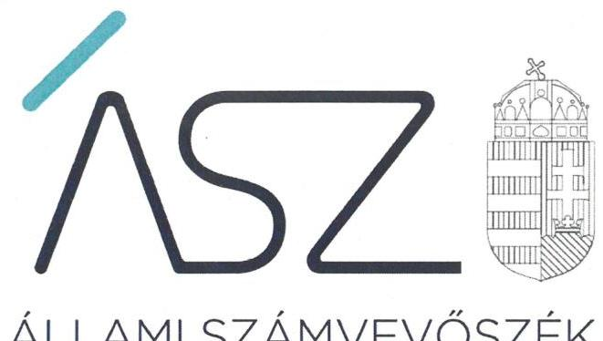

ÁLLAMI SZÁMVEVŐSZÉK

# JELENTÉS 

## Pártok gazdálkodása

A költségvetési támogatásban részesülő pártok 2018-2019. évi gazdálkodása törvényességének ellenőrzése a Magyar Kétfarkú Kutya Pártnál
2021.

21064
www.asz.hu

---

ÁLLAMI SZÁMVEVŐSZÉK

# JELENTÉS

## Pártok gazdálkodása

A költségvetési támogatásban részesülő pártok 2018-2019. évi gazdálkodása törvényességének ellenőrzése a Magyar Kétfarkú Kutya Pártnál

2021. 06. hó 25. nap

21064
www.asz.hu

Holman Magdolna
alelnők

4 LELNÖK

---

# AZ ELLENŐRZÉST FELÜGYELTE: 

DR. NAGY IMRE felügyeleti vezető

## AZ ELLENŐRZÉST VEZETTE ÉS A VÉGREHAJTÁSÁÉRT FELELŐS:

NEMESVÁRI-HORTHY ESZTER ellenőrzésvezető

## A PROGRAM ÖSSZEÁLLÍTÁSÁÉRT FELELŐS:

GÖRGÉNYI GÁBOR osztályvezető

IKTATÓSZÁM: EL-3265-001/2021.
TÉMASZÁM: 2548
ELLENŐRZÉS-AZONOSÍTÓ SZÁM: V0882004

Jelentéseink az Országgyúlés számítógépes hálózatán és az interneten a www.asz.hu címen is olvashatóak.

---

# TARTALOMJEGYZÉK 

■ ÖSSZEGZÉS ..... 5
■ AZ ELLENŐRZÉS CÉLJA ..... 6
■ AZ ELLENŐRZÉS TERÜLETE ..... 7
■ AZ ELLENŐRZÉS HÁTTERE, INDOKOLTSÁGA ..... 8
■ A JELENTÉS LÉNYEGES KÉRDÉSKÖREI ..... 9
■ AZ ELLENŐRZÉS HATÓKÖRE ÉS MÓDSZEREI ..... 10
■ MEGÁLLAPÍTÁSOK ..... 12
■ JAVASLATOK ..... 14
■ MELLÉKLETEK ..... 15
I. sz. melléklet: Értelmező szótár ..... 15
■ FÜGGELÉK: ÉSZREVÉTELEK ..... 17
■ RÖVIDÍTÉSEK JEGYZÉKE ..... 19

---

.

---

# ÖSSZEGZÉS 

A Magyar Kétfarkú Kutya Párt a 2018-2019. években nem biztosította a gazdálkodásának átláthatóságát, a közpénzek felhasználásának elszámoltathatóságát a párt tagsága és a közvélemény felé.

## Az ellenőrzés társadalmi indokoltsága

A pártok az állampolgárok egyesülési szabadsága alapján létrehozott olyan szervezetek, amelyek kereteket nyújtanak a népakarat kialakításához és kinyilvánításához, a politikai életben való állampolgári részvételhez.

A politikai élet tisztasága érdekében törvény állapítja meg a pártok vagyonára és gazdálkodására vonatkozó szabályokat. Az egyesülési jog alapján létrejövő más szervezetekhez képest szűkebb körben határozza meg azt a gazdasági tevékenységet, amelyet a párt végezhet, biztosítja azonban a pártok részére azt a jogosultságot, hogy az állami költségvetésből támogatásban részesüljenek. A pártok gazdálkodását a politikai élet tisztasága érdekében rendszeresen indokolt ellenőrizni, ezért törvényi előírás alapján az Állami Számvevőszék a költségvetési támogatást kapott pártok gazdálkodását kétévente ellenőrzi. A gazdálkodás szabályszerűségének, a felhasznált közpénzek nagyságának bemutatásával a társadalom objektív képet alkothat a pártok múködéséről.

A pártokkal szembeni társadalmi elvárás a törvényt tisztelő, jogkövető magatartás, mivel a párt képviselői a jogállamiságot megtestesítő törvényhozó hatalom részei. Mindezekre tekintettel fokozott társadalmi veszélyességet hordoz egy párt elszámoltathatóságának hiánya, elszámolási kötelezettségének nem teljesítése.

## Főbb megállapítások, következtetések, javaslatok

A Magyar Kétfarkú Kutya Párt belső szabályozása és számviteli kereteinek kialakítása 2018-2019. években nem felelt meg a jogszabályi előírásoknak, ezáltal nem biztosította a törvényes gazdálkodás feltételeit.

A Magyar Kétfarkú Kutya Pártnál a nem szabályszerű könyvvezetés és gazdálkodás következtében sérült a közpénzek átláthatósága és a közélet tisztaságának alaptörvényi elve.

A Magyar Kétfarkú Kutya Párt 2018. és 2019. évekre elkészített pénzügyi kimutatásai nem mutattak megbízható és valós képet gazdálkodásáról, bevételeiről és kiadásairól. Ezáltal a párt tagságát és a közvéleményt is megtévesztette.

Az Állami Számvevőszék az intézkedések megtétele céljából a Magyar Kétfarkú Kutya Párt társelnökei részére egy javaslatot fogalmazott meg.

---

# AZ ELLENŐRZÉS CÉLJA 

AZ ELLENŐRZÉS CÉLJA annak értékelése volt, hogy a Magyar Kétfarkú Kutya Párt által közzétett pénzügyi kimutatások a törvényi előírásoknak megfelel-tek-e, a könyvvezetés és gazdálkodás során betartották-e a vonatkozó jogszabályi és belső előírásokat; a Magyar Kétfarkú Kutya Párt a müködéséhez szabályszerűen igénybe vehető forrásokat használt-e fel.

---

# AZ ELLENŐRZÉS TERÜLETE 

## Magyar Kétfarkú Kutya Párt

A Magyar Kétfarkú Kutya Párt 2014. szeptember 24-én létrejött olyan egyesület, amely nyilvántartott tagsággal rendelkezett, és a nyilvántartásba vételét végző bíróság előtt kinyilvánította, hogy a Párttörvény ${ }^{1}$ rendelkezéseit magára nézve kötelezőnek ismeri el a Párttörvény 1. §-a alapján.

Az Alapszabály ${ }_{1-2}{ }^{2}$ szerint a Magyar Kétfarkú Kutya Párt működésének célja, hogy részt vegyen a közhatalom gyakorlásában és ennek során a mindenkori politikai programjában foglaltak szerint minél szélesebb körben érvényre juttassa a következő társadalmi és politikai elveket, célkitűzéseket: a) a képviseleti demokrácia érvényre juttatása, amely szerint a párt képviselői útján minél szélesebb körben tegye lehetővé az állampolgárok és közösségek érdekeinek képviseletét; b) a társadalmi igazságosság érvényre juttatása az állampolgárokat és közösségeket érintő döntések meghozatala során; c) a demokratikus államfelépítés támogatása és folyamatos fejlesztésében történő részvétel, a mindenkori alkotmányos berendezkedés védelme; d) a humor megjelenítése a közpolitikában és a közpolitikai résztvevők humor útján is történő befolyásolása a párt által követendőnek tartott döntések meghozatala érdekében.

A Magyar Kétfarkú Kutya Párt legfelsőbb tanácskozó és döntéshozó szerve az Alapszabály ${ }_{1,2}$ szerint a Taggyűlés ${ }^{3}$, ügyvezető szerve az Elnökség ${ }^{4}$.

A Magyar Kétfarkú Kutya Párt pénzügyi kimutatásaiban 2018. évben a 1247/2018. (V. 25.) Korm. határozat és a Kftv. ${ }^{5}$ szerinti 206,3 M Ft-os, illetve 2019. évben a 2019. évi költségvetési törvény szerint jóváhagyott központi költségvetésből származó támogatás 24,6 M Ft-os összegét mutatta ki.

A Magyar Kétfarkú Kutya Párt gazdasági társaságot nem alapított, a „Savköpő Menyét Alapítvány"-t 2018-ban hozta létre.

---

# AZ ELLENŐRZÉS HÁTTERE, INDOKOLTSÁGA 

Az ÁSZ tv. ${ }^{6}$ 5. § (11) bekezdés a) pontja és a Párttörvény 10. § (1) bekezdése alapján a pártok gazdálkodása törvényességének ellenőrzésére az ÁSZ ${ }^{7}$ jogosult. Törvényi előírás alapján az ÁSZ kétévente ellenőrzi azoknak a pártoknak a gazdálkodását, amelyek rendszeres költségvetési támogatásban részesültek.

Az ÁSZ a Párt gazdálkodásának törvényességét jelen ellenőrzést megelőzően nem értékelte, mert a Magyar Kétfarkú Kutya Párt az 1247/2018. (V. 25.) Korm. határozatban foglaltak szerinti költségvetési támogatásban 2018. június 1-jétől részesül.

A gazdálkodás szabályszerűségének, a felhasznált közpénzek nagyságának bemutatásával a társadalom objektív képet alkothat a pártok működéséről. Az ellenőrzés megállapításai a gazdálkodás megfelelőségének bemutatásával elősegíthetik, hogy a törvényalkotók konkrét lépéseket tegyenek a pártok finanszírozására vonatkozó szabályozások megváltoztatása, átláthatóbbá, ellenőrizhetőbbé tétele irányába. Az ellenőrzés rámutat a pártok gazdálkodásával kapcsolatos jó gyakorlatokra és szabálytalanságokra. A hiányosságok, szabálytalanságok feltárása, az ennek kapcsán megfogalmazott megállapítások elősegíthetik a törvényi rendelkezések megsértésének szankcionálását.

---

# A JELENTÉS LÉNYEGES KÉRDÉSKÖREI 

1. A Magyar Kétfarkú Kutya Párt gazdálkodásának törvényessége biztositott volt-e?
2. A Magyar Kétfarkú Kutya Párt könyvvezetése és gazdálkodása során a vonatkozó jogszabályi rendelkezéseket és belső elöírásokat betartotta-e?
3. A Magyar Kétfarkú Kutya Párt pénzügyi kimutatása megfelelte a jogszabályi elöírásoknak, közzétételi kötelezettségét szabályszerüen teljesitette-e?

---

# AZ ELLENŐRZÉS HATÓKÖRE ÉS MÓDSZEREI 

## Az ellenőrzés típusa

Szabályszerűségi ellenőrzés.

## Az ellenőrzött időszak

A 2018-2019. évek

## Az ellenőrzés tárgya

A Magyar Kétfarkú Kutya Párt ellenőrzése során az ellenőrzés tárgyát képezte a 2018. és a 2019. évre vonatkozó pénzügyi kimutatás elkészítésére, jóváhagyására, közzétételére, a könyvvezetésére, gazdálkodására, ennek keretében a számviteli szabályozás kialakítására, a bizonylati rend, bizonylati fegyelem betartására, egyéb gazdálkodási, ellenőrzési és pénzügyiszámviteli informatikai feladatok ellátására irányuló tevékenységek. Az ellenőrzés tárgya volt még a Párttörvény szerinti források elszámolása és felhasználása, valamint a vagyon jogszabályi előírásoknak megfelelő hasznosítása.

Az ellenőrzés kiterjedt minden olyan körülményre és adatra, amely az ÁSZ jogszabályban meghatározott feladatainak teljesítéséhez, valamint a program végrehajtása folyamán felmerült újabb összefüggések feltárásához szükséges volt.

## Az ellenőrzött szervezet

Magyar Kétfarkú Kutya Párt

## Az ellenőrzés jogalapja

Az ellenőrzés jogalapját az ÁSZ tv. 5. § (11) bekezdés a) pontja, a Párttörvény 4. § (4)-(5) bekezdései, valamint 10. § (1), (3)-(4) bekezdései képezték.

## Az ellenőrzés módszerei

Az ÁSZ ellenőrzésére az ellenőrzési program szempontjai, az ellenőrzött időszakban hatályos jogszabályok, az ellenőrzés általános szakmai szabá-

---

lyai, az ellenőrzésre irányadó ÁSZ módszertanok figyelembevételével került sor. A közpénzekkel való felelős gazdálkodás segítésére irányuló javaslatok kidolgozáskor a hatályos jogszabályok az irányadóak.

Az ellenőrzés ideje alatt a Magyar Kétfarkú Kutya Párttal történő kapcsolattartást az ÁSZ SZMSZ ${ }^{8}$-ének vonatkozó előírásai alapján biztosította az ÁSZ.

Az ellenőrzés céljának eléréséhez szükséges bizonyítékok megszerzése a Magyar Kétfarkú Kutya Párt által rendelkezésre bocsátott dokumentumokra, adatokra alapozva közvetlen, részletes elemzés, megfigyelés, szemrevételezés, információkérés, megerősítés, valamint elemző eljárás útján történt. Az ellenőrzési bizonyítékként felhasználható adatforrások közé tartoztak egyrészt az ellenőrzési program részletes szempontjainál felsorolt adatforrások, másrészt minden egyéb - az ellenőrzés folyamán feltárt, az ellenőrzés szempontjából információt tartalmazó - dokumentum.

Az ellenőrzés lefolytatásához a Magyar Kétfarkú Kutya Párt az ÁSZ által kért dokumentumok megküldésével szolgáltatott adatokat, amelyek valódiságát és teljes körűségét a Magyar Kétfarkú Kutya Párt vezetője által tett teljességi és hitelességi nyilatkozatnak kellett igazolnia. A rendelkezésre bocsátott adatok, információk kontrollja az ellenőrzés keretében történt.

---

# 1. A Magyar Kétfarkú Kutya Párt gazdálkodásának törvényessége biztosított volt-e? 

Összegző megállapítás Az MKKP ${ }^{9}$ gazdálkodásának törvényessége nem volt biztosított.

Az MKKP az ellenőrzött időszakban a Számv. tv. ${ }^{10}$ szerint rendelkezett Számviteli politikával ${ }^{11}$, melynek keretében elkészítette a Leltározási és leltárkészítési szabályzatot ${ }^{12}$, az Értékelési szabályzatot ${ }^{13}$, valamint a Pénzkezelési szabályzatot ${ }^{14}$. A Számviteli politikában a Számv. tv. 14. § (4) bekezdése előírása ellenére nem határozta meg, hogy a számviteli elszámolás, az értékelés szempontjából mit tekint lényegesnek, nem lényegesnek. Az MKKP a Számv. tv. előírásai szerint elkészítette a Bizonylati rendet ${ }^{15}$.

Az MKKP nyilatkozata szerint nem rendelkezett a Számv. tv. 161. § (1) bekezdése szerinti számlarenddel. Ennek következtében nem határozta meg a Számv. tv. 161. § (2) bekezdés a)-c) pontjaiban előírtak ellenére az alkalmazásra kijelölt számlák számjelét és megnevezését, a számla tartalmát, ha az a számla megnevezéséből egyértelműen nem következik, továbbá a számla értéke növekedésének, csökkenésének jogcímeit, a számlát érintő gazdasági eseményeket, azok más számlákkal való kapcsolatát, valamint a főkönyvi számla és az analitikus nyilvántartás kapcsolatát.

## 2. A Magyar Kétfarkú Kutya Párt könyvvezetése és gazdálkodása során a vonatkozó jogszabályi rendelkezéseket és belső előírásokat betartotta-e?

## Összegző megállapítás Az MKKP könyvvezetése és gazdálkodása nem volt szabályszerű.

Az MKKP könyvvezetése nem volt szabályszerű, mert a Számv. tv. 161. § (1) bekezdése szerinti számlarend hiányában nem biztosította a Számv. tv. végrehajtásának, a szabályszerű könyvvezetésnek az alapvető szabályozási feltételeit.

A Párttörvény 9. § (1) bekezdése az 1. sz. melléklet szerinti tartalmú pénzügyi kimutatás elkészítését írja elő. A Számv. tv. 161/A. § (2) bekezdése előírja, hogy a közpénzek felhasználásának és a köztulajdon használatának nyilvánossága és ellenőrizhetősége érdekében a nyilvántartási (könyvvezetési) rendszerét a pártoknak úgy szükséges továbbrészletezni, hogy abból a vonatkozó külön jogszabályban, ebben az esetben a Párttörvény 9. § (1) bekezdésében előírt pénzügyi kimutatás elkészítéséhez szükséges adatok rendelkezésre álljanak. A számlarend hiányában a Számv. tv. 161. § (1) bekezdése szerint a könyvvezetése és így a Számv. tv. szerinti

---

beszámoló, pártok esetében a Párttörvény 9. § (1) bekezdése szerinti tartalmú pénzügyi kimutatás elkészítése nem biztosított. Ezáltal az MKKP nem biztosította, hogy a 2018-2019. évi pénzügyi kimutatásait a Számv tv. előírásainak megfelelő könyvvezetéssel támassza alá.

# 3. A Magyar Kétfarkú Kutya Párt pénzügyi kimutatása megfelel-e a jogszabályi előírásoknak, közzétételi kötelezettségét szabályszerűen teljesítette-e? 

Összegző megállapítás
Az MKKP a 2018-2019. évi pénzügyi kimutatását nem a jogszabályi előírások szerint készítette el, törvény szerinti közzétételi kötelezettségét nem teljesítette.

Az MKKP 2018-2019. évi pénzügyi kimutatásai - a számlarend, valamint a szabályszerű, a pénzügyi kimutatás adatait alátámasztó szabályszerű könyvvezetés hiányában - nem voltak megbízhatóak.

Az MKKP a pénzügyi kimutatására a Párttörvény 9. § (1) bekezdésében előírt közzétételi kötelezettségét nem teljesítette a Magyar Közlönyben.

---

# JAVASLATOK 

Az ÁSZ tv. 33. § (1) bekezdésében foglaltak értelmében az ellenőrzött szervezet vezetője köteles a jelentésben foglalt megállapításokhoz kapcsolódó intézkedési tervet összeállítani és azt a jelentés kézhezvételétől számított 30 napon belül az ÁSZ részére megküldeni. Amennyiben az ellenőrzött szervezet vezetője nem küldi meg határidőben az intézkedési tervet, vagy továbbra sem elfogadható intézkedési tervet küld, az Állami Számvevőszék elnöke az ÁSZ tv. 33. § (3) bekezdése a) és b) pontjaiban foglaltakat érvényesítheti.

## Magyar Kétfarkú Kutya Párt társelnökei

1. Intézkedjen arról, hogy a jövőben teljesítse a pénzügyi kimutatás közzétételére elöirt törvényi kötelezettségét a Magyar Közlönyben
(3. sz. megállapítás 2. bekezdése alapján)

---

# MELLÉKLETEK 

- I. SZ. MELLÉKLET: ÉRTELMEZŐ SZÓTÁR
pénzügyi kimutatás
a párt gazdasági-vállalkozási tevékenysége
költségvetési támogatás
nem pénzbeli támogatás

A Párttörvény. 9. § (1) bekezdésében meghatározott, a törvény 1. számú melléklete szerinti pénzügyi kimutatás (hatályos 2014. május 6-ától), amelyet a pártok kötelesek minden év május 31-ig a Magyar Közlönyben, valamint saját honlappal rendelkező pártok a honlapjukon is közzétenni.
A Párttörvény 6. § (1) bekezdésének megfelelően a párt a költségeinek fedezése és vagyonának gyarapítása érdekében a következő gazdasági-vállalkozási tevékenységeket folytathatja:
a) politikai céljainak és tevékenységének megismertetése érdekében kiadványokat jelentethet meg és terjeszthet, a pártot szimbolizáló jelvényeket és más ilyen célú tárgyakat árusíthat, és pártrendezvényeket szervezhet;
b) a tulajdonában álló ingatlanokat és ingókat díj ellenében hasznosíthatja és elidegenítheti.
Az államháztartás alrendszerei terhére nyújtott pénzbeli vagy nem pénzbeli juttatás, amelyet a támogató nem elsősorban ellenszolgáltatás ellenében, de konkrét program megvalósítása vagy meghatározott időszakban a támogatott szervezet müködtetése érdekében nyújt. (Civil tv. 2. § 15. pont)
Vagyoni értékkel rendelkező forgalomképes dolog, szellemi alkotás, illetve vagyoni értékű jog részben vagy egészében, véglegesen vagy ideiglenesen, teljesen vagy részben ingyenesen történő átruházása vagy átengedése, illetve szolgáltatás biztosítása. (Civil tv. 2. § 25. pont)

---

.

---

# FÜGGELÉK: ÉSZREVÉTELEK 

A jelentéstervezetet a Számvevőszék 15 napos észrevételezésre megküldte az ellenőrzött szervezet vezetőinek az ÁSZ tv. 29. §* (1) bekezdése előírásának megfelelően.

A Magyar Kétfarkú Kutya Párt társelnökei a jelentéstervezet megállapításaira nem tettek észrevételt.

[^0]
[^0]:    * 29. § (1) Az Állami Számvevőszék az ellenőrzési megállapításait megküldi az ellenőrzött szervezet vezetőjének vagy az általa megbízott személynek, és annak, akinek személyes felelősségét állapította meg.
    (2) Az ellenőrzött szervezet vezetője és a felelősként megjelölt személy az ellenőrzés megállapításaira tizenöt napon belül írásban észrevételt tehet.
    (3) Az Állami Számvevőszék az észrevételre a beérkezésétől számított harminc napon belül írásban válaszol. A figyelembe nem vett észrevételeket köteles a jelentésben feltüntetni, és megindokolni, hogy azokat miért nem fogadta el.

---

.

---

# RÖVIDÍTÉSEK JEGYZÉKE 

${ }^{1}$ Párttörvény
${ }^{2}$ Alapszabály $2_{2}$

## ${ }^{3}$ Taggyülés

${ }^{4}$ Elnökség
${ }^{5}$ Kftv.
${ }^{6}$ ÁSZ tv.
${ }^{7}$ ÁSZ
${ }^{8}$ ÁSZ SZMSZ
${ }^{9}$ MKKP
${ }^{10}$ Számv. tv.
${ }^{11}$ Számviteli politika
${ }^{12}$ Leltározási és leltárkészítési szabályzat
${ }^{13}$ Értékelési szabályzat
${ }^{14}$ Pénzkezelési szabályzat
${ }^{15}$ Bizonylati rend

A pártok működéséről és gazdálkodásáról szóló 1989. évi XXXIII. törvény (hatályos: 1989. október 30-ától)
Alapszabály: - A Magyar Kétfarkú Kutya Párt Alapszabálya (hatályos: 2017. október 26-tól)
Alapszabály: - A Magyar Kétfarkú Kutya Párt Alapszabálya (módosítva és egységes szerkezetbe foglalva 2018. július 13-tól)
A Magyar Kétfarkú Kutya Párt Taggyűlése
A Magyar Kétfarkú Kutya Párt Elnöksége
az országgyűlési képviselők választása kampányköltségeinek átláthatóvá tételéről szóló 2013. évi LXXXVII. törvény (hatályos 2013. június 20-ától)
2011. évi LXVI. törvény az Állami Számvevőszékről (hatályos: 2011. július 1-jétől) Állami Számvevőszék
Állami Számvevőszék Szervezeti és Működési Szabályzata
Magyar Kétfarkú Kutya Párt
A számvitelről szóló 2000. évi C. törvény (hatályos: 2001. január 1-jétől)
A Magyar Kétfarkú Kutya Párt Számviteli politikája (hatályos: 2016. július 16-tól)
A Magyar Kétfarkú Kutya Párt Eszközök és források leltározási és leltárkészítési Szabályzata (hatályos: 2016. július 16-tól)
A Magyar Kétfarkú Kutya Párt Eszközök és Források értékelési szabályzata (hatályos 2016. július 16-tól)
A Magyar Kétfarkú Kutya Párt Pénzkezelési Szabályzata (hatályos 2016. július 16-tól)
A Magyar Kétfarkú Kutya Párt Bizonylati rendje (hatályos 2016. július 16-tól)

---

# 1052 

1052 Budapest, Apáczai Cs. J. u. 10. I 1364 Budapest 4. Pf. 54 TEL: +36 14849100
email: szamvevoszek@asz.hu
web: www.asz.hu | www.aszhirportal.hu