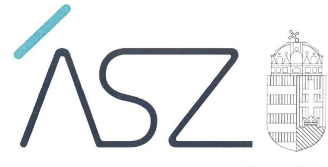
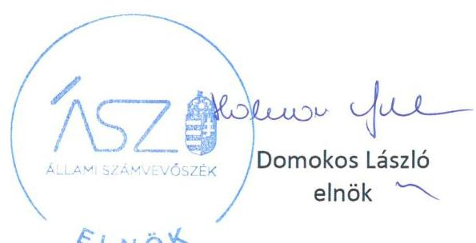
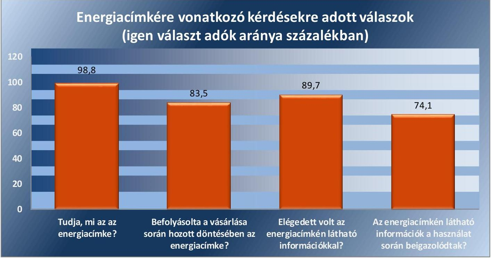
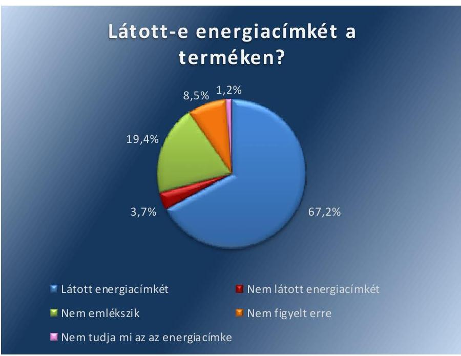
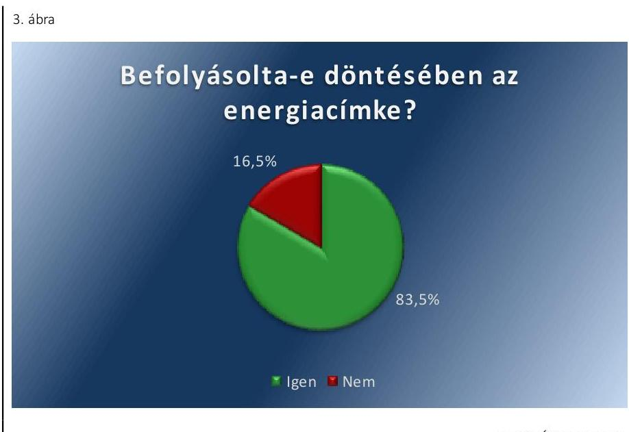

ÁLLAMI SZÁMVEVŐSZÉK

# JELENTÉS 

A környezettudatos tervezésre és az energiafogyasztási címkézésre vonatkozó intézkedések ellenőrzése

2021. 

21065
www.asz.hu

---

ÁLLAMI SZÁMVEVŐSZÉK

# JELENTÉS

A környezettudatos tervezésre és az energiafogyasztási címkézésre vonatkozó intézkedések ellenőrzése

2021.

07. hó 08. nap

21065
www.asz.hu

---

# AZ ELLENŐRZÉST FELÜGYELTE: 

D R. SIMON JÓZSEF felügyeleti vezető

## AZ ELLENŐRZÉST VEZETTE ÉS A VÉGREHAJTÁSÁÉRT FELELŐS:

SIPOSNÉ DÓCZI KLÁRA ellenőrzésvezető
D R. NAGY IMRE ellenőrzésvezető

A PROGRAM ÖSSZEÁLLÍTÁSÁÉRT FELELŐS:
TERLECZKYNÉ DR. EISELE EDIT program készítéséért felelős vezető

IKTATÓSZÁM: EL-3268-001/2021.
TÉMASZÁM: 2549
ELLENŐRZÉS-AZONOSÍTÓ SZÁM: V0905

---

# TARTALOMJEGYZÉK 

- ÖSSZEGZÉS ..... 5
- AZ ELLENŐRZÉS CÉLJA ..... 7
- AZ ELLENŐRZÉS TERÜLETE ..... 8
- AZ ELLENŐRZÉS HÁTTERE, INDOKOLTSÁGA ..... 10
- A JELENTÉS LÉNYEGES KÉRDÉSKÖREI. ..... 11
- AZ ELLENŐRZÉS HATÓKÖRE ÉS MÓDSZEREI. ..... 12
- MEGÁLLAPÍTÁSOK ..... 15
- MELLÉKLETEK. ..... 19
I. sz. melléklet: Értelmező szótár ..... 19
- FÜGGELÉK: ÉSZREVÉTELEK ..... 21
- RÖVIDÍTÉSEK JEGYZÉKE ..... 23

---

.

---

# ÖSSZEGZÉS 

Az Innovációs és Technológiai Minisztérium, Budapest Főváros Kormányhivatala, illetve a megyeszékhely szerinti járási hivatalok gondoskodtak a 2017-2019. években a környezettudatos tervezés és az energiacímkézés piacfelügyeleti intézményrendszerének kialakításáról és az ellenőrzési tevékenységek ellátásáról.
A piacfelügyeleti intézményrendszer energiacímkézésre vonatkozó tevékenysége hozzájárult a környezettudatos fogyasztói szemlélet köztudatban való megismertetéséhez.

## Az ellenőrzés társadalmi indokoltsága

A magyar energiapolitika kiemelt prioritásként kezeli az energiahatékonyság növekedésének elősegítését. Az energiahatékonyság növekedése révén mérséklődhet az energiaimport-függőség, csökkenhet az intézmények és a lakosság energiaszámlája, nőhet a beruházások száma, ezáltal javulhat a foglalkoztatottság, mobilizálódhat a hazai tőke és felgyorsulhat a külföldi működő tőke és támogatás beáramlása, valamint teljesülhetnek hazánk légszennyező anyagok kibocsátásával kapcsolatos nemzetközi környezetvédelmi vállalásai.

A környezettudatos tervezés és az energiafogyasztási címkézés támogathatja az energiahatékonyság növekedését. A környezettudatos tervezésre vonatkozó jogszabályok energiahatékonysági és környezetvédelmi minimumkövetelményeket határoznak meg a háztartási és ipari készülékek tekintetében. Az energiacímkék tájékoztatást nyújtanak a fogyasztóknak a termékek energiafogyasztásáról és környezeti teljesítményéről, így segíthetik őket a megalapozott döntéshozatalban. A Magyarország V. középtávú fogyasztóvédelmi politikájának megvalósítására irányuló, 2018-ig szóló feladatterv végrehajtásához szükséges kormányzati intézkedésekről szóló 2011/2015. (XII. 29.) Korm. határozat célként határozta meg a fenntartható környezet- és egészségtudatos fogyasztói gondolkodás és magatartás erősítését a fogyasztók körében.

A piacfelügyeleti intézményrendszer kialakítása és múködtetése alapvető fontosságú, mivel ezáltal a fogyaszt ókra veszélyes, a műszaki követelményeknek, vagy jogszabályi előírásoknak nem megfelelő termékek kiszűrhetők a forgalomból. Az Állami Számvevőszék ellenőrzése rámutat a környezettudatos tervezés és az energiafogyasztási címkézés területén a fogyasztóvédelmi és piacfelügyeleti rendszer kialakításának és múködésének kockázataira. Az ellenőrzés ezen túlmenően szempontokat adhat a környezettudatos tervezésre és az energiafogyasztási címkézésre vonatkozó fejlesztési irányok és lehetőségek meghatározásához.

## Főbb megállapítások, következtetések

2018. május 21-ig a Nemzeti Fejlesztési Minisztérium, 2018. május 22-től az Innovációs és Technológiai Minisztérium megteremtette a környezettudatos tervezésre és az energiafogyasztási címkézésre vonatkozó szabályok betartásának alapvető feltételeit. Meghatározta a piacfelügyeleti intézményrendszer múködtetéséhez szükséges alapvető fe-lelősségi- és hatásköri viszonyokat, továbbá elősegítette a környezettudatos tervezésre és az energiafogyasztási címkézésre vonatkozó ellenőrzések meghatározását és végrehajtását.

Budapest Főváros Kormányhivatala és a megyeszékhely szerinti járási hivatalok, mint piacfelügyeleti hatóságok az ellenőrzési feladataikat ellátták, az ellenőrzések során feltárt jogsértésekre a jogszabályban előírt hatósági intézkedéseket tették.

A kérdőíves felmérés keretében megkérdezett fogyasztók válaszai alapján az energiafogyasztási címkézéssel kapcsolatos tevékenységek eredményesek voltak, elérték a céljukat, hozzájárultak a környezettudatos fogyasztói gondolkodás és magatartás erősítéséhez. A válaszadók 98,8\%-a ismerte az energiacímke fogalmát. A válaszadók 83,5\%-át

---

befolyásolta az energiacímke a vásárlás során. A kérdésre válaszadó vásárlók 89,7\%-a elégedett volt az energiacímkén látható információkkal, 74,1\%-uk szerint ezek az információk a használat során is beigazolódtak. Az adatokat az 1. ábra mutatja be.

1. ábra

Forrás: ÁSZ szerkesztés

---

# AZ ELLENŐRZÉS CÉLJA 

AZ ELLENŐRZÉS CÉLJA a környezettudatos tervezéssel és az energiafogyasztási címkézéssel kapcsolatos szabályozási és intézményi környezet értékelése és a kapcsolódó piacfelügyeleti,fogyasztóvédelmi tevékenység ellenőrzése, továbbá a végső energiafogyasztás csökkentésére vonatkozó célok meghatározásának, a kapcsolódó nyomon követési rendszer kialakításának, a kitűzött célok elérése nyomon követésének vizsgálata.

A teljesítmény-ellenőrzés célja annak vizsgálata, hogy a környezettudatos tervezéssel és az energiafogyasztási címkézéssel kapcsolatos szabályozási és intézményi környezet, a kapcsolódó piacfelügyeleti, fogyasztóvédelmi tevékenység eredményesen járultak-e hozzá az energiafogyasztás csökkentésére vonatkozó célok eléréséhez, továbbá az evalváció módszerével a fogyasztók energiacímkék által nyújtott tájékoztatással kapcsolatos elégedettségének, energiatudatosságának vizsgálata.

---

# Az Ellenőrzés Területe

## Innovációs és Technológiai Minisztérium, Budapest Főváros Kormányhivatala, megyeszékhely szerinti járási hivatalok, mint fogyasztóvédelmi és piacfelügyeleti hatóságok

A környezettudatos tervezés és az energiafogyasztási címkézés területére vonatkozóan a fogyasztóvédelmi hatósági, és a piacfelügyeleti hatósági tevékenységgel kapcsolatos feladatokat a fogyasztóvédelmi hatóság kijelöléséről szóló 387/2016. (XII. 2.) Korm. rendelet1 5. § (1) bekezdése alapján az ellenőrzött időszakban 2017-től 2018. május 21-ig az NFM2 látta el a fogyasztóvédelemért felelős helyettes államtitkáron keresztül. A kormány tagjainak feladat- és hatásköréről szóló 94/2018. (V. 22.) kormányrendelet alapján 2018. május 22-től az ITM3 végezte az érintett feladatokat az infokommunikációért és fogyasztóvédelemért felelős államtitkáron keresztül. Az ellenőrzött időszakban az SZMSZ1,24 alapján a FOHÁT5 segítette a fogyasztóvédelemért felelős helyettes államtitkárnak a fogyasztóvédelmi hatósággal, és a piacfelügyeleti hatósággal kapcsolatos tevékenységének az ellátását.

A piacfelügyeleti hatóságok tevékenységét a Pftv.6 és a Pftv. vhr.7, valamint az Európai Parlament és a Tanács 765/2008/EK rendelete8 szabályozta. A gazdasági célfelhasználású termékek tekintetében a BFKH9 a Pftv. vhr. 2. § (1) bekezdés f) pontja értelmében és az egyéb termékek tekintetében a megyei kormányhivatalok fogyasztóvédelmi feladatkörében eljáró megyeszékhely szerinti járási hivatalok a Pftv. vhr. 2. § (1) bekezdés c) pontja alapján az ellenőrzött időszakban piacfelügyeleti hatóságként is működtek. A BFKH-n belül a piacfelügyeleti feladatokat a Metrológiai és Műszaki Felügyeleti Főosztály Piacfelügyeleti Osztály végezte.

A fogyasztóvédelmi hatóság kijelöléséről szóló 387/2016. (XII. 2.) Korm. rendelet 5. § (1) bekezdése értelmében a fővárosi, a megyei és a járási kormányhivataloknak a fogyasztóvédelmi és piacfelügyeleti feladataival öszszefüggésben az Áht.10 9. § f)-i) pontjában meghatározott hatásköröket, valamint a törvényességi és szakszerűségi ellenőrzési hatásköröket szakmai irányító miniszterként 2018. május 21-ig az NFM miniszter, 2018. május 22-től az ITM minisztere gyakorolta.

A fővárosi és megyei kormányhivatalokról, valamint a járási (fővárosi kerületi) hivatalokról szóló 66/2015. (III. 30.) Korm. rendelet 7. § (1)-(3) bekezdései, majd 2019. július 1-jétől a 86/2019. (IV. 23.) Korm. rendelet 29. § (1)-(3) bekezdései szerint a szakmai irányító miniszter országos hatósági ellenőrzési tervet készít az irányítási jogkörébe tartozó feladatok tekintetében a fővárosi és megyei kormányhivatalok által lefolytatandó hatósági ellenőrzésekről, és gondoskodik annak az általa vezetett minisztérium honlapján történő közzétételéről. A fővárosi és megyei kormányhivatalok a szakmai irányító miniszter által kiadott országos hatósági ellenőrzési tervek

---

alapján készítik el hatósági ellenőrzési terveiket. A fővárosi és megyei kormányhivatalok ellenőrzési jelentést készítenek és megküldik a szakmai irányító miniszternek. Az ellenőrzött időszakban a megyeszékhely szerinti járási hivatalok feladatát az NFM és az ITM által elkészített ellenőrzési és vizsgálati programban meghatározott, a témát érintő piacfelügyeleti hatósági ellenőrzések elvégzése, illetve az abban való területi közremúködés, valamint azokról az ellenőrzési jelentés elkészítése képezte.

Az energiahatékonyságra vonatkozó stratégiai célkitűzéseket a 2011. évben a 77/2011. (X. 14.) OGY határozattal elfogadott „Nemzeti Energia stratégia 2030" rögzítette. Az energiahatékonysággal összefüggő feladatokat a Kormány 2020-ig szóló cselekvési tervekben határozta meg. 2015. szeptemberében a Kormány 1601/2015. (IX. 8.) Korm. határozattal fogadta el a III. Nemzeti Energiahatékonysági Cselekvési tervet, majd 2017. novemberében a 1842/2017. (XI. 14.) Korm. határozattal fogadta el a IV. Nemzeti Energiahatékonysági Cselekvési tervet.

---

# AZ ELLENŐRZÉS HÁTTERE, INDOKOLTSÁGA 

Az európai uniós klímavédelmi célok elérésének egyik legfontosabb eszköze a termékek energiahatékonyságának növelése. A hatékonyabban múködő termékek hozzájárulnak az üvegházhatást okozó gázok kibocsátásának csökkentéséhez, és jelentős pénzügyi megtakarítást eredményeznek a vállalkozások és a háztartások számára. Az eredményes piacfelügyelet döntő szerepet játszik annak biztosításában, hogy az Unióban értékesített termékek megfeleljenek a környezettudatos tervezésre vonatkozó követelményeknek, valamint hogy a jogszabályoknak megfelelő energiacímkék segítsék a fogyasztókat a döntéshozatalban.

Az Európai Bizottság számításai szerint a környezettudatos tervezésről és az energiacímkézéséről szóló irányelvek végrehajtása évente 490 euróval csökkenthetik az uniós fogyasztók számláit, az ipar számára pedig 55 milliárd eurós többletbevételt jelenthetnek. Ezen irányelvek végrehajtása a 2020-ra kitűzött energia-megtakarítási célok közel felét, és a légszennyező anyag kibocsátás csökkentési célok negyedét teszi ki.

A környezettudatos tervezés és az energiafogyasztási címkézés célja az energiahatékonyság elősegítése, amelyeta magyar energiapolitika kiemelt prioritásként kezel. Az energiahatékonyság révén mérséklődik az energia-import-függőség, csökken az intézmények és a lakosság energiaszámlája, nő a beruházások száma, ezáltal javul a foglalkoztatottság, mobilizálódik a hazai tőke és felgyorsul a külföldi működő tőke és támogatás beáramlása, valamint teljesülnek a légszennyező anyagok kibocsátásával kapcsolatos nemzetközi környezetvédelmi vállalásaink.

Az ellenőrzés megállapításaival támogathatja a szakpolitikai döntéshozók munkáját a környezettudatos tervezés és az energiafogyasztási címkézés területén. Az „ellenőrök ellenőreként" az ÁSZ megállapításai hatványozottan hasznosulhatnak, hiszen megállapításai az ellenőrzött szervezetek, azaz a piacfelügyeleti, fogyasztóvédelmi hatóságok ellenőrzési tevékenységének szabályszerűbbé és eredményesebbé tételében érvényesülhetnek. Az ÁSZ ezáltal hozzájárulhat a lakosság megfelelő tájékoztatásához a termékek energiafogyasztására vonatkozóan, és ezáltal a lakosság energiatudatosságának növeléséhez.

---

# A JELENTÉS LÉNYEGES KÉRDÉSKÖREI 

1. A környezettudatos tervezésre és az energiafogyasztási címkézésre vonatkozó szabályok betartását a piacfelügyeleti intézményrendszer kialakítása és müködtetése biztositotta-e?
2. A környezettudatos tervezéssel és az energiafogyasztási címkézéssel kapcsolatos ellenőrzési feladatokat a felelős hatóságok szabályszerüen látták-e el?
3. Az energiafogyasztási címkézéssel kapcsolatos tevékenységek eredményesek voltak-e, hozzájárultak-e a környezettudatos fogyasztói szemlélet megismertetéséhez?

---

# AZ ELLENŐRZÉS HATÓKÖRE ÉS MÓDSZEREI 

## Az ellenőrzés típusa

| Megfelelőségi és teljesítményellenőrzés.

## Az ellenőrzött időszak

Az ellenőrzött időszak a 2017-2019. évek, a 3. lényeges kérdéskör vonatkozásában a 2019. év és a 2020. év

## Az ellenőrzés tárgya

A környezettudatos tervezésre és az energiafogyasztási címkézésre vonatkozó intézkedések ellenőrzése a fogyasztóvédelmi felelősség keretében, a piacfelügyeleti intézményrendszer kialakításának és múködtetésének biztosítása vonatkozásában, az uniós jogszabályokkal összhangban. A gazdasági célfelhasználású termékek, valamint a lakossági fogyasztók esetében történő piacfelügyeleti hatósági ellenőrzési feladatok ellátása. A környezettudatos tervezéssel és az energiafogyasztási címkézéssel kapcsolatos, az energiafogyasztás csökkentésére vonatkozó célok kialakítása, nyomon követése valamint a környezettudatos tervezés és az energiafogyasztási címkézés területén végzett tevékenységek értékelése, illetve a lakossági fogyasztók energiacímkék által nyújtott tájékoztatással kapcsolatos elégedettségének, energiatudatosságának a felmérése.

## Az ellenőrzött szervezet

Innovációs és Technológiai Minisztérium, a megyeszékhely szerinti járási hivatalok, mint fogyasztóvédelmi és piacfelügyeleti hatóságok, Budapest Főváros Kormányhivatala - Metrológiai és Múszaki Felügyeleti Főosztály Piacfelügyeleti Osztály (továbbiakban: BFKH), mint piacfelügyeleti hatóság.

## Az ellenőrzés jogalapja

Az ellenőrzés jogalapját az ÁSZ tv. ${ }^{11}$ 1. § (3) bekezdése és az 5. § (2) és (3) bekezdései képezik.

---

# Az ellenőrzés módszerei 

Az ellenőrzést az ellenőrzési program szempontjai, az ellenőrzött időszakban hatályos jogszabályok, az ellenőrzés szakmai szabályok és módszertanok alapján, a nemzetközi standardok figyelembevételével végezte az ÁSZ.

A BFKH és a megyeszékhely szerinti járási hivatalok esetében véletlen mintavétel történt a 2017. január 1-től indított és 2019. december 31-ig le is zárult ellenőrzések tekintetében. Az ÁSZ ezen statisztikai mintavétellel ellenőrizte, hogy a BFKH és a megyeszékhely szerinti járási hivatalok az energiafogyasztási címkézésre, valamint a környezettudatos tervezésre és a CE-jelölésre vonatkozó szabályok betartását illetően végzettellenőrzései során megállapított jogsértések esetében szabályszerűen intézkedtek-e, hozzájárulva ezzel a fenntartható fejlődéshez.

A vizsgált terület „szabályszerű" minősítést kapott, ha a minta ellenőrzésének eredménye alapján 95\%-os bizonyossággal a teljes sokaságban az átlagos hibaarány nem haladta meg a 10\%-ot, „nem szabályszerű" minősítést kapott, ha nagyobb volt, mint 10\%. Abban az esetben, ha a teljes sokaság tekintetében a 10\%-os hibaarányhoz való viszony megítélésének megbízhatósága nem érte el a 95\%-ot, szabályszerűnek minősítettük a területet, ha a minta alapján a teljes sokaság vonatkozásában a 10\% alatti hibaarány előfordulásának nagyobb a valószínűsége, nem megfelelőnek, ha 10\% felettinek. Amennyiben a sokaság elemszáma nem haladta meg az előírt minta elemszámot, akkor a sokaság valamennyi elemének tételes ellenőrzésére került sor.

Az ellenőrzési kérdések megválaszolásához szükséges bizonyítékok megszerzése a következő ellenőrzési eljárások alkalmazásával történt: az ellenőrzött szervezetek által rendelkezésre bocsátott dokumentumokra, adatokra alapozva megfigyelés, információkérés, összehasonlítás, valamint elemző eljárás.

Az ellenőrzési bizonyítékként felhasználható adatforrások közé tartoztak az ellenőrzési programban felsorolt adatforrások, tanúsítványok továbbá minden - az ellenőrzés folyamán - feltárt, az ellenőrzés szempontjából információkat tartalmazó dokumentum.

A teljesítmény-ellenőrzés teljesítmény kategóriája az eredményesség. Az ellenőrzés a tényleges és a tervezett eredmények (hatások) összevetésével azt értékelte, hogy a környezettudatos tervezés és az energiafogyasztási címkézés területén végzett tevékenységek hozzájárultak-e az energiafogyasztási célok megvalósulásához. Emellett annak értékelése is megtörtént, hogy az ellenőrzött időszakban a piacfelügyeletért, fogyasztóvédelemért felelős hatóságok a tevékenységeiket a tervezett szinten látták-e el és az elvégzetttevékenységeikkel hozzájárultak-e vonatkozó célok eléréséhez.

A teljesítmény ellenőrzés megközelítése eredmény (kimenet-) alapú, mely során azt értékeltük, hogy az eredményeket, a „kimeneteket" tervezett szinten elérték-e, a szolgáltatások (feladatellátások) a tervezettek szerint működtek-e.

Az eredményességen túlmenően az evalváció módszerével a teljesít-mény-ellenőrzés keretében annak értékelésére is sor került, hogy a lakossági fogyasztók a tapasztalataik alapján elégedettek-e az energiacímkék ál-

---

tal nyújtott tájékoztatásokkal, a fogyasztói szokásukra jellemző-e az energiatudatosság. A kérdőíves adatfelvétel 2020. decemberében - online, számítógéppel támogatott megkérdezés formájában - 2000 fő megkérdezésével zajlott. A felmérés célcsoportját az energiacímkével ellátott elektromos és elektronikai eszközöket 2019. évben vásárló, 18 éves és annál idősebb magyar lakossági fogyasztók képezték. A megkérdezettek közül 1275 fő vásárolt elektromos és elektronikai terméket a 2019. évben.

Az ellenőrzés ideje alatt az ellenőrzött szervezet ekkel történő kapcsolattartást az ÁSZ Szervezeti és Múködési Szabályzatának vonatkozó előírásai alapján biztosítottuk.

---

# MEGÁLLAPÍTÁSOK 

## 1. A környezettudatos tervezésre és az energiafogyasztási címkézésre vonatkozó szabályok betartását a piacfelügyeleti intézményrendszer kialakítása és müködtetése biztosította-e?

Összegző megállapítás

A környezettudatos tervezésre és az energiafogyasztási címkézésre vonatkozó szabályok betartását a piacfelügyeleti intézményrendszer kialakítása és müködtetése 2017-2019. években biztosította.

A Minisztérium ${ }^{12}$ 2017-2019-ben kialakította a piacfelügyelet müködtetésének szervezeti kereteit. A fogyasztóvédelemért való felelőssége keretében az SZMSZ $_{1,2}$-ben meghatározta a piacfelügyeleti intézményrendszer működtetéséhez szükséges alapvető felelősségi- és hatásköri viszonyokat.

A Minisztérium 2017-2019. években elősegítette a környezettudatos tervezésre és az energiafogyasztási címkézésre vonatkozó ellenőrzések meghatározását és végrehajtását. Az SZMSZ $_{1,2}$ előírásának megfelelően előkészítette az ellenőrzési útmutatókat és mintavételi terveket a környezettudatos tervezésre és az energiafogyasztási címkézésre vonatkozó, országos és több megyét érintő fogyasztóvédelmi ellenőrzésekhez. Az ellenőrzési útmutatókban és a mintavételi tervekben a Minisztérium meghatározta a piacfelügyeleti hatóságok számára az ellenőrzések szempontjait, általános céljait a környezettudatos tervezés és az energiafogyasztási címkézés területén.

## 2. A környezettudatos tervezéssel és az energiafogyasztási címkézéssel kapcsolatos ellenőrzési feladatokat a felelős hatóságok szabályszerűen látták-e el?

Összegző megállapítás

A környezettudatos tervezéssel és az energiafogyasztási címkézéssel kapcsolatos ellenőrzési feladatokat a BFKH és a megyeszékhely szerinti járási hivatalok szabályszerűen látták el.

A CE-jelöléssel ellátott, energiával kapcsolatos termékek ellenőrzése során a piacfelügyeleti hatóságok jogsértés esetén felhívták a gyártó figyelmét a jogszabálysértésre és megfelelő határidő megállapításával kötelezték annak megszüntetésére, illetve a határidő eredménytelen elteltét követően intézkedtek a termék forgalomból történő kivonásáról. A termékek energiafogyasztásának címkézésére vonatkozó ellenőrzése során a piacfelügyeleti hatóságok jogsértés esetén szabályszerű hatósági intézkedéseket tettek a mulasztások pótlása, illetve szankcionálása érdekében.

---

# 3. Az energiafogyasztási címkézéssel kapcsolatos tevékenységek eredményesek voltak-e, hozzájárultak-e a környezettudatos fogyasztói szemlélet megismertetéséhez? 

Összegző megállapítás

Az energiafogyasztási címkézéssel kapcsolatos tevékenységek eredményesek voltak, hozzájárultak a környezettudatos fogyasztói szemlélet megismertetéséhez.

A megvásárolt termékről a válaszadók 67,2\%-a nyilatkozta azt, hogy volt rajta energiacímke. A válaszadók 3,7\%-a nem látott a terméken energiacímkét, 19,4\%-uk nem emlékezett rá, hogy volt-e energiacímke az eszközön, a kérdésre válaszadók 8,5\%-a pedig nem figyelt erre. A válaszadók mindössze 1,2\%-a nyilatkozta, hogy nem tudja, mi az az energiacímke. A válaszok arányait a 2. ábra mutatja be.
2. ábra

Forrás: ASZ szerkesztés
ELÉGEDETT VOLTaz energiacímkén látható információkkal a válaszadók 89,7\%-a. A fogyasztók energiatudatosságát jelzi, hogy a termék kiválasztása során az energiacímke alapján tájékozódott a válaszadók 70,0\%-a a termékek energia-besorolásáról, 22,6\%-a a termékek fogyasztásáról.

A válaszadók 83,5\%-át befolyásolta az energiacímke a vásárlása során hozott döntésében. Közülük a kérdésre válaszadók 48,3\%-a az energia-besorolás alapján, 19,6\%-a a termék fogyasztására vonatkozó adatok alapján döntött. A válaszadók 16,5\%-a nyilatkozta azt, hogy döntésében nem befolyásolta az energiacímke. A válaszok arányait a 3. ábra mutatja be.

---

Forrás: ÁSZ szerkesztés
A válaszadók 74,1\%-a szerint az energiacímkén található információka használat során beigazolódtak, 0,4\%-uk szerint nem igazolódtak be. A kérdésre válaszadók 25,5\%-a nem tudta megítélni, hogy az energiacímkén található információk a használat során beigazolódtak-e.

---

.

---

# MELLÉKLETEK 

I. SZ. MELLÉKLET: ÉRTELMEZŐ SZÓTÁR

CE megfelelőségi jelölés

Energiafogyasztási címkézés, energiacímke

Fogyasztóvédelem

Fogyasztóvédelmi hatóság

Gazdasági célfelhasználású termék

Fővárosi és megyei kormányhivatalok

Járási (fővárosi kerületi) hivatalok

A termékek forgalmazása tekintetében az akkreditálás és piacfelügyelet előírásainak megállapításáról és a 339/93/EGK rendelet hatályon kívül helyezéséről szóló, 2008. július 9-i 765/2008/EK európai parlamenti és tanácsi rendelet (a továbbiakban: 765/2008/EK Rendelet) 2. cikk 20. pontjában meghatározott jelölés. A CE-jelölés igazolja, hogy a forgalmazott terméket a gyártó megvizsgálta, és az megfelel az uniós szintű biztonsági, egészségügyi és környezetvédelmi előírásoknak.

Bizonyos termékcsoportokba tartozó, értékesítésre szánt termékeket kötelező energiacímkével ellátni, és a címkét a vásárló számára jól látható helyen kell elhelyezni. Az energiafogyasztási címkék rangsorolják a készülékeket aszerint, hogy mennyi energiát fogyasztanak és tájékoztatást nyújtanak arról, hogy melyek az energiatakarékosabb termékek, így a fogyasztók tudatos választással pénzt takaríthatnak meg. Ezzel arra ösztönzik a gyártókat, hogy kisebb energiafogyasztású termékeket tervezzenek.

A fogyasztóvédelem célja a gyártok, forgalmazók és a fogyasztók közötti erőviszonyokban az egyensúly biztosítása, a fogyasztó jogainak, érdekeinek képviselete, érvényre juttatása. Magyarországon a fogyasztóvédelemről szóló 1997. évi CLV. törvény határozza meg a fogyasztói érdekek védelmének állami feladatait, alapintézményeit.

A 387/2016. (XII. 2.) Korm. rendelet szerint fogyasztóvédelmi hatóságként a Kormány - a pénzügyi közvetítőrendszer felügyeletével kapcsolatos feladatkörbe tartozó ügyek kivételével - közigazgatási hatósági ügyekben
a) a fővárosi és megyei kormányhivatalt (a továbbiakban: kormányhivatal),
b) a hivatásos katasztrófavédelmi szerv központi szervét (a továbbiakban: katasztrófavédelmi főigazgatóság),
c) a Pest Megyei Kormányhivatalt,
d) a Szerencsejáték Felügyeletet, valamint
e) a fogyasztóvédelemért felelős minisztert (a továbbiakban: miniszter) jelöli ki.

Ha e hivatkozott rendelet eltérően nem rendelkezik a Kormány általános fogyasztóvédelmi hatóságként a kormányhivatalt jelöli ki.

Gazdasági célfelhasználású a termék, ha a felhasználás célja minden kétséget kizáróan jövedelemszerzésre irányul, a termék dokumentációjában a gazdasági célfelhasználás szerepel, vagy a felhasználás jellegéből egyértelműen következik a felhasználás gazdasági célja.

A kormány általános hatáskörű területi kormányzati igazgatási szervei. A területi közigazgatás legnagyobb egységeit képező 20 kormányhivatal a megyeszékhelyeken, a főváros és Pest Megye esetében pedig Budapesten múködik. A kormányhivatalok a jogszabályoknak és a kormány döntéseinek megfelelően összehangolják és elősegítik a kormányzati feladatok területi végrehajtását. Emellett olyan hatósági, felügyeleti, jogorvoslati, ellenőrzési, koordinációs, tájékozódási, javaslattevő és véleményezési jogkörökkel rendelkeznek, amelyek elősegítika területi közigazgatás jellemzőire, sajátos igényeire figyelemmel lévő központi döntések kidolgozását és végrehajtását.

A területi közigazgatás legkisebb egységei, 174 városban és Budapesten 23 kerületben múködnek. Alapvető feladatuk a hatáskörükbe utalt elsőfokúállamigazgatási ügyek intézése. Az állampolgárok és a vállalkozások részére nyújtott

---

Piacfelügyelet

Piacfelügyeleti hatóság
közszolgáltatások hatékonyabb ellátása érdekében a járási (fővárosi kerületi) hivatalok az egyablakos ügyintézést országos illetékességgel biztosító integrált kormányzati ügyfélszolgálatokat, úgynevezett Kormányablakokat múködtetnek.
A hatóságok által annak biztositása érdekében végzett tevékenység és hozott intézkedések, hogy a termékek megfeleljenek a vonatkozó közösségi harmonizációs jogszabályokban megállapított követelményeknek, illetve hogy ne jelentsenek veszélyt az egészség, a biztonság vagy közérdek bármilyen más elemének szempontjából.
A Pftv. vhr. 2. § (1) bekezdése értelmében piacfelügyeleti hatóság:
a) az országos tisztifőorvos,
b) a népegészségügyi, bányafelügyeleti hatósági hatáskörében eljáró fővárosi és megyei kormányhivatal,
c) a közlekedési, fogyasztóvédelmi, munkavédelmi feladatkörében eljáró fővárosi és megyei kormányhivatal, valamint a fővárosi és megyei kormányhivatal népegészségügyi feladatkörében eljáró járási (fővárosi kerületi) hivatala,
d) az Országos Gyógyszerészeti és Élelmezés-egészségügyi Intézet,
e) a Magyar Bányászati és Földtani Szolgálat,
f) a gazdasági célfelhasználású termékek tekintetében a piacfelügyeleti feladatkörében eljáró Budapest Főváros Kormányhivatala,
g) a fogyasztóvédelemért felelős miniszter,
h) a közlekedésért felelős miniszter,
i) a foglalkoztatáspolitikáért felelős miniszter,
j) a Nemzeti Média- és Hírközlési Hatóság,
k) a BM Országos KatasztrófavédelmiFőigazgatóság,
I) a Rendőrség szervei.

---

# FÜGGELÉK: ÉSZREVÉTELEK 

A jelentéstervezetet a Számvevőszék 15 napos észrevételezésre megküldte az ellenőrzött szervezetek vezetőinek az ÁSZ tv. 29. §* (1) bekezdése előírásának megfelelően.

Az Innovációs és Technológiai Minisztérium minisztere, a Bács-Kiskun Megyei Kormányhivatal vezetője, a Baranya Megyei Kormányhivatal vezetője, a Békés Megyei Kormányhivatal vezetője, a Csongrád-Csanád Megyei Kormányhivatal vezetője, a Fejér Megyei Kormányhivatal vezetője, a Győr-Moson-Sopron Megyei Kormányhivatal vezetője, a HajdúBihar Megyei Kormányhivatal vezetője, a Jász-Nagykun-Szolnok Megyei Kormányhivatal vezetője, a Komárom-Esztergom Megyei Kormányhivatal vezetője, a Tolna Megyei Kormányhivatal vezetője, a Vas Megyei Kormányhivatal vezetője, valamint a Veszprém Megyei Kormányhivatal vezetője írásban jelezte, hogy a jelentéstervezet megállapításaira nem tesz észrevételt.

Az észrevételezésre megküldött jelentéstervezet megállapításaira a többi ellenőrzött Kormányhivatal vezetője nem tett észrevételt.

[^0]
[^0]:    * 29. § (1) Az Állami Számvevőszék az ellenőrzési megállapításait megküldi az ellenőrzött szervezet vezetőjének vagy az általa megbízott személynek, és annak, akinek személyes felelősségét állapította meg.
    (2) Az ellenőrzött szervezet vezetője és a felelősként megjelölt személy az ellenőrzés megállapításaira tizenöt napon belül írásban észrevételt tehet.
    (3) Az Állami Számvevőszék az észrevételre a beérkezésétől számított harminc napon belül írásban válaszol. A figyelembe nem vett észrevételeket köteles a jelentésben feltüntetni, és megindokolni, hogy azokat miért nem fogadta el.

---

.

---

# RÖVIDÍTÉSEK JEGYZÉKE 

${ }^{1}$ 387/2016. (XII. 2.) Korm. rendelet
${ }^{2}$ NFM
${ }^{3}$ ITM
${ }^{4}$ SZMSZ ${ }_{1}$

SZMSZ ${ }_{2}$
${ }^{5}$ FOHÁT
${ }^{6}$ Pftv.
${ }^{7}$ Pftv. vhr.
${ }^{8} 765 / 2008 /$ EK rendelet
${ }^{9}$ BFKH
${ }^{10}$ Áht.
${ }^{11}$ ÁSZ tv.
${ }^{12}$ Minisztérium
a fogyasztóvédelmi hatóság kijelöléséről szóló 387/2016. (XII. 2.) Korm. rendelet (hatályos 2017. január 1-jétől)
Nemzeti Fejlesztési Minisztérium (2018. május 21-ig)
Információs és Technológiai Minisztérium (2018. május 22-től)
a Nemzeti Fejlesztési Minisztérium Szervezeti és Működési Szabályzatáról szóló 33/2014. (X. 10.) NFM utasítás (hatályos 2019. február 28-ig)
az Innovációs és Technológiai Minisztérium Szervezeti és Múködési Szabályzatáról szóló 4/2019. (II. 28.) ITM utasítás (hatályos 2019. március 1-jétől)
Fogyasztóvédelemért Felelős Helyettes Államtitkári Titkárság
a termékek piacfelügyeletéről szóló 2012. évi LXXXVIII. törvény (hatályos 2012. szeptember 1-jétől)
a piacfelügyeleti tevékenység részletes szabályairól szóló 6/2013. (I. 18.) számú kormányrendelet (hatályos 2013. február 3-tól)
a termékek forgalmazása tekintetében az akkreditálás és piacfelügyelet előírásainak megállapításáról és a 339/93/EGK rendelet hatályon kívül helyezéséről szóló Európai Parlament és Tanács 2008. július 9-i 765/2008/EK rendelete
Budapest Főváros Kormányhivatala
az államháztartásról szóló 2011. évi CXCV. törvény (hatályos 2012. január 1-jétől)
az Állami Számvevőszékről szóló 2011. évi LXVI. törvény (hatályos 2011. július 1-jétől)
Nemzeti Fejlesztési Minisztérium, Információs és Technológiai Minisztérium

---

# ASZ 

1052 Budapest, Apáczai Cs. J. u. 10. | 1364 Budapest 4. Pf. 54 TEL: +36 14849100
email: szamvevoszek@asz.hu
web: www.asz.hu | www.aszhirportal.hu