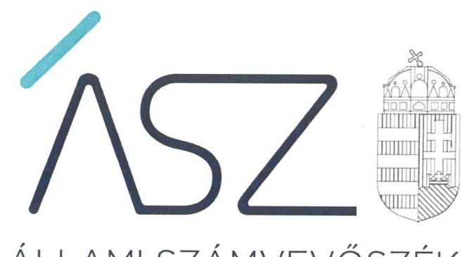

ÁLLAMI SZÁMVEVŐSZÉK

# JELENTÉS 

A költségvetési szervek irányítói, tulajdonosi feladatai ellátásának ellenőrzése

Innovációs és Technológiai Minisztérium
2021.

21066
www.asz.hu

---

ÁLLAMI SZÁMVEVŐSZÉK

# JELENTÉS 

A költségvetési szervek irányítói, tulajdonosi feladatai ellátásának ellenőrzése

Innovációs és Technológiai Minisztérium
2021. 09. hó 01. nap

21066
www.asz.hu

---

# AZ ELLENŐRZÉST FELÜGYELTE: 

KLINGA LÁSZLÓ felügyeleti vezető

## AZ ELLENŐRZÉST VEZETTE ÉS A VÉGREHAJTÁSÁÉRT FELELŐS:

DR. SIMON JÓZSEF ellenőrzésvezető

ÁRPÁSI TIBOR ellenőrzésvezető

A PROGRAM ÖSSZEÁLLÍTÁSÁÉRT FELELŐS:
DÁM-POLYÁK ORSOLYA projektvezető

IKTATÓSZÁM: EL-3284-001/2021
TÉMASZÁM: 2550
ELLENŐRZÉS-AZONOSÍTÓ SZÁM: V089401

---

# TARTALOMJEGYZÉK 

- ÖSSZEGZÉS ..... 5
- AZ ELLENŐRZÉS CÉLJA ..... 7
- AZ ELLENŐRZÉS TERÜLETE ..... 8
- AZ ELLENŐRZÉS HÁTTERE, INDOKOLTSÁGA ..... 9
- A JELENTÉS LÉNYEGES KÉRDÉSKÖREI ..... 10
- AZ ELLENŐRZÉS HATÓKÖRE ÉS MÓDSZEREI ..... 11
- MEGÁLLAPÍTÁSOK ..... 13
- MELLÉKLETEK ..... 17
I. sz. melléklet: Értelmező szótár ..... 17
- FÜGGELÉK: ÉSZREVÉTELEK ..... 19
- RÖVIDÍTÉSEK JEGYZÉKE ..... 21

---

.

---

# ÖSSZEGZÉS 

Az Innovációs és Technológiai Minisztérium a 2019. évben gondoskodott az irányítási feladatellátás és a tulajdonosi joggyakorlás keretfeltételeinek szabályszerű kialakításáról. Az irányítása alá tartozó költségvetési szervekkel, illetve a tulajdonosi joggyakorlása alá tartozó gazdasági társaságokkal kapcsolatos kontrolltevékenységeket szabályszerűen látta el. Mindezek által hozzájárult a közpénzekkel és a nemzeti vagyonnal történő felelős gazdálkodáshoz.

## Az ellenőrzés társadalmi indokoltsága

A közfeladatok ellátásának biztosításában a minisztériumok kiemelt szerepet töltenek be. E cél megvalósítása érdekében a minisztériumok jelentős nagyságrendű költségvetési forrásokkal gazdálkodnak, ezáltal a gazdálkodásuk szabályszerűsége hatással van a központi költségvetés egyensúlyának fenntarthatóságára. Emellett az irányítási és tulajdonosi jogok gyakorlásán keresztül befolyásolják az állami vagyonnal való gazdálkodás minőségét, a közpénzfelhasználás szabályszerűségét, a kormányzati (szak)politikák végrehajtását, illetve a közfeladatok széleskörű ellátásán keresztül az állampolgárok életminőségét.

Az Innovációs és Technológiai Minisztérium kiterjedt feladatkörrel rendelkezik, felelős többek között az állami infrastruktúra-beruházásokért, a belgazdaságért, az energiapolitikáért, a gazdaságfejlesztésért, az informatikáért, a kereskedelemért, a közlekedésért és a területfejlesztésért, valamint nemzetgazdasági szempontból stratégiai fontosságú állami vagyont működtet. Az Innovációs és Technológiai Minisztérium által ellátott közfeladatok és a felhasznált közpénzek szabályszerűségének biztosítása, valamint a rá bízott nemzeti vagyon megőrzése alapvető társadalmi érdek.

A kontrollkörnyezet kialakítása, valamint az integrált kockázatkezelési rendszer, az információs és kommunikációs rendszer és a monitoring rendszer kialakítása, illetve a kontrolltevékenységek szabályszerű gyakorlása nélkül nem valósítható meg a közpénzek átlátható, szabályos, hatékony és eredményes felhasználása.

A belső kontrollrendszer ezen elemei azt a célt szolgálják, hogy az irányítási és tulajdonosi feladatokat ellátó költségvetési szervek működésük és gazdálkodásuk során a kapcsolódó tevékenységeket szabályszerűen hajtsák végre, teljesítsék elszámolási kötelezettségeiket és megvédjék a rájuk bízott erőforrásokat a veszteségektől és a nem rendeltetésszerű használattól. Mindez magában foglalja azon elveket, eljárásokat és belső szabályokat, amelyek biztosítják, hogy a költségvetési szerv valamennyi tevékenysége és célja összhangban legyen a szabályszerűséggel, valamint a gazdaságosság, hatékonyság és eredményesség követelményeivel, az eszközökkel és forrásokkal való gazdálkodásban ne kerüljön sor pazarlásra, rendeltetésellenes felhasználásra. A monitoring rendszer kialakításának indoka, hogy megfelelő, pontos és naprakész információk álljanak rendelkezésre a költségvetési szerv irányítási és tulajdonosi feladatainak ellátásáról.

## Főbb megállapítások, következtetések

Az Innovációs és Technológiai Minisztérium az irányítási feladatellátás és a tulajdonosi joggyakorlás vonatkozásában a 2019. év során kialakította a jogszabályi előírások szerinti kontrollkörnyezetet, integrált kockázatkezelési rendszert, információs és kommunikációs rendszert, valamint monitoring rendszert. A belső kontrollrendszer elemeinek kialakítása támogatta a hozzá tartozó költségvetési szervek, illetve köztulajdonban lévő gazdasági társaságok jogszabály előírások szerinti működését, valamint az irányítási és a tulajdonosi joggyakorláshoz kapcsolódó feladatok elszámoltathatóságát.

---

Az Innovációs és Technológiai Minisztérium az általa irányított költségvetési szervek vonatkozásában irányítási feladatait a 2019. évben szabályszerűen látta el. A gazdasági társaságokat érintő tulajdonosi joggyakorláshoz kapcsolódó feladatai ellátása során a jogszabályi előírásokat betartotta. Mindez hozzájárult a rá bízott közpénzek és nemzeti vagyon szabályszerű felhasználásához.

Az Innovációs és Technológiai Minisztérium a tulajdonosi joggyakorlás vonatkozásában a 2019. évben kialakította, az irányítási feladatellátás vonatkozásában azonban dokumentáltan nem alakította ki a teljesítmény mérésére alkalmas követelményeket.

---

# AZ ELLENŐRZÉS CÉLJA 

AZ ELLENŐRZÉS CÉLJA annak értékelése, hogy az irányítói és tulajdonosi tevékenység belső kontrollrendszerének kialakítása és a kontrolltevékenységek gyakorlása szabályszerű volt-e, biztosította-e az irányító és tulajdonosi feladatok átlátható, szabályszerű és eredményes ellátását. Az ellenőrzés keretében értékeljük, hogy adottak-e az irányítási, tulajdonosi tevékenységgel kapcsolatosan a teljesítmény mérés feltételei.

---

# AZ ELLENŐRZÉS TERÜLETE 

## Innovációs és Technológiai Minisztérium

Az Innovációs és Technológiai Minisztérium az ellenőrzött időszakban az SZMSZ 21-43 szerint a kormány irányítása alatt álló, a központi költségvetésben különálló fejezetet alkotó központi költségvetési szervként működött.

A miniszter2 a 2019. évben hatályos, a kormány tagjainak feladat és hatásköréről szóló 94/2018. (V. 22.) Korm. rendelet értelmében a kormány tagjaként többek között felelős volt az állami infrastruktúra-beruházásokért, a belgazdaságért, az energiapolitikáért, a gazdaságfejlesztésért, az informatikáért, az iparügyekért, a kereskedelemért, a közlekedésért, a területfejlesztésért és a tudománypolitika koordinációjáért.

A Minisztérium3 a 2019. évi központi költségvetés végrehajtásáról szóló zárszámadási törvény adatai alapján az Innovációs és Technológiai Minisztérium fejezeten belül a 2019. évben az irányítása, felügyelete alá tartozó szervezetek vonatkozásában 1 009,7 Mrd Ft kiadást teljesített. A Minisztérium igazgatása által foglalkoztatottak átlagos statisztikai állományi létszáma a 2019. évben 1695 fő volt.

A Minisztérium vezetőjének személye az ellenőrzött időszakban nem változott.

A Minisztérium 2019. december 31-én 4 költségvetési szerv (a Magyar Bányászati és Földtani Szolgálat, a Kormányzati Informatikai Fejlesztési Ügynökség, a Nemzeti Akkreditáló Hatóság, illetve a Nemzeti Szakképzési és Felnőttképzési Hivatal) valamint a Nemzeti Szakképzési és Felnőttképzési Hivatalra átruházott hatáskörök kivételével a 40 szakképzési centrum tekintetében rendelkezett irányítási hatáskörrel, illetve 17 gazdasági társaság felett gyakorolta a tulajdonosi jogokat.

---

# AZ ELLENŐRZÉS HÁTTERE, INDOKOLTSÁGA 

A minisztériumok irányító szervi feladatellátását az ÁSZ4 folyamatosan figyelemmel kíséri és rendszeresen ellenőrzi. Jelen ellenőrzés kiemelt fókusza annak megítélése, hogy az irányítói, tulajdonosi funkciókat ellátó költségvetési szervek, szervezeti egységek miként alakították ki és működtették a közszolgáltatások biztosításához elengedhetetlen irányítói, tulajdonosi feladatok gyakorlati megvalósításának rendszerét és annak ellenőrzését. Az irányítói, tulajdonosi feladatokat ellátó szervezetek ellenőrzésével az ÁSZ hozzájárul a teljes intézményrendszer szabályszerűbb, eredményesebb és hatékonyabb feladatellátásához, gazdálkodásához.

A minisztériumok irányító szervi, tulajdonosi feladatkörükben az államot, mint alapítót, tulajdonost képviselik. Az irányító szervi, tulajdonosi feladatok szabályszerű ellátása elősegíti az adott szervezetek irányítása alá tartozó intézmények, gazdasági társaságok közfeladatainak törvényes, szakszerű és hatékony ellátását. Ezzel hozzájárulnak ahhoz, hogy mind az intézményekre és gazdasági társaságokra, mind az irányító szervi feladatok ellátására fordított közpénzek, a rájuk bízott állami vagyon cél szerint hasznosuljanak, működésük átlátható és elszámoltatható legyen. A közpénzügyek átláthatóságának előmozdítása és a közvagyon védelme érdekében szükséges a minisztériumok irányító szervi, tulajdonosi feladatellátásának ellenőrzése.

---

# A JELENTÉS LÉNYEGES KÉRDÉSKÖREI 

1.     - A Minisztériumnál az irányítási feladatellátás és a tulajdonosi joggyakorlás vonatkozásában szabályszerű volt-e a kontrollkörnyezet, az integrált kockázatkezelési rendszer, az információs és kommunikációs rendszer, illetve a monitoring rendszer kialakítása?
2.     - A Minisztériumnál az irányítási feladatellátás és a tulajdonosi joggyakorlással kapcsolatos kontrolltevékenységek végrehajtása szabályszerű volt-e?
3.     - A Minisztériumnál kialakították-e a teljesítmény mérésére alkalmas követelményeket az irányítási feladatellátás és a tulajdonosi joggyakorlás vonatkozásában?

---

# AZ ELLENŐRZÉS HATÓKÖRE ÉS MÓDSZEREI 

## Az ellenőrzés típusa

| Megfelelőségi ellenőrzés.

## Az ellenőrzött időszak

A 2019. év.

## Az ellenőrzés tárgya

A Minisztérium irányítási, tulajdonosi feladatai ellátása folyamatának szabályozása. A Minisztérium belső kontrollrendszerének kialakítása és kontrolltevékenységeinek működtetése az irányítási és tulajdonosi feladatellátás vonatkozásában. A Minisztérium tulajdonosi joggyakorlása, az irányítási, tulajdonosi tevékenységgel kapcsolatosan a teljesítmény mérés feltételeinek kiépítése.

## Az ellenőrzött szervezet

| Innovációs és Technológiai Minisztérium

## Az ellenőrzés jogalapja

Az ellenőrzés jogszabályi alapját az ÁSZ tv.5 1. § (3) bekezdése, az 5. § (2) és (6) bekezdésének előírásai, valamint az Áht.6 61. § (2) bekezdésének előírásai képezték.

## Az ellenőrzés módszerei

Az ellenőrzést az ÁSZ az ellenőrzési program szempontjai, kérdései, az ellenőrzött időszakban hatályos jogszabályok, a nemzetközi standardokat irányadónak tekintve, az ellenőrzés szakmai szabályok és módszertanok figyelembe vételével végzi.

Az ellenőrzés ideje alatt az ellenőrzött szervezettel történő kapcsolattartás az ÁSZ SZMSZ7-ének vonatkozó előírásai alapján történik.

Az ellenőrzési kérdések megválaszolásához szükséges bizonyítékok megszerzése az ellenőrzött szervezet által rendelkezésre bocsátott dokumentumokra, adatokra alapozva megfigyelés, szemle (szemrevételezés),

---

kérdésfeltevés (információkérés), interjú, egyszerű véletlen mintavételi eljárással történő mintavételezés, valamint elemző eljárással történik.

Az ellenőrzési bizonyítékként felhasználható adatforrások közé tartoznak egyrészt a szakmai program részletes szempontjainál felsorolt adatforrások, másrészt minden - az ellenőrzés folyamán feltárt, az ellenőrzés szempontjából információt tartalmazó - dokumentum.

Az ellenőrzés lefolytatásához az ellenőrzött szervezet a tanúsítvány kitöltésével, hitelesítésével és az ÁSZ által kért dokumentumok megküldésével szolgáltat adatokat.

Az ÁSZ statisztikai módszereken alapuló mintavételt alkalmazott az irányítási feladatellátáshoz és a tulajdonosi joggyakorláshoz kapcsolódó kontrolltevékenységek szabályszerűségének megítélése érdekében.

Az irányításhoz kapcsolódó kontrolltevékenységek szabályszerűségének ellenőrzése a Minisztérium által a 2019. évben megszüntetett költségvetési szervek, valamint az egyéb irányítási és ellenőrzési jogosultságok gyakorlása vonatkozásában tételes ellenőrzéssel történt. Az irányítási feladatellátáshoz kapcsolódó kontrolltevékenységek szabályszerűségének ellenőrzése a munkáltató jogok gyakorlása esetén egyszerű véletlen mintavétellel történt.

A gazdasági társaságok feletti tulajdonosi joggyakorláshoz kapcsolódó kontrolltevékenységek szabályszerűségét tételesen ellenőrizte az ÁSZ. Ennek keretében az ÁSZ a következő területeket ellenőrizte: a gazdasági társaság létesítő okiratában a tulajdonosi joggyakorló számára fenntartott tulajdonosi jogok rendelkezésre állása, a gazdasági társaság alapvető személyi kérdéseire vonatkozó tulajdonosi döntések meghozatala, a gazdasági társaság könyvvizsgálójának megválasztása, a könyvvizsgálóval történő szerződéskötés jóváhagyása, a könyvvizsgálói szerződéshez kapcsolódó tulajdonosi joggyakorló által meghatározott feltételek meghatározása, valamint az állami vagyont használó, vagyonkezelő, vagy haszonélvező gazdasági társaságnál az őt megillető jogok gyakorlásának, illetve a kötelezettségek teljesítésének ellenőrzése.

A mintavétellel ellenőrzött területek esetében minden egyes tétel vonatkozásában szabályszerűségre vonatkozó kérdéseket tett fel az ÁSZ. Szabályszerű volt az ellenőrzött terület, amennyiben 95,0%-os bizonyossággal az ellenőrzött sokaságban az átlagos hibaarány legfeljebb 10,0%, nem szabályszerű, amennyiben 10,0%-nál magasabb arányt képviselt.

---

# MEGÁLLAPÍTÁSOK 

## 1. A Minisztériumnál az irányítási feladatellátás és a tulajdonosi joggyakorlás vonatkozásában szabályszerű volt-e a kontrollkörnyezet, az integrált kockázatkezelési rendszer, az információs és kommunikációs rendszer, illetve a monitoring rendszer kialakítása?

Összegző megállapítás

A Minisztérium az irányítási feladatellátásra és a tulajdonosi joggyakorlásra vonatkozó kontrollkörnyezetet, integrált kockázatkezelési rendszert, információs és kommunikációs rendszert, illetve monitoring rendszert a 2019. évben kialakította.

A KONTROLLKÖRNYEZET kialakítása az irányítási feladatellátásra vonatkozóan 2019. október 16-tól volt szabályszerű, mivel ezen időponttól kezdődően minden, az irányítási feladatellátásban a Minisztérium SZMSZ2-4-e szerint közreműködő szervezeti egységre vonatkozó ügyrend az Ávr.8 és ellenőrzési nyomvonalak a Bkr.9 előírása szerint rendelkezésre állt.

A tulajdonosi joggyakorlásra vonatkozó kontrollkörnyezet kialakítása 2019. október 18-tól szabályszerű volt, mivel a Minisztérium SZMSZ2-4-e szerint az összes, a tulajdonosi joggyakorlásban közreműködő szervezeti egység ügyrendje és ellenőrzési nyomvonala ezen időponttól kezdődően rendelkezésre állt.

## AZ INTEGRÁLT KOCKÁZATKEZELÉSI RENDSZER

kialakítása az irányítási feladatellátásra és a tulajdonosi joggyakorlásra vonatkozóan 2019. szeptember 13-tól szabályszerű volt, mivel ezen időponttól
 kezdődően rendelkezett a Minisztérium az irányítási feladatellátásra és a tulajdonosi joggyakorlásra vonatkozó integrált kockázatkezelési eljárásrenddel, ${ }^{10}$-del.

## AZ INFORMÁCIÓS ÉS KOMMUNIKÁCIÓS RENDSZER kialakítása az irányítási feladatellátásra és a tulajdonosi joggyakorlásra vonatkozóan 2019. szeptember 15-től szabályszerű volt, mivel a Minisztérium irányítási feladatellátásra és a tulajdonosi joggyakorlásra vonatkozó adatbiztonsági szabályzata; ${ }^{11}$ ezen időponttól kezdődően összhangban volt az Info tv. ${ }^{12}$ előírásaival.

A MONITORING RENDSZER kialakítása az irányítási feladatellátásra vonatkozóan 2019. október 16-tól volt szabályszerű, mivel ezen időponttól kezdődően az irányítási feladatellátásban a Minisztérium SZMSZ ${ }_{2-4}$-e szerint minden közreműködő szervezeti egységre vonatkozó ügyrendet az Ávr. és ellenőrzési nyomvonalat a Bkr. előírása szerint elkészítették. Ezáltal kialakították a Bkr. előírásával összhangban az operatív tevékenységek keretében megvalósuló folyamatos és eseti nyomon követést.

---

A tulajdonosi joggyakorlásra vonatkozó monitoring rendszer 2019. október 18-tól szabályszerű volt, mivel a Minisztérium ezen időponttól kezdődően az operatív tevékenységek keretében megvalósuló folyamatos és eseti nyomon követés rendelkezésre állt.

A Minisztérium vezetője az Áht. előírásával összhangban gondoskodott a belső ellenőrzés kialakításáról, amely kiterjedt az irányítási feladatellátásra és a tulajdonosi joggyakorlásra.

# 2. A Minisztériumnál az irányítási feladatellátás és a tulajdonosi joggyakorlással kapcsolatos kontrolltevékenységek végrehajtása szabályszerű volt-e? 

Összegző megállapítás

Az irányítási feladatellátás és a tulajdonosi joggyakorlással kapcsolatos kontrolltevékenységek végrehajtása a 2019. évben szabályszerű volt.

A Minisztérium az irányítási feladatellátással kapcsolatos kontrolltevékenységeket a 2019. évben szabályszerűen hajtotta végre, mivel
$\longrightarrow$ az Áht. és az Ávr. rendelkezései szerint járt el az általa irányított költségvetési szervek megszűntetése során;
$\longrightarrow$ az Áht. előírásai szerint gyakorolta az általa irányított szervezetek vezetői felett a munkáltatói jogköröket;
$\longrightarrow$ az Áht., az Ávr. és a Bkr. előírásaival összhangban gyakorolta az egyéb irányítási és ellenőrzési jogosultságait.
A gazdasági társaságok feletti tulajdonosi jogok gyakorlásához kapcsolódó kontrolltevékenységeket a Minisztérium szabályszerűen látta el, mivel
$\longrightarrow$ a Ptk. ${ }^{13}$ rendelkezései szerint gondoskodott a gazdasági társaságok létesítő okiratában a tulajdonosi joggyakorló számára fenntartott tulajdonosi jogok rendelkezésre állásáról,
$\longrightarrow$ a Ptk. előírásai szerint meghozta a gazdasági társaságok alapvető személyi kérdéseire vonatkozó tulajdonosi döntéseket,
$\longrightarrow$ a Ptk. rendelkezései szerint gondoskodott a gazdasági társaságok könyvvizsgálójának megválasztásáról, minden esetben jóváhagyta a könyvvizsgálóval történő szerződéskötést, illetve tulajdonosi joggyakorlóként meghatározta a könyvvizsgálóval történő szerződéshez kapcsolódó feltételeket,
$\longrightarrow$ a Vtvr. ${ }^{14}$ előírásai szerint ellenőrizte az állami vagyont használó, vagyonkezelő, vagy haszonélvező gazdasági társaságoknál az őt megillető jogok gyakorlását, illetve a kötelezettségek teljesítését.
A Minisztérium és a tulajdonosi joggyakorlása alá tartozó gazdasági társaságok között vagyonkezelési szerződés nem volt hatályban a 2019. évben.

---

# 3. A Minisztériumnál kialakították-e a teljesítmény mérésére alkalmas követelményeket az irányítási feladatellátás és a tulajdonosi joggyakorlás vonatkozásában? 

Összegző megállapítás A Minisztérium a tulajdonosi joggyakorlás vonatkozásában kialakította, az irányítási feladatellátás esetén nem alakította ki a teljesítmény mérésére alkalmas követelményeket a 2019. évben.

A tulajdonosi joggyakorlás esetén a Bkr. rendelkezéseivel összhangban kialakították a Minisztériumnál a rendelkezésre álló források eredményes felhasználását biztosító folyamatokat.

A Minisztérium az irányítási tevékenységek vonatkozásában, a teljesítmény mérésre alkalmas követelményeket a 2019. évben dokumentáltan nem alakította ki.

---

.

---

# MELLÉKLETEK 

I. SZ. MELLÉKLET: ÉRTELMEZŐ SZÓTÁR
belső ellenőrzés
belső kontrollrendszer
irányító szerv
integrált kockázatkezelési rendszer
monitoring rendszer

Független, tárgyilagos bizonyosságot adó és tanácsadó tevékenység, amelynek célja, hogy az ellenőrzött szervezet működését fejlessze és eredményességét növelje, az ellenőrzött szervezet céljai elérése érdekében rendszerszemléletű megközelítéssel és módszeresen értékeli, illetve fejleszti az ellenőrzött szervezet irányítási és belső kontrollrendszerének hatékonyságát. (Forrás: Bkr. 2. § b) pontja)
A belső kontrollrendszer a kockázatok kezelése és tárgyilagos bizonyosság megszerzése érdekében kialakított folyamatrendszer, amely azt a célt szolgálja, hogy a működés és gazdálkodás során a tevékenységeket szabályszerűen, gazdaságosan, hatékonyan, eredményesen hajtsák végre, az elszámolási kötelezettségeket teljesítsék, megvédjék az erőforrásokat a veszteségektől, károktól és nem rendeltetésszerű használattól. (Forrás: Áht. 69. § (1) bekezdése)
A költségvetési szerv tekintetében az Áht-ban meghatározott irányítási hatáskört gyakorló szerv. (Forrás: Áht. 1. § 9. pontja)
Olyan folyamatalapú kockázatkezelési rendszer, amely a szervezet minden tevékenységére kiterjed, egységes módszertan és eljárások alkalmazásával, a szervezet célkitűzéseinek és értékeinek figyelembevételével biztosítja a szervezet kockázatainak teljes körű azonosítását, azok meghatározott kritériumok szerinti értékelését, valamint a kockázatok kezelésére vonatkozó intézkedési terv elkészítését és az abban foglaltak nyomon követését. (Forrás: Bkr. 2. § m) pontja)
A szervezet tevékenységének, a célok megvalósításának nyomon követését biztosító rendszer, amely az operatív tevékenységek keretében megvalósuló folyamatos és eseti nyomon követésből, valamint az operatív tevékenységektől független belső ellenőrzésből állhat. (Forrás: Bkr. 10. §)

---

.

---

# FÜGGELÉK: ÉSZREVÉTELEK 

A jelentéstervezetet a Számvevőszék 15 napos észrevételezésre megküldte az ellenőrzött szervezet vezetőjének az ÁSZ tv. 29. §* (1) bekezdése előírásának megfelelően.

Az Innovációs és Technológiai Minisztérium minisztere a jelentéstervezet megállapításaira észrevételt tett.

[^0]
[^0]:    * 29. § (1) Az Állami Számvevőszék az ellenőrzési megállapításait megküldi az ellenőrzött szervezet vezetőjének vagy az általa megbízott személynek, és annak, akinek személyes felelősségét állapította meg.
    (2) Az ellenőrzött szervezet vezetője és a felelősként megjelölt személy az ellenőrzés megállapításaira tizenöt napon belül írásban észrevételt tehet.
    (3) Az Állami Számvevőszék az észrevételre a beérkezésétől számított harminc napon belül írásban válaszol. A figyelembe nem vett észrevételeket köteles a jelentésben feltüntetni, és megindokolni, hogy azokat miért nem fogadta el.

---

.

---

# RÖVIDÍTÉSEK JEGYZÉKE 

${ }^{1}$ Minisztérium SZMSZ ${ }_{1-4}$
${ }^{2}$ miniszter
${ }^{3}$ Minisztérium
${ }^{4}$ ÁSZ
${ }^{5}$ ÁSZ tv.
${ }^{6}$ Áht.
${ }^{7}$ ÁSZ SZMSZ
${ }^{8}$ Ávr.
${ }^{9}$ Bkr.
${ }^{10}$ integrált kockázatkezelési eljárásrend
${ }^{11}$ adatvédelmi és adatbiztonsági szabályzat
${ }^{12}$ Info tv.
${ }^{13}$ Ptk.
${ }^{14}$ Vtvr.

1/2018. (VII.23.) ITM utasítás az Innovációs és Technológiai Minisztérium szervezeti és működési rendjének ideiglenes meghatározásáról (hatályos 2018. július 24-től)
4/2019. (II. 28.) ITM utasítás az Innovációs és Technológiai Minisztérium Szervezeti és Működési Szabályzatáról (hatályos 2019. március 1-től 2019. szeptember 29-ig) 36/2019. (IX. 30.) ITM utasítás az Innovációs és Technológiai Minisztérium Szervezeti és Működési Szabályzatáról (hatályos 2019. szeptember 30-tól 2019. december 13-ig)
46/2019. (XII. 13.) ITM utasítás az Innovációs és Technológiai Minisztérium Szervezeti és Működési Szabályzatáról (hatályos 2019. december 14-től)
Az Innovációs és Technológiai Minisztérium vezetője
Innovációs és Technológiai Minisztérium
Állami Számvevőszék
2011. évi LXVI. törvény az Állami Számvevőszékről (hatályos 2011. július 1-jétől)
2011. évi CXCV. törvény az államháztartásról (hatályos 2011. december 31-től)
Állami Számvevőszék Szervezeti és Működési Szabályzata
368/2011. (XII. 31.) Korm. rendelet az államháztartásról szóló törvény végrehajtásáról (hatályos 2012. január 1-jétől)
370/2011. (XII. 31.) Korm. rendelet a költségvetési szervek belső kontrollrendszeréről és belső ellenőrzéséről (hatályos 2012. január 1-jétől)
Az innovációért és technológiáért felelős miniszter 33/2019. (IX. 12.)ITM utasítása az Innovációs és Technológiai Minisztérium szervezeti integritást sértő eseményeinek kezelésével és az integrált kockázatkezeléssel kapcsolatos eljárásrendről (hatályos 2019. szeptember 13-tól)
34/2019. (IX. 12.) ITM utasítás az Innovációs és Technológiai Minisztérium adatvédelmi, adatbiztonsági, valamint a közérdekű adatok megismerésére irányuló igények teljesítésére vonatkozó szabályzatának kiadásáról (hatályos 2019. szeptember 15-tól)
2011. évi CXII. törvény az információs önrendelkezési jogról és az információszabadságról (hatályos 2011. július 27-től)
2013. évi V. törvény a Polgári Törvénykönyvről (hatályos 2014. március 15-től) 254/2007. (X.4.) Korm. rendelet az állami vagyonnal való gazdálkodásról (hatályos 2007. október 4-től)

---

# ASZ 

1052 Budapest, Apáczai Cs. J. u. 10. | 1364 Budapest 4. Pf. 54 TEL: +36 14849100
email: szamvevoszek@asz.hu
web: www.asz.hu | www.aszhirportal.hu
