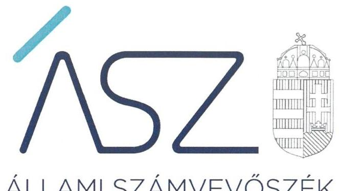
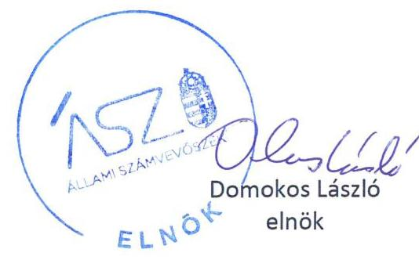
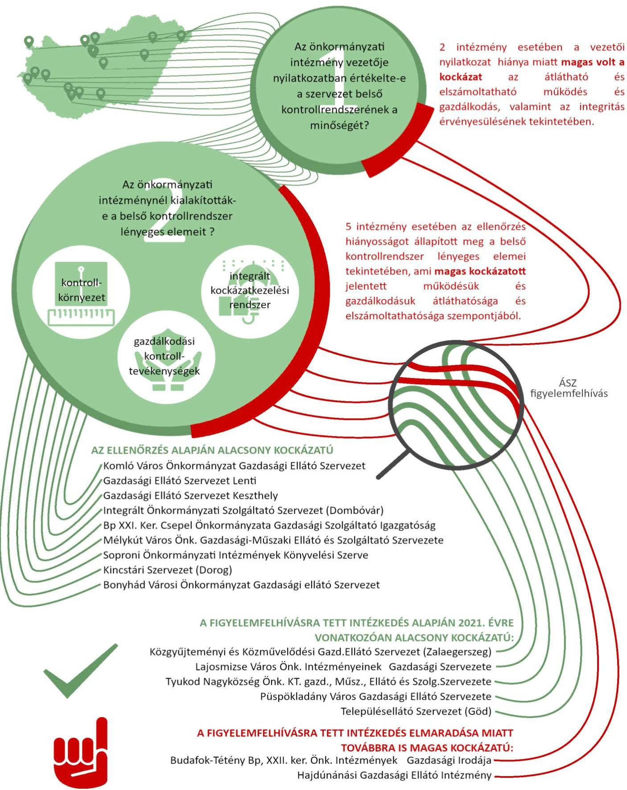

ÁLLAMI SZÁMVEVŐSZÉK

# JELENTÉS 

## Önkormányzatok ellenőrzése

Önkormányzati intézmények integritás és belső kontrollrendszerének ellenőrzése
2021.

21067
www.asz.hu

---

ÁLLAMI SZÁMVEVŐSZÉK

# JELENTÉS 

## Önkormányzatok ellenőrzése

Önkormányzati intézmények integritás és belső kontrollrendszerének ellenőrzése
2021. 12. hó 02. nap

21067
www.asz.hu

---

# AZ ELLENŐRZÉST FELÜGYELTE: 

VARGA EDIT felügyeleti vezető

## AZ ELLENŐRZÉST VEZETTE ÉS A VÉGREHAJTÁSÁÉRT FELELŐS:

DÉZSINÉ KIS HAJNALKA ellenőrzésvezető

## A PROGRAM ÖSSZEÁLLÍTÁSÁÉRT FELELŐS:

GÖRGÉNYI GÁBOR ellenőrzési program készítéséért felelős vezető

IKTATÓSZÁM: EL-3285-001/2021
TÉMASZÁM: 23
ELLENŐRZÉS-AZONOSÍTÓ SZÁM: V0892
Jelentéseink az Országgyúlés számítógépes hálózatán és az interneten a www.asz.hu címen is olvashatóak.

---

# TARTALOMJEGYZÉK 

- ÖSSZEGZÉS ..... 5
- AZ ELLENŐRZÉS AKTUALITÁSA, TÁRSADALMI SZEREPE, SZEMPONTJA ..... 8
- AZ ELLENŐRZÉS TERÜLETE ..... 9
- MELLÉKLETEK ..... 11
- I. AZ ELLENŐRZÖTT INTÉZMÉNYEK ..... 12
- II. AZ ELLENŐRZÖTT INTÉZMÉNYEK KOCKÁZATI BESOROLÁSA ..... 13
- III. ELLENŐRZÉS HATÓKÖRE ÉS MÓDSZERE ..... 15
- IV. ÉRTELMEZŐ SZÓTÁR ..... 17

---

.

---

# ÖSSZEGZÉS 

Az ellenőrzött 16 önkormányzati intézmény közül 9 intézmény kialakította a müködését és gazdálkodását meghatározó belső kontrollrendszere lényeges elemeit a 2019. évben. 7 intézmény esetében a feltárt szabálytalanságok kockázatot jelentettek a gazdálkodás elszámoltathatóságára és átláthatóságára.
5 intézmény vezetője felelős vezetői magatartást tanúsított, az Állami Számvevőszék által biztosított lehetőséggel élve intézkedett a feltárt hiányosságok megszüntetése érdekében.
2 intézmény vezetője nem tanúsított felelős vezetői magatartást, az Állami Számvevőszék felhívása ellenére sem tett lépéseket. Az intézkedések elmaradása miatt magas szintü kockázatok maradtak fenn az intézmények ellenőrzött időszakot követő müködésének és gazdálkodásának átláthatósága és elszámoltathatósága, valamint az integritás érvényesülése tekintetében.

## Az ellenőrzés jelentősége

Az önkormányzati intézmények által ellátott feladatokkal, nyújtott szolgáltatásokkal az állampolgárok széles rétege találkozik, ezek minősége közvetlen hatással van a mindennapjainkra. Az állampolgárok körében felerősödött az az igény, hogy az ellátott feladatok, nyújtott szolgáltatások megfelelő színvonalúak legyenek, a felmerült szükségletekhez igazodjanak és a társadalmi igényeket kielégítsék. Ezért kiemelten fontos, hogy az önkormányzati intézmények szabályszerűen, hatékonyan és eredményesen müködjenek, az integritás elveit szem előtt tartsák, valamint a müködésükben felmerülő kockázatokat felelősen kezeljék.

Az ellenőrzés célja az volt, hogy rámutasson az önkormányzati intézmények integritás és belső kontrollrendszerének kialakításával és müködtetésével kapcsolatos alapvető elvárásokra, a szabályszerű müködést, valamint az integritást veszélyeztető kockázatokra. Ezzel az Állami Számvevőszék (továbbiakban: ÁSZ) előmozdítja az intézmények szabályszerű müködését, erősíti a közpénzfelhasználásban megnyilvánuló integritási szemlélet érvényre jutását, és hozzájárul a közpénzügyi helyzet javulásához.

## Értékelés

2019-ben a 16 intézményből 9 szervezet vezetője adott ki olyan, az intézmény belső kontrollrendszerének minőségét értékelő nyilatkozatot, amelyet az általuk rendelkezésre bocsátott dokumentumok alátámasztottak. 5 intézmény nem tudta igazolni a nyilatkozatban foglaltakat, ebből 4 intézmény nem rendelkezett szervezeti és müködési szabályzattal, 1 intézmény számviteli politikával, további 1 intézmény pedig kötelezettségvállalási és teljesítésigazolási szabályzattal sem. 2 intézmény vezetője egyáltalán nem tett nyilatkozatot, az általa vezetett intézmény belső kontrollrendszerének minőségéről, így nem igazolták, hogy felelős vezetőként gondoskodtak az intézmények szabályszerű működtetéséről, valamint az elszámoltathatóságot, eredményességet és hatékonyságot, az integritás érvényesítését biztosító belső kontrollrendszer kialakításáról és működtetéséről.

2019-ben 16 intézményből 9 intézmény kialakította és megalkotta azokat a lényeges szabályzatokat, amelyek biztosították az intézmények müködésének alapvető feltételét, az intézmények szervezetének, feladatai ellátásának részletes belső rendjét és módját, valamint felelősségi viszonyainak kialakítását. 5 intézmény nem alakította ki kontrollkörnyezetét, ebből 2 intézmény nem rendelkezett a jogosult vezető által kiadott, 1 intézmény az ellenőrzött időszakra vonatkozó, és további 1 intézmény az irányítószerv által jóváhagyott szervezeti és müködési szabályzattal. Ezek az intézmények nem rendelkeztek azokkal az alapvető szabályzatokkal, amelyek a szabályszerű müködés és a felelős gazdálkodás keretéül szolgálnak.

---

A 16 intézményből 1 nem alakította ki a gazdálkodási kontrolltevékenységét, nem rendelkezett a vezető által kiadott a kötelezettségvállalás, a teljesítés igazolás gyakorlásának módját, eljárási és dokumentációs részletszabályait meghatározó belső szabályzattal, ezáltal nem biztosította a gazdálkodási jogkörök gyakorlásához kapcsolódó feladatok szabályszerűségét, a kapcsolódó felelősségi körök, valamint a jogkörök gyakorlása közötti összeférhetetlenséget.

14 intézmény kialakította az integrált kockázatkezelési rendszerét, amely a múködésében felmerülő kockázatok kezelésének felelős kezelését biztosította.

# Következtetés 

Az ÁSZ figyelemfelhívó levéllel fordult az intézmények vezetői felé, amellyel módot adott arra, hogy az intézmények az integritás és belső kontrollrendszer múködés és gazdálkodás alapvető feltételeinek kialakításában meglévő hiányosságokat megszüntessék. Az ÁSZ által biztosított lehetőséggel élve öt intézmény vezetője intézkedett az ellenőrzés során feltártak megszüntetése érdekében, ezzel hozzájárultak az átlátható és elszámoltatható közpénzügyi helyzet javulásához.

Az ÁSZ figyelemfelhívása ellenére két intézmény (Budafok-Tétény Budapest, XXII. kerületi Önkormányzat Intézmények Gazdasági Iroda, Hajdúnánási Gazdasági Ellátó Intézmény) vezetője nem tanúsított felelős vezetői magatartást, az intézkedések elmaradása miatt az általuk vezetett intézmények múködésében magas kockázatok maradtak fenn.

Azoknál az intézményeknél, ahol rendszerszintű - önmaga által nem kezelt - kockázatot azonosított az ÁSZ, új, részletekbe menő ellenőrzés válhat indokolttá.

---

# Önkormányzati intézmények integritás és belső kontroll ellenőrzése 

---

# AZ ELLENŐRZÉS AKTUALITÁSA, TÁRSADALMI SZEREPE, SZEMPONTJA 

Az ÁSZ a törvényi felhatalmazással élve ellenőrzi az önkormányzati intézményeket, hogy megállapításaival támogassa az ellenőrzött szervezetek szabályszerű gazdálkodását, működését. Napjainkban kiemelt aktualitást és jelentőséget kapott a közpénzügyi helyzet javítása, az integritási szemlélet érvényesítésének erősítése, mert a koronavírus okozta társadalmi és gazdasági válság növeli az integritás kockázatokat.

A helyi önkormányzatok intézményei által ellátott feladatok, nyújtott szolgáltatások a mindennapi életünk részét jelentik. Ahhoz, hogy ezek az intézmények jól tudják feladataikat ellátni, a jogszabályokban rögzítetteket be kell tartaniuk, azaz szabályosan kell működniük. A szabályos múködés az alapja az eredményességüknek és hatékonyságuknak. Az intézmények szabályszerű, hatékony és eredményes működésének és gazdálkodásának, valamint az integritás érvényesülésének alapfeltétele a belső kontrollrendszer megfelelő kialakítása.

A belső kontrollrendszer kiépítése és múködtetése egy intézmény szempontjából azért fontos, mert ezáltal kerülnek kialakításra azok a szervezeti és múködési feltételek, gazdálkodási szabályzatok, amelyek biztosítani tudják, hogy az intézmény szabályszerűen lássa el kitűzött feladatát, ugyanakkor érvényesüljenek az elszámoltathatóság, az eredményesség, valamint a rendelkezésre álló források célnak megfelelő felhasználásának elvei. A belső kontrollrendszer megfelelő kialakítása és múködtetése azért is igényel kiemelt figyelmet, mivel ez az integritási szemlélet érvényesülésének alapfeltétele, a közpénzügyi helyzet javulásának fundamentuma, amely egyúttal felelős vezetői magatartást is igényel.

A számvevőszéki ellenőrzés az önkormányzati irányítás alá tartozó intézmények belső kontrollrendszerének pillérei közül a kontrollkörnyezet, a kontrolltevékenységek lényeges elemei és az integrált kockázatkezelési rendszer kialakítására terjedt ki.

A számvevőszéki ellenőrzés arra fókuszált, hogy az ellenőrzött intézmények az intézmény felelős vezetői a belső kontrollrendszer lényeges elemeinek kialakításával hogyan teremtették meg az irányításuk alatt álló szervezetek múködésének azon alapvető feltételeit, amelyek biztosították, hogy a szervezet átlátható és elszámoltatható elvek szerint tudjon múködni és gazdálkodni. Az ellenőrzés kiterjedt az intézmények szervezeti és múködési szabályzatára, a számviteli politikára, az integrált kockázatkezelési szabályzatra, mivel ezek a dokumentumok teremtik meg az egyértelmű és világos felelősségi, valamint hatásköri viszonyokat, átlátható és elszámoltatható elvek szerinti múködés és gazdálkodás kereteit, az integrált kockázatkezelési szabályzat pedig a szervezet múködése szempontjából felmerülő kockázatok felelős kezelését biztosítják. A belső kontrollrendszer megfelelő kialakítása az integritási szemlélet érvényesülésének alapfeltétele, ezért kiemelt figyelmet igényel.

Az intézmények szabályszerű múködésének és gazdálkodásának fenntartása szempontjából kulcsfontosságú a felelős vezetői magatartás és feladatellátás, amelynek része a belső kontrollrendszer minőségének értékeléséről szóló vezetői nyilatkozat megalapozott elkészítése. A belső kontrollrendszer minőségének évenkénti, megfelelő tartalmú értékelése a belső kontrollrendszer jogszabályi előírásoknak megfelelő fenntartásához és fejlesztéséhez járul hozzá, ezáltal az intézmények szabályszerű, átlátható ás elszámoltatható, valamint eredményes és hatékony múködését, az integritás érvényesülését támogatja.

---

# AZ ELLENŐRZÉS TERÜLETE 

## Önkormányzati intézmények

Az ellenőrzött 16 intézmény önkormányzati fenntartású volt, amelyek irányító szervei a települési önkormányzatok képviselő testületei vagy a megyei önkormányzatok közgyűlései voltak. Az ellenőrzött intézmények mindegyike gazdasági szervezettel rendelkező önálló jogi személy volt.

Az ellenőrzött intézmények főtevékenysége volt az önkormányzati intézmények ellátó, kisegítő szolgálata, ezen belül más szerv részére végzett pénzügyi és gazdálkodási, üzemeltetési szolgáltatás, gyermekétkeztetés köznevelési intézményben.

Az ellenőrzött intézmények felsorolása az I. számú mellékletben található.

Az ÁSZ az önkormányzati intézmények ellenőrzése során az intézmények lényeges dokumentumait értékelte, valamint az ellenőrzött szervezetre vonatkozó működési és gazdálkodási kockázatokat azonosította be.

A lényeges dokumentumok tartalmi értékelése olyan kiválasztott kritériumok alapján történt, amelyek bármelyikének a múltbeli időszakra vonatkozóan megállapított hiánya kockázatot jelent az ellenőrzött szervezet jövőbeli gazdálkodására, működésére. Az ÁSZ nem a lényeges területek és azokat alátámasztó dokumentumok szabályszerűségére tett megállapítást, hanem az ellenőrzött szervezetre vonatkozó működési és gazdálkodási kockázatokat azonosította. A kockázatok beazonosítása alapján az egyes intézményeket kockázati kategóriákba sorolta be az ÁSZ.

---

.

---

# MELLÉKLETEK

---

# I. AZ ELLENŐRZÖTT INTÉZMÉNYEK

|  Az intézmény neve | Az intézmény tevékenysége | Irányítószere | Intézmény neve, ahol az ellenőrzött ellátja a gazdasági szervezeti feladatokat  |
| --- | --- | --- | --- |
|  Bonyhád Városi Önkormányzat Gazdasági Ellátó Szervezet | Gazdálkodási feladatok ellátása a gazdasági szervezettel nem rendelkező, hozzárendelt költségvetési szervek részére. | Bonyhád Város Önkormányzata | Solymár Imre Városi Könyvtár, Bonyhádi Gondozási Központ, Völgységi Múzeum, Vörösmarty Mihály Művelődési Központ, Bonyhádi Varázskapu Bölcsőde és Óvoda  |
|  Budafok-Tétény Budapest, XXII. kerületi Önkormányzat Intézmények Gazdasági Irodája | Ellátja a hozzárendelt költségvetési szervek pénzügyi-gazdasági feladatait, valamint a köznevelési intézmények étkeztetéssel kapcsolatos feladatait. | Budafok-Tétény Budapest, XXII. kerületi Önkormányzat | XXII. kerületi Egyesített Óvoda, Egyesített Bölcsőde, Budafok-Tétényi Család és Gyermekjóléti Központ, Budafok-Tétény Budapest, XXII. kerületi Önkormányzat Szociális Szolgálata, Klauzál Gábor Budafok-Tétényi Múvelődési Központ  |
|  Budapest XXI. Kerület Csepel Önkormányzata Gazdasági Szolgáltató Igazgatóság | Ellátja a hozzárendelt költségvetési szervek pénzügyi-gazdasági feladatait, valamint a köznevelési intézmények étkeztetéssel kapcsolatos feladatait. | Budapest XXI. Kerület Csepel Önkormányzata | Csepeli Csodakút Egyesített Óvoda, a Humán Szolgáltatások Igazgatósága, és a Közterület-Felügyelet  |
|  Gazdasági Ellátó Szervezet Lenti | Ellátja a hozzárendelt költségvetési szervek pénzügyi-gazdasági feladatait, valamint a köznevelési intézmények étkeztetéssel kapcsolatos feladatait. | Lenti Város Önkormányzata | Lenti Napközi Otthonos Óvoda, Bölcsőde Lenti, Városi Múvelődési Központ Lenti, Városi Könyvtár Lenti  |
|  Gazdasági Ellátó Szervezet Keszthely | Az önkormányzat által alapított költségvetési szervek pénzügyi, gazdasági feladatainak ellátása, valamint településüzemeltetéssel kapcsolatos feladatok | Keszthely Város Önkormányzata | Keszthely Város Önkormányzata Alapellátási Intézete, Balaton Múzeum, Fejér György Városi Könyvtár, Keszthelyi Család és Gyermekjóléti Központ, Keszthelyi Életfa Óvoda, Goldmark Károly Múvelődési Központ, Keszthely Város Önkormányzat Egyesített Szociális Intézménye  |
|  Hajdúnánási Gazdasági Ellátó Intézmény | Gazdasági, számviteli tevékenység, építményüzemeltetés | Hajdúnánás Város Önkormányzata | Hajdúnánás Óvoda, Szalay János Rendelőintézet, Családés Gyermekjóléti Szolgálat, Központi és Városi Bölcsőde, Möricz Pál Városi Könyvtár és Helytörténeti Gyüjtemény, Hajdúnánás- Folyás-Tiszagyulaháza- Újlikos Szociális és Gyermekjóléti Önkormányzati Társulás  |
|  Integrált Önkormányzati Szolgáltató Szervezet (Dombóvár) | Gazdálkodási feladatok ellátása a gazdasági szervezettel nem rendelkező, hozzárendelt költségvetési szervek részére. | Dombóvár Város Önkormányzata | Földi István Könyvtár és Helytörténeti Gyüjtemény, Dombóvári Szásszorszép Óvoda és Bölcsőde, Dombóvári Szivárvány Óvoda, Dombóvári Egyesített Humán Szolgáltató Intézmény  |
|  Kincstári Szervezet (Dorog) | Más szervek részére végzett pénzügyi-gazdálkodási, üzemeltetési, egyéb szolgáltatások | Dorog Város Önkormányzata | Dorog Többcélú Kistérségi Társulás, Dorog és Térsége Szociális Alapellátó Szolgálat, Dorog Város Könyvtár és Múvelődési Ház, Dorog Város Egyesített Sportintézménye, Dorogi Petőfi Sándor Óvoda, Dorogi Hétszínvirág Óvoda  |
|  Komló Város Önkormányzat Gazdasági Ellátó Szervezet | Ellátja a hozzárendelt költségvetési szervek pénzügyi-gazdasági feladatait. | Komló Város Önkormányzata | Komló Város Óvoda, Komló Város Önkormányzata József Attila Városi Könyvtár és Muzeális Gyüjtemény, Komló Város Önkormányzata Közösségek Háza és Színház  |
|  Közgyüjteményi és Közművelődési Gazdasági Ellátó Szervezet (Zalaegerszeg) | Ellátja a hozzárendelt költségvetési szervek pénzügyi-gazdasági feladatait. | Zalaegerszeg Megyei Jogú Város Önkormányzata | Deák Ferenc Megyei és Városi Könyvtár, Gócseji Múzeum, Keresztúry Dezső VMK, Zalaegerszegi Turisztikai Hivatal és Információs Iroda  |
|  Lajosmizse Város Önkormányzata Intézményeinek Gazdasági Szervezete | Ellátja a hozzárendelt költségvetési szervek pénzügyi-gazdasági feladatait, valamint a köznevelési intézmények étkeztetéssel kapcsolatos feladatait. | Lajosmizse Város Önkormányzata | Lajosmizse Város Múvelődési Háza és Könyvtára  |
|  Mélykút Város Önkormányzat Gazdasági-Műszaki Ellátó és Szolgáltató Szervezete | Önkormányzati intézmények ellátó, kisegítő, üzemeltetési szolgáltatása, közfoglalkoztatási feladatok ellátása | Mélykút Nagyközség Önkormányzata | Mélykút Város Önkormányzat Gondozási Központja  |
|  Püspökladány Város Gazdasági Ellátó Szervezete | Ellátja a hozzárendelt költségvetési szervek pénzügyi-gazdasági feladatait | Püspökladány Város Önkormányzata | Püspökladányi Egyesített Óvoda, Püspökladányi Tajjékos tató és Közművelődési Központ, Püspökladányi Segítő Kezek Szociális Szolgáltató Központ  |
|  Soproni Önkormányzati Intézmények Könyvelési Szerve | Ellátja a hozzárendelt költségvetési szervek pénzügyi-gazdasági feladatait, valamint a köznevelési intézmények étkeztetéssel kapcsolatos feladatait | Sopron Megyei Jogú Város Önkormányzata | SMJ Egyesített Bölcsődék, Soproni Szociális Intézmény, Bánfalvi Óvoda-Kindergarten Wandorf, Hermann Alice Óvoda, Trefort Téri Óvoda, Széchenyi István Városi Könyvtár, Soproni Múzeum, Központi Gyermekkonyha  |
|  Településellátó Szervezet (Göd) | Költségvetési szervek gazdálkodási feladatainak ellátása, településüzemeltetés támogatása, gyermekétkeztetés | Göd Nagyközség Önkormányzata | Gödl Kincsem Óvoda, Gödl Kastély Óvoda, Gödl Alapszolgáltatási Központ, Gödl Szivárvány Bölcsőde, József Attila Múvelődési Ház Göd, Göd Városi Könyvtár  |
|  Tyukod Nagyközség Önkormányzat Képviselő-testület Gazdasági, Műszaki, Ellátó és Szolgáltató Szervezete | Költségvetési szervek gazdálkodási feladatainak ellátása, településüzemeltetés támogatása, gyermekétkeztetés | Tyukod Nagyközség Önkormányzata | Tyukodi Csodák Világa Óvoda  |

---

# II. AZ ELLENŐRZÖTT INTÉZMÉNYEK KOCKÁZATI BESOROLÁSA 

2019. évre vonatkozóan az ÁSZ az ellenőrzés során feltárt hiányosságok alapján az alábbi kockázati csoportba sorolta az ellenőrzött intézményeket:

## Alacsony kockázatú intézmények

$\longrightarrow$ Bonyhád Városi Önkormányzat Gazdasági Ellátó Szervezet (figyelemfelhívással érintett)
$\longrightarrow$ Budapest XXI. Kerület Csepel Önkormányzata Gazdasági Szolgáltató Igazgatóság
$\longrightarrow$ Gazdasági Ellátó Szervezet Lenti
$\longrightarrow$ Gazdasági Ellátó Szervezet Keszthely
$\longrightarrow$ Integrált Önkormányzati Szolgáltató Szervezet (Dombóvár)
$\longrightarrow$ Kincstári Szervezet (Dorog) (figyelemfelhívással érintett)
$\longrightarrow$ Komló Város Önkormányzat Gazdasági Ellátó Szervezet
$\longrightarrow$ Mélykút Város Önkormányzat Gazdasági-Műszaki Ellátó és Szolgáltató Szervezete
$\longrightarrow$ Soproni Önkormányzati Intézmények Könyvelési Szerve (figyelemfelhívással érintett)

## Magas kockázatú intézmények

$\longrightarrow$ Közgyűjteményi és Közművelődési Gazdasági Ellátó Szervezet (Zalaegerszeg)
$\longrightarrow$ Lajosmizse Város Önkormányzata Intézményeinek Gazdasági Szervezete
$\longrightarrow$ Püspökladány Város Gazdasági Ellátó Szervezete
$\longrightarrow$ Településellátó Szervezet (Göd)
$\longrightarrow$ Tyukod Nagyközség Önkormányzat Képviselő-testület Gazdasági, Műszaki, Ellátó és Szolgáltató Szervezete
$\longrightarrow$ Budafok-Tétény Budapest, XXII. kerületi Önkormányzat Intézmények Gazdasági Irodája
$\longrightarrow$ Hajdúnánási Gazdasági Ellátó Intézmény

## Az ÁSZ figyelemfelhívása alapján mérsékelték a kockázatot

$\longrightarrow$ Közgyűjteményi és Közművelődési Gazdasági Ellátó Szervezet (Zalaegerszeg)
$\longrightarrow$ Lajosmizse Város
$\longrightarrow$ Önkormányzata Intézményeinek Gazdasági Szervezete
$\longrightarrow$ Püspökladány Város Gazdasági Ellátó Szervezete
$\longrightarrow$ Településellátó Szervezet (Göd)
$\longrightarrow$ Tyukod Nagyközség Önkormányzat Képviselő-testület Gazdasági, Műszaki, Ellátó és Szolgáltató Szervezete
$\longrightarrow$ Kincstári Szervezet (Dorog)
$\longrightarrow$ Soproni Önkormányzati Intézmények Könyvelési Szerve

---

# Az ÁSZ figyelemfelhívása alapján nem mérsékelték a kockázatot 

## Budafok-Tétény Budapest, XXII. kerületi Önkormányzat Intézmények Gazdasági Irodája

Az intézmény nem szabályszerű kontrollkörnyezetben múködött a 2019. évben, mert az intézmény az államháztartásról szóló 2011. évi CXCV. törvény (továbbiakban: Áht.) 10. § (1) bekezdésében előírtak ellenére nem rendelkezett az intézmény vezetője által kiadott szervezeti és múködési szabályzattal.

Az alapvető szabályozási hiányosság miatt az intézmény vezetőjének a 2019. évre vonatkozóan a költségvetési szerv belső kontrollrendszerének minőségét értékelő nyilatkozata nem volt megalapozott a költségvetési szervek belső kontrollrendszeréről és belső ellenőrzéséről szóló 370/2011. (XII. 31.) Korm. rendelet (továbbiakban: Bkr.) 11. § (1) bekezdésének előírása ellenére.

## Hajdúnánási Gazdasági Ellátó Intézmény

Az intézmény vezetője nem alakította ki a kontrolltevékenységének gyakorlására vonatkozó szabályokat a 2019. évben, mert az intézmény nem rendelkezett az államháztartásról szóló törvény végrehajtásáról szóló 368/2011. (XII. 31.) Korm. rendelet 13. § (2) bekezdés a) pontjában előírtak ellenére az intézmény vezetője által kiadott, a kötelezettségvállalás, a teljesítés igazolás gyakorlásának módját, eljárási és dokumentációs részletszabályait meghatározó belső szabályzattal.

Az alapvető szabályozási hiányosság miatt az intézmény vezetőjének a 2019. évre vonatkozóan a költségvetési szerv belső kontrollrendszerének minőségét értékelő nyilatkozata nem volt megalapozott a Bkr. 11. § (1) bekezdésének előírása ellenére.

---

# III. ELLENŐRZÉS HATÓKÖRE ÉS MÓDSZERE 

## Az ellenőrzés típusa

Megfelelőségi ellenőrzés

## Az ellenőrzött időszak

2019. év

## Az ellenőrzés tárgya

Az önkormányzat irányítása alá tartozó intézmény belső kontrollrendszere egyes elemeinek kialakítása. A belső kontrollrendszer pillérei közül a kontrollkörnyezet, a kontrolltevékenységek lényeges elemei és az integrált kockázatkezelési rendszer kialakítás.

## Az ellenőrzött szervezetek

16 önkormányzati intézmény az I. melléklet szerint

## Az ellenőrzés jogalapja

Az ellenőrzés jogszabályi alapját az Állami Számvevőszékről szóló 2011. évi LXVI. törvény (továbbiakban: ÁSZ tv.) 1. § (3) bekezdés, 5. § (6) bekezdése, valamint az Áht. 61. § (2) bekezdése

## Az ellenőrzés módszerei

Az ellenőrzés az ellenőrzött időszakban hatályos jogszabályok, az ellenőrzés szakmai szabályai, a jelen ellenőrzésre irányadó ÁSZ módszertanok, az ellenőrzési programban foglalt értékelési szempontok szerint került végrehajtásra.

Az ellenőrzést az ÁSZ a program kérdéseire adott válaszok kiértékelésével, valamint a programban ismertetett adatforrások, továbbá az adott időszakban hatályos jogszabályok figyelembevételével folytatta le.

A kockázatértékelésen alapuló, új megközelítésű ellenőrzés során azokat a lényeges területeket értékelte az ÁSZ, amelyek érdemi kockázatot jelenthetnek az ellenőrzött szervezet közpénzügyi helyzetére. Jelen ellenőrzés a szervezet belső kontrollkörnyezetének és kontrolltevékenységének, valamint az integrált kockázatkezelési rendszerének kialakítására terjedt ki, és súlypontok meghatározásával lehetőséget biztosított a kockázatok azonosítására.

Az ÁSZ az ellenőrzés során meghatározott lényeges dokumentumok tartalmi értékelését végezte el, olyan kiválasztott kritériumok alapján, amelyek bármelyikének a múltbeli időszakra vonatkozóan megállapított hiánya kockázatot jelent az ellenőrzött szervezet jövőbeli gazdálkodására,

---

múködésére. A fentiekre tekintettel az ÁSZ nem a lényeges területek és azokat alátámasztó dokumentumok szabályszerűségére tett megállapítást, hanem az ellenőrzött szervezetre vonatkozó múködési és gazdálkodási kockázatokat azonosította.

A kockázatok beazonosítása alapján kerültek besorolásra az egyes intézmények kockázati kategóriákba.

Az ellenőrzés ideje alatt az ellenőrzött szervezettel történő kapcsolattartás az ÁSZ szervezeti és múködési szabályzatának vonatkozó előírásai alapján történt.

Az intézmények vezetői számára figyelemfelhívó levél került megküldésre a 2019. évre vonatkozó szabálytalanságokról, az ÁSZ tv. előírásával összhangban 15 nap állt rendelkezésükre az ebben foglaltak elbírálására, valamint a megfelelő intézkedés meghozatalára.

Az ellenőrzött intézmények vezetői által a figyelemfelhívó levélre adott válaszok alapján az ÁSZ értékelte a 2019. évre vonatkozóan feltárt kockázatok intézményvezetői kezelését. Amennyiben az ellenőrzött intézmények vezetői az ellenőrzési megállapítások alapján intézkedéseket fogalmaztak meg a szabálytalanság megszüntetése érdekében az ÁSZ a múködés és gazdálkodás lényeges területén korábban fennálló kockázatokról megállapította, hogy azt mérsékelték.

---

# IV. ÉRTELMEZŐ SZÓTÁR 

belső kontrollrendszer
belső kontrollrendszer területei
integrált kockázatkezelési rendszer
integritás

Integritási kockázatok
kockázat
kontrollkörnyezet
kontrolltevékenységek
intézmény

A belső kontrollrendszer a kockázatok kezelése és tárgyilagos bizonyosság megszerzése érdekében kialakított folyamatrendszer, amely azt a célt szolgálja, hogy a múködés és gazdálkodás során a tevékenységeket szabályszerűen, gazdaságosan, hatékonyan, eredményesen hajtsák végre, az elszámolási kötelezettségeket teljesítsék, megvédjék az erőforrásokat a veszteségektől, károktól és nem rendeltetésszerű használattól. (Forrás: Áht. 69. § (1) bekezdése)
A kontrollkörnyezet, az integrált kockázatkezelési rendszer, a kontrolltevékenységek, az információs és kommunikációs rendszer, valamint a nyomon követési (monitoring) rendszer. (Forrás: Bkr. 3. §-a)
Olyan folyamatalapú kockázatkezelési rendszer, amely a szervezet minden tevékenységére kiterjed, egységes módszertan és eljárások alkalmazásával, a szervezet célkitűzéseinek és értékeinek figyelembevételével biztosítja a szervezet kockázatainak teljes körű azonosítását, azok meghatározott kritériumok szerinti értékelését, valamint a kockázatok kezelésére vonatkozó intézkedési terv elkészítését és az abban foglaltak nyomon követését. (Forrás: Bkr. 2. § m) pontja)
Az integritás az elvek, értékek, cselekvések, módszerek, intézkedések konzisztenciáját jelenti, vagyis olyan magatartásmódot, amely meghatározott értékeknek megfelel. (Forrás: Nemzetgazdasági Minisztérium: Államháztartási belső kontroll standardok és gyakorlati útmutató 1.1.3. pontja, 2017. szeptember)
Integritási kockázatnak minősül a szervezet célkitűzéseit, értékeit, elveit sértő vagy veszélyeztető visszaélés, szabálytalanság, vagy egyéb esemény lehetősége. A korrupciós kockázat olyan integritási kockázat, amely korrupciós cselekmény bekövetkezésének lehetőségét jelenti. Minden korrupciós kockázat egyben integritási kockázat is. Korrupciós cselekményeknek nevezzük azokat a vesztegetésszerű cselekményeket, amelyeket általában a Büntető Törvénykönyv is büntetéssel fenyeget.
A kockázat annak a valószínűségét jelenti, hogy egy vagy több esemény, vagy intézkedés nem kívánt módon befolyásolja a rendszer működését, céljainak megvalósulását. (Forrás: Javaslatok a korrupciós kockázatok kezelésére - Kockázatkezelési és ellenőrzési módszertan 35. oldal, ÁSZ)
A költségvetési szerv vezetője által kialakított olyan elvek, eljárások, belső szabályzatok összessége, amelyben világos a szervezeti struktúra, a folyamatok átláthatók, egyértelműek a felelősségi, hatásköri viszonyok és feladatok, meghatározottak, ismertek és elfogadottak az etikai elvárások a szervezet minden szintjén, átlátható a humánerőforrás-kezelés, biztosított a szervezeti célok és értékek irányában való elkötelezettség fejlesztése és elősegítése. (Forrás: Bkr. 6. § (1) bekezdése)
A költségvetési szerv vezetője által a szervezeten belül kialakított (kontroll) tevékenységek, melyek biztosítják a kockázatok kezelését, hozzájárulnak a szervezet céljainak eléréséhez és erősítik a szervezet integritását. (Forrás: Bkr. 8. § (1) bekezdése)
A helyi önkormányzatok és társulások irányítása alá tartozó költségvetési szervek. (A képviselő-testület a feladatkörébe tartozó közszolgáltatások ellátására - jogszabályban meghatározottak szerint - költségvetési szervet (önkormányzati intézmény) alapíthat. (Forrás: Magyarország helyi önkormányzatairól szóló 2011. évi CLXXXIX. törvény 41. § (6) bekezdése)

---

# ASZ 

ALLAMI SZAMVEVOSZEK
1052 Budapest, Apáczai Cs. J. u. 10. I 1364 Budapest 4. Pf. 54
TEL: +36 14849100
email: szamvevoszek@asz.hu
web: www.asz.hu | www.aszhirportal.hu