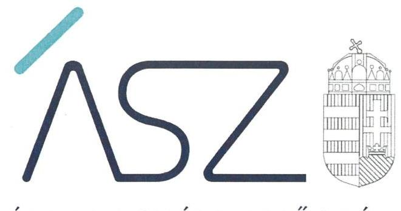
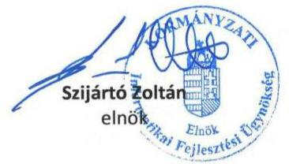

ÁLLAMI SZÁMVEVŐSZÉK

# JELENTÉS 

## A központi költségvetési szervek ellenőrzése

Kormányzati Informatikai Fejlesztési Ügynökség
2021.

21068
www.asz.hu

---

ÁLLAMI SZÁMVEVŐSZÉK

# JELENTÉS 

## A központi költségvetési szervek ellenőrzése

Kormányzati Informatikai Fejlesztési Ügynökség
2021. O7. hó 13. nap

21068
www.asz.hu

---

# AZ ELLENŐRZÉST FELÜGYELTE: 

VARGA EDIT felügyeleti vezető
SALAMON ILDIKÓ felügyeleti vezető

AZ ELLENŐRZÉST VEZETTE ÉS A VÉGREHAJTÁSÁÉRT FELELŐS:
KORMÁNY GERGELY ellenőrzésvezető
DORMÁN ISTVÁN ellenőrzésvezető
BAJNAI ZSUZSANNA ellenőrzésvezető
JANIK JÓZSEF ellenőrzésvezető

A PROGRAM ÖSSZEÁLLÍTÁSÁÉRT FELELŐS:
GÖRGÉNYI GÁBOR osztályvezető
HORVÁTH TÍMEA projektvezető

IKTATÓSZÁM: EL-3291-001/2021.
TÉMASZÁM: 2549
ELLENŐRZÉS-AZONOSÍTÓ SZÁM: V089312, V089320, V089321

---

# TARTALOMJEGYZÉK 

■ ÖSSZEGZÉS ..... 5
■ AZ ELLENŐRZÉS CÉLJA ..... 6
■ AZ ELLENŐRZÉS TERÜLETE ..... 7
■ AZ ELLENŐRZÉS HÁTTERE, INDOKOLTSÁGA ..... 8
■ A JELENTÉS LÉNYEGES KÉRDÉSKÖREI ..... 9
■ AZ ELLENŐRZÉS HATÓKÖRE ÉS MÓDSZEREI ..... 10
■ MEGÁLLAPÍTÁSOK ..... 12
■ JAVASLATOK ..... 16
■ MELLÉKLETEK ..... 17
I. sz. melléklet: Értelmező szótár ..... 17
■ FÜGGELÉK: ÉSZREVÉTELEK ..... 19
■ RÖVIDÍTÉSEK JEGYZÉKE ..... 25

---

.

---

# ÖSSZEGZÉS 

A Kormányzati Informatikai Fejlesztési Ügynökség vezetője a szervezet müködésének szabályozási környezetét kialakította. Az integritás kontrollok támogatták a korrupciós kockázatok kezelését. Szervezeti teljesítménycélokat meghatároztak, azok alakulását nyomon követték és értékelték. A kontrolltevékenységek szabályszerű gyakorlásának előfeltételeit nem biztosították, ami kockázatot hordoz a közpénzekkel történő felelős gazdálkodás terén.

## Az ellenőrzés társadalmi indokoltsága

Az államháztartás központi alrendszerébe tartozó szervezetek alapvető rendeltetése a társadalom javát szolgáló közfeladatok ellátásának hatékony, számon kérhető, pazarlásmentes biztosítása. A közpénzek felhasználásában meghatározó arányt képviselő központi költségvetési szervek gazdálkodásuk révén jelentős hatást gyakorolhatnak a költségvetés egyensúlyának fenntartására, a nemzeti vagyon értékének megóvására.

A szabályszerű, korrupciómentes, átlátható működés és az elszámoltatható közpénzfelhasználás alapfeltétele az integritás kontrollokat is magában foglaló belső kontrollrendszer szabályszerű kiépítettsége, a kontrollok működtetése, a gazdaságosság, hatékonyság és eredményesség követelményei érvényesülésének biztosítása.

A teljesítmény mérését és értékelését lehetővé tevő rendszerek kiépítése és működtetése, a szervezeti teljesítmény mérése elengedhetetlen ahhoz, hogy a közszféra intézményei eleget tegyenek annak az Alaptörvényben foglalt követelménynek, amely szerint a közpénzeket törvényesen, célszerűen és eredményesen kell kezelniük.

A szervezeti teljesítmény növelésére, a fejlődési lehetőségek kihasználására irányuló vezetői teljesítményértékelési rendszer kialakítása és működtetése hozzájárul a „jól irányított állam" megteremtéséhez.

Indokolt ezért, hogy az Állami Számvevőszék a központi költségvetési szervek belső kontrollrendszerét rendszeresen ellenőrizze, értékelve működésük irányítottságát, korrupció elleni védettségét, a szervezeti teljesítmény méréséhez szükséges követelmények kialakítását és érvényesítését, továbbá a vezetői feladatok, kötelezettségek ellátásának minőségét.

## Főbb megállapítások, következtetések, javaslatok

A Kormányzati Informatikai Fejlesztési Ügynökség kontrollkörnyezetének kialakítása a jogszabályi követelményekkel összhangban történt, rendelkeztek az előírások szerinti szervezeti, gazdálkodási és számviteli szabályozásokkal. Az információs és kommunikációs rendszert szabályszerűen kialakították.

A kockázatkezelési, valamint a szervezeti tevékenység és célok nyomon követését biztosító rendszer kialakítása és működtetése szabályszerű volt.

A kötelezettségvállalások, más fizetési kötelezettségek nyilvántartását nem a jogszabályi előírások szerint alakították ki, ezért a kontrolltevékenységek szabályszerű elvégzésének előfeltételei nem voltak biztosítottak, így nem támogatták a közpénzekkel való átlátható és elszámoltatható gazdálkodást.

Az integritás követelményei érvényesültek, az integritás kontrollrendszer kiépítettsége a jogszabályoknak megfelelt, azonban a nem kötelezően előírt kontrollok területén további fejlesztési lehetőségek állnak fenn.

A Kormányzati Informatikai Fejlesztési Ügynökségre vonatkozó eredményességi szervezeti teljesítménycélokat meghatározták, a szervezeti teljesítmény mérését szolgáló gazdaságossági és hatékonysági követelményeket kialakították. A számszerűsített eredményességi, gazdaságossági és hatékonysági célkitűzések megvalósulását nyomon követték, mérték, amivel megteremtették a feltételeket ahhoz, hogy a szervezet a kitűzött célok irányába haladjon.

Az Állami Számvevőszék az ellenőrzés során feltárt hibák kijavítása céljából a Kormányzati Informatikai Fejlesztési Ügynökség elnöke részére két javaslatot fogalmazott meg.

---

# AZ ELLENŐRZÉS CÉLJA 

AZ ELLENŐRZÉS CÉLJA annak megállapítása volt, hogy a központi költségvetési szerv belső kontrollrendszere biztosította-e az átlátható, szabályszerű, gazdaságos, hatékony és eredményes gazdálkodás feltételeit. Az ellenőrzés keretében az ÁSZ értékelte, hogy a központi költségvetési szervnél kiépítették-e a korrupciós kockázatok kezelését szolgáló integritási kontrollokat, továbbá sor került-e az eredményesség, hatékonyság és gazdaságosság követelményeinek érvényesülését biztosító teljesítménycélok kitűzésére, teljesítménykövetelmények kialakítására, illetve megtörtént-e a teljesítménycélok mérése, értékelése. Az ellenőrzés célja volt továbbá a vezetői tevékenységben rejlő kockázatok azonosítása az egyes vezetői feladatok, kötelezettségek ellátásával összefüggésben.

---

# AZ ELLENŐRZÉS TERÜLETE 

## Kormányzati Informatikai Fejlesztési Ügynökség

A Kormányzati Informatikai Fejlesztési Ügynökség a Kormány által 2006-ban alapított, az informatikáért felelős miniszter irányítása alá tartozó központi költségvetési szerv. Jogállását, feladatait a Kormányzati Informatikai Fejlesztési Ügynökségről szóló 268/2010. (XII. 3.) Kormányrendelet határozza meg. Irányító szerve 2019-ben az Innovációs és Technológiai Minisztérium volt.

A KIFÜ ${ }^{1}$ alaptevékenységét informatikai tárgyú kiemelt ágazati fejlesztési projektek központosított tervezése és lebonyolítása jelenti. Ennek érdekében a Kormány döntése alapján, vagy az ágazati miniszterek, illetve az érintett költségvetési szervek felkérésére közreműködik egyes ágazati infokommunikációs fejlesztések, hazai finanszírozású és európai uniós társfinanszírozású projektek megtervezésében és megvalósításában. Projektgazdaként, konzorciumvezetőként, vagy más szerepkörben projektmenedzsment és független minőségbiztosítási feladatokat, valamint egyéb, a projektek sikeres lebonyolítását támogató szakértői feladatokat láthat el, ideértve a pénzügyi elszámolások szabályszerűségéről való gondoskodást is. Közfeladatai körébe tartozik a Központi Informatikai Beszerzési Rendszer múködtetése, az információs társadalom fejlesztésével, ezen belül kiemelten a digitális írástudás fejlesztésével, a Digitális Jólét Program Pontok hálózat szakmai koordinálásával kapcsolatos feladatok ellátása, a Nemzeti Információs Infrastruktúra Fejlesztési Program végrehajtása, valamint az információs társadalom fejlesztésével kapcsolatos felnőttképzés.

A KIFÜ a gazdálkodásával összefüggő feladatokat saját gazdasági szervezettel látja el. Az intézményt az informatikáért felelős miniszter által kinevezett elnök vezeti. Az elnök személye - aki a 2019. július 21. és október 3. közötti időszakban általános elnökhelyettesként látta el az elnöki fel-adat- és hatásköröket - az ellenőrzött 2019. évben nem változott.

---

# AZ ELLENŐRZÉS HÁTTERE, INDOKOLTSÁGA 

A belső kontrollrendszer szabályszerű kialakítása és működtetése a közpénzek, a közvagyon átlátható, szabályos, gazdaságos, hatékony és eredményes felhasználásának alapfeltétele. A belső kontrollrendszer azt a célt szolgálja, hogy a költségvetési szervek múködésük és gazdálkodásuk során a tevékenységeket szabályszerűen hajtsák végre, teljesítsék elszámolási kötelezettségeiket és megvédjék az erőforrásokat a veszteségektől, a károktól és a nem rendeltetésszerű használattól. A belső kontrollrendszer magában foglalja mindazon elveket, eljárásokat és belső szabályzatokat, amelyek biztosítják, hogy a költségvetési szerv működése szabályszerű és szabályozott legyen, valamennyi tevékenysége és célja összhangban álljon a gazdaságosság, hatékonyság és eredményesség követelményeivel, az eszközökkel és forrásokkal való gazdálkodásban ne kerüljön sor pazarlásra, visszaélésre, rendeltetésellenes felhasználásra. Megfelelő, pontos és naprakész információk álljanak rendelkezésre a költségvetési szerv müködésével kapcsolatosan, és a belső kontrollrendszer harmonizációjára, összehangolására vonatkozó jogszabályok végrehajtásra kerüljenek. Az integritás kontrollok kiépítése a szervezet korrupciós kockázatainak kezelését szolgálja. A teljesítménykövetelmények meghatározása és müködtetése megalapozhatja a központi költségvetési szervnél a teljesítmény-ellenőrzés lefolytatását.

Az ÁSZ² szisztematikusan ellenőrzi a költségvetési szervek belső kontrollrendszerét, hogy az ellenőrzések megállapításaival támogassa az ellenőrzött szervezetek szabályszerű gazdálkodását, javaslataival elősegítse az Alaptörvényben megfogalmazott alapvetések érvényesülését a mindennapi életben a szervezetek szintjén.

Azt, hogy a központi költségvetési szervnél gondoskodtak- e a szervezet tevékenységében az eredményesség, hatékonyság és gazdaságosság követelményeinek érvényesítéséről, teljesítmény-ellenőrzéssel értékeli az ÁSZ. Ennek előfeltétele mérhető, nyomon követhető teljesítménycélok, teljesítménykövetelmények meghatározása, valamint a célok előrehaladásának mérése, értékelése annak érdekében, hogy a teljesítménycélok megvalósításával a szervezet a kitűzött irányban haladjon.

A „jól irányított állam" megteremtésével kapcsolatos cél megvalósítását szolgálja olyan vezetői teljesítményértékelési rendszer kialakítása és müködtetése, amely hozzájárul a szervezeti teljesítmény növeléséhez, a fejlődési lehetőségek kihasználásához. A rendszer kiépítését az ÁSZ a vezetői értékeléseket megalapozó ellenőrzések lefolytatásával támogatja.

Az ellenőrzések során az ÁSZ „jó gyakorlatokat" is azonosíthat, melyeket tanácsadó funkciója keretében szélesebb körben is megismertethet az érintettekkel, ezáltal is hozzájárulva a költségvetési rendszer szabályozott, átlátható, elszámoltatható és fenntartható müködéséhez.

---

# A JELENTÉS LÉNYEGES KÉRDÉSKÖREI 

1. Szabályszerü volt-e a központi költségvetési szerv belső kontrollrendszerének kialakítása?
2. Szabályszerüen müködtették-e a központi költségvetési szerv belső kontrollrendszerét?
3. A központi költségvetési szervnél kiépítették-e az integritás kontrollrendszerét?
4. A központi költségvetési szerv rendelkezett-e szervezeti teljesítménycélokkal, alakítottak-e ki a szervezeti teljesítmény mérésére alkalmas követelményeket, és érvényesítették-e azokat?
5. A központi költségvetési szerv vezetője feladatai, kötelezettségei ellátásával hozzájárult-e a felelős gazdálkodás követelményeinek érvényesüléséhez?

---

# AZ ELLENŐRZÉS HATÓKÖRE ÉS MÓDSZEREI 

## Az ellenőrzés típusa

Megfelelőségi és teljesítmény-ellenőrzés.

## Az ellenőrzött időszak

A 2019. év.

## Az ellenőrzés tárgya

A központi költségvetési szerv belső kontrollrendszerének kialakítása és múködtetése, valamint az integritás kontrollok kiépítettsége. A szervezetnél kialakított, az eredményesség, a hatékonyság és a gazdaságosság követelményeinek érvényesülését biztosító, mérhető, nyomon követhető teljesítménycélok, valamint az azokhoz meghatározott célértékek, teljesítménykövetelmények; a célok megvalósulásának mérése, értékelése; az eredményesség, a hatékonyság és a gazdaságosság követelményeinek érvényesítése. A szervezet vezetőjének tevékenysége az irányító szervnek megküldött, a belső kontrollrendszer minőségének értékelésére vonatkozó nyilatkozat, a szabályszerű gazdálkodás feltételeinek megteremtése és a kockázatkezelési rendszer kialakítása tekintetében.

## Az ellenőrzött szervezet

Kormányzati Informatikai Fejlesztési Ügynökség

## Az ellenőrzés jogalapja

Az ellenőrzés jogszabályi alapját az ÁSZ tv. ${ }^{3} 1 . \S$ (3) bekezdés, 5. § (2)-(3) és (6) bekezdései, valamint az Áht. ${ }^{4} 61 . \S$ (2) bekezdésének előírásai képezik.

## Az ellenőrzés módszerei

Az ÁSZ az ellenőrzést az ellenőrzési program szempontjai, az ellenőrzött időszakban hatályos jogszabályok, az ellenőrzés szakmai szabályai, és a jelen ellenőrzésre irányadó ÁSZ módszertanok figyelembevételével hajtja végre.

---

Az ellenőrzési kérdések megválaszolásához szükséges bizonyítékok megszerzése az ellenőrzött által rendelkezésre bocsátott dokumentumokra, adatokra alapozva megfigyelés, szemle (szemrevételezés), kérdésfeltevés (információkérés), mintavételezés, valamint elemző eljárás útján történik. Az ellenőrzési bizonyítékként felhasználható adatforrások közé tartoznak az ellenőrzési program részletes szempontjainál felsorolt adatforrások, valamint minden egyéb - az ellenőrzés folyamán feltárt, az ellenőrzés szempontjából információt tartalmazó - dokumentum.

Az ellenőrzés lefolytatásához az ellenőrzött szervezet tanúsítvány kitöltésével, valamint az ÁSZ által kért dokumentumok megküldésével szolgáltat adatokat, amelyek valódiságát és teljes körűségét az ellenőrzött szervezet vezetője által tett teljességi és hitelességi nyilatkozat igazolja. A rendelkezésre bocsátott adatok, információk kontrollja az ellenőrzés keretében történik.

A központi költségvetési szerv belső kontrollrendszere egyes területeinek kialakítására és működtetésére vonatkozó értékelés:
$\longrightarrow$ „szabályszerű", amennyiben az értékelt területen az elért „igen" válaszok százalékban kifejezett, egész számra kerekített aránya legalább $85 \%$,
$\longrightarrow$ „nem szabályszerű", ha nem éri el a $85 \%$-ot.
A központi költségvetési szerv belső kontrollrendszerének összesített értékelése (a kontrollrendszer egésze) esetében a „szabályszerű" értékelés feltétele, hogy egyik kontrollterület sem kaphat „nem szabályszerű" értékelést.

Az ÁSZ statisztikai módszereken alapuló mintavételt alkalmaz. A mintavételi eredmények értékelését az ÁSZ 95\%-os megbízhatósági szint mellett végzi el.

Az integritási kontrollok kiépítettségének értékelése során helyénvalósági kritériumokat is alkalmaz az ÁSZ. A helyénvalósági kritériumok jogszabályok által kötelezően nem előírt, elvárt szempontok, amelyek ugyanakkor hozzájárulnak az ellenőrzött szervezet integritásának megerősítéséhez. A helyénvalósági kritériumok alapján tett megállapítások rögzítése dőlt betű alkalmazásával történik.

A szabályszerűségi ellenőrzésre épülő teljesítmény-ellenőrzés keretében az ÁSZ arra fókuszál, hogy a központi költségvetési szervek a jogszabályi előírások alapján elkészítendő dokumentumokban, vagy egyéb, nem jogszabály által meghatározott dokumentumokban alakítottak-e ki és ér-vényesítették-e a szervezet teljesítményének mérésére alkalmas követelményeket.

Az ellenőrzés ideje alatt az ÁSZ az ellenőrzött szervezettel történő kapcsolattartást az ÁSZ-SZMSZ5-ének előírásai alapján biztosítja.

---

# 1. Szabályszerú volt-e a központi költségvetési szerv belső kontrollrendszerének kialakítása? 

Összegző megállapítás

A KIFÜ belső kontrollrendszerének kialakítása szabályszerű volt.

A SZABÁLYSZERŰ KONTROLLKÖRNYEZET biztosított volt.

A szervezeti és müködési kereteket meghatározó SZMSZ ${ }^{6}$-t az Áht., az Ávr. ${ }^{7}$ és a Bkr. ${ }^{8}$ előírásaival összhangban alakították ki, megalkották a va-gyonnyilatkozat-tétellel kapcsolatos szabályokat is.

A gazdálkodás részletes rendjére irányadó szabályokat meghatározták, rögzítették a beszerzések lebonyolításával, a költségvetés tervezésével, a beszámolással, a kötelezettségvállalás, teljesítés igazolás gyakorlásának módjával, részletszabályaival, valamint az ezeket végző személyek kijelölésének rendjével kapcsolatos belső előírásokat, eljárásokat.

A pénzügyi-számviteli szabályozásokat, így a számviteli politikát, az eszközök és a források leltárkészítési és leltározási szabályzatát, az eszközök és a források értékelési szabályzatát, és a pénzkezelési szabályzatot a Számv. tv. ${ }^{9}$ és az Áhsz. ${ }^{10}$ rendelkezéseivel összhangban készítették el.

## AZ INTEGRÁLT KOCKÁZATKEZELÉSI RENDSZER

kialakítása szabályszerűen történt. A KIFÜ a Bkr. előírásaival összhangban rendelkezett integrált kockázatkezelési szabályzattal.

## A SZERVEZET INFORMÁCIÓS ÉS KOMMUNIKÁ-

CIÓS RENDSZERÉT a KIFÜ elnöke a Bkr. rendelkezései szerint alakította ki, az Ávr. előírásainak érvényesítésével szabályozta a közérdekú adatok megismerésére irányuló igények teljesítésének és a kötelezően közzéteendő adatok nyilvánosságra hozatalának rendjét.

## A SZERVEZET TEVÉKENYSÉGÉNEK, A CÉLOK MEGVALÓSÍTÁSÁNAK NYOMON KÖVETÉSI RENDSZERÉT a KIFÜ-nél kialakították. Meghatározták a folyamatos és eseti nyomon követéshez kapcsolódó felelősségi és információs szinteket, kapcsolatokat, az irányítási és ellenőrzési folyamatokat. A nyomon követési rendszer részeként a belső ellenőrzést a Bkr. előírásaival összhangban kialakították, feladatait meghatározták.

---

# 2. Szabályszerűen működtették-e a központi költségvetési szerv belső kontrollrendszerét? 

Összegző megállapítás

## 2.1. számú megállapítás

2.2. számú megállapítás

## A belső kontrollrendszer múködtetése nem volt szabályszerű.

A kontrolltevékenységek gyakorlása nem volt szabályszerű.
A kontrolltevékenységek szabályszerű gyakorlásának előfeltételei nem voltak biztosítottak, mivel a kötelezettségvállalások, más fizetési kötelezettségek nyilvántartása nem tette lehetővé a kontrolltevékenységek szabályszerű elvégzését. A nyilvántartás az Áhsz. 39. § (3) bekezdésében foglaltakkal ellentétben a 14. melléklet II. 4. a), c), e), g), h) és i) pontjaiban előírtak közül nem tartalmazta
$\longrightarrow$ a pénzügyi ellenjegyzésre vonatkozó adatokat;
$\longrightarrow$ a jogosult azonosításához és a pénzügyi teljesítéshez szükséges adatokat;
$\longrightarrow$ a költségvetési évben a pénzügyi teljesítési határidőket dátum szerint;
$\longrightarrow$ a pénzügyi teljesítések dátumát, összegét, egységes rovatrend szerint besorolását;
$\longrightarrow$ végleges kötelezettségvállalás esetén annak és módosulásai, a pénzügyi teljesítési adatok könyvviteli számlákon történő elszámolásának időpontjait és a könyvviteli számlák megnevezését;
$\longrightarrow$ devizában fennálló kötelezettségvállalás esetén a kötelezettségvállalás és annak módosulásai összegét a forint mellett devizában is, a nyilvántartásba vételi árfolyamot, a mérleg fordulónapi árfolyamot.
Továbbá az Áhsz. 5. § (1) bekezdésében, 39. § (3) bekezdésében és 45. § (3) bekezdésében foglaltak ellenére nem gondoskodtak a beszámoló adatainak a könyvviteli számlákhoz kapcsolódó részletező nyilvántartásokkal történő alátámasztásáról, mivel az egyéb külső személyi juttatások 2019. évi költségvetési beszámolóban szereplő értékét a részletező nyilvántartások adatai nem támasztották alá.

Az integrált kockázatkezelési rendszert szabályszerűen működtették.

A KIFÜ elnöke kijelölte az integrált kockázatkezelési rendszer koordinálásáért felelős személyt. Felmérték, beazonosították és nyilvántartásba vették a szervezet tevékenységében rejlő és a szervezeti célokkal összefüggő kockázatokat, meghatározták az egyes kockázatokkal kapcsolatban szükséges intézkedéseket, és kiépítették azok nyomon követésének rendszerét.

## A monitoring rendszer múködtetése szabályszerű volt.

A kitűzött szervezeti célok teljesítésére vonatkozó adatokat, információkat rögzítették, azokat éves beszámolóban értékelték. A belső ellenőrzés jóváhagyott ellenőrzési terv szerint végezte tevékenységét, amelynek eredményéről éves összefoglaló ellenőrzési jelentésben adott számot. A belső és külső ellenőrzések javaslatai alapján készített intézkedési tervek végrehajtását a Bkr. előírásai szerint vezetett nyilvántartásokban követték nyomon.

---

# 3. A központi költségvetési szervnél kiépítették-e az integritás kontrollrendszerét? 

Összegző megállapítás A KIFÜ-nél az integritás kontrollok kiépítése megfelelő volt.
A KIFÜ-nél az integritás követelményrendszere érvényesült, a jogszabályokban meghatározott kontrollok kiépítettsége megfelelő volt, támogatta az integritás elvű működést. A szervezet rendszeresen végzett korrupciós kockázatelemzést.

A jogszabályok által kötelezően elő nem írt integritást erősítő kontrollok tekintetében további előrelépés lehetséges, elsősorban korrupcióellenes belső képzések megtartása, illetve a külsős szakértők, foglalkoztatottak alkalmazási feltételeinek szabályozása terén.

## 4. A központi költségvetési szerv rendelkezett-e szervezeti teljesítménycélokkal, alakítottak-e ki a szervezeti teljesítmény mérésére alkalmas követelményeket, és érvényesítették-e azokat?

Összegző megállapítás A KIFÜ rendelkezett szervezeti teljesítménycélokkal, a szervezet elnöke kialakította és érvényesítette a szervezeti teljesítmény mérésének követelményeit.
4.1. számú megállapítás A KIFÜ rendelkezett eredményességi, gazdaságossági és hatékonysági szervezeti teljesítménycélokkal.

EREDMÉNYESSÉGI teljesítménycélokat az Innovációs és Technológiai Minisztérium, mint irányító szerv határozott meg a KIFÜ számára határidővel, beszámolási kötelezettség előírásával. A teljesítménycélok a szervezet által megvalósított projektekhez kapcsolódtak, a célokhoz rendelt konkrét feladatok megjelentek a KIFÜ éves feladattervében.

Mérőszámot a Diákháló program teljesítménycéljai tartalmaztak a köznevelési és szakképzési intézményeknél a digitális oktatáshoz szükséges sávszélesség kialakítása és biztosítása, valamint a belső WiFi hálózatok kiépítése és múködtetése tekintetében, továbbá a komplett WiFi hálózat rendelkezésre állásának biztosítására vonatozóan.
A KIFÜ ELNÖKE HATÉKONYSÁGI ÉS GAZDASÁ-
GOSSÁGI teljesítménycélokat és célértékeket határozott meg a szervezeti stratégiához igazodóan, az alábbi lényeges területek tekintetében:
$\longrightarrow$ a KIFÜ által üzemeltetett szuperszámítógép kapacitásának ügyfélkihasználtsága,
$\longrightarrow$ a sikeresen megvalósuló projektek összes projekten belüli aránya,
$\longrightarrow$ az európai uniós projektek külső ellenőrzéseinek pénzügyi megállapításaiból fakadó visszafizetési kötelezettségek minimalizálása,
$\longrightarrow$ a hatékony szervezeti múködés érdekében egyes konkrét belső feladatok (jogi kérdésekre válaszadás, és adatok beszámolókhoz szükségeslistázása) elvárt átfutási ideje.

---

# 4.2. számú megállapítás 

A kitűzött célok elérésének nyomon követése biztosított volt, a teljesítmény követelmények érvényesítése érdekében meghatározott mutatókat értékelték.

A számszerűsített eredményességi, gazdaságossági és hatékonysági célok elérésének nyomon követését a vezetői információs rendszer keretében készített évközi kimutatások és a szakmai beszámolók biztosították.

A Diákháló programhoz kapcsolódó teljesítménycélok közül a rendelkezésre állás a kitűzött 95\%-os mértéknél magasabban, 98\%-os szinten teljesült, míg a digitális oktatáshoz szükséges sávszélesség biztosítására és a belső WiFi hálózatok kiépítettségéhez vonatkozó célkitűzések esetében elmaradást állapítottak meg a kiértékelések a 2019. decemberi adatok alapján. Az elmaradások okait feltárták, a célok eléréshez szükséges további, elsősorban az infrastruktúra fejlesztése terén megvalósítandó intézkedéseket meghatározták.

A szervezeti teljesítmény hatékonyságának, gazdaságosságának mérésére meghatározott öt számszerűsített célból négy az értékelések alapján az elvárásnak megfelelően alakult, míg a szuperszámítógép kapacitásának nemzetközi szakmai sztenderdeknek megfelelő arányú ügyfélkihasználtságára vonatkozó célkitúzés megvalósulását nem értékelték.

## 5. A központi költségvetési szerv vezetője feladatai, kötelezettségei ellátásával hozzájárult-e a felelős gazdálkodás követelményeinek érvényesüléséhez?

Összegző megállapítás

A KIFÜ elnöke vezetői feladatainak, kötelezettségeinek ellátásával hozzájárult a felelős gazdálkodás követelményeinek érvényesüléséhez.

A KIFÜ elnöke a szabályszerű múködés és gazdálkodás lényeges feltételeit, valamint a kockázatkezelés rendszerét kialakította. A szervezet belső kontrollrendszerének minőségét a Bkr. előírásaival összhangban elkészített nyilatkozatban értékelte, amelyet a költségvetési beszámolóval egyidejűleg, határidőben megküldött az irányító szerv részére. Mindezzel megteremtette felelős gazdálkodás követelményeinek érvényesüléséhez szükséges előfeltételeket.

---

# JAVASLATOK 

Az ÁSZ tv. 33. § (1) bekezdésében foglaltak értelmében az ellenőrzött szervezet vezetője köteles a jelentésben foglalt megállapításokhoz kapcsolódó intézkedési tervet összeállítani és azt a jelentés kézhezvételétől számított 30 napon belül az ÁSZ részére megküldeni. Amennyiben az ellenőrzött szervezet vezetője nem küldi meg határidőben az intézkedési tervet, vagy továbbra sem elfogadható intézkedési tervet küld, az Állami Számvevőszék elnöke az ÁSZ tv. 33. § (3) bekezdése a) és b) pontjaiban foglaltakat érvényesítheti.

## A Kormányzati Informatikai Fejlesztési Ügynökség elnökének

1. Intézkedjen a kontrolltevékenységek szabályszerű gyakorlása érdekében a kötelezettségvállalások, más fizetési kötelezettségek nyilvántartásának jogszabályi előírások szerinti kialakításáról.
(2.1. számú megállapítás 1. bekezdése alapján)
2. Intézkedjen a beszámoló adatainak a könyvviteli számlákhoz kapcsolódó részletező nyilvántartásokkal történő alátámasztásáról.
(2.1. számú megállapítás 2. bekezdése alapján)

---

# MELLÉKLETEK 

- I. SZ. MELLÉKLET: ÉRTELMEZŐ SZÓTÁR
belső ellenőrzés
belső kontrollrendszer
belső kontrollrendszer területei

Diákháló program
információs és kommunikációs rendszer
eredményesség
gazdaságosság
hatékonyság
integrált kockázatkezelési rendszer
integritás
irányító szerv/felügyeleti szerv

Független, tárgyilagos bizonyosságot adó és tanácsadó tevékenység, amelynek célja, hogy az ellenőrzött szervezet működését fejlessze és eredményességét növelje, az ellenőrzött szervezet céljai elérése érdekében rendszerszemléletű megközelítéssel és módszeresen értékeli, illetve fejleszti az ellenőrzött szervezet irányítási és belső kontrollrendszerének hatékonyságát. (Forrás: Bkr. 2. § b) pont)
A kockázatok kezelése és tárgyilagos bizonyosság megszerzése érdekében kialakított folyamatrendszer, amely azt a célt szolgálja, hogy a működés és gazdálkodás során a tevékenységeket szabályszerűen, gazdaságosan, hatékonyan, eredményesen hajtsák végre, az elszámolási kötelezettségeket teljesítsék, megvédjék az erőforrásokat a veszteségektől, károktól és nem rendeltetésszerű használattól. (Forrás: Áht. 69. § (1) bek.)
A kontrollkörnyezet, az integrált kockázatkezelési rendszer, a kontrolltevékenységek, az információs és kommunikációs rendszer, valamint a nyomon követési (monitoring) rendszer. (Forrás: Bkr. 3. §)
A digitális oktatáshoz szükséges sávszélesség biztosításáról, a belső WiFi hálózat kiépítéséről és működtetéséről szóló 1762/2017.(XI.7.) Korm. határozat alapján meghatározott közfeladat.
A költségvetési szerv vezetője által kialakított és működtetett olyan rendszer, mely biztosítja, hogy a megfelelő információk a megfelelő időben eljutnak az illetékes szervezethez, szervezeti egységhez, illetve személyhez. (Forrás: Bkr. 9. § (1) bek.)
Annak követelménye, hogy a kitűzött célok - az elfogadott módosításokat, változó körülményeket figyelembe véve - megvalósuljanak, a tevékenység tervezett és tényleges hatása közötti különbség a lehető legkisebb mértékű legyen, vagy a tényleges hatás kedvezőbb legyen a tervezettnél. (Forrás: Bkr. 2. § g) pont)
Annak követelménye, hogy az erőforrások felhasználásához kapcsolódó kiadás vagy ráfordítás az elérhető legkisebb legyen, a jogszabályban meghatározott vagy általánosan elvárható minőség mellett. (Forrás: Bkr. 2. § i) pont)
Annak követelménye, hogy az előállított termékek, nyújtott szolgáltatások, az ellátott feladat más eredményének értéke, vagy az azokból származó bevétel a lehető legnagyobb mértékben haladja meg a felhasznált erőforrásokhoz kapcsolódó kiadásokat vagy ráfordításokat. (Forrás: Bkr. 2. § j) pont)
Olyan folyamatalapú kockázatkezelési rendszer, amely a szervezet minden tevékenységére kiterjed, egységes módszertan és eljárások alkalmazásával, a szervezet célkitűzéseinek és értékeinek figyelembevételével biztosítja a szervezet kockázatainak teljes körű azonosítását, azok meghatározott kritériumok szerinti értékelését, valamint a kockázatok kezelésére vonatkozó intézkedési terv elkészítését és az abban foglaltak nyomon követését. (Forrás: Bkr. 2. § m) pont)
Az integritás az elvek, értékek, cselekvések, módszerek, intézkedések konzisztenciáját jelenti, vagyis olyan magatartásmódot, amely meghatározott értékeknek megfelel. (Forrás: Államháztartási belső kontroll standardok és gyakorlati útmutató 2017. szeptember, A. rész 1.6.1. pont)
A költségvetési szerv tekintetében az Áht-ban meghatározott irányítási hatáskört gyakorló szerv. (Forrás: Áht. 1. § 9. pont)

---

kockázat

Kontrollkörnyezet
kontrolltevékenységek
közfeladat
monitoring
monitoring-rendszer
teljesítménykritérium

Annak valószínűsége, hogy egy vagy több esemény vagy intézkedés nem kívánt módon befolyásolja egy rendszer múködését, céljainak megvalósulását. (Forrás: ÁSZ: Javaslatok a korrupciós kockázatok kezelésére - Kockázatkezelési és ellenőrzési módszertan 35. oldal)

A költségvetési szerv vezetője által kialakított olyan elvek, eljárások, belső szabályzatok összessége, amelyben világos a szervezeti struktúra, a folyamatok átláthatók, egyértelműek a felelősségi, hatásköri viszonyok és feladatok, meghatározottak, ismertek és elfogadottak az etikai elvárások a szervezet minden szintjén, átlátható a humánerőforráskezelés, biztosított a szervezeti célok és értékek irányában való elkötelezettség fejlesztése és elősegítése. (Forrás: Bkr. 6. § (1) bek.)
A költségvetési szerv vezetője által a szervezeten belül kialakított (kontroll) tevékenységek, melyek biztosítják a kockázatok kezelését, hozzájárulnak a szervezet céljainak eléréséhez és erősítik a szervezet integritását. (Forrás: Bkr. 8. § (1) bek.)
Jogszabályban meghatározott állami vagy önkormányzati feladat, amelynek ellátása költségvetési szervek alapításával és müködtetésével vagy az ellátáshoz szükséges pénzügyi fedezet részben vagy egészben közpénzből történő biztosításával valósul meg. A közfeladatot meghatározó jogszabályban rendelkezni kell a közfeladat ellátásának módjáról és egyidejűleg az annak ellátásához szükséges pénzügyi fedezet biztosításáról. Közfeladat kizárólag az ellátását biztosító pénzügyi fedezet rendelkezésre állása esetén írható elő vagy vállalható. (Forrás: Áht. 3/A. §)
A különböző szintű szervezeti célok megvalósítási folyamatának figyelemmel kísérése, amelynek során a releváns eseményekről és tevékenységekről (együtt: folyamatokról) rendszeres jelleggel, strukturált, döntéstámogató információkhoz jutnak a szervezet vezetői. (Forrás: Államháztartási belső kontroll standardok és gyakorlati útmutató, 2017.szeptember, B. rész V. fejezet)

A szervezet tevékenységének, a célok megvalósításának nyomon követését biztosító rendszer, amely az operatív tevékenységek keretében megvalósuló folyamatos és eseti nyomon követésből, valamint az operatív tevékenységektől függetlenül múködő belső ellenőrzésből áll. (Forrás: Bkr. 10. §)
A teljesítményértékelési szempontoknak, a közpénzfelhasználást minősítő vizsgálati eljárásoknak, számításoknak, mutatóknak stb. az összessége. (Államháztartási Belső Kontroll Standardok és Gyakorlati Útmutató-2017.)

---

# FÜGGELÉK: ÉSZREVÉTELEK 

A jelentéstervezetet a Számvevőszék 15 napos észrevételezésre megküldte az ellenőrzött szervezet vezetőjének az ÁSZ tv. 29. §* (1) bekezdése előírásának megfelelően.

A Kormányzati Informatikai Fejlesztési Ügynökség elnöke az ellenőrzés megállapításaira írásban észrevételt tett.
Az ÁSZ tv. 29. § (3) bekezdésével összhangban az ÁSZ a Függelékben feltünteti az ellenőrzés megállapításaival kapcsolatban tett, figyelembe nem vett észrevételeket, és megindokolja, hogy azokat miért nem fogadta el.

[^0]
[^0]:    * 29. § (1) Az Állami Számvevőszék az ellenőrzési megállapításait megküldi az ellenőrzött szervezet vezetőjének vagy az általa megbízott személynek, és annak, akinek személyes felelősségét állapította meg.
    (2) Az ellenőrzött szervezet vezetője és a felelősként megjelölt személy az ellenőrzés megállapításaira tizenöt napon belül írásban észrevételt tehet.
    (3) Az Állami Számvevőszék az észrevételre a beérkezésétől számított harminc napon belül írásban válaszol. A figyelembe nem vett észrevételeket köteles a jelentésben feltüntetni, és megindokolni, hogy azokat miért nem fogadta el.

---

# Állami Számvevőszék 

Domokos László elnök úr részére

Budapest
Apáczai Csere János utca 10.
1052

Tárgy: „A központi költségvetési szervek ellenőrzése - Kormányzati Informatikai Fejlesztési Ügynökség" című számvevőszéki jelentéstervezettel kapcsolatos észrevételek

Iktatószám: BEF-A/S- 17 /2021.
Hivatkozási szám: EL-2943-044/2021.

## Tisztelt Elnök Úr!

Az Állami Számvevőszék „A központi költségvetési szervek ellenőrzése - Kormányzati Informatikai Fejlesztési Ügynökség" című jelentéstervezetét köszönettel megkaptam, mellyel kapcsolatban a következő észrevételeket teszem:
A jelentéstervezet 2.1. számú megállapítása szerint: „A kontrolltevékenységek gyakorlása nem volt szabályszerű. A kontrolltevékenységek szabályszerű gyakorlásának elöfeltételei nem voltak biztosítottak, mivel a kötelezettségvállalások, más fizetési kötelezettségek nyilvántartása nem tette lehetővé a kontrolltevékenységek szabályszerű elvégzését. A nyilvántartás az Áhsz. 39. § (3) bekezdésében foglaltakkal ellentétben a 14. melléklet II. 4. a), c), e), g), h) és i) pontjaiban elöírtak közül nem tartalmazta

- a pénzügyi ellenjegyzésre vonatkozó adatokat;
- a jogosult azonosításához és a pénzügyi teljesítéshez szükséges adatokat;
- a költségvetési évben a pénzügyi teljesítési határidőket dátum szerint;
- a pénzügyi teljesítések dátumát, összegét, egységes rovatrend szerint besorolását;
- végleges kötelezettségvállalás esetén annak és módosulásai, a pénzügyi teljesítési adatok könyvviteli számlákon történő elszámolásának időpontjait és a könyvviteli számlák megnevezését;"

Észrevétel: A KIFÜ a pénzügyi folyamatok - jogszabálynak megfelelő - nyilvántartására a Forrás.Net integrált ügyviteli rendszert alkalmazza. Az Áhsz. vonatkozó előírásainak megfelelően a nyilvántartásunkban az adatok rendelkezésre állnak. Az adatszolgáltatáshoz segítséget nyújtott volna, ha egy minta táblázatot kapunk a szükséges adatokról.

- „devizában fennálló kötelezettségvállalás esetén a kötelezettségvállalás és annak módosulásai öszszegét a forint mellett devizában is, a nyilvántartásba vételi árfolyamot, a mérleg fordulónapi árfolyamot."
Észrevétel: Az Áhsz. erre vonatkozó rendelkezését minden esetben betartjuk kivételt képez az olyan szerződés, ahol a forint mellett egyéb devizában fennálló kötelezettséget is tartalmaz. pl. bérleti díj és rezsi díjról szóló szerződés. A bérleti díj devizában, a rezsi forintban került megállapításra, az ellenérték megfizetésének módja forint. Ebben az esetben a kötelezettségvállalást csak forintban lehet nyilvántartásba venni.
„Továbbá az Áhsz. 5. § (1) bekezdésében, 39. § (3) bekezdésében és 45. § (3) bekezdésében foglaltak ellenére nem gondoskodtak a beszámoló adatainak a könyvviteli számlákhoz kapcsolódó részletező

---

nyilvántartásokkal történő alátámasztásáról, mivel az egyéb külső személyi juttatások 2019. évi költségvetési beszámolóban szereplő értékét a részletező nyilvántartások adatai nem támasztották alá." Észrevétel: A beszámolóban szereplő egyéb külső személyi juttatások közül a reprezentációs kiadások esetében tapasztalt az ellenőrzés eltérést a részletező nyilvántartásoktól. Az 1995. évi CXVII. törvény (SZJA) 1. számú melléklete 4.25. és 4.27. pontja alapján az európai uniós forrásból kifizetett tételek adómentesek, ezért a beérkezett számla teljesítésre került, viszont az így kifizetett tételt nem kell számfejteni. Tehát a beszámolóban szerepel, de nem kerül sor analitikus nyilvántartásba vételre.

Kérem a kifogásolt 2.1. pontban szereplő észrevételekre - az előzőekben leírtak értelémben - a megállapítások törlését, észrevételeink figyelembe vételét, és átvezetését a végleges jelentésben.

A további együttműködés sikerében bízva.

Budapest, 2021. június, 07.
Üdvözlettel:

---

# Függelék: Észrevételek 

## 150 éve   a közzénzek öre

Ikt. szám: EL-2943-046/2021.

Szijártó Zoltán úr
elnök

Kormányzati Informatikai Fejlesztési Ügynökség

## Budapest

Tisztelt Elnök Úr!
"A központi költségvetési szervek ellenőrzése - Kormányzati Informatikai Fejlesztési Ügynökség" című ellenőrzés megállapításaira a 2021. június 7-én kelt, BEF-A/5-17/2021. iktatószámú levélben megküldött észrevételeit megkaptam.

Az Állami Számvevőszék (továbbiakban: ÁSZ) észrevételekre vonatkozó álláspontjáról a felügyeleti vezető által készített részletes tájékoztatást csatoltan megküldöm.

Tájékoztatom Elnök urat, hogy a számvevőszéki jelentésben - az Állami Számvevőszékről szóló 2011. évi LXVI. törvény (továbbiakban: ÁSZ tv.) 29. § (3) bekezdése alapján - a figyelembe nem vett észrevételeket szerepeltetjük az elutasítás indokának feltüntetésével.

Budapest, 2021. június 25.

Tisztelettel:

Domokos László s.k.

Melléklet: Tájékoztatás az észrevételek kezeléséről

---

# Tájékoztatás az észrevételek kezeléséről 

„A központi költségvetési szervek ellenőrzése - Kormányzati Informatikai Fejlesztési Ügynökség" című ellenőrzés megállapításaira a 2021. június 7-én kelt, BEF-A/5-17/2021. iktatószámú levélben megküldött észrevételeit áttekintettem. Az észrevételek kezeléséről az alábbi tájékoztatást adom.

A jelentéstervezet 2.1. számú megállapításában a kontrolltevékenységek gyakorlásával kapcsolatos megállapításokra tett észrevételeket az ÁSZ nem veszi figyelembe.
a) Elnök úr észrevételében leírta, hogy a Kormányzati Informatikai Fejlesztési Ügynökség (továbbiakban: KIFÜ) a pénzügyi folyamatok nyilvántartására a Forrás.Net integrált ügyviteli rendszert alkalmazza. Az államháztartás számviteléről szóló 4/2013. (I. 11.) Korm. rendelet (továbbiakban: Áhsz.) előírásainak megfelelően az adatok a nyilvántartásban rendelkezésre állnak. Az adatszolgáltatáshoz segítséget jelentett volna, ha kapnak egy minta táblázatot a szükséges adatokról.
Az ÁSZ a 2020. október 28-án kelt EL-2943-017/2020. iktatószámú adatbekérő levél 3. sz. melléklet 55. sorában jelzett „A költségvetési szerv 2019. évi kötelezettségvállalásainak nyilvántartása (Áhsz. 14. melléklet II. pontja szerint)." dokumentum rendelkezésre bocsátását kérte. A nyilvántartás tartalmi követelményeit a hivatkozott jogszabályhely írja elő.
Elnök úr észrevételében nem vitatta az ellenőrzés megállapítását, mely szerint az adatszolgáltatás során rendelkezésre bocsátott kötelezettségvállalások nyilvántartása (55_Kötv_nyilvánt_2019 _év.xlsx) dokumentum adattartalma nem felelt meg az Áhsz. 14. melléklet II. 4. pontjában részletezett előírásoknak. Elnök úr a 2020. november 6-án aláírt teljességi és hitelességi nyilatkozatban nyilatkozott az adatszolgáltatás során arról, hogy az ÁSZ részére átadott dokumentumok, adatok megbízhatóak, és a bekért adatokra, dokumentumokra vonatkozóan teljes körű információt tartalmaznak.
A fentiek alapján az észrevételt az ÁSZ nem fogadja el, a megállapítás módosítása nem indokolt.
b) Elnök úr észrevétele szerint az Áhsz. rendelkezéseit minden esetben betartják. Az olyan szerződés esetében, amely forint mellett egyéb devizában fennálló kötelezettséget is tartalmaz (pl. bérleti díj devizában, rezsi díja forintban), és az ellenérték megfizetésének módja forint, a kötelezettségvállalást csak forintban lehet nyilvántartásba venni.
Elnök úr észrevételével ellentétben az Áhsz. a 14. melléklet II. 4. Kötelezettségvállalások, más fizetési kötelezettségek nyilvántartása i) pontja előírja, hogy a kötelezettségvállalások, más fizetési kötelezettségek nyilvántartása tartalmazza legalább „devizában fennálló kötelezettségvállalás, más fizetési kötelezettség esetén a kötelezettségvállalás, más fizetési kötelezettség és annak módosulásai (ide értve az átértékelést is) összegét a forint mellett devizában is, a nyilvántartásba vételi árfolyamot, a mérlegfordulónapi árfolyamot, a Gst. szerinti adósságot keletkeztető ügylet esetén az adósságelemek számítása során alkalmazandó árfolyamot". Az ellenőrzés

---

rendelkezésére bocsátott dokumentumok felülvizsgálata alapján megállapítható, hogy a KIFÜ által vezetett nyilvántartás tartalma a hivatkozott jogszabályi előírásnak nem felelt meg.
A fentiek alapján az észrevételt az ÁSZ nem fogadja el, a megállapítás módosítása nem indokolt.
c) Elnök úr észrevétele szerint a beszámolóban szereplő egyéb külső személyi juttatások közül a reprezentációs kiadások esetében a személyi jövedelemadóról szóló 1995. évi CXVII. törvény (továbbiakban: Szja tv.) 1. sz. melléklete 4.25. és 4.27. pontjai alapján az európai uniós forrásból kifizetett tételek adómentesek. A beérkezett számla teljesítésre került, de a kifizetett tételt nem kellett számfejteni, tehát az a beszámolóban szerepel, de nem került sor annak az analitikus nyilvántartásba vételére.

Az ÁSZ a 2020. október 28-án kelt EL-2943-017/2020. iktatószámú adatbekérő levél 3. sz. melléklet II/A) Adatállományok 54/1. sorában jelzett, „a 2019. évben a külső személyi juttatások között elszámolt dijkifizetések tételes felsorolása a következő adattartalommal az alkalmazott illetményszámfejtő rendszer adatbázisa vagy Kincstári bérfeladási analitika alapján: a kifizetésben részesült személy nyilvántartási száma, számfejtett összeg (az adatállomány semmilyen más adatot pl.: név ne tartalmazzon) - Egyéb külső személyi juttatások teljesítése 05123" 2019. évre vonatkozó dokumentum rendelkezésre bocsátását kérte.
Elnök úr észrevételében elismerte, hogy a beszámolóban szereplő egyéb külső személyi juttatások közül a reprezentációs kiadások esetében az Szja tv. 1. sz. melléklete 4.25. és 4.27. pontjai alapján adómentes kifizetéseket az analitikus nyilvántartás nem tartalmazta. Az ellenőrzés rendelkezésére bocsátott dokumentumok felülvizsgálata alapján megállapítható, hogy az egyéb külső személyi juttatások adatállománya, mint analitikus nyilvántartás, összesen 16981694 Ft-ot tartalmazott, amely nem egyezett meg a beszámolóban és a zárás előtti főkönyvi kivonatban szereplő 20763366 Ft összeggel. A jogszabály nem tesz különbséget adóköteles és adómentes kifizetés között, a számvitelről szóló 2000. évi C. törvény 161. § (3) bekezdése szerint az analitikus nyilvántartásoknak szoros kapcsolatban kell lenniük a főkönyvi könyveléssel, és a kettő között az értékadatok számszerű egyeztetésének lehetőségét biztosítani kell.
A fentiek alapján az észrevételt az ÁSZ nem fogadja el, a megállapítás módosítása nem indokolt.
Budapest, 2021. június 25.

Salamon Ildikó
felügyeleti vezető s.k.

---

# RÖVIDÍTÉSEK JEGYZÉKE 

${ }^{1}$ KIFÜ
${ }^{2}$ ÁSZ
${ }^{3}$ ÁSZ tv.
${ }^{4}$ Áht.
${ }^{5}$ ÁSZ-SZMSZ
${ }^{6}$ SZMSZ
${ }^{7}$ Ávr.
${ }^{8}$ Bkr.
${ }^{9}$ Számv. tv.
${ }^{10}$ Áhsz.

Kormányzati Informatikai Fejlesztési Ügynökség
Állami Számvevőszék
az Állami Számvevőszékről szóló 2011. évi LXVI. törvény
az államháztartásról szóló 2011. évi CXCV. törvény
az Állami Számvevőszék Szervezeti és Müködési Szabályzata
Szervezeti és Müködési Szabályzat
az államháztartásról szóló törvény végrehajtásáról szóló 368/2011. (XII. 31.) Korm. rendelet
a költségvetési szervek belső kontrollrendszeréről és belső ellenőrzéséről szóló 370/2011. (XII. 31.) Korm. rendelet
a számvitelről szóló 2000. évi C. törvény
az államháztartás számviteléről szóló 4/2013. (I. 11.) Korm. rendelet

---

# 1052 

1052 Budapest, Apáczai Cs. J. u. 10. I 1364 Budapest 4. Pf. 54 TEL: +36 14849100
email: szamvevoszek@asz.hu
web: www.asz.hu | www.aszhirportal.hu