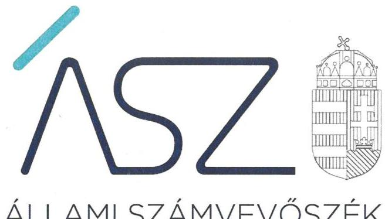
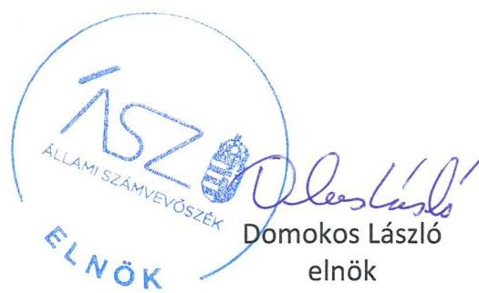
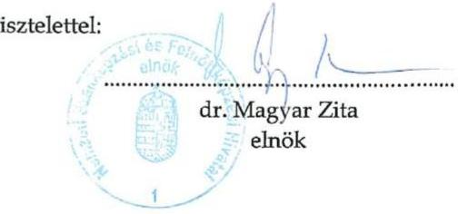

ÁLLAMI SZÁMVEVŐSZÉK

# JELENTÉS 

## Központi költségvetési szervek ellenőrzése

A Nemzeti Szakképzési és Felnőttképzési Hivatal
középirányító központi költségvetési szerv ellenőrzése
2021.

21069
www.asz.hu

---

ÁLLAMI SZÁMVEVŐSZÉK

# JELENTÉS

## Központi költségvetési szervek ellenőrzése

A Nemzeti Szakképzési és Felnőttképzési Hivatal
középirányító központi költségvetési szerv ellenőrzése

2021. 07. hó 20. nap

21069
www.asz.hu

---

# AZ ELLENŐRZÉST VEZETTE ÉS A VÉGREHAJTÁSÁÉRT FELELŐS: 

SALAMON ILDIKÓ ellenőrzésvezető
DR. SIMON JÓZSEF ellenőrzésvezető
SIPOSNÉ DÓCZI KLÁRA IBOLYA ellenőrzésvezető

A PROGRAM ÖSSZEÁLLÍTÁSÁÉRT FELELŐS:
DÁM-POLYÁK ORSOLYA projektvezető

IKTATÓSZÁM: EL-3299-001/2021
TÉMASZÁM: 2549
ELLENŐRZÉS-AZONOSÍTÓ SZÁM: V089315

---

# TARTALOMJEGYZÉK 

■ ÖSSZEGZÉS ..... 5
■ AZ ELLENŐRZÉS CÉLJA ..... 7
■ AZ ELLENŐRZÉS TERÜLETE ..... 8
■ AZ ELLENŐRZÉS HÁTTERE, INDOKOLTSÁGA ..... 9
■ A JELENTÉS LÉNYEGES KÉRDÉSKÖREI ..... 10
■ AZ ELLENŐRZÉS HATÓKÖRE ÉS MÓDSZEREI ..... 11
■ MEGÁLLAPÍTÁSOK ..... 13
■ JAVASLATOK ..... 16
■ MELLÉKLETEK ..... 17
I. sz. melléklet: Értelmező szótár ..... 17
■ FÜGGELÉK: ÉSZREVÉTELEK ..... 19
■ RÖVIDÍTÉSEK JEGYZÉKE ..... 27

---

.

---

# ÖSSZEGZÉS 

A Nemzeti Szakképzési és Felnőttképzési Hivatal belső kontrollkörnyezete, az átruházott irányítói, illetve a középirányítói tevékenységének szabályozása a 2019. évben nem felelt meg a jogszabályi előírásoknak, ami kockázatot jelentett az irányítási tevékenységének elszámoltathatóságára. A vagyongazdálkodás a 2017-2019. években nem volt szabályszerű. Ezáltal a közpénzekkel és a nemzeti vagyonnal történő felelős gazdálkodás nem érvényesült.

## Az ellenőrzés társadalmi indokoltsága

A szakképzési rendszer feladata a korszerű szakmai ismeretek megszerzésére való felkészítés és az egész életen át tartó tanuláshoz szükséges készségek fejlesztése. A szakképzés az oktatási rendszer szerves része. A szakképzés felsőfokú szakképzettséget nem igénylő munkakör betöltéséhez, vagy tevékenység végzéséhez szükséges szakmai oktatás és szakképesítésre felkészítő szakmai képzés. E feladatok ellátásában a szakképzési centrumok tevékenysége meghatározó jelentőségű.

A szakképzési centrumok gazdálkodásának minőségét meghatározza az irányítói és a középirányító szervi feladatok szabályszerű kialakítása és ellátása. Mindezek hiányában nem lehetséges, hogy a középirányító szervi feladatok ellátására, illetve a kapcsolódó intézményekre fordított közpénzek, valamint a rájuk bízott nemzeti vagyon cél szerint hasznosuljanak, működésük elszámoltatható és átlátható legyen.

A kontrollkörnyezet kialakítása, valamint az átruházott irányítói, illetve a középirányítói feladatok szabályozása azt a célt szolgálja, hogy a középirányítói feladatokat ellátó költségvetési szervek működésük és gazdálkodásuk során a kapcsolódó tevékenységeket szabályszerűen hajtsák végre, teljesítsék elszámolási kötelezettségeiket. A szabályszerű vagyongazdálkodás alapvető feltétele, hogy a középirányító szerv megvédje a rá bízott erőforrásokat a veszteségektől és a nem rendeltetésszerű használattól. A középirányító szerv esetén a szervezeti teljesítmény követelmények érvényesülését biztosító, mérhető, nyomon követhető teljesítménycélok és teljesítménykövetelmények rendelkezésre állása esetén lehetséges az irányítási hatáskör eredményességének megítélése.

## Főbb megállapítások, következtetések, javaslatok

Nemzeti Szakképzési és Felnőttképzési Hivatal mint középirányító szerv a 2019. évben nem rendelkezett a szervezeti integritást sértő események kezelésének, valamint az integrált kockázatkezelés eljárásrendjével. Ezáltal hiányzott az elszámoltatható és felelős gazdálkodás előfeltételét jelentő szabályozási környezet kialakítása. A gazdálkodási és számviteli feladatok ellátásához szükséges szabályzatokkal rendelkezett.

A Nemzeti Szakképzési és Felnőttképzési Hivatal a 2019. évben nem szabályozta minden átruházott irányítói, valamint középirányítói feladathoz kapcsolódó működési folyamatot ügyrendben és ellenőrzési nyomvonalban. Ezek hiányában a középirányító szervre átruházott irányítói hatáskörök gyakorlására és a középirányítói feladatok ellátására vonatkozó szabályozás kialakítása nem volt összhangban a jogszabályi előírásokkal. Ebből következően az átruházott irányítói hatáskörök gyakorlása és a középirányítói feladatok ellátása sem volt szabályszerű a szakképzési centrumokhoz kapcsolódóan. Az Innovációs és Technológiai Minisztérium mint irányító szerv, dokumentált módon a 2019. évben egy alkalommal és két feladatra kiterjedően ellenőrizte a Nemzeti Szakképzési és Felnőttképzési Hivatalnál a középirányító szervre átruházott irányítói hatáskörök gyakorlásának és a középirányítói feladatok ellátásának szabályszerűségét.

A Nemzeti Szakképzési és Felnőttképzési Hivatalnál a vagyongazdálkodáshoz kapcsolódó belső számviteli szabályozási környezet a 2017. évben nem állt rendelkezésre, mivel 2017. október 11-ig nem volt számlarendje. A vagyongazdálkodáshoz kapcsolódó belső számviteli szabályozási környezet a 2018-2019. években rendelkezésre állt. A Nemzeti Szakképzési és Felnőttképzési Hivatal éves költségvetési beszámolóinak elkészítéséhez, a mérlegtételeinek alá-

---

támasztásához nem állított össze olyan leltárt, amely tételesen, ellenőrizhető módon tartalmazza minden mérlegtételét. Ennek hiányában a Nemzeti Szakképzési és Felnőttképzési Hivatal éves beszámolói nem nyújtottak valós képet a vagyoni helyzetéről, ezáltal a vagyon kimutatása nem volt összhangban a jogszabályi előírásokkal.

A Nemzeti Szakképzési és Felnőttképzési Hivatal a 2019. évben a teljesítmény mérésére alkalmas alapvető követelményeket kialakította, mivel a szervezeti célokat, feladatokat és kapcsolódó személyi és tárgyi feltételeket meghatározták.

A közpénzügyi helyzet mielőbbi javítása céljából, az ellenőrzés által feltárt jogszabálysértő gyakorlatok megszüntetése érdekében az Állami Számvevőszék figyelemfelhívással fordult a Nemzeti Szakképzési és Felnőttképzési Hivatal elnökéhez. Ennek eredményeként a Nemzeti Szakképzési és Felnőttképzési Hivatal elnöke intézkedett az integrált kockázatkezelés és a szervezeti integritást sértő események kezelésének eljárásrendje kiadmányozására, az NSZFH új, 2020. november 20-tól hatályos szervezeti és működési szabályzata alapján a szervezeti egységek ügyrendjei teljes körű benne a középirányítói feladatokat is tartalmazó ügyrendek - elkészítésére, valamint a középirányítói feladatokhoz tartozó munkafolyamatok ellenőrzési nyomvonalai elkészítésére.

Az Állami Számvevőszék az ellenőrzés megállapításai alapján két javaslatot tett a Nemzeti Szakképzési és Felnőttképzési Hivatal elnökének a feltárt hibák jövőbeni megakadályozására.

---

# AZ ELLENŐRZÉS CÉLJA 

AZ ELLENŐRZÉS CÉLJA annak értékelése, hogy a központi költségvetési szerv középirányítói feladatainak ellátása megfelelő volt-e, a felelős vezetés érvényesült-e. Az ellenőrzés keretében az ÁSZ¹ azt értékeli, hogy
$\longrightarrow$ a középirányító szerv belső kontrollkörnyezete megfelelt-e a jogszabályi előírásoknak;
$\longrightarrow$ a középirányító szervnél kialakították-e a nemzeti vagyonnal történő felelős gazdálkodás feltételrendszerét;
$\longrightarrow$ a vagyongazdálkodása elszámoltatható volt-e;
$\longrightarrow$ a középirányítói feladatok szabályozottsága megfelelő volt-e;
$\longrightarrow$ a középirányító szervre átruházott irányítói hatáskörök szabályozása és gyakorlása megfelelt-e a jogszabályban foglaltaknak;
$\longrightarrow$ illetve a középirányító szervnél alakítottak-e ki az eredményesség, a hatékonyság és a gazdaságosság követelményeinek érvényesülését biztosító, mérhető, nyomon követhető teljesítménycélokat, teljesítménykövetelményeket.

---

# **AZ ELLENŐRZÉS TERÜLETE**

## **Nemzeti Szakképzési és Felnőttképzési Hivatal, Innovációs és Technológiai Minisztérium**

A Nemzeti Szakképzési és Felnőttképzési Hivatalt Magyarország Kormánya alapította a 319/2014. (XII. 13.) Korm. rendelet2-tel. Az NSZFH3 központi hivatal, amely önállóan működő és gazdálkodó központi költségvetési szerv.

Az NSZFH szak- és felnőttképzéssel összefüggő feladatkörében Alapító okirata4 szerint ellátja a szak- és felnőttképzési tevékenység szakmai és módszertani fejlesztését, valamint elemzési és értékelési feladatokat; végzi a szakmastruktúra folyamatos fejlesztését és a jogalkotáshoz szükséges előkészítő feladatokat az Országos Képzési Jegyzékben szereplő szakképesítések vonatkozásában; kidolgozza az Országos Képzési Jegyzék tervezetét; kidolgozza és gondozza a szakmai követelménymodulok elkészítésének egységes alapelveit; egységes alapelvek szerint gondozza és fejleszti az országos modultérképet; szervezi a szakmai tankönyvek kidolgozását; a gazdasági kamarával együttműködve kialakítja és működteti a pályaorientációs rendszert; kidolgozza és működteti az életpálya-tanácsadási szolgáltatást, valamint továbbfejleszti és működteti a pályakövetési rendszert.

Az NSZFH a 94/2018. (V. 22.) Korm. rendelet5 116. § 23. pontja alapján 2018. május 22-től kezdődően az Innovációs és Technológiai Minisztérium irányítása alatt működik. Az ITM6 mint irányító szerv rendelkezik az NSZFH vonatkozásában az Áht.7 9. §-ában meghatározott irányítási hatáskörökkel. Ezen hatáskörök közé tartozik többek között az NSZFH-ra vonatkozóan: a szervezeti és működési szabályzatának jóváhagyása, a vezetésére kinevezés vagy megbízás adása, a vezetőjének felmentése vagy a vezetői megbízás visszavonása, a tevékenységének törvényességi, szakszerűségi és hatékonysági ellenőrzése, illetve a jelentéstételre vagy beszámolóra való kötelezés.

A 319/2014. (XII. 13.) Korm. rendelet 5/A. § (1) és (1a) bekezdése alapján a szakképzési centrumok tekintetében középirányító szervként a 2019. évben az NSZFH többek között a következő feladatok ellátásáért volt felelős: a miniszter részére a szakképzési centrumok alapító okiratának felterjesztése; a szakképzési centrumok szervezeti és működési szabályzatainak, illetve éves munkaterveinek jóváhagyása, a szakképzési centrumok szakmai feladatai végrehajtásához szükséges feltételek meglétének értékelése, valamint azok megteremtésének szervezése és irányítása; a szakképzési centrumok gazdálkodásának szervezése, irányítása és ellenőrzése, és ennek keretében az irányító szerv hatáskörébe sorolt előirányzat- és vagyongazdálkodási feladatok ellátása, illetve a szakképzési centrumok költségvetés tervezéssel összefüggő feladatainak ellátása.

---

# AZ ELLENŐRZÉS HÁTTERE, INDOKOLTSÁGA 

Az NSZFH 2015. július 1-től a szakképzési centrumok középirányító szerve ${ }^{8}$. A 319/2014. (XII. 13.) Korm. rendelet - a 2015. július 1-től 2018. december 31-ig hatályos - 5/A. § (1) bekezdése szerint a szakképzésért és felnőttképzésért felelős miniszter a szakképzési centrum felett az Áht. 9. § g) és h) pontjában meghatározott irányítási hatáskörök és a szakképzési centrum tevékenysége pénzügyi ellenőrzésének középirányító szervként történő gyakorlását az NSZFH-ra átruházhatja. 2019. január 1-től 2020. február 14-ig e Korm. rendelet 5/A. § (1) bekezdése szerint az NSZFH a szakképzési centrum tekintetében középirányító szervként gyakorolja - az Áht. 9. § b), valamint e)-i) pontja szerinti hatáskörök keretein belül - a nemzeti köznevelésről szóló törvényben ${ }^{9}$ (Nkt.) és szakképzésről szóló törvényben ${ }^{10}$ (Szakképzési tv.) a fenntartó számára meghatározott hatásköröket és a szakképzési centrum tevékenységének pénzügyi ellenőrzését. 2019. január 1-től a 319/2014. (XII. 13.) Korm. rendelet 5/A. § (1a) bekezdése részletesen meghatározza a középirányító szervi feladatokat.

A középirányító szervek a feladataik szabályszerű ellátásával elősegítik az irányításuk alá tartozó intézmények közfeladatainak szabályszerű és hatékony ellátását. Ezzel hozzájárulnak ahhoz, hogy mind az intézményekre, mind a középirányító szervi feladatok ellátására fordított közpénzek, a rájuk bízott nemzeti vagyon cél szerint hasznosuljanak, működésük átlátható és elszámoltatható legyen. Ezek alapján a közpénzügyek átláthatóságának előmozdítása és a közvagyon védelme érdekében szükséges a középirányító költségvetési szervek feladatellátásának ellenőrzése.

A középirányító szervi feladatokat ellátó központi költségvetési szervek ellenőrzésével az ÁSZ hozzájárulhat az intézményrendszer szabályszerűbb, eredményesebb és hatékonyabb feladatellátásához, gazdálkodásához. Az elvégzett ellenőrzések során az ÁSZ „jó gyakorlatokat" is azonosíthat, amelyeket tanácsadó funkciója keretében szélesebb körben - a középirányító szervekkel és az irányító szervekkel - is megismertethet, ezáltal is hozzájárulva a költségvetési rendszer szabályozott, átlátható, kiegyensúlyozott működéséhez.

---

# A JELENTÉS LÉNYEGES KÉRDÉSKÖREI 

1.     - A középirányító szerv belső kontrollkörnyezetének kialakítása szabályszerű volt-e?
2.     - A középirányító szervre átruházott irányítói hatáskörök gyakor-
lásának és a középirányítói feladatok ellátásának belső szabályait a középirányító szerv kialakította-e?
3.     - A középirányító szervre átruházott irányítói hatáskörök gyakor-
lása és a középirányítói feladatok ellátása szabályszerű volt-e?
4.     - A középirányító szerv vagyongazdálkodása szabályszerű
volt-e?
5.     - A középirányító szerv kialakította-e a szervezeti teljesítmény
mérésére alkalmas követelményeket?

---

# AZ ELLENŐRZÉS HATÓKÖRE ÉS MÓDSZEREI 

## Az ellenőrzés típusa

Megfelelőségi ellenőrzés.

## Az ellenőrzött időszak

Az 1-3. és az 5. lényeges kérdéskör esetén a 2019. év, a 4. lényeges kérdéskör esetén a 2017-2019. évek.

## Az ellenőrzés tárgya

Az NSZFH, mint középirányító költségvetési szerv belső kontrollkörnyezetének kialakításának szabályszerűsége. A középirányító szerv nemzeti vagyonnal való gazdálkodásra vonatkozó szabályozási környezete kialakításának szabályszerűsége, a nemzeti vagyon kimutatásának szabályszerűsége. A középirányítói feladatok ellátásának szabályozottsága. A középirányító szervre átruházott irányítói hatáskörök gyakorlásának és a középirányítói feladatok ellátásának szabályszerűsége. Az ITM mint irányító szerv által végzett beszámoltatási és ellenőrzési tevékenységek az NSZFH középirányítói hatáskör gyakorlására vonatkozóan. A középirányító szervnél a szervezeti teljesítmény követelmények érvényesülését biztosító, mérhető,

 nyomon követhető teljesítménycélok, teljesítménykövetelmények kialakítása.

## Az ellenőrzött szervezet

Az NSZFH mint középirányítói feladatokat ellátó központi költségvetési szerv és az ITM mint az NSZFH irányító szerve.

## Az ellenőrzés jogalapja

Az ellenőrzés jogalapját az ÁSZ tv. ${ }^{11} 1 . \S$ (3) bekezdésének, 5. § (2)-(3) bekezdésének, a (4) bekezdés a) pontjának és a (6) bekezdésének előírásai képezik.

## Az ellenőrzés módszerei

Az ÁSZ az ellenőrzést az ellenőrzési program ellenőrzési kérdései, az ellenőrzött időszakban hatályos jogszabályok, az ellenőrzés szakmai szabályai

---

és a megfelelőségi ellenőrzésre irányadó ÁSZ módszertan figyelembevételével végzi.

Az ellenőrzési kérdések megválaszolásához szükséges bizonyítékok megszerzése a következő ellenőrzési eljárások alkalmazásával történik: információkérés, összehasonlítás, valamint elemző eljárás. Az ellenőrzési bizonyítékként felhasználható adatforrások közé tartoztak az ellenőrzési program részletes szempontjainál felsorolt adatforrások, valamint minden - az ellenőrzés folyamán feltárt - az ellenőrzés szempontjából információt tartalmazó dokumentum. Az ellenőrzést az ellenőrzési kérdésekhez kapcsolódó adatforrások és tanúsítvány felhasználásával, az adott időszakban hatályos jogszabályok figyelembevételével, valamint az ellenőrzési kérdésekre adott válaszok kiértékelésével folytatja le az ÁSZ.

A középirányítói feladatokat ellátó központi költségvetési szerv belső kontrollkörnyezete kialakítására vonatkozó értékelés:
$\longrightarrow$ „szabályszerű", amennyiben az értékelt területen az elért „igen" válaszok százalékban kifejezett, egész számra kerekített aránya legalább $85,0 \%$, és a középirányító szerv a lényeges szabályzatokkal rendelkezett;
$\longrightarrow$ „nem szabályszerű", amennyiben az értékelt területen az elért „igen" válaszok százalékban kifejezett, egész számra kerekített aránya legalább $85,0 \%$, azonban a középirányító szerv a lényeges szabályzatokkal nem rendelkezett, illetve, ha az értékelt területen az elért „igen" válaszok százalékban kifejezett, egész számra kerekített aránya nem éri el a $85,0 \%$-ot.
A középirányító szervre átruházott irányítói hatáskörök gyakorlása és a középirányítói feladatok ellátása a jogszabályi előírásoknak nem megfelelő, ha a középirányító szervre átruházott irányítói hatáskörök gyakorlásának és a középirányítói feladatok ellátásának belső szabályait a középirányító szerv nem alakította ki.

A középirányítói feladatokat ellátó központi költségvetési szerv vagyongazdálkodásának szabályozottságára vonatkozó értékelés:
$\longrightarrow$ „szabályszerű", amennyiben az ellenőrzött időszakban rendelkezésre állt a jogosult által kiadott, hatályos számviteli politika, eszközök és források leltárkészítési és leltározási szabályzata, eszközök és források értékelési szabályzata, valamint számlarend és az értékelt területen az elért „igen" válaszok százalékban kifejezett, egész számra kerekített aránya legalább 85,0\%;
$\longrightarrow$ „nem szabályszerű", ha az előző bekezdésben szereplő szabályzatok közül legalább egy nem áll rendelkezésre és az értékelt területen az elért „igen" válaszok százalékban kifejezett, egész számra kerekített aránya nem éri el a $85,0 \%$-ot.
Az ÁSZ az ellenőrzés ideje alatt az ellenőrzött szervezetekkel történő kapcsolattartást az ÁSZ SZMSZ ${ }^{12}$-ének vonatkozó előírásai alapján biztosítja.

---

# 1. A középirányító szerv belső kontrollkörnyezetének kialakítása szabályszerű volt-e? 

Összegző megállapítás

A Nemzeti Szakképzési és Felnőttképzési Hivatal belső kontrollkörnyezetének kialakítása a 2019. évben nem volt szabályszerű.

Az NSZFH nem rendelkezett a 2019. évben a Bkr. ${ }^{13}$ 6. § (4) bekezdésében foglalt rendelkezés ellenére az integrált kockázatkezelés, és a szervezeti integritást sértő események kezelésének eljárásrendjével. Ezek hiányában a működési és integritási kockázatok feltárásának és kezelésének módja nem volt szabályozott. Ezáltal a belső kontrollkörnyezet két meghatározó jelentőségű eleme nem állt rendelkezésre.

Az NSZFH a 2019. évben az Áht. előírása szerint rendelkezett az irányító szerv által jóváhagyott szervezeti és működési szabályzat ${ }^{14}$-tal, illetve a gazdálkodás részletes rendjét meghatározó szabályzat ${ }_{1-2}{ }^{15}$-tal, valamint a Számv. tv. ${ }^{16}$ által előírt számviteli szabályzatokkal.

## 2. A középirányító szervre átruházott irányítói hatáskörök gyakorlásának és a középirányítói feladatok ellátásának belső szabályait a középirányító szerv kialakította-e?

## Összegző megállapítás

A Nemzeti Szakképzési és Felnőttképzési Hivatal nem alakította ki a középirányító szervre átruházott irányítói hatáskörök gyakorlásának és a középirányítói feladatok ellátásának belső szabályait a 2019. évben.

A középirányító szervre átruházott irányítói hatáskörök gyakorlásának és a középirányítói feladatok ellátásának belső szabályait az NSZFH a 2019. évben nem alakította ki, mivel
$\longrightarrow$ nem tartalmazták az ügyrendek - a szervezeti és működési szabályzat és más szabályzatok mellett - az Ávr. ${ }^{17}$ 13. § (5) bekezdésében szereplő rendelkezés ellenére a 319/2014. (XII. 13.) Korm. rendelet 5/A. § (1a) bekezdés 3. pontjában szereplő átruházott irányítói, valamint a 7., 11., illetve 13. pontjaiban szereplő középirányítói feladatokhoz tartozó munkafolyamatok leírását;
$\longrightarrow$ valamint nem készítette el a Bkr. 6. § (3) bekezdésében foglalt előírás ellenére a 319/2014. Korm. rendelet 5/A. § (1a) bekezdés 3. pontjában szereplő átruházott irányítói, valamint az 1., 4., illetve a 6-13. pontjaiban szereplő középirányítói feladatokhoz kapcsolódó működési folyamatok ellenőrzési nyomvonalait.

---

# 3. A középirányító szervre átruházott irányítói hatáskörök gyakorlása és a középirányítói feladatok ellátása szabályszerű volt-e? 

Összegző megállapítás

A Nemzeti Szakképzési és Felnőttképzési Hivatalnál a 2019. évben az átruházott irányítói hatáskörök gyakorlása és a középirányítói feladatok ellátása nem volt szabályszerű.

Az NSZFH-ra átruházott irányítói hatáskörök gyakorlása és a középirányítói feladatok ellátása nem felelt meg a jogszabályban foglaltaknak, mivel a 2019. évben az NSZFH nem alakította ki a középirányító szervre átruházott irányítói hatáskörök gyakorlásának és a középirányítói feladatok ellátásának belső szabályait.

Az ITM mint irányító szerv a 2019. évben egy alkalommal - a szakképzési centrumok felújítására, fejlesztésére nyújtott támogatások felhasználását, illetve a közbeszerzési eljárásokhoz kapcsolódó ügyintézés döntéshozatalának folyamatát, időtartamát érintően - végzett belső ellenőrzést az NSZFH középirányítói feladatainak ellátásával kapcsolatban. Az ITM jóváhagyta az NSZFH 2019. évre vonatkozó intézményi munkatervének végrehajtásáról szóló szakmai beszámolót.

## 4. A középirányító szerv vagyongazdálkodása szabályszerű volt-e?

## Összegző megállapítás

A Nemzeti Szakképzési és Felnőttképzési Hivatal vagyongazdálkodása a 2017-2019. évben nem volt szabályszerű, mivel a mérlegtételeket nem támasztotta alá leltárral.
4.1. számú megállapítás

Az NSZFH vagyongazdálkodásának szabályozottsága a 2017. évben nem volt összhangban a jogszabályi előírásokkal, a 2018-2019. években összhangban volt a jogszabályi előírásokkal.

Az NSZFH 2017. október 11-ig nem rendelkezett a Számv. tv. 161. § (1) bekezdésében szereplő előírás szerinti, a szabályszerű könyvvezetés alapvető feltételét jelentő számlarend ${ }^{18}$-del.

Az NSZFH a 2017-2019. években rendelkezett a Számv. tv. előírásaival összhangban lévő számviteli politikával ${ }_{1-2}{ }^{19}$, eszközök és források leltárkészítési és leltározási szabályzatával ${ }_{1-2}{ }^{20}$, valamint az eszközök és források értékelési szabályzatá ${ }^{21}$-val.
4.2. számú megállapítás

A nemzeti vagyon kimutatása a 2017-2019. években nem volt szabályszerű, mivel az éves költségvetési beszámolót leltárral nem támasztotta alá.

Az NSZFH a 2017-2019. években nem készített az Áhsz. ${ }^{22}$ 5. § (1) bekezdésében és 22. § (1) bekezdésében, valamint a Számv. tv. 69. § (1) bekezdésében előírtak szerinti leltárt, amely tételesen és ellenőrizhető módon tartalmazta a mérlegben szereplő eszközöket és forrásokat mennyiségben és

---

értékben. Az NSZFH nem gondoskodott a 2017-2019. években az Áhsz. 22. § (2) bekezdés b) pontjában szereplő előírás ellenére az ellenőrzött időszakban a használt, de a mérlegben értékkel nem szereplő eszközök leltározásáról.

# 5. A középirányító szerv kialakította-e a szervezeti teljesítmény mérésére alkalmas követelményeket? 

Összegző megállapítás A Nemzeti Szakképzési és Felnőttképzési Hivatal a 2019. évben kialakította a szervezeti teljesítmény mérésére alkalmas alapvető követelményeket.

Az NSZFH az intézményi munkatervében meghatározta a tevékenységének célrendszerét. Ennek keretében elsődleges célokat, szakmapolitikai célokat és a szervezeti egységek által követendő célokat állapított meg az elvégzendő feladatok alapján. A szervezeti egységekre vonatkozó specifikus célok esetén meghatározták a teljesítendő feladatokat, intézkedéseket, a teljesítés határidejét, valamint a személyi és tárgyi feltételeket.

---

# JAVASLATOK 

Az ÁSZ tv. 33. § (1) bekezdésében foglaltak értelmében az ellenőrzött szervezet vezetője köteles a jelentésben foglalt megállapításokhoz kapcsolódó intézkedési tervet összeállítani és azt a jelentés kézhezvételétől számított 30 napon belül az ÁSZ részére megküldeni. Amennyiben az ellenőrzött szervezet vezetője nem küldi meg határidőben az intézkedési tervet, vagy továbbra sem elfogadható intézkedési tervet küld, az Állami Számvevőszék elnöke az ÁSZ tv. 33. § (3) bekezdése a) és b) pontjaiban foglaltakat érvényesítheti.

## A Nemzeti Szakképzési és Felnőttképzési Hivatal elnökének

1. Intézkedjen a jogszabályban előírt leltár elkészítésére
(4.2. sz. megállapítás 1. bekezdés 1. mondata alapján)
2. Intézkedjen a jogszabályban előírtak szerint a használt, de a mérlegben értékkel nem szereplő eszközök leltározására.
(4.2. sz. megállapítás 1. bekezdés 2. mondata alapján)

---

# MELLÉKLETEK 

- I. SZ. MELLÉKLET: ÉRTELMEZŐ SZÓTÁR
belső kontrollrendszer
Irányító szerv
integrált kockázatkezelési rendszer

Nemzeti Szakképzési és Felnőttképzési Hivatal, mint középirányító szerv
kontrollkörnyezet
középirányító szerv által gyakorolt irányítási hatáskörök
nemzeti vagyon

A belső kontrollrendszer a kockázatok kezelése és tárgyilagos bizonyosság megszerzése érdekében kialakított folyamatrendszer, amely azt a célt szolgálja, hogy a működés és gazdálkodás során a tevékenységeket szabályszerűen, gazdaságosan, hatékonyan, eredményesen hajtsák végre, az elszámolási kötelezettségeket teljesítsék, megvédjék az erőforrásokat a veszteségektől, károktól és nem rendeltetésszerű használattól. (Forrás: Áht. 69. § (1) bekezdése)

A Nemzeti Szakképzési és Felnőttképzési Hivatal és a szakképzési centrumok tekintetében az irányító szerv 2018. május 21-ig a Nemzetgazdasági Minisztérium, 2018. május 22-től az Innovációs és Technológiai Minisztérium (Forrás: Nemzeti Szakképzési és Felnőttképzési Hivatal és a szakképzési centrumok alapító okirata)
Olyan folyamatalapú kockázatkezelési rendszer, amely a szervezet minden tevékenységére kiterjed, egységes módszertan és eljárások alkalmazásával, a szervezet célkitűzéseinek és értékeinek figyelembevételével biztosítja a szervezet kockázatainak teljes körű azonosítását, azok meghatározott kritériumok szerinti értékelését, valamint a kockázatok kezelésére vonatkozó intézkedési terv elkészítését és az abban foglaltak nyomon követését. (Forrás: Bkr. 2. § m) pontja, 2016. október 1-jétől)
2019. január 1-től 2020. február 14-ig a Nemzeti Szakképzési és Felnőttképzési Hivatalról szóló 319/2014. (XII. 13.) Korm. rendelet 5/A. § (1) bekezdése szerint az NSZFH a szakképzési centrum tekintetében középirányító szervként gyakorolja - az Áht. 9. § b), valamint e)-i) pontja szerinti hatáskörök keretein belül - a nemzeti köznevelésről szóló törvényben és szakképzésről szóló törvényben a fenntartó számára meghatározott hatásköröket és a szakképzési centrum tevékenységének pénzügyi ellenőrzését. 2019. január 1-től a 319/2014. (XII. 13.) Korm. rendelet 5/A. § (1a) bekezdése részletesen meghatározza a középirányítói szervi feladatokat. (Forrás: 319/2014. (XII. 13.) Korm. rendelet.)
2020. február 15-től a szakképzésért felelős miniszter által alapított szakképzési centrum felett - az Áht. 9. § a) és c)-d) pontjában meghatározott irányítási hatáskörök kivételével - az NSZFH, mint középirányító szerv gyakorolja az irányító szervi hatásköröket. (Forrás: 12/2020. (II. 7.) Korm. rendelet ${ }^{23}$ )
A költségvetési szerv vezetője által kialakított olyan elvek, eljárások, belső szabályzatok összessége, amelyben világos a szervezeti struktúra, a folyamatok átláthatók, egyértelműek a felelősségi, hatásköri viszonyok és feladatok, meghatározottak, ismertek és elfogadottak az etikai elvárások a szervezet minden szintjén, átlátható a humánerőforráskezelés, biztosított a szervezeti célok és értékek irányában való elkötelezettség fejlesztése és elősegítése. (Forrás: Bkr. 6. § (1) bekezdés)
Törvény vagy kormányrendelet által meghatározott azon irányítási hatáskörök, amelyek a központi költségvetési szerv irányítása alá tartozó más költségvetési szervre, mint középirányító szervre átruházhatók (Forrás: Áht. 9/A. § (3) bekezdés b) pontja)
a) az állam vagy a helyi önkormányzat kizárólagos tulajdonában álló dolgok,
b) az a) pont hatálya alá nem
 tartozó, az állam vagy a helyi önkormányzat tulajdonában lévő dolog,
c) az állam vagy a helyi önkormányzat tulajdonában lévő pénzügyi eszközök, továbbá az államot vagy a helyi önkormányzatot megillető társasági részesedések,
d) az államot vagy a helyi önkormányzatot megillető bármely vagyoni értékkel rendelkező jogosultság, amelyet jogszabály vagyoni értékű jogként nevesít
(Forrás: Nvtv. ${ }^{24}$ 1. § (2) bekezdés a)-d) pontok).

---

.

---

# FÜGGELÉK: ÉSZREVÉTELEK 

A jelentéstervezetet a Számvevőszék 15 napos észrevételezésre megküldte az ellenőrzött szervezetek vezetőinek az ÁSZ tv. 29. § (1) bekezdése előírásának megfelelően.

Az Innovációs és Technológiai Minisztérium minisztere írásban jelezte, hogy a jelentéstervezet megállapításaira nem tesz észrevételt. A Nemzeti Szakképzési és Felnőttképzési Hivatal elnöke által tett észrevételt és az arra adott választ a függelék tartalmazza.

[^0]
[^0]:    * 29. § (1) Az Állami Számvevőszék az ellenőrzési megállapításait megküldi az ellenőrzött szervezet vezetőjének vagy az általa megbízott személynek, és annak, akinek személyes felelősségét állapította meg.
    (2) Az ellenőrzött szervezet vezetője és a felelősként megjelölt személy az ellenőrzés megállapításaira tizenöt napon belül írásban észrevételt tehet.
    (3) Az Állami Számvevőszék az észrevételre a beérkezésétől számított harminc napon belül írásban válaszol. A figyelembe nem vett észrevételeket köteles a jelentésben feltüntetni, és megindokolni, hogy azokat miért nem fogadta el.

---

# Nemzeti Szakképzési és Felnőttképzési Hivatal 

| Iktatószám: | NSZFH/240/000215-1/2021 |
| :-- | :-- |
| Ügyintéző: | Gulyás-Deák Patrícia |
| E-mail: | Gulyas-Deak.Patricia@nive.hu |
| Melléklet: | 1 db nyilatkozat |
| Tárgy: | Jelentéstervezet észrevételezése |

Állami Számvevőszék
Domokos László
elnök

1052 Budapest
Apáczai Csere János utca 10.

## Tisztelt Elnök Úr!

Az Állami Számvevőszék EL-3009-001/2020. és EL-3009-011/2020 számon folytatott a „Központi költségvetési szervek ellenőrzése - A Nemzeti Szakképzési és Felnőttképzési Hivatal középirányító központi költségvetési szerv ellenőrzése" címen ellenőrzést hivatalunknál.
Ennek részeként 2021. június 3-án érkezett hivatalunkhoz az EL-3009-044/2021. számú figyelemfelhívó levél, amelyre az észrevételeket megköszönve az alábbiakban kívánunk reagálni:

1. A vizsgált időszakra vonatkozóan a Nemzeti Szakképzési és Felnőttképzési Hivatal (a továbbiakban: Hivatal) nem rendelkezett a szervezeti integritást sértő események kezelésének eljárásrendjével. Tájékoztatom elnök urat, hogy a Hivatal integrált kockázatkezelés, és a szervezeti integritást sértő események kezelésének eljárásrendje 2021. május 10-én kiadmányozásra került. (Iktatószám: NSZFH/110/000009-2/2021)
2. A második körös adatbekérés során kért és feltöltött tanúsítványban (Iktatószám: NSZFH/240/000026-3/2021) hivatkozott, jelen levelemhez mellékelt, 2021. január 15-én kelt nyilatkozat (Iktatószám: NSZFH/240/000026-4/2021) okán nem tartalmazták a Hivatal ügyrendjei a középirányítói feladatokhoz tartozó egyes munkafolyamatok leírását. A vizsgálattal célzott, 2019-es évben a szakképzésre vonatkozóan a jogalkotási folyamattal jelentős változások indultak el. Ennek eredményeként a szakképzésről szóló 2019. évi LXXX. törvény (Szkt.) 2020. január 1-től míg a szakképzésről szóló törvény végrehajtásáról szóló 12/2020. (II. 7.) kormányrendelet (Szkr.) 2020. február 15-től hatályos. A hivatkozott Szkt. és Szkr. a Hivatal számára 2020. július 1-ei hatállyal jelentős, több szervezettől is átkerülő, új feladatokat határozott meg, egyidejűleg a Nemzeti Szakképzési és Felnőttképzési Hivatalról szóló 319/2014. (XII. 13.) Korm. rendeletet hatályon kívül helyezte. Az új szabályozás alapján a Nemzeti Szakképzési és Felnőttképzési Hivatal Szervezeti és Működési Szabályzata a 30/2020. (XI. 19.) ITM utasításként került kiadásra, mely 2020. november 20-tól hatályos. Az új Szervezeti és Működési Szabályzat alapján Hivatalunk szervezeti egységeinek ügyrendjeinek

---

elkészítését megkezdtük, több egységénél is kiadásra került, teljes körű, a középirányítói feladatokat is tartalmazó ügyrendek elkészítését 2021. június 30-ig irányoztuk elő.
3. A középirányítói feladatokhoz tartozó munkafolyamatok ellenőrzési nyomvonala kidolgozásának előfeltétele a kiadmányozott ügyrendek megléte, ezek előkészítése a hatályos szabályzókhoz igazítva megtörtént, 2021. június 30-ig elkészítésre kerülnek.
4. Az EL-3009-011/2020 adatbekérő levél 2. számú melléklet szerinti dokumentumjegyzék 1. pontja alapján a mennyiségi felvétellel történő leltározás elvégzését alátámasztó dokumentum(ok) (Áhsz. 22. § (2) bekezdés, Számv. tv. 69. (3) bekezdés) bekérése történt meg az ÁSZ részéről a 2017-2019. évek vagyongazdálkodása vonatkozásában. E mennyiségi felvétellel történő leltározás dokumentumai az ÁSZ bekérő alapján a megadott felületre feltöltésre kerültek. A feltöltött dokumentumok kizárólag a mennyiségi felvétellel történő leltározás szerinti tételeket tartalmazzák az ÁSZ második körös bekérésének kollégáink általi értelmezése alapján.
A probléma okaként azt azonosítottuk, hogy míg az adatbekérés során az ÁSZ az Áhsz. 22. § (2) bekezdését és a Számv. tv. 69. § (3) bekezdését nevezte meg az adatszolgáltatás alapjául, az ellenőrzési megállapításokat tartalmazó levelében már ettől eltérő jogalapra hivatkozik (Áhsz. 22. § (2) bekezdését és a Számv. tv. 69. § (1) bekezdését említi), mely felveti, hogy az adatbekérés és az ellenőrzés nem azonos szempontok szerint történt. Az ezen jogalapon elvárt dokumentumok a Hivatalnál rendelkezésre állnak, amennyiben az ÁSZ azt az ellenőrzés eredményessége, teljessége érdekében szükségesnek látja, készséggel szolgáltatjuk az alátámasztó dokumentumokat.
5. A Hivatal a Számv. tv. 69. § (3) bekezdésben rögzítettek alapján a legalább háromévenkénti mennyiségi felvétellel történő leltározási kötelezettségének 2018. évben eleget tett. A 2018. december 31-i állapotnak megfelelően felvett leltárt alátámasztó - a Hivatal által használt integrált ügyviteli rendszerből (FORRAS.NET) előállított - leltárjegyek teljes körűen tartalmazzák az eszközöket, ezek a dokumentumok feltöltésre kerültek. A leltárjegyek az értékkel szereplő, illetve értékkel nem szereplő tételeket egyaránt tartalmazzák.

Köszönjük, hogy az Állami Számvevőszék alapos ellenőrzésével felhívta figyelmünket a működésben rejlő veszélyekre, kockázatokra. A hivatal vezetése és munkatársai elkötelezettek a minden tekintetben jogkövető, a szabályokat pontosan betartó működés iránt.

Kérem észrevételeink alapján fontolják meg az ellenőrzés megállapításait, szükség esetén további dokumentációval járulunk hozzá az ellenőrzés eredményességéhez.

Budapest, 2021. június 4.
Tisztelettel:

---

# 150 éve a közpénzek őre 

ELNÖK

Ikt. szám: EL-3009-049/2021.

Dr. Magyar Zita úrhölgy
elnök

Nemzeti Szakképzési és Felnőttképzési Hivatal

## Budapest

Tisztelt Elnök Úrhölgy!

A „Központi költségvetési szervek ellenőrzése - A Nemzeti Szakképzési és Felnőttképzési Hivatal középirányító központi költségvetési szerv ellenőrzése" című ellenőrzés megállapításaira a 2021. június 11-én kelt, NSZFH/240/000215-1/2021. iktatószámú levelében megküldött észrevételeit megkaptam.

Az Állami Számvevőszék (továbbiakban: ÁSZ) észrevételekre vonatkozó álláspontjáról az ellenőrzésvezető által készített részletes tájékoztatást csatoltan megküldöm.

Tájékoztatom Elnök úrhölgyet, hogy a számvevőszéki jelentésben - az Állami Számvevőszékről szóló 2011. évi LXVI. törvény (továbbiakban: ÁSZ tv.) 29. § (3) bekezdése alapján - a figyelembe nem vett észrevételeket szerepeltetjük az elutasítás indokának feltüntetésével.

Budapest, 2021. 07. hónap 12. nap

Tisztelettel:

Domokos László
Elnök helyetteseként eljáró
Holman Magdolna
Alelnök s.k.

Melléklet: Tájékoztatás az észrevételek kezeléséről

---

# Tájékoztatás az észrevételek kezeléséről 

A „Központi költségvetési szervek ellenőrzése - A Nemzeti Szakképzési és Felnőttképzési Hivatal középirányító központi költségvetési szerv ellenőrzése" című ellenőrzés megállapításaira a 2021. június 11-én kelt, NSZFH/240/000215-1/2021. iktatószámú levelében megküldött észrevételeket áttekintettem. Az észrevételek kezeléséről az alábbi tájékoztatást adom.

1. A jelentéstervezet 4.2. számú megállapítás 1. bekezdés 1. mondatában az éves költségvetési beszámoló leltárral történő alátámasztásával kapcsolatos megállapításra tett észrevételét nem fogadtam el.
Elnök úrhölgy észrevétele szerint az EL-3009-011/2020. iktatószámú adatbekérő levél 2. számú melléklet szerinti dokumentumjegyzéke 1. pontja alapján a mennyiségi felvétellel történő leltározás elvégzését alátámasztó dokumentum(ok) (az államháztartás számviteléről szóló 4/2013. (I. 11.) Korm. rendelet (továbbiakban: Áhsz.) 22. § (2) bekezdés, a számvitelről szóló 2000. évi C. törvény (továbbiakban: Számv. tv.) 69. § (3) bekezdés) bekérése történt meg az ÁSZ részéről a 2017-2019. évek vagyongazdálkodása vonatkozásában. E mennyiségi felvétellel történő leltározás dokumentumai az ÁSZ bekérő alapján a megadott felületre feltöltésre kerültek. A feltöltött dokumentumok kizárólag a mennyiségi felvétellel történő leltározás szerinti tételeket tartalmazzák. Elnök úrhölgy észrevétele szerint az ÁSZ az adatbekérés során az Áhsz. 22. § (2) bekezdését és a Számv. tv. 69.§ (3) bekezdését nevezte meg az adatszolgáltatás alapjául, az ellenőrzési megállapításokat tartalmazó levélben azonban az Áhsz. 22. § (2) bekezdésére és a Számv. tv. 69. § (1) bekezdésére hivatkozik.
Az ÁSZ az EL-3009-001/2020. iktatószámú levél 3. számú melléklete Dokumentumok jegyzéke I/4. Vagyongazdálkodás (2017., 2018. és 2019. évre vonatkozóan) fejezet 17. pontjában kérte a Nemzeti Szakképzési és Felnőttképzési Hivatal (továbbiakban: NSZFH) 2017., 2018., 2019. évi mérleg tételeit alátámasztó leltárak - beleértve a használt, de a mérlegben értékkel nem szereplő immateriális javakat, tárgyi eszközöket, készleteket is - (Számv. tv. 69. § (1) bekezdés, Áhsz. 22. § (1) bekezdés, (2) bekezdés b) pont), valamint az EL-3009-011/2020. iktatószámú levél 2. számú Dokumentumok jegyzéke melléklet 1. pontjában a mennyiségi felvétellel történő leltározás elvégzését alátámasztó dokumentum(ok)at (Áhsz. 22. § (2) bekezdés, Számv. tv. 69. § (3) bekezdés).
A 2020. november 19-én kelt teljességi és hitelességi nyilatkozattal az ellenőrzés rendelkezésére bocsátott dokumentumokat ismételten megvizsgáltuk és megállapítottuk, hogy 2017. évben az „A/Nemzeti vagyonba tartozó befektetett eszközök”, valamint a „B/Nemzeti vagyonba tartozó forgóeszközök” esetében, 2018. és 2019. évre vonatkozóan az „A/Nemzeti vagyonba tartozó befektetett eszközök”, a „B/Nemzeti vagyonba tartozó forgóeszközök”, valamint „G/ Saját tőke” mérlegsorok esetében az NSZFH dokumentáltan nem készítette el a Számv. tv. 69. § (1) bekezdésének és az Áhsz. 22. § (1) bekezdésének előírásai ellenére a mérleg tételeit teljes körűen alátámasztó leltárt.

A fentiekre tekintettel az ÁSZ az észrevételt nem veszi figyelembe, az ellenőrzés megállapítása helytálló, módosítása nem indokolt.

---

2. A jelentéstervezet 4.2. számú megállapítás 1. bekezdés 2. mondatában a használt, de a mérlegben értékkel nem szereplő eszközök leltározásával kapcsolatos megállapításra tett észrevételét nem fogadtam el.

Elnök úrhölgy észrevétele szerint az NSZFH a Számv. tv. 69. § (3) bekezdésben rögzítettek alapján a legalább háromévenkénti mennyiségi felvétellel történő leltározási kötelezettségének 2018. évben eleget tett. A 2018. december 31-i állapotnak megfelelően felvett leltárt alátámasztó - az NSZFH által használt integrált ügyviteli rendszerből (FORRAS.NET) előállított - leltárjegyek teljes körűen tartalmazzák az eszközöket, ezek a dokumentumok feltöltésre kerültek. A leltárjegyek az értékkel szereplő, illetve értékkel nem szereplő tételeket egyaránt tartalmazzák.

Az ÁSZ az EL-3009-011/2020. iktatószámú levél 2. számú Dokumentumok jegyzéke melléklet 1. pontjában kérte a mennyiségi felvétellel történő leltározás elvégzését alátámasztó dokumentum(ok)at, benne a használt, de a mérlegben nem szereplő eszközök leltározásáról készített dokumentumokat is (Áhsz. 22. § (2) bekezdés, Számv. tv. 69. § (3) bekezdés).

A 2021. január 15-én kelt teljességi és hitelességi nyilatkozattal az ellenőrzés rendelkezésére bocsátották az észrevételben hivatkozott 2018. évi, mennyiségi felvétellel történő leltározáshoz kapcsolódó következő dokumentumokat: „Leltározási_utasítás_2018.pdf”, „Leltározási_ütemterv_2018.pdf”, „Leltárjegyek_tárolási biz_2018.pdf”, az „Eszközm. tilalom elrendelő és nyil..pdf”, 24 db körzeti leltárfelelősi megbízás, „Leltározási_jk_könyvtár_2018.pdf”, „Leltározási_jk_nyomda_2018.pdf”, „Leltározási_jk_tankönyv_2018.pdf”, „Leltározási_jk_tárgyieszköz_2018.pdf”, „Leltár_összesítő_jegyzőkönyv_2018.pdf”.

Ezt megelőzően, az EL-3009-001/2020. iktatószámú levél alapján a 2020. november 19-én kelt teljességi és hitelességi nyilatkozattal az ellenőrzés rendelkezésére bocsátották a 2018. október 5-én jóváhagyott „A Nemzeti Szakképzési és Felnőttképzési Hivatal Eszközök és Források Leltározási és Leltárkészítési Szabályzata” elnevezésű dokumentumot (továbbiakban: Szabályzat).

Az észrevétel alapján az ellenőrzés rendelkezésére bocsátott dokumentumokat ismételten megvizsgáltuk. Megállapítottuk, hogy a Szabályzat V. Eszközök és források leltározása fejezet kimondja, hogy „A könyvviteli mérlegben értékkel nem szereplő, kis értékű immateriális javakat, tárgyi eszközöket, a tulajdon védelme és az
 elszámoltatás lehetőségének biztosítása érdekében, helyszíni, mennyiségi leltárfelvétellel legalább 3 évente leltározni kell. Megállapítottuk továbbá, hogy a rendelkezésre bocsátott - fentiekben hivatkozott - dokumentumok egyikében sem szerepel a használt, de a mérlegben értékkel nem szereplő eszközök leltározására, valamint a kiértékelésére utalás. A leltárjegyeken nem jelölték, hogy az tartalmazza-e a használt, de a mérlegben értékkel nem szereplő eszközöket, és melyek azok. A leltározási utasítás, a leltározási jegyzőkönyvek, valamint a leltár kiértékeléséről készült összesítő jegyzőkönyv sem tartalmazza a használt, de a mérlegben értékkel nem szereplő eszközök leltározására vonatkozóan utalást.

Fentiek alapján az NSZFH nem igazolta, hogy az észrevételben hivatkozott 2018. évi mennyiségi felvétellel történő leltározás keretében sor került a használt, de a mérlegben értékkel nem szereplő eszközök leltározására is.

Köszönettel vettük tájékoztatását az ellenőrzés által feltárt további hiányosságok megszüntetése érdekében megtett intézkedéseiről, így az integrált kockázatkezelés és a szervezeti integritást sértő események kezelésének eljárásrendje kiadmányozásáról, az NSZFH új, 2020. november 20-tól hatályos

---

szervezeti és működési szabályzata alapján a szervezeti egységek ügyrendjei teljes körű - benne a középirányítói feladatokat is tartalmazó ügyrendek - elkészítésének folyamatáról, valamint a középirányítói feladatokhoz tartozó munkafolyamatok ellenőrzési nyomvonalai előkészítéséről. Mindezek az intézkedések a hiányosságok mielőbbi kijavításával hozzájárulnak a közpénzügyek rendezettségének erősítéséhez.

Budapest, 2021. 07. hónap 12. nap
Salamon Ildikó
ellenőrzésvezető s.k.

---

.

---

# RÖVIDÍTÉSEK JEGYZÉKE 

${ }^{1}$ ÁSZ
${ }^{2}$ 319/2014. (XII. 13.) Korm. rendelet
${ }^{3}$ NSZFH
${ }^{4}$ Alapító okirat
${ }^{5}$ 94/2018. (V. 22.) Korm. rendelet
${ }^{6}$ ITM
${ }^{7}$ Áht.
${ }^{8}$ Középirányító szerv
${ }^{9} \mathrm{Nkt}$.
${ }^{10}$ Szakképzési tv.
${ }^{11}$ ÁSZ tv.
${ }^{12}$ ÁSZ SZMSZ
${ }^{13}$ Bkr.
${ }^{14}$ szervezeti és működési szabályzat
${ }^{15}$ gazdálkodás részletes rendje szabályzat ${ }_{1}$
gazdálkodás részletes rendje szabályzat ${ }_{2}$

Állami Számvevőszék
319/2014. (XII. 13.) Korm. rendelet a Nemzeti Szakképzési és Felnőttképzési Hivatalról (hatályos 2014. december 15-től 2020. február 14-ig)
Nemzeti Szakképzési és Felnőttképzési Hivatal
Nemzeti Szakképzési és Felnőttképzési Hivatal ISZF/14284-2/2018-ITM azonosítószámú Alapító okirata módosításokkal egységes szerkezetbe foglalva (hatályos 2018. május 22-től)
94/2018. (V. 22.) Korm. rendelet a Kormány tagjainak feladat- és hatásköréről (hatályos 2018. május 22-től)
Innovációs és Technológiai Minisztérium
2011. évi CXCV. törvény az államháztartásról (hatályos 2011. január 31-től)

NSZFH
2011. évi CXC. törvény a nemzeti köznevelésről (hatályos 2012. szeptember 1-jétől)
2011. évi CLXXXVII. törvény a szakképzésről (hatályos 2012. szeptember 1-jétől)
2011. évi LXVI. törvény az Állami Számvevőszékről (hatályos 2011. július 1-jétől)

Állami Számvevőszék Szervezeti és Működési Szabályzata
370/2011. (XII. 31.) Korm. rendelet a költségvetési szervek belső kontrollrendszeréről és belső ellenőrzéséről (hatályos 2012. január 1-jétől)
A nemzetgazdasági miniszter 16/2017. (V. 24.) NGM utasítása a Nemzeti Szakképzési és Felnőttképzési Hivatal Szervezeti és Működési Szabályzatáról
Nemzeti Szakképzési és Felnőttképzési Hivatal kötelezettségvállalás, ellenjegyzés, teljesítésigazolás, érvényesítés, utalványozás eljárásrendjéről szóló NSZFH_200_2017_04_02F főigazgatói utasítás (hatályos 2017. szeptember 1-jétől 2019. március 24-ig)

Nemzeti Szakképzési és Felnőttképzési Hivatal kötelezettségvállalás, ellenjegyzés, teljesítésigazolás, érvényesítés, utalványozás rendjéről szóló szabályzata 2019/02_01_E elnöki utasítás (hatályos 2019. március 25-től)
2000. évi C. törvény a számvitelről (hatályos 2001. január 1-jétől)

368/2011. (XII. 31.) Korm. rendelet az államháztartásról szóló törvény végrehajtásáról (hatályos 2012. január 1-jétől)
2017/10_01/F Főigazgatói utasítás a számlarendről (hatályos 2017. október 12-től)
2017/11_01_F Főigazgatói utasítás a számviteli politikáról (hatályos 2017. október 12-től)
2015/47_01/F Főigazgatói utasítás a Nemzeti Szakképzési és Felnőttképzési Hivatal számviteli politikájáról (hatályos 2015. december 11-től 2017. október 11ig)
2018/2_01/F Főigazgatói utasítás a Nemzeti Szakképzési és Felnőttképzési Hivatal eszközök és források leltározási és leltárkészítési szabályzata (hatályos 2018. október 5-től)
2015/42_01/F Főigazgatói utasítás a Nemzeti Szakképzési és Felnőttképzési Hivatal eszközök és források leltározási és leltárkészítési szabályzata (hatályos 2015. december 3-tól 2018. október 4-ig)

---

${ }^{21}$ értékelési szabályzat
${ }^{22}$ Áhsz.
${ }^{23}$ 12/2020. (II. 7.) Korm. rendelet
${ }^{24}$ Nvtv.

2015/50_01/F Főigazgatói utasítás a Nemzeti Szakképzési és Felnőttképzési Hivatal eszközök és források értékelési szabályzata (hatályos 2017. június 28-tól)
4/2013. (I. 11.) Korm. rendelet az államháztartás számviteléről (hatályos 2014. január 1-jétől)
12/2020. (II. 7.) Korm. rendelet a szakképzésről szóló törvény végrehajtásáról (hatályos 2020. február 15-től)
2011. évi CXCVI. törvény a nemzeti vagyonról (hatályos 2011. december 31-től)

---

# 1052 

1052 Budapest, Apáczai Cs. J. u. 10. I 1364 Budapest 4. Pf. 54 TEL: +36 14849100
email: szamvevoszek@asz.hu
web: www.asz.hu | www.aszhirportal.hu
